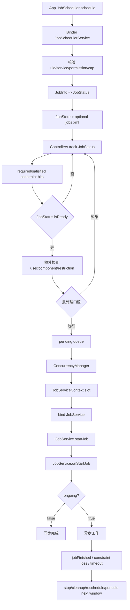
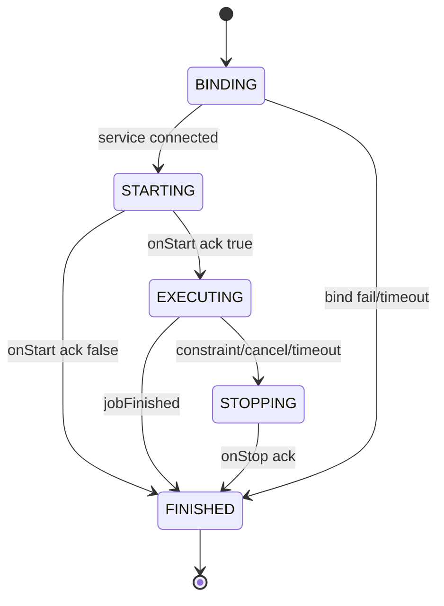

# 121 Android JobScheduler：JobStore、约束控制器与执行生命周期

> 源码版本：Android 11 / API 30 / `android-11.0.0_r48`  
> 学习方式：macOS 只读源码，不要求编译  
> 前置章节：第 119、120 章

---

## 1. 本章从 Sync Job 的通用底座开始

第 119 章把 SyncOperation 交给 JobScheduler。本章不再局限于同步任务，而是回答所有 Job 共用的问题：

- schedule 后 JobInfo 变成了什么？
- persisted Job 如何写入 `jobs.xml` 并跨重启恢复？
- JobStatus 的 required/satisfied constraint 位图怎样工作？
- 电池、网络、时间、Doze、配额等 Controller 如何分工？
- `isReady()` 为什么仍不等于可以立即执行？
- ready Job 为什么还可能被批处理或等并发槽位？
- JobServiceContext 如何绑定应用 Service？
- `onStartJob()` 返回 true/false 分别意味着什么？
- 18 秒、8 秒、10 分钟三个超时属于哪一段？
- `jobFinished()`、`onStopJob()` 和 needsReschedule 怎样闭环？

核心结论：

> JobScheduler 把“声明约束、系统政策、持久恢复、资源公平和跨进程执行”拆成多层状态机；任何单个 ready 标志都不是立即运行承诺。

---

## 2. Android 11 的真实源码位置

当前 checkout 中服务实现位于：

```text
frameworks/base/apex/jobscheduler/service/java/com/android/server/job/
```

主要文件：

```text
JobSchedulerService.java
JobStore.java
JobConcurrencyManager.java
JobServiceContext.java
controllers/JobStatus.java
controllers/*Controller.java
```

旧版本文章常给出 `services/core/java/com/android/server/job`，阅读 Android 11 当前源码应以 APEX 模块为准。

---

## 3. 全链路图



---

## 4. 四类核心对象

| 对象 | 作用 |
|---|---|
| `JobInfo` | 调用者声明的不可变任务描述 |
| `JobStatus` | 系统内部运行状态：身份、时间窗、约束、失败次数、work items 等 |
| `JobStore` | 所有已调度 JobStatus 的主集合及 persisted job 文件 |
| `JobServiceContext` | 一个跨进程执行槽位，负责 bind/start/stop/timeout/cleanup |

JobInfo 不会随着电池变化而修改；变化的是 JobStatus 的 satisfied constraints。

---

## 5. schedule 入口先做防滥用

`scheduleAsPackage()` 在建 JobStatus 前会检查：

- persisted schedule API 调用频率配额；
- 应用是否被禁止启动；
- 每 uid distinct jobs 上限；
- Service 和权限等 prepare 校验。

Android 11 当前 `MAX_JOBS_PER_APP=100`。源码判断使用 `count > MAX` 出现在加入新 Job 前，精确边界应结合替换
和当前计数理解，不宜把常量简单说成全系统并发上限。

---

## 6. uid + jobId 是替换键

同一调用 uid 再 schedule 相同 jobId，会隐式替换旧 JobStatus：旧任务从 Store、Controller、pending/active
关系中拆除，新任务重新准备与跟踪。

jobId 只需在调用 uid 内唯一，不是设备全局 ID。

若 `enqueue(JobInfo, JobWorkItem)` 的 JobInfo 与已有任务完全相同，可走快路径，仅追加 work item。

---

## 7. calling uid 与 source uid

普通应用调度时二者通常相同。系统 `scheduleAsPackage()` 可代表其他 package/user 调度：

- calling uid：真正调用 JobScheduler Binder 的主体；
- source uid/package/user：工作归因和政策计算主体；
- service component uid/user：实际托管 JobService 的身份。

第 119 章 SyncManager 正是以 system_server 调度、但把工作归因给 SyncAdapter 包。

---

## 8. JobStatus 如何生成 required constraints

构造时先取 JobInfo 显式 constraint flags，再按描述加入内部位：

```text
required network -> CONNECTIVITY
minimum latency -> TIMING_DELAY
override deadline -> DEADLINE
trigger content URI -> CONTENT_TRIGGER
```

系统还维护隐式约束：DEVICE_NOT_DOZING、WITHIN_QUOTA、BACKGROUND_NOT_RESTRICTED。

显式约束来自应用，隐式约束来自系统政策。

---

## 9. required 与 satisfied 是两张位图

```java
int requiredConstraints;
int satisfiedConstraints;
```

Controller 只更新自己负责的 bit。最终普通判断近似：

```java
(satisfied & required) == required
```

真实 `isReady()` 还单独处理 quota、dynamic constraints、deadline、Doze 和后台限制，因此不能只做一次位运算就
复刻系统语义。

---

## 10. Android 11 的 Controller 列表

JobSchedulerService 创建：

```text
ConnectivityController
TimeController
IdleController
BatteryController
StorageController
BackgroundJobsController
ContentObserverController
DeviceIdleJobsController
QuotaController
```

此外 ThermalStatusRestriction 作为 JobRestriction，而不是 JobStatus 普通 constraint bit。

---

## 11. 为什么 Controller 分拆

每个系统信号的来源和高效索引不同：

- 网络来自 ConnectivityManager callback；
- 时间使用 AlarmManager 跟踪最近 delay/deadline；
- 电池/存储来自广播或内部状态；
- content trigger 注册 ContentObserver；
- quota 需要 standby bucket 与计时账本；
- idle/Doze 是不同的节能状态。

分拆后，网络变化无需让 BatteryController 理解网络，也不必每秒轮询全部 Job。

---

## 12. Controller 的统一协议

StateController 主要提供：

```text
maybeStartTrackingJobLocked
maybeStopTrackingJobLocked
evaluateStateLocked
reevaluateStateLocked
onAppRemovedLocked / onUserRemovedLocked
```

当负责状态改变时，Controller 更新 JobStatus bit，再调用 listener：

```text
onControllerStateChanged() -> MSG_CHECK_JOB
onRunJobNow(job) -> MSG_JOB_EXPIRED
```

Controller 不直接绑定 JobService。

---

## 13. startTrackingJobLocked 做什么

新 JobStatus 加入 JobStore，记录 enqueueTime，并让每个 Controller 开始跟踪。若替换旧 Job，Controller 先停旧
再跟踪新实例。

系统 ready 后从磁盘恢复的所有 jobs 也会统一 attach 到 Controllers，然后发 MSG_CHECK_JOB。

因此 JobStore 恢复只是“重新拥有描述”，Controller attach 才恢复实时约束状态。

---

## 14. JobStore 的内存索引

JobSet 同时维护：

```text
calling uid -> ArraySet<JobStatus>
source uid  -> ArraySet<JobStatus>
```

普通 API 按调用 uid/jobId 找任务；配额、包生命周期和工作归因经常按 source uid 扫描。

双索引必须在 add/remove 时保持一致，源码对两边结果不一致会 wtf。

---

## 15. 只有 persisted jobs 写磁盘

JobStore 接纳所有任务，但写 `jobs.xml` 时只复制：

```java
if (job.isPersisted()) storeCopy.add(new JobStatus(job));
```

非 persisted job 在 system_server/设备重启后丢失，这是 API 选择的结果。persisted 也只恢复调度描述，不恢复
正在运行的方法栈或应用内存。

---

## 16. jobs.xml 的路径与 AtomicFile

```text
/data/system/job/jobs.xml
```

通过 AtomicFile `jobs` 写入。XML 包含 uid/source、component、priority/flags、约束、periodic/one-off 时间、
backoff、extras 等可恢复字段。

JobWorkItem 与 transient extras 等受可持久化边界限制；persisted Job 的 extras 必须适合 XML/PersistableBundle
语义。

---

## 17. 写盘为何延迟 2 秒

persisted set 变化时 `maybeWriteStatusToDiskAsync()` 向 IoThread 延迟 `JOB_PERSIST_DELAY=2000ms`。

短时间多次 schedule/cancel 可合并成一次全量写，避免在 JobScheduler 全局锁内做磁盘 I/O。

它不是承诺 schedule 返回后 2 秒一定落盘；线程调度与后续变化可影响实际时间。

---

## 18. 写盘如何避免丢更新

写 Runnable 先在 write-schedule 锁下把 `mWriteScheduled=false`，再在全局锁内 clone persisted jobs，随后释放
全局锁写 XML。

若 clone 前后有新变化，它能重新安排下一次写。代价可能是一次冗余写，但避免“变化发生却无人再写”的窗口。

这是典型的快照写盘，不在 I/O 期间冻结所有 schedule。

---

## 19. AtomicFile 仍不是 Job 执行事务

AtomicFile 防止 jobs.xml 半写；但 schedule 返回、Controller 状态、pending queue、应用执行和 XML 落盘不是一个
原子事务。

崩溃时 persisted job 可能按最后成功快照恢复，非 persisted job 消失；应用业务仍必须幂等。

---

## 20. RTC 与 elapsedRealtime 的转换难题

运行时间窗适合 elapsedRealtime，因为不受用户改钟影响；但它不能直接跨重启持久化。JobStore 会保存 UTC
边界，并在启动时转换回新的 elapsed 时间轴。

若当前 RTC 早于 jobs.xml 修改时间，系统认为时钟可能尚未初始化，暂存 UTC bounds，等时钟可信后替换
JobStatus。

这避免 1970 年错误时钟把持久任务误判为全部逾期。

---

## 21. JobStatus.isReady 的第一道门

当前实现首先要求：

- quota 满足，或 dynamic constraints 满足；
- standby bucket 不是 NEVER；
- device not dozing；
- background not restricted；
- deadline satisfied，或所有普通约束满足。

因此 `isConstraintsSatisfied()` 与 `isReady()` 不是同义方法。

---

## 22. deadline 能绕过什么

非周期 job 到 deadline 后，可绕过普通显式约束，如网络、充电、idle、minimum latency 等。

但 deadline 不能绕过 quota/dynamic gate、NEVER bucket、Doze 与后台限制。周期 job 的 deadline 是实现时间窗边界，
不能据此绕过周期任务约束。

“deadline 到了无条件执行”是错误概括。

---

## 23. override 也有软硬区别

shell/debug 可设置：

- `OVERRIDE_SOFT`：把 charging、battery-not-low、storage-not-low、timing-delay、idle 等软约束视为满足；
- `OVERRIDE_FULL`：普通 constraint 判断直接通过。

但 JobSchedulerService 的 user、component、active/pending 等额外条件仍存在。force 命令不是绕过所有系统安全与
对象有效性检查。

---

## 24. ready 之后的第二道门

`isReadyToBeExecutedLocked()` 还检查：

```text
Job 仍存在于 JobStore
calling/source user 已 started
source uid 当前不在 backup
没有 JobRestriction
不已 pending
不已 active
Service component 仍存在且应用不为 bad
```

所以约束位全部绿了，只能说明第一层 eligibility。

---

## 25. 为什么开始时重查组件

Job 可排队数小时，期间包可能更新、禁用、卸载或变成 bad process。系统在真正 pending 前查询 PackageManager 的
ServiceInfo，并通过 ActivityManagerInternal 判断 app bad。

schedule 时验证一次不足以支撑未来执行。

包/用户移除广播也会取消相关 jobs，并通知每个 Controller 清理索引。

---

## 26. ready 之后还可能被批处理

当系统当前没有运行 Job 时，`maybeQueueReadyJobsForExecutionLocked()` 会对非 ACTIVE bucket 的普通 ready jobs
强制 batching。

Android 11 默认：

```text
至少 5 个 ready non-active jobs 才成批放行
或最早被强制批处理约 31 分钟后放行
```

失败重试任务不走这项强制 batching；restricted jobs 总要批处理。

这些是可调内部常量，不是 API SLA。

---

## 27. mPendingJobs 不是 JobStore

JobStore 保存所有 scheduled jobs；`mPendingJobs` 只保存已经通过当前政策、正等待执行槽位的 jobs。

Controller 状态改变时，Handler 可能清空并重算 pending queue。pending comparator 优先 adb override，其次按
enqueueTime 排序。

pending 仍不代表已经 bind 应用。

---

## 28. Controller 变化为何先进 Handler

`onControllerStateChanged()` 只发送 `MSG_CHECK_JOB`。JobHandler 在统一锁下：

1. 停止已不 ready 的 active jobs；
2. 扫描/增量评估 ready jobs；
3. 构建有序 pending queue；
4. 调用并发管理器。

这避免各种广播/网络 callback 线程同时直接改执行槽位。

---

## 29. 约束丢失会停止正在运行的 Job

`stopNonReadyActiveJobsLocked()` 扫 active contexts：如果 `running.isReady()` 变 false，发送 stop reason
`CONSTRAINTS_NOT_SATISFIED`；restricted dynamic constraint 另用 restricted bucket reason。

ready 不是只在启动前检查。网络断开、电池变低、进入 Doze 等可中断执行，应用需保存进度。

---

## 30. 最多 16 个 Context 不等于并发 16

服务启动到 ready phase 时预创建 `MAX_JOB_CONTEXTS_COUNT=16` 个 JobServiceContext。

这只是绝对槽位池上限。`JobConcurrencyManager` 还根据内存压力、前后台工作数量、优先级、包负载和 context
preferred uid 计算实际分配。

某一应用更不能推断自己可占满 16 个槽。

---

## 31. ConcurrencyManager 的任务

`assignJobsToContextsLocked()`：

- 读取当前运行 Job 与可用 context；
- 统计 pending/active 前后台 jobs；
- 根据 normal/moderate/low/critical 内存状态选择 max counts；
- 给 pending job 找空闲槽；
- 必要时以更高优先级 Job 抢占低优先级 Job；
- 维护 preempt 后 context 的 preferred uid，减少跨 uid 抖动；
- 最后调用 context.executeRunnableJob()。

公平性和资源保护发生在 constraint ready 之后。

---

## 32. JobServiceContext 是可复用执行槽

每个 Context 同一时刻最多维护一个：

```text
mRunningJob
mRunningCallback
JobParameters
IJobService Binder
wake lock
state verb
timeout message
```

完成后清空并 `mAvailable=true`，供下一个 job 使用。回调携带特定 JobCallback 对象，用于识别旧任务迟到消息。

---

## 33. 五态状态机



源码状态名为 VERB_BINDING/STARTING/EXECUTING/STOPPING/FINISHED。

---

## 34. executeRunnableJob 的准备

Context 在全局锁下确认 available，建立 JobCallback 和 JobParameters，填入：

```text
jobId
persistable/transient extras
ClipData grants
deadlineExpired
triggeredUris/authorities
Network
```

随后进入 BINDING，安排 18 秒超时，并 `bindServiceAsUser()` 到 JobInfo 指定组件。

---

## 35. bind flag 与进程重要性

绑定使用：

```text
BIND_AUTO_CREATE
BIND_NOT_FOREGROUND
BIND_NOT_PERCEPTIBLE
```

Job 允许系统启动宿主 Service，但不会仅因普通 Job bind 就把进程当用户可感知前台。实际 OOM/调度保护仍由
AMS binding 与执行状态综合计算。

---

## 36. wake lock 在何时持有

Service connected 后创建 PARTIAL_WAKE_LOCK，WorkSource 归因 source uid（支持时形成 source uid → system
JobScheduler work chain），然后调用 startJob。

cleanup 时释放 wake lock 并 unbind。bind 等待阶段尚未拿此 context wake lock；执行期间系统负责保持 CPU，
但不保证网络、屏幕或其他约束永远不变。

---

## 37. JobService 回调运行线程

`IJobService.startJob()` 到达应用端 `JobServiceEngine`，再投递到应用主线程调用 `JobService.onStartJob()`；
`onStopJob()` 同样在主线程。

因此这两个方法必须快速返回。耗时 I/O/网络应交给工作线程、Executor 或协程，并在完成时调用
`jobFinished()`。

JobScheduler 不会自动把开发者的 onStartJob 放到后台线程。

---

## 38. onStartJob 返回 false

应用 Transport 把返回值回送为 `acknowledgeStartMessage(jobId, ongoing)`。

false 表示：工作已在 onStartJob 返回前同步完成。Context 从 STARTING 快进 cleanup，不会等待
`jobFinished()`。

false 不是“拒绝本次、以后重试”。需要重调度应依赖明确失败/stop 协议或重新 schedule。

---

## 39. onStartJob 返回 true

true 只表示异步工作仍在进行。Context 进入 EXECUTING 并安排执行时间片。

应用完成后必须调用：

```java
jobFinished(params, wantsReschedule);
```

否则系统最终按执行超时发送 stop。返回 true 本身不等于任务成功，也不自动续期。

---

## 40. 三组超时必须分开

Android 11 当前常量：

| 阶段 | 时间 | 后果 |
|---|---:|---|
| BINDING | 18 秒 | bind 未完成，丢弃且不重排 |
| STARTING/STOPPING 回执 | 8 秒 | start 超时不重排；stop 超时重排 |
| EXECUTING | 最多 10 分钟 | 先发送 onStopJob，不是直接当完成 |

当前 `JobServiceContext` 的 EXECUTING timeout 直接使用固定 10 分钟。服务层另有
`getMaxJobExecutionTimeMs()` 取 quota 剩余执行时间与 10 分钟的较小值，但在本版本主要供
ConnectivityController 判断“按当前带宽能否在可用执行预算内传完估算字节”，不要把它误读成 Context timeout
消息本身已动态缩短。

---

## 41. 为什么 start 与 stop 超时后果不同

start 没响应说明应用连“是否开始异步工作”都无法确认，当前实现 cleanup no-retry；stop 没响应时 Job 已经确实
执行过，工作可能未完成，因此 cleanup requests reschedule。

这不是业务成功判断，而是系统面对失联客户端的保守恢复策略。

---

## 42. 执行超时不是立刻 kill

EXECUTING 超时后：

1. JobParameters stop reason 设为 TIMEOUT；
2. 状态转 STOPPING；
3. 调用 `IJobService.stopJob()`；
4. 等应用 onStopJob 的 8 秒回执；
5. 根据返回 reschedule；
6. 回执再超时才强制 cleanup 并重排。

业务线程应响应停止，不要假设系统会安全中断任意 Java 代码。

---

## 43. onStopJob 返回值

`onStopJob(params)` 返回 true，表示希望系统以后重调度这项工作；false 表示不需自动重排。

它不代表取消 stop，也不会让当前工作继续合法运行。收到 stop 后，应用必须尽快停止工作、保存 checkpoint，避免
旧线程与未来新实例并发写数据。

---

## 44. jobFinished 的 stale callback 防护

Context 可复用，旧应用 Binder 消息可能迟到。每次执行创建新的 `JobCallback`，回调时比较：

```java
mRunningCallback == callback
```

不匹配则忽略或在 work API 抛 SecurityException。timeout message 也携带 callback token，旧任务 timeout 不会
误杀 context 上的新 Job。

---

## 45. cleanup 的完整职责

`closeAndCleanupJobLocked()`：

- 固化首个 stopped reason/time；
- 更新 package tracker、statsd 与 BatteryStats；
- 释放 wake lock；
- unbind Service；
- 清 running job/callback/params/service；
- 取消 timeout；
- context 设 available；
- 通知 JobSchedulerService `onJobCompletedLocked(job, reschedule)`。

只有最后一步之后，Store 中的任务才能进入完成/重排处理。

---

## 46. 一次性任务完成与失败重排

完成回调中，Service 先 stopTracking：从 JobStore 与 Controllers 移除旧实例。

若 needsReschedule，`getRescheduleJobForFailureLocked()` 建新 JobStatus，增加 failure count，依据 JobInfo backoff
policy 计算新时间窗，再 startTracking。

新实例不是把旧 active context 原地改回 pending。

---

## 47. 周期任务完成后总会生成下一窗口

periodic job 本次完成且无 failure reschedule 时，也会调用 `getRescheduleJobForPeriodic()` 建下一周期 JobStatus。

移除旧 periodic 时暂不立刻从 persisted 文件写掉，避免设备恰在“删旧、加新”之间关机导致周期任务永久丢失；
新实例加入后再由 JobStore 快照持久化。

这是跨两步更新时的耐久性技巧。

---

## 48. periodic 不是固定频率闹钟

周期 Job 有 interval 与 flex window。系统在窗口中结合约束、quota、batch 和并发资源选择时机；本次延迟不会
强制补跑每个错过刻度。

若业务需要严格日历时刻或每次事件不丢失，应设计自己的服务器/本地状态，而不是把 periodic Job 当精确 cron。

---

## 49. backoff 从何时开始

一次性失败重排按 JobInfo 的 linear/exponential policy、初始 backoff 和失败次数生成新的 earliest runtime。

JobScheduler backoff 与第 119 章 SyncManager EndPoint backoff 可以同时存在：SyncManager 可能自行重建 Sync Job，
JobScheduler 也有通用 needsReschedule 机制。读 SyncJobService 时要看它如何把 stop reason 转回 SyncManager，不能
把两层退避简单相加或混称一个字段。

---

## 50. JobWorkItem 的所有权

enqueue 的 work items 在 JobStatus 中分 pending/executing。JobService 用 `dequeueWork()` 领取，处理后
`completeWork()`。

若没有 pending 且没有 executing work，最后一次 dequeue 可自动结束 Job。stop/replacement 时未完成 work 可
转移到 incoming/rescheduled job。

应用需要以 workId/业务 id 做幂等，因进程崩溃后 executing item 可能再次出现。

---

## 51. ContentObserverController 的位置

JobInfo 可声明 trigger content URIs。ContentObserverController 注册观察者、累积 changed URI/authority，并用
update delay/max delay 合并变化，满足 CONTENT_TRIGGER constraint。

它与第 118 章 ContentObserver 使用同一底层变化机制，但消费结果是“让 Job 具备执行资格”，不是直接在观察者
回调中运行应用 JobService。

---

## 52. Quota 与 App Standby

QuotaController 根据 source package/user、standby bucket 和历史执行计时判断 `WITHIN_QUOTA`。ACTIVE、WORKING
SET、FREQUENT、RARE、RESTRICTED/NEVER 的机会不同，并有 parole/前台豁免等动态状态。

JobInfo constraints 全部满足仍可能因 quota 不 ready；deadline 也不能绕过 quota。

第 122 章将单独深入其计时账本和窗口算法。

---

## 53. Doze 有两层容易混淆

- `IdleController` 对应应用显式 `setRequiresDeviceIdle(true)`：设备达到维护意义上的 idle 才满足；
- `DeviceIdleJobsController` 管系统 Doze 下 Job 能否运行，维护隐式 DEVICE_NOT_DOZING 与白名单/前台例外。

“要求 idle”与“不能在 Doze 运行”看似反向，却属于不同政策维度。

---

## 54. 热限制为何不是普通 constraint

ThermalStatusRestriction 可基于热状态和 Job 优先级限制执行。JobRestriction 在 service 层额外检查，某些高优先级
Job可不受一般 restriction。

这说明 JobStatus 位图不是全部政策的唯一容器；新增跨任务系统政策可作为 Restriction 或并发策略实现。

---

## 55. “精确定时”为什么不存在

minimum latency 只是不早于，deadline 只在允许范围内放宽普通约束。之后仍有：

```text
user started
component usable
Doze/background/quota
thermal restriction
batch threshold
pending ordering
concurrency slots
process bind/start latency
```

因此 JobScheduler 是资源友好的最终执行调度器，不是毫秒级 timer API。

---

## 56. 一个 Sync Job 的落地推演

1. SyncManager `scheduleAsPackage()` 指向 system SyncJobService，owner 归因 Adapter 包；
2. 生成 JobStatus，写入 JobStore；persisted 时 2 秒合并写 jobs.xml；
3. Connectivity/Time/Quota 等 Controller 跟踪；
4. 满足后还检查 user、component、restriction 与 batch；
5. 加入 pending queue；
6. ConcurrencyManager 分配一个 JobServiceContext；
7. context bind system_server 内 SyncJobService；
8. onStartJob 把 SyncOperation 发给 SyncHandler并返回 true；
9. SyncManager 再 bind 应用 SyncAdapter；
10. 同步完成后 SyncJobService.callJobFinished → JobService.jobFinished；
11. JobServiceContext cleanup；
12. 一次性 Job 移除或按 needsReschedule 新建。

这里有两次 Service 边界：JobScheduler→SyncJobService，以及 SyncManager→应用 SyncAdapter。

---

## 57. 常见误解集中纠正

### 误解一：JobStatus.isReady=true 就立刻 onStartJob

错误。还有额外有效性、batch、pending 排序、quota/restriction 与并发分配。

### 误解二：16 个 Context 表示每个应用并发 16

错误。16 是系统绝对槽池，实际受动态前后台配额和优先级限制。

### 误解三：persisted 保存运行现场

错误。只保存可恢复任务描述。

### 误解四：deadline 到达可绕过任何条件

错误。quota、NEVER、Doze、后台限制及 service 层条件仍有效。

### 误解五：onStartJob 返回 true 表示成功

错误。表示异步仍在运行，最终必须 jobFinished 或被 stop。

### 误解六：执行 10 分钟后系统直接杀进程

错误。先调用 onStopJob，再等待 8 秒回执。

### 误解七：onStopJob 返回 true 可继续当前工作

错误。只表示希望未来重排，当前工作必须停止。

### 误解八：jobs.xml 每次 schedule 同步写完再返回

错误。默认延迟 2 秒在 IoThread 写全量快照。

---

## 58. 源码阅读路线

```text
frameworks/base/apex/jobscheduler/service/java/com/android/server/job/
  JobSchedulerService.java
    scheduleAsPackage / startTrackingJobLocked
    isReadyToBeExecutedLocked
    queue/maybeQueueReadyJobsForExecutionLocked
    onJobCompletedLocked
  JobStore.java
    JobSet / jobs.xml / RTC conversion / async write
  controllers/JobStatus.java
    required/satisfied / isReady / deadline / override
  controllers/*Controller.java
  JobConcurrencyManager.java
  JobServiceContext.java

frameworks/base/apex/jobscheduler/framework/java/android/app/job/
  JobInfo.java / JobScheduler.java / JobService.java / JobServiceEngine.java
```

---

## 59. macOS 只读练习一：证明 ready 有多层

```bash
cd /Users/ninebot/androidSource

sed -n '1210,1330p' \
  frameworks/base/apex/jobscheduler/service/java/com/android/server/job/controllers/JobStatus.java

sed -n '2200,2290p' \
  frameworks/base/apex/jobscheduler/service/java/com/android/server/job/JobSchedulerService.java
```

分别列出 JobStatus.isReady 与 isReadyToBeExecutedLocked 的条件，再加上 batching 和 context 分配，形成四道门。

---

## 60. macOS 只读练习二：追持久化快照

```bash
rg -n "JOB_PERSIST_DELAY|maybeWriteStatusToDiskAsync|storeCopy|writeJobsMapImpl" \
  frameworks/base/apex/jobscheduler/service/java/com/android/server/job/JobStore.java

rg -n "rtcGood|persistedUtcTimes|convertRtcBoundsToElapsed" \
  frameworks/base/apex/jobscheduler/service/java/com/android/server/job/{JobStore,JobSchedulerService}.java
```

回答：为什么写盘前 clone、为何先允许下一次 write schedule、错误 RTC 又为何不能直接算 elapsed deadline。

---

## 61. macOS 只读练习三：手算状态机

```bash
rg -n "VERB_|OP_.*TIMEOUT|handleStartedLocked|handleCancelLocked|handleOpTimeoutLocked" \
  frameworks/base/apex/jobscheduler/service/java/com/android/server/job/JobServiceContext.java
```

分别推演：onStart false、onStart true 后正常 finished、执行中网络丢失、bind 超时、stop 回执超时。

---

## 62. macOS 只读练习四：列 Controller

```bash
sed -n '1428,1462p' \
  frameworks/base/apex/jobscheduler/service/java/com/android/server/job/JobSchedulerService.java

rg -n "maybeStartTrackingJobLocked|set.*ConstraintSatisfied" \
  frameworks/base/apex/jobscheduler/service/java/com/android/server/job/controllers
```

为每个 constraint 标出负责 Controller、信号来源和约束丢失时是否可能停止 active job。

---

## 63. 可选设备观察

```bash
adb shell dumpsys jobscheduler
adb shell cmd jobscheduler get-job-state PACKAGE JOB_ID
```

在 dump 中比较 registered、ready、pending、active contexts、unsatisfied constraints 和 standby bucket。不同版本
shell 子命令可能不同；无设备完全不影响源码学习，也无需编译 AOSP。

---

## 64. 面试式自测

1. JobInfo 与 JobStatus 的职责区别是什么？
2. JobStore 为什么按 calling uid 和 source uid 双索引？
3. 哪些 Job 写 jobs.xml？默认何时写？
4. RTC 不可信时怎样处理持久时间窗？
5. required/satisfied 位图之外还有哪些 ready 门槛？
6. deadline 不能绕过哪些隐式条件？
7. Controller 为什么不直接启动 Service？
8. ready job 为什么可能被批处理 31 分钟？
9. mPendingJobs 与 JobStore 有何区别？
10. 16 个 context 为何不等于固定并发 16？
11. JobService 的 onStartJob 在哪个线程？
12. true/false 返回各代表什么？
13. 18 秒、8 秒、10 分钟分别约束什么？
14. constraint loss 如何通知应用停止？
15. periodic job 完成为何以新 JobStatus 表示下一窗口？

---

## 65. 一份可以复述的答案

JobSchedulerService 校验调用身份、Service 和调度配额后，把 JobInfo 转成 JobStatus，以 uid+jobId 作为替换键
加入 JobStore，并交给 Connectivity、Time、Idle、Battery、Storage、Background、ContentObserver、DeviceIdle 和
Quota Controllers 增量维护约束位。只有 persisted Job 会经 IoThread 默认延迟 2 秒写入 AtomicFile
`/data/system/job/jobs.xml`；重启时用 UTC 边界重建 elapsed 时间窗，并重新 attach Controllers。
JobStatus.isReady 处理显式约束、deadline、quota、Doze 和后台限制；服务层还检查 Job 是否存在、user started、
backup/restriction、pending/active 和 component 可用，再经过非 active batching、pending 排序及动态并发槽分配。
获得槽位后 JobServiceContext 进入 BINDING→STARTING→EXECUTING→STOPPING→FINISHED 状态机，bind 应用
JobService、持 wake lock 并在应用主线程调用 onStartJob。false 表示同步完成；true 表示异步继续且必须
jobFinished。绑定限 18 秒，start/stop 回执限 8 秒，执行时间片最多 10 分钟且还受 quota 上限；约束丢失或超时
先触发 onStopJob，其返回值仅决定未来是否重排。完成后 Context 释放资源，Service 用新 JobStatus 表示失败
重试或下一周期窗口。

---

## 66. 复读审查：最容易把“门”合并的地方

初稿复读后，专门把执行资格拆成四层：

```text
constraint ready
-> service-level usable
-> batching/pending
-> concurrency/context
```

并修正了四个易混点：

1. deadline 只可放宽普通约束，不能绕过 quota、NEVER、Doze 与后台限制，periodic deadline 更不是强制执行。
2. JobService `onStartJob/onStopJob` 在应用主线程；JobScheduler 提供执行窗口，不自动提供业务后台线程。
3. 10 分钟 Context 超时先进入 STOPPING 并等 8 秒回执，不是直接 kill；另一个 quota 剩余时间 API 在当前
   版本主要供 ConnectivityController 做网络传输可行性估算，不应混成同一 timeout。
4. persisted Job 的 RTC/elapsed 转换用于恢复描述，绝不恢复正在运行的 JobService 代码和内存 checkpoint。

同时用当前源码确认 Android 11 常量为 bind 18 秒、消息回执 8 秒、执行时间片 10 分钟、JobStore 写盘合并 2
秒、非 active ready batch 默认 5 个或最长约 31 分钟；这些均是内部可调实现而非 SDK 时间保证。

---

## 67. 本章小结

1. Android 11 JobScheduler 实现在 APEX jobscheduler 模块。
2. JobStatus 把声明、实时约束与执行历史叠加到 JobInfo 之上。
3. Controllers 各管一个信号，Handler 统一重算执行候选。
4. persisted jobs 以 jobs.xml 快照恢复，运行现场不持久化。
5. ready、usable、batched、pending、assigned、active 是不同阶段。
6. 并发槽受内存、前后台数量、优先级和公平策略动态约束。
7. JobServiceContext 用跨进程五态状态机和三类超时约束不可信应用。
8. 完成、停止、失败重试和下一周期都通过旧 JobStatus teardown 与新实例建立闭环。

下一章深入 `QuotaController` 与 App Standby：研究各 bucket 执行时长/次数/session 限额、计时事件账本、滚动
窗口、前台豁免、parole、restricted bucket 及 quota 变化如何停止正在运行的 Job。
