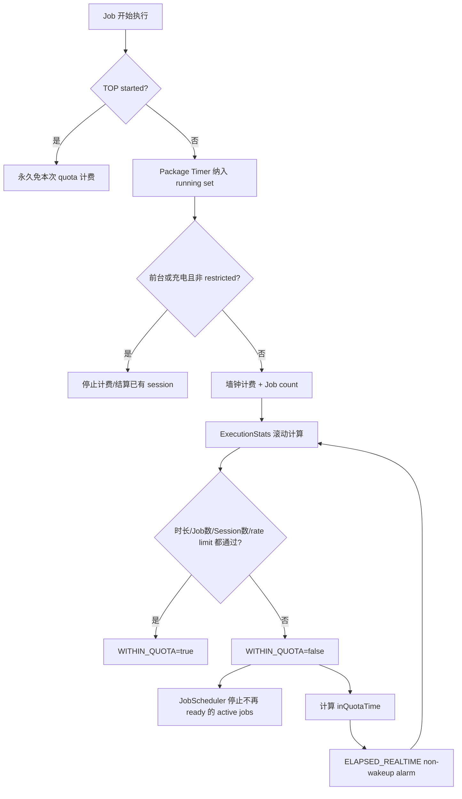

# 122 Android QuotaController：App Standby、滚动配额与计时账本

> 源码版本：Android 11 / API 30 / `android-11.0.0_r48`  
> 学习方式：macOS 只读源码，不要求编译  
> 前置章节：第 121 章

---

## 1. 本章研究 Job 为什么“明明 ready 还在等”

第 121 章看到 `WITHIN_QUOTA` 是 JobStatus 的隐式约束。本章深入它的生产者 `QuotaController`：

- App Standby bucket 如何决定滚动窗口？
- 为什么每个 bucket 都有 10 分钟，却等待时间差异很大？
- 时长、Job 次数、Session 次数与短期 rate limit 怎样同时限制？
- 多个并行 Job 是按各自时长相加，还是按墙钟时间计费？
- TimingSession 为什么要合并相邻执行段？
- TOP、前台和充电时，是放行、免计费还是两者兼有？
- RESTRICTED 与 NEVER 为什么特殊？
- 用尽 quota 时怎样停止 active Job？
- 系统如何算出“什么时候重新有额度”，又如何唤醒检查？
- 哪些状态只是内存账本，重启后怎样处理？

核心认识：

> QuotaController 不是一个简单倒计时器，而是以 package+user 为账户、以 elapsed realtime 的滚动执行段为账本，同时执行四类额度门槛。

---

## 2. 总体流程



---

## 3. 配额账户的键

QuotaController 主要按：

```text
sourceUserId + sourcePackageName
```

保存 tracked jobs、Timer、TimingSessions、ExecutionStats cache 和 in-quota alarm。

不是按 jobId 单独计费，也不是整个 uid 永远共享一份 package 账本。不过前台状态按 uid 观察，一个共享 uid 下的
多个包会通过 uid→packages cache 更新各自 Timer。

---

## 4. source 身份为什么重要

system_server 可替其他包 `scheduleAsPackage()`。Quota 应归因真正受益/执行工作的 source package，而不是把所有
系统代理 Job 都算给 Android 系统包。

这与第 121 章 JobStore 的 calling uid/source uid 双索引、WorkSource 归因保持一致。

---

## 5. App Standby bucket

JobScheduler 内部把 UsageStats bucket 映射为索引：

```text
ACTIVE
WORKING_SET
FREQUENT
RARE
NEVER
RESTRICTED
```

应用越少被用户使用，窗口越长、Job/Session 次数越少。bucket 变化立即应用新配额，不会等旧窗口结束。

---

## 6. 默认滚动窗口表

Android 11 当前默认值：

| Bucket | 滚动窗口 | 窗口内可计费执行时长 | Job 数上限 | Session 数上限 |
|---|---:|---:|---:|---:|
| ACTIVE | 10 分钟 | 10 分钟 | 75 | 75 |
| WORKING_SET | 2 小时 | 10 分钟 | 120 | 10 |
| FREQUENT | 8 小时 | 10 分钟 | 200 | 8 |
| RARE | 24 小时 | 10 分钟 | 48 | 3 |
| NEVER | 无 | 0 | 0 | 0 |
| RESTRICTED | 24 小时 | 10 分钟 | 10 | 1 |

所有值来自可调 QcConstants，不是稳定 SDK 保证。

---

## 7. 为什么 ACTIVE 的 10/10 近似不限时

ACTIVE 窗口长度与允许时间同为 10 分钟。只要执行时间随窗口左边界持续滚出，应用通常可连续运行，真正还受
全局 24 小时最大执行量和短期次数限制。

源码类注释把 ACTIVE 概括为 jobs can run indefinitely，指 bucket window 的持续滚动效果，不代表绕过
JobServiceContext 10 分钟单次时间片或其他系统约束。

---

## 8. 四套门槛同时成立

包在 quota 内要求：

```text
remaining execution time > 0
AND bucket-window Job count 未达上限
AND bucket-window Session count 未达上限
AND short rate-limit Job/Session count 未达上限
```

任何一项耗尽，所有普通后台 Job 的 `WITHIN_QUOTA` 都会变 false。

---

## 9. 两层执行时长约束

剩余时间计算：

```java
min(
  allowedTimePerPeriod - executionTimeInBucketWindow,
  maxExecutionTime - executionTimeIn24Hours
)
```

默认每 bucket window 可计费 10 分钟；额外的 24 小时 `MAX_PERIOD_MS` 中最大默认 4 小时。

第二层避免 ACTIVE 或频繁换 bucket 的应用在一天内无限占用 Job 资源。

---

## 10. Job count 与 Session count 的差别

Job count 统计计费阶段启动/纳入的后台 Job 个数。多个并发 Job会让 count 增加多个。

Session 表示包的一段连续计费墙钟区间；多个 Job 重叠执行仍可属于同一个 Session。

两者一起防止：

- 一个长 Job 独占时间；
- 大量极短 Job 绕过时长；
- 频繁唤醒、启动、停止造成系统开销。

---

## 11. 短期 rate limit

无论 bucket，当前默认短期窗口内最多：

```text
20 个 Job
20 个 TimingSession
```

当前可执行常量 `DEFAULT_RATE_LIMITING_WINDOW_MS = 1 minute`。

类头注释仍写 “past 10 minutes”，与当前常量不一致。源码学习应以实际字段初始化和计算为准，并把注释视为可能
漂移的辅助说明。

---

## 12. 短期窗口不是精确滑动列表

`incrementJobCount()` 维护：

```text
jobRateLimitExpirationTimeElapsed
jobCountInRateLimitingWindow
```

窗口过期后，下次增量先清零并从 now 建新窗口。Session 类似。

这更接近固定起点计数窗口，不是为每个 Job 保存时间戳并做严格逐事件滑动。因此源码注释承认可能含少量 stale
entries。

---

## 13. TimingSession 数据结构

```java
TimingSession(
    long startTimeElapsed,
    long endTimeElapsed,
    int bgJobCount)
```

它保存某包一段计费区间与期间纳入计费的后台 Job 数。时间基准是 elapsed realtime，适合计算滚动窗口，不受用户
改墙钟影响。

---

## 14. Timer 为什么按 package 共用

一个 package 同时运行三个 Job：若按每个 Job 各计 5 分钟，总时长会算 15 分钟；QuotaController 实际以
Package Timer 的墙钟区间计时，重叠运行 5 分钟只产生约 5 分钟 session，但 bgJobCount 可为 3。

这避免并发任务把时间额度按 CPU 核数式重复扣除，同时次数额度仍惩罚大量 Job。

---

## 15. Timer 的两层状态

`mRunningBgJobs` 保存当前运行且非 TOP-started 的 jobs；`mBgJobCount>0` 表示 Timer 正在主动计费。

充电或 uid 前台时，Job仍留在 running set，Timer 可以被动引用计数却不 active。离开免费状态后，如仍有 jobs，
从当下重新开始计费。

“被跟踪”与“正在计费”不是同义词。

---

## 16. Job 开始怎样入账

`prepareForExecutionLocked()`：

1. 若 source uid 当前是 TOP，加入 `mTopStartedJobs`，不启 Timer；
2. 否则取得 package Timer；
3. 把 Job 放入 running set；
4. 若应计费，Job count 加一；
5. 第一项 Job 启动墙钟 Timer；
6. 使 ExecutionStats cache 过期；
7. 安排 quota cutoff message。

---

## 17. TOP-started 是“粘住”的本次豁免

只在 Job 开始执行的瞬间检查 uid proc state `<= PROCESS_STATE_TOP`。一旦进入 `mTopStartedJobs`，即使应用随后
离开 TOP，该 Job仍允许完成且不计 quota。

这是为了保证用户直接触发的工作不因 Activity 很快失焦被中断。

它只针对已经以 TOP 启动的 Job，不让该包之后所有 Job永久免费。

---

## 18. 一般前台豁免是动态的

UidObserver 以 `PROCESS_STATE_FOREGROUND_SERVICE` 为边界：uid 达到该状态或更重要时，记入
`mForegroundUids`，包内 Job quota ready，Timer 结算当前 session 并暂停计费。

离开前台时，如果 jobs 仍运行，Timer 从当前时刻重新开始，Job count 可能再次增加。

这与 TOP-started 的粘性语义不同。

---

## 19. 前台不等于所有约束都满足

`isWithinQuotaLocked(job)` 对前台直接返回 true，只满足 `WITHIN_QUOTA` 隐式约束。

网络、充电显式要求、存储、Doze、minimum latency、component 有效性和并发槽位仍由其他层决定。

“前台 Job 不受 quota”不能简化成“前台 schedule 立即执行”。

---

## 20. 充电时的普通 bucket

收到 `ACTION_CHARGING` 后，QuotaController 认为设备处于 quota-free 状态。非 RESTRICTED 包：

- `WITHIN_QUOTA=true`；
- Timer 结算充电前的 session；
- 充电期间不继续扣 quota；
- 拔电后仍运行的 Job 从拔电时重新计费。

注意它自己的 charging 定义与 BatteryController 可能不同，不能复用一个布尔值猜测。

---

## 21. RESTRICTED 充电也不完全免费

源码特意排除：

```java
if (charging && bucket != RESTRICTED) return true;
```

Timer 的 `shouldTrackLocked()` 也让 RESTRICTED 在充电时继续受计费逻辑影响。因为 restricted bucket 是显式强
限制状态，还可能由其他 Controller 添加动态约束。

所以“插电时所有 Job quota 无限”在 Android 11 不准确。

---

## 22. NEVER 直接不在 quota

`standbyBucket == NEVER_INDEX` 时返回 false，不计算 stats，也不安排恢复 quota alarm。

NEVER 不是“额度等一天恢复”，而是当前 bucket 下不应运行普通 Job，直到 bucket/豁免状态发生变化。

---

## 23. effective bucket 与 real bucket

JobStatus 可因 foreground exemption 等得到比包真实 bucket 更宽松的 effective bucket。更新同包 jobs 时：

- 先按 real bucket 计算普通包 quota；
- TOP-started 始终 true；
- effective bucket 不同的 exempt job 单独计算。

计算恢复 alarm 则使用 real bucket，避免一个被提升的 Job让同包其他普通 Job错误提前恢复。

---

## 24. App Standby bucket 改变立即生效

StandbyTracker 在 BackgroundThread 收到变化后，锁内更新所有 JobStatus 的 real bucket，重排 active Timer cutoff，
重新计算 quota bit。

进入或离开 RESTRICTED 还通知 JobSchedulerService，因为 restricted 会影响动态约束，不只是 quota 数字。

新 bucket 会用同一份过去 24 小时 sessions 重新套不同窗口和次数上限。

---

## 25. ExecutionStats 是派生缓存

每 package 为每 bucket 保留一个 `ExecutionStats`：

```text
window/max-period execution time
window/max-period bg Job count
session count
short rate counts/expiration
inQuotaTime
expirationTime
当前 window/limit 配置快照
```

真正历史是 TimingSessions；ExecutionStats 可失效重算。

---

## 26. 为什么同包缓存每个 bucket 一份

bucket 随用户行为变化。若只有“当前 bucket”统计，切换时就要从头建对象；数组缓存允许用相同 sessions 快速按 2h、
8h、24h 等窗口分别计算。

常量改变或新 session 加入时，会把该包所有 bucket 的 cache 标过期。

---

## 27. 滚动窗口如何裁剪 session

设窗口起点 `now-windowSize`：

- session 完全在起点前：忽略；
- session 跨越起点：只计算起点后的部分；
- session 完全在窗口内：计算全部；
- 逆序扫描，遇到连 24h 最大窗口也已结束的 session 可停止。

因此 quota 会随着旧执行片段逐毫秒滚出而逐步恢复，不是到整点一次性刷新。

---

## 28. Session count 为什么会合并

统计 bucket session count 时，若相邻执行段间隔不超过默认 5 秒，视为同一 session。

这样约束短暂波动、快速 Job 切换或 framework teardown/restart 不会人为制造大量 session，避免 3 次/24h 之类
严格上限被实现噪声迅速耗尽。

短期 rate-limit session count 在 Timer emit 时增加，和窗口内合并统计的实现路径需区分。

更精确地说，5 秒合并只发生在 `updateExecutionStatsLocked()` 重算
`sessionCountInWindow` 时；每次 `emitSessionLocked()` 仍会调用 `incrementTimingSessionCount()`，短期 rate
counter 不应用这层合并。

---

## 29. 短期计数为何写入所有 bucket cache

`incrementJobCount()` 与 `incrementTimingSessionCount()` 遍历该包的整组 `ExecutionStats[]`，让每个 bucket
cache 的短期计数同时增加。

短期 1 分钟 rate limit 明确是 regardless of bucket；应用从 RARE 切到 ACTIVE 不能借切 bucket 清掉刚刚制造
的大量 Job/Session。bucket 专属窗口统计会按新窗口重算，短期防刷计数则跨 bucket 保持一致。

---

## 30. 当前 active Timer 怎样进入统计

active session 尚未写入 mTimingSessions，`updateExecutionStatsLocked()` 会临时加入：

```text
duration = now - timer.start
bgJobCount = timer count
```

但不把 active session计入 sessionCountInWindow，避免一个正在执行的 session 达到上限后阻止同包新的并行 Job加入
当前 session。

时长和 Job 次数仍实时消耗。

---

## 31. quota buffer 防止边界抖动

默认允许 10 分钟，但从 out-of-quota 回到 in-quota 时使用：

```text
10 minutes - 30 seconds buffer
```

即需要恢复约 30 秒可用额度才重新放行，而非刚滚出 1ms 就启动、立刻又耗尽。

buffer 只影响“从外回内”的阈值，不把已经在 quota 内的包平白减少 30 秒可运行时间。

---

## 32. 算 inQuotaTime 的原则

ExecutionStats 在重算时求最晚恢复时间：

- 时长超额：找导致额度恢复的 session 片段滚出窗口时间；
- Job count 超额：相关 session end + bucket window；
- Session count 超额：相关 session end + window；
- 短期 rate limit：对应 rate-limit expiration；
- 取各门槛要求的最大值。

只有所有门同时恢复才能 `WITHIN_QUOTA=true`。

---

## 33. InQuotaAlarm 为什么是 non-wakeup

使用 `AlarmManager.ELAPSED_REALTIME`，不是 WAKEUP。系统不会只为后台包恢复 quota 精确唤醒设备；设备下次醒来时可
稍晚处理。

这符合 JobScheduler 的批处理和省电目标。inQuotaTime 是最早重新检查时刻，不是 Job 的执行 SLA。

---

## 34. 多包 alarm 用优先队列合并

InQuotaAlarmListener 为每个 `(user, package)` 保存一个恢复时间，PriorityQueue 头是最早者，AlarmManager 只设
下一次总 alarm。

alarm 触发后，弹出所有已到期 package，发 `MSG_CHECK_PACKAGE`，再安排下一头部。

这样不用为每个包注册独立 AlarmManager listener。

---

## 35. alarm 的最小检查间隔

触发后下一 alarm 的 earliest 至少为 `now + MIN_QUOTA_CHECK_DELAY`，默认 1 分钟。新时间只有比当前早至少 3 分钟，
或晚于当前时，才重设系统 alarm。

这是减少 alarm 抖动和频繁内核重编程的工程折中，可能让 Job 比理论恢复点多等几分钟。

---

## 36. inQuotaTime 异常的防御

若算出的恢复时间已经过去，却调用方仍认为 out-of-quota，源码 `wtf` 并退化为 now+5分钟。

与其立即自旋反复检查，不如延迟一次并留下诊断证据。这是面对缓存/算法不一致的 fail-safe。

---

## 37. quota 用尽时怎样停止 Job

Timer 启动时用 `getTimeUntilQuotaConsumedLocked()` 安排 `MSG_REACHED_QUOTA`。到点再实时计算：

- 剩余 <= 50ms：更新同包 Job 的 quota bit；
- 若 bit 变化，通知 JobSchedulerService；
- Service 的 `stopNonReadyActiveJobsLocked()` 发现 `isReady=false`；
- JobServiceContext 发 `onStopJob()`，reason 为 constraints not satisfied。

不是 Timer 直接杀应用线程。

---

## 38. cutoff 为什么到点还要重算

等待期间旧 session 可能滚出窗口，前后台/充电/bucket 也可能变化。因此原先预计耗尽时刻可能已经失效。

若仍有剩余额度，重新用当前 session 间隙算法安排下一条消息。预测只用于唤醒检查，真实决定永远基于当前账本。

---

## 39. getTimeUntilQuotaConsumed 的“死区”算法

旧 session 之间的空闲区会在 Job继续运行时逐渐滚出窗口，为新执行腾出空间。算法不是简单
`allowed-used`：它遍历 session，考虑窗口左边界前移时，旧计费区间滚出与当前 Job新增计费可能同时发生。

如果窗口内最早是空闲区，持续运行可先“吃掉”这段 dead space 而净使用量不增长。

这正是滚动窗口难于手算的部分。

---

## 40. Job 完成怎样结算 session

当最后一个主动计费 Job移除，Timer：

1. 建 TimingSession(start, now, bgJobCount)；
2. 追加到 package 历史；
3. 所有 bucket stats cache 失效；
4. session short-rate count 加一；
5. 安排旧 session 清理 alarm；
6. 取消当前 quota cutoff。

若仍有其他 Job运行，Timer 不结束，保持连续 session。

---

## 41. 前台/充电切换也会切 session

进入 quota-free 状态时 `emitSessionLocked(now)`，当前收费段结束；离开免费状态时，若仍有 running jobs，从 now
建立新段。

源码注明频繁插拔或前后台切换可能让 Job count 人为偏高，因为每次重新开始计费时按当前 running jobs 增量。

这是当前计数实现边界，不是业务真实 Job重新启动。

---

## 42. 旧 Session 只需保留 24 小时

所有 bucket 最大窗口和全局 MAX_PERIOD 都是 24 小时。清理器删除：

```text
endTime <= now - 24h
```

下一清理时间以全局最早 session end + 24h 为基础，并避免 10 分钟内过于频繁清理。

ExecutionStats cache 可在历史仍在时随需重建。

---

## 43. 这些账本是否持久化

当前 QuotaController 的 TimingSessions、Timers、ExecutionStats cache 和 rate counters 都是内存结构，没有在
JobStore jobs.xml 中序列化。

system_server/设备重启会丢失这份运行期历史，配额从新生命周期重新积累。persisted Job会恢复，但过去 quota
消费账本不会随 JobInfo 一起恢复。

不要把“persisted Job”误解成“所有调度政策历史都持久化”。

---

## 44. 为什么历史按 elapsed realtime

quota 是设备运行资源账本，应不受用户手动改时间或网络校时影响。elapsed realtime 单调且包含睡眠，适合表达
“过去24小时”。

代价是不能直接跨重启延续，所以当前实现选择内存历史而非做 RTC 转换持久化。

---

## 45. 常量动态更新

QcConstants 是 ContentObserver，监听 JobScheduler 全局常量字符串，用 KeyValueListParser 更新：

```text
allowed time / buffer
各 bucket window
24h max execution
各 bucket Job/session count
short rate window/count
session coalescing
minimum quota check delay
```

更新后会限制合法范围、更新数组、使 stats cache 过期并重评 jobs。

---

## 46. 配置为什么需要 clamp

如果 allowed time 大于窗口、buffer 大于 allowed、session limit 为0或窗口无限，算法可能永远放行或永远冻结。

QcConstants 在解析后按最小/最大值纠正，避免错误 DeviceConfig/Settings 值破坏 JobScheduler 活性。

文档中的默认值仅用于理解，诊断真实设备应查看 dumpsys 输出的当前 constants。

---

## 47. 类注释与常量冲突怎么办

当前源码实例：类注释称短期限制为过去10分钟，实际：

```java
DEFAULT_RATE_LIMITING_WINDOW_MS = MINUTE_IN_MILLIS;
```

判断优先级应是：

1. 实际参与计算的字段和值；
2. 初始化/更新路径；
3. 测试；
4. 注释。

注释用于理解意图，但不能覆盖可执行代码证据。

---

## 48. “parole”版本边界

其他 Android 版本或文章可能描述 App Standby parole。Android 11 当前 QuotaController 没有独立
`mInParole`/`onParoleStateChanged` 控制字段。

本版本可见放行路径主要是 effective bucket、TOP-started、uid foreground、charging 和系统/core 特例。不要把
其他分支年代的 parole 实现直接搬进当前调用链。

---

## 49. core uid 的前台判断

`isUidInForeground(uid)` 对 `UserHandle.isCore(uid)` 直接返回 true。因此核心系统 uid 在 quota 判断中视作前台。

这不会取消其他 Job约束或 JobRestriction，只避免用普通应用 standby quota 限制核心系统工作。

---

## 50. quota bit 如何写回 JobStatus

Controller 调：

```java
jobStatus.setQuotaConstraintSatisfied(isWithinQuota)
```

若从 true 变 false 且尚未记录 standby defer time，写入 `whenStandbyDeferred=now`，用于统计 Job因 bucket 延迟了
多久。

bit 未变化时不必触发全局扫描，降低高频状态更新成本。

---

## 51. quota 相同也要逐 Job处理豁免

普通同包 jobs 可共享 realInQuota 结果；但以下需要单独：

- TOP-started job；
- effective bucket 被提升的 Job；
- foreground exemption；
- 其他 JobStatus 内部豁免。

所以 Controller 的账本以 package 聚合，最终 constraint bit 仍写在每个 JobStatus 上。

---

## 52. RESTRICTED 不只是 quota 数字更小

restricted 默认 10 jobs/1 session/24h，但进入该 bucket 还触发 JobSchedulerService 的
`onRestrictedBucketChanged()`，可为 tracked/running jobs 添加或移除 dynamic constraints。

因此不能只改表中额度就完整模拟 restricted 行为。

---

## 53. 一个 RARE 包的手算例子

假设 now 前24小时内有：

```text
09:00-09:04 session A, 2 jobs
12:00-12:03 session B, 1 job
18:00-18:02 session C, 4 jobs
```

总时长9分钟、Job数7、Session数3。RARE 默认 session limit=3，因此即使还有1分钟时长、Job数远低于48，也
已经 out-of-quota。

最早恢复要等最老、决定上限的 session 滚出24小时窗口，并加上恢复 buffer/实际 inQuotaTime 计算；不是等午夜。

---

## 54. 并行 Job 的手算例子

两个后台 Job同时从10:00跑到10:04：

```text
墙钟计费约 4 分钟
bgJobCount 增加 2
通常形成 1 个 TimingSession
```

如果先后间隔3秒，bucket session count 可因5秒 coalescing 仍视为1；但 Timer emit 的短期 session rate counter
可能经历两个 emit 路径，需以实际前后台/充电状态切分判断。

---

## 55. 为什么 quota 不等于耗电量

配额计的是 Job执行墙钟时段和次数，不读取 CPU cycles、网络字节或实际 mAh。两个同长 Job耗电可能差异巨大，
QuotaController 仍扣相似时间。

能耗还由 BatteryStats、network policy、thermal、Doze 和调度约束共同控制。Quota 是公平代理指标，不是精确
电量计费。

---

## 56. 与第 121 章 10 分钟 timeout 的关系

两个“10分钟”来源不同：

- JobServiceContext `EXECUTING_TIMESLICE_MILLIS=10min`：单次执行状态机超时；
- QuotaController `ALLOWED_TIME_PER_PERIOD=10min`：package 在 bucket rolling window 的总计费额度。

前台/TOP/充电可让 quota 免费，却不删除 Context 的单次时间片。多个 Job共享 quota 账本，Context timeout 则每个
执行槽单独管理。

---

## 57. 与 ConnectivityController 预算估算的关系

JobSchedulerService 暴露 `min(quota remaining, 10min)` 给 ConnectivityController，用 estimated network bytes 与
当前 bandwidth 判断传输是否“insane”。

该值帮助选择合适网络，不会直接替换 JobServiceContext 固定 EXECUTING timeout。第 121 章复读修正的正是这两
条路径。

---

## 58. 应用工程建议

- 不要用大量微型 Job代替一个可批处理 Job；次数 quota 会先耗尽。
- 合并相近后台工作，减少 Session 与进程启动。
- 用 JobWorkItem 或业务队列表达多个工作项，并保证幂等。
- 收到 onStopJob 立即保存 checkpoint、停止线程。
- 不假设插电或前台会立刻获得并发槽。
- 使用合理 estimatedNetworkBytes，帮助 ConnectivityController 决策。
- 对周期后台刷新允许延迟，以最终状态而非精确触发时刻设计。

---

## 59. 常见误解集中纠正

### 误解一：每个 Job各有10分钟 quota

错误。配额按 source user+package 聚合，多个 Job共享。

### 误解二：并行两个 Job 4分钟会扣8分钟

通常错误。Timer 按 package 墙钟段计约4分钟，但 Job count 是2。

### 误解三：只看剩余时长即可判断 quota

错误。Job count、Session count 和短期 rate limit 任一可阻止。

### 误解四：quota 每天午夜重置

错误。使用 elapsed realtime 滚动窗口，旧 session 连续滚出。

### 误解五：前台时完全绕过 JobScheduler

错误。只豁免 quota，其他约束、政策与槽位仍在。

### 误解六：插电后 RESTRICTED 也无限免费

错误。源码为 restricted 保留额外限制和计费路径。

### 误解七：rate limit 是类注释写的10分钟

当前实现不是。Android 11 可执行默认常量是1分钟。

### 误解八：quota history 随 persisted Job跨重启

错误。TimingSessions 当前只在内存。

---

## 60. 源码阅读路线

```text
frameworks/base/apex/jobscheduler/service/java/com/android/server/job/controllers/
  QuotaController.java
    QcConstants
    maybeStartTrackingJobLocked / prepareForExecutionLocked
    isWithinQuotaLocked / getRemainingExecutionTimeLocked
    get/updateExecutionStatsLocked
    Timer / TimingSession
    maybeScheduleStartAlarmLocked / InQuotaAlarmListener
    StandbyTracker / QcHandler

frameworks/base/apex/jobscheduler/service/java/com/android/server/job/
  JobSchedulerService.java
  JobServiceContext.java
```

---

## 61. macOS 只读练习一：抄出默认表

```bash
cd /Users/ninebot/androidSource

sed -n '2025,2110p' \
  frameworks/base/apex/jobscheduler/service/java/com/android/server/job/controllers/QuotaController.java

sed -n '420,480p' \
  frameworks/base/apex/jobscheduler/service/java/com/android/server/job/controllers/QuotaController.java
```

亲手计算 WORKING/FREQUENT/RARE 的 Job count 默认值，并标注哪些数字来自表达式而非硬编码结果。

---

## 62. macOS 只读练习二：证明四门 AND

```bash
sed -n '640,695p' \
  frameworks/base/apex/jobscheduler/service/java/com/android/server/job/controllers/QuotaController.java
```

构造“还有时长但 session 已满”“次数未满但短期 rate 已满”“bucket window 有额度但24h最大量已满”三个案例。

---

## 63. macOS 只读练习三：追 Timer 切段

```bash
rg -n "class Timer|startTrackingJobLocked|emitSessionLocked|onStateChangedLocked|shouldTrackLocked" \
  frameworks/base/apex/jobscheduler/service/java/com/android/server/job/controllers/QuotaController.java
```

画出后台→前台→后台、拔电→充电→拔电、普通→TOP-started 三条时间线，标出何时计时、emit 和增加 Job count。

---

## 64. macOS 只读练习四：找回额度

```bash
rg -n "inQuotaTimeElapsed|maybeScheduleStartAlarmLocked|InQuotaAlarmListener|MSG_CHECK_PACKAGE" \
  frameworks/base/apex/jobscheduler/service/java/com/android/server/job/controllers/QuotaController.java
```

解释为什么 alarm 用 ELAPSED_REALTIME non-wakeup，以及到点后为何仍需重新计算而非直接把 bit 设 true。

---

## 65. 可选设备观察

```bash
adb shell dumpsys jobscheduler
```

寻找 QuotaController：当前 charging、foreground uids、tracked jobs、timers、sessions、execution stats、in-quota
alarms 和 constants。设备厂商可能覆盖默认常量，dump 比背诵默认值更可靠。

不需要 root、改 bucket 或编译 AOSP；本章以只读观察为主。

---

## 66. 面试式自测

1. Quota 以 jobId、uid 还是 user+package 为账户？
2. 为什么 ACTIVE 的10分钟窗口近似持续可运行？
3. bucket时长和24h最大时长怎样共同限制？
4. Job count 与 Session count 分别防什么滥用？
5. 并行 Job如何计时间和次数？
6. TimingSession 为什么用 elapsed realtime？
7. active session 为何不计入 sessionCountInWindow？
8. TOP-started 与一般 foreground 豁免有何不同？
9. 充电对 RESTRICTED 有什么例外？
10. quota buffer 解决什么抖动？
11. inQuota alarm 为何不唤醒设备？
12. bucket改变后为何可复用原 TimingSessions？
13. quota 用尽怎样走到 onStopJob？
14. rate-limit 注释和常量冲突时信哪个？
15. quota历史是否随 persisted Job恢复？

---

## 67. 一份可以复述的答案

QuotaController 以 source user+package 聚合 Job，按 App Standby bucket 把最近 TimingSessions 套入滚动窗口。
Android 11 默认各 bucket 窗口内有10分钟计费时长，但窗口从 ACTIVE 10分钟扩展到 WORKING 2小时、FREQUENT
8小时、RARE/RESTRICTED 24小时，同时有各 bucket Job数、Session数，以及当前实现1分钟内各20次的短期限制；
另有24小时最多4小时执行量。Package Timer 对重叠后台 Job按墙钟段计时、分别累计 Job数，最后一个计费 Job结束
或进入前台/充电免费状态时生成 TimingSession；5秒内相邻段在 bucket session统计中可合并。TOP状态启动的 Job
本次粘性免 quota，一般前台和非 restricted 充电则动态暂停计费，离开后继续。任一额度耗尽会把每个普通
JobStatus 的 WITHIN_QUOTA 置 false，JobScheduler 再通过正常 stop状态机通知应用；Controller 根据旧 session
滚出窗口的时刻安排 non-wakeup elapsed alarm，到点重新计算。ExecutionStats 是可失效派生缓存，sessions 和
rate账本当前均在内存，不随 persisted Job跨重启。

---

## 68. 复读审查：四个“看起来一样”的概念

复读后重点拆开：

1. **窗口10分钟与单Job 10分钟**：前者是 package quota，后者是 JobServiceContext timeout。
2. **Job与Session**：并行 Job增加多个 Job count，但共享一段墙钟 Session。
3. **允许与计费**：TOP/前台/充电会改变 quota ready和Timer计费，但不替代其他约束；restricted 又有例外。
4. **预测与事实**：cutoff/inQuota alarm只是安排检查，触发后必须用当前 sessions、bucket和状态重算。

另经实际常量复核，修正类注释的“过去10分钟”表述：当前
`DEFAULT_RATE_LIMITING_WINDOW_MS` 是1分钟。也限定 Android 11 当前 QuotaController 没有独立 parole 字段，
避免把其他版本实现混入本章。

第二次复读进一步确认，5秒 coalescing 只影响 bucket-window Session count，短期 rate Session count按每次 emit
递增；短期 Job/Session count 又会同步写进所有 bucket cache，因此切换 bucket 不会绕过一分钟防刷限制。

---

## 69. 本章小结

1. quota按 source user+package 聚合，而非每 Job独占。
2. 时长、Job数、Session数和短期 rate limit 四门同时执行。
3. rolling window让额度随旧 session 滚出连续恢复，不在午夜清零。
4. Package Timer以墙钟段计时，并行 Job不重复扣时长但重复计次数。
5. TOP-started、一般前台、充电具有不同的粘性与 restricted 边界。
6. ExecutionStats 是派生缓存，TimingSessions 是内存历史，均不写 jobs.xml。
7. quota耗尽通过 constraint bit和 JobService正常 stop链处理。
8. non-wakeup alarm、buffer与重算共同避免后台唤醒和边界抖动。

下一章深入 `ConnectivityController`：研究 NetworkRequest 匹配、per-UID callback、blocked reasons、standby
白名单、estimated bytes/带宽可行性、拥塞延迟与网络切换如何停止或重分配 Job。
