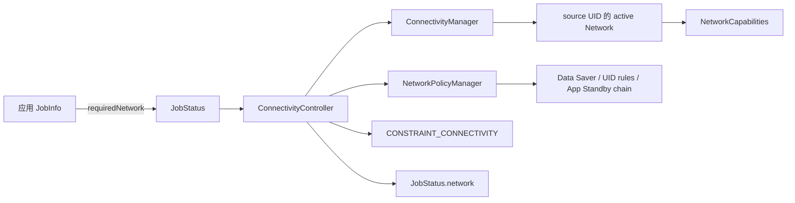
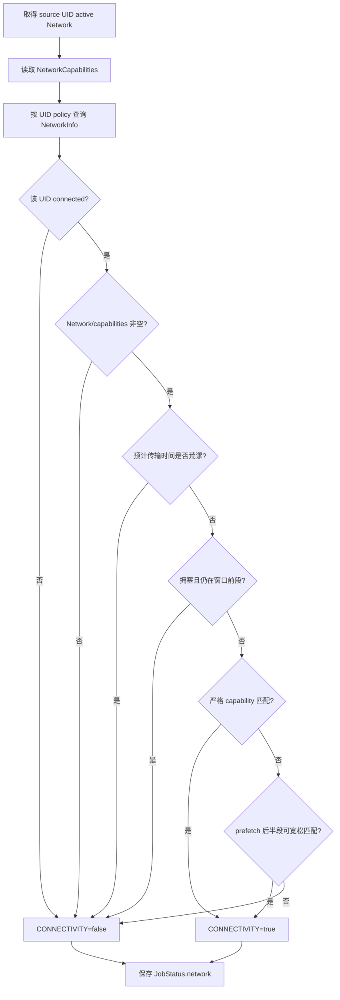
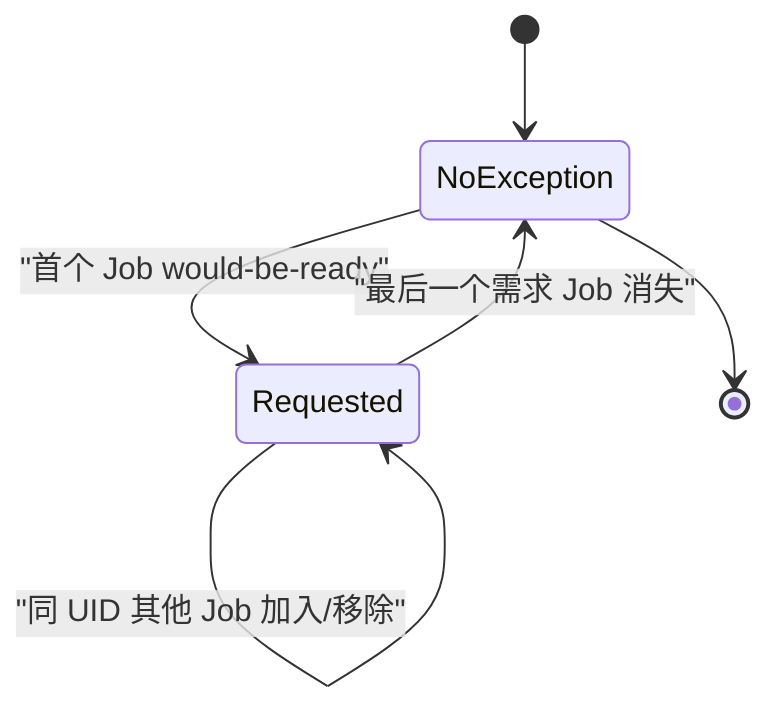
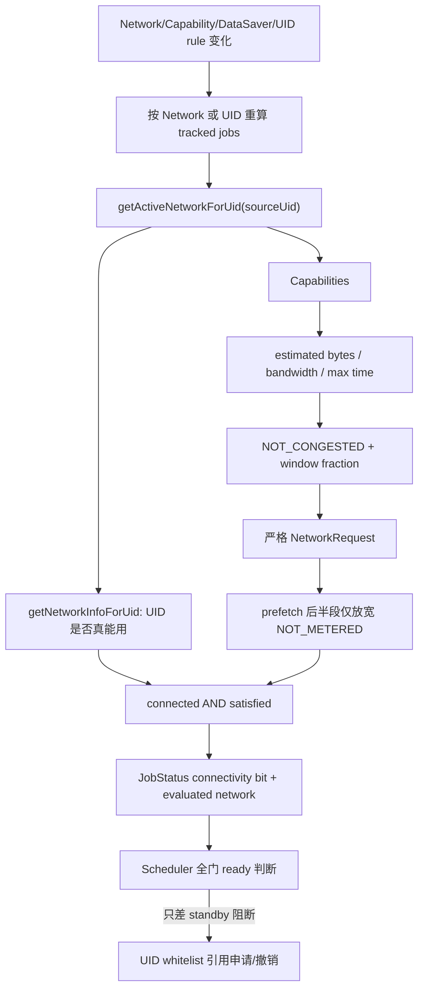

# 123 Android ConnectivityController：网络匹配、阻塞与传输可行性

> 源码版本：Android 11 / API 30 / `android-11.0.0_r48`  
> 学习方式：macOS 只读源码，不要求编译  
> 前置章节：第 121、122 章

---

## 1. 本章要回答的问题

`JobInfo.Builder.setRequiredNetwork()` 看起来只是“要求联网”，但 JobScheduler 真正决定能否执行时，还需要回答：

1. 这个 Job 归属的 UID 当前使用哪张网络？
2. 网络物理存在，是否代表该 UID 有权使用？
3. `NetworkRequest` 的 capability 是否严格匹配？
4. 网络拥塞时是否应该再等等？
5. 预取任务等到窗口后半段，能否放宽“不计量”要求？
6. 预计传输量在执行时限内根本传不完时，为什么不启动？
7. App Standby 阻断恰好是最后一道门时，谁临时申请例外？
8. 网络变化怎样只重新计算受影响的 Job？

核心认识：

> ConnectivityController 判断的不是“手机有没有网”，而是“这个 UID 当前可使用的 active network，能否在策略、能力、拥塞和传输时限四个维度满足这个 Job”。

---

## 2. 源码入口

主文件：

```text
frameworks/base/apex/jobscheduler/service/java/com/android/server/job/
└── controllers/ConnectivityController.java
```

配合阅读：

```text
frameworks/base/apex/jobscheduler/framework/java/android/app/job/JobInfo.java
frameworks/base/core/java/android/net/NetworkRequest.java
frameworks/base/core/java/android/net/NetworkCapabilities.java
frameworks/base/apex/jobscheduler/service/java/com/android/server/job/controllers/JobStatus.java
frameworks/base/apex/jobscheduler/service/java/com/android/server/job/JobSchedulerService.java
```

---

## 3. 先建立对象关系



`JobStatus.network` 不只是调试信息。控制器把本次判断所依据的 Network 一并交给执行阶段，减少“检查时是 Wi-Fi，真正运行时默认路由已经变成蜂窝”的竞态。

---

## 4. 为什么按 source UID 分组

字段声明是：

```java
/** List of tracked jobs keyed by source UID. */
private final SparseArray<ArraySet<JobStatus>> mTrackedJobs = new SparseArray<>();
```

同一台设备上，不同 UID 即使处在同一时刻，也可能看到不同的默认网络或不同的可用性：

- UID A 被 Data Saver 阻止后台联网；
- UID B 在白名单中；
- 工作资料 UID 走企业 VPN；
- 某 UID 被防火墙规则阻断；
- 前台 UID 获得后台 UID 没有的联网权限。

因此不能维护一个全局布尔值 `deviceConnected=true`，然后把所有联网 Job 一起放行。

### 4.1 source UID 不是简单的 calling UID

系统组件可能通过 `scheduleAsPackage()` 替别的包调度 Job。网络策略应按 Job 的 source 身份判断，这和前两章的配额归因、JobStore 双索引保持一致。

---

## 5. 两张表分别解决什么问题

控制器维护两类集合：

```java
private final SparseArray<ArraySet<JobStatus>> mTrackedJobs = new SparseArray<>();
private final ArrayMap<Network, NetworkCapabilities> mAvailableNetworks = new ArrayMap<>();
```

不要把它们混成“候选网络池”：

| 结构 | 含义 | 主要用途 |
|---|---|---|
| `mTrackedJobs` | 按 source UID 保存联网 Job | 网络/策略变化时重算约束 |
| `mAvailableNetworks` | 系统当前知道的所有 Network 及能力 | 缓存能力；判断是否存在理论可用网络 |

Android 11 的实际约束更新代码仍有：

```java
// TODO: consider matching against non-active networks
final Network network = mConnManager.getActiveNetworkForUid(sourceUid);
```

所以本版本不会遍历所有 Network，为 Job 主动挑一个最合适的非默认网络。

---

## 6. Job 从何时开始被跟踪

```java
if (jobStatus.hasConnectivityConstraint()) {
    updateConstraintsSatisfied(jobStatus);
    ...
    jobs.add(jobStatus);
    jobStatus.setTrackingController(JobStatus.TRACKING_CONNECTIVITY);
}
```

顺序值得注意：先计算一次，再加入集合。这样刚调度进来的 Job 不需要等下一次网络广播才能得到 connectivity bit。

移除时则：

1. 清掉 `TRACKING_CONNECTIVITY`；
2. 从 UID 集合删除；
3. 检查该 Job 对应的 standby exception 是否可以撤销。

`TRACKING_CONNECTIVITY` 表示“由谁负责维护”，不表示约束已经满足。

---

## 7. `setRequiredNetwork()` 最终保存了什么

JobInfo 保存的是 `NetworkRequest`。它的核心是 `NetworkCapabilities`，可能包含：

- `NET_CAPABILITY_INTERNET`：具有互联网能力；
- `NET_CAPABILITY_VALIDATED`：系统探测确认能访问互联网；
- `NET_CAPABILITY_NOT_METERED`：非计量网络；
- `NET_CAPABILITY_NOT_ROAMING`：非漫游；
- transport：Wi-Fi、Cellular、Ethernet、VPN 等。

常用 `setRequiredNetworkType()` 只是把简单枚举转换成 NetworkRequest；真正匹配依然落到 capability 集合。

### 7.1 “有 Wi-Fi”不等于“满足互联网 Job”

Wi-Fi 已关联 AP，但没有通过验证、被门户页拦截时，可能没有 `VALIDATED`。若请求要求它，单纯看到 Wi-Fi 图标并不能满足 Job。

---

## 8. 完整判定流水线



重要的是 `connected && satisfied`。能力匹配和 UID 实际访问权缺一不可。

---

## 9. 第一层：网络对象和能力必须存在

```java
if (network == null || capabilities == null) return false;
```

`Network` 是一张逻辑网络的身份，`NetworkCapabilities` 描述它能做什么。只有对象没有能力，控制器无法安全判断；只有能力却没有 Network，也不能交给 Job 使用。

---

## 10. 第二层：传输是否来得及完成

应用可声明估计上下行字节数：

```java
setEstimatedNetworkBytes(downloadBytes, uploadBytes)
```

控制器取网络的上下行带宽估计，然后计算：

```text
预计毫秒 = 字节数 × 1000 / (KiB/s)
KiB/s = bandwidthKbps 对应的 Ki bits/s ÷ 8
```

源码核心：

```java
final long maxJobExecutionTimeMs =
        mService.getMaxJobExecutionTimeMs(jobStatus);
final long bandwidth = capabilities.getLinkDownstreamBandwidthKbps();
final long estimatedMillis =
        (downloadBytes * 1000) / (DataUnit.KIBIBYTES.toBytes(bandwidth) / 8);
if (estimatedMillis > maxJobExecutionTimeMs) return true;
```

### 10.1 为什么叫 `isInsane`

它不是精确预测，而是排除明显不可能完成的组合。例如 Job 要下载 500 MiB，网络能力估计只有 128 Kbps，而 Job 可执行上限远短于所需时间，启动只会耗电、占并发槽，最后还会被停止。

### 10.2 上下行分别判断

下载使用 downstream bandwidth，上传使用 upstream bandwidth。任一已知方向明显超时，就判定不满足。

### 10.3 未知值怎样处理

- estimated bytes 为 `NETWORK_BYTES_UNKNOWN`：不做该方向估算；
- link bandwidth 为 unspecified：也不拒绝，只能乐观尝试。

这说明 estimated bytes 是调度提示，不是流量硬配额，也不会在达到字节数后自动杀掉 Job。

### 10.4 与第 121 章超时的准确关系

这里调用 `getMaxJobExecutionTimeMs()` 做“启动前传输可行性”判断。不要推导成 `JobServiceContext` 的运行超时会根据带宽动态改变；Android 11 执行上下文仍有固定最大执行时间，二者职责不同。

---

## 11. 手算一个传输例子

假设：

```text
下载量：100 MiB
下行能力：1,024 Kbps
```

1,024 Kibit/s ÷ 8 = 128 KiB/s，因此约需：

```text
100 × 1024 KiB ÷ 128 KiB/s = 800 秒
```

若本次允许执行的最大时长只有 600 秒，该网络会被 `isInsane()` 拒绝。若带宽未知，则不会因为这项估算被拒绝。

---

## 12. 第三层：拥塞时延迟

```java
if (!capabilities.hasCapability(NET_CAPABILITY_NOT_CONGESTED)) {
    return jobStatus.getFractionRunTime()
            < constants.CONN_CONGESTION_DELAY_FRAC;
}
```

默认比例是 `0.5`。含义不是“拥塞网络永远不可用”，而是：

- 窗口前半段：可以等待，先不跑；
- 到窗口后半段：不再仅因拥塞继续拖延；
- 不拥塞：立即进入下一项判断。

### 12.1 `getFractionRunTime()` 不是 Job 已执行比例

它表示当前时间在 Job 可运行时间窗口中走过的比例。Job 可能一次都没启动，却已经进入窗口后半段。

### 12.2 为什么需要时间窗口兜底

如果把 `NOT_CONGESTED` 当永久硬条件，网络长期拥塞时带 deadline 的任务可能永远错过时机。比例策略在网络效率与及时完成之间折中。

---

## 13. 第四层：严格 capability 匹配

普通路径最终调用：

```java
required.satisfiedByNetworkCapabilities(capabilities)
```

这不是比较两个对象是否完全相等，而是询问：候选网络是否覆盖请求要求的 capability 和 transport。

网络拥有额外能力没有问题；缺少请求中的任一必要能力则不满足。

---

## 14. RESTRICTED 且超出 quota 的额外要求

源码给严格匹配添加了一条动态规则：

```java
if (jobStatus.getEffectiveStandbyBucket() == RESTRICTED_INDEX
        && !jobStatus.isConstraintSatisfied(CONSTRAINT_WITHIN_QUOTA)) {
    required = new NetworkCapabilities(original)
            .addCapability(NET_CAPABILITY_NOT_METERED);
}
```

即使开发者只请求普通网络，restricted bucket 且已经不在 quota 内时，也必须使用非计量网络。

这里体现 Controller 之间不是完全孤立：ConnectivityController 会读取 QuotaController 维护的 `WITHIN_QUOTA` bit。

### 14.1 为什么用 effective bucket

effective bucket 是当前调度策略真正采用的 bucket，可能受到系统判定影响；不能只看应用最初的 standby bucket 标签。

---

## 15. 第五层：prefetch 的宽松匹配

严格匹配失败后，代码只对特定任务尝试放宽：

```java
if (!job.isPrefetch() || standbyBucket == RESTRICTED_INDEX) return false;

relaxed.removeCapability(NET_CAPABILITY_NOT_METERED);
if (relaxed.satisfiedByNetworkCapabilities(capabilities)) {
    return fractionRunTime > CONN_PREFETCH_RELAX_FRAC;
}
```

默认同样是窗口比例 `0.5`。

### 15.1 只放宽什么

只删除 `NOT_METERED`，不会删除：

- INTERNET；
- VALIDATED；
- NOT_ROAMING；
- 指定 transport；
- 其他开发者要求。

所以它不是“等久了什么网都行”。

### 15.2 适用条件

必须同时满足：

1. Job 标记为 prefetch；
2. 原始 standby bucket 不是 restricted；
3. 去掉 NOT_METERED 后其余能力匹配；
4. 已经过开发者窗口的默认后半段；
5. 前面的非空、传输可行性、拥塞判断也已通过。

### 15.3 源码中的 TODO

代码写着 `TODO: treat this as "maybe" response; need to check quotas`。这提醒我们：本版本放宽计量网络时，没有在这里进一步核算 opportunistic data quota。阅读源码时应区分“当前实现”和“理想设计”。

---

## 16. 严格与宽松的判断表

| 场景 | 窗口前半 | 窗口后半 |
|---|---:|---:|
| 普通 Job，严格匹配 | 可满足 | 可满足 |
| 普通 Job，仅缺 NOT_METERED | 不满足 | 仍不满足 |
| prefetch，仅缺 NOT_METERED | 不满足 | 可宽松满足 |
| restricted prefetch，仅缺 NOT_METERED | 不满足 | 仍不满足 |
| 网络拥塞、其余严格匹配 | 延迟 | 可继续判断并满足 |

边界比较也要留意：拥塞路径用 `< 0.5`，prefetch 放宽用 `> 0.5`。恰好等于 0.5 时，不再因拥塞延迟，但也尚未通过 prefetch 宽松条件。

---

## 17. capability 满足后还要检查 UID 是否 connected

`updateConstraintsSatisfied()` 并未只调用 `isSatisfied()`：

```java
final boolean ignoreBlocked =
        (jobStatus.getFlags() & FLAG_WILL_BE_FOREGROUND) != 0;
final NetworkInfo info = mConnManager.getNetworkInfoForUid(
        network, sourceUid, ignoreBlocked);

final boolean connected = info != null && info.isConnected();
final boolean satisfied = isSatisfied(...);
setConnectivityConstraintSatisfied(connected && satisfied);
```

这正是“网络存在”和“UID 能用”之间的分界。

### 17.1 网络策略可能造成什么差异

同一个 Network 对系统整体是 available，对某后台 UID 却可能呈现不可连接，因为：

- Data Saver；
- UID policy rules；
- App Standby 网络策略链；
- 其他后台网络限制。

因此 `mAvailableNetworks` 中出现一张完美 Wi-Fi，也不能直接把所有 Job 的 connectivity bit 设为 true。

---

## 18. `FLAG_WILL_BE_FOREGROUND` 的含义

若 Job 通过隐藏 flag 声明实现会调用 `JobService.startForeground()`，查询 UID 网络状态时
`ignoreBlocked=true`。

这不是普通 SDK 应用可随意设置的开关：`JobInfo.Builder.setFlags()` 是隐藏 API，调度带
`FLAG_WILL_BE_FOREGROUND` 的 Job 还要求调用方持有签名级 `CONNECTIVITY_INTERNAL` 权限。该 flag 本身也不会
把 Service 变成前台服务；实现仍须自行发布通知并调用 `startForeground()`。它只让此处查询网络状态时忽略
适用于后台状态的阻断，不代表绕过所有网络安全策略。

---

## 19. 为什么还要保存 `jobStatus.network`

```java
jobStatus.network = network;
```

它有三个价值：

1. 执行 Job 时把评估过的网络传下去；
2. 默认路由变化时比较旧网络和新网络，发现必须重算；
3. 为未来支持非默认路由保留结构空间。

但它不是网络锁。网络仍可能在 Job 运行期间丢失，Job 必须能处理 I/O 失败、停止与重试。

---

## 20. 全网 callback 如何维护能力缓存

构造函数注册了一个清空默认 capability 的广泛请求：

```java
new NetworkRequest.Builder().clearCapabilities().build();
mConnManager.registerNetworkCallback(request, mNetworkCallback);
```

于是控制器能观察各种 Network：

- `onAvailable()`：仅收到对象，按文档等待能力回调；
- `onCapabilitiesChanged()`：更新 map，并重算使用该 Network 的 Job；
- `onLost()`：删除 map 项，并重算。

### 20.1 为什么 onAvailable 不立即查询

注释明确要求等待紧随其后的 `onCapabilitiesChanged()`。这样避免在能力尚未稳定时做一次无意义或错误的同步查询。

### 20.2 同步查询为何仍存在

`getNetworkCapabilities()` 优先查缓存；缓存没有时，仍同步调用 ConnectivityManager，源码 TODO 说明这是配合 `getActiveNetworkForUid()` 的过渡方案。

---

## 21. 网络变化时怎样减少重算

`updateTrackedJobs(filterUid, filterNetwork)` 支持两种过滤：

- 指定 UID：例如某个 UID 的 policy rule 变化；
- 指定 Network：例如某张网络 capability 变化或丢失。

每个 UID 集合只查询一次 active network，然后给该 UID 的所有 Job 共用 network/capabilities 输入。

```java
if (networkMatch || !Objects.equals(js.network, network)) {
    updateConstraintsSatisfied(js, network, capabilities);
}
```

即使事件对应的 filterNetwork 与当前 active network 不同，只要 Job 上次记录的 network 已经不同于当前网络，也会重算。这覆盖了“刚失网/默认路由切换”的情况。

---

## 22. Data Saver 和 UID rule 变化链

控制器注册 `INetworkPolicyListener`：

```text
onRestrictBackgroundChanged
  → MSG_DATA_SAVER_TOGGLED
  → updateTrackedJobs(all UID)

onUidRulesChanged(uid)
  → MSG_UID_RULES_CHANGES
  → updateTrackedJobs(one UID)
```

回调先投递到 main looper 的 Handler，再在 JobScheduler 锁下更新，避免直接在 NetworkPolicy 的 Binder 回调上下文里做整批调度工作。

---

## 23. connectivity bit 改变之后发生什么

若任意 Job 的 bit 发生变化：

```java
mStateChangedListener.onControllerStateChanged();
```

控制器并不自己绑定 JobService。它只生产约束状态并通知 JobSchedulerService；后者重新检查所有 required/satisfied/implicit gates，再决定是否进入 pending、并发分配和执行流程。

这与第 121 章的分层一致：

```text
Controller 维护事实 → JobStatus 汇总 ready → Scheduler 决定运行
```

---

## 24. `onNetworkActive()` 是一条加速路径

当系统观察到网络正在传输，控制器遍历 tracked jobs：

```java
if (js.isReady()) {
    mStateChangedListener.onRunJobNow(js);
}
```

它不是把未满足网络约束的 Job 强行运行。只有 `isReady()` 已经为真，才请求立即运行；作用类似减少等待批处理的延迟。

---

## 25. App Standby exception：问题是什么

可能出现一个循环：

1. Job 的其他约束已经全部满足；
2. 系统确实存在能力合适的网络；
3. 但 UID 因 App Standby policy chain 被阻断；
4. connectivity=false，Job 不能运行；
5. 如果没人暂时解除阻断，它永远无法跨过最后一道门。

ConnectivityController 因此可以向 NetworkPolicyManagerInternal 请求 app-idle 白名单例外。

---

## 26. 申请前先问“解除后真的能跑吗”

```java
return isNetworkAvailable(jobStatus)
        && wouldBeReadyWithConstraintLocked(
                jobStatus, CONSTRAINT_CONNECTIVITY);
```

两个条件必须同时成立：

- 全部 available networks 中至少有一张通过网络能力判断；
- 把 connectivity 假设为满足后，Job 的其他约束、组件有效性等已足够 ready。

如果还在等充电、空闲、时间或 quota，提前开网络白名单没有意义，只会扩大后台访问时间。

### 26.1 `isNetworkAvailable()` 的准确语义

源码注释强调：它只回答 Job 请求的网络是否存在，**不保证 UID 已获准访问**。

它遍历 `mAvailableNetworks`，因此这里可以看到非 active network；但目的只是判断申请例外是否可能有帮助，不是最终为 Job 选择那张网络。

---

## 27. exception 按 UID 引用计数

结构是：

```java
SparseArray<ArraySet<JobStatus>> mRequestedWhitelistJobs;
```

第一次为某 UID 加入 Job 时：

```java
mNetPolicyManagerInternal.setAppIdleWhitelist(uid, true);
```

同 UID 第二个 Job 只加入集合，不重复调用开启。某 Job 不再需要例外时先从集合删除；只有集合变空才调用：

```java
setAppIdleWhitelist(uid, false);
```

这是典型的 UID 级资源、Job 级需求引用管理。

---

## 28. 为什么不能“一个 Job 完成就关白名单”

假设 UID 10001 有 Job A 和 B 都依赖例外：

```text
A 结束 → B 仍待运行
```

若 A 结束时直接关闭 UID 白名单，B 会被意外阻断。集合让控制器只有在最后一个需求者消失时才撤销。

同理，重复请求同一个 Job 由 `ArraySet.add()` 去重，不会增加虚假的引用。

---

## 29. exception 的生命周期



会触发重新评估或撤销的情形包括：

- Job 的其他约束变化；
- JobService 组件被禁用；
- Job 被替换、取消或停止跟踪；
- 网络与 UID policy 变化；
- UID 的 tracked jobs 被重新评估。

这不是永久白名单，更不是写入持久配置的开发者特权。

---

## 30. `evaluateStateLocked()` 与普通 bit 更新不同

普通网络回调主要更新 connectivity bit。`evaluateStateLocked()` 则判断要不要维护 standby exception：

```java
if (wouldBeReadyWithConnectivityLocked(job)) {
    requestStandbyExceptionLocked(job);
} else {
    maybeRevokeStandbyExceptionLocked(job);
}
```

它使用完整 Job readiness，是为避免组件已经禁用等情况下仍保留例外。

---

## 31. RestrictedController 的关系

ConnectivityController 继承 `RestrictingController`。restricted 状态变化时，并不把有网络需求的 Job 从本控制器移走：

```java
// If the job needed network, it would already be tracked.
updateConstraintsSatisfied(jobStatus);
```

原因是 restricted 会改变网络严格匹配规则，尤其是“超 quota 时强制 NOT_METERED”，所以状态变化要立即重算。

---

## 32. 三种“可用”必须分清

| 说法 | 实际问题 | 对应代码 |
|---|---|---|
| 系统有网络 | 是否存在 Network 对象 | callback / map |
| 请求能力可满足 | capabilities 是否通过 insane、congestion、strict/relaxed | `isSatisfied()` |
| 该 UID 真能用 | UID policy 下是否 connected | `getNetworkInfoForUid()` |

最终 connectivity bit 需要后两者同时为真；standby exception 的预判只使用“存在能力可满足的网络 + 其他约束 ready”。

---

## 33. 一个完整案例：后台预取

条件：

```text
Job：prefetch，要求 INTERNET + NOT_METERED
当前 active network：计量蜂窝，INTERNET/VALIDATED，NOT_CONGESTED
时间窗口比例：0.3
UID：未被 policy 阻断
```

推演：

1. 网络非空；
2. 传输量没有明显超时；
3. 不拥塞；
4. 严格匹配失败，因为缺 NOT_METERED；
5. relaxed 去掉 NOT_METERED 后虽匹配，但 `0.3 <= 0.5`；
6. connectivity=false。

当比例变为 `0.7`，其他条件不变，relaxed 路径成立，connectivity=true。

---

## 34. 案例：普通下载不能套用 prefetch 放宽

同样要求非计量网络，但 Job 没有 `setPrefetch(true)`：

```text
fraction = 0.99
```

也不会删除 NOT_METERED。开发者明确提出的普通 Job 网络约束仍是硬要求。

---

## 35. 案例：网络能力合适但 UID 被阻断

```text
Wi-Fi：INTERNET + VALIDATED + NOT_METERED
Job：能力完全匹配
后台 UID：App Standby chain blocked
```

`isSatisfied()` 可为 true，但 `getNetworkInfoForUid(...).isConnected()` 为 false，所以最终 bit 仍为 false。

若此时其他所有约束已经满足，`evaluateStateLocked()` 会发现全局确有合适网络，申请临时 standby exception；policy 更新后再重算，UID 才可能真正 connected。

---

## 36. 案例：有两张网络但不会任意挑选

```text
UID active network：计量蜂窝
另一张 available network：非计量 Wi-Fi
Job：要求 NOT_METERED
```

最终约束更新使用 active 蜂窝，严格匹配失败。本版本不会因为 map 里还有 Wi-Fi 就直接把 `jobStatus.network` 设成 Wi-Fi。

但 `isNetworkAvailable()` 能看到 Wi-Fi，可能判断“解除 policy 阻断有希望”。这两个结果并不矛盾，因为函数回答不同问题。

---

## 37. 案例：restricted + out of quota

```text
开发者请求：任意 INTERNET
effective bucket：RESTRICTED
WITHIN_QUOTA：false
active network：计量蜂窝
```

控制器动态补上 NOT_METERED，蜂窝不再严格满足。即使 Job 本来的 NetworkRequest 没要求 Wi-Fi，也会等待非计量网络。

注意：这是网络门槛的一部分；Job 是否最终可以越过 quota 的其他隐式规则，还需结合 JobStatus 与 QuotaController 看，不能只看本方法。

---

## 38. 网络切换竞态

可能发生：

```text
t0 检查 active Wi-Fi，约束满足
t1 默认网络切到 Cellular
t2 Job 开始或正在执行
```

控制器通过保存 evaluated network、监听 capability/lost/policy 变化来缩短竞态窗口，但无法让现实网络静止。JobService 仍必须：

- 捕获连接异常；
- 支持幂等重试；
- 在 `onStopJob()` 后及时停止工作；
- 不把调度约束当成永久保证。

---

## 39. 为什么不用传统 CONNECTIVITY_ACTION

这里使用 NetworkCallback 与 NetworkPolicy listener，能够获得：

- 具体 Network 身份；
- capability 精细变化；
- Network 丢失；
- Data Saver 全局变化；
- 单 UID rule 变化。

一个粗粒度“已连接/未连接”广播无法正确表达按 UID 的访问差异。

---

## 40. 锁与线程模型

主要共享表由 `mLock` 保护。外部回调的基本模式是：

```text
Network callback
  → 短暂更新能力缓存
  → updateTrackedJobs
  → mLock 下批量改 JobStatus
  → bit 有变化才通知 Scheduler
```

NetworkPolicy 回调则通过 Handler 转换到 main looper，再进入同一更新路径。这样把多来源事件收敛成较稳定的状态维护入口。

---

## 41. 性能设计细节

控制器避免了几类无谓成本：

1. NetworkCapabilities 放在 map 缓存，减少同步 Binder 查询；
2. tracked jobs 按 UID 分组，同 UID 只查一次 active network；
3. UID rule 变化只更新一个 UID；
4. network capability 变化优先过滤使用该 Network 的 Job；
5. 只有 constraint bit 真变化才通知全局调度器。

但 Data Saver 全局切换仍需要重算全部 tracked jobs，这是语义决定的成本。

---

## 42. 常量来自哪里

Android 11 默认值：

```java
DEFAULT_CONN_CONGESTION_DELAY_FRAC = 0.5f;
DEFAULT_CONN_PREFETCH_RELAX_FRAC = 0.5f;
```

它们通过 JobScheduler constants 解析，可动态调整。阅读日志时不应永远假定设备实际值就是 0.5，应以 `dumpsys jobscheduler` 的 constants 为准。

---

## 43. dumpsys 能看到什么

控制器 dump 包含：

- requested standby exception UID 及 Job 数；
- available networks 与 capabilities；
- 每个 tracked Job 的 source UID；
- Job 的 required NetworkRequest。

诊断时建议同时对照：

```text
adb shell dumpsys jobscheduler
adb shell dumpsys connectivity
adb shell dumpsys netpolicy
```

本课程在 macOS 上不要求设备和 adb；这些命令只作为有设备时的观察入口。

---

## 44. 诊断顺序：不要先猜“网络坏了”

看到联网 Job 不运行时，按以下顺序：

1. Job 是否真的声明 connectivity constraint？
2. source UID 是谁？
3. source UID 的 active network 是哪张？
4. UID policy 下 connected 是否为 true？
5. required capabilities 缺哪一项？
6. 是否被 estimated bytes / bandwidth 判为 impossible？
7. 是否因 NOT_CONGESTED 且窗口还早而延迟？
8. 是否是 prefetch，宽松比例是否已到？
9. effective bucket 是否 restricted 且 out of quota？
10. connectivity 即便满足，其他 required/implicit constraints 是否仍未满足？

---

## 45. 常见误解一：设备联网就满足所有 Job

错误。设备有网只是最外层事实；最终按 source UID 的 active network、policy connected 状态与 NetworkRequest 判断。

---

## 46. 常见误解二：`mAvailableNetworks` 是自动选网池

错误。Android 11 的正式约束更新仍用 `getActiveNetworkForUid()`，源码甚至保留“未来考虑非 active network”的 TODO。

---

## 47. 常见误解三：estimated bytes 是流量限制

错误。它用于比较预计传输时间和 Job 最大执行时间。系统不会在 Job 正好传完声明字节数时切断 socket。

---

## 48. 常见误解四：网络拥塞意味着永不运行

错误。默认只在时间窗口前 50% 延迟，进入后半段不再仅因此拒绝。

---

## 49. 常见误解五：所有非计量请求都会自动放宽

错误。只有非 restricted 的 prefetch Job，在窗口后半段，才可能仅去掉 NOT_METERED 后匹配。

---

## 50. 常见误解六：standby exception 是永久白名单

错误。它由 Job 需求集合引用管理；最后一个“解除 connectivity 后就可运行”的 Job 消失时撤销。

---

## 51. 常见误解七：capability 匹配就代表 UID 能联网

错误。`isSatisfied()` 之外还必须满足按 UID 查询得到的 connected 状态。一个网络可对 UID A 可用、对 UID B 被阻断。

---

## 52. 常见误解八：调度时满足，运行全程就有网

错误。约束是动态事实，不是资源租约。网络随时可能切换、丢失或改变能力，业务仍需处理中断。

---

## 53. 与 QuotaController 的连接点

第 122 章和本章有两处直接相遇：

```text
QuotaController → WITHIN_QUOTA bit
        ↓
restricted + out-of-quota 时 ConnectivityController 强制 NOT_METERED

JobSchedulerService → max execution time estimate
        ↓
ConnectivityController 判断预计传输能否完成
```

这说明 Controller 是职责分离，不是毫无交流。共享事实经 JobStatus constraint bit 或 JobSchedulerService 查询连接起来。

---

## 54. 与 NetworkPolicyManager 的连接点

ConnectivityController 自己不编程 iptables/eBPF 规则。它：

- 监听 NetworkPolicy 的全局与 UID 规则变化；
- 查询 policy 影响后的 UID connected 状态；
- 在精确条件满足时请求/撤销 app-idle whitelist。

真正的策略计算和底层实施仍属于网络策略栈。

---

## 55. 与 JobService 的连接点

当 connectivity=true 且其余门都满足：

```text
JobSchedulerService
  → pending queue
  → concurrency assignment
  → JobServiceContext
  → bind JobService
  → onStartJob(JobParameters)
```

若网络随后变化导致 connectivity=false，正在执行的 Job 会通过正常停止链收到停止请求；是否重试由 `onStopJob()` 返回值及调度策略决定。

---

## 56. 只读源码练习一：定位主链

在 AOSP 根目录执行：

```bash
rg -n "updateConstraintsSatisfied|isSatisfied|isStrictSatisfied|isRelaxedSatisfied" \
  frameworks/base/apex/jobscheduler/service/java/com/android/server/job/controllers/ConnectivityController.java
```

把结果按以下顺序连线：

```text
active network → UID connected → insane → congestion → strict → relaxed → constraint bit
```

---

## 57. 只读源码练习二：验证没有“任选网络”

```bash
rg -n "getActiveNetworkForUid|consider matching against non-active|mAvailableNetworks" \
  frameworks/base/apex/jobscheduler/service/java/com/android/server/job/controllers/ConnectivityController.java
```

回答：

1. 哪个函数遍历全部 available networks？
2. 哪个函数真正写 `jobStatus.network`？
3. 两个函数分别回答什么问题？

参考结论：前者判断申请 standby exception 是否可能有意义；后者按 UID active network 决定当前 connectivity bit。

---

## 58. 只读源码练习三：手算边界

对以下四组输入判断结果：

```text
A. congested=true, fraction=0.49, strict=true
B. congested=true, fraction=0.50, strict=true
C. prefetch=true, onlyMissing=NOT_METERED, fraction=0.50
D. prefetch=true, onlyMissing=NOT_METERED, fraction=0.51
```

按默认常量：

- A：因拥塞延迟；
- B：不再因拥塞延迟，可严格满足；
- C：宽松条件使用 `>`，尚不满足；
- D：宽松满足。

---

## 59. 只读源码练习四：追 exception 引用

```bash
rg -n "RequestedWhitelist|StandbyException|setAppIdleWhitelist|wouldBeReadyWithConnectivity" \
  frameworks/base/apex/jobscheduler/service/java/com/android/server/job/controllers/ConnectivityController.java
```

画出同 UID 两个 Job 的集合变化：

```text
{} → {A} → {A,B} → {B} → {}
```

只在 `{} → {A}` 开启 whitelist，只在 `{B} → {}` 关闭。

---

## 60. 只读源码练习五：核对默认常量

```bash
rg -n "DEFAULT_CONN_CONGESTION_DELAY_FRAC|DEFAULT_CONN_PREFETCH_RELAX_FRAC" \
  frameworks/base/apex/jobscheduler/service/java/com/android/server/job/JobSchedulerService.java
```

进一步观察 constants 的解析代码，确认默认值与设备可配置实际值不是同一概念。

---

## 61. 阅读检查题

1. 为什么同一张 Wi-Fi 对两个 UID 的 connectivity 结果可能不同？
2. `mAvailableNetworks` 为什么不等于 Job 的候选选网池？
3. `isInsane()` 在字节数或带宽未知时怎样处理？
4. `getFractionRunTime()` 为什么不是“已运行 50%”？
5. prefetch 放宽会删除哪些 capability？
6. restricted 且 out-of-quota 为什么会改变严格网络请求？
7. standby exception 为什么需要 Job 集合而不是 UID 布尔值？
8. `connected && satisfied` 两项各自防止哪类错误？

---

## 62. 一页复习图



---

## 63. 本章结论

ConnectivityController 可以压缩为五层：

1. **身份层**：按 source UID 找 active network；
2. **策略层**：确认这个 UID 在网络策略下确实 connected；
3. **可行性层**：估计传输量不能明显超过可执行时间；
4. **时机层**：拥塞前半段延迟，prefetch 后半段可有限放宽；
5. **能力层**：严格或受限的 relaxed capability 匹配。

另外，它用 all-network 缓存回答“解除 App Standby 阻断是否值得”，再以 UID+Job 集合精确维护临时 exception。

最需要记住的一句话：

> 系统存在合适网络，只是必要条件；最终必须是 source UID 当前被允许使用的 active network 满足 Job，connectivity 约束才成立。

---

## 64. 复读后的易混点修订

本章初稿完成后再次对照源码，专门修正和补强了以下容易误读之处：

1. 明确 `mAvailableNetworks` 不是 Job 的自动选网池，正式更新仍使用 UID active network；
2. 分开 `isNetworkAvailable()` 的“理论存在”与 `updateConstraintsSatisfied()` 的“UID 实际可用”；
3. 强调最终结果是 `connected && satisfied`，capability 匹配不能替代 UID policy；
4. 说明 estimated bytes 是启动前可行性提示，不是传输配额，也不动态替换执行上下文固定超时；
5. 补充 0.5 精确边界：拥塞 `<` 与 prefetch 放宽 `>` 的差异；
6. 限定 relaxed 只移除 NOT_METERED，而且 restricted prefetch 不参与；
7. 说明 exception 是 UID 级策略、Job 级引用，避免把它误当永久白名单；
8. 强调网络约束满足不是运行期间的永久网络保证。

下一章将进入 `TimeController`，继续研究 minimum latency、override deadline、elapsed realtime alarm 合并以及时间变化为何不会用 wall clock 直接判断。
