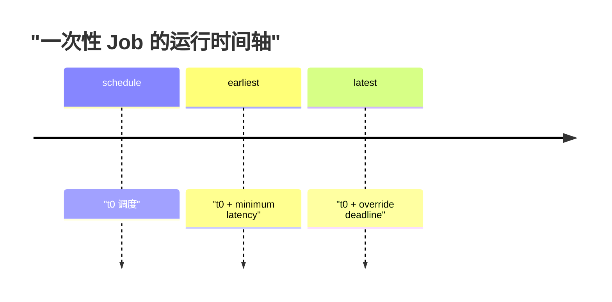
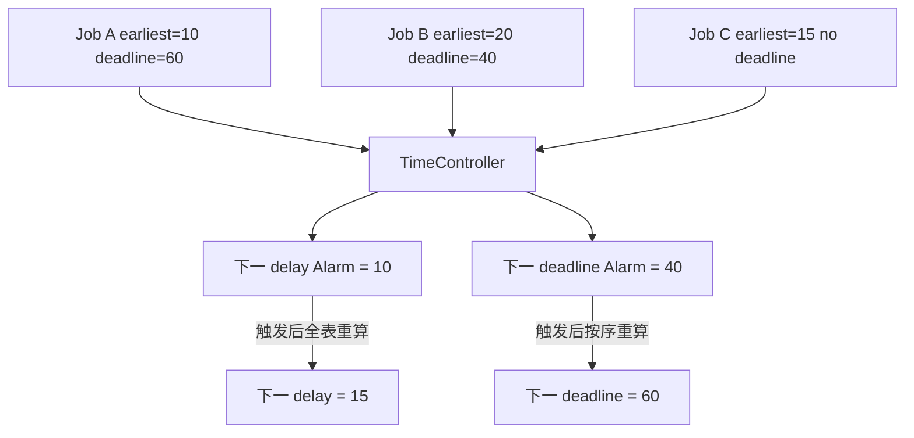
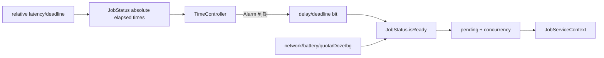
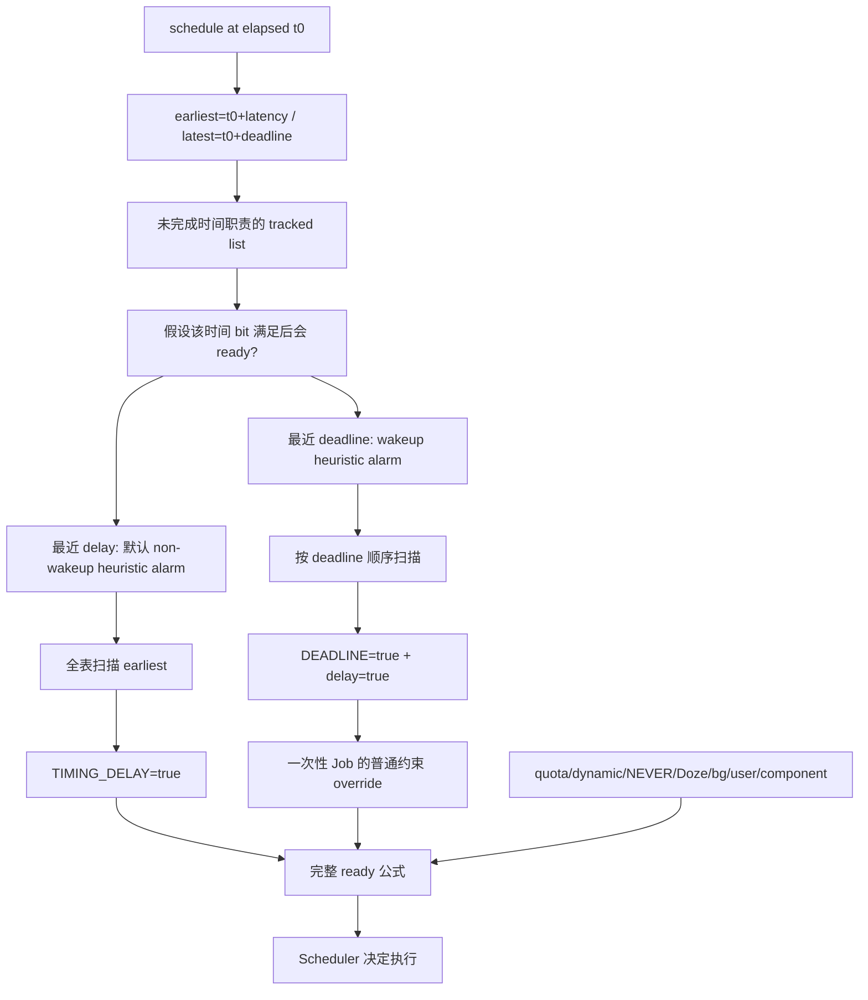

# 124 Android TimeController：最早时间、Deadline 与 Alarm 合并

> 源码版本：Android 11 / API 30 / `android-11.0.0_r48`  
> 学习方式：macOS 只读源码，不要求编译  
> 前置章节：第 121～123 章

---

## 1. 本章研究什么

应用可以告诉 JobScheduler：

```java
new JobInfo.Builder(jobId, service)
        .setMinimumLatency(10 * 60_000L)
        .setOverrideDeadline(60 * 60_000L)
        .build();
```

这不是“10 分钟后准时启动、最迟 1 小时必定执行”。它表达的是两个调度里程碑：

- minimum latency：在此之前不允许执行；
- override deadline：到点后允许绕过一部分普通约束，尽快执行。

本章回答：

1. 相对时长怎样变成 elapsed realtime 绝对时间？
2. minimum latency 与 deadline 分别维护哪个 constraint bit？
3. 为什么 deadline 到期会顺带满足 delay？
4. 为什么系统只需要两个 Alarm，而不是每个 Job 一个？
5. 为什么列表按 deadline 排序，却仍能找最早 delay？
6. “deadline override”究竟覆盖哪些约束，哪些仍不能覆盖？
7. 周期 Job 为什么也有 earliest/latest，却不能套用强制 deadline 语义？
8. delay alarm 为什么默认不唤醒，deadline alarm 为什么唤醒？

核心认识：

> TimeController 只把单调时间跨越转换成不可逆的约束位；是否立即运行仍由 JobStatus 的完整 ready 公式决定。

---

## 2. 源码地图

主文件：

```text
frameworks/base/apex/jobscheduler/service/java/com/android/server/job/controllers/
└── TimeController.java
```

配合阅读：

```text
frameworks/base/apex/jobscheduler/framework/java/android/app/job/JobInfo.java
frameworks/base/apex/jobscheduler/service/java/com/android/server/job/controllers/JobStatus.java
frameworks/base/apex/jobscheduler/service/java/com/android/server/job/JobSchedulerService.java
frameworks/base/services/core/java/com/android/server/AlarmManagerService.java
```

---

## 3. 三种时间不要混淆

| 时间 | 例子 | TimeController 是否直接使用 |
|---|---|---:|
| wall clock | 2026-08-12 14:00 | 否 |
| uptime | CPU 实际运行时长 | 否 |
| elapsed realtime | 开机后经过时长，含休眠 | 是 |

源码统一读取：

```java
JobSchedulerService.sElapsedRealtimeClock.millis()
```

elapsed realtime 单调递增，不受用户手动改日期、时区切换和网络校时影响，而且设备休眠期间仍前进，适合表达“从现在起等待 10 分钟”。

### 3.1 为什么不用 wall clock

若用户把时间向前拨一天，使用 wall clock 的 minimum latency 会突然过期；向后拨一天则可能额外等待一天。相对调度不应受民用时间校准影响。

### 3.2 重启后怎么办

elapsed realtime 在重启后重新开始。普通 Job 不跨重启；persisted Job 的运行窗口由 JobStore 同时保存 UTC 线索并在恢复时换算。这个恢复问题属于第 121 章的持久化边界，不由 TimeController 自己写盘。

---

## 4. API 相对值如何变成绝对里程碑

非周期 Job 创建 `JobStatus` 时：

```java
earliest = job.hasEarlyConstraint()
        ? elapsedNow + job.getMinLatencyMillis()
        : NO_EARLIEST_RUNTIME;
latest = job.hasLateConstraint()
        ? elapsedNow + job.getMaxExecutionDelayMillis()
        : NO_LATEST_RUNTIME;
```

因此 API 保存的 `10min` 是相对延迟，Controller 观察的 `earliestRunTime` 是 elapsed 时间轴上的绝对点。



在 earliest 之前，delay bit 为 false；跨过 earliest 后它永久为 true；跨过 latest 后 deadline bit 永久为 true。

---

## 5. required bit 怎样建立

JobStatus 构造时：

```java
if (earliest != NO_EARLIEST_RUNTIME) {
    requiredConstraints |= CONSTRAINT_TIMING_DELAY;
}
if (latest != NO_LATEST_RUNTIME) {
    requiredConstraints |= CONSTRAINT_DEADLINE;
}
```

两个时间不是单纯字段，而会进入 required/satisfied 模型。

注意 `DEADLINE` 不在普通 `CONSTRAINTS_OF_INTEREST` AND 集合里，它通过 `mReadyDeadlineSatisfied` 形成 override 快速路径。

---

## 6. TimeController 的核心状态

```java
private long mNextJobExpiredElapsedMillis;
private long mNextDelayExpiredElapsedMillis;
private final List<JobStatus> mTrackedJobs = new LinkedList<>();
```

控制器只保存：

- 尚未完全处理完时间约束的 Job；
- 最近一个值得唤醒检查的 deadline；
- 最近一个值得检查的 delay。

初始化时两个 next time 都是 `Long.MAX_VALUE`，表示目前无需 Alarm。

---

## 7. 为什么时间约束是不可逆的

构造函数注释强调：

```text
once one of our constraints has been satisfied,
it will never be unsatisfied
```

因为 elapsed realtime 不会倒退：

```text
now >= earliest 一旦成立，以后永远成立
now >= latest 一旦成立，以后永远成立
```

这与网络、电池、存储不同。后者可以 true→false→true，TimeController 可以在里程碑完成后永久停止跟踪相应状态。

---

## 8. Job 加入时先立即评估

`maybeStartTrackingJobLocked()` 不是无脑插入：

```java
if (deadline 已到 && evaluateDeadlineConstraint(...)) return;
else if (delay 已到 && evaluateTimingDelayConstraint(...)) {
    if (没有 deadline) return;
}
```

这条 fast path 很重要：

- deadline=0 的 Job 可立即建立 deadline ready；
- delay 已过且没有 deadline，不再进入列表；
- delay 已过但还有未来 deadline，仍需跟踪 deadline。

先调用 `maybeStopTrackingJobLocked()` 还能清除同一 Job 更新时遗留的旧记录，防止重复。

---

## 9. 列表按 deadline 升序排列

代码从尾部反向寻找插入点，使 `mTrackedJobs` 按 latest runtime 升序：

```text
head → deadline 最早 ... deadline 最晚 → tail
```

没有 deadline 的 Job，其 latest 通常相当于无限远，因此位于后部。

### 9.1 为什么用 LinkedList

主要操作是按序插入、遍历并通过 Iterator 删除。这里没有按下标随机访问需求，LinkedList 能直接修改节点。

### 9.2 为什么不也按 delay 建一棵树

Android 11 选择复用同一列表。deadline 检查可利用排序提前停止；delay 检查则完整扫描并求最小 earliest。实现简单，但 delay alarm 重建是 O(n)。

---

## 10. 只给“到时可能 ready”的 Job 设置 Alarm

插入后并非所有时间点都影响 Alarm：

```java
if (hasDelay && wouldBeReadyWithConstraintLocked(job, TIMING_DELAY)) {
    maybeUpdateDelayAlarmLocked(earliest, ws);
}
if (hasDeadline && wouldBeReadyWithConstraintLocked(job, DEADLINE)) {
    maybeUpdateDeadlineAlarmLocked(latest, ws);
}
```

假设一个 Job 还长期缺少更高优先级的不可覆盖门槛，那么仅仅时间到点也不能使它运行，没必要为它单独唤醒设备。

这是 TimeController 最重要的节能策略之一：

> 不是找最早时间约束，而是找最早“该时间约束一满足就可能改变 ready”的时间。

---

## 11. `wouldBeReadyWithConstraintLocked()` 是假设推演

它临时假定指定 constraint 已满足，调用完整 ready 判断，然后恢复原状态，不是真的提前改 bit。

用途：

- 判断这个时间点是否值得设置 Alarm；
- 其他 Controller 状态变化后决定是否要换 Alarm；
- 避免为无效组件、未启动用户或仍受关键限制的 Job 浪费唤醒。

---

## 12. 两个 Alarm，而不是每 Job 两个 Alarm



多个 Job 合并到两个系统 Alarm：

- `*job.delay*`；
- `*job.deadline*`。

Alarm 触发后批量处理所有已过期项，再设置下一个。这显著减少 AlarmManager 中的 alarm 数量。

---

## 13. minimum latency 到期逻辑

```java
if (jobDelayTime <= nowElapsedMillis) {
    job.setTimingDelayConstraintSatisfied(true);
    return true;
}
```

`checkExpiredDelaysAndResetAlarm()` 遍历所有 tracked jobs：

1. 没有 delay 的跳过；
2. 到期则设置 bit；
3. 若 deadline 也处理完，移出列表；
4. 若完整 Job 已 ready，记录需要通知调度器；
5. 未到期且“到时会 ready”的 Job 参与 next delay 最小值计算。

最后只需一次 `onControllerStateChanged()`，不必每个 Job 单独通知。

---

## 14. deadline 到期为何顺带满足 delay

```java
if (jobDeadline <= now) {
    if (job.hasTimingDelayConstraint()) {
        job.setTimingDelayConstraintSatisfied(true);
    }
    job.setDeadlineConstraintSatisfied(true);
}
```

合理的时间窗应满足：

```text
earliest <= latest
```

既然 now 已跨过 latest，也必然跨过 earliest。顺带设置 delay 避免留下自相矛盾状态，并让控制器可以停止跟踪。

即便调用者给出异常组合，deadline 的 override 语义也要求不再被 minimum latency 卡住。

---

## 15. deadline 到期处理

由于列表按 deadline 升序，检查从头开始：

```text
到期 → 设置 deadline/delay，若 ready 则 onRunJobNow，移除
未到期但到点也不会 ready → 跳过，继续找
第一个未到期且到点会 ready → 设为 next deadline，停止扫描
```

“跳过”不是从列表移除，而是暂时不给它占据 next Alarm。其他约束变化时 `evaluateStateLocked()` 或 reevaluate 会重新考虑它。

---

## 16. deadline 到期一定调用 RunJobNow 吗

不是。源码先检查：

```java
if (job.isReady()) {
    mStateChangedListener.onRunJobNow(job);
}
```

deadline bit 到期与完整 ready 是两层事实。若 quota/dynamic、Doze、后台限制等仍阻止执行，就不会盲目请求立即运行。

---

## 17. Override Deadline 的真实 ready 公式

JobStatus 的关键代码可抽象为：

```java
if ((!withinQuota && !dynamicSatisfied) || bucket == NEVER) return false;

return readyNotDozing
        && readyNotRestrictedInBg
        && (readyDeadlineSatisfied || allNormalConstraintsSatisfied);
```

因此一次性 Job 的 deadline 到期后：

- 可绕过 charging、battery-not-low、storage-not-low、delay、connectivity、idle、content trigger 等普通显式约束；
- 不能绕过 quota/dynamic 总门；
- NEVER bucket 仍不能运行；
- device-not-dozing 仍必须满足；
- background-not-restricted 仍必须满足；
- JobSchedulerService 外层的用户启动、组件可用等条件仍存在。

### 17.1 API 注释为什么看起来更绝对

`setOverrideDeadline()` 文档说到期后即使其他 requirements 未满足也会运行。这是面向应用的简化契约；源码中的系统安全、后台治理和有效性门槛仍优先。源码学习必须以最终 ready 公式限定自然语言。

---

## 18. deadline 也不是实时调度保证

即使 `isReady()` 为 true，仍可能受到：

- Alarm 投递延迟与系统负载；
- JobScheduler 并发槽；
- JobService bind/进程启动时间；
- 系统冻结、关机或重启；
- 厂商策略与资源压力。

所以 deadline 是“最大调度延迟提示与约束 override 点”，不是硬实时系统的最迟开始时间承诺。

---

## 19. 周期 Job 的 earliest/latest 怎样计算

周期 Job 不允许同时显式调用 minimum latency 或 override deadline。`build()` 会抛异常。

但系统内部仍为每一周期建立窗口：

```java
latest = elapsedNow + period;
earliest = latest - flex;
```

例如 period=15min、flex=5min：

```text
0min schedule ───────── 10min earliest ═════ 15min latest
                         可执行 flex window
```

### 19.1 Android 11 最小值

```text
MIN_PERIOD = 15 分钟
MIN_FLEX = 5 分钟
flex 还至少为 period 的 5%
```

过小请求会被 clamp，并记录 warning。

---

## 20. 周期 latest 不是 override deadline

`setDeadlineConstraintSatisfied()` 明确：

```java
mReadyDeadlineSatisfied =
        !job.isPeriodic() && hasDeadlineConstraint() && state;
```

周期 Job 到 latest 时 deadline bit 可变化，但不会建立 override 快速路径。它必须满足正常约束才能执行。

原因是周期 Job 的 latest 是内部周期窗口边界；若每期末都无视网络、充电等条件强制执行，会破坏开发者声明的约束和后台节能策略。

---

## 21. 周期 Job 错过窗口怎么办

不能简单推导为“latest 到点必跑一次”。JobScheduler 会基于周期计算下一次实例/窗口；实际调度还考虑约束、跳过的周期、失败与重排逻辑。TimeController 只负责当前 JobStatus 的里程碑，不独自实现整个 periodic recurrence。

---

## 22. delay Alarm 默认不唤醒

代码选择：

```java
USE_NON_WAKEUP_ALARM_FOR_DELAY
    ? AlarmManager.ELAPSED_REALTIME
    : AlarmManager.ELAPSED_REALTIME_WAKEUP
```

Android 11 默认 `true`，即使用 non-wakeup delay alarm。

含义：设备已经睡眠时，仅仅 minimum latency 到点通常不值得唤醒；等设备因其他原因醒来，AlarmManager 再投递即可。

---

## 23. deadline Alarm 固定唤醒

```java
AlarmManager.ELAPSED_REALTIME_WAKEUP
```

deadline 表示开发者允许等待的上限，系统给予更强时效性，因此用 wakeup alarm。

但唤醒只让 system_server 获得检查机会，并不等于最终 Job 一定能越过 quota、Doze 等 ready 门。

---

## 24. Alarm 并非 exact

调用是：

```java
mAlarmService.set(type, alarmTime,
        AlarmManager.WINDOW_HEURISTIC, 0, tag, listener, null, ws);
```

使用启发式窗口，而不是 `setExact()`。AlarmManager 可以做一定合并。TimeController 收到回调后用当前 elapsed time 再判断 `<= now`，因此不依赖 Alarm 恰好在某一毫秒触发。

---

## 25. 为什么 proposed time 要和 now 取 max

```java
return Math.max(proposedAlarmTime, now);
```

当状态重算发现目标时间已经过去，不能向 AlarmManager 注册一个过去的时间并依赖不明确行为；将其压到 now，表示尽快回调。

---

## 26. 没有下一个时间点怎样取消 Alarm

`Long.MAX_VALUE` 是无 Alarm 哨兵：

```java
if (alarmTime == Long.MAX_VALUE) {
    mAlarmService.cancel(listener);
}
```

因此 next time 不是无限遥远的真实 Alarm，而是“取消当前 listener”。

相同时间则直接 return，避免重复向 AlarmManager 更新。

---

## 27. Alarm 的 WorkSource 归因

系统为最近时间点构造 WorkSource：

```java
deriveWorkSource(sourceUid, sourcePackageName)
```

启用 chained attribution 时形成：

```text
应用 UID/package → SYSTEM_UID/JobScheduler
```

表示唤醒由 system_server 执行，但工作源头是该应用 Job。BatteryStats 可据此做更合理的唤醒归因。

### 27.1 合并 Alarm 的归因边界

一个 Alarm 只取当前最早候选 Job 的 WorkSource；同一时刻可能有多个 Job 到期，但不是把所有来源合成一条巨大 WorkSource。回调后会批量处理它们。

---

## 28. Job 停止跟踪时为什么重建两个 Alarm

```java
if (mTrackedJobs.remove(job)) {
    checkExpiredDelaysAndResetAlarm();
    checkExpiredDeadlinesAndResetAlarm();
}
```

被移除 Job 可能正是任一 next Alarm 的来源。代码注释说“只在它是基准时需要更新”，但当前实现只要确实从列表删除就重扫两类，优先保证正确性。

复读源码时要以实现为准，不要把注释中的优化意图误写成精确条件判断。

---

## 29. `evaluateStateLocked()` 为何看起来复杂

其他 Controller 的状态变化会改变“到这个时间点是否会 ready”。例如：

- 充电条件刚满足；
- UID 不再后台受限；
- quota 恢复；
- 组件变为可用。

TimeController 因此需要判断：

1. 时间是否已经到期；
2. 当前 next Alarm 对应 Job 是否已不值得唤醒；
3. 之前没占据 Alarm 的 Job 是否现在值得加入；
4. 是否需要全表重建 next time。

这不是时间倒退，而是 Alarm 的“价值”随其他约束变化。

---

## 30. 两个条件为何限制在 next time 之前

例如 delay 分支：

```java
job.getEarliestRunTime() <= mNextDelayExpiredElapsedMillis
```

若某 Job 的时间晚于当前已注册的 next Alarm，它暂时不可能把 Alarm 提前；等待下一轮即可。这样减少无效全表扫描。

若它刚变得值得考虑且时间比 next 更早，则会触发重建。

---

## 31. `canStopTrackingJobLocked()` 的准确条件

```java
(!hasDelay || delaySatisfied)
&& (!hasDeadline || deadlineSatisfied)
```

只有两个时间职责都已结束才移除：

- 只有 delay：delay 到点即可移除；
- 只有 deadline：deadline 到点即可移除；
- 两者都有：delay 到点后仍追 deadline；deadline 到点会顺带满足 delay并移除。

它与 Job 是否执行完无关。停止 TimeController 跟踪不等于从 JobScheduler 删除 Job。

---

## 32. Delay 到点的通知为什么不是 `onRunJobNow(job)`

delay 扫描对所有 Job 统一设置 `ready=true`，最后调用一次：

```java
onControllerStateChanged()
```

minimum latency 只是普通约束变为满足，仍可参与 Scheduler 的批处理和并发选择。

deadline 则有“已经等到上限”的紧迫语义，因此对完整 ready 的具体 Job 调用 `onRunJobNow(job)`。

---

## 33. 四个案例手算

### 33.1 只有 minimum latency

```text
earliest=100，now=80 → delay=false，继续跟踪
now=100 → delay=true，移出 TimeController
```

若网络仍不满足，Job 不运行，但也无需再跟踪时间。

### 33.2 minimum latency + deadline

```text
earliest=100，latest=200
now=100 → delay=true，继续追 deadline
now=200 → deadline=true，移出 TimeController
```

### 33.3 deadline 先被直接检查

若 system_server 忙到 now=220 才处理，则 deadline 评估会同时设置 delay 和 deadline，不需要先补跑 earliest 的 Alarm。

### 33.4 deadline 到期但后台硬限制仍在

deadline bit=true，但 `readyNotRestrictedInBg=false`，完整 `isReady()` 仍为 false，不调用 RunJobNow。

---

## 34. 多 Job Alarm 合并手算

假设当前满足其他必要条件：

| Job | earliest | latest |
|---|---:|---:|
| A | 100 | 500 |
| B | 120 | 300 |
| C | 90 | 无 |

初始 Alarm：

```text
next delay = 90（C）
next deadline = 300（B）
```

90 到点后 C 的 delay 满足并移出，重算：

```text
next delay = 100（A）
next deadline = 300（B）
```

300 到点时 B deadline 满足；如果 B 完整 ready，走 RunJobNow。然后 next deadline 变为 500（A）。

---

## 35. “跳过不值得 Alarm 的 Job”案例

Job A deadline=100，但到点后仍会被 quota/dynamic 硬门阻止；Job B deadline=150 且到点可 ready。

重建 deadline Alarm 时：

```text
A：未到期，但 wouldBeReady(deadline)=false → 跳过
B：wouldBeReady=true → next deadline=150
```

这并未丢掉 A。quota 恢复时 Controller reevaluate，若 A 已过期会立即置位并重新检查。

---

## 36. 时间变化广播为何不重要

用户修改日期、时区不会改变 elapsed realtime，所以 TimeController 不需要监听 `TIME_SET` 重新计算普通相对窗口。

持久 Job 的 UTC 恢复是另一回事：它发生在 JobStore 加载与 RTC 可靠性修复阶段，而不是每次墙钟变化都重排活跃 Job。

---

## 37. Handler 与 Alarm 回调线程

Alarm listener 注册时传入 handler 为 `null`，AlarmManager 使用调用上下文关联的默认派发机制；listener 随后调用检查函数，而检查函数内部统一：

```java
synchronized (mLock) { ... }
```

TcConstants 的 ContentObserver 则明确使用 JobSchedulerService 的 main looper Handler。

不要仅凭 `OnAlarmListener` 就断言业务 Job 在该回调线程执行；这里仅修改状态和通知 Scheduler，JobService 仍走独立 bind/应用主线程调用链。

---

## 38. 动态常量

Settings Global key：

```text
JOB_SCHEDULER_TIME_CONTROLLER_CONSTANTS
```

参数：

```text
use_non_wakeup_delay_alarm=true
```

常量变化后代码故意不立即遍历全表或重设已有 Alarm；下一次自然设置 delay Alarm 时使用新类型。这意味着配置变化不是对已注册 Alarm 的即时迁移。

---

## 39. dumpsys 观察点

TimeController 输出：

- 当前 elapsed clock；
- next delay alarm 距离；
- next deadline alarm 距离；
- 每个 tracked Job 的 UID；
- earliest delay 与 deadline 的相对剩余时长。

有设备时可选：

```bash
adb shell dumpsys jobscheduler
adb shell dumpsys alarm
```

macOS 只读学习不要求连接设备。

---

## 40. 诊断 Job “到时间还没跑”的顺序

1. API 设置的是 minimum latency 还是 override deadline？
2. Job 是一次性还是 periodic？
3. earliest/latest 是以 elapsed 还是 wall clock 解读？
4. TimeController 是否仍跟踪它？
5. 对应 bit 是否已满足？
6. deadline 是否建立了 `mReadyDeadlineSatisfied`（周期 Job不会）？
7. quota/dynamic、NEVER、Doze、后台限制是否阻止？
8. 用户、组件和 package 状态是否有效？
9. 是否已 ready 但还在等待并发槽或进程启动？
10. 设备是否休眠，而 delay 使用 non-wakeup Alarm？

---

## 41. 常见误解一：minimum latency 是准时器

错误。它只规定“不能早于”，到点后仍需其他约束和调度资源。

---

## 42. 常见误解二：override deadline 是绝对硬实时保证

错误。它能绕过普通约束，但系统治理门、有效性检查、并发资源和执行开销仍存在。

---

## 43. 常见误解三：周期 latest 会强制运行

错误。周期 Job 的 latest 是内部窗口边界，`mReadyDeadlineSatisfied` 明确排除 periodic。

---

## 44. 常见误解四：每个 Job 注册自己的 Alarm

错误。整个 TimeController 通常只维护最近 delay 和最近 deadline 两个 listener Alarm。

---

## 45. 常见误解五：系统改时间会让 delay 提前

错误。时间约束基于 elapsed realtime，不受 wall clock 修改影响。

---

## 46. 常见误解六：delay Alarm 到点一定唤醒设备

错误。Android 11 默认使用 `ELAPSED_REALTIME` non-wakeup；deadline 才固定使用 wakeup 类型。

---

## 47. 常见误解七：从 TimeController 列表移除就是 Job 完成

错误。只表示时间约束不会再变化；Job 仍可能等待网络、quota 或处在运行/重试流程。

---

## 48. 常见误解八：列表按 deadline 排序，所以 delay 也自然有序

错误。delay 重建需要扫描全表求最小 earliest；只有 deadline 扫描能利用排序提前 break。

---

## 49. 与第 123 章的连接

ConnectivityController 的拥塞与 prefetch 宽松逻辑读取：

```java
jobStatus.getFractionRunTime()
```

这个比例正来自 TimeController/JobStatus 建立的 earliest/latest 窗口：

```text
(now - earliest) / (latest - earliest)
```

因此时间窗不只控制 delay/deadline bit，还为网络策略提供“已经等了多久”的输入。

---

## 50. 与 AlarmManager 的职责边界

TimeController 决定：

- 哪个时间点值得注册；
- 使用 wakeup 还是 non-wakeup；
- Alarm 触发后哪些 Job 时间 bit 变化。

AlarmManager 决定：

- alarm 如何批处理；
- 何时从内核 alarm 驱动唤醒；
- listener 如何投递；
- idle、系统负载下的实际交付。

JobScheduler 不自己维护睡眠定时器轮询。

---

## 51. 与 JobScheduler ready 的职责边界



TimeController 不运行 Job；AlarmManager 也不运行 Job。最终执行权仍在 Scheduler 与 JobServiceContext。

---

## 52. macOS 只读练习一：追相对值转换

```bash
sed -n '560,590p' \
  frameworks/base/apex/jobscheduler/service/java/com/android/server/job/controllers/JobStatus.java
```

分别写出：

```text
一次性 earliest/latest
周期 earliest/latest
```

并解释为什么 periodic window 位于周期末尾的 flex 区间。

---

## 53. macOS 只读练习二：验证 deadline 边界

```bash
sed -n '1050,1070p' \
  frameworks/base/apex/jobscheduler/service/java/com/android/server/job/controllers/JobStatus.java

sed -n '1270,1300p' \
  frameworks/base/apex/jobscheduler/service/java/com/android/server/job/controllers/JobStatus.java
```

把 ready 公式改写成布尔表达式，并圈出 deadline 仍不能覆盖的门。

---

## 54. macOS 只读练习三：手算 Alarm

```bash
rg -n "checkExpiredDelays|checkExpiredDeadlines|setDelayExpiredAlarm|setDeadlineExpiredAlarm" \
  frameworks/base/apex/jobscheduler/service/java/com/android/server/job/controllers/TimeController.java
```

自行设计 5 个 earliest/latest，先过滤“到点仍不会 ready”的 Job，再算两个 next Alarm。模拟首个 Alarm 到期后重新计算。

---

## 55. macOS 只读练习四：确认 Alarm 类型

```bash
rg -n "ELAPSED_REALTIME|WINDOW_HEURISTIC|USE_NON_WAKEUP" \
  frameworks/base/apex/jobscheduler/service/java/com/android/server/job/controllers/TimeController.java
```

回答：

1. delay 默认使用哪种类型？
2. deadline 固定使用哪种类型？
3. 是否 exact？
4. 没有候选时怎样取消？

---

## 56. macOS 只读练习五：验证周期 API 限制

```bash
sed -n '1340,1420p' \
  frameworks/base/apex/jobscheduler/framework/java/android/app/job/JobInfo.java

sed -n '1510,1535p' \
  frameworks/base/apex/jobscheduler/framework/java/android/app/job/JobInfo.java
```

解释为什么 Builder 仍把 periodic 的 early/late 标志设为 true，却禁止应用显式组合 minimum latency/deadline。

---

## 57. 阅读检查题

1. minimum latency 到点为什么不一定唤醒设备？
2. deadline 到点为什么顺带满足 delay？
3. 哪些条件使 Job 即使 deadline 到期也不能 ready？
4. 为什么 periodic deadline bit 不建立 override 快速路径？
5. `Long.MAX_VALUE` 在两个 next time 字段中表示什么？
6. `wouldBeReadyWithConstraintLocked()` 如何降低唤醒？
7. 同一列表为什么对 deadline 可提前停止、对 delay 必须全扫？
8. WorkSource chain 说明了怎样的责任关系？

---

## 58. 一页复习图



---

## 59. 本章结论

TimeController 的设计可以概括为：

1. 用 elapsed realtime 保存相对调度窗口，抵抗墙钟变化；
2. 时间一旦越过便不可逆，只维护尚未完成的 Job；
3. 用一个排序列表和两个最近 Alarm 合并大量 Job；
4. 只为“时间到点可能改变 ready”的 Job 注册 Alarm；
5. delay 默认不唤醒，deadline 唤醒但仍非硬实时；
6. 一次性 deadline 绕过普通约束，系统治理与有效性门仍然存在；
7. periodic latest 只是周期窗口边界，绝不等同 override deadline。

最重要的一句话：

> Alarm 到点只是让 TimeController 更新事实；deadline 能提高紧迫性，却不能废除 Android 的后台治理和 Scheduler 的最终裁决。

---

## 60. 复读后的易混点修订

初稿完成后重新逐段对照 `TimeController`、`JobStatus` 与 `JobInfo`，做了以下修订：

1. 将 API 文档“其他条件不满足也运行”限定到真实 ready 公式，补出 quota/dynamic、NEVER、Doze 和后台限制；
2. 明确 deadline 到期会顺带设置 delay，但只有非周期 Job建立 `mReadyDeadlineSatisfied`；
3. 区分周期内部 latest 与应用 `setOverrideDeadline()`，避免写成周期末必跑；
4. 澄清列表只按 deadline 排序，delay next time 来自全表扫描；
5. 明确 `wouldBeReady` 是 Alarm 价值过滤，不会提前修改 constraint；
6. 补充 delay 默认 non-wakeup、deadline wakeup，但二者都使用 heuristic window 而非 exact；
7. 指出停止 TimeController 跟踪只表示时间职责结束，不代表 Job 完成或删除；
8. 依据当前实现修正“仅基准 Job 移除才重算”的注释印象：实际从列表移除后会重扫两类 Alarm。

下一章进入 `ContentObserverController`，研究 TriggerContentUri 注册、URI 变化聚合、update/max delay 双定时器，以及变化信息怎样交给 JobParameters。
