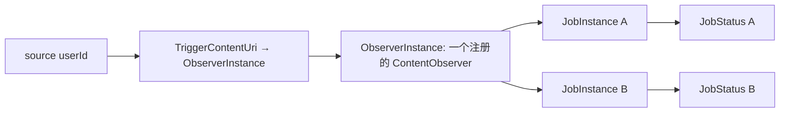
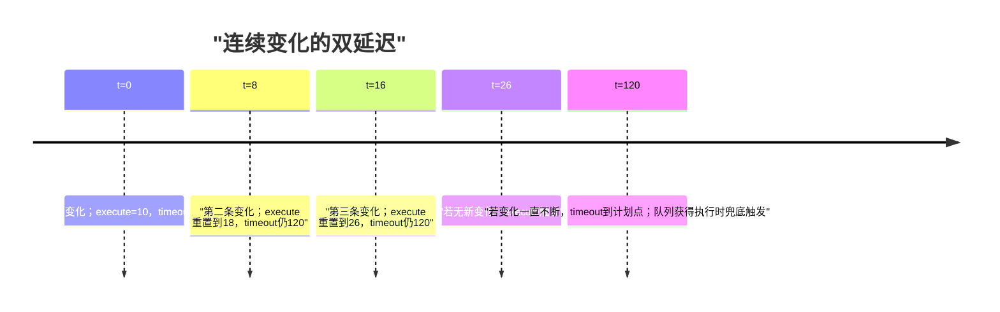
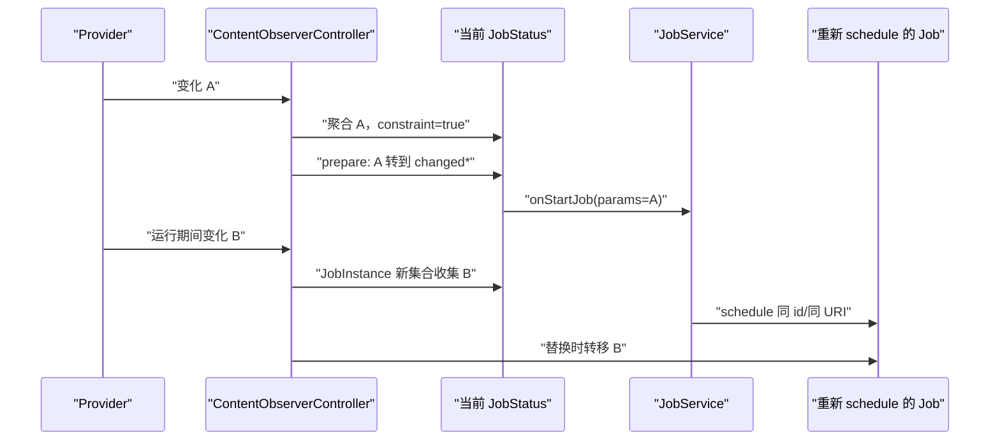
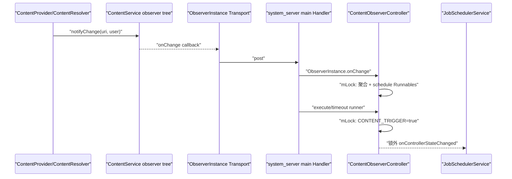
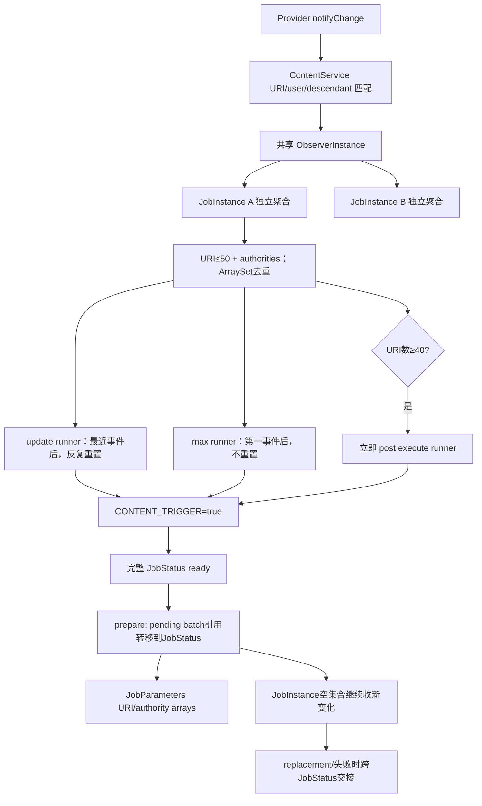

# 125 Android ContentObserverController：URI 触发、聚合与双延迟

> 源码版本：Android 11 / API 30 / `android-11.0.0_r48`  
> 学习方式：macOS 只读源码，不要求编译  
> 前置章节：第 118、121、124 章

---

## 1. 为什么 JobScheduler 要观察 ContentProvider

应用常见需求不是“每 15 分钟扫描数据库”，而是：

```text
联系人/媒体/文档真的变化时，再批量执行索引、同步或备份
```

JobInfo 提供：

```java
new JobInfo.Builder(id, service)
        .addTriggerContentUri(new JobInfo.TriggerContentUri(
                MediaStore.Images.Media.EXTERNAL_CONTENT_URI,
                TriggerContentUri.FLAG_NOTIFY_FOR_DESCENDANTS))
        .setTriggerContentUpdateDelay(10_000)
        .setTriggerContentMaxDelay(120_000)
        .build();
```

ContentObserverController 把 ContentResolver 的细粒度变化事件转换成 JobStatus 的一个可调度约束，并解决四个问题：

1. 多个 Job 观察同一 URI 时如何共享 ContentObserver？
2. 高频变化怎样 debounce，又怎样保证不会无限推迟？
3. 哪些 URI/authority 要传给 JobService？
4. Job 正在执行、失败或被同 ID 新 Job 替换时，怎样避免漏掉变化？

核心认识：

> 这里不是“URI 一变化就立即运行 Job”，而是共享观察、每 Job 独立聚合、双时间门触发，再交给完整 JobScheduler ready 公式裁决。

---

## 2. 源码地图

主文件：

```text
frameworks/base/apex/jobscheduler/service/java/com/android/server/job/controllers/
└── ContentObserverController.java
```

配合阅读：

```text
frameworks/base/apex/jobscheduler/framework/java/android/app/job/JobInfo.java
frameworks/base/apex/jobscheduler/framework/java/android/app/job/JobParameters.java
frameworks/base/apex/jobscheduler/service/java/com/android/server/job/controllers/JobStatus.java
frameworks/base/apex/jobscheduler/service/java/com/android/server/job/JobConcurrencyManager.java
frameworks/base/apex/jobscheduler/service/java/com/android/server/job/JobServiceContext.java
frameworks/base/core/java/android/content/ContentResolver.java
```

第 118 章已经讲过 ContentService 的 Observer 树和 `notifyChange()`。本章从 system_server 中 JobScheduler 注册的 ContentObserver 接着往下追。

---

## 3. API 限制先记住

TriggerContentUri 不能与以下模式组合：

- periodic Job；
- persisted Job。

`JobInfo.Builder.build()` 会抛 `IllegalArgumentException`。

### 3.1 为什么不允许 periodic

URI 变化本身就是触发源。若同时使用 period，会出现“到底是本周期运行还是变化触发运行”的状态和重排歧义。

### 3.2 为什么不允许 persisted

ContentObserver 是运行时注册关系，而且 JobScheduler 没有把 pending URI 集合持久化到 jobs.xml。重启期间变化也无法凭空补齐，因此 API 不承诺这种组合。

### 3.3 怎样持续观察

API 文档要求：处理完本次变化前，重新 schedule 一个观察相同 URI 的 Job。系统会在旧 Job 运行期间继续观察，并把新变化转移给替代 Job。

---

## 4. TriggerContentUri 由什么组成

```java
final Uri mUri;
final int mFlags;
```

Android 11 公开 flag 只有：

```text
FLAG_NOTIFY_FOR_DESCENDANTS
```

它直接映射到 `registerContentObserver(uri, notifyForDescendants, ...)`。

### 4.1 flag 是共享键的一部分

`TriggerContentUri.equals()` 比较 URI 和 flags。因此：

```text
content://media/images, flags=0
content://media/images, flags=DESCENDANTS
```

是两个不同的观察配置，不能共享同一个 ObserverInstance。

---

## 5. 三层状态模型



三层职责：

| 层 | 生命周期 | 保存什么 |
|---|---|---|
| Controller | JobSchedulerService 生命周期 | tracked jobs、按用户 observer cache |
| ObserverInstance | 至少一个 Job 使用同一 user+trigger | ContentResolver 注册、关联 JobInstance 集合 |
| JobInstance | 一个具体 JobStatus 的观察状态 | changed URI/authority、两个 Runnable、pending 状态 |

共享只发生在观察入口；聚合结果和触发计时是每个 Job 独立的。

---

## 6. 为什么 observer cache 先按 userId 分层

字段：

```java
SparseArray<ArrayMap<TriggerContentUri, ObserverInstance>> mObservers;
```

注册时传入：

```java
registerContentObserver(uri, descendants, observer, sourceUserId)
```

同一个 URI 在 user 0 和工作资料 user 10 中对应不同 Provider 数据域、权限和通知空间。因此 cache 键必须是：

```text
sourceUserId + TriggerContentUri(uri + flags)
```

不是 calling user，也不是全局 URI 字符串。

---

## 7. 为什么多个 Job 共享 ObserverInstance

若 100 个 Job 都观察同一用户的同一 URI 配置，注册 100 个 ContentObserver 会增加 ContentService 树节点、Binder 回调和清理成本。

这里创建一次 ObserverInstance，再维护：

```java
final ArraySet<JobInstance> mJobs = new ArraySet<>();
```

收到一次 onChange 后，在 JobScheduler 锁下分发给所有关联 JobInstance。每个 Job 仍根据自己的 update/max delay 计时。

---

## 8. Job 开始跟踪

`maybeStartTrackingJobLocked()`：

```java
if (hasContentTriggerConstraint()) {
    if (contentObserverJobInstance == null) {
        contentObserverJobInstance = new JobInstance(job);
    }
    mTrackedTasks.add(job);
    setTrackingController(TRACKING_CONTENT);
    ...
}
```

JobInstance 构造阶段：

1. 取得 source user；
2. 为每个 TriggerContentUri 查 cache；
3. 没有则注册新的 ContentObserver；
4. 把本 JobInstance 加入 ObserverInstance.mJobs；
5. 把 ObserverInstance 加入自己的 mMyObservers，便于反向 detach。

---

## 9. content trigger 是普通 required constraint

JobStatus 构造时，只要 TriggerContentUris 非 null：

```java
requiredConstraints |= CONSTRAINT_CONTENT_TRIGGER;
```

初始通常为不满足。URI 事件经过聚合后才调用：

```java
setContentTriggerConstraintSatisfied(true)
```

它进入 `CONSTRAINTS_OF_INTEREST`，所以还必须和网络、充电、存储、时间等普通约束一起满足；deadline override 也可能绕过它。

---

## 10. ContentObserver 回调运行在哪里

ObserverInstance 构造时使用：

```java
new Handler(mContext.getMainLooper())
```

ContentObserver 的 Transport 最终把回调投到 system_server 主 Looper。onChange 随后进入 `synchronized (mLock)`，修改 JobInstance 状态。

这不意味着 Provider 的 notifyChange 在主线程同步等待 JobScheduler 完成。第 118 章已经看到通知跨 Binder/Handler 分发；这里是接收端线程选择。

---

## 11. 一次 onChange 怎样记录数据

对关联的每个 JobInstance：

```java
if (mChangedUris == null) mChangedUris = new ArraySet<>();
if (mChangedUris.size() < 50) mChangedUris.add(uri);

if (mChangedAuthorities == null) mChangedAuthorities = new ArraySet<>();
mChangedAuthorities.add(uri.getAuthority());

scheduleLocked();
```

两个集合都去重：同一 URI 重复变化不会重复占条目；同一 authority 的多个 URI 只保存一次 authority 名称。

---

## 12. URI 上限与 authority 的差异

常量：

```text
MAX_URIS_REPORTED = 50
URIS_URGENT_THRESHOLD = 40
```

当前 Android 11 实现：

- mChangedUris 最多保留 50 个不同 URI；
- 达到 50 后继续收到变化，不再加入新 URI；
- mChangedAuthorities 没有同样的 50 项判断，仍继续去重记录回调所携带的 authority；
- 达到 40 个 URI 后 update runner 立即 post。

### 12.1 API 文档为何仍要求处理 null

JobParameters 注释说 URI 太多时 `getTriggeredContentUris()` 可能为 null，并建议始终依赖 authorities 判断是否由内容触发。当前控制器实际截断为最多 50，而非主动把数组清成 null。

应用应遵循公共 API 的保守契约：URI 细节可缺失/不完整，authority 是更稳健的“发生过内容回调及其 Provider 域”指示；它同样不是完整变更日志。源码学习则同时记录 r48 的具体截断实现。

---

## 13. 两个 Runnable 分别代表什么

每个 JobInstance 创建：

```java
mExecuteRunner = new TriggerRunnable(this);
mTimeoutRunner = new TriggerRunnable(this);
```

两个对象最终都调用同一个 `trigger()`，但调度语义不同：

| Runnable | 基准 | 新变化是否重置 | 目的 |
|---|---|---:|---|
| execute runner | 最近一次变化 | 是 | 等一小段安静期，批量处理 |
| timeout runner | 第一轮变化 | 否 | 保证连续变化不会无限推迟 |

这就是 debounce + max latency 的组合。

---

## 14. 第一次变化发生什么

```java
if (!mTriggerPending) {
    mTriggerPending = true;
    postDelayed(mTimeoutRunner, maxDelay);
}
removeCallbacks(mExecuteRunner);
postDelayed(mExecuteRunner, updateDelay);
```

第一次变化同时启动：

- 从 first event 起算的 max delay；
- 从 latest event 起算的 update delay。

`mTriggerPending` 防止后续变化重复启动 max timer。

---

## 15. 后续变化发生什么

每次变化都：

1. 累加/去重 URI 和 authority；
2. 不动已经排队的 timeout runner；
3. 删除旧 execute runner；
4. 从本次变化重新 post update delay。

因此连续写入会不断把“安静期触发”的计划时间向后推，但不会晚于从第一条变化计算的 timeout runner **计划时间**。这不是墙钟硬保证：main Handler 不唤醒设备且可能排队拥堵，实际 `trigger()` 可以晚于该 max 值。

---

## 16. 双延迟时间线

假设 update=10 秒，max=120 秒：



两个 Runnable 可能都已在 MessageQueue 中，但先运行的 trigger 会 `unscheduleLocked()` 删除另一个。

---

## 17. 默认值和下限

JobInfo Builder 未设置时存 `-1`，JobStatus getter 应用默认/下限：

| 参数 | 默认 | 最低有效值 |
|---|---:|---:|
| update delay | 10 秒 | 500 毫秒 |
| max delay | 2 分钟 | 1 秒 |

代码是分别 clamp：

```java
return Math.max(requested, MIN_TRIGGER_...);
```

### 17.1 没有强制 update <= max

当前 getter 没有互相校正。如果应用设置 update=60秒、max=5秒，timeout 会先触发；这仍符合“最大总延迟”的直觉。

如果 update=1秒、max=120秒，安静期通常先触发。

---

## 18. 40 个 URI 为何立即触发

```java
if (mChangedUris.size() >= URIS_URGENT_THRESHOLD) {
    mHandler.post(mExecuteRunner);
}
```

系统最多保留 50 个 URI。接近上限时若继续等待，很可能丢掉更多 URI 细节，因此 40 项时就请求尽快把当前批次交给 Job。

它仍只是让 content constraint 变为 true，不是绕过其他约束强行执行。

### 18.1 重复 URI不会推进阈值

ArraySet 去重，同一个 URI 改 100 次，集合 size 仍可能是 1；会不断重置 update delay，但不会因为事件次数达到 40 而走 urgent 路径。

---

## 19. `trigger()` 做了什么

```java
if (mTriggerPending) {
    if (setContentTriggerConstraintSatisfied(true)) {
        reportChange = true;
    }
    unscheduleLocked();
}
```

随后在锁外：

```java
if (reportChange) onControllerStateChanged();
```

关键点：

- 只有 pending 状态才生效；
- bit 真正 false→true 才通知 Scheduler；
- 先取消两个 callbacks，避免二次触发；
- changed sets 不在这里清空，它们要留到执行准备阶段。

---

## 20. constraint=true 后仍继续观察吗

继续。ObserverInstance 与 JobInstance 没有因为 trigger 就 detach。

如果 Job 还在等网络或 quota，这期间的新变化继续加入同一批。因为 bit 已是 true，后续 trigger 不会重复通知 Scheduler，但数据集合仍增长至上限。

---

## 21. 从观察缓存到执行参数的原子转移

Job 真正获得执行槽之前，JobConcurrencyManager 调用所有 Controller：

```java
controller.prepareForExecutionLocked(pendingJob);
```

ContentObserverController 在锁下：

```java
job.changedUris = jobInstance.mChangedUris;
job.changedAuthorities = jobInstance.mChangedAuthorities;
jobInstance.mChangedUris = null;
jobInstance.mChangedAuthorities = null;
```

这不是复制，而是所有权转移。

### 21.1 为什么转移后仍保持 Observer 注册

旧批次放进正在执行 Job 的 `changed*`；JobInstance 的集合清空，可立即收集执行期间到来的新批次。

于是有两代数据同时存在：

```text
JobStatus.changed*：本次 JobParameters 要处理的批次
JobInstance.mChanged*：执行期间新到、留给下一次调度的批次
```

这正是“不漏变化”的核心。

---

## 22. JobServiceContext 怎样构造 JobParameters

执行前：

```java
Uri[] triggeredUris = arrayFrom(job.changedUris);
String[] triggeredAuthorities = arrayFrom(job.changedAuthorities);

new JobParameters(..., triggeredUris, triggeredAuthorities, job.network);
```

应用在 `onStartJob()` 中读取：

```java
params.getTriggeredContentUris();
params.getTriggeredContentAuthorities();
```

ArraySet 的遍历顺序不是业务时序保证。应用不应假设 URI 按通知发生时间排列。

---

## 23. authorities 为什么是可靠的粗粒度信号

URI 细节会受上限、公共 API 契约和 Provider 通知粒度影响；authority 集合只回答哪些 Provider 域发生过变化。

稳健业务模式：

```text
有 URI → 定向增量处理
无 URI但有 authority → 对该 authority 做较宽查询/重新同步
两者都 null → Job 可能因 deadline/override 等其他路径运行
```

不要把 URI 数组当成完整数据库变更日志。

---

## 24. URI 通知也不是行级 ChangeLog

ContentProvider 可以：

- 通知集合 URI；
- 通知具体 item URI；
- 通知祖先并启用 descendants 匹配；
- 合并多次 notifyChange；
- 在事务后只通知一次。

Controller 只记录回调传来的 URI，不知道 INSERT/UPDATE/DELETE 类型、旧值、新值或事务序号。

业务需要自行查询真实数据并保证幂等。

---

## 25. 正在运行时的新变化怎样留给下一 Job

推荐模式：



只依赖“Job 运行完以后再注册 Observer”会存在窗口；系统设计要求在完成前重新 schedule。

---

## 26. 同 ID replacement 的状态转移

调度同 UID+jobId 的新 Job 时，旧 Job 被取消并传入 `incomingJob`。

`maybeStopTrackingJobLocked(old, incoming, ...)`：

1. 取消旧 JobInstance 的 pending runners；
2. 把旧 JobInstance 尚未 prepare、或 prepare 后运行期间新积累的 changed sets 移给 incoming JobInstance；
3. 暂不 detach observers，避免替换缝隙漏通知；
4. 随后的 start tracking 新 Job复用 observer；
5. 再 detach old instance。

这是一个跨 JobStatus 的交接协议，不只是简单 remove/add。但它不会把已经转入旧
`JobStatus.changed*`、并已交给当前 JobParameters 的执行快照再次无条件复制给显式 replacement；那一批已经由当前 JobService 持有。

---

## 27. 为什么 start tracking 还接收 `lastJob`

新 Job 建立并关联共享 observers 后：

```java
if (lastJob.contentObserverJobInstance != null) {
    lastJob.contentObserverJobInstance.detachLocked();
    lastJob.contentObserverJobInstance = null;
}
```

detach 延迟到新观察关系已就绪之后，从而缩小/消除无人监听窗口。

如果 old 与 new 的 TriggerContentUri 不同，旧 observer 会在没有其他 Job 使用时正确注销，新 observer 已先注册。

---

## 28. 替换 Job 如何恢复 pending bit

新 Job start tracking 时检查：

```java
havePendingUris = jobInstance.mChangedAuthorities != null;
setContentTriggerConstraintSatisfied(havePendingUris);
```

因此转移来的变化无需再等待一次新的 ContentObserver 回调；新 Job 的 content constraint 立即为 true。

这里以 authority 非 null 作为“有变化”的权威标记，即使 URI 细节缺失仍能恢复触发。

---

## 29. 执行失败为何还要再转移一次

`prepareForExecutionLocked()` 已把批次移到 `JobStatus.changed*`。如果 Job 失败并按 backoff 创建新 JobStatus：

```java
rescheduleForFailureLocked(newJob, failureToReschedule) {
    newJob.changedAuthorities = old.changedAuthorities;
    newJob.changedUris = old.changedUris;
}
```

新 Job start tracking 时又把这些数据合并回自己的 JobInstance，并设置 content bit=true。

否则失败一次就会“消费掉”尚未成功处理的变化。

---

## 30. 成功、失败、替换三条路径对比

| 路径 | 已交付批次 | 运行期间新批次 |
|---|---|---|
| 成功并重新 schedule | 视为应用已处理，不再重报 | replacement 转给新 Job |
| 失败重排 | 复制到 failure reschedule，再次报告 | 同时由观察实例继续保留/交接 |
| 外部同 ID replacement | 已交给当前 JobParameters 的快照不重复复制 | JobInstance 中尚未交付/运行期新批次转给 incoming Job |
| 取消且无 incoming | 丢弃待处理状态并注销无人使用 observer | 不再观察 |

是否“成功处理”由 Job 完成协议决定，Controller 不理解业务事务。

---

## 31. 普通取消怎样清理

没有 incoming Job 时：

```java
unscheduleLocked();
detachLocked();
contentObserverJobInstance = null;
```

detach 对每个 ObserverInstance：

1. 从 obs.mJobs 删除本 JobInstance；
2. 若仍有其他 Job，继续保留注册；
3. 若集合变空，向 ContentResolver unregister；
4. 从对应 user 的 cache map 删除 trigger key。

外层空 user map 没有在这里删除，但其中不再有 observer 项；这是小型容器残留，不是活跃 Binder 注册泄漏。

---

## 32. `unschedule` 与 `detach` 不是一回事

| 方法 | 取消两个 Runnable | 解除 ContentObserver 关系 |
|---|---:|---:|
| `unscheduleLocked()` | 是 | 否 |
| `detachLocked()` | 否 | 是 |

替换期间先 unschedule，避免旧 Job触发；但延迟 detach，避免观察空窗。普通取消则两者都做。

---

## 33. TriggerContentUri 与 ContentService 匹配

`FLAG_NOTIFY_FOR_DESCENDANTS` 传给 ContentResolver 后，真正的 URI ancestor/exact/descendant 路由由第 118 章的 ContentService observer tree 完成。

本 Controller 不再次解析 URI path；它接收已经匹配成功的回调，并负责 Job 级去重、计时和状态交接。

---

## 34. selfChange 在这里为何被忽略

ObserverInstance 收到：

```java
onChange(boolean selfChange, Uri uri)
```

但无论 selfChange 为何都记录变化。JobScheduler 注册的 observer 不是业务进程中主动发 notify 的同一个 observer token，通常不需要像 UI observer 那样抑制自身变化。

源码日志打印 selfChange，但没有过滤分支。

---

## 35. 多 URI 与多个 observer 的关系

一个 Job 可以 add 多个 TriggerContentUri，于是一个 JobInstance 加入多个 ObserverInstance。

任一匹配回调都会写入同一组 mChangedUris/mChangedAuthorities，并共享该 Job 的一对 Runnable。因此：

```text
URI A 在 t0 变化
URI B 在 t0+8s 变化
```

B 会重置同一 update delay；max delay仍从 A 的首个事件算起。

---

## 36. 同一 Job 重复添加相同 trigger 会怎样

Builder 使用 ArrayList，没有在 API 层明显去重。构造 JobInstance 时，同一个 ObserverInstance 的 `mJobs` 是 ArraySet，因此关联不会重复；但 `mMyObservers` 是 ArrayList，可能保留重复引用。

detach 重复 remove 同一个 JobInstance 是幂等的；第一次可能注销 observer，后续 cache remove 为空。业务没有收益，应避免重复配置。

---

## 37. 权限边界

Controller 运行在 system_server，并以指定 user 注册 ContentObserver。它不是把 Provider 数据自动交给 JobService：

- JobParameters 只携带 URI 字符串对象和 authority 名称；
- 应用真正 query Provider 时仍需自身权限/AppOps/URI grant；
- URI 触发配置不授予额外读写权；
- 多用户隔离仍由 source user 和 Provider 权限执行。

观察到“发生变化”不等于获得“读取内容”的授权。

---

## 38. Binder/线程/锁的完整链



JobService 的 `onStartJob()` 不在这个 Handler 回调中直接执行，而是经过 pending、并发槽、bind 和应用主线程。

---

## 39. Handler 双计时器不是 AlarmManager

update/max delay 使用 `Handler.postDelayed()`：

- 基于进程内 MessageQueue；
- 不注册 wakeup alarm；
- 不保证休眠时按毫秒唤醒；
- system_server 主线程拥堵会延迟执行；
- 适合秒到分钟级事件合并，不是硬 deadline。

这与第 124 章 TimeController 的 AlarmManager wakeup deadline 有本质区别。

---

## 40. 设备休眠期间的语义

ContentProvider 变化通常发生在设备运行或某组件已唤醒时，但触发 Runnable 本身不会为 update/max delay 专门唤醒设备。

即使 Runnable 运行并把 constraint 设为 true，DeviceIdleController、quota 和其他约束仍可能延后 Job。

所以 max delay 是“最多多久把 content bit 置 true”的进程内批处理上限，不是 Job 最迟启动保证。

---

## 41. 为什么 changed sets 在 trigger 时不冻结

constraint=true 到真正获得执行槽之间可能相隔很久。继续积累变化可让一次 Job 处理更完整的批次，减少重复调度。

真正冻结/分代点是 `prepareForExecutionLocked()`，因为此时 Job 即将构造 JobParameters；随后新事件必须留给下一代。

---

## 42. prepare 后执行失败得很早怎么办

如果执行失败并且调度器确实走 `needsReschedule`/failure reschedule，`rescheduleForFailureLocked()` 会复制已准备的 changed data。不能从本 Controller 单独推导所有失败都必然如此；例如 `executeRunnableJob()` 同步遇到 `bindService=false` 的具体后续处置，还需结合调用方路径另行判断。

但系统崩溃/重启不是同级保证：TriggerContentUri Job 不能 persisted，内存 pending 集合会消失。这正是 API 禁止 persisted 组合的现实边界。

---

## 43. 达到 urgent 后仍可能积累到 50

`post(mExecuteRunner)` 是把消息排到 main queue，不是当前 onChange 栈内同步 trigger。若队列前还有事件或同一批回调连续到达，集合可能继续增长到 50。

达到 40 后每次 schedule 都会 remove旧 execute runner再 post新 runner；timeout保持不动。最终某个 runner 获得执行时统一置 bit。

---

## 44. `uri` 是否可能为 null

ObserverInstance 直接调用：

```java
uri.getAuthority()
```

这条实现假设针对带 URI 注册的 ContentObserver 回调会提供非 null URI。公共 ContentObserver API 的其他重载/旧调用语义可能更宽，但本控制器路径依赖具体 URI。

阅读代码时不能擅自写成“null URI 会只记 authority”；这里没有该防御分支。

---

## 45. Media URI 的额外 standby 语义

JobStatus 构造时还检查 trigger 是否全部属于特定 MediaStore URIs，设置 `exemptedMediaUrisOnly`。这可参与 App Standby 豁免判断。

它不是 ContentObserverController 的触发算法本身，但提醒我们 TriggerContentUri 还会影响后台治理。不能只在本 Controller 文件里搜索所有语义。

---

## 46. dumpsys 能看到什么

Controller dump 包含：

- tracked content jobs；
- 按 user 的 observers；
- trigger URI、flags、ObserverInstance identity；
- 关联 Job；
- trigger pending 时的 update/max delay；
- changed authorities；
- changed URIs。

有设备时可选：

```bash
adb shell dumpsys jobscheduler
adb shell dumpsys content
```

macOS 阅读不要求设备。

---

## 47. 诊断“内容变了 Job 没跑”的顺序

1. JobInfo 是否真的包含 TriggerContentUri？
2. build 是否因 periodic/persisted 组合失败？
3. source user 是否正确？
4. URI 和 descendants flag 是否覆盖实际 notify URI？
5. Provider 是否真正调用 notifyChange？
6. update delay 是否还在被新事件重置？
7. max delay 的有效值是多少？
8. content bit 是否已 true？
9. 网络、充电、quota、Doze 等其他约束是否满足？
10. Job 是否正在运行，而新变化被保留给下一次 replacement？
11. 应用是否在完成前重新 schedule？
12. JobParameters URI 是否因公共契约只应被视为有限提示？

---

## 48. 常见误解一：一次 URI 变化立刻启动 Job

错误。先经过 update delay/max delay/urgent 聚合，再置 content bit，最后还走完整 ready 与并发调度。

---

## 49. 常见误解二：update delay 从第一条变化算

错误。它从最近一条变化重新计算；max delay才固定从第一轮变化算。

---

## 50. 常见误解三：max delay 是 Job 最迟执行时间

错误。它只兜底触发 content constraint，且 Handler 本身非 wakeup/硬实时；其他约束仍可继续等待。

---

## 51. 常见误解四：50 是事件数量上限

错误。它是去重后的 URI 细节集合上限。同一 URI 千次变化仍只占一项；authority 另行去重记录。

---

## 52. 常见误解五：共享 Observer 就共享聚合窗口

错误。ObserverInstance 共享回调注册，但每个 JobInstance 有自己的 changed sets、update/max delay 和 trigger pending。

---

## 53. 常见误解六：执行开始后系统不再观察

错误。prepare 将旧集合转走后，JobInstance 继续接收新变化，留给 replacement/下一次 Job。

---

## 54. 常见误解七：TriggerContentUri 授予 Provider 权限

错误。它只设置系统观察条件；应用 query 时仍受权限、AppOps 和用户边界限制。

---

## 55. 常见误解八：URI 数组就是完整 change log

错误。它有上限、去重、无顺序保证、无操作类型，也取决于 Provider 通知粒度。业务必须重新查询和幂等处理。

---

## 56. 常见误解九：旧 Job detach 后再注册新 Job 没关系

错误。替换协议刻意先建立新观察关系、后 detach 旧实例，以避免两者之间漏通知。

---

## 57. 与第 118 章的分工

```text
第118章 ContentService：
  谁的 URI 注册与本次 notify 匹配？怎样跨用户/祖先/后代分发？

本章 ContentObserverController：
  匹配回调到达后，怎样按 Job 聚合、延迟、置约束、交付和重排？
```

前者是观察者路由树，后者是 Job 调度状态机。

---

## 58. 与第 124 章的分工

| 机制 | update/max content delay | minimum latency/deadline |
|---|---|---|
| 定时设施 | main Handler Runnable | AlarmManager Listener |
| 唤醒设备 | 否 | deadline 可 wakeup |
| 重置逻辑 | update随事件重置、max不重置 | elapsed里程碑固定 |
| 产出 | CONTENT_TRIGGER bit | TIMING_DELAY/DEADLINE bit |
| 是否强制执行 | 否 | 一次性deadline可覆盖普通约束 |

名字都含 delay，语义完全不同。

---

## 59. macOS 只读练习一：画对象图

```bash
rg -n "mObservers|class ObserverInstance|class JobInstance|mMyObservers|mJobs" \
  frameworks/base/apex/jobscheduler/service/java/com/android/server/job/controllers/ContentObserverController.java
```

画出：两个 user、每 user 两个 trigger、三个 Job，其中两个共享一个 trigger。标出哪些 ObserverInstance 可共享、哪些绝不能共享。

---

## 60. macOS 只读练习二：手算双计时器

```bash
sed -n '300,335p' \
  frameworks/base/apex/jobscheduler/service/java/com/android/server/job/controllers/ContentObserverController.java
```

设置 update=10s、max=30s，事件发生在 0、8、16、24 秒。回答：

- execute runner 每次计划在哪？
- timeout runner 始终在哪？
- 最终哪一个先执行？

答案：execute 依次 10→18→26→34，timeout保持30，因此30秒兜底触发。

---

## 61. macOS 只读练习三：验证默认与 clamp

```bash
rg -n "DEFAULT_TRIGGER|MIN_TRIGGER|getTriggerContentUpdateDelay|getTriggerContentMaxDelay" \
  frameworks/base/apex/jobscheduler/service/java/com/android/server/job/controllers/JobStatus.java
```

分别手算请求 `-1、0、800、200000` 时两个 getter 的有效值。

---

## 62. macOS 只读练习四：追批次所有权

```bash
rg -n "prepareForExecutionLocked|changedAuthorities|changedUris|rescheduleForFailureLocked" \
  frameworks/base/apex/jobscheduler/service/java/com/android/server/job/controllers/ContentObserverController.java \
  frameworks/base/apex/jobscheduler/service/java/com/android/server/job/JobServiceContext.java
```

用不同颜色标出：

```text
JobInstance pending batch → JobStatus execution batch → JobParameters arrays
```

再画失败时怎样回到新 JobInstance。

---

## 63. macOS 只读练习五：验证替换无空窗

```bash
sed -n '65,180p' \
  frameworks/base/apex/jobscheduler/service/java/com/android/server/job/controllers/ContentObserverController.java
```

按 JobScheduler 的调用顺序写出：

```text
old stop(incoming) → incoming start(lastJob=old)
```

解释为何 stop 阶段不 detach，而 start 末尾才 detach old。

---

## 64. 阅读检查题

1. ObserverInstance 的完整 cache key 是什么？
2. 同一 observer 下两个 Job 是否共享 update delay？
3. 第 39 个不同 URI 与第 40 个有何行为差异？
4. 第 51 个不同 URI 的 authority 是否仍可能记录？
5. constraint=true 到实际执行之间的新变化存在哪里？
6. prepare 为什么用引用转移而不是复制？
7. 失败重排为什么必须重报旧批次？
8. JobParameters 两个数组都为 null 可以说明什么？
9. TriggerContentUri 为什么不能 persisted？
10. Handler max delay 和 override deadline 最大差异是什么？

---

## 65. 一页复习图



---

## 66. 本章结论

ContentObserverController 可压缩为六个设计点：

1. 按 source user + URI + flags 共享 ContentObserver；
2. 每个 JobInstance 独立记录去重的 URI/authority 和双计时器；
3. update delay 等安静期，max delay防无限拖延，40项提前触发、50项截断URI细节；
4. 触发只满足 CONTENT_TRIGGER，不能绕过完整调度约束；
5. prepare 时将本次批次与继续观察的新批次分代；
6. replacement 和 failure reschedule 都有状态交接，避免执行期间或失败时漏变化。

最重要的一句话：

> TriggerContentUri 是“请在变化后安排一次可重查、可幂等的工作”，不是一份完整、持久、逐事件的数据库变更日志。

---

## 67. 复读后的易混点修订

初稿完成后对照 `ContentObserverController`、`JobStatus`、`JobInfo`、`JobParameters`、`JobConcurrencyManager` 和 `JobServiceContext` 复读，补强并修正：

1. 明确 observer 共享键包含 source user、URI 与 flags，而聚合窗口仍按 JobInstance 独立；
2. 分开最近事件 update runner 与首事件 timeout runner，说明先触发者会取消另一个；
3. 区分 40 个不同 URI 的 urgent 阈值与最多50个 URI细节，重复事件不增加 size；
4. 将公共 API“过多时 URI 可为 null”的保守契约与 r48 当前“保留最多50项”的实现并列，避免过度承诺；
5. 明确 authority 集合没有相同50项截断，是判断 pending content callback 的稳健标记，但也不是完整日志；
6. 补出 prepare 是引用所有权转移，观察实例清空后继续收下一代事件；
7. 完整拆开 replacement 无空窗交接和 failure reschedule 旧批次重报，并限定显式 replacement 不重复复制已交给当前 JobParameters 的执行快照；
8. 限定 max delay 只是 Handler 置约束上限，不唤醒、不保证 Job 最迟启动；
9. 强调 URI/authority 不授予 Provider 访问权限，也不构成有序 change log；
10. 补充空 user map、小于等于50的实际集合边界、重复 trigger、null URI 假设，以及同步 bind 失败不当然等于 failure reschedule。

下一章进入 `BatteryController`，研究 charging、battery-not-low、stable power、广播序号，以及电池状态变化如何立即运行或停止相关 Job。
