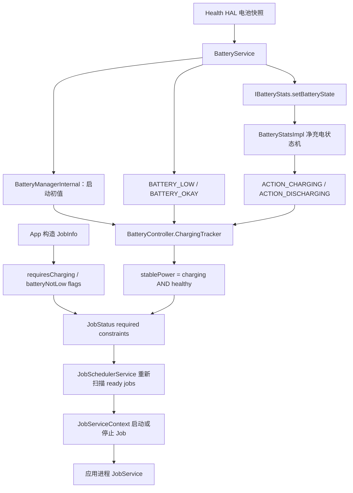
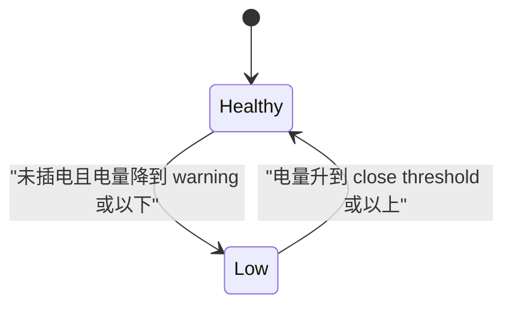
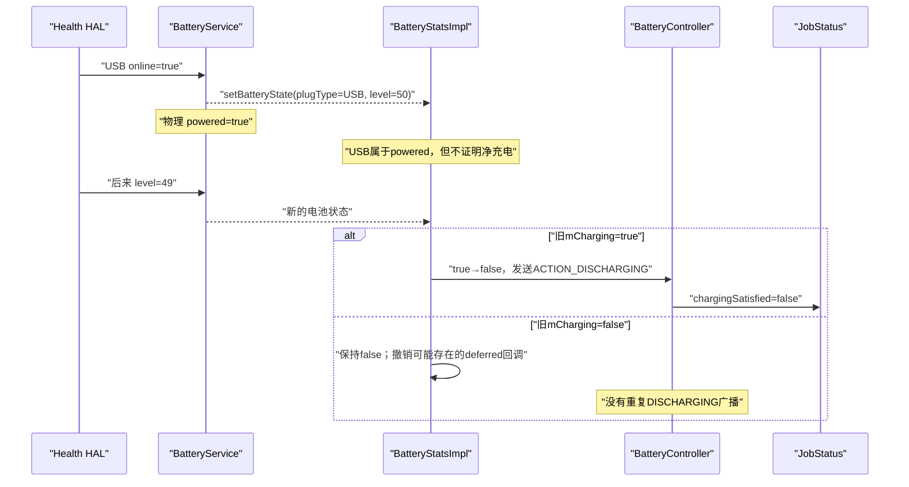
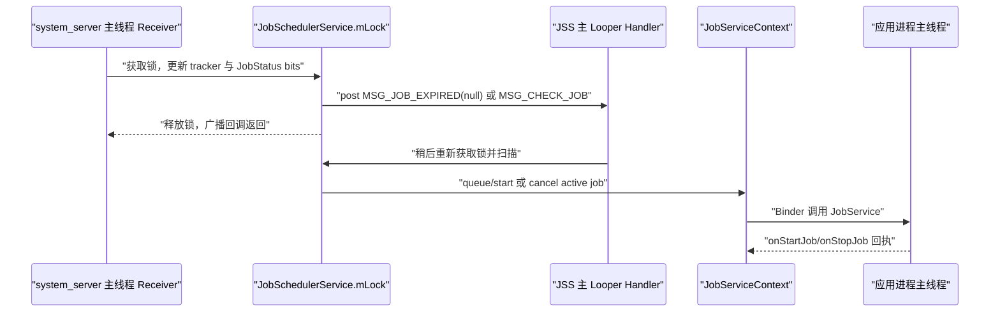
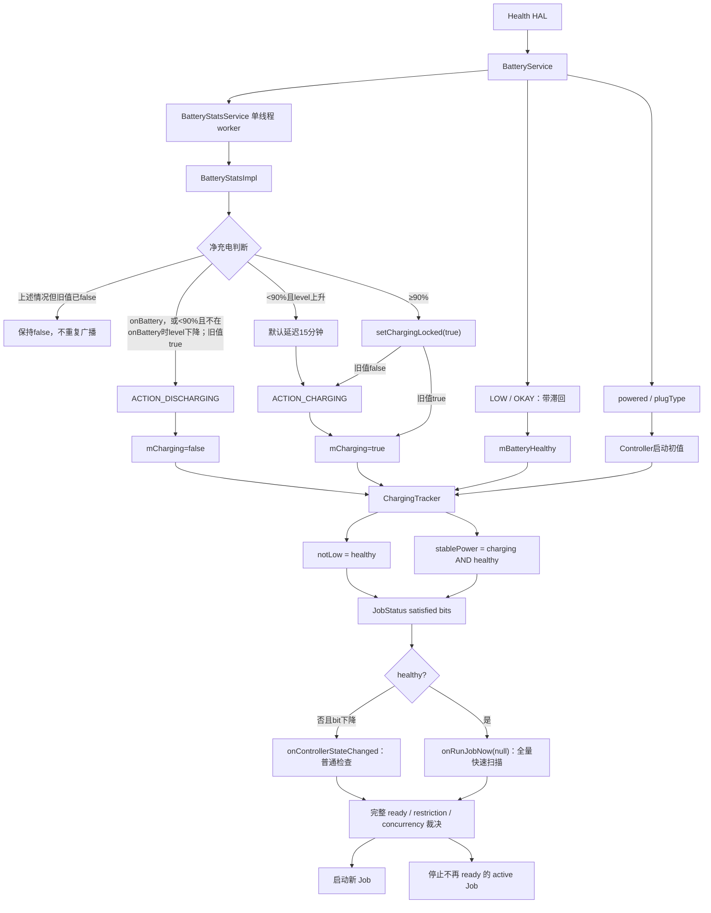

# 126 Android BatteryController：充电、稳定供电与电量约束

> 源码版本：Android 11 / API 30 / `android-11.0.0_r48`  
> 学习方式：macOS 只读源码，不要求编译、不要求连接设备  
> 前置章节：第 71、72、121、122 章

---

## 1. 本章先解决一个最常见的误解

应用这样声明 Job：

```java
JobInfo jobInfo = new JobInfo.Builder(jobId, serviceName)
        .setRequiresCharging(true)
        .setRequiresBatteryNotLow(true)
        .build();
```

很多人会自然地把它理解成：

```text
插上充电线 → requiresCharging 立即满足
电量百分比大于 0 → batteryNotLow 立即满足
```

在本章对应的 Android 11 r48 源码中，这两个理解都不准确。

BatteryController 实际使用两个内部布尔值：

```text
mCharging       = BatteryStats 认为设备已有足够净充电能力，可以承担额外工作
mBatteryHealthy = BatteryService 的低电/恢复广播状态
```

然后计算：

```text
stablePower  = mCharging && mBatteryHealthy
batteryNotLow = mBatteryHealthy
```

所以最先要记住的是：

> `setRequiresCharging(true)` 在这个版本要求的是“稳定供电”，不是“物理上插着线”；稳定供电还必须同时满足“电量不低”。

---

## 2. 本章源码地图

主角：

```text
frameworks/base/apex/jobscheduler/service/java/com/android/server/job/controllers/
└── BatteryController.java
```

Job API 与约束位：

```text
frameworks/base/apex/jobscheduler/framework/java/android/app/job/JobInfo.java
frameworks/base/apex/jobscheduler/service/java/com/android/server/job/controllers/JobStatus.java
frameworks/base/apex/jobscheduler/service/java/com/android/server/job/controllers/RestrictingController.java
```

电池事实的两个生产者：

```text
frameworks/base/services/core/java/com/android/server/BatteryService.java
frameworks/base/core/java/android/os/BatteryManagerInternal.java
frameworks/base/core/java/com/android/internal/os/BatteryStatsImpl.java
frameworks/base/services/core/java/com/android/server/am/BatteryStatsService.java
frameworks/base/services/core/java/com/android/server/am/ActivityManagerService.java
```

重新评估与执行：

```text
frameworks/base/apex/jobscheduler/service/java/com/android/server/job/StateChangedListener.java
frameworks/base/apex/jobscheduler/service/java/com/android/server/job/JobSchedulerService.java
frameworks/base/apex/jobscheduler/service/java/com/android/server/job/JobServiceContext.java
```

诊断命令入口：

```text
frameworks/base/apex/jobscheduler/service/java/com/android/server/job/JobSchedulerShellCommand.java
```

---

## 3. 先区分四个容易混在一起的状态

| 状态 | 谁定义 | 它回答的问题 | BatteryController 怎样使用 |
|---|---|---|---|
| powered / plugged | BatteryService | AC、USB、无线供电源是否在线 | 只用于控制器启动时给 `mCharging` 赋初值 |
| HAL battery status | Health HAL / BatteryService | 电池报告 CHARGING、FULL、DISCHARGING 等哪种状态 | 不直接作为 charging constraint bit |
| BatteryStats charging | BatteryStatsImpl | 供电是否足以让电量上升，适不适合承担额外工作 | 通过 `ACTION_CHARGING/DISCHARGING` 持续更新 `mCharging` |
| battery healthy/not-low | BatteryService | 是否处于系统低电警告区 | 通过 `BATTERY_LOW/OKAY` 更新 `mBatteryHealthy` |

它们不是四个同义词。

一个典型反例是：

```text
手机通过弱 USB 连接电脑
→ powered = true
→ 但视频通话等负载使电量继续下降
→ BatteryStats charging = false
→ stablePower = false
→ requiresCharging 不满足
```

`JobInfo.Builder.setRequiresCharging()` 的公开注释就用“视频通话 + USB 供电仍可能掉电”说明了这一点。

---

## 4. 一张总链路图



图中有两条独立、异步收敛的广播链：

- BatteryService 负责低电/恢复事实；
- BatteryStatsImpl 负责“适合额外工作”的 charging/discharging 事实。

不要假设两条异步链之间存在严格广播先后顺序；控制器接收事件后让最终状态逐步收敛。

---

## 5. JobInfo 怎样保存两个公开约束

`JobInfo` 中对应两个 bit：

```java
public static final int CONSTRAINT_FLAG_CHARGING = 1 << 0;
public static final int CONSTRAINT_FLAG_BATTERY_NOT_LOW = 1 << 1;
```

Builder 只是设置或清除 bit：

```java
public Builder setRequiresCharging(boolean requiresCharging) {
    mConstraintFlags = (mConstraintFlags & ~CONSTRAINT_FLAG_CHARGING)
            | (requiresCharging ? CONSTRAINT_FLAG_CHARGING : 0);
    return this;
}
```

`setRequiresBatteryNotLow()` 做同样的事。两者默认都是 `false`。

这里还没有读取电池，也没有立即决定 Job 能否运行；JobInfo 只是应用提交给系统的一份不可变需求描述。

---

## 6. JobInfo、JobStatus 与 BatteryController 的职责分工

```text
JobInfo
  保存“应用要求什么”

JobStatus.requiredConstraints / mDynamicConstraints
  保存“当前这个 Job 实际必须满足什么”

JobStatus.satisfiedConstraints
  保存“控制器目前判定哪些条件已经满足”

BatteryController
  只负责维护 charging 与 battery-not-low 两个 satisfied bit

JobSchedulerService
  把这些 bit 与其余门槛组合，决定 pending、running 或 stop
```

因此不能看到 BatteryController 调用 setter，就直接说“Job 开始运行了”。它只更新调度输入事实。

---

## 7. JobStatus 怎样判断自己是否需要电源控制器

源码：

```java
public boolean hasChargingConstraint() {
    return hasConstraint(CONSTRAINT_CHARGING);
}

public boolean hasBatteryNotLowConstraint() {
    return hasConstraint(CONSTRAINT_BATTERY_NOT_LOW);
}

boolean hasPowerConstraint() {
    return hasConstraint(CONSTRAINT_CHARGING | CONSTRAINT_BATTERY_NOT_LOW);
}
```

而 `hasConstraint()` 同时检查：

```java
return (requiredConstraints & constraint) != 0
        || (mDynamicConstraints & constraint) != 0;
```

这意味着 BatteryController 不只跟踪应用显式声明电量约束的 Job；被系统动态加入这些约束的 Job 也会被跟踪。这里的“加入”先让控制器维护对应 bit；是否真的成为本次运行必经门，还要看后文的 `withinQuota || dynamicSatisfied`。

---

## 8. 为什么 BatteryController 是 RestrictingController

Android 11 的 RESTRICTED App Standby bucket 会为 Job 动态加入：

```java
private static final int DYNAMIC_RESTRICTED_CONSTRAINTS =
        CONSTRAINT_BATTERY_NOT_LOW
        | CONSTRAINT_CHARGING
        | CONSTRAINT_CONNECTIVITY
        | CONSTRAINT_IDLE;
```

其中 connectivity 只有 Job 本来就要求网络时才保留；charging、battery-not-low 与 idle 则可以成为全新的动态条件。对 RESTRICTED Job，这组条件是“超出 quota 后仍获准运行”的替代通道，并非无论是否有 quota 都必须满足。

把条件加入 `mDynamicConstraints`，只表示各 Controller 要开始维护相应 satisfied bit；JobStatus 的总门仍是：

```text
withinQuota || dynamicSatisfied
```

即在 quota 内可以走左边；不在 quota 内时，才需要所有动态条件满足后走右边。第 42 节会把它放回完整 `isReady()` 公式。

因此：

```text
应用没有调用 setRequiresCharging(true)
≠ BatteryController 永远不会跟踪它
```

当应用进入 RESTRICTED bucket，`startTrackingRestrictedJobLocked()` 会重新让限制型控制器检查该 Job。离开时，若 Job 已不再有任何显式电源约束，BatteryController 才停止跟踪。

---

## 9. Controller 构造时就开始监听

`JobSchedulerService` 构造九类 Controller 时创建 BatteryController：

```java
mBatteryController = new BatteryController(this);
mControllers.add(mBatteryController);
...
mRestrictiveControllers.add(mBatteryController);
```

BatteryController 构造函数马上执行：

```java
mChargeTracker = new ChargingTracker();
mChargeTracker.startTracking();
```

注意此时还不代表所有持久 Job 都已附着到控制器。

在 `PHASE_THIRD_PARTY_APPS_CAN_START`，JobSchedulerService 才在全局锁内：

1. 设置 `mReadyToRock=true`；
2. 创建 JobServiceContext 执行槽；
3. 把 JobStore 中已有 Job 逐个交给全部 Controller；
4. 发送一次 `MSG_CHECK_JOB`。

所以“监听系统事实”和“开始跟踪某个 Job”是两个生命周期节点。

---

## 10. startTracking 注册了哪四个广播

```java
filter.addAction(Intent.ACTION_BATTERY_LOW);
filter.addAction(Intent.ACTION_BATTERY_OKAY);
filter.addAction(BatteryManager.ACTION_CHARGING);
filter.addAction(BatteryManager.ACTION_DISCHARGING);
mContext.registerReceiver(this, filter);
```

它没有监听：

```text
ACTION_POWER_CONNECTED
ACTION_POWER_DISCONNECTED
```

原因正是“插拔”和“净充电能力”不是同一个概念。

---

## 11. 为什么不能只等下一条广播

Controller 创建时设备可能已经插电，也可能已经低电。如果只注册广播而不初始化，直到下一次状态变化前，所有约束都会停留在 Java 默认值 `false`。

所以注册后立即读取 system_server 内的 LocalService：

```java
BatteryManagerInternal bmi =
        LocalServices.getService(BatteryManagerInternal.class);
mBatteryHealthy = !bmi.getBatteryLevelLow();
mCharging = bmi.isPowered(BatteryManager.BATTERY_PLUGGED_ANY);
```

`BatteryManagerInternal` 由 BatteryService 在 `onStart()` 发布，只供 system_server 内部使用，不经过普通应用 Binder API。

---

## 12. 一个重要的启动期近似

初始化时：

```text
mCharging ← isPowered(BATTERY_PLUGGED_ANY)
```

稳态更新时：

```text
mCharging ← ACTION_CHARGING / ACTION_DISCHARGING
```

两者语义并不完全相同。前者只是物理供电源在线，后者是 BatteryStats 的净充电判断。

因此 Android 11 r48 使用的是一个 bootstrap 近似状态：控制器先用 powered 建立初值，并可能一直保留到下一次 BatteryStats charging/discharging **状态转换**广播。源码没有说明这个不一致一定是刻意设计，注册前已经发过的非 sticky 广播也不会因注册而自动补发；所以不应把这段代码改写成“它调用了 `BatteryManager.isCharging()`”——源码没有这样做。

---

## 13. `BATTERY_PLUGGED_ANY` 包含什么

```java
BATTERY_PLUGGED_AC       = 1;
BATTERY_PLUGGED_USB      = 2;
BATTERY_PLUGGED_WIRELESS = 4;
BATTERY_PLUGGED_ANY      = AC | USB | WIRELESS;
```

BatteryService 的 `isPoweredLocked()` 检查相应 online 字段。若 Battery HAL 状态是 `BATTERY_STATUS_UNKNOWN`，它保守返回 `true`，用于兼容没有常规电池或状态未知的设备。

这里仍只能推出“启动初值认为 powered”，不能推出弱 USB 供电在稳态一定满足 charging。

---

## 14. Job 开始跟踪时怎样写入当前状态

```java
if (taskStatus.hasPowerConstraint()) {
    mTrackedTasks.add(taskStatus);
    taskStatus.setTrackingController(JobStatus.TRACKING_BATTERY);
    taskStatus.setChargingConstraintSatisfied(
            mChargeTracker.isOnStablePower());
    taskStatus.setBatteryNotLowConstraintSatisfied(
            mChargeTracker.isBatteryNotLow());
}
```

这里做三件事：

1. 把 JobStatus 放进 `mTrackedTasks`；
2. 在 JobStatus 记录“由 BatteryController 跟踪”；
3. 用当前快照初始化两个 satisfied bit。

`ArraySet` 不是电池状态历史，它只保存当前受本控制器管理的 JobStatus 引用。

---

## 15. 停止跟踪为何先检查 tracking bit

```java
if (taskStatus.clearTrackingController(JobStatus.TRACKING_BATTERY)) {
    mTrackedTasks.remove(taskStatus);
}
```

tracking bit 让清理具有幂等性：只有确实登记过本控制器时才从集合移除。

对于离开 RESTRICTED bucket 的 Job，代码还会先检查 `hasPowerConstraint()`；若它自己仍显式要求 charging 或 battery-not-low，就不能因为动态约束消失而停止跟踪。

---

## 16. 两个核心公式

```java
public boolean isOnStablePower() {
    return mCharging && mBatteryHealthy;
}

public boolean isBatteryNotLow() {
    return mBatteryHealthy;
}
```

可以写成真值表：

| `mCharging` | `mBatteryHealthy` | stable power | battery not low | 直观解释 |
|---:|---:|---:|---:|---|
| false | false | false | false | 低电且不具备净充电能力 |
| true | false | false | false | 虽有净充电信号，但仍处于低电保护区 |
| false | true | false | true | 电量健康，但供电不足或正在掉电 |
| true | true | true | true | 电量健康且具备稳定净充电能力 |

第二行最容易漏掉：收到 `ACTION_CHARGING` 也不能单独满足 `requiresCharging`，因为 stable power 仍要求 healthy。

---

## 17. 为什么 charging 已经隐含 battery-not-low

由于：

```text
chargingSatisfied = mCharging && mBatteryHealthy
batteryNotLowSatisfied = mBatteryHealthy
```

若一个 Job 只声明 `requiresCharging=true`，控制器仍要求电量健康。

若它同时声明两个约束，第二个约束从布尔逻辑上没有增加新的 BatteryController 状态门，但仍明确表达业务意图，也会分别保存在 JobInfo/JobStatus 中。

不要反过来说 battery-not-low 隐含 charging：健康但未充电时，battery-not-low 为 true，stable power 为 false。

---

## 18. `mBatteryHealthy` 来自低电广播状态机

广播接收逻辑非常直接：

```java
if (Intent.ACTION_BATTERY_LOW.equals(action)) {
    mBatteryHealthy = false;
    maybeReportNewChargingStateLocked();
} else if (Intent.ACTION_BATTERY_OKAY.equals(action)) {
    mBatteryHealthy = true;
    maybeReportNewChargingStateLocked();
}
```

但“什么时候发 LOW/OKAY”不由 Controller 决定，而由 BatteryService 的阈值和滞回逻辑决定。

---

## 19. BatteryService 怎样形成低电阈值

基线资源是：

```text
config_criticalBatteryWarningLevel = 5
config_lowBatteryWarningLevel      = 15
config_lowBatteryCloseWarningBump  = 5
```

基础配置对应：

```text
未插电且电量降到 ≤15%：进入 low
电量恢复到 ≥20%：离开 low 广播区
```

但不能把 15%/20% 写成所有 Android 设备的固定规则：

- 产品 resource overlay 可以覆盖资源；
- warning level 还读取 `Settings.Global.LOW_POWER_MODE_TRIGGER_LEVEL`；
- 值为 0 时回退默认；
- warning level 不得低于 critical level；
- close threshold 是最终 warning level 加 close bump。

---

## 20. 低电滞回为什么重要

若进入和退出都使用 15%，电量在 14%～15% 抖动时会不断发送 LOW/OKAY，导致 Job 反复开始、停止。

滞回把两个边沿分开：



默认资源只是示例，图中的 warning/close 应以运行设备最终配置为准。

---

## 21. BatteryService 内部 low 状态和 LOW/OKAY 广播状态不完全相同

`mBatteryLevelLow` 的退出条件包括：

```java
if (mPlugType != BATTERY_PLUGGED_NONE) {
    mBatteryLevelLow = false;
} else if (level >= mLowBatteryCloseWarningLevel) {
    mBatteryLevelLow = false;
}
```

也就是一插电，BatteryService 的内部 `mBatteryLevelLow` 就可以变为 false。

但如果之前已经发送 `BATTERY_LOW`，`BATTERY_OKAY` 的发送条件仍是：

```java
mSentLowBatteryBroadcast
        && level >= mLowBatteryCloseWarningLevel
```

于是运行期会出现一个保守边界：

```text
先低电并已收到 LOW
→ 插电后 BatteryService 内部 mBatteryLevelLow 立即 false
→ 但 BatteryController 不轮询 LocalService
→ Controller 的 mBatteryHealthy 仍为 false
→ 直到电量升到 close threshold 收到 OKAY
```

这也解释了“低电时刚插上线”为何不一定马上成为 stable power。

---

## 22. `mCharging` 来自哪条链

BatteryService 收到 Health HAL 更新后，会调用：

```text
IBatteryStats.setBatteryState(...)
```

BatteryStatsService 不在这个调用栈里直接做重活，而是把处理排到单线程 external-stats worker；`onBattery` 状态改变时还会先收集一次外部统计，再把新状态写入 BatteryStatsImpl，避免把前一个供电区间的统计算错。这里特意不用“插拔状态改变”代替，因为 `isOnBattery(plugType, status)` 对 `BATTERY_STATUS_UNKNOWN` 还有特殊语义。

BatteryStatsImpl 的 charging 状态变化后：

```text
setChargingLocked()
→ BackgroundThread Handler 的 MSG_REPORT_CHARGING
→ 构造 ACTION_CHARGING 或 ACTION_DISCHARGING
→ BatteryCallback.batterySendBroadcast()
→ ActivityManagerService 广播
→ BatteryController.ChargingTracker
```

这是一个跨线程、异步的事实传播链。

---

## 23. `ACTION_POWER_CONNECTED` 与 `ACTION_CHARGING` 的根本差异

| 广播 | 生产者 | 触发依据 | BatteryController 是否监听 |
|---|---|---|---:|
| `ACTION_POWER_CONNECTED` | BatteryService | plugType 从 0 变为非 0 | 否 |
| `ACTION_POWER_DISCONNECTED` | BatteryService | plugType 从非 0 变为 0 | 否 |
| `ACTION_CHARGING` | BatteryStatsImpl，经 AMS 发出 | 净充电启发式转为 true | 是 |
| `ACTION_DISCHARGING` | BatteryStatsImpl，经 AMS 发出 | 净充电启发式转为 false | 是 |

因此以下推理是错误的：

```text
ACTION_POWER_CONNECTED 已发出
→ BatteryController 一定把 charging 置 true
```

它根本没有注册这个广播。

---

## 24. BatteryStats 的 charging 不是 HAL status 的简单复制

`BatteryStatsImpl.setBatteryStateLocked()` 用“是否在电池供电”和电量趋势维护自己的 `mCharging`。

主要规则可概括为：

```text
未插电：立即 charging=false

已插电且电量≥90%：立即 charging=true

已插电、电量<90%、当前charging=false：
  看到电量上升 → 安排延迟任务
  延迟结束时仍未拔电 → charging=true
  延迟期间电量下降 → 撤销延迟

已插电、电量<90%、当前charging=true：
  看到电量下降 → charging=false
```

它关心的不是“线是否存在”，而是供电有没有余量承担额外 Job 工作。

---

## 25. 为什么低于 90% 要观察电量上升

插线并不证明充电器供电足够。

当低于90%且当前 `mCharging=false` 时，只有观察到 level 上升，BatteryStatsImpl 才安排 `mDeferSetCharging`。这相当于先拿到一个“确实在净充入”的证据，再等待稳定期，避免大批 charging-constrained Job 因短暂插线或供电波动被唤起。

如果等待期间 level 又下降，延迟回调被删除；若当前 level 低于90%，并且已经宣布 charging 后仍在插电却看到 level 下降，则切回 discharging。达到或高于90%时，代码先走 `setChargingLocked(true)`，不能把任何“插电仍掉电”都泛化成 discharging。

---

## 26. 源码文件头的“两分钟”是陈旧注释

BatteryController 类注释写着设备插电超过两分钟并收到电量正常广播后视为 charging。

但本地 `android-11.0.0_r48` 的真实执行路径中：

- BatteryController 内没有两分钟 timer；
- 它监听的是常量名 `ACTION_BATTERY_OKAY`，不是注释里的简写；
- 延迟位于 BatteryStatsImpl；
- 默认值为：

```java
DEFAULT_BATTERY_CHARGED_DELAY_MS = 900000; // 15 min
```

更准确的描述是：

> 在 `mCharging=false`、低于90%的路径中，先观察到电量上升，再默认延迟15分钟；延迟 runnable 取锁后确认仍不在电池供电状态，才发布 charging。它不是“只要插线满15分钟”。BatteryStatsImpl 初始 `mCharging=true` 等路径是例外。

这是一条重要源码阅读原则：注释是线索，不是高于执行代码的事实来源。

---

## 27. 15 分钟也不是所有设备绝对固定

默认常量可以被两层配置覆盖：

```text
Settings.Global.BATTERY_STATS_CONSTANTS
  key: battery_charged_delay_ms

Settings.Global.BATTERY_CHARGING_STATE_UPDATE_DELAY
  实验用直接覆盖值；非负时优先
```

后者由 BatteryStatsService 的隐藏接口写入，并受 `POWER_SAVER` 权限保护。

所以文档应写“r48 默认 15 分钟”，而不是“Android 永远固定 15 分钟”。

---

## 28. USB 案例完整推演

假设电量50%，手机正在视频通话，接入电脑 USB。图中分开两种旧状态：



此时：

- USB 确实属于 `BATTERY_PLUGGED_ANY`；
- 但供电不足以覆盖负载；
- `requiresCharging` 仍不满足。

这不是系统漏掉插线，而是约束本来就选择了更有意义的“净充电能力”。若 BatteryStats 此前已是 false，level 再下降不会产生重复 DISCHARGING 广播；启动期又存在第12节所述 powered 初值与非 sticky 广播边界，因此这张图展示的是一次明确的 true→false 稳态转换，不是所有开机时序的保证。

---

## 29. 收到四类广播后怎样改状态

| action | 状态修改 | 随后动作 |
|---|---|---|
| `BATTERY_LOW` | `mBatteryHealthy=false` | 重新计算所有 tracked jobs |
| `BATTERY_OKAY` | `mBatteryHealthy=true` | 重新计算所有 tracked jobs |
| `ACTION_CHARGING` | `mCharging=true` | 重新计算所有 tracked jobs |
| `ACTION_DISCHARGING` | `mCharging=false` | 重新计算所有 tracked jobs |
| 可选 `BATTERY_CHANGED` | 不修改上述两个布尔值 | 只更新诊断 sequence |

最后一行很重要：可选的 sticky `BATTERY_CHANGED` 监控不是第五个调度事实来源。

---

## 30. 广播回调中的锁

`onReceiveInternal()` 整体进入：

```java
synchronized (mLock) {
    ...
}
```

这里的 `mLock` 来自 StateController，实际是 JobSchedulerService 的全局锁。于是：

- `mCharging`、`mBatteryHealthy` 更新；
- `mTrackedTasks` 遍历；
- JobStatus satisfied bit 修改；
- 状态回调消息发送；

都在同一把调度锁保护下完成。

这保证本控制器快照一致，但也意味着不要在这段路径中加入慢 I/O 或阻塞工作。

---

## 31. 广播回调在哪个线程

BatteryController 注册 receiver 时没有传 Handler。`ContextImpl.registerReceiverInternal()` 在 scheduler 为 null 时使用 `mMainThread.getHandler()`。

因此在这个 system_server 场景中，动态广播通常投递到 system_server 主 Handler；接收后再获取 JobScheduler 全局锁。

BatteryStats 自己的净充电判断则在 external-stats worker 与 BackgroundThread Handler 上推进。必须把“事实生产线程”和“JobScheduler 消费线程”分开。

---

## 32. 遍历 tracked jobs 时更新什么

`maybeReportNewChargingStateLocked()` 先计算一次全局快照：

```java
final boolean stablePower = mChargeTracker.isOnStablePower();
final boolean batteryNotLow = mChargeTracker.isBatteryNotLow();
```

然后为每个 JobStatus：

```java
ts.setChargingConstraintSatisfied(stablePower);
ts.setBatteryNotLowConstraintSatisfied(batteryNotLow);
```

电池状态在设备级全局共享，不是每个 UID 一份；但每个 Job 的 required/dynamic mask 不同，所以最终 ready 结果仍可能不同。

---

## 33. Setter 的返回值别被局部变量名误导

`JobStatus.setConstraintSatisfied()` 的注释和实现都说明：

```text
返回 true  = bit 发生变化
返回 false = bit 保持不变
```

BatteryController 却把返回值放进名为 `previous` 的局部变量，并写：

```java
boolean previous = ts.setChargingConstraintSatisfied(stablePower);
if (previous != stablePower) {
    reportChange = true;
}
```

这个变量名并不代表“旧状态”。本版本后续分支只在两个目标值都为 false 时使用 `reportChange`；在那个分支中，setter 返回 true 与 `false` 不相等，仍能识别 true→false 的下降变化。

阅读时应按被调用方法的真实契约理解，不能按局部变量名脑补。

---

## 34. 正向状态为何调用 `onRunJobNow(null)`

遍历后代码是：

```java
if (stablePower || batteryNotLow) {
    mStateChangedListener.onRunJobNow(null);
} else if (reportChange) {
    mStateChangedListener.onControllerStateChanged();
}
```

由于 stablePower 已经包含 healthy：

```text
stablePower || batteryNotLow
= (charging && healthy) || healthy
= healthy
```

也就是说，只要 `mBatteryHealthy=true`，控制器就请求“立即全量扫描”。它甚至不要求本次 JobStatus bit 真正发生变化。

---

## 35. `onRunJobNow(null)` 绝不是强行运行所有 Job

JobSchedulerService 的实现只是发消息：

```java
mHandler.obtainMessage(MSG_JOB_EXPIRED, jobStatus).sendToTarget();
```

Handler 看到参数为 null 时调用：

```java
queueReadyJobsForExecutionLocked();
```

这个方法仍会：

- 检查完整 `JobStatus.isReady()`；
- 检查用户是否启动、组件是否可用、是否备份中；
- 检查 JobRestriction；
- 检查是否已 pending/running；
- 按并发槽位选择执行；
- 停止已经不再 ready 的运行中 Job。

所以 null 的准确含义是：

> 不指定某一个 Job，请立即用 greedy 路径重新扫描全局 ready 状态。

它不跳过约束，也不等于所有 tracked jobs 都会运行。

---

## 36. 为什么健康但 discharging 也走快速扫描

考虑状态从：

```text
charging=true, healthy=true
```

变成：

```text
charging=false, healthy=true
```

结果是：

```text
stablePower: true → false
batteryNotLow: true → true
```

由于 batteryNotLow 仍为 true，代码依旧调用 `onRunJobNow(null)`。

这次全量扫描可以同时重新评估两类相反的候选：

- 对只因 charging 才可能继续运行的 active Job 重算完整 `isReady()`；只有结果变为 false 才停止；
- 启动只要求 battery-not-low、其他条件已齐备的 Job。

因此方法名里的 “RunJobNow” 不能只按“启动”理解；null 分支实际是一次立即的全局调度冲刷。

---

## 37. 两个状态都 false 时为何用普通 state changed

当 `mBatteryHealthy=false` 时：

```text
stablePower=false
batteryNotLow=false
```

不会有电池约束因此新近满足，此时只在某个 tracked Job 的 bit 确实下降时调用：

```java
onControllerStateChanged();
```

JSS 收到 `MSG_CHECK_JOB`：

- 若 `mReportedActive=true`，会走全量 ready queue；
- 否则走 `maybeQueueReadyJobsForExecutionLocked()`，保留普通 batching 策略。

`mReportedActive` 是 JSS 对“pending 非空，或存在非例外 active Job”的汇总报告位，不应简写成严格等价于“当前有 active Job”。

若低电期间只重复收到不会改变任何 bit 的事件，则连这个回调也不发送。

---

## 38. 回调真值表

| charging | healthy | stable | not-low | Controller 回调倾向 |
|---:|---:|---:|---:|---|
| false | false | false | false | bit 有下降才 `onControllerStateChanged()` |
| true | false | false | false | 同上；charging 改变可能仍不改变任何 Job bit |
| false | true | false | true | 始终 `onRunJobNow(null)` |
| true | true | true | true | 始终 `onRunJobNow(null)` |

“始终”指每次执行 `maybeReportNewChargingStateLocked()` 时，不依赖 `reportChange`；不是说系统在循环不断调度。

---

## 39. 从广播到应用回调的线程时序



BatteryController 不会在 BroadcastReceiver 的调用栈里直接执行应用 JobService。消息队列把“更新事实”和“执行调度”解耦了。

---

## 40. 已运行 Job 丢失约束后怎样停止

greedy 或普通检查最终都会调用：

```java
stopNonReadyActiveJobsLocked();
```

若运行中的 Job `isReady()` 已为 false：

```text
普通 charging/battery-not-low 失败
→ REASON_CONSTRAINTS_NOT_SATISFIED

effective standby bucket 恰为 RESTRICTED
且动态约束没有全部满足
→ REASON_RESTRICTED_BUCKET

其他不满足完整 ready 条件的情况
→ REASON_CONSTRAINTS_NOT_SATISFIED
```

若完整 `JobStatus.isReady()` 因此变为 false，JobServiceContext 才进入停止协议，系统内部把 stop reason 写入 `JobParameters`，并调用应用的 `onStopJob()`；普通 API 30 应用主要通过该回调知道系统要求停止，并用返回值表达是否希望重排（stop reason 的读取接口在这个版本仍是隐藏 API）。若一次性 deadline、调试 override 或其他真实 ready 分支仍使 Job ready，就不会只因某个显式 bit 下降而必然停止。

这不是在电池广播栈里同步杀死应用进程；它是 JobScheduler 的正常约束丢失停止流程。

---

## 41. 为什么满足一个 bit 还不代表 ready

`JobStatus.isReady()` 至少还会组合：

```text
普通 required constraints
within quota 与 dynamic constraints 的替代门
device not dozing
background not restricted
NEVER bucket
deadline override 条件
```

JobSchedulerService 外层还检查：

```text
Job 仍在 JobStore
source/calling user 已启动
UID 不在备份
组件存在且可用
未被热限制等 JobRestriction 拦截
未 pending / 未 running
有可分配执行槽
```

所以 BatteryController 的职责可以表述为“更新两块拼图”，不是“作最终决定”。

---

## 42. Deadline 能否越过 charging

对普通的一次性 Job，`JobStatus.isReady()` 允许 override deadline 越过一般显式约束；charging 和 battery-not-low 属于这类一般约束。

但 RESTRICTED 动态约束与 quota 的真实门是：

```text
mReadyWithinQuota || mReadyDynamicSatisfied
```

也就是任务仍在 quota 内时，不要求走动态约束这条替代通道；超出 quota 后，则必须把动态 charging、battery-not-low、idle，以及任务本来需要时的 connectivity 全部满足。deadline 不能代替上面整个二选一门。

但边界必须说完整：

- periodic Job 的 latest runtime 是周期实现窗口，不提供普通 deadline override；
- 若既不在 quota 内、动态约束也未全部满足，deadline 不能让 Job 通过；
- 若仍在 quota 内，RESTRICTED Job 不需要仅为了通过这个二选一门而满足动态 charging/battery-not-low；
- not-dozing、background restriction、用户/组件有效性等外层门仍存在。

因此“requiresCharging 绝对永不被 deadline 越过”和“deadline 到了所有门都消失”都不准确。

---

## 43. RESTRICTED bucket 场景手算

假设一个 Job 只显式要求网络，应用进入 RESTRICTED bucket：

```text
显式 required：connectivity
动态 required：charging + battery-not-low + idle + connectivity
```

若这个 Job 仍在 quota 内，`mReadyWithinQuota=true` 已可通过 quota/dynamic 二选一门；若它已经超出 quota，动态约束才必须整体满足。后一种情况下，即使网络已连接、deadline 已到，只要 stable power 或 idle 不满足，Job 仍不能运行。

若应用离开 RESTRICTED bucket：

- 动态 charging/battery-not-low/idle 被移除；
- 它原本没有显式电量约束；
- BatteryController 随后可停止跟踪它；
- 显式 connectivity 仍由 ConnectivityController 管理。

---

## 44. `ACTION_BATTERY_CHANGED` 监控只为诊断

默认只注册四个状态边沿广播。调用：

```java
setMonitorBatteryLocked(true)
```

才会额外注册一个 receiver 监听 sticky `ACTION_BATTERY_CHANGED`。

这条 action 进入 `onReceiveInternal()` 后没有任何分支去重算 `mCharging` 或 `mBatteryHealthy`；它只在方法末尾读取：

```java
mLastBatterySeq = intent.getIntExtra(
        BatteryManager.EXTRA_SEQUENCE, mLastBatterySeq);
```

所以 monitor 的用途是让诊断 sequence 有意义，不是让调度更准确。

---

## 45. sequence 到底表示什么

BatteryService 在状态广播中附带 `EXTRA_SEQUENCE`：

- `BATTERY_LOW`；
- `BATTERY_OKAY`；
- `BATTERY_CHANGED`；
- 以及插拔等自身产生的部分电池广播。

BatteryStatsImpl 构造 `ACTION_CHARGING/DISCHARGING` 时没有附加 sequence。

Controller 对缺失 extra 使用旧值作为默认值，所以 charging/discharging 不会推进 `mLastBatterySeq`。

因此 sequence 只是“最近收到的 BatteryService 电池更新序号”，不是 BatteryController 所有事件的严格总序号，更不是 Job 执行次数。

---

## 46. 为什么 monitor 打开后通常马上有 sequence

`ACTION_BATTERY_CHANGED` 是 sticky 广播。注册 monitor receiver 后，系统通常会立即把当前 sticky 快照交给它，Controller 从中取得 sequence。

但它仍不拿 sticky intent 的 level、plugged 或 status 重算两个调度布尔值。状态初始化依赖 LocalService，持续更新依赖四个边沿 action。

---

## 47. shell 方法名也可能误导

JobSchedulerShellCommand 暴露：

```text
monitor-battery [on|off]
get-battery-seq
get-battery-charging
get-battery-not-low
```

其中 `get-battery-charging` 最终返回：

```java
mBatteryController.getTracker().isOnStablePower()
```

所以它展示的是 `mCharging && mBatteryHealthy`，不是 tracker 内部单独的 `mCharging`，也不是原始 plugged 状态。

本学习环境是 macOS 只读源码，不要求真的执行 adb shell；阅读命令实现即可。

---

## 48. 与 `BatteryManager.isCharging()` 的关系

公开 `BatteryManager.isCharging()` 通过 IBatteryStats 读取 BatteryStatsImpl 的 `mCharging`，语义是：

```text
设备已连接电源，并且供电足以使电量上升，或电池已充满
```

BatteryController 稳态的内部 `mCharging` 由同一对 ACTION_CHARGING/DISCHARGING 驱动，但它对 Job 的 `requiresCharging` 还额外 AND `mBatteryHealthy`。

因此：

```text
BatteryManager.isCharging() == true
```

在极端时序或仍处 LOW→OKAY 滞回区时，不应机械等同于 Job charging bit 已满足。

---

## 49. 与第 71 章 BatteryService 的分工

第 71 章回答：

```text
Health HAL 快照怎样进入 BatteryService，形成 plugType、level、LOW/OKAY、
BATTERY_CHANGED、安全关机和 BatteryManager 属性？
```

本章回答：

```text
JobScheduler 怎样只消费其中一部分事实，并把它们转换成 Job 约束 bit？
```

BatteryController 不读取全部 HealthInfo，也不负责低电阈值本身。

---

## 50. 与第 72 章 BatteryStats 的分工

第 72 章主要关注：

```text
on-battery TimeBase、UID Timer/Counter、History、耗电归因与估算
```

本章只抽出 BatteryStatsImpl 的另一项职责：根据插拔和电量趋势维护 `mCharging`，并发布适合额外工作的 charging/discharging 广播。

同一个 BatteryStatsImpl 既是耗电账本，也提供 Job 调度使用的净充电信号；两者不能混成“BatteryStats 直接运行 Job”。

---

## 51. 与第 122 章 QuotaController 的关系

QuotaController 也监听 charging，因为非 RESTRICTED bucket 在充电时通常不强制执行 quota，计时账本也相应暂停；RESTRICTED bucket 则仍按其规则计时和检查。

但两个 Controller 的问题不同：

```text
BatteryController：这个 Job 的 charging / not-low 约束 bit 是否满足？
QuotaController：这个 source package 的执行配额怎样累计与豁免？
```

同一条 `ACTION_CHARGING` 可以被多个系统模块消费，但不能因此说“充电时所有 Job 都不受 quota 且立刻运行”。RESTRICTED/NEVER、`withinQuota || dynamicSatisfied` 与完整 ready 门仍要分别判断。

---

## 52. 持久 Job 重启后会不会丢掉当前电池状态

Job 的显式约束声明可以随 persisted Job 保存在 JobInfo/JobStore 中；BatteryController 的 `mCharging`、`mBatteryHealthy` 和 tracked set 本身不持久化。

不过 r48 的 JobStore 有一个必须单独记录的序列化边界：writer 判断 charging 与 battery-not-low 时调用的是：

```text
jobStatus.hasChargingConstraint()
jobStatus.hasBatteryNotLowConstraint()
```

这两个方法同时检查 required 与 `mDynamicConstraints`，不是只看应用原始 JobInfo。于是 persisted Job 若在 RESTRICTED 状态被写盘，动态加入的 charging/battery-not-low 可能被写成 XML 属性；重启 reader 再调用相应 Builder API 时，它们会固化为显式 required。该行为是 r48 serializer 的实现边界，不应误写成“磁盘永远只保存应用原始声明”。

system_server 重建后：

1. ChargingTracker 通过 BatteryManagerInternal 建立当前初值；
2. 到 boot phase 后把 JobStore 中的 persisted jobs 附着到 Controller；
3. 每个 JobStatus 立刻用当前 tracker 快照初始化 satisfied bit；
4. 后续发生 charging/discharging 状态转换时，广播继续校正。

除上述动态 bit 可能固化的版本边界外，整体仍属于“持久化约束需求、重建运行时事实”，不是把旧 satisfied bit 从磁盘原样恢复。

---

## 53. 一个完整场景：健康电量下拔电

假设没有已满足的一次性 deadline、调试 override 等继续保持 ready 的因素，初始：

```text
mCharging=true
mBatteryHealthy=true
stablePower=true
```

拔电后的链：

```text
Health HAL 更新
→ BatteryService plugType=NONE
→ BatteryStatsService worker
→ BatteryStatsImpl setChargingLocked(false)
→ ACTION_DISCHARGING
→ BatteryController mCharging=false
→ requiresCharging bit true→false
→ onRunJobNow(null)，因为 healthy仍true
→ JSS全量扫描
→ 停止要求charging的active Job
```

只要求 battery-not-low 的 Job 不会因拔电自动失去约束。

---

## 54. 一个完整场景：未插电进入低电区

```text
电量降到 warning threshold 或以下
→ BatteryService shouldSendBatteryLowLocked() 为 true
→ ACTION_BATTERY_LOW(seq=N)
→ BatteryController mBatteryHealthy=false
→ stablePower=false、batteryNotLow=false
→ 更新 tracked Job bits
→ 有下降时 onControllerStateChanged()
→ JSS 稍后扫描并停止不再 ready 的 Job
```

BatteryService 只在未插电、状态非 UNKNOWN 且跨过边沿时发送 LOW；不是每降 1% 都重复发送。

---

## 55. 一个完整场景：低电后插电并逐步恢复

假设已经收到 LOW、电量14%，并且 BatteryStats 当前 `mCharging=false`。下面的 A、B 是两条独立条件，它们谁先完成没有固定顺序：

```text
t0 插电
  BatteryService内部 mBatteryLevelLow=false
  但未达到close threshold，不发OKAY
  Controller仍healthy=false

A 电量开始上升
  BatteryStats在低于90%时安排默认15分钟deferred charging
  deferred到点且仍在供电 → ACTION_CHARGING → mCharging=true

B 电量达到close threshold
  ACTION_BATTERY_OKAY → mBatteryHealthy=true

A和B只完成一个
  stable仍为false

A和B都完成
  stable=true，两个约束均满足
  onRunJobNow(null)请求全量快速扫描
```

两个独立状态机在不同时间到齐，正是 stable power 使用 AND 的价值。真实设备可能先达到 close threshold，也可能先等满 deferred delay；不能从源码推导固定的 `ACTION_CHARGING` 与 `BATTERY_OKAY` 先后。

---

## 56. 常见误解一：插上线就满足 charging

错。

插线只直接改变 BatteryService 的 powered/plugType。BatteryController 稳态依赖 BatteryStats 的 charging action，并且还要求 battery healthy。

---

## 57. 常见误解二：HAL status=CHARGING 就等于 Job constraint

错。

BatteryStatsImpl 根据 on-battery、level 趋势、90% 边界和延迟维护自己的 charging 状态；BatteryController 再与 healthy 做 AND。

---

## 58. 常见误解三：源码写两分钟，所以就是两分钟

错。

类注释已漂移。r48 的有效默认常量是900000ms，即15分钟；在 `mCharging=false` 且低于90%的分支中，延迟从观察到电量上升后安排，不是单纯从插线时刻起算。BatteryStatsImpl 启动初值为true等路径不走这一步。

---

## 59. 常见误解四：收到 OKAY 表示电池健康度 HAL 为 GOOD

错。

这里的 `mBatteryHealthy` 名字容易让人联想到 `BatteryManager.BATTERY_HEALTH_GOOD`。实际上它表达“是否不在低电警告区”，由 LOW/OKAY 广播驱动，不是电池老化、过热等 HAL health 枚举的直接判断。

---

## 60. 常见误解五：onRunJobNow 会绕过全部约束

错。

参数为 null 时只是走全量 greedy ready scan；完整约束、用户、组件、restriction、并发槽仍有效。

---

## 61. 常见误解六：状态变差只会影响将来的 Job

错。

全量/普通检查都会调用 `stopNonReadyActiveJobsLocked()`。已经运行的 Job 丢失 charging 或 not-low 后会被重新评估；只有完整 `isReady()` 变为 false，才进入正常 onStopJob 协议。

---

## 62. 常见误解七：monitor-battery 是开启电池约束

错。

BatteryController 从构造时就监听四个调度广播。monitor 只额外监听 sticky BATTERY_CHANGED 以更新诊断 sequence。

---

## 63. 常见误解八：sequence 能排序 charging 广播

错。

BatteryStatsImpl 的 ACTION_CHARGING/DISCHARGING 不携带 BatteryService sequence。缺 extra 时 Controller 保留旧值。

---

## 64. macOS 只读练习一：看清两个公式

```bash
sed -n '55,230p' \
  frameworks/base/apex/jobscheduler/service/java/com/android/server/job/controllers/BatteryController.java
```

自己标出：

```text
事实输入 → tracker field → derived state → JobStatus satisfied bit → JSS callback
```

重点确认 `isOnStablePower()` 中有两个条件。

---

## 65. macOS 只读练习二：对照公开 API 注释

```bash
sed -n '1200,1255p' \
  frameworks/base/apex/jobscheduler/framework/java/android/app/job/JobInfo.java
```

回答：为何 JobInfo 文档专门举 USB + 视频通话的例子？它与 BatteryStatsImpl 的 level 下降分支怎样互相印证？

---

## 66. macOS 只读练习三：验证低电滞回

```bash
sed -n '310,385p' \
  frameworks/base/services/core/java/com/android/server/BatteryService.java

sed -n '570,660p' \
  frameworks/base/services/core/java/com/android/server/BatteryService.java

rg -n "config_criticalBatteryWarningLevel|config_lowBatteryWarningLevel|config_lowBatteryCloseWarningBump" \
  frameworks/base/core/res/res/values/config.xml
```

用纸手算 21→15→14→插电→18→20% 时：

- `mBatteryLevelLow`；
- `mSentLowBatteryBroadcast`；
- Controller 的 `mBatteryHealthy`；

分别何时变化。

---

## 67. macOS 只读练习四：验证 15 分钟不是插电计时器

```bash
sed -n '12035,12075p' \
  frameworks/base/core/java/com/android/internal/os/BatteryStatsImpl.java

sed -n '12365,12425p' \
  frameworks/base/core/java/com/android/internal/os/BatteryStatsImpl.java

rg -n "DEFAULT_BATTERY_CHARGED_DELAY_MS|KEY_BATTERY_CHARGED_DELAY_MS|BATTERY_CHARGING_STATE_UPDATE_DELAY" \
  frameworks/base/core/java/com/android/internal/os/BatteryStatsImpl.java \
  frameworks/base/core/java/android/provider/Settings.java
```

找出三个关键事件：level 上升才 post、level 下降会 remove、延迟 runnable 运行时仍检查是否已拔电。

---

## 68. macOS 只读练习五：追快速扫描

```bash
rg -n "onRunJobNow|onControllerStateChanged|MSG_JOB_EXPIRED|MSG_CHECK_JOB|stopNonReadyActiveJobsLocked|queueReadyJobsForExecutionLocked" \
  frameworks/base/apex/jobscheduler/service/java/com/android/server/job/controllers/BatteryController.java \
  frameworks/base/apex/jobscheduler/service/java/com/android/server/job/JobSchedulerService.java
```

验证：Controller 只 post 消息；JobScheduler Handler 才在稍后的主线程消息中扫描和执行。

以上命令全部只读，不编译、不修改源码、不连接设备。

---

## 69. 阅读检查题

1. powered、HAL charging status、BatteryStats charging、stable power 有何区别？
2. 为什么 `requiresCharging` 还隐含 battery-not-low？
3. BatteryController 为什么不监听 `ACTION_POWER_CONNECTED`？
4. 当 `mCharging=false` 且低于90%时，什么事件才会安排默认延迟？
5. 为什么“默认15分钟”不能简写成“插电15分钟”？
6. BatteryService 内部 low 在插电时清除，为何 Controller 仍可能保持 unhealthy？
7. healthy=true、charging=false 时，为何仍调用 `onRunJobNow(null)`？
8. null 参数会绕过哪些约束？答案应是“一个也不会直接绕过”。
9. sequence 为什么不能表示 charging/discharging 的完整顺序？
10. 普通一次性 deadline 与“within quota 或动态约束全部满足”这道门是什么关系？
11. running Job 失去电源约束后经过哪个方法进入停止协议？
12. persisted Job 重启后怎样重建 satisfied bits？

---

## 70. 一页复习图



---

## 71. 本章结论

BatteryController 可以压缩为八个设计点：

1. JobInfo 只声明 charging 与 battery-not-low 需求；JobStatus 保存 required、dynamic 和 satisfied bit；
2. Controller 用 BatteryService 的 LOW/OKAY 维护 not-low，用 BatteryStats 的 CHARGING/DISCHARGING 维护净充电状态；
3. stable power 是 `charging && healthy`，所以物理插线、HAL status 和 Job charging constraint 不是同义词；
4. r48 在 `mCharging=false`、低于90%的路径中使用默认15分钟延迟，并从观察到 level 上升后安排；启动初值true等路径例外，文件头“两分钟”注释已陈旧；
5. 低电恢复使用 warning/close 两个阈值，产品 overlay 和 Settings 可改变默认15/20示例；
6. 正向健康态请求全量快速扫描，负向变化请求普通重评，二者都不会绕过完整 ready 门；
7. RESTRICTED bucket 会动态跟踪电源条件，超出 quota 后须由动态条件全部满足才能通过该门；运行中 Job 真正变为 not-ready 后会通过正常停止协议退出；
8. r48 JobStore serializer 用包含 dynamic 的 `hasChargingConstraint()` / `hasBatteryNotLowConstraint()` 写 persisted Job，受限态动态电源条件存在跨重启固化为 required 的边界。

最重要的一句话：

> JobScheduler 所说的“charging”是一种适合承担后台工作的稳定供电判断，不是充电图标亮了，也不是充电线插上了。

---

## 72. 复读后的易混点修订

初稿完成后，对照 `BatteryController`、`JobStatus`、`JobInfo`、`BatteryService`、`BatteryStatsImpl`、`BatteryStatsService`、`ActivityManagerService` 与 `JobSchedulerService` 复读，补强并修正：

1. 将 powered、HAL battery status、BatteryStats charging、battery-not-low 与 stable power 拆成五个概念，避免把插电直接等同于约束满足；
2. 明确控制器启动初值取 `BatteryManagerInternal.isPowered()`，后续状态转换广播再校正；同时提示非 sticky 广播不保证补发，没有伪造为 `BatteryManager.isCharging()`；
3. 纠正类头“两分钟”陈旧注释：r48 实际默认15分钟；只有 `mCharging=false`、低于90%的对应分支需要先观察到 level 上升再挂延迟，避免写成无条件规则；
4. 补出弱 USB、插电仍掉电、≥90%立即 charging、延迟期间 level 下降撤销四个边界，并限定 DISCHARGING 只在状态实际改变时发送；
5. 分开 BatteryService 内部 `mBatteryLevelLow` 与已经发送 LOW 后的广播恢复状态，解释低电后刚插电仍可能 unhealthy，并明确 CHARGING 与 OKAY 无固定先后；
6. 精确说明 setter 返回“是否变化”，BatteryController 的 `previous` 局部变量名不代表旧值；
7. 用布尔化简证明正向分支实际等价于 healthy，并补出 healthy但discharging也会全量扫描的反直觉原因；
8. 明确 `onRunJobNow(null)` 是发消息后的 greedy ready scan，既可启动也可停止，绝不强制运行所有 tracked jobs；
9. 限定普通一次性 deadline 可越过显式电量约束，但不能替代 `withinQuota || dynamicSatisfied`、Doze/后台限制及外层有效性门；并明确 quota 内任务本就不必依赖动态约束通道；
10. 明确 monitor/sticky BATTERY_CHANGED 只更新诊断 sequence，BatteryStats charging actions 不携带该 sequence；
11. 补全 system_server 主 Receiver、JSS 全局锁、主 Looper Handler、应用 JobService Binder 回调的线程边界；
12. 所有百分比与15分钟均标注为 r48 基线默认值，保留 overlay、Settings 和产品配置差异；
13. 复核 JobStore 后补出 serializer 使用包含 dynamic 的 `hasChargingConstraint()` / `hasBatteryNotLowConstraint()`，动态电源条件可能在受限态写盘并固化为 required 的版本边界。

下一章进入 `StorageController`，研究“存储空间不足/恢复”广播、低存储阈值由谁产生、sequence 诊断，以及运行中 Job 失去 storage-not-low 约束后怎样停止。
