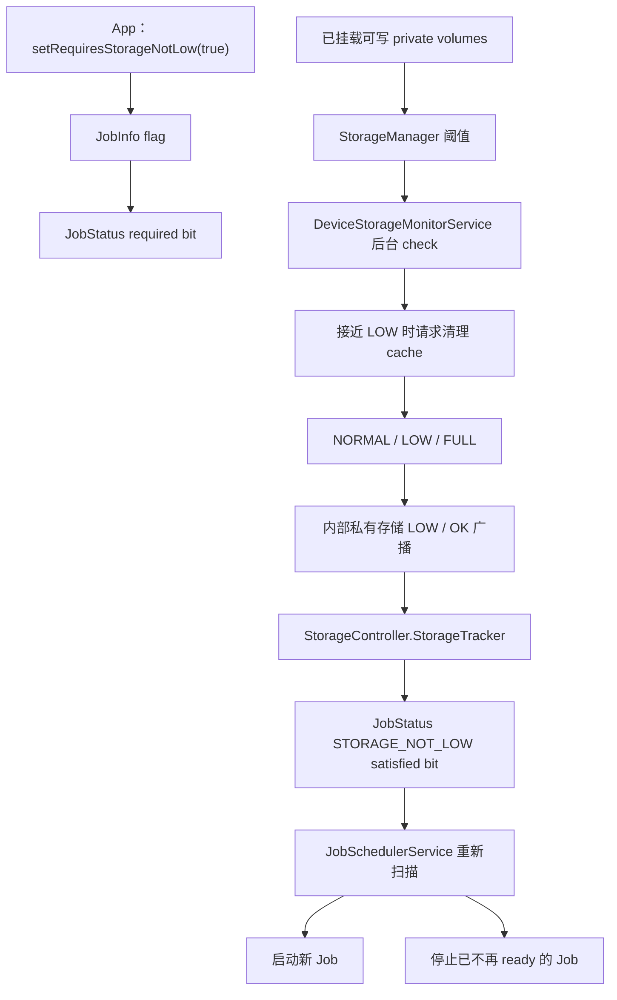
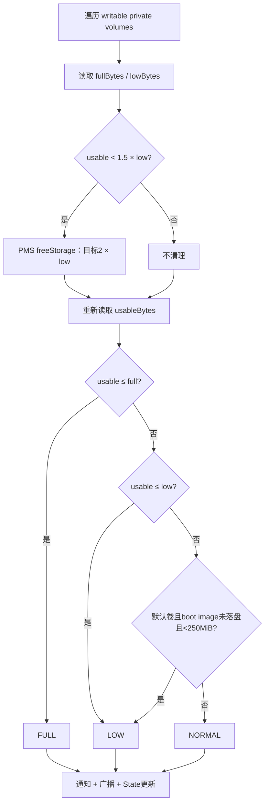
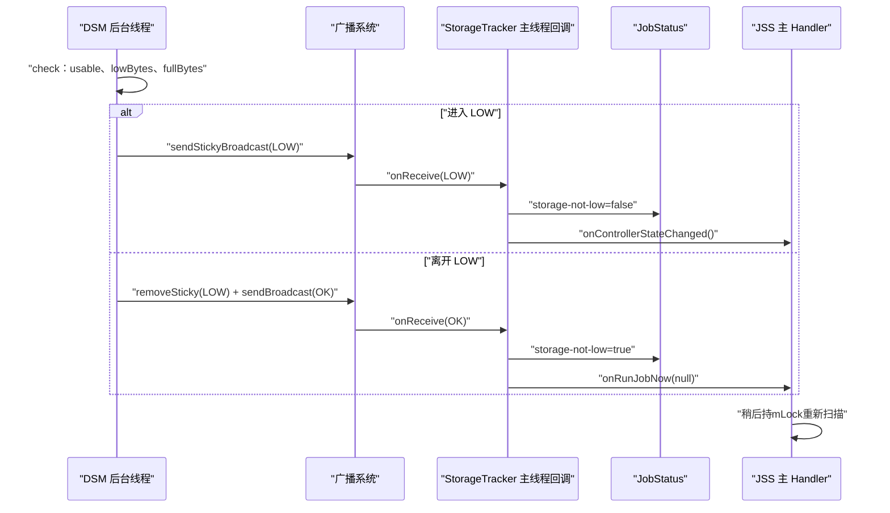
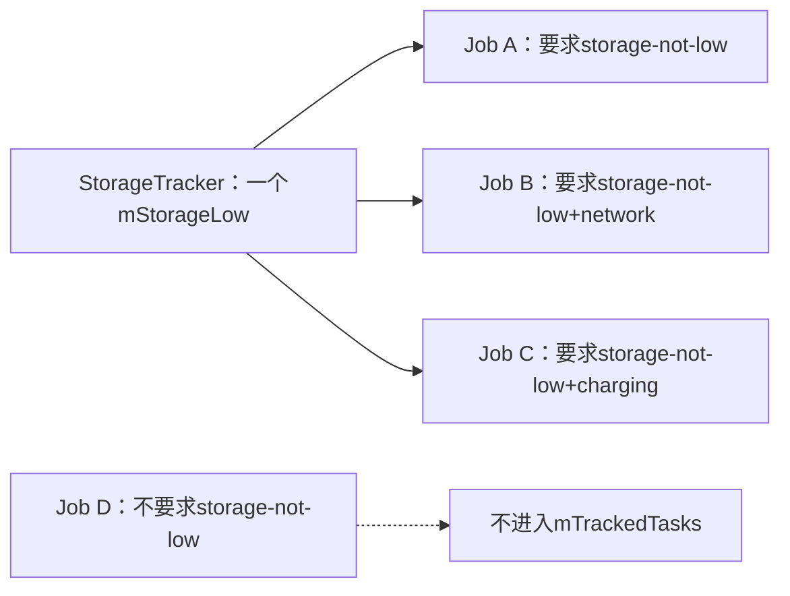
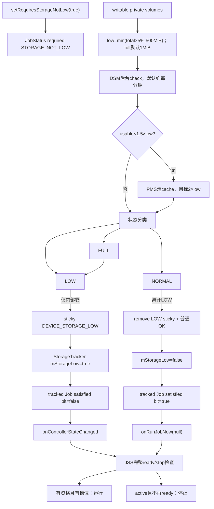

# 127 Android StorageController：低存储广播与 Job 约束

> 源码版本：Android 11 / API 30 / `android-11.0.0_r48`  
> 学习方式：macOS 只读源码，不要求编译、不要求连接设备  
> 前置章节：第 22、81、121、126 章

---

## 1. 本章要回答什么

应用可以声明：

```java
JobInfo jobInfo = new JobInfo.Builder(jobId, serviceName)
        .setRequiresStorageNotLow(true)
        .build();
```

这看起来只有一句话，却牵出六个问题：

1. “存储不低”由谁定义，是剩余 10%、500MB，还是磁盘没写满？
2. 系统检测的是内部存储、外置 SD 卡，还是所有卷？
3. 进入低存储前，系统会不会先尝试清理 cache？
4. `DEVICE_STORAGE_LOW` 与 `DEVICE_STORAGE_OK` 是否都是 sticky 广播？
5. Job 已经运行后存储变低，系统会不会停止它？
6. storage-not-low、persisted Job、JobScheduler quota 与磁盘 cache quota 是否是一回事？

本章的核心答案是：

> DeviceStorageMonitorService 在后台线程检查可写私有卷并维护内部存储的 LOW sticky 状态；StorageController 把这项设备级事实投影成每个 JobStatus 的 `STORAGE_NOT_LOW` satisfied bit，再让完整 JobScheduler 公式决定启动或停止。

---

## 2. 源码地图

公开 API：

```text
frameworks/base/apex/jobscheduler/framework/java/android/app/job/JobInfo.java
```

约束控制器与状态：

```text
frameworks/base/apex/jobscheduler/service/java/com/android/server/job/controllers/StorageController.java
frameworks/base/apex/jobscheduler/service/java/com/android/server/job/controllers/JobStatus.java
frameworks/base/apex/jobscheduler/service/java/com/android/server/job/JobSchedulerService.java
frameworks/base/apex/jobscheduler/service/java/com/android/server/job/JobServiceContext.java
```

低存储事实生产者：

```text
frameworks/base/services/core/java/com/android/server/storage/DeviceStorageMonitorService.java
frameworks/base/core/java/android/os/storage/StorageManager.java
frameworks/base/core/java/android/content/Intent.java
frameworks/base/core/res/AndroidManifest.xml
```

持久化与诊断：

```text
frameworks/base/apex/jobscheduler/service/java/com/android/server/job/JobStore.java
frameworks/base/apex/jobscheduler/service/java/com/android/server/job/JobSchedulerShellCommand.java
cts/tests/JobScheduler/src/android/jobscheduler/cts/StorageConstraintTest.java
```

---

## 3. 一张主链图



必须注意两层范围不同：

- DeviceStorageMonitorService 会检查所有已挂载、可写的 private volume；
- 驱动 StorageController 的 LOW/OK 广播，目前只为内部私有存储发送。

---

## 4. 公开 API 只是在 JobInfo 中设置一个 bit

对应常量：

```java
public static final int CONSTRAINT_FLAG_STORAGE_NOT_LOW = 1 << 3;
```

Builder：

```java
public Builder setRequiresStorageNotLow(boolean storageNotLow) {
    mConstraintFlags = (mConstraintFlags & ~CONSTRAINT_FLAG_STORAGE_NOT_LOW)
            | (storageNotLow ? CONSTRAINT_FLAG_STORAGE_NOT_LOW : 0);
    return this;
}
```

默认值是 `false`。Builder 在这里没有查询磁盘，也没有替 Job 预留空间，只是把应用意图保存到不可变 JobInfo。

---

## 5. `storage-not-low` 不承诺什么

它不承诺：

- 为这个 Job 独占或预留若干字节；
- 预测 Job 将写入多少数据；
- 确保任意目标文件系统都有空间；
- 确保外置/采纳存储卷不低；
- 保证 Job 从开始到结束一直不失去约束；
- 磁盘完全没满才算满足。

它表达的是一个系统级策略信号：

```text
内部私有存储当前没有处于 DeviceStorageMonitorService 的 LOW 层级
```

应用仍应正确处理 `IOException`、`ENOSPC`、配额限制和写入过程中空间变化。

---

## 6. required bit 与 satisfied bit 是两回事

```text
required STORAGE_NOT_LOW
  来自应用的 JobInfo，表示“必须要它”

satisfied STORAGE_NOT_LOW
  来自 StorageController，表示“系统现在判定它成立”
```

JobStatus 构造时把 JobInfo constraint flags 放进 `requiredConstraints`；Controller 以后通过：

```java
setStorageNotLowConstraintSatisfied(boolean state)
```

更新 `satisfiedConstraints`。

只有 required 与当前 satisfied，以及其他所有调度门组合后，才能判断 Job 是否 ready。

---

## 7. StorageController 只跟踪真正要求该约束的 Job

```java
if (taskStatus.hasStorageNotLowConstraint()) {
    mTrackedTasks.add(taskStatus);
    taskStatus.setTrackingController(JobStatus.TRACKING_STORAGE);
    taskStatus.setStorageNotLowConstraintSatisfied(
            mStorageTracker.isStorageNotLow());
}
```

这与上一章 BatteryController 有一处重要差异：

- BatteryController 是 `RestrictingController`，RESTRICTED bucket 会动态引入电源条件；
- StorageController 只是普通 `StateController`；
- Android 11 r48 的 RESTRICTED 动态集合不包含 `STORAGE_NOT_LOW`。

所以当前版本中，没有显式 storage-not-low 约束的普通 Job 不会只因进入 RESTRICTED bucket 被 StorageController 跟踪。

---

## 8. Controller 构造时立即注册 receiver

JobSchedulerService 构造时：

```java
mStorageController = new StorageController(this);
mControllers.add(mStorageController);
```

StorageController 构造函数：

```java
mStorageTracker = new StorageTracker();
mStorageTracker.startTracking();
```

注册两个 action：

```java
filter.addAction(Intent.ACTION_DEVICE_STORAGE_LOW);
filter.addAction(Intent.ACTION_DEVICE_STORAGE_OK);
mContext.registerReceiver(this, filter);
```

它不监听 FULL/NOT_FULL；后文会看到，FULL 在层级上已经包含 LOW。

---

## 9. 为什么初始值默认是“存储不低”

字段只有：

```java
private boolean mStorageLow;
```

Java 默认值为 `false`，所以刚创建时：

```text
isStorageNotLow() = !mStorageLow = true
```

代码没有同步调用 StorageManager 查询当前字节数。它依赖一个关键机制纠正异常状态：

```text
ACTION_DEVICE_STORAGE_LOW 是 sticky 广播
```

如果 AMS 中保存着当前 LOW sticky，注册动态 receiver 后会安排把它投递过来，随后 `mStorageLow=true`。

正常状态没有 OK sticky 可取，但默认 false 恰好就代表 not-low。

---

## 10. 启动顺序能否保证没有短暂误判

SystemServer 中，DeviceStorageMonitorService 的启动早于 JobSchedulerService；但 DSM 的首次检查只是向专用后台 Handler 投递 `MSG_CHECK`，不是在 `onStart()` 内同步完成。

因此不能写成：

```text
JobScheduler 构造前，第一次存储检查必然结束
```

更准确的保证来自三点共同收敛：

1. 默认先按 not-low；
2. 当前 LOW 由 sticky 状态保存并可在注册后补投；
3. JobScheduler 到 `PHASE_THIRD_PARTY_APPS_CAN_START` 才把 JobStore 中的 Job 正式附着到各 Controller。

若 LOW 回调比 Job 附着早，tracker 已是 low；若偶尔比附着晚，后到的 LOW 会再把已跟踪 Job bit 改为 false。这里应理解为异步收敛，而不是依赖一个未经源码保证的绝对先后。

---

## 11. 低存储事实由 DeviceStorageMonitorService 生产

主方法：

```java
@WorkerThread
private void check()
```

它不是 JobScheduler 的内部类，而是另一个 system_server 系统服务，职责包括：

- 检查私有卷可用空间；
- 接近低存储时请求清理 cache；
- 维护每卷 NORMAL/LOW/FULL 状态；
- 显示或取消低存储通知；
- 记录 EventLog/statsd；
- 为内部卷发送 LOW/OK/FULL/NOT_FULL 广播。

StorageController 只消费 LOW/OK，不重新实现阈值计算。

---

## 12. 为什么磁盘检查不放在 system_server 主线程

DSM 创建独立线程：

```java
mHandlerThread = new HandlerThread(
        TAG, Process.THREAD_PRIORITY_BACKGROUND);
mHandlerThread.start();
```

`check()` 会遍历卷、调用 `File.getUsableSpace()`，甚至请求 PackageManager 清 cache，这些都可能涉及较慢 I/O。

因此主流程是：

```text
system_server 主线程 onStart
→ 向 DeviceStorageMonitor 后台 Handler 发 MSG_CHECK
→ 后台线程完成扫描/清理/广播
```

默认检查间隔是：

```java
DEFAULT_CHECK_INTERVAL = DateUtils.MINUTE_IN_MILLIS;
```

即一分钟。`checkMemory()`，或带 `-f` 的 `force-low`、`force-not-low`、`reset`，会重新投递 `MSG_CHECK` 请求尽快检查；不带 `-f` 的 shell 命令只改变强制层级并递增 sequence，等待后续检查。“一分钟”也不是所有状态变化的严格检测延迟保证。

---

## 13. 什么叫 writable private volume

StorageManager 的实现遍历 vold 报告的卷，只保留：

```text
type == TYPE_PRIVATE
并且 isMountedWritable()
```

它包括默认内部私有存储，也可能包括已采纳为私有存储的其他卷；不等同于所有可见的共享存储目录，更不是逐个 App 沙箱目录。

DSM 为每个卷维护一份 `State`，key 是转换后的 UUID。

---

## 14. LOW 阈值怎样计算

StorageManager 的执行代码：

```java
long lowBytes = path.getTotalSpace() * lowPercent / 100;
long maxLowBytes = ...;
return Math.min(lowBytes, maxLowBytes);
```

r48 默认：

```java
DEFAULT_THRESHOLD_PERCENTAGE = 5;
DEFAULT_THRESHOLD_MAX_BYTES = 500 MiB;
```

因此默认公式是：

```text
lowBytes = min(卷总容量 × 5%, 500 MiB)
```

这是进入 LOW 的“剩余可用空间阈值”，不是已经使用空间的百分比。

---

## 15. 两个手算例子

忽略文件系统保留块等实现差异，只按公式计算：

```text
8 GiB 卷：
  5% = 409.6 MiB
  小于500 MiB上限
  → lowBytes约409.6 MiB

64 GiB 卷：
  5% = 3.2 GiB
  被500 MiB上限截断
  → lowBytes=500 MiB
```

所以“大容量设备默认剩余 5% 就 low”通常是错误理解；500MiB 上限会先起作用。

---

## 16. Settings 注释与执行默认值发生了漂移

`Settings.Global.SYS_STORAGE_THRESHOLD_PERCENTAGE` 的注释仍写默认 10，但本版本 `StorageManager` 真正传给 `Settings.Global.getInt()` 的 fallback 是 5。

当注释和执行代码冲突时，本章应写：

```text
Android 11 r48 实现默认值为5；Settings字段注释中的10已经陈旧。
```

同时仍要保留可配置边界：设备可通过 Global Settings 改变 percentage、max bytes 和 full threshold。

---

## 17. LOW 与 FULL 是两个不同阈值

r48 默认 full threshold：

```java
DEFAULT_FULL_THRESHOLD_BYTES = 1 MiB;
```

判断顺序：

```java
if (usableBytes <= fullBytes) {
    newLevel = FULL;
} else if (usableBytes <= lowBytes) {
    newLevel = LOW;
} else {
    newLevel = NORMAL;
}
```

所以：

```text
LOW  = 提前进入的风险/清理/限制区
FULL = 只剩极少保留空间的更严重层级
```

`storage-not-low` 在进入 LOW 时就不满足，不会等到只剩 1MiB。

---

## 18. 默认卷还有 250MiB boot image 特殊门

DSM 还有一条：

```java
StorageManager.UUID_DEFAULT.equals(uuid)
        && !isBootImageOnDisk()
        && usableBytes < 250 MiB
```

满足时也判为 LOW。

它保护的是默认内部卷在 ART boot image 尚未落盘时所需的额外空间。因为该判断排在普通 lowBytes 后面，所以在默认 lowBytes 已高于250MiB的大卷上常被前一条覆盖；在阈值更小的设备或配置上才更明显。

不要把这条规则泛化为“所有卷固定250MiB进入低存储”。

---

## 19. 系统先尝试清 cache，再判定最终 level

如果扫描开始时：

```text
usableSpace < lowBytes × 1.5
```

DSM 调用：

```java
pms.freeStorage(vol.getFsUuid(), lowBytes * 2, 0);
```

其意图是请求 PackageManager 清理可回收内容，使可用空间尽量达到 `2 × lowBytes`，不是删除固定数量的文件。默认启用 free-cache-v2 时，清理器会按条件考虑过期 preload cache、超 quota 的应用 cache、无引用静态共享库、旧 instant app、低于 quota 的应用 cache、卸载应用的 instant metadata 等；本次 `flags=0` 不启用 aggressive-only 分支，并且每一步达到目标即可返回。调用结束后，DSM 重新读取 `getUsableSpace()`，再判 NORMAL/LOW/FULL。

因此进入 LOW 广播反映的是“尝试清理后的状态”，不是第一次读到的原始值。

最终仍达不到目标时 `freeStorage()` 可抛 `IOException`；DSM 记录 warning 后继续按实际 `usableBytes` 分类，不能把清理请求理解为必然成功的空间保证。

---

## 20. 一次 check 的精确顺序



比较符也要看准：主检查使用 `<= fullBytes` 与 `<= lowBytes`。

---

## 21. NORMAL、LOW、FULL 是有序层级

```java
LEVEL_NORMAL = 0;
LEVEL_LOW = 1;
LEVEL_FULL = 2;
```

辅助方法把跨级变化也视作穿过中间层：

```text
NORMAL → FULL
  同时算 entering LOW 和 entering FULL

FULL → NORMAL
  同时算 leaving FULL 和 leaving LOW
```

这确保直接跌入极端低空间时，既有 LOW 保护信号，也有 FULL 严重状态信号。

---

## 22. 每个转换发什么广播

| 状态转换 | LOW/OK 侧 | FULL/NOT_FULL 侧 |
|---|---|---|
| NORMAL → LOW | 发送并保存 sticky LOW | 无 |
| LOW → NORMAL | 删除 LOW sticky，普通发送 OK | 无 |
| NORMAL → FULL | sticky LOW | sticky FULL |
| FULL → LOW | 仍处 LOW，不发 OK | 删除 FULL sticky，发 NOT_FULL |
| FULL → NORMAL | 删除 LOW sticky，发 OK | 删除 FULL sticky，发 NOT_FULL |

所以 FULL→LOW 虽然不再“满”，仍然低存储，StorageController 必须继续保持 `storageNotLow=false`。

---

## 23. LOW 是 sticky，OK 不是 sticky

真实代码：

```java
if (State.isEntering(LEVEL_LOW, oldLevel, newLevel)) {
    sendStickyBroadcastAsUser(lowIntent, UserHandle.ALL);
} else if (State.isLeaving(LEVEL_LOW, oldLevel, newLevel)) {
    removeStickyBroadcastAsUser(lowIntent, UserHandle.ALL);
    sendBroadcastAsUser(notLowIntent, UserHandle.ALL);
}
```

结论：

```text
ACTION_DEVICE_STORAGE_LOW = sticky
ACTION_DEVICE_STORAGE_OK  = 普通一次性广播
```

不能写成“注册 StorageTracker 后必收到 LOW 或 OK 二选一”。正常状态下没有 OK sticky，tracker 依靠默认值表示 not-low。

---

## 24. 为什么只需要保存 LOW sticky

这是一个“异常状态 presence”模型：

```text
LOW sticky存在 → 当前异常
LOW sticky不存在 → 当前默认正常
```

恢复时先删除异常 sticky，再发一次 OK 通知现有监听者清除状态。

如果把 OK 也长期保存为 sticky，就要额外处理两个互斥 sticky 的一致性；当前设计用“默认正常 + 异常状态有标记”更简单。

---

## 25. 只有内部私有卷发送这组广播

`updateBroadcasts()` 一开始：

```java
if (!Objects.equals(
        StorageManager.UUID_PRIVATE_INTERNAL, vol.getFsUuid())) {
    return;
}
```

因此：

- DSM 会扫描并为其他 private volume 维护 State；
- 其他卷也可能显示通知、写 stats；
- 但目前不为 secondary private volume 发送 DEVICE_STORAGE_LOW/OK；
- StorageController 维护的是内部私有存储的全局状态。

若 Job 主要写入采纳存储或其他卷，`setRequiresStorageNotLow(true)` 不能被解释为那个目标卷的精确空间约束。

---

## 26. FULL 为何不需要 StorageController 单独监听

NORMAL→FULL 会同时被 `isEntering(LOW)` 判 true，因此先发送 LOW sticky；StorageController 已经把 storage-not-low 置为 false。

FULL→LOW 仍在 LOW 层，不应恢复 Job。只有离开整个 LOW 层到 NORMAL 才发 OK。

所以从 Job 调度的二值视角：

```text
NORMAL       → storage-not-low=true
LOW 或 FULL  → storage-not-low=false
```

FULL 的额外广播服务于需要区分严重程度的其他系统消费者。

---

## 27. 普通应用不能伪造这些广播

核心清单声明：

```xml
<protected-broadcast android:name="android.intent.action.DEVICE_STORAGE_LOW" />
<protected-broadcast android:name="android.intent.action.DEVICE_STORAGE_OK" />
<protected-broadcast android:name="android.intent.action.DEVICE_STORAGE_FULL" />
<protected-broadcast android:name="android.intent.action.DEVICE_STORAGE_NOT_FULL" />
```

它们是系统保护广播。

Intent 文档还说明：target Android O 及以上的应用，manifest 静态 Receiver 不再接收这组广播。StorageController 是 system_server 内动态注册的 receiver，不依赖应用侧 manifest 投递。

---

## 28. StorageTracker 收到广播怎样更新

```java
mLastStorageSeq = intent.getIntExtra(EXTRA_SEQUENCE,
        mLastStorageSeq);

if (ACTION_DEVICE_STORAGE_LOW.equals(action)) {
    mStorageLow = true;
    maybeReportNewStorageState();
} else if (ACTION_DEVICE_STORAGE_OK.equals(action)) {
    mStorageLow = false;
    maybeReportNewStorageState();
}
```

它没有读取 intent 中的字节数，因为 DSM 广播也没有把 lowBytes/usableBytes 当作调度协议传来。Controller 只消费二值状态。

---

## 29. receiver 与 DSM 不在同一线程

```text
DeviceStorageMonitor 后台线程
  完成磁盘扫描并请求发送广播

ActivityManager 广播系统
  做 receiver 匹配与投递

system_server 主 Handler
  调用 StorageTracker.onReceive()
```

StorageTracker 注册时没有传 scheduler；ContextImpl 在 null 时选择 `mMainThread.getHandler()`。因此 Controller 的正常广播写入在 system_server 主线程完成，不是在 DSM 的磁盘检查线程中直接回调。

---

## 30. sequence 不是物理存储状态的递增版本号

DSM 定义：

```java
private final AtomicInteger mSeq = new AtomicInteger(1);
```

它的注释直接写着“用于测试”。在 r48 中，普通周期检查和真实空间边沿只读取 `mSeq.get()`，不会每次自动递增。

递增发生在 shell 测试命令：

```text
force-low
force-not-low
reset
```

因此 sequence 的准确用途是：

> 测试端发起一次强制状态命令后，用返回的 seq 等待 JobScheduler 确认已收到对应广播。

它不是“磁盘每变化一次就加一”的生产版本号。`EXTRA_SEQUENCE` 上方误写 BATTERY_CHANGED 的注释也是复制遗留，不能按注释推导协议来源。

---

## 31. 新状态怎样投影到所有 tracked jobs

```java
final boolean storageNotLow = mStorageTracker.isStorageNotLow();
boolean reportChange = false;
synchronized (mLock) {
    for (JobStatus ts : mTrackedTasks) {
        reportChange |= ts.setStorageNotLowConstraintSatisfied(
                storageNotLow);
    }
}
```

这里的 `mLock` 是 JobSchedulerService 全局锁。它保护：

- tracked set 遍历；
- 每个 JobStatus satisfied bit 更新；
- 与其他 Controller/JSS 对同一 JobStatus 的状态组合。

`setConstraintSatisfied()` 只有 bit 真正变化才返回 true，并更新派生 ready 缓存；启用相关 stats 时还记录约束变化 atom。

---

## 32. StorageController 的锁边界比 BatteryController 更清楚

`maybeReportNewStorageState()` 在锁内只更新 JobStatus，退出锁后才调用 listener：

```text
锁内：遍历并改 satisfied bits
锁外：onRunJobNow / onControllerStateChanged
```

listener 当前实现只是向 JSS Handler 发消息，但这种边界仍减少了未来回调实现变化造成的锁内重入风险。

同时不要笼统说“StorageController 所有字段都由 mLock 保护”：`mStorageLow` 与 `mLastStorageSeq` 本身没有 `@GuardedBy` 或 volatile。它们在正常路径中由主线程广播回调写入，写入发生在获取 `mLock` 之前；紧接着同一次 `maybeReportNewStorageState()` 会持锁重写所有 tracked JobStatus，从而完成设备事实到 Job bit 的收敛。JSS 集合和 JobStatus 更新才明确进入共享锁。

---

## 33. 存储恢复时为什么走快速全量扫描

```java
if (storageNotLow) {
    mStateChangedListener.onRunJobNow(null);
}
```

JSS 把它转换为：

```text
MSG_JOB_EXPIRED(null)
→ queueReadyJobsForExecutionLocked()
```

含义是：阻塞条件刚解除，请立即把所有当前 ready jobs 做一次偏积极的全量冲刷。

null 不指定 StorageController 的某个 Job，扫描范围是全局；但完整约束、quota、用户状态、组件、restriction 和并发限制仍然有效。

---

## 34. 重复 OK 也会请求快速扫描

恢复分支不检查 `reportChange`。所以只要执行 `maybeReportNewStorageState()` 时 `storageNotLow=true`，即使 tracked Job bit 已经是 true，也会 `onRunJobNow(null)`。

正常生产状态机只在离开 LOW 边沿发一次 OK；但强制测试模式把 oldLevel 视为 UNKNOWN，可能重复产生相关广播。源码选择了安全的“恢复信号到来就冲刷”策略。

这仍不是无限循环：只有收到事件才执行一次方法。

---

## 35. 进入 LOW 时为什么只发普通状态变化

```java
else if (reportChange) {
    mStateChangedListener.onControllerStateChanged();
}
```

进入 LOW 不会让任何 storage-not-low 约束新近满足，只可能使 Job 不再 ready。因此只有至少一个 tracked Job bit 从 true 变 false 时才通知 JSS。

JSS 收到 `MSG_CHECK_JOB` 后：

- 若 `mReportedActive=true`，走全量 ready 扫描；这个汇总位可由 pending 非空，或存在非例外 active Job 形成；
- 否则可走 `maybeQueueReadyJobsForExecutionLocked()`，保留正常批处理策略；
- 两条路径都会先检查并停止不再 ready 的 active Job。

若当前没有任何受该约束的 Job，LOW 只更新 tracker，不必为了 JobScheduler 发送空转消息。

---

## 36. 从 LOW/OK 到调度的时序



广播发送完成不等于应用 Job 已经启动；中间至少还有 receiver 投递、JSS Handler 排队、ready 判定与并发分配。

---

## 37. 已运行 Job 遇到 LOW 会怎样

全量或普通检查都会调用：

```java
stopNonReadyActiveJobsLocked();
```

显式 `STORAGE_NOT_LOW` 已从 true 变 false，且没有已满足的一次性 deadline、调试 override 等使 Job 仍 ready 时：

```text
JobServiceContext.cancelExecutingJobLocked(
    REASON_CONSTRAINTS_NOT_SATISFIED,
    "cancelled due to unsatisfied constraints")
```

若 Job 已进入 `VERB_EXECUTING`，系统通过 `sendStopMessageLocked()` 进入应用侧停止协议，随后触发 `onStopJob()`；若 LOW 到来时仍处于 `VERB_BINDING` 或 `VERB_STARTING`，`JobServiceContext` 只标记取消并在绑定/启动握手路径中收尾，不保证先调用 `onStopJob()`。停止原因是通用“约束未满足”，Android 11 没有单独的 public storage-low stop reason。

CTS 的 `testJobStoppedWhenStorageLow()` 在确认 Job 已进入执行后才强制 LOW，因此验证的是前一种执行期停止场景。

---

## 38. storage-not-low=true 仍远不等于 ready

还要满足：

```text
其他普通约束：network、charging、idle、timing、content等
withinQuota || dynamicSatisfied
not dozing
not background restricted
非 NEVER bucket
用户已启动
组件存在且 enabled
未备份、未受 JobRestriction 限制
未重复 pending/running
有并发执行槽
```

StorageController 只维护一块设备级事实，不拥有最终调度决定权。

---

## 39. 一次性 deadline 可以越过这个普通约束

`STORAGE_NOT_LOW` 位于普通 `CONSTRAINTS_OF_INTEREST`，也属于 soft override 集合。

对非周期 Job，override deadline 满足后可以越过一般显式约束，包括 storage-not-low；但：

- periodic latest runtime 不提供普通 deadline override；
- `withinQuota || dynamicSatisfied` 门仍在；
- not-dozing、background-not-restricted 仍在；
- 用户/组件/restriction/并发等 JSS 外层门仍在。

所以 API 的直观描述“只在存储不低时运行”是常规调度语义，不应被写成没有任何 deadline 例外的绝对安全承诺。

若业务在低空间下绝不能写数据，JobService 自己仍必须在执行前检查真实目标并处理失败。

---

## 40. persisted Job 与 storage-not-low 是正交关系

```text
setPersisted(true)
  决定 Job 定义是否写入 jobs.xml、重启后是否恢复

setRequiresStorageNotLow(true)
  决定当前一次调度是否要求设备不处于 LOW
```

四种组合都可能存在：

| persisted | storage-not-low | 含义 |
|---:|---:|---|
| false | false | 普通内存 Job，无存储约束 |
| false | true | 不跨重启，但当前运行要求 not-low |
| true | false | 跨重启恢复，无存储约束 |
| true | true | 需求与 constraint flag 都跨重启恢复，运行状态重新计算 |

持久 Job 还要求调用方具有 `RECEIVE_BOOT_COMPLETED`；设置存储约束本身不要求这项权限。

---

## 41. jobs.xml 保存什么、不保存什么

对 persisted Job，JobStore 会写：

```xml
<constraints storage-not-low="true" ... />
```

读取时重新调用：

```java
jobBuilder.setRequiresStorageNotLow(true);
```

保存的是“这个 Job 要求 not-low”，不是当时的：

```text
mStorageLow
mLastStorageSeq
satisfiedConstraints中的当前bit
DSM每卷State
```

system_server 或整机重启后，不会从 jobs.xml 恢复旧的 LOW、sequence 或 satisfied bit，AMS 内存中的旧 sticky 也不会跨进程重启持久化。新的 DeviceStorageMonitorService 会重新检查卷，并在仍为 LOW 时建立新的 sticky；StorageTracker 先以 not-low 默认值启动，再由这次新检查产生的广播异步收敛，Job 附着时按当时 tracker 状态初始化新的 satisfied bit。

---

## 42. 五种 quota/约束不要混在一起

| 概念 | 管理对象 | 它限制什么 |
|---|---|---|
| persisted Job | 一份 Job 定义 | 是否写入 jobs.xml 并跨重启恢复 |
| persisted schedule API quota | user + 调度应用 package | 应用为自己反复 `schedule()` persisted Job 的调用次数/窗口 |
| storage-not-low | Job 的运行条件 | 内部存储处于 LOW 时通常不运行 |
| Job 执行 quota | source user/package + standby bucket | 后台执行时长、次数、session 等 |
| storage cache quota | volume + UID | 可回收 cache 的磁盘额度 |

persisted schedule API quota 由 JSS 的 `mQuotaTracker` 管理，并只针对应用为自己调度 persisted Job 的 API 调用；执行 quota 才是 QuotaController 的 standby bucket 体系。两者都不是磁盘额度。DeviceStorageMonitorService 调 `pms.freeStorage()` 是系统为恢复可用空间做的全局清理动作，也不是 QuotaController 在给某个 Job 分磁盘额度。

---

## 43. cache quota 也不是“可安全写入的剩余空间”

普通应用可通过公开的 `StorageManager.getCacheQuotaBytes(UUID)` 查询调用 UID 在某卷上的 cache quota；`StorageStatsManager.getCacheQuotaBytes(String, int)` 在 r48 中是 `@hide` 系统接口。该额度描述系统希望为某 UID cache 提供的相对保护，系统在压力下仍可清理 cache。

它不等于：

```text
这个 Job 独占的磁盘空间
或 storage-not-low 的阈值
```

同样，`StorageManager.getAllocatableBytes()`、`File.getUsableSpace()` 与 DSM 的全局 LOW 状态分别服务不同问题。遇到真实写文件业务，仍需根据目标文件系统选择正确 API。

---

## 44. `getStorageBytesUntilLow()` 是一个命名陷阱

r48 实现：

```java
return path.getUsableSpace() - getStorageFullBytes(path);
```

尽管方法名写 UntilLow，它减的是 full threshold，而 DSM 主检查明确调用 `getStorageLowBytes()`。

本章主链必须以：

```text
DeviceStorageMonitorService.check()
→ getStorageLowBytes()
```

为准，不能看到相似方法名就替换调用关系。

---

## 45. `DeviceStorageMonitorInternal.isMemoryLow()` 也不是本链入口

LocalService 方法：

```java
Environment.getDataDirectory().getUsableSpace()
        < getMemoryLowThreshold()
```

它使用 `<`；DSM `check()` 使用 `<=`。

StorageController 没有调用这个 LocalService，而是消费 LOW/OK 广播。因此本章状态边沿应按 `check()` 的 `<=` 和广播 State 讲解，不能拿 `isMemoryLow()` 的即时返回值替代 tracker 状态。

---

## 46. 内部卷低存储是全局事实，不按 UID 区分

StorageTracker 只有一个：

```java
boolean mStorageLow;
```

所有被跟踪 JobStatus 接收同一个 `storageNotLow` 值。

不同 Job 的最终结果仍可能不同，因为：

- 有的 Job 根本不要求该约束；
- 其他约束不同；
- quota、standby bucket、用户和组件状态不同；
- deadline 状态不同。

“事实全局共享”不等于“所有 Job 同时运行或停止”。

---

## 47. LOW sticky 先到、Job 后注册的场景

```text
DSM检测内部存储LOW
→ AMS保存LOW sticky
→ StorageController构造并注册receiver
→ LOW被投递，mStorageLow=true
→ 此时还可能没有tracked Job，reportChange=false
→ boot phase后persisted Job开始跟踪
→ 初始 satisfied bit直接写false
```

即使低存储事件早于 JobScheduler 正式接管任务，sticky 也让当前异常状态得以跨越注册时序。

---

## 48. Job 先附着、LOW 回调后到的场景

```text
StorageTracker暂时默认not-low
→ Job附着，bit暂写true
→ 已存在的LOW sticky随后投递
→ mStorageLow=true
→ 遍历tracked jobs把bit改false
→ JSS重新检查
```

这说明系统依赖最终收敛，不应把默认值误写成“同步查询已经证明存储正常”。

---

## 49. 正常进入 LOW 的完整链

```text
DSM后台check
→ 可用空间接近阈值，先请求清cache
→ 清理后usable仍≤lowBytes
→ State NORMAL→LOW
→ 显示低存储通知
→ 内部卷发送sticky DEVICE_STORAGE_LOW(seq)
→ StorageTracker主线程收到LOW
→ mStorageLow=true
→ tracked Job的STORAGE_NOT_LOW bit=false
→ onControllerStateChanged()
→ JSS Handler重新扫描
→ 停止不再ready的active Job
```

没有任何一步把应用进程直接同步杀死；这是异步广播与正常 Job 停止协议。

---

## 50. LOW 恢复到 NORMAL 的完整链

```text
DSM后台check
→ usable>lowBytes，且不触发boot-image特殊LOW
→ State LOW→NORMAL
→ 取消低存储通知
→ 删除LOW sticky
→ 普通发送DEVICE_STORAGE_OK(seq)
→ StorageTracker mStorageLow=false
→ tracked Job bit=true
→ onRunJobNow(null)
→ JSS全量快速扫描
→ 其他条件均满足且有槽位的Job可运行
```

OK 广播是“状态恢复通知”，不是“某个 Job 必须立即启动”的命令。

---

## 51. NORMAL 直接跌入 FULL 的完整链

```text
usable≤fullBytes
→ newLevel=FULL
→ entering LOW=true：发送LOW sticky
→ entering FULL=true：发送FULL sticky
→ StorageController只处理LOW
→ storage-not-low=false
```

以后 FULL→LOW 只会发 NOT_FULL，不会发 OK；Controller 继续保持 low。直到 LOW→NORMAL 才恢复。

---

## 52. secondary private volume 低空间的边界

假设采纳存储卷进入 LOW，但内部 `/data` 正常：

- DSM 为那个卷建立 LOW State；
- 可发通知和统计；
- `updateBroadcasts()` 因 fsUuid 不是 internal 而返回；
- StorageController 不会收到 LOW；
- storage-not-low bit 仍可为 true。

所以这个 API 不是“Job 所有可能写入卷均健康”的多卷约束。

---

## 53. 多个 Job 怎样共享一个设备状态



LOW 时 A/B/C 的同一约束 bit 都变 false；D 不由本 Controller 修改。恢复后 A/B/C 也只是这一位为 true，B/C 仍需各自其他条件。

---

## 54. Job replacement 与取消没有特殊存储状态交接

StorageController 没有像 ContentObserverController 那样保存每 Job 的 URI 批次。

同 ID replacement 时：

```text
旧 Job 清 TRACKING_STORAGE 并从集合移除
新 Job 若需要约束则加入
新 Job 直接读取全局 tracker 当前状态初始化 bit
```

取消时同样只是移出集合。因为存储状态是全局当前事实，不需要跨 JobStatus 搬运事件历史。

---

## 55. 常见误解一：低存储就是磁盘写满

错。

LOW 是提前量，默认 `min(5%, 500MiB)`；FULL 默认约1MiB。storage-not-low 在 LOW 阶段就会失效。

---

## 56. 常见误解二：LOW 和 OK 都是 sticky

错。

LOW sticky 表示异常仍存在；恢复时删 LOW sticky并普通发送一次 OK。正常启动时未必收到 OK。

---

## 57. 常见误解三：每一分钟 sequence 都递增

错。

r48 的 mSeq 主要用于 force-low/force-not-low/reset 测试相关性，真实周期检查不会自动递增。

---

## 58. 常见误解四：这个约束会为 Job 保留空间

错。

它只是调度门。系统清 cache 也是全局恢复动作，不是给某 Job 预留私有容量。

---

## 59. 常见误解五：所有卷进入 LOW 都会停 Job

错。

当前 LOW/OK 广播只为内部私有卷发送；secondary private volume 的 State 不驱动 StorageController。

---

## 60. 常见误解六：恢复回调会无条件运行所有 Job

错。

`onRunJobNow(null)` 只是请求全局快速 ready scan，所有其他调度门仍存在。

---

## 61. 常见误解七：setPersisted 就代表 storage-not-low

错。

一个决定任务定义是否跨重启，一个决定当前运行条件；两项互相独立。

---

## 62. 常见误解八：正在运行后约束不再检查

错。

LOW 事件会触发 JSS 检查。若 active Job 已进入 `VERB_EXECUTING` 且完整 `isReady()` 因此变为 false，系统才会发送停止消息并进入应用侧 `onStopJob()` 协议；若它还处在 binding/starting 阶段，只会先标记取消并沿握手路径收尾，不保证调用 `onStopJob()`。业务仍要处理广播到真正停止之间已经开始的 I/O。

---

## 63. 与第 22 章存储体系的分工

第 22 章回答分区、vold、FBE、应用目录、共享存储和数据库怎样组织。

本章只研究一个策略信号：内部私有存储的可用空间何时进入 LOW，怎样影响 JobScheduler。

这里没有重新讲文件系统挂载或 CE/DE 解锁，也不能把 storage-not-low 当成 FBE 用户解锁信号。

---

## 64. 与第 81 章 checkpoint 的分工

文件系统 checkpoint 解决系统更新/回滚期间的数据一致性与可恢复性；StorageController 解决后台 Job 是否适合在低空间时运行。

两者都涉及 `/data`，但问题完全不同：

```text
checkpoint：失败后怎样回退存储写入
storage-not-low：现在是否应避免额外后台工作
```

---

## 65. macOS 只读练习一：从 API 追到 bit

```bash
rg -n "setRequiresStorageNotLow|isRequireStorageNotLow|CONSTRAINT_FLAG_STORAGE_NOT_LOW" \
  frameworks/base/apex/jobscheduler/framework/java/android/app/job/JobInfo.java

rg -n "CONSTRAINT_STORAGE_NOT_LOW|setStorageNotLowConstraintSatisfied|hasStorageNotLowConstraint" \
  frameworks/base/apex/jobscheduler/service/java/com/android/server/job/controllers/JobStatus.java
```

画出 required bit 与 satisfied bit，不要把两者画成同一个字段。

---

## 66. macOS 只读练习二：证明 LOW sticky、OK 非 sticky

```bash
sed -n '527,570p' \
  frameworks/base/services/core/java/com/android/server/storage/DeviceStorageMonitorService.java
```

回答：

1. 哪个 action 调用 `sendStickyBroadcastAsUser()`？
2. 离开 LOW 时先删除哪个 sticky？
3. 哪个 action 只调用普通 `sendBroadcastAsUser()`？
4. FULL→LOW 为什么不会发送 OK？

---

## 67. macOS 只读练习三：手算阈值

```bash
sed -n '1410,1500p' \
  frameworks/base/core/java/android/os/storage/StorageManager.java

sed -n '175,235p' \
  frameworks/base/services/core/java/com/android/server/storage/DeviceStorageMonitorService.java
```

分别计算 4GiB、8GiB、16GiB、64GiB 的默认 lowBytes，并标出从哪一个容量附近开始被500MiB上限截断。

---

## 68. macOS 只读练习四：追恢复调度消息

```bash
rg -n "maybeReportNewStorageState|onRunJobNow|MSG_JOB_EXPIRED|queueReadyJobsForExecutionLocked" \
  frameworks/base/apex/jobscheduler/service/java/com/android/server/job/controllers/StorageController.java \
  frameworks/base/apex/jobscheduler/service/java/com/android/server/job/JobSchedulerService.java
```

写出：

```text
OK → onRunJobNow(null) → MSG_JOB_EXPIRED(null)
   → queueReadyJobsForExecutionLocked → maybeRunPendingJobsLocked
```

解释为什么中间仍会调用完整 `isReadyToBeExecutedLocked()`。

---

## 69. macOS 只读练习五：证明 persisted 是另一件事

```bash
rg -n "storage-not-low|writeConstraintsToXml|readConstraintsFromXml" \
  frameworks/base/apex/jobscheduler/service/java/com/android/server/job/JobStore.java

rg -n "setPersisted|RECEIVE_BOOT_COMPLETED" \
  frameworks/base/apex/jobscheduler/framework/java/android/app/job/JobInfo.java \
  frameworks/base/apex/jobscheduler/service/java/com/android/server/job/JobSchedulerService.java
```

这些命令全部只读，不执行 `cmd devicestoragemonitor force-low`，不修改设备状态，也不需要编译。

---

## 70. 阅读检查题

1. LOW 与 FULL 的默认阈值分别怎样计算？
2. 64GiB 卷为什么默认不是剩余3.2GiB就 LOW？
3. DSM 为什么在判 level 前先调用 `freeStorage()`？
4. LOW 与 OK 哪个是 sticky，为什么？
5. StorageTracker 初始为何可以默认 not-low？
6. SystemServer 启动顺序为何不能证明首次 DSM check 已同步完成？
7. adopted/private secondary volume LOW 为何不一定改变 Job bit？
8. sequence 为什么主要是测试相关标记？
9. `onRunJobNow(null)` 会绕过其他约束吗？
10. active Job 在哪个 JSS 方法中因 LOW 被停止？
11. persisted jobs.xml 保存 required bit 还是 satisfied bit？
12. 非周期 deadline 到期后，storage-not-low 是否仍是绝对硬门？
13. `getStorageBytesUntilLow()` 为什么不能作为本链判断依据？
14. storage cache quota 与 JobScheduler quota 各限制什么？

---

## 71. 一页复习图



图中的5%、500MiB、1MiB都是 r48 实现默认值，可被 Settings 改写。

---

## 72. 本章结论

StorageController 可压缩为八个设计点：

1. JobInfo 只保存 `STORAGE_NOT_LOW` 需求，不查询或预留空间；
2. StorageManager 默认用 `min(total×5%, 500MiB)` 算 LOW，用1MiB算 FULL，且可配置；
3. DSM 在专用后台线程扫描所有 writable private volumes，接近 LOW 时先请求清 cache；
4. JobScheduler 广播目前只代表内部私有存储，secondary private volume 状态不进入该全局 bit；
5. LOW 是 sticky，OK 不是；默认 not-low 由现存 LOW sticky 异步纠正；
6. StorageTracker 把设备状态投影到每个受控 JobStatus，而非保存字节数或事件历史；
7. 恢复时请求全量快速扫描，变差时仅在 bit 改变后请求普通重评，二者都不绕过完整 ready 门；
8. persisted、persisted schedule API quota、Job 执行 quota、storage cache quota 与 storage-not-low 是五个正交概念。

最重要的一句话：

> `setRequiresStorageNotLow(true)` 是“低空间时尽量别安排这项后台工作”的调度策略，不是磁盘容量预留或写入成功保证。

---

## 73. 复读后的易混点修订

初稿完成后，对照 `StorageController`、`DeviceStorageMonitorService`、`StorageManager`、`JobStatus`、`JobSchedulerService`、`JobStore`、Intent 文档与 CTS 复读，补强并修正：

1. 把 DSM“检查所有 writable private volumes”与“只为 internal private volume 发广播”分开，避免误称所有卷都驱动 Job；
2. 以 StorageManager 执行 fallback=5 为准，指出 Settings 字段注释默认10已经漂移；
3. 分开 LOW 和 FULL，记录默认500MiB上限、1MiB full，以及默认卷 boot image 未落盘时250MiB特殊门；
4. 补出先在1.5倍阈值请求清理、目标2倍阈值、清理后再读 usable 的真实顺序；
5. 精确区分 sticky LOW、non-sticky OK、FULL→LOW不发OK，以及注册时不保证LOW/OK二选一；
6. 限定默认 not-low 是启动初值，由 LOW sticky 异步收敛，不冒充同步磁盘查询；
7. 明确 sequence 只在强制测试命令递增，普通物理空间变化不是递增版本号；
8. 记录 StorageController 锁内只更新 tracked JobStatus、锁外 post listener，而 tracker 字段不全由 mLock 保护；
9. 明确恢复的 `onRunJobNow(null)` 是全局快速扫描，进入 LOW 的 `onControllerStateChanged()` 也会停止不再 ready 的 active Job；
10. 限定普通一次性 deadline 可越过显式 storage-not-low，但 quota/dynamic、Doze、后台限制和 JSS 外层门仍在；
11. 用 jobs.xml 证明 persisted 只保存 required 声明，不保存当前 LOW、sequence 或 satisfied bit；
12. 补充 `getStorageBytesUntilLow()` 实际减 full threshold、LocalService `<` 与主 check `<=` 两个相似 API 陷阱。
13. 按 `JobServiceContext` 的执行阶段细分停止路径：executing 才进入 `onStopJob()`，binding/starting 只标记取消并收尾；
14. 明确 AMS sticky 只存在于当前 system_server 内存，进程或整机重启后由新 DSM 重检并重新建立，而不是从磁盘恢复；
15. 将 persisted 定义、persisted schedule API quota、Job 执行 quota、storage-not-low 与 storage cache quota 拆成五项；
16. 核对公开 API 所在类：应用查询 cache quota 使用 `StorageManager.getCacheQuotaBytes(UUID)`，`StorageStatsManager` 的双参数形式在 r48 是隐藏接口；
17. 补出强制 shell 状态若要立即触发检查必须带 `-f`，不带时只改变强制层级并等待后续检查；
18. 将 `freeStorage(..., flags=0)` 限定为清理器按顺序考虑的可回收对象与非 aggressive 分支，避免误解为清空所有应用 cache。

下一章进入 `IdleController`，研究 JobInfo 的 device-idle 约束为何不等于 Doze、屏幕/梦境/车载状态怎样经过 inactivity alarm 形成 idle，以及 RESTRICTED bucket 如何动态使用 idle 条件。
