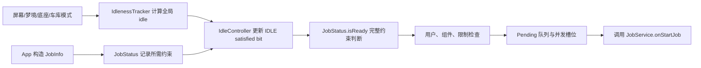
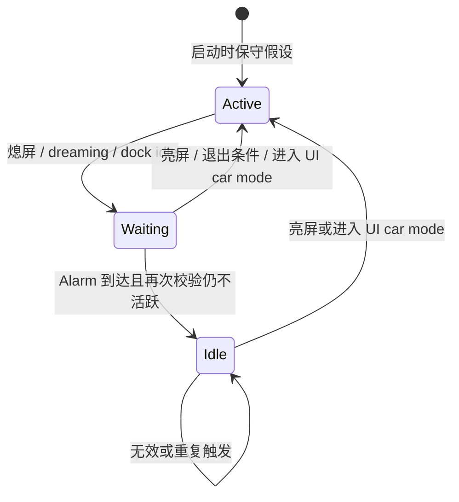

# 128 IdleController：熄屏了，为什么 `requiresDeviceIdle` 的 Job 还不运行？

> 源码基线：Android 11 / API 30 / `android-11.0.0_r48`
>
> 学习方式：macOS 静态阅读，不要求编译或连接设备
> 前置章节：第 25、43、69、121、122、124、126 章

## 先说问题、结论和读完收获

假设相册应用要在“用户不用设备时”清理缩略图：

```java
JobInfo job = new JobInfo.Builder(JOB_ID, cleanupService)
        .setRequiresDeviceIdle(true)
        .setRequiresCharging(true)
        .build();
```

测试时把手机熄屏，10 分钟后发现 `JobService` 没启动；等到 31 分钟，仍可能没有立刻启动。最容易出现的误判是：**“屏幕已经灭了，Android 不是已经 idle 了吗？”**

先给结论：

> `setRequiresDeviceIdle(true)` 要求的是 **JobScheduler 定义的“用户一段时间没有交互”约束**，不是 Doze。普通设备熄屏后只会启动一段空闲计时；Android 11 r48 默认在 31 分钟后进入一个 5 分钟宽的 Alarm 投递窗口。Alarm 到达并再次确认设备仍未交互后，`IdleController` 才把 Job 的 `IDLE` 位设为满足。即便如此，充电、配额、Doze、后台限制、用户状态、组件状态和执行槽位等门仍要继续通过。

因此，“熄屏”“Job 的 idle 位满足”“Job 完整就绪”“`onStartJob()` 已被调用”是四个不同的完成点。

读完本章，你应该能：

- 解释熄屏 10 分钟、31 分钟后 Job 都可能不运行的原因；
- 分清 `IdleController` 与 `DeviceIdleJobsController`，不再把这里的 idle 当成 Doze；
- 沿着 `JobInfo → DeviceIdlenessTracker → IdleController → JobStatus → JobSchedulerService` 判断卡在哪一门；
- 说明普通手机与 Android Automotive 的空闲判定为何不同；
- 识别 Android 11 r48 车机实现中一个真实的状态通知缺口。

本章不展开 Doze 的完整状态机，也不讨论 Job 的并发槽位分配算法；这里只说明它们为什么会让“idle 已满足”仍不等于“马上执行”。

## 一张图先建立全链路：idle 只是通行章之一

可以把一次 Job 执行想成进站乘车：`IdleController` 只负责检查“用户暂时没在使用设备”这一张通行章。拿到这张章，不代表其他证件齐全，也不代表已经有座位。



对贯穿本章的相册清理 Job，至少要分清这些状态：

| 观察到的状态 | 它能证明什么 | 它不能证明什么 |
|---|---|---|
| 屏幕已经关闭 | 普通 tracker 可以开始计算不活跃时长 | `IDLE` 已满足 |
| tracker 的 `mIdle=true` | JobScheduler 的全局用户不活跃状态成立 | 每个 Job 都可以运行 |
| 该 Job 的 `IDLE` satisfied | 这一项显式或动态约束满足 | 充电、网络、配额等也满足 |
| `JobStatus.isReady()==true` | Job 自身约束和几项隐式门已满足 | 用户、组件、批处理和槽位已允许执行 |
| `onStartJob()` 被调用 | Job 已真正交给应用服务 | 工作已经完成 |

这张表是本章最重要的排查框架。后面所有源码都在解释这些完成点怎样连接。

## 第一个命名陷阱：这里的 idle 不是 Doze

### 为什么会混淆

公开 API 叫 `setRequiresDeviceIdle()`，Android 的省电模式又叫 device idle / Doze。名字很像，但它们回答不同的问题：

| 机制 | 它问的问题 | r48 中的主要控制器 | 对 JobStatus 的位 |
|---|---|---|---|
| JobScheduler idleness | 用户是否已经一段时间没有交互，适合做打扰较小的工作？ | `IdleController` | `CONSTRAINT_IDLE` |
| Doze/device idle | 系统是否正处于限制后台活动的低功耗模式？ | `DeviceIdleJobsController` | `CONSTRAINT_DEVICE_NOT_DOZING` |

`IdleController` 类注释已经主动划清边界：

```java
/**
 * ... Idleness depends on the device type and is not related to
 * device-idle (Doze mode) despite the similar naming.
 */
public final class IdleController extends RestrictingController { ... }
```

这几行证明：**不是读者自己做出的名词区分，而是 r48 源码明确规定的职责边界。**

### 两个状态可以同时出现，也可以一真一假

不要把它们理解成同一状态的两个阶段。更准确的模型是两名独立门卫：

- `IdleController` 可能认为用户已经很久没有操作，令 `IDLE=true`；
- `DeviceIdleJobsController` 可能发现系统正在 Doze，令 `DEVICE_NOT_DOZING=false`；
- `JobStatus.isReady()` 要综合两者，因此这个 Job 仍不能运行。

反过来也可能出现：设备当前不在 Doze，`DEVICE_NOT_DOZING=true`，但刚刚亮屏交互过，`IDLE=false`。相册清理 Job 还是要等。

所以排查时不能只问“设备 idle 吗”，要问完整问题：

```text
你说的是 JobScheduler 的 IDLE，还是 Doze 的 DEVICE_NOT_DOZING？
```

## App 的 API 调用只是写下需求，不负责判断设备状态

### `setRequiresDeviceIdle(true)` 实际做了什么

`JobInfo.Builder` 只是设置一个 flag：

```java
public Builder setRequiresDeviceIdle(boolean requiresDeviceIdle) {
    mConstraintFlags = (mConstraintFlags & ~CONSTRAINT_FLAG_DEVICE_IDLE)
            | (requiresDeviceIdle ? CONSTRAINT_FLAG_DEVICE_IDLE : 0);
    return this;
}
```

这里没有读取屏幕状态，没有访问 `PowerManager`，也没有启动计时器。它表达的是：

> “调度器以后判断这个 Job 能否运行时，请把用户不活跃作为必要条件之一。”

判断现实世界是否符合条件，是 `system_server` 里的 tracker 和 controller 的工作。

### required、dynamic、satisfied 是三本不同的账

读 `JobStatus` 时要一直区分三类信息：

| 名称 | 来源 | 对相册清理任务意味着什么 |
|---|---|---|
| required constraint | App 在 `JobInfo` 中显式声明 | 它主动要求充电和 idle |
| dynamic constraint | 系统根据运行政策临时附加 | RESTRICTED bucket 可额外要求 idle 等条件 |
| satisfied constraint | Controller 根据当前环境更新 | 此刻是否充电、是否 idle |

`hasIdleConstraint()` 同时查看显式和动态约束：

```java
private boolean hasConstraint(int constraint) {
    return (requiredConstraints & constraint) != 0
            || (mDynamicConstraints & constraint) != 0;
}

public boolean hasIdleConstraint() {
    return hasConstraint(CONSTRAINT_IDLE);
}
```

因此，`hasIdleConstraint()==true` 不一定说明 App 调用了 `setRequiresDeviceIdle(true)`；它也可能是系统进入 RESTRICTED bucket 后动态加上的。

这一区分很实用：如果只看 APK 的 Builder 配置，会漏掉系统政策后来加上的等待条件。

## 普通设备如何从“熄屏”走到“真正 idle”

### tracker 启动时故意采用保守初值

手机、平板等普通设备使用 `DeviceIdlenessTracker`。它创建时并不查询一份“绝对真实”的屏幕快照，而是假设用户刚刚交互过：

```java
public DeviceIdlenessTracker() {
    mIdle = false;
    mScreenOn = true;
    mDockIdle = false;
    mInCarMode = false;
}
```

这样做的意义是：启动早期状态还没有由事件流收敛时，宁可暂缓后台清理，也不因为误判 idle 而抢占用户正在使用的设备。

代价也很明确：构造完成的一瞬间，`mScreenOn=true` 只是保守初值，不是对物理屏幕的同步测量。后续广播和 Alarm 才逐步把状态带到当前事实。

### 熄屏只启动计时，不直接设 `mIdle=true`

普通 tracker 监听屏幕、dream、无线充电底座和 UI car mode 等广播。收到熄屏后，它先更新输入状态，再安排一次 Alarm：

```java
case Intent.ACTION_SCREEN_OFF:
case Intent.ACTION_DREAMING_STARTED:
case Intent.ACTION_DOCK_IDLE:
    // 省略 dock 的特殊处理
    mScreenOn = false;
    mDockIdle = false;
    maybeScheduleIdlenessCheck(action);
    break;
```

关键点不是每个赋值，而是调用的是 `maybeScheduleIdlenessCheck()`，不是 `reportNewIdleState(true)`。

这解决了一个现实问题：用户短暂锁屏看一眼时间、把手机放入口袋几分钟，不应该立刻触发可能较重的数据库清理。Android 用“持续不交互”过滤这种短暂停顿。

### 普通设备状态机



这里的 `Waiting` 不是源码字段，而是帮助理解的中间状态：可以从 `mScreenOn=false`、`mIdle=false` 且已注册 Alarm 推导出来。

## 31 分钟和 5 分钟窗口到底是什么意思

### 默认值确实是 31 分钟，不是口头上的“大约半小时”

r48 的 framework 资源给出两个整数：

```xml
<integer name="config_jobSchedulerInactivityIdleThreshold">
    1860000
</integer>
<integer name="config_jobSchedulerIdleWindowSlop">
    300000
</integer>
```

换算后：

```text
1,860,000 ms = 31 分钟
  300,000 ms =  5 分钟
```

这两个值是默认 framework 资源。具体产品可以通过资源 overlay 修改，因此“所有 Android 11 设备一定是 31 分钟”是不准确的；准确说法是：

> Android 11 r48 基础资源默认是 31 分钟，设备最终值要看产品 overlay。

### 为什么使用 elapsed realtime

调度代码读取的是开机后单调递增的 elapsed 时间，并使用 `ELAPSED_REALTIME_WAKEUP`：

```java
final long nowElapsed = sElapsedRealtimeClock.millis();
final long when = nowElapsed + mInactivityIdleThreshold;
mAlarm.setWindow(AlarmManager.ELAPSED_REALTIME_WAKEUP,
        when, mIdleWindowSlop, "JS idleness", mIdleAlarmListener, null);
```

这里要计算的是“从不活跃开始，经过了多久”，不是“墙上时钟显示几点”。如果用户把时间从 10:00 改成 09:00，已经熄屏的持续时间不应该倒退一小时；时区切换也不该影响它。

这就是 elapsed 时间基准的意义：它适合表达持续时长。使用 `WAKEUP` 则表示到达可投递时机时，Alarm 可以唤醒 CPU 来完成这次状态判断；它不等于点亮屏幕。

### 5 分钟是投递窗口，不是固定再等 5 分钟

`setWindow(start, length, ...)` 给 AlarmManager 一个带弹性的请求窗口：

```text
最早投递点 = 熄屏时刻 + 31 分钟
窗口结束点 = 熄屏时刻 + 36 分钟
```

它不是下面这种保证：

```text
错误：31 分钟一到，再固定等待 5 分钟，然后触发。
```

更准确的理解是“快递预约时间段”：31 分钟是请求的最早时间，接下来的 5 分钟允许系统与其他唤醒合并。这不是硬实时期限；更高层的省电和空闲政策仍可能进一步延迟 Alarm。具体何时投递受 AlarmManager 当时的调度政策和系统状态影响，静态源码不能证明某台设备一定在第几秒触发，也不能承诺在所有状态下必然不晚于窗口末端。

因此，熄屏恰好 31 分钟仍未见到 Job，不足以证明 bug。即使 Alarm 已经投递并让 tracker 报告 idle，也只完成了一个约束的传播，不代表 Job 马上进入应用。

### 重复输入不会积累一串独立计时器

`DeviceIdlenessTracker` 始终传入同一个 `mIdleAlarmListener`。AlarmManager 客户端为同一 listener 使用同一 Binder 接收器，服务端新建 Alarm 前执行：

```java
removeLocked(operation, directReceiver);
incrementAlarmCount(a.uid);
setImplLocked(a, false, doValidate);
```

服务端用 listener Binder 身份匹配旧 Alarm，所以新的注册会替换旧的匹配项，而不是给同一 tracker 无限制叠加倒计时。

这一点也解释了为什么新的有效输入可能重新计算“从现在开始的 31 分钟”。

## Alarm 到达后还要复核，避免使用过期事件

Alarm 回调并不无条件宣告 idle：

```java
private void handleIdleTrigger() {
    if (!mIdle && (!mScreenOn || mDockIdle) && !mInCarMode) {
        mIdle = true;
        mIdleListener.reportNewIdleState(mIdle);
    }
}
```

这里有三道复核：

1. 当前还不是 idle；
2. 屏幕仍关闭，或底座仍处于 idle；
3. 当前没有进入 UI car mode。

为什么注册 Alarm 时检查过，回调时还要再检查？因为“安排工作”和“真正执行”之间有时间差。等待期间用户可能亮屏、切换模式，旧计划代表的事实已经失效。回调再次读取当前状态，可以防止过期 Alarm 把系统误标为空闲。

普通 tracker 的注释还限定了线程模型：状态变更发生在主 Looper 上，要么来自无指定 Handler 的广播回调，要么来自 `setWindow(..., listener, null)` 的 Alarm 回调。这里不应把它误解成“每个广播或 Alarm 都新建线程”。

### 哪些事件会结束或阻止 idle

最常见的是亮屏：

```java
case Intent.ACTION_SCREEN_ON:
    mScreenOn = true;
    mDockIdle = false;
    cancelIdlenessCheck();
    if (mIdle) {
        mIdle = false;
        mIdleListener.reportNewIdleState(false);
    }
    break;
```

结果分两种：

- 还在等待 31 分钟：取消 Alarm，始终没有进入 idle；
- 已经 idle：改回 active，并通知 `IdleController` 清掉各 Job 的 satisfied bit。

还有几个容易读错的分支：

| 输入 | r48 的处理 | 为什么不能只看广播名 |
|---|---|---|
| `DREAMING_STARTED` | 按不交互处理，开始/更新计时 | dream 不等于 Doze |
| `DREAMING_STOPPED` | 先用 `PowerManager.isInteractive()` 复核；不 interactive 就忽略 | dream 停止不保证用户已能交互 |
| `DOCK_IDLE` | 只在屏幕开着时把 `mDockIdle=true` | 屏幕已关时已有更直接的不交互依据 |
| `DOCK_ACTIVE` | 屏幕关闭时忽略 | dock active 不等于设备已交互 |
| 进入 UI car mode | 取消等待，并在必要时退出 idle | 普通设备车载 UI 使用期间不应被视为无人使用 |
| 退出 UI car mode | 若屏幕关或 dock idle，再安排检查 | 退出模式本身不直接满足 idle |

## IdleController 只把全局事实投影到相关 Job

### 为什么需要 Controller，而不是让每个 Job 自己监听广播

如果一万个 Job 各自监听屏幕并设置计时器，会重复保存同一份系统事实，也难以保证判断一致。r48 的做法是：

- tracker 维护一份设备级 idle 状态；
- `IdleController` 只跟踪真正需要 idle 的 Job；
- 状态变化时，把同一个事实更新到这些 `JobStatus`；
- 通知 JobScheduler 重新做完整判断。

新 Job 开始被跟踪时，Controller 立即复制当前状态：

```java
public void maybeStartTrackingJobLocked(JobStatus job, JobStatus lastJob) {
    if (job.hasIdleConstraint()) {
        mTrackedTasks.add(job);
        job.setTrackingController(JobStatus.TRACKING_IDLE);
        job.setIdleConstraintSatisfied(mIdleTracker.isIdle());
    }
}
```

这避免了一个新 Job 必须等“下一次 idle 状态变化”才能知道当前事实。

### tracker 报告变化后，Controller 也不会直接启动 Job

```java
public void reportNewIdleState(boolean isIdle) {
    synchronized (mLock) {
        for (int i = mTrackedTasks.size() - 1; i >= 0; i--) {
            mTrackedTasks.valueAt(i).setIdleConstraintSatisfied(isIdle);
        }
    }
    mStateChangedListener.onControllerStateChanged();
}
```

这段代码做了两件事：

1. 在 JobScheduler 的锁内更新相关 Job 的 `IDLE` satisfied bit；
2. 退出同步块后，通知调度器“某个 Controller 的状态变了”。

它没有调用应用的 `JobService`。`JobSchedulerService.onControllerStateChanged()` 只是向自己的 Handler 发消息：

```java
public void onControllerStateChanged() {
    mHandler.obtainMessage(MSG_CHECK_JOB).sendToTarget();
}
```

所以这是一张“请重新验票”的通知，不是一张“立即发车”的命令。

顺便注意一个实现细节：r48 的 `reportNewIdleState()` 没有汇总 `setIdleConstraintSatisfied()` 的返回值，而是统一发起一次重评。即使某个 Job 的 bit 本来就是目标值，也不改变这个整体通知策略。

## `IDLE=true` 后，Job 为什么仍可能不运行

回到相册清理任务。Alarm 到达后，`IDLE` 终于满足，但它还显式要求充电。如果设备没有充电，`JobStatus.isReady()` 仍是 false。

### Job 自身还有一张完整约束表

r48 的核心判断可以压缩成：

```java
if ((!mReadyWithinQuota && !mReadyDynamicSatisfied)
        || getEffectiveStandbyBucket() == NEVER_INDEX) {
    return false;
}
return mReadyNotDozing && mReadyNotRestrictedInBg
        && (mReadyDeadlineSatisfied
                || isConstraintsSatisfied(satisfiedConstraints));
```

对普通 Job，可以按顺序问：

1. 配额允许，或者系统附加的动态限制已经全部满足吗？
2. effective standby bucket 不是 `NEVER` 吗？
3. Doze 这一隐式门允许执行吗，即 `DEVICE_NOT_DOZING` 成立吗？
4. 后台限制这一隐式门允许执行吗？
5. 显式约束——本例的 idle 和 charging——都满足了吗？

这也揭示了一个看似矛盾但完全可能的状态：

```text
JobScheduler 用户不活跃：IDLE = true
系统正在 Doze：DEVICE_NOT_DOZING = false
最终：isReady() = false
```

“用户不用设备，适合清理”和“系统进入深度省电，不允许普通后台 Job”是两项独立政策，方向甚至可能相反。

### Deadline 也不是无条件通行证

r48 中，非周期 Job 的 deadline 满足后可以覆盖多数普通显式约束；但它不能绕过配额/动态限制、`NEVER`、Doze 隐式门和后台限制。周期 Job 的 deadline 又只是内部调度细节，不能用它覆盖约束。

因此不要简化成“deadline 到了就必跑”。准确说法应带上 Job 类型和剩余几道硬门。

### `isReady()==true` 后还有系统级门和资源竞争

`JobSchedulerService.isReadyToBeExecutedLocked()` 还会检查：

- Job 是否仍在 `JobStore`；
- 相关用户是否已经启动；
- UID 是否正在备份；
- 是否命中额外 `JobRestriction`；
- Job 是否已 pending 或 active；
- `JobService` 组件是否仍存在、启用且可用。

之后，ready Job 还要进入 pending 队列，并由 `JobConcurrencyManager` 分配执行上下文。没有空闲槽位或并发政策不允许时，它仍要等待。

所以本章的排障顺序应是：

```text
tracker 全局状态
  → Job 的 IDLE bit
  → JobStatus.isReady()
  → 用户/组件/限制
  → pending/批处理
  → 并发槽位
  → onStartJob()
```

不要在第一层看到 `mIdle=true` 就跳到最后一层断言“调度器坏了”。

### 已运行 Job 失去 idle 时会怎样

亮屏后，普通 tracker 报告 `idle=false`，Controller 清掉 satisfied bit并发出 `MSG_CHECK_JOB`。JobHandler 在重新建立队列时调用 `stopNonReadyActiveJobsLocked()`；若正在运行的 Job 已不再 ready，会通过 `JobServiceContext.cancelExecutingJobLocked()` 停止，原因通常是 `REASON_CONSTRAINTS_NOT_SATISFIED`。

因此路径是：

```text
亮屏
→ tracker 报告 false
→ Controller 更新 bit
→ Handler 异步重评
→ 发现运行中 Job 不再 ready
→ 请求停止
```

不是 `IdleController` 在广播回调里直接跨进程调用 `JobService.onStopJob()`。理解这个异步重评边界，才能正确分析亮屏到停止之间的短暂时间差。

## RESTRICTED bucket 为什么会让未声明 idle 的 Job 也被跟踪

r48 给 RESTRICTED bucket 的动态约束集合包括：

```java
private static final int DYNAMIC_RESTRICTED_CONSTRAINTS =
        CONSTRAINT_BATTERY_NOT_LOW
        | CONSTRAINT_CHARGING
        | CONSTRAINT_CONNECTIVITY
        | CONSTRAINT_IDLE;
```

这是候选集合，不是每个 Job 最终都机械获得四项。`addDynamicConstraints()` 还有一条针对网络的过滤：

```java
if (!hasConnectivityConstraint()) {
    constraints &= ~CONSTRAINT_CONNECTIVITY;
}
mDynamicConstraints |= constraints;
```

没有网络需求的 Job 不会凭空被加上一项 connectivity 约束。idle、charging 和 battery-not-low 则仍可从该候选集合进入动态约束。

这也解释了 `IdleController` 为什么继承 `RestrictingController`：系统可以因为应用的待机分桶，临时让原本没声明 idle 的 Job 也进入它的跟踪集合。

但这里容易出现第二个过度简化：

```text
错误：进 RESTRICTED 后，Job 永远必须同时满足四个动态约束。
```

`JobStatus.isReady()` 的第一门实际是：

```text
withinQuota || dynamicConstraintsSatisfied
```

也就是说，配额状态和动态约束共同参与放行。只有结合当前 quota、effective bucket 和动态 satisfied bits，才能判断真正卡点。仅凭“它在 RESTRICTED bucket”还不足以推出唯一原因。

另外，Builder 同时显式设置 idle 和自定义 backoff 会在 `build()` 抛异常：

```java
if (mBackoffPolicySet
        && (mConstraintFlags & CONSTRAINT_FLAG_DEVICE_IDLE) != 0) {
    throw new IllegalArgumentException(
            "An idle mode job will not respect any back-off policy...");
}
```

这是公开构建阶段的参数组合边界，不是 `IdleController` 运行时忽略一次配置后继续调度。

## 重启与持久化：保存 Job，不等于保存这次空闲倒计时

如果 Job 使用 `setPersisted(true)`，JobStore 可以跨重启恢复 Job 的调度信息和约束要求。但普通 tracker 的这些运行时字段在构造时重新初始化：

```text
mIdle=false
mScreenOn=true
mDockIdle=false
mInCarMode=false
```

elapsed realtime 也以本次开机为时间域。因此不能把 persisted 理解成：

> “关机前已经熄屏 20 分钟，开机后接着倒计时剩余 11 分钟。”

持久化保存的是“这个 Job 仍要求 idle”，不是上次启动周期里 tracker 的临时状态和 Alarm。开机后要由本次事件重新建立事实。

这也是为什么本文把 API/数据边界和运行时实现边界分开：

| 层次 | 跨重启保留什么 | 不保证什么 |
|---|---|---|
| `JobInfo` / JobStore | 持久 Job 的需求与调度数据 | tracker 的现场状态 |
| `DeviceIdlenessTracker` | 无跨重启承诺 | 上次开机的倒计时进度 |
| elapsed realtime Alarm | 本次启动内的持续时间计划 | 墙上时间或跨重启连续性 |

## 普通设备、UI car mode 和真正的车机不是一回事

### tracker 在构造时按硬件 feature 选择一次

`IdleController` 的选择逻辑很短：

```java
boolean isCar = mContext.getPackageManager().hasSystemFeature(
        PackageManager.FEATURE_AUTOMOTIVE);
mIdleTracker = isCar
        ? new CarIdlenessTracker()
        : new DeviceIdlenessTracker();
```

这意味着：

- 声明 `FEATURE_AUTOMOTIVE` 的设备使用 `CarIdlenessTracker`；
- 其他设备使用 `DeviceIdlenessTracker`；
- 普通手机后来进入 UI car mode，不会动态把 tracker 换成车机实现。

普通设备里的 `mInCarMode` 只是 `DeviceIdlenessTracker` 的一个输入：进入车载 UI 时阻止它按普通熄屏规则进入 idle。它与 Android Automotive 的 Garage Mode 不在同一层。

### 车机为什么不用“熄屏 31 分钟”作为核心规则

手机的主要信号是“用户是否持续不交互”；车机还有 Garage Mode：车辆停放后，系统可能专门安排维护工作。两种产品的“适合跑后台任务”含义不同，因此 r48 用两个 tracker 生产同一个抽象事实。

`CarIdlenessTracker` 的核心判断只有：

```java
private void updateIdlenessState() {
    boolean newState = mForced || mGarageModeOn;
    if (mIdle != newState) {
        mIdle = newState;
        mIdleListener.reportNewIdleState(mIdle);
    }
}
```

车机实现监听 Garage Mode、force/unforce、screen on 和调试触发，不读取普通 tracker 的 31 分钟阈值，也不设置那只 Alarm。

Car 产品 overlay 虽然把两个普通阈值设成 `0`：

```xml
<integer name="config_jobSchedulerInactivityIdleThreshold">0</integer>
<integer name="config_jobSchedulerIdleWindowSlop">0</integer>
```

但不能据此解释成“车机熄屏立刻 idle”。在 r48 的正常构造路径上，车机选择的是 `CarIdlenessTracker`，而这个类根本不读取这两个资源。那两个零值对本章这条车机 tracker 主链不起决定作用。

### r48 的真实缺口：亮屏退出 idle 没有通知 Controller

车机实现的 `handleScreenOn()` 值得逐行看：

```java
private void handleScreenOn() {
    if (mForced || mGarageModeOn) {
        // 保持 idle
    } else if (mIdle) {
        mIdle = false;
    }
}
```

与 `updateIdlenessState()` 不同，这个分支把 tracker 自己的 `mIdle` 改成 false，却没有调用：

```java
mIdleListener.reportNewIdleState(false);
```

由此可以直接推出 r48 的状态不一致窗口：

1. `triggerIdlenessOnce()` 曾把 tracker 设为 idle，并通知 Controller；
2. 屏幕亮起，`handleScreenOn()` 只把 tracker 内部值改回 false；
3. Controller 没收到通知，已跟踪 Job 的 `IDLE` satisfied bit 可能仍保留旧值；
4. 直到后续另一个会报告状态的事件，二者才可能重新收敛。

这是 Android 11 r48 的具体实现缺口，不是 `setRequiresDeviceIdle()` API 承诺，也不能不核对版本就推广到所有 Android 版本。

诊断时还有一个可观测性盲点：`CarIdlenessTracker.dump()` 输出 `mIdle` 和 `mGarageModeOn`，没有输出 `mForced`。看到 dump 中 Garage Mode 为 false 但 idle 为 true 时，不能仅凭这两个字段排除 forced 状态或一次性 trigger 的影响。

## 用贯穿场景做一次完整诊断

现在重新分析“相册清理 Job 熄屏后不运行”。不要先猜 bug，按门逐层排除。

### 现象 A：熄屏 10 分钟没有运行

普通 r48 默认阈值是 31 分钟。预期状态是：

```text
mScreenOn=false
mIdle=false
存在一只 JS idleness Alarm
Job 的 IDLE satisfied=false
```

这通常是符合设计，不是异常。

### 现象 B：熄屏刚满 31 分钟仍没运行

先确认 5 分钟是 Alarm 投递窗口。此刻可能只是进入最早投递点，Alarm 尚未交付；产品 overlay 也可能改变阈值。

还应检查等待期间是否出现过亮屏、dream/dock 状态变化或 UI car mode，这些事件可能取消或重排计时。

### 现象 C：tracker 已显示 idle，但 Job 仍没运行

依次检查：

1. 目标 Job 是否确实由 `IdleController` 跟踪；
2. 它自己的 `IDLE` satisfied bit 是否更新；
3. 本例的 charging 是否满足；
4. `WITHIN_QUOTA` / 动态约束是否允许；
5. `DEVICE_NOT_DOZING` 与后台限制是否满足；
6. 用户是否启动、组件是否可用、是否命中 restriction；
7. Job 是否只是 ready/pending，仍在等待批处理或执行槽位。

### 现象 D：亮屏后清理 Job 还短暂运行

先区分“永不停止”和“异步停止存在短暂延迟”。普通路径需要先经广播、Controller 更新、Handler 消息、active Job 重评，再请求 `JobServiceContext` 停止。它不是在亮屏中断发生的同一条 Java 调用栈里立即完成。

如果是 r48 Automotive，还要专门核对前述 `handleScreenOn()` 未通知 listener 的缺口。

## macOS 上怎样只读验证，而不假装做过真机实验

下面的命令都只读取源码。它们能证明 r48 的实现和默认资源，不能证明某台厂商设备最终 overlay、Alarm 实际投递时刻或运行日志。

在 AOSP 根目录执行。

### 验证 1：API 注释是否明确排除 Doze

```bash
rg -n -C 8 'setRequiresDeviceIdle' \
  frameworks/base/apex/jobscheduler/framework/java/android/app/job/JobInfo.java
```

预期观察：注释写明该约束与系统的 device idle / doze 状态无关，方法体只修改 flag。

### 验证 2：默认阈值和产品覆盖

```bash
rg -n -C 3 'config_jobScheduler(InactivityIdleThreshold|IdleWindowSlop)' \
  frameworks/base/core/res/res/values/config.xml \
  packages/services/Car/car_product/overlay/frameworks/base/core/res/res/values/config.xml
```

预期观察：基础值是 `1860000` 和 `300000`，Car overlay 是 `0`；但还要结合 tracker 的选择与读取位置解释，不能只看资源数字。

### 验证 3：普通设备怎样安排和复核 Alarm

```bash
rg -n -C 12 'maybeScheduleIdlenessCheck|handleIdleTrigger|cancelIdlenessCheck' \
  frameworks/base/apex/jobscheduler/service/java/com/android/server/job/controllers/idle/DeviceIdlenessTracker.java
```

预期观察：熄屏路径调用 `setWindow()`；回调再次检查 screen/dock/car 状态；亮屏路径取消 listener 对应的 Alarm。

### 验证 4：idle 报告为什么不等于直接执行

```bash
rg -n -C 10 'reportNewIdleState|onControllerStateChanged' \
  frameworks/base/apex/jobscheduler/service/java/com/android/server/job/controllers/IdleController.java \
  frameworks/base/apex/jobscheduler/service/java/com/android/server/job/JobSchedulerService.java
```

预期观察：Controller 更新 satisfied bit，JSS 只投递 `MSG_CHECK_JOB`，真正执行还在后续队列与并发路径。

### 验证 5：确认车机通知缺口

```bash
rg -n -A 16 'private void handleScreenOn' \
  frameworks/base/apex/jobscheduler/service/java/com/android/server/job/controllers/idle/CarIdlenessTracker.java
```

预期观察：`mIdle=false` 后没有 `reportNewIdleState(false)`。再对照同文件的 `updateIdlenessState()`，可以确认两条路径的差异。

若未来有 Android 11 r48 的可调试设备，可再用 `dumpsys jobscheduler`、日志和受控测试观察状态变化；本章没有把这些运行结果冒充为已经实测。

## 检查题：先回答，再看解析

### 1. 熄屏是否等于 `setRequiresDeviceIdle(true)` 已满足？

不等于。普通设备熄屏只是建立“不交互”输入并安排 Alarm。默认最早 31 分钟后，Alarm 回调复核状态仍成立，tracker 才报告 idle。

### 2. 5 分钟 slop 是否表示一定在熄屏 36 分钟时触发？

不是。它给出从最早时间开始的投递窗口，允许 AlarmManager 在窗口内安排投递。静态源码不能给出某台设备的精确投递秒数。

### 3. 为什么 `IDLE=true` 时 Job 仍可能被 Doze 挡住？

因为它们是两项独立约束。`IdleController` 更新 `CONSTRAINT_IDLE`；`DeviceIdleJobsController` 更新隐式的 `CONSTRAINT_DEVICE_NOT_DOZING`。`JobStatus.isReady()` 同时检查二者。

### 4. 普通手机进入 UI car mode 后，会换成 `CarIdlenessTracker` 吗？

不会。tracker 在 `IdleController` 构造时按 `FEATURE_AUTOMOTIVE` 选择一次。UI car mode 只是普通 tracker 的一个输入状态。

### 5. 为什么 Car overlay 的阈值为 0，仍不能推出“车机熄屏立即 idle”？

因为正常 Automotive 路径使用 `CarIdlenessTracker`，它不读取那两个阈值，也不走普通设备的熄屏 Alarm；核心输入是 Garage Mode 和 forced 状态。

### 6. persisted Job 会跨重启继承上次已等待的 20 分钟吗？

本章源码不能支持这种结论。Job 的需求可以持久化，但 tracker 的运行时字段重新采用保守初值，elapsed 时间域也属于本次开机，旧 Alarm 倒计时不是持久化契约。

### 7. r48 车机亮屏分支有什么特殊风险？

`handleScreenOn()` 可以把 tracker 的 `mIdle` 改为 false，却没有通知 `IdleController`。这可能让 tracker 当前值与 JobStatus 里已投影的 satisfied bit 暂时不一致。

## 一次可操作练习：画出这项 Job 的四张账

仍使用相册清理场景，自己画一张四列表：

```text
时刻 | tracker 输入/状态 | Job satisfied bits | 最终能否执行及原因
```

依次推演：

1. 设备亮屏、未充电，App 调度 `idle + charging` Job；
2. 设备熄屏 20 分钟；
3. 等到 idleness Alarm 成功投递，但仍未充电；
4. 插上充电器，系统恰好处于 Doze；
5. 系统退出 Doze，其他 Job 自身约束都满足；
6. Job 运行中用户亮屏。

参考答案：

| 时刻 | tracker | 关键 satisfied 状态 | 结论 |
|---|---|---|---|
| 1 | active | idle=false，charging=false | 不 ready |
| 2 | waiting | idle=false，charging=false | 不 ready；尚未过阈值 |
| 3 | idle | idle=true，charging=false | 不 ready；缺充电 |
| 4 | idle | idle=true，charging=true，not-dozing=false | 仍不 ready；被 Doze 隐式门挡住 |
| 5 | idle | 本例各项约束均满足 | 可以成为 ready；仍需用户、组件、队列和槽位检查 |
| 6 | active | idle=false | Handler 重评后，运行中的 Job 应因约束失效被请求停止 |

如果能在每一行明确说出“当前证据只完成到哪一层”，就已经掌握了本章最重要的方法。

## 最后带走这五句话

1. `setRequiresDeviceIdle(true)` 的 idle 是 JobScheduler 的用户不活跃约束，不是 Doze。
2. 普通 r48 默认熄屏后等待 31 分钟，并用 5 分钟 Alarm 窗口安排状态确认；5 分钟不是固定附加等待。
3. Alarm 回调会复核当前 screen/dock/car 状态，避免过期计划把设备误判为空闲。
4. `IdleController` 只更新一项 satisfied bit 并请求 JSS 重评；完整 ready、系统级门和执行槽位仍在后面。
5. Automotive 使用 Garage Mode/forced 驱动的独立 tracker；r48 的亮屏分支存在未通知 listener 的实现缺口，分析其他版本前必须重新核对源码。

## 源码索引

| 目的 | Android 11 r48 文件 |
|---|---|
| 公开 API 与参数组合校验 | `frameworks/base/apex/jobscheduler/framework/java/android/app/job/JobInfo.java` |
| required/dynamic/satisfied 与完整 ready | `frameworks/base/apex/jobscheduler/service/java/com/android/server/job/controllers/JobStatus.java` |
| idle Job 集合与状态投影 | `frameworks/base/apex/jobscheduler/service/java/com/android/server/job/controllers/IdleController.java` |
| 普通设备信号、Alarm 与复核 | `frameworks/base/apex/jobscheduler/service/java/com/android/server/job/controllers/idle/DeviceIdlenessTracker.java` |
| Automotive Garage Mode/forced 状态 | `frameworks/base/apex/jobscheduler/service/java/com/android/server/job/controllers/idle/CarIdlenessTracker.java` |
| tracker/listener 契约 | `frameworks/base/apex/jobscheduler/service/java/com/android/server/job/controllers/idle/IdlenessTracker.java`、`IdlenessListener.java` |
| Doze 对 Job 的独立约束 | `frameworks/base/apex/jobscheduler/service/java/com/android/server/job/controllers/DeviceIdleJobsController.java` |
| Controller 消息、ready 复核、停止与执行 | `frameworks/base/apex/jobscheduler/service/java/com/android/server/job/JobSchedulerService.java` |
| Alarm listener 替换语义 | `frameworks/base/services/core/java/com/android/server/AlarmManagerService.java` |
| 默认阈值与 Car overlay | `frameworks/base/core/res/res/values/config.xml`、`packages/services/Car/car_product/overlay/frameworks/base/core/res/res/values/config.xml` |

下一章阅读 `JobConcurrencyManager` 时，只要记住本章的交接点：**约束满足只让 Job 获得排队资格；真正由哪个执行上下文接手、同 UID 是否能抢占，是下一层资源分配问题。**
