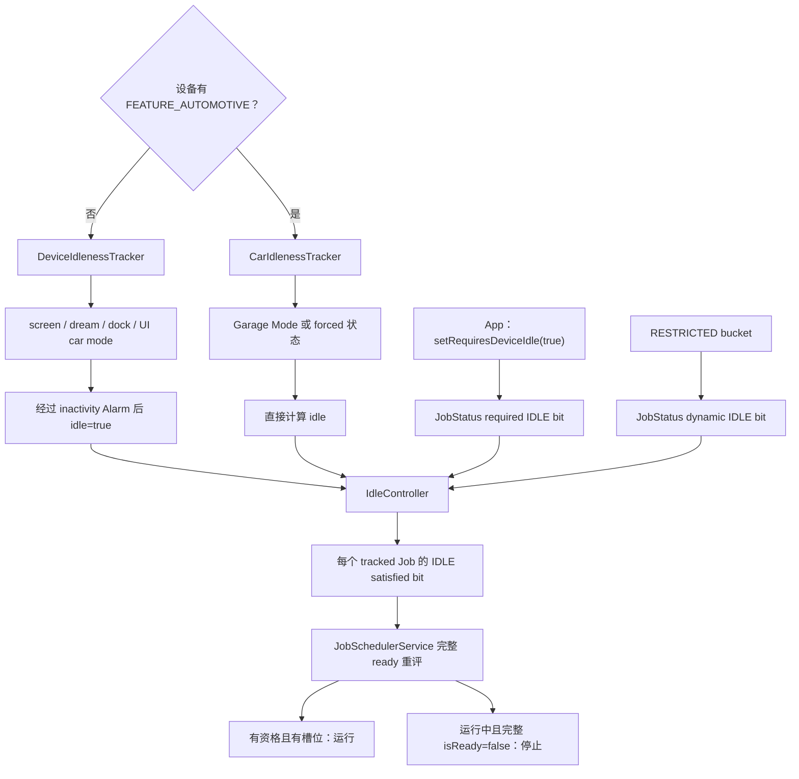
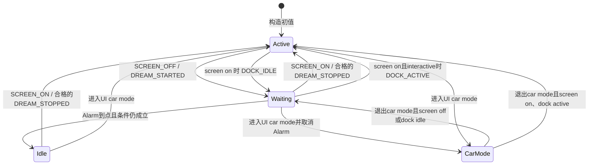
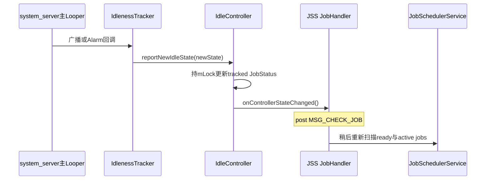
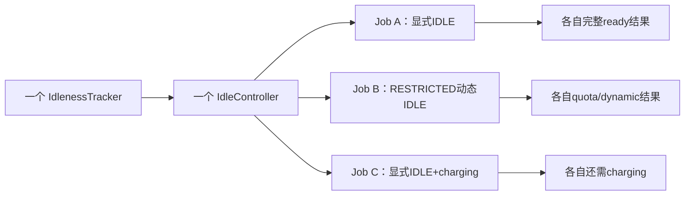
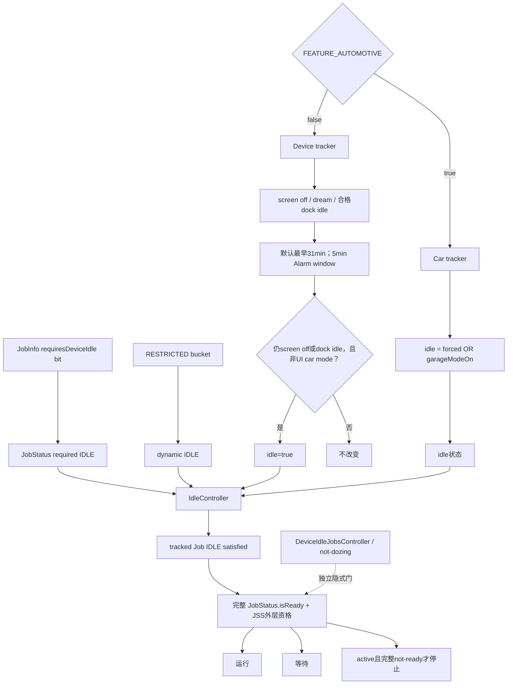

# 128 Android IdleController：普通设备、车机与空闲约束

> 源码版本：Android 11 / API 30 / `android-11.0.0_r48`  
> 学习方式：macOS 只读源码，不要求编译、不要求连接设备  
> 前置章节：第 25、69、121、122、124、126 章

---

## 1. 本章先拆掉最大的命名陷阱

应用可以这样声明 Job：

```java
JobInfo jobInfo = new JobInfo.Builder(jobId, serviceName)
        .setRequiresDeviceIdle(true)
        .build();
```

方法名里有 `DeviceIdle`，Android 又有 Doze/device-idle，二者却不是同一个状态。`JobInfo` 的 API 注释已经直接提醒：

```text
requires-device-idle
  设备有一段时间没有被用户交互使用

device idle / Doze
  系统为了省电而限制后台活动的低功耗模式
```

本章要追的是第一条链，由 `IdleController` 负责。下一章再追第二条链，由 `DeviceIdleJobsController` 负责。

所以最重要的结论先写在前面：

> `setRequiresDeviceIdle(true)` 表达“等用户暂时不用设备时再做”，不是“要求系统已经进入 Doze”。

---

## 2. 本章要回答什么

1. 熄屏后为什么不会立即满足 idle？
2. 默认为什么是31分钟，而不是常见印象中的30分钟？
3. Alarm 的5分钟窗口意味着什么？
4. dreaming、无线充电座、UI car mode 分别怎样改变状态？
5. Android Automotive 为什么不用同一个 timer？
6. RESTRICTED bucket 为什么也会让未显式声明 idle 的 Job 被跟踪？
7. idle bit 满足后，为什么 Job 仍可能不能运行？
8. 已运行 Job 因亮屏失去 idle 后，何时才真的停止？
9. r48 的车机实现里有哪些值得警惕的同步边界？

---

## 3. 源码地图

公开 API 与 Job 状态：

```text
frameworks/base/apex/jobscheduler/framework/java/android/app/job/JobInfo.java
frameworks/base/apex/jobscheduler/service/java/com/android/server/job/controllers/JobStatus.java
```

本章主文件：

```text
frameworks/base/apex/jobscheduler/service/java/com/android/server/job/controllers/IdleController.java
frameworks/base/apex/jobscheduler/service/java/com/android/server/job/controllers/idle/IdlenessTracker.java
frameworks/base/apex/jobscheduler/service/java/com/android/server/job/controllers/idle/IdlenessListener.java
frameworks/base/apex/jobscheduler/service/java/com/android/server/job/controllers/idle/DeviceIdlenessTracker.java
frameworks/base/apex/jobscheduler/service/java/com/android/server/job/controllers/idle/CarIdlenessTracker.java
```

配合阅读：

```text
frameworks/base/apex/jobscheduler/service/java/com/android/server/job/JobSchedulerService.java
frameworks/base/apex/jobscheduler/service/java/com/android/server/job/JobStore.java
frameworks/base/apex/jobscheduler/service/java/com/android/server/job/JobSchedulerShellCommand.java
frameworks/base/core/java/android/app/AlarmManager.java
frameworks/base/core/java/android/app/UiModeManager.java
frameworks/base/core/res/res/values/config.xml
packages/services/Car/service/src/com/android/car/garagemode/GarageMode.java
packages/services/Car/car_product/overlay/frameworks/base/core/res/res/values/config.xml
cts/tests/JobScheduler/src/android/jobscheduler/cts/IdleConstraintTest.java
```

---

## 4. 一张总图：同一个 IdleController 有两种事实生产者



注意：不是根据“当前是否进入车载 UI”动态选择 tracker，而是在构造时根据硬件 feature 选一次。

---

## 5. 公开 API 只写一个 constraint flag

`JobInfo` 中：

```java
public static final int CONSTRAINT_FLAG_DEVICE_IDLE = 1 << 2;
```

Builder 只是置位或清位：

```java
public Builder setRequiresDeviceIdle(boolean requiresDeviceIdle) {
    mConstraintFlags = (mConstraintFlags & ~CONSTRAINT_FLAG_DEVICE_IDLE)
            | (requiresDeviceIdle ? CONSTRAINT_FLAG_DEVICE_IDLE : 0);
    return this;
}
```

这里不会读取屏幕状态，也不会启动计时器。真正的设备状态由 system_server 内的 Controller 维护。

---

## 6. required、dynamic、satisfied 三类 bit

读这类 Controller 时，必须一直区分三件事：

```text
required IDLE
  应用通过 JobInfo 显式要求

dynamic IDLE
  系统因 RESTRICTED bucket 临时附加

satisfied IDLE
  IdleController 当前判定设备是否足够空闲
```

`JobStatus.hasIdleConstraint()` 同时检查 required 与 dynamic：

```java
private boolean hasConstraint(int constraint) {
    return (requiredConstraints & constraint) != 0
            || (mDynamicConstraints & constraint) != 0;
}
```

这解释了为什么“应用没调用 `setRequiresDeviceIdle(true)`”不必然等于 IdleController 永远不跟踪它。

---

## 7. RESTRICTED bucket 怎样动态加入 idle

Android 11 r48 的动态受限条件是：

```java
private static final int DYNAMIC_RESTRICTED_CONSTRAINTS =
        CONSTRAINT_BATTERY_NOT_LOW
        | CONSTRAINT_CHARGING
        | CONSTRAINT_CONNECTIVITY
        | CONSTRAINT_IDLE;
```

IdleController 因此继承 `RestrictingController`。当 Job 进入 RESTRICTED bucket，JSS 会调用：

```text
startTrackingRestrictedJobLocked()
→ maybeStartTrackingJobLocked()
```

离开时，如果它没有显式 idle 需求，Controller 才移除它。

但“加入动态约束”不是说它永远必须 idle。JobStatus 的第一道总门是：

```text
withinQuota || dynamicSatisfied
```

在 quota 内可以走左边；超出 quota 后，才需所有动态约束满足后走右边。

---

## 8. IdleController 初始化时选择哪种 tracker

构造逻辑很短：

```java
final boolean isCar = mContext.getPackageManager().hasSystemFeature(
        PackageManager.FEATURE_AUTOMOTIVE);
if (isCar) {
    mIdleTracker = new CarIdlenessTracker();
} else {
    mIdleTracker = new DeviceIdlenessTracker();
}
```

因此 r48 中只有两个分支：

| 设备 | Tracker |
|---|---|
| 声明 `FEATURE_AUTOMOTIVE` 的车机 | `CarIdlenessTracker` |
| 手机、平板、TV 及其他设备 | `DeviceIdlenessTracker` |

源码树里没有单独的 `TvIdlenessTracker`。TV 可以通过资源 overlay 改阈值，但仍走普通设备状态机。

---

## 9. “进入 car mode”不等于切换到 CarIdlenessTracker

普通手机可以调用 UI mode API 进入 car mode，但 tracker 已在 JSS 构造阶段选定，不会因此重建成 `CarIdlenessTracker`。

所以要分清：

```text
FEATURE_AUTOMOTIVE
  决定用哪一个 tracker 实现

UiModeManager 的 car mode
  是 DeviceIdlenessTracker 的一个输入状态，会暂时阻止普通 idle

Garage Mode
  是 Automotive 产品中 CarIdlenessTracker 的核心输入
```

三个“car”相关名词不在同一层。

---

## 10. 普通 tracker 的启动初值是保守的 active

`DeviceIdlenessTracker` 构造函数：

```java
mIdle = false;
mScreenOn = true;
mDockIdle = false;
mInCarMode = false;
```

注释说明，开机时先假设用户刚与设备交互过。构造函数没有同步调用 PowerManager 查询真实屏幕状态。

这意味着启动初值是一个保守近似：先不给 idle-constrained Job 放行，之后靠广播和 Alarm 收敛。它不是“开机精确快照”。

---

## 11. 普通 tracker 监听哪些信号

它动态注册：

```text
ACTION_SCREEN_ON / ACTION_SCREEN_OFF
ACTION_DREAMING_STARTED / ACTION_DREAMING_STOPPED
ACTION_DOCK_IDLE / ACTION_DOCK_ACTIVE
ACTION_ENTER_CAR_MODE_PRIORITIZED
ACTION_EXIT_CAR_MODE_PRIORITIZED
ActivityManagerService.ACTION_TRIGGER_IDLE
```

这些事件分成三类：

- 用户交互/显示线索：screen、dream；
- 无线充电座线索：dock idle/active；
- 模式或测试线索：UI car mode、内部 trigger idle。

它们不是都直接把 `mIdle` 改成 true；多数事件只是开始或取消计时。

---

## 12. 广播回调运行在哪个线程

`startTracking()` 调用：

```java
context.registerReceiver(this, filter);
```

没有传 Handler。`ContextImpl.registerReceiverInternal()` 会使用 system_server 的 `ActivityThread` 主 Handler。因此 tracker 的 `onReceive()` 在 system_server 主 Looper 处理。

这也解释了类内注释为何说：构造完成后，idle/screen 状态只会在 main looper 上修改。

---

## 13. screen off 只安排计时，不立即 idle

收到：

```text
ACTION_SCREEN_OFF
ACTION_DREAMING_STARTED
```

代码先设置：

```text
mScreenOn=false
mDockIdle=false
```

再调用 `maybeScheduleIdlenessCheck(action)`。

所以这条推理是错的：

```text
屏幕刚熄灭 → IDLE satisfied=true
```

准确说法是：

```text
屏幕熄灭/开始 dreaming
→ 进入“有资格等待 idle timer”的状态
→ timer 到达后重新检查条件
→ 条件仍成立才进入 idle
```

---

## 14. 默认 inactivity threshold 为什么是31分钟

基础资源：

```xml
<integer name="config_jobSchedulerInactivityIdleThreshold">1860000</integer>
```

换算：

```text
1,860,000 ms ÷ 60,000 = 31 min
```

因此本地 r48 基础默认值是31分钟，不是凭印象写成30分钟。产品可以用 resource overlay 改写它，所以文档只能说“基础默认31分钟”。

---

## 15. 5分钟 slop 是 Alarm 窗口，不是第二个等待阶段

另一个基础资源：

```xml
<integer name="config_jobSchedulerIdleWindowSlop">300000</integer>
```

调用方式：

```java
final long when = nowElapsed + mInactivityIdleThreshold;
mAlarm.setWindow(AlarmManager.ELAPSED_REALTIME_WAKEUP,
        when, mIdleWindowSlop, "JS idleness", mIdleAlarmListener, null);
```

可把请求理解为：

```text
最早触发点：now + 31min
允许 AlarmManager 在之后约5min窗口内批处理
```

但不要把“约31～36分钟”写成系统对最迟时刻的绝对实时保证。Alarm 仍可能受系统调度、负载等现实条件影响；`setWindow()` 表达的是允许批处理的窗口。

---

## 16. 为什么这里用 elapsed realtime

Alarm 类型是：

```text
ELAPSED_REALTIME_WAKEUP
```

它以开机后的单调时间为基准，不会因为用户修改墙上时间或时区而突然提前/延后。`WAKEUP` 表示到期可以唤醒设备处理这个系统决策。

因此“31分钟未交互”测的是经过时间，不是钟表从10:00走到10:31。

---

## 17. 同一个 listener 会替换旧 Alarm

tracker 始终使用同一个：

```java
mIdleAlarmListener
```

AlarmManagerService 在设置新 alarm 时会移除匹配的旧 listener alarm。因此多个合格事件接连到来时，后一次安排可以重置起点，并不是积累出多个独立 timer 最后连续回调。

例如：

```text
t0 screen off：约 t0+31min 起可触发
t0+10min dreaming started：用同一 listener 重新安排
→ 新的最早点约为 t0+41min
```

这是一项从 AlarmManager listener 身份和服务端替换逻辑得出的实现结论。

---

## 18. Alarm 回调也回到主 Looper

调用 `setWindow(..., listener, null)` 时，最后一个参数是 null Handler。

AlarmManager 的实现会选择：

```java
final Handler handler = (targetHandler != null)
        ? targetHandler : mMainThreadHandler;
```

因此 `mIdleAlarmListener` 也在该进程的主 Handler 上运行。广播回调与 Alarm 回调对 tracker 字段的修改串行化，无需给这些字段再套一把独立锁。

---

## 19. Alarm 到点后还要重新验证条件

`handleIdleTrigger()` 不是无条件置 true：

```java
if (!mIdle && (!mScreenOn || mDockIdle) && !mInCarMode) {
    mIdle = true;
    mIdleListener.reportNewIdleState(mIdle);
}
```

四个门分别是：

1. 当前尚未 idle；
2. screen off 或 dock idle；
3. 不在 UI car mode；
4. 回调确实执行到这里。

即使测试 trigger 提前到达，也不会绕过这组状态验证。

---

## 20. screen on 怎样退出 idle

收到 `ACTION_SCREEN_ON` 后：

```text
mScreenOn=true
mDockIdle=false
cancelIdlenessCheck()
若 mIdle 原来为 true：
  mIdle=false
  reportNewIdleState(false)
```

如果本来没有进入 idle，就只取消等待，不重复上报 false。

所以亮屏既可能：

- 取消尚未到期的 idle timer；
- 也可能把已满足的 IDLE bit 撤销。

---

## 21. dreaming stopped 为什么查询 PowerManager

`ACTION_DREAMING_STOPPED` 与 screen on 共用退出路径前，先检查：

```java
if (!mPowerManager.isInteractive()) {
    return;
}
```

Dream 停止并不自动证明设备已经可交互。例如显示状态仍未真正进入 interactive 时，过早宣布 active 会取消合理的 idle 状态。

因此只有 PowerManager 确认真正 interactive，才继续按 screen-on 路径退出 idle。

---

## 22. dock idle 的特殊语义

`ACTION_DOCK_IDLE` 表示无线充电座判定用户暂时不交互。代码只在 `mScreenOn=true` 时接受：

```text
screen on + DOCK_IDLE
→ mDockIdle=true
→ 安排同样的 inactivity Alarm
```

若屏幕已经 off，广播被忽略，因为 screen-off 状态本来已经覆盖“不交互”入口，没有必要让 dock 事件再重置 timer。

注意：dock idle 依然不是立即满足 IDLE，它只是让 `(!mScreenOn || mDockIdle)` 成立并开始等待。

---

## 23. dock active 为什么也只在 screen on 时处理

`ACTION_DOCK_ACTIVE` 先检查：

```java
if (!mScreenOn) {
    return;
}
```

屏幕 off 时忽略它；屏幕 on 时还会继续经过 `DREAMING_STOPPED` 分支的 `mPowerManager.isInteractive()` 检查。只有 `mScreenOn=true` 且 PowerManager 确认 interactive，才继续复用 screen-on 的退出逻辑，最终：

```text
mScreenOn=true
mDockIdle=false
取消 Alarm
必要时退出 idle
```

这组规则避免 dock 信号覆盖更强的 screen-off 非交互事实。

---

## 24. 普通设备进入 UI car mode 会发生什么

收到 `ACTION_ENTER_CAR_MODE_PRIORITIZED`：

```text
mInCarMode=true
取消 idle Alarm
若当前 idle：退出并上报 false
```

进入 car mode 后，即使屏幕熄灭，`maybeScheduleIdlenessCheck()` 也会因 `!mInCarMode` 不成立而拒绝安排。

这是普通设备 tracker 的产品策略：UI car mode 期间不要按手机的无交互计时规则进入 JobScheduler idle。

---

## 25. 退出 UI car mode 是否一定开始新 timer

收到 exit 后：

```text
mInCarMode=false
maybeScheduleIdlenessCheck(action)
```

但 helper 仍检查：

```text
!mScreenOn || mDockIdle
```

所以：

- 屏幕 off 或 dock idle：开始一轮新计时；
- 屏幕 on 且 dock active：什么也不安排。

“退出 car mode”只是重新允许普通规则工作，不等于立即 idle。

---

## 26. 普通设备状态机图



这里的 `Waiting` 是教学名称，源码没有对应 enum；真实状态由四个 boolean 加 Alarm 是否存在共同表达。

---

## 27. IdleController 如何跟踪 Job

当 Job 显式或动态需要 idle：

```java
if (taskStatus.hasIdleConstraint()) {
    mTrackedTasks.add(taskStatus);
    taskStatus.setTrackingController(JobStatus.TRACKING_IDLE);
    taskStatus.setIdleConstraintSatisfied(mIdleTracker.isIdle());
}
```

加入 tracked set 时立即写入 tracker 当前值，不必等下一次状态变化。

这解决了典型问题：设备已经 idle 后，新 schedule 的 idle Job 不应再等一次 screen cycle。

---

## 28. 停止跟踪时为什么先清 tracking bit

```java
if (taskStatus.clearTrackingController(JobStatus.TRACKING_IDLE)) {
    mTrackedTasks.remove(taskStatus);
}
```

tracking bit 是“这个 Job 当前确实登记在该 Controller”这一关系的守卫。replacement、取消和重新调度会多次经过 Controller 生命周期；先检查 bit 能避免无效移除和状态关系混乱。

---

## 29. idle 状态改变怎样投影到全部 Job

tracker 调用 listener 后进入：

```java
public void reportNewIdleState(boolean isIdle) {
    synchronized (mLock) {
        for (int i = mTrackedTasks.size() - 1; i >= 0; i--) {
            mTrackedTasks.valueAt(i).setIdleConstraintSatisfied(isIdle);
        }
    }
    mStateChangedListener.onControllerStateChanged();
}
```

这里做两件事：

1. 在 JSS 全局锁下，给所有 tracked Job 写相同的 satisfied bit；
2. 锁外通知 JobSchedulerService 重新检查。

Controller 保存的是设备级共享事实，JobStatus 保存的是这项事实投影到每个 Job 的结果。

---

## 30. 即使 bit 没改变也会发 JSS 回调

`reportNewIdleState()` 没有收集 setter 返回值，也没有判断 tracked set 是否为空；只要 tracker 调用了它，最后就会：

```java
mStateChangedListener.onControllerStateChanged();
```

不过普通 tracker 自己通常只在 `mIdle` 真正变化时调用 listener。车机的 `updateIdlenessState()` 也先比较新旧值。

所以“Controller 无条件回调”与“tracker 通常去重状态”要分层理解。

---

## 31. 从 tracker 到调度检查的线程切换



这里没有跨进程调用。tracker、Controller 和 JSS 都在 system_server；真正进入应用 JobService 是后续调度执行阶段的 Binder 链。

---

## 32. `onControllerStateChanged()` 不是“现在运行”

它只向 JobHandler 发送：

```text
MSG_CHECK_JOB
```

Handler 稍后根据 `mReportedActive` 选择：

```text
queueReadyJobsForExecutionLocked()
或
maybeQueueReadyJobsForExecutionLocked()
```

前者是全量 ready queue，后者仍会应用非活跃批处理策略。最终还要经过用户、组件、restriction、pending、并发槽等检查。

因此 idle 变 true 不等于所有 idle Job 立即开始。

---

## 33. `mReportedActive` 也不是“存在 active Job”的同义词

JSS 的汇总位在以下情况可为 true：

```text
pending queue 非空
或
存在不属于前台/白名单/UID active 例外的 running Job
```

它影响收到普通 controller change 时使用全量还是批量扫描。不要把变量名直译成严格的“当前至少有一个 JobService 正在执行”。

---

## 34. idle=true 仍远不等于 Job ready

JobStatus 的完整核心公式可简化为：

```text
(withinQuota || dynamicSatisfied)
&& bucket != NEVER
&& notDozing
&& backgroundNotRestricted
&& (one-shot deadline satisfied || all ordinary required constraints satisfied)
```

ordinary constraints 还可能包括：

```text
charging
battery-not-low
storage-not-low
timing-delay
connectivity
content-trigger
idle
```

IdleController 只维护其中一个 bit，不能替其他 Controller 做决定。

---

## 35. 一个反例：idle 与 Doze 可以互相矛盾

场景 A：

```text
屏幕熄灭足够久
→ IdleController idle=true
→ 设备随后进入 Doze
→ DEVICE_NOT_DOZING=false
```

显式 IDLE 已满足，普通 Job 仍可被 Doze 隐式门挡住。

场景 B：

```text
设备未进入Doze
→ DEVICE_NOT_DOZING=true
但用户正在操作屏幕
→ IdleController idle=false
```

普通不要求 idle 的 Job 可能通过 Doze 门；显式要求 idle 的 Job 仍不能通过。

两者是正交维度，不能互相代换。

---

## 36. Deadline 能否越过 idle

对非周期 one-off Job，deadline 满足后可以替代 ordinary constraints，包括显式 idle：

```text
mReadyDeadlineSatisfied
|| isConstraintsSatisfied(...)
```

但 deadline 不能越过前面的：

- `withinQuota || dynamicSatisfied`；
- NEVER bucket；
- not-dozing；
- background-not-restricted；
- JSS 外层用户/组件/备份/restriction/并发门。

周期 Job 的 latest runtime 只是内部窗口边界，不建立同样的 deadline override。

---

## 37. RESTRICTED Job 的 idle 有两种身份

假设应用本身没有要求 idle，但处于 RESTRICTED：

```text
required IDLE = 0
dynamic IDLE = 1
```

若仍在 quota 内：

```text
withinQuota=true
→ 动态集合不必成为本次运行的阻断门
```

若超出 quota：

```text
withinQuota=false
→ 必须 dynamicSatisfied=true
→ charging、battery-not-low、必要时connectivity、idle 都要满足
```

这正是 IdleController 需要跟踪“未显式要求 idle”的 RESTRICTED Job 的原因。

---

## 38. 已运行 Job 亮屏后会怎样

亮屏使 idle true→false，JSS 最终调用：

```java
stopNonReadyActiveJobsLocked();
```

但停止条件不是“IDLE bit 下降”本身，而是：

```text
running.isReady() == false
```

因此：

- 普通显式 idle Job 通常会因约束丢失而进入停止协议；
- 一次性 deadline 已满足、调试 override 或其他有效 ready 分支可能让它仍 ready；
- RESTRICTED Job 若仍在 quota 内，单独失去 dynamic idle 也未必让总门失败。

应说“重新评估并在完整 not-ready 时停止”，不能简写成“亮屏就必停全部 idle Job”。

---

## 39. stop reason 如何归类

当 running Job 完整 not-ready：

```text
effective bucket=RESTRICTED
且 dynamic constraints 未全部满足
→ REASON_RESTRICTED_BUCKET

其他普通约束不满足
→ REASON_CONSTRAINTS_NOT_SATISFIED
```

JSS 通过 JobServiceContext 的正常停止协议进入应用 `onStopJob()`，不是在 screen broadcast 回调里杀进程。

Android 11 普通 SDK 应用主要通过 `onStopJob()` 知道系统要求停止；读取具体 stop reason 的接口在这个版本仍是隐藏 API。

---

## 40. persisted Job 保存什么

只有应用设置 persisted 的 Job 才会写 `jobs.xml`。其中约束节点可保存：

```xml
<constraints idle="true" ... />
```

重启后 reader 调用：

```java
jobBuilder.setRequiresDeviceIdle(true);
```

正常非 RESTRICTED 情况下，这个 `idle` 属性对应应用的 required 声明。但 r48 的 serializer 使用的是：

```java
jobStatus.hasIdleConstraint()
```

而不是只看 `JobInfo.isRequireDeviceIdle()`；前者同时检查 required 与 dynamic。因此 persisted Job 在 RESTRICTED 状态被写盘时，动态加入的 IDLE 也可能序列化成 `idle="true"`，重启 reader 又把它恢复为显式 required。这是 r48 的持久化版本边界，不能笼统说 XML 永远只保存应用原始声明。

即使发生该边界，XML 仍不保存下列设备运行态：

- 当前 `mIdle`；
- timer 剩余时间；
- `mScreenOn`、`mDockIdle`、`mInCarMode`；
- JobStatus 的 satisfied bit。

重启后 tracker 和 Controller 会重新建立运行时事实。

---

## 41. idle Job 与自定义 backoff 不能组合

若应用显式调用了 `setBackoffCriteria()`，又要求 device idle，`build()` 会抛异常：

```java
if (mBackoffPolicySet
        && (mConstraintFlags & CONSTRAINT_FLAG_DEVICE_IDLE) != 0) {
    throw new IllegalArgumentException(...);
}
```

注意条件是 `mBackoffPolicySet`。每个 JobInfo 都有默认 backoff 数值，并不等于应用已经显式设置。因此：

```text
requires idle + 默认backoff字段存在
  合法

requires idle + 显式setBackoffCriteria(...)
  build时报错
```

不要误写成“idle Job 没有任何 backoff 字段”。

---

## 42. CarIdlenessTracker 完全不使用普通 inactivity timer

车机 tracker 监听：

```text
ACTION_SCREEN_ON
GARAGE_MODE_ON / GARAGE_MODE_OFF
FORCE_IDLE / UNFORCE_IDLE
ACTION_TRIGGER_IDLE
```

它不监听 `SCREEN_OFF`，也不读取31分钟和5分钟资源，核心公式只有：

```java
final boolean newState = mForced || mGarageModeOn;
```

所以 Automotive 的正常 idle 事实主要由 Garage Mode 生命周期提供，不是“熄屏等待31分钟”。

---

## 43. Car overlay 把两个阈值设为0意味着什么

Car 产品 overlay 中确实有：

```xml
<integer name="config_jobSchedulerInactivityIdleThreshold">0</integer>
<integer name="config_jobSchedulerIdleWindowSlop">0</integer>
```

但 `FEATURE_AUTOMOTIVE` 设备选择的是 `CarIdlenessTracker`，该类根本不读取这两个资源。

因此不能据此推出：

```text
车机一熄屏就立即进入 JobScheduler idle
```

在当前实现里，这两个 overlay 值对 CarIdlenessTracker 主链没有直接作用。源码阅读必须继续追“谁读取资源”，不能看到 overlay 就停止。

---

## 44. Garage Mode 广播从哪里来

Car service 的 `GarageMode` 会发送：

```text
com.android.server.jobscheduler.GARAGE_MODE_ON
com.android.server.jobscheduler.GARAGE_MODE_OFF
```

其方法把 action 按状态二选一，并添加 registered-only/no-abort flags。Framework 的 CarIdlenessTracker 复制了相同字符串进行监听。

AndroidManifest 又把两条 action 声明为 protected broadcast，避免普通第三方应用伪造车机维护状态。

---

## 45. Garage Mode 与 forced 状态的真值表

车机公式：

```text
idle = forced || garageModeOn
```

| forced | garage mode | idle |
|---:|---:|---:|
| false | false | false |
| false | true | true |
| true | false | true |
| true | true | true |

所以 `GARAGE_MODE_OFF` 不一定退出 idle：若仍 forced，公式结果仍为 true。

同理，`UNFORCE_IDLE` 也不一定退出：若 Garage Mode 仍开着，仍为 idle。

---

## 46. Car 的 trigger idle 是“一次性置 true”

收到内部 `ACTION_TRIGGER_IDLE` 且 Garage Mode 没开时：

```java
if (!mIdle) {
    mIdle = true;
    mIdleListener.reportNewIdleState(mIdle);
}
```

它没有 timer，也不改变 `mForced`。注释称这是“触发一次，直到某个约束把它切回去”。

与普通设备不同：普通 `handleIdleTrigger()` 仍要求 screen off/dock idle 且不在 car mode；车机这条测试路径直接把 `mIdle` 置 true。

---

## 47. r48 车机 screen-on 路径的同步边界

`CarIdlenessTracker.handleScreenOn()` 中：

```java
} else if (mIdle) {
    mIdle = false;
}
```

这里没有调用：

```text
mIdleListener.reportNewIdleState(false)
```

因此在本地 r48 中，如果 idle 是 one-shot trigger 造成、且 forced/garage 都为 false，screen on 会把 tracker 自身改为 false，却完全不从这条路径把 false 投影给已跟踪的 JobStatus。已有 JobStatus 可以持续保留 stale `IDLE=true`，直到后续某次真正触发 listener 的状态转换（例如先进入 forced/garage idle 后再退出），或该 Job 被重新跟踪并重新读取 tracker 当前值。

这是当前版本值得警惕的实现同步风险；从代码看不出它是面向所有版本的设计承诺。文档不应替源码“脑补回调”，也不应泛化成所有 Android 版本都有该行为。

---

## 48. Car dump 也有一个诊断盲区

文本和 proto dump 输出：

```text
mIdle
mGarageModeOn
```

却没有输出 `mForced`。

因此看到：

```text
mIdle=true
mGarageModeOn=false
```

不能只凭 dump 区分是 forced 造成，还是 one-shot trigger 后尚未退出。读 dumpsys 时要知道“没打印”不等于“状态不存在”。

---

## 49. 普通设备与车机对照表

| 维度 | DeviceIdlenessTracker | CarIdlenessTracker |
|---|---|---|
| 选择条件 | 非 Automotive | `FEATURE_AUTOMOTIVE` |
| 核心判据 | screen/dream/dock + inactivity Alarm | forced 或 Garage Mode |
| 默认初值 | active | active |
| 是否读取31min/5min资源 | 是 | 否 |
| SCREEN_OFF | 开始等待 | 不监听 |
| SCREEN_ON | 取消等待/退出并上报 | forced/garage 时保持；特殊退出路径漏上报 |
| UI car mode | 阻止普通 idle | 不监听该组 action |
| Garage Mode | 不监听 | 核心输入 |
| trigger idle | 条件满足才置 true | 非 Garage 时一次性置 true |

---

## 50. 为什么普通 tracker 不查询真实 screen 初态

构造时选择“screen on、not idle”有两个效果：

1. 避免 system_server 启动瞬间因不完整状态错误放行重任务；
2. 把后续事实收敛交给已有系统广播。

代价是启动时可能存在保守延迟：如果设备启动阶段实际屏幕已 off，但 tracker 尚未收到相应事件，idle timer 还未建立。

这与前两章 Controller 的默认状态问题相似：启动顺序和异步事件意味着“构造初值”不是物理世界的同步真相。

---

## 51. protected broadcast 不代表任意应用可控制 idle

本章涉及的内部 action 在 platform manifest 中有 protected 声明，例如：

```text
com.android.server.ACTION_TRIGGER_IDLE
android.intent.action.DOCK_IDLE / DOCK_ACTIVE
GARAGE_MODE_ON / OFF
FORCE_IDLE / UNFORCE_IDLE
```

这限制普通应用冒充系统生产者。`registerReceiver()` 本身没显式传 receiver permission，并不意味着第三方可自由发送受保护 action。

安全判断不能只看接收侧那一行，还要看 manifest 的 broadcast 保护。

---

## 52. `am idle-maintenance` 到底触发哪条链

ActivityManager shell 的 `idle-maintenance` 最终调用 AMS：

```text
sendIdleJobTrigger()
→ registered-only ACTION_TRIGGER_IDLE，package=android
```

然后：

- 普通 tracker 调 `handleIdleTrigger()`，仍验证 screen/dock/car 条件；
- Car tracker 在 Garage Mode 未开时走 one-shot trigger。

所以它是内部测试/维护触发器，不是“无视任何条件强制普通设备 idle”的万能开关。

本学习计划以 macOS 只读为主，不需要实际执行该命令。

---

## 53. `trigger-dock-state` 只模拟 dock 信号

JobScheduler shell command：

```text
cmd jobscheduler trigger-dock-state idle|active
```

JSS 只是发送 registered-only foreground 的：

```text
ACTION_DOCK_IDLE 或 ACTION_DOCK_ACTIVE
```

它不会直接调用 `setIdleConstraintSatisfied(true)`。普通 tracker 仍按 screen 状态和 inactivity Alarm 处理；Automotive tracker不监听这组 dock action。

因此“trigger dock idle”也不等于“马上运行 idle Job”。

---

## 54. `cmd jobscheduler run` 的三个模式别混用

r48 shell 实现中：

```text
不带 -s/-f：OVERRIDE_SOFT
-s / --satisfied：OVERRIDE_SORTING，真实约束必须满足
-f / --force：OVERRIDE_FULL
```

soft override 包含 IDLE，所以不带 `-s` 的 `run` 可以掩盖本章正在验证的 idle 约束。CTS 的 helper 特意用：

```text
cmd jobscheduler run -s ...
```

来要求真实约束成立。

另外，r48 shell help 有一处文案笔误：`-f` 的互斥说明写成“incompatible with -f”，结合 parser 可知实际是 `-f` 与 `-s` 互斥。源码正文与控制流优先于孤立帮助文本。

---

## 55. CTS 怎样证明普通状态机

`IdleConstraintTest` 的典型顺序是：

```text
screen on → idle Job 应 waiting
screen off → am idle-maintenance
→ idle Job 应 ready/执行
screen on → 再次 active
```

它还验证：

- screen on 时 dock idle 可进入等待并触发；
- screen off 时 dock active 被忽略；
- 普通设备 UI car mode 会阻止 idle；
- idle Job 运行后重新 active，会收到停止。

测试代码是理解设计意图的好补充，但仍要对照生产实现确认前置条件。

---

## 56. 三条完整时序推演之一：普通熄屏后运行

```text
t0：SCREEN_OFF
  mScreenOn=false
  setWindow(now+31min, slop=5min)

t1：Alarm实际回调
  检查 !mIdle && !mScreenOn && !mInCarMode
  mIdle=true
  IdleController 给所有tracked Job写IDLE satisfied
  post MSG_CHECK_JOB

t2：JSS处理消息
  重算完整ready、外层资格与并发槽
  合格Job进入pending并绑定JobService
```

任何一步都不是“熄屏直接调用应用”。

---

## 57. 时序推演之二：等待中亮屏

```text
t0：SCREEN_OFF，安排Alarm
t0+10min：SCREEN_ON
  mScreenOn=true
  mDockIdle=false
  cancelIdlenessCheck()
  因尚未idle，不上报状态变化

原定Alarm：已取消
JobStatus IDLE：仍为false
```

用户只离开10分钟，达不到默认31分钟阈值，Job 不会因这一轮短暂熄屏获得 idle。

---

## 58. 时序推演之三：运行中亮屏

```text
前提：idle=true，某 Job 正在运行

SCREEN_ON
→ tracker mIdle=false
→ Controller 清该Job的IDLE satisfied bit
→ post MSG_CHECK_JOB
→ JSS stopNonReadyActiveJobsLocked
→ 若完整isReady=false，JobServiceContext发起stop
→ 应用主线程onStopJob()
```

这里可能有两个异步边界：Controller 向 JSS Handler post 消息，以及 system_server 通过 Binder 通知应用 JobService。

---

## 59. 多个 Job 共用一个设备 idle 状态



设备状态是共享的，Job 的 required/dynamic 集合和其他约束是各自独立的。因此同一刻：

- A 可以 ready；
- B 可能仍在 quota 内，不依赖 dynamic idle；
- C 可能因未充电而 waiting。

---

## 60. Controller 不记录每个 Job 等了多久

`mTrackedTasks` 只是一组 JobStatus。等待31分钟的是全局 tracker，不是每个 Job 各有一个 timer。

如果设备已经 idle，再 schedule 新 Job：

```text
maybeStartTrackingJobLocked()
→ 立即读取 mIdleTracker.isIdle()
→ 新Job的IDLE bit直接为true
```

它不会从新 Job schedule 时重新等待31分钟。

---

## 61. replacement 与取消没有特殊 idle 交接

同 uid/jobId 新 Job 替换旧 Job时，JSS 按标准 Controller 生命周期：

```text
旧 Job 先清 TRACKING_IDLE 并从 set 移除
新 Job 随后开始跟踪并读取当前 tracker 值
```

因为 idle 是设备级当前事实，不需要像 ContentObserverController 那样迁移 pending URI 快照，也没有 per-Job timer 可交接。

---

## 62. 常见误解一：IdleController 就是 Doze 控制器

错误。

```text
IdleController
→ CONSTRAINT_IDLE
→ 用户是否长时间未交互

DeviceIdleJobsController
→ CONSTRAINT_DEVICE_NOT_DOZING
→ Doze 是否允许该Job
```

类名相似是本章最大的阅读陷阱。

---

## 63. 常见误解二：熄屏立即满足 idle

错误。普通设备默认先等待31分钟阈值，再在5分钟 Alarm 窗口中择机触发，且触发时还要复查状态。

产品 overlay 可改数值，但状态机“先等待、再验证”仍要以所读版本实现为准。

---

## 64. 常见误解三：5分钟 slop 是固定再睡5分钟

错误。它是允许 AlarmManager 批处理的 window length，不是代码在31分钟后又执行一次固定 `postDelayed(5min)`。

实际触发可以在窗口内择机；也不应把窗口尾写成硬实时 SLA。

---

## 65. 常见误解四：进入手机 car mode 就换车机 tracker

错误。tracker 由 `FEATURE_AUTOMOTIVE` 在构造时决定。普通设备进入 UI car mode 只会让 DeviceIdlenessTracker 暂停 idle 计时并退出已有 idle。

---

## 66. 常见误解五：车机阈值 overlay=0，所以熄屏立即 idle

错误。CarIdlenessTracker 根本不读取这两个阈值，也不监听 screen off。正常车机链要看 Garage Mode/forced 状态。

---

## 67. 常见误解六：idle 变 true 会强行运行全部 Job

错误。Controller 只 post 普通状态变化，JSS 还要检查完整 `isReady()`、外层资格、批处理和并发槽。

idle 是必要条件之一，不是执行命令。

---

## 68. 常见误解七：亮屏必然停止所有动态 idle Job

错误。运行中的 Job 只有在完整 `isReady()` 变 false 时才停。RESTRICTED Job 若在 quota 内，动态约束集合并非本次运行的必经通道。

显式要求 idle 的普通 Job通常会丢失 ordinary constraint，但也要尊重 deadline/override 等真实公式。

---

## 69. 常见误解八：默认 backoff 让所有 idle Job build 失败

错误。异常只在应用显式调用 `setBackoffCriteria()` 时触发，因为判断的是 `mBackoffPolicySet`，不是 JobInfo 内是否存在默认 backoff 数值。

---

## 70. macOS 只读练习一：证明 idle 与 Doze 是两个 bit

在源码根目录执行：

```bash
rg -n "CONSTRAINT_IDLE|CONSTRAINT_DEVICE_NOT_DOZING|setRequiresDeviceIdle" \
  frameworks/base/apex/jobscheduler
```

应找到：

```text
CONSTRAINT_IDLE = JobInfo.CONSTRAINT_FLAG_DEVICE_IDLE
CONSTRAINT_DEVICE_NOT_DOZING = 1 << 25
```

练习目标：不要只记结论，要能用两个不同 bit 证明它们是两条控制链。

---

## 71. macOS 只读练习二：手算默认 timer

```bash
rg -n "config_jobSchedulerInactivityIdleThreshold|config_jobSchedulerIdleWindowSlop" \
  frameworks/base/core/res packages/services/Car
```

手算：

```text
1860000ms = 31min
300000ms = 5min
```

再回答：Car overlay 为0时，为什么仍不能证明 CarIdlenessTracker 读取了它？

---

## 72. macOS 只读练习三：画普通设备事件表

```bash
sed -n '100,240p' \
  frameworks/base/apex/jobscheduler/service/java/com/android/server/job/controllers/idle/DeviceIdlenessTracker.java
```

自己整理四列：

```text
action | 前置条件 | 字段变化 | 是否上报listener
```

重点比较 `DOCK_ACTIVE`、`DREAMING_STOPPED` 的 fallthrough 与提前 return。

---

## 73. macOS 只读练习四：证明车机不读 timer

```bash
rg -n "mInactivityIdleThreshold|mIdleWindowSlop|mGarageModeOn|mForced" \
  frameworks/base/apex/jobscheduler/service/java/com/android/server/job/controllers/idle
```

应看到 timer 字段只在 DeviceIdlenessTracker，而 CarIdlenessTracker 用 `mForced || mGarageModeOn`。

再检查 `handleScreenOn()` 是否调用 listener，记录 r48 特殊边界。

---

## 74. macOS 只读练习五：从 Controller 追到停止

```bash
rg -n "reportNewIdleState|onControllerStateChanged|MSG_CHECK_JOB|stopNonReadyActiveJobsLocked" \
  frameworks/base/apex/jobscheduler/service/java/com/android/server/job
```

尝试画出：

```text
tracker
→ IdleController
→ JSS Handler
→ ready scan
→ JobServiceContext stop
```

并在图旁写明：停止判断是完整 `running.isReady()`，不是直接测试 idle bit。

---

## 75. 阅读检查题

1. `setRequiresDeviceIdle(true)` 与 Doze 的根本区别是什么？
2. required、dynamic、satisfied IDLE bit 分别由谁产生？
3. 为什么未显式要求 idle 的 RESTRICTED Job仍可能被跟踪？
4. `withinQuota || dynamicSatisfied` 怎样影响动态 idle？
5. 哪个 feature 决定 tracker 实现？进入 UI car mode 会不会换实现？
6. 普通 tracker 为什么以 `screenOn=true, idle=false` 启动？
7. screen off 后需要哪两个资源共同安排 Alarm？
8. 31分钟与5分钟分别是什么含义？
9. Alarm 回调为什么还要检查 screen/dock/car 状态？
10. dreaming stopped 为什么查询 `isInteractive()`？
11. screen off 时为何忽略 dock active/idle 的部分事件，screen on 的 DOCK_ACTIVE 又为何还需 `isInteractive()`？
12. idle 状态上报在哪个锁下更新 JobStatus，又在哪里 post 消息？
13. idle=true 为什么不等于 ready？
14. 一次性 deadline 能越过哪些门，不能越过哪些门？
15. persisted jobs.xml 保存 idle 当前状态吗？
16. 显式 backoff 与 requires idle 为什么 build 冲突？
17. CarIdlenessTracker 的核心布尔公式是什么？
18. Car overlay 的0为何不能推出熄屏立即 idle？
19. r48 Car `handleScreenOn()` 有什么同步风险？
20. 为什么普通 `cmd jobscheduler run` 不适合验证真实 idle 约束？

---

## 76. 一页复习图



---

## 77. 本章结论

IdleController 可以压缩为十点：

1. `requiresDeviceIdle` 表示长时间未交互，不等于 Doze；
2. JobInfo 只声明 required bit，IdleController 负责 satisfied bit；
3. RESTRICTED bucket 会动态加入 idle，但总门是 quota 内或动态集合全满足；
4. `FEATURE_AUTOMOTIVE` 在构造时决定普通/车机 tracker，UI car mode 不会切换实现；
5. 普通 tracker 以保守 active 启动，screen/dream/dock 先安排 Alarm，默认31分钟阈值加5分钟窗口；
6. 广播与 Alarm 回调都在 system_server 主 Looper，Controller 在 JSS 锁下投影状态，再锁外 post 重评；
7. 车机不走普通 timer，而用 `forced || garageModeOn`；Car overlay 的0不是其主链依据；
8. idle=true 仍要经过 quota/dynamic、not-dozing、后台限制、其他约束、外层资格和并发裁决；
9. r48 Car screen-on 的特定路径只改 tracker、不回调 listener，可能令既有 JobStatus 持续保留旧值，是需要明确记录的版本实现边界；
10. persisted Job通常保存显式 idle 需求，但 r48 serializer 使用 `hasIdleConstraint()`，受限态动态 IDLE 也存在被写盘并固化为 required 的边界。

最值得带走的一句话：

> IdleController 回答“用户是否暂时不用设备”，DeviceIdleJobsController 回答“Doze 当前是否允许这个 Job”；名字很像，调度公式里却是两个独立维度。

---

## 78. 复读后的易混点修订

初稿完成后，对照 `JobInfo`、`JobStatus`、两种 tracker、`IdleController`、JSS、AlarmManager、JobStore、Car GarageMode、资源 overlay 与 CTS 复读，专门修订以下易混点：

1. 把 JobScheduler idle 与 Doze 拆成 `CONSTRAINT_IDLE`、`CONSTRAINT_DEVICE_NOT_DOZING` 两个 bit，不再用“设备空闲”混称；
2. 明确 tracker 选择依据是静态 Automotive feature，而不是运行期 UI car mode；
3. 把普通启动初值写成保守近似，不冒充 PowerManager 同步快照；
4. 精确换算 r48 基础默认31分钟和5分钟 window，并避免把窗口尾写成实时硬保证；
5. 补出同一 OnAlarmListener 重设会替换旧 Alarm，反复事件可能重置等待起点；
6. 按 fallthrough 顺序区分 screen、dream、dock 和 car mode 的前置条件，尤其补出 DOCK_ACTIVE 的 screen-on 与 interactive 双门；
7. 明确 Controller 只 post 普通状态变化，状态满足不等于立即运行；
8. 把 RESTRICTED 动态 idle 放回 `withinQuota || dynamicSatisfied`，避免写成永远强制；
9. 把 running Job 的停止条件限定为完整 `isReady()` 变 false，并补充 deadline/override 边界；
10. 证明 Car tracker 不读取阈值 overlay，以 Garage Mode/forced 公式为准；
11. 记录 r48 Car screen-on 漏 listener 回调可使已有 JobStatus 持续 stale，以及 dump 不显示 forced 两个诊断边界，不泛化到其他版本；
12. 区分显式设置 backoff 与默认 backoff 数值，避免误称所有 idle Job 都无法构建；
13. 对照 shell parser 修正 `run` 三种 override 语义，并指出 help 文案的局部笔误；
14. 复核 JobStore 后补出 serializer 使用 `hasIdleConstraint()`，动态 IDLE 在受限态可能被写盘并固化为 required 的 r48 边界；
15. 按 `cancelJobImplLocked()` 修正 replacement 顺序为先移除旧 Job、再跟踪新 Job。

下一章进入 `DeviceIdleJobsController`：沿真正的 Doze 链研究 `DEVICE_NOT_DOZING` 隐式约束、UID active、永久/临时白名单和 `FLAG_WILL_BE_FOREGROUND` 例外怎样共同决定 Job 是否可在设备空闲模式中运行。
