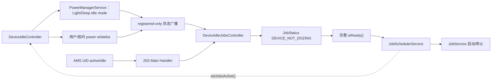
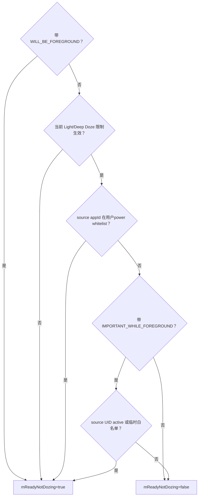
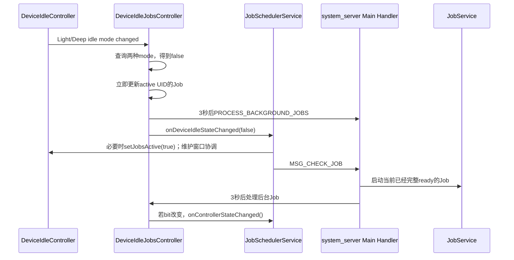
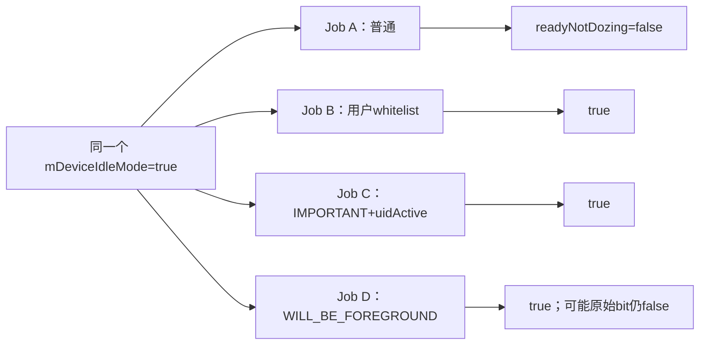
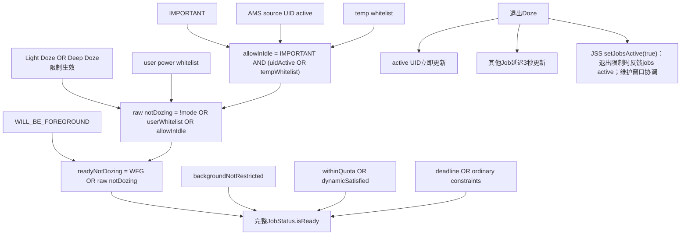

# 129 Android DeviceIdleJobsController：Doze、白名单与隐式约束

> 源码版本：Android 11 / API 30 / `android-11.0.0_r48`  
> 学习方式：macOS 只读源码，不要求编译、不要求连接设备  
> 前置章节：第 25、74、121、122、128 章

---

## 1. 本章接着拆第二种 “idle”

上一章研究：

```text
IdleController
→ CONSTRAINT_IDLE
→ 用户是否长时间没有交互
```

本章研究：

```text
DeviceIdleJobsController
→ CONSTRAINT_DEVICE_NOT_DOZING
→ Light/Deep Doze 当前是否允许这个 Job
```

它们甚至可能同时出现：设备长时间未用使显式 `IDLE=true`，随后 Doze 限制生效又使隐式 `DEVICE_NOT_DOZING=false`。于是 Job 的“等到用户不用设备”条件满足了，却仍被省电模式挡住。

本章最重要的结论：

> DeviceIdleJobsController 不回答“Job 是否要求 idle”，而是为所有 Job 维护一道“当前未被 Doze 阻挡”的隐式硬门。

---

## 2. 本章要回答什么

1. Light Doze 与 Deep Doze 怎样合成一个 JSS 状态？
2. 为什么 `DEVICE_NOT_DOZING` 不在 JobInfo 的显式约束里？
3. 用户 power whitelist 与 temporary whitelist 有什么区别？
4. `IMPORTANT_WHILE_FOREGROUND` 与 `WILL_BE_FOREGROUND` 为什么不是一个标志？
5. UID active 为什么不能简化成“Activity 可见”？
6. 进入 Doze 时，为什么正在运行的白名单 Job也可能先被停止？
7. 退出 Doze 后，为什么 active UID 立即恢复、后台 UID 延迟3秒？
8. JSS 为什么向 DeviceIdleController 反向报告 jobs active？
9. deadline 与 shell force 为什么不能直接绕过 Doze？
10. r48 用户白名单变化为何可能不立即重算现存 Job？

---

## 3. 源码地图

本章主文件：

```text
frameworks/base/apex/jobscheduler/service/java/com/android/server/job/controllers/DeviceIdleJobsController.java
frameworks/base/apex/jobscheduler/service/java/com/android/server/job/controllers/JobStatus.java
frameworks/base/apex/jobscheduler/service/java/com/android/server/job/JobSchedulerService.java
```

Doze 状态与白名单生产端：

```text
frameworks/base/apex/jobscheduler/service/java/com/android/server/DeviceIdleController.java
frameworks/base/apex/jobscheduler/framework/java/com/android/server/DeviceIdleInternal.java
frameworks/base/core/java/android/os/PowerManager.java
frameworks/base/services/core/java/com/android/server/power/PowerManagerService.java
```

UID active 与相邻后台限制链：

```text
frameworks/base/core/java/android/app/IUidObserver.aidl
frameworks/base/services/core/java/com/android/server/am/ActivityManagerService.java
frameworks/base/services/core/java/com/android/server/am/OomAdjuster.java
frameworks/base/services/core/java/com/android/server/AppStateTracker.java
frameworks/base/apex/jobscheduler/service/java/com/android/server/job/controllers/BackgroundJobsController.java
```

API、停止协议与测试：

```text
frameworks/base/apex/jobscheduler/framework/java/android/app/job/JobInfo.java
frameworks/base/apex/jobscheduler/framework/java/android/app/job/JobParameters.java
frameworks/base/apex/jobscheduler/service/java/com/android/server/job/JobServiceContext.java
cts/tests/JobScheduler/src/android/jobscheduler/cts/JobThrottlingTest.java
frameworks/base/services/tests/mockingservicestests/src/com/android/server/job/controllers/JobStatusTest.java
```

---

## 4. 一张总链图



全链主要在 system_server 内完成；最后启动或停止应用 JobService 才跨 Binder 进程边界。

---

## 5. 为什么这是“隐式约束”

`JobStatus` 定义：

```java
static final int CONSTRAINT_DEVICE_NOT_DOZING = 1 << 25;
```

应用没有对应的 Builder 方法去声明它。原因是 Doze 限制不是应用可选择是否遵守的业务条件，而是系统对所有 Job 的调度政策。

对比：

```text
setRequiresCharging / setRequiresDeviceIdle
  应用主动声明的 ordinary constraint

DEVICE_NOT_DOZING
  每个 Job 都要经过的 implicit readiness gate
```

所以 Controller 不只跟踪某个声明了特殊条件的子集，而要能够重算 JobStore 中全部 Job。

---

## 6. JobStatus 的真正 Doze ready 字段

Controller 先调用：

```java
setDeviceNotDozingConstraintSatisfied(state, whitelisted)
```

JobStatus 除了写原始 satisfied bit，还维护：

```java
mReadyNotDozing = state
        || (job.getFlags() & JobInfo.FLAG_WILL_BE_FOREGROUND) != 0;
```

因此至少要区分：

```text
原始 DEVICE_NOT_DOZING satisfied bit
mReadyNotDozing 最终隐式门
dozeWhitelisted 诊断字段
```

它们通常相关，但不总是同值。

---

## 7. 核心公式第一层：Controller 原始位

`updateTaskStateLocked()` 的核心是：

```java
final boolean allowInIdle =
        ((task.getFlags() & FLAG_IMPORTANT_WHILE_FOREGROUND) != 0)
        && (mForegroundUids.get(task.getSourceUid())
                || isTempWhitelistedLocked(task));

final boolean whitelisted = isWhitelistedLocked(task);
final boolean enableTask = !mDeviceIdleMode || whitelisted || allowInIdle;
```

翻译成公式：

```text
allowInIdle = IMPORTANT
              && (sourceUidActive || tempWhitelisted)

rawDeviceNotDozing = !doze
                     || userWhitelisted
                     || allowInIdle
```

---

## 8. 核心公式第二层：WILL_BE_FOREGROUND

JobStatus 再把隐藏标志并入：

```text
readyNotDozing = WILL_BE_FOREGROUND || rawDeviceNotDozing
```

合并后：

```text
readyNotDozing =
  WILL_BE_FOREGROUND
  || !doze
  || userWhitelisted
  || (IMPORTANT && (sourceUidActive || tempWhitelisted))
```

这是本章最值得反复手算的公式。

---

## 9. 决策树



图只回答 Doze 隐式门；即使走到 PASS，其他约束和 JSS 外层资格仍需满足。

---

## 10. 控制器启动时同步读取什么

构造函数取得：

```java
mPowerManager = context.getSystemService(PowerManager.class);
mLocalDeviceIdleController = LocalServices.getService(DeviceIdleInternal.class);
mDeviceIdleWhitelistAppIds =
        mLocalDeviceIdleController.getPowerSaveWhitelistUserAppIds();
mPowerSaveTempWhitelistAppIds =
        mLocalDeviceIdleController.getPowerSaveTempWhitelistAppIds();
```

两份 whitelist 是同步快照。`DeviceIdleInternal` 必须已经由 DeviceIdleController 的 `onStart()` 发布；SystemServer 的服务启动依赖保证本版本走到这里时可取得它。

---

## 11. 启动时没有同步查询 Doze

字段：

```java
private boolean mDeviceIdleMode;
```

Java 默认是 false，构造函数没有调用 `isDeviceIdleMode()` 初始化它。

r48 的启动时序里，JSS 创建时系统从 active 开始，之后依靠广播维护 Doze 变化。因此这里不是通用的“随时构造都同步读当前 Doze”模式，而是依赖 system_server 生命周期的初始化假设。

写源码笔记时要把这种启动约束记录下来，不能把默认 false 描述成一次硬件查询结果。

---

## 12. 四个广播各负责什么

Controller 注册：

```text
ACTION_DEVICE_IDLE_MODE_CHANGED
ACTION_LIGHT_DEVICE_IDLE_MODE_CHANGED
ACTION_POWER_SAVE_WHITELIST_CHANGED
ACTION_POWER_SAVE_TEMP_WHITELIST_CHANGED
```

其中：

- 前两条表示 Deep/Light Doze 限制状态变化；
- 第三条表示用户 power whitelist 改变；
- 第四条表示 temporary whitelist 改变。

这些是 registered-only 广播。Controller 只接收运行期通知，不依赖 Manifest receiver 拉起进程。

---

## 13. 为什么收到任一 idle 广播都重新查询两种状态

代码不是按 action 名直接写 true/false，而是：

```java
mPowerManager.isDeviceIdleMode()
        || mPowerManager.isLightDeviceIdleMode()
```

所以对 JobScheduler：

```text
Deep Doze 限制生效
OR Light Doze 限制生效
→ mDeviceIdleMode=true
```

重新查询当前值能处理 Deep/Light 状态交接中的中间广播，不必猜“收到哪条 action 就代表总状态是什么”。

---

## 14. 维护窗口为什么表现为退出 Doze

PowerManager 文档说明：设备可能仍处于长期 idle 周期，但在 maintenance window 中限制暂时解除，此时 `isDeviceIdleMode()` / `isLightDeviceIdleMode()` 返回 false。

因此从 JobScheduler 视角：

```text
进入维护窗口
→ mDeviceIdleMode=false
→ 允许一批 Job 恢复

窗口结束
→ 查询重新为true
→ 再次限制
```

它关心的是“限制当前是否生效”，而不是设备在宏观状态机里是否仍属于长期 idle 周期。

---

## 15. 普通用户 whitelist 究竟是哪一份

Controller 调用：

```java
getPowerSaveWhitelistUserAppIds()
```

DeviceIdleInternal 注释明确：这是用户加入的 whitelist 数组。它不是 DeviceIdleController 的 system+user 完整 `mPowerSaveWhitelistAllAppIdArray`。

判断方式：

```java
Arrays.binarySearch(mDeviceIdleWhitelistAppIds,
        UserHandle.getAppId(job.getSourceUid())) >= 0;
```

因此：

- 普通用户 whitelist 可让该 source app 的 Job 绕过 Doze 原始位；
- 不要求 Job 带 IMPORTANT；
- 当前控制器只使用 user whitelist，而非全部系统 allowlist。

---

## 16. 为什么 whitelist 用 appId，不用完整 UID

Android UID 可粗略理解为：

```text
uid = userId × PER_USER_RANGE + appId
```

控制器先从 sourceUid 提取 appId，再在数组中查找。这意味着同一 appId 跨用户共享这一白名单建模结果。

这是 DeviceIdleController 白名单数据结构本身的模型，不是 JobScheduler 临时忽略 userId 的偶然实现。

---

## 17. temporary whitelist 单独为何不够

临时白名单只出现在：

```text
IMPORTANT && (uidActive || tempWhitelisted)
```

所以：

```text
普通Job + temp whitelist
→ 不能仅靠这条白名单越过Doze

IMPORTANT Job + temp whitelist
→ allowInIdle=true
```

这是最常见的误解之一：temporary whitelist 不是给该应用所有 Job 的通用 Doze 通行证。

---

## 18. `IMPORTANT_WHILE_FOREGROUND` 是什么

应用 Builder 提供：

```java
setImportantWhileForeground(true)
```

它表示：这项短任务对应用处于前台或临时白名单时的体验很重要，系统可在这些条件下放松 Doze。

但标志本身不够：

```text
IMPORTANT=true
source UID inactive
temp whitelist=false
→ 仍被Doze阻挡
```

方法名里的 `whileForeground` 不能被忽略。

---

## 19. IMPORTANT 与时间约束的构建限制

`build()` 检查：

```java
if ((mFlags & FLAG_IMPORTANT_WHILE_FOREGROUND) != 0
        && mHasEarlyConstraint) {
    throw new IllegalArgumentException(...);
}
```

`mHasEarlyConstraint` 会被以下 API 置 true：

```text
setMinimumLatency(...)
setPeriodic(...)
```

因此 IMPORTANT 不能与 minimum latency 或 periodic 组合。

单独 `setOverrideDeadline()` 只置 `mHasLateConstraint`，不会触发这条 early 检查；当然 periodic 与 deadline 又有自己的独立冲突规则。

---

## 20. `WILL_BE_FOREGROUND` 是更强的隐藏标志

`FLAG_WILL_BE_FOREGROUND` 的注释表示 JobService 计划调用 `startForeground()`。这个 flag 和承载它的 `Builder.setFlags()` 路径都是隐藏能力；JSS 的 `validateJobFlags()` 看到该位后，会强制调用方持有签名级 `CONNECTIVITY_INTERNAL` 权限。因此它不是普通应用的日常策略。

关键差异：

```text
IMPORTANT
  还需 uidActive 或 temp whitelist

WILL_BE_FOREGROUND
  JobStatus 从构造时就令 mReadyNotDozing=true
```

但该标志本身不会替应用真正发布前台服务通知；JobService 仍要按承诺调用 `startForeground()`。

---

## 21. 两个 foreground 标志对照

| 维度 | IMPORTANT_WHILE_FOREGROUND | WILL_BE_FOREGROUND |
|---|---|---|
| 设置入口 | `setImportantWhileForeground()` | 隐藏内部 flag |
| 普通应用是否应依赖 | 可用，但应限必要短任务 | 否，系统/内部能力 |
| Doze 放行条件 | 标志 + UID active/temp whitelist | 标志本身令 `mReadyNotDozing=true` |
| 进入 Doze 时 running Job 是否直接保留 | 不保证 | 仅 Doze 专用停止循环会跳过；其他约束/限制仍可令它停止 |
| 是否自动变成前台服务 | 否 | 也否，仍需 `startForeground()` |
| 其他作用 | 加入 `mAllowInIdleJobs` 优化集合 | ConnectivityController 等也读取 |

名称里都出现 foreground，但权限、强度和执行语义不同。

---

## 22. UID active 不等于 Activity 可见

Controller 字段叫 `mForegroundUids`，输入却来自 AMS：

```text
IUidObserver.onUidActive()
IUidObserver.onUidIdle()
IUidObserver.onUidGone()
```

IUidObserver 对 idle 的说明是：

```text
UID 在后台达到足够时间
或
所有进程已经消失
```

所以这里更准确的说法是“AMS 尚未把该 UID 判为 idle”，不是“当前一定有可见 Activity”。

---

## 23. 为什么退到后台不会立刻 UID idle

OomAdjuster 在 UID 进入后台且不在临时白名单时，记录：

```text
lastBackgroundTime
```

再按：

```text
BACKGROUND_SETTLE_TIME
```

延迟调用 `idleUidsLocked()`。达到宽限时间后才设置 idle，并向观察者发送变化。

因此要分清：

```text
Activity不再可见
进程procState进入后台
AMS UID变idle
```

它们可能按顺序发生，但不是同一个瞬间或同一字段。

---

## 24. 临时白名单还会反过来影响 UID active

OomAdjuster 的 UID 判定把 `curWhitelist` 纳入考虑：在临时白名单时，后台 UID 可以不进入 idle；白名单状态变化还会触发 OOM adjustment 重算。

于是 IMPORTANT 的公式两边并非完全独立：

```text
uidActive || tempWhitelisted
```

临时白名单既可直接命中右边，也可能让 AMS 把 UID 重新报告为 active。无论哪条先到，控制器最终都在 JSS 锁下按当前两个缓存值重算。

---

## 25. UID 回调为什么先投递 Handler

JSS 注册 IUidObserver。Binder 回调里不直接修改 Controller：

```text
onUidActive → MSG_UID_ACTIVE
onUidIdle   → MSG_UID_IDLE
onUidGone   → MSG_UID_GONE
```

`JobHandler` 使用 system_server 主 Looper，处理消息时取得 JSS 全局锁，再调用：

```java
mDeviceIdleJobsController.setUidActiveLocked(uid, ...);
```

这样 Binder 入站线程只做轻量投递，Controller 状态与其他 JSS 主线程事件有明确串行点。

---

## 26. 两条 UID 状态链不是同一个原子回调

同一 AMS UID 变化还会进入 `AppStateTracker`，再影响下一章的 `BackgroundJobsController`：

```text
AMS IUidObserver
├─ JSS自己的observer → DeviceIdleJobsController
└─ AppStateTracker observer → BackgroundJobsController
```

二者最终都影响 JobStatus，但一个维护 `DEVICE_NOT_DOZING`，另一个维护 `BACKGROUND_NOT_RESTRICTED`。

它们不是由一个方法原子地同时改完，所以调试日志中可能短暂看到两个隐式字段先后收敛。

---

## 27. Controller 怎样跟踪所有 Job

`maybeStartTrackingJobLocked()` 对每个 Job 都调用：

```java
updateTaskStateLocked(jobStatus);
```

它没有 `TRACKING_DEVICE_IDLE` bit，也没有只保存某类 Job 的完整 tracked set。全量更新时直接遍历：

```text
mService.getJobStore().forEachJob(...)
```

只有带 IMPORTANT 的 Job 被额外加入 `mAllowInIdleJobs`，用于 temporary whitelist 变化时缩小扫描范围。

---

## 28. `mAllowInIdleJobs` 的名字也会误导

进入这个集合只说明：

```text
Job带 FLAG_IMPORTANT_WHILE_FOREGROUND
```

并不证明它此刻真的 allowed in Doze。仍要满足：

```text
sourceUidActive || tempWhitelisted
```

dump 中的 `ALLOWED_IN_DOZE` 也是按集合成员打印，所以更准确理解成“具备条件性放行资格的 IMPORTANT Job”。

---

## 29. temporary whitelist 变化为何只扫描该集合

收到 temp whitelist changed 后：

```text
刷新 appId 数组
遍历 mAllowInIdleJobs
updateTaskStateLocked()
若至少一个原始bit改变 → onControllerStateChanged()
```

普通 Job 的 Doze 公式根本不读取 temporary whitelist，扫描它们没有意义。这个 set 是明确的性能索引，而不是完整 Job 所有权容器。

---

## 30. UID active 变化时为何扫描该 sourceUid 的全部 Job

`setUidActiveLocked(uid, active)` 调用：

```text
forEachJobForSourceUid(uid, functor)
```

公式上只有 IMPORTANT Job会直接因 UID active 改变原始位；实现没有再维护“UID→IMPORTANT Job”的第二级索引，而是遍历该 sourceUid 的全部 Job并让 setter 去重。

若至少一个 bit 改变，再调用普通 controller state changed。

---

## 31. 为什么判断 sourceUid，不是 callingUid

JobScheduler 支持 system 组件通过 `scheduleAsPackage()` 代表其他包安排工作。JobStatus 因此有：

```text
callingUid：谁调用调度API
sourceUid：工作应归属于谁
```

Doze 的 UID active、用户/临时白名单都基于 `getSourceUid()`。否则 SyncManager 等代调任务会错误归到 system UID，轻易绕过来源应用限制。

---

## 32. 进入 Doze：先更新所有 Job

`updateIdleMode(true)` 在 JSS 锁下：

```text
移除尚未执行的 PROCESS_BACKGROUND_JOBS
遍历 JobStore 全部 Job
重算 DEVICE_NOT_DOZING
```

移除延迟消息很关键：若刚退出 Doze、后台恢复3秒尚未到期，又重新进入 Doze，旧恢复任务不能再把所有 Job误设为可运行。

锁释放后，若总模式确实变化，再调用：

```text
onDeviceIdleStateChanged(true)
```

---

## 33. 进入 Doze：JSS 直接停止哪些 running Job

JSS 专用回调遍历 active contexts：

```java
if (executing != null
        && (executing.getFlags() & FLAG_WILL_BE_FOREGROUND) == 0) {
    cancelExecutingJobLocked(REASON_DEVICE_IDLE, ...);
}
```

因此进入 Doze 的“切换瞬间”，该专用停止循环只跳过 WILL_BE_FOREGROUND running Job。这里的“跳过”只针对这一次 Doze 专用取消：它仍可能因为其他约束丢失、后台限制、任务完成或取消等原因停止，不能理解为系统保证它继续运行。

这条路径没有再检查：

- `dozeWhitelisted`；
- IMPORTANT + UID active/temp whitelist；
- 该 Job刚更新后的 `mReadyNotDozing`。

所以不能概括成“所有在白名单里、公式仍允许的 running Job 都不停”。

---

## 34. 一个反直觉场景：允许，却先被停止

假设 Job：

```text
带 IMPORTANT
source UID active
```

进入 Doze 后 Controller 算出：

```text
allowInIdle=true
rawDeviceNotDozing=true
```

但 JSS 的专用进入回调仍可能停止它，因为直接保留条件只看 WILL_BE_FOREGROUND。

之后它是否重新调度，要看 `onStopJob()` 返回、重排实例和后续调度检查。这里应记录为 r48 的切换行为，不能把“约束位满足”误读成“运行上下文绝不会被重启”。

---

## 35. 专用停止原因

进入 Doze 的停止使用：

```text
JobParameters.REASON_DEVICE_IDLE
```

它不同于一般 Controller bit 丢失时的：

```text
REASON_CONSTRAINTS_NOT_SATISFIED
REASON_RESTRICTED_BUCKET
```

普通 API 30 应用主要通过 `onStopJob()` 知道系统要求停止；读取具体 reason 的接口在这一版本仍是隐藏 API。

停止是 JobServiceContext 正常协议，不是直接杀应用进程。

---

## 36. 退出 Doze：active UID 立即更新

`updateIdleMode(false)` 先遍历 `mForegroundUids` 中值为 true 的 UID：

```text
forEachJobForSourceUid(uid, updateFunctor)
```

这些 Job立即得到 `DEVICE_NOT_DOZING=true`，避免用户已经在交互的应用还额外等待后台恢复节流。

注意这里的 active 是 AMS UID active，不只指可见 Activity。

---

## 37. 退出 Doze：其他 Job 延迟3秒

常量：

```java
private static final long BACKGROUND_JOBS_DELAY = 3000;
```

Controller 向主 Handler 发送：

```text
PROCESS_BACKGROUND_JOBS after 3s
```

到期后重新遍历全部 Job。active UID 已经更新过，setter 会对它们去重；其余后台 Job此时才得到退出 Doze 的新状态。

这3秒是“恢复后台 Job 的延迟”，不是 Doze 进入延迟、持续时间或 Job 必然开始运行的时间。

---

## 38. 3秒到了为什么仍不保证运行

延迟 handler 只做：

```text
重算全量 raw DEVICE_NOT_DOZING
若有改变 → onControllerStateChanged()
```

随后 JSS 还要检查其他约束、应用后台限制、quota/dynamic、用户/组件、批处理和并发槽。

所以准确说法是：

```text
后台Job在约3秒后获得重新参与ready评估的机会
```

不是“退出 Doze 3秒后所有 Job 必然启动”。

---

## 39. 退出 Doze 时为什么先 `setJobsActive(true)`

JSS 的专用回调在系统 ready 后：

```text
若 mReportedActive=false：
  先改为true
  DeviceIdleInternal.setJobsActive(true)
post MSG_CHECK_JOB
```

这是“退出 idle 限制时先报告可能有工作”的握手，尤其用于保护 maintenance window：避免窗口在 Job尚未来得及完成重算、入 pending 或开始运行前就提前结束。但同一 `onDeviceIdleStateChanged(false)` 路径也会在设备真正唤醒、彻底退出 Doze 时执行，不能把每一次 false 都判成维护窗口开始。

之后 `reportActiveLocked()` 会按 pending/running Job重新算真实 active；若实际没有工作，再回报 false。

---

## 40. `mReportedActive` 的精确含义

JSS 报 active 的条件是：

```text
pending queue 非空
或
存在非 WILL_BE_FOREGROUND、非 doze-whitelisted、非 uidActive 例外的 running Job
```

这里的 `job.uidActive` 由 `BackgroundJobsController` 根据 `AppStateTracker` 投影到 `JobStatus`，并不是 DeviceIdleJobsController 私有 `mForegroundUids` 的直接读取；`reportActiveLocked()` 也没有在这段公式里重新判断 IMPORTANT 或 temporary whitelist。不同状态即使最终相关，也必须按实际字段来源区分。

因此它不是严格等价于“至少一个 Job正在执行”。退出 Doze 限制的回调还会先临时置 true，作为 jobs-active 协调信号；maintenance window 是这一机制最关键的使用场景，但不是 false 回调的唯一来源。

DeviceIdleController 收到 false 时会尝试 `exitMaintenanceEarlyIfNeededLocked()`，所以这一反馈直接参与维护窗口长度控制。

---

## 41. 退出 Doze 的时序图



图中的两条 Handler 消息都在 system_server 主 Looper，但用途不同：一条重评当前 ready，一条延迟开放后台 Job。

---

## 42. 用户 whitelist 改变的 r48 实现细节

收到普通 `ACTION_POWER_SAVE_WHITELIST_CHANGED` 后，r48 代码只做：

```text
刷新 mDeviceIdleWhitelistAppIds 数组
```

该分支没有立即：

- 遍历现有 Job；
- 更新原始 `DEVICE_NOT_DOZING` bit；
- 调用 JSS 状态回调。

因此现存 Job不会仅在这条 receiver 路径中马上收敛；新 Job开始跟踪、下次 idle mode变化、相关 UID变化等路径会使用刷新后的数组重新计算。

这是 Android 11 r48 当前实现边界，不应泛化为所有版本的 API 时效保证。

---

## 43. temporary whitelist 分支为何反而即时重算

它刷新数组后立即遍历 `mAllowInIdleJobs`，因为 temp whitelist 正是 IMPORTANT Job公式的一项实时输入。

对照可见：

```text
用户whitelist changed
  r48只刷新缓存，不立即重算现存Job

temp whitelist changed
  刷新缓存 + 重算IMPORTANT集合 + 必要时通知JSS
```

看起来相似的两条广播，在当前源码里有不同收敛时机。

---

## 44. deadline 为什么不能越过 Doze

JobStatus 的顺序是：

```java
return mReadyNotDozing
        && mReadyNotRestrictedInBg
        && (mReadyDeadlineSatisfied
                || isConstraintsSatisfied(...));
```

deadline 只替代括号内的 ordinary constraints，不能把前面的 `mReadyNotDozing` 改成 true。

所以：

```text
一次性deadline到期
≠ Doze中无条件运行
```

它同样不能越过 background-not-restricted 和更前面的 quota/dynamic/NEVER 门。

---

## 45. shell `run -f` 为什么也不直接越过 Doze

`OVERRIDE_FULL` 让：

```text
isConstraintsSatisfied() = true
```

但完整 `isReady()` 仍在外层检查：

```text
mReadyNotDozing
mReadyNotRestrictedInBg
withinQuota || dynamicSatisfied
NEVER bucket
```

因此不能把 `cmd jobscheduler run -f` 描述成对所有隐式系统门的万能强制执行。

本课程不要求实际连接设备执行 shell；这一节的目的只是防止日后验证时读错工具语义。

---

## 46. RESTRICTED bucket 与 Doze 是串联门

DeviceIdleJobsController 不是 `RestrictingController`，也不向 `mDynamicConstraints` 添加条件。

完整关系是：

```text
(withinQuota || restricted动态约束全满足)
AND readyNotDozing
AND readyNotRestrictedInBg
AND (deadline || ordinary constraints)
```

所以即使 RESTRICTED Job通过 charging/battery/idle/connectivity 动态通道，仍可能被 Doze 挡住；反过来，退出 Doze 也不会替它补足动态约束。

---

## 47. BackgroundJobsController 是另一道隐式门

下一章的 Controller 维护：

```text
CONSTRAINT_BACKGROUND_NOT_RESTRICTED
```

temporary whitelist 会同时影响 AppStateTracker 的后台限制政策，但那是一条独立链。

因此：

```text
backgroundNotRestricted=true
≠ readyNotDozing=true

readyNotDozing=true
≠ backgroundNotRestricted=true
```

JobStatus 用 AND 串起两者，任何一项 false 都会阻止普通 ready。

---

## 48. Receiver、Handler 与锁

Controller 注册广播时 scheduler 传 null。`ContextImpl` 会使用 system_server 的 ActivityThread 主 Handler。

3秒延迟 Handler 显式构造在：

```text
mContext.getMainLooper()
```

UID observer 的 Binder 回调也先投递到 JSS 主 Handler。因此常规状态变化最终集中到 system_server 主 Looper。

JobStore 遍历和 JobStatus 更新仍在 JSS 共享 `mLock` 下完成，不能只因“都在主线程”就忽略 Controller 的锁契约。

---

## 49. `updateIdleMode()` 为什么锁外调用专用 listener

函数在锁内完成：

```text
mDeviceIdleMode更新
JobStatus批量更新
延迟消息安排/取消
```

退出 synchronized 后才：

```text
onDeviceIdleStateChanged(enabled)
```

JSS 回调自身再取得同一把锁。这样避免 Controller 持锁跨入一段较长的专用 JSS 逻辑，也使锁边界更清楚。

temp whitelist 与 UID active 的普通状态回调则可能在调用点仍持 JSS 可重入锁；回调本身只 post Handler 消息，不同步扫描应用。

---

## 50. Doze 广播生产端怎样发送

DeviceIdleController 状态机先通过 Local PowerManager 更新 deep/light idle mode。状态确实变化后，发送预构造的：

```text
ACTION_DEVICE_IDLE_MODE_CHANGED
ACTION_LIGHT_DEVICE_IDLE_MODE_CHANGED
```

flags 包括：

```text
FLAG_RECEIVER_REGISTERED_ONLY
FLAG_RECEIVER_FOREGROUND
```

白名单改变时也发送 registered-only 的 user/temp whitelist action。

这条链是“广播通知 + PowerManager 查询真值”，不是 Controller 直接注册一个 DeviceIdleInternal 状态 listener。

---

## 51. DeviceIdleInternal 在本章承担什么

LocalService 用于三件事：

1. 构造与广播后读取用户 whitelist 数组；
2. 读取 temporary whitelist 数组；
3. JSS 通过 `setJobsActive(boolean)` 反向反馈维护工作状态。

Doze mode 本身的变化通知仍来自广播。不要写成“DeviceIdleInternal 主动回调 DeviceIdleJobsController”。

---

## 52. dump 中的 RUNNABLE/WAITING 只是原始位

Controller dump 用：

```java
(jobStatus.satisfiedConstraints
        & CONSTRAINT_DEVICE_NOT_DOZING) != 0
```

打印 `RUNNABLE` 或 `WAITING`。

但 WILL_BE_FOREGROUND 是在 `mReadyNotDozing` 中额外放行，不一定把原始 satisfied bit 置 true。因此可能出现：

```text
controller dump：WAITING
JobStatus mReadyNotDozing：true
```

也就是说，这里的 `RUNNABLE` 不是完整 Job ready 结论，`WAITING` 也可能遗漏隐藏 foreground 例外。

---

## 53. dump 的两个附加标签也要谨慎读

```text
WHITELISTED
  JobStatus.dozeWhitelisted=true，即用户whitelist判断

ALLOWED_IN_DOZE
  Job在mAllowInIdleJobs集合，即带IMPORTANT标志
```

尤其第二个标签不能单独证明当前 allowed：还需 UID active 或 temp whitelist。

因此诊断至少联合查看：

```text
Idle mode
原始 constraint bit
mReadyNotDozing
source UID active
白名单
Job flags
完整 ready/外层资格
```

---

## 54. CTS 怎样证明 IMPORTANT + temp whitelist

`JobThrottlingTest.testAllowWhileIdleJobInTempwhitelist()`：

```text
进入Doze
调度allow-while-idle测试Job
未temp whitelist：不能启动
加入temp whitelist：可以启动
```

它直接证明“IMPORTANT 标志本身不够，临时白名单能完成组合条件”。测试 App 的 receiver 负责把对应参数映射成 JobInfo flag。

---

## 55. CTS 怎样证明前台立即、后台延迟

两个测试：

```text
testForegroundJobsStartImmediately()
  source app保持active，退出Doze后3秒内应启动

testBackgroundJobsDelayed()
  后台Job退出Doze后先不能立即启动
  到约3秒恢复点后才有机会启动
```

测试还先证明进入 Doze 会停止原本运行的普通 Job。

测试时间容差用于自动化验证，不应反过来解释成所有真实设备的启动完成 SLA。

---

## 56. JobStatusTest 证明 implicit gate 不能被 ordinary constraint 替代

`wouldBeReadyWithConstraint(CONSTRAINT_DEVICE_NOT_DOZING)` 的测试会把某个隐式条件临时假定为 true，再看完整 ready。

结果强调：授予 not-dozing 也不等于 ready，其他隐式条件仍需满足；反过来，deadline 满足也不能替代 not-dozing。

源码阅读中，`wouldBeReadyWithConstraint()` 是判断某个 Controller 状态变化“是否可能有调度价值”的分析工具，不是修改真实持久状态的公开 API。

---

## 57. 多个 Job 怎样共享 Doze 状态，却得到不同结果



设备模式是共享事实；source identity、白名单、UID active 和 flags 让每个 Job 的结果不同。

---

## 58. replacement 与停止跟踪

新 Job开始跟踪时立即按当前模式、sourceUid、白名单和 flags 重算。旧 IMPORTANT Job停止跟踪时从 `mAllowInIdleJobs` 移除。

没有需要迁移的 per-Job Doze timer。UID active、whitelist 和 mode 都是 Controller 缓存的共享事实；replacement Job重新计算即可。

---

## 59. 常见误解一：requiresDeviceIdle 允许在 Doze 中运行

错误。它只要求 `CONSTRAINT_IDLE`，而 Doze 还要求独立的 `mReadyNotDozing`。

甚至最典型的 idle Job恰恰会在长时间不用设备时碰上 Doze，所以两章必须一起读。

---

## 60. 常见误解二：temporary whitelist 放行全部 Job

错误。就本 Controller 的 Doze 公式而言，它只与 IMPORTANT 标志组合生效。

temporary whitelist 对后台限制、AMS UID active 还有其他影响，但不能据此删掉本章公式中的 IMPORTANT 前提。

---

## 61. 常见误解三：foreground UID 就是可见 Activity

错误。这里缓存的是 AMS active/idle 事件；后台 UID还会经历 settle time，临时白名单也会影响 active 判断。

变量 `mForegroundUids` 是历史命名，理解时应以事件协议为准。

---

## 62. 常见误解四：进入 Doze 后 whitelist running Job一定不停

错误。r48 JSS 的专用停止循环只排除 WILL_BE_FOREGROUND。用户 whitelist 或 IMPORTANT 可能让新 ready 公式通过，却不在该切换瞬间的直接保留条件中。

---

## 63. 常见误解五：退出 Doze 所有 Job同时恢复

错误。active source UID立即更新，其他 Job通过主 Handler 延迟3秒更新。即便 bit恢复，也还需完整调度裁决。

---

## 64. 常见误解六：deadline 或 `run -f` 可越过 Doze

错误。它们作用于 ordinary constraint 比较，而 `mReadyNotDozing` 位于外层隐式 AND 门。

---

## 65. 常见误解七：普通 whitelist action 会即时重算全部 Job

至少在 r48 不成立。receiver 分支只刷新 user whitelist 缓存；现存 Job在其他重算入口才应用新值。

---

## 66. 常见误解八：dump 的 ALLOWED_IN_DOZE 就是最终放行

错误。它只表明 Job在 IMPORTANT 集合。还要看 UID active/temp whitelist、WILL_BE_FOREGROUND、其他隐式门和完整 ready。

---

## 67. macOS 只读练习一：重写完整公式

```bash
sed -n '130,210p' \
  frameworks/base/apex/jobscheduler/service/java/com/android/server/job/controllers/DeviceIdleJobsController.java

rg -n "setDeviceNotDozingConstraintSatisfied|mReadyNotDozing|isReady\\(" \
  frameworks/base/apex/jobscheduler/service/java/com/android/server/job/controllers/JobStatus.java
```

先写 Controller 原始公式，再补 WILL_BE_FOREGROUND，最后放回完整 `isReady()`。不要一步跳到口头结论。

---

## 68. macOS 只读练习二：比较两类 whitelist

```bash
rg -n "getPowerSaveWhitelistUserAppIds|getPowerSaveTempWhitelistAppIds|isWhitelistedLocked|isTempWhitelistedLocked" \
  frameworks/base/apex/jobscheduler
```

回答：

1. 哪个数组用 binary search？
2. 两者为什么都按 source appId？
3. temp whitelist 变化时扫描哪个集合？
4. user whitelist 变化时 r48 少了哪一步？

---

## 69. macOS 只读练习三：追进入 Doze 的停止

```bash
rg -n "onDeviceIdleStateChanged|REASON_DEVICE_IDLE|FLAG_WILL_BE_FOREGROUND" \
  frameworks/base/apex/jobscheduler
```

画两条并行线：

```text
Controller更新JobStatus
JSS停止running contexts
```

再解释为何 IMPORTANT/whitelist 可能让第一条为 true，却不阻止第二条先 stop。

---

## 70. macOS 只读练习四：追退出 Doze 的3秒差

```bash
rg -n "BACKGROUND_JOBS_DELAY|PROCESS_BACKGROUND_JOBS|mForegroundUids|setJobsActive" \
  frameworks/base/apex/jobscheduler/service/java/com/android/server/job \
  frameworks/base/apex/jobscheduler/service/java/com/android/server/DeviceIdleController.java
```

回答：

- active UID 的 Job在哪里立即更新？
- background 消息在哪个 Looper？
- 3秒内重新进入 Doze，旧消息怎样处理？
- 为什么 JSS 先报告 jobs active？

---

## 71. macOS 只读练习五：证明 UID active 不是可见性

```bash
rg -n "onUidActive|onUidIdle|BACKGROUND_SETTLE_TIME|idleUidsLocked|curWhitelist" \
  frameworks/base/core/java/android/app/IUidObserver.aidl \
  frameworks/base/services/core/java/com/android/server/am/OomAdjuster.java \
  frameworks/base/apex/jobscheduler/service/java/com/android/server/job/JobSchedulerService.java
```

把 `Activity不可见 → procState后台 → settle → UID idle` 写成时间线，并标出 temp whitelist 可能改变路径的位置。

---

## 72. 阅读检查题

1. `CONSTRAINT_IDLE` 与 `CONSTRAINT_DEVICE_NOT_DOZING` 分别是谁维护的？
2. 为什么后者是所有 Job的隐式门？
3. Light 与 Deep Doze 怎样合成 `mDeviceIdleMode`？
4. maintenance window 为什么看起来像退出 Doze？
5. Controller 原始 `enableTask` 公式是什么？
6. WILL_BE_FOREGROUND 怎样改变最终 `mReadyNotDozing`？
7. 用户 whitelist 与 temporary whitelist 的作用有何不同？
8. 为什么当前 Controller 只读取用户 whitelist，而不是 system+user 全部名单？
9. sourceUid 与 callingUid 为什么必须分开？
10. IMPORTANT 为什么不能与 minimum latency/periodic 组合？
11. UID active 为何不等于 Activity 可见？
12. temp whitelist 怎样同时直接和间接影响公式？
13. 为什么进入 Doze 要取消后台恢复消息？
14. r48 进入 Doze 的 direct-stop 只排除哪个 flag？
15. active 与后台 UID退出 Doze 的恢复时机差多少？
16. `setJobsActive(true)` 在维护窗口中解决什么竞态？
17. user whitelist changed 分支为何有延迟收敛边界？
18. deadline 与 force-run 为什么不能越过 Doze？
19. dump 的 WAITING 和 ALLOWED_IN_DOZE 分别可能怎样误导？
20. BackgroundJobsController 与本 Controller 的隐式门怎样串联？

---

## 73. 一页复习图



---

## 74. 本章结论

DeviceIdleJobsController 可以压缩为十点：

1. 它维护所有 Job的 `DEVICE_NOT_DOZING` 隐式约束，不是 `requiresDeviceIdle`；
2. Light/Deep Doze 用 OR 合成一个“限制正在生效”的 Controller 状态，维护窗口内查询为 false；
3. 原始位由非 Doze、用户 whitelist 或 `IMPORTANT && (UID active || temp whitelist)` 三路放行；
4. 隐藏的 WILL_BE_FOREGROUND 又在 JobStatus 内直接令最终 not-dozing 门为 true；
5. 所有身份判断使用 sourceUid，白名单再取 appId；
6. UID active 是 AMS active/idle 生命周期，不是可见 Activity 的别名；
7. 进入 Doze 会更新全部 Job，并由 JSS 直接停止除 WILL_BE_FOREGROUND 外的 running Job；
8. 退出 Doze 限制时 active UID立即更新，其他 Job延迟3秒，并反馈 `setJobsActive()`；它尤其用于协调维护窗口，同一路径也可来自真正唤醒；
9. deadline、shell full override、RESTRICTED 动态约束都不能代替 `mReadyNotDozing`；
10. r48 user whitelist receiver 只刷新缓存、Controller/Doze dump标签等局部行为都要按源码边界解释。

最值得带走的一句话：

> Doze 能否放行一个 Job，不只看设备模式，还要把 source identity、两类白名单、AMS UID active 与两个 foreground flag 代入精确公式。

---

## 75. 复读后的易混点修订

初稿完成后，对照 Controller、JobStatus、JSS、DeviceIdleController、PowerManager、OomAdjuster、AppStateTracker 和 CTS 反向复读，重点修订：

1. 将 IdleController 与 DeviceIdleJobsController 拆成显式 IDLE 和隐式 NOT_DOZING 两条独立链；
2. 先写 Controller 原始 bit，再补 JobStatus 的 WILL_BE_FOREGROUND，避免少算隐藏放行；
3. 限定普通名单为 `getPowerSaveWhitelistUserAppIds()`，不误写成 system+user 全部 whitelist；
4. 明确 temporary whitelist 只能直接放行 IMPORTANT Job，不是所有 Job通行证；
5. 以 AMS IUidObserver 的 active/idle 协议解释 `mForegroundUids`，不等同 Activity 可见；
6. 补出后台 settle time 与 temp whitelist 对 UID active 的间接影响；
7. 分开进入 Doze 的“更新约束位”与 JSS“直接停止 running context”，记录只有 WILL_BE_FOREGROUND 被后者排除；
8. 把退出 Doze 的3秒限定为后台位恢复延迟，不写成启动保证；
9. 解释 `setJobsActive(true)` 是退出限制时的 jobs-active 握手、尤其保护 maintenance window，但不把每次退出限制都误判成维护窗口，并精确定义 `mReportedActive`；
10. 将 deadline、force、restricted dynamic 放回完整 AND 公式，排除万能 override 误解；
11. 记录 r48 user whitelist change 只刷新缓存而不即时重算的实现边界；
12. 说明 dump 的 RUNNABLE/WAITING 看原始 bit，ALLOWED_IN_DOZE 看集合成员，都不是最终 ready 结论；
13. 区分广播是状态通知、LocalService 是快照读取与反馈通道，避免误画直接 callback。
14. 核对隐藏 flag 的权限门：`FLAG_WILL_BE_FOREGROUND` 由 JSS 强制要求 `CONNECTIVITY_INTERNAL`，并只在 Doze 专用停止循环中被跳过，不是运行保证；
15. 追清 `mReportedActive` 的 `job.uidActive` 来自 BackgroundJobsController/AppStateTracker，且该段代码不会直接重算 IMPORTANT/temp-whitelist 公式。

下一章进入 `BackgroundJobsController`：研究 AppStateTracker 怎样把 UID active、AppOps `RUN_ANY_IN_BACKGROUND`、battery saver、forced app standby 与白名单组合成另一道 `BACKGROUND_NOT_RESTRICTED` 隐式门。
