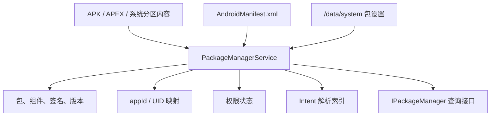
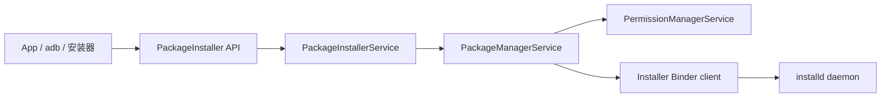
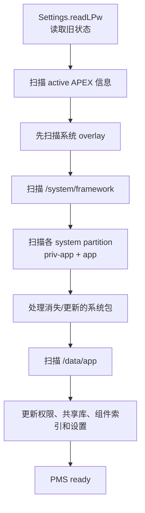
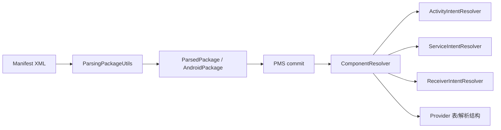
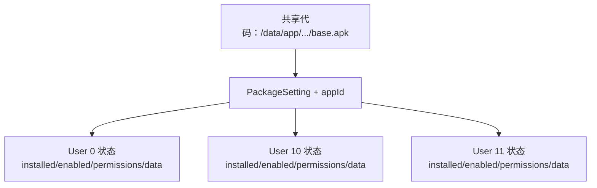
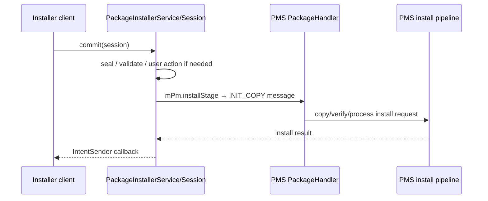
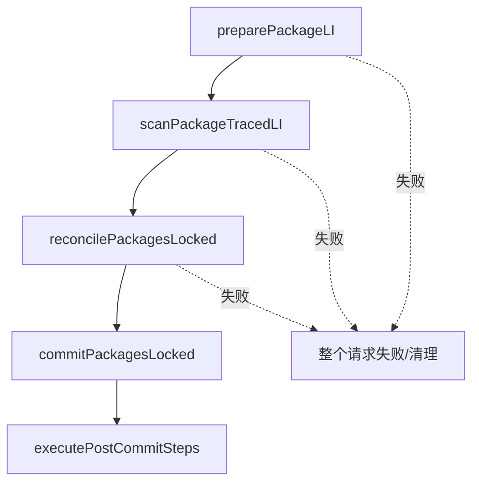

# 13 PackageManagerService：包扫描、安装、解析与查询

## 本章边界

前面几章已经解释了系统如何启动、Activity 如何启动以及画面如何显示。但还有一个更早的问题：

> 系统为什么知道某个 APK 里有哪些 Activity？它怎样判断签名、权限、版本、UID，又怎样找到可以处理某个 Intent 的组件？

这些信息主要由 PackageManagerService（后文简称 PMS）建立和维护。

本章追踪 Android 11 / `android-11.0.0_r48` 的两条主线：

```text
开机扫描：已有 APK 怎样进入系统包数据库
用户安装：一个新 APK 怎样通过 PackageInstaller Session 安装
```

然后补上 Manifest 解析、签名、UID、权限、Intent 查询、持久化和多用户模型。

## 本章目标

读完后，你应该能够：

1. 解释 PMS、PackageInstallerService、installd、PermissionManagerService 的职责。
2. 区分“解析 parse”“扫描 scan”“协调 reconcile”“提交 commit”“安装 install”。
3. 说清开机时 system、vendor、product、system_ext、APEX 与 `/data/app` 的扫描顺序和意义。
4. 解释 `AndroidManifest.xml` 怎样变成 PMS 内存中的包和组件信息。
5. 区分 `AndroidPackage`、`ParsedPackage`、`PackageSetting`、`ApplicationInfo`、`PackageInfo`。
6. 解释 packageName、appId、uid、userId 的关系。
7. 从 PackageInstaller Session 追到 PMS 的 prepare/scan/reconcile/commit。
8. 解释首次安装与覆盖更新为什么要检查签名和版本。
9. 从 `resolveIntent()` 追到组件解析结果。
10. 知道包信息写在哪里，以及重启后如何恢复。

---

## 1. PMS 不是“APK 文件管理器”

PMS 运行在 `system_server`，它维护 Android 对“已知软件包”的系统级认知。



PMS 的工作包括但不限于：

- 发现和解析软件包。
- 验证签名、版本和安装约束。
- 分配或恢复 appId。
- 建立 Activity、Service、Receiver、Provider 的查询索引。
- 保存包设置与每用户安装状态。
- 为 AMS/ATMS、Launcher、Settings、App 提供包查询。
- 协调代码落盘、应用数据目录、dex 优化、权限和安装广播。

它并不负责运行 Activity；ATMS/AMS 运行组件。它也不直接执行所有文件系统操作；许多特权文件操作通过 `installd` 完成。

---

## 2. 先分清六个参与者

| 对象/服务 | 位置 | 主要职责 |
|---|---|---|
| `PackageManager` | App Framework API | App 使用的抽象 API |
| `ApplicationPackageManager` | App 进程 | `PackageManager` 的常用客户端实现，调用 `IPackageManager` |
| `PackageManagerService` | `system_server` | 包数据库、扫描、校验、查询与安装核心 |
| `PackageInstallerService` | `system_server` | 管理安装 Session、写入阶段目录、提交和安装 UI/调用方协议 |
| `PermissionManagerService` | `system_server` | 权限定义、授予、撤销和持久化协作 |
| `installd` | 独立 native daemon | 以高权限创建数据目录、dexopt、清理等文件系统操作 |



### 最容易犯的错误

- PackageInstaller 不是 PMS 的新名字。
- `pm install` 不是把 APK 简单 `cp` 到 `/data/app`。
- PMS 不等于 `PackageParser`；parser 只负责把包文件解析成结构化结果。
- `installd` 不是安装流程的总决策者，它执行 PMS 请求的底层操作。

---

## 3. 五个动词必须分开

| 阶段 | 核心问题 | 是否一定改全局状态 |
|---|---|---|
| parse | APK/Manifest 里声明了什么？ | 否 |
| scan | 这个包放进当前系统环境后会形成什么包状态？ | 不一定，先生成 ScanResult |
| reconcile | 新结果与旧包、签名、共享库、权限等是否一致？ | 否，主要校验与协调 |
| commit | 把经过校验的结果正式写入 PMS 内存状态 | 是 |
| persist/post-commit | 写设置、建数据、dexopt、广播等 | 会产生外部效果 |

Android 11 安装主干在源码中很清楚：

```text
preparePackageLI
 → scanPackageTracedLI
 → reconcilePackagesLocked
 → commitPackagesLocked
 → executePostCommitSteps
```

为什么要拆开？因为安装失败不能把全局包数据库改到一半。多包原子安装更需要“先全部准备和验证，再统一进入 commit”。这里的“原子”是安装请求的目标语义；不要推导成所有磁盘写入、dexopt 和广播都在同一把数据库事务锁中瞬间完成。

---

## 4. PMS 在哪里启动

源码入口：

```text
frameworks/base/services/java/com/android/server/SystemServer.java
frameworks/base/services/core/java/com/android/server/pm/PackageManagerService.java
```

SystemServer 在 bootstrap services 阶段准备 `Installer`，随后调用 PMS `main()`。

Android 11 的入口签名：

```java
public static PackageManagerService main(
        Context context,
        Installer installer,
        boolean factoryTest,
        boolean onlyCore)
```

`main()` 创建 Injector、Settings、ComponentResolver、PermissionManager、UserManager 等依赖，然后：

```java
PackageManagerService m =
        new PackageManagerService(
                injector, onlyCore, factoryTest);
```

大量开机扫描发生在构造函数内。这会让构造函数显得异常庞大，也是阅读 PMS 的第一道门槛。

### onlyCore 是什么

在加密、特殊启动或系统尚不能使用完整 data 环境时，系统可能只加载核心包。正常完整启动不要把它理解成“PMS 永远只扫系统应用”。

---

## 5. PMS 启动先创建子系统

构造初期建立：

```text
PackageManagerInternal
UserManagerService
ComponentResolver
PermissionManagerService
Settings
PackageDexOptimizer / DexManager / ArtManagerService
AppsFilter
ApexManager
PackageHandler thread
```

其中有两把常见锁：

```text
mLock        ：保护 PMS 主要内存状态
mInstallLock ：串行化需要较长时间、文件系统或 installd 的安装操作
```

不要机械认为“所有 PMS 方法都必须同时持有两把锁”。看每个函数上的 `@GuardedBy`，同时注意锁顺序。长耗时 I/O 尽量不能在不合适的全局锁内执行，否则会阻塞大量包查询。

PMS 还创建后台 `PackageHandler`。安装请求通过消息进入后台处理，而不是让 Binder 调用线程从头阻塞到安装结束。

---

## 6. Settings：先读旧账，再扫描磁盘

源码：

```text
frameworks/base/services/core/java/com/android/server/pm/Settings.java
```

构造时定义关键文件：

```java
mSystemDir = new File(dataDir, "system");
mSettingsFilename =
        new File(mSystemDir, "packages.xml");
mBackupSettingsFilename =
        new File(mSystemDir, "packages-backup.xml");
mPackageListFilename =
        new File(mSystemDir, "packages.list");
```

对应通常是：

```text
/data/system/packages.xml
/data/system/packages-backup.xml
/data/system/packages.list
```

PMS 启动时调用：

```java
mFirstBoot = !mSettings.readLPw(...);
```

### 为什么不能只重新扫 APK

APK 本身不能完整表达系统运行期间形成的状态，例如：

- 系统为包分配的 appId。
- 安装来源与更新时间。
- 某系统 App 是否被 data 分区更新版本覆盖。
- sharedUser、签名历史和 keyset 信息。
- 每用户 installed/enabled/stopped/hidden 等状态。
- 部分权限与域验证状态（具体分散在不同持久化文件）。

因此开机是：

```text
读取上次保存的身份与状态
 + 扫描本次启动实际存在的代码
 + 对比、纠正并提交新状态
```

### packages.xml 和 packages.list 不一样

| 文件 | 主要用途 |
|---|---|
| `packages.xml` | PMS 的详细包设置数据库，XML 格式，包含包路径、appId、版本、签名关联等 |
| `packages.list` | 面向其他低层组件的紧凑包列表，包含包名、uid、数据目录等必要信息 |
| `packages-backup.xml` | 写入设置失败时的恢复备份 |

不要把 `packages.list` 当作全部包数据库。

---

## 7. 开机扫描哪些目录

Android 11 已经不是只扫 `/system/app` 和 `/data/app`。

系统侧扫描分区由 `ScanPartition` 组织，典型包括：

```text
/system/app
/system/priv-app
/vendor/app
/vendor/priv-app（设备布局允许时）
/product/app
/product/priv-app
/system_ext/app
/system_ext/priv-app
/odm/app
/oem/app
APEX 中暴露的包
```

此外：

```text
/system/framework 里的 framework-res 等框架包
/data/app 用户安装与系统 App 更新版本
```

实际目录来自 `Environment`、分区配置和 APEX 信息，不要把上表当成每台设备都必须存在的硬编码清单。

### 大致扫描顺序



overlay 先扫与资源覆盖的安全性、版本和优先级有关；framework 包必须存在，否则 PMS 会抛出 `Failed to load frameworks package`。

---

## 8. 系统 App 与 data 更新版

系统 App 原始 APK 位于只读系统分区。用户通过 OTA/应用商店更新某些系统 App 后，新版本通常位于 `/data/app`。

这时系统同时面对：

```text
只读分区中的原始系统版本
/data/app 中的更新版本
```

PMS 需要保留“它本质上是系统 App”的身份，又让 data 版本的代码优先生效；卸载更新后还要能回退到系统版本。

因此 Settings 中存在 disabled system package 等概念。这里的 disabled 不是简单的“用户把 App 禁用”，而可能表示原系统包被更新版替代后保存的原始设置。

这是 PMS 源码中 `mPackages`、`mDisabledSysPackages`、`isUpdatedSystemApp` 容易绕晕的原因。

---

## 9. scanDirLI：目录扫描不是串行 parse

源码：

```text
PackageManagerService.scanDirTracedLI()
PackageManagerService.scanDirLI()
ParallelPackageParser
```

`scanDirLI()` 先过滤可能的 APK 或包目录：

```java
final boolean isPackage =
        (isApkFile(file) || file.isDirectory())
        && !PackageInstallerService
                .isStageName(file.getName());
```

然后提交并行解析：

```java
parallelPackageParser.submit(file, parseFlags);
```

再逐个取得结果：

```java
ParallelPackageParser.ParseResult parseResult =
        parallelPackageParser.take();
```

成功后调用 `addForInitLI()` 进入开机扫描后续处理。

### 并行的边界

并行的是相对独立、CPU 较重的包解析。把结果写入共享 PMS 状态、分配身份和解决冲突不能毫无约束地并发执行。

正确理解：

> 并行 parse 提高开机扫描速度；后续 scan/reconcile/commit 仍需按共享状态和锁规则处理。

---

## 10. APK 不是一个普通 Java JAR

一个现代 APK 可能包含：

```text
AndroidManifest.xml
classes.dex / classes2.dex ...
resources.arsc
res/
assets/
lib/<abi>/*.so
META-INF 或 APK Signing Block 相关签名数据
```

安装包也可能是 split 结构：

```text
base.apk
split_config.arm64_v8a.apk
split_config.xxhdpi.apk
split_feature_x.apk
```

PMS 处理的是一个逻辑 package，代码路径下可以有 base 与多个 split。不能把“一个包”等同于“永远只有一个 apk 文件”。

---

## 11. PackageParser2 与 ParsingPackageUtils

Android 11 处于包解析模型演进阶段。你会同时看到：

```text
PackageParser
PackageParser2
ParsingPackageUtils
ParsedPackage
AndroidPackage
```

阅读本版本主线时，PMS 常创建 `PackageParser2`：

```java
try (PackageParser2 pp = new PackageParser2(...)) {
    parsedPackage = pp.parsePackage(
            scanFile, parseFlags, false);
}
```

`PackageParser2` 是服务侧包装，底层通过新的 parsing 包工具解析，并可以使用缓存。老 `PackageParser` 类型和兼容结构仍大量存在，因此不要看到两个 parser 就认为扫描了两遍。

### parse 的结果包含什么

- packageName、versionCode、versionName。
- application 属性。
- Activity/Service/Receiver/Provider。
- intent-filter。
- uses-permission 与声明的 permission。
- uses-sdk、uses-feature。
- process、exported、directBootAware 等属性。
- base/split 路径和库信息。

解析只是忠实提取与初步校验，不能单独决定“这个包允许覆盖系统中哪个旧包”。那要结合已有 Settings、签名、共享库和安装策略。

---

## 12. Manifest 组件怎样进入查询索引

PMS 的 `ComponentResolver` 管理组件解析器。可把过程理解为：

```text
<activity android:name=".MainActivity">
  <intent-filter>...</intent-filter>
</activity>

 → ParsedActivity / AndroidPackage 中的组件描述
 → PMS commit package
 → ComponentResolver 注册 Activity 和 IntentFilter
 → queryIntentActivities / resolveIntent 可查询
```



### 显式 Intent 与隐式 Intent

- 显式 Intent 已指定 ComponentName，重点检查组件存在、用户状态、enabled、exported、权限与可见性。
- 隐式 Intent 需要把 action、category、data URI、MIME type 与 intent-filter 匹配，再应用默认应用、preferred activity、domain verification 等规则。

“找到所有 filter 匹配项”也不一定等于最终启动对象。`resolveIntent()` 还可能考虑优先级、默认选择、ResolverActivity 和调用方可见性。

---

## 13. 五种包对象不要混用

| 类型 | 作用 | 生命周期/特点 |
|---|---|---|
| `ParsedPackage` | parser 构建中的可变解析结果接口 | parse/scan 阶段 |
| `AndroidPackage` | PMS 内部使用的包声明只读视图 | 内存包模型 |
| `PackageSetting` | 系统为该包维护的身份和安装状态 | 来自 Settings，可跨重启 |
| `ApplicationInfo` | 对外暴露的应用级信息 DTO | 按调用方、flags、user 生成 |
| `PackageInfo` | 对外暴露的包信息 DTO，可包含组件、签名等 | 查询结果，不是 PMS 数据库本体 |

### 声明事实与系统事实

```text
AndroidPackage：APK 自己声明“我是什么”
PackageSetting：系统记录“我怎样安装、appId 是多少、各用户状态怎样”
```

两者在 commit 后关联，但不能合并成一个概念。删除 APK 后，Settings 可能还需要短暂保留或清理某些状态；同一个 APK 声明在不同 user 下也会生成不同的可用性结果。

### 用一次查询检查对象转换

```text
磁盘 APK
 → parse 得到 ParsedPackage
 → scan/commit 后形成 AndroidPackage + PackageSetting
 → 调用 getPackageInfo(packageName, flags, userId)
 → 按 user、flags、调用者可见性生成 PackageInfo
```

最后一步是“生成查询快照”，不是把内部 `AndroidPackage` 强制转换成 `PackageInfo`。因此相同 packageName 使用不同 userId、flags 或调用者查询，结果字段可能不同。

---

## 14. packageName、processName、appId、uid、userId

### packageName

Manifest 的包身份，例如：

```text
com.example.reader
```

通常作为 PMS 中包的主键。它不是 Linux 用户名，也不保证等于进程名。

### processName

默认主进程名通常等于 packageName，但组件可用 `android:process` 指定其他进程。多个进程仍可属于同一 package/appId。

### appId

PMS 为应用身份分配的应用部分 ID。普通应用常从 `FIRST_APPLICATION_UID` 范围开始。

### userId 与 uid

Android 多用户把 userId 与 appId 合成为 Linux uid：

```java
uid = UserHandle.getUid(userId, appId)
```

概念公式：

```text
uid = userId * PER_USER_RANGE + appId
```

例如同一个包：

```text
User 0：uid 由 userId=0 与相同 appId 组合
User 10：uid 由 userId=10 与相同 appId 组合
```

所以：

- 同一个包跨用户通常保持同一 appId。
- 最终 Linux uid 因 userId 不同而不同。
- UID 不等于 packageName；系统需要 PMS 提供映射。

### sharedUserId 注意

历史上多个签名一致的包可通过 `sharedUserId` 共享 Linux 身份。它增加升级、签名和权限复杂度，后来已逐步限制/弃用。读 Android 11 源码仍会大量看到 `SharedUserSetting`，不能跳过，但新应用设计不要把它当作推荐方案。

---

## 15. 每用户安装不是复制一份 APK

典型情况下，一份 `/data/app/.../base.apk` 可被多个 Android user 共享；每个 user 有独立的：

- installed 状态。
- enabled/disabled 状态。
- stopped 状态。
- runtime permission 状态。
- CE/DE 应用数据目录。
- uid（因 userId 不同）。



因此“为另一个用户安装已有包”可能主要改变用户状态并准备数据目录，不一定再次复制 APK。

---

## 16. 签名为什么是更新的身份锚点

packageName 相同不足以允许覆盖更新。恶意 APK 可以声明别人的包名。

更新通常必须满足签名身份兼容性。PMS 收集 APK Signing Details，并与旧 PackageSetting、签名轮换 lineage、shared user、权限声明等状态协调。

```text
新 APK packageName 相同
 ≠ 自动成为合法更新

还要检查：
签名兼容性
版本/降级策略
sharedUser 约束
权限与共享库冲突
系统包更新规则
安装 flags 与调用者权限
```

源码入口：

```text
collectCertificatesLI
ParsingPackageUtils.getSigningDetails
reconcilePackagesLocked
PackageManagerServiceUtils
```

调试构建允许降级、测试包、ADB 安装等 flags 会影响部分策略，但不要概括成“adb install 可以绕过签名”。正常覆盖更新仍受签名身份检查。

---

## 17. 开机 scan 的核心形态

单包旧路径可读为：

```text
scanPackageLI(file)
 → PackageParser2.parsePackage
 → addForInitLI
 → scanPackageNewLI / scanPackageOnlyLI
 → reconcilePackagesLocked
 → commitReconciledScanResultLocked
```

`scanPackageOnlyLI()` 侧重计算 `ScanResult`，包括新的 `PackageSetting`、appId 是否变化、旧包信息、共享库等。

`reconcilePackagesLocked()` 把扫描结果与全局已有状态协调，检查签名、共享 user、共享库和替换关系。

`commitReconciledScanResultLocked()` 才把最终结果安装进 PMS 内存结构和 Settings 关联。

### 为什么源码同时有很多 scanPackage 方法

PMS 长期演化，兼容：

- 开机扫描。
- 新安装与更新。
- 系统包回退/恢复。
- APEX 内 APK。
- instant app、static shared library、stub package。
- 单包与多包原子安装。

阅读时先看参数类型：传入 `File`、`ParsedPackage` 还是 `ScanRequest`；再看返回 `AndroidPackage` 还是 `ScanResult`。不要只凭相似方法名判断层次。

---

## 18. 新安装从 PackageInstaller Session 开始

现代安装 API 使用 Session：

```text
createSession
 → openSession
 → 写入 base.apk / splits
 → fsync/close
 → commit(IntentSender)
```

Session 的好处：

- APK 可以分段写入。
- 支持 base + splits。
- 安装前可统一校验完整性。
- 支持多包原子 Session。
- 支持 staged install、APEX、回滚和增量安装等扩展。
- 调用方通过回调接收成功、失败或需要用户确认。

主要源码：

```text
frameworks/base/core/java/android/content/pm/PackageInstaller.java
frameworks/base/services/core/java/com/android/server/pm/PackageInstallerService.java
frameworks/base/services/core/java/com/android/server/pm/PackageInstallerSession.java
```

### adb install 也会进入这一体系

`adb shell pm install` 经过 PackageManagerShellCommand，最终也使用或适配到安装 Session/PMS 安装管线。它不是另一套完全独立的包数据库。

---

## 19. Session commit 到 PMS Handler

`PackageInstallerSession` 完成权限确认、校验和 Session 激活后，非 staged 普通安装会调用：

```java
mPm.installStage(installingSession);
```

PMS 中：

```java
void installStage(ActiveInstallSession session) {
    final Message msg =
            mHandler.obtainMessage(INIT_COPY);
    final InstallParams params =
            new InstallParams(session);
    msg.obj = params;
    mHandler.sendMessage(msg);
}
```

这条边界很重要：



安装结果是异步回调。`commit()` 发出请求不等于安装已经成功。

---

## 20. 安装主干：prepare → scan → reconcile → commit

Android 11 `installPackagesLI()` 的结构非常适合建立主线：

```java
prepareResult = preparePackageLI(...);

ScanResult result = scanPackageTracedLI(
        prepareResult.packageToScan, ...);

reconciledPackages = reconcilePackagesLocked(...);

commitPackagesLocked(commitRequest);

executePostCommitSteps(commitRequest);
```



### preparePackageLI

主要做安装前准备和重校验，例如：

- 解析 staged APK。
- 收集签名。
- 确定新装还是 replace。
- 检查 packageName、版本、测试包、安装位置。
- 检查签名、权限声明、共享 user 等前置约束。
- 准备 code path 与旧包替换信息。

### scanPackageTracedLI

把已解析包放入当前系统环境计算新的 PackageSetting、appId、组件和库状态，但先产生 `ScanResult`。

### reconcilePackagesLocked

同时看到待安装集合和当前全局包状态，完成最终一致性检查。多包安装时尤其重要：包之间可能互相依赖共享库，不能逐个盲目提交。

### commitPackagesLocked

在 `mLock` 保护下集中更新 PMS 内存数据库、PackageSetting 关联、组件解析器、共享库和权限相关状态。Settings 文件的实际写入及其他外部效果还有各自的持久化时机，不能把 `commitPackagesLocked()` 理解成一条 SQL `COMMIT`。

### executePostCommitSteps

锁外执行更昂贵或需要跨服务的工作，例如：

- 准备 App 数据目录。
- 准备 profile。
- 按需要 dexopt。
- 通知 DexManager。
- 后续安装结果与广播处理。

---

## 21. “复制 APK”发生在哪里

Session 写入时，内容先位于 stage。安装准备会确定最终 code path，并通过安装参数对象完成 copy/rename/移动等处理。

最终 `/data/app` 目录名通常由系统生成并带随机化，不应依赖固定形态：

```text
/data/app/~~随机片段==/com.example.app-随机片段==/base.apk
```

Android 11 设备的具体编码可能不同。

关键不是背目录名，而是理解：

```text
调用者可写的 Session stage
 → 校验完成
 → 原子地进入 PMS 管理的最终 code path
```

应用不能自行往 `/data/app` 放一个文件就让 PMS承认它。目录权限、SELinux、Settings、签名、appId、组件索引和数据目录都必须一致。

---

## 22. installd 做什么、不做什么

PMS 通过 Java `Installer` 客户端调用 installd Binder 服务。

典型工作：

- createAppData / destroyAppData。
- dexopt 相关操作。
- profile 创建与合并。
- 清理 cache、code cache。
- 计算存储占用。
- 修复应用数据目录属性。

它不负责：

- 解析 Manifest 并建立 Activity 索引。
- 决定一个 Intent 最终匹配哪个 Activity。
- 决定签名不匹配的包能否覆盖更新。
- 维护 PMS 的 PackageSetting 图。

```text
PMS = 策略、身份、全局状态与编排
installd = 受控的特权文件系统/优化执行者
```

---

## 23. 应用数据：DE 与 CE

Android 文件级加密后，应用数据分成：

```text
DE：Device Encrypted，设备启动后较早可用
CE：Credential Encrypted，用户解锁后可用
```

典型路径概念：

```text
/data/user_de/<userId>/<packageName>
/data/user/<userId>/<packageName>
```

PMS/installd 为相应用户准备数据，并使 uid、SELinux label、存储策略正确。Direct Boot 组件能否在用户解锁前运行，与 Manifest 的 `directBootAware` 和 DE 数据使用有关。

“APK 安装成功”不仅是代码落盘，还包括系统身份与数据环境可以正确建立。

---

## 24. dexopt 不是把 APK 变成另一个 APK

APK 中主要执行代码是 DEX。ART 可根据安装场景、profile 和编译过滤器生成优化产物。

参与者：

```text
PackageDexOptimizer
DexManager
ArtManagerService
Installer / installd
```

安装主路径在 post-commit 阶段准备 profile 并按需 dexopt。不同系统策略可能采用 verify、speed-profile 等模式，后续后台 dexopt 还会继续优化。

不要把“安装完成”和“所有代码都已经完全 AOT 编译”画等号。Android 11 ART 使用安装时、运行时 JIT/profile 和后台编译组合策略。

---

## 25. 权限在安装时发生什么

Manifest 中：

```xml
<uses-permission android:name="android.permission.CAMERA" />
```

表示包请求权限，不表示安装瞬间一定获得权限。

需要区分：

| 权限类型/情形 | 大致行为 |
|---|---|
| normal | 通常安装时自动授予 |
| dangerous runtime permission | 现代应用通常需用户运行时授权 |
| signature | 调用包签名需满足定义方签名关系 |
| privileged | 还受系统 priv-app 位置和 allowlist 等约束 |
| app-op 相关能力 | 权限之外还可能受 AppOps 控制 |

PermissionManagerService 与 PMS 在扫描/commit/用户创建/升级时协同更新权限状态。

### exported 不等于 permission

- exported 决定其他应用是否可以发起到该组件的外部访问。
- permission 决定访问者还必须持有什么权限。
- Intent filter、显式 Intent、包可见性和系统策略还会继续过滤。

---

## 26. 安装成功后的广播

安装完成后系统按场景发送：

```text
ACTION_PACKAGE_ADDED
ACTION_PACKAGE_REPLACED
ACTION_MY_PACKAGE_REPLACED
```

更新时通常带 `EXTRA_REPLACING=true`。不同用户、instant app、安装器与 verifier 的可见范围不同。

不要假设任意 App 都能无限制监听所有包变化。Android 版本不断加强后台执行和包可见性限制，PMS 会计算 whitelist/可见性。

广播发生在 commit 成功并完成必要处理之后；失败安装不应产生一个虚假的“已安装”全局状态。

---

## 27. Intent 查询怎样经过 PMS

App 调用：

```java
getPackageManager().queryIntentActivities(intent, flags);
```

概念链路：

```text
ApplicationPackageManager
 → IPackageManager Binder Proxy
 → PackageManagerService.queryIntentActivities
 → queryIntentActivitiesInternal
 → ComponentResolver
 → Activity Intent Resolver
 → 过滤 user/状态/权限/可见性
 → List<ResolveInfo>
```

`resolveActivity()` 通常是在候选中选择一个最佳结果；如果没有明确唯一默认值，可能返回系统 Resolver/Chooser 相关结果。

### Android 11 包可见性

面向 Android 11 的应用不能默认看见设备上的所有其他包。Manifest `<queries>`、显式交互、相同 UID、系统角色等规则影响可见范围。

PMS 的 `AppsFilter` 会参与过滤。因此：

```text
系统内部存在某个包
 ≠ 当前调用者 query 一定能看到它
```

这也是调试 `getInstalledPackages()` 或 `queryIntentActivities()` 结果缺失时的重要方向。

---

## 28. 与 Activity 启动流程接起来

第 9 章中，ATMS 收到 startActivity 请求后需要解析目标。


PMS 不启动 Activity，但它回答了：

- 哪个组件能处理 Intent。
- 组件属于哪个 package/process/uid。
- ActivityInfo、权限、exported、启动模式等是什么。
- 对当前 user 和调用者是否可见、是否 enabled。

因此 Package Manager 是组件系统的“目录与身份数据库”。

---

## 29. 安装、卸载、禁用、停止不是一回事

| 操作/状态 | 代码是否还在 | Package 是否可能仍存在 | 主要含义 |
|---|---|---|---|
| uninstall | 通常移除 data APK；系统 App 可表现为卸载更新/对用户卸载 | 视系统包与用户而定 | 移除安装关系 |
| disable | 在某 user 下不可用 | 是 | 组件不应正常解析/启动 |
| force-stop | 代码仍在 | 是 | 停止进程并设置 stopped 状态，限制隐式启动 |
| clear data | 代码仍在 | 是 | 清除应用用户数据，保留安装 |
| uninstall for user | 共享代码可能仍在 | 是 | 仅改变该 user 的 installed 状态 |

PMS 之所以复杂，很大原因是“包文件存在”“系统知道包”“某用户安装包”“某组件 enabled”“进程正在运行”是五个不同维度。

---

## 30. 错误码是流程定位线索

常见安装失败：

```text
INSTALL_FAILED_ALREADY_EXISTS
INSTALL_FAILED_INVALID_APK
INSTALL_FAILED_INSUFFICIENT_STORAGE
INSTALL_FAILED_UPDATE_INCOMPATIBLE
INSTALL_FAILED_VERSION_DOWNGRADE
INSTALL_FAILED_DUPLICATE_PACKAGE
INSTALL_FAILED_SHARED_USER_INCOMPATIBLE
INSTALL_FAILED_MISSING_SHARED_LIBRARY
```

定位思路：

- parse 前后失败：文件结构、Manifest、split、签名块损坏。
- prepare 失败：版本、替换、测试包、安装位置或策略。
- reconcile 失败：旧包签名、shared user、共享库和权限冲突。
- post-commit/installd 失败：数据目录、存储、dex/profile 或文件系统。

错误码不是完整根因，继续看 `PackageManager` logcat、PackageInstaller 回调消息和 `dumpsys package`。

---

## 31. 调试工具

### 查看包基本信息

```bash
adb shell pm list packages -f
adb shell pm path com.example.app
adb shell dumpsys package com.example.app
```

### 查看 UID 与用户

```bash
adb shell pm list users
adb shell dumpsys package com.example.app | rg "userId=|appId=|User 0"
adb shell id
```

设备 shell 未必有 `rg`，可换 `grep`。

### 查看安装 Session

```bash
adb shell pm list staged-sessions
adb shell dumpsys package installer
```

具体子命令随版本变化，可运行：

```bash
adb shell pm help
```

### 观察日志

```bash
adb logcat -s PackageManager PackageInstaller installd
```

开机扫描还可关注 boot timing 和 `PackageManagerTiming` trace。

### 不要直接修改 packages.xml

它与备份、内存状态、权限文件、包路径和 SELinux 上下文相互关联。手改很容易造成开机修复、包丢失甚至系统异常。学习时只读查看，实验应在可恢复模拟器/测试机上通过 `pm` 或 PackageInstaller API 操作。

---

## 32. 高频误区校正

### 误区 1：APK 在 `/data/app` 就算安装成功

错误。还需通过解析、签名/版本检查、Settings、appId、组件索引、权限、数据目录等完整提交。

### 误区 2：扫描就是安装

错误。开机扫描发现既有代码；安装还涉及 Session、来源、验证、文件落位、替换、结果回调等事务。

### 误区 3：parse 成功就可以运行

错误。parse 只说明包结构可被解析，不代表签名兼容、共享库满足或提交成功。

### 误区 4：packageName 就是 uid

错误。PMS 为包分配 appId，再与 userId 组合为 uid。

### 误区 5：一个包只有一个进程

错误。组件可以声明不同 `android:process`；同一包可有多个进程，但共享包身份体系。

### 误区 6：一个用户安装就是复制一份 APK

错误。代码可跨 user 共享，每用户安装和数据状态独立。

### 误区 7：PMS 直接做所有磁盘操作

错误。PMS 编排，installd 执行许多需要特权的文件系统和 dex 操作。

### 误区 8：请求 dangerous 权限就会在安装时自动得到

错误。现代 runtime permission 通常需要用户运行时授权。

### 误区 9：签名只用于判断 APK 有没有损坏

错误。签名还是更新身份、signature 权限、shared user 等安全关系的基础。

### 误区 10：系统知道所有包，所以任意 App 查询结果都一样

错误。用户状态、enabled、权限和 Android 11 package visibility 会按调用者过滤。

### 误区 11：PackageInfo 就是 PMS 内部对象

错误。它是按查询 flags/user/caller 生成的对外 DTO，不应反向修改 PMS 状态。

### 误区 12：commit() 返回就是安装完成

错误。Session commit 启动异步安装，最终结果通过 IntentSender 回调。

---

## 33. 一次完整开机扫描的可背诵版

```text
1. SystemServer 创建 Installer 并启动 PMS。
2. PMS 创建 Settings、PermissionManager、ComponentResolver、ApexManager 等。
3. Settings.readLPw 读取 /data/system 中的上次包身份和状态。
4. PMS 准备包解析缓存和并行解析线程池。
5. 扫描 active APEX 与系统 overlay。
6. 扫描 /system/framework，建立 android framework 包。
7. 扫描 system/vendor/product/system_ext/odm 等分区的 priv-app 与 app。
8. 对比旧 Settings，处理消失、更新和回退的系统包。
9. 扫描 /data/app 的普通安装包与系统 App 更新包。
10. 每包经过 parse、scan、reconcile、commit，进入 mPackages 与组件索引。
11. 更新共享库、权限、用户状态和包可见性相关结构。
12. 写入必要设置，完成 ready，向其他系统服务提供查询。
```

其中一些步骤在源码中交织或有优化分支，但这个顺序足以作为第一遍导航图。

---

## 34. 一次完整新安装的可背诵版

```text
1. 安装器创建 PackageInstaller Session。
2. base.apk 和 splits 被写入 stage。
3. 安装器 commit，Session 被 seal 并校验。
4. 需要时系统请求用户确认安装。
5. PackageInstallerSession 激活，调用 PMS.installStage。
6. PMS 把 INIT_COPY 消息发给 PackageHandler。
7. 准备最终 code path、校验空间/来源并形成 InstallRequest。
8. preparePackageLI 解析包、收集签名、判断新装或替换。
9. scanPackageTracedLI 生成 ScanResult 与候选 PackageSetting。
10. reconcilePackagesLocked 检查签名、旧包、shared user、共享库等一致性。
11. commitPackagesLocked 在锁保护下集中更新 PMS 核心内存状态。
12. executePostCommitSteps 准备 app data、profile 并按需 dexopt。
13. Settings 持久化，发送安装/替换广播与内部通知。
14. PackageInstaller 通过 IntentSender 返回最终结果。
```

---

## 35. 源码阅读路线

### 路线 A：PMS 开机

```text
SystemServer.startBootstrapServices
 → PackageManagerService.main
 → PackageManagerService constructor
 → Settings.readLPw
 → scanDirTracedLI
 → scanDirLI
 → addForInitLI
```

搜索：

```bash
rg -n "PackageManagerService.main|readLPw|scanDirTracedLI" \
  frameworks/base/services
```

### 路线 B：解析 APK

```text
PackageParser2.parsePackage
 → ParsingPackageUtils.parsePackage
 → parseBaseApk / parseSplitApk
 → parse application/components/intent-filter
 → ParsedPackage
```

### 路线 C：安装 Session

```text
PackageInstallerService.createSession
 → PackageInstallerSession.open/write
 → commit
 → installNonStagedLocked
 → PMS.installStage
 → PackageHandler INIT_COPY
```

### 路线 D：安装提交

```text
installPackagesLI
 → preparePackageLI
 → scanPackageTracedLI
 → reconcilePackagesLocked
 → commitPackagesLocked
 → executePostCommitSteps
```

### 路线 E：Intent 查询

```text
ApplicationPackageManager.queryIntentActivities
 → IPackageManager
 → PMS.queryIntentActivities
 → queryIntentActivitiesInternal
 → ComponentResolver
 → ResolveInfo
```

---

## 36. 本章源码清单

```text
frameworks/base/services/java/com/android/server/SystemServer.java
frameworks/base/services/core/java/com/android/server/pm/PackageManagerService.java
frameworks/base/services/core/java/com/android/server/pm/Settings.java
frameworks/base/services/core/java/com/android/server/pm/PackageSetting.java
frameworks/base/services/core/java/com/android/server/pm/parsing/PackageParser2.java
frameworks/base/services/core/java/com/android/server/pm/ParallelPackageParser.java
frameworks/base/services/core/java/com/android/server/pm/ComponentResolver.java
frameworks/base/services/core/java/com/android/server/pm/PackageInstallerService.java
frameworks/base/services/core/java/com/android/server/pm/PackageInstallerSession.java
frameworks/base/services/core/java/com/android/server/pm/PackageManagerServiceUtils.java
frameworks/base/services/core/java/com/android/server/pm/permission/PermissionManagerService.java
frameworks/base/services/core/java/com/android/server/pm/Installer.java
frameworks/base/core/java/android/content/pm/PackageManager.java
frameworks/base/core/java/android/app/ApplicationPackageManager.java
frameworks/base/core/java/android/content/pm/IPackageManager.aidl
frameworks/base/core/java/android/content/pm/PackageInstaller.java
frameworks/base/core/java/android/content/pm/PackageParser.java
frameworks/base/core/java/android/content/pm/parsing/ParsingPackageUtils.java
frameworks/native/cmds/installd/
```

---

## 37. 阅读练习

### 练习一：画启动扫描目录图

在 PMS 构造函数中找到 `mDirsToScanAsSystem`、`scanPartitions`、`frameworkDir` 与 `sAppInstallDir`，写出你这份源码的扫描顺序。

完成标准：能解释为什么系统分区先于 `/data/app`，以及更新系统 App 为什么需要两份状态。

### 练习二：追一个 Manifest Activity

选择 Settings 或 SystemUI 的一个 Activity：

1. 在 Manifest 找声明。
2. 在 parsing 代码找 Activity 解析入口。
3. 找 ComponentResolver 添加 Activity 的位置。
4. 用 `cmd package resolve-activity` 或 `pm` 查询验证。

### 练习三：区分五种包对象

对 `ParsedPackage`、`AndroidPackage`、`PackageSetting`、`ApplicationInfo`、`PackageInfo` 各写：

```text
谁创建：
保存什么：
是否持久化：
谁使用：
```

### 练习四：验证 UID 公式

在多用户模拟器中找同一个包的 appId/uid，使用 `UserHandle.getUserId()` 与 `getAppId()` 思路拆解。

回答：为什么不能用 uid 直接作为跨用户稳定包身份？

### 练习五：追 Session commit

从 `PackageInstallerSession.commit()` 相关实现追到 `installNonStagedLocked()`、`mPm.installStage()` 和 PMS `INIT_COPY`。

标出：Binder 线程、Session Handler/PMS Handler，以及最终结果回调边界。

### 练习六：追安装五阶段

在 `installPackagesLI()` 中分别找到：

```text
prepare
scan
reconcile
commit
post-commit
```

为每阶段写一句“失败时全局状态是否已经改变”。

### 练习七：制造安全的签名冲突

在模拟器上用两个不同 debug keystore 签名、但 packageName 相同的测试 APK 尝试覆盖安装。记录错误码和 logcat。

不要在主力设备或真实应用包名上实验。

### 练习八：验证包可见性

写一个 target 30 测试 App，先不声明 `<queries>` 查询另一个普通 App，再补充 `<queries>` 对比结果。

完成标准：能解释“PMS 有记录”和“调用者可见”是两个层次。

---

## 38. 自测题

1. PMS 与 PackageInstallerService 的职责有什么不同？
2. 为什么开机必须先读 Settings 再扫 APK？
3. parse、scan、reconcile、commit 分别解决什么问题？
4. `/system/app` 与 `/system/priv-app` 的核心差别是什么？
5. 为什么 `/data/app` 中的更新版可以覆盖只读系统 App，又能卸载更新回退？
6. `AndroidPackage` 与 `PackageSetting` 分别表示什么？
7. 同一个包在 user 0 和 user 10 的 appId、uid 是否相同？
8. packageName 相同为什么仍不能覆盖安装？
9. Session commit 为什么是异步的？
10. Intent filter 匹配成功为什么仍不保证调用者能看到或启动组件？
11. installd 在安装中承担什么角色？
12. PackageInfo 为什么不能视为 PMS 的内部可变包对象？

### 参考答案

1. 前者管理安装 Session 与调用协议，后者维护包全局状态并执行安装核心决策。
2. appId、用户状态、更新系统包、签名历史等不能只从 APK 重建。
3. parse 读声明；scan 计算候选状态；reconcile 做全局一致性检查；commit 正式更新数据库。
4. priv-app 是系统特权应用目录，可在满足 allowlist/签名等条件时获得某些 privileged 权限；不是“任何 APK 放进去就有所有权限”。
5. PMS 保存原系统包的 disabled system setting，同时让 data 更新版生效；移除更新后可恢复原版。
6. 前者主要是 APK 声明模型，后者是系统分配身份和安装状态。
7. appId 通常相同，组合 userId 后的 Linux uid 不同。
8. 必须验证签名身份、版本和其他替换约束。
9. 要进行写入、校验、用户确认、扫描、数据准备和 dex 等长耗时工作，结果通过回调返回。
10. 还要经过 user/installed/enabled/exported/权限/package visibility/default 等过滤。
11. 执行 PMS 编排的特权数据目录、清理、profile 与 dexopt 等操作。
12. 它是按查询上下文生成的传输 DTO，不是 Settings 或组件索引本体。

---

## 39. 本章总结

本章建立了两条完整主线。

开机扫描：

```text
SystemServer
 → PMS.main / constructor
 → Settings.readLPw
 → 扫描 APEX/system partitions/data
 → parse
 → scan
 → reconcile
 → commit
 → PMS ready
```

新安装：

```text
PackageInstaller Session
 → commit/seal
 → PMS.installStage
 → PackageHandler
 → prepare
 → scan
 → reconcile
 → commit
 → app data / dex / settings / broadcasts
 → result callback
```

最重要的五个结论：

1. PMS 管的是“包的身份与系统状态”，不只是 APK 文件。
2. parse 成功离安装成功还很远；全局一致性在 reconcile/commit 阶段建立。
3. Android 的包模型由 APK 声明、系统 Settings 和每用户状态共同组成。
4. packageName、appId、userId、uid 与 processName 是不同维度。
5. PMS 为 Activity 启动、权限、Launcher 和系统服务提供组件目录与身份基础。

下一章进入综合实践：选择一条已经学过的链路做小范围源码修改，编译对应模块，部署到模拟器或测试设备，并用日志、dumpsys 或 Perfetto 验证结果。
