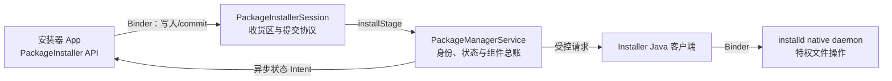
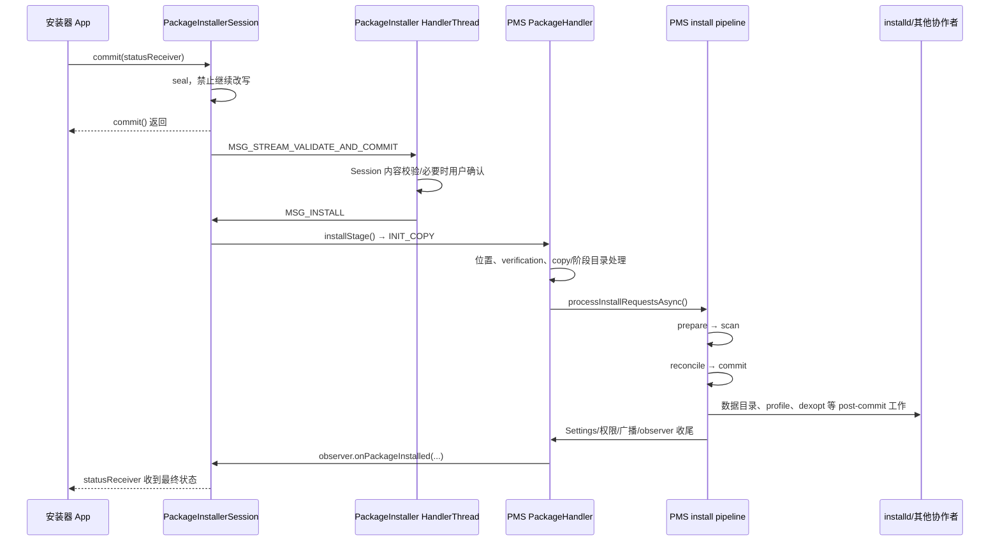

# 13 PackageManagerService：一次 APK 安装，系统到底承诺了什么？

你在安装器里点了“安装”，`Session.commit()` 很快返回；几秒后，安装器却可能提示签名不一致、空间不足，或者要求用户确认。

这正是本章要解决的问题：**为什么安装 APK 不能等价为把文件复制到 `/data/app`，以及收到“安装成功”回调时，哪些事情已经成立，哪些事情仍然没有保证。**

先记住结论：

> 安装不是“搬运一个 APK”，而是“让 Android 接受一个新的包状态”。文件落到磁盘只是其中一步；系统还必须确认身份和更新关系、建立包与组件索引、分配或复用 appId、写入持久化设置、准备用户数据，并把变化通知其他系统模块。

读完后，你应该能：

1. 从 `PackageInstaller.Session.commit()` 追到 PMS 的 `prepare → scan → reconcile → commit`。
2. 解释 PackageInstaller、PMS、`Installer` 和 `installd` 各自解决什么问题。
3. 判断“`commit()` 已返回”“APK 已在磁盘”“PMS 已提交”“收到成功回调”分别处于哪个完成点。
4. 遇到安装失败或安装后查不到组件时，知道应该检查哪一段，而不是只盯着文件复制。

本章基于 Android 11 / `android-11.0.0_r48`。只追普通、非 staged 的 APK 安装主线；APEX、重启后生效的 staged install、Incremental FS 和多包安装只说明边界，不展开实现。

---

## 1. 真实问题：42 版 APK 已经复制成功，为什么仍不能覆盖 41 版？

贯穿本章的例子只有一个：

```text
设备上已有：com.example.reader 41 版
准备安装：  com.example.reader 42 版
异常条件：  42 版使用了另一个、不在合法签名轮换链中的证书
```

从文件系统角度看，42 版的 `base.apk` 完全可以被复制，ZIP 结构也可能没有损坏。但 Android 不能因此宣布升级成功。

原因是旧版本已经拥有一组系统身份和状态：

- 包名 `com.example.reader`；
- 已分配的 appId，以及由它派生出的各用户 UID；
- 旧签名和可能存在的签名轮换历史；
- 原有应用数据目录；
- 已授予的权限和每个用户的启用、停用、安装状态；
- Activity、Service、Receiver、Provider 与 Intent Filter 索引。

如果任意同名 APK 都能覆盖旧版本，它就可能继承旧应用的数据、权限和身份。签名检查因此不是安装流程的“附加安全扫描”，而是判断“新 APK 有没有资格继续成为原来那个应用”的核心步骤。

可以把安装理解成仓库入库：

```text
Session 阶段目录 = 收货区
解析与校验        = 核对货物身份、批次和入库资格
PMS commit       = 修改仓库的正式库存账
Settings 落盘    = 把账本保存下来，重启后仍能恢复
数据目录/广播     = 准备货位并通知需要更新视图的人
```

箱子送到收货区，不等于正式库存已经更新。同样，APK 出现在某个目录，也不等于 PMS 已经承认它是可用软件包。

### 四个容易混为一谈的完成点

| 观察到的现象 | 可以得出的结论 | 不能推出的结论 |
|---|---|---|
| `Session.commit()` 返回 | system_server 已处理提交入口；正常路径封存 Session 并调度后续工作，封存校验失败则安排失败结果 | 安装已经成功 |
| APK 已写入 Session 目录 | 安装内容已进入阶段目录 | 签名、版本、组件和权限都合法 |
| PMS 完成 `commitPackagesLocked()` | 新包状态已进入 PMS 内存，并已调用 Settings 写盘路径 | 不能据此断言写盘无 I/O 错误，也不能断言所有通知接收方都处理完毕 |
| 收到 `STATUS_SUCCESS` | 这次 Session 的普通安装主流程已成功收尾 | App 已启动、Launcher 已刷新画面、所有广播接收者已执行完 |

后面所有源码，都是在证明这张表。

---

## 2. 为什么要分成四组参与者？

安装横跨 API 协议、系统决策和特权文件操作。把这些职责塞进一个类，会让普通安装器拥有过高权限，也会让 PMS 直接承担大量底层文件细节。

Android 11 的主要参与者如下：

| 参与者 | 所在位置 | 负责什么 | 不负责什么 |
|---|---|---|---|
| `PackageInstaller` / `Session` | 调用方进程中的 Framework API | 创建 Session、写入 APK、提交、接收状态 | 不决定签名能否升级旧包 |
| `PackageInstallerService` / `PackageInstallerSession` | `system_server` | 管理 Session 生命周期、阶段目录、封存、用户确认和结果协议 | 不维护完整的包数据库 |
| `PackageManagerService`，简称 PMS | `system_server` | 解析、验证更新关系、建立包状态和组件索引、持久化、查询 | 不亲自完成所有特权文件系统操作 |
| `Installer` → `installd` | Java 客户端在 `system_server`；daemon 为独立 native 进程 | 创建/修复应用数据目录、dexopt、清理等受控操作 | 不决定某个签名是否可以继承旧包身份 |

它们之间的关系不是四套互相竞争的安装器，而是一条分工链：



### PMS 管理的不是一个 APK 路径，而是一组互相关联的事实

阅读源码时，经常会看到几个名称相近的对象。用“它代表哪一层事实”来区分：

| 对象 | 可把它理解为 | 主要用途 |
|---|---|---|
| `ParsedPackage` | 刚从 APK/Manifest 读出的可变草稿 | 解析、补充签名和 ABI 等安装期信息 |
| `AndroidPackage` | PMS 使用的包声明视图 | 表示包名、组件、权限、代码路径等当前声明 |
| `PackageSetting` | 这个包在设备上的系统身份与状态 | appId、签名/版本关联、安装来源、每用户状态等 |
| `ComponentResolver` | 按组件和 Intent Filter 建立的查询索引 | 回答哪个 Activity/Service 等能处理请求 |
| `PackageInfo` / `ApplicationInfo` | 对调用方生成的查询结果快照 | Framework API 返回，不是 PMS 的唯一真实数据源 |

因此，“解析到了 Manifest”不等于“已加入系统”，“已加入系统”也不等于“某个用户一定启用了它”。

---

## 3. `commit()` 为什么很快返回？真正结果从哪里回来？

### 先讲 Why：安装不能占住调用线程直到所有工作结束

安装可能包含用户确认、完整性验证、包解析、签名比较、原生库处理、数据目录准备、备份恢复和 dexopt。它既可能耗时，也可能在中途等待另一个参与者。

如果 `commit()` 同步等待到最后：

- 安装器调用线程可能长时间阻塞；
- 需要用户确认时，同步调用根本无法自然完成；
- system_server 的 Binder 线程也会被这段长流程占用。

Android 选择的是“同步提交命令，异步报告状态”。

Framework API 的注释已经明确说，提交可能需要用户参与，最终结果通过回调报告：

```java
// frameworks/base/core/java/android/content/pm/PackageInstaller.java
public void commit(@NonNull IntentSender statusReceiver) {
    try {
        mSession.commit(statusReceiver, false);
    } catch (RemoteException e) {
        throw e.rethrowFromSystemServer();
    }
}
```

这段 Binder 调用本身是同步方法；但服务端方法并不在 Binder 线程里做完整安装。

`PackageInstallerSession.commit()` 先封存 Session，再向自己的 Handler 发消息：

```java
// PackageInstallerSession.java
if (!markAsSealed(statusReceiver, forTransfer)) {
    return;
}
...
dispatchStreamValidateAndCommit();

private void dispatchStreamValidateAndCommit() {
    mHandler.obtainMessage(MSG_STREAM_VALIDATE_AND_COMMIT).sendToTarget();
}
```

`PackageInstallerService` 创建了一条专用 `HandlerThread`，Session 的 `mHandler` 使用它的 Looper。于是线程关系是：

```text
安装器调用线程
  └─ Binder 同步进入 system_server
       └─ Binder 线程：封存 Session、投递消息、返回
            └─ PackageInstaller 专用 HandlerThread：继续校验与安装
```

所以要精确表达：

> `commit()` 返回表示“提交请求已被服务端接收并进入异步流程”，不是“安装完成”。

### `statusReceiver` 会收到中间状态，也会收到最终状态

如果普通安装器没有静默安装资格，Session 会先发 `STATUS_PENDING_USER_ACTION`，并在 `Intent.EXTRA_INTENT` 中附上确认界面的 Intent。用户同意后流程才继续。

最终成功或失败则由 `sendOnPackageInstalled()` 写入：

```java
fillIn.putExtra(PackageInstaller.EXTRA_SESSION_ID, sessionId);
fillIn.putExtra(PackageInstaller.EXTRA_STATUS,
        PackageManager.installStatusToPublicStatus(returnCode));
fillIn.putExtra(PackageInstaller.EXTRA_STATUS_MESSAGE,
        PackageManager.installStatusToString(returnCode, msg));
target.sendIntent(context, 0, fillIn, null, null);
```

调用方因此要把状态分成两类：

```text
PENDING_USER_ACTION：还没结束，按 EXTRA_INTENT 引导用户确认
SUCCESS / FAILURE_*：这次操作的最终结果
```

不能把第一次收到的 Intent 一律当成终局，也不能在 `commit()` 的下一行立刻查询包并假定它已经存在。

---

## 4. 从 `commit()` 到成功回调：主调用链只有这一条

先看全链，再进入每个阶段：



对应源码符号：

```text
PackageInstaller.Session.commit
→ PackageInstallerSession.commit
→ dispatchStreamValidateAndCommit
→ handleStreamValidateAndCommit
→ MSG_INSTALL / handleInstall
→ PackageManagerService.installStage
→ INIT_COPY / InstallParams.startCopy
→ processPendingInstall
→ processInstallRequestsAsync
→ installPackagesTracedLI
→ installPackagesLI
→ handlePackagePostInstall
→ observer.onPackageInstalled
→ PackageInstallerSession.dispatchSessionFinished
→ statusReceiver
```

### 两次 Handler 切换解决的是两个不同问题

1. `PackageInstallerSession` 切到 PackageInstaller 专用线程：让 Binder 入口尽快返回，并管理 Session 协议。
2. `PackageManagerService.installStage()` 再向 PMS 的 `PackageHandler` 发送 `INIT_COPY`：把请求交给 PMS 自己的安装调度与验证流程。

PMS 的入口源码很短：

```java
void installStage(ActiveInstallSession activeInstallSession) {
    final Message msg = mHandler.obtainMessage(INIT_COPY);
    final InstallParams params = new InstallParams(activeInstallSession);
    // 中间省略 Trace 标记
    msg.obj = params;
    mHandler.sendMessage(msg);
}
```

它证明 `installStage()` 仍不是“完成安装”的函数，只是把一份活动 Session 转成 PMS 的后台任务。

---

## 5. 为什么要拆成 prepare、scan、reconcile、commit？

### 先讲 Why：不能一边发现错误，一边修改正式状态

假设升级 `com.example.reader` 时，PMS 先替换了组件索引，随后才发现签名不匹配。此时包查询看到的是 42 版，数据和权限却仍属于 41 版，系统状态就会半新半旧。

因此主流程尽量把“收集信息和可预见校验”放在前面，最后才集中修改正式状态。

Android 11 源码对四个阶段的职责给出了直接注释，核心实现顺序是：

```java
prepareResult = preparePackageLI(request.args, request.installResult);
ScanResult result = scanPackageTracedLI(...);

synchronized (mLock) {
    reconciledPackages = reconcilePackagesLocked(...);
    commitPackagesLocked(new CommitRequest(reconciledPackages, ...));
}

executePostCommitSteps(commitRequest);
```

注意代码中的两条边界：

- `installPackagesLI()` 整体要求持有 `mInstallLock`，安装请求因此不会随意并发修改代码与安装状态。
- `reconcile` 和 `commit` 进入 `mLock`；昂贵、可能调用 `installd` 的 post-commit 工作放到释放 `mLock` 以后。

### 四个动词分别回答什么问题？

| 阶段 | 核心问题 | 以 41 → 42 版升级为例 |
|---|---|---|
| `prepare` | 新 APK 自己是谁？这是不是一次替换？基础约束是否合法？ | 解析 42 版，收集签名，找到已安装的 41 版并做早期兼容检查 |
| `scan` | 把新声明放进当前设备环境，会形成什么候选包状态？ | 计算候选 `PackageSetting`、组件、ABI、库依赖等扫描结果 |
| `reconcile` | 候选结果与旧状态、其他包、共享库和签名能否共存？ | 再次确认签名/升级关系，决定替换动作，拒绝冲突 |
| `commit` | 前面都通过后，怎样把候选状态正式发布？ | 更新 `mPackages`、组件索引、设置和每用户状态 |

这里的 `scan` 不是“再遍历一遍文件夹”，而是把解析结果放进 PMS 当前环境中推导候选状态。

### 签名为什么在 prepare 和 reconcile 都能看到？

`preparePackageLI()` 会解析包并取得签名：

```java
parsedPackage = pp.parsePackage(tmpPackageFile, parseFlags, false);
...
parsedPackage.setSigningDetails(
        ParsingPackageUtils.getSigningDetails(parsedPackage, false));
```

发现同名旧包后，它会做一次早期升级签名检查，让明显失败尽早退出。`reconcilePackagesLocked()` 又在完整候选状态中检查签名和 keyset 关系。

这不是两次完全相同的无意义校验：前者尽早拒绝，后者在所有扫描结果与当前系统状态放在一起后作最终协调。

对于本章的错误证书 42 版，流程应在正式 commit 前以 `INSTALL_FAILED_UPDATE_INCOMPATIBLE` 一类结果失败。它不应继承 41 版的身份和数据。

### 版本号不是唯一升级凭证

`versionCode` 回答“版本先后”，签名回答“身份连续性”。只有 42 大于 41，并不能证明 42 有权覆盖 41。

同时，“禁止降级”也不是绝对到无法绕过的单一规则：debuggable 构建、系统权限、安装参数和具体包类型会影响允许条件。读源码时应跟随 `checkDowngrade()` 及调用处判断，不要只记一句“Android 永远不允许低版本安装”。

---

## 6. commit 到底提交了什么？为什么文件之外还有三类状态？

### 第一类：PMS 内存中的包与组件索引

Manifest 里的 Activity、Service、Receiver、Provider 和 Intent Filter，最终会进入 PMS 的包状态与 `ComponentResolver` 索引。

这就是安装与 Activity 启动之间的接口：

```text
安装阶段：Manifest 声明 → ComponentResolver 建立索引
启动阶段：resolveIntent/queryIntentActivities → 查询索引 → 得到 ResolveInfo
```

`resolveIntent()` 并不会在每次启动 Activity 时重新解压所有 APK、解析所有 Manifest。安装或开机扫描提前建立索引，查询阶段才能足够快。

因此，把 APK 私自复制到 `/data/app` 后立刻调用 `PackageManager`，系统不会因为“文件在那里”就自动把它当成已安装包。

### 第二类：Settings 持久化账本

在 Android 11 这条安装路径里，`commitPackagesLocked()` 调用 `updateSettingsLI()`；后者更新用户状态和返回结果，并执行：

```java
res.name = pkgName;
res.uid = pkg.getUid();
res.pkg = pkg;
res.setReturnCode(PackageManager.INSTALL_SUCCEEDED);

Trace.traceBegin(TRACE_TAG_PACKAGE_MANAGER, "writeSettings");
mSettings.writeLPr();
Trace.traceEnd(TRACE_TAG_PACKAGE_MANAGER);
```

这里还藏着一个重要失败边界：`writeLPr()` 返回 `void`。它会备份旧文件、写新 XML、`sync`，并在成功后更新其他派生文件；但遇到 `IOException` 时主要记录严重日志并尽量清理损坏文件，不会通过返回值把本次 `INSTALL_SUCCEEDED` 自动改成失败。

所以更严谨的说法是：commit 已经**进入并执行了 Settings 持久化路径**。若要确认“重启后一定能恢复”，还要排除 `Unable to write package manager settings` 一类 I/O 错误；不能只看安装器的成功界面。

常见持久化位置包括：

| 位置 | 保存的重点 | 不要误解为 |
|---|---|---|
| `/data/system/packages.xml` | 包身份、代码路径、appId、签名/版本关联、安装来源等全局设置 | APK Manifest 的完整副本 |
| `/data/system/users/<userId>/package-restrictions.xml` | 某用户下 installed、enabled、stopped、hidden、组件覆盖状态等 | 所有用户共用的一份开关 |
| `/data/system/packages.list` | 提供给其他底层组件使用的包、UID、数据目录等派生信息 | PMS 唯一数据库 |
| 用户目录下的权限相关 XML | 运行时权限等用户相关状态，由权限子系统协作维护 | APK 中 `uses-permission` 声明本身 |

不要手工编辑这些文件来“修复安装”。它们互有关联，还涉及备份文件、SELinux 标签、内存状态与其他派生数据；直接改一处很容易制造更难恢复的不一致。

### 第三类：每个用户的数据与安装状态

一个包通常只保留一份代码，但不同用户有不同的“是否安装、是否启用”和数据目录。

关系可以写成：

```text
uid = UserHandle.getUid(userId, appId)
```

例如，同一个 `com.example.reader` 的 appId 在设备上保持包身份；用户 0 和用户 10 组合出不同 UID，并使用各自的 CE/DE 数据目录。

这解释了两个常见现象：

- 用户 0 安装成功，不自动等于用户 10 可见且启用。
- 代码已经存在时，`installExistingPackageAsUser` 可以主要改变某用户的包状态，而不重新搬一份 APK。

“包是否存在”和“这个用户能否使用”必须分开判断。

---

## 7. `installd` 为什么存在？它不是 PMS 的替代品

### Why：system_server 不应到处直接拼路径、改所有者和做 dexopt

应用数据目录需要正确的 UID/GID、SELinux 标签、CE/DE 存储语义和配额处理。把这些高权限操作分散写在 Java 服务里，既难审计，也容易产生路径和权限错误。

PMS 通过 `Installer` Java 客户端向 `installd` 发出结构化请求。例如 `Installer.createAppData()` 最终调用 native daemon：

```java
public long createAppData(String uuid, String packageName, int userId, int flags,
        int appId, String seInfo, int targetSdkVersion) throws InstallerException {
    if (!checkBeforeRemote()) return -1;
    try {
        return mInstalld.createAppData(uuid, packageName, userId, flags, appId,
                seInfo, targetSdkVersion);
    } catch (Exception e) {
        throw InstallerException.from(e);
    }
}
```

PMS 在 commit 释放 `mLock` 后执行 `executePostCommitSteps()`，其中会：

- 为已安装用户准备应用数据；
- 准备 profile；
- 按条件执行安装期 dexopt；
- 通知相关 dex 管理模块。

源码特意说明，post-commit 工作通常更昂贵，或者会调用可能再次使用 PMS 锁的 `installd`，所以放在包锁之外。

### 两个必须保留的边界

第一，`installd` 只执行受控底层动作，不决定 42 版签名能否继承 41 版数据。决策者仍是 PMS。

第二，部分 post-commit 操作不是“失败就回滚整个安装”的事务。Android 11 明确写着不要因为安装期 dexopt 失败而拒绝应用；后续仍可通过解释、JIT 或后台优化获得可执行代码。`prepareAppDataLeafLIF()` 对第三方应用的数据目录创建异常也会记录错误，而不是在这里改写安装结果。因此：

```text
安装成功 ≠ 所有 dex 都已经达到最佳优化状态
```

这也是“成功回调”不能被理解成“所有后续性能准备全部完成”的一个例子。

---

## 8. 收到 `STATUS_SUCCESS` 时，究竟保证了什么？

普通非 staged 安装中，PMS 完成核心安装后还会进入 `restoreAndPostInstall()` 与 `handlePackagePostInstall()`。后者处理权限、包变化通知、安装/替换广播，并调用安装 observer。

`PackageInstallerSession` 创建的本地 observer 收到 PMS 结果后才销毁 Session，并分发最终状态：

```java
public void onPackageInstalled(String basePackageName, int returnCode,
        String msg, Bundle extras) {
    destroyInternal();
    dispatchSessionFinished(returnCode, msg, extras);
}
```

### 对本章主线，可以安全依赖的事实

收到最终 `STATUS_SUCCESS` 时，通常可以认为：

1. Session 已通过普通安装主流程，没有停在待用户确认状态。
2. PMS 已接受包身份与更新关系；错误证书的 42 版不会走到这里。
3. 新包状态已提交到 PMS，并已调用 Settings 持久化路径；没有写盘错误日志时，设置文件已完成同步写入。
4. 对目标用户，安装状态和 UID 等结果已经确定。
5. 普通 post-commit 数据准备已被尝试，安装后的权限和包通知逻辑已走到 observer 收尾点。

### 仍然不能保证的事情

`STATUS_SUCCESS` 不表示：

- App 进程已经创建，`Application.onCreate()` 已运行；
- Launcher 已经完成下一帧刷新并显示图标；
- 所有 `PACKAGE_ADDED` / `PACKAGE_REPLACED` 广播接收者都执行完；
- 安装期 dexopt 一定成功，或者以后不再发生编译；
- Settings 写盘和每项派生文件操作都没有记录 I/O 错误；
- `installd` 执行的每一项派生准备都成功完成；
- 所有用户都安装并启用了这个包；
- 业务数据迁移一定正确——那通常是 App 自己升级数据库时的责任。

为什么不能保证广播接收者已执行完？`handlePackagePostInstall()` 中多数包广播传入的 `finishedReceiver` 是 `null`。调用返回说明广播请求已交给广播系统，不代表每个接收者都处理结束。

还有一个特殊分支：更新时若指定“不杀进程”，observer 可能被延后，等待替换广播的接收确认路径。它说明完成点会受安装参数影响，不能把所有分支压成完全相同的时序。

### staged 安装的“成功”不是同一个完成点

本章主线排除了 `params.isStaged`。源码中 staged Session 在交给 `StagingManager` 后会报告 `"Session staged"`；真正应用可能要等重启及后续验证。

所以看到成功结果时，第一步总要确认安装类型。普通 APK Session 的成功，不能直接套到 APEX 或 staged install 上。

---

## 9. 开机扫描和用户安装，为什么最后都能被 `PackageManager` 查到？

用户安装不是 PMS 认识软件包的唯一入口。设备启动时，PMS 还要恢复系统镜像和 `/data/app` 中已经存在的包。

Android 11 的启动主线大致是：

```text
Settings.readLPw()
→ 扫描 system/vendor/product/system_ext 等只读分区
→ 扫描 /data/app
→ 对比“持久化账本”和“本次实际存在的代码”
→ 重建 mPackages、PackageSetting、ComponentResolver 等内存状态
```

源码入口可以从这些符号开始：

```text
PackageManagerService 构造过程
├─ mSettings.readLPw(...)
├─ scanDirTracedLI(partition.getPrivAppFolder(), ...)
├─ scanDirTracedLI(partition.getAppFolder(), ...)
└─ scanDirTracedLI(sAppInstallDir, ...)
```

### 两条入口的共同目标与不同过程

| 对比项 | 用户安装 | 开机扫描 |
|---|---|---|
| 输入 | 一个待提交的 Session | 分区现有代码 + 上次持久化 Settings |
| 关键问题 | 新状态能否替换/加入当前系统 | 磁盘代码与旧账是否一致，怎样恢复当前状态 |
| 是否有安装器回调 | 有 | 没有同样的 Session 最终回调 |
| 是否严格走同一条四阶段事务 | 普通安装主干明确走 prepare/scan/reconcile/commit | 复用许多解析扫描能力，但不是同一条 Session 时序 |
| 最终共同结果 | PMS 能查询包、组件和用户状态 | PMS 能查询包、组件和用户状态 |

不要为了背一张统一图，就声称“开机扫描也完整调用一次用户安装的每个函数”。共同的是最终数据模型，入口、约束和失败处理并不相同。

这也回答了本章最开始的另一个隐含问题：Launcher 和 ATMS 之所以能找到 Activity，不是因为它们自己扫描 APK，而是因为 PMS 已经在安装或开机扫描阶段建立了组件索引。

---

## 10. 出问题时，按“卡在哪个完成点”排查

不要从 30 个类名同时开始。先把现象归到一个完成点，再向两侧取证。

### 问题 A：`commit()` 返回了，但一直没有最终回调

先确认收到的是否是 `STATUS_PENDING_USER_ACTION`。如果是，检查 `Intent.EXTRA_INTENT` 是否被正确展示，用户确认后流程是否继续。

如果完全没有状态：

```text
Session 是否成功 sealed？
→ PackageInstaller Handler 是否处理 MSG_STREAM_VALIDATE_AND_COMMIT？
→ 是否停在 streaming / verification / rollback 等等待条件？
→ 是否已经进入 PMS installStage / INIT_COPY？
→ observer 或 IntentSender 的接收方是否还存活？
```

关键搜索：

```bash
rg -n 'markAsSealed|MSG_STREAM_VALIDATE_AND_COMMIT|MSG_INSTALL' \
  frameworks/base/services/core/java/com/android/server/pm/PackageInstallerSession.java

rg -n 'installStage|INIT_COPY|processPendingInstall' \
  frameworks/base/services/core/java/com/android/server/pm/PackageManagerService.java
```

### 问题 B：最终失败提示更新不兼容

对于本章的 42 版，优先检查：

1. 新旧包名是否相同；
2. 新签名是否与旧签名或合法签名轮换链兼容；
3. 是否错误地把“版本号更大”当成了身份凭证；
4. `EXTRA_STATUS_MESSAGE` 和 legacy install status 指向 prepare、reconcile 还是其他约束。

可从这些符号开始：

```bash
rg -n 'verifySignatures|INSTALL_FAILED_UPDATE_INCOMPATIBLE|checkDowngrade' \
  frameworks/base/services/core/java/com/android/server/pm/PackageManagerService.java
```

### 问题 C：成功了，但某个用户或某个 Intent 查不到 Activity

把问题拆开：

```text
包级：PMS 中是否存在 com.example.reader？
用户级：目标 userId 下是否 installed/enabled，是否处于 stopped/hidden 等状态？
组件级：目标 Activity 是否被解析并加入 ComponentResolver？
匹配级：Intent 的 action/category/data/type 是否与 filter 匹配？
可见性级：调用方是否受 Android 11 package visibility 过滤？
```

`base.apk` 存在只能回答第一层之前的“代码文件是否在磁盘”，不能替代后面四层检查。

如果将来在设备上验证，可使用：

```bash
adb shell pm path com.example.reader
adb shell dumpsys package com.example.reader
adb shell cmd package resolve-activity --brief \
  -a android.intent.action.MAIN -c android.intent.category.LAUNCHER \
  -p com.example.reader
```

本机是 macOS、当前任务只做静态源码阅读，因此这些命令是未来设备验证方案，不冒充本轮实测结果。

---

## 11. 在 Mac 上完成一次可验证的源码阅读

这次练习不编译 Android，也不需要设备。目标是亲手证明四个完成点不同。

### 第一步：证明 `commit()` 返回早于最终结果

依次找到：

```text
PackageInstaller.Session.commit
PackageInstallerSession.commit
markAsSealed
dispatchStreamValidateAndCommit
dispatchSessionFinished
sendOnPackageInstalled
```

记录：哪一步仍在 Binder 请求内，哪一步已通过 Handler 消息继续，最终状态由哪个 `IntentSender` 发回。

### 第二步：证明 PMS 先验证，后修改正式状态

定位 `installPackagesLI()`，只记录五行调用关系：

```text
preparePackageLI
scanPackageTracedLI
reconcilePackagesLocked
commitPackagesLocked
executePostCommitSteps
```

再标出 `mInstallLock` 和 `mLock` 的范围。观察昂贵的 post-commit 工作为什么放在 `mLock` 外。

### 第三步：证明“安装成功”不是“App 已运行”

从 `handlePackagePostInstall()` 追到 `notifyInstallObserver()`，再回到 `PackageInstallerSession.dispatchSessionFinished()`。

全文搜索这条链里有没有调用目标 App 的 `Application.onCreate()`。预期结果是没有：启动进程属于 AMS/ATMS 后续运行链，不是 PMS 安装成功的组成部分。

### 自检题与答案

**1. `Session.commit()` 没抛异常，可以显示“安装成功”吗？**

不可以。它只说明同步提交入口没有以异常终止；最终结果要读 `statusReceiver` 中的 `EXTRA_STATUS`。还可能先收到 `STATUS_PENDING_USER_ACTION`。

**2. 为什么签名不同的高版本 APK 不能覆盖低版本？**

版本号只表示先后，签名连续性才证明它有资格继承旧包身份、UID、权限和数据。否则会形成应用身份劫持。

**3. `commitPackagesLocked()` 为什么要晚于 reconcile？**

reconcile 尽量发现候选状态与旧包、其他包、签名和共享库之间的可预见冲突；只有都通过后，commit 才修改 PMS 正式状态，避免半提交。

**4. 为什么不能一直持有 `mLock` 做数据目录和 dexopt？**

这些操作更慢，还可能跨进程调用 `installd`。长时间持有 PMS 主锁会阻塞包查询和其他依赖包状态的 system_server 工作，并增加锁等待风险。

**5. 收到成功回调后，为什么 Launcher 图标仍可能稍后才出现？**

成功回调不等待 Launcher 完成广播处理和下一帧 UI 刷新。PMS 已提交包状态，不等于每个观察者的界面已经更新。

**6. 为什么重启后不用重新执行一次安装器 Session？**

PMS 会读取持久化 Settings，并扫描系统分区与 `/data/app`，据此重建包、组件和用户状态。恢复路径和用户安装路径目标相同，但时序不同。

### 本章 takeaway

以后看到任何“安装问题”，先画出下面四格并标记证据：

```text
[Session 已接收] → [候选包已验证] → [PMS 已提交并持久化] → [最终结果已通知]
```

然后再问：故障发生在哪两格之间？

只要坚持这个方法，`commit()` 返回、文件存在、包可查询、组件可解析和 App 可运行就不会再被混成一句“已经安装了”。

---

## 源码定位表

| 目的 | 文件与符号 |
|---|---|
| Framework 提交 API | `frameworks/base/core/java/android/content/pm/PackageInstaller.java`：`Session.commit()` |
| Session 封存、用户确认与异步结果 | `frameworks/base/services/core/java/com/android/server/pm/PackageInstallerSession.java` |
| Session 服务与专用线程 | `frameworks/base/services/core/java/com/android/server/pm/PackageInstallerService.java` |
| PMS 安装主流程 | `frameworks/base/services/core/java/com/android/server/pm/PackageManagerService.java` |
| 包设置持久化 | `frameworks/base/services/core/java/com/android/server/pm/Settings.java` |
| Java 到 installd 的客户端 | `frameworks/base/services/core/java/com/android/server/pm/Installer.java` |
| installd native 实现 | `frameworks/native/cmds/installd/` |

行号会随分支变化，阅读时以类名和方法名定位。本文所有确定性结论均按 Android 11 `android-11.0.0_r48` 静态源码核对；运行日志、耗时和设备行为未在本机编译实测。
