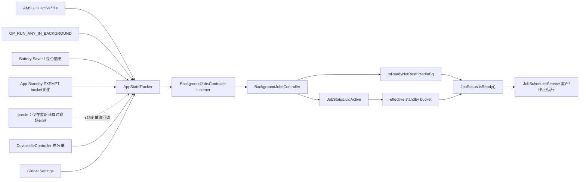
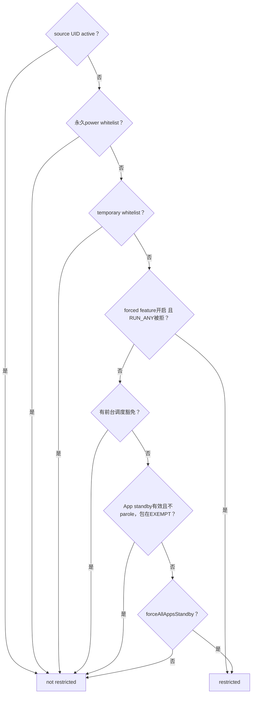
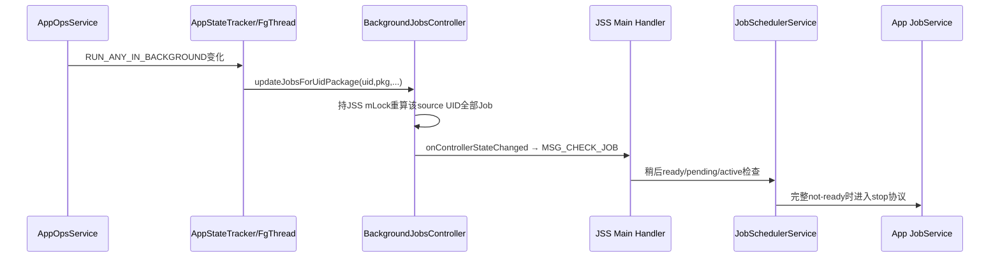
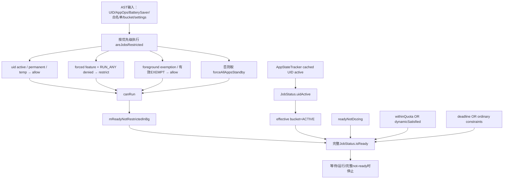

# 130 Android BackgroundJobsController：后台限制、UID 活跃与隐式约束

> 源码版本：Android 11 / API 30 / `android-11.0.0_r48`  
> 学习方式：macOS 只读源码，不要求编译、不要求连接设备  
> 前置章节：第 42、74、121、122、129 章

---

## 1. 本章研究第三道容易被忽略的系统门

前两章已经拆开：

```text
CONSTRAINT_IDLE
  用户是否长时间未交互

CONSTRAINT_DEVICE_NOT_DOZING
  Light/Deep Doze 是否允许该 Job
```

本章再加入：

```text
CONSTRAINT_BACKGROUND_NOT_RESTRICTED
  来源应用当前是否被后台执行政策限制
```

它同样不是应用通过 JobInfo 主动声明的约束，而是所有 Job 最终 `isReady()` 都要经过的隐式门。

最重要的认识是：

> “应用在后台”不等于“Job 一定受限”；系统还要依次看 UID active、永久/临时白名单、包级 AppOps 强制限制、前台调度豁免、EXEMPT bucket 与全局 Battery Saver/force-all 状态。

---

## 2. 本章要回答什么

1. BackgroundJobsController 同时维护哪两个 JobStatus 字段？
2. `areJobsRestricted()` 的判断顺序为何比一条布尔公式更重要？
3. 包级 Forced App Standby 与全局 force-all 有何区别？
4. `OP_RUN_ANY_IN_BACKGROUND` 与 App Standby bucket 是不是一回事？
5. UID active 为什么不仅影响后台门，还改变 effective bucket？
6. 前台调度豁免是什么，为什么它会“粘”在 Job 上？
7. EXEMPT bucket 与前台豁免为什么都绕不过 AppOps 强制限制？
8. 哪些 AppStateTracker 事件只更新一个 UID，哪些触发全量扫描？
9. 状态变化后，running Job 在何时、因什么 reason 停止？
10. r48 有哪些不影响当前结果、却值得记录的实现瑕疵？

---

## 3. 源码地图

本章主链：

```text
frameworks/base/apex/jobscheduler/service/java/com/android/server/job/controllers/BackgroundJobsController.java
frameworks/base/services/core/java/com/android/server/AppStateTracker.java
frameworks/base/apex/jobscheduler/service/java/com/android/server/job/controllers/JobStatus.java
frameworks/base/apex/jobscheduler/service/java/com/android/server/job/JobSchedulerService.java
```

状态生产与配置：

```text
frameworks/base/apex/jobscheduler/service/java/com/android/server/DeviceIdleController.java
frameworks/base/core/java/android/provider/Settings.java
frameworks/base/core/java/android/app/AppOpsManager.java
frameworks/base/services/core/java/com/android/server/am/ActivityManagerService.java
frameworks/base/services/core/java/com/android/server/am/OomAdjuster.java
frameworks/base/services/java/com/android/server/SystemServer.java
```

持久化、停止与测试：

```text
frameworks/base/apex/jobscheduler/service/java/com/android/server/job/JobStore.java
frameworks/base/apex/jobscheduler/framework/java/android/app/job/JobInfo.java
frameworks/base/apex/jobscheduler/framework/java/android/app/job/JobParameters.java
frameworks/base/apex/jobscheduler/service/java/com/android/server/job/JobServiceContext.java
frameworks/base/services/tests/mockingservicestests/src/com/android/server/AppStateTrackerTest.java
frameworks/base/services/tests/mockingservicestests/src/com/android/server/job/controllers/JobStatusTest.java
frameworks/base/services/tests/servicestests/src/com/android/server/job/BackgroundRestrictionsTest.java
```

---

## 4. 一张总链图



BackgroundJobsController 本身不直接监听这些广播与 AppOps；它复用 AppStateTracker 已经聚合好的状态。

---

## 5. 两个输出不是一回事

Controller 一次更新同时写：

```text
BACKGROUND_NOT_RESTRICTED satisfied bit
JobStatus.uidActive boolean
```

前者进入完整 ready 的隐式 AND 门；后者改变 effective standby bucket，并进一步影响 quota、RESTRICTED dynamic 与非 ACTIVE 批处理判断。JSS 的 priority override 来自另一套 proc-state observer，不直接读取这个 `uidActive` 字段。

所以不能把 Controller 简化成“只维护能不能后台运行”。它还把 AMS UID 生命周期投影进 JobStatus。

---

## 6. 隐式约束在哪里定义

`JobStatus`：

```java
static final int CONSTRAINT_BACKGROUND_NOT_RESTRICTED = 1 << 22;
```

setter 除了写 bit，还维护：

```java
mReadyNotRestrictedInBg = state;
```

应用没有 `setRequiresBackgroundNotRestricted()` 之类 API。这是系统政策，不是业务选择。

---

## 7. 新 Job 开始跟踪时做什么

```java
public void maybeStartTrackingJobLocked(JobStatus jobStatus, JobStatus lastJob) {
    updateSingleJobRestrictionLocked(jobStatus, UNKNOWN);
}
```

核心更新：

```java
final boolean canRun = !mAppStateTracker.areJobsRestricted(
        uid, packageName, hasForegroundExemption);

final boolean isActive = activeState == UNKNOWN
        ? mAppStateTracker.isUidActive(uid)
        : activeState == KNOWN_ACTIVE;

boolean changed =
        jobStatus.setBackgroundNotRestrictedConstraintSatisfied(canRun);
changed |= jobStatus.setUidActive(isActive);
```

也就是先问 AppStateTracker，再把两个结果写给 JobStatus。

---

## 8. 为什么 Controller 不维护 tracked set

与 Battery/Idle/Storage Controller 不同，它：

- 不设置 `TRACKING_*` bit；
- 不保存 `ArraySet<JobStatus>`；
- `maybeStopTrackingJobLocked()` 是空实现；
- 全量更新直接遍历 JobStore；
- UID 更新用 `forEachJobForSourceUid()`。

原因是这道隐式门适用于所有 Job，没有“只有声明某条件才跟踪”的子集。

空的 stop 方法不是漏写清理，而是当前数据模型根本没有 Controller 私有 Job 引用需要移除。

---

## 9. `areJobsRestricted()` 入口

```java
public boolean areJobsRestricted(int uid, String packageName,
        boolean hasForegroundExemption) {
    return isRestricted(uid, packageName,
            true /* useTempWhitelistToo */,
            hasForegroundExemption);
}
```

这行已经透露两点：

1. Job 限制是 `(uid, packageName)` 共同判断；
2. Job 路径明确让 temporary whitelist 生效。

Alarm 等其他调用方可以为 `useTempWhitelistToo` 传不同值，不能把 AppStateTracker 所有消费者都套成本章规则。

---

## 10. 精确判断顺序

`isRestricted()` 可按源码顺序改写为：

```text
1. uidActive？                     → 不限制
2. permanent power whitelist？     → 不限制
3. temp whitelist（Job路径启用）？ → 不限制
4. forced feature开启且RUN_ANY被拒？→ 限制
5. foreground scheduling exemption？→ 不限制
6. 有效EXEMPT bucket？             → 不限制
7. 否则                           → 返回forceAllAppsStandby
```

顺序本身就是策略优先级。不能把所有条件随意交换。

---

## 11. 判定树



特别观察：AppOps 强制限制在前台调度豁免与 EXEMPT bucket 之前。

---

## 12. 一个近似布尔公式

在不丢失先后含义的前提下，可写成：

```text
restricted =
  !uidActive
  && !powerWhitelist
  && !tempWhitelist
  && (
       (forcedFeature && runAnyDenied)
       ||
       (!foregroundExemption
        && !effectiveExemptBucket
        && forceAllAppsStandby)
     )
```

其中：

```text
effectiveExemptBucket =
  appIdleEnabled && !appStandbyInParole && packageInExemptBucket
```

公式适合手算，决策树适合记优先级，两者都应保留。

---

## 13. 包级 Forced App Standby 是什么

它由两项共同决定：

```text
Settings.Global.FORCED_APP_STANDBY_ENABLED
&& OP_RUN_ANY_IN_BACKGROUND != MODE_ALLOWED
```

r48 该功能开关默认值为1。

AppOps 检查使用 `(uid, packageName)`，因此 shared UID 下的不同包可以有不同限制结果。它不是“只要同 UID 一个包被限制，全部包共享同一个结果”。

---

## 14. AppOps 强制限制的优先级很高

若：

```text
forced feature enabled
&& RUN_ANY_IN_BACKGROUND denied
```

函数在前台调度豁免和 EXEMPT bucket 之前直接返回 restricted。

因此以下两项都绕不过它：

- `INTERNAL_FLAG_HAS_FOREGROUND_EXEMPTION`；
- App Standby 的 EXEMPT bucket。

测试注释也明确表达：EXEMPT 不豁免 force-app-standby。

---

## 15. 全局 force-all 又是什么

默认设备上，它通常跟随：

```text
Battery Saver enabled
```

若启用“小电池设备”实验且设备被识别为 small-battery device，计算改为：

```text
mForceAllAppsStandby = !isPluggedIn
```

对应设置：

```text
FORCED_APP_STANDBY_FOR_SMALL_BATTERY_ENABLED
```

r48 默认值为0。启用该分支后，它按是否插电而非普通 Battery Saver 状态计算。

---

## 16. 两类“强制后台限制”对照

| 维度 | 包级 Forced App Standby | 全局 force-all |
|---|---|---|
| 核心输入 | RUN_ANY AppOps + 功能开关 | Battery Saver，或小电池实验下未插电 |
| 粒度 | uid + package | 全局事实，再结合各 Job豁免 |
| UID active/白名单能否先放行 | 能 | 能 |
| 前台调度豁免能否绕过 | 不能 | 能 |
| EXEMPT bucket 能否绕过 | 不能 | 能 |

同样都让 `areJobsRestricted()` 返回 true，却是两套不同政策来源。

---

## 17. EXEMPT bucket 的生效还带前提

代码只在：

```text
App Idle 功能启用
&& 当前不在 parole
&& 包记录在 EXEMPT bucket 集合
```

时返回不限制。

这里的 EXEMPT 是 App Standby 体系的特殊 bucket，不是“所有情况下都豁免后台政策”的万能身份。parole 和功能开关会影响下一次重算的结果。

但 r48 有一个重要的观察缺口：`StandbyTracker` 只覆写 `onAppIdleStateChanged()`，没有覆写 `onParoleStateChanged()`。因此单独切换 parole 不会直接通知 AppStateTracker/BJC 全量重算；已有 Job 的后台 bit 可能暂时保留旧值，直到新 Job 开始跟踪，或 UID、AppOps、白名单、force-all、EXEMPT bucket 等其他事件再次触发计算。不能把“公式会读取 parole”推导成“parole 一变就立即收敛”。

---

## 18. permanent 与 temporary whitelist

AppStateTracker 保存：

```text
mPowerWhitelistedAllAppIds
mTempWhitelistedAppIds
mPowerWhitelistedUserAppIds
```

`areJobsRestricted()` 先查 all permanent，再因 Job路径 `useTempWhitelistToo=true` 查 temp。两者都在 AppOps 强制限制前放行。

这与上一章 DeviceIdleJobsController 不同：后者的 temp whitelist 只有与 IMPORTANT flag 组合才能直接越过 Doze；本章后台限制公式让 temp whitelist 自己就先放行。

同一份名单，在不同 Controller 中可以有不同政策语义。

---

## 19. 白名单怎样进入 AppStateTracker

DeviceIdleController 直接调用：

```java
mAppStateTracker.setPowerSaveWhitelistAppIds(
        mPowerSaveWhitelistExceptIdleAppIdArray,
        mPowerSaveWhitelistUserAppIdArray,
        mTempWhitelistAppIdArray);
```

所以 BackgroundJobsController 不直接监听 power whitelist 广播。AppStateTracker 比较新旧数组，再通过 listener 通知相应 Controller 更新。

这再次说明：共享事实的生产通道不必和消费 Controller 的类名一一对应。

---

## 20. UID active 的准确含义

AppStateTracker 的 `mActiveUids` 来自 AMS：

```text
onUidActive
onUidIdle
onUidGone
```

它不是从单一 proc-state 阈值现场推导，也不等于 Activity 可见。普通 UID 退后台后还会经历 settle time；临时白名单也会影响 AMS active/idle 生命周期。

核心 UID 特殊处理：

```java
if (UserHandle.isCore(uid)) {
    return true;
}
```

因此系统核心 UID 永远按 active 返回。

---

## 21. cached active 与 synced active

日常：

```java
isUidActive(uid)
```

读取异步缓存，源码明确说它可能有轻微陈旧。

另一个方法：

```java
isUidActiveSynced(uid)
```

缓存为 false 时会向 ActivityManagerInternal 查询新鲜值，代价更高。

Controller 更新后台 bit 与 `uidActive` 使用 cached 版本；新 Job 是否获得“前台调度豁免”使用 synced 版本。这两个判断在事件传播窗口内可能暂时不同。

---

## 22. `uidActive` 还会改变 effective bucket

JobStatus：

```java
if (uidActive || job.isExemptedFromAppStandby()) {
    return ACTIVE_INDEX;
}
```

所以 UID active 有两层效果：

1. `areJobsRestricted()` 直接返回不限制；
2. Job 的 effective standby bucket 临时按 ACTIVE，进而影响 quota/dynamic 等计算。

这就是 BackgroundJobsController 为什么必须同时写后台约束 bit 与 `uidActive` boolean。

---

## 23. NEVER bucket 与 active 的系统不变量

若 Controller 看到：

```text
isActive=true
且 real standby bucket=NEVER
```

会 `Slog.wtf()`，因为系统预期 NEVER 应用不该变 active。

但代码仍继续把 `uidActive` 写进 JobStatus；日志不是拒绝赋值。调试时不能把 wtf 等同于函数已经 return 或抛异常。

---

## 24. “前台调度豁免”从哪里来

内部 flag：

```java
INTERNAL_FLAG_HAS_FOREGROUND_EXEMPTION
```

Job 被 schedule 或追加 work 时，JSS 调：

```java
jobStatus.maybeAddForegroundExemption(mIsUidActivePredicate);
```

predicate 最终使用 AppStateTracker 的 `isUidActiveSynced()`。它记录的是“调度当时 source UID active”，不是 Job以后始终处于前台。

---

## 25. 哪些 Job 能获得这个豁免

`maybeAddForegroundExemption()` 首先拒绝：

```java
job.hasEarlyConstraint() || job.hasLateConstraint()
```

因此下列 Job不能获得：

- minimum latency Job；
- override deadline Job；
- periodic Job（内部同时具有 early/late window）。

若无时间约束、尚无此 flag、source UID同步查询为 active，才追加 internal flag。

---

## 26. 为什么说这个豁免是“粘性”的

一旦加入：

- UID 后来 idle 不会移除它；
- 失败退避、周期重排、RTC 校正等基于旧 `JobStatus` 构造的新对象可携带 internal flags；
- persisted Job 的 `internalFlags` 会写进 jobs.xml。

所以它是“调度时前台来源”的历史资格，不是“当前仍前台”的实时事实。

不过它只绕过全局 force-all/Battery Saver 分支；若 AppOps RUN_ANY 被强制拒绝，前面的优先分支仍返回 restricted。

应用重新 `schedule()` 同一 jobId 的 replacement 不属于上述“旧对象 copy”：JSS 会新建 `JobStatus`，再按当时 source UID 是否 active 重新尝试添加豁免。`enqueue()` 向既有 Job 追加 work 的 fast path 也可能补上豁免，但该路径没有因此显式请求 JobStore 立即写盘；若它后来通过其他全量持久化被写出，才会随 `internalFlags` 落盘。因此“可持久化”不等于“每次新增后立刻同步写入”。

---

## 27. 不要与三个相似 foreground 概念混淆

```text
UID active
  AMS active/idle 实时缓存；还影响effective bucket

INTERNAL_FLAG_HAS_FOREGROUND_EXEMPTION
  无时间约束Job在source UID active时调度得到的粘性内部资格

FLAG_IMPORTANT_WHILE_FOREGROUND
  上一章用于Doze，需uidActive/temp whitelist

FLAG_WILL_BE_FOREGROUND
  隐藏内部标志，主要影响Doze/网络，并不直接令本章后台bit成立
```

名字相似，字段、生命周期与公式位置不同。

---

## 28. `FLAG_EXEMPT_FROM_APP_STANDBY` 也不是本章万能豁免

这个系统 flag 会让：

```text
getEffectiveStandbyBucket() = ACTIVE
```

但 `areJobsRestricted()` 并不因此自动返回 false。它不是 `INTERNAL_FLAG_HAS_FOREGROUND_EXEMPTION`，也不是 power whitelist。

因此它可以改变 quota/bucket 视角，却不必然解除 Battery Saver 后台隐式门。

---

## 29. AppStateTracker 直接监听哪些输入

初始化完成后，它监听：

- AMS IUidObserver：active、idle、gone、proc-state；
- IAppOpsService：`OP_RUN_ANY_IN_BACKGROUND`；
- AppStandbyInternal listener（r48 这里只消费包的 EXEMPT bucket 进出，不消费单独 parole 回调）；
- PowerManagerInternal 的 `FORCE_ALL_APPS_STANDBY` low-power observer；
- 两个 Global Settings 的 ContentObserver；
- USER_REMOVED、BATTERY_CHANGED、PACKAGE_REMOVED 广播；
- DeviceIdleController 主动推送的三份 whitelist 数组。

这就是为何把所有输入塞进 BackgroundJobsController 会造成职责重复：AppStateTracker 已经是跨模块聚合器。

---

## 30. AppStateTracker 在哪个线程

DeviceIdleController 使用 `FgThread` Looper 创建 AppStateTracker。UID observer 与 AppOps Binder 回调先投递给其 `MyHandler`，广播和设置监听也在相应 Handler 路径收敛。

其大部分内部状态由 AppStateTracker 自己的 `mLock` 保护。listener 通知会先在锁内取得快照，再在锁外实际调用，避免持自身锁跨入消费者。

---

## 31. BackgroundJobsController 用哪把锁

Listener 回调：

```java
synchronized (mLock) {
    update...
}
```

这里的 `mLock` 是 JobSchedulerService 全局锁。在锁内遍历 JobStore、更新 JobStatus，并短暂调用 AppStateTracker 查询。

因为 AppStateTracker 不持自身锁同步调用 BJC listener，当前实现避免了最直接的：

```text
AST lock → JSS lock
JSS lock → AST lock
```

反向嵌套死锁结构。

---

## 32. 哪些事件只重算一个 UID

AppStateTracker listener 的以下事件进入 UID 更新：

```text
UID active
UID idle/gone
某 uid/package 的 RUN_ANY AppOps 变化
```

BJC 最终调用：

```text
forEachJobForSourceUid(uid, ...)
```

因此判断和扫描归属都使用 source UID，不一定是 schedule API 的 calling UID。

---

## 33. 包级事件为何扫描整个 UID

AppOps 变化回调带：

```text
uid + packageName + isActive
```

但 r48 BJC 的 `updateJobsForUidPackage()` 没使用 packageName，而是重算整个 source UID 的 Job。

这不损害正确性：每个 Job仍把自己的 source package 传给 `areJobsRestricted()`；只是扫描范围从一个包扩大到该 UID 全部 Job。shared UID 下更明显。

应称为 r48 的粗粒度更新/性能取舍，不能误称“包级限制被错误共享为 UID级结果”。

---

## 34. 哪些事件触发全量扫描

典型全量事件包括：

- Battery Saver / force-all 状态变化；
- permanent power whitelist 变化；
- temporary whitelist 变化；
- EXEMPT bucket 集合变化（不是单独 parole 切换）；
- `FORCED_APP_STANDBY_ENABLED` 开关变化。

BJC 调 `JobStore.forEachJob()`，对每个 Job重新计算两个输出；只有至少一个字段改变，才通知 JSS 普通 controller state changed。

单独 parole 切换是例外：`isRestricted()` 下次执行时会读取新值，但 r48 AST 没有 parole listener 回调主动触发这次执行。这是状态“能被公式观察”与“有事件驱动立即重算”之间的区别。

---

## 35. 哪类 foreground 事件 BJC 不消费

AppStateTracker 还维护 `mForegroundUids`（proc-state 意义的 foreground）并可通知 `onUidForeground()`。

BJC listener 没有覆写该回调。它关心的是 `mActiveUids` 的 active/idle 状态，而不是普通 foreground proc-state 集合。

因此：

```text
AppStateTracker active UID
≠ AppStateTracker foreground UID
```

两者在类内也是不同 `SparseBooleanArray`。

---

## 36. 更新后如何通知 JobScheduler

`UpdateJobFunctor` 汇总：

```text
mChanged |= updateSingleJobRestrictionLocked(...)
```

若至少一项变化：

```java
mStateChangedListener.onControllerStateChanged();
```

JSS listener 只向主 `JobHandler` post `MSG_CHECK_JOB`。它不是在 AppStateTracker/FgThread 回调栈里同步绑定或停止应用 JobService。

---

## 37. 从 AppOps 变化到停止的时序



两个异步点是 AppStateTracker Handler 收敛以及 JSS Handler 重评；最后对应用的 JobService 调用又跨 Binder。

---

## 38. 完整 `isReady()` 中的位置

```java
if ((!mReadyWithinQuota && !mReadyDynamicSatisfied)
        || getEffectiveStandbyBucket() == NEVER_INDEX) {
    return false;
}

return mReadyNotDozing
        && mReadyNotRestrictedInBg
        && (mReadyDeadlineSatisfied
                || isConstraintsSatisfied(...));
```

可读成：

```text
(quota内 || restricted动态条件全满足)
&& effective bucket != NEVER
&& not dozing
&& background not restricted
&& (one-shot deadline || ordinary constraints)
```

---

## 39. Deadline 不能越过后台限制

deadline 只位于最后括号左边，`mReadyNotRestrictedInBg` 在外层 AND。

因此：

```text
一次性deadline到期
≠ 能在Battery Saver/AppOps后台限制下无条件运行
```

它也不能越过 Doze、quota/dynamic 和 NEVER 门。

---

## 40. RESTRICTED dynamic 与后台隐式门是两套机制

RESTRICTED bucket 的 charging、battery-not-low、idle、必要时 connectivity，构成 quota 外替代通道：

```text
withinQuota || dynamicSatisfied
```

本章则维护独立的：

```text
mReadyNotRestrictedInBg
```

二者串联。动态集合全满足也不能替代后台政策；后台不受限也不能替动态集合补 bit。

---

## 41. shell force 为什么仍可能“显示运行却没真正执行”

`OVERRIDE_FULL` 让 `isConstraintsSatisfied()` 返回 true，但完整 `isReady()` 仍检查后台隐式门。

r48 `executeRunCommand()` 先只检查：

```text
js.isConstraintsSatisfied()
```

所以 shell 可能接受命令并输出 forced running 意图；后续真正放进 pending queue 时调用完整 `job.isReady()`，仍会因 `mReadyNotRestrictedInBg=false` 被挡住。

这不是 Controller 忽略 force，而是 override 的作用域只覆盖 ordinary constraint 比较。

---

## 42. running Job 何时真正停止

MSG_CHECK_JOB 处理时，无论走全量还是非活跃批量扫描，都会先检查：

```java
stopNonReadyActiveJobsLocked();
```

只有：

```text
running.isReady() == false
```

才进入停止。后台 bit 变 false 通常使结果失败，但仍应按完整公式表达，而不是说 Controller 回调直接停止。

---

## 43. stop reason 也不总能唯一反推根因

一般后台约束失败：

```text
REASON_CONSTRAINTS_NOT_SATISFIED
```

但若同一 Job：

```text
effective bucket=RESTRICTED
且 dynamic constraints 未全部满足
```

JSS 优先报告：

```text
REASON_RESTRICTED_BUCKET
```

即使后台 bit 同时为 false，也可能看到 restricted reason。因此 stop reason 是归因策略，不是所有失败 bit 的完整列表。

---

## 44. 执行阶段与绑定阶段仍要区分

如果 Job 已在 `VERB_EXECUTING`，取消会走 stop message 并调用应用 `onStopJob()`。

若后台限制到来时还在 `VERB_BINDING` / `VERB_STARTING`，JobServiceContext 可只标记取消，在握手收尾路径结束，不保证先调用 `onStopJob()`。

所以“running context 被取消”与“应用一定已经收到 onStopJob”也不是绝对同义词。

---

## 45. 初始化顺序为何重要

SystemServer 大致顺序：

```text
DeviceIdleController 构造 AppStateTracker
→ 注册到 LocalServices
→ 后续启动 JobSchedulerService
→ BackgroundJobsController 获取同一实例并 addListener
```

到 `PHASE_SYSTEM_SERVICES_READY`，AppStateTracker 才正式注册 UID observer、AppOps watcher、广播、settings observer 等。

到 `PHASE_THIRD_PARTY_APPS_CAN_START`，JSS 才把持久 Job附着到 Controllers，并由 BJC 初始化后台隐式位。

---

## 46. 默认 false 不代表开机长期受限

`mReadyNotRestrictedInBg` 的 Java 初值是 false，但 Job 真正进入 JSS 可运行阶段前，会由 `maybeStartTrackingJobLocked()` 按 AppStateTracker 当前状态初始化。

所以不能截取字段默认值就得出“所有恢复 Job开机后默认被永久阻挡”。应把对象构造、boot phase 与 Controller attachment 一起读。

---

## 47. persisted Job 会保存前台调度豁免

JobStore 在 Job tag 上写：

```xml
internalFlags="..."
```

reader 又把它传给 JobStatus 构造。于是 `INTERNAL_FLAG_HAS_FOREGROUND_EXEMPTION` 可以随 persisted Job跨 system_server/重启恢复。

这不是恢复“UID 当前 active”；JobStatus.uidActive 与后台 satisfied bit仍由 Controller重新计算。持久化的是历史豁免资格，不是当前设备/进程事实。

---

## 48. sourceUid 与 packageName 都要保留

UID active、白名单和 JobStore UID索引基于 sourceUid；RUN_ANY AppOps 强制限制还要加入 source packageName。

这对 `scheduleAsPackage()` 和 shared UID 都很重要：

- 不能把所有身份归到 calling system UID；
- 也不能只凭 shared UID忽略具体 package 的 AppOps。

Controller 选择粗粒度扫描整个 source UID，不代表公式丢弃了 packageName。

---

## 49. dumpsys 输出怎样读

BJC dump 对每个 Job显示：

```text
source UID active / idle
whitelisted
RUN_ANY_IN_BACKGROUND allowed / disallowed
RUNNABLE / WAITING
```

其中 RUNNABLE/WAITING 只看 `CONSTRAINT_BACKGROUND_NOT_RESTRICTED` 原始 bit，不是最终 Job ready。仍需结合 not-dozing、quota/dynamic、ordinary constraints、用户/组件与并发状态。

这里的 active/idle 也不是 IdleController 的设备 idle，而是 AppStateTracker 的 UID active。

---

## 50. r48 Handler 参数的复制错误

AppStateTracker 发送 idle/gone 消息时：

```text
arg1 = uid
arg2 = disabled ? 1 : 0
```

处理代码却把：

```text
msg.arg1 != 0
```

当作 disabled 传给 helper，按命名应明显是 `arg2`。

但 r48 的 `handleUidIdle()`、`handleUidGone()` 当前没有使用 disabled 参数，所以这是潜在复制错误/未来维护风险，没有证据证明它在当前版本已造成后台限制计算错误。记录瑕疵时必须同时记录实际影响边界。

---

## 51. cached 与 synced 的瞬时不一致不是永久错误

新 schedule Job的 foreground exemption 使用 synced active，BJC 日常约束使用 cached active。

当 AMS 事件仍在 Handler 队列中：

```text
synced=true
cached=false
```

等短暂组合可能出现。这是异步缓存模型的正常时间窗口，后续 listener 会收敛；不能承诺两个字段任何微秒都原子一致。

---

## 52. 常见误解一：后台 App 一定不能运行 Job

错误。UID active、永久/临时白名单、AppOps、foreground exemption、EXEMPT 与 force-all 状态共同决定。

“后台”只是自然语言，不是本函数的最终布尔值。

---

## 53. 常见误解二：RUN_ANY AppOps 就是 standby bucket

错误。AppOps 是包级强制限制输入；standby bucket 是使用活跃度/配额体系。二者在公式中不同位置，也有不同豁免优先级。

---

## 54. 常见误解三：EXEMPT bucket 可绕过所有后台政策

错误。它可绕过全局 force-all 分支，却绕不过启用后的 RUN_ANY AppOps 强制限制。

---

## 55. 常见误解四：前台调度豁免等于 UID一直 active

错误。它是无时间约束 Job在调度时获得的粘性历史 flag；UID 后来 idle，它仍可保留，但只豁免特定全局限制分支。

---

## 56. 常见误解五：WILL_BE_FOREGROUND 自动解除后台门

错误。它主要改变 Doze/网络相关逻辑，没有在 `areJobsRestricted()` 公式中直接成为放行条件。

---

## 57. 常见误解六：deadline/force 可越过后台限制

错误。`mReadyNotRestrictedInBg` 位于 ordinary constraint override 外层。

---

## 58. 常见误解七：包级 AppOps 事件只重算该包的 Job

r48 不是。事件带 packageName，但 BJC 选择重算该 source UID 的全部 Job；每个 Job仍按自己的 packageName 判断，结果粒度没有丢失。

---

## 59. 常见误解八：Controller stopTracking 空实现是内存泄漏

错误。它不保存 Controller 私有 Job 集合或 tracking bit，所有全量状态都从 JobStore现取；没有引用需要在这里释放。

---

## 60. macOS 只读练习一：逐行重写决策树

```bash
sed -n '1070,1135p' \
  frameworks/base/services/core/java/com/android/server/AppStateTracker.java
```

把每个 early return 写成：

```text
输入条件 | 返回restricted? | 能否被后续条件覆盖
```

最后解释为何 AppOps 分支不能被后面的 foreground exemption/EXEMPT 覆盖。

---

## 61. macOS 只读练习二：证明 Controller 写两个输出

```bash
rg -n "updateSingleJobRestrictionLocked|setBackgroundNotRestrictedConstraintSatisfied|setUidActive|getEffectiveStandbyBucket" \
  frameworks/base/apex/jobscheduler/service/java/com/android/server/job
```

画出：

```text
AppStateTracker
→ canRun / isActive
→ readyNotRestricted / uidActive
→ isReady / effective bucket
```

---

## 62. macOS 只读练习三：追前台调度豁免

```bash
rg -n "maybeAddForegroundExemption|INTERNAL_FLAG_HAS_FOREGROUND_EXEMPTION|internalFlags" \
  frameworks/base/apex/jobscheduler/service/java/com/android/server/job
```

回答：

1. 哪些 time constraint 会阻止添加？
2. schedule 与 enqueue work 哪两处会尝试添加？
3. 为什么它能跨 persisted Job重启？
4. 为什么它绕不过 RUN_ANY AppOps？

---

## 63. macOS 只读练习四：列出 AppStateTracker 输入

```bash
rg -n "registerUidObserver|startWatchingMode|addListener|startWatching|ACTION_BATTERY_CHANGED|setPowerSaveWhitelistAppIds" \
  frameworks/base/services/core/java/com/android/server/AppStateTracker.java \
  frameworks/base/apex/jobscheduler/service/java/com/android/server/DeviceIdleController.java
```

按“Binder observer / LocalService push / broadcast / ContentObserver / low-power observer”分组，而不是只列 action 名。

---

## 64. macOS 只读练习五：追停止与 reason

```bash
rg -n "onControllerStateChanged|MSG_CHECK_JOB|stopNonReadyActiveJobsLocked|REASON_RESTRICTED_BUCKET|REASON_CONSTRAINTS_NOT_SATISFIED" \
  frameworks/base/apex/jobscheduler/service/java/com/android/server/job
```

验证：

- listener 先 post 消息；
- 停止检查完整 `isReady()`；
- restricted 动态失败可能抢占 reason 归因；
- binding/starting 与 executing 的停止回调边界不同。

---

## 65. 阅读检查题

1. BJC 同时更新哪两个 JobStatus 状态？
2. BACKGROUND_NOT_RESTRICTED 为什么是隐式门？
3. `areJobsRestricted()` 前三条放行条件是什么？
4. RUN_ANY AppOps 强制分支为何优先级高？
5. foreground exemption 与 EXEMPT bucket 分别能绕过什么、不能绕过什么？
6. 默认 force-all 与小电池实验各按什么状态计算？
7. permanent 与 temp whitelist 在本章为何都可直接放行？
8. 这与 DeviceIdleJobsController 对 temp whitelist 的规则有何不同？
9. cached active 与 synced active 分别在哪里用？
10. UID active 怎样改变 effective bucket？
11. foreground exemption 的三个获得条件是什么？
12. 为什么该 flag 在 UID 后来 idle 后仍存在？
13. `FLAG_WILL_BE_FOREGROUND` 是否直接解除本章限制？
14. 哪些 AST 事件更新单 UID，哪些更新全部 Job？
15. AppOps 包级事件为何在 r48 扫描整个 source UID？
16. BJC 为什么无需 tracked set？
17. deadline 与 shell force 为什么不能越过后台门？
18. stop reason 为什么不能唯一反推失败 Controller？
19. dump 的 active/idle 与设备 idle 有何不同？
20. Handler 的 arg1/arg2 问题为何当前不等于已发生行为错误？

---

## 66. 一页复习图



---

## 67. 本章结论

BackgroundJobsController 可以压缩为十点：

1. 它为全部 Job维护 BACKGROUND_NOT_RESTRICTED 隐式门和 `uidActive` 两个输出；
2. 状态聚合由 AppStateTracker 完成，Controller 自己不直接注册广播/AppOps，也不维护 tracked set；
3. UID active、永久白名单、临时白名单最先放行；
4. 包级 RUN_ANY AppOps 强制限制优先于前台调度豁免与 EXEMPT bucket；
5. 前台调度豁免和有效 EXEMPT 只绕过最后的全局 force-all/Battery Saver 分支；
6. 小电池实验启用时，全局 force-all 改按未插电计算；
7. UID active 既解除后台限制，又令 effective standby bucket 临时为 ACTIVE，从而影响 quota、dynamic 与批处理，但不直接提供 JSS priority override；
8. 前台调度豁免只给无时间约束、调度时 source UID active 的 Job；内部重排可继承、persisted 可保存，但应用 replacement 会按当前状态重新判定，enqueue 新增后也不保证立即落盘；
9. deadline、full override、restricted dynamic 都不能代替后台隐式门；
10. 状态改变经 AST/FgThread、BJC/JSS锁与主 Handler 异步重评，只有完整 not-ready 的执行中 Job才进入停止协议。

最值得带走的一句话：

> BACKGROUND_NOT_RESTRICTED 不是简单的“前台/后台”开关，而是 AppStateTracker 按严格优先级把 UID 生命周期、AppOps、白名单、待机桶和全局省电政策合成的结果。

---

## 68. 复读后的易混点修订

初稿完成后，对照 BackgroundJobsController、AppStateTracker、JobStatus、JSS、JobStore、DeviceIdleController 和测试反向复读，重点修订：

1. 把后台隐式门与 Doze 隐式门、RESTRICTED dynamic 门拆开，不再混称“后台限制”；
2. 按源码 early-return 顺序重建 `areJobsRestricted()`，明确 AppOps 强制限制优先于 foreground exemption/EXEMPT；
3. 分开包级 forced standby 与全局 force-all，补出小电池实验的未插电分支；
4. 明确 permanent/temp whitelist 在本章均直接放行，并与上一章 temp+IMPORTANT 规则对照；
5. 区分 UID active、foreground proc-state、前台调度豁免、IMPORTANT 和 WILL_BE_FOREGROUND 五个相似概念；
6. 补出 cached/synced active 的使用差异与异步短暂不一致；
7. 追踪 `uidActive → effective bucket=ACTIVE`，说明 Controller 的第二个输出为何重要；
8. 限定 foreground exemption 的无 early/late 条件、粘性、internalFlags 持久化和只豁免全局分支；
9. 说明 AppOps 事件虽按包产生，r48 BJC 只做粗粒度 UID扫描，结果仍按每 Job package重算；
10. 明确 AST listener 锁外通知、BJC 取得 JSS锁、JSS Handler再调度的双锁/线程边界；
11. 将 running Job停止限定为完整 `isReady()`，并记录 reason 优先归因与 binding/starting 回调边界；
12. 补出 Handler disabled 参数误用但当前 helper 不消费的实际影响边界；
13. 说明 dump 的 RUNNABLE/WAITING 与 active/idle 都是局部状态，不是最终 Job或设备 idle 结论。
14. 核对 r48 `StandbyTracker` 后修正 parole 传播：公式会读取 parole，但单独变化没有回调触发 BJC 全量重算，只能由后续其他事件收敛；
15. 将 `JobStatus.uidActive` 的直接作用限定为 effective bucket 及 quota/dynamic/batching，不再误称它直接改变 JSS priority；
16. 区分内部 reschedule/copy、应用同 jobId replacement 与 enqueue fast path，避免把 foreground exemption 的继承和落盘时机写成同一规则。

下一章进入 `JobConcurrencyManager`：研究 ready Job 如何从 pending queue 获得有限执行 context、前后台并发上限怎样随内存压力变化、Job 优先级与抢占如何决定真正的启动次序。
