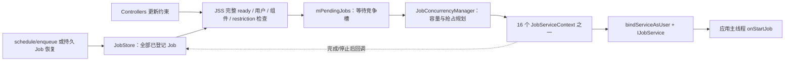
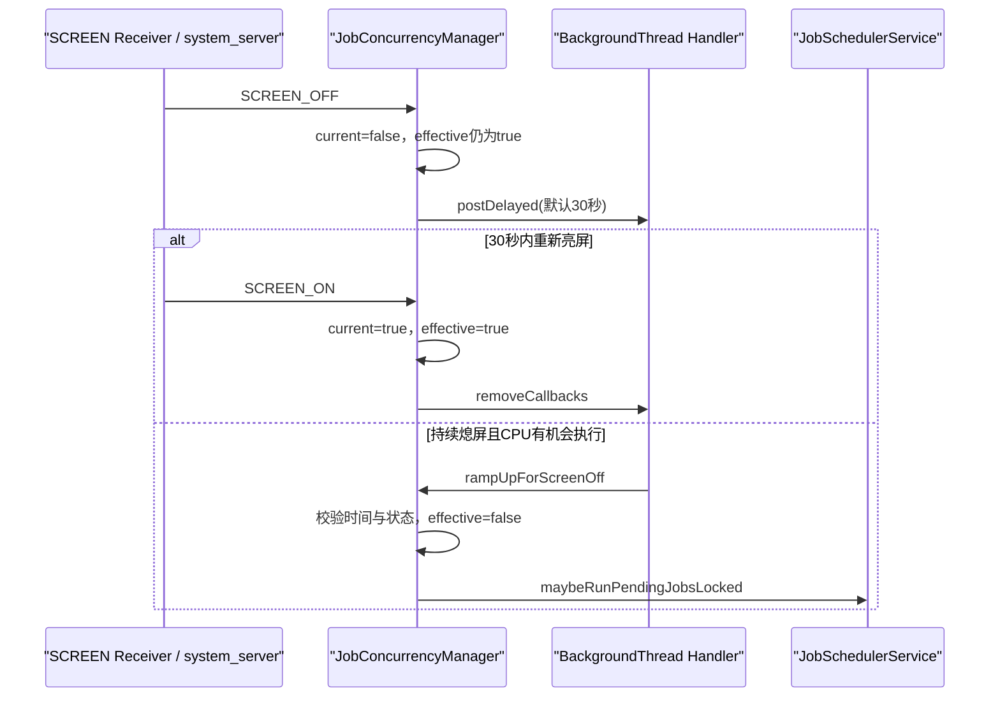
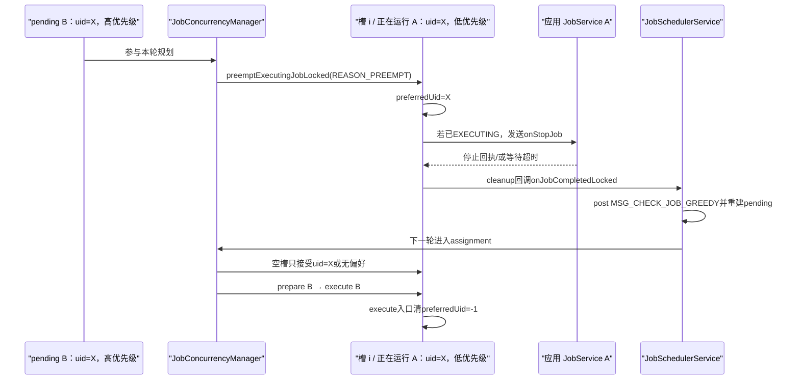
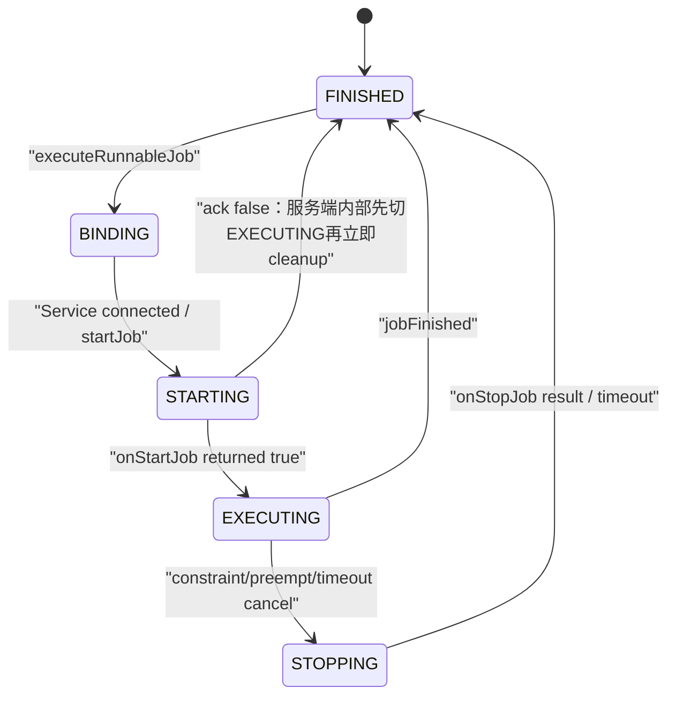
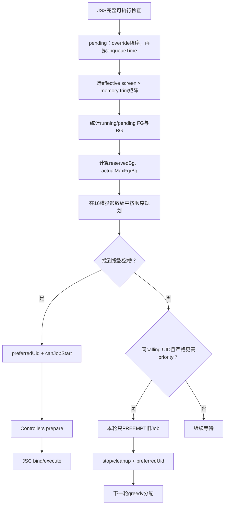

# 131 Android JobConcurrencyManager：Pending 队列、动态并发与同 UID 抢占

> 源码版本：Android 11 / API 30 / `android-11.0.0_r48`  
> 学习方式：macOS 只读源码，不要求编译、不要求连接设备  
> 前置章节：第 43、121—130 章

---

## 1. 本章研究“已经 ready，为什么还没有运行”

前几章已经把 Job 的约束拆得很细：网络、电量、时间、存储、idle、Doze、后台限制与 quota 都可能挡住 `JobStatus.isReady()`。

但即使一个 Job 已经完整 ready，它也不一定马上进入应用的 `onStartJob()`。还要经过最后一层资源竞争：

```text
ready Job
→ 进入 mPendingJobs
→ JobConcurrencyManager 规划执行槽
→ JobServiceContext 绑定应用服务
→ 应用主线程收到 onStartJob()
```

本章的核心问题不是“约束是否满足”，而是：

> 当多个 ready Job 同时争夺有限执行槽时，Android 11 怎样决定能再启动几个、启动谁，以及是否抢占已有 Job。

---

## 2. 先固定版本：r48 没有新版 WorkType 模型

在本仓库搜索：

```bash
rg -n '\bWorkType\b|\bWORK_TYPE_' frameworks/base/apex/jobscheduler
```

预期没有与并发 `WorkType` 有关的匹配。这里刻意加单词边界和下划线，避免把 `NETWORK_TYPE` 之类的无关符号误判成新版并发模型。

Android 11 r48 的并发模型是：

```text
16 个固定 JobServiceContext 物理槽
+ FG / BG 两类计数
+ total / maxBg / minBg 三个策略值
```

后续 Android 版本出现的多 WorkType、expedited job、TOP/EJ/FGS/BGUSER 等模型不能直接套回本章。读网上文章时，第一步必须先核对源码版本。

---

## 3. 本章要回答什么

1. `JobStore`、`mPendingJobs`、`mActiveServices` 与应用 `JobService` 分别是什么？
2. 为什么“有16个槽”不等于“默认同时运行16个 Job”？
3. 屏幕开关与内存 trim 怎样选择并发矩阵？
4. `mPendingJobs` 是否按 Job priority 排序？
5. JCM 所说的 FG Job 为什么不等于前台服务 Job？
6. `total/maxBg/minBg` 怎样变成实际 FG/BG 上限？
7. 分配为何分成“投影规划”和“应用到真实槽”两阶段？
8. 哪些 Job 可以抢占，为什么只允许同 calling UID？
9. `preferredUid` 是永久保留槽位吗？
10. `prepareForExecutionLocked()` 与 `executeRunnableJob()` 谁先发生？

---

## 4. 源码地图

并发主算法：

```text
frameworks/base/apex/jobscheduler/service/java/com/android/server/job/JobConcurrencyManager.java
```

队列、配置、优先级与触发入口：

```text
frameworks/base/apex/jobscheduler/service/java/com/android/server/job/JobSchedulerService.java
frameworks/base/apex/jobscheduler/service/java/com/android/server/job/controllers/JobStatus.java
frameworks/base/apex/jobscheduler/service/java/com/android/server/job/JobPackageTracker.java
```

真实执行槽与应用回调：

```text
frameworks/base/apex/jobscheduler/service/java/com/android/server/job/JobServiceContext.java
frameworks/base/apex/jobscheduler/framework/java/android/app/job/IJobService.aidl
frameworks/base/apex/jobscheduler/framework/java/android/app/job/JobServiceEngine.java
```

测试与 dump schema：

```text
frameworks/base/services/tests/servicestests/src/com/android/server/job/JobCountTrackerTest.java
frameworks/base/services/tests/servicestests/src/com/android/server/job/PrioritySchedulingTest.java
frameworks/base/core/proto/android/server/jobscheduler.proto
```

---

## 5. 先分清四种“容器”

| 容器 | 保存什么 | 是否等于正在执行 |
|---|---|---|
| `JobStore mJobs` | 系统当前登记的 JobStatus 全集 | 否 |
| `ArrayList mPendingJobs` | 已被挑出、准备竞争执行槽的 Job | 否 |
| `List mActiveServices` | 固定的16个 JobServiceContext 对象 | 否，空槽也在列表里 |
| 应用 `JobService` | 真正执行业务回调的组件实例 | 只有 Binder/主线程回调到达后才是应用执行 |

“scheduled”“ready”“pending”“context 已占用”“应用已进入 `onStartJob()`”是五个不同完成点。

---

## 6. 一张总链图



JCM 不重新计算每种业务约束。它接收 JSS 已经放进 pending 的候选者，解决最后的“有限执行资源怎样分配”。

---

## 7. 16 是物理槽上限

JSS 定义：

```java
static final int MAX_JOB_CONTEXTS_COUNT = 16;
```

到 `PHASE_THIRD_PARTY_APPS_CAN_START` 才一次创建：

```java
for (int i = 0; i < MAX_JOB_CONTEXTS_COUNT; i++) {
    mActiveServices.add(new JobServiceContext(...));
}
```

这些 context 之后循环复用，正常运行时不会随内存状态增删对象。

---

## 8. `mActiveServices` 这个名字容易误导

它始终保存16个 context，包括：

```text
空闲槽：getRunningJobLocked() == null
绑定中：BINDING
启动回执等待中：STARTING
执行中：EXECUTING
停止回执等待中：STOPPING
```

因此：

```text
mActiveServices.size() == 16
```

不能推出当前有16个 Job 正在执行。真实占用要逐槽看 `getRunningJobLocked()`。

---

## 9. 物理槽与策略容量是两层上限

可以把它想成停车场：

```text
物理车位：最多16个，代码对象固定存在
当日开放车位：由屏幕状态、内存压力和配置决定，常见为5、8或10
```

即使还有空 context，只要 `JobCountTracker.canJobStart()` 判 false，也不能启动新 Job。

反过来，配置变小后已有 Job 数超过新策略上限，也不会只因“超额”立即被清掉；策略主要限制后续新增。

---

## 10. r48 默认并发矩阵

每格写成：

```text
total / maxBg / minBg
```

| effective 屏幕状态 | NORMAL | MODERATE | LOW | CRITICAL |
|---|---:|---:|---:|---:|
| screen ON | 8 / 6 / 2 | 8 / 4 / 2 | 5 / 1 / 1 | 5 / 1 / 1 |
| screen OFF | 10 / 6 / 2 | 10 / 4 / 2 | 5 / 1 / 1 | 5 / 1 / 1 |

这些是 `android-11.0.0_r48` 基线默认值，可被 `Settings.Global.JOB_SCHEDULER_CONSTANTS` 覆盖，不应写成所有设备永恒不变的硬件能力。

---

## 11. 三个配置值分别是什么

```text
total
  本轮允许的 FG+BG 总策略容量

maxBg
  BG 同时运行的策略上限

minBg
  有 BG 候选时，算法尽量为 BG 保留的软容量
```

`minBg` 不是“系统必须随时运行这么多个后台 Job”，也不是一个独立进程池。

它只参与本轮 `actualMaxFg/actualMaxBg` 计算。

---

## 12. 配置 key 与钳位

例如 screen-on + normal：

```text
max_job_total_on_normal
max_job_max_bg_on_normal
max_job_min_bg_on_normal
```

screen off 或其他 trim level 使用对应的 `off/moderate/low/critical` 后缀组合。

解析后还会钳位：

```text
total：1 ～ 16
maxBg：1 ～ total
minBg：至少0，至多maxBg，并且严格小于total
```

所以配置字符串不能突破16个物理 context，也不能构造 `minBg > maxBg` 的有效状态。

---

## 13. 屏幕状态有 current 与 effective 两份

JCM 保存：

```text
mCurrentInteractiveState
  当前 PowerManager/SCREEN_ON/OFF 观察到的交互状态

mEffectiveInteractiveState
  当前选择 on/off 并发矩阵时使用的状态
```

屏幕亮起时两者立即为 true；屏幕熄灭时 current 立即 false，effective 默认继续保持 true 30 秒。

---

## 14. 为什么屏幕熄灭后不立即提升并发

默认延迟配置：

```java
screen_off_job_concurrency_increase_delay_ms = 30_000;
```

从这段延迟与亮屏取消逻辑可以推断，它让系统先确认屏幕确实持续关闭，再扩大后台并发，从而减少短暂灭屏/亮屏时的容量抖动；这是基于实现的设计意图解释，不是额外的调度保证。

30 秒后才：

```text
mEffectiveInteractiveState=false
→ maybeRunPendingJobsLocked()
→ 用 screen-off 矩阵重新分配
```

---

## 15. 屏幕状态时间线



屏幕亮起不需要反向等待，立即回到 screen-on 配置。

---

## 16. 这不是 wakeup alarm

延迟使用：

```java
BackgroundThread.getHandler().postDelayed(...)
```

不是 AlarmManager wakeup alarm。Handler 本身不会为了扩大并发把休眠设备唤醒；CPU 有机会继续运行时才处理消息。

源码注释的假设是：若有 pending Job，通常也有运行中的 Job 维持设备工作。但这不是一条“30秒整必定唤醒并启动”的承诺。

---

## 17. 不是每个 trim level 都会在熄屏后提升

看默认矩阵：

```text
NORMAL：8 → 10
MODERATE：8 → 10
LOW：5 → 5
CRITICAL：5 → 5
```

所以方法名/注释里的“increase concurrency”是常见目标，不是所有内存状态的必然数值变化。LOW/CRITICAL 下 screen on/off 默认完全相同。

---

## 18. 开机时本来就是灭屏的边界

两个 boolean 的 Java 初值都是 false。`onSystemReady()` 调：

```java
onInteractiveStateChanged(mPowerManager.isInteractive());
```

若此时设备本就不 interactive，传入 false 与 current 初值相同，方法直接 return，effective 也保持 false。

因此这种启动场景直接使用 off 矩阵，不额外等待30秒。30秒延迟针对运行期间观察到的 ON→OFF 转换。

---

## 19. 内存压力怎样进入选择

每次 assignment 前：

```text
updateMaxCountsLocked()
→ refreshSystemStateLocked()
→ ActivityManager.getService().getMemoryTrimLevel()
```

结果映射到：

```text
ADJ_MEM_FACTOR_NORMAL
ADJ_MEM_FACTOR_MODERATE
ADJ_MEM_FACTOR_LOW
ADJ_MEM_FACTOR_CRITICAL
```

再与 effective screen on/off 组合，选出上表的一格。

---

## 20. 内存 trim 查询最多每秒刷新一次

JCM 用 uptime 节流昂贵查询：

```java
SYSTEM_STATE_REFRESH_MIN_INTERVAL = 1000;
```

在下一刷新时刻之前重复 assignment，会沿用 `mLastMemoryTrimLevel`。因此它不是每次分配都一定跨 Binder 获取新值，而是“最多每1秒刷新一次”。

查询前先把字段置 NORMAL；若 Binder 抛 `RemoteException`，本轮回退 NORMAL。

---

## 21. JCM 没有单独监听 trim 变化

这里没有注册“内存从 NORMAL 变 LOW”后立即回调 JCM 的 listener。新值要等下一次 assignment 时读取。

所以内存压力变化本身不会通过 JCM：

- 立即唤起一次分配；
- 立即停止现有 Job；
- 动态删除 JobServiceContext。

它改变的是下一次分配使用的策略容量。真正的进程回收、OOM 调整属于 AMS/lmkd 等其他链路。

---

## 22. 配置或 trim 收紧不会自动压停已有 Job

假设原来运行8个 Job，随后矩阵变成 total=5。

JCM 会统计到已有运行数，但没有“因为 8>5 就任选3个停止”的循环。`canJobStart()` 会阻止更多空槽启动；同 UID 严格高优先级替换仍可能发生，因为替换不增加同时运行数。

约束丢失、Doze、后台限制或 JobRestriction 导致的停止由 JSS 另行处理，不能与并发上限收紧混为一谈。

---

## 23. `mPendingJobs` 到底是什么

JSS 注释把它定义为：

```text
JobServiceContext 将从中取得 Job 去执行的 pending queue
```

它不是：

- 所有已 schedule Job；
- 所有 persisted Job；
- 所有未来某天会 ready 的 Job；
- 应用 API `getAllPendingJobs()` 名称所指的完整存储概念。

本章里的 `mPendingJobs` 是 system_server 内部“已经挑出、准备竞争槽”的短期队列。

公共 API 的 `getAllPendingJobs()` / `getPendingJob()` 虽然也叫 pending，r48 服务端实际从 `JobStore.getJobsByUid()` 返回调用 UID 已登记的 JobInfo；它不是把内部 `mPendingJobs` 原样暴露给应用。这是同名 API 与内部调度态之间的版本语义差异。

---

## 24. Job 怎样进入 pending

常见两条路径：

```text
新 schedule 的 Job 已完整可执行
→ 直接 addOrderedItem()
→ maybeRunPendingJobsLocked()

Controller 状态变化
→ JSS Main Handler 收到 CHECK/GREEDY/EXPIRED
→ 扫描 JobStore
→ 把当前可执行 Job 加入 pending
```

`isReadyToBeExecutedLocked()` 除 `job.isReady()` 外，还检查 Job 仍在 Store、相关用户已启动、source UID 不在备份、无 JobRestriction、未 pending/active，以及目标 Service 仍可用。

---

## 25. 普通检查还可能先批处理

当 `mReportedActive=false` 时，普通 `MSG_CHECK_JOB` 走 `maybeQueueReadyJobsForExecutionLocked()`：

- 非 RESTRICTED Job 中，ACTIVE bucket、失败重试等可不受普通 non-ACTIVE 凑批规则等待；
- 非 ACTIVE ready Job 默认可能凑到5个；
- 某个 Job 累计被 force-batch 达到默认31分钟后，**下一次普通检查**不再因为这条 non-ACTIVE 凑批规则继续等待；
- RESTRICTED Job 始终属于 force-batched 一组。

这里的31分钟是 `MAX_NON_ACTIVE_JOB_BATCH_DELAY_MS` 的默认阈值，不是 Alarm 或 Handler 的准点唤醒期限：源码只在以后再次进入 `maybeQueueReadyJobsForExecutionLocked()` 时比较时间，所以不能理解成“第31分钟一定自动运行”。这一步决定“本次检查是否进入 pending”；JCM 只决定“进入 pending 后能否获得槽”。两层不要合并。

---

## 26. pending 队列不按 priority 排序

精确 comparator：

```java
if (o1.overrideState != o2.overrideState) {
    return o2.overrideState - o1.overrideState;
}
return Long.compare(o1.enqueueTime, o2.enqueueTime);
```

也就是：

1. shell/debug override 更高的排前；
2. 然后按 `enqueueTime` 更早的排前；
3. comparator 没有比较 `lastEvaluatedPriority`。

“高 priority 一定排在 pending 队首”在 r48 是错误结论。

---

## 27. `enqueueTime` 与 `madePending` 也不同

```text
enqueueTime
  Job 开始被 JSS tracking 时记录的 elapsed realtime；用于 pending 排序

madePending
  JobPackageTracker 在真正进入 pending 时记录的 uptime；用于统计等待时长
```

名字都像“入队时间”，但时钟、写入时机和用途不同。排序读的是 `enqueueTime`，不是 `madePending`。

---

## 28. override 排前不等于绕过完整 ready 门

debug override 只影响普通约束比较和 pending comparator。Job 在进入 pending 前仍要通过 JSS 的外层资格，例如：

```text
quota/dynamic
not-dozing
background-not-restricted
NEVER bucket
用户与组件有效
JobRestriction
```

所以“FULL override 排第一”描述的是已经成为候选后的队列顺序，不是强制越过所有系统门。

---

## 29. 优先级何时计算

assignment 第一遍遍历 pending：

```java
final int priority = mService.evaluateJobPriorityLocked(pending);
pending.lastEvaluatedPriority = priority;
```

随后用这个保存值做 FG/BG 分类。

优先级不是 pending comparator 的排序字段，而主要用于：

- 本轮 FG/BG 类别；
- 同 UID 运行 Job 的抢占比较；
- dumpsys 与统计。

---

## 30. `evaluateJobPriorityLocked()` 的精确顺序

可读成：

```text
若 Job 自身 priority >= BOUND_FOREGROUND_SERVICE(30)
  → 直接使用自身值，再做负载调整
否则若 source UID 有 proc-state priority override
  → 使用 override，再做负载调整
否则
  → 使用 Job 自身值，再做负载调整
```

JSS 的 UID override 来自自己的 proc-state observer：TOP→40、FGS→35、BFGS→30。它不是上一章 `JobStatus.uidActive` 字段。

---

## 31. 包的 active+pending 占用比例还会降低 priority

若当前 priority 小于 TOP_APP(40)：

```text
JobPackageTracker load factor >= HEAVY_USE_FACTOR    → -80
否则 >= MODERATE_USE_FACTOR                          → -40
```

TOP=40 不做这项下调。

这里的 load factor 是 `JobPackageTracker` 对当前与上一统计 DataSet 中“active 时间 + pending 时间”占总观察时间的比例，不是单纯的运行中负载，更不是 CPU 使用率或电池耗电百分比。两个阈值默认分别为 `0.9` 和 `0.5`，但可由 `JOB_SCHEDULER_CONSTANTS` 的 `heavy_use_factor`、`moderate_use_factor` 调整；因此它们是 r48 默认值，不是不可变常量。

因此 priority 是“Job 声明/内部值 + source UID 当前状态 + JobScheduler 自己观察到的 active/pending 负载”的合成结果，不只是 Builder 中一个整数。

---

## 32. JCM 的 FG 实际只认 TOP 类

```java
private boolean isFgJob(JobStatus job) {
    return job.lastEvaluatedPriority >= JobInfo.PRIORITY_TOP_APP;
}
```

r48 常量：

```text
BOUND_FOREGROUND_SERVICE = 30
FOREGROUND_SERVICE       = 35
TOP_APP                  = 40
```

所以并发计数里的：

```text
FG = evaluated priority >= 40
BG = 其余所有值
```

前台服务来源的35、绑定前台服务的30，在 JCM 二分类中仍是 BG。这里的 FG 是算法术语，不是组件类型。

---

## 33. 运行 Job 的类别是启动时快照

统计已有运行 Job 时，JCM 直接读：

```text
status.lastEvaluatedPriority
```

不会先为每个 running Job 重写该字段。若 source UID proc-state 后来变化，它在本轮 running FG/BG 计数中可能仍保留启动前评估结果。

但寻找抢占候选时，代码会对 running Job 重新调用 `evaluateJobPriorityLocked()`。因此：

```text
并发类别计数：保存值快照
抢占高低比较：当前重新计算值
```

这是两个不同时间语义。

---

## 34. JobCountTracker 需要哪些输入

设：

```text
T    = 配置 maxTotal
Bmax = 配置 maxBg
Bmin = 配置 minBg
RF   = 已运行 FG 数
RB   = 已运行 BG 数
PF   = pending FG 数
PB   = pending BG 数
```

Tracker 先统计 running，再统计不与 running 重复的 pending，之后才计算本轮实际上限。

---

## 35. JobCountTracker 的精确公式

```text
reserve0    = min(Bmin, RB + PB)
reservedBg  = min(reserve0, T - RF)

maxFg0      = T - max(RB, reservedBg)
actualMaxFg = min(maxFg0, RF + PF)

maxBg0      = min(Bmax, T - actualMaxFg)
actualMaxBg = min(maxBg0, RB + PB)
```

新启动门：

```text
FG：RF + startingFG < actualMaxFg
BG：RB + startingBG < actualMaxBg
```

`startingFG/BG` 是本轮规划到真实空槽、尚未实际调用 execute 的数量。

---

## 36. 手算例一：为什么是4个 FG + 2个 BG

给定：

```text
T/Bmax/Bmin = 6/4/2
RF/RB       = 0/0
PF/PB       = 10/3
```

计算：

```text
reserve0    = min(2, 3) = 2
reservedBg  = min(2, 6) = 2
maxFg0      = 6 - max(0, 2) = 4
actualMaxFg = min(4, 10) = 4
maxBg0      = min(4, 6 - 4) = 2
actualMaxBg = min(2, 3) = 2
```

本轮最多规划：

```text
4 FG + 2 BG
```

这与 `JobCountTrackerTest.testBasic()` 的例子一致。

---

## 37. `minBg` 为什么只是软预留

同样配置 `6/4/2`，若已经有6个 FG 正在运行，另有 BG pending：

```text
reservedBg = min(2, 6 - 6) = 0
```

算法不会为了兑现 `minBg=2` 主动抢占两个 FG。结果是 BG 仍然等槽。

因此 `minBg` 的准确含义是：

> 在本轮仍有可分配总容量时，尽量别让新的 FG 把 BG 机会全部吃完。

它不是对 running FG 的硬性驱逐规则。

---

## 38. actual max 会随候选构成变化

`actualMaxFg` 和 `actualMaxBg` 不只是配置常量，还受：

```text
当前已经运行多少 FG/BG
本轮究竟有多少 pending FG/BG
```

影响。

若只有1个 FG 候选，算法不会为了“凑满 FG 上限”虚构 Job；剩余容量可在 `maxBg` 允许范围内给 BG。反之，BG 数量不足时也不会空造保留任务。

---

## 39. assignment 为什么分两阶段

JCM 没有一边遍历 pending、一边立刻修改所有真实 context，而是：

```text
阶段一：把真实槽复制成投影数组，在数组里完成整轮规划
阶段二：根据 slotChanged，把最终规划应用到真实 JobServiceContext
```

这样后面的 pending Job 可以看到前面已经占用的“规划后槽位”，避免多个候选都以为自己拿到了同一个空槽。

整个过程仍在 JSS `mLock` 下，不是多个线程并行做无锁调度。

---

## 40. 三个复用数组分别做什么

```text
contextIdToJobMap[16]
  每个槽最终计划放哪个 Job

slotChanged[16]
  该槽的投影是否相对真实状态发生变化

preferredUidForContext[16]
  抢占后该槽短期偏好的 calling UID 快照
```

数组放在成员字段里循环复用，是为了减少频繁 assignment 的 GC churn，不代表结果跨轮永久有效。

---

## 41. 规划前先排除“已经运行”的重复候选

无论 pending 怎样构建，JCM 都防御性地检查候选是否已经占用 context；这也覆盖快速重评、队列状态变化等时序下可能出现的重复视野。它用：

```java
findJobContextIdFromMap(pending, contextIdToJobMap)
```

按 `(callingUid, jobId)` 的 `matches()` 找是否已有运行槽；找到就跳过计数和再次分配。

这是一道防重复执行门。不能仅看到 pending list 中有对象，就断言系统会为它再绑定一个 JobServiceContext。

---

## 42. 每个 pending Job 怎样寻找槽

按 pending comparator 顺序，候选依次扫描16个投影槽：

```text
遇到空槽
  → preferredUid允许？
  → canJobStart(FG/BG)允许？
  → 是则选择第一个可用空槽

遇到非空槽
  → 是否同 calling UID？
  → running priority 是否严格更低？
  → 是则记录为抢占候选
```

若同 UID 有多个可抢占槽，最终选择当前 priority 最低的那个。

---

## 43. 空槽启动必须同时过两道门

```java
preferredUidOkay && mJobCountTracker.canJobStart(isPendingFg)
```

第一道门是抢占后的短期槽位亲和；第二道门是 FG/BG 本轮实际容量。

因此“槽在物理上为空”仍不等于它现在对任意 Job 开放。

---

## 44. 抢占只发生在同 calling UID

核心判断：

```java
if (job.getUid() != nextPending.getUid()) {
    continue;
}
```

`JobStatus.getUid()` 返回 calling UID，不是 `getSourceUid()`。

所以：

- 普通应用为自己 schedule 时，两者通常相同；
- `scheduleAsPackage()` 时可能不同；
- priority override 按 source UID；
- 抢占与 preferred affinity 按 calling UID。

身份字段必须沿每条公式分别追，不能笼统写“按 UID”。

---

## 45. 为什么不允许跨 UID 抢占

从实现效果看，若任意 UID 的高 priority Job 都能踢掉其他 UID 的低 priority Job，一个持续制造高 priority 工作的调用者会扩大跨应用干扰与饥饿风险。源码没有在此处写出完整设计论证，下面是依据实际规则作出的公平性解释。

r48 选择更保守的规则：

```text
同 calling UID 内
  允许更重要的新 Job替换该 UID自己的低优先级 Job

不同 calling UID间
  不通过 priority 抢占，等待正常容量释放
```

这是公平性边界，不代表不同 UID 的业务优先级完全相等；它们仍受 pending 顺序、FG/BG容量和其他系统政策影响。

---

## 46. 必须“严格更高”才抢占

```java
if (jobPriority >= nextPending.lastEvaluatedPriority) {
    continue;
}
```

所以：

```text
pending priority > running priority → 可成为候选
pending priority = running priority → 不抢
pending priority < running priority → 不抢
```

同优先级只按 pending/完成后的正常槽位周转，不会互相强制打断。

---

## 47. 抢占不受 `canJobStart()` 限制的原因

抢占路径没有调用 FG/BG 新启动门，因为本意是：

```text
停止一个已有 Job
以后在同一个槽启动另一个 Job
```

最终同时运行数并不增加。

但“以后”很关键：r48 并不会在本轮同步把新 Job 塞进仍在停止中的槽。

---

## 48. 规划数组不是立即执行结果

第一阶段把：

```text
contextIdToJobMap[i] = nextPending
slotChanged[i] = true
```

只表示“最终希望槽 i 给这个候选”。

此时真实 `JobServiceContext` 可能仍在运行旧 Job，应用也完全没有收到新任务。日志或调试时要分清投影 map 与真实 context。

---

## 49. 第二阶段遇到真实忙槽：只发抢占停止

```java
if (activeServices.get(i).getRunningJobLocked() != null) {
    activeServices.get(i).preemptExecutingJobLocked();
    preservePreferredUid = true;
}
```

本轮不会接着执行投影中的替代 Job。旧 Job 要先经过取消状态机、可能的 `onStopJob()`、回执或 timeout、cleanup 和完成回调。

替代 Job 仍保留在 pending，等下一轮分配。

---

## 50. 抢占完成为什么要再跑一轮

旧 Job 清理时，JSS `onJobCompletedLocked()` 最后发送：

```text
MSG_CHECK_JOB_GREEDY
```

下一轮才看到：

```text
真实槽已经空闲
+ preferredUid 指向旧 Job 的 calling UID
+ 高优先级替代 Job仍在 pending
```

然后它才可能真正启动。

---

## 51. preferredUid 的完整时序



这是一种短期 affinity，目的是让刚被抢占出来的槽优先服务同一 calling UID。

---

## 52. preferredUid 不是永久资源保留

如果下一轮没有该 UID 的可运行 Job，其他 UID 会因 preferred 不匹配而跳过这个空槽；本轮应用阶段末尾在无需继续保留时会：

```java
clearPreferredUid();
```

下一轮槽又向其他 UID 开放。

所以它不是：

- UID 专属线程池；
- 跨多轮的容量配额；
- 永久的公平权重。

---

## 53. 抢占 reason 与是否重排是两回事

JSC 设置：

```text
JobParameters.REASON_PREEMPT
```

若旧 Job 已在 EXECUTING，会进入应用 `onStopJob()`；应用返回 true 才请求失败式 reschedule，返回 false 则不要求重排。

因此：

```text
被抢占
≠ 旧 Job 自动保证再次执行
```

而且若仍处 BINDING/STARTING，取消只先标记，回调路径也与 EXECUTING 不同。第132章会专门展开。

---

## 54. 第二阶段遇到真实空槽：先 prepare

真实槽为空时，JCM 先对所有 Controller 调：

```java
controllers.get(ic).prepareForExecutionLocked(pendingJob);
```

再调：

```java
executeRunnableJob(pendingJob);
```

例如：

- QuotaController 开始记录 TOP-started 或 package timer；
- ContentObserverController 把本轮聚合 URI/authority 转移为执行快照。

“获得槽”不只是一条 bind 调用，Controller 还要先完成执行前交接。

---

## 55. execute 的第一步也还不是 `onStartJob()`

`executeRunnableJob()` 会：

1. 检查 context available；
2. 清 preferred UID；
3. 建立新的 `JobCallback` 与 `JobParameters`；
4. 保存 deadline、URI、authority、network 快照；
5. 进入 `VERB_BINDING` 并挂18秒 timeout；
6. `bindServiceAsUser()`。

只有 Service 真正连接后，才经 `IJobService.startJob()` 到应用。

---

## 56. bind 请求被接受后才记统计 active，但槽更早已被占用

JSC 在调用 `bindServiceAsUser()` **之前**就把 `mRunningJob` 指向当前 Job。因此从 JobScheduler 自己的活动槽判断看，这个 context 已经被占用；不能把这段窗口描述成“空槽”。

`bindServiceAsUser()` 返回 true 只代表系统接受了绑定请求，并不代表 Service 已连接。这个返回值为 true 后，JSC 才：

- `JobPackageTracker.noteActive(job)`；
- 写 statsd/BatteryStats/UsageStats；
- `mAvailable=false`。

ServiceConnection 到来时又创建 PARTIAL_WAKE_LOCK，并将 WorkSource 归因到 source UID，然后进入 STARTING。

这解释了为何“从 pending 移除”“bind 请求被接受”“Service 已连接”“应用开始执行”仍是不同时间点。

---

## 57. bind 立即失败的 r48 边界

若 `bindServiceAsUser()` 返回 false 或抛 SecurityException：

```text
JSC 清 mRunningJob/callback/params
恢复 FINISHED
executeRunnableJob() 返回 false
```

但 JCM 随后仍执行：

```java
pendingJobs.remove(pendingJob);
tracker.noteNonpending(pendingJob);
```

JobStatus 没从 JobStore 删除，但也不会“原地留在 pending”。后续是否再次入队依赖新的 JSS 检查。并且 Controller 的 `prepareForExecutionLocked()` 已经先发生；这个 false 分支不调用 completed listener，r48 `StateController` 也没有与 prepare 对称的统一 rollback/unprepare 回调。因此最稳妥的结论只是“它不是一次正常完成，定义仍在 Store 等待后续检查”，不能假定所有 Controller 的准备状态已经被事务性回滚。

这是 r48 值得记录的失败边界，不能把 execute 返回 false 想成事务性回滚到原 pending 状态。

---

## 58. JSC 五态只作本章接口预览



r48 固定超时：

```text
BINDING：18秒
STARTING/STOPPING 回执：8秒
EXECUTING timeslice：10分钟
```

10分钟从 `onStartJob(true)` 的 start ack 被服务端处理后重新计时，不包含前面的 BINDING/STARTING；它不是“从 bind 请求到最终 cleanup 总共只能10分钟”。

本章只关心“槽何时真正释放”；Binder token、竞态与每条 timeout 后果留到第132章。

---

## 59. 约束停止与 priority 抢占要分开

```text
约束/隐式门/JobRestriction 失效
  JSS stopNonReadyActiveJobsLocked 或 restriction 检查决定停止

同 UID更高 priority pending Job
  JCM preemptExecutingJobLocked 决定抢占
```

两者最后都进入 JSC cancel 状态机，但：

- 触发原因不同；
- stop reason 不同；
- replacement 槽位 affinity 只属于 PREEMPT；
- “并发不足”本身不会随意停止跨 UID Job。

---

## 60. pending 顺序如何影响分配结果

JCM 按 pending 数组从前向后规划，较早候选先看见空槽和容量。

因为 comparator 先看 override、再看 tracking `enqueueTime`，所以普通无 override Job 大体体现“更早被系统登记的候选先规划”，不是全局严格 priority queue。

priority 较高的 Job若没有同 UID可抢占对象，也可能排在较早普通 Job之后继续等待。

---

## 61. 同一轮投影会影响后续候选

前一个 pending 拿到空槽后：

```text
contextIdToJobMap[slot] = 前一个Job
startingFG/BG++
```

后一个 pending 再扫描时：

- 该槽已在投影视角中非空；
- `canJobStart()` 已计入前一个 starting；
- 若同 UID且更高 priority，甚至可能改写前一个投影。

因此这不是“每个候选独立算一次再合并”，而是一轮有顺序的贪心规划。

---

## 62. 抢占投影的一个微妙结果

若后面的更高优先级 Job 改写前面已经规划的同 UID 候选槽，最终应用阶段只看最后的 `contextIdToJobMap`。

这正是先完整规划、再应用的价值：系统不会先启动较低候选，马上又为后面的更高候选停止它。

但算法仍是按队列顺序的局部贪心，不应泛化成对所有 Job 做全局最优数学匹配。

---

## 63. 为什么运行数可能暂时超过新 actual max

Tracker 的 `toString()` 会在超出配置/actual max 时显示 `*`。这不必然是 bug：

- 配置或内存状态刚收紧；
- running category 快照与当前 priority 已变化；
- `minBg` 软预留不能驱逐已有 FG；
- 正处在异步停止/清理阶段。

并发策略是启动准入与有限同 UID抢占，不是每次都强制把现状瞬间投影成矩阵精确数字。

---

## 64. 线程模型不能简化成“只在主线程”

常见路径确实是 JSS Main `JobHandler`：Controller 发消息，Handler 持 `mLock` 重建 pending 并 assignment。

但还有：

- schedule Binder 入口可持锁直接把立即 ready Job 入队并运行；
- screen-off ramp Runnable 在 system_server `BackgroundThread` 持锁调用；
- 应用 `IJobCallback` 可从 system_server Binder 线程持锁完成清理；
- JSC timeout 与默认 ServiceConnection 使用 system_server 主 Looper。

正确不变量是共享状态受 JSS `mLock` 串行化，而不是所有入口都来自同一线程。

---

## 65. 锁内还有一次受节流的 Binder 查询

assignment 在 `mLock` 内通过 `IActivityManager` 接口调用：

```java
ActivityManager.getService().getMemoryTrimLevel()
```

AMS 与 JSS 在本版本都位于 system_server，因此本地 Binder 接口通常会在同进程短路执行，不能误画成必然跨进程 IPC；但它仍是在 JSS 锁内进入另一个服务的同步查询。阅读性能 trace 时，如果 assignment 偶发变慢，需要把 `refreshSystemState` 单独观察，不能只盯数组循环。

`StatLogger` 正好分别记录：

```text
assignJobsToContexts
refreshSystemState
```

---

## 66. dumpsys 怎样区分三层状态

```bash
adb shell dumpsys jobscheduler
```

有设备时重点看：

```text
Pending queue
  当前候选、Evaluated priority、Enq

Active jobs / Slot #
  16个真实 context 的空闲/运行、时长与 timeout

Concurrency
  current/effective screen、最后开关屏、JobCountTracker、memory trim、统计耗时
```

Mac 纯源码学习无需执行 adb；这里只是建立将来读输出的字段地图。

---

## 67. `Current max jobs` 不是配置文件原值抄写

Concurrency dump 中的 `JobCountTracker` 同时展示：

- 本轮选中的配置 total/maxBg/minBg；
- running/pending/starting 统计；
- 计算后的 actual max；
- reserved BG；
- 超额 `*` 标记。

它是最近一次 assignment 的计算快照。若系统很久没有再分配，不能把它误当成每毫秒实时刷新值。

---

## 68. 常见误解一：Android 11 默认可并行16个 Job

错误。16只是固定物理 context 上限；默认策略容量按屏幕/trim 常为5、8或10，并继续受 FG/BG 实际容量限制。

---

## 69. 常见误解二：pending 就是所有 schedule 的 Job

错误。全量定义在 JobStore；pending 只是已被挑出竞争槽的短期候选集合。

---

## 70. 常见误解三：pending 按 priority 从高到低

错误。r48 comparator 先看 debug override，再看 tracking `enqueueTime`。priority 主要用于类别和同 UID抢占。

---

## 71. 常见误解四：JCM 的 FG 就是前台服务

错误。这里只认 evaluated priority >= TOP_APP(40)；FGS=35、BFGS=30 都归 BG 类。

---

## 72. 常见误解五：`minBg=2` 保证始终运行2个 BG

错误。它只是新分配时的软预留，受实际 BG 候选、已有 FG、总容量和空槽影响，不会为兑现数字主动抢占已有 FG。

---

## 73. 常见误解六：内存变 LOW 会立刻停止超额 Job

错误。JCM 在下一次 assignment 读取 trim，主要阻止新增；不因矩阵缩小单独压停已有 Job。

---

## 74. 常见误解七：高 priority 可踢掉任何应用 Job

错误。r48 priority preemption 只比较相同 `getUid()`，即 calling UID，并且必须严格更高。

---

## 75. 常见误解八：抢占后替代 Job 在同一调用栈立即启动

错误。本轮只停止旧 Job并保存 preferred UID；cleanup 后的下一轮才可能在空槽启动替代者。

---

## 76. 常见误解九：preferred UID 永久占住一个槽

错误。它是抢占后的短期 affinity；无合适候选时会清除，execute 新 Job入口也会清除。

---

## 77. 常见误解十：bind false 会把 Job 原样留在 pending

错误。r48 JCM 仍把它从 pending 移除，JobStore 定义尚在，等待后续其他检查才可能重新入队；prepare 已发生且没有统一回滚回调。

---

## 78. macOS 只读练习一：确认物理槽与默认矩阵

```bash
rg -n "MAX_JOB_CONTEXTS_COUNT|MAX_JOB_COUNTS_SCREEN_ON|MAX_JOB_COUNTS_SCREEN_OFF|SCREEN_OFF_JOB" \
  frameworks/base/apex/jobscheduler/service/java/com/android/server/job/JobSchedulerService.java
```

回答：

1. 16在哪里定义、在哪里创建？
2. NORMAL 下 screen on/off 各是多少？
3. LOW 下为何熄屏没有默认提升？

---

## 79. macOS 只读练习二：手算 Tracker

```bash
sed -n '538,680p' \
  frameworks/base/apex/jobscheduler/service/java/com/android/server/job/JobConcurrencyManager.java

sed -n '289,345p' \
  frameworks/base/services/tests/servicestests/src/com/android/server/job/JobCountTrackerTest.java
```

自行计算三组：

```text
6/4/2，RF/RB=0/0，PF/PB=10/0
6/4/2，RF/RB=0/0，PF/PB=10/3
6/4/2，RF/RB=6/0，PF/PB=10/3
```

重点解释第三组为什么不会为 BG 抢占 FG。

---

## 80. macOS 只读练习三：逐行模拟一次 assignment

```bash
sed -n '258,445p' \
  frameworks/base/apex/jobscheduler/service/java/com/android/server/job/JobConcurrencyManager.java
```

在纸上画16格：

1. 复制真实运行 Job；
2. 复制 preferredUid；
3. 统计 running/pending；
4. 按 pending 顺序改投影；
5. 标出哪些槽是空槽启动，哪些是抢占；
6. 最后才把 slotChanged 应用到真实 JSC。

---

## 81. macOS 只读练习四：证明 pending 不按 priority

```bash
sed -n '783,800p' \
  frameworks/base/apex/jobscheduler/service/java/com/android/server/job/JobSchedulerService.java

rg -n "enqueueTime =|notePending|madePending" \
  frameworks/base/apex/jobscheduler/service/java/com/android/server/job
```

把 `overrideState`、`enqueueTime`、`madePending`、`lastEvaluatedPriority` 各写成一行用途，禁止用同一个“入队优先级”概括。

---

## 82. macOS 只读练习五：追同 UID 抢占闭环

```bash
rg -n "preemptExecutingJobLocked|mPreferredUid|REASON_PREEMPT|MSG_CHECK_JOB_GREEDY" \
  frameworks/base/apex/jobscheduler/service/java/com/android/server/job
```

画出：

```text
规划抢占
→ JSC cancel
→ 应用停止回执或 timeout
→ cleanup
→ onJobCompletedLocked
→ greedy check
→ preferred slot再次分配
```

并标注 `getUid()` 是 calling UID。

---

## 83. macOS 只读练习六：确认 r48 无 WorkType

```bash
rg -n '\bWorkType\b|\bWORK_TYPE_' frameworks/base/apex/jobscheduler
```

没有与并发 WorkType 相关的输出本身就是版本证据。边界写法能避免 `NETWORK_TYPE` 一类误命中。若未来换源码分支出现真正匹配，必须重写本章并发分类，不应继续沿用 FG/BG 二分结论。

---

## 84. 阅读检查题

1. JobStore、pending、activeServices、应用 JobService 四者有何区别？
2. 为什么 `mActiveServices.size()==16` 不等于16个 Job正在执行？
3. 默认 NORMAL screen-on/off 的三元组各是什么？
4. total、maxBg、minBg 各约束什么？
5. screen off 后为何默认等30秒？它会唤醒设备吗？
6. 开机本来灭屏为什么无需等待30秒？
7. memory trim 多久最多刷新一次？失败回退什么值？
8. trim 收紧为何不自动停止超额 Job？
9. pending comparator 的两个键是什么？
10. `enqueueTime` 与 `madePending` 有何不同？
11. JCM 的 FG 阈值是多少？FGS=35 被归哪类？
12. priority override 来自 source UID 还是 calling UID？
13. 抢占比较又使用哪个 UID？
14. 为什么 equal priority 不抢占？
15. `minBg` 为什么是软预留？
16. `startingFG/BG` 在何时递增？
17. 规划阶段为何使用投影数组？
18. 抢占当轮为什么不启动替代 Job？
19. preferredUid 在什么情况下清除？
20. prepare 与 bind 谁先发生？
21. bind false 后 Job 在 Store/pending 中分别是什么状态？
22. 哪些入口可能不在 JSS 主线程，但仍由什么锁串行化？

---

## 85. 一页复习图



---

## 86. 本章结论

JobConcurrencyManager 可以压缩为十二点：

1. r48 没有新版 WorkType，采用16个固定 context 与 FG/BG 二类计数；
2. 16是物理上限，屏幕×trim矩阵给出5/8/10等策略容量；
3. screen off 默认30秒后才切 off 矩阵，Handler不是 wakeup alarm；
4. trim 最多每秒查询一次，只影响下一次分配，不主动压停既有 Job；
5. pending 是已挑出的执行候选，不是 JobStore 全集；
6. pending 先按 override、再按 tracking enqueueTime，不按 priority；
7. 并发 FG 只认 evaluated priority>=TOP_APP(40)，FGS/BFGS 仍归 BG；低于40时还会按包的 active+pending 占用比例下调，0.9/0.5只是可配置默认阈值；
8. JobCountTracker 用 running/pending 构成动态计算 actual FG/BG上限，minBg只是软预留；
9. assignment 先在16槽投影中规划，再应用到真实 context；
10. priority preemption 只允许同 calling UID且严格更高，本轮只停止旧 Job；
11. preferredUid 是抢占后的短期 affinity，cleanup 后下一轮才可能启动替代者；
12. 空槽启动先调用 Controller prepare，再由 JSC bind；bind false 仍从 pending 移除、没有 completed listener或统一 prepare回滚，但 JobStore 定义尚在。

最值得带走的一句话：

> ready 只说明 Job 有资格参加比赛；pending 是候场区，JobConcurrencyManager 才按动态容量、类别和同 UID 抢占规则分配真正的执行槽。

---

## 87. 生成后复读：容易误解处的修订

初稿完成后，对照 `JobConcurrencyManager`、JSS、JSC、JobStatus、JobPackageTracker 与两组测试反向复读，重点修订：

1. 把16个物理 context 与5/8/10策略容量拆开，避免把常量直接当默认运行数；
2. 先声明 r48 无 WorkType，防止混入后续版本多工作类型规则；
3. 逐格核对 screen on/off × NORMAL/MODERATE/LOW/CRITICAL 默认三元组，并注明可配置；
4. 将 current/effective interactive 分开，补出30秒非 wakeup Handler与启动时本来灭屏例外；
5. 限定 memory trim 为 assignment 时、最多每秒一次的 Binder快照，且不会主动停止超额 Job；
6. 分开 JobStore、pending、固定 context 和应用回调四层，并补普通非 ACTIVE batch 门；
7. 依据 comparator 修正“按 priority 排队”误解，继续区分 enqueueTime 与 madePending；
8. 把并发 FG 精确限定为 priority>=40，说明 FGS=35/BFGS=30仍算 BG；
9. 完整展开 JobCountTracker 公式和6/4/2算例，说明 minBg 不能驱逐已有 FG；
10. 将 running 类别快照与抢占时实时重评 priority 分开；
11. 证明抢占只按 `getUid()` 即 calling UID，priority override 却按 source UID；
12. 拆开投影规划与真实应用，明确抢占当轮只 stop、替代者下一轮才 start；
13. 将 preferredUid 限定为短期 affinity，无合适同 UID候选时会清除；
14. 补出 Controller prepare 先于 bind，以及 bind立即失败仍从 pending 移除、不走 completed listener、没有统一 prepare回滚但不删除 JobStore 的 r48 边界；
15. 以 JSS `mLock` 为线程不变量，不把 assignment 错写成只发生在主线程；
16. 修正“31分钟后准点运行”的误读：它只改变下一次普通检查的 batch 判断，没有对应的准点唤醒；
17. 分开 `mRunningJob` 提前占槽、bind 请求返回 true、ServiceConnection 到达三个时间点。

下一章进入 `JobServiceContext`：把本章略过的执行槽内部状态机展开，研究绑定、oneway start/stop、应用主线程、WakeLock、18秒/8秒/10分钟 timeout、stale callback token，以及完成/取消后如何清理并决定重调度。
