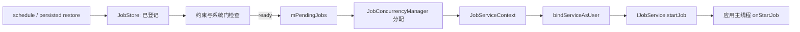
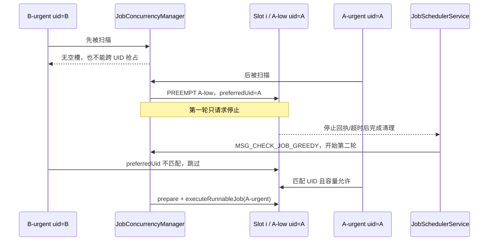

# 131 JobConcurrencyManager：Job 已经 ready，为什么还在等执行槽？

> 源码基线：Android 11 / API 30 / `android-11.0.0_r48`
>
> 学习方式：macOS 静态阅读，不要求编译或连接设备
>
> 前置章节：第 43、121—130 章

## 先说问题、结论和读完收获

上一章已经把 Job 的各种约束都验完了。现在假设两个 Job 都是 `ready=true`，但系统的执行槽已经占满：

- `B-urgent` 优先级很高，来自 calling UID B，并且更早进入 Pending；
- `A-urgent` 同样优先级很高，来自 calling UID A，但排在后面；
- 当前运行槽里恰好有一个 UID A 的低优先级 `A-low`，却没有 UID B 的低优先级 Job。

结果可能很反直觉：排在前面的 `B-urgent` 继续等待，后面的 `A-urgent` 反而触发对 `A-low` 的抢占；而且抢占这一轮只要求旧 Job 停止，新 Job 要等槽真正清理后，在下一轮才有机会启动。

先给结论：

> Android 11 r48 的 `JobConcurrencyManager` 不是“把所有 ready Job 按优先级从高到低排序”的全局调度器。`mPendingJobs` 主要按 shell override 和入队时间排序；JCM 按这个顺序逐个找槽。空槽启动要同时通过 FG/BG 动态容量和 `preferredUid` 检查；无空槽时，只能用严格更高的 evaluated priority 抢占同一 `callingUid` 的最低优先级 Job。停止与替代启动分属两轮分配。

读完本章，你应该能：

- 区分 `JobStore`、ready、Pending、`JobServiceContext` 占用和应用 `onStartJob()` 五个完成点；
- 解释为什么源码里有 16 个 context，默认并发却常是 5、8 或 10；
- 用 `total / maxBg / minBg` 手算本轮 FG、BG 实际容量；
- 说明 Pending 顺序、evaluated priority 和抢占各自负责什么；
- 推演同 UID 抢占为何需要 `preferredUid` 和第二轮分配；
- 知道怎样从 `dumpsys jobscheduler` 的 Pending、Active、Concurrency 三部分定位等待层次。

本章只追到 `JobServiceContext` 接受一个 Job 并开始绑定。绑定、`onStartJob()` 回执、停止超时与代际清理，是第 132 章的主线。

## 先分清五个完成点：ready 离执行还有多远

可以把 JobScheduler 想成一个机场：

- `JobStore` 是所有已登记旅客；
- ready 是证件与出发条件已满足；
- Pending 是已经来到登机口等待分配座位；
- `JobServiceContext` 是有限的座位/执行槽；
- `onStartJob()` 才是旅客真的登上飞机。



| 状态 | 能证明什么 | 不能证明什么 |
|---|---|---|
| 在 `JobStore` | Job 仍被系统登记 | 当前 ready |
| `JobStatus.isReady()` | Job 约束与几项隐式门满足 | 已进入 Pending |
| 在 `mPendingJobs` | 已成为本轮槽位候选 | 一定能拿到槽 |
| context 的 `mRunningJob=job` | system_server 已让该槽承担此 Job，包括绑定阶段 | 应用已进入 `onStartJob()` |
| 应用收到 `onStartJob()` | 跨进程开始通知已到应用主线程 | Job 已完成 |

“ready 但没运行”要继续问：它没进 Pending，还是进了 Pending但没有容量，还是已经绑定但应用回调未到？

## 16 个物理槽不等于默认并行 16 个 Job

### `mActiveServices` 保存的是槽对象，不是活跃 Job 列表

JSS 的物理上限是：

```java
static final int MAX_JOB_CONTEXTS_COUNT = 16;
```

系统进入可启动第三方应用的 boot phase 后，一次创建 16 个 `JobServiceContext`：

```java
for (int i = 0; i < MAX_JOB_CONTEXTS_COUNT; i++) {
    mActiveServices.add(new JobServiceContext(
            this, mBatteryStats, mJobPackageTracker,
            getContext().getMainLooper()));
}
```

变量名 `mActiveServices` 很容易误导。这个 List 始终装着 16 个可复用 context，其中既有空槽，也有处于 BINDING、STARTING、EXECUTING 或 STOPPING 的槽。

因此：

```text
mActiveServices.size() == 16
```

只证明有 16 个槽对象，不证明正并行 16 个 Job。真实占用要逐个查看 `getRunningJobLocked()` 是否为 null。

### 物理上限、策略上限和候选需求是三层限制

仍用机场类比：

| 层次 | 源码含义 | 问的问题 |
|---|---|---|
| 物理槽 | 固定 16 个 `JobServiceContext` | 最多有多少个执行容器？ |
| 策略容量 | 屏幕状态、内存 trim、配置共同选出的 `total/maxBg/minBg` | 当前最多允许放多少？ |
| 实际容量 | 再结合已有和待运行的 FG/BG 数量计算 | 这一轮各类还需要多少座位？ |

有空 context 不代表策略允许启动；策略允许 8 个也不代表当前一定凑得出 8 个 ready Job。

## r48 如何根据屏幕和内存选择并发矩阵

### 默认矩阵

每一格按 `total / maxBg / minBg` 表示：

| effective 屏幕状态 | NORMAL | MODERATE | LOW | CRITICAL |
|---|---:|---:|---:|---:|
| ON | 8 / 6 / 2 | 8 / 4 / 2 | 5 / 1 / 1 | 5 / 1 / 1 |
| OFF | 10 / 6 / 2 | 10 / 4 / 2 | 5 / 1 / 1 | 5 / 1 / 1 |

三个值的含义是：

- `total`：FG 与 BG 合计的策略容量；
- `maxBg`：BG 能占用的最多容量；
- `minBg`：有 BG 候选时，尽量给 BG 留出的软容量。

这些是 r48 默认值，不是硬件能力，也不是所有厂商不可修改的常量。它们可以通过 `Settings.Global.JOB_SCHEDULER_CONSTANTS` 对应 key 调整，解析后还会被钳制：`total` 在 1—16，`maxBg` 在 1—`total`，`minBg` 不小于 0、不大于 `maxBg`，并且小于 `total`。

### 熄屏后为何默认还等 30 秒

JCM 保存两份交互状态：

```text
mCurrentInteractiveState
  刚收到的当前屏幕交互状态

mEffectiveInteractiveState
  当前选择 ON/OFF 并发矩阵所使用的状态
```

亮屏时两者立即变为 true；运行期间从 ON 转为 OFF 时，current 立即变 false，但 effective 默认延迟 30 秒才变 false：

```java
mHandler.postDelayed(mRampUpForScreenOff,
        mConstants.SCREEN_OFF_JOB_CONCURRENCY_INCREASE_DELAY_MS.getValue());
```

这样可以避免短暂锁屏又亮屏时频繁扩缩并发。这里用的是 `BackgroundThread` 的 Handler，不是 wakeup Alarm；如果 CPU 已休眠，它不会为了“扩大 Job 并发”保证在第 30 秒整唤醒。

30 秒后，Runnable 还会复核屏幕确实持续关闭，再设置：

```text
mEffectiveInteractiveState=false
→ maybeRunPendingJobsLocked()
→ 用 OFF 矩阵重新分配
```

还有一个启动边界：两个 boolean 的 Java 初值都是 false。若 `onSystemReady()` 首次查询就发现设备不 interactive，`onInteractiveStateChanged(false)` 会因 current 已为 false 而直接返回，effective 也保持 false；这种“开机时本就灭屏”的路径不会额外等一次 ON→OFF 的 30 秒。

### 内存 trim 不是持续推送给 JCM 的开关

每次分配前，JCM 最多每秒刷新一次：

```java
if (nowUptime < mNextSystemStateRefreshTime) return;
mNextSystemStateRefreshTime = nowUptime + 1000;
mLastMemoryTrimLevel = ActivityManager.getService()
        .getMemoryTrimLevel();
```

然后用 effective 屏幕状态选择 ON/OFF 组，再用 trim 选择 NORMAL/MODERATE/LOW/CRITICAL 行。

这说明：

- trim 值是在 assignment 时按需查询并缓存，不是每次变化都立即触发一次 JCM 分配；
- 从 NORMAL 变成 LOW 后，策略容量可以从 8/10 降到 5；
- 这个变化主要限制后续启动，不会只因为“当前运行数超过新的 5”就在此方法中跨 UID 批量驱逐已有 Job。

## ready Job 怎样进入 Pending，Pending 又怎样排序

### `mPendingJobs` 不是 JobStore 的别名

`JobStore mJobs` 保存系统登记的 JobStatus 全集；`mPendingJobs` 只保存已经被 JSS 选为执行候选的子集。

Controller 状态变化触发 `MSG_CHECK_JOB` 后，JSS 会重新检查 ready、用户、组件和 restriction 等条件。当 JSS 没有走“已有 Job 活跃时立即重建全部 ready 队列”的路径，而是进入 `maybeQueueReadyJobsForExecutionLocked()` 时，它还可能对非 ACTIVE bucket 的 Job 做批处理：默认达到一定数量，或等待达到上限，才把候选整体放入 Pending。这里的“non-ACTIVE bucket”是应用待机分桶，不是“屏幕关闭”的同义词。

所以：

```text
scheduled 不等于 ready
ready 不一定已 pending
pending 不等于正在运行
```

这也是为什么只看到 `isReady()==true`，仍要检查 Pending queue。

### Pending 的比较器没有 evaluated priority

r48 的比较器只有两层：

```java
if (o1.overrideState != o2.overrideState) {
    return o2.overrideState - o1.overrideState;
}
if (o1.enqueueTime < o2.enqueueTime) return -1;
return o1.enqueueTime > o2.enqueueTime ? 1 : 0;
```

排序规则是：

1. shell/debug override 更高的在前；
2. override 相同，`enqueueTime` 更早的在前。

`enqueueTime` 是 Job 开始被 JSS 跟踪时记录的 elapsed realtime；`madePending` 则由 `JobPackageTracker.notePending()` 记录 uptime，用于统计它真正进入 Pending 后等了多久。两者用途不同。

JCM 后面确实会计算 priority，但不会据此重新排列整个 Pending List。这带来一个直接结果：

> 当空槽和类别容量有限时，前面的低 priority Job 可能先拿到空槽；后面的高 priority Job 不能据此对其他 UID 做全局抢占。

### override 排在前面，也不等于绕过所有门

Pending comparator 里的 `overrideState` 主要服务 shell 测试/调试。一个 Job 能来到 Pending 之前和真正执行之前仍有各层检查。不能仅从“override 排第一”推出组件失效、用户未启动或物理槽限制都被取消。

## evaluated priority 与 FG/BG 到底是什么

### JCM 的 FG 只认一个数值阈值

JCM 的分类函数是：

```java
private boolean isFgJob(JobStatus job) {
    return job.lastEvaluatedPriority >= JobInfo.PRIORITY_TOP_APP;
}
```

r48 中 `PRIORITY_TOP_APP=40`。因此 JCM 所称 FG 的准确含义是“本轮 evaluated priority 至少为 TOP_APP”，不是泛指：

- 应用有前台 Service；
- Job 将来会调用 `startForeground()`；
- 用户肉眼觉得它很重要。

例如 `PRIORITY_FOREGROUND_SERVICE=35` 仍低于 40，在 JCM 这套二分类里仍算 BG。

### evaluated priority 不是只看 JobInfo 原值

JSS 的计算顺序可压缩为：

```java
int priority = job.getPriority();
if (priority < PRIORITY_BOUND_FOREGROUND_SERVICE) {
    int uidOverride = mUidPriorityOverride.get(job.getSourceUid(), 0);
    if (uidOverride != 0) priority = uidOverride;
}
return adjustJobPriority(priority, job);
```

其中 UID override 来自 source UID 当前进程状态：TOP 映射 40，前台服务映射 35，绑定前台服务映射 30。对于低于 TOP 的 priority，`JobPackageTracker` 的历史负载因子还可能施加负向调整，避免长期占用 Job 的包持续得到同等优先级。

所以 dump 中应该看 `Evaluated priority`，不能只看最初的 `JobInfo` priority。

### 两个 UID 概念在抢占处会分叉

`JobStatus` 同时保存：

- `sourceUid`：Job 代表的来源应用身份，用于优先级、待机、配额和记账等政策；
- `callingUid`：向 JobScheduler 请求调度的调用者；`getUid()` 返回它。

普通 App 自己调度时二者通常相同；SyncManager 等系统组件代表其他包调度时可以不同。

这里最容易漏掉的边界是：

```text
evaluated priority 的 UID override：按 sourceUid 查
能否互相抢占：比较 getUid()，也就是 callingUid
```

后面的例子使用不同 evaluated priority，是为了推演 r48 内部算法；不代表普通第三方 App 可以自由调用隐藏 API 给 Job 任意设置系统级 priority。

## `total / maxBg / minBg` 怎样变成本轮实际容量

`JobCountTracker` 先统计：

- 当前 running FG/BG；
- Pending 中尚未运行的 FG/BG；
- 配置的 total、maxBg、minBg。

然后依次计算：

```text
reservedBg = min(configMinBg, runningBg + pendingBg)
reservedBg = min(reservedBg, total - runningFg)

maxFg = total - max(runningBg, reservedBg)
actualMaxFg = min(maxFg, runningFg + pendingFg)

maxBg = min(configMaxBg, total - actualMaxFg)
actualMaxBg = min(maxBg, runningBg + pendingBg)
```

### 手算一个 screen ON + NORMAL 的例子

配置为 `8 / 6 / 2`，当前：

```text
running：5 FG + 1 BG
pending：2 FG + 3 BG
```

第一步，BG 软预留：

```text
reservedBg = min(2, 1 + 3) = 2
再受 total-runningFg 限制：min(2, 8-5) = 2
```

第二步，FG 实际上限：

```text
maxFg = 8 - max(runningBg=1, reservedBg=2) = 6
actualMaxFg = min(6, runningFg+pendingFg=7) = 6
```

第三步，BG 实际上限：

```text
maxBg = min(configMaxBg=6, total-actualMaxFg=2) = 2
actualMaxBg = min(2, runningBg+pendingBg=4) = 2
```

所以这一轮还能启动：

```text
1 个 FG：5 → 6
1 个 BG：1 → 2
合计：6 → 8
```

这个例子同时说明 `minBg` 为什么叫软预留：如果根本没有 running/pending BG，`reservedBg` 会降到 0，容量可以给 FG；它不是“系统无论如何必须运行两个 BG Job”。

实际 FG/BG 上限还会随候选构成变化，所以 dumpsys 中的 `Actual max` 不是简单照抄配置原值。

## assignment 为什么先“纸上排座”，再修改真实槽

### 第一阶段建立投影

每次 `assignJobsToContextsLocked()` 都在 JSS `mLock` 下运行。JCM 复用三组长度为 16 的数组：

```text
contextIdToJobMap[i]
  纸面上第 i 个槽最终应对应哪个 Job

slotChanged[i]
  纸面结果与本轮开始时是否不同

preferredUidForContext[i]
  本轮开始时槽的短期 UID 偏好
```

它先把真实 context 的 running Job 和 preferred UID 抄入数组，统计 running 数量；再扫描 Pending，计算每个候选的 `lastEvaluatedPriority` 和 FG/BG 数量，得到 actual max。

随后它按 Pending 原顺序逐个寻找槽。某个候选被放入投影后，`contextIdToJobMap` 立即更新，所以后面的候选看到的是已经规划过的纸面结果，不能再次占用同一个槽。

这样做的意义是：先得到一轮内部一致的整体方案，再区分哪些槽要启动、哪些槽只需发出抢占停止，减少一边扫描一边真实异步停止导致的混乱。

### 第二阶段才把投影应用到真实 context

JCM 再遍历 16 个槽：

- `slotChanged=false`：保持原状，必要时清理过期 preferred UID；
- 纸面要变且真实槽为空：先让 Controller prepare，再 `executeRunnableJob()`；
- 纸面要变但真实槽仍有 Job：只调用 `preemptExecutingJobLocked()`，等待旧 Job 异步退出。

投影中的“替代 Job 已占位”不等于真实 Job 已启动。抢占路径恰恰需要下一轮才能兑现。

## 空槽启动要同时通过两道门

扫描某个空槽时，r48 检查：

```java
boolean uidOkay = preferredUid == nextPending.getUid()
        || preferredUid == NO_PREFERRED_UID;

if (uidOkay && mJobCountTracker.canJobStart(isPendingFg)) {
    selectedContextId = j;
    startingJob = true;
    break;
}
```

两道门分别是：

1. 该空槽没有 UID 偏好，或偏好正好等于候选的 calling UID；
2. running + 本轮已规划 starting 尚未达到该 FG/BG 的 actual max。

“物理上是空槽”只能证明第一层资源存在，不能绕过策略容量。

每规划一个真正从空槽启动的 Job，Tracker 立即增加本轮 `startingFg` 或 `startingBg`。后面的候选据此看到已经被本轮前序候选占掉的容量，避免纸面超发。

## 没有可用空槽时，为何只允许同 calling UID 抢占

### 源码条件

遇到已占用槽时，JCM 先比较 UID：

```java
if (running.getUid() != nextPending.getUid()) {
    continue;
}
int runningPriority = mService.evaluateJobPriorityLocked(running);
if (runningPriority >= nextPending.lastEvaluatedPriority) {
    continue;
}
```

只有两个条件都成立才是候选：

- running 与 pending 的 `callingUid` 相同；
- pending 的 evaluated priority **严格大于** running。

如果同 UID 有多个较低优先级 running Job，算法选择其中 priority 最低的一个。

这里说“没有可用空槽”，不一定等于 16 个物理槽都非空。即使存在物理空槽，只要它因 FG/BG 容量已满或 preferred UID 不匹配而不能接收当前候选，扫描仍会继续寻找同 UID 的可抢占 running 槽。

严格大于意味着同优先级不抢占，避免没有收益的停止—重启抖动。从结果上看，只限同 calling UID 把抢占影响控制在同一调度责任主体内部：一个 UID 的高优先级工作不能仅凭这个局部算法踢掉另一个 UID 已经获得的槽。

这不是一份完整的跨应用公平性证明，但源码能确定的边界很清楚：r48 这里没有实现任意跨 UID 的全局优先级抢占。

### 满载场景：为什么排在前面的 B 反而继续等

为便于手算，假设 screen ON + NORMAL，8 个策略槽已经满：

```text
running：5 FG + 3 BG = 8
其中有 UID A 的 A-low，evaluated priority=0

Pending 顺序：
1. B-urgent：callingUid=B，priority=40
2. A-urgent：callingUid=A，priority=40
```

这是一个用于阅读内部算法的构造场景；priority 数值和代理身份可来自系统内部调度，不把它当作第三方公开 API 示例。

JCM 扫描 `B-urgent`：

- 没有空槽；
- running 中没有 calling UID B 的更低优先级 Job；
- 它不能跨 UID 抢占 A 或其他 UID；
- 结果是本轮没有选中槽。

再扫描 `A-urgent`：

- 发现同 calling UID A 的 `A-low`；
- `0 < 40`，满足严格更高；
- 将那个槽的纸面映射改成 `A-urgent`，标记 `slotChanged=true`。

于是，“Pending 更早 + priority 同样高”的 B 仍等着，A 却触发抢占。原因不是 A 的全局排名更高，而是只有 A 满足同 UID 替换条件。

### 抢占分支为何不调用 `canJobStart()`

规划抢占时，源码没有走空槽的类别容量检查，也不增加 `starting` 计数，因为这一轮并不启动替代 Job，只请求旧 Job 停止。

当槽真正空出来、下一轮尝试启动 A 时，空槽分支仍会重新计算当前 running/pending 构成，并执行 `canJobStart()`。所以不能把“已决定抢占”理解为“替代 Job 已绕过 FG/BG 容量”。

## 抢占为何需要两轮，以及 `preferredUid` 在保护什么

### 第一轮只发停止请求

把投影应用到真实槽时，如果旧 Job 仍在运行：

```java
if (activeServices.get(i).getRunningJobLocked() != null) {
    activeServices.get(i).preemptExecutingJobLocked();
    preservePreferredUid = true;
}
```

`JobServiceContext` 将停止原因设为 `REASON_PREEMPT`。如果旧 Job 已处于 EXECUTING，会跨进程请求应用执行 `onStopJob()`；如果还在 BINDING/STARTING，取消状态机的处理不同。无论哪种，都可能经历回调或超时，槽不会在当前调用栈里瞬间变空。

此时：

- `A-urgent` 仍留在 Pending；
- 旧 `A-low` 仍是 context 的真实 running Job；
- JCM 没有在本轮调用 `executeRunnableJob(A-urgent)`。

### `preferredUid` 防止刚让出的槽被其他 UID 插队

发起 PREEMPT 时，JSC 保存旧 running Job 的 calling UID：

```java
if (reason == JobParameters.REASON_PREEMPT) {
    mPreferredUid = mRunningJob != null
            ? mRunningJob.getUid() : NO_PREFERRED_UID;
}
```

由于抢占前已经要求新旧 Job calling UID 相同，这个值也正是替代 Job A 的 UID。

旧 Job 完成清理后，JSS 发送 `MSG_CHECK_JOB_GREEDY`，下一轮重新建立 Pending 并分配。即使 `B-urgent` 仍排在前面，它看到这个空槽的 preferred UID 是 A，也不能使用；轮到 `A-urgent` 时才匹配。



### preferred UID 不是永久专属槽

它只是一条短期交接提示：

- 新 Job 真正进入 `executeRunnableJob()` 时会清成 `NO_PREFERRED_UID`；
- 如果后续一轮没有合适的同 UID Job占用，JCM 在无需继续保留时也会清掉；
- 它不是 UID 独占线程池，不是长期 quota，也不是可跨多次任务永久继承的权重。

还有一个小边界：若本轮前面的其他 UID 已因 preferred 不匹配而跳过，JCM 在轮末清掉 preferred 后不会回头重扫那些候选；通常要等下一次调度触发。可见它是一条短期交接提示，不是一个完整的长期公平队列。

抢占只保证“先给同一责任主体完成替换机会”，不保证被抢占的旧 Job 自动再次执行。旧 Job 是否请求 reschedule，还取决于停止阶段和应用的 `onStopJob()` 返回语义。

## 真正拿到空槽后，也还没有进入应用代码

### Controller 先做执行前交接

真实槽为空时，JCM 先调用每个 Controller：

```java
for (StateController controller : controllers) {
    controller.prepareForExecutionLocked(pendingJob);
}
activeServices.get(i).executeRunnableJob(pendingJob);
```

这一步允许 Controller 在执行前冻结或转移状态。例如 ContentObserverController 把本轮聚合的 URI/authority 交给即将执行的 Job；QuotaController 开始相应的执行记账。

所以“分配一个槽”不是只改数组，它还是 Controller 从等待态到执行态的交接点。

### `executeRunnableJob()` 先进入 BINDING

JSC 随后：

1. 确认 context available；
2. 清掉 preferred UID；
3. 保存 `mRunningJob`，创建 callback 和参数快照；
4. 把状态设成 `VERB_BINDING` 并安排超时；
5. 调用 `bindServiceAsUser()`。

`bindServiceAsUser()` 返回 true 也只表示系统接受绑定请求，不表示 Service 已连接。连接成功后，JSC 才取得 `IJobService`，调用 `startJob(params)`。

应用进程里的 `JobServiceEngine.JobInterface.startJob()` 又只是把消息发给由 `service.getMainLooper()` 创建的 Handler：

```java
public void startJob(JobParameters params) {
    Message.obtain(service.mHandler,
            MSG_EXECUTE_JOB, params).sendToTarget();
}
```

最后由应用主线程执行 `onStartJob()`。因此要保留下面几个边界：

```text
从 Pending 移除
≠ bind 请求完成
≠ Service 已连接
≠ startJob Binder 已到达
≠ onStartJob 已在应用主线程执行
```

### r48 的 bind 立即失败边界

如果 `bindServiceAsUser()` 返回 false 或抛出 `SecurityException`，JSC 会清掉 `mRunningJob` 等现场并返回 false。但 JCM 随后仍会把该 Job 从 `mPendingJobs` 移除并记为 nonpending：

```java
if (!context.executeRunnableJob(pendingJob)) {
    Slog.d(TAG, "Error executing " + pendingJob);
}
if (pendingJobs.remove(pendingJob)) {
    tracker.noteNonpending(pendingJob);
}
```

Job 的定义并没有在这里从 JobStore 正常完成删除；后续是否再入 Pending 依赖新的 JSS 检查。更值得注意的是，Controller 的 `prepareForExecutionLocked()` 已先发生，而 r48 没有一套统一、对称的 rollback 回调由这个 false 分支调用。

因此准确结论是：**这个失败分支不是“事务性恢复到原 Pending 状态”**。不要在没有继续追 Controller 状态和后续检查的情况下，假定所有准备动作都已自动撤销。

## 并发策略收紧、优先级变化和线程边界

### 新上限主要限制新增，不保证立刻把 running 压到新值

假设 trim 从 NORMAL 变 LOW，total 从 8 变 5，而此刻已有 8 个 Job。`JobCountTracker` 的 dump 可能用 `*` 标出超限，但 JCM 不会单纯为了匹配新矩阵就挑三个其他 UID 的 Job 停掉。

已有 Job仍可能因为约束失效、Doze、restriction、执行超时等其他原因被停止；那是相应控制链的结果，不应与“并发配置变小”混为一谈。

同样，running Job 的当前 evaluated priority 可能变化，而 `lastEvaluatedPriority` 还保留它被纳入某轮统计时的分类快照。诊断一瞬间的 category 数量时，要结合 dump 时机和重新分配时机，不把所有字段当作原子快照。

### 正确不变量是 `mLock`，不是“所有代码都在同一线程”

常见 assignment 来自 JSS 主 Handler，但并非唯一入口：

- schedule Binder 路径可在持锁后把立即 ready 的 Job 放入 Pending并调用分配；
- screen-off 延迟 Runnable 在 system_server `BackgroundThread` 上持锁调用；
- 应用的 `IJobCallback` 可从 system_server Binder 线程进入完成清理；
- JSC 的超时 Handler 和默认 ServiceConnection 使用 system_server 主 Looper。

这些入口通过同一 JSS `mLock` 保护共享的 Pending、context 和状态，不是通过“它们天生都在主线程”获得串行性。

内存 trim 查询也发生在 assignment 的锁内。r48 中 AMS 与 JSS 同在 system_server，`IActivityManager` 调用通常会走同进程 Binder 短路；但它仍是锁内进入另一个服务的同步查询，`StatLogger` 因此单独记录 `refreshSystemState` 与整体 `assignJobsToContexts` 耗时。

## 怎样诊断“ready 但没运行”

有设备时，`adb shell dumpsys jobscheduler` 要分三块看，不能只搜 Job ID：

| dump 区域 | 主要问题 | 关键观察 |
|---|---|---|
| Pending queue | 是否已经成为候选，排在什么位置？ | override、enqueue、evaluated priority |
| Active jobs / Slot | 16 个 context 谁空、谁在绑定/运行/停止？ | running Job、运行时长、timeout、最近停止原因 |
| Concurrency | 当前为何只允许这些 FG/BG 数量？ | current/effective screen、trim、Config、Actual max、Running/Pending/Starting |

建议按这个顺序判断：

```text
1. Job 还在 Store 吗？
2. 完整 ready 吗？
3. 已进入 Pending 吗？
4. Pending 前面有哪些候选？
5. current/effective screen 与 trim 选了哪组配置？
6. actual FG/BG 是否还有容量？
7. 最近是否发生过 PREEMPT，使空槽可能暂时带有 preferred UID？
8. 满槽时，是否有同 calling UID 且更低 priority 的 running Job？
9. 抢占是否正在等待旧 Job 停止/超时？
10. context 是否已在 BINDING/STARTING，而不是根本没分配？
```

在 macOS 静态阅读环境里，可以证明代码规则和默认值，但不能声称某台设备当前 trim、厂商配置或运行时槽位已经实测。

r48 还有一个可观测性限制：默认文本 dump 没有直接输出 `JobServiceContext.mPreferredUid`。因此第 7 步只能先结合 `stopped because: cancelled due to preemption`、Pending 仍等待和源码时序做推断；若要直接确认，需要增加日志或插桩，不能把推断写成已观测事实。

## macOS 静态验证：四组命令建立证据链

在 AOSP 根目录执行。

### 1. 确认 16 个物理 context 与默认矩阵

```bash
rg -n -C 8 'MAX_JOB_CONTEXTS_COUNT|MAX_JOB_COUNTS_SCREEN_(ON|OFF)' \
  frameworks/base/apex/jobscheduler/service/java/com/android/server/job/JobSchedulerService.java
```

预期观察：物理数组/对象上限是 16，但 NORMAL 默认策略是 ON=8、OFF=10，LOW/CRITICAL 默认 total=5。

### 2. 确认 Pending 不按 evaluated priority 排序

```bash
rg -n -A 16 'sPendingJobComparator' \
  frameworks/base/apex/jobscheduler/service/java/com/android/server/job/JobSchedulerService.java
```

预期观察：比较器只看 overrideState 和 enqueueTime，没有调用 `evaluateJobPriorityLocked()`。

### 3. 确认空槽门和同 UID 抢占门

```bash
rg -n -C 18 'preferredUidOkay|job.getUid\(\) != nextPending.getUid' \
  frameworks/base/apex/jobscheduler/service/java/com/android/server/job/JobConcurrencyManager.java
```

预期观察：空槽要求 preferred UID 与 `canJobStart()` 同时通过；占用槽只在 calling UID 相同且 incoming priority 严格更高时成为抢占候选。

### 4. 确认抢占和应用启动不在同一轮

```bash
rg -n -C 18 'preemptExecutingJobLocked|executeRunnableJob' \
  frameworks/base/apex/jobscheduler/service/java/com/android/server/job/JobConcurrencyManager.java \
  frameworks/base/apex/jobscheduler/service/java/com/android/server/job/JobServiceContext.java
```

预期观察：真实忙槽分支只发 PREEMPT；真实空槽分支才 prepare + execute；JSC 的 execute 先进入 BINDING。

版本核对还可以执行：

```bash
rg -n '\bWorkType\b|\bWORK_TYPE_' \
  frameworks/base/apex/jobscheduler || true
```

r48 这套并发实现没有后续版本的多 WorkType 模型。网上涉及 EJ、TOP、FGS、BGUSER 等新版槽型的文章不能直接套用到本章。

## 检查题与答案

### 1. 有 16 个空的 `JobServiceContext`，为什么配置 total=8 时第 9 个 Job 仍不能启动？

因为 16 是物理容器上限，`canJobStart()` 还会执行策略准入。running + 本轮 starting 达到 actual max 后，即使数组里还有物理空槽，也不会把第 9 个 Job 放进去。

### 2. priority=40 的 Job 一定排在 priority=0 的 Job 前面吗？

不一定。r48 Pending comparator 不按 evaluated priority 排序，而是先看 overrideState，再看 enqueueTime。priority 主要用于 FG/BG 分类和同 UID 抢占判断。

### 3. `PRIORITY_FOREGROUND_SERVICE=35` 在 JCM 中属于 FG 吗？

不属于。`isFgJob()` 使用 `>= PRIORITY_TOP_APP`，阈值是 40。这里的 FG 是 JCM 内部计数类别，不是所有 Android “前台”概念的统称。

### 4. UID B 的 priority=100 Job 能抢占 UID A 的 priority=0 Job 吗？

不能通过 r48 的这条 JCM 抢占路径。源码先要求 `running.getUid()==pending.getUid()`，比较的是 calling UID；跨 UID 会直接跳过。

### 5. 为什么抢占后不直接在同一轮启动替代 Job？

旧 Job 可能正在应用进程执行，需要 `onStopJob()` 回执、清理或超时。第一轮只能发停止请求并保留 preferred UID；槽真正变空后由完成回调触发下一轮，再按空槽规则启动。

### 6. `minBg=2` 是否保证系统永远同时运行两个 BG Job？

不保证。预留值还受实际 running+pending BG 数量与已有 FG 数量限制。没有 BG 候选时会降为 0，它是候选存在时的软容量分配，不是强制制造工作。

### 7. `executeRunnableJob()` 返回 true，应用的 `onStartJob()` 已经执行了吗？

没有。它表示 JSC 接受 Job 并成功发起绑定，状态先进入 BINDING；还要等待 ServiceConnection、`IJobService.startJob()`，再由应用 `JobServiceEngine` 投递到主线程。

### 8. 抢占比较的 UID 与 priority override 查询的 UID 是同一个字段吗？

不一定。抢占比较 `getUid()`，即 calling UID；JSS 查询前台进程带来的 priority override 时使用 source UID。普通自调度 App 二者通常相同，代理调度可以不同。

## 一次可操作练习：手工跑完两轮分配

请在纸上建立 8 行槽位表：

```text
Slot | 真实 running | callingUid | evaluated priority | FG/BG | preferredUid
```

条件使用本章满载场景：

```text
配置：screen ON + NORMAL = total 8 / maxBg 6 / minBg 2
running：5 FG + 3 BG
Slot 7：A-low，uid=A，priority=0，BG
pending：先 B-urgent(uid=B,p=40)，后 A-urgent(uid=A,p=40)
```

按源码顺序完成：

1. 计算第一轮 reservedBg、actualMaxFg、actualMaxBg；
2. 扫 B，记录为何无槽；
3. 扫 A，记录纸面映射与 `slotChanged`；
4. 应用纸面结果，记录第一轮真实动作；
5. 假设 A-low 完成清理且不请求 reschedule，重新计算第二轮容量；
6. 解释为何 B 仍不能先拿 Slot 7；
7. 写出从 `executeRunnableJob(A-urgent)` 到应用回调还差的步骤。

参考答案：

```text
第一轮：
reservedBg = min(2, 3+0) = 2
actualMaxFg = min(8-max(3,2), 5+2) = 5
actualMaxBg = min(6, 8-5, 3+0) = 3

B：满槽，且没有同 calling UID 的低优先级 running → 等待
A：找到同 UID 的 A-low，0<40 → 纸面替换 Slot 7
真实动作：只 PREEMPT A-low，preferredUid=A；A-urgent 仍在 Pending

第二轮（A-low 已清理）：
running=5 FG+2 BG，pending=2 FG
reservedBg=min(2,2)=2
actualMaxFg=min(8-max(2,2),5+2)=6
actualMaxBg=min(6,8-6,2)=2

B：Slot 7 preferredUid=A，不匹配 → 跳过
A：UID 匹配，FG 5<6 → prepare + execute
之后：BINDING → ServiceConnection → IJobService.startJob
     → 应用主线程 JobService.onStartJob
```

如果能解释“为什么第一轮 actual FG 已满仍可发起抢占，但第二轮启动仍要重新通过 FG 容量”，就真正理解了这段算法。

## 最后带走这六句话

1. ready 只代表约束层通过；Pending 和执行槽是后续两层。
2. r48 固定创建 16 个 context，但动态策略默认常只开放 5、8 或 10 个总容量。
3. Pending 主要按 override 与 enqueueTime 排序，不是 evaluated priority 全局排序。
4. 空槽启动要同时满足 preferred UID 和 FG/BG actual max；priority 还用于 TOP 类别划分。
5. 无空槽时只允许严格更高 priority 抢占同 calling UID 的低优先级 Job，不做任意跨 UID 抢占。
6. 抢占第一轮只停旧 Job；`preferredUid` 保护第二轮交接，真正执行还要经过 prepare、绑定、Binder 和应用主线程。

## 源码索引

| 目的 | Android 11 r48 文件 |
|---|---|
| 并发矩阵、Pending comparator、优先级计算、消息入口 | `frameworks/base/apex/jobscheduler/service/java/com/android/server/job/JobSchedulerService.java` |
| 容量选择、JobCountTracker、槽位规划与抢占 | `frameworks/base/apex/jobscheduler/service/java/com/android/server/job/JobConcurrencyManager.java` |
| calling/source UID、priority 与时间字段 | `frameworks/base/apex/jobscheduler/service/java/com/android/server/job/controllers/JobStatus.java` |
| context 占用、preferred UID、绑定与抢占停止 | `frameworks/base/apex/jobscheduler/service/java/com/android/server/job/JobServiceContext.java` |
| 应用 Binder 到主线程 `onStartJob()` | `frameworks/base/apex/jobscheduler/framework/java/android/app/job/JobServiceEngine.java` |
| priority 常量与 Job 参数 | `frameworks/base/apex/jobscheduler/framework/java/android/app/job/JobInfo.java` |
| Pending/Active 时间与包负载统计 | `frameworks/base/apex/jobscheduler/service/java/com/android/server/job/JobPackageTracker.java` |
| JobCountTracker 单元测试 | `frameworks/base/services/tests/servicestests/src/com/android/server/job/JobCountTrackerTest.java` |

下一章从本章最后的交接点继续：`executeRunnableJob()` 已把槽推进 BINDING，但应用还没有开始工作。接下来要看 `JobServiceContext` 怎样用状态机、callback 身份和 timeout 保证一个复用槽不会被旧回调误完成。
