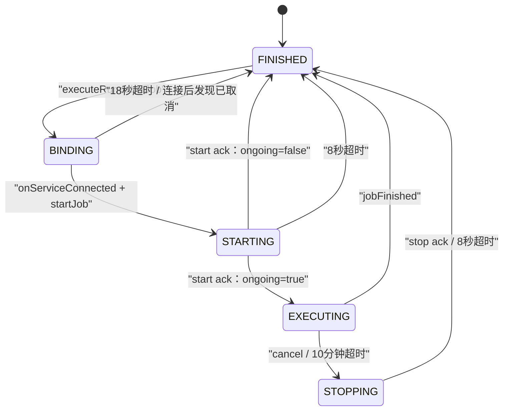
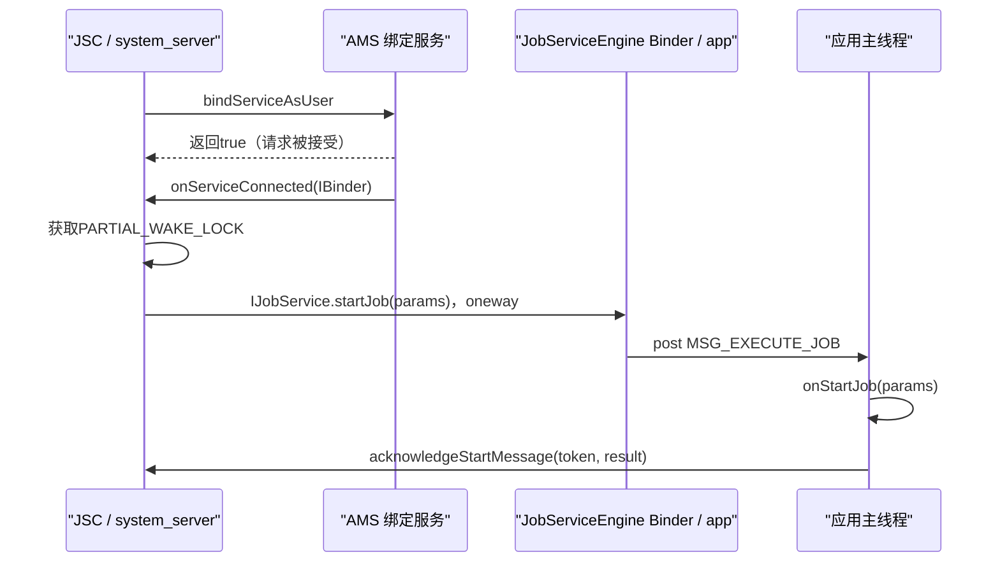
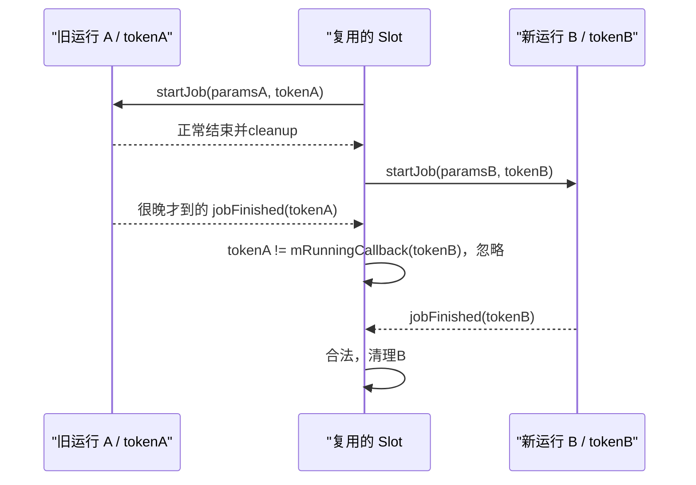
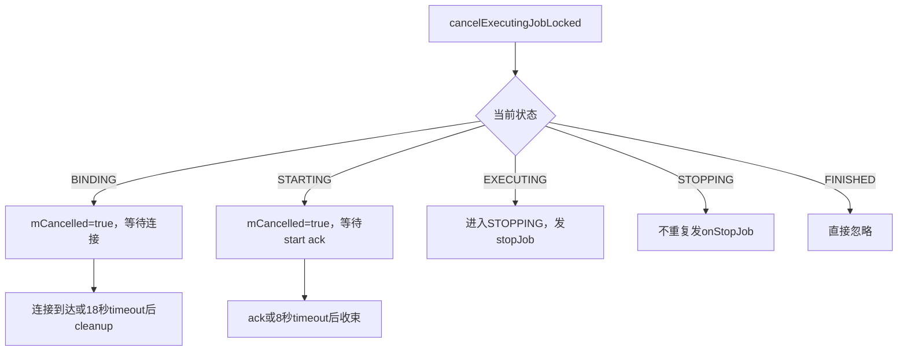
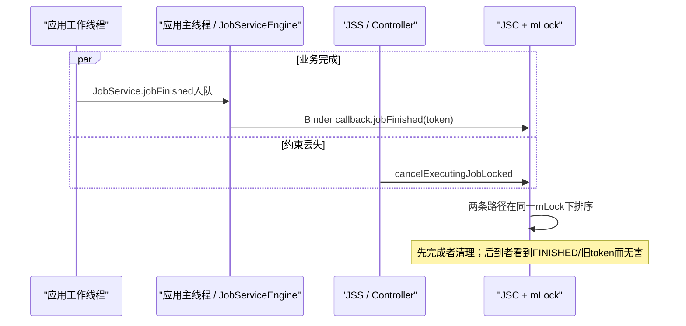
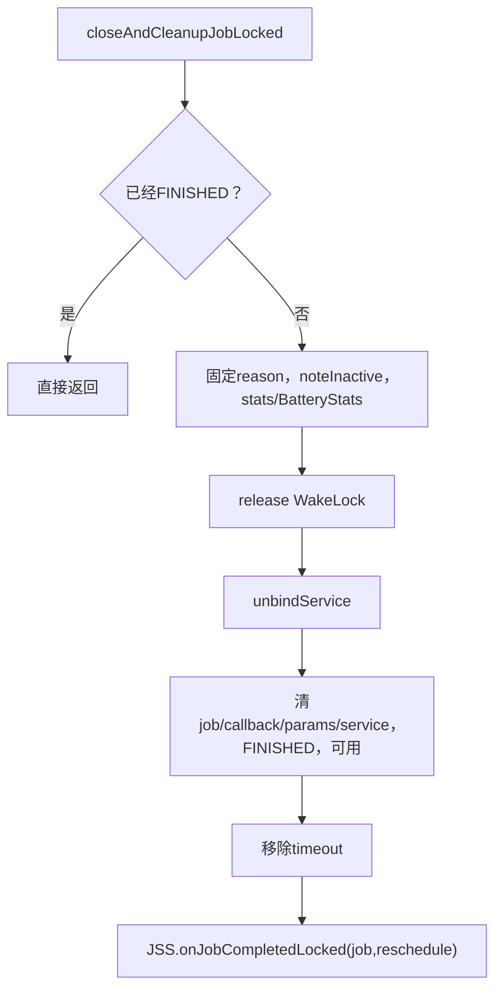
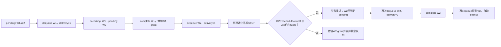
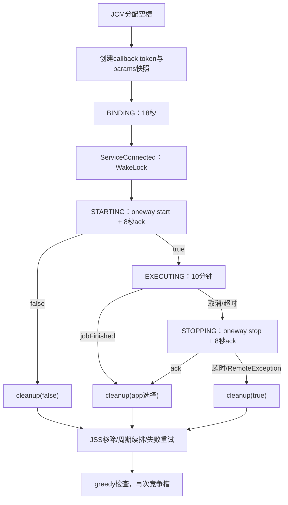

# 132 Android JobServiceContext：绑定、回调、超时与清理状态机

> 源码版本：Android 11 / API 30 / `android-11.0.0_r48`  
> 学习方式：macOS 只读源码，不要求编译、不要求连接设备  
> 前置章节：第 43、121、131 章

---

## 1. 本章研究“拿到执行槽以后发生什么”

第131章停在 `JobConcurrencyManager` 把一个 ready Job 分给空闲槽：

```text
Controllers.prepareForExecutionLocked(job)
→ JobServiceContext.executeRunnableJob(job)
```

但这时应用的 `onStartJob()` 还没有执行。system_server 还要完成绑定、跨进程调用、应用主线程分发、开始回执、执行计时、停止回执和最终清理。

本章沿着一个 Job 的完整执行代际，回答：

> 一个槽怎样从 FINISHED 走到 BINDING、STARTING、EXECUTING、STOPPING，再安全回到 FINISHED；旧回调为什么不能误伤复用后的新 Job。

---

## 2. 先建立贯穿案例

假设应用 `com.demo.sync` 的 Job 42 已经 ready，JCM 把它分到 Slot #3：

```text
Job A：callingUid=10123，sourceUid=10123，jobId=42
Slot #3：当前 FINISHED，可用
应用行为：onStartJob() 返回 true，在工作线程同步数据
```

执行5分钟后网络约束丢失，系统要求停止；应用的 `onStopJob()` 返回 true，希望按 backoff 重试。

后文会持续追踪：

1. Slot #3 何时算被占用；
2. WakeLock 何时获得；
3. 18秒、8秒、10分钟分别从哪里开始；
4. `true` 在 start 与 stop 回调里为何意思相反；
5. 清理后 Job A 是消失、周期续排，还是生成失败重试的新 JobStatus。

---

## 3. 源码地图

system_server 槽位状态机：

```text
frameworks/base/apex/jobscheduler/service/java/com/android/server/job/JobServiceContext.java
```

应用进程回调桥：

```text
frameworks/base/apex/jobscheduler/framework/java/android/app/job/JobService.java
frameworks/base/apex/jobscheduler/framework/java/android/app/job/JobServiceEngine.java
frameworks/base/apex/jobscheduler/framework/java/android/app/job/IJobService.aidl
frameworks/base/apex/jobscheduler/framework/java/android/app/job/IJobCallback.aidl
frameworks/base/apex/jobscheduler/framework/java/android/app/job/JobParameters.java
```

完成后的重调度与 WorkItem 存储：

```text
frameworks/base/apex/jobscheduler/service/java/com/android/server/job/JobSchedulerService.java
frameworks/base/apex/jobscheduler/service/java/com/android/server/job/controllers/JobStatus.java
frameworks/base/apex/jobscheduler/framework/java/android/app/job/JobWorkItem.java
```

---

## 4. JobServiceContext 不是应用的 JobService

两者名字接近，但进程和职责完全不同：

| 对象 | 所在进程 | 职责 |
|---|---|---|
| `JobServiceContext`，简称 JSC | `system_server` | 管理一个执行槽、绑定、超时、WakeLock、回调合法性与清理 |
| `JobService` | 应用进程 | 让开发者实现 `onStartJob()`、`onStopJob()` |
| `JobServiceEngine` | 应用进程 | 把 Binder 请求转交应用主线程，再把返回值回给系统 |
| `JobStatus` | `system_server` | 保存已调度 Job 的系统内部状态与工作队列 |

一个 JSC 同一时刻最多承载一个 Job，但会在系统运行期间反复服务不同应用、不同 Job。

---

## 5. r48 一共有16个长期复用的 JSC

JSS 到 `PHASE_THIRD_PARTY_APPS_CAN_START` 时创建：

```java
for (int i = 0; i < MAX_JOB_CONTEXTS_COUNT; i++) {
    mActiveServices.add(new JobServiceContext(...));
}
```

16是物理槽对象数，不是始终并行16个 Job。第131章所讲的屏幕、内存与 FG/BG 并发策略，决定这些槽中本轮可以新占用多少个。

完成后不会销毁 JSC，而是清空本次运行字段并把同一个对象交给下一代 Job。

---

## 6. 五态先看全图



常量值：

```text
VERB_BINDING  = 0
VERB_STARTING = 1
VERB_EXECUTING= 2
VERB_STOPPING = 3
VERB_FINISHED = 4
```

`FINISHED` 在这里既表示“尚未接 Job”，也表示“上一代已经彻底清理”。

---

## 7. 状态名不要按自然语言想当然

`BINDING` 不是“应用正在工作”，它只是 system_server 已发起 Service 绑定、等待连接。

`STARTING` 不是“刚开始做后台任务”，而是系统已经发送 `startJob(params)`，正在等应用主线程执行 `onStartJob()` 并回传布尔结果。

`EXECUTING` 表示应用回报“还有异步工作”，系统进入10分钟 timeslice；它不保证工作线程真的健康运行。

`STOPPING` 表示系统已发 `stopJob(params)`，正在等 `onStopJob()` 返回值。

---

## 8. 三组超时不是一个总倒计时

r48 常量：

```java
OP_BIND_TIMEOUT_MILLIS = 18_000;
OP_TIMEOUT_MILLIS = 8_000;
EXECUTING_TIMESLICE_MILLIS = 10 * 60 * 1000;
```

映射如下：

| 当前状态 | 本次 timeout | 等待什么 |
|---|---:|---|
| BINDING | 18秒 | Service 建立连接 |
| STARTING | 8秒 | `onStartJob()` 返回并 ack |
| EXECUTING | 10分钟 | 应用主动 `jobFinished()`，否则系统发 stop |
| STOPPING | 8秒 | `onStopJob()` 返回并 ack |

每次状态推进都会移除旧 timeout，再按新状态重新计时。因此不能把它们相加后写成一个固定“总寿命”。

---

## 9. 这三个值在 r48 不是应用配置项

它们是 `JobServiceContext` 中的固定常量，不从 `JOB_SCHEDULER_CONSTANTS` 解析。

应用可以通过及时返回、主动 `jobFinished()` 来缩短占槽时间，却不能请求把 STARTING 超时改成30秒，或把执行 timeslice 改成1小时。

不同 Android 版本可能改变规则，阅读其他版本文档时不能反向覆盖 r48。

---

## 10. `executeRunnableJob()` 的入口条件

JCM 只应把真实空槽交给它。JSC 自己仍防御性检查：

```java
if (!mAvailable) {
    return false;
}
```

随后在同一个 JSS `mLock` 临界区中：

```text
清 preferredUid
创建本代 callback
构造 JobParameters 快照
记录 executionStart
进入 BINDING
安排18秒 timeout
发起 bindServiceAsUser
```

返回 true 只表示绑定请求被系统接受，并不表示应用 `onStartJob()` 已经成功。

---

## 11. 槽在 bind 调用前就已有 `mRunningJob`

关键顺序是：

```java
mRunningJob = job;
mRunningCallback = new JobCallback();
// 构造 params
mVerb = VERB_BINDING;
// 然后 bindServiceAsUser(...)
```

所以从 JSS 的 `getRunningJobLocked()` / `isCurrentlyActiveLocked()` 看，槽在 Binder 连接之前已经被占用。

`mAvailable=false` 却要等 `bindServiceAsUser()` 返回 true 后才设置。这两个字段的写入时点不一致，读源码时应以“运行对象是否已放入槽”和“内部 available 防线”两个角度分别理解，不能只盯一个 boolean。

---

## 12. JobParameters 是一次执行代际的快照

JSC 构造的 `JobParameters` 包含：

```text
本代 JobCallback Binder
jobId
PersistableBundle / transient Bundle
ClipData 与 grant flags
deadline 是否已经过期
触发内容 URI / authority
本次选中的 Network
```

它不是 JobStore 中可随时变化的 `JobStatus` 本体。尤其 `network`、内容触发集合与 deadline 标记，是进入本次执行时交给应用的快照。

---

## 13. deadline expired 的判断边界

JSC 使用：

```java
job.hasDeadlineConstraint()
        && job.getLatestRunTimeElapsed() < elapsedRealtimeNow
```

它在构造 `JobParameters` 时计算一次。之后即使时钟继续前进，应用拿到的 `isOverrideDeadlineExpired()` 也不会动态更新。

而且 deadline 到期并不自动绕过 Doze、后台限制、quota/dynamic 等隐式门；这些门在 Job 进入 pending 前已经由 JSS/JobStatus 判断。

---

## 14. `mExecutionStartTimeElapsed` 早于应用回调

时间戳在构造 params 后、调用 bind 前写入：

```text
mExecutionStartTimeElapsed = elapsedRealtime
```

dumpsys 的 `Running for` 因而包括：

- BINDING 等待；
- STARTING 等应用主线程；
- EXECUTING；
- STOPPING。

它不是纯业务代码运行时长。10分钟执行 timeslice 则从 start ack 进入 EXECUTING 后重新安排，两者计时起点不同。

---

## 15. bind 使用哪些 flag

r48 调用大意：

```java
bindServiceAsUser(intent, connection,
        BIND_AUTO_CREATE
        | BIND_NOT_FOREGROUND
        | BIND_NOT_PERCEPTIBLE,
        UserHandle.of(job.getUserId()));
```

`BIND_AUTO_CREATE` 允许为 Job 创建服务；另外两个 flag 明确不因这次绑定把宿主进程当成普通前台/可感知绑定来提升。

这不等于应用没有运行优先级管理，AMS、OOM adj、WakeLock、JobScheduler 策略仍分别发挥作用。

---

## 16. bind 返回 true 只代表请求被接受

分清三个事件：

```text
bindServiceAsUser() 返回 true
≠ onServiceConnected() 已到达
≠ onStartJob() 已执行
```

bind 返回 true 后 JSC 才做 `JobPackageTracker.noteActive()`、BatteryStats、statsd 和 UsageStats 记录，并把 `mAvailable` 置 false。

此时仍处 BINDING，18秒 timeout 仍在等待连接。

---

## 17. bind 立即失败不是标准 cleanup 路径

若 `bindServiceAsUser()` 返回 false，或因权限策略抛 `SecurityException`，JSC 会直接：

```text
mRunningJob=null
mRunningCallback=null
mParams=null
mExecutionStartTimeElapsed=0
mVerb=FINISHED
移除 timeout
返回 false
```

它没有调用 `closeAndCleanupJobLocked()`，因为绑定未成功、统计 active 尚未开始，也没有可解绑的连接。

第131章已经看到：JCM 仍把该 Job 从内部 pending 删除，但 JobStatus 仍在 JobStore，等待以后其他检查重新挑选。

---

## 18. bind false 不是事务性回滚

JCM 在执行 JSC 前已经调用所有 Controller 的 `prepareForExecutionLocked(job)`。r48 没有统一的 `unprepareForExecutionLocked()` 与这个失败分支配对。

因此只能得出：

```text
没有进入正常 JSC completion
没有从 JobStore 删除
没有原样留在 mPendingJobs
后续需靠新的 JSS 检查再次入队
```

不能笼统声称所有 Controller 的执行前副作用都已经回滚。这是 r48 的真实失败边界。

---

## 19. 从 bind 到 start 的跨进程图



图中每条箭头都可能跨线程或跨进程，不能把整个流程当成一次普通 Java 同步调用。

---

## 20. `IJobService` 是 oneway

AIDL 声明：

```aidl
oneway interface IJobService {
    void startJob(in JobParameters jobParams);
    void stopJob(in JobParameters jobParams);
}
```

所以 system_server 调 `service.startJob()` 返回，不代表应用已经跑完 `onStartJob()`，更拿不到它的 boolean 返回值。

返回值要沿另一条 `IJobCallback.acknowledgeStartMessage()` 通道回到 system_server，这正是 STARTING 状态和8秒 timeout 存在的原因。

---

## 21. 应用 Binder 线程不直接执行 JobService 回调

`JobServiceEngine.JobInterface.startJob()` 收到 Binder 请求后，只做：

```java
Message.obtain(mHandler, MSG_EXECUTE_JOB, params).sendToTarget();
```

`mHandler` 使用 `service.getMainLooper()`。因此开发者的：

```text
onStartJob()
onStopJob()
```

都在应用主线程执行，而不是 Binder 线程池。

---

## 22. 为什么 onStartJob 必须迅速返回

应用主线程既要处理 `onStartJob()`，也要处理稍后的 `onStopJob()`。如果开发者直接在 start 回调里做长时间网络或磁盘工作：

1. 8秒内可能无法返回 start ack；
2. 主线程还可能无法接收 stop 消息；
3. system_server 超时清理并不等于那段阻塞代码被安全终止。

正确模式是快速把工作交给线程池/协程等机制，再返回 true。

---

## 23. start 返回 false 的精确含义

应用主线程返回 false 后，Engine 回调：

```text
acknowledgeStartMessage(jobId, ongoing=false)
```

JSC 在 STARTING 中先把 `mVerb` 设成 EXECUTING，再立即走完成清理，`reschedule=false`。

从外部语义看：

> 工作已经在 `onStartJob()` 返回前同步完成，不再占槽，也不会再收到本次 `onStopJob()`。

false 不是“启动失败，请自动重试”。

---

## 24. start 返回 true 的精确含义

true 被作为 `ongoing=true` 回传。JSC：

```text
STARTING → EXECUTING
重新安排10分钟 timeout
继续持有本代槽位与 WakeLock
```

true 不是“任务已成功”，而是：

> `onStartJob()` 返回后仍有异步工作，应用承诺稍后调用 `jobFinished()`，或响应系统的 `onStopJob()`。

如果异步工作完成却忘记 `jobFinished()`，系统最终会走10分钟超时停止协议。

---

## 25. start 与 stop 的 boolean 语义相反

| 回调 | 返回 false | 返回 true |
|---|---|---|
| `onStartJob()` | 已同步完成 | 仍在异步执行 |
| `onStopJob()` | 不请求失败重试 | 请求按 backoff 失败重试 |

两处 true 都不能翻译成“成功”。

特别是 `onStopJob()` 无论返回什么，应用都必须停止本次工作；true 只决定是否希望调度器再创建一次失败重试。

---

## 26. STARTING 的8秒从什么时候开始

`onServiceConnected()` 先取消 BINDING timeout，获取 WakeLock，然后 `handleServiceBoundLocked()`：

```java
mVerb = VERB_STARTING;
scheduleOpTimeOutLocked();
service.startJob(mParams);
```

因此8秒覆盖从 system_server 发出 oneway `startJob()`，经过应用 Binder 投递、主线程排队、执行 `onStartJob()`，直到 ack 回到系统的整段时间。

它不只是计算 `onStartJob()` 方法体的 CPU 用时。

---

## 27. start 调用抛异常的 system_server 边界

JSC 对 `service.startJob(mParams)` 周围捕获 `Exception` 并记录日志，但该 catch 后没有立即 cleanup。

正常远程 oneway 调用不会把应用业务异常同步抛回 system_server；应用业务异常发生在 Engine 的主线程 Handler 中，Engine 会包装成 `RuntimeException`，可能导致应用进程崩溃。

若 system_server 侧发送本身出现异常，槽通常仍留在 STARTING，最终由8秒 timeout 或连接断开收束。

---

## 28. 本代 callback 才是真正的运行令牌

每次 `executeRunnableJob()` 都创建新的：

```java
mRunningCallback = new JobCallback();
```

同一个 `jobId=42` 可以失败重试、周期再运行，甚至取消后被重新 schedule。仅凭 jobId 无法区分“第几次运行”。

JSC 用对象身份：

```java
mRunningCallback == callbackFromApp
```

判断回调是否属于当前代。后文把它称为 callback token。

---

## 29. jobId 为什么不够

设 Job A 和失败重试后的 Job B 都是：

```text
callingUid=10123
jobId=42
```

若旧工作线程在 B 已开始后才调用 `jobFinished(A.params, false)`，只比较 jobId 就会误把 B 清掉。

r48 的 `doJobFinished()`、start/stop ack 方法虽然收到 jobId 参数，却没有用它判代；真正的判定是 Binder callback 对象身份。名字相同的 Job 可重跑，callback token 每代唯一。

---

## 30. stale callback 的代际图



JSC 对象复用不意味着上一代回调仍有权操作它。

---

## 31. 哪些 stale 回调静默忽略

以下三类都走 `doCallback()`：

```text
acknowledgeStartMessage
acknowledgeStopMessage
jobFinished
```

`doCallback()` 先：

```java
if (!verifyCallerLocked(cb)) {
    return;
}
```

所以过期代际的 start ack、stop ack、jobFinished 只记录 debug 日志并忽略，不会结束当前 Job，也通常不会把异常抛回应用。

---

## 32. WorkItem stale 调用更严格

`dequeueWork()` 与 `completeWork()` 走 `assertCallerLocked(cb)`。token 不等时抛 `SecurityException`，错误文本还可能带旧 callback 保存的停止原因和距停止时间。

这是因为前面三种只是“晚到的生命周期通知”，安全忽略即可；WorkItem 操作却试图读写当前队列，必须明确拒绝。

另外，合法 token 但 `completeWork(workId)` 找不到该 active work 时，服务端返回 false，`JobParameters.completeWork()` 再抛 `IllegalArgumentException`。两种错误来源不要混为一谈。

---

## 33. timeout 消息也携带代际 token

安排超时时：

```java
Message m = obtainMessage(MSG_TIMEOUT, mRunningCallback);
sendMessageDelayed(m, timeoutMillis);
```

Handler 收到后先比较：

```text
message.obj == mRunningCallback
```

旧 Job 的 timeout 即使因竞态已经出队，遇到新 Job 的 callback token 也只会记录“no longer active”，不会按新 Job 的状态执行 timeout。

---

## 34. `removeMessages(MSG_TIMEOUT)` 与 token 是双保险

每次重新安排或清理都会：

```java
mCallbackHandler.removeMessages(MSG_TIMEOUT);
```

这会移除 Handler 中尚未处理的同类 timeout；token 比较处理“消息已经开始分发、无法再从队列移除”的竞态。

因此安全性不依赖 Job id，也不依赖“旧消息一定成功删除”。

---

## 35. onServiceConnected 先校验槽非空与组件，但它不是 bind 代际 token

连接到达时 JSC 在锁内读取 `mRunningJob`，要求：

```text
runningJob != null
且回调 component == runningJob.serviceComponent
```

不满足时走 cleanup；若槽早已 FINISHED，cleanup 的开头会直接 return。

这道检查能拒绝“槽已经没有运行 Job”或“连接组件与当前 Job 不同”的回调，但不能像 `JobCallback` token 一样区分**同一组件**的两个绑定代际。正常 cleanup 会 `unbindService()`，`LoadedApk.ServiceDispatcher.doForget()` 使解绑后的迟到连接不再分发；JSC 还对残留旧 WakeLock 做了防御。不过，仅凭组件名比较不能宣称已经建立了完整的 bind-generation 身份验证。

---

## 36. WakeLock 从 Service 连接后开始

JSC 在 `onServiceConnected()` 中：

```text
创建 PARTIAL_WAKE_LOCK
设置 WorkSource
设为 non-reference-counted
acquire
然后发送 startJob
```

所以 WakeLock：

- 不覆盖前面的 BINDING 等待；
- 覆盖 STARTING；
- 覆盖异步 EXECUTING；
- 覆盖 STOPPING，直到 cleanup。

它保证 CPU 层面的执行机会，不保证网络存在、进程不崩溃或业务代码一定向前推进。

---

## 37. WakeLock 归因使用 source UID

普通模式：

```java
new WorkSource(job.getSourceUid())
```

启用 chained battery attribution 时，WorkChain 依次加入 source UID 与 `system_server` 的 JobScheduler 节点。

这与 JCM 抢占按 calling UID 不同。`scheduleAsPackage()` 场景中，调用者与真正受益/被归因的 source package 可能不是同一个身份。

---

## 38. 为什么代码会防御“旧 WakeLock 还活着”

JSC 为每个 Job 创建新的 WakeLock。源码特别处理罕见竞态：若新连接到来时 `mWakeLock` 仍非 null，先记录警告并释放旧锁，再保存新锁。

这不是正常每次都会发生的双 WakeLock 流程，而是避免复用槽时遗失旧锁引用、造成泄漏的保险。

最终正常释放仍在 `closeAndCleanupJobLocked()`。

---

## 39. onServiceDisconnected 不是业务完成

若承载 JobService 的进程崩溃或连接意外断开，JSC 直接：

```java
closeAndCleanupJobLocked(true,
        "unexpectedly disconnected");
```

`true` 走失败重试意图，而不是把任务记为成功。

但最终能否建立重试 Job 还取决于原 Job 是否仍在 JobStore；若它已经被显式 cancel/replace，JSS 完成回调找不到旧定义，就不会把它复活。

---

## 40. r48 没有覆写两个新版 ServiceConnection 回调

`ServiceConnection` 还有默认方法：

```text
onBindingDied()
onNullBinding()
```

本版本 JSC 只实现 `onServiceConnected()` 与 `onServiceDisconnected()`，没有覆写前两者。

因此不要凭较新版本实现推断 r48 在 `onNullBinding` 到达时会立即执行专门 cleanup。对“绑定请求接受但始终没有可用连接”的基本收束仍要看18秒 BINDING timeout 或其他连接回调。

---

## 41. 取消入口先写 stop reason

JSS 因约束、Doze、热限制、显式 cancel 或抢占调用：

```java
cancelExecutingJobLocked(reason, debugReason)
```

JSC 先把数值原因与调试文本写入 system_server 侧 `mParams`。若是 `REASON_PREEMPT`，还把当前 Job 的 calling UID 保存到 `mPreferredUid`。

然后才根据当前 `mVerb` 决定立刻发 stop，还是只标记取消。

---

## 42. 同一个 cancel 在四种状态下后果不同



“系统决定取消”不等于任何时刻都会立即调用应用 `onStopJob()`。

---

## 43. BINDING 中取消只设置 `mCancelled`

此时应用可能尚未创建，无法合理发送 stop。JSC：

```text
mCancelled=true
保存第一条 stopped reason
继续等待 ServiceConnection 或 BINDING timeout
```

若连接随后到达，JSC 会先获得 WakeLock，发现 `mCancelled`，然后不再发送 start，而是 `cleanup(true)`。

若18秒先到，则 BINDING timeout 使用 `cleanup(false)`。这两个竞态出口的 reschedule 布尔并不相同，最终还要结合 JobStore 是否仍有旧 Job 判断。

---

## 44. STARTING 中取消也不能立刻 stop

system_server 已发送 start，但还不知道应用是否接收、以及 `onStartJob()` 会返回 true 还是 false，所以先：

```text
mCancelled=true
等待 acknowledgeStartMessage
```

ack 到达后：

- `ongoing=false`：应用声称同步完成，直接按正常完成 cleanup(false)；
- `ongoing=true`：JSC 先进入 EXECUTING，再看见 `mCancelled`，随即发送 stop 并进入 STOPPING。

这解释了为什么取消请求可能先于 `onStartJob()`，而 `onStopJob()` 仍在 start 返回 true 之后才到。

---

## 45. EXECUTING 中取消才直接发 stop

`sendStopMessageLocked()`：

```text
移除10分钟 timeout
固定第一条 stopped debug reason
mVerb=STOPPING
安排8秒 timeout
IJobService.stopJob(mParams)
```

更新过 stop reason 的 `JobParameters` 会再次通过 Binder 发给应用。应用侧 `JobServiceEngine` 把 stop 消息投到主线程，调用 `onStopJob(params)`。

---

## 46. STOPPING 中重复取消不会重复通知应用

`handleCancelLocked()` 对 STOPPING 什么也不做，因此不会重复发 `onStopJob()`。

不过 `doCancelLocked()` 是先改 `mParams.stopReason` 再进入 switch；所以后来的 cancel 仍可能改 system_server 侧数值 stop reason，而 `mStoppedReason` 只保存第一条非 null 调试原因。

调试时应分清：

```text
JobParameters 数值 stopReason
JSC 首条 mStoppedReason 文本
cleanup 的 reason 文本
```

它们有关联，但不是永远同一个字段。

---

## 47. onStopJob 不负责决定“现在停不停”

系统调用 stop 时，本次运行已经被要求结束。应用必须取消线程、网络请求与其他资源。

返回值只表达：

```text
false → 不请求失败式重调度
true  → 请求按 backoff 生成重试
```

即使返回 true，旧执行代际也会 cleanup，旧 callback 随即失效；不能在旧线程里继续工作并把 true 理解成“准许继续”。

---

## 48. STOPPING 的8秒等待什么

应用 `JobServiceEngine` 在主线程执行 `onStopJob()`，然后调用：

```text
acknowledgeStopMessage(jobId, reschedule)
```

JSC 在 STOPPING 中收到合法 token 后，将这个 boolean 传给 cleanup/JSS。

若8秒内没有 ack，系统采用 `cleanup(true)`，也就是超时分支主动请求失败重试。这里的 true 是 framework 的兜底决定，不是应用返回值。

---

## 49. 取消期间为什么不直接中断应用线程

Binder stop 是协作协议，不是 Java `Thread.interrupt()`，也不会强杀某个 Executor task。

若应用忽略 `onStopJob()`，system_server 在8秒后可释放槽、解绑并撤销 WakeLock，但应用中错误编写的线程仍可能继续一段时间，直到进程生命周期或它自己的逻辑结束。

因此 `onStopJob()` 必须有明确的取消令牌，并让工作线程尽快观察它。

---

## 50. 一个更安全的应用侧结构

示意代码要同时防两件事：不要阻塞主线程；收到 stop 后，旧 worker 也不要再补一次 `jobFinished()`。下面省略异常处理，但保留了“同一个 Run 代际”的比较：

```java
public boolean onStartJob(JobParameters p) {
    Run run = new Run();
    runs.put(p.getJobId(), run);
    run.future = executor.submit(() -> {
        doInterruptibleWork(p, run);
        if (!run.stopped && runs.remove(p.getJobId(), run)) {
            jobFinished(p, false); // 正常完成，不请求失败重试
        }
    });
    return true;
}

public boolean onStopJob(JobParameters p) {
    Run run = runs.remove(p.getJobId());
    if (run != null) {
        run.stopped = true;
        run.future.cancel(true);
    }
    return true; // 本代仍须停止；这里只请求未来按backoff重试
}
```

`Run.stopped` 需要具备正确的跨线程可见性，例如用 `volatile`/原子变量。业务函数也必须真正响应取消；只调用 `cancel(true)` 但内部吞掉中断，同样无法按协议及时停止。生产代码还要按多个 jobId、异常和 start/stop 极近竞态完善容器同步。

---

## 51. 10分钟到期先进入 stop，不是立即 FINISHED

EXECUTING timeout 的源码动作：

```text
stopReason = REASON_TIMEOUT
sendStopMessageLocked("timeout while executing")
EXECUTING → STOPPING
再等待8秒 stop ack
```

所以“Job 最多运行10分钟”应理解为：10分钟是 r48 发起停止协议的 timeslice，不是到第600秒槽已经必然清空。

Handler 调度延迟、锁等待以及后续8秒 stop 窗口都会让总墙钟时间更长。

---

## 52. 四态 timeout 后果总表

| 超时发生态 | framework 动作 | `reschedule` 传给 JSS |
|---|---|---:|
| BINDING | 直接 cleanup | false |
| STARTING | 直接 cleanup | false |
| EXECUTING | 发 stop，进入 STOPPING | 暂未决定 |
| STOPPING | 直接 cleanup | true |

EXECUTING 超时后最终值：

- 应用8秒内 stop ack：采用 `onStopJob()` 返回值；
- 没有 ack：STOPPING timeout 强制 true；
- stop Binder 抛 `RemoteException`：cleanup(true)。

---

## 53. 超时是 Handler 最早执行时点，不是实时硬中断

timeout 通过 system_server 主 Looper 的 Handler 延迟消息实现，不是硬件定时器，也不是 wakeup alarm。`sendMessageDelayed()` 的队列调度基于 uptime；JSC 为 dumpsys 保存的 `mTimeoutElapsed` 却是 `elapsedRealtime + timeout`。两者在设备深睡时并不等价。

尤其 BINDING 阶段还没有取得本 JSC 的 WakeLock，深睡可以让 Handler 消息相对展示的 elapsed 目标明显推迟；STARTING 之后虽然本槽持有 WakeLock，主线程拥塞和锁等待仍可延后处理。

因此 dumpsys 的 `timeout at` 是目标时点；超过它仍暂时看到槽未清理，并不自动证明 timeout 逻辑失效。

---

## 54. shell timeout 只接受 EXECUTING

`timeoutIfExecutingLocked()` 会匹配 user、source package、可选 jobId，并且要求：

```text
mVerb == VERB_EXECUTING
```

它把原因设为 `REASON_TIMEOUT` 后进入正常 stop 协议。

BINDING、STARTING、STOPPING 中即使 `getRunningJobLocked()!=null`，该 shell helper 也返回 false。方法名里的 Executing 在这里是严格状态，不是泛指“槽非空”。

---

## 55. 完成与取消竞态由锁串行化

考虑网络刚丢失时，工作线程也几乎同时调用 `jobFinished()`：



`JobService.jobFinished()` 不会从任意工作线程直接跨 Binder；它先向应用主线程投递 `MSG_JOB_FINISHED`。真正争夺 JSS `mLock` 的，是随后进入 system_server 的 Binder 回调线程与 JSS/Controller 所在线程。它不保证哪一条先发生，但保证不会无锁并发地清理两次当前代。

---

## 56. jobFinished 在 STOPPING 中也能结束本代

`doCallbackLocked()` 对 EXECUTING 与 STOPPING 都调用 `handleFinishedLocked()`。

因此若 stop 已发出，而应用工作线程先前排队的 `jobFinished(params, x)` 抢在 stop ack 前到达，它也可能成为第一个合法完成通知，并以自己的 `x` 决定 reschedule。

随后到来的 stop ack 因 callback 已失效而被忽略。结论不是“stop ack 永远优先”，而是：

> 当前 token 的第一个有效完成回调在锁内收束本代，后续回调成为 stale。

---

## 57. `closeAndCleanupJobLocked()` 的完整顺序



先清空槽再通知 JSS 很重要：JSS 后续 greedy 检查看到的是真实空槽。

---

## 58. cleanup 做了哪些统计收尾

在字段清空前，JSC：

- `JobPackageTracker.noteInactive()`；
- 写 statsd 的 FINISHED 状态；
- 调 `BatteryStats.noteJobFinish()`；
- 保留首个停止调试原因供 inactive slot dump；
- 释放本次 WakeLock。

统计中的 stop reason 来自 `mParams` 数值字段；dumpsys inactive 文本来自 `mStoppedReason`。`JobParameters.stopReason` 的 Java `int` 默认值是0，而0又恰好等于 `REASON_CANCELED`。正常 `jobFinished()` 若从未经过 `setStopReason()`，统计中也可能出现这个默认数值；它不证明系统真的发过 cancel。与此同时，JSC 调试文本可以是“app called jobFinished”，两类字段必须结合起来看。

---

## 59. cleanup 清什么，不清什么

它清空：

```text
mRunningJob
mRunningCallback
mParams
service
mCancelled
mWakeLock
```

并设置：

```text
mVerb=FINISHED
mAvailable=true
```

它不会在这里销毁 JSC，也不会必然清掉 `mPreferredUid`。抢占时保存的 preferred UID 要留给下一轮 JCM；下一代真正 execute 时才清除，或 JCM 判断无需保留时清除。

正常 cleanup 也不把 `mExecutionStartTimeElapsed`、`mTimeoutElapsed` 归零；空槽文本 dump 不使用它们，下一代执行/安排 timeout 时会覆盖。bind 立即失败的特殊分支会把 `mExecutionStartTimeElapsed` 清零，但同样不能据此概括成“每次结束所有时间字段都归零”。

---

## 60. cleanup 的 `reschedule` 不是“立即再跑”

JSC 只把 boolean 交给：

```text
JobSchedulerService.onJobCompletedLocked(completedJob, reschedule)
```

若 true，JSS 构造新的失败重试 JobStatus：

```text
failure count + 1
按 linear/exponential backoff 算新的 earliest runtime
保留约束并让 Controller 迁移必要状态
重新进入 JobStore 与 tracking
```

它仍要等待 backoff、约束、隐式门、pending 队列和并发槽，绝非在 cleanup 调用栈中马上重启。

---

## 61. 失败重试不是原 JobStatus 原地继续

`getRescheduleJobForFailureLocked()` 创建 `new JobStatus(old, ...)`。JSS 先创建新对象，再把旧对象从 Store/Controllers 移除，然后 tracking 新对象。

因此：

```text
旧 callback token 失效
旧执行代际结束
新 JobStatus 有新的 earliest runtime 与 failure count
下次执行还会创建新 callback token
```

“reschedule”描述逻辑任务继续存在，不描述 Java 对象和线程原地复用。

---

## 62. 显式 cancel 后，cleanup(true) 也不一定复活

JSS 的 cancel 流程会先从 JobStore 和 Controllers 移除 Job，再通知占用它的 JSC 停止。

稍后 JSC 即使因 BINDING cancel、断连或 STOPPING timeout 把 `reschedule=true` 回给 JSS，`onJobCompletedLocked()` 也可能发现旧 Job 已不在 Store，于是只触发 greedy 检查，不创建失败重试。

所以必须同时观察：

```text
JSC 给出的 reschedule 意图
旧 Job 在完成时是否仍受 JSS tracking
```

---

## 63. 周期 Job 的完成分支不同

若 `reschedule=false`：

- 普通非周期 Job：正常移除；
- 周期 Job：JSS 根据 period/flex 创建下一周期的新 JobStatus。

若 `reschedule=true`，即使原来是周期 Job，也先走失败 backoff 重试路径，并保存原周期窗口所需信息；成功完成后才回归正常周期计算。

周期续排不是应用在 `onStopJob()` 返回 false 就永久取消了 schedule。

---

## 64. 完成后为什么发送 GREEDY 检查

JSS 完成新旧 JobStatus 的替换/移除、unprepare、active 状态汇报后，发送：

```text
MSG_CHECK_JOB_GREEDY
```

Handler 下一轮会重建 ready/pending，并调用 JCM 分配刚释放的槽。

抢占场景下，这也让 preserved `preferredUid` 生效：同 calling UID 的高优先级替代 Job 有机会优先进入该空槽。

---

## 65. 进入 JobWorkItem：一个 Job 内还可有工作队列

应用可用 `JobScheduler.enqueue(job, work)` 把多个 `JobWorkItem` 合并到同一个 Job 定义中。

`JobStatus` 内部区分：

```text
pendingWork
  尚未交给应用

executingWork
  已被应用dequeue、尚未complete
```

它们仍共享同一个 JSC、同一个 JobParameters callback token 和同一个执行 timeslice，不会每个 WorkItem 占一个槽。

这里先固定一个重要持久化边界：r48 的 Binder `enqueue()` 明确拒绝 `job.isPersisted()`，直接抛 `IllegalArgumentException("Can't enqueue work for persisted jobs")`。`pendingWork`/`executingWork` 是 system_server 内存状态，JobStore 的 persisted XML 不保存它们；它们可在应用进程死亡后由仍存活的 system_server 重投，却不能跨 system_server 或设备重启恢复。`JobWorkItem` 能写入 Parcel 只说明它能跨 Binder，不等于能写入 jobs.xml。

---

## 66. enqueue 时如何编号与授权

`enqueueWorkLocked()`：

```text
分配递增 workId
若 Intent 带 URI grant flag，则为 source 身份创建权限授权
加入 pendingWork 尾部
更新估算网络字节
```

workId 是这个 JobStatus 工作队列中的内部编号，和 jobId 不同。

应用完成时必须把系统曾经 dequeue 给它的同一 `JobWorkItem` 传给 `completeWork()`。

---

## 67. dequeue 是 pending → executing 的原子迁移

合法 callback token 在 JSS `mLock` 下调用：

```java
JobWorkItem work = pendingWork.remove(0);
executingWork.add(work);
work.bumpDeliveryCount();
```

所以 delivery count 表示这项工作被交给应用的次数。若前一代执行中断、未 complete 的 work 被转回下次 pending，它再次 dequeue 时计数继续增加。

它可帮助应用识别重复交付，却不是框架替应用提供 exactly-once 事务保证。

还有一个 r48 实现细节：`updateEstimatedNetworkBytesLocked()` 只在基础 Job 的估算值已知时累加当前 `pendingWork` 的已知估算，不把已经 dequeue 到 `executingWork` 的项继续算在总量里；dequeue 会触发重算，所以总估算可能下降。它服务于启动前的网络可行性判断，不是“所有未完成工作实际流量”的实时账单。第133章会完整核对未知值与源码注释的偏差。

---

## 68. dequeue 空队列可能自动完成整个 Job

JSC 得到 `work=null` 后还检查：

```java
!mRunningJob.hasExecutingWorkLocked()
```

如果 pending 为空且也没有任何已交付未完成项，就：

```text
doCallbackLocked(false, "last work dequeued")
→ cleanup(false)
```

因此 enqueue 模式的正确尾声是：处理并 complete 已取 work 后，再调用一次 `dequeueWork()` 得到 null，让系统在锁内确认队列真的空并自动结束。

---

## 69. complete 最后一项不会自动结束 Job

`completeWorkLocked(workId)` 只做：

```text
从 executingWork 删除对应项
撤销该 WorkItem 的 URI grants
返回 true
```

它不检查 pending 是否为空，也不调用 cleanup。

这是有意设计：complete 与另一个线程同时 enqueue 可能竞态；让下一次 dequeue 在系统锁内统一检查“pending 与 executing 同时为空”更安全。

---

## 70. 为什么 enqueue 模式不应随便调用 jobFinished

`JobParameters` 文档明确警告：处理 WorkItem 队列时不要用 `jobFinished()` 代替 dequeue-empty 协议，否则可能丢失同时刚入队的工作。

安全循环是：

```text
dequeue → 处理 → complete
dequeue → 处理 → complete
...
dequeue 返回null → system_server自动完成
```

若并行处理，可连续 dequeue 多项并任意顺序 complete，但最终仍要再 dequeue 一次触发空队列判定。

---

## 71. STOPPING 中 WorkItem API 的边界不完全对称

当前 callback token 仍有效时，`doDequeueWork()` 在 STOPPING 返回 null，不再派发新工作。源码也写了 FINISHED 分支，但正常 cleanup 进入 FINISHED 时已经把 `mRunningCallback` 清空；应用拿旧 token 调用会先在 `assertCallerLocked()` 被判 stale 并抛 `SecurityException`，通常到不了 FINISHED 判断。FINISHED 更像内部防御分支，不能据此承诺外部旧调用会拿到 null。

`doCompleteWork()` 没有同样的状态判断；只要 callback token 仍是当前代，就仍可尝试完成 executing work。

一旦 cleanup 清掉 `mRunningCallback`，旧 token 再 complete 会因 stale 抛 `SecurityException`。因此应用收到 stop 后应尽快停止，不要把这条短窗口理解成可以继续消费队列。

---

## 72. 失败重试时 WorkItem 怎样保留

JSS 创建失败重试的新 JobStatus 后，旧 `stopTrackingJobLocked(incomingJob)` 会把：

```text
旧 executingWork 放到新 pendingWork 前部
再追加旧 pendingWork
迁移 nextPendingWorkId
```

未 complete 的 executing item 下一代会再次 delivery，count 再增加。已经 complete 的项已从 executing 列表删除且授权撤销，不会再次迁移。

若没有 incoming Job、调度被彻底删除，则 pending/executing work 的授权都被撤销并清空。

---

## 73. WorkItem URI grant 生命周期

包含合适 grant flag 的 Intent 入队时，system_server 为 source package/user 创建 URI 权限。

正常 `completeWork()` 撤销单项 grant；Job 被彻底移除时批量撤销 remaining pending/executing grants；失败重试迁移则继续保存未完成 work 与 grant。

所以 complete 不只是改一个列表，它也是告诉系统“这项工作对应的临时资源访问可以结束”。

---

## 74. WorkItem 贯穿案例

假设 Job 42 有 W1、W2：



这是一种 at-least-once 风格边界：W2 的业务副作用需要应用自己设计幂等性。

---

## 75. Binder identity 为什么要清除

`doDequeueWork()` 与 `doCompleteWork()` 是从应用进入 system_server 的 Binder 调用。JSC 使用：

```java
long ident = Binder.clearCallingIdentity();
try {
    synchronized (mLock) { ... }
} finally {
    Binder.restoreCallingIdentity(ident);
}
```

这样内部权限、URI、JobStatus 操作不会意外继续携带外部应用的 Binder calling identity；离开方法前无论成功还是抛异常都恢复。

生命周期 ack/jobFinished 路径也采用同样的 clear/restore 模式。

---

## 76. system_server 内并非所有入口都在同一线程

JSC 的事件来源包括：

```text
JCM/JSS 调 execute 或 cancel
ServiceConnection 回调（system_server 主线程）
JobServiceHandler timeout（构造时传入 JSS 主 Looper）
IJobCallback（Binder 线程）
```

应用侧 start/stop 则经 Engine Handler 到应用主线程。

正确并发不变量是 JSC/JSS 共享状态由同一个 `mLock` 串行化；不要简写成“所有 JSC 代码天然只跑主线程”。

---

## 77. `mRunningJob` 的注释给出读写规则

源码注明：

```text
非 Handler 线程的 dereference 必须持 mLock
写入只允许 Handler 线程或 executeRunnableJob()
```

实际关键公开/包内入口也普遍在锁内。`@GuardedBy("mLock")` 是阅读线索，但注解本身不会在运行时自动加锁。

判断一个竞态是否成立，应跟到调用点确认锁，而不是只看方法名带 Locked 就凭感觉断言。

---

## 78. onServiceConnected 也显式持同一把锁

ServiceConnection 通常在 system_server 主 Looper 回调，但 JSC 仍 `synchronized(mLock)`。

这是为了与来自 Binder 线程的完成、来自 Controller/JSS 的取消、以及 timeout 消息统一排序。

“当前恰好同 Looper”是实现细节；“共享状态在 mLock 下修改”才是状态机可靠的核心约束。

---

## 79. stale timeout 为什么还能打印旧停止原因

cleanup 会把 JSC 的 `mRunningCallback` 清空，但旧 `JobCallback` 对象自己的：

```text
mStoppedReason
mStoppedTime
```

仍保存最后一次 `applyStoppedReasonLocked()` 写入的信息。

因此迟到 timeout 或非法 WorkItem 调用能在日志里解释“这代 Job 何时、因何已经停止”，而不需要重新引用已被复用的 JSC 当前字段。

---

## 80. stop reason 只固定首条调试文本

`applyStoppedReasonLocked(reason)` 仅当：

```text
reason != null && mStoppedReason == null
```

才写 JSC 与 callback 的调试字段。

这样在多个取消、回调、cleanup 原因连续到来时，dumpsys 尽量保留最早触发停止的解释，而不是被后续“完成清理”文本覆盖。

它不是不可变的 `JobParameters.stopReason`；后者由不同取消入口设置数值原因。

---

## 81. dumpsys 怎样观察状态机

有设备时：

```bash
adb shell dumpsys jobscheduler
```

`Active jobs` 中每个 Slot 可看到：

```text
当前 JobStatus
Running for
timeout at
Evaluated priority
madeActive 与 pending 时长
```

空槽若保存过停止文本，则显示 inactive since 与 stopped because。

但 r48 文本 dump 没直接打印 `VERB_STARTING` 这样的 mVerb 名称；可结合 timeout 剩余、日志和 trace 判断所在阶段。

---

## 82. `Running for`、`madeActive`、业务执行三种时间

```text
executionStartTime
  JSC bind前记录，覆盖完整槽生命周期

madeActive
  bind请求返回true后由JobPackageTracker记录，使用uptime

业务EXECUTING时间
  start ack(true)后开始10分钟timer
```

它们不但起点不同，时钟也不同：前者 elapsed realtime，tracker 使用 uptime。另一个更隐蔽的双时钟边界是 timeout Handler 按 uptime 延迟，而 `timeout at` 以 elapsed realtime 保存和展示；深睡时二者会产生偏移。

不要直接相减混算，也不要把 dumpsys 的 Running for 当成应用工作线程已经执行的时间。

---

## 83. 常见误解一：executeRunnableJob=true 就已调用 onStartJob

错误。它最多说明 bind 请求被接受；后面还有 ServiceConnection、WakeLock、oneway start、应用主线程消息与 start ack。

---

## 84. 常见误解二：onStartJob=true 表示成功

错误。它表示还有异步工作，槽与 WakeLock继续保留；真正完成需要 `jobFinished()` 或 WorkItem 空队列协议。

---

## 85. 常见误解三：10分钟一到线程立刻消失

错误。10分钟到期只使 JSC 发 `onStopJob()` 并进入 STOPPING，还给应用8秒 ack 窗口；framework 也不会直接中断应用工作线程。

---

## 86. 常见误解四：任何取消都会立即 onStopJob

错误。BINDING/STARTING 只标 `mCancelled`，等待连接或 start ack/timeout；只有 EXECUTING 直接发 stop。

---

## 87. 常见误解五：jobId 能防止旧回调

错误。同一 jobId 会有多个运行代际。真正防线是每次 execute 新建的 `JobCallback` 对象身份。

---

## 88. 常见误解六：onStopJob=true 允许旧任务继续

错误。本代必须停止并 cleanup；true 只请求 JSS 创建受 backoff 与全部门控约束的新 JobStatus。

---

## 89. 常见误解七：complete 最后一项会自动结束

错误。必须再 `dequeueWork()` 一次，由 system_server 同时确认 pending 和 executing 都为空后自动完成。

---

## 90. 常见误解八：WakeLock 从 bind 请求开始

错误。r48 在 `onServiceConnected()` 后才 acquire；BINDING 等待阶段不持本 JSC 的执行 WakeLock。

---

## 91. 常见误解九：disconnect 就算业务成功

错误。JSC 以 `cleanup(true)` 处理意外断连，表达失败重试意图；最终是否重试还要看旧 Job 是否仍在 Store。

---

## 92. 常见误解十：reschedule=true 会立刻运行同一对象

错误。JSS 创建新 JobStatus，计算 backoff，重新 tracking；之后仍参与 ready、pending 与并发竞争。

---

## 93. 面试题：为什么需要 STARTING 状态

参考回答：

`IJobService.startJob()` 是 oneway，system_server 无法从同步返回值知道应用主线程是否处理以及 `onStartJob()` 返回什么。STARTING 表示“启动请求已发，等待反向 ack”，并用8秒防止应用主线程卡死或 Binder 消息失联。

如果只说“STARTING 是任务刚开始”，没有解释双向 Binder 协议，就没有抓到源码本质。

---

## 94. 面试题：怎样避免旧 jobFinished 清掉新 Job

参考回答：

每个执行代际创建新的 `JobCallback` Binder stub，并把它放入本代 `JobParameters`。回调回到 system_server 后比较 callback 对象是否等于当前 `mRunningCallback`。jobId 可重复，不能单独作为运行代际标识。

timeout 消息也携带同一个 callback token，从而避免旧 timeout 误杀新代。

---

## 95. 面试题：onStartJob 与 onStopJob 的 true 各是什么

```text
onStartJob=true
  本次仍有异步工作，稍后需主动完成

onStopJob=true
  本次必须停止，但请求按失败backoff再调度
```

前者延长当前代，后者结束当前代并请求未来新代；语义方向相反。

---

## 96. macOS 只读练习一：画出五态与 timeout

```bash
sed -n '65,100p' \
  frameworks/base/apex/jobscheduler/service/java/com/android/server/job/JobServiceContext.java

sed -n '719,876p' \
  frameworks/base/apex/jobscheduler/service/java/com/android/server/job/JobServiceContext.java
```

在纸上为每个状态标出：

1. 谁触发进入；
2. timeout 多长；
3. timeout 后是直接 cleanup 还是先 stop；
4. 传给 JSS 的 reschedule 是 true、false 还是由应用决定。

---

## 97. macOS 只读练习二：追 start 双向 Binder

```bash
rg -n "oneway|startJob|acknowledgeStartMessage|MSG_EXECUTE_JOB|onStartJob" \
  frameworks/base/apex/jobscheduler/framework/java/android/app/job/IJobService.aidl \
  frameworks/base/apex/jobscheduler/framework/java/android/app/job/IJobCallback.aidl \
  frameworks/base/apex/jobscheduler/framework/java/android/app/job/JobServiceEngine.java \
  frameworks/base/apex/jobscheduler/service/java/com/android/server/job/JobServiceContext.java
```

分别标注：system_server 主线程、应用 Binder 线程、应用主线程、system_server Binder 线程。

---

## 98. macOS 只读练习三：证明 token 而非 jobId 判代

```bash
rg -n "new JobCallback|verifyCallerLocked|assertCallerLocked|mRunningCallback|message.obj" \
  frameworks/base/apex/jobscheduler/service/java/com/android/server/job/JobServiceContext.java
```

回答：

- 生命周期 stale 回调为什么静默 return？
- WorkItem stale 回调为什么抛 SecurityException？
- 旧 timeout 为什么不能影响新 Job？

---

## 99. macOS 只读练习四：追 cleanup 到 backoff

```bash
rg -n "closeAndCleanupJobLocked|onJobCompletedLocked|getRescheduleJobForFailureLocked|MSG_CHECK_JOB_GREEDY" \
  frameworks/base/apex/jobscheduler/service/java/com/android/server/job/JobServiceContext.java \
  frameworks/base/apex/jobscheduler/service/java/com/android/server/job/JobSchedulerService.java
```

写出 `reschedule=true` 后旧 JobStatus 被替换、最早运行时间改变、Controller 状态迁移、greedy 检查重新分配的顺序。

---

## 100. macOS 只读练习五：模拟 WorkItem 队列

```bash
sed -n '596,689p' \
  frameworks/base/apex/jobscheduler/service/java/com/android/server/job/controllers/JobStatus.java

sed -n '250,324p' \
  frameworks/base/apex/jobscheduler/framework/java/android/app/job/JobParameters.java
```

用两项 W1/W2 手算：

1. dequeue 后两个列表怎样变化；
2. complete 后 grant 怎样变化；
3. 为什么还要再 dequeue；
4. stop+reschedule 时未完成 W2 怎样迁移、delivery count 怎样变化。

---

## 101. macOS 只读练习六：审计 ServiceConnection 版本边界

```bash
rg -n "onServiceConnected|onServiceDisconnected|onBindingDied|onNullBinding" \
  frameworks/base/apex/jobscheduler/service/java/com/android/server/job/JobServiceContext.java \
  frameworks/base/core/java/android/content/ServiceConnection.java
```

确认 r48 JSC 覆写了哪两个、没有覆写哪两个。以后阅读新版本时，若这里出现实现差异，要按新分支重画失败状态机。

---

## 102. 阅读检查题

1. JSC 与应用 JobService 分别在哪个进程？
2. 五个 VERB 各代表哪段协议？
3. BINDING、STARTING、EXECUTING、STOPPING 各用多长 timeout？
4. 为什么这些 timeout 不是一个总倒计时？
5. `mRunningJob`、`mAvailable=false`、noteActive 的写入时点有何不同？
6. JobParameters 为什么叫执行快照？
7. bind 返回 true 能证明哪些事，不能证明哪些事？
8. WakeLock 何时 acquire，何时 release，归因给谁？
9. `IJobService` 为什么用 oneway？
10. 应用的 start/stop 回调运行在哪个线程？
11. start true/false 各是什么？
12. stop true/false 各是什么？
13. BINDING 和 STARTING 中收到 cancel 后为何不立刻发 stop？
14. EXECUTING 超时为什么还要进入 STOPPING？
15. 同 jobId 多代运行如何防 stale callback？
16. timeout 消息怎样防止误杀新代？
17. jobFinished 与 cancel 同时到达如何串行化？
18. cleanup 为什么先清空槽再通知 JSS？
19. reschedule=true 为什么不等于立即运行？
20. 显式 cancel 后为何 cleanup(true) 也可能不重试？
21. pendingWork 与 executingWork 有何区别？
22. complete 最后一项后为什么仍要 dequeue？
23. STOPPING 中 dequeue 与 complete 的行为有何差异？
24. delivery count 为什么要求业务具备幂等性？

---

## 103. 一页复习图



---

## 104. 本章结论

JobServiceContext 可以压缩为十五点：

1. r48 用16个长期复用的 JSC 承载真实执行，每槽同一时刻一个 Job；
2. 五态是 Binder 协议态，不是五种业务进度；
3. BINDING=18秒、STARTING=8秒、EXECUTING=10分钟、STOPPING=8秒，每次换态重新计时；
4. bind 返回 true 只表示绑定请求被接受，槽中的 `mRunningJob` 更早已写入；
5. Service 连接后才取得 source UID 归因的 PARTIAL WakeLock；
6. `IJobService` 是 oneway，应用 Engine 再把 start/stop 投到主线程；
7. start true 表示异步继续，stop true 表示结束本代并请求 backoff 重试；
8. BINDING/STARTING 中 cancel 只先标记，EXECUTING 中才直接发 stop；
9. 10分钟到期只是进入 STOPPING，不是瞬间终止应用线程或释放槽；
10. 每次 execute 新建 callback token，jobId 不能单独区分运行代际；
11. stale 生命周期回调被忽略，stale WorkItem 操作被明确拒绝，timeout 也验证 token；
12. cleanup 记录统计、释放 WakeLock、解绑、清槽，再通知 JSS；
13. reschedule=true 会创建受 backoff 和所有约束控制的新 JobStatus，不会原地立即运行；
14. WorkItem 在 pending/executing 两队列间移动，未完成项失败重试时可重新交付；
15. complete 最后一项不自动结束，必须再 dequeue，让系统在锁内确认真正空队列。

最值得带走的一句话：

> JSC 管理的不是一个 Java 方法调用，而是一代可超时、可取消、可被迟到消息干扰的跨进程协议；状态、锁与 callback token 共同保证槽能安全复用。

---

## 105. 生成后复读：容易误解处的修订

初稿完成后，对照 JSC、JobServiceEngine、两份 AIDL、JobParameters、JobStatus 与 JSS 完成链反向复读，重点修订：

1. 把五态写成协议阶段，避免把 BINDING/STARTING 当成业务已经执行；
2. 将 BINDING 18秒与 STARTING/STOPPING 8秒分开，不写成“三段都是8秒”；
3. 明确10分钟到期先发 stop，再有8秒停止回执窗口；
4. 区分 `mRunningJob` 提前占槽、bind 返回 true、ServiceConnection 与应用回调四个时点；
5. 限定 WakeLock 从连接到 cleanup，不覆盖前面的 BINDING 等待；
6. 沿 oneway AIDL 与 Engine 主线程 Handler 展开双向 start/ack；
7. 用表格纠正 start true 与 stop true 的相反语义；
8. 按四种状态分别描述 cancel，补出 BINDING/STARTING 只标记的竞态；
9. 使用 callback 对象身份解释代际，不把 jobId 误当运行 token；
10. 区分 stale 生命周期回调的静默忽略与 stale WorkItem 的 SecurityException；
11. 补出 timeout 消息携带 callback token 的二次防线；
12. 展开 `jobFinished()` 先入应用主线程、再由 system_server Binder 回调与 cancel 争锁的路径，以及谁先拿锁谁收束；
13. 限定 disconnect 的 true 只是失败重试意图，显式 cancel 已移除 Store 时不会复活；
14. 把 cleanup 与 JSS backoff/周期/greedy 链拆开，不把 reschedule 写成立即运行；
15. 补出 r48 未覆写 onBindingDied/onNullBinding，并限定组件校验不是同组件 bind 代际 token；
16. 将 WorkItem 的 pending→executing→complete→再 dequeue 空队列写成闭环；
17. 补充当前 token 在 STOPPING 时 dequeue 拒绝新工作、complete 仍可能处理当前项，并说明 cleanup 后旧 token 在 FINISHED 判断前已被拒绝；
18. 增加 WorkItem 不能与 persisted Job 共用、内存队列不能跨 system_server 重启的持久化边界；
19. 补出 Handler timeout 使用 uptime、dumpsys目标使用 elapsed，以及 BINDING 深睡可能推迟处理的双时钟边界；
20. 将只读练习全部限制为 `rg`/`sed`，不要求 macOS 编译 AOSP。

下一章专门进入 `JobWorkItem`：从公开 `enqueue()` 与跨 Binder 副本追到 pending/executing 双队列、隐藏 workId、delivery count、URI grant、同 JobInfo 追加与 replacement、失败重投和“不跨 system_server 重启”的持久化边界；本章只预览的工作队列会在那里完整展开。失败 backoff 与周期窗口计算放到第134章继续。
