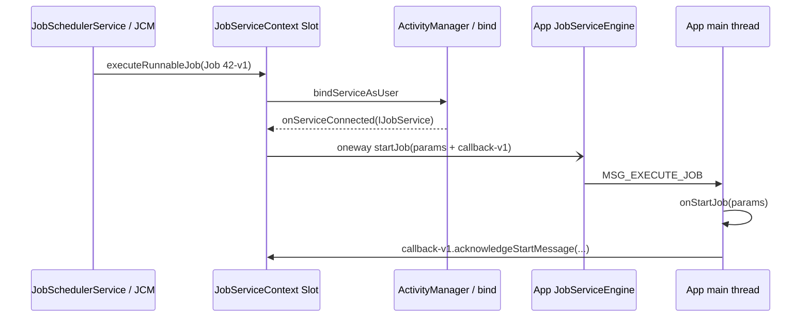
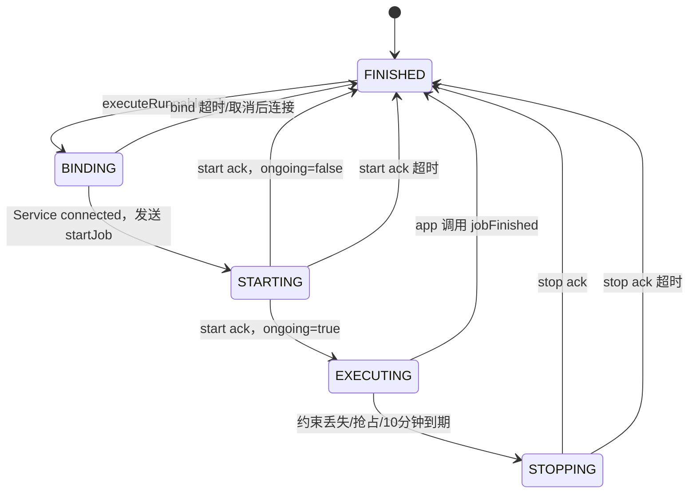

# 132 JobServiceContext：旧 Job 的迟到回调，为什么不会结束复用后的新 Job？

> 源码基线：Android 11 / API 30 / `android-11.0.0_r48`
>
> 学习方式：macOS 静态阅读，不要求编译或连接设备
>
> 前置章节：第 43、121、131 章

## 先说问题、结论和读完收获

假设 Slot #3 正在执行同步任务 `Job 42-v1`：

1. `onStartJob()` 返回 true，应用把同步工作交给后台线程；
2. 网络约束丢失，系统调用 `onStopJob()`，应用返回 true，请求以后重试；
3. Slot #3 清理后，又执行 backoff 产生的 `Job 42-v2`；两代甚至有相同的 `jobId=42`；
4. v1 的旧工作线程没及时停下，迟到地调用 `jobFinished(oldParams, false)`。

如果系统只比较 jobId，这个旧回调就可能把正在运行的 v2 错误完成。复用执行槽、异步线程和跨进程回调叠在一起，这正是 `JobServiceContext` 状态机要解决的问题。

先给结论：

> Android 11 r48 为每次执行创建一个新的 `JobCallback` Binder，并把它放进本代 `JobParameters`。应用所有开始回执、停止回执、`jobFinished()` 和 WorkItem 操作都经这个 callback 返回。JSC 比较的是 callback 对象身份，而不是只比较 jobId；旧代 token 与当前 `mRunningCallback` 不同，因此迟到回调不能清理新代。BINDING、STARTING、EXECUTING、STOPPING 四个阶段又各自配有超时和取消规则，最后统一经 `closeAndCleanupJobLocked()` 释放 WakeLock、解绑、清槽并通知 JSS。

读完本章，你应该能：

- 解释拿到执行槽后，为什么应用仍未立即进入 `onStartJob()`；
- 说清 `IJobService` 的 oneway 请求怎样通过 `IJobCallback` 取得布尔“回复”；
- 分清 `onStartJob()` 和 `onStopJob()` 的 true 分别代表什么；
- 画出五态与 18 秒、8 秒、10 分钟三组超时；
- 推演不同阶段收到取消时，为什么有时不能立刻调用 `onStopJob()`；
- 证明旧 `JobParameters` 的迟到回调为何不能误伤槽里的新代 Job；
- 区分“本代槽已清理”和“Job 将来是否 reschedule”两个完成点。

本章以普通 `schedule()` Job 为主，并在后面单独说明 `enqueue()` / `JobWorkItem` 如何复用同一代际令牌。并发容量与抢占选槽已在第 131 章讲完。

## 先分清四个对象和两个进程

名字相近的对象分布在不同进程：

| 对象 | 所在位置 | 职责 |
|---|---|---|
| `JobServiceContext`（JSC） | `system_server` | 一个可复用执行槽；负责绑定、状态、超时、WakeLock、回调校验和清理 |
| `JobStatus` | `system_server` | 一项已调度 Job 的内部定义、约束、重试次数和 WorkItem 队列 |
| `JobServiceEngine` | 应用进程 | 接收 `IJobService` Binder 请求，转投应用主线程并回传结果 |
| App 的 `JobService` | 应用进程 | 开发者实现 `onStartJob()`、`onStopJob()` 的业务入口 |

一条完整启动链是：



到 `executeRunnableJob()` 返回 true 时，只走到“绑定请求已被接受”；到 `onServiceConnected()` 才取得 app Binder；到应用主线程处理消息，才真正进入业务回调。

## 五态不是五个名词，而是四份等待协议

r48 的 JSC 状态为：

```java
VERB_BINDING   = 0;
VERB_STARTING  = 1;
VERB_EXECUTING = 2;
VERB_STOPPING  = 3;
VERB_FINISHED  = 4;
```



不要按日常中文猜状态：

| 状态 | JSC 正在等什么 | 应用业务是否一定在运行 |
|---|---|---|
| BINDING | 等 ServiceConnection | 否 |
| STARTING | 已发 `startJob()`，等 `onStartJob()` 的反向 ack | 不一定；请求可能还在 Binder 或主线程队列 |
| EXECUTING | App 回报还有异步工作，等 `jobFinished()` 或停止条件 | 只表示协议上 ongoing，不证明工作线程健康 |
| STOPPING | 已发 `stopJob()`，等 `onStopJob()` 的反向 ack | App 必须尽快停止，但线程不会被框架瞬间杀掉 |
| FINISHED | 当前代已经清槽或尚未分配 | 无当前运行 Job |

状态的意义是“接下来哪种事件才合法，以及该等多久”，不是对业务线程的一张精确运行快照。

## 三组超时分别从哪里开始

r48 固定值是：

```java
OP_BIND_TIMEOUT_MILLIS = 18_000;
OP_TIMEOUT_MILLIS = 8_000;
EXECUTING_TIMESLICE_MILLIS = 10 * 60 * 1000;
```

| 状态 | 超时 | 起点 | 超时动作 |
|---|---:|---|---|
| BINDING | 18 秒 | 发起 bind 前安排 | 直接 cleanup，不请求重试 |
| STARTING | 8 秒 | 发 `startJob()` 前安排 | 直接 cleanup，不请求重试 |
| EXECUTING | 10 分钟 | 收到 `onStartJob=true` 的 ack 后重新安排 | 设置 TIMEOUT 原因并发 `stopJob()`，进入 STOPPING |
| STOPPING | 8 秒 | 发 `stopJob()` 前重新安排 | 直接 cleanup，并请求重试 |

每次 `scheduleOpTimeOutLocked()` 都先移除旧 timeout，再按当前 `mVerb` 安排新的：

```java
removeOpTimeOutLocked();
long timeout = mVerb == VERB_EXECUTING
        ? EXECUTING_TIMESLICE_MILLIS
        : mVerb == VERB_BINDING
                ? OP_BIND_TIMEOUT_MILLIS : OP_TIMEOUT_MILLIS;
```

因此不能把 `18 秒 + 8 秒 + 10 分钟 + 8 秒` 当成每个 Job 固定经历的总时长。正常绑定可能 100ms 完成，`onStartJob(false)` 也可能在几毫秒内直接结束。

这些值是 r48 `JobServiceContext` 的实现常量，不是 App 能通过 `JobInfo` 配置的时限；其他 Android 版本需要重新核对。

Handler timeout 也不是实时中断器：到达时间只表示消息最早可被 Looper 处理，主线程繁忙时可能晚于名义时刻。10 分钟到期时系统先请求 stop，并不会直接杀死 App 的工作线程。

## 从空槽到 BINDING：槽何时算被占用

### `executeRunnableJob()` 在 bind 前就建立本代身份

入口先检查 `mAvailable`，随后在 JSS 的 `mLock` 内创建本代状态：

```java
mRunningJob = job;
mRunningCallback = new JobCallback();
mParams = new JobParameters(mRunningCallback, job.getJobId(), ...);
mExecutionStartTimeElapsed = sElapsedRealtimeClock.millis();
mVerb = VERB_BINDING;
scheduleOpTimeOutLocked();
```

这里最重要的不是参数很多，而是顺序：

- `mRunningJob` 在 bind 前已经指向 Job 42-v1；
- callback-v1 与 params-v1 同时属于这一代；
- 18 秒绑定 timeout 也携带 callback-v1；
- 从 JSS 的 `getRunningJobLocked()` 看，这个槽已经不再空闲。

`mExecutionStartTimeElapsed` 也在 bind 前记录，所以 dumpsys 的 `Running for` 包含 BINDING、STARTING、EXECUTING 和 STOPPING，不等于纯业务线程运行时长。

### `JobParameters` 是本代快照，不是 JobStatus 本体

本代参数包括：

```text
callback Binder、jobId、extras、transient extras、ClipData
deadline 是否已过期、触发 URI/authority、本轮 Network
```

其中 Network、内容触发集合与 deadline 标志是在这次执行开始前冻结给 App 的快照。之后系统内部状态继续变化，不会把同一个 `JobParameters` 变成实时状态面板。

### bind 返回 true 只表示请求被接受

JSC 使用：

```java
bindServiceAsUser(intent, this,
        BIND_AUTO_CREATE
        | BIND_NOT_FOREGROUND
        | BIND_NOT_PERCEPTIBLE,
        UserHandle.of(job.getUserId()));
```

必须区分：

```text
bindServiceAsUser() 返回 true
≠ onServiceConnected() 已回调
≠ IJobService.startJob() 已发出
≠ App 的 onStartJob() 已执行
```

bind 被接受后，JSC 才记 `noteActive`、statsd、BatteryStats、UsageStats，并把 `mAvailable=false`。但 `mRunningJob` 更早已经写入，因此“context 是否有 running Job”和“mAvailable 防御位”在极短窗口内并非同一时刻翻转。

### bind 立即失败不是事务性回滚

若 bind 返回 false 或抛 `SecurityException`，JSC 会清掉 running/callback/params，回到 FINISHED，移除 timeout并返回 false。它没有走统一 cleanup，因为连接、WakeLock和 active 统计尚未完整建立。

第 131 章已经看到，JCM 之后仍会把该 Job 从 Pending 移除；JobStatus 定义仍在 JobStore，后续是否重新进入 Pending 依赖新的 JSS 检查。Controller 的 `prepareForExecutionLocked()` 又发生在 execute 之前，r48 没有在这个 false 分支统一调用对称 rollback。

所以不能把 false 理解成“所有状态原子地恢复到调用前”。这是 r48 实现边界，不是公开 API 对 App 承诺的可观察事务。

## Service 连接后，为何先拿 WakeLock 再发 start

`onServiceConnected()` 先核对当前仍有 running Job，且回调组件名等于它的 Service component。随后取得 `IJobService`，创建 PARTIAL_WAKE_LOCK：

```java
PowerManager.WakeLock wl = pm.newWakeLock(
        PowerManager.PARTIAL_WAKE_LOCK, runningJob.getTag());
wl.setWorkSource(deriveWorkSource(runningJob));
wl.setReferenceCounted(false);
wl.acquire();
```

WakeLock 的窗口是：

```text
Service 已连接、即将发送 start
→ STARTING
→ EXECUTING / STOPPING
→ closeAndCleanup 时释放
```

它不覆盖 18 秒 BINDING 的全部等待。这样既保证 App 收到工作后 CPU 不因普通休眠中断协议，又避免仅仅等待进程/Service 建立连接就先持一只 Job WakeLock。

归因默认使用 `sourceUid`；若启用链式归因，则 WorkChain 先记 source UID，再记 `system_server` 的 JobScheduler。它回答“这段 CPU 保持应算给谁”，不改变 Binder 的 calling UID。

源码还防御一个罕见现场：新 Service 已连接时 `mWakeLock` 居然仍非 null，就先释放旧锁再替换。这不是正常状态机的常规路径，而是避免竞态下遗失一只仍活着的锁。

如果连接后宿主进程意外断开，`onServiceDisconnected()` 走统一 cleanup 并请求 reschedule。它表示执行通道崩了，不等于业务成功完成。

## oneway 的“回复”在哪里：另一条 Binder 回调链

### start/stop 没有同步返回值

`IJobService.aidl` 明确是：

```aidl
oneway interface IJobService {
    void startJob(in JobParameters jobParams);
    void stopJob(in JobParameters jobParams);
}
```

因此 system_server 调用 `service.startJob(mParams)` 后，不会在这次 Binder 调用的 reply Parcel 里同步取到 `onStartJob()` 的 boolean。oneway 的价值是：system_server 发出通知后不需要占着当前调用线程等待 App 主线程执行业务回调。

但“不等同步 reply”不等于“不需要结果”。Android 另给 App 一条反向通道 `IJobCallback`：

```text
system_server --oneway startJob(params + callback)--> App Binder线程
App Binder线程 --Handler消息--> App主线程 onStartJob()
App主线程 --acknowledgeStartMessage(boolean)--> system_server
```

这就是 oneway 取结果的通用模式：**请求和结果是两次独立 IPC，中间由 callback token 关联。**

### App Binder 线程不直接执行业务回调

`JobServiceEngine.JobInterface.startJob()` 只投递消息：

```java
Message.obtain(service.mHandler,
        MSG_EXECUTE_JOB, jobParams).sendToTarget();
```

Engine 构造时使用 `service.getMainLooper()`，因此真正的 `onStartJob()` 和 `onStopJob()` 都在应用主线程执行。回调结束后，主线程再调用 callback Binder 把 boolean 送回 JSC。

这也是为什么 `onStartJob()` 必须快速决定：若要做耗时工作，应交给自己的线程/执行器并返回 true，不能在主线程里长时间阻塞到工作完成。STARTING 的 8 秒覆盖请求传递、主线程排队、回调执行和 ack 返回这一整段等待，而不是只测某一行 Java 代码。

### 发送 start 本身抛异常时怎样收敛

JSC 在调用 `service.startJob()` 前已经进入 STARTING 并安排 8 秒 timeout。若这次调用抛异常，r48 只记录日志，没有立即 cleanup；状态仍由 STARTING timeout 收敛。

这是一种“先立超时，再调用外部进程”的防御方式：即使外部通知失败，槽也不会无限停在 STARTING。但代价是失败后可能继续占槽到 timeout 被处理。

## start 和 stop 的 boolean 为什么意思相反

### `onStartJob()` 返回值回答“本代是否还有异步工作”

App 主线程执行：

```java
boolean ongoing = JobService.this.onStartJob(params);
callback.acknowledgeStartMessage(jobId, ongoing);
```

语义是：

| start 返回值 | 含义 | JSC 下一步 |
|---|---|---|
| false | 工作已经在 `onStartJob()` 返回前完成 | 不调用 `onStopJob()`，直接 cleanup，且不请求重试 |
| true | 工作还在别处继续 | 进入 EXECUTING，开始 10 分钟 timeslice，等待 `jobFinished()` 或停止 |

true 不是“执行成功”，更不是“永不超时”；它只是声明协议仍未完成。App 接下来必须保存本代 params，并在工作完成时调用：

```java
jobFinished(params, wantsReschedule);
```

### `onStopJob()` 返回值回答“以后是否重试”

系统要求停止后，App 主线程执行 `onStopJob(params)`。无论返回什么，本代工作都必须停止：

| stop 返回值 | 当前工作 | 未来调度 |
|---|---|---|
| false | 必须停止 | 不因这次停止请求失败重试 |
| true | 也必须停止 | 请求按 backoff 等规则创建后续重试 |

因此这段应用代码是错的：

```java
@Override public boolean onStopJob(JobParameters params) {
    return true; // 错误理解：返回 true 就可以让旧线程继续
}
```

正确做法是先取消或标记后台任务停止，再用 boolean 表达是否希望系统另行重排。回调 boolean 控制的是调度协议，不会替 App 强制中断 Java 线程。

## 同一个取消请求，在四种状态下为何结果不同

JSC 先把 stop reason 写入 `JobParameters`；PREEMPT 还会保存 `preferredUid`。随后按当前 `mVerb` 分支：

```java
switch (mVerb) {
    case VERB_BINDING:
    case VERB_STARTING:
        mCancelled = true;
        break;
    case VERB_EXECUTING:
        sendStopMessageLocked(reason);
        break;
    case VERB_STOPPING:
        break;
}
```

### BINDING：还没有 App Binder，不能发送 stop

此时只设置 `mCancelled=true`。若 Service 随后连接，`handleServiceBoundLocked()` 发现已取消，不再发送 start，而是 cleanup 并请求 reschedule；若始终不连接，则由 18 秒 timeout 收敛。

### STARTING：App 可能尚未收到 start，先等待开始回执

系统已经发出 oneway start，但不知道 App 主线程处理到哪一步。JSC 先记取消，等 start ack：

- ack 为 true：短暂切到 EXECUTING，发现 `mCancelled`，再发送 stop；
- ack 为 false：App 表示本代已经完成，直接 cleanup，不需要再发 stop。

这避免了 start/stop 在 App 主线程上的协议顺序混乱。

### EXECUTING：已有 ongoing 工作，发送 stop

JSC 进入 STOPPING、安排 8 秒 timeout，并通过 oneway `stopJob(params)` 通知 App。App 主线程调用 `onStopJob()` 后，再经 `acknowledgeStopMessage(reschedule)` 返回。

### STOPPING：重复取消不重复发送

槽已经在等 stop ack，再来一个取消只保持现状，避免同一代收到多次 `onStopJob()`。

FINISHED 状态没有本代可取消，会被防御性忽略。

### 显式 cancel 为什么不会被 `cleanup(true)` 复活

有些早期取消分支会向 completion listener 传 `reschedule=true`。这不等于用户显式 `JobScheduler.cancel()` 后任务一定复活。

JSS 的显式取消路径先把 JobStatus 从 JobStore 和 Controller 中移除，再要求 JSC 停止。稍后 cleanup 回调 `onJobCompletedLocked()` 时，JSS 已找不到旧 Job，会结束处理而不会把生成的重试重新登记。

所以必须联合阅读 JSC 的“本槽希望重试”与 JSS 的“该 Job 定义是否仍存在”；一个局部 boolean 不能单独决定最终结果。

## 超时不是一种结果：四个状态有四种处置

| timeout 发生状态 | r48 处置 | 是否立刻 FINISHED |
|---|---|---|
| BINDING | `closeAndCleanup(false)` | 是 |
| STARTING | `closeAndCleanup(false)` | 是 |
| EXECUTING | 设 TIMEOUT stop reason，调用 `sendStopMessageLocked()` | 否，先进入 STOPPING |
| STOPPING | `closeAndCleanup(true)` | 是 |

最容易误读的是 10 分钟：

```text
EXECUTING timeslice 到期
→ 不是直接释放槽
→ oneway stopJob
→ 等 App 主线程 onStopJob + 反向 ack
→ 最多再由 STOPPING 的8秒超时收敛
```

如果 App 忽略 `onStopJob()` 继续跑自己的线程，JSC 可以结束协议、释放 Job WakeLock并解绑，但这不等于那个任意业务线程被 Java 层强制终止。应用必须设计自己的 cancellation flag、Future.cancel、协程取消或其他协作式停止机制。

shell 的强制 timeout 入口在 r48 也只对 `VERB_EXECUTING` 生效，不是任意阶段的“立即清槽”按钮。

## 真正防止旧回调误伤新代的是 callback 身份

### 每次执行都有一个新 token

Slot #3 执行 v1 时：

```text
mRunningJob      = Job 42-v1
mRunningCallback = callback-v1
mParams.callback = callback-v1
```

清理后，同一个槽执行 backoff 新建的 v2：

```text
mRunningJob      = Job 42-v2
mRunningCallback = callback-v2
mParams.callback = callback-v2
```

两代 jobId 都可以是 42，但 callback 对象不同。

应用旧线程调用 `jobFinished(params-v1, false)` 时，params 仍携带 callback-v1。请求回到 system_server 的旧 `JobCallback` 对象，JSC 执行：

```java
private boolean verifyCallerLocked(JobCallback cb) {
    if (mRunningCallback != cb) {
        Slog.d(TAG, "Stale callback received, ignoring.");
        return false;
    }
    return true;
}
```

callback-v1 不等于当前 callback-v2，所以旧完成被忽略，v2 继续运行。

这证明 jobId 为什么不够：jobId 标识逻辑调度项，可以在重试、周期或同一槽复用中再次出现；callback 标识的是“一次具体执行代际”。

### 普通完成与 WorkItem 对 stale token 的处理不同

开始 ack、停止 ack 和 `jobFinished()` 都走 `doCallback()`：token 不匹配时静默返回，以容忍异步迟到。

`dequeueWork()` 与 `completeWork()` 会调用更严格的 `assertCallerLocked()`；stale token 会抛 `SecurityException`，因为旧代继续领取或完成当前代工作不只是重复通知，而是可能破坏工作队列所有权。

这也说明 AIDL 中虽然还传了 `jobId`，r48 JSC 的核心代际判定并不依赖它；相关入口把真正的 `JobCallback` 对象作为首要凭证。

### timeout 消息也带同一个代际 token

安排 timeout 时：

```java
Message msg = mCallbackHandler.obtainMessage(
        MSG_TIMEOUT, mRunningCallback);
mCallbackHandler.sendMessageDelayed(msg, timeoutMillis);
```

处理时再次比较：

```java
if (message.obj == mRunningCallback) {
    handleOpTimeoutLocked();
} else {
    // 旧代 timeout，忽略
}
```

即使某条 v1 timeout 消息在槽复用后迟到，也不能给 v2 执行当前状态的超时动作。

`removeMessages(MSG_TIMEOUT)` 负责正常切状态时清旧消息，token 比较再防御已经迟到或竞态中的旧代消息。一个是清理常规队列，一个是代际正确性保护。

### ServiceConnection 校验没有使用同样的 per-bind token

`onServiceConnected()` 检查的是：当前 running Job 非空、回调 component 等于当前 Job 的 component。它没有像 `JobCallback` 那样显式携带每次 bind 的独立代际 token。

因此不能把 callback 的强代际校验自动推广到所有 ServiceConnection 竞态。r48 通过统一锁、解绑、组件检查和旧 WakeLock 防御来收敛这部分生命周期；这属于实现边界，而不是对任意迟到 bind 回调的形式化代际证明。

## cleanup 完成了什么，又故意留下什么

`closeAndCleanupJobLocked()` 是大多数正常完成、断连、取消和超时的汇合点。核心顺序是：

```text
固定首个停止原因
→ 保存 completedJob 局部引用
→ JobPackageTracker / statsd / BatteryStats 收尾
→ 释放 WakeLock
→ unbindService
→ 清 runningJob / callback / params / service
→ VERB_FINISHED，mAvailable=true，取消 timeout
→ onJobCompletedLocked(completedJob, reschedule)
```

它先清槽再通知 JSS，因此 completion listener 后续触发新分配时，这个 context 已经可被复用。

### “槽已清理”不等于“逻辑 Job 永远结束”

JSS 收到 completion 后按类型处理：

| 情况 | 后续 |
|---|---|
| one-shot，`reschedule=false` | 移除旧 JobStatus，不生成失败重试 |
| `reschedule=true` | 按 backoff 创建新的 JobStatus，失败次数 +1 |
| periodic 正常完成 | 计算下一周期并登记新的周期实例 |
| Job 已被显式 cancel/replace | 旧对象可能已不在 Store，completion 不得把它擅自复活 |

reschedule 不是“原 JobStatus 原地继续”，也不是“当前调用栈马上再跑”。新 JobStatus 要重新进入 Controller、约束、Pending和并发分配流程。

这正好形成 v1 → v2 的代际边界：逻辑 jobId 可以相同，执行对象、callback、参数快照和超时 token 都是新的。

### cleanup 不会把所有字段机械清零

为了支持上一章的抢占交接，`mPreferredUid` 不在统一 cleanup 中清掉；由后续 JCM 分配决定何时使用或清除。`mStoppedReason/mStoppedTime` 也保留给 inactive slot 的诊断，下一次成功接受 bind 后再重置。

所以检查 cleanup 不能只问“字段是否全部归零”，而要问“哪些状态属于当前代，哪些信息要跨到诊断或下一轮分配”。

## JobWorkItem 怎样复用本章的代际保护

`JobScheduler.enqueue()` 允许同一个 Job 内有多个 `JobWorkItem`。它没有另造一套执行槽协议，而是经当前 `JobParameters.callback` 调用 JSC。

系统内部维护两张队列：

```text
pendingWork   等 App 领取
executingWork 已领取、尚未 complete
```

`dequeueWorkLocked()` 把队首从 pending 原子移动到 executing，并增加 delivery count；`completeWorkLocked(workId)` 从 executing 删除对应项并撤销该 WorkItem 的 URI grant。

两个完成边界容易混淆：

- App 再次 dequeue，发现 pending 为空且 executing 也为空：JSC 自动把整个 Job 当作完成；
- App complete 最后一个 executing item：只完成这一项，不在该方法里自动结束整个 Job；App 还要再 dequeue 到 null 或按 API 约定结束。

若失败重试生成新 JobStatus，旧代 executing work 会先放回新代 pending 前部，再接上原 pending work；这让“已领取但未确认完成”的工作有机会重新投递。若彻底停止且没有 incoming Job，则撤销剩余 WorkItem 的授权并清队列。

WorkItem 的 dequeue/complete 同样验证本代 callback，所以 v1 不能用旧 params 去领取或确认 v2 的工作。

## 线程模型：跨进程不等于都在 Binder 线程完成

完整线程接力可以概括为：

```text
system_server 调度入口（主 Handler、Binder 入口等）
→ 持 JSS mLock 修改 JSC
→ oneway IJobService 到 App Binder 线程
→ JobServiceEngine Handler 到 App 主线程
→ IJobCallback 回 system_server Binder 线程
→ 持同一 mLock 校验 token 并推进状态
```

JSC timeout Handler 使用构造时传入的 system_server 主 Looper；`onServiceConnected()` 默认也在 system_server 的相应主线程分发。与此同时，App 发回的 `IJobCallback` 可以进入 system_server Binder 线程。

正确的不变量是：共享的 running/callback/verb/timeout 状态在 JSS `mLock` 下串行检查与修改。不能把原因简化成“所有事件天然都在主线程”。

`doCallback()` 还先 `Binder.clearCallingIdentity()`，再持锁处理，最后恢复身份。原因是后续 JSS/Controller 操作不应继续冒用 App 的 Binder 调用身份；这与 callback token 校验解决的是两个不同问题：前者管安全身份，后者管执行代际。

## 用 v1 → v2 场景做一次完整推演

### v1 启动

```text
FINISHED
→ executeRunnableJob：callback-v1，BINDING，18秒
→ Service connected：取得 WakeLock，STARTING，8秒
→ App 主线程 onStartJob 返回 true
→ ack-v1：EXECUTING，10分钟
```

App 应把同步工作放到 worker，并保存 params-v1 供本代结束时使用。

### 网络约束丢失

```text
cancelExecutingJobLocked(CONSTRAINTS_NOT_SATISFIED)
→ EXECUTING → STOPPING，8秒
→ App 主线程 onStopJob(params-v1)
→ App 先取消 worker，再返回 true 请求重试
→ ackStop-v1 → cleanup
```

JSS 创建带 backoff 的 Job 42-v2；它不会在 cleanup 的同一时刻绕过约束直接执行。

### v2 后来复用 Slot #3

```text
mRunningCallback = callback-v2
mParams = params-v2
```

若旧 worker 未正确响应取消，迟到调用 `jobFinished(params-v1, false)`：

```text
params-v1.callback = callback-v1
callback-v1 != 当前 callback-v2
→ verifyCallerLocked=false
→ 忽略旧完成
→ v2 不受影响
```

系统端防住了误完成，但应用端仍有责任停止 v1：旧线程继续访问文件、网络或数据库，依然可能与 v2 产生业务竞态。callback token 保护的是 JobScheduler 状态，不会自动修复 App 自己的数据并发。

## macOS 静态验证：按四条证据链阅读

在 AOSP 根目录执行。

### 1. 验证五态和三组 timeout

```bash
rg -n -C 8 'VERB_BINDING|OP_BIND_TIMEOUT_MILLIS|scheduleOpTimeOutLocked' \
  frameworks/base/apex/jobscheduler/service/java/com/android/server/job/JobServiceContext.java
```

预期观察：BINDING 单独使用 18 秒，EXECUTING 使用 10 分钟，其他等待 ack 的状态使用 8 秒；切状态会重排 timeout。

### 2. 验证 oneway 请求与反向 callback

```bash
rg -n -C 8 'oneway interface IJobService|acknowledgeStartMessage|acknowledgeStopMessage' \
  frameworks/base/apex/jobscheduler/framework/java/android/app/job/IJobService.aidl \
  frameworks/base/apex/jobscheduler/framework/java/android/app/job/IJobCallback.aidl \
  frameworks/base/apex/jobscheduler/framework/java/android/app/job/JobServiceEngine.java
```

预期观察：start/stop 本身没有返回值；App Handler执行回调后，经 IJobCallback 把 boolean 反向送回。

### 3. 验证代际 token

```bash
rg -n -C 10 'mRunningCallback = new JobCallback|verifyCallerLocked|message.obj == mRunningCallback' \
  frameworks/base/apex/jobscheduler/service/java/com/android/server/job/JobServiceContext.java
```

预期观察：每次 execute 新建 callback；普通回调和 timeout 都用对象身份与当前代比较。

### 4. 验证 cleanup 与重试是两层

```bash
rg -n -C 12 'closeAndCleanupJobLocked|onJobCompletedLocked|getRescheduleJobForFailureLocked' \
  frameworks/base/apex/jobscheduler/service/java/com/android/server/job/JobServiceContext.java \
  frameworks/base/apex/jobscheduler/service/java/com/android/server/job/JobSchedulerService.java
```

预期观察：JSC 先释放本槽资源再通知 JSS；JSS 根据 reschedule、periodic 和 Store 当前状态决定是否创建新 JobStatus。

这些命令能验证 r48 源码事实，不能代替真机测量 App 主线程拥堵时的实际延迟。

## 检查题与答案

### 1. `executeRunnableJob()` 返回 true，能否记录“App 已开始执行”？

不能。此时只成功发起绑定并让 JSC 承担该 Job，仍处 BINDING。至少要看到 ServiceConnection、startJob 发送和 App 主线程回调；不同观测点的“开始”定义也要写清。

### 2. `IJobService` 是 oneway，`onStartJob()` 的 boolean 怎么回来？

不是通过原 Binder reply。JobParameters 携带 `IJobCallback`，App 主线程执行完 `onStartJob()` 后另发 `acknowledgeStartMessage(jobId, boolean)` 到 system_server。

### 3. `onStartJob()` 返回 true 是否表示任务成功？

不是。它表示还有异步工作，JSC 进入 EXECUTING。最终还要 `jobFinished()`、停止 ack 或 timeout 收敛。

### 4. `onStopJob()` 返回 true 后，旧线程可以继续吗？

不可以。无论 true/false，本代都必须停止。true 只请求系统以后按重试规则安排新代。

### 5. 10 分钟到期是否立即释放 context？

不是。EXECUTING timeout 先发 stop 并进入 STOPPING；正常等 App ack，最坏再由 STOPPING 的 8 秒 timeout 清理。Handler 调度还不是硬实时秒表。

### 6. v1 与 v2 的 jobId 都是 42，旧 `jobFinished()` 为什么不能结束 v2？

因为 params-v1 携带 callback-v1，JSC 当前保存 callback-v2；`verifyCallerLocked()` 比较 callback 对象身份，二者不同就忽略旧完成。

### 7. 为什么 WorkItem 的 stale callback 要抛异常，而普通迟到完成只是忽略？

普通完成可能是可容忍的重复/迟到通知；旧代 dequeue 或 complete 会改变当前工作队列所有权，风险更高，因此使用 `assertCallerLocked()` 严格拒绝。

### 8. `closeAndCleanup(true)` 是否足以证明 Job 必然重试？

不足。它只是 JSC 向 JSS 传递请求；JSS 还要看旧 Job 是否仍在 Store、是否被显式 cancel/replace，以及是否为周期 Job，然后才决定创建哪个后续 JobStatus。

## 一次可操作练习：画出 callback-v1 的所有去路

请画一张表：

```text
事件 | 到达时 mVerb | callback 是否当前代 | JSC 动作 | 是否生成新 JobStatus
```

依次推演：

1. v1 的 start ack 返回 true；
2. EXECUTING 第 5 分钟网络丢失；
3. stop ack 返回 true；
4. v2 复用同一槽并进入 EXECUTING；
5. v1 的旧 `jobFinished(false)` 迟到；
6. v1 的旧 timeout 消息迟到；
7. v2 正常 `jobFinished(false)`。

参考答案：

| 事件 | 核心判断 | 结果 |
|---|---|---|
| start ack-v1=true | token 当前，状态 STARTING | 进入 EXECUTING，安排 10 分钟 |
| 网络丢失 | 当前 EXECUTING | 进入 STOPPING，发 stop-v1，安排 8 秒 |
| stop ack-v1=true | token 当前，状态 STOPPING | cleanup v1；JSS 可按 backoff 创建 v2 |
| v2 启动 | 新 callback-v2 | 槽的新代建立 |
| old jobFinished-v1 | callback-v1 != callback-v2 | 静默忽略，不完成 v2 |
| old timeout-v1 | message token != callback-v2 | 记录/忽略，不对 v2 执行 timeout |
| jobFinished-v2=false | callback-v2 当前，状态 EXECUTING | cleanup v2，不请求失败重试 |

再补一句应用侧结论：即使 system_server 正确忽略旧回调，App 仍必须让 v1 worker 真正停止，并用自己的 generation/cancellation 机制避免旧线程继续写业务数据。

## 最后带走这六句话

1. `JobServiceContext` 是 system_server 的可复用执行槽，不是应用的 `JobService`。
2. BINDING、STARTING、EXECUTING、STOPPING 分别等待连接、start ack、业务完成和 stop ack；18 秒、8 秒、10 分钟不能合成一个总倒计时。
3. `IJobService` 用 oneway 发 start/stop，boolean 结果通过 `IJobCallback` 的第二次 IPC 返回。
4. start 的 true 表示“还有工作”；stop 的 true 表示“以后希望重试”，但当前都必须停止。
5. 每代新建的 `JobCallback` 是执行令牌；jobId 相同也不会让旧回调通过身份校验。
6. cleanup 结束的是当前槽代际；是否 backoff、周期续排或彻底消失，由 JSS 和 JobStore 的更高层状态决定。

## 源码索引

| 目的 | Android 11 r48 文件 |
|---|---|
| 五态、timeout、WakeLock、token 与 cleanup | `frameworks/base/apex/jobscheduler/service/java/com/android/server/job/JobServiceContext.java` |
| oneway start/stop | `frameworks/base/apex/jobscheduler/framework/java/android/app/job/IJobService.aidl` |
| 反向 ack、finish 与 WorkItem 接口 | `frameworks/base/apex/jobscheduler/framework/java/android/app/job/IJobCallback.aidl` |
| App Binder 到主线程及 boolean 回传 | `frameworks/base/apex/jobscheduler/framework/java/android/app/job/JobServiceEngine.java` |
| App 回调语义 | `frameworks/base/apex/jobscheduler/framework/java/android/app/job/JobService.java` |
| 当前代参数与 callback | `frameworks/base/apex/jobscheduler/framework/java/android/app/job/JobParameters.java` |
| 完成后的 backoff、周期与 Store 处理 | `frameworks/base/apex/jobscheduler/service/java/com/android/server/job/JobSchedulerService.java` |
| WorkItem pending/executing、转移和授权 | `frameworks/base/apex/jobscheduler/service/java/com/android/server/job/controllers/JobStatus.java` |

下一章会把本章最后预览的 `JobWorkItem` 放大：同一个 Job 里多份工作怎样入队、领取、确认、失败重投，并且让 URI 临时授权跟着正确的一项工作生灭。
