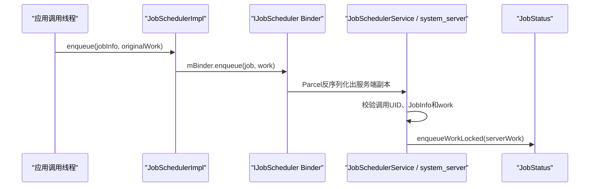
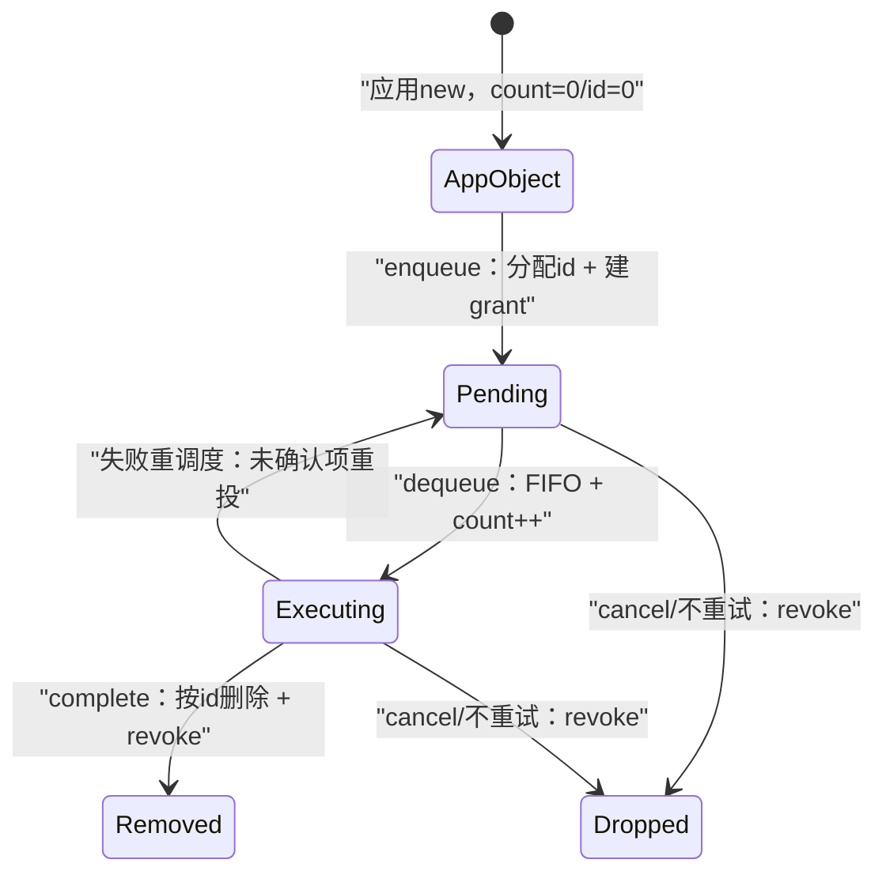
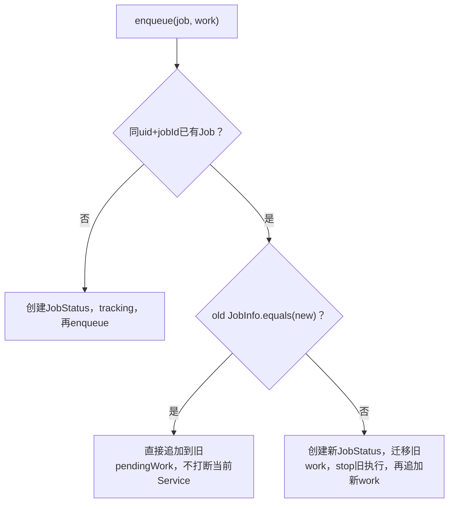
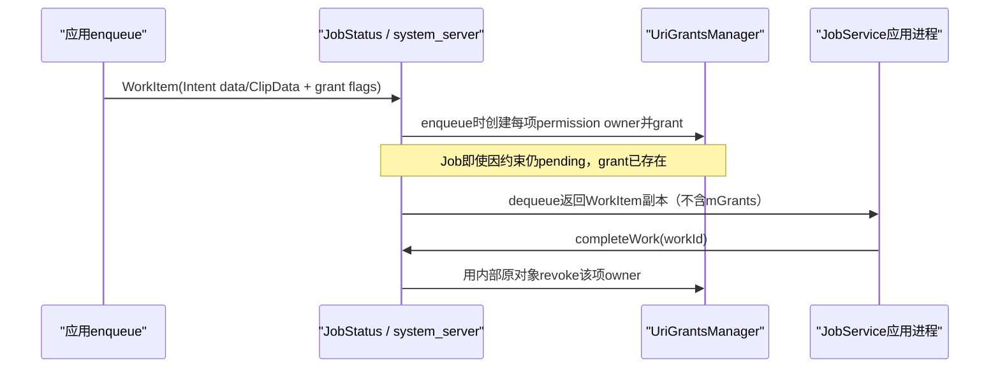
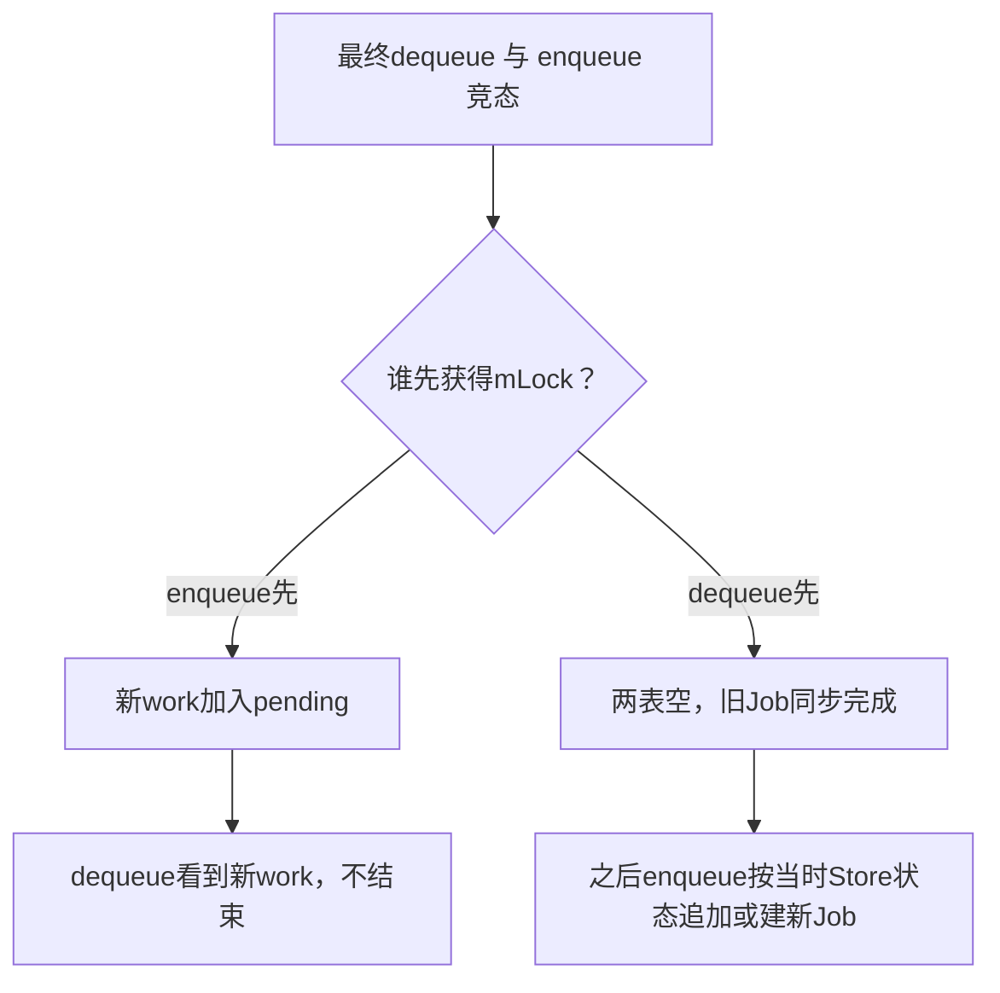
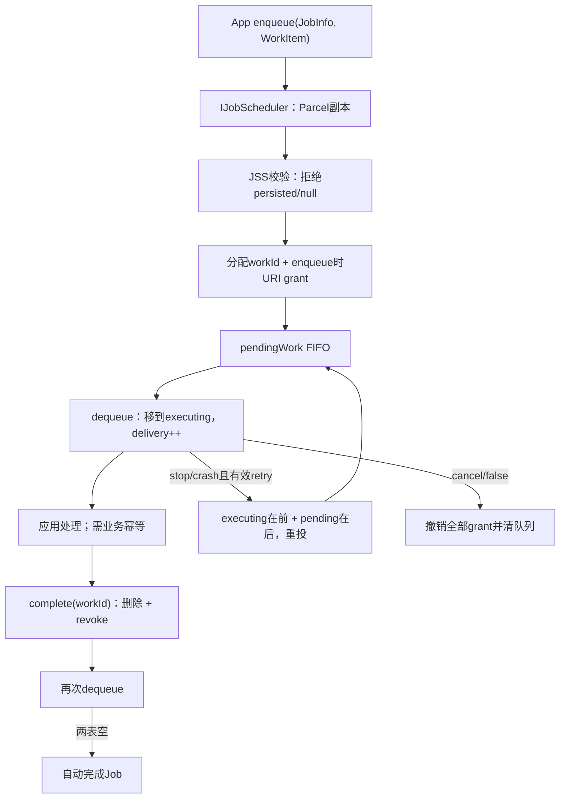

# 133 Android JobWorkItem 工作队列：入队、领取、确认、重投与 URI 授权

> 源码版本：Android 11 / API 30 / `android-11.0.0_r48`  
> 学习方式：macOS 只读源码，不要求编译、不要求连接设备  
> 前置章节：第 121、123、132 章

---

## 1. 本章研究“一个 Job 怎样承载很多小任务”

普通 `schedule(JobInfo)` 更像提交一个“满足条件后执行一次”的任务定义。`enqueue(JobInfo, JobWorkItem)` 则允许应用把一批小工作不断追加到同一个 Job 中：

```text
JobInfo
  决定由哪个 JobService 处理、需要哪些约束

JobWorkItem W1/W2/W3
  各自携带本次小工作的 Intent 数据、流量估算与交付次数
```

本章沿着 W1 从应用入队到最终确认，回答：

1. `pendingWork` 与 `executingWork` 为什么必须分开；
2. 为什么 dequeue 不等于处理完成；
3. `deliveryCount=2` 到底意味着什么；
4. URI 权限何时授予、何时撤销；
5. App 崩溃后工作可以重投，为何设备重启后却不能恢复；
6. 为什么使用 WorkItem 时不应随便调用 `jobFinished()`。

---

## 2. 先用“仓库工作单”建立直觉

可以把一个 JobStatus 想成仓库：

```text
pendingWork
  待领取区：工作单还没有交给工人

executingWork
  已签出区：工作单已交给工人，但仓库还没收到完成回执

dequeueWork()
  领取：pending → executing

completeWork()
  回执：从 executing 删除
```

最重要的区别是：**拿走工作单不代表工作已经完成**。如果工人处理到一半崩溃，仓库必须知道哪些工作单已经签出但没有回执，才能把它们重新投递。

---

## 3. 贯穿案例

假设 `com.demo.uploader` 用 Job 80 上传三张照片：

```text
W1 = photo-a.jpg
W2 = photo-b.jpg
W3 = photo-c.jpg
```

应用先完整处理并确认 W1，然后同时领取 W2、W3；W2 已上传到服务端但还没调用 `completeWork()` 时应用进程崩溃。

重启后框架会把未确认的 W2、W3 重新交付：

```text
W1：已确认，不再出现
W2：deliveryCount 由1变2，可能产生重复业务副作用
W3：deliveryCount 由1变2
```

这说明框架提供的是未确认项重投，不是端到端 exactly-once。

---

## 4. 源码地图

公开 API 与数据对象：

```text
frameworks/base/apex/jobscheduler/framework/java/android/app/job/JobScheduler.java
frameworks/base/apex/jobscheduler/framework/java/android/app/job/JobWorkItem.java
frameworks/base/apex/jobscheduler/framework/java/android/app/job/JobParameters.java
frameworks/base/apex/jobscheduler/framework/java/android/app/JobSchedulerImpl.java
```

跨进程接口与服务端入口：

```text
frameworks/base/apex/jobscheduler/framework/java/android/app/job/IJobScheduler.aidl
frameworks/base/apex/jobscheduler/framework/java/android/app/job/IJobCallback.aidl
frameworks/base/apex/jobscheduler/service/java/com/android/server/job/JobSchedulerService.java
frameworks/base/apex/jobscheduler/service/java/com/android/server/job/JobServiceContext.java
```

真正的队列与 URI 授权：

```text
frameworks/base/apex/jobscheduler/service/java/com/android/server/job/controllers/JobStatus.java
frameworks/base/apex/jobscheduler/service/java/com/android/server/job/GrantedUriPermissions.java
frameworks/base/apex/jobscheduler/service/java/com/android/server/job/JobStore.java
```

测试与示例：

```text
cts/tests/JobSchedulerSharedUid/src/android/jobscheduler/cts/shareduidtests/EnqueueJobWorkTest.java
cts/tests/JobSchedulerSharedUid/src/android/jobscheduler/MockJobService.java
development/samples/ApiDemos/src/com/example/android/apis/app/JobWorkService.java
```

---

## 5. JobWorkItem 的六个核心字段

r48 对象中有：

```java
final Intent mIntent;
final long mNetworkDownloadBytes;
final long mNetworkUploadBytes;
int mDeliveryCount;
int mWorkId;
Object mGrants;
```

可以分成三组：

| 分组 | 字段 | 含义 |
|---|---|---|
| 应用工作数据 | Intent、上下行估算 | 应用提交并可读取 |
| 系统队列协议 | workId、deliveryCount | 系统编号与投递计数 |
| system_server 资源 | grants | URI permission owner 等内部授权对象 |

`mWorkId` 和 `mGrants` 是隐藏实现字段，不是让应用自行设置的业务标识。

---

## 6. Intent 在这里不是组件启动指令

`JobWorkItem.getIntent()` 返回的 Intent 是工作数据载体，例如 action、extras、data URI、ClipData。

它不会被 JobScheduler 自动拿去 `startActivity()` 或 `startService()`。真正绑定哪个 JobService，由：

```java
jobInfo.getService()
```

决定。应用的 `onStartJob()` 收到 JobParameters 后，再主动 dequeue 并解释每项 Intent。

---

## 7. 两种构造方式

只给工作 Intent：

```java
new JobWorkItem(intent)
```

此时上下行估算都是：

```text
JobInfo.NETWORK_BYTES_UNKNOWN = -1
```

也可以提交估算：

```java
new JobWorkItem(intent, downloadBytes, uploadBytes)
```

当 Job 带网络约束时，估算会参与 ConnectivityController 的“这条网络是否可能在执行时限内传完”判断，但不是流量配额或实际计量值。

---

## 8. 新对象的 deliveryCount 与 workId 都从0开始

Java 默认值使刚创建的对象具有：

```text
deliveryCount = 0
workId = 0
grants = null
```

但应用真正从 `dequeueWork()` 拿到它时，system_server 已先调用 `bumpDeliveryCount()`，所以**首次可见交付通常是1**。

不要写成“第一次处理看到0”；0只描述尚未被服务端交付的对象状态。

---

## 9. 应用提交对象不是 system_server 保存的同一个 Java 对象

调用链：



AIDL 参数是 `in`。服务端分配 `workId`、建立 grant、增加 delivery count，都不会反向修改应用最初 new 出来的 `originalWork`。

---

## 10. 从应用到服务端的第一次 Parcel

`writeToParcel()` 写入：

```text
Intent存在标志 + Intent
downloadBytes
uploadBytes
deliveryCount
workId
```

没有写 `mGrants`。原因不是漏写：grants 是 system_server 内部 permission owner，不能也没有必要交给外部应用持有。

这也说明 Parcelable 只证明对象能跨 Binder/进程，不证明它能跨重启持久化。

---

## 11. dequeue 时还会发生第二次 Parcel

应用执行：

```java
JobWorkItem work = params.dequeueWork();
```

实际是 `IJobCallback.dequeueWork(jobId)` 同步 Binder 调用。system_server 从队列取出内部对象后，把它再 Parcel 给应用。

所以应用应传给 `completeWork()` 的，是**dequeue 返回的对象**；它携带服务端分配的隐藏 workId。不要保存 enqueue 时的原始对象并拿它确认，因为那个副本通常仍是 `workId=0`。

---

## 12. workId 是系统确认键，不是 Intent action

入队时：

```java
work.setWorkId(nextPendingWorkId);
nextPendingWorkId++;
```

`nextPendingWorkId` 初始为1。服务端 complete 时只查：

```text
当前 executingWork 中是否有相同 workId
```

Intent action、URI、extras 即使相同，也不会合并成同一项。业务若需要去重，必须另设自己的幂等键。

---

## 13. workId 的作用域

workId 由某个 JobStatus 的 `nextPendingWorkId` 分配；失败重试或 replacement 时，这个 next 值会迁移给 incoming JobStatus，以避免后续追加与旧项编号冲突。

它不是：

- 全设备唯一 ID；
- 跨 system_server 重启稳定 ID；
- 服务端业务去重 ID；
- jobId 的替代品。

应用一般不需要也不能通过公开 API 读取/设置 workId。

---

## 14. Binder 入口先做哪些硬校验

`JobSchedulerStub.enqueue()` 依次：

```text
读取 Binder calling UID/user
enforceValidJobRequest(uid, job)
拒绝 persisted Job
拒绝 null work
validateJobFlags(job, uid)
clearCallingIdentity
scheduleAsPackage(job, work, uid, ...)
```

`work == null` 抛 `NullPointerException`；persisted Job 则抛 `IllegalArgumentException`。

---

## 15. WorkItem 与 persisted Job 在 r48 不能共用

源码是明确的 API 硬门：

```java
if (job.isPersisted()) {
    throw new IllegalArgumentException(
            "Can't enqueue work for persisted jobs");
}
```

因此不能设计“把 WorkItem 队列写进 jobs.xml，重启后继续”。如果业务必须跨设备重启，应把权威工作列表保存在应用自己的数据库中，Job 只作为唤醒/调度信号。

---

## 16. 入队总链路

```text
JobScheduler.enqueue
→ JobSchedulerImpl.enqueue
→ IJobScheduler.enqueue
→ JobSchedulerStub.enqueue
→ JobSchedulerService.scheduleAsPackage(job, work, callingUid...)
→ JobStatus.enqueueWorkLocked
```

最后一步才分配 workId、创建 URI grant、加入 `pendingWork` 并更新网络估算。

---

## 17. pendingWork 是 FIFO

入队：

```java
pendingWork.add(work);
```

领取：

```java
JobWorkItem work = pendingWork.remove(0);
```

所以单个 JobStatus 的待领取顺序是 FIFO。这里说的是框架交付顺序，不保证应用并行处理完成顺序，也不保证远端业务提交顺序。

---

## 18. dequeue 的完整状态变化



`executing` 在这里表示“已交给应用、未确认”，不证明实际线程仍在 CPU 上运行。

---

## 19. deliveryCount 只在 dequeue 时增加

源码顺序：

```java
executingWork.add(work);
work.bumpDeliveryCount();
```

以下事件本身不增加 delivery count：

- enqueue；
- Job 被 stop；
- 应用崩溃；
- WorkItem 从旧 executing 迁回新 pending。

只有下一代再次 dequeue 时，1才变2。

---

## 20. deliveryCount 不是 Job 总运行次数

每个 WorkItem 独立计数：

```text
W1 首次领取并完成：1
W2 首次领取后崩溃，再领取：2
W3 直到第二轮才首次领取：1
```

同一个 Job 的三项可以同时呈现1、2、1。不能拿某一项的 count 推导 JobService 总共启动了多少次。

---

## 21. complete 可以乱序

应用可以连续 dequeue W1、W2、W3 并行处理，然后按：

```text
complete W3
complete W1
complete W2
```

确认。`completeWorkLocked()` 遍历 executing 列表按 workId 查找，不要求确认顺序与领取顺序一致。

并行能力来自协议，线程安全、取消和业务幂等仍由应用负责。

---

## 22. complete 的精确动作

找到 workId 后：

```java
executingWork.remove(i);
ungrantWorkItem(work);
return true;
```

所以 complete 同时代表：

1. 这项不应重投；
2. 这项临时 URI grant 可以撤销；
3. executing 列表不再保存它。

它不是“打印完成日志”这么轻量的动作。

---

## 23. 非法 complete 有两类结果

旧运行代际的 callback token 调 complete：

```text
JSC assertCallerLocked → SecurityException
```

token 合法，但 workId 不在 executing 中，例如重复 complete 或从未 dequeue：

```text
服务端返回 false
JobParameters.completeWork → IllegalArgumentException
```

一个是运行权限已经过期，另一个是当前代的工作单状态不合法。

---

## 24. complete 最后一项不会自动结束 Job

`completeWorkLocked()` 删除项后直接返回，不检查 pending 是否为空，也不调用 JSC cleanup。

应用必须再次：

```java
params.dequeueWork()
```

当 dequeue 得到 null 且 executing 也空时，JSC 才自动完成整个 Job。

---

## 25. 为什么必须“再 dequeue 一次”

因为 enqueue 可能与 complete 同时发生。最终 dequeue 在 JSS 同一把 `mLock` 下同时看 pending 与 executing：

```text
enqueue 先拿锁
  → 新work已进pending，dequeue能看到它

最终dequeue先拿锁
  → 两表确实空，原Job同步完成；
    之后enqueue会为新工作建立/取得有效JobStatus
```

这是比应用主观判断“我刚处理了最后一项”更可靠的系统判定点。

---

## 26. 空队列自动完成的服务端条件

JSC：

```java
JobWorkItem work = mRunningJob.dequeueWorkLocked();
if (work == null && !mRunningJob.hasExecutingWorkLocked()) {
    doCallbackLocked(false, "last work dequeued");
}
```

只有：

```text
pendingWork为空 AND executingWork为空
```

才自动 `reschedule=false` 完成。dequeue 得到 null，但还有并行中的 executing 项时，Job 不会结束。

---

## 27. WorkItem 模式不要主动 jobFinished

公开文档明确警告：若使用 enqueue/work queue，不应靠 `jobFinished()` 结束。

`jobFinished(false)` 不执行“两表是否同时为空”的工作协议检查；若新 work 刚先入队，随后 finish 可能把它随旧 Job 一起清掉。应让最终 dequeue-null 路径在系统锁内结束。

---

## 28. 一个正确的串行处理骨架

```java
while (!cancelled) {
    JobWorkItem work = params.dequeueWork();
    if (work == null) {
        return; // system_server已在真正空队列时自动完成
    }
    processIdempotently(work.getIntent());
    params.completeWork(work);
}
```

`onStartJob()` 应迅速启动工作线程并返回 true；`onStopJob()` 设置取消状态、停止后台操作，并按是否需要未完成项重投返回 boolean。

---

## 29. 官方示例能学协议，不能机械照搬线程工具

ApiDemos 的 `JobWorkService` 使用 AsyncTask：

```text
后台循环 dequeue → 处理 → complete
onStartJob 返回 true
onStopJob cancel processor 并返回 true
```

这个样例准确展示协议，但 AsyncTask 已是旧式工具。现代代码可换成 Executor、线程池或其他受控机制，核心仍是快速 start、可取消、逐项确认和最终 dequeue-null。

---

## 30. STOPPING 时停止领取，尚可出现完成竞态

第132章看到：当前 token 仍有效且 JSC 已 STOPPING 时，`dequeueWork()` 返回 null，不再发新项；`completeWork()` 却没有相同 verb 门。

因此后台线程若恰在 cleanup 前完成某项，仍可能成功确认，使它不再重投。应用不能把收到 stop 等同于 executing 列表瞬间冻结，正确做法仍是立刻通知工作线程停止并处理自己的竞态。

---

## 31. App 崩溃为什么未确认工作不会立刻丢失

JobService 进程意外断开时，JSC `cleanup(true)`，JSS 创建 failure-rescheduled JobStatus。旧 JobStatus 在被移除前，把工作列表迁给新对象。

这里 system_server 没有死亡，所以权威 pending/executing 内存仍存在；App 进程里的 WorkItem 副本丢失不影响系统端队列。

---

## 32. 重投时的顺序

`stopTrackingJobLocked(incomingJob)` 先：

```text
incoming.pendingWork = old.executingWork
```

再追加：

```text
old.pendingWork
```

因此“原先已领取但未确认”的项回到队首，排在从未领取项之前，保留原队列的基本先后关系。

---

## 33. A/B/C/D 手算重投

停止前：

```text
A 已complete
B、C 已dequeue未complete
D 仍pending
```

迁移后：

```text
new pending = [B, C, D]
```

下一次领取：

```text
B delivery=2
C delivery=2
D delivery=1
```

A 已收到确认，不再出现。

---

## 34. 重投不是“失败时复制所有历史工作”

只迁移当时仍在：

```text
executingWork + pendingWork
```

已 complete 项已经删除；它们不会因为整个 Job 失败而复活。

这也是为什么业务应在真正完成持久副作用后再 complete，不能提前确认。

---

## 35. onStopJob true 只是重投的必要条件之一

普通约束停止时返回 true，JSC 会向 JSS表达失败重调度意图。但还需原 Job 仍在 JobStore。

若应用显式 `cancel(jobId)`，JSS 已先把旧 Job 从 Store 移除，随后旧 JSC 即使收到 true，也不会让旧定义复活。

---

## 36. onStopJob false 会怎样

没有 incoming JobStatus 时，旧 `stopTrackingJobLocked(null)`：

```text
撤销所有pendingWork grants
清pendingWork
撤销所有executingWork grants
清executingWork
```

所以 false 不只是“这次不马上跑”，而是普通非周期 Job 剩余工作队列被彻底结束。

---

## 37. cancel 不是 retry

公开 `cancel()` 文档说明：当前 Job 会被停止，`onStopJob()` 的返回值被忽略。

服务端先移除调度定义和工作队列，再通知运行槽停止。取消是业务明确撤销，不应让迟到 stop ack 把未完成 WorkItem 再排回来。

---

## 38. 相同 jobId 不保证“追加而不中断”

JSS 的快速追加条件是：

```java
toCancel != null && toCancel.getJob().equals(newJobInfo)
```

只有 JobInfo equals 相同，才直接 `toCancel.enqueueWorkLocked(work)`。

若 JobInfo 不同，即使 jobId 相同，也创建新 JobStatus、replace 旧定义，正在执行的 JobService 会被 stop。

---

## 39. 相同 JobInfo 的快速路径



快速路径还可能给整个 Job 增加“入队时 source UID 在前台”的内部豁免；它是 Job 级粘性状态，不只属于新 WorkItem。

---

## 40. 为什么官方强烈建议稳定复用 JobInfo

每次 enqueue 都重新构造约束略有不同的 JobInfo，会导致：

```text
旧JobStatus被替换
旧Controller关系拆除/新建
当前JobService收到stop
未完成work迁移
以后重新竞争执行槽
```

这既增加开销，又使应用更频繁面对取消、重投和重复副作用。

---

## 41. extras 比较可能造成“看似相同，实际 replacement”

API 文档建议 enqueue 模式避免复杂的：

```text
setExtras(PersistableBundle)
setTransientExtras(Bundle)
```

系统会尝试比较，但某些内容可能被判断为变化。若确实使用，应保证字段简单且每次一致。

每项变化数据应优先放在各自 WorkItem 的 Intent 中，而不是不断重建 JobInfo extras。

---

## 42. JobInfo ClipData 更应避免

公开文档明确说 enqueue 工作时不应在 JobInfo 上用 `setClipData()`：当前比较会把它视为不同 JobInfo，即使内容看起来一样。

工作级 URI/ClipData 应放进：

```text
JobWorkItem.getIntent()
```

由每项独立 grant 生命周期管理。

---

## 43. replacement 如何迁移旧 work

JSS 创建 incoming JobStatus 后，`cancelJobImplLocked(old, incoming, ...)` 内部先调用：

```text
old.stopTrackingJobLocked(incoming)
```

旧 executing、旧 pending 和 nextPendingWorkId 都迁给 incoming；然后 JSS tracking 新对象。最后，本次新 enqueue 的 work 再追加到 incoming 尾部。

因此 replacement 不必丢旧 work，但会打断旧运行代际。

---

## 44. replacement 与 failure reschedule 的共同点和区别

共同点：

```text
都有 incoming JobStatus
都可接收旧 executing + pending
都保留nextPendingWorkId
```

区别：

```text
replacement：应用提交了不同JobInfo，约束/配置可能变化
failure reschedule：框架从旧JobInfo创建带backoff的新实例
```

两者都不是旧 Java 对象原地继续。

---

## 45. replacement 期间旧线程 complete 的边界

replacement 先在 JSS 锁内把旧 executing 列表转移并清空，再向旧 JSC 发 stop。旧应用线程若随后用旧 callback complete：

- token 尚未 cleanup 时，旧 JobStatus executing 已经为空，通常找不到 workId；
- cleanup 后，token 又会变 stale。

这再次说明不要频繁改变 JobInfo，也不要在 stop 后继续处理旧代际。

---

## 46. URI grant 在 enqueue 时就建立

`enqueueWorkLocked()` 在加入 pending 前检查 Intent flags：

```java
if (work.getIntent() != null
        && GrantedUriPermissions.checkGrantFlags(
                work.getIntent().getFlags())) {
    work.setGrants(GrantedUriPermissions.createFromIntent(...));
}
```

所以授权不是等到 dequeue 或 JobService 启动才产生。即使约束尚未满足、WorkItem 仍在 pending，授权也可能已经存在。

---

## 47. 哪些 flag 会触发授权

只关心：

```text
Intent.FLAG_GRANT_READ_URI_PERMISSION
Intent.FLAG_GRANT_WRITE_URI_PERMISSION
```

至少有一个才建立 `GrantedUriPermissions`。其他 Intent flags 不会因此创建 URI permission owner。

---

## 48. 一项 WorkItem 会扫描哪些 URI

`createFromIntent()` 处理：

1. Intent 自身的 `data`；
2. Intent 的 ClipData 中每个 `item.getUri()`；
3. ClipData item 内嵌 Intent 的 `getData()`。

对带 userId 的 URI，先取 source user，再移除 URI 外层 userId，最后调用 UriGrantsManager 建授权。

---

## 49. 授权给谁

参数来自 JobStatus 的 source 身份：

```text
sourceUid
sourcePackageName
sourceUserId
```

真正目标是执行 Job 的 source package/user。`scheduleAsPackage()` 等场景中，它不一定等于最初调用 JobScheduler 的 calling package。

---

## 50. 每个 WorkItem 有独立 permission owner

第一次成功 grant 某个 URI 时创建：

```text
newUriPermissionOwner("job: " + tag)
```

该 `GrantedUriPermissions` 对象保存自己的 owner 与 URI 列表，并挂在对应 WorkItem 的 `mGrants`。

所以两个 work 都引用 URI A 时，完成 W1 只撤 W1 owner 的授权；W2 owner 仍可使 A 保持可访问。

---

## 51. mGrants 为什么不跨 Parcel

应用不需要看到 permission-owner Binder 和内部 URI 列表，只需要正常访问自己收到的 URI。

system_server 保存的队列对象持有 `mGrants`；发给应用的 WorkItem 副本没有这个字段。应用回传 complete 时只带 workId，系统再从自己的 executingWork 找到原对象并 revoke。

---

## 52. complete 是逐项撤销授权

```text
complete W1
→ 找到system_server内部W1
→ W1.grants.revoke()
→ 删除W1
```

若 W1 拥有 URI A+B，而 W2 只拥有 A：

```text
W1完成后：
B 应失去授权
A 仍因W2而可用
```

CTS 的多 URI WorkItem 用例正是按这个方向验证。

---

## 53. retry 时授权不会先撤再重建

未完成 WorkItem 对象从旧 executing/pending 列表迁到 incoming pending，连同内部 grants 引用一起迁移。

下一次 dequeue 不重新扫描 Intent 建一份新 owner；仍沿用该项在 enqueue 时建立的授权，直到 complete 或彻底清除。

---

## 54. cancel 或不重试会批量撤销

没有 incoming JobStatus 时：

```java
ungrantWorkList(pendingWork);
ungrantWorkList(executingWork);
```

每项 owner 都 revoke，随后列表清空。

资源回收跟随 system_server 的权威队列状态，不依赖 App 是否还保留 WorkItem 副本。

---

## 55. CTS 如何证明“pending 期间已有 grant”

测试先制造 storage low，让 Job 因约束不能执行；然后 enqueue 带 URI grant flags 的 WorkItem。

接着撤掉测试自己原有的显式授权，却仍断言 URI 可访问。此时 Job 还没运行，剩下的正是 JobScheduler 在 enqueue 阶段建立的 grant。

最后解除 storage low、处理并 complete，全队列结束后再等待 grant 撤销。

---

## 56. URI grant 时间线



---

## 57. WorkItem 为什么能跨 App 进程死亡

权威队列在 system_server 的 JobStatus 中。App 崩溃只丢失：

- 应用进程内的 WorkItem 副本；
- 工作线程状态；
- 本代 JobParameters/callback 的可用性。

JSS 仍可把未确认项从旧 JobStatus 迁到 failure-rescheduled JobStatus。因此这是“跨应用进程死亡”，不是磁盘持久化。

---

## 58. 为什么不能跨 system_server 或设备重启

三个证据互相印证：

1. Binder enqueue 明确禁止 persisted Job；
2. JobStore 只序列化 persisted JobInfo、约束、运行窗口、extras 等，不写 pending/executing work；
3. 为持久化而使用的 JobStatus copy constructor 也不复制工作列表。

system_server 一旦重启，内存队列和 grants 都不再是可恢复事实。

---

## 59. Parcelable 与 persistence 必须分开

```text
Parcelable
  解决进程间/Parcel边界传输

persisted Job
  解决JobStore XML与系统重启恢复
```

JobWorkItem 实现 Parcelable，却被 API 明确禁止加入 persisted Job。这是理解“可序列化对象不等于已持久化状态”的典型源码例子。

---

## 60. 正确的跨重启业务设计

如果照片上传必须设备重启后继续：

```text
应用数据库：保存photoId、状态、幂等键、重试次数
JobScheduler persisted Job：只表示“条件允许时唤醒扫描数据库”
JobService：事务性领取数据库任务并更新状态
```

不要把唯一业务事实只放在 JobWorkItem Intent extras 中。

---

## 61. 网络估算怎样汇总

JobStatus 重算总下载/上传量时先取 JobInfo 基础估算，再扫描 `pendingWork`。

若基础值不是 UNKNOWN，就把每个已知 pending work 值相加。已经 dequeue 到 `executingWork` 的项不参与这次总量。

因此 dequeue 会触发重算，总估算可能随待领取队列缩短而下降。

---

## 62. r48 网络估算注释与实现有偏差

源码注释说任何组成部分 unknown 时整个结果应 unknown；但实际代码结构是：

```text
若基础Job值已经UNKNOWN
  → 保持UNKNOWN
否则某个work值UNKNOWN
  → 跳过该work，不把总量改成UNKNOWN
```

这是 r48 的实现/注释漂移。讲当前运行行为时以代码为准，不照抄注释推导另一套公式。

---

## 63. 网络估算不是“全部未完成工作”

executingWork 仍未确认，却不在当前累加循环中；UNKNOWN work 还可能被跳过。

所以这个字段更准确地说是 JobScheduler 当前用于网络启动判断的估算快照，不是业务审计意义的完整剩余字节，也不应拿它做精确进度条。

---

## 64. WorkItem 与周期 Job 的边界

r48 硬性禁止的是 persisted，并没有在 enqueue 入口直接禁止 periodic JobInfo。

但周期实例正常完成时，旧 JobStatus 被 stopTracking；若没有 failure incoming，剩余 work 会被清掉，然后 JSS 另建下一周期 JobStatus。这个组合语义不直观，不应把 WorkItem 当成跨周期永久队列。

---

## 65. WorkItem 与前台调度豁免

相同 JobInfo 快速追加时会调用：

```java
toCancel.maybeAddForegroundExemption(
        mIsUidActivePredicate);
```

若任一 work 在 source UID 活跃时入队，且 Job 没有 early/late 时间约束，整个 JobStatus 可获得内部前台调度豁免。

这是 Job 级状态，不是 WorkItem 自带一个公开“前台”位。

---

## 66. enqueue 成功不等于立即执行

新 JobStatus 仍要经过：

```text
显式/隐式约束
用户与Service可用性
ready/batching
pending排序
JobConcurrencyManager并发槽
JobServiceContext绑定
```

唯一特殊的是：新 Job 若此刻完整 ready，JSS 可以直接加入 pending 并尝试分槽；这仍不保证 `enqueue()` 返回时业务已完成。

---

## 67. 运行中快速追加怎样被当前 worker 看见

相同 JobInfo 的 work 直接进现有 JobStatus.pendingWork，不重启 JobService。

当前 worker 处理完已有项后继续调用 `dequeueWork()`，就能领取新追加项。若它已经在最终 dequeue-null 路径中完成，后到 enqueue 会建立/重新推动可执行 Job，不应依赖旧线程常驻轮询。

---

## 68. 最终 dequeue 与并发 enqueue 的线性化点

两者都持 JSS `mLock`：



这就是官方要求用 dequeue-empty 收尾，而不是应用自己猜“最后一项”的根本原因。

---

## 69. dumpsys 怎样观察两张队列表

有设备时 `adb shell dumpsys jobscheduler` 的 JobStatus 可显示：

```text
Pending work:
Executing work:
```

每项 dump 包含索引、内部 workId、delivery count、Intent 和 grants。

本章 macOS 学习不要求连接设备；可以直接读 `JobStatus.dump()` 确认这些输出来自哪些字段。

---

## 70. CTS 基础 FIFO 证据

`EnqueueJobWorkTest` 连续 enqueue 多个不同 action，再让 MockJobService 循环 dequeue/complete，比较收到顺序。

它把公开 API、跨进程传输、服务端 FIFO、应用侧回执和最终自动结束连成真实证据，不只是单测某个 ArrayList。

---

## 71. CTS 串行重投证据

`testEnqueueMultipleRedeliver()`：

```text
work1/2/3完成
work4领取后等待stop，delivery=1
shell触发timeout
再追加work5/6
下一次预期work4 delivery=2，之后work5/6=1
```

它直接证明 delivery count 在再次 dequeue 时增长，以及已完成项不会重新出现。

---

## 72. CTS 并行重投证据

`testEnqueueMultipleParallelRedeliver()` 让 work2、work3 延迟 complete，work4 等待 stop。

重启后预期：

```text
work2=2, work3=2, work4=2, work5=1, work6=1
```

说明 executing 列表可保存多项未确认 work，并按原列表顺序整体放回新 pending 前部。

---

## 73. CTS URI grant 证据

`testEnqueueMultipleUriGrantWork()`：

1. storage low 阻止执行；
2. enqueue 两项含 data/ClipData URI 的 work；
3. 撤销测试预先建立的显式授权；
4. 仍能访问 URI，证明 Job grant 已在 pending 阶段存在；
5. 处理时逐项验证需要/不需要的 URI；
6. 完成后等待全部授权撤销。

---

## 74. 贯穿案例的完整状态图

```mermaid
flowchart LR
    DB["enqueue W1,W2,W3"] --> P["pending: W1,W2,W3"]
    P --> A["领取并complete W1"]
    A --> BC["领取W2,W3：executing，count=1"]
    BC --> CRASH["App崩溃，system_server仍活"]
    CRASH --> NEW["failure JobStatus pending: W2,W3"]
    NEW --> RED["再次领取：W2/W3 count=2"]
    RED --> IDEM["业务用photoId幂等处理"]
    IDEM --> DONE["逐项complete，再dequeue null"]
```



若设备/system_server 一起重启，图中的内存迁移链不存在；必须依赖应用数据库恢复。

---

## 75. exactly-once 为什么不是框架承诺

W2 可能已经把照片提交给服务端，但 App 在 `completeWork()` 前崩溃。system_server 只能看到“没有回执”，必须重投。

因此可能出现：

```text
业务副作用已发生
框架确认未发生
→ 再次交付
```

应用应使用 photoId/requestId 作为幂等键，服务端拒绝重复提交，或用事务状态机安全恢复。

---

## 76. at-least-once 也有作用域

在 system_server 仍存活、Job 走 `reschedule=true` 且调度定义仍存在时，未确认项可重投。

但以下情况会清掉剩余队列或使它无法恢复：

- onStopJob 返回 false；
- 应用 cancel；
- 应用绕过工作队列协议而调用 `jobFinished(false)`；
- system_server/设备重启；
- 调度定义已被其他合法取消路径移出 JobStore。

所以不能无条件宣传“JobWorkItem 永不丢”。

---

## 77. 常见误解一：首次 deliveryCount 是0

错误。新对象内部从0开始，但 dequeue 先 bump，再跨 Binder 返回；首次正常交付为1。

---

## 78. 常见误解二：Intent action 就是确认ID

错误。complete 用隐藏 workId；action/extras 只供应用解释。相同 Intent 可以是两个独立工作单。

---

## 79. 常见误解三：dequeue 后系统就认为已完成

错误。dequeue 把项移到 executing，只有 complete 才删除并撤 grant。

---

## 80. 常见误解四：complete 最后一项会结束 Job

错误。还要再 dequeue；只有 pending 与 executing 同时空，JSC 才自动完成。

---

## 81. 常见误解五：dequeue null 总会立即结束

错误。若其他并行 work 仍在 executing，dequeue null 不完成 Job。

---

## 82. 常见误解六：onStopJob true 保留所有历史 work

错误。只保留 pending 与 executing 未确认项；已 complete 的历史项不会复活，而且显式 cancel 后 true 也不能复活旧 Job。

---

## 83. 常见误解七：cancel 等于稍后再试

错误。cancel 是撤销定义、清队列和授权；retry 需要有效的 failure-rescheduled incoming JobStatus。

---

## 84. 常见误解八：相同 jobId 一定不中断追加

错误。还要 JobInfo.equals 相同；不同 JobInfo 会 replacement 并停止旧运行。

---

## 85. 常见误解九：URI 权限在 dequeue 时才授予

错误。enqueue 时建立；CTS 在约束阻止执行的 pending 阶段即可证明授权存在。

---

## 86. 常见误解十：Parcelable 所以可跨重启

错误。Parcel 是 Binder 传输格式；enqueue 明确禁止 persisted，JobStore 不写工作队列。

---

## 87. 常见误解十一：网络估算就是全部剩余量

错误。r48 只累加 pending，不含 executing；unknown 分支还有实现/注释偏差。

---

## 88. 常见误解十二：WorkItem Intent 会被系统自动分发

错误。它是 JobService 自己读取的数据；JobInfo.service 才决定服务组件。

---

## 89. 面试题：为什么需要 pending 和 executing 两张表

参考回答：

pending 表示未交付，executing 表示已交付未确认。若只有一张队列，dequeue 后就无法区分“已完成”与“App 拿到后崩溃”，也无法只重投未确认项。complete 是两阶段领取协议的确认点。

---

## 90. 面试题：为什么 complete 最后一项后还要 dequeue

参考回答：

complete 与 enqueue 可能并发。最终 dequeue 与 enqueue 都持 JSS mLock，可以线性化地判断 pending 与 executing 是否同时为空；应用自行 jobFinished 不执行该检查，可能清掉刚入队工作。

---

## 91. 面试题：App 崩溃与设备重启有何不同

参考回答：

App 崩溃时 system_server 的 JobStatus 队列仍在，可通过 failure reschedule 迁移未确认项；设备或 system_server 重启时内存队列消失，而 WorkItem 又不允许 persisted，也不在 jobs.xml 中，所以不能恢复。

---

## 92. macOS 只读练习一：读 JobWorkItem Parcel

```bash
sed -n '28,212p' \
  frameworks/base/apex/jobscheduler/framework/java/android/app/job/JobWorkItem.java
```

列出哪些字段写入 Parcel，回答为什么 `mGrants` 不写，以及 enqueue 原对象为什么拿不到服务端分配的 workId。

---

## 93. macOS 只读练习二：追 enqueue 快慢路径

```bash
sed -n '1068,1158p' \
  frameworks/base/apex/jobscheduler/service/java/com/android/server/job/JobSchedulerService.java
```

分别画出：没有旧 Job、旧 JobInfo 相同、旧 JobInfo 不同三条路径。

---

## 94. macOS 只读练习三：手算两张队列表

```bash
sed -n '596,689p' \
  frameworks/base/apex/jobscheduler/service/java/com/android/server/job/controllers/JobStatus.java
```

用 A/B/C/D 推演：A complete，B/C executing，D pending；重试后顺序和 delivery count 分别是什么。

---

## 95. macOS 只读练习四：追 URI grant

```bash
sed -n '35,174p' \
  frameworks/base/apex/jobscheduler/service/java/com/android/server/job/GrantedUriPermissions.java

sed -n '414,470p' \
  cts/tests/JobSchedulerSharedUid/src/android/jobscheduler/cts/shareduidtests/EnqueueJobWorkTest.java
```

找出 grant 的建立时点、扫描范围、target 身份、逐项撤销和测试证据。

---

## 96. macOS 只读练习五：证明非持久化

```bash
sed -n '2648,2675p' \
  frameworks/base/apex/jobscheduler/service/java/com/android/server/job/JobSchedulerService.java

rg -n "pendingWork|executingWork|JobWorkItem" \
  frameworks/base/apex/jobscheduler/service/java/com/android/server/job/JobStore.java
```

第一条给出禁止 persisted 的正证据；第二条预期找不到工作队列 XML 序列化路径。

---

## 97. macOS 只读练习六：核对 CTS 重投

```bash
sed -n '305,412p' \
  cts/tests/JobSchedulerSharedUid/src/android/jobscheduler/cts/shareduidtests/EnqueueJobWorkTest.java
```

分别解释串行与并行用例中哪些项第二次是 delivery=2，为什么新追加项仍是1。

---

## 98. macOS 只读练习七：检查网络估算注释漂移

```bash
sed -n '876,902p' \
  frameworks/base/apex/jobscheduler/service/java/com/android/server/job/controllers/JobStatus.java
```

手算：基础download=100，pending W1=50、W2=UNKNOWN 时，r48 实际结果为何是150，而不是注释暗示的 UNKNOWN。

---

## 99. 阅读检查题

1. JobInfo 与 JobWorkItem 分别承载什么？
2. WorkItem Intent 会自动启动组件吗？
3. enqueue 与 dequeue 为什么会产生两次跨 Binder 副本？
4. 哪些字段会写入 Parcel，哪个内部字段不会？
5. workId 何时分配，从几开始？
6. deliveryCount 何时增加？
7. pending 与 executing 的不变量是什么？
8. 为什么 complete 可以乱序？
9. 两类非法 complete 分别抛什么？
10. 为什么 complete 最后一项不自动结束？
11. dequeue null 在什么条件下自动完成？
12. 为什么 work 模式不应主动 jobFinished？
13. failure retry 怎样组合 executing 与 pending？
14. onStopJob false 如何处理剩余工作和授权？
15. cancel 与 retry 有何区别？
16. JobInfo.equals 为什么影响当前 Service 是否被打断？
17. extras/ClipData 为什么容易触发 replacement？
18. URI grant 何时建立、何时逐项撤销？
19. App 崩溃后为什么能重投？
20. system_server 重启后为什么不能恢复？
21. r48 网络估算为何不代表全部未完成工作？
22. delivery=2 为什么要求业务幂等？

---

## 100. 一页复习图



---

## 101. 本章结论

JobWorkItem 可以压缩为十八点：

1. JobInfo 决定服务和约束，WorkItem Intent 只是每项数据；
2. enqueue 与 dequeue 各发生一次 Parcel，应用原始对象不是服务端队列对象；
3. Parcel 包含 Intent、估算、deliveryCount、workId，不包含 grants；
4. workId 从1递增，是系统内部确认键；
5. pending 是未领取，executing 是已领取未确认；
6. pending FIFO，但 complete 可乱序；
7. deliveryCount 只在 dequeue 时增加，首次交付为1；
8. complete 按 workId 删除 executing 项并撤销单项 grant；
9. complete 最后一项不会结束，必须再 dequeue；
10. pending 与 executing 同时空才由 JSC 自动完成；
11. work 模式主动 jobFinished 可能与并发 enqueue 竞态而丢工作；
12. failure retry 把旧 executing 放前、旧 pending 放后，已确认项不复活；
13. onStop false/cancel 会清剩余队列和授权；
14. JobInfo 相同才快速追加，不同会 replacement 并打断旧运行；
15. URI grant 在 enqueue 时按 WorkItem 独立建立，complete 时逐项撤销；
16. 队列可跨 App 崩溃，但禁止 persisted、不能跨 system_server/设备重启；
17. r48 网络估算只累计基础值与 pending 已知项，不是完整剩余流量；
18. 未确认项可能重复投递，端到端副作用必须由业务幂等。

最值得带走的一句话：

> JobWorkItem 是 system_server 内存中的“带领取回执工作单”：dequeue 只是签出，complete 才是确认；没有确认就可能重投，因此框架保住的是队列协议，不替业务实现 exactly-once。

---

## 102. 生成后复读：容易误解处的修订

初稿完成后，对照公开 API、JobWorkItem Parcel、JSS 入队/替换、JobStatus 双队列、JSC 回调、URI grant、JobStore、CTS 与 ApiDemos 反向复读，重点修订：

1. 先把 WorkItem Intent 限定为数据载体，不写成系统自动分发指令；
2. 拆开应用原对象、system_server队列对象和dequeue返回对象三份副本；
3. 明确隐藏 workId 才是 complete 键，action/extras 不是；
4. 修正首次 deliveryCount 为1，不把对象初始0当成交付值；
5. 建立 pending/ executing/complete 三阶段，不把领取当确认；
6. 补出 complete 最后一项不结束、必须再次 dequeue 的竞态原因；
7. 分开 stale token 的 SecurityException 与找不到 workId 的 IllegalArgumentException；
8. 用 A/B/C/D 重算 executing在前、pending在后的重投顺序；
9. 限定 retry 还需 reschedule=true 且旧 Job 仍在 Store；
10. 拆开相同 JobInfo 快速追加与不同 JobInfo replacement；
11. 记录 extras比较风险与JobInfo ClipData总被视为变化的API警告；
12. 把 grant 精确放到 enqueue 时，并按每项permission owner解释逐项撤销；
13. 以 CTS storage-low 用例证明 grant 在 pending 阶段已存在；
14. 用入口拒绝persisted、JobStore不写队列、持久化copy不复制work三层证据证明不跨重启；
15. 区分 App 进程死亡与 system_server 死亡的权威状态差异；
16. 依据 r48 实现修正网络估算注释：只累计 pending，unknown work 可被跳过；
17. 将官方 AsyncTask 示例限定为协议参考，不建议机械复制线程工具；
18. 将全部练习限定为 macOS 上的 `sed`/`rg` 只读分析，不要求编译或设备。

下一章进入 Job 完成后的失败 backoff 与周期重排：比较 linear/exponential、最小/最大钳位、failure count、周期窗口追赶与时钟异常边界，并继续追 Controller 状态怎样迁移。
