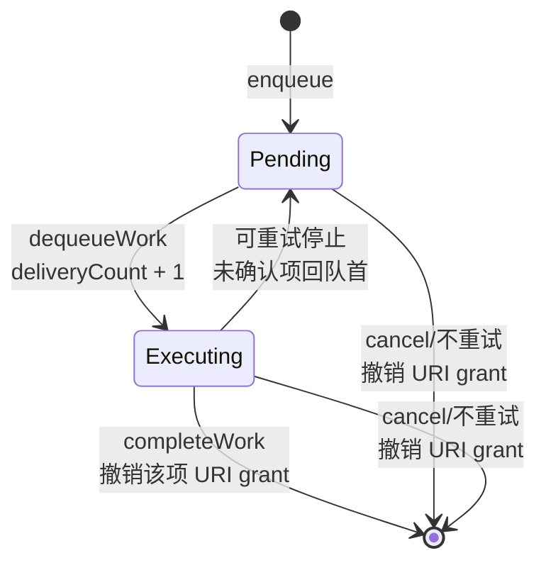
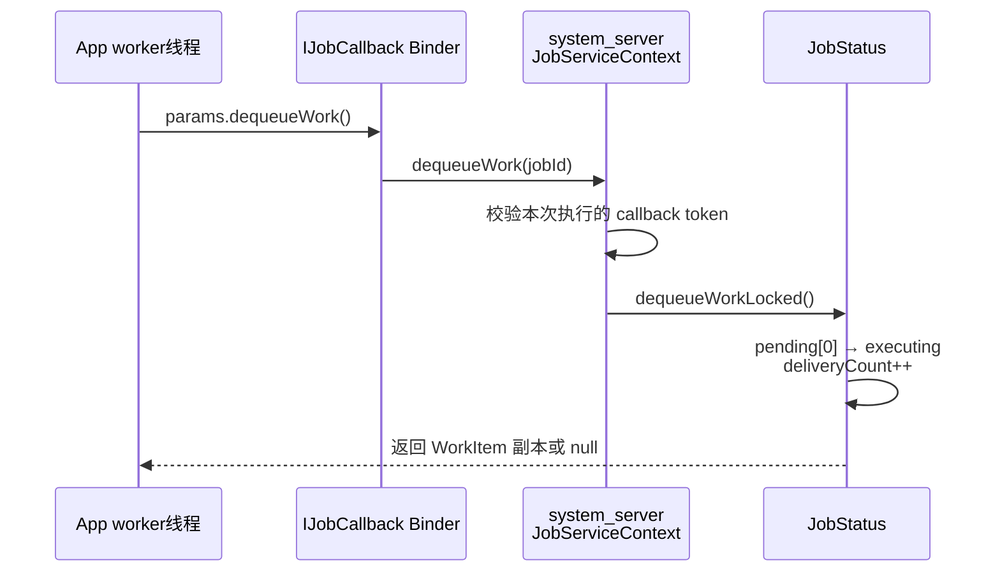

# 133 JobWorkItem：文件上传到一半进程崩了，哪些任务会重新投递？

> 源码基线：Android 11 / API 30 / `android-11.0.0_r48`  
> 学习方式：macOS 静态阅读，不编译、不连接设备  
> 前置知识：第 131 章并发调度、第 132 章 `JobServiceContext` 状态机

## 先给结论：这章解决什么问题

假设相册应用把 3 张待上传照片交给同一个 Job：

```text
W1 = a.jpg
W2 = b.jpg
W3 = c.jpg
```

应用已经领取 W2，但还没报告完成，App 进程就崩溃了。Job 再次执行后，Android 应该重投 W2，还是从 W3 继续？如果 W2 的网络请求其实已经成功，会不会上传两次？

一句话结论是：**JobScheduler 用 `pendingWork` 记录“尚未领取”，用 `executingWork` 记录“已经领取但尚未确认”；在正常处理协议里，只有 `completeWork()` 才表示一项工作成功完成。发生可重试停止时，未确认项会被放回下一次执行，所以业务必须能处理重复。**

读完本章，你应该能：

- 从源码判断某个 WorkItem 当前是“待领取”还是“已领取未确认”；
- 解释为什么 `dequeueWork()` 不是完成，为什么最后还要再 dequeue 一次；
- 手算停止后哪些工作重投、顺序怎样、`deliveryCount` 是多少；
- 判断 URI 权限何时授予、何时撤销；
- 识别 `JobWorkItem` 不提供跨重启持久化，也不承诺 exactly-once。

本章不讨论 Job 何时满足网络、充电和配额约束；那些决定“仓库什么时候开门”。本章只讨论开门后，一张工作单怎样领取、确认和退回。

---

## 一、为什么一个 Job 里还需要 WorkItem

### 1. JobInfo 管执行条件，JobWorkItem 管每一小项数据

如果每新增一张照片都创建一个不同 `jobId`，系统看到的是很多独立 Job。它们各自参与约束、排序和并发竞争，应用还要管理大量 ID。

`enqueue(JobInfo, JobWorkItem)` 提供另一种模型：

```text
JobInfo：共用的“仓库规则”
  哪个 JobService 处理
  是否需要网络、充电等

JobWorkItem：不断追加的“工作单”
  这一次处理哪张照片
  需要临时访问哪个 content:// URI
  预计上传/下载多少字节
```

因此，3 个 WorkItem **不是 3 个独立 Job，也不会占 3 个 JobServiceContext 执行槽**。它们共用一个 `JobStatus` 和一套约束；同一时刻只占这个 Job 的一个执行槽，被停止后则可能跨多次执行继续处理。

### 2. 最小提交示例

```java
JobInfo job = new JobInfo.Builder(80, uploaderService)
        .setRequiredNetworkType(JobInfo.NETWORK_TYPE_ANY)
        .build();

Intent data = new Intent().setData(photoUri)
        .addFlags(Intent.FLAG_GRANT_READ_URI_PERMISSION);
jobScheduler.enqueue(job, new JobWorkItem(data, 0, photoBytes));
```

这里的 `Intent` 只是工作数据容器。JobScheduler 不会自动拿它去启动 Activity 或 Service；实际处理组件始终由 `JobInfo.getService()` 决定。

### 3. 这套模型的代价

集中排队带来三个约束：

1. 所有 WorkItem 共用同一份 `JobInfo` 条件；
2. WorkItem 队列保存在 `system_server` 内存中，不能与 persisted Job 共用；
3. 已领取但未确认的项目可能重投，业务要自己解决重复副作用。

理解这三点，才能判断它适不适合“照片待上传”这类工作。

---

## 二、先记住两张表：pending 与 executing

把 `JobStatus` 想成一个仓库：

```text
pendingWork                 executingWork
待领取区                    已签出区
[W1, W2, W3]                []
     │
     │ dequeueWork()
     ▼
[W2, W3]                    [W1]
                                  │
                                  │ completeWork(W1)
                                  ▼
[W2, W3]                    []
```

两张表不是重复记账，而是回答两个不同问题：

| 队列 | 系统知道的事实 | 发生可重试停止时 |
|---|---|---|
| `pendingWork` | 还没有交给 App | 下次继续交付 |
| `executingWork` | 已交给 App，但没收到完成回执 | 放回队首，重新交付 |
| 已被 `completeWork()` 删除 | App 已确认完成 | 不再重投 |

如果只有一张队列表，系统一旦把 W2 取出，就无法区分“W2 已完成”和“W2 只处理到一半”。这就是两张表存在的根本原因。

### 状态变化总图



注意图中的终点有两种含义：一项 WorkItem 从队列消失，不等于整个 JobServiceContext 已经结束。整个 Job 的结束还有一道“空队列确认门”，后面会展开。

---

## 三、入队：同一个 jobId 不一定只是追加

### 1. Binder 入口先拒绝两个无效条件

文件：

```text
frameworks/base/apex/jobscheduler/service/java/com/android/server/job/JobSchedulerService.java
```

Android 11 的 `enqueue()` 入口包含：

```java
enforceValidJobRequest(uid, job);
if (job.isPersisted()) {
    throw new IllegalArgumentException(
            "Can't enqueue work for persisted jobs");
}
if (work == null) {
    throw new NullPointerException("work is null");
}
```

这几行直接确定了版本边界：在 r48 中，WorkItem Job 不能设置 `setPersisted(true)`。所以“WorkItem 实现了 Parcelable”绝不等于“它会写进磁盘并跨设备重启恢复”。

### 2. 快路径：JobInfo 完全相同，直接追加

`scheduleAsPackage()` 在全局锁内查找同 UID、同 jobId 的现有记录：

```java
final JobStatus old = mJobs.getJobByUidAndJobId(uId, job.getId());

if (work != null && old != null && old.getJob().equals(job)) {
    old.enqueueWorkLocked(work);
    old.maybeAddForegroundExemption(mIsUidActivePredicate);
    return JobScheduler.RESULT_SUCCESS;
}
```

这条快路径意味着：如果 Job 80 正在运行，而且新提交的 `JobInfo.equals()` 仍为真，新 WorkItem 会直接进入同一个 `JobStatus.pendingWork`。正在循环 dequeue 的 worker 可以在下一次领取时看见它。

### 3. 慢路径：JobInfo 变化，会替换 JobStatus

如果同 jobId 存在，但 `JobInfo.equals()` 为假，服务端会创建新 `JobStatus`，再用它替换旧记录。旧 WorkItem 会迁移过去，但正在运行的旧 Job 可能被停止和重启。

所以“相同 jobId”只保证定位到同一逻辑编号，不保证永远原地追加。官方 API 文档强烈建议每次 enqueue 复用稳定、等价的 `JobInfo`，尤其避免让 extras 或 `ClipData` 每次变化。

可以把它理解为：

```text
jobId 相同 + JobInfo 相同 → 给原仓库追加一张工作单
jobId 相同 + JobInfo 变化 → 更换仓库规则，搬迁旧工作单
```

`JobInfo.Builder.setClipData()` 在这条路径上尤其危险：r48 API 文档明确说明，即便内容看起来相同，也会被当作不同 JobInfo。逐项 URI 应放在 `JobWorkItem` 的 Intent 中，而不是反复改变 JobInfo 的 ClipData。

### 4. 真正的入队动作

文件：

```text
frameworks/base/apex/jobscheduler/service/java/com/android/server/job/controllers/JobStatus.java
```

核心代码只有几步：

```java
work.setWorkId(nextPendingWorkId);
nextPendingWorkId++;
if (work.getIntent() != null
        && GrantedUriPermissions.checkGrantFlags(work.getIntent().getFlags())) {
    work.setGrants(GrantedUriPermissions.createFromIntent(...));
}
pendingWork.add(work);
updateEstimatedNetworkBytesLocked();
```

它证明：

- `workId` 由 system_server 分配，初始序号从 1 开始；
- URI 授权在 **enqueue 时**建立，不是等到 dequeue 才建立；
- 新项目追加到 `pendingWork` 尾部，正常领取顺序是 FIFO；
- 每次入队后重新计算剩余网络估算。

### 5. App 手里的原对象没有系统 workId

`JobWorkItem` 通过 AIDL 以 `in` 参数进入 system_server。Binder 传递的是 Parcel 反序列化后的副本，不是同一个 Java 对象。

因此：

```java
JobWorkItem submitted = new JobWorkItem(data);
jobScheduler.enqueue(job, submitted);

// 错误思路：以后拿 submitted 调 completeWork()
```

服务端是在自己的副本上设置 `workId`。应用必须确认 **`dequeueWork()` 返回的对象**，不能拿最初 enqueue 的对象代替。

---

## 四、领取：dequeue 只是“签出”，不是完成

### 1. App 到 system_server 是一次同步 Binder 查询

`JobParameters.dequeueWork()` 的公开代码非常短：

```java
public JobWorkItem dequeueWork() {
    return getCallback().dequeueWork(getJobId());
}
```

这里的 `IJobCallback.dequeueWork()` 有返回值，所以调用线程会同步等待 system_server 返回一个 WorkItem 或 `null`。这和第 132 章里的 `IJobService.startJob()` oneway 通知不是同一种调用语义。

典型线程关系是：



不要在 JobService 主线程做耗时上传。`onStartJob()` 在 App 主线程收到开始通知后，应启动受控 worker，并返回 `true` 表示工作仍在异步进行。

### 2. 服务端怎样移动工作单

`JobStatus.dequeueWorkLocked()` 的关键部分是：

```java
JobWorkItem work = pendingWork.remove(0);
if (executingWork == null) {
    executingWork = new ArrayList<>();
}
executingWork.add(work);
work.bumpDeliveryCount();
return work;
```

所以第一次成功领取时，应用看到的 `deliveryCount` 通常是 1，而不是 0：

```text
new JobWorkItem() 时：0
第一次 dequeue 返回：1
停止后再次投递：2
再次停止再投递：3
```

这个计数表示“这一个 WorkItem 被交付过几次”，不是整个 Job 运行过几次，也不能代替业务唯一 ID。

### 3. workId 与业务 ID 是两套东西

系统用隐藏的 `workId` 在 `executingWork` 中找到待确认项。它只服务于当前 JobStatus 队列协议。

照片业务仍应在 Intent 中保存自己的稳定 ID，例如数据库行 ID 或服务端幂等键：

```java
data.putExtra("upload_id", "photo-20260904-001");
```

原因是 `workId`：

- 不是公开业务主键；
- 不应该跨取消、重建或设备重启保存；
- 无法帮助服务端判断某次 HTTP 上传是不是已经成功。

---

## 五、确认：为什么 complete 最后一项后还要再 dequeue

### 1. completeWork 只删除一项 executingWork

App 调用：

```java
params.completeWork(work);
```

最终到达：

```java
if (work.getWorkId() == workId) {
    executingWork.remove(i);
    ungrantWorkItem(work);
    return true;
}
```

这几行只完成两件事：

1. 从 `executingWork` 删除对应 workId；
2. 撤销该 WorkItem 持有的 URI 临时授权。

它没有调用“结束整个 Job”的逻辑。若 workId 不在当前 executing 列表中，服务端返回 `false`，公开 API 随后抛出：

```text
IllegalArgumentException: Given work is not active
```

常见原因包括：重复 complete、传入 enqueue 时的原对象、或者项目已经不属于这次执行。

### 2. 真正结束 Job 的条件发生在下一次 dequeue

`JobServiceContext.doDequeueWork()` 才检查两张表是否都空：

```java
JobWorkItem work = mRunningJob.dequeueWorkLocked();
if (work == null && !mRunningJob.hasExecutingWorkLocked()) {
    doCallbackLocked(false, "last work dequeued");
}
return work;
```

三种结果要分清：

| pending | executing | 本次 dequeue 结果 |
|---|---|---|
| 有项目 | 任意 | 移到 executing 并返回项目 |
| 空 | 仍有未确认项 | 返回 `null`，但不能认定整个 Job 已正确完成 |
| 空 | 空 | 返回 `null`，同时 system_server 结束 Job |

这就是循环必须写成“处理并 complete 后，继续 dequeue”，而不能在 complete 最后一项后直接退出协议的原因。最后一次空 dequeue 既检查有没有刚追加的新工作，也告诉系统“待领取和已签出都清零了”。

### 3. 为什么不应主动 jobFinished

对于 WorkItem 模式，r48 的 `JobParameters` 文档明确要求不要用 `jobFinished()` 代替这套协议。考虑一个竞态：

```text
worker 认为 W3 是最后一项          另一个线程正在 enqueue W4
            │                                  │
            └──── 如果直接 jobFinished ────────┘
                         可能把队列生命周期提前截断
```

正确的 final dequeue 和 enqueue 都会进入 system_server，并在同一把 JobScheduler 全局锁下串行化：

- enqueue 先拿锁：W4 先进入 pending，dequeue 能取到它；
- final dequeue 先拿锁：旧 Job 在锁内完成清理，后来的 enqueue 会创建或使用新的可调度记录。

应用自己调用 `jobFinished()` 绕过了“检查两张表”的条件，可能使尚未完成的队列按“不重试”路径清理。

---

## 六、一个正确且能抗停止的处理骨架

下面只展示协议关键点，不绑定具体线程库：

```java
@Override
public boolean onStartJob(JobParameters params) {
    startWorker(() -> drain(params));
    return true; // onStartJob 返回了，但异步处理还没完成
}

private void drain(JobParameters params) {
    JobWorkItem work;
    while (!stopping && (work = params.dequeueWork()) != null) {
        uploadIdempotently(work.getIntent());
        persistBusinessSuccess(work.getIntent());
        params.completeWork(work);
    }
}

@Override
public boolean onStopJob(JobParameters params) {
    stopping = true;
    cancelWorkerCooperatively();
    return true; // 希望未确认项按 backoff 重投
}
```

顺序不能随意交换：

```text
执行业务副作用
  → 持久化业务成功状态
  → completeWork
  → 再次 dequeue
```

如果先 `completeWork()` 再上传，进程恰好在两步之间崩溃，系统已经删掉工作单，业务却没完成；这会造成丢失。

如果上传成功后、`completeWork()` 前崩溃，系统会重投，可能重复上传。因此业务操作还要使用稳定 `upload_id` 做幂等检查。JobScheduler 无法与远端 HTTP 服务做同一个原子事务。

### 并行处理也可以，但账更难管

API 允许连续 dequeue 多项后并行处理，也允许乱序 complete。比如：

```text
dequeue W1 → executing=[W1]
dequeue W2 → executing=[W1,W2]
complete W2 → executing=[W1]
complete W1 → executing=[]
final dequeue → null，并结束 Job
```

但 `onStopJob()` 到来时，所有 worker 都必须尽快停止继续做副作用；仍未 complete 的项目会作为 executing 项参与重投。初学时建议先写对串行协议，再考虑并行。

---

## 七、失败重投：不是重新创建三张全新的工作单

### 1. 谁决定是否重试

Job 因约束丢失、执行超时或宿主进程异常而停止时，是否生成下一次 JobStatus，要看具体结束原因和回调结果。

正常收到 `onStopJob()` 时：

- 返回 `true`：请求按失败 backoff 重调度；
- 返回 `false`：不请求重调度，剩余 WorkItem 会被清理。

但“返回 true”不是任何场景下的绝对保证。例如用户明确 `cancel(jobId)` 是取消，不是“稍后重试”；某些绑定/启动失败路径也可能按不重试收尾。判断问题时必须同时看停止原因和 `needsReschedule`，不能只背 `onStopJob()` 返回值。

宿主 App 进程意外断开时，r48 的 `JobServiceContext.onServiceDisconnected()` 会调用：

```java
closeAndCleanupJobLocked(true, "unexpectedly disconnected");
```

因此，只要 system_server 和内存中的 JobStatus 仍在，这条路径会尝试生成失败重调度记录。

### 2. 迁移时为什么 executing 放在 pending 前面

旧 JobStatus 停止跟踪时：

```java
if (executingWork != null && executingWork.size() > 0) {
    incomingJob.pendingWork = executingWork;
}
if (incomingJob.pendingWork == null) {
    incomingJob.pendingWork = pendingWork;
} else if (pendingWork != null) {
    incomingJob.pendingWork.addAll(pendingWork);
}
incomingJob.nextPendingWorkId = nextPendingWorkId;
```

executing 项原本比尚未领取的 pending 项更靠前，所以迁移顺序是：

```text
旧 executingWork + 旧 pendingWork → 新 pendingWork
```

系统不会在失败时复制“所有历史项目”。已经 complete 的项目早已从 executing 删除，不再迁移。

### 3. 贯穿案例手算

初始：

```text
pending   = [W1, W2, W3]
executing = []
```

W1 完成；W2 和 W3 已领取但未确认：

```text
pending   = []
executing = [W2(count=1), W3(count=1)]
W1        = 已删除
```

此时进程崩溃，生成可重试的新 JobStatus：

```text
new.pending   = [W2(count=1), W3(count=1)]
new.executing = []
```

下一次领取：

```text
W2 → count=2
W3 → count=2
```

W1 不会出现。W2 即使远端上传已成功，只要没 complete，框架也只能把它判断为“结果未知”，所以会重投。这正是幂等键有意义的地方。

### 4. 旧线程迟到确认为什么不能误删新执行

`JobParameters` 内持有这次执行对应的 `IJobCallback`。每次 `JobServiceContext` 开始新执行都会创建新的 callback token。

WorkItem 操作进入服务端后先执行：

```java
if (mRunningCallback != cb) {
    throw new SecurityException("Caller no longer running...");
}
```

所以旧 worker 不能仅凭相同 jobId 操作新一代队列。这里还有一个很容易漏掉的时间窗：replacement 已把 work 搬出旧 JobStatus、但旧 callback 尚未彻底退休时，身份校验可能暂时仍通过，不过旧 `executingWork` 已经没有那项，complete 会返回 false，App 最终得到 `IllegalArgumentException`；callback 退休后再调用，则会得到 `SecurityException`。两条失败路径都不会误删新 JobStatus 中的项目。

换句话说，代际安全不是只靠整数 jobId：主要靠每次执行独立的 callback token，同时也靠 work 只在所属 JobStatus 的 executing 表中按 workId 查找。

---

## 八、URI 授权：为什么入队时就给、完成时才撤

### 1. 等待约束期间也可能需要保存授权

照片可能来自另一个 ContentProvider：

```text
content://media/external/images/media/123
```

如果应用只是把 URI 字符串塞进 Intent，却没有携带读/写 grant flag，未来 JobService 可能没有权限打开它。

r48 在 enqueue 时检查：

```java
return (flags & (FLAG_GRANT_READ_URI_PERMISSION
        | FLAG_GRANT_WRITE_URI_PERMISSION)) != 0;
```

有 grant flag 时，`GrantedUriPermissions.createFromIntent()` 会扫描 Intent 的 data URI 和 ClipData URI，为该项创建 permission owner。授权必须从 enqueue 就开始，因为 Job 可能等待网络很久，调用方原先持有的临时上下文早已结束。

### 2. 授权跟着 WorkItem 走

`JobWorkItem` 内部有一个隐藏字段：

```java
Object mGrants;
```

它指向 system_server 内部的 `GrantedUriPermissions`，不会写进传给 App 的 Parcel。App 得到的是 URI 和 flags 等数据，不会得到 permission owner 对象本身。

生命周期如下：

```text
enqueue
  └─ 创建该项 grant，pending 期间已有效

dequeue
  └─ WorkItem pending → executing，grant 继续保留

retry/replacement
  └─ WorkItem 搬到新 JobStatus，grant 跟随，不先撤销

completeWork
  └─ 只撤销这一项的 grant

cancel / 不重试清理
  └─ 批量撤销 pending 和 executing 的剩余 grant
```

### 3. 两个相同 URI 的 WorkItem 也要逐项确认

W1、W2 都引用同一个 URI 时，它们可以各自拥有 grant owner。完成 W1 会撤销 W1 的授权账，但 W2 的授权仍可能让目标包继续访问该 URI。不要通过“现在还能不能打开 URI”反推某一个具体 WorkItem 是否已经 complete。

CTS 的 `testEnqueueMultipleUriGrantWork()` 正是在 Job 尚因存储约束等待时撤掉原始显式授权，然后验证 WorkItem grant 仍有效；全部处理完成后，再等待权限被撤销。这个测试证明授权窗口覆盖 pending 阶段，而不仅是执行阶段。

---

## 九、网络字节估算：r48 只统计仍 pending 的项目

`JobWorkItem(Intent, downloadBytes, uploadBytes)` 可给每项提供预计流量。它用于调度判断，不是网络计费器，也不会限制应用实际传输了多少。

`JobStatus.updateEstimatedNetworkBytesLocked()` 在 r48 中从 JobInfo 的基础估算开始，再遍历：

```java
if (pendingWork != null) {
    for (int i = 0; i < pendingWork.size(); i++) {
        // 累加 pendingWork 的上下行估算
    }
}
```

这里没有遍历 `executingWork`。因此当前版本的字段更接近：

```text
base Job 估算 + 尚未 dequeue 的 WorkItem 估算
```

而不是“所有未 complete 项的总剩余流量”。当 W2 从 pending 移到 executing 后，它的估算会从这个汇总值中消失，即使上传尚未完成。

另外，如果 JobInfo 的某一方向基础估算是 `NETWORK_BYTES_UNKNOWN (-1)`，r48 的累加逻辑会保持该方向 unknown，而不会靠 WorkItem 已知值拼出一个看似精确的总数。

这是 Android 11 r48 的具体实现边界，不应外推成所有 Android 版本都完全相同。排查新版本时，要重新看同名方法。

---

## 十、进程崩溃能重投，为什么设备重启不能

这里有两个常被混在一起的“死亡”：

| 事件 | system_server 内存中的 JobStatus | WorkItem 结果 |
|---|---|---|
| JobService 所在 App 进程崩溃 | 仍在 | 可按失败路径迁移、重投未确认项 |
| system_server 重启或设备重启 | 内存对象消失 | WorkItem 队列不能恢复 |

原因很直接：

1. WorkItem Job 被 `enqueue()` 明确禁止设置 persisted；
2. `pendingWork`、`executingWork` 是 JobStatus 的内存字段；
3. `JobStore` 的持久化 XML 只处理允许持久化的 Job 定义，没有 WorkItem 队列恢复协议；
4. `Parcelable` 只代表对象能经 Parcel 跨 Binder，不代表它会自动写磁盘。

如果“设备重启后仍必须上传”是业务要求，可靠来源应该是应用自己的数据库：

```text
数据库：业务事实与幂等状态的真相来源
JobWorkItem：进程存活期间的高效调度队列
启动/解锁后：扫描数据库未完成记录，再恢复调度
```

不要把唯一一份任务数据只放进 JobWorkItem Intent。

---

## 十一、从业务角度理解：它提供的是哪一种交付语义

### 1. 不是 exactly-once

以 W2 上传为例：

```text
远端已接收 W2
    ↓
App 还没 completeWork
    ↓
进程崩溃
    ↓
W2 被重投
```

框架看不到远端服务器是否提交成功，只看得到 complete 回执有没有到达。于是“副作用已发生、确认未到达”这个时间窗必然可能产生重复。

### 2. 也不能无限制地宣传 at-least-once

在 system_server 内存仍在、结束路径选择重调度、Job 没被取消等前提下，未确认项会重投。但设备重启会丢失内存队列，取消或不重试也会清理项目。

更准确的说法是：**在一次内存调度生命周期内，JobScheduler 对可重试停止提供未确认项重投；端到端可靠性仍由持久化业务队列和幂等处理保证。**

### 3. 一个实用的幂等方案

照片上传可以这样分工：

```text
1. 数据库插入 upload_id，状态=PENDING
2. enqueue WorkItem，只携带 upload_id 与 URI
3. worker 查询数据库；若已 SUCCESS，直接 complete
4. 请求远端时携带 upload_id 作为幂等键
5. 远端成功后，本地事务写 SUCCESS
6. 最后 completeWork
```

即便第 5、6 步之间崩溃，重投后也能通过数据库或远端幂等键识别已经完成，不必重复产生业务结果。

---

## 十二、怎样观察两张队列表

在真机环境中，`dumpsys jobscheduler` 的 JobStatus dump 会分别输出 pending 和 executing work。r48 的 dump 代码位于：

```text
JobStatus.dump(...)
  → Pending work
  → Executing work
  → dumpJobWorkItem(...)
```

诊断时不要只看“Job 正在运行”，至少记录：

| 观察项 | 能回答的问题 |
|---|---|
| Job 的 UID + jobId | 找的是不是同一条 JobStatus |
| pending 数量与 workId | 还有多少没交给 App |
| executing 数量与 workId | 哪些已交付但没确认 |
| delivery count | 某项是否发生过重投 |
| stop reason / failure count | 为什么进入下一次执行 |
| JobInfo 是否变化 | enqueue 是快路径追加还是替换 |

本章在 macOS 上只做静态阅读，没有声称已经运行这些命令。实际设备的 dump 文案会随 Android 版本变化，应以设备分支代码为准。

---

## 十三、容易翻车的判断

### “dequeue 返回 null，所以一定结束了”

不一定。如果 `pendingWork` 空但 `executingWork` 仍有并行项目，dequeue 会返回 null，却不会通过“两张表都空”的结束条件。

### “complete 最后一项后，Job 自动结束”

不对。complete 只删 executing 项；还需要再 dequeue 一次，让 system_server 在同一临界区确认 pending 和 executing 都空。

### “onStopJob 返回 true，取消后也会重投”

不对。用户或系统的明确 cancel 是移除任务，不等于失败重试。要结合具体停止路径判断。

### “相同 jobId 永远只向原队列追加”

不对。还要 `JobInfo.equals()` 为真，否则会发生替换和旧 work 迁移，正在执行的旧 Job 可能被打断。

### “deliveryCount=1 表示重试了一次”

不对。首次 dequeue 就是 1；大于 1 才说明至少发生过再次交付。

### “URI grant 在 Job 开始运行时才创建”

不对。r48 在 enqueue 时创建，在 pending 等待约束期间就可能有效。

### “WorkItem 是 Parcelable，所以重启后能恢复”

不对。Parcel 是进程通信格式，持久化还需要单独的磁盘写入和恢复协议；r48 甚至直接拒绝 persisted WorkItem Job。

### “completeWork 就能让 HTTP 请求 exactly-once”

不对。远端成功与本地 complete 不能构成原子提交，中间崩溃仍会重投。要靠业务幂等。

---

## 十四、macOS 静态练习：自己证明，不靠背结论

以下命令都只读源码，可在 `/Users/ninebot/androidSource` 执行。

### 练习 1：证明首次 deliveryCount 是 1

```bash
rg -n "dequeueWorkLocked|bumpDeliveryCount|mDeliveryCount" \
  frameworks/base/apex/jobscheduler/{service,framework}/java
```

追踪顺序：

```text
JobParameters.dequeueWork
→ IJobCallback.dequeueWork
→ JobServiceContext.doDequeueWork
→ JobStatus.dequeueWorkLocked
→ JobWorkItem.bumpDeliveryCount
```

预期结论：新对象字段默认是 0，但服务端在返回给 App 之前先 `++`，所以首次可见交付是 1。

### 练习 2：手算重投顺序

阅读：

```bash
sed -n '596,690p' \
  frameworks/base/apex/jobscheduler/service/java/com/android/server/job/controllers/JobStatus.java
```

给定：

```text
pending=[W4,W5]
executing=[W2,W3]
W1 已 complete
```

问题：可重试停止后新 pending 是什么？下次四项 count 怎样变化？

答案：新 pending 是 `[W2,W3,W4,W5]`。W2、W3 曾领取过，下一次 dequeue 时 count 从 1 变 2；W4、W5 首次领取时从 0 变 1。W1 不再出现。

### 练习 3：证明 complete 不结束整个 Job

```bash
sed -n '635,654p' \
  frameworks/base/apex/jobscheduler/service/java/com/android/server/job/controllers/JobStatus.java

sed -n '376,407p' \
  frameworks/base/apex/jobscheduler/service/java/com/android/server/job/JobServiceContext.java
```

预期观察：`completeWorkLocked()` 只删除 executing 项；`doCallbackLocked(false, "last work dequeued")` 出现在 dequeue 空且 executing 为空的分支。

### 练习 4：证明 URI grant 覆盖 pending 阶段

```bash
rg -n "enqueueWorkLocked|createFromIntent|ungrantWorkItem|revoke" \
  frameworks/base/apex/jobscheduler/service/java/com/android/server/job

rg -n "testEnqueueMultipleUriGrantWork" \
  cts/tests/JobSchedulerSharedUid/src/android/jobscheduler/cts/shareduidtests
```

预期观察：grant 在 `pendingWork.add()` 前建立；complete 或最终清理才撤销。CTS 会在 Job 尚未执行时验证 grant 仍存在。

### 练习 5：找出网络估算边界

```bash
sed -n '876,910p' \
  frameworks/base/apex/jobscheduler/service/java/com/android/server/job/controllers/JobStatus.java
```

问题：循环遍历 pending、executing，还是两者？

答案：只遍历 pending。由此可知 r48 汇总值不包含已领取但未 complete 的 WorkItem 估算。

### 练习 6：区分追加与替换

```bash
sed -n '1070,1122p' \
  frameworks/base/apex/jobscheduler/service/java/com/android/server/job/JobSchedulerService.java
```

预期观察：只有 `old.getJob().equals(job)` 才直接 `enqueueWorkLocked()`；否则创建新 JobStatus，并通过 replacement 路径迁移旧 work。

---

## 阅读检查题与答案

### 1. W2 已 dequeue，但没 complete。它在哪张表？

在 `executingWork`。dequeue 表示已交付，不表示已完成。

### 2. W2 上传成功后进程崩溃，为什么可能再收到 W2？

因为 system_server 只知道没有收到 complete 回执，无法知道远端副作用已经成功。可重试停止会把 executing 项迁回新 pending。

### 3. 为什么完成 W3 后还要再调用 dequeueWork？

因为 complete 只移除 W3；final dequeue 才在服务端原子检查 pending 和 executing 都为空，并结束 Job，也能接住并发追加的新工作。

### 4. 为什么不能保存 enqueue 时的 JobWorkItem，稍后用它 complete？

Binder 入参在 system_server 是另一个对象副本，系统只在服务端副本上分配 workId。应使用 dequeue 返回的对象。

### 5. 设备重启后，WorkItem 为什么不能像 persisted Job 那样恢复？

r48 明确禁止给 enqueue Job 设置 persisted；两张工作表只有内存状态，没有写入 JobStore XML 的恢复协议。

### 6. URI 权限是在何时建立和撤销的？

带读/写 grant flag 的 Intent 在 enqueue 时建立逐项授权；complete 撤销该项授权；取消或不重试时批量撤销剩余项；重试迁移时保持授权。

### 7. `deliveryCount=2` 能证明业务执行了两次吗？

不能。它只证明框架交付了两次。第一次可能尚未开始业务、执行到一半，或已经成功但来不及 complete。

---

## 本章 takeaway

以后看到 WorkItem 队列问题，先写出这条链：

```text
enqueue
  → pending
  → dequeue：pending → executing，deliveryCount++
  → 业务幂等提交
  → complete：删除 executing，撤销该项 URI grant
  → final dequeue：两张表都空，整个 Job 才结束
```

再用三个问题定位故障：

1. 工作现在属于 pending、executing，还是已经 complete？
2. 这次停止是否真的生成了 `needsReschedule=true` 的新 JobStatus？
3. 即使框架正确重投，业务是否用持久化状态和幂等键处理了重复？

只要能回答这三问，就不会再把“领取”“业务完成”“框架确认”和“整个 Job 结束”混成同一件事。

下一章将沿着失败结束继续追踪：第 134 章分析 Job 的 backoff 计算，以及周期 Job 下一执行窗口怎样重排。
