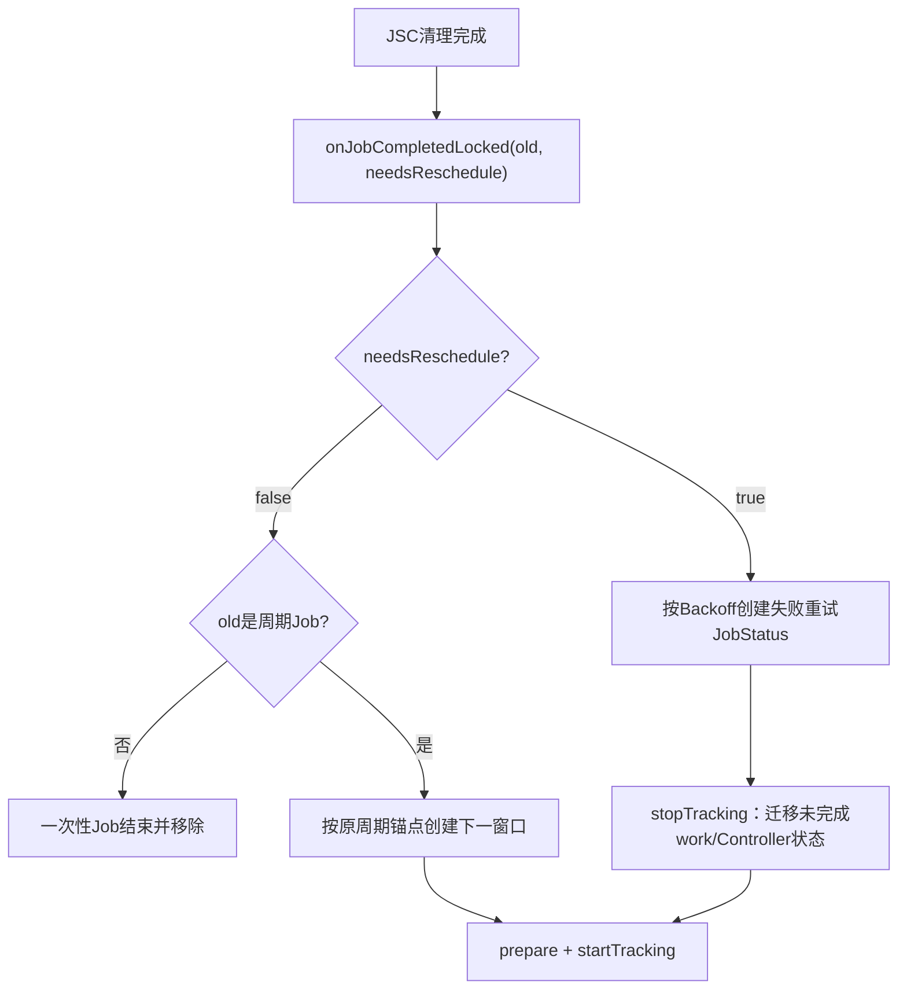
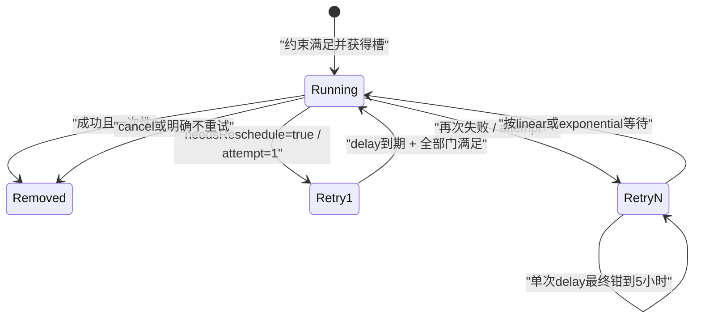
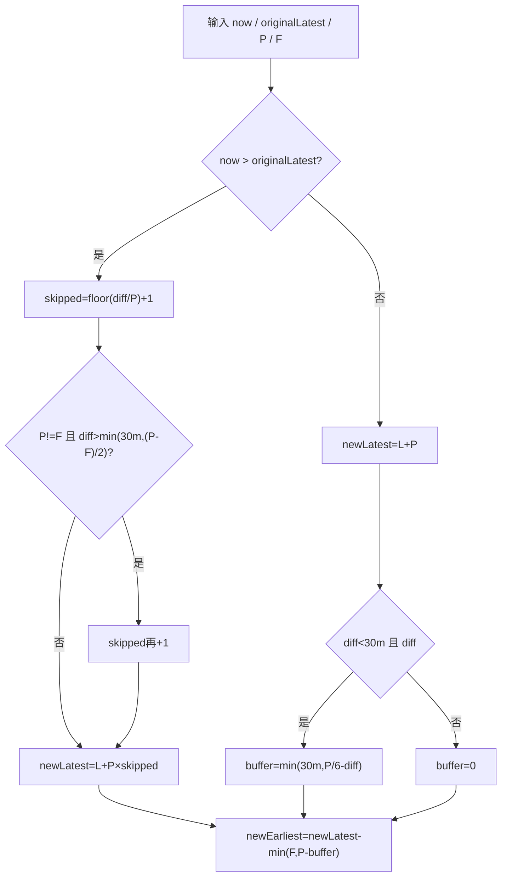
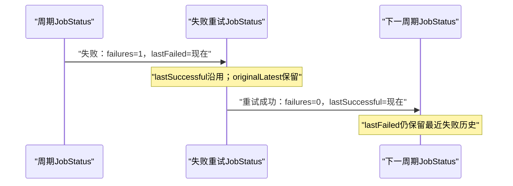
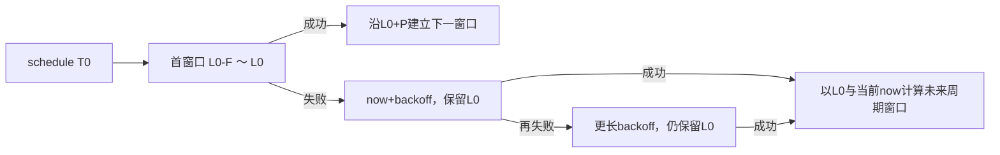
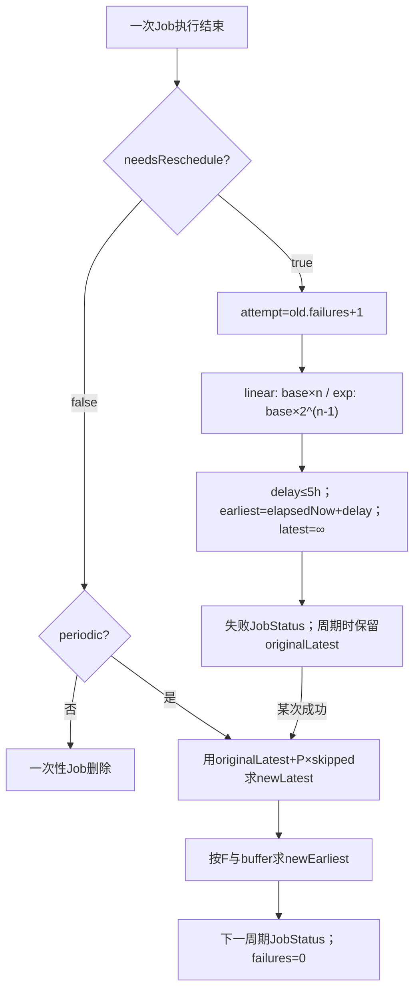

# 134 Android Job 失败 Backoff 与周期窗口重排

> 源码版本：Android 11 / API 30 / `android-11.0.0_r48`  
> 学习方式：macOS 只读源码，不要求编译、不要求连接设备  
> 前置章节：第 121、124、132、133 章

---

## 1. 本章研究“一个执行实例结束后，下一个实例何时出现”

第132章走到了 `JobServiceContext.closeAndCleanupJobLocked()`，它最终把两个关键信息交给 JSS：

```text
旧 JobStatus
needsReschedule：本次是否要求失败重试
```

本章继续追 `onJobCompletedLocked()`，把容易混在一起的两套算法拆开：

```text
失败重试：从“现在”开始算 backoff
周期续期：沿原有周期锚点计算下一窗口
```

它们都会创建新 `JobStatus`，但时间语义、失败计数和成功/失败历史完全不同。

---

## 2. 先建立两个直觉模型

失败 Backoff 像“操作失败后冷静一下”：

```text
失败1 → 等30秒
失败2 → 等60秒
失败3 → 等120秒（指数策略）
```

周期 Job 像“列车时刻表”：

```text
每小时一个窗口
某班晚点，不把以后所有班次都永久改成从晚点时刻起算
```

前者故意从完成时刻推迟，后者尽量保持原来的周期相位。

---

## 3. 贯穿案例

准备两个 Job：

```text
Job A：一次性上传，默认指数退避30秒
Job B：每60分钟运行，flex=20分钟
```

我们会分别推演：

1. A 连续失败四次；
2. B 在窗口内成功；
3. B 晚了多个周期才运行；
4. B 先失败退避，随后成功；
5. B 在失败退避期间遇到 system_server 重启。

---

## 4. 源码地图

公开参数和构建校验：

```text
frameworks/base/apex/jobscheduler/framework/java/android/app/job/JobInfo.java
frameworks/base/apex/jobscheduler/framework/java/android/app/job/JobService.java
frameworks/base/apex/jobscheduler/framework/java/android/app/job/JobParameters.java
```

完成分叉和两套重排算法：

```text
frameworks/base/apex/jobscheduler/service/java/com/android/server/job/JobSchedulerService.java
frameworks/base/apex/jobscheduler/service/java/com/android/server/job/JobServiceContext.java
frameworks/base/apex/jobscheduler/service/java/com/android/server/job/controllers/JobStatus.java
```

时间约束、Controller 交接和落盘：

```text
frameworks/base/apex/jobscheduler/service/java/com/android/server/job/controllers/TimeController.java
frameworks/base/apex/jobscheduler/service/java/com/android/server/job/controllers/ContentObserverController.java
frameworks/base/apex/jobscheduler/service/java/com/android/server/job/JobStore.java
```

算法测试：

```text
frameworks/base/services/tests/mockingservicestests/src/com/android/server/job/JobSchedulerServiceTest.java
```

---

## 5. 总入口只有一个 onJobCompletedLocked

核心骨架是：

```java
final JobStatus rescheduledJob = needsReschedule
        ? getRescheduleJobForFailureLocked(jobStatus) : null;

if (!stopTrackingJobLocked(jobStatus, rescheduledJob,
        !jobStatus.getJob().isPeriodic())) {
    return;
}

if (rescheduledJob != null) {
    startTrackingJobLocked(rescheduledJob, jobStatus);
} else if (jobStatus.getJob().isPeriodic()) {
    startTrackingJobLocked(
            getRescheduleJobForPeriodic(jobStatus), jobStatus);
}
```

先看 `needsReschedule`，再看是否 periodic；周期 Job 失败时，失败分支优先。

---

## 6. 四格结果表

| Job 类型 | needsReschedule | 结果 |
|---|---:|---|
| 一次性 | false | 删除，不再生成实例 |
| 一次性 | true | 生成 failure-rescheduled JobStatus |
| 周期 | false | 生成下一周期 JobStatus |
| 周期 | true | 先生成 failure-rescheduled JobStatus，不直接跳下一周期 |

因此“周期”不代表每次结束都无条件进入下一窗口；失败重试会先把当前周期的工作做完。

---

## 7. needsReschedule 不是 Java 异常标志

它是 Job 生命周期协议的布尔结果，来源可包括：

```text
jobFinished(params, true)
onStopJob(params) 返回 true
JobService 进程意外断开
停止回执超时等框架故障路径
```

应用抛没抛业务异常并不是 JSS 直接判断依据；关键是本轮最终交给 JSS 的 reschedule 布尔值。

---

## 8. 有些异常路径反而不重试

Android 11 JSC 中并非所有 timeout 都传 true，例如：

```text
bind超时：false
start回执超时：false
stop回执超时：true
意外Service断开：true
```

所以不能把“系统异常”简单等同为“必定 backoff 重试”。先看各清理调用的布尔参数。

---

## 9. 完成后的总分叉图



---

## 10. 为什么先构造 incoming，再移除 old

旧 Job 停止 tracking 时需要知道有没有接班者：

```text
incoming != null
  → WorkItem executing+pending 迁移

incoming == null
  → WorkItem与grant彻底清除
```

ContentObserverController 也要在失败重排对象创建后复制已报告变化。因此 incoming 不是事后补建。

---

## 11. old 已被取消时不会复活

`stopTrackingJobLocked()` 会尝试从 JobStore 删除确切的 old 对象。若应用在执行期间已经 `cancel()` 或用同 ID 替换了它，删除返回 false。

JSS 随即丢弃刚计算的重排候选，只投递一次 greedy check：

```text
旧执行回调迟到
≠ 可以把已取消/已替换的Job重新放回Store
```

这与第133章“cancel 不是 retry”完全一致。

---

## 12. 失败重排从三个输入开始

`getRescheduleJobForFailureLocked()` 读取：

```java
long initial = job.getInitialBackoffMillis();
int attempt = old.getNumFailures() + 1;
int policy = job.getBackoffPolicy();
```

输出新对象的关键字段是：

```text
earliest = elapsedNow + delay
latest = NO_LATEST_RUNTIME
numFailures = attempt
lastFailedRunTime = 当前wall clock
```

---

## 13. 默认 Backoff

JobInfo 默认：

```text
initialBackoff = 30秒
policy = EXPONENTIAL
最大delay = 5小时
```

应用不调用 `setBackoffCriteria()`，并不表示立即无限重试，而是使用这组默认值。

---

## 14. Builder 的最小值钳位

公开 Builder 要求初始 backoff 至少10秒：

```java
if (initialBackoffMillis < getMinBackoffMillis()) {
    initialBackoffMillis = getMinBackoffMillis();
}
```

它记录 warning 后抬高，不是抛异常。Android 11 的 `MIN_BACKOFF_MILLIS` 为10秒。

---

## 15. 服务端还有一层可配置下限

真正计算时又取：

```text
base = max(JobInfo.initialBackoff, JSS对应策略最小值)
```

线性和指数分别有：

```text
min_linear_backoff_time
min_exp_backoff_time
```

r48 默认都为10秒，可由系统 JobScheduler 常量配置提高。因此 API 对象里的 initial 不一定就是最终公式使用的 base。

---

## 16. 线性公式

第 n 次失败，`n >= 1`：

```text
delay(n) = min(base × n, 5小时)
```

默认 base=30秒时：

| 失败次数 | 延迟 |
|---:|---:|
| 1 | 30秒 |
| 2 | 60秒 |
| 3 | 90秒 |
| 4 | 120秒 |

它每次增加固定的 base。

---

## 17. 指数公式

第 n 次失败：

```text
delay(n) = min(base × 2^(n-1), 5小时)
```

默认 base=30秒时：

| 失败次数 | 延迟 |
|---:|---:|
| 1 | 30秒 |
| 2 | 60秒 |
| 3 | 120秒 |
| 4 | 240秒 |
| 5 | 480秒 |

源码用 `Math.scalb(backoff, attempt - 1)` 做二进制缩放。

---

## 18. 未识别策略回退到指数

switch 的 default 与指数 case 相连：

```text
未知policy → 记录调试日志 → 按指数策略
```

正常应用经过 `@IntDef` 和 Builder API 不应产生未知值，但服务端仍选择了保守回退。

---

## 19. 五小时是每次延迟上限，不是总重试寿命

```java
delayMillis = Math.min(delayMillis,
        JobInfo.MAX_BACKOFF_DELAY_MILLIS);
```

在正常、未发生整数溢出的输入范围内，达到5小时后，后续失败仍可继续生成实例，只是单次 backoff 不再增长。

源码没有在这里实现“最多重试 N 次”。应用若要终止，应在业务上返回 false/`jobFinished(false)` 或取消 Job。

r48 还有一个纯实现边界：线性分支先做 `long base * attempt`，再执行5小时 `Math.min`，Builder 又只钳最小值、不钳最大值。恶意或荒谬的超大 initialBackoff 在后续乘法可能溢出为负数，反而绕过上限。默认值和正常业务取值不会碰到，但阅读源码时不能把“先乘后cap”误写成数学上绝对防溢出的饱和乘法。

---

## 20. Backoff 以 elapsed realtime 计算

```text
earliest = sElapsedRealtimeClock.millis() + delay
```

因此手动修改日期或时区不会直接让内存中的 backoff 提前到期。设备睡眠期间 elapsed realtime 继续前进，但 TimeController 的 delay Alarm 默认是 non-wakeup；到时不保证专门唤醒设备。

---

## 21. 失败重试没有 override deadline

新对象使用：

```text
latest = JobStatus.NO_LATEST_RUNTIME = Long.MAX_VALUE
```

所以它只有“最早何时可以再试”，没有“最迟必须启动”。原一次性 Job 的 override deadline 不会作为本轮失败重试 deadline 继续生效。

---

## 22. Backoff 到期也不等于立刻运行

到期只会满足 `TIMING_DELAY`。新实例仍需满足：

```text
网络/充电/电量/存储/Idle等显式约束
Doze与后台限制等隐式约束
用户与JobService可用
Quota、并发槽和其他调度门
```

Backoff 是最早边界，不是预约的精确执行时刻。

---

## 23. 失败 Job 的一个特殊优待：不再等普通批量凑数

`MaybeReadyJobQueueFunctor` 中：

```java
if (job.getNumFailures() > 0) {
    shouldForceBatchJob = false;
}
```

它表示一旦完整 ready，不再因“非 ACTIVE bucket 的普通数量不足”继续 force batching。它不绕过约束，也不保证有执行槽。

---

## 24. RESTRICTED bucket 仍然优先强制批处理

判断顺序先看：

```text
effective bucket == RESTRICTED
```

再看 `numFailures > 0`。因此 restricted Job 即使正在失败重试，也仍按 restricted 分支强制批处理。

“失败优待”不是高于所有系统政策的万能通行证。

---

## 25. Backoff 状态图



---

## 26. numFailures 是新 JobStatus 的代际字段

失败不是修改 old：

```text
old.numFailures = n
new.numFailures = n + 1
```

新对象重新加入 Controller 和 JobStore。成功进入正常下一周期时，构造参数又回到0。

---

## 27. lastSuccessful 与 lastFailed 使用 wall clock

失败重排：

```text
lastSuccessful = 沿用旧值
lastFailed = 当前 System.currentTimeMillis 语义时钟
```

正常周期续期：

```text
lastSuccessful = 当前wall clock
lastFailed = 沿用旧值
```

这些字段用于历史与诊断，不参与本轮 elapsed backoff 公式。

---

## 28. Controller 失败交接不是全部复制

JSS 会对所有 StateController 调：

```java
controller.rescheduleForFailureLocked(newJob, oldJob);
```

r48 基类默认空实现；明确覆盖的是 ContentObserverController，它把上次已报告的 changed authorities/URIs 交给新实例。

网络、电量等当前事实会在新 Job tracking 时重新计算，不是盲目复制旧 satisfied bit。

---

## 29. WorkItem 的失败交接发生在另一个位置

第133章的：

```text
old.executingWork + old.pendingWork
→ new.pendingWork
```

发生于 `JobStatus.stopTrackingJobLocked(incoming)`，不是 Controller 的 `rescheduleForFailureLocked()`。

一个负责队列工作单，一个负责特定 Controller 的运行快照，不要混成同一机制。

---

## 30. prepare/startTracking 重新建立什么

失败候选在重新 tracking 前会：

```text
prepareLocked：重建JobInfo级ClipData URI授权
startTrackingJobLocked：加入JobStore并让各Controller跟踪
```

WorkItem 自己的授权随对象迁移；JobInfo ClipData 的授权则由新 JobStatus prepare。

---

## 31. Job A 连续失败四次

默认指数策略，假设其他约束一直满足：

```text
t=0       第1次失败 → earliest=30s，failures=1
t=30s     第2次失败 → earliest=90s，failures=2
t=90s     第3次失败 → earliest=210s，failures=3
t=210s    第4次失败 → earliest=450s，failures=4
```

注意 earliest 每次都从“这次失败时的 now”重新加 delay，不是都从最初 t=0 累加公式。

---

## 32. 成功会结束一次性失败链

Job A 某次返回成功：

```text
needsReschedule=false
isPeriodic=false
→ old从Store删除，没有new
```

以后应用若用同 jobId 再 schedule，是一条新的 JobStatus 链，failure count 从0开始。

---

## 33. 应用重新 schedule 也会重置失败链

应用提交同 uid+jobId 的 JobInfo，会走 replacement：旧 JobStatus 被新建的普通 JobStatus 取代，创建参数 `numFailures=0`。

所以“更新同一个 Job”并不是继续原 backoff 次数；这是一次应用主动重新定义调度状态。

---

## 34. 周期 Job 的两个参数

```text
period P：相邻周期终点的间隔
flex F：每个周期末尾允许执行的窗口长度
```

一个周期窗口写作：

```text
[latest - flex, latest]
```

系统只承诺每周期至多运行一次，并不承诺在窗口内一定有条件和资源完成。

---

## 35. 周期参数的钳位

Builder 中：

```text
P 至少15分钟
F 至少 max(5分钟, P×5%)
F 不会被该段显式压到P以下，但正常调用应给出合理值
```

服务端创建/续期时还把 P 压到最多365天，并把有效 F 约束到不超过 P。

---

## 36. setPeriodic(P) 等价于 full-flex

单参数版本调用：

```java
setPeriodic(intervalMillis, intervalMillis)
```

所以 `P=60分钟` 时首窗口不是只有末尾几分钟，而是：

```text
[scheduleNow, scheduleNow + 60分钟]
```

若想只在周期末尾一小段可执行，应显式设置 flex。

---

## 37. 首个周期窗口怎样建立

假设创建时 elapsed=`T0`：

```text
latest0 = T0 + P
earliest0 = latest0 - F
originalLatest = latest0
```

`originalLatest` 是后续保持周期相位的锚点，尤其在失败 Backoff 暂时改写 earliest/latest 后仍有用。

---

## 38. 为什么不能简单写 now + period

若周期 Job 因设备离线晚了3小时才完成，而每次都从完成时间重算：

```text
下一周期相位会永久漂移3小时
```

r48 使用旧 `originalLatest` 推导跨过了多少完整周期，再跳到未来的合法窗口，尽量保持原时刻表。

---

## 39. 周期正常续期的输入

```java
long elapsedNow = ...;
long period = clamp(job.interval);
long flex = clamp(job.flex);
long latest = old.getOriginalLatestRunTimeElapsed();
long diff = abs(elapsedNow - latest);
```

真正参与相位计算的是 `originalLatest`，不是 failure Job 临时的 `latest=Long.MAX_VALUE`。

---

## 40. 在锚点之前完成

若：

```text
now <= originalLatest
```

基础结果是：

```text
newLatest = originalLatest + P
newEarliest = newLatest - F（可能再加防贴近buffer）
```

也就是进入紧接着的下一周期，而不是从 now 加 P。

---

## 41. 在锚点之后完成

若 `now > originalLatest`：

```text
skipped = floor((now - originalLatest) / P) + 1
newLatest = originalLatest + P × skipped
```

`+1` 把原窗口也计入，确保选到严格位于 now 之后的周期终点。

---

## 42. 错过多个周期不会补跑多次

例如 P=1小时、锚点 L=10:00、现在13:10：

```text
diff=3小时10分
skipped=floor(3:10/1:00)+1=4
newLatest=14:00
```

系统不会在13:10连跑10:00、11:00、12:00、13:00四次；它直接计算一个未来窗口。

---

## 43. 周期相位图


图中跳过的是执行机会，不是生成积压的四个补偿实例。

---

## 44. 自定义 flex 的“太靠近下一窗口”保护

当 Job 已晚于原锚点且 `P != F`，源码可能额外再跳过一个窗口：

```text
if diff > min(30分钟, (P-F)/2)
  skipped++
```

目的是避免刚完成一次，几分钟后又进入窄 flex 的下一窗口，形成过密执行。

---

## 45. 这个额外跳窗只针对非 full-flex

若 `P == F`，每个窗口覆盖整个周期，相邻窗口自然首尾相接，代码明确不做该额外 skip。

因此同样 P=1小时：

```text
F=1小时 与 F=10分钟
```

在迟到完成时可能得到不同的下一窗口编号。

---

## 46. 窄 flex 迟到案例

设：

```text
P=60分钟
F=20分钟
originalLatest=10:00
now=10:25
```

基础 `skipped=1` 会给下一窗口：

```text
[10:40, 11:00]
```

但 `diff=25分钟`，而：

```text
min(30分钟, (60-20)/2)=20分钟
25 > 20
```

于是额外跳一窗，结果为：

```text
[11:40, 12:00]
```

---

## 47. 边界是严格大于

上述判断使用 `>`，不是 `>=`：

```text
diff 恰好20分钟：不额外跳窗
diff 为20分钟+1毫秒：额外跳窗
```

做源码推演时，边界符号会直接改变窗口编号。

---

## 48. 在当前窗口末尾前完成也可能推迟下一窗口起点

若 `now <= originalLatest`，算法可能设置 `rescheduleBuffer`：

```text
diff < 30分钟
并且 diff < P/6
```

此时：

```text
buffer = min(30分钟, P/6 - diff)
```

它不是把下一窗口终点延后，而是把下一窗口的 earliest 向后推。

---

## 49. 防贴近 buffer 的动机

如果本次在当前窗口非常靠近末尾才完成，下一周期的窗口又从该末尾附近立刻开始，Job 可能短时间连续运行两次。

算法保留 `newLatest` 不变，只缩短下一窗口的可运行范围：

```text
newEarliest = newLatest - min(F, P-buffer)
```

这是“避免挨得太近”，不是改变 period。

---

## 50. 一小时 full-flex 手算

设：

```text
P=F=60分钟
originalLatest=10:00
now=09:55
diff=5分钟
```

因为 `P/6=10分钟`：

```text
buffer=min(30, 10-5)=5分钟
newLatest=11:00
newEarliest=11:00-min(60,55)=10:05
```

下一窗口从原本10:00推到10:05，避免本次09:55刚结束后立刻再跑。

---

## 51. 30分钟只是 buffer 上限之一

源码常量：

```text
PERIODIC_JOB_WINDOW_BUFFER = 30分钟
```

但实际还受 `P/6 - diff` 限制。15分钟周期的最大理论 buffer 是2.5分钟，而不是30分钟。

不能看到常量就概括为“周期 Job 都至少隔30分钟”。

---

## 52. buffer 条件也是严格小于

```text
diff < 30分钟 && diff < P/6
```

恰好等于 P/6 时不加 buffer。测试专门覆盖“一小时 Job 在距离末尾10分钟处不偏移、再靠近才偏移”。

---

## 53. 新窗口的统一公式

确定 `newLatest` 与 `rescheduleBuffer` 后：

```text
newEarliest = newLatest - min(F, P - buffer)
```

两种直觉：

```text
F较窄：通常仍由F决定窗口宽度
F很宽/full-flex：buffer可能缩短窗口前部
```

---

## 54. 为什么对 F 取 min

有效 flex 先被压到 `<= P`，最终又用：

```text
min(F, P-buffer)
```

确保窗口宽度既不超过配置 flex，也不会覆盖算法希望留出的最小相邻间隔。

---

## 55. 周期窗口重排流程图



---

## 56. 过去时间的防御分支

计算后若：

```text
newLatest < elapsedNow
```

说明周期推演出现异常或溢出/时钟边界，JSS 记录 `wtf`，回退到：

```text
[now + P - F, now + P]
```

这是防御兜底，不是正常相位算法。

---

## 57. originalLatest 非法也有防御

若旧值小于0或等于 `NO_LATEST_RUNTIME`：

```text
记录wtf
把锚点暂设为elapsedNow
```

正常周期 Job 创建时 originalLatest 应为真实窗口终点；失败重排会显式保留它，避免落入这个分支。

---

## 58. 周期失败为什么必须保存 originalLatest

失败重排的新实例为了 backoff 会写：

```text
earliest = now + delay
latest = Long.MAX_VALUE
```

若不另存原周期终点，之后成功时就无法恢复周期相位。因此：

```java
if (job.isPeriodic()) {
    newJob.setOriginalLatestRunTimeElapsed(
            old.getOriginalLatestRunTimeElapsed());
}
```

---

## 59. 周期失败是“当前周期内的重试实例”

路径是：

```text
周期实例失败
→ failure JobStatus（按backoff，failures>0，保留originalLatest）
→ 重试成功
→ getRescheduleJobForPeriodic(failureJob)
→ 回到周期时间表
```

不是“失败就立即把这轮作废并进入下个周期”。

---

## 60. 周期失败再失败会继续增长 backoff

failure JobStatus 仍持有同一个 periodic JobInfo。若再次 `needsReschedule=true`：

```text
numFailures继续+1
delay继续按linear/exponential增长
originalLatest继续沿用最初周期锚点
```

直到某次成功，才进入正常周期重排并把 failure count 重置为0。

---

## 61. 周期失败后成功不会从成功时刻重新定相

例如原锚点10:00，失败重试到10:20才成功：

```text
算法仍以10:00为L
```

它可能因窄 flex 过近而跳过下一窗口，也可能进入11:00对应窗口；不会简单生成 `[10:20+P-F, 10:20+P]`。

---

## 62. 周期成功会把 numFailures 清零

`getRescheduleJobForPeriodic()` 构造新 JobStatus 时传：

```text
backoffAttempt = 0
```

所以下一个周期若再失败，从 attempt=1 重新开始，而不是沿用上一次已恢复的失败次数。

---

## 63. lastSuccessful/lastFailed 的时间线



两个历史时间可以同时非0，表示“曾失败，后来又成功”。

---

## 64. 周期 Job 不使用 deadline override 语义

JobStatus 的周期窗口确实含 `CONSTRAINT_DEADLINE` 位，但：

```java
mReadyDeadlineSatisfied = !job.isPeriodic()
        && hasDeadlineConstraint() && state;
```

也就是说周期 latest 用于窗口计算与 TimeController 跟踪，不像一次性 override deadline 那样绕过普通显式约束。

---

## 65. 窗口结束不等于周期 Job 必定运行

周期 Job 的文档承诺“每周期至多一次”，不是“每周期至少一次”。若网络、Doze、后台限制、用户或服务状态不允许，可能越过窗口后才执行，甚至跳过若干周期。

这正是 outside-window 算法存在的原因。

---

## 66. 周期 Job 与 minimum latency/deadline 不能混配

Builder `build()` 会拒绝：

```text
periodic + setMinimumLatency
periodic + setOverrideDeadline
periodic + addTriggerContentUri
```

周期自己的 earliest/latest 是内部计算窗口，不代表应用同时设置了这些一次性时间 API。

---

## 67. RequiresDeviceIdle 与自定义 Backoff 冲突

若应用显式调用过 `setBackoffCriteria()`，又要求 device idle，Builder 抛异常：

```text
idle mode job will not respect any back-off policy
```

但未显式设置时 JobInfo 仍有默认 backoff 字段。正确理解是：API 禁止开发者声称自定义 idle Job backoff 语义，不是字段从对象中消失。

`JobService.jobFinished()` 文档还说“正在 Doze 中运行的 Job 不走普通 backoff，而在未来 maintenance window 再执行”。r48 的 `onJobCompletedLocked()` 本身没有按 `REASON_DEVICE_IDLE` 分出另一套重排公式；它仍依据 reschedule 布尔值创建 failure JobStatus，而 Doze 的 `NOT_DOZING` 等门决定何时真正再运行。因此这里应同时记录公开语义与当前实现边界，不要凭文档句子虚构一个源码中不存在的专用 backoff 函数。

---

## 68. JobStore 怎样处理完成中的 periodic

`onJobCompletedLocked()` 移除旧周期 Job 时传：

```text
removeFromPersisted = false
```

注释说明原因：如果先把旧 persisted periodic 从磁盘删除，而设备恰在新实例加入前断电，整个周期任务可能丢失。

---

## 69. 为什么随后 startTracking 可以安全更新磁盘

新周期/失败实例加入内存 JobStore；若它是 persisted，`mJobs.add(new)` 会安排异步全量写。旧对象此时已从内存集合移除，但磁盘旧记录还没有被一次“删除写”单独清掉，所以下一次 jobs.xml 快照会直接呈现新状态。

所以磁盘视角尽量保持：

```text
旧周期记录仍在
→ 新周期记录覆盖
```

而不是中间出现“完全没有这个 persisted Job”的窗口。

---

## 70. 这不是跨文件事务

内存中的 old remove 与 new add 都在 JSS 锁内连续完成，但 jobs.xml 异步写仍是独立持久化机制。

源码做的是降低周期 Job 丢失概率，并采用 AtomicFile-backed 的全量文件替换；这里不能扩大成数据库式跨状态事务承诺。具体异常写入是否始终正确回滚，要到下一章逐行检查 `startWrite/finishWrite/failWrite`，本章不提前下结论。

---

## 71. persisted 一次性失败怎样落盘

一次性 failure reschedule：

```text
先删除old（允许writeBack）
再加入new（再安排write）
```

写入的 execution criteria 会把新 earliest elapsed 换算成 wall-clock `delay`，使重启后能恢复一个近似相同的最早时间边界。

---

## 72. jobs.xml 不保存 numFailures

JobStore 写：

```text
lastSuccessfulRunTime
lastFailedRunTime
backoff policy/initial值
当前delay/deadline墙钟边界
```

但没有写 `numFailures`。从磁盘恢复的 JobStatus 构造器把失败计数设为0。

---

## 73. 一次性 Job 重启后可保留当前边界，指数级数却重置

假设 persisted 一次性 Job 第4次指数失败已算出4分钟 earliest 并落盘：

```text
system_server重启后
当前这一轮的delay边界可从jobs.xml恢复
numFailures却回到0
```

若恢复后再次失败，下一个 delay 按 attempt=1 计算，不继续按第5次的8分钟。

这是 Android 11 持久化粒度的重要边界。

这段结论不能直接套给 periodic failure。周期失败实例写成 `<periodic>`，但其 failure `latest=Long.MAX_VALUE` 不会产生 deadline 属性；在开机 RTC 已可信的普通恢复路径中，无限 latest 会触发周期窗口防御钳位，连临时 backoff earliest 和内存中的 originalLatest 都不会原样延续。

---

## 74. lastFailed 不能替代 numFailures

`lastFailedRunTime` 只回答最近一次失败的 wall-clock 时间，不足以推出连续失败次数。JobStore 恢复时也没有用它重建 attempt。

所以 dumpsys 中“最近失败过”与“当前 backoff attempt 大于0”是不同事实。

---

## 75. 重启时时钟不可信怎么办

JobStore 把 elapsed 窗口转成 wall clock 存盘。开机若 RTC 看起来早于 jobs.xml 时间戳，会暂存 UTC bounds，等系统时间恢复可信后创建校正 JobStatus。

这个机制修复的是时间基准，不会恢复未写入磁盘的 failure count 或 WorkItem 队列。

---

## 76. 周期窗口落盘也有额外钳位

恢复 persisted periodic 时，若持久化 latest 远到超过：

```text
now + period + flex
```

JobStore 会将窗口压回：

```text
[now + period, now + period + flex]
```

注释说明这可能发生在周期较早运行后设备重启的场景。

对“正处于 failure backoff 的 periodic Job”，这个分支在 RTC 可信的普通开机路径中不是偶然：failure 实例没有可写的 deadline，恢复出的 latest 先是 `Long.MAX_VALUE`，所以必然超过上界并被改成上述窗口。结果是失败 attempt 清零、原周期锚点丢失、当轮 backoff earliest 也被新的周期防御窗口覆盖。这是 r48 跨 system_server 重启时比一次性 Job 更弱的恢复边界。

若开机 RTC 不可信，JobStore 还会保留原始 UTC pair，时钟校正后再替换 JobStatus；该二阶段路径可能重新带出无限 latest，之后在周期完成计算中以非法锚点防御分支修复。它同样无法还原原 originalLatest，只是中间状态不同。

---

## 77. 注意恢复钳位窗口与常规公式长得不同

常规周期创建通常是：

```text
[latest-flex, latest]
```

恢复防御分支设置：

```text
latest = now + flex + period
earliest = latest - flex = now + period
```

它把一个异常遥远窗口拉回“再过一个 period 开始”的合理范围。

---

## 78. Job B：窗口内成功案例

设：

```text
P=60分钟，F=20分钟
首窗口=[09:40,10:00]
09:50完成
```

`diff=10分钟`，基础下一窗口：

```text
newLatest=11:00
newEarliest=10:40
```

由于 F=20分钟很窄，`min(F, P-buffer)` 仍为20分钟，buffer 不会改变窗口。

---

## 79. Job B：full-flex 靠近末尾成功案例

改成 F=P=60分钟，09:59完成：

```text
diff=1分钟
buffer=10-1=9分钟
newLatest=11:00
newEarliest=10:09
```

这正是测试中“越靠近当前窗口尾部，下一窗口 start 向后平移”的现象。

---

## 80. Job B：晚到多个周期案例

原锚点10:00，P=1小时，F=20分钟，13:10完成：

```text
基础skipped=4 → newLatest=14:00
```

由于自定义 flex 且 diff 很大，额外 `skipped++`：

```text
newLatest=15:00
newEarliest=14:40
```

这里会比 full-flex 案例多跳一个窗口，以避免贴近窄窗口。

---

## 81. “晚到一分钟”也要看窗口结构

测试里一小时 full-flex Job 在原 latest 后1分钟完成，下一窗口仍可 `[10:00,11:00]`；因为 full-flex 不额外跳窗，且 newLatest 是11:00。

同样晚1分钟的窄 flex Job，是否再跳一窗取决于 `diff > min(30m,(P-F)/2)`，不能只看“已过 deadline”。

---

## 82. 时间轴总览



---

## 83. 约束丢失和业务失败共享同一 Backoff 吗

取决于 `onStopJob()` 返回值：

```text
约束丢失 → onStopJob true → failure backoff
约束丢失 → onStopJob false → 不做failure reschedule
```

框架不会因为 stop reason 名叫 constraint 就自动选择一套独立公式；应用的重试答复很关键。

Doze 文档语义应再加一层限定：当前 r48 完成入口没有按 stop reason 跳过公式的代码，后续实际执行仍会被 Doze/maintenance 状态约束。源码结论和 API 注释需要并列阅读。

---

## 84. 抢占也可能进入 Backoff

同 UID 高优先级 Job 抢占低优先级 Job 时，低优先级服务收到 `onStopJob()`。若返回 true，完成链仍会把它当 failure reschedule，增加 numFailures并计算 backoff。

“preempt”描述停止原因，不自动表示立刻放回 pending。

---

## 85. 时间片耗尽与 Backoff

Android 11 执行时间片到期先发送 stop。若应用回执希望 reschedule，进入同一个 failure backoff；若停止回执超时，JSC 自己也会 `reschedule=true` 清理。

因此长任务应有断点和幂等设计，不能假设十分钟后原线程会无缝续跑。

---

## 86. App 崩溃与 Backoff

Service 意外断开时 JSC 使用：

```text
closeAndCleanupJobLocked(true, "unexpectedly disconnected")
```

所以 system_server 仍活着时会创建 failure JobStatus，计数增加；若带 WorkItem，未确认队列也迁移。

---

## 87. cancel 与 Backoff

`cancel()` 先从 JobStore 移除定义，再停止当前执行。即便应用之后迟到返回 true，`onJobCompletedLocked()` 找不到确切 old，重排候选不会被 tracking。

取消不会制造一个隐藏的5小时后复活任务。

---

## 88. replacement 与 Backoff

应用在运行中用同 jobId schedule 新定义：

```text
old被replacement移除
new普通JobStatus已tracking，failures=0
旧Service随后stop/cleanup
```

迟到 cleanup 不应把 old failure 版本覆盖回去。Store 对象身份检查保护了新定义。

---

## 89. 常见误解一：返回 true 就会立即重跑

错误。true 只选择 failure reschedule；还要等待 backoff earliest、其他约束、配额、批处理与并发槽。

---

## 90. 常见误解二：指数退避从0、1、2秒开始

错误。base 默认30秒，最小10秒；指数的首项是 `base × 2^0 = base`。

---

## 91. 常见误解三：五小时后不再重试

错误。五小时是单次 delay 上限，不是最大累计时间或次数上限。

---

## 92. 常见误解四：原 deadline 在失败重试时仍兜底

错误。failure JobStatus 的 latest 被设为 `NO_LATEST_RUNTIME`；没有本轮 override deadline。

---

## 93. 常见误解五：失败次数会永久写入 jobs.xml

错误。r48 保存当前时间边界和最近成功/失败时间，但不保存 numFailures；system_server 重启后 attempt 重置。

---

## 94. 常见误解六：周期 Job 每次都按完成时刻加 period

错误。正常路径以 originalLatest 为相位锚点，按 skipped windows 追到未来窗口。

---

## 95. 常见误解七：错过三个周期会补跑三次

错误。算法只生成一个新的 JobStatus，直接落到适当的未来窗口。

---

## 96. 常见误解八：periodic latest 等于一次性 override deadline

错误。周期 latest 定义窗口终点，但 `mReadyDeadlineSatisfied` 明确排除 periodic 的 override 语义。

---

## 97. 常见误解九：30分钟 buffer 表示所有周期至少间隔30分钟

错误。它只是上限，还受 P/6、diff、flex 与严格边界条件限制；15分钟周期最多产生2.5分钟量级的该 buffer。

---

## 98. 常见误解十：周期失败会直接等下一周期

错误。needsReschedule 优先创建 backoff 实例，保留 originalLatest；某次成功后才回归周期窗口计算。

---

## 99. 常见误解十一：numFailures 能绕过所有批处理

错误。它只让普通非 ACTIVE 强制凑批分支放行；RESTRICTED 先判定，其他约束、quota和并发仍有效。

---

## 100. 常见误解十二：lastFailed 能还原失败次数

错误。它只有一个时间点，没有连续失败次数信息；恢复代码不会用它推导指数级数。

---

## 101. 面试题：失败重排和周期重排最大的区别是什么

参考回答：

失败重排从当前 elapsed time 加线性/指数 backoff，增加 numFailures并移除 latest；周期重排以 originalLatest 为锚点，根据 period/flex 跳到未来窗口，成功时把 numFailures重置为0。周期失败会先走前者，成功后再回到后者。

---

## 102. 面试题：为何需要 originalLatest

参考回答：

周期 Job 失败后，临时 failure JobStatus 的 latest 是 Long.MAX_VALUE，只保留 earliest backoff。originalLatest 单独保存原周期终点，使重试成功后仍能恢复原相位，而不会把失败完成时刻变成永久新锚点。

---

## 103. 面试题：为什么 periodic 移除时不立刻删磁盘记录

参考回答：

JSS 马上还要创建下一周期或失败实例。如果先把 persisted old 从 jobs.xml 删除，期间关机可能让整个周期 Job 丢失；因此 old 的 remove 不立即写删，new add 再覆盖并触发落盘。

---

## 104. macOS 只读练习一：画完成四格表

```bash
sed -n '1831,1875p' \
  frameworks/base/apex/jobscheduler/service/java/com/android/server/job/JobSchedulerService.java
```

分别写出一次性/周期 × reschedule false/true 的结果，并解释 old 已不在 Store 时为何都不能复活。

---

## 105. macOS 只读练习二：手算 Backoff

```bash
sed -n '1682,1726p' \
  frameworks/base/apex/jobscheduler/service/java/com/android/server/job/JobSchedulerService.java
```

以 base=30秒分别列出 linear/exponential 前8次 delay，并找出从第几次开始碰到5小时上限。

提示：只读手算即可，不需要编译。

---

## 106. macOS 只读练习三：追两层最小值

```bash
sed -n '1420,1452p' \
  frameworks/base/apex/jobscheduler/framework/java/android/app/job/JobInfo.java

sed -n '500,700p' \
  frameworks/base/apex/jobscheduler/service/java/com/android/server/job/JobSchedulerService.java
```

解释 Builder 的10秒钳位和 JSS 可配置策略下限分别在什么阶段生效。

---

## 107. macOS 只读练习四：手算周期窗口

```bash
sed -n '1730,1818p' \
  frameworks/base/apex/jobscheduler/service/java/com/android/server/job/JobSchedulerService.java
```

分别计算：

```text
P=60m,F=60m,L=10:00,now=09:55
P=60m,F=20m,L=10:00,now=10:25
P=60m,F=20m,L=10:00,now=13:10
```

标出 buffer 与 extra skipped window 的来源。

---

## 108. macOS 只读练习五：用测试反证直觉

```bash
sed -n '179,690p' \
  frameworks/base/services/tests/mockingservicestests/src/com/android/server/job/JobSchedulerServiceTest.java
```

重点看：最小周期、超大周期、窗口末尾 buffer、窄 flex 额外跳窗、失败后成功仍保持 originalLatest。

---

## 109. macOS 只读练习六：证明 numFailures 不持久化

```bash
rg -n "numFailures|lastSuccessfulRunTime|lastFailedRunTime|backoff-policy" \
  frameworks/base/apex/jobscheduler/service/java/com/android/server/job/JobStore.java
```

观察 numFailures 没有 XML 字段；再读恢复构造器，确认 disk restore 使用 failure count=0。

---

## 110. macOS 只读练习七：检查 persisted periodic 防丢策略

```bash
sed -n '1835,1872p' \
  frameworks/base/apex/jobscheduler/service/java/com/android/server/job/JobSchedulerService.java

sed -n '840,910p' \
  frameworks/base/apex/jobscheduler/service/java/com/android/server/job/JobStore.java
```

解释 `removeFromPersisted=false`、新实例覆盖以及恢复时 `period+flex` 上界钳位分别解决什么问题。

---

## 111. 阅读检查题

1. needsReschedule 从哪里来，为什么不等于 Java exception？
2. 一次性/周期与 true/false 四种组合分别怎样处理？
3. 为什么 old 已被 cancel 后，迟到 true 不能复活它？
4. 默认 backoff base、策略、最小值与最大值是什么？
5. linear 与 exponential 第 n 次失败公式是什么？
6. earliest 为什么用 elapsed，lastFailed 为什么用 wall clock？
7. failure Job 为什么没有 latest deadline？
8. failures>0 只绕过哪一种普通 batching？
9. Controller状态与WorkItem分别在哪迁移？
10. period/flex 如何形成窗口？
11. originalLatest 为什么不能由当前 latest 替代？
12. outside-window skipped 公式是什么？
13. 自定义 flex 何时额外跳一窗？
14. 当前窗口末尾前完成何时加 buffer？
15. 周期失败后成功怎样回到原相位？
16. 周期 latest 为什么不是一次性 override deadline？
17. persisted periodic 为什么移除 old 时不立即写删？
18. jobs.xml 保存哪些失败历史，不保存什么？
19. system_server重启怎样影响指数级数？
20. 为什么错过多个周期不会补跑多个实例？

---

## 112. 一页复习图



---

## 113. 本章结论

可以压缩成十九点：

1. 完成后先看 needsReschedule，再看 periodic；
2. 一次性 false 删除，周期 false 建下一窗口；
3. true 统一进入 failure backoff，周期也不例外；
4. true 不等于立即执行；
5. 默认30秒指数退避；
6. Builder 最小10秒，JSS 还有可配置策略下限；
7. linear 为 base×n，exponential 为 base×2^(n-1)；
8. 正常数值下单次 delay 上限5小时，没有固定最大次数；r48 线性分支的超大输入存在先乘后 cap 的溢出边界；
9. failure earliest 从当前 elapsed time 计算；
10. failure latest 为无限，不保留一次性 override deadline；
11. numFailures 属于新 JobStatus 代际；
12. failures>0只绕过普通非ACTIVE凑批，不绕过RESTRICTED和其他门；
13. 周期窗口为 `[latest-flex, latest]`；
14. 周期续期以 originalLatest 保持相位，不以完成时刻重新定相；
15. 迟到时按完整周期跳过，不补跑每个错过实例；
16. 窄 flex 过近可额外跳窗，窗口末尾前完成可缩短下一窗口前部；
17. 周期失败保留 originalLatest，成功后回归相位并清零 failures；
18. persisted periodic 用“不先写删old”降低断电丢任务风险；
19. r48 jobs.xml 不保存 numFailures；一次性 Job 可恢复当前边界但级数重置，periodic failure 还会因缺少 deadline 进入恢复钳位，不能原样保留 backoff 与 originalLatest。

最值得带走的一句话：

> Backoff 解决“这一轮失败后不要马上再撞”，周期重排解决“长期节拍不要因一次晚点永久漂移”；Android 11 用新 JobStatus 串联两者，用 originalLatest 把临时失败时间线重新接回周期时刻表。

---

## 114. 生成后复读：容易误解处的修订

初稿完成后，对照 JobInfo、JSC 清理布尔值、JSS 两个重排函数、JobStatus 构造器、TimeController、ContentObserverController、JobStore 与完整单元测试反向复读，重点修订：

1. 把 needsReschedule 定义为生命周期协议结果，不写成异常检测；
2. 建立一次性/周期 × true/false 四格表，并强调周期失败优先走 backoff；
3. 列出 bind/start/stop timeout 与意外断开的不同重试布尔值；
4. 分开 Builder 10秒最小值与 JSS 线性/指数可配置下限；
5. 明确5小时是正常数值下的单次 delay cap，不是最大重试寿命，并补出线性先乘后cap的极端溢出边界；
6. 限定 backoff earliest 用 elapsed，而历史时间用 wall clock；
7. 修正原 override deadline 不会进入 failure JobStatus；
8. 限定 failures>0 只绕过普通 force batching，RESTRICTED优先；
9. 分开 Controller changed URI 复制与 WorkItem 双队列迁移；
10. 用 originalLatest 而不是临时 latest 解释周期失败后的相位恢复；
11. 补出自定义 flex 的额外 skip 使用严格 `>`；
12. 补出窗口末尾 buffer 使用两个严格 `<`，且30分钟只是上限；
13. 用最小周期、一小时、六小时和窄 flex 测试核对手算；
14. 明确周期 latest 不提供一次性 deadline override；
15. 补充 old 已取消/替换时 computed retry 不会复活；
16. 解释 persisted periodic 不立即写删 old 的断电防丢意图；
17. 检查 JobStore XML 字段，修正“numFailures跨重启”的错误直觉；
18. 区分一次性 Job 的当前 backoff 边界恢复与 attempt 重置，并补出 periodic failure 因无 deadline 触发恢复钳位、丢失 originalLatest 的更弱边界；
19. 对照 `JobService` 的 Doze 注释与 r48 完成入口，避免虚构按 stop reason 选择的专用 backoff 实现；
20. 将所有命令限定为 macOS `sed`/`rg` 只读验证，不要求编译。

下一章进入 JobScheduler 的 `JobStore` 并发落盘与 RTC 校正深挖：专门分析锁内快照、2秒合并写、防丢更新、AtomicFile 失败恢复、墙钟/elapsed 换算和开机时钟不可信的两阶段替换。
