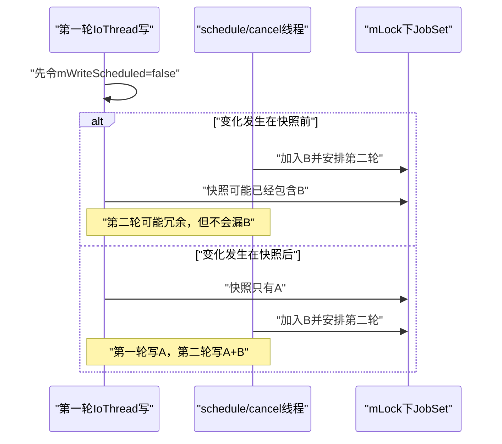
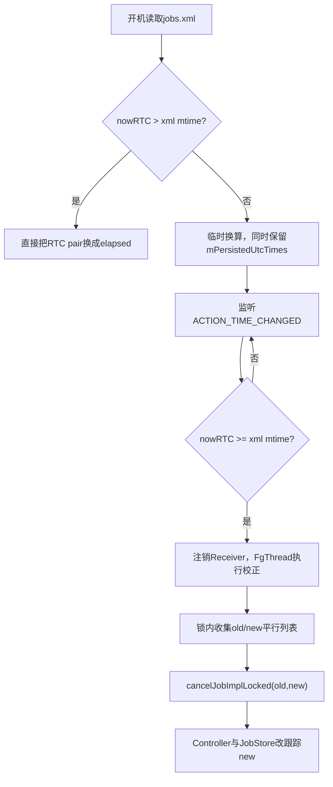
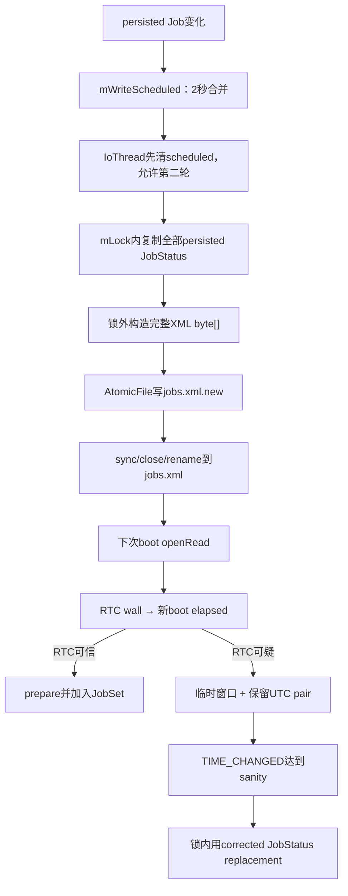

# 135 Android JobStore：并发落盘、AtomicFile 与 RTC 校正

> 源码版本：Android 11 / API 30 / `android-11.0.0_r48`  
> 学习方式：macOS 只读源码，不要求编译、不要求连接设备  
> 前置章节：第 121、124、133、134 章

---

## 1. 本章研究“内存 Job 怎样安全变成 jobs.xml”

JobStore 同时承担两件事：

```text
内存主表：保存 JSS 当前跟踪的全部 JobStatus
磁盘快照：只保存 setPersisted(true) 的 Job
```

看似只是“写 XML”，实际要处理四个难题：

1. JSS 主锁不能被慢磁盘 I/O 长时间占住；
2. 写入期间新 schedule/cancel 不能丢；
3. 旧完整文件不能被半写文件破坏；
4. `elapsedRealtime` 重启归零后，运行窗口怎样恢复。

本章还会专门记录 r48 源码中几个真实而隐蔽的边界，而不把设计意图写成绝对保证。

---

## 2. 先用“白板、拍照、保险文件”建立直觉

```text
JobSet       = system_server 白板上的实时任务
storeCopy    = 某一瞬间对白板拍的照片
jobs.xml.new = 正在冲洗的新照片
jobs.xml     = 上一次已确认的完整照片
```

写盘不会拿着白板锁慢慢画 XML；它先在锁内复制 persisted JobStatus，随后释放锁，在 IoThread 上序列化照片。

---

## 3. 贯穿竞态案例

假设已有 persisted Job A：

```text
t0 schedule A → 安排2秒后写
t1 write runnable开始
t2 拍到[A]
t3 应用又schedule B
t4 第一次写[A]
t5 第二次写[A,B]
```

关键问题不是“第一次为什么没写 B”，而是：B 的变化是否一定能安排第二次写。本章会逐行证明调度标志为什么在复制前清零。

---

## 4. 源码地图

核心实现：

```text
frameworks/base/apex/jobscheduler/service/java/com/android/server/job/JobStore.java
frameworks/base/apex/jobscheduler/service/java/com/android/server/job/JobSchedulerService.java
frameworks/base/apex/jobscheduler/service/java/com/android/server/job/controllers/JobStatus.java
```

原子文件实现：

```text
frameworks/base/core/java/android/util/AtomicFile.java
```

读写测试：

```text
frameworks/base/services/tests/servicestests/src/com/android/server/job/JobStoreTest.java
```

---

## 5. jobs.xml 的真实位置

生产构造器使用：

```java
Environment.getDataDirectory()
```

然后拼成：

```text
/data/system/job/jobs.xml
```

AtomicFile 还会使用同目录下的：

```text
jobs.xml.new
jobs.xml.bak（兼容旧实现遗留）
```

macOS 学习只读源码，不需要也无法在源码树中找到运行设备的 `/data` 文件。

---

## 6. JobStore 在 JSS 构造期同步读取

JSS 构造器先：

```text
发布 JobSchedulerInternal
→ JobStore.initAndGet(this)
→ 构造 JobStore
→ readJobMapFromDisk
→ 再创建各 Controller
```

源码注释明确说构造会发生 blocking read。此时还处于 system_server 启动阶段，不是应用 schedule 的热路径。

---

## 7. 单例只保护 JobStore 实例创建

```java
synchronized (sSingletonLock) {
    if (sSingleton == null) {
        sSingleton = new JobStore(...);
    }
}
```

`sSingletonLock` 不保护任务表，也不保护磁盘写。创建完成后的业务并发使用另外两把锁。

---

## 8. 两把锁分工

| 锁 | 保护内容 | 不应承担什么 |
|---|---|---|
| `mLock` | JobSet 与 JSS/Controller 共享调度状态 | 慢 XML/磁盘写 |
| `mWriteScheduleLock` | `mWriteScheduled`、`mWriteInProgress` 的写调度账本 | JobStatus 内容 |

`mLock` 实际来自 `JobSchedulerService.getLock()`；JobStore 与 JSS 使用同一调度大锁。

---

## 9. AtomicFile 自己不提供线程锁

AtomicFile 类注释直接警告：

```text
does not confer any file locking semantics
caller must ensure mutual exclusion
```

JobStore 依赖单一 IoThread Handler 串行运行 write runnable，而不是依赖 AtomicFile 阻止两次并发写。

---

## 10. 总体线程与锁图


最慢的 XML 和文件 I/O 都在 `mLock` 外。

---

## 11. JobSet 维护两套索引

```text
mJobs：calling UID → ArraySet<JobStatus>
mJobsPerSourceUid：source UID → ArraySet<JobStatus>
```

同一 JobStatus 引用同时进入两个集合。一个便于按调度调用者查询，另一个便于按真正归因/执行来源 UID 查询。

---

## 12. calling UID 与 source UID 为什么不同

普通 App 自己 schedule：

```text
callingUid == sourceUid
```

system_server 使用 `scheduleAsPackage()` 代其他包调度，例如同步任务：

```text
callingUid可能是system
sourceUid是实际账户/包对应UID
```

双索引避免每次按来源查找都全表扫描。

---

## 13. JobStatus 在 JobSet 中按对象身份比较

JobStatus 没有覆盖 `equals/hashCode`，类注释也写明 jobs are compared by reference。

因此：

```text
同uid+jobId的新对象
≠ ArraySet眼中的同一个元素
```

JSS replacement 必须先精确移除 old，再加入 new；不能指望 `JobSet.add(new)` 自动按 uid+jobId 覆盖 old。

---

## 14. add() 的“replaced”容易误读

```java
boolean replaced = mJobSet.remove(jobStatus);
mJobSet.add(jobStatus);
```

这里 `remove(jobStatus)` 只会删除**同一引用**。正常 replacement 已在外层先移除旧对象，所以该返回值不是“发现同 uid+jobId 旧定义”的可靠判断。

---

## 15. get(uid, jobId) 才按逻辑键查找

```java
if (job.getJobId() == jobId) return job;
```

逻辑唯一键是：

```text
calling uid + jobId
```

但集合去重键仍是引用身份。这两种语义必须分开。

---

## 16. countJobsForUid 只数“为自己调度”

```java
if (job.getUid() == job.getSourceUid()) {
    total++;
}
```

因此 system_server 代其他包调度的任务不消耗 calling UID 自己的普通 per-app Job 数量上限。

---

## 17. 只有 persisted 变化才需要写盘

`add()`：

```text
JobStatus进入内存主表
if isPersisted → maybeWrite
```

`remove()`：

```text
从内存主表移除
if removeFromPersisted && isPersisted → maybeWrite
```

非持久 Job 完整参与调度，却不会因为自己的加入/移除触发 jobs.xml 写入。

---

## 18. 每次写都是全量 persisted 快照

JobStore 没有增量日志：

```text
任何一个persisted Job变化
→ 遍历全部Job
→ 复制全部persisted Job
→ 重写整个jobs.xml
```

优点是状态简单、没有增量回放；代价是写放大，所以需要2秒合并。

---

## 19. 2秒是 debounce，不是持久化完成承诺

```java
private static final long JOB_PERSIST_DELAY = 2000L;
```

第一次变化安排一个延迟 runnable；这2秒内后续变化看到 `mWriteScheduled=true`，不会重复 post。

它表示“合并频繁变化”，不表示 schedule 返回2秒后一定已 fsync，也不提供应用可等待的公开 API。

---

## 20. maybeWrite 的状态变化

```java
if (!mWriteScheduled) {
    mIoHandler.postDelayed(mWriteRunnable, 2000);
    mWriteScheduled = mWriteInProgress = true;
}
```

这里 `mWriteInProgress` 从“已安排但尚未开始”就为 true。名字比真实语义窄，它更接近“测试认为仍有持久化工作未清”。

---

## 21. 为什么写 runnable 一开始就清 mWriteScheduled

源码特意在复制 JobSet **之前**：

```java
synchronized (mWriteScheduleLock) {
    mWriteScheduled = false;
}
```

这样从这一刻起的新 persisted 变化能安排下一轮写，即使第一轮尚未复制或写完。

---

## 22. 如果在复制之后才清零会怎样

危险时间线：

```text
第一轮已复制[A]
新变化加入B，但mWriteScheduled仍为true → 不安排第二轮
第一轮随后清零并写[A]
→ B可能长期不落盘
```

所以清零位置决定了是否存在丢更新窗口。

---

## 23. 当前实现如何闭合丢更新窗口



实现接受少量冗余写，换取不遗漏后到变化。

---

## 24. 快照为什么必须持 mLock

```java
synchronized (mLock) {
    mJobSet.forEachJob(... copy ...);
}
```

否则双索引、Job 列表和 replacement 可能在遍历中改变，得到混合时刻或结构异常。

锁内工作只做对象复制，不做 XML 字符串生成和磁盘访问。

---

## 25. 快照复制的不是原引用列表

```java
storeCopy.add(new JobStatus(job));
```

专用 copy constructor 保存：

```text
JobInfo定义与身份
当前earliest/latest
失败次数、成功/失败历史
internal flags
persisted UTC pair
```

随后序列化只读 `storeCopy`，不再遍历活跃 JobSet。

---

## 26. 持久化 copy 不复制运行态

不会复制：

```text
pending/executing JobWorkItem
当前满足约束位
正在使用的Network
changed URI运行快照
pending/active队列成员关系
JobServiceContext绑定与callback token
URI permission owner
```

重启后这些都要重新建立，或本来就不支持恢复。

---

## 27. JobInfo 仍是共享引用，Bundle 又单独深拷贝

JobStatus copy constructor 把旧 `JobInfo` 传入新对象，并没有重建一份 Parcel 副本。写 extras 时，serializer 又调用：

```java
PersistableBundle extrasCopy = deepCopyBundle(extras, 10);
```

这降低嵌套 Bundle 在序列化期间变化的风险，但不是把整个 JobInfo 做深复制。

---

## 28. extras 深拷贝最多10层

递归：

```text
每层clone当前PersistableBundle
遇到子PersistableBundle继续copy
maxDepth归零时返回null
```

超过10层的子 Bundle 会被替成 null，而不是无限递归。公开 Builder 自身也限制可持久化类型，但深度仍要防御。

---

## 29. 快照后的变化为何不修改这一轮 XML

一旦释放 mLock：

```text
活跃JobSet继续变化
storeCopy保持这一轮时点
后到持久变化由第二轮写覆盖
```

这是 snapshot isolation 的简化形式，不是事务数据库；它只保证每轮使用一份锁内取得的自洽任务集合。

---

## 30. 写入三阶段

```text
阶段1：在内存 ByteArrayOutputStream 构建完整 XML
阶段2：AtomicFile.startWrite() 打开 jobs.xml.new
阶段3：write bytes → finishWrite sync/close/rename
```

先把 XML 完整构造到内存，减少 `.new` 已打开后发生 serializer 异常的机会。

---

## 31. 为什么不是边遍历 JobSet 边写文件

边遍历边写会同时带来：

```text
长时间占mLock
磁盘错误时快照边界不清晰
JobStatus在序列化中被replacement
应用schedule/cancel Binder线程被I/O拖住
```

复制后写把调度锁与 I/O 延迟隔离开。

---

## 32. XML 根结构

大致为：

```xml
<job-info version="0">
  <job ...>
    <constraints ... />
    <one-off ... />
    <extras>...</extras>
  </job>
</job-info>
```

周期 Job 使用 `<periodic period="..." flex="...">` 代替 `<one-off>`。

---

## 33. schema version 当前是0

```java
private static final int JOBS_FILE_VERSION = 0;
```

读取时若根版本不等于0，直接放弃整个文件的 Job 列表，不做“尽量按旧版本猜”。

这是严格兼容门，不是每个字段独立版本化。

---

## 34. job 标签保存的身份字段

包括：

```text
jobid
service package/class
sourcePackageName/sourceTag/sourceUserId（存在时）
calling uid
priority
JobInfo flags
internalFlags（非0时）
lastSuccessfulRunTime
lastFailedRunTime
```

`calling uid` 与 `source identity` 都保存，才能恢复双重归属。

---

## 35. 显式约束保存什么

```text
required network capabilities/unwanted capabilities/transports
idle
charging
battery-not-low
storage-not-low
```

网络 request 被拆成 bit 数组再 pack 为 long。network specifier 因 persisted Job Builder 校验而不允许。

---

## 36. r48 的 dynamic constraint 固化风险

writer 调用：

```text
hasBatteryNotLowConstraint()
hasChargingConstraint()
hasIdleConstraint()
...
```

JobStatus 的 `hasConstraint()` 同时检查公开 required 与 `mDynamicConstraints`。如果 RESTRICTED bucket 动态加入的位正好在写盘时存在，它可能被 XML 写成永久 JobInfo 约束，重启后不再只是动态门。

这是前面 Battery/Idle 章节已经发现的 r48 边界，在 JobStore 中能看到根因。

---

## 37. 时间字段为何落成 wall clock

内存使用 elapsed：

```text
earliestElapsed / latestElapsed
```

但 elapsed 在重启后重新计时，不能原样跨 boot。writer 换算为：

```text
deadlineWall = nowRTC + (latestElapsed - nowElapsed)
delayWall = nowRTC + (earliestElapsed - nowElapsed)
```

jobs.xml 因而保存绝对 UTC 墙钟时刻。

---

## 38. sentinel 不写成普通时间

只有：

```text
hasDeadlineConstraint → 写deadline
hasTimingDelayConstraint → 写delay
```

没有 earliest 的0和没有 latest 的Long.MAX_VALUE不会直接做危险的加减后写入。

---

## 39. RTC 未可信时不重复换算

若 JobStatus 带 `mPersistedUtcTimes`，writer 直接重写原 pair：

```text
deadline = utcPair.second
delay = utcPair.first
```

它不会拿错误 RTC 下临时膨胀的 elapsed 再换一次，否则每次写都可能继续漂移。

---

## 40. Backoff 只在非默认时写

若：

```text
initial=30秒 且 policy=EXPONENTIAL
```

XML 省略两个属性，读取 Builder 自然使用默认值。

只要任意一个不同，就同时写：

```text
backoff-policy
initial-backoff
```

---

## 41. persisted Job 天然排除了三类字段

JobInfo Builder 已拒绝：

```text
transientExtras
ClipData
TriggerContentUri
```

因此 JobStore 不需要为它们设计 XML。JobWorkItem enqueue 也拒绝 persisted，队列同样不会出现。

---

## 42. estimated network bytes 在 r48 没有写入

JobInfo 有：

```text
estimatedNetworkDownloadBytes
estimatedNetworkUploadBytes
```

但 JobStore writer/reader 没有对应 XML 属性。persisted 网络 Job 重启后这些值回到 Builder 默认 UNKNOWN。

现有 JobStoreTest 的 raw JobInfo equality 也没有构造 estimated bytes，因此没有覆盖这个字段缺失。

---

## 43. numFailures 也没有写入

第134章已经看到：

```text
当前delay边界可写
lastFailed可写
backoff配置可写
numFailures不写
```

所以恢复后当前等待窗口可以近似保留，但下一次失败从 attempt=1 重新计数。

---

## 44. AtomicFile 的新实现如何提交

`startWrite()`：

```text
处理遗留.bak
打开jobs.xml.new
```

`finishWrite()`：

```text
sync输出流
close
rename jobs.xml.new → jobs.xml
```

同目录 rename 用于原子替换已确认的 base 文件。

---

## 45. .bak 是旧实现兼容，不是当前每次都生成

当前 AtomicFile 正常写走 `.new`，不会先把 base 重命名成 `.bak`。但 `startWrite/openRead/getLastModifiedTime` 都认识旧版本留下的 `.bak`，必要时恢复为 base。

不要把历史注释里的“先备份旧文件”当作 r48 每轮正常路径。

---

## 46. openRead 如何处理遗留 .new

若：

```text
jobs.xml.new存在 AND jobs.xml存在
```

openRead 删除 `.new`，读取已提交 base，说明上次写未完成。

第一次写若只有 `.new` 而 base 不存在，它不会把 partial new 当作 base，最终打开 base 会报 FileNotFound。

---

## 47. AtomicFile 保证完整性，不保证写成功

它能让读取者看到旧完整 base 或新完整 base，避免把半个 XML 当正式文件。

但：

```text
磁盘满
rename失败
sync失败
调用者忘记failWrite
```

都可能导致“新状态未提交”。原子性不等于持久化必达。

---

## 48. JobStore 的异常分支没有调用 failWrite

r48 `writeJobsMapImpl()` 在 try 内声明局部 `fos`，catch 只记日志：

```java
FileOutputStream fos = mJobsFile.startWrite(...);
fos.write(...);
mJobsFile.finishWrite(fos);
```

若 `startWrite()` 之后、`finishWrite()` 之前抛 IOException，catch 无法访问 fos，也没有 `mJobsFile.failWrite(fos)`。

这是必须如实记录的实现缺口。

---

## 49. 忘记 failWrite 的实际后果

通常：

```text
旧jobs.xml仍是权威完整文件
残留jobs.xml.new可能保留
下次openRead在base存在时会删new
下次startWrite会重新打开/截断new
```

所以旧数据完整性大多仍在，但资源及时关闭、`.new` 清理和失败回滚协议不完整，且新状态没有自动提交。

---

## 50. 写失败后不会自动重试

write runnable 最终仍会清：

```text
mWriteInProgress=false
```

异常 catch 没有重新 post。只有以后又发生 persisted 状态变化，才会触发下一次写。

因此“AtomicFile存在”不能推出瞬时 I/O 错误后系统会主动重试。

---

## 51. persist stats 可能高估真正保存数

`numJobs++` 在构造 XML 循环中发生，finally 无论文件提交成功与否都会把计数写入：

```text
countAllJobsSaved
countSystemServerJobsSaved
countSystemSyncManagerJobsSaved
```

所以这些数字更接近“本轮尝试序列化的数量”，不能单独证明磁盘 commit 成功。

---

## 52. mWriteInProgress 的第二轮竞态

第一轮开始后清 `mWriteScheduled=false`；新变化安排第二轮，并把 `mWriteInProgress=true`。

但第一轮结束无条件又设：

```text
mWriteInProgress=false
```

此时第二轮可能仍在 Handler 队列等待。生产写仍会执行，因为 IoThread 消息已 post；但测试用 `waitForWriteToCompleteForTesting()` 可能提前返回。

---

## 53. 为什么两轮不会同时写 AtomicFile

两次 runnable 都投到同一个：

```text
IoThread.getHandler()
```

Handler 的 Looper 串行执行消息；第二轮只能在第一轮 run 返回后开始。因此上述 flag 竞态影响等待可观测性，不会直接制造两个 Java runnable 同时写 `.new`。

---

## 54. writeStatusToDiskForTesting 不能撞已有异步写

测试同步入口先检查：

```java
if (mWriteScheduled) throw IllegalStateException
```

再直接调用 runnable。它不是生产同步 API，也没有取消 Handler 中消息的逻辑。

---

## 55. waitForWrite 的等待公式还有可读性陷阱

```java
mWriteScheduleLock.wait(now - start + maxWaitMillis);
```

通常直觉会写 `end - now`，这里却是“已等待时间 + 最大等待”。循环下一轮的单次 wait 反而更长。

外层每轮先检查 `now >= end`，但一次 wait 可以越过目标很久才醒；notify 通常使测试正常结束，超时上界并不严格。

---

## 56. 读取从 AtomicFile.openRead 开始

```text
openRead处理旧.bak与残留.new
→ XmlPullParser读取UTF-8
→ 校验根标签和version
→ 逐个restoreJobFromXml
→ 持mLock prepare并加入目标JobSet
```

读取不是通过 `JobStore.add()`，避免开机加载每一项又触发写盘。

---

## 57. 文件不存在是正常空状态

`FileNotFoundException` 只在 DEBUG 下记录：

```text
probably there was nothing to load
```

首次启动或从未有 persisted Job 时没有 jobs.xml，不应当当成系统错误。

---

## 58. XML 整体损坏与单项损坏的处理不同

```text
根XML无法解析/IO失败 → 外层wtf，本次加载结束
某个job字段非法 → restore返回null，跳过该job并继续扫描
```

不过某些未被局部 catch 的运行时异常仍可能扩大影响，不能把 parser 设计概括成“任何坏 Job 都绝不影响其他项”。

---

## 59. 根标签与 version 是整文件门

只有根为：

```text
job-info version="0"
```

才创建列表。标签不符或 version 不符直接返回 null，文件中即使有看似可读的 `<job>` 也不会加载。

---

## 60. 每个 Job 恢复先重建 Builder

从 `<job>` 读取：

```text
ComponentName(package,class)
jobId
persisted=true
calling uid、source身份
priority、flags、internalFlags
lastSuccessful、lastFailed
```

然后依次恢复 constraints、execution criteria、extras，最后重新 `build()`，让当前 Builder 校验再次把关。

---

## 61. source package 恢复可能回退

JobStatus 构造器会通过 PackageManager 查：

```text
sourcePackageName + sourceUserId → sourceUid
```

查不到时回退为：

```text
sourceUid=callingUid
sourcePackageName=JobService所在包
sourceTag=null
```

XML 保存了 source 名称，却不直接信任一个陈旧 sourceUid 数字。

---

## 62. Sync Job 有历史迁移

若：

```text
sourcePackageName == "android"
extras["SyncManagerJob"] == true
```

读取会从 `owningPackage` 修正 source package。这是旧版本不完整表达向新归属模型迁移的兼容逻辑。

---

## 63. 网络约束兼容新旧格式

优先读取：

```text
net-capabilities
net-unwanted-capabilities
net-transport-types
```

若新字段不完整，则回退识别历史布尔属性：

```text
connectivity / metered / unmetered / not-roaming
```

因此 schema version 不变时，字段内部仍做了兼容读取。

---

## 64. unwanted capabilities 缺失时采用 Builder 默认

新网络格式中若没有 `net-unwanted-capabilities`，代码先建默认 NetworkRequest，再 pack 其默认 unwanted capabilities。

这不是简单当作空数组，能保留当前 NetworkCapabilities 默认语义。

---

## 65. elapsed 与 wall clock 的根本矛盾

```text
elapsedRealtime：单次boot内单调，适合调度；重启后重置
wall clock：可跨boot记录绝对时刻；可能被用户/NTP/错误RTC调整
```

JobStore 只能借 wall clock 作为桥梁，再在开机时转换回新的 elapsed 时间基准。

---

## 66. 正常 RTC 转换公式

读取到 wall-clock pair 后：

```text
earliestElapsed = nowElapsed + max(earliestRTC - nowRTC, 0)
latestElapsed = nowElapsed + max(latestRTC - nowRTC, 0)
```

已经过期的时间压到“现在”，不会生成负 elapsed delay。

---

## 67. sentinel 转换

```text
earliestRTC <= 0 → NO_EARLIEST_RUNTIME=0
latestRTC >= Long.MAX_VALUE → NO_LATEST_RUNTIME=Long.MAX_VALUE
```

这依赖 XML 缺失字段由 reader 赋 sentinel，而不是让普通时间算术处理无限值。

---

## 68. 正常换算案例

```text
写盘时deadline=14:00 wall clock
重启后nowRTC=13:50
nowElapsed=2分钟
```

得到：

```text
latestElapsed = 2分钟 + 10分钟 = 12分钟
```

新 boot 上 TimeController 只需等待到 elapsed=12分钟。

---

## 69. 已过期案例

```text
deadlineRTC=13:40
nowRTC=13:50
```

`max(-10分钟,0)=0`，所以 latestElapsed=nowElapsed。它会成为已到期窗口，但是否立即运行仍受 JSS 的其他 ready 门限制。

---

## 70. 怎样判断开机 RTC 可疑

构造器取：

```text
mXmlTimestamp = jobs.xml最后修改时间
mRtcGood = nowWallClock > mXmlTimestamp
```

如果系统当前日期竟早于或等于上次写文件时间，怀疑 RTC 尚未初始化，不能相信 `storedRTC-nowRTC`。

---

## 71. 文件不存在时为何通常视为 RTC good

AtomicFile `getLastModifiedTime()` 在文件不存在时返回0。现代 wall clock 通常大于0，因此：

```text
nowRTC > 0 → mRtcGood=true
```

没有持久 Job 可校正，也就无需额外监听时间变化。

---

## 72. `>` 而不是 `>=`

判断使用严格大于：

```text
nowRTC == xmlTimestamp → rtcGood=false
```

这偏保守：相等也先不相信，等待后续时间推进/设置。

---

## 73. RTC 不可信时仍会临时计算 elapsed

`restoreJobFromXml(false, ...)` 仍先调用 `convertRtcBoundsToElapsed()`。错误 RTC 可能让任务临时看起来很远或已到期。

不同之处是构造 JobStatus 时还保存：

```text
mPersistedUtcTimes = 原始RTC pair
```

为以后重新校正保留权威输入。

---

## 74. 为什么不干脆等 RTC 好了再加载 Job

源码选择先把 persisted Job 放回内存，使 Job 定义、约束和系统查询不至于完全消失；时间窗口可在 RTC 变可信后 replacement。

代价是校正前时间门可能是临时近似，必须继续跟踪 `ACTION_TIME_CHANGED`。

---

## 75. JSS 注册的是 TIME_CHANGED

若 `jobTimesInflatedValid()` 为 false：

```text
registerReceiver(mTimeSetReceiver, ACTION_TIME_CHANGED)
```

每次收到后检查：

```text
nowWallClock >= mXmlTimestamp
```

注意这里变成 `>=`，与构造初判的严格 `>` 不同。

---

## 76. 达到 sanity 后先注销 Receiver

一旦时钟达到文件时间：

```text
unregisterReceiver
FgThread.post(mJobTimeUpdater)
```

它只做一次校正，不是以后每次用户改时间都重算全部 persisted Job。

---

## 77. mRtcGood 没有被设回 true

r48 的 `mJobTimeUpdater` 完成 replacement 后，没有给 JobStore.mRtcGood 赋 true。

实际 Receiver 已注销，所以运行时不会重复处理；但 `jobTimesInflatedValid()` 之后仍可能返回 false。这是状态字段与一次性流程没有完全收敛的实现边界。

---

## 78. 两阶段校正总图



---

## 79. 校正为何创建新 JobStatus

earliest/latest 在 JobStatus 中是 final 字段，不能原地改。

所以：

```text
原utc pair → convert到当前elapsed
new JobStatus(old, corrected earliest/latest, failures=0,...)
```

再用 replacement 把 old 换掉。

---

## 80. 收集与替换必须在同一把 mLock

源码注释强调：

```text
lookup affected jobs and replace them inside same lock lifetime
```

否则收集 old/new 后，应用可能用同 uid+jobId schedule 新定义；校正线程再回来就可能错误覆盖用户刚提交的新 Job。

---

## 81. 为什么先形成平行列表

直接在 `forEachJob()` 中修改 JobSet 会破坏正在遍历的 ArraySet。

所以先得到：

```text
toRemove[i] = old
toAdd[i] = corrected new
```

遍历结束后按相同索引 replacement。

---

## 82. corrected Job 会 prepare

`getRtcCorrectedJobsLocked()` 内：

```java
newJob.prepareLocked();
```

随后 `cancelJobImplLocked(old,new)` 会 unprepare old、迁移 tracking 并 startTracking new。对于 persisted Job，ClipData 本来不允许，因此 prepare 通常没有 URI grant；流程仍保持通用不变量。

---

## 83. 校正 replacement 会影响运行中的 Job

`cancelJobImplLocked(old,new,"deferred rtc calculation")` 不只是换表：

```text
移除pending old
若old正在运行，发stop
tracking corrected new
```

所以 RTC 校正可能打断正执行的旧代际，而不是透明地只改一个 Alarm 数字。

---

## 84. failures 为什么在 RTC 校正时重置

新 JobStatus 构造参数显式传：

```text
backoffAttempt = 0
```

JobStore 本来也没从 XML 恢复 numFailures。校正保留 last successful/failed 时间，但不会重新构造失败级数。

---

## 85. originalLatest 的校正边界

rescheduling constructor 会让：

```text
mOriginalLatestRunTimeElapsed = corrected latest
```

因为它调用基础构造器。对于普通 persisted periodic，这重新建立当前 boot 的周期锚点；对于第134章讨论的 failure periodic，原内存锚点没有单独 XML 字段，无法精确恢复。

---

## 86. 周期窗口恢复的 sanity clamp

读取 `<periodic>` 后，如果：

```text
latestElapsed > nowElapsed + period + flex
```

改为：

```text
earliest = now + period
latest = now + period + flex
```

避免一个异常远的周期窗口长期饿死 Job。

---

## 87. clamp 使用读取到的原 period/flex

reader 先从 XML 取 `periodMillis/flexMillis`，交给 Builder（Builder可能做最小值钳位），但 sanity 比较和回退公式仍使用局部原始值。

若 XML 被篡改为过小值，Builder有效参数与这段局部计算可能不完全一致。这是恢复代码的边界，不应假设所有钳位只发生一次且共享同一变量。

---

## 88. JobStoreTest 覆盖了哪些主路径

包括：

```text
one-off delay/deadline/backoff往返
两个Job同文件
extras
source package/user
period/flex
超远周期窗口clamp
priority/internal flags
非persisted不落盘
新网络capability与legacy约束
charging/idle/battery/storage约束
```

测试会把 JobInfo Parcel bytes 做最终一致性检查。

---

## 89. 测试并没有证明所有字段都持久化

测试构造对象没有覆盖：

```text
estimated network bytes
numFailures
JobWorkItem（API本就拒绝persisted）
运行时Controller状态
失败AtomicFile路径
连续两轮写的mWriteInProgress竞态
RTC校正后mRtcGood状态
```

“测试通过”只能证明用例覆盖的字段和路径。

---

## 90. testMassivePeriodClampedOnRead 的断言也较弱

第二条注释说检查 late runtime，却实际再次断言：

```java
loaded.getEarliestRunTime() <= now + period + flex
```

没有读取 `getLatestRunTimeElapsed()`。实现公式仍可直接从源码证明，但不能声称该测试完整验证了 late 值。

---

## 91. 测试时间容差的历史痕迹

正常时间往返允许：

```text
abs(before-after) < 700ms
```

注释把它解释为读写 I/O 延迟。不过当前这份 r48 测试在 `setUp()` 中已经把 JSS 注入的
wall、uptime、elapsed 三只 Clock 都固定住；因此对走注入 Clock 的时间换算来说，700ms
更像沿用下来的宽松容差，而不是当前用例必然产生的时钟推进。这里应区分“测试注释说明”
与“当前测试夹具的实际时钟行为”。

---

## 92. removeJobsOfNonUsers 的持久化缺口

JobStore 方法：

```java
public void removeJobsOfNonUsers(int[] whitelist) {
    mJobSet.removeJobsOfNonUsers(whitelist);
}
```

它直接批量删双索引，没有调用 `maybeWriteStatusToDiskAsync()`。JSS 启动阶段用它清不存在用户的 Job；若没有后续 persisted 变化，磁盘旧记录可能留到下次重启再被读入、再清一次。

---

## 93. clear() 与 removeJobsOfNonUsers 不同

```text
clear → 清内存后无条件maybeWrite
removeJobsOfNonUsers → 只清内存，不安排写
```

后者也不逐项 unprepare/controller cleanup；它只适合 JSS 尚未 ready、Controller 尚未挂载的启动清理位置。不能随意在运行期复用。

---

## 94. 读入时 prepare 失败会怎样

read runnable 在锁内逐项：

```java
js.prepareLocked();
jobSet.add(js);
```

没有对单项 `SecurityException` 做局部 catch。persisted Job 禁止 ClipData，正常 prepare 基本不会 grant；但若未来扩展或异常状态抛出，可能中止整轮读取的控制流。

---

## 95. FileInputStream 不是 finally/try-with-resources 关闭

代码：

```text
openRead
读取
fis.close
catch异常
```

如果 parsing 在 `fis.close()` 前抛异常，没有 finally 关闭这个流。这是 r48 资源清理边界；进程长期存活时虽只在启动读一次，也应准确指出。

---

## 96. 全量写的性能边界

每次 persisted 变化最终会：

```text
复制全部persisted JobStatus
深拷贝所有extras
构造整个XML byte[]
sync并rename整个文件
```

API schedule quota、每 UID Job 数上限和2秒 debounce 都间接限制压力，但 JobStore 本身不是增量数据库。

---

## 97. 内存峰值来自多份表示

写入期间可能同时存在：

```text
活跃JobSet
storeCopy JobStatus列表
FastXmlSerializer/ByteArrayOutputStream bytes
AtomicFile输出缓冲/内核页缓存
```

extras 大小在 JobInfo/Parcel 层已有约束，但理解 OOM 风险时仍要看到全量快照的复制成本。

---

## 98. jobs.xml 是调度恢复，不是业务数据库

不会保存：

```text
业务处理进度
外部服务幂等结果
WorkItem队列
任意运行线程栈
精确所有Controller账本
```

需要可靠业务恢复时，应用数据库仍是权威，persisted Job 只是重启后唤醒扫描的调度信号。

---

## 99. 常见误解一：JobStore 只保存 persisted Job

错误。内存 JobSet 保存全部 Job；磁盘快照才过滤 persisted。

---

## 100. 常见误解二：2秒后一定已经落盘

错误。2秒是 Handler debounce，后面还有等待 IoThread、复制、序列化、sync/rename，且 I/O 可能失败。

---

## 101. 常见误解三：写期间变化会被当前快照自动包含

错误。变化在快照后发生就不在当前 storeCopy；正确性依赖它能安排下一轮写。

---

## 102. 常见误解四：AtomicFile 自动解决线程并发

错误。AtomicFile 明确不提供 locking；JobStore 依赖 IoThread串行和自己的调度锁。

---

## 103. 常见误解五：AtomicFile 意味着写失败会自动重试

错误。它保护旧完整文件；JobStore catch 后不自动重发写任务。

---

## 104. 常见误解六：catch IOException 就完成了 AtomicFile 回滚

错误。r48 JobStore 没有调用 `failWrite(fos)`，这正是本章的重要实现缺口。

---

## 105. 常见误解七：persist stats 就是磁盘已保存数量

错误。计数在 XML 构建时增加，finally 即使 commit 失败也更新。

---

## 106. 常见误解八：JobInfo 所有字段都能 XML 往返

错误。estimated network bytes 没有字段；transient/Clip/trigger由 persisted API 禁止；运行态也不保存。

---

## 107. 常见误解九：elapsedRealtime 可以直接写盘跨重启

错误。它只在单次 boot 有意义，必须经 wall clock 桥接后在新 boot 重新膨胀。

---

## 108. 常见误解十：RTC 不可信时 Job 完全不加载

错误。仍临时换算并加载，同时保留原 UTC pair，之后用 replacement 校正。

---

## 109. 常见误解十一：时钟校正只是改一个字段

错误。earliest/latest 为 final，JSS 创建 new JobStatus 并走 cancel/replacement，运行中的 old 也可能被 stop。

---

## 110. 常见误解十二：JobStoreTest 证明全部实现正确

错误。测试覆盖主字段往返，但没有覆盖 I/O失败、双写等待竞态、estimated bytes、mRtcGood收敛等边界，周期 late clamp 的断言还写成了 earliest。

---

## 111. 面试题：为什么 mWriteScheduled 要在复制前清零

参考回答：

从清零开始的新 persisted 变化可以安排第二轮写。如果在复制后才清零，快照完成到清零之间的变化会看到旧 true 而不 post，新快照又已错过它，从而产生丢更新窗口。提前清零最多多写一次相同快照，却能闭合遗漏窗口。

---

## 112. 面试题：AtomicFile 保证了什么

参考回答：

它把新内容写到 `.new`，finish 时 sync、close、rename，使读取通常看到旧完整 base 或新完整 base；它不提供并发锁、不保证 I/O 成功、不自动重试，调用失败还必须正确 `failWrite()`。

---

## 113. 面试题：为什么要 wall clock 与 elapsed 两次转换

参考回答：

elapsed 单调且适合一次 boot 内调度，却不能跨重启；wall clock 可持久化绝对时刻但可能不可信。写盘把剩余 elapsed delta 投影到 RTC，开机再用新的 nowRTC/nowElapsed恢复；RTC 可疑时保留原 UTC pair，待时间可信后 replacement 校正。

---

## 114. macOS 只读练习一：追两把锁

```bash
sed -n '300,475p' \
  frameworks/base/apex/jobscheduler/service/java/com/android/server/job/JobStore.java
```

标出 `mWriteScheduleLock` 与 `mLock` 的每个区间，回答为什么 XML 生成不在任一 Job 调度锁内。

---

## 115. macOS 只读练习二：手画两轮写竞态

```bash
sed -n '323,425p' \
  frameworks/base/apex/jobscheduler/service/java/com/android/server/job/JobStore.java
```

分别把 B 插入在：清 scheduled 前、清零后快照前、快照后、第一轮 finish 后，判断当前/下一轮写包含哪些 Job。

---

## 116. macOS 只读练习三：核对 AtomicFile 契约

```bash
sed -n '35,245p' \
  frameworks/base/core/java/android/util/AtomicFile.java

sed -n '420,478p' \
  frameworks/base/apex/jobscheduler/service/java/com/android/server/job/JobStore.java
```

找出 JobStore 为什么没有完整遵守 `startWrite` 后必须 finish/fail 的契约。

---

## 117. macOS 只读练习四：列 XML 字段矩阵

```bash
sed -n '480,620p' \
  frameworks/base/apex/jobscheduler/service/java/com/android/server/job/JobStore.java

sed -n '760,1040p' \
  frameworks/base/apex/jobscheduler/service/java/com/android/server/job/JobStore.java
```

做三列表：JobInfo/JobStatus字段、是否写、恢复默认/来源。重点核对 estimated bytes、numFailures、internalFlags 和 source identity。

---

## 118. macOS 只读练习五：手算时间换算

```bash
sed -n '620,650p' \
  frameworks/base/apex/jobscheduler/service/java/com/android/server/job/JobStore.java
```

使用：

```text
nowRTC=13:50
nowElapsed=2m
delayRTC=13:55
deadlineRTC=14:10
```

计算新 boot 的 earliest/latest，并再算两个 RTC 都已过期时的结果。

---

## 119. macOS 只读练习六：追 RTC 两阶段替换

```bash
sed -n '1455,1520p' \
  frameworks/base/apex/jobscheduler/service/java/com/android/server/job/JobSchedulerService.java

sed -n '145,205p' \
  frameworks/base/apex/jobscheduler/service/java/com/android/server/job/JobStore.java
```

解释严格 `>` 初判、`>=` 恢复门、FgThread、同锁平行列表和 replacement 的原因。

---

## 120. macOS 只读练习七：审计测试覆盖

```bash
rg -n '^\s*@Test|assertEquals|assertTrue' \
  frameworks/base/services/tests/servicestests/src/com/android/server/job/JobStoreTest.java
```

列出已覆盖与未覆盖项，并定位 `testMassivePeriodClampedOnRead` 第二条断言为何没有验证 late runtime。

---

## 121. 阅读检查题

1. JobStore 的内存主表与磁盘快照分别保存什么？
2. mLock 与 mWriteScheduleLock 各保护什么？
3. AtomicFile 为什么不能替代写线程互斥？
4. calling UID/source UID 双索引解决什么问题？
5. JobStatus 在 ArraySet 中按什么比较？
6. 为什么2秒是 debounce 而非完成承诺？
7. mWriteScheduled 为什么在快照前清零？
8. 新变化发生在快照前/后各怎样被保存？
9. 为什么要 new JobStatus(job) 快照？
10. 哪些运行态不会进入快照？
11. XML 为何先在 ByteArrayOutputStream 完整构建？
12. AtomicFile `.new/.bak/base` 各是什么角色？
13. JobStore 的 failWrite 缺口有什么影响？
14. 为什么写失败不会自动重试？
15. persist stats 为什么不能证明commit？
16. estimated network bytes为何会在重启后丢失？
17. elapsed时间怎样经RTC跨boot？
18. RTC可疑的判定是什么？
19. 为什么校正必须创建新JobStatus？
20. mRtcGood、批量删无效用户和测试断言有哪些r48边界？

---

## 122. 一页复习图



---

## 123. 本章结论

可以压缩成二十二点：

1. JobStore 内存保存全部 Job，磁盘只写 persisted；
2. JobSet 同时按 calling UID 与 source UID 建索引；
3. JobStatus 集合比较是引用身份，逻辑查询才用 uid+jobId；
4. persisted 变化以2秒 debounce 合并；
5. 每轮是全部 persisted Job 的全量快照；
6. mWriteScheduled 在复制前清零以闭合丢更新窗口；
7. 后到变化可能造成冗余第二写，但不会只依赖旧快照；
8. mLock 内只复制，XML与磁盘I/O在锁外；
9. JobStatus copy 不含 WorkItem、Controller满足态和执行槽；
10. extras 另做最多10层深拷贝；
11. XML 保存身份、显式约束、窗口、历史、backoff配置与extras；
12. r48 dynamic constraint 可能被 hasConstraint writer 固化；
13. estimated network bytes 与 numFailures 没有XML字段；
14. AtomicFile以 `.new` + sync/rename保护旧/新完整文件；
15. AtomicFile不提供线程锁或自动重试；
16. r48 JobStore 异常分支没有 failWrite；
17. 写失败后需等未来变化才再写，stats也可能高估commit；
18. 第二轮已排队时第一轮可能过早清 mWriteInProgress，测试等待语义有缝；
19. elapsed窗口通过wall clock桥接跨boot，过期差值压到0；
20. RTC早于jobs.xml mtime时先临时加载并保留UTC pair；
21. 时间可信后在同一mLock内用new JobStatus replacement校正；
22. r48 还存在mRtcGood不回写、无效用户批量删除不触发写、流关闭与测试覆盖不足等边界。

最值得带走的一句话：

> JobStore 的核心不是“把对象写成 XML”，而是把实时调度状态切成一个锁内快照，再以可重写的全量文件跨越进程生命周期；它用提前清 scheduled 防丢更新，用 AtomicFile 保旧文件完整，用 RTC 作 elapsed 的跨 boot 桥梁，但这些机制各自都有清晰边界，不能合并成“绝对不丢、全部可恢复”的口号。

---

## 124. 生成后复读：容易误解处的修订

初稿完成后，对照 JobStore、JobStatus、JSS RTC updater、AtomicFile 与 JobStoreTest 逐段反向复读，重点修订：

1. 分开内存全部 Job 与磁盘 persisted 子集；
2. 分开单例锁、JSS mLock 与写调度锁；
3. 明确 AtomicFile 不提供并发互斥，真实串行来自 IoThread Handler；
4. 用对象身份解释 `mJobSet.remove(jobStatus)`，不误写成uid+jobId覆盖；
5. 用四个插入时点验证 scheduled 必须在快照前清零；
6. 限定锁内只获取自洽快照，锁外快照不是数据库事务；
7. 列出 persistence copy 不携带的运行状态；
8. 补出JobInfo共享引用与extras最多10层深拷贝的差异；
9. 逐字段核对 XML writer/reader，发现 estimated network bytes 缺失；
10. 再次确认 numFailures不持久化、dynamic constraints可能固化；
11. 读完整 AtomicFile r48 实现，修正“每次先生成.bak”的旧认知；
12. 发现 JobStore startWrite 后异常未调用 failWrite；
13. 修正写失败会自动重试、persist stats证明commit等过度结论；
14. 推演第二轮排队时第一轮无条件清 mWriteInProgress 的测试等待竞态；
15. 检查 wait公式，限定maxWait不是严格唤醒上界；
16. 分开整文件错误、单Job跳过与未覆盖运行异常；
17. 手算正常、过期与RTC可疑三类wall/elapsed转换；
18. 明确不可信时仍临时加载，随后以replacement而非原地修改校正；
19. 记录初判`>`、恢复`>=`与mRtcGood不回写的状态边界；
20. 发现无效用户批量删除不触发磁盘写；
21. 检查FileInputStream异常关闭路径与全量写内存峰值；
22. 对照测试发现estimated bytes/I/O失败/双写/RTC状态未覆盖，且周期late clamp断言误用了earliest；
23. 修正测试时间描述：源码注释说700ms用于I/O延迟，但当前夹具已冻结三只注入Clock；
24. 将全部练习限定为 macOS `sed`/`rg` 只读分析，不要求编译。

下一章进入 JobScheduler 的 Quota 与执行统计联动：从 JobPackageTracker 的 pending/active 历史、load factor、stop reason 追到 dumpsys 统计和并发优先级调整，并与 QuotaController 的调度配额严格分层。
