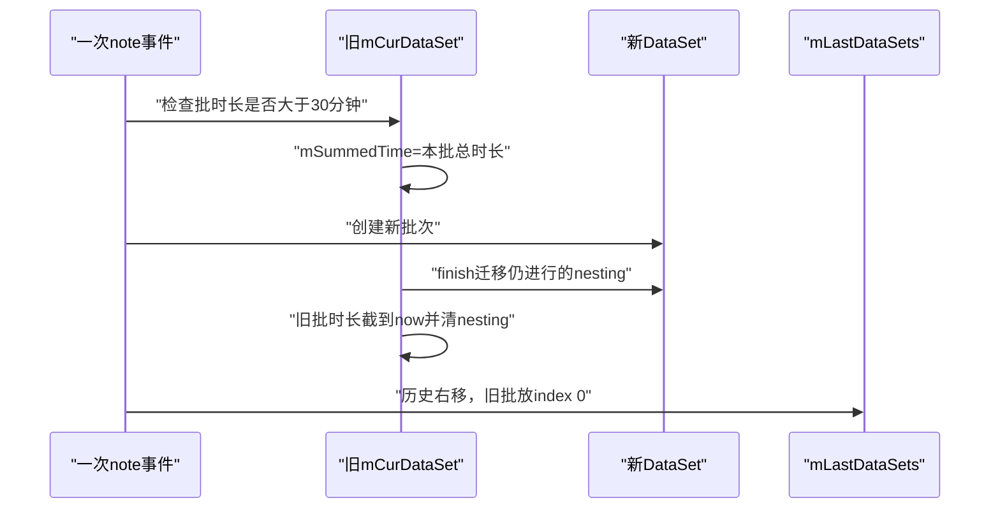
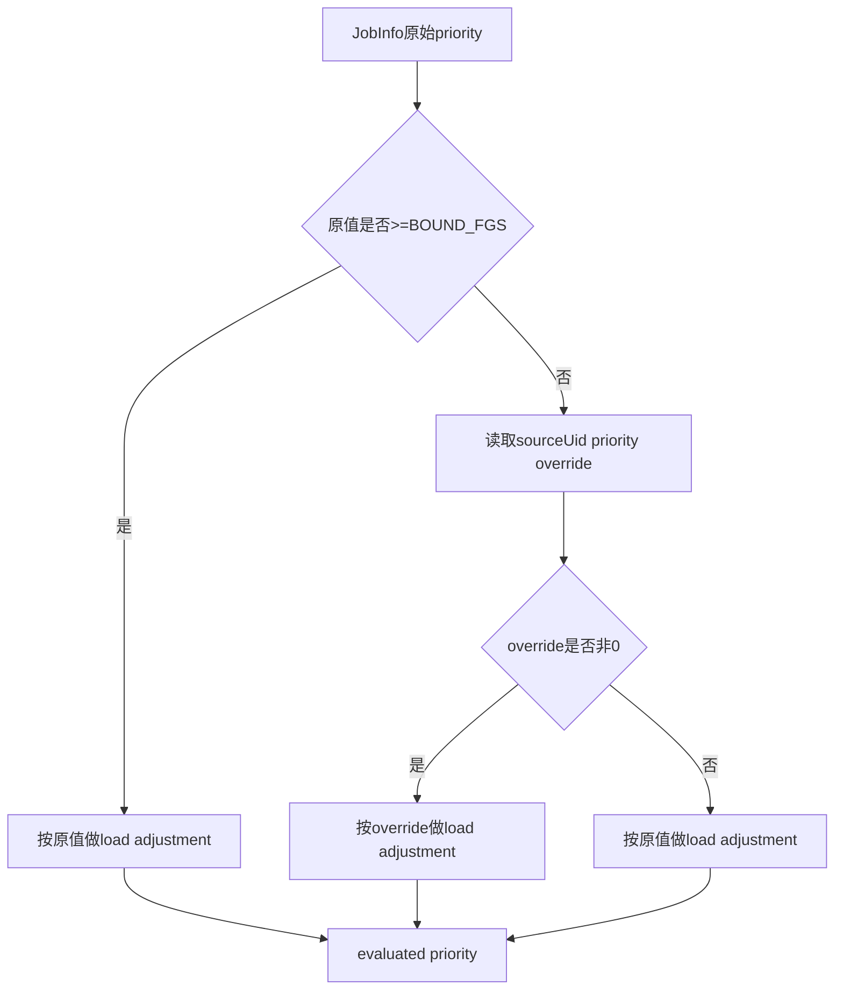
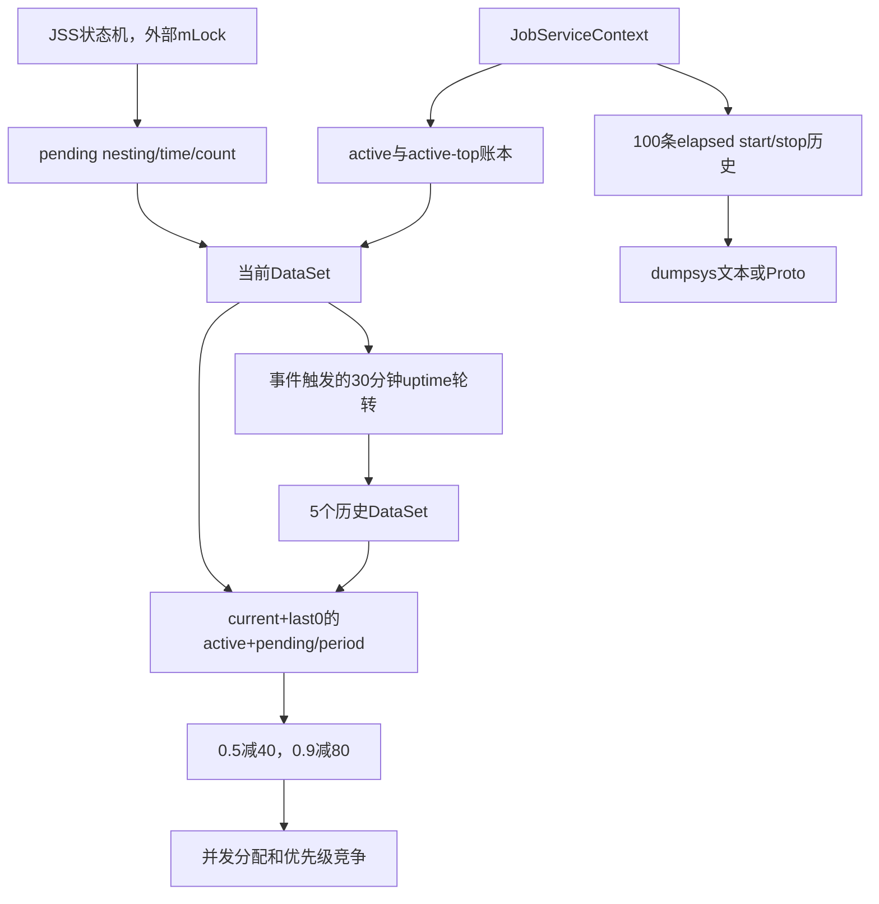

# 136 Android JobPackageTracker：执行统计、负载因子与历史环形缓冲

> 源码版本：Android 11 / API 30 / `android-11.0.0_r48`  
> 学习方式：macOS 只读源码，不要求编译、不要求连接设备  
> 前置章节：第 121、122、131、132、135 章

---

## 1. 本章先回答最容易混淆的问题

`JobPackageTracker` 名字里有 Package，也统计 Job 的 pending/active 时间，但它不是
`QuotaController` 的另一份配额账本。

```text
JobPackageTracker：观察运行负载，为优先级降权和 dumpsys 诊断提供数据
QuotaController：判断 App Standby 配额是否允许 Job 运行
```

本章要追清“观察—计算—影响”的闭环，而不是只看 dump 输出。

---

## 2. 一句话建立直觉

可以把它想成 JobScheduler 里的“包级值班表”：

```text
这个包有任务排队多久？
这个包有任务占执行槽多久？
最近启动/停止过哪些Job？
该包是不是长期让JobScheduler很忙？
```

如果长期处于 pending 或 active，JSS 会对它的调度优先级做负向调整，减少它持续挤压其他包的机会。

---

## 3. 源码地图

主类：

```text
frameworks/base/apex/jobscheduler/service/java/com/android/server/job/JobPackageTracker.java
```

记录调用点：

```text
frameworks/base/apex/jobscheduler/service/java/com/android/server/job/JobSchedulerService.java
frameworks/base/apex/jobscheduler/service/java/com/android/server/job/JobConcurrencyManager.java
frameworks/base/apex/jobscheduler/service/java/com/android/server/job/JobServiceContext.java
```

优先级常量：

```text
frameworks/base/apex/jobscheduler/framework/java/android/app/job/JobInfo.java
```

---

## 4. 它运行在哪里

对象由 `JobSchedulerService` 直接创建：

```java
final JobPackageTracker mJobPackageTracker = new JobPackageTracker();
```

它和 JSS 同在 `system_server`，不是应用进程里的 SDK 统计器，也不是独立 daemon。

---

## 5. 它没有自己的锁

`JobPackageTracker` 的数组、SparseArray、nesting 字段都没有 `synchronized`。

正确的并发前提来自调用环境：pending 队列、执行槽切换和 dumpsys 主体都在 JSS 的 `mLock`
内调用它。它依赖外部锁串行化，不是可随意跨线程调用的通用统计类。

---

## 6. 三层数据结构

```text
JobPackageTracker
├── mCurDataSet                 当前统计批次
├── mLastDataSets[5]           最近5个已结束批次
└── 100槽事件环形缓冲          最近start/stop事件

DataSet
└── sourceUid
    └── sourcePackageName
        └── PackageEntry
```

批次统计和事件历史是两套数据：前者算持续时间/次数，后者保留逐事件顺序。

---

## 7. 为什么按 source 身份记账

所有 `inc/dec` 都使用：

```java
job.getSourceUid()
job.getSourcePackageName()
```

对于 `scheduleAsPackage()`，system_server 可能是调用者，但真实工作归因给 SyncAdapter 等 source 包；
统计也必须落到真实来源。

---

## 8. 同 UID 仍按包拆分

`SparseArray<ArrayMap<String, PackageEntry>>` 先按 source UID，再按包名。

这对 shared UID 很重要：多个包即使 Linux UID 相同，统计展示仍可分包；完整 UID 也已经编码 userId，
所以不同用户的同包不会混账。

---

## 9. PackageEntry 记录三种状态

| 状态 | 含义 | 主要字段 |
|---|---|---|
| pending | 至少一个该包 Job 在 JSS pending queue | `pastPendingTime/pendingStartTime/pendingNesting/pendingCount` |
| active | 至少一个普通优先级 Job 占执行上下文 | `pastActiveTime/...` |
| active-top | 至少一个 TOP_APP 级别 Job 占执行上下文 | `pastActiveTopTime/...` |

此外 `stopReasons` 按数值 stop reason 累计停止次数。

---

## 10. 整体状态图


注意：`noteActive()` 发生在 bindService 返回成功后，早于应用 `onStartJob()` 回执。

---

## 11. nesting 解决“同包多个 Job 重叠”

如果同一个包同时有 A、B 两个 pending Job：

```text
A进入：nesting 0→1，记pendingStart，count+1
B进入：nesting 1→2，不重复启动秒表
A离开：nesting 2→1，秒表继续
B离开：nesting 1→0，累计整段时间
```

duration 统计的是“该包至少有一个 Job 处于该状态”的时间并集，不是每个 Job 时长相加。

---

## 12. count 也不是 Job 个数

`pendingCount++` 只发生在 nesting 从0变1；activeCount 同理。

两个重叠 pending Job 只形成一个 pending episode。若它们完全不重叠，则形成两个 episode。
所以 dump 中 `3x pending` 是“3段 pending 活动期”，不是“共有3个 Job”。

---

## 13. stop reason 为什么按每个 Job 累加

`decActive/decActiveTop` 每调用一次都会：

```java
int count = pe.stopReasons.get(stopReason, 0);
pe.stopReasons.put(stopReason, count + 1);
```

即便两个 active Job 重叠，duration 是并集，但停止原因仍各记一次。因此“时长、episode 次数、
stop 次数”三个指标的计数单位不同。

---

## 14. notePending 还写 JobStatus 时间戳

```java
job.madePending = now;
```

这个字段供 JSS dumpsys 展示当前 Job 已 pending 多久，不属于 PackageEntry 聚合，也不会被第135章的
jobs.xml 持久化。

---

## 15. noteActive 同样写 madeActive

```java
job.madeActive = now;
```

后续 dump 可显示：

```text
运行了多久 = nowUptime - madeActive
排队了多久 = madeActive - madePending
```

两者都使用 uptime 基准。

---

## 16. active 从“绑定成功”开始

`JobServiceContext.executeRunnableJob()` 先设置运行状态并调用 `bindServiceAsUser()`；只有 bind
返回 true 后才 `noteActive(job)`。

应用 Service 真正连接、`startJob()` one-way、主线程 `onStartJob()` 和 ack 都发生在后面。
因此 active duration 包含 BINDING 与 STARTING 时间。

---

## 17. bind 立即失败不形成 active 记录

若 `bindServiceAsUser()` 返回 false，代码清理 `mRunningJob/mParams` 并返回，尚未执行
`noteActive()`。

ConcurrencyManager 随后仍会把它从 pending 队列移除并 `noteNonpending()`。这种失败可能留下
pending episode，却没有成对的 start/stop 事件。

---

## 18. inactive 发生在统一 cleanup 入口

`closeAndCleanupJobLocked()` 调用：

```java
mJobPackageTracker.noteInactive(
        completedJob, mParams.getStopReason(), reason);
```

正常 `jobFinished()`、约束丢失后的 stop ack、超时、Binder 死亡等最终都汇入清理路径。

---

## 19. active 与 active-top 怎样分类

判断条件是：

```java
job.lastEvaluatedPriority >= JobInfo.PRIORITY_TOP_APP
```

不是看应用此刻是否位于前台，也不是看 JobService 是否调用 `startForeground()`；它看的是
ConcurrencyManager 最近为该 Job 算出的调度优先级。

---

## 20. lastEvaluatedPriority 在哪里写

分配槽位前，ConcurrencyManager 遍历 pending queue：

```java
int priority = mService.evaluateJobPriorityLocked(pending);
pending.lastEvaluatedPriority = priority;
```

随后执行路径读取这个快照进行 active/active-top 分类；inactive 用同一字段闭合 nesting。

---

## 21. TOP 执行时长与普通 active 分开

`activeTop` 有独立 start、nesting、time 和 count。`getLoadFactor()` 只累加：

```text
activeTime + pendingTime
```

它不把 `activeTopTime` 纳入负载因子。TOP 工作单独展示，但不会因这段执行时间直接触发长期运行降权。

---

## 22. 三只时钟不能混成一个 now

| 时钟 | 用途 |
|---|---|
| uptime | batch 长度、pending/active duration、load factor |
| elapsed realtime | start/stop 事件时间、dump 相对事件时间 |
| wall clock | DataSet 创建日期标签 |

源码静态导入了 JSS 的三只可测试 Clock，分别使用。

---

## 23. uptime 意味着深睡不计入负载时长

`sUptimeMillisClock` 在 CPU 深睡时不前进。因此设备睡眠两小时不会让 pending load factor 的分母
自动增加两小时。

这更接近“系统有机会调度时的占用比例”，不是自然世界的墙钟占比。

---

## 24. 事件历史为什么改用 elapsed

事件 ring buffer 保存 elapsed，dump 用 `eventTime-now` 输出“多久以前”。elapsed 包含 deep sleep，
适合回答事件真实发生在多久前；负载选择 uptime 是另一统计口径，不同并非计算错误。

---

## 25. wall clock 只用于可读日期锚点

每个 DataSet 创建时保存：

```java
mStartClockTime = sSystemClock.millis();
```

dump 用它格式化日期。时长不拿 wall clock 相减，因此用户改时间主要改变标签，不会把 active duration
直接算成负数。

---

## 26. batch 名义长度为30分钟

```java
static final long BATCHING_TIME = 30 * 60 * 1000;
```

`rebatchIfNeeded(now)` 在当前 DataSet 总 uptime 严格大于30分钟时轮转；恰好等于30分钟还不切批。

---

## 27. batch 不是定时器准点切割

没有 Handler 每30分钟发消息。轮转只在 `notePending/noteNonpending/noteActive/noteInactive`
附近触发；`noteConcurrency()`、`dump()` 和 `getLoadFactor()` 都不主动 rebatch。

长时间没有状态转换时，当前批次可以远长于30分钟。

---

## 28. 轮转过程



触发轮转的 note 事件接下来才在新批次执行 inc 或 dec。

---

## 29. 为什么必须迁移 nesting

一个 Job 从第29分钟运行到第31分钟，切批时仍 active：

```text
旧批：累计到切点，nesting清0
新批：activeStart=切点，继承原nesting
```

真正停止时，新批才能结算切点后的时长；否则后半段会丢失，或 dec 时出现负 nesting。

---

## 30. 跨批活动不会在新批重复增加 count

`finish()` 继承 nesting/startTime，却不增加 `activeCount/pendingCount`。

它仍是同一连续 episode，只是 duration 因存储分批而切开；聚合时 count 仍只在最初的0→1处出现一次。

若单次 active 连续跨越多个批次，最初的 `activeCount=1` 可能已经落到更老的 Historical stats；
最近两批的 Current stats 仍有 active duration 和 `(active)`，却不一定显示 active 次数。count 记录
episode 的开始批次，不会在每个时间窗口重复记一次。

---

## 31. 最多保留5个已结束批次

```java
static final int NUM_HISTORY = 5;
```

新批到来时数组右移，最老 index 4 被挤掉。若每批约30分钟，统计大致覆盖最近3小时，但事件驱动
轮转和 uptime 口径使它不是严格墙钟3小时窗口。

---

## 32. dump 的 Current stats 实际合并两批

当 `mLastDataSets[0]` 存在时：

```text
Current stats = 最近一个完整历史批 + 当前未完成批
Historical stats = mLastDataSets[1..4]
```

因此 Current stats 通常接近最近60分钟 uptime，不只是当前30分钟。

---

## 33. 为什么 index 0 不单独打印 Historical

`dump()` 先把 index 0 和 current `addTo(total)`，再从历史 index 1 开始打印。这与
`getLoadFactor()` 的观察窗口一致：优先级降权也只看 current + immediately previous batch。

---

## 34. addTo 是聚合快照

它将 past duration、episode count、进行中 duration 快照、stop reason counts、max concurrency
累加到临时 `DataSet total`。

进行中的状态只设置 `hadPending/hadActive/hadActiveTop`，不把 nesting 复制到输出，避免临时汇总
对象继续计时。

---

## 35. hadActive 是 dump 标记

当原批次在 dump 时仍 active，临时输出设置 `hadActive=true`，文本附加 `(active)`。

它表示合并窗口末端观察到进行中的活动，不意味着整个聚合窗口一直 active，也不是第四种运行状态。

---

## 36. load factor 的精确公式

对于同一 source UID+package：

```text
time = current(active + pending)
     + previous(active + pending)

period = current批时长 + previous批时长

factor = time / period
```

当前批和上一完整批都没有该包记录时，直接返回0。

---

## 37. load factor 不一定小于等于1

active duration 和 pending duration 各自按包内并集统计，但二者可以同时存在：一个 Job 正在执行，
同包另一个 Job 仍在排队。

```text
active占80% + pending占70% = factor 1.5
```

它是两类调度压力之和，不是被限制在0～100%的标准利用率。

---

## 38. 一个手算例子

观察期60分钟：

```text
至少一个普通Job active：24分钟
至少一个Job pending：18分钟
active-top：10分钟
```

则 `factor=(24+18)/60=0.70`。10分钟 active-top 不进入公式。

---

## 39. 默认两档阈值

JSS Constants 默认：

```text
MODERATE_USE_FACTOR = 0.5
HEAVY_USE_FACTOR = 0.9
```

它们可由 JobScheduler settings constants 覆盖，不是永远固定的公共 API 契约。

---

## 40. 达阈值不是加分，而是降权

```java
if (factor >= HEAVY_USE_FACTOR) {
    curPriority += JobInfo.PRIORITY_ADJ_ALWAYS_RUNNING; // -80
} else if (factor >= MODERATE_USE_FACTOR) {
    curPriority += JobInfo.PRIORITY_ADJ_OFTEN_RUNNING;  // -40
}
```

常量名是 adjustment，但值为负数。长期占用越重，最终 priority 越低。

---

## 41. 阈值比较包含等号

```text
factor == 0.90 → heavy，减80
factor == 0.50 → moderate，减40
```

并且先检查 heavy，再检查 moderate。不要口述成“超过90%才处罚”。

---

## 42. TOP_APP 优先级免做这次降权

`adjustJobPriority()` 最外层要求：

```java
curPriority < JobInfo.PRIORITY_TOP_APP
```

等于或高于40直接返回。这个判断依据“本轮拿来计算的 priority”，可能是 Job 原始值，也可能是
UID 状态带来的 override。

---

## 43. 优先级计算的三步来源



load factor 是最后一层修饰，不是唯一的优先级来源。

---

## 44. 降权会影响什么

`evaluated priority` 会影响：

1. pending Job 的 FG/BG 分类；
2. 同 calling UID 抢占时的优先级比较；
3. FG/BG 容量和抢占共同形成的执行竞争结果；
4. `checkIfRestricted()` 判断是否达到前台高优先级而跳过 restriction。

它不直接取消 Job，也不直接把 quota constraint 置为 false。

还要特别排除一个常见过度推断：r48 的 `sPendingJobComparator` 只比较 override state 和
`enqueueTime`，不按 evaluated priority 重排整个 pending list。priority 在并发分组和同 UID 抢占处生效，
不是 pending 队列的全局排序键。

---

## 45. 与 QuotaController 的第一处本质差异

```text
JobPackageTracker：过去“排队+普通执行”占用比例 → priority数值调整
QuotaController：standby bucket滚动窗口计费 → QUOTA约束是否满足
```

前者影响竞争顺序，后者可以让 Job 根本不 ready。

---

## 46. 第二处差异：时间账本

JobPackageTracker 使用约30分钟批次，只在内存保留 current+5 history；QuotaController 使用按 bucket
定义的滚动窗口、TimingSession/ExecutionStats，并设置恢复 Alarm。

两者都统计时间，但不共享数据结构或恢复逻辑。

---

## 47. 第三处差异：TOP/前台语义

JobPackageTracker 将 `active-top` 从 load factor 排除；QuotaController 是否计费还要看 TOP-started、
UID 前台、充电、RESTRICTED 等自己的规则。

同一段执行可能在两个模块中得到不同处理，这是各自政策目标决定的。

---

## 48. max concurrency 是全局批次指标

`noteConcurrency(totalActive, fgActive)` 只更新 DataSet：

```text
mMaxTotalActive
mMaxFgActive
```

它不放在 PackageEntry 下，因为“同时跑了多少槽”是系统整体峰值，不属于单一包。

---

## 49. concurrency 是分配规划后的记录

ConcurrencyManager 完成本轮运行/待运行计数投影后调用 `noteConcurrency()`，再实际 preempt 或 start。

所以它是本轮分配算法所认为的并发峰值，不是从内核线程或应用回调实时采样的硬件并行度。

---

## 50. 事件环形缓冲固定100槽

```java
private static final int EVENT_BUFFER_SIZE = 100;
```

它用 `RingBufferIndices` 管理下标；第101个事件会覆盖最老事件。没有磁盘文件，也没有按时间自动清理。

---

## 51. 为什么使用并行数组

每个槽分别保存：

```text
cmd+stopReason
elapsed time
source uid
battery tag
jobId
debug reason
```

这样避免为每条诊断事件持续分配对象；代价是所有数组必须使用同一 index 读写。

---

## 52. cmd 和 stop reason 压在一个 int

```text
低8位：event command
第8～15位：stop reason
```

写入公式：

```java
cmd | ((stopReason << 8) & (0xff << 8))
```

历史只保留 stop reason 的低8位。r48 现有 reason code 位于范围内，但这是明确的编码边界。

---

## 53. 四种命令

```text
1 START
2 STOP
3 START-P（periodic）
4 STOP-P（periodic）
```

还有 `EVENT_NULL=0`；正常 note 路径不会主动写 null，读取时仍防御性跳过。

---

## 54. start 事件使用 batteryName 作为 tag

```java
job.getBatteryName()
```

这个名字也用于 BatteryStats 归因，通常比纯包名更能标识 JobService/source tag。事件另存 source UID
和 jobId，因此 tag 是诊断标签，不是唯一主键。

---

## 55. 文本 history 的时间是负偏移

代码格式化：

```java
mEventTimes[index] - now
```

输出 `-2m15s` 表示事件发生在当前 elapsed 之前2分15秒；Proto 写正值 `now-eventTime`。
两种输出符号不同，语义相同。

---

## 56. 文本停止原因优先显示 debugReason

若停止事件有非 null `debugReason`，文本直接打印它；只有为 null 才调用：

```java
JobParameters.getReasonCodeDescription(stopReason)
```

文本可能更贴近内部清理原因，但同时会遮住标准数值 reason 的描述。

---

## 57. Proto history 不保存 debugReason

Proto 写 event、age、uid、jobId、tag 和数值 stop reason，没有写 `mEventReasons[index]`。

因此文本 dumpsys 与 proto dump 不是信息完全等价的两种编码：前者可见内部字符串，后者保留结构化 reason。

---

## 58. r48 中周期 STOP 命令存在反向选择

`noteActive()` 正确写：

```java
isPeriodic ? EVENT_START_PERIODIC_JOB : EVENT_START_JOB
```

但 `noteInactive()` 写成：

```java
isPeriodic ? EVENT_STOP_JOB : EVENT_STOP_PERIODIC_JOB
```

条件两侧与 start 的模式相反。

---

## 59. 反向选择会怎样显示

在当前 r48：

```text
周期Job：START-P ... STOP
一次性Job：START ... STOP-P
```

文本标签和 Proto event command 都反了。PackageEntry active 时长和 stopReasons 仍正常，问题只在逐事件
history 的停止事件类型。

---

## 60. 为什么必须标成版本实现缺口

不能为了让教学图对称而擅自按设计意图解释源码。更准确的结论是：

> 四个事件常量表达周期/一次性对称设计，但 Android 11 r48 的 `noteInactive()` 三元表达式把两类 STOP 命令选反。

这也展示了交叉检查 start/stop 对称性的价值。

---

## 61. dump 的 filterUid 实际按 appId 过滤

JSS 先做：

```java
filterUidFinal = UserHandle.getAppId(filterUid);
```

Tracker 再比较 `UserHandle.getAppId(entryUid)`。因此指定一个包 UID 时，多用户中相同 appId 的条目
都可能匹配；它不是严格完整 UID 过滤。

---

## 62. 文本 PackageEntry 行怎样读

示意：

```text
u0a123 / com.example:
  30% 4x pending 20% 3x active 1x active-top (pending)
  2x timeout, 1x cancelled
```

百分比是 duration/period 四舍五入；`x` 是 episode 次数，末尾括号表示汇总快照中仍处于该状态。

r48 文本标题的实现连续执行了两次 `pw.print(" (")`，因此真实输出在批次相对时间前会多一个左括号。
这是纯格式瑕疵，不代表还存在第四个时间层级；Proto 不受影响。

---

## 63. 百分比为0仍可能打印次数

`printDuration()` 先把 fraction×100 加0.5后转 int。短活动若舍入后为0%，但 count>0，就只打印：

```text
1x active
```

没有百分比不代表 duration 精确为0。

---

## 64. active+pending 百分比可以超过100%

每种状态独立打印。若同包一边运行、一边持续有其他任务排队，两个百分比之和超过100%是合法的。

不要把输出当成互斥饼图。

---

## 65. stop reason 只在 inactive 时累积

bind 立即失败没有 noteActive，也不会走成对 noteInactive，所以不会进入此表；仍在 pending 时被取消，
只会 noteNonpending，同样没有 active stop reason。

stopReasons 回答的是“已经 active 的 Job 怎样离开执行状态”，不是所有 Job 未运行的原因统计。

---

## 66. 数据不会跨 system_server 重启

Tracker 没有 AtomicFile、XML 或 Proto 持久化。system_server 重启后：

```text
batch统计清零
100条事件历史清零
load factor重新从0积累
```

这与 persisted Job 可从 jobs.xml 恢复是两回事。

---

## 67. 它也不是 statsd 长期历史

JobServiceContext 会另行写 `SCHEDULED_JOB_STATE_CHANGED` statsd atom；Tracker 的 ring buffer 是
dumpsys 近况，DataSet 是本地优先级反馈。

即使两边记录相似 start/finish，生命周期、容量与消费者都不同。

---

## 68. notePending 的调用不只一处

包括：

```text
新schedule后立即ready
全量扫描得到newReadyJobs
greedy模式得到runnableJobs
Job完成后生成可立即运行的replacement
```

因此 pending 不是某个 API 的同义词，而是 Job 真正进入 JSS pending queue 的内部状态。

---

## 69. 清空 pending 前必须批量 noteNonpending

全量 ready 扫描会先：

```java
noteJobsNonpending(mPendingJobs);
mPendingJobs.clear();
```

再对新列表 notePending。若只 clear 不记 dec，PackageEntry nesting 会永远悬空，load factor 会持续增长。

---

## 70. 从队列启动时如何闭合 pending

ConcurrencyManager 流程是：

```text
executeRunnableJob(pendingJob)
→ pendingJobs.remove(pendingJob)
→ noteNonpending(pendingJob)
```

即使 execute 返回 false，只要列表 remove 成功也会结束 pending 统计。active 是否开始由 bind 成功决定。

---

## 71. pending 和 active 可以短暂重叠

执行成功时 `noteActive()` 在 `executeRunnableJob()` 内发生，而 `noteNonpending()` 在函数返回后才发生。

这段很短的顺序窗口会同时满足 activeNesting>0 与 pendingNesting>0；它符合两个独立账本的调用时序，
也是 factor 理论上可超过1的一个微小来源。

---

## 72. 正常运行时同包更常见的重叠

比上述微小窗口更重要的是：A 已 active，B/C 仍 pending。两只 nesting 独立保持正数，直到最后一个
对应状态退出。

因此负载公式把“占槽”和“等待更多槽”都视为对系统调度的压力。

---

## 73. priority 降权形成负反馈


它是公平性启发式，不是精确的 CPU 使用率控制器。

---

## 74. 也可能出现短期反馈迟滞

观察窗口包含当前批和上一批；包停止繁忙后，旧 active/pending duration 要随批次轮转才逐步退出。

因此降权不会在最后一个 Job 完成瞬间立刻清零。这种记忆能抑制瞬时反复占用，但也意味着恢复有延迟。

---

## 75. 没有周期事件时旧负载可保留更久

由于 rebatch 由 note 状态事件触发，系统若长时间完全没有新 pending/active 转换，过期批次不会靠定时器轮转。

而 `getLoadFactor()` 本身不触发轮转，所以屏幕/内存状态变化等原因重新发起分配时，仍可能用到超长当前批
和较旧 last[0]。只有下一次四类 note 状态事件才会推动批次前进；“约30分钟窗口”不能当作严格时效保证。

---

## 76. rebatch 与当前 note 的先后并不完全相同

```text
notePending：先rebatch，再inc
noteActive：先rebatch，再inc
noteNonpending：先dec，再rebatch
noteInactive：先dec，再rebatch
```

进入事件属于新批；离开事件先在旧批闭合，再视时长切批。这能让一段跨越边界的 episode 在旧批正确
结算，再把已经不存在的 nesting 留在新批为0。

---

## 77. 为什么 dec 后 rebatch 很关键

若 active Job 正好在超过30分钟时停止：

```text
先dec → 把旧批从activeStart到now全部结算
再rebatch → 旧批封存，新批不继承active
```

反过来若先切批，`finish()` 会把 active nesting 迁到新批，紧接着 dec；结果仍可算时长，但会让同一
结束事件不必要地跨两个批次，输出更难理解。

---

## 78. nesting 没有显式下界保护

`decPending()` 和 `decActive()` 最后直接 `nesting--`，没有检查是否已为0。

正确性依赖 JSS 状态机保证 note 成对调用。若未来调用点漏记或重复 dec，负 nesting 不一定立刻抛异常，
反而会让后续0→1开始计时逻辑失真。这是外部状态机不变量，不是类自身防御。

---

## 79. getOrCreateEntry 会掩盖错误 dec 的来源

dec 也调用 `getOrCreateEntry()`。即使从未 inc，该 UID+包也会新建 entry，然后 nesting 变成-1。

这便于代码简化，却使错误不会以“entry不存在”快速失败。读这类记账代码时必须同时审计所有调用点。

---

## 80. PackageEntry 不会主动删除

一个包的 nesting 都回到0后，entry 仍留在当前/历史 DataSet，直到整个批次被历史数组淘汰。

这保留 duration/count/stop reason 用于 dump；代价是短期内存随观察窗口内出现过的 source 包数量增长。

---

## 81. 包卸载不会专门清 Tracker

`JobPackageTracker` 没有 `onPackageRemoved()`。包的 Job 会由 JSS 取消并闭合状态，但历史 entry 和 ring
event 会自然留到批次或100事件覆盖。

这是诊断历史，不是当前安装包权威表，因此短时间出现已卸载包名称是合理的。

---

## 82. stop reason 表是 SparseIntArray

它按 int reason 排序存储，不保持事件发生顺序。dump 输出：

```text
次数 × reason描述
```

若要分析先后次序必须看 event ring；PackageEntry 只能回答聚合次数。

---

## 83. reason=0 也会计数

`noteInactive()` 无条件把 `mParams.getStopReason()` 传入 dec。正常完成时可能是 UNKNOWN/0，仍会进入
`stopReasons`。

所以 reason 表既包含系统主动 stop，也可能包含正常结束的默认 reason；不能把总和直接等同为异常次数。

---

## 84. debugReason 与公共 stopReason 是两层信息

```text
stopReason：传给应用JobParameters的标准数值原因
debugReason：JSS内部cleanup路径的字符串说明
```

例如 timeout、host crashed、finished 等内部上下文可能比标准枚举更细。文本 history 优先显示后者，
PackageEntry 聚合只按前者计数。

---

## 85. RingBufferIndices 的遍历方向

dump 循环 `i=0..size-1`，通过 `indexOf(i)` 映射物理槽。RingBufferIndices 将逻辑0解释为当前最老
有效项，因此输出按从旧到新排列，而不是从最近事件倒序。

排障时要从列表底部看最新事件。

---

## 86. event 数组中的旧字符串会被覆盖

每次 `add()` 返回可写槽后，uid/tag/reason 等所有并行数组元素都重新赋值。环满覆盖后，最老事件的
字符串引用才会被新值替换并有机会回收。

容量按事件条数，而不是按 Job 或包；高频 Job 能很快挤掉其他包历史。

---

## 87. history 不是审计日志

它具有：

```text
固定100条
内存易失
高频覆盖
停止类型r48反向缺口
文本与Proto字段不完全一致
```

因此适合快速定位近况，不适合安全审计、计费或业务对账。

当前源码树的 `frameworks/base/services/tests` 下也找不到专门的 `JobPackageTrackerTest`；不能把这些
nesting、批次轮转和 STOP 类型行为说成已有独立单测完整兜底。

---

## 88. dumpsys 在同一 mLock 内取快照

JSS `dumpInternal()` 的 tracker dump、history、pending queue 和 active contexts 都位于
`synchronized(mLock)` 内。

这样输出彼此相对一致，但大量打印也会持有调度大锁；它是诊断路径，不应成为高频业务调用。

---

## 89. Proto dump 与文本 dump 聚合逻辑相同

两者都：

```text
取now uptime与now elapsed
合并last[0]+current为Current stats
单独输出last[1..4]
按appId filter
```

差异主要在字段编码和 debugReason 缺失，不是统计窗口不同。

---

## 90. DataSet 的 startElapsed 只用于展示批次年龄

duration 分母来自 uptime；Proto 的 `ELAPSED_TIME_MS` 却写：

```java
nowElapsed - mStartElapsedTime
```

因此输出同时包含“真实经过多久”和“CPU uptime统计期多长”。设备深睡较多时两者可明显不同，
不能拿 elapsed age 当 duration 百分比分母。

---

## 91. DataSet copy constructor 有意保留原起点

构造临时 total 时：

```java
new DataSet(mLastDataSets[0])
```

会复制 startUptime/startElapsed/startClock，而非用当前时间。于是合并后的 Current stats 标题从上一完整批
开始，period 也通过 `mSummedTime` 累加两批。

---

## 92. mSummedTime 区分活批与汇总批

`getTotalTime(now)`：

```java
if (mSummedTime > 0) return mSummedTime;
return now - mStartUptimeTime;
```

封存批和临时聚合批使用固定 summed time；当前活批使用 now 动态增长。

---

## 93. 极早期 period=0 的理论边界

系统刚创建 Tracker 就立刻 dump 时，`now-startUptime` 理论上可能为0。`printDuration()` 会做
`duration/(float)period`，可能产生 NaN；Java 将 NaN 转 int 为0，通常退化为只打印 count 或空白。

生产中时间很快前进，但源码没有显式 `period==0` 保护，应避免宣称百分比计算数学上无边界。

---

## 94. factor 分母同样没有显式0保护

若刚启动同一 uptime tick 内 `notePending()` 创建 entry，随后马上调用 `getLoadFactor()`，time 与 period
都可能仍为0，形成 `0/0` 的 NaN。Java 与 NaN 做 `>=` 比较均为 false，因此不会进入两档降权。

真实调度路径通常已有时间推进，但这是实现层数值边界。

---

## 95. load adjustment 可把 priority 降到负数

例如默认优先级0、heavy factor：

```text
0 + (-80) = -80
```

priority 在这里是内部排序标尺，不要求保持公共 Builder 常量的非负区间；不要误以为结果必须 clamp 回0。

---

## 96. “长期运行”注释要结合 pending 理解

`JobInfo.PRIORITY_ADJ_*` 注释说 app 经常 running jobs，但 Tracker 公式实际是：

```text
普通active + pending
```

因此一个包即使很少占到槽，却长期堆着 ready Job，也可能达到 moderate/heavy。这是源码公式比常量注释
更精确的地方。

---

## 97. 为什么 pending 也应参与公平性

大量 pending 意味着该包持续向有限执行槽施加需求。只计算 active 会让占不到槽的任务永远看起来
“低负载”，随后又以高优先级继续竞争。

加入 pending 是调度需求反馈，不是对应用 CPU 消耗的测量。

---

## 98. 为什么 active-top 不参与

TOP_APP 优先级通常来自用户当前交互相关 UID override。把用户前台触发的紧迫工作算入长期后台降权，
会让交互和公平性目标互相污染。

源码通过独立 activeTop 账本保留可观测性，同时从 factor 排除；这是基于代码结构的设计推断。

---

## 99. 调整前先判断原值高优先级的细节

`evaluateJobPriorityLocked()` 若 Job 原始 priority 已达到 `PRIORITY_BOUND_FOREGROUND_SERVICE`，会忽略
UID override 路径，直接对原值做 load adjustment。

但 `adjustJobPriority()` 只有达到 TOP_APP 才免降权，所以 BOUND_FGS/FGS 高优先级仍可能因长期负载被减分。

---

## 100. load factor 会间接影响 restriction 豁免

`checkIfRestricted()` 先计算 evaluated priority；只有达到 `PRIORITY_FOREGROUND_APP` 或更高才直接不检查
Thermal 等 JobRestriction。

一个原本刚好高于门槛的 Job 被负调整后可能失去这层豁免。这不是 Tracker 主动停止它，而是优先级结果被
另一个策略入口复用。

---

## 101. 它不会改变 JobInfo 原对象

调整只返回一个 int，并写入 `JobStatus.lastEvaluatedPriority` 供当前分配使用。

`job.getPriority()` 的原始 JobInfo 值不变，jobs.xml 仍保存原 priority。system_server 重启后 load 账本清空，
重新评估自然不带旧降权。

---

## 102. 常见误解一：Tracker 在限制每包并发数

错误。每包没有在此类中配置最大并发。它记录包级 duration，并通过优先级反馈影响竞争；真正总并发和
FG/BG槽位由 JobConcurrencyManager 管理。

---

## 103. 常见误解二：pending 就是所有已schedule任务

错误。JobStore 中 registered Job 可能还在等约束；只有进入 `mPendingJobs` 的 ready 候选才被
`notePending()`。

---

## 104. 常见误解三：active 就等于 onStartJob 正在执行业务

错误。active 从 bind 成功开始，覆盖 BINDING、STARTING、EXECUTING、STOPPING，直到统一 cleanup。

---

## 105. 常见误解四：activeCount 是启动 Job 总次数

错误。同包重叠 active 只在 nesting 0→1时 count+1。逐 Job start 次数更接近 event ring 的 START 条数，
但它又只有最近100条。

---

## 106. 常见误解五：load factor 是 CPU 使用率

错误。它只由 JSS pending/active 状态时长组成，不采样 CPU、网络、WakeLock 或实际业务线程工作量。

---

## 107. 常见误解六：factor 最大是1

错误。同包 active 与 pending 可并存，两类比例相加可超过1。

---

## 108. 常见误解七：30分钟批次会准点轮转

错误。没有定时器，只有 note 状态事件触发，且条件是 uptime 严格大于30分钟。

---

## 109. 常见误解八：Current stats 只表示当前批

错误。有上一批时，它是 last[0]+current；更早 last[1..4] 才作为 Historical 单独打印。

---

## 110. 常见误解九：history 里的 STOP-P 一定是周期任务

在 r48 错误。`noteInactive()` 的 STOP 三元分支选反，一次性 Job 会显示 STOP-P，周期 Job 显示 STOP。

---

## 111. 常见误解十：它能跨重启保留公平性记忆

错误。全部数据在内存；重启后清零。JobStore 恢复任务定义，不恢复 PackageTracker load history。

---

## 112. 常见误解十一：文本与 Proto dump 信息相同

错误。文本停止事件优先展示 debugReason；Proto 不保存该字符串，只写标准 stop reason。

---

## 113. 常见误解十二：按 UID 过滤就是完整用户 UID

错误。JSS 与 Tracker 都转成 appId 比较，同 appId 的多用户条目可能一起出现。

---

## 114. macOS 只读练习一：找四个状态钩子

```bash
rg -n 'notePending|noteNonpending|noteActive|noteInactive' \
  frameworks/base/apex/jobscheduler/service/java/com/android/server/job
```

把每个调用点标到 `registered → ready/pending → binding/active → cleanup` 状态图上，确认它们不是应用 API。

---

## 115. macOS 只读练习二：手算 nesting

自行画时间轴：

```text
A pending 0～20s
B pending 5～10s
C pending 25～30s
```

答案应为 `pendingTime=25s`、`pendingCount=2`，而不是35s或3次。

---

## 116. macOS 只读练习三：核对三只时钟

```bash
rg -n 'sUptimeMillisClock|sElapsedRealtimeClock|sSystemClock' \
  frameworks/base/apex/jobscheduler/service/java/com/android/server/job/JobPackageTracker.java
```

逐处写下“duration、event age、日期标签”，不要只背 uptime/elapsed 的定义。

---

## 117. macOS 只读练习四：验证两批 load 窗口

```bash
sed -n '442,525p' \
  frameworks/base/apex/jobscheduler/service/java/com/android/server/job/JobPackageTracker.java
```

回答：为什么公式只读 `mLastDataSets[0]`，而 dump 还输出 index 1～4？

---

## 118. macOS 只读练习五：找到优先级负反馈

```bash
sed -n '2350,2390p' \
  frameworks/base/apex/jobscheduler/service/java/com/android/server/job/JobSchedulerService.java

sed -n '225,246p' \
  frameworks/base/apex/jobscheduler/framework/java/android/app/job/JobInfo.java
```

手算 base priority 30 在 factor 0.4、0.5、0.9 时的结果。

---

## 119. macOS 只读练习六：确认 STOP 类型反向

```bash
sed -n '467,492p' \
  frameworks/base/apex/jobscheduler/service/java/com/android/server/job/JobPackageTracker.java
```

把 start 与 stop 两个三元表达式并排抄写；这是本章最值得训练的“对称代码交叉审查”。

---

## 120. macOS 只读练习七：区分文本与 Proto

```bash
sed -n '569,660p' \
  frameworks/base/apex/jobscheduler/service/java/com/android/server/job/JobPackageTracker.java
```

列出文本有而 Proto 没有的停止信息，再比较时间偏移的正负方向。

---

## 121. 阅读检查题

1. 为什么两个重叠 Job 的 activeTime 不相加？
2. activeCount 与 start event 数量为什么可能不同？
3. active-top 为什么不进入 load factor？
4. 为什么 factor 可以大于1？
5. 当前批何时轮转，为什么不是准30分钟？
6. Current stats 合并哪两个批次？
7. heavy/moderate 对 priority 是加还是减？
8. Tracker 与 QuotaController 的输出决策分别是什么？
9. history 为什么不能作为审计日志？
10. r48 周期 STOP 标签有什么错误？

---

## 122. 场景推演

某包在最近两个批次总计60分钟内：

```text
普通active并集=20分钟
pending并集=35分钟
active-top=12分钟
其中active与pending重叠15分钟
```

源码直接相加两类状态，不扣交集：

```text
factor=(20+35)/60=0.9167
```

默认进入 heavy，priority 减80。active-top 不进入；也不能用真实“至少一种状态并集40分钟”替换源码公式。

---

## 123. 一页复习图



---

## 124. 本章结论

1. JobPackageTracker 是内存负载观察与公平性反馈，不是配额控制器；
2. 它按 source UID+package 记账；
3. pending、active、active-top 用 nesting 计算同包状态时间并集；
4. episode count 只在0→1增加，stop reason 按每个 active Job 退出累加；
5. active 从 bind 成功到统一 cleanup，覆盖多个执行状态；
6. duration/load 用 uptime，事件历史用 elapsed，日期标签用 wall clock；
7. 30分钟批次由状态事件触发，不是定时器；
8. 跨批 nesting 被迁移，连续 episode 不重复加 count；
9. Current stats 合并上一完整批与当前批；
10. load factor 是普通active+pending，可超过1，不含active-top；
11. 默认0.5/0.9阈值分别让 priority 减40/80；
12. priority反馈影响竞争与restriction门，但不直接改变quota bit；
13. 100条环形历史是近况诊断，不持久化也不等于statsd；
14. 文本与Proto的debug reason信息不同；
15. r48 `noteInactive()` 把一次性/周期 STOP event command 选反；
16. 所有状态依赖JSS外部锁和成对note不变量，类内没有负nesting防御；
17. system_server重启后统计、历史和负载记忆全部清零。

最值得带走的一句话：

> JobPackageTracker 不是在测应用用了多少 CPU，而是在用“普通 Job 占槽多久 + ready Job 排队多久”形成包级调度压力，再把最近两个批次的压力反馈到 priority；它同时保留近100条事件帮助排障，但这套内存启发式既不是 QuotaController 配额，也不是长期审计日志。

---

## 125. 生成后复读：容易误解处的修订

初稿完成后，对照 JobPackageTracker、JSS、ConcurrencyManager、JobServiceContext 与 JobInfo 逐段复读：

1. 将 Tracker 与 QuotaController 的“观察负载/裁决配额”严格分层；
2. 明确统计键是 source UID+package，不是 calling UID；
3. 用重叠时间轴说明 nesting 求并集、count 求episode；
4. 区分 duration、episode count、stop count 三种单位；
5. 把 active 起点限定为 bind成功，而非onStartJob或ack；
6. 补出bind立即失败只有pending闭合、没有active事件；
7. 明确active-top依据lastEvaluatedPriority，不等同真实前台或FGS；
8. 逐项核对 uptime/elapsed/wall 三只时钟；
9. 修正“每30分钟准点轮转”，指出轮转完全由note事件驱动；
10. 解释inc前rebatch、dec后rebatch的差异；
11. 补出跨批nesting迁移但不重复episode count；
12. 明确Current stats是last[0]+current；
13. 按源码证明factor可超过1且不扣active/pending交集；
14. 核对默认阈值、包含等号与负 adjustment；
15. 限定priority反馈不是取消或quota constraint；
16. 说明max concurrency是分配投影，不是硬件采样；
17. 区分文本负时间偏移和Proto正age；
18. 发现并验证r48周期/一次性STOP command三元分支反向；
19. 补出文本debugReason与Proto结构化reason的不对称；
20. 核对pending comparator，删除“priority直接重排全局pending list”的过度结论；
21. 记录文本DataSet标题重复打印左括号的纯格式缺口；
22. 限定filterUid实际按appId比较；
23. 记录nesting无下界保护、dec会创建entry的脆弱边界；
24. 补出超长episode的count留在起始批、最近窗口可能只有duration的边界；
25. 修正period为0时factor边界为同tick下的0/0 NaN，不夸大为必然Infinity；
26. 检索并确认当前services测试树没有专门的JobPackageTrackerTest；
27. 明确数据不跨system_server重启，也不等于statsd长期历史；
28. 将全部练习限定为 macOS `rg`/`sed` 只读分析，不要求编译。

下一章进入 JobScheduler 的 `JobRestriction` 与 `ThermalStatusRestriction`：追热状态如何从
PowerManager listener 进入 JSS，怎样按 thermal severity、Job priority、运行态和前台来源决定阻止新任务或停止旧任务，并与 Controller constraint 严格分层。
