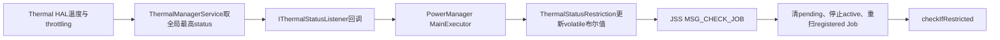
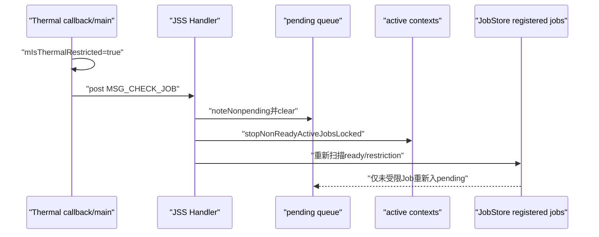
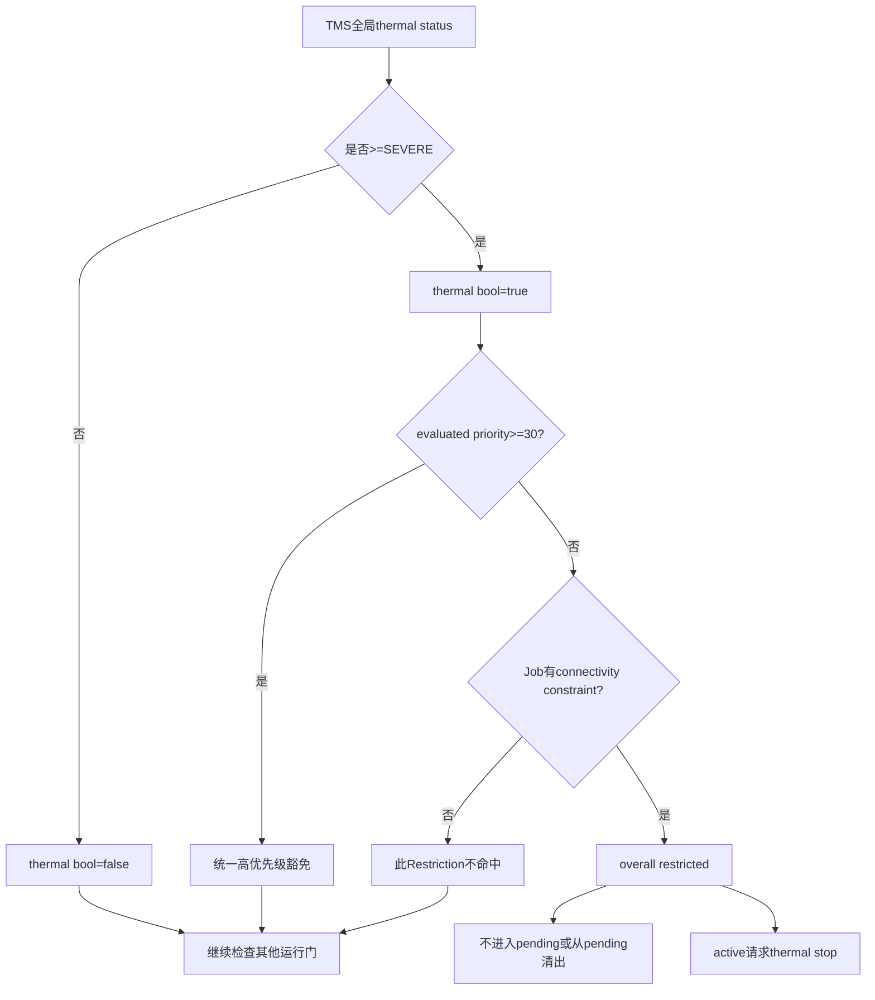

# 137 Android JobRestriction 与 ThermalStatusRestriction：热状态限制

> 源码版本：Android 11 / API 30 / `android-11.0.0_r48`  
> 学习方式：macOS 只读源码，不要求编译、不要求连接设备  
> 前置章节：第 70、121、123、131、136 章

---

## 1. 本章研究什么

Android 11 的 JobScheduler 除了 JobStatus constraint 和 StateController，还有一层
`JobRestriction`。r48 中唯一实现是热限制：设备达到 severe thermal 后，阻止或停止部分网络 Job。

本章重点不是重复热管理总链，而是回答热状态怎样成为 JSS 的运行门。

---

## 2. 先建立三层模型

```text
Constraint：Job声明/系统动态追加的条件位，参与JobStatus.isReady
Restriction：JSS额外系统策略门，不写进JobStatus constraint bit
Concurrency：通过前两层后，决定有限槽位分给谁
```

三层都能让 Job 暂时不运行，但数据结构、停止原因和恢复方式不同。

---

## 3. 源码地图

```text
frameworks/base/apex/jobscheduler/service/java/com/android/server/job/restrictions/JobRestriction.java
frameworks/base/apex/jobscheduler/service/java/com/android/server/job/restrictions/ThermalStatusRestriction.java
frameworks/base/apex/jobscheduler/service/java/com/android/server/job/JobSchedulerService.java
frameworks/base/core/java/android/os/PowerManager.java
frameworks/base/services/core/java/com/android/server/power/ThermalManagerService.java
frameworks/base/apex/jobscheduler/framework/java/android/app/job/JobParameters.java
```

---

## 4. r48 只有一个 JobRestriction

JSS 构造时：

```java
mJobRestrictions = new ArrayList<>();
mJobRestrictions.add(new ThermalStatusRestriction(this));
```

所以本章讨论的抽象扩展点虽然可容纳多项，Android 11 r48 实际列表只有 thermal 一项。

---

## 5. JobRestriction 不是 StateController

它不继承 `StateController`，没有 tracked Job 集合，也没有 `maybeStartTrackingJobLocked()`。

它保存 JSS 引用和一个固定 stop reason，并在 JSS 每次检查 Job 时即时回答 `isJobRestricted(job)`。

---

## 6. 每项 Restriction 固定对应一个停止原因

构造器接收 `reason`，`getReason()` 是 final。Thermal 传入：

```java
JobParameters.REASON_DEVICE_THERMAL
```

因此限制已运行 Job 时，应用收到的标准 stop reason 是 thermal，而不是通用 constraints。

---

## 7. 抽象接口的返回值语义

调用者使用：

```java
if (restriction.isJobRestricted(job)) {
    return restriction;
}
```

所以 `true` 明确表示“正在限制”。

---

## 8. r48 接口 Javadoc 写反了

`isJobRestricted()` 的 `@return` 却写：

```text
false if JSS should not schedule this job, true otherwise
```

这与方法名、Thermal 实现和全部调用方相反。阅读时应以可执行代码为准：`true = restricted`。

---

## 9. ThermalRestriction 的状态极简

核心只有：

```java
private volatile boolean mIsThermalRestricted = false;
private PowerManager mPowerManager;
```

它不保存具体温度、热源名称或七档 status，只把它们压缩成 severe-or-higher 的布尔门。

---

## 10. 总体链路图



---

## 11. 监听器在什么启动阶段注册

JSS 到 `PHASE_SYSTEM_SERVICES_READY` 时依次初始化 Controller/Restriction，调用：

```java
restriction.onSystemServicesReady();
```

ThermalRestriction 此时取得 PowerManager 并注册 thermal status listener。

---

## 12. 为什么不在构造器注册

构造 JSS 时系统服务依赖可能尚未 ready。把外部服务监听放在 boot phase callback，可避免初始化顺序
耦合，也与 StateController 的 `onSystemServicesReady()` 生命周期保持一致。

---

## 13. PowerManager 默认使用 MainExecutor

```java
mPowerManager.addThermalStatusListener(listener);
```

无 Executor 重载内部转成 `mContext.getMainExecutor()`。因此 Restriction 注释明确回调在 main thread，
不能做慢操作。

---

## 14. ThermalManagerService 注册后会立即推当前值

服务端 `registerThermalStatusListener()` 成功注册到 RemoteCallbackList 后，马上 `postStatusListener()`。

所以 Restriction 不必另调 `getCurrentThermalStatus()`；首次回调完成初始状态同步。

---

## 15. 首次回调不是同步返回值

ThermalManagerService 把通知 post 到 `FgThread`，PowerManager Binder wrapper 再投递到 MainExecutor。

注册方法返回与 Restriction 收到当前状态之间存在异步窗口，初始布尔值暂时为 false。

---

## 16. 启动早期消息被丢也不会丢状态

若 thermal callback 在 JSS `mReadyToRock=false` 时触发，`MSG_CHECK_JOB` handler 会直接 return。

但 `mIsThermalRestricted` 已经更新；等 JSS 后续扫描 Job 时仍会读到正确限制。丢的是一次早期重扫，
不是热状态本身。

---

## 17. 七档 thermal status

```text
NONE → LIGHT → MODERATE → SEVERE → CRITICAL → EMERGENCY → SHUTDOWN
```

PowerManager 常量直接映射 `Temperature.THROTTLING_*`。数值随严重度递增，因此可以用 `>=` 判断。

---

## 18. Restriction 的阈值是 SEVERE

```java
boolean shouldBeActive = status >= PowerManager.THERMAL_STATUS_SEVERE;
```

NONE/LIGHT/MODERATE 不限制；SEVERE/CRITICAL/EMERGENCY/SHUTDOWN 都限制。

---

## 19. 没有第二套热滞回阈值

进入门和退出门都在 severe 边界：

```text
MODERATE→SEVERE：开启
SEVERE→MODERATE：关闭
```

Restriction 自己不做时间 debounce 或温度 hysteresis；底层 thermal status 的稳定性由 HAL/TMS 负责。

---

## 20. 同一布尔区间内不重扫

```java
if (mIsThermalRestricted == shouldBeActive) return;
```

SEVERE→CRITICAL、CRITICAL→EMERGENCY 都仍为 true，不触发 JSS。只有跨越 severe 边界才发一次状态变化。

---

## 21. volatile 的作用

thermal callback 在 main executor 更新，JSS 其他持锁路径读取；`volatile` 保证布尔可见性。

它不替代 JSS `mLock` 保护 Job 队列，只保护这个简单状态发布。

---

## 22. callback 为什么不直接扫描全部 Job

监听器只：

```text
更新boolean
调用mService.onControllerStateChanged()
```

JSS 方法再 post `MSG_CHECK_JOB`。这样 thermal 主线程回调快速返回，真正扫描在 JSS Handler 获取 `mLock`
后执行。

---

## 23. 多次边界变化消息会合并

处理 `MSG_CHECK_JOB` 时先 `removeMessages(MSG_CHECK_JOB)`，能消除队列中同类冗余检查。

最终扫描读取最新 volatile 布尔值，因此快速 severe↔moderate 抖动不要求逐个重放中间态。

---

## 24. 真正限制公式

```java
return mIsThermalRestricted && job.hasConnectivityConstraint();
```

两个条件缺一不可：设备 severe+，并且 Job 原本要求网络连接。

---

## 25. 为什么不是所有 Job

r48 选择网络约束 Job 作为高热时可延后的工作集合。源码没有按 estimated bytes、网络类型或实际传输量
细分；只要 required constraints 有 connectivity bit 就命中。

---

## 26. hasConnectivityConstraint 的精确来源

JobStatus 方法只查：

```java
(requiredConstraints & CONSTRAINT_CONNECTIVITY) != 0
```

注释说明 dynamic connectivity 只会在它原本已 required 时出现，所以无需额外查动态位。

---

## 27. 没网络约束不等于绝不联网

JobService 业务仍可能自行打开网络连接，但若 JobInfo 没声明 required network，Restriction 看不到。

这套政策以调度声明为依据，不进行 socket 或流量运行时检测。

---

## 28. 网络类型不影响热限制

ANY、UNMETERED、NOT_ROAMING、自定义 NetworkRequest，只要形成 connectivity constraint，severe+时
都同样 restricted。Wi-Fi 并无特殊豁免。

---

## 29. priority 是外层统一豁免

`checkIfRestricted(job)` 首先：

```java
if (evaluateJobPriorityLocked(job) >= PRIORITY_FOREGROUND_APP) return null;
```

达到30或更高时根本不调用任何 Restriction，thermal 布尔和网络约束都被绕过。

---

## 30. 这里的 foreground 不是一个布尔 App 状态

它使用第136章的 evaluated priority：原 Job priority、source UID proc-state override 和 load factor
负调整共同作用。不能只看应用有没有前台 Activity。

---

## 31. load factor 可让 Job 失去热豁免

例如 base/override priority=35，moderate load 调整-40后得到-5，小于30，于是进入 Restriction 检查。

所以长期 Job 负载会间接影响热政策；Tracker 没直接设置 thermal 状态，但它改变统一优先级门。

---

## 32. TOP_APP 一定绕过负调整和 restriction

priority 40 先在 `adjustJobPriority()` 中免于 load 降权，再在 `checkIfRestricted()` 达到30直接返回 null。

用户当前交互相关的 TOP 工作不会被这条 thermal JobRestriction 阻断。

---

## 33. 完整限制矩阵

| thermal | connectivity | evaluated priority | 结果 |
|---|---:|---:|---|
| NONE/LIGHT/MODERATE | 任意 | 任意 | 不受 thermal restriction |
| SEVERE+ | 否 | <30 | 不受此 restriction |
| SEVERE+ | 是 | <30 | restricted |
| SEVERE+ | 任意 | ≥30 | 外层优先级豁免 |

---

## 34. Restriction 不改变 JobStatus.isReady

被热限制的 Job 仍可能：

```text
job.isReady() == true
checkIfRestricted(job) != null
isReadyToBeExecutedLocked(job) == false
```

这是理解 dumpsys “job ready 但 overall Ready=false”的关键。

---

## 35. 它也不设置 satisfied constraint bit

温度恢复时无需逐 Job 翻转位。下一轮 `checkIfRestricted()` 读到布尔 false，自然放行；这与 Controller
遍历 Job 更新 constraint satisfaction 的模式不同。

---

## 36. Restriction 在 ready 主链的位置

`isReadyToBeExecutedLocked()` 顺序大致是：

```text
JobStatus.isReady
→ Job仍注册、用户已启动、UID未backup
→ checkIfRestricted
→ 非pending、非active
→ Service组件可用
```

热限制在较昂贵的 package/service 查询之前快速失败。

---

## 37. areComponentsInPlaceLocked 也检查 restriction

Controller 的 `wouldBeReadyWithConstraintLocked()` 最终会问 JSS 组件是否齐备；该方法同样包含
`checkIfRestricted()`。

因此被热限制时，Controller 不应为这个 Job 额外触发昂贵促进动作，因为即使它自己的 constraint 满足，
外层政策仍不允许运行。

---

## 38. thermal 状态变为 severe 后发生什么



是否走 greedy/full queue 分支取决于 `mReportedActive`，但两条都先清 pending 并检查 active。

---

## 39. pending Job 会先离开队列

全量或 maybe queue 路径都：

```java
noteJobsNonpending(mPendingJobs);
mPendingJobs.clear();
```

重新扫描时，被 thermal restricted 的网络 Job 不会再加入。它仍保留在 JobStore，等待温度恢复。

---

## 40. active Job 会收到 thermal stop

`stopNonReadyActiveJobsLocked()` 若 Job 自身 constraints 仍 ready，再检查 Restriction；命中后：

```java
cancelExecutingJobLocked(REASON_DEVICE_THERMAL,
        "restricted due to thermal");
```

后续经 JobServiceContext STOPPING/cleanup，应用 `onStopJob()` 可决定是否重试。

---

## 41. restriction reason 只在自身约束仍 ready 时使用

代码先检查 `!running.isReady()`。若同一时刻网络也断开，先用：

```text
REASON_CONSTRAINTS_NOT_SATISFIED
```

只有 JobStatus 仍 ready、单纯被外层 thermal policy 阻止时才用 thermal reason。停止原因存在优先级顺序。

---

## 42. RESTRICTED bucket 动态约束又更先一层

`!running.isReady()` 分支中，若 effective bucket 为 RESTRICTED 且 dynamic constraints 未满足，停止原因改为
`REASON_RESTRICTED_BUCKET`。

因此同一 Job 同时遭遇多种政策时，不会记录全部原因，只记录该 if/else 顺序选中的一个主因。

---

## 43. 已发 stop 不是立即 cleanup

`cancelExecutingJobLocked()` 通常向应用发送 stop 并等待 ack，JobServiceContext 进入 STOPPING；直到 ack、
超时或死亡才 `noteInactive()` 和重排。

热状态变化与执行槽真正释放不是同一个完成点。

---

## 44. onStopJob 返回 true 的含义不变

应用若要求 reschedule，JSS 按失败/重调度路径生成新 JobStatus；温度仍 severe 时，新实例仍被 Restriction
挡住，不会因为“请求重试”立刻再次执行。

---

## 45. 周期 Job 的后续窗口也受同一门

周期任务停止/完成后建立下一窗口；等窗口和其他 constraint ready，JSS 仍会调用 `checkIfRestricted()`。

thermal restriction 不修改 period/flex，只影响每次候选进入 pending/active 的许可。

---

## 46. 温度恢复的路径

SEVERE→MODERATE：

```text
boolean true→false
→ post MSG_CHECK_JOB
→ 重新扫描registered Job
→ 满足其他门的网络Job重新pending
→ ConcurrencyManager尝试分配
```

没有专门 thermal Alarm，也不需要恢复每个 Job 的 bit。

---

## 47. 恢复不意味着全部立刻运行

解除 restriction 后仍可能受：

```text
网络实际能力
Quota/Doze/后台限制
用户与组件状态
非active batching
并发槽位和优先级
```

影响。thermal false 只是打开其中一扇门。

---

## 48. severe 期间高优先级变化可重新放行

若 source UID 变为 TOP/FG，`mUidPriorityOverride` 提升；后续 JSS 重新评估时可能达到30，绕过 Restriction。

Restriction 不缓存“某 Job 已限制”的集合，所以身份/优先级变化可即时改变答案。

---

## 49. UID 离开前台后可能重新受限

反过来，thermal 仍 severe，UID override 被删除或 load factor 降权后 priority<30，网络 Job 会再次命中。

下一次状态检查会把 pending 清出或请求停止 active Job。

---

## 50. checkIfRestricted 返回第一项

JSS 从 restriction 列表尾到头遍历，命中即返回。r48 只有 thermal，顺序无区别；若未来增加多项，
active Job 的 stop reason 会由第一个命中项决定。

---

## 51. dumpsys 文本如何展示

全局常量区域打印：

```text
In thermal throttling?: true/false
```

每个注册 Job 还打印：

```text
Restricted due to: thermal
```

但只有经过外层 `checkIfRestricted()` 后真正 restricted 才显示 reason。

---

## 52. 文本单项显示考虑 priority 豁免

代码先算 `isRestricted = checkIfRestricted(job) != null`。若 false 就直接打印 none，不再逐项列 raw
`restriction.isJobRestricted(job)`。

所以 severe+网络 Job 若 evaluated priority≥30，文本显示 none。

---

## 53. Proto dump 同时给两种视角

每个 Job 写：

```text
IS_JOB_RESTRICTED = checkIfRestricted(job) != null
RESTRICTIONS[].IS_RESTRICTING = restriction.isJobRestricted(job)
```

第二项绕过外层 priority gate，可能出现 raw thermal=true 但 overall restricted=false。

---

## 54. Proto 的“矛盾”其实是两层语义

```text
raw restriction：若不考虑统一豁免，这一Restriction是否命中
overall restriction：考虑evaluated priority后，JSS是否实际阻止
```

诊断工具必须结合 reason 与 overall 字段，不能只看数组中 `IS_RESTRICTING`。

---

## 55. dump constants 名称并不精确

`In thermal throttling?` 实际表示 `status >= SEVERE`，不是设备是否处于任何 throttling。

LIGHT/MODERATE 已经属于 thermal throttling 常量，却会打印 false。更准确理解是“Job thermal restriction active?”。

---

## 56. ThermalManagerService 的全局 status 来源

TMS 遍历当前 `mTemperatureMap`，取所有 Temperature status 的最大值：

```java
if (t.getStatus() >= newStatus) newStatus = t.getStatus();
```

任一传感器/热源达到 severe，都可能让全局 status 达 severe。

---

## 57. Restriction 看不到是哪一个热源

PowerManager status listener 只给一个 int，不提供 CPU、GPU、皮肤、电池等 Temperature 细节。

所以 JSS 不能按热源制定不同网络 Job 策略；它只消费聚合 severity。

---

## 58. HAL 版本回退不属于 Restriction

TMS 尝试 Thermal HAL 2.0、1.1、1.0 并聚合状态。Restriction 位于更上层，只依赖 PowerManager
统一 status，不关心底层版本。

这体现跨层接口的价值：JSS 不需要了解 vendor thermal 实现。

---

## 59. 没有 Thermal HAL 时的边界

TMS 无法连接 HAL 会记录警告，初始 status 为 NONE。Restriction 收到/保留 false，无法基于缺失数据主动
限制 Job。

“没有热限制”在此时可能表示没有 severe，也可能表示平台没有提供有效热状态。

---

## 60. shell thermal override 会影响这条链

TMS 有 status override；override 生效时正常 temperature map 更新不改全局 mStatus。监听器看到 override
状态，JobScheduler 也按它限制或解除。

这是测试/调试入口，不等于传感器真实温度变化。

---

## 61. listener 没有保存字段用于注销

Restriction 以匿名 listener 直接注册，但不把 listener 引用保存为字段，也没有 shutdown/unregister 路径。

JSS 与 PowerManager 都随 system_server 生命周期存在，正常生产无需单独销毁；但这使该类不适合作为可反复
start/stop 的组件，也增加独立测试清理难度。

---

## 62. addThermalStatusListener 失败会抛 RuntimeException

PowerManager 若服务端注册返回 false，会抛 `RuntimeException("Listener failed to set")`；Restriction
没有 catch。

所以 boot phase 初始化依赖 thermal service 注册正常，失败不是静默退化为 false。

---

## 63. Binder 身份被 PowerManager wrapper 清理

`IThermalStatusListener.Stub.onStatusChange()` 先 `Binder.clearCallingIdentity()`，再通过 Executor 调用业务
listener，最后恢复。

Restriction callback 不继承 ThermalManagerService 的 Binder 调用身份。

---

## 64. TMS 先在 FgThread 发 Binder 回调

服务端 `postStatusListener()` 投到 system_server FgThread，再调用 listener Binder；客户端 PowerManager
wrapper 又投到 Context MainExecutor。

即便服务端和 JSS 同属 system_server，也保留 Binder/Executor 异步边界，不能当作直接 Java 调用。

---

## 65. volatile 写发生在 JSS main thread

PowerManager 默认 MainExecutor 通常对应 context 主线程；JSS JobHandler 也使用主 Looper，但 callback 和
Handler message 仍是两个独立队列任务。

更新 boolean 后再 post message，保证扫描看到新值；中间可能有其他主线程消息插入。

---

## 66. restriction 变化不会修改 JobStore

热状态是运行时设备条件，不会触发 jobs.xml 写盘。persisted Job 保持原定义，重启后由当前 thermal status
首次回调重新建立运行门。

---

## 67. 它也没有历史账本

Restriction 只留当前 bool，不记录进入 severe 的次数、持续时长或受影响 Job 数。历史要看 TMS/statsd/
JobPackageTracker stop event 等其他诊断来源。

---

## 68. JobPackageTracker 会看到 thermal stop

active Job 最终 cleanup 时，PackageTracker `stopReasons` 增加 reason 5；event ring 文本通常优先显示
debug string `restricted due to thermal`。

但第136章的 r48 STOP/P STOP command 反向缺口仍存在，事件类型标签可能错，reason 本身仍是 thermal。

---

## 69. BatteryStats 也收到相同 stop reason

JobServiceContext cleanup 调用 `mBatteryStats.noteJobFinish(..., mParams.getStopReason())`。

因此 thermal reason 不只面向应用回调，也进入系统耗电/停止原因记账；前提是 Job 确实已 active 并走 cleanup。

---

## 70. 未启动的 restricted Job 没有 stop reason

若 Job 只从 pending queue 被清掉、从未 active，系统不会调用 onStopJob，也不会产生 PackageTracker inactive
stop reason。它只是暂时不再是执行候选。

---

## 71. Restriction 与 ConnectivityController 不重复

ConnectivityController 回答“网络是否匹配、UID policy 是否允许、传输是否可行”；ThermalRestriction 回答
“即使网络满足，当前热政策是否允许这个网络 Job”。

两者是 AND 门，不是同一 constraint 的两个实现。

---

## 72. thermal 不会撤销 Network 对象

JobStatus 可能仍保存已匹配 `network`，Connectivity constraint 仍 satisfied。Restriction 只阻止整体 ready；
恢复后若网络仍有效，可以再次候选。

实际运行前 Controller/JSS 仍会重新评估，不应依赖陈旧 Network 永久有效。

---

## 73. Restriction 与系统真实降频也不同

内核/固件/Thermal HAL 可能已经降低 CPU/GPU 性能；JobRestriction 是 Framework 在此基础上的额外
调度减载策略。

即使高优先级 Job 获豁免，它也不能绕过底层硬件 thermal throttling。

---

## 74. severe 不等于立即关机

SEVERE 只表示用户体验显著受影响；CRITICAL/EMERGENCY/SHUTDOWN 更严重。JSS 从 severe 开始延后网络 Job，
是提前减载，而不是等到系统即将关机才行动。

---

## 75. JobRestriction 的扩展设计

抽象类把每项政策统一成：

```text
boot ready初始化
per-Job布尔判断
固定stop reason
文本/Proto常量dump
```

未来可增加其他设备状态政策，而 JSS ready/stop 主链无需为每项复制代码。

---

## 76. 但“固定一个 reason”限制了多原因表达

一个 Restriction 只能对应一个 reason；`checkIfRestricted()` 又只返回第一项。若 Job 同时命中多个未来
Restriction，应用仍只看到一个 stop reason。

这是控制协议的主因模型，不是完整因果集合。

---

## 77. Restriction 不拥有执行动作

抽象类没有 `stopJob()`。它只回答判断；JSS 决定何时重扫 pending、何时停止 active、怎样给 reason。

这让政策与状态机动作分离，避免 Restriction 直接操纵 JobServiceContext。

---

## 78. 与 Controller 回调接口的命名复用

ThermalRestriction 调用 `mService.onControllerStateChanged()`，尽管它不是 Controller。该方法本质只是“请
JSS 重查状态”的通用消息入口，名字反映历史来源，不要求调用者继承 StateController。

---

## 79. MSG_CHECK_JOB 处理末尾还会分配槽位

Handler switch 完成 queue/stop/rebuild 后，无条件 `maybeRunPendingJobsLocked()`。

因此同一 thermal 状态变化既能移除受限 Job，也能马上把空出的槽位分给未受限 Job，最后更新
`reportActiveLocked()`。

---

## 80. mReportedActive 决定扫描策略，不决定 restriction 公式

有 pending/running 工作时走 `queueReadyJobsForExecutionLocked()` 全量入队；较空闲时走带 batching 的
`maybeQueueReadyJobsForExecutionLocked()`。

两者调用同一个 `isReadyToBeExecutedLocked()`，所以 thermal 判断相同；区别在非 ACTIVE Job 的批处理策略。

---

## 81. 热恢复后非active Job仍可能继续批处理

温度恢复触发 MSG_CHECK_JOB；若系统当时不 active，`MaybeReadyJobQueueFunctor` 可能认为 ready Job 数不足，
继续 force batching。

因此“解除 thermal”并不等于绕过第121章的默认非active batching。

---

## 82. 运行中高优先级计算是动态的

`stopNonReadyActiveJobsLocked()` 调 `checkIfRestricted(running)` 时会重新 `evaluateJobPriorityLocked()`，不是
只使用启动时 `lastEvaluatedPriority`。

source UID 当前 proc state 和 PackageTracker load factor 都可能使结果与启动那一刻不同。

---

## 83. active-top 分类和 restriction 豁免可能不完全同步

PackageTracker 在启动时用 `lastEvaluatedPriority` 把 Job 分类为 active/active-top；热状态变化时 JSS 重新
计算 evaluated priority 判断豁免。

若 UID 状态中途变化，统计分类仍按启动快照闭合，但 Restriction 用当前优先级。这是两个时间点的不同用途。

---

## 84. stopNonReadyActiveJobs 先用 JobStatus ready

热 restriction 不影响 `running.isReady()`，所以纯 thermal 变化会进入 else 再得到 thermal reason。

这正是将 Restriction 放在 constraint 外的好处：它能保留独立停止原因，而不是被统一折叠成 constraints。

---

## 85. pending 清空会影响 PackageTracker load

thermal severe 时，旧 pending queue 先 `noteNonpending()`。被限制 Job 不再重新 notePending，包的 pending
duration停止增长。

因此 PackageTracker 测的是 JSS 真正 pending 候选，不会把“因 thermal 留在 JobStore 等待”继续算作排队压力。

---

## 86. 热限制可能间接降低未来 load factor

受限期间网络 Job 不 active、也不 pending，旧负载随批次退出，factor 下降。恢复后其 evaluated priority
可能比进入热限制前更高。

这是两个独立模块通过 JSS 状态自然产生的反馈，不是 ThermalRestriction 主动清空负载历史。

---

## 87. Restriction 不区分 persisted 与非persisted

只检查 connectivity 和 priority。两类 Job 在 system_server 存活期间同样受限；差别仅在进程/设备重启后
任务定义是否能由 JobStore 恢复。

---

## 88. 不区分 periodic 与 one-off

`isJobRestricted()` 不看 `isPeriodic()`。两类都按本次候选的网络约束和 priority 判断。

周期相位、失败 backoff 等仍由第134章的重排逻辑负责。

---

## 89. 不区分调用方与 source UID

连接 constraint 来自 JobStatus；priority override 使用 source UID；restriction 自身没有额外身份校验。

`scheduleAsPackage()` 的工作因而按真实 source UID 前台状态享受或失去高优先级豁免。

---

## 90. 不检查 estimated network bytes

1 byte 和 1 GiB 估算在 thermal restriction 处完全相同。传输规模可行性在 ConnectivityController 处理，
热政策只做粗粒度网络 Job 开关。

---

## 91. 不检查充电状态

即使插电导致发热，Restriction 的公式里也没有 charging；反之设备未插电但全局 thermal severe，网络 Job
照样限制。

BatteryController 和 thermal policy 是独立输入。

---

## 92. 不检查屏幕或交互状态

交互只可能通过 UID priority override 间接影响豁免。Restriction 本身没有 screen-on 条件。

这也不同于 JobConcurrencyManager 的 screen-on/off 并发矩阵。

---

## 93. current thermal bool 不持锁 dump

`dumpConstants()` 直接读 volatile，无需 JSS mLock 才能保证可见性；不过生产 dump 是在 JSS mLock 中调用的，
同时可与其他调度状态保持相对一致。

---

## 94. raw restriction dump 可能误导优先级 Job

Proto 中遍历每项直接 `isJobRestricted(job)`，它不知道外层 priority gate。因此工具如果只显示
`REASON_DEVICE_THERMAL + IS_RESTRICTING=true`，可能误报实际被允许的高优先级 Job。

应优先看 RegisteredJob 的 overall `IS_JOB_RESTRICTED`。

---

## 95. 文本原因循环的安全前提

文本只有 overall restricted=true 时才遍历 raw restrictions。由于 overall 返回第一项命中，至少一项 raw
必然 true；r48 单项时会打印一次 thermal。

未来多项同时命中时，文本可能列出多个 raw reason，尽管 active stop 实际只选第一个。

---

## 96. getReason 不代表此刻一定命中

reason 是 Restriction 类型的固定元数据；只有 `isJobRestricted(job)` 为 true 且未被 priority gate 绕过，
JSS 才使用它。

dump 看到 thermal reason 定义，不等于设备当前 severe。

---

## 97. 当前测试覆盖边界

在 `frameworks/base/services/tests` 中检索不到专门的 `ThermalStatusRestrictionTest`。

因此 severe 阈值、connectivity 过滤、priority 外层豁免、监听器异步初始化和 active stop 原因等主要靠源码
链路审计，不能声称已有独立单测完整覆盖。

---

## 98. 接口注释错误为何容易传播

如果只读 `JobRestriction` Javadoc，会得到 `false=阻止`；若据此写自定义实现，JSS 调用方会把语义完全反转。

审计抽象接口必须同时看：方法名、至少一个实现、全部调用点和 dump 展示。

---

## 99. “In thermal throttling” 名称为何容易传播

PowerManager LIGHT/MODERATE 已称 throttling，但变量只在 SEVERE+为 true。文章若照抄 dump 标签，就会错误
声称 JobScheduler 在任何热节流下都限制网络 Job。

应始终写“severe-or-higher thermal restriction”。

---

## 100. 常见误解一：热状态是 Job constraint

错误。它不在 required/satisfied bit 中，而是 `JobStatus.isReady()` 之后的 JSS Restriction 门。

---

## 101. 常见误解二：SEVERE 会停止所有 Job

错误。只命中有 connectivity constraint 且 evaluated priority<30 的 Job。

---

## 102. 常见误解三：MODERATE 已经会限制

错误。阈值是 `>= THERMAL_STATUS_SEVERE`；MODERATE 下 bool 为 false。

---

## 103. 常见误解四：Wi-Fi Job 不受限制

错误。Restriction 不看 transport；任何 required network 都命中。

---

## 104. 常见误解五：没有声明网络但实际联网也会被识别

错误。它不监控 socket，只看 JobStatus required connectivity bit。

---

## 105. 常见误解六：热恢复后任务立即执行

错误。只解除一个外层门，其他 constraints、quota、batching 和并发竞争仍存在。

---

## 106. 常见误解七：thermal stop 就等于槽位已释放

错误。先请求 stop，应用 ack/超时/死亡后才 cleanup 并释放。

---

## 107. 常见误解八：所有同时失败原因都会传给应用

错误。停止逻辑按 restricted bucket dynamic、普通 constraint、第一项 Restriction 的顺序选择一个主 reason。

---

## 108. 常见误解九：Proto raw IS_RESTRICTING 就是最终结论

错误。它不考虑 evaluated priority 统一豁免，应结合 overall `IS_JOB_RESTRICTED`。

---

## 109. 常见误解十：Restriction 自己跟踪每个 Job

错误。它只存全局 bool，JSS 每次即时传入 JobStatus 判断。

---

## 110. 常见误解十一：热状态会写进 jobs.xml

错误。它是易变运行环境，既不改变 JobInfo，也不触发 JobStore 持久化。

---

## 111. 常见误解十二：JobRestriction Javadoc 的返回值可直接照搬

错误。r48 Javadoc 写反；实际代码语义是 true=restricted。

---

## 112. macOS 只读练习一：核对抽象语义

```bash
sed -n '35,75p' \
  frameworks/base/apex/jobscheduler/service/java/com/android/server/job/restrictions/JobRestriction.java

rg -n 'isJobRestricted' \
  frameworks/base/apex/jobscheduler/service/java/com/android/server/job
```

把 Javadoc、实现、调用方三者并排，解释为什么以调用方为准。

---

## 113. macOS 只读练习二：手算四格矩阵

```bash
sed -n '35,70p' \
  frameworks/base/apex/jobscheduler/service/java/com/android/server/job/restrictions/ThermalStatusRestriction.java
```

分别代入 MODERATE/SEVERE、network/no-network、priority 20/40，写出最终是否 restricted。

---

## 114. macOS 只读练习三：追异步线程链

```bash
sed -n '1920,1970p' frameworks/base/core/java/android/os/PowerManager.java
sed -n '160,225p' frameworks/base/services/core/java/com/android/server/power/ThermalManagerService.java
```

画出 TMS FgThread→Binder wrapper→MainExecutor→JSS Handler→mLock 扫描。

---

## 115. macOS 只读练习四：找 ready 门位置

```bash
sed -n '2210,2340p' \
  frameworks/base/apex/jobscheduler/service/java/com/android/server/job/JobSchedulerService.java
```

标记 `job.isReady()`、`checkIfRestricted()`、pending/active和component usable 的顺序。

---

## 116. macOS 只读练习五：找停止原因优先级

```bash
sed -n '2010,2045p' \
  frameworks/base/apex/jobscheduler/service/java/com/android/server/job/JobSchedulerService.java
```

推演同一 active Job 同时断网、进入RESTRICTED bucket且设备SEVERE时，哪一分支先决定 reason。

---

## 117. macOS 只读练习六：对照文本与Proto

```bash
sed -n '3180,3210p' \
  frameworks/base/apex/jobscheduler/service/java/com/android/server/job/JobSchedulerService.java

sed -n '3370,3410p' \
  frameworks/base/apex/jobscheduler/service/java/com/android/server/job/JobSchedulerService.java
```

解释高优先级网络 Job 为何可能 raw thermal=true、overall restricted=false。

---

## 118. macOS 只读练习七：确认全局最高热状态

```bash
sed -n '190,225p' \
  frameworks/base/services/core/java/com/android/server/power/ThermalManagerService.java
```

回答：Restriction 能否知道触发 SEVERE 的是 CPU 还是 skin sensor？

---

## 119. 阅读检查题

1. Restriction 与 constraint 的数据结构差异是什么？
2. r48 `isJobRestricted()` Javadoc 哪里写反？
3. 热限制阈值为何不是 LIGHT 或 MODERATE？
4. 什么 Job 在 severe+仍不受这项 Restriction？
5. raw restriction 与 overall restriction 有何差异？
6. severe 到来后 pending 和 active Job 分别怎样处理？
7. 为什么 thermal stop 不等于立即释放槽？
8. 为什么实际联网但未声明 network 的 Job 不命中？
9. 温度恢复后为什么还可能不运行？
10. 这套策略与底层 CPU/GPU 降频是什么关系？

---

## 120. 场景推演一：普通后台下载

```text
thermal=SEVERE
requiredNetwork=UNMETERED
basePriority=0
source UID无前台override
```

evaluated priority<30，raw thermal=true，overall restricted=true。若 pending，会被移出；若 active 且网络
constraint仍满足，会收到 REASON_DEVICE_THERMAL stop。

---

## 121. 场景推演二：前台来源同步

```text
thermal=CRITICAL
requiredNetwork=ANY
source UID=TOP，override priority=40
```

`adjustJobPriority()` 不降 TOP，`checkIfRestricted()` 在30门提前返回 null。raw Restriction 若单独调用仍为
true，但 overall允许。底层 thermal throttling 仍然存在。

---

## 122. 场景推演三：热与断网同时发生

active Job required network，thermal进入SEVERE，同时 connectivity constraint变false。

`running.isReady()==false`，先走 constraints 分支，stop reason 为 constraints（若 restricted bucket dynamic
分支命中则是 restricted_bucket），不会进入 thermal else。热也是事实，但不是本次上报主因。

---

## 123. 一页复习图



---

## 124. 本章结论

1. JobRestriction 是 JobStatus constraint 之外的 JSS 系统政策门；
2. r48 只有 ThermalStatusRestriction；
3. 每项 Restriction 固定绑定一个 stop reason；
4. r48 抽象接口 Javadoc 把 boolean 返回语义写反，实际 true=restricted；
5. TMS 取所有温度状态最大值，通过 Binder/FgThread/MainExecutor 异步通知；
6. Restriction 在 SYSTEM_SERVICES_READY 注册，并会异步收到当前状态；
7. severe及以上把全局 bool 置true，light/moderate不限制；
8. 同一 severe区间内变化不重复重扫；
9. raw公式是 thermal bool AND required connectivity；
10. evaluated priority≥30在外层统一豁免；
11. load factor可能间接让Job失去豁免；
12. Restriction不改JobStatus ready bit，也不写jobs.xml；
13. severe变化通过MSG_CHECK_JOB清pending、检查active并重扫全部Job；
14. active纯热限制使用REASON_DEVICE_THERMAL，但其他constraint可优先成为主因；
15. stop请求与cleanup/槽位释放是两个完成点；
16. 恢复只打开热门，不能绕过quota、batching和并发；
17. Proto raw restriction可能为true而overall为false；
18. dump标签“In thermal throttling”实际只代表severe-or-higher；
19. 策略不看网络类型、估算字节、充电、屏幕、persisted或periodic；
20. Framework restriction不能绕过底层硬件thermal throttling。

最值得带走的一句话：

> Android 11 的 thermal JobRestriction 不是给 Job 增加一个“温度约束位”，而是在 Job 自身已经 ready 之后再问：设备是否已 severe、它是否声明网络、当前 evaluated priority 是否低于前台豁免门；命中时 pending 候选被撤下，active Job 以 thermal reason 走正常 stop 状态机。

---

## 125. 生成后复读：容易误解处的修订

初稿后对照 Restriction、JSS ready/stop主链、PowerManager和TMS逐段复读：

1. 将constraint、restriction、concurrency三层分开；
2. 确认r48 restriction列表只有thermal一项；
3. 发现JobRestriction Javadoc把true/false语义写反，并以实现/调用方校正；
4. 明确首次status由注册后异步推送，不是同步查询；
5. 画清TMS FgThread→Binder→MainExecutor→JSS Handler线程链；
6. 补出ready前早期MSG可能return，但volatile状态仍保留；
7. 限定阈值是SEVERE且无Restriction层迟滞；
8. 明确只在跨severe布尔边界时通知JSS；
9. 将公式限定为required connectivity，不推断实际socket；
10. 逐项核对network type/bytes/charging/screen均不参与；
11. 补出evaluated priority统一豁免与load factor间接影响；
12. 用矩阵解释raw与overall restriction；
13. 明确Restriction不改变JobStatus.isReady或constraint bit；
14. 追pending清出、active stop、应用ack和cleanup四个阶段；
15. 补出constraints/restricted bucket/thermal停止原因的代码优先级；
16. 限定温度恢复后仍受batching和其他门；
17. 区分启动时active-top分类快照与停止时动态priority；
18. 记录dump标签把SEVERE门泛称thermal throttling的命名偏差；
19. 说明Proto raw字段不考虑priority gate；
20. 记录匿名listener无注销字段、注册失败RuntimeException边界；
21. 确认当前services测试树没有专门ThermalStatusRestrictionTest；
22. 区分Framework调度减载和底层硬件降频；
23. 将全部练习限定为macOS `rg`/`sed`只读分析，不要求编译。

下一章进入 `JobSchedulerService` 的 UID 状态、优先级 override 与 pending ready 门：系统追踪 TOP/FGS/BFGS、
backup、started user、bad app 和组件可用性，怎样共同决定一个 constraints 已满足的 Job 是否真正进入候选队列。
