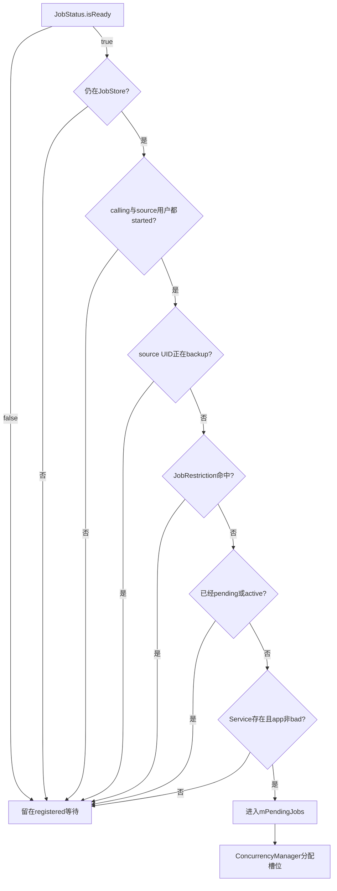
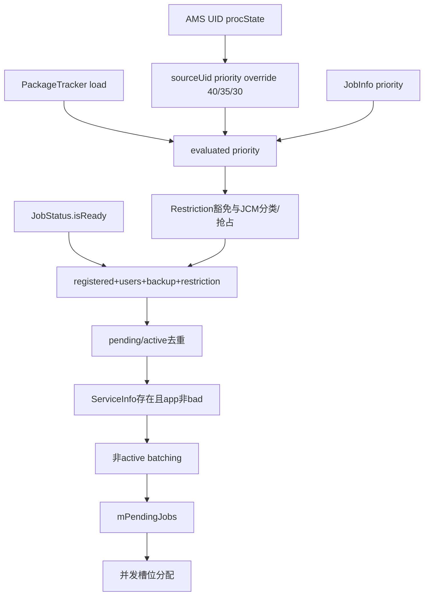

# 138 Android JSS：UID 状态、优先级 Override 与完整 Ready 门

> 源码版本：Android 11 / API 30 / `android-11.0.0_r48`  
> 学习方式：macOS 只读源码，不要求编译、不要求连接设备  
> 前置章节：第 121、129、130、131、136、137 章

---

## 1. “约束满足”为什么还不能直接运行

`JobStatus.isReady()` 只完成 Job 自身显式/隐式约束判断。JSS 还必须确认：

```text
Job仍注册
calling/source两个用户都已started
source UID没有处于全量backup
没有JobRestriction
没有已经pending/active
JobService组件存在且进程不在bad list
```

通过后才可能进入 pending，再由并发管理器分配槽位。

---

## 2. 本章目标

本章把第121章的“完整 ready 门”逐行展开，同时追 UID proc state 怎样形成优先级 override，shell override
怎样与 ready 位交互，以及 user/backup/component 状态怎样唤醒重新扫描。

---

## 3. 源码地图

```text
frameworks/base/apex/jobscheduler/service/java/com/android/server/job/JobSchedulerService.java
frameworks/base/apex/jobscheduler/service/java/com/android/server/job/controllers/JobStatus.java
frameworks/base/apex/jobscheduler/service/java/com/android/server/job/JobConcurrencyManager.java
frameworks/base/apex/jobscheduler/service/java/com/android/server/job/JobSchedulerShellCommand.java
frameworks/base/apex/jobscheduler/framework/java/android/app/job/JobInfo.java
frameworks/base/services/core/java/com/android/server/am/ActivityManagerService.java
```

---

## 4. 四个集合/映射先分清

```text
mJobs                 registered权威任务表
mPendingJobs          已通过完整门、等待槽位的候选
mActiveServices       固定JobServiceContext槽，部分正在运行
mUidPriorityOverride  source UID当前TOP/FGS/BFGS优先级投影
```

此外 `mStartedUsers` 和 `mBackingUpUids` 是完整门的系统状态输入。

---

## 5. 状态不是单线枚举

一个 Job 可以 registered 且 pending；周期 Job 运行时仍 registered；某些 Controller 同时继续跟踪 active Job。

所以更准确是多个集合维度，不是 `REGISTERED→PENDING→ACTIVE` 后旧状态必然消失的单枚举。

---

## 6. 完整门流程图



---

## 7. 第一门：JobStatus.isReady

它先要求 quota/dynamic 之一放行且 bucket 不是 NEVER，再要求 NOT_DOZING、BACKGROUND_NOT_RESTRICTED，
最后要求一次性 deadline override 或全部普通 constraints satisfied。

这一步完全在 JobStatus 内，不查询用户、包管理器或执行槽。

---

## 8. quota 与 dynamic 的特殊 OR

源码第一段：

```java
if ((!mReadyWithinQuota && !mReadyDynamicSatisfied)
        || getEffectiveStandbyBucket() == NEVER_INDEX) return false;
```

dynamic constraints 满足可作为 restricted/parole 场景的替代放行，但 NEVER 始终不运行。

---

## 9. deadline 也不是全能通行证

一次性 deadline satisfied 可跳过普通显式 constraints，但不能跳过 quota/dynamic、NEVER、Doze 和后台限制。

周期 latest 不是这里的普通 override deadline，周期仍需 constraints。

---

## 10. 第二门：Job 必须仍在 JobStore

扫描得到 JobStatus 引用后，另一个路径可能已取消/替换。`mJobs.containsJob(job)` 防止陈旧对象重新进入 pending。

JobStore 使用对象身份集合，因此旧 replacement 引用不会冒充新代际。

---

## 11. 第三门：两个用户都必须 started

```java
sourceStarted = contains(mStartedUsers, job.getSourceUserId());
return sourceStarted && contains(mStartedUsers, job.getUserId());
```

若 calling/service user 与 source user 相同，只检查一次；跨用户 `scheduleAsPackage()` 两边都要 started。

---

## 12. started 不等于 unlocked

`onStartUser()` 把 userId 加入数组；`onUnlockUser()` 只发重扫消息，不再修改数组。

所以这道门是“用户进程生命周期已启动”，不是“CE 存储已经解锁”的直接布尔门。解锁可能让其他组件/
Controller 状态变化，故仍主动重扫。

---

## 13. start user 会主动唤醒 Job 检查

```text
持mLock appendInt
释放锁
post MSG_CHECK_JOB
```

此前因 user-stopped 留在 registered 的 Job 可以重新通过完整门。

---

## 14. appendInt 避免重复用户

`ArrayUtils.appendInt` 在已有值时不会重复加入。多次 start callback 不会让数组出现重复 userId，
后续 remove 也无需计数语义。

---

## 15. stop user 的 r48 通知边界

`onStopUser()` 只在锁内 `removeInt`，没有像 start/unlock 那样 post `MSG_CHECK_JOB`。

因此单看此方法，pending/active 对 user-stopped 的收敛依赖系统停止用户时的其他取消/组件事件或下一次
JSS 状态检查；不能声称此回调自身立即清队列并停止 Job。

---

## 16. 两个 userId 各代表什么

```text
job.getUserId()       calling UID/JobService所在用户
job.getSourceUserId() 实际归因包所在用户
```

普通 App 两者相同；system_server 代包调度时可能不同。

---

## 17. 第四门：source UID 不能在 backup

```java
mBackingUpUids.indexOfKey(job.getSourceUid()) >= 0
```

BackupManager 通过 JobSchedulerInternal 标记 UID，防止全量 backup 期间启动其 Job 改动数据。

---

## 18. 为什么按 source UID

代包调度时 calling UID 可能是 system，但业务数据属于 source 包。暂停 source UID 才能覆盖它自己的同步/
后台 Job。

---

## 19. addBackingUpUid 不主动停止 Job

源码注释认为 full backup 会让 ActivityManager 杀应用进程，从而让正在运行 Job 结束；这里只把 UID 放入 map。

方法没有直接 post 重扫或遍历 active context，是对外部 backup/进程生命周期的依赖。

---

## 20. removeBackingUpUid 的恢复动作

删除 map 后，若：

```java
mJobs.countJobsForUid(uid) > 0
```

就 post `MSG_CHECK_JOB`，让被 backup gate 挡住的 Job 再次候选。

---

## 21. calling/source 双索引带来的恢复边界

`countJobsForUid(uid)` 查 JobStore calling UID 索引，但 backup gate 查 source UID。

对于 `scheduleAsPackage()`：source UID 有 Job，而 calling UID 可能是 system；移除 source backup 时计数可能为0，
从而不发送这次即时重扫。未来其他状态消息仍会收敛，但 r48 这条恢复判断的身份维度不对称。

---

## 22. clearAllBackingUpUids 更稳妥

只要 map 非空，clear 后无条件 post `MSG_CHECK_JOB`，不逐 UID 查 calling 索引。

因此全量清除没有上一节的 per-source 计数漏唤醒问题。

---

## 23. backing map 的 value 没有业务含义

`SparseIntArray` 用 `put(uid, uid)`，判断只看 key 是否存在。它实际上被当作 int set 使用。

---

## 24. 第五门：JobRestriction

第137章已展开。r48 先按 evaluated priority≥30统一豁免，否则检查 severe+网络 Job。

Restriction 不改变 `JobStatus.isReady()`，所以 dump 可出现 job ready=true、overall ready=false。

---

## 25. 第六门：不能已经 pending

`mPendingJobs.contains(job)` 使用对象身份，因为 JobStatus 没有 equals/hashCode。

同一引用避免重复入队；replacement 新对象必须通过 cancel old 的队列清理维持代际正确性。

---

## 26. 第七门：不能已经 active

JSS 遍历所有 JobServiceContext，使用：

```java
running.matches(job.getUid(), job.getJobId())
```

这里按 calling UID+jobId，不按对象引用，避免同一逻辑 Job 的不同对象代际同时执行。

---

## 27. pending 与 active 的比较语义不同

```text
pending contains：JobStatus引用身份
active matches：callingUid + jobId逻辑身份
```

这是刻意适配各自数据结构，不应统一概括为“都是按uid/jobId”。

---

## 28. 周期 Job 运行时仍注册

因此仅检查 `mJobs.containsJob()` 不足以防止同一周期 Job 重入；active 去重门不可省略。

完成后 JSS 才用新周期窗口 JobStatus replacement 继续跟踪。

---

## 29. 第八门：JobService 组件必须可用

JSS 调 PackageManager Binder：

```java
getServiceInfo(component, MATCH_DEBUG_TRIAGED_MISSING, job.getUserId())
```

返回 null 就不运行。检查的是 JobService 所在 calling user，而不是 source user。

---

## 30. 为什么组件检查放在最后

它是跨服务/Binder 查询，比位运算、数组和本地集合昂贵。因此前面任何便宜门失败就提前 return。

源码还有 TODO：缓存结果直到包变化通知，r48 仍每次查询。

---

## 31. RemoteException 被提升为 RuntimeException

`isComponentUsable()` 捕获 PM RemoteException 后 `throw new RuntimeException(e)`，认为同 system_server/关键
服务路径不该静默失败。

这不是“组件暂时不可用返回false”的降级。

---

## 32. ServiceInfo 存在还要检查 bad app

```java
mActivityManagerInternal.isAppBad(service.applicationInfo)
```

AMS 最终查询 AppErrors 的 bad process 记录。组件虽然安装存在，若进程被判为 bad，也不启动。

---

## 33. bad app 不等于 standby bucket

它是 AMS 崩溃/坏进程状态，与 App Standby ACTIVE/RARE/RESTRICTED 配额分类完全不同。

名字相近但政策来源和恢复机制不同。

---

## 34. 组件存在也不等于已绑定

完整门只证明可以尝试。真正 `bindServiceAsUser()` 仍可能因权限、单用户规则、竞态卸载等返回 false/
抛 SecurityException，JobServiceContext 会执行自己的失败清理。

---

## 35. 完整门通过只进入 pending

pending 是“可竞争执行槽”的候选，不代表已 bind、已持应用进程、已调用 onStartJob，更不代表业务完成。

后续还要经过 JobConcurrencyManager 与 JobServiceContext。

---

## 36. 新 schedule 的立即快路径

Job 完成 prepare、JobStore/controller tracking 后，JSS 立即调用 `isReadyToBeExecutedLocked()`。

通过就 `notePending()`、插入队列并尝试分配；失败则让各 Controller `evaluateStateLocked()`，等待未来变化。

---

## 37. 快路径仍不是同步执行

0 deadline 等任务希望 schedule Binder 返回前已经进入 pending/执行准备。但它仍不跳过完整门或并发槽，
更不等于应用 `onStartJob()` 已同步执行。

---

## 38. 状态变化后的全量扫描

```text
清旧pending并闭合PackageTracker
→ 检查active是否应stop
→ 遍历所有registered Job
→ 对每项重新跑完整门
→ 按策略重建pending
→ 分配执行槽
```

---

## 39. 为什么先清 pending 再重建

用户、restriction、constraint、组件状态可能同时变化。重建比增量维护所有交叉组合简单，也确保旧候选不再
满足门时被移除；代价是全量扫描和 pending episode 被切分。

---

## 40. 两种扫描策略

```text
queueReadyJobsForExecutionLocked：所有完整ready Job入pending
maybeQueueReadyJobsForExecutionLocked：非ACTIVE Job可能先等批量阈值
```

二者都用完整门；batching 是门通过后、pending 入队前的附加策略。

---

## 41. mReportedActive 决定扫描策略

有 pending 或普通后台 active Job 时走全量 queue；较空闲时走 maybe batching。

`mReportedActive` 还向 DeviceIdleInternal 报告 jobs active，不是简单“任意槽非空”。

---

## 42. batching 的主要条件

除 RESTRICTED bucket 与 failure 特殊分支外，非 ACTIVE Job 在最小 ready 数大于1且尚未超过最大非active
延迟时计入 `forceBatchedCount`，等待足够同类 Job 或超时。

---

## 43. ready 但未 pending 是合法状态

Job 可通过完整门，却因 ready 数不足被 MaybeReady functor 暂不加入 pending。

所以“完整 ready”与“已 pending”之间仍有 batching 策略层。

---

## 44. firstForceBatchedTime 是延迟锚点

首次强制 batch 时写 elapsed 时间；以后判断是否超过最大非active延迟。

它不是 Job schedule 时间或 earliest runtime，只记录开始因批量策略延后的时刻。

---

## 45. failure Job 通常不强制 batch

`numFailures>0` 时普通分支设 false，因为 backoff 已做时间控制。但 RESTRICTED bucket 判断在它之前，
restricted failure Job 仍强制 batch。

---

## 46. pending comparator 不按 priority 排

r48 只比较：

```text
overrideState高的在前
enqueueTime早的在前
```

evaluated priority 用于并发FG/BG分类与同 calling UID抢占，不是全局 pending 排序键。

---

## 47. enqueueTime 与 madePending 不同

`enqueueTime` 是 startTracking 时的 elapsed，服务于排序；`madePending` 是每次进入 pending 的 uptime，
服务于排队延迟统计。replacement 会得到新 enqueueTime。

---

## 48. 两种 override 必须分开

```text
JobStatus.overrideState：adb jobscheduler run，改变constraint判断/排序
mUidPriorityOverride：AMS proc state投影，改变evaluated priority
```

一个按 Job，一个按 source UID；一个影响 constraints，一个影响优先级。

---

## 49. shell 四档 overrideState

```text
NONE=0
SORTING=1
SOFT=2
FULL=3
```

SORTING 主要让 `--satisfied` Job 在 comparator 靠前，本身不在 constraint 判断里伪造位。

---

## 50. soft override 的范围

```text
charging
battery-not-low
storage-not-low
timing-delay
idle
```

不覆盖 connectivity/content trigger，也不跳过 quota、NEVER、Doze、后台和 JSS 外部门。

---

## 51. full override 也不是所有门全开

FULL 只让 `isConstraintsSatisfied()` 返回 true。`JobStatus.isReady()` 仍检查 quota/dynamic、NEVER、Doze、
后台；JSS 仍检查 users、backup、restriction、组件和去重。

---

## 52. executeRunCommand 的验证

设置 override 后让 Controller `reevaluateStateLocked(uid)`，再检查 `js.isConstraintsSatisfied()`。

这不是完整 ready；随后全量 queue 才应用剩余门。

---

## 53. --satisfied 的命名细节

它设置 SORTING，不软满足 constraint。若当前普通 constraints 尚未满足，验证仍失败。

所以更像“运行本来已满足的 Job 并提升排序”，不是替你满足全部约束。

---

## 54. shell override 成功后不会立即清除

成功路径保留 `overrideState`；constraint 验证失败才重置 NONE。它是 JobStatus 瞬态字段，不写 jobs.xml，
替换或 system_server 重启后消失。

---

## 55. UID proc state 从 AMS 进入 JSS

JSS 的 IUidObserver 把 PROCSTATE/GONE/IDLE/ACTIVE callback 转成 Handler message。proc state 最终在 JSS
Handler、mLock 语境调用 `updateUidState()`。

---

## 56. procState 到 priority 矩阵

| AMS proc state | JSS override |
|---|---:|
| 恰好 TOP | 40 |
| ≤ FOREGROUND_SERVICE | 35 |
| ≤ BOUND_FOREGROUND_SERVICE | 30 |
| 更后台 | 删除 override |

条件按 if/else 顺序，TOP 先单独匹配。

---

## 57. persistent 进程不会自动成为 TOP

源码强调只有 procState **exactly** TOP 才给40。系统 persistent 虽重要，但不因重要性自动成为用户当前
交互 TOP。

---

## 58. priority override 按 source UID 查询

```java
mUidPriorityOverride.get(job.getSourceUid(), 0)
```

代包 Job 的紧迫性跟真实 source 包进程状态，而非 system calling UID。

---

## 59. 原始高优先级的特殊分支

若原始 priority≥30，直接按原值做 load adjustment，不使用 UID override。低于30时才用非零 source UID
override替换原值，否则保留原值。

---

## 60. load factor 是最后修饰

拿来调整的 priority<40 时，factor≥0.9减80、≥0.5减40。因此 FGS/BFGS override 不保证最终仍≥30；
只有 TOP 40免降权。

---

## 61. evaluated priority 的消费者

```text
JobRestriction前台豁免门
ConcurrencyManager FG/BG分类
同calling UID抢占高低比较
```

它不改 JobInfo，也不作为 r48 pending comparator 的全局键。

---

## 62. JCM 的 FG 门是 TOP_APP

`lastEvaluatedPriority>=40` 才归 FG Job；30/35 的 BFGS/FGS 在二类并发模型中仍算 BG 槽类别。

“前台优先级”在不同门上的阈值不同，必须看常量。

---

## 63. 抢占的身份轴交叉

抢占要求 running calling UID 等于 pending calling UID，但 priority 可基于各自 source UID override。

即槽位公平按提交者，紧迫性可按归因来源。

---

## 64. UID state message 末尾重新分配

处理 PROCSTATE 后，switch 末尾无条件 `maybeRunPendingJobsLocked()`，用新 priority 再执行分配/抢占。

它不会因此全量重建未pending Job；相关 Controller 状态通常由自己的 callback 触发重扫。

---

## 65. MSG_UID_GONE 是组合动作

```text
清priority override
disabled时取消该UID Jobs
DeviceIdleJobsController uidActive=false
末尾尝试分配
```

gone 不只是优先级变化。

---

## 66. UID active/idle 不直接改 priority map

它们主要更新 DeviceIdleJobsController；priority 来自 `onUidStateChanged()`。两种维度相关但不是同一 callback。

---

## 67. disabled idle/gone 会删除 Job

若 AMS 告知 disabled，JSS `cancelJobsForUid()` 删除任务，不只是暂缓。恢复需应用重新 schedule。

---

## 68. areComponentsInPlaceLocked 是子集门

它检查 registered、users、backup、Restriction、component usable，但明确忽略 pending/active。

Controller 用它判断“若我的 constraint 满足，其他外部环境是否齐备”，不是判断能否重复入队。

---

## 69. 三个 ready 方法对照

```text
JobStatus.isReady：约束层
areComponentsInPlaceLocked：外部环境子集
isReadyToBeExecutedLocked：约束+全部外部门+pending/active去重
```

看到 ready 一词必须确认是哪一个。

---

## 70. dumpsys 展示门分解

```text
Ready: overall
(job= user= !restricted= !pending= !active= !backingup= comp=)
```

这是排查“约束满足却没跑”的直接证据矩阵。

---

## 71. dump 的组件查询可能重复

overall ready 内可能已查 component，后面 `comp=` 又单独调用 `isComponentUsable()`，会重复 PM/AMS 查询。

这是低频诊断路径，不适合高频轮询。

---

## 72. job=true 不代表 overall=true

`job=` 只对应 JobStatus.isReady；user、backup、restriction、去重、component 任一失败都让开头 Ready=false。

---

## 73. shell get-job-state 的 ready 也只是约束层

命令最后打印 `js.isReady()`，并另列 pending、active、user-stopped、backing-up、no-component。

所以它的 `ready` 不能替代完整门判断。

---

## 74. get-job-state 还遗漏一些门

它查组件存在，但不查 `isAppBad()`，也不列 JobRestriction。因此可能显示 ready，却仍不执行。

完整 dumpsys 的 Ready 分解更权威。

---

## 75. 输出换行有小瑕疵

active/user-stopped 等分支用 `println`，多状态会拆到不同换行，最后还统一 `println()`。

它是人类诊断摘要，不是稳定的机器解析格式。

---

## 76. getPendingJobs 的名字也容易误解

公开 Binder `getPendingJobs(uid)` 实际从 JobStore 取该 calling UID 的全部 registered JobInfo，不只
`mPendingJobs`。

SDK 语境的 pending 更接近“仍由系统计划的任务”，JSS 内部 pending queue 是更窄的 ready 候选集合。

---

## 77. LocalService 的 pending 又有第三种定义

`getSystemScheduledPendingJobs()` 对 system UID 返回：周期 Job 或当前不 active 的 Job。

它同样不是 `mPendingJobs` 的直接快照。读 API 名称必须看消费者契约，不能把三种 pending 混成一个集合。

---

## 78. pending queue 可含 Controller 强推的运行 Job

源码注释说 Controller 可把已运行 Job 推入 pending；ConcurrencyManager 分配时再用 running map 去重。

因此完整门通常排除 active，但并发层仍有防御性 `findJobContextIdFromMap()`。

---

## 79. active 判断按 calling UID+jobId 的风险边界

若逻辑 replacement 出现新 JobStatus、旧代际仍在 STOPPING，active matches 会挡住新实例，直到旧 context cleanup。

这避免相同提交者/ID两个代际重叠执行，是正常的代际屏障。

---

## 80. 不同 source 但同 calling UID+jobId 仍视为同 Job

JobScheduler 唯一键由 calling UID+jobId 定义。`scheduleAsPackage()` 改 source 信息时仍是 replacement，不能并行。

source UID 是归因/priority/backup维度，不改变唯一身份。

---

## 81. user 门使用数组线性查找

`ArrayUtils.contains(mStartedUsers, userId)` 是线性扫描，但 started user 数通常很小，简单数组比复杂集合更省。

性能热点主要不是这里，而是最终 PackageManager/AMS组件检查。

---

## 82. started users 在 dump 顶部公开

`dumpsys jobscheduler` 打印整个 `mStartedUsers`，可先验证用户生命周期，再看单 Job `user=`。

跨用户 Job 还要同时核对 source user，不是只看 Service user。

---

## 83. user stop 与 Job 取消是两件事

onStopUser 仅关闭运行资格，不从 JobStore 删除 persisted/普通定义。用户再次 start 后可恢复候选。

用户被真正 remove 时，JSS 另有取消/JobStore清理路径。

---

## 84. backup gate 也不删除任务

它只是临时资格门；remove/clear 后可恢复。与 `disabled` UID 导致 `cancelJobsForUid()` 的永久删除不同。

---

## 85. Restriction 也不删除任务

thermal severe 只清 pending/停止 active，Job 仍 registered。完整门的多个 false 原因在“保留定义等待”方面相似，
但 disabled、force-stop 等路径会直接 cancel，必须区分。

---

## 86. component missing 时 Job 仍可能暂留

`isComponentUsable()` 返回 false 只阻止执行，本方法不取消 Job。包变化 Broadcast 的其他 JSS 路径会按安装/
禁用/替换语义取消或重评。

因此单次 PM 查询失败为 null 与最终任务删除不是同一个动作。

---

## 87. bad process 的恢复由 AMS 管理

JSS 只询问 `ActivityManagerInternal.isAppBad()`，不维护 bad 状态或清理计时。AMS/AppErrors 决定何时进程不再
被认为 bad；未来扫描即可重新通过。

---

## 88. PackageManager 查询使用 MATCH_DEBUG_TRIAGED_MISSING

这是内部匹配 flag，帮助系统诊断被 triage 为 missing 的组件状态；它不是允许 disabled/missing Service 强行执行。

最终 `service==null` 仍返回 false。

---

## 89. Service permission 在 schedule 时已校验

JobScheduler schedule 入口验证 Service 存在、属于调用 UID且声明 `BIND_JOB_SERVICE` 等；完整 ready 门仍重复查存在性，
是为了覆盖 schedule 后包更新/禁用/卸载竞态。

---

## 90. 完整门是时点快照

即使刚查完 component 可用，随后 bind 前仍可能发生包/用户/进程变化。系统无法用一次布尔判断跨越全部异步步骤
提供事务保证。

JobServiceContext 必须继续处理 bind false、SecurityException 和 Service death。

---

## 91. mReadyToRock 是系统级总开关

THIRD_PARTY_APPS_CAN_START boot phase 才：

```text
mReadyToRock=true
创建16个JobServiceContext
把已加载Job挂到Controllers
post MSG_CHECK_JOB
```

此前 JobStore 可有 persisted Job，但不会进入完整执行链。

---

## 92. Handler 在 ready 前丢弃状态检查

`handleMessage()` 获取 mLock 后若 `!mReadyToRock` 直接 return。Controller/Thermal 的运行时状态仍保存在自身，
boot phase 最后的统一 MSG_CHECK_JOB 会重新收敛。

---

## 93. startTracking 在 ready 前只进 JobStore

`startTrackingJobLocked()` 只有 `mReadyToRock` 时才通知 Controllers；boot phase 启用时会遍历现有 mJobs 统一 attach。

这避免 Controller 尚未 ready 时接收半初始化任务。

---

## 94. boot persisted Job 的 enqueueTime 边界

JobStore 构造读入的 Job 并不经 `startTrackingJobLocked()`，因此它们的 transient `enqueueTime` 默认可能为0；
boot phase只 attach Controller，不补写 enqueueTime。

一旦多个恢复 Job 同时 pending，comparator 把这些0视为同等最早，稳定顺序更多取决于原列表/排序实现，不能宣称按原schedule时间恢复FIFO。

---

## 95. jobs.xml 也不保存 priority override

UID proc state、load factor、shell override、madePending/madeActive、enqueueTime 都是运行时调度信息。

重启后从当前 AMS状态、Tracker新账本和新扫描重新计算，磁盘只恢复 Job 定义/部分历史字段。

---

## 96. 完整门没有单独“应用进程已存在”条件

JobService 进程可以尚未启动；bindService 会由 AMS 创建。组件可用即可进入 pending。

这正是 JobScheduler 作为后台启动协调器的职责。

---

## 97. backingUpUids 不看 process state

即使 source UID 当前 TOP，backup gate 仍在 priority/Restriction之外直接失败。高优先级豁免只应用于
JobRestriction，不绕过 backup/user/component。

---

## 98. shell FULL 也不绕过 backup

同理，FULL 只改普通 constraints；如果 source UID 正在 backup，完整门仍 false。

这保持调试强制运行不破坏关键数据一致性/生命周期门。

---

## 99. deadline 也不绕过用户门

一次性 deadline 只能在 JobStatus 内 override普通 constraints。用户停止、backup、thermal restriction、bad app或组件缺失时，
逾期 Job 仍不能执行。

---

## 100. 常见误解一：isReady 就等于马上执行

错误。它只是第一层；后面还有完整外部门、batching、pending和并发槽。

---

## 101. 常见误解二：started user 就是 unlocked user

错误。start修改数组；unlock只触发重扫。两者生命周期相关但不是同一条件。

---

## 102. 常见误解三：backup 会删除 Job

错误。通常只是临时 source UID gate；disabled UID取消才会删除。

---

## 103. 常见误解四：FULL shell override 绕过一切

错误。它不绕过 quota/NEVER/Doze/background，也不绕过JSS users/backup/restriction/component门。

---

## 104. 常见误解五：UID priority override 修改 JobInfo

错误。它是 SparseIntArray 当前状态投影，evaluate时读取，不写 JobInfo/jobs.xml。

---

## 105. 常见误解六：FGS priority一定占FG槽

错误。JCM 的二类FG门是 TOP_APP=40；FGS=35仍属BG类。

---

## 106. 常见误解七：pending queue 按priority全局排序

错误。r48 comparator只看shell overrideState和enqueueTime。

---

## 107. 常见误解八：getPendingJobs 就是 mPendingJobs

错误。SDK查询返回该UID全部registered jobs，内部pending queue更窄。

---

## 108. 常见误解九：组件存在就一定能bind

错误。检查与bind间有竞态，且bind还有权限/AMS/进程启动失败路径。

---

## 109. 常见误解十：user stop回调会立即stop所有Job

仅从 r48 `onStopUser()` 不能得出此结论；它只删started数组且不post检查，实际收敛还依赖用户停止的其他系统链或后续消息。

---

## 110. 常见误解十一：remove backup一定立即重扫source Jobs

普通自身调度多半会；但 r48 gate按sourceUid、计数却按callingUid，对scheduleAsPackage存在身份维度不对称的漏唤醒边界。

---

## 111. 常见误解十二：恢复的persisted Job保留原FIFO时间

错误。enqueueTime不持久化，直接JobStore读入路径也不补它；boot候选无法按原schedule时间精确恢复排序。

---

## 112. macOS 只读练习一：抄完整门

```bash
sed -n '2210,2298p' \
  frameworks/base/apex/jobscheduler/service/java/com/android/server/job/JobSchedulerService.java
```

按便宜→昂贵顺序标出八道检查。

---

## 113. macOS 只读练习二：对照三种ready

```bash
sed -n '1210,1330p' \
  frameworks/base/apex/jobscheduler/service/java/com/android/server/job/controllers/JobStatus.java

sed -n '2300,2340p' \
  frameworks/base/apex/jobscheduler/service/java/com/android/server/job/JobSchedulerService.java
```

画出每个方法包含/不包含的门。

---

## 114. macOS 只读练习三：追两个用户

```bash
rg -n 'mStartedUsers|areUsersStartedLocked|onStartUser|onStopUser' \
  frameworks/base/apex/jobscheduler/service/java/com/android/server/job/JobSchedulerService.java
```

解释 calling user与source user为何都要started。

---

## 115. macOS 只读练习四：审计backup身份

```bash
sed -n '2395,2445p' \
  frameworks/base/apex/jobscheduler/service/java/com/android/server/job/JobSchedulerService.java

rg -n 'countJobsForUid' \
  frameworks/base/apex/jobscheduler/service/java/com/android/server/job/JobStore.java
```

指出 gate 与恢复计数分别使用 source/calling 哪个索引。

---

## 116. macOS 只读练习五：手算priority

```bash
sed -n '1280,1302p' frameworks/base/apex/jobscheduler/service/java/com/android/server/job/JobSchedulerService.java
sed -n '2355,2390p' frameworks/base/apex/jobscheduler/service/java/com/android/server/job/JobSchedulerService.java
```

分别算 base 0、source FGS、factor 0.6，以及 base30、source TOP、factor0.6的最终值。

---

## 117. macOS 只读练习六：核对shell force边界

```bash
sed -n '2870,2910p' \
  frameworks/base/apex/jobscheduler/service/java/com/android/server/job/JobSchedulerService.java
```

列出 FULL 能覆盖和不能覆盖的门。

---

## 118. macOS 只读练习七：读诊断输出陷阱

```bash
sed -n '3010,3110p' frameworks/base/apex/jobscheduler/service/java/com/android/server/job/JobSchedulerService.java
sed -n '3180,3225p' frameworks/base/apex/jobscheduler/service/java/com/android/server/job/JobSchedulerService.java
```

比较 get-job-state `ready` 与 dumpsys overall Ready。

---

## 119. 阅读检查题

1. JobStatus.isReady后还有哪几道门？
2. calling/source user何时不同？
3. backup为什么按source UID判断？
4. pending与active去重各用什么身份？
5. component存在为何仍可能bind失败？
6. SOFT/FULL各能覆盖什么？
7. UID TOP/FGS/BFGS怎样投影priority？
8. 为什么FGS不一定是JCM FG Job？
9. ready但未pending如何合法存在？
10. getPendingJobs为何不等于内部pending queue？

---

## 120. 场景推演一：跨用户代包Job

```text
calling/service user 0 started
source user 10 stopped
全部constraints satisfied
```

`areUsersStartedLocked=false`，留在registered，不进入pending。即使calling UID是system也不能绕过source用户门。

---

## 121. 场景推演二：FGS来源与重负载

```text
base priority=0
source procState=FGS → override35
load factor=0.6 → -40
```

最终 priority=-5：不是JCM FG类，也达不到thermal restriction的30豁免门。UID处于FGS不等于Job必然按前台优先级运行。

---

## 122. 场景推演三：shell force但正在backup

FULL让普通 constraints true；假设quota/Doze/background也已放行，但 source UID在 `mBackingUpUids`。

完整门仍false，不进入pending。force不是对用户/数据一致性生命周期门的超级权限。

---

## 123. 一页复习图



---

## 124. 本章结论

1. JobStatus.isReady只是约束层，不是执行承诺；
2. JSS完整门还检查registered、两个user、source backup、Restriction、去重和component；
3. started与unlocked不是同一个布尔条件；
4. r48 onStopUser自身不post重扫，存在延迟收敛边界；
5. backup gate按source UID，任务定义仍保留；
6. per-UID backup恢复计数按calling UID，对scheduleAsPackage存在身份不对称；
7. pending按对象身份去重，active按calling UID+jobId去重；
8. component查询最后执行，还要排除AMS bad process；
9. 完整门通过后仍可能被非active batching暂缓；
10. pending comparator只按shell override与enqueueTime；
11. shell override与UID priority override是两套机制；
12. FULL不绕过quota/NEVER/Doze/background或JSS外部门；
13. UID procState映射TOP40/FGS35/BFGS30，按source UID读取；
14. load factor可把35/30继续降到门槛以下；
15. JCM FG分类阈值是40；
16. areComponentsInPlace是忽略pending/active的外部子集门；
17. getPendingJobs、LocalService pending与内部mPendingJobs不是同义词；
18. mReadyToRock前状态检查可丢消息，但boot统一attach/扫描恢复；
19. persisted Job不恢复enqueueTime或原FIFO；
20. ready检查只是时点快照，bind路径仍需处理竞态失败。

最值得带走的一句话：

> 在 Android 11 JobScheduler 中，“constraints satisfied”只表示 Job 自己准备好了；JSS 还要确认两个用户、source backup、系统Restriction、代际去重和Service可用，再经过批处理与并发竞争。UID前台状态只投影成可被负载降权的priority，并不是绕过这条完整门链的通行证。

---

## 125. 生成后复读：容易误解处的修订

初稿后对照JSS、JobStatus、JCM、ShellCommand、JobStore和AMS逐段复读：

1. 把registered/pending/active改成多集合维度而非简单枚举；
2. 逐行还原JobStatus quota/dynamic/NEVER/deadline/隐式门；
3. 分开calling user与source user；
4. 明确started不等于unlocked；
5. 记录r48 onStopUser不post检查的收敛边界；
6. 确认backup按source UID阻止、且add不主动stop；
7. 发现removeBackingUpUid用calling索引计数，与source gate不对称；
8. 区分pending对象身份与active逻辑身份去重；
9. 补出component查询顺序、RemoteException和bad process门；
10. 强调ready后仍有batching与concurrency；
11. 修正pending按priority全局排序的误解；
12. 区分enqueueTime/madePending及其时钟；
13. 严格拆开shell overrideState与UID priority override；
14. 限定SOFT/FULL覆盖范围；
15. 说明--satisfied只用SORTING且仍验证真实constraints；
16. 手算TOP/FGS/BFGS、原始priority与load adjustment；
17. 明确JCM FG阈值为TOP40；
18. 区分三个ready方法；
19. 记录get-job-state遗漏bad app/Restriction且格式非机器协议；
20. 区分三种pending术语；
21. 补出mReadyToRock前后的统一Controller attach；
22. 发现JobStore直读persisted Job不补enqueueTime，不能恢复原FIFO；
23. 明确完整门是时点快照，bind仍有竞态；
24. 将全部练习限定为macOS `rg`/`sed`只读分析，不要求编译。

下一章进入 `JobSchedulerService` 的 schedule API 配额、最大 Job 数、权限和 replacement 事务边界：从 Binder calling identity、JobInfo验证、persisted权限、JobSchedulerInternal quota tracker追到同 UID+jobId替换及失败时旧任务是否保留。
