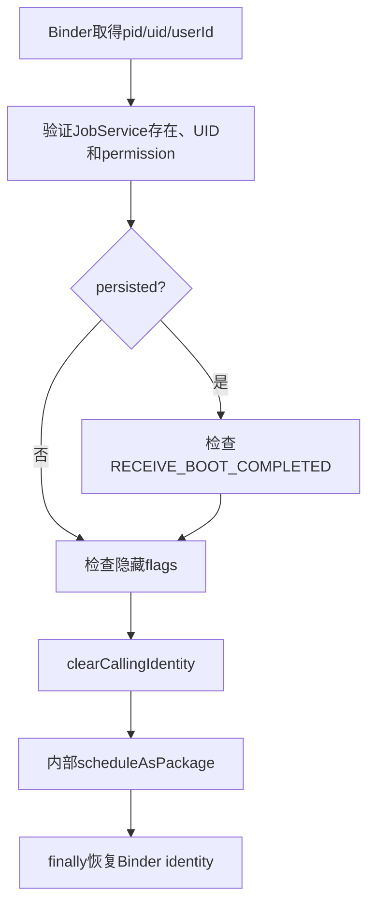
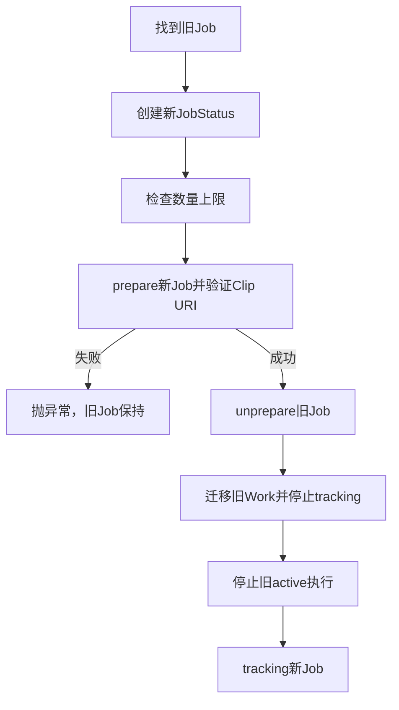
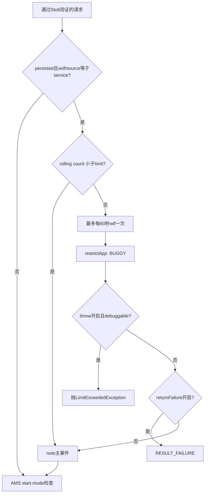
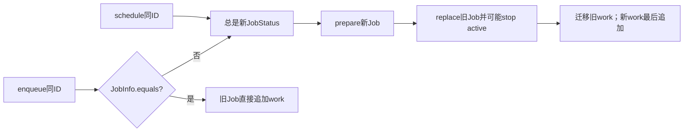
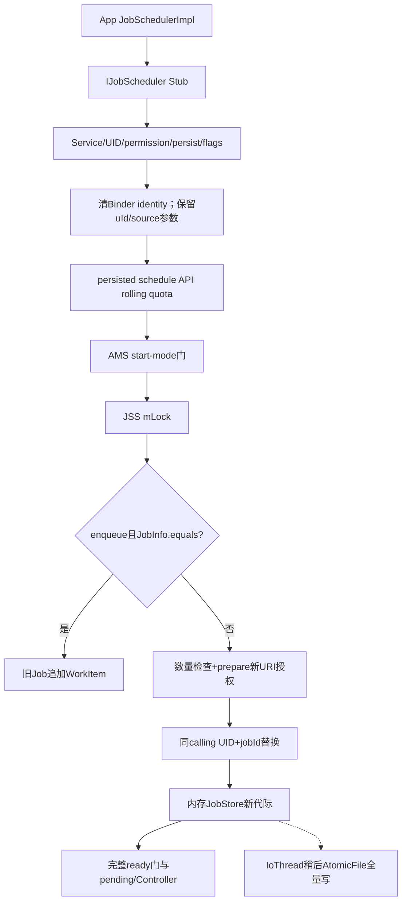

# 139 Android JSS：schedule API 配额、权限与 Replacement

> 源码版本：Android 11 / API 30 / `android-11.0.0_r48`  
> 学习方式：macOS 只读源码，不要求编译、不要求连接设备  
> 前置章节：第 121、130、133、135、138 章

---

## 1. 本章解决什么问题

调用 `JobScheduler.schedule()` 看起来只是“放入一个任务”，实际会依次经过 Binder 身份、Service 合法性、
persist 权限、隐藏 flag、API 调用频率、后台启动模式、任务数量、URI 授权和同 ID 替换。

本章逐行回答：请求在哪一层失败、旧 Job 是否还在、为什么同一个 jobId 既可能平滑入队也可能打断执行。

---

## 2. 先记住总公式

```text
客户端JobInfo
  → IJobScheduler Binder
  → Stub按真实calling uid验权
  → clearCallingIdentity
  → JSS内部策略与配额
  → mLock内prepare/replace/track
  → ready检查
```

“清除 Binder 身份”发生在权限检查之后；它不是绕过调用方权限，而是让后续 system_server 内部调用不再
错误携带 App 身份。

---

## 3. 源码地图

```text
frameworks/base/apex/jobscheduler/framework/java/android/app/JobSchedulerImpl.java
frameworks/base/apex/jobscheduler/framework/java/android/app/job/IJobScheduler.aidl
frameworks/base/apex/jobscheduler/framework/java/android/app/job/JobScheduler.java
frameworks/base/apex/jobscheduler/framework/java/android/app/job/JobInfo.java
frameworks/base/apex/jobscheduler/service/java/com/android/server/job/JobSchedulerService.java
frameworks/base/apex/jobscheduler/service/java/com/android/server/job/controllers/JobStatus.java
frameworks/base/services/core/java/com/android/server/utils/quota/CountQuotaTracker.java
frameworks/base/services/core/java/com/android/server/utils/quota/QuotaTracker.java
frameworks/base/core/java/android/os/LimitExceededException.java
```

---

## 4. 三个入口先分开

| 入口 | 普通用途 | 是否允许 persisted | 是否可代包归因 |
|---|---|---:|---:|
| `schedule(job)` | 注册/替换一个 Job | 是，需权限 | 否 |
| `enqueue(job, work)` | 给 Job 追加工作项 | 否 | 否 |
| `scheduleAsPackage(...)` | system 组件代包调度 | 代码未在 Stub 禁止 | 是，需特权 |

后两者不是 `schedule()` 的简单重载；它们走到内部同一方法前，入口检查已经不同。

---

## 5. AIDL 定义的是进程边界

```aidl
int schedule(in JobInfo job);
int enqueue(in JobInfo job, in JobWorkItem work);
int scheduleAsPackage(in JobInfo job, String packageName, int userId, String tag);
```

`in` 表示对象序列化到 system_server。服务端看到的是 Parcel 重建后的 `JobInfo`，不是客户端那一个 Java 对象。

---

## 6. 客户端包装层非常薄

```java
public int schedule(JobInfo job) {
    try {
        return mBinder.schedule(job);
    } catch (RemoteException e) {
        return JobScheduler.RESULT_FAILURE;
    }
}
```

`JobSchedulerImpl` 只把 `RemoteException` 转成 `RESULT_FAILURE`。

---

## 7. 哪些异常会回到 App

服务端抛出的 `IllegalArgumentException`、`SecurityException`、`IllegalStateException` 或
`LimitExceededException` 会通过同步 Binder 异常协议回到客户端；这里没有捕获它们。

因此 API 返回值和 Java 异常是两条失败通道，不能只检查返回值而忽略异常。

---

## 8. schedule 入口的检查顺序



任何入口验证失败，都还没有进入内部配额或 replacement。

---

## 9. JobService 必须真实存在

`enforceValidJobRequest()` 用 `IPackageManager.getServiceInfo()` 查询组件，并同时匹配 direct-boot aware 与
unaware Service。查不到直接抛 `IllegalArgumentException`。

这防止把任意类名或 Activity 当成 JobService。

---

## 10. Service 所属 UID 必须等于调用 UID

```java
if (si.applicationInfo.uid != uid) {
    throw new IllegalArgumentException(...);
}
```

普通 App 不能用自己的 Binder 身份调度另一个 UID 的 JobService。共享 UID 包可能拥有相同 UID，源码注释也
明确允许这种情形。

---

## 11. Manifest permission 是反向保护

Service 必须声明：

```xml
android:permission="android.permission.BIND_JOB_SERVICE"
```

源码比较 `ServiceInfo.permission` 是否精确等于 `JobService.PERMISSION_BIND`。它保护 Service 不被普通调用方
直接 bind；不是 App 调用 `schedule()` 时需要主动申请的普通权限。

---

## 12. PackageManager RemoteException 为什么被忽略

catch 注释写着 PM 与 JSS 同在 system_server，正常不会跨进程失败。这里忽略的是理论上的 Binder 接口异常，
不是忽略“组件不存在”等业务失败。

理解系统代码时要区分接口形式上的 RemoteException 与真实部署进程边界。

---

## 13. persisted Job 为什么需要开机权限

```java
checkPermission(RECEIVE_BOOT_COMPLETED, pid, uid)
```

persisted Job 会在重启后恢复，效果接近“开机后仍可运行”。Android 11 因而要求 App 声明并获得
`RECEIVE_BOOT_COMPLETED`。

---

## 14. 这里抛的是 IllegalArgumentException

没有持有开机权限却请求 `setPersisted(true)`，r48 代码抛 `IllegalArgumentException`，不是
`SecurityException`。语义可以争论，但读故障堆栈必须以当前源码为准。

---

## 15. persisted 权限结果按 UID 缓存

```java
private final SparseArray<Boolean> mPersistCache = new SparseArray<>();
```

第一次检查后，true/false 都写入缓存。后续相同 UID 不再询问 Context 权限系统。

---

## 16. 缓存没有看到失效路径

对 r48 全文件搜索，`mPersistCache` 只在定义和 `canPersistJobs()` 中出现；包变化/移除接收器没有清它。

所以同一 UID 在 system_server 生命周期内发生权限状态变化时，缓存可能继续使用旧结论。这是实现边界，
不是建议依赖的稳定行为。

---

## 17. 为什么不能夸大 UID 重用风险

卸载重装通常会由包管理器重新分配 UID，但“通常”不等于缓存代码具备正确失效。更准确的结论是：

> 缓存键只有 UID，r48 JSS 自身没有包变更失效机制；最终影响还取决于 UID 分配和权限变更场景。

---

## 18. enqueue 明确禁止 persisted

```java
if (job.isPersisted()) {
    throw new IllegalArgumentException("Can't enqueue work for persisted jobs");
}
```

原因也可从数据模型理解：`JobWorkItem` 队列与 Intent/URI grant 不会写入 jobs.xml，重启后无法可靠恢复。

---

## 19. enqueue 的 work 不能为 null

服务端显式抛 `NullPointerException("work is null")`。这发生在 flag 验证与内部调度之前，所以不会创建 Job、
不会计数内部 persisted API 配额，也不会影响旧 Job。

---

## 20. FLAG_WILL_BE_FOREGROUND 的权限门

Job 带 `FLAG_WILL_BE_FOREGROUND` 时，调用方必须拥有隐藏的 `CONNECTIVITY_INTERNAL`。

普通三方 App 无法用它声明自己“即将前台”来穿透 Doze/网络策略。

---

## 21. FLAG_EXEMPT_FROM_APP_STANDBY 更严格

只有 `Process.SYSTEM_UID` 可设置，否则抛 `SecurityException`。这不是“有某个 manifest permission 即可”，
源码直接比较 UID。

---

## 22. 周期 Job 携带 exempt flag 的特殊边界

如果 SYSTEM_UID 给周期 Job 设置 exempt flag，r48 只 `Slog.wtf()`，没有 throw 或 return。

所以 wtf 表示严重违反设计预期，但本段代码仍让请求继续。不要把所有 wtf 都解释成控制流终止。

---

## 23. 为什么先验权再 clearCallingIdentity

如果先 clear，`Binder.getCallingUid()`/权限检查看到的会是 system_server 自己，普通 App 就可能错误获得系统权限。

正确顺序是先保存真实 pid/uid并完成入口安全检查，再清身份执行内部服务调用。

---

## 24. finally 恢复身份是硬要求

```java
long ident = Binder.clearCallingIdentity();
try {
    return ...;
} finally {
    Binder.restoreCallingIdentity(ident);
}
```

即使内部抛配额异常、URI 授权异常或数量异常，Binder 线程也会恢复原身份，避免污染该线程处理的下一笔事务。

---

## 25. scheduleAsPackage 是特权入口

它要求 `packageName != null` 且调用者持有 `UPDATE_DEVICE_STATS`。用途是 system 组件替某个业务包调度，并将
待机桶、电量等归因给 source package。

---

## 26. 它没有复用普通 Service 验证

Stub 的 `scheduleAsPackage()` 没调用 `enforceValidJobRequest()`，也没调用 `canPersistJobs()`。

这是特权 API 的信任边界：拥有 `UPDATE_DEVICE_STATS` 的平台调用方承担构造正确 JobInfo 的责任；不能把普通
App 入口的限制自动套到它身上。

---

## 27. scheduleAsPackage 仍验证隐藏 flag

它调用 `validateJobFlags(job, callerUid)`，所以代包归因并不改变 flag 的权限主体：判断的仍是实际 Binder 调用者。

source package 不会因为被代调度而获得系统 flag 权限。

---

## 28. calling UID 与 source package 从此分叉

内部参数含义：

```text
uId         = 实际调用特权API的UID，也是JobStore的calling UID
packageName = 被归因的source package
userId      = source user
servicePkg  = JobService组件包
```

后续数量上限、Job 唯一键、配额归因和 ready 双用户门会使用不同字段。

---

## 29. 内部 scheduleAsPackage 的第一道是 API 配额

配额条件不是所有 schedule 调用，而是：

```java
job.isPersisted()
        && (packageName == null || packageName.equals(servicePkg))
```

即 persisted 且由 App 自己调度，或代包名恰好等于 JobService 包。

---

## 30. 哪些请求不进这只计数器

```text
普通非persisted schedule
所有合法enqueue（因为enqueue禁止persisted）
source package与service package不同的特权代包schedule
入口验证就已失败的请求
```

公开文档说高频调用会被 throttle；本章描述的是 r48 这段具体实现，不把文档概述错误扩大成“所有调用都计数”。

---

## 31. 配额账户的三元组

`CountQuotaTracker` 按 userId、packageName、tag（UPTC）记录事件。JSS 使用 source user 与解析后的 `pkg`，tag 是
固定的 `.schedulePersisted()`。

所以它不是按 calling UID 全局计数。

---

## 32. 默认配额是 250 次/60 秒

```java
DEFAULT_API_QUOTA_SCHEDULE_COUNT = 250;
DEFAULT_API_QUOTA_SCHEDULE_WINDOW_MS = MINUTE_IN_MILLIS;
```

DeviceConfig 风格常量能动态解析，但计数下限被 `Math.max(250, configured)` 固定为 250，不能配置得更低。

---

## 33. 时间窗口还有底层钳位

`CountQuotaTracker.setCountLimit()` 把窗口夹在 30 秒到 30 天之间。JSS 解析到的窗口即使小于 30 秒，Tracker
实际也会使用 30 秒。

诊断时应看 Tracker dump 的最终值，而不只看配置字符串。

---

## 34. “250 次”边界怎样算

Tracker 的判断是：

```java
return stats.countInWindow < stats.countLimit;
```

第 250 次调用开始前看到 249，仍在 quota；记录第 250 个事件后变成 out-of-quota，但该调用已经继续。
第 251 次在前置检查时才进入超额分支。

---

## 35. 这是滚动窗口，不是整分钟清零

事件时间存入 `LongArrayQueue`，每个旧事件在“发生时间 + window”后离开窗口。

例如 10:00:30 到 10:01:29 的事件会一起影响 10:01:29 的判断，不按 10:01:00 整点清空。

---

## 36. 计数器使用 elapsed realtime

`noteEvent()` 读取 `elapsedRealtime`。改系统墙上时间不会重置或延长一分钟配额；重启会清失内存事件历史。

这与 JobStore persisted Job 跨重启恢复是完全不同的持久性层级。

---

## 37. API 配额与执行配额不是一回事

| 机制 | 限制什么 | 主要对象 |
|---|---|---|
| JSS `mQuotaTracker` | 高频 persisted schedule API | 调用事件次数 |
| `QuotaController` | 后台 Job 实际运行预算 | 时长/Job/Session/rate |
| `MAX_JOBS_PER_APP` | 同时注册的 Job 个数 | JobStore 记录 |

三者都叫 quota/limit，但键、时钟、后果完全不同。

---

## 38. 超额先做一条限频 wtf

第二个 Tracker category 的限制是 1 次/60 秒。只有它仍在 quota 时才 `Slog.wtf()` 并记一次事件。

这只抑制重复日志，不解除主配额，也不代表一分钟内只处理一次超额请求。

---

## 39. 超额会把 App 标记为 buggy

```java
mAppStandbyInternal.restrictApp(
    pkg, userId, REASON_SUB_FORCED_SYSTEM_FLAG_BUGGY);
```

这是 App Standby 限制动作，后续可通过待机桶/后台策略间接影响 Job 执行；它不是当前调用必然立即失败的同义词。

---

## 40. 默认只有 debuggable App 抛异常

`API_QUOTA_SCHEDULE_THROW_EXCEPTION` 默认 true，但源码还要求 `FLAG_DEBUGGABLE`。满足时抛
`LimitExceededException`，该类继承 `IllegalStateException`。

生产包默认不会因为这个开关直接抛异常。

---

## 41. 默认也不返回 failure

`API_QUOTA_SCHEDULE_RETURN_FAILURE_RESULT` 默认 false。因此非 debuggable 生产 App 超额后，默认路径会：

```text
打限频日志 → restrictApp → 继续记事件 → 继续调度
```

“throttle”在这里主要体现为限制 App，而非硬拒绝这一笔请求。

---

## 42. 两个开关的分支矩阵

| throw开关/包 | returnFailure | 当前调用结果 |
|---|---:|---|
| true + debuggable | 任意 | 先抛 `LimitExceededException` |
| true + non-debuggable | true | 返回 failure |
| false | true | 返回 failure |
| false，或non-debuggable | false | 继续调度 |

无论哪个分支，`restrictApp()` 已在异常/return 之前发生。

---

## 43. 被抛出或提前返回的请求不追加主事件

主 `noteEvent(.schedulePersisted())` 位于异常与 return-failure 分支之后。若当前调用在超额分支直接离开，主事件
不会再增加；但是否超额是由此前事件已经达到 limit 决定的。

继续调度的生产请求则会继续追加事件。

---

## 44. 配额发生在 start-mode 检查之前

符合条件的 persisted 请求先经过并记录 API quota，随后才问 AMS：

```java
isAppStartModeDisabled(uId, servicePkg)
```

因此一个最终因后台启动模式返回 failure 的合法请求，仍可能计入 API 调用事件。

---

## 45. 无效 Service 请求不计数

普通入口的 Service/UID/permission/persist 权限/flag 检查都在调用内部方法之前。它们失败时，API Tracker 根本
没有看到请求。

这说明“尝试次数”准确说是通过 Stub 验证后的、符合 persisted 条件的内部请求次数。

---

## 46. debuggable 缓存本应按包区分

JSS 查询 `ApplicationInfo.FLAG_DEBUGGABLE` 后放到：

```java
final ArrayMap<String, Boolean> mDebuggableApps
```

特权 `scheduleAsPackage()` 的 `packageName` 非空时，键通常能区分包。

---

## 47. r48 普通 schedule 的 null-key 缺口

普通 App 进入内部方法时 `packageName == null`。代码虽然用解析后的 `pkg` 查询 PM，却执行：

```java
mDebuggableApps.put(packageName, isDebuggable); // key为null
isDebuggable = mDebuggableApps.get(packageName);
```

`ArrayMap` 支持 null key，所以第一个超额普通 App 的 debuggable 结果会占据全局 null key。

---

## 48. null-key 会造成跨包误判

后续另一个普通 App 超额时，`containsKey(null)` 已为 true，不再查询它自己的 `ApplicationInfo`，而是复用第一
个 App 的 Boolean。

于是可能出现生产包被当成 debug 包抛异常，或 debug 包被当成生产包不抛异常。这是 r48 源码可直接推出的
缓存键错误。

---

## 49. 包移除也清不掉 null-key

卸载处理调用：

```java
mDebuggableApps.remove(pkgName);
```

普通路径写入的是 null，不是实际包名，所以移除真实 `pkgName` 无法清理该条。通常要等 system_server 重启
或 Tracker 状态不再触发这段查询，不能依赖包卸载修复缓存。

---

## 50. start-mode disabled 是早期软失败

AMS 说该 UID/Service 包不允许启动时，JSS 记录警告并返回 `RESULT_FAILURE`。此时还没有获得 JSS 主锁、没有
构造新 JobStatus，也没有取消旧任务。

因此旧同 ID Job 保留。

---

## 51. RemoteException 的边界

`ActivityManager.getService().isAppStartModeDisabled()` 的 RemoteException 被空 catch。system_server 内部正常
不会发生；若理论上发生，r48 选择继续调度而不是 fail closed。

不要把空 catch 误读成“start-mode结果不重要”。

---

## 52. replacement 的唯一键

进入 `mLock` 后先查：

```java
mJobs.getJobByUidAndJobId(uId, job.getId())
```

唯一性是 calling UID + jobId，不是 source package + jobId，也不是 Service component + jobId。

---

## 53. 普通 App 的直观情形

普通 App 中 calling UID 就是 Service 所属 UID，所以同一个 App 再 schedule 同一 jobId 会找到旧 Job 并替换。

另一个 UID 即使 jobId 数字相同，也位于另一个命名空间。

---

## 54. 代包调度的反直觉情形

特权调用方的多个 source package 若共用同一个 `uId` 和 jobId，会在 JobStore 唯一键上碰撞并替换；source
package 不是第一索引键。

调用 system API 的代码必须自己管理 jobId 命名空间。

---

## 55. enqueue 先尝试快路径

当 `work != null`、旧 Job 存在且 `oldJobInfo.equals(newJobInfo)` 时，JSS 直接：

```java
toCancel.enqueueWorkLocked(work);
toCancel.maybeAddForegroundExemption(...);
return RESULT_SUCCESS;
```

不创建新 JobStatus，不停止正在执行的 Job，也不重新走 Controller tracking。

---

## 56. 为什么 schedule 没有同样快路径

即使新旧 `JobInfo` 字段相同，`schedule()` 的 `work == null`，不会进入 enqueue 快路径，而是构造新 JobStatus 并
做 replacement。

公开 API 也说明 schedule 同 ID 会替换，运行中的 Job 会停止。

---

## 57. JobInfo.equals 比较得很深

它比较 jobId、extras、transient extras、Service、约束、TriggerContentUri、网络、时间、周期、backoff、flags、
优先级等字段。任一被认为不同，enqueue 就退回 replacement 路径。

---

## 58. Bundle 比较有注释警告

源码用 `BaseBundle.kindofEquals()`，并注明 parcel 前后不一定完全正确。API 文档因此建议 enqueue 场景少用复杂
extras/transient extras，避免同样业务内容被判断为 JobInfo 变化。

---

## 59. ClipData 使用对象身份比较

```java
if (clipData != j.clipData) return false;
```

它不做内容相等。Binder 每次传输会重建对象，因此 enqueue 搭配 `setClipData()` 几乎会持续落入“不同 JobInfo”
路径，即使 ClipData 内容相同。

---

## 60. enqueue 快路径的工作项授权

`enqueueWorkLocked()` 会给 WorkItem Intent 中的 URI 创建授权，并把它追加到旧 Job 的 pendingWork。若旧 Job 正
在执行，应用下一次 `dequeueWork()` 可直接拿到新项。

这就是 API 所说“给正在运行 Job 追加工作”的优化。

---

## 61. 不同 JobInfo 的 enqueue 会打断运行

JobInfo 不相等时，会创建 replacement，旧 active Job 收到取消/停止。原 work 队列被迁移，新 work 再追加，
下一代 Job 以后重新执行。

所以 enqueue 并不总是无扰动。

---

## 62. 新 JobStatus 在取消旧任务前创建

```java
JobStatus jobStatus = JobStatus.createFromJobInfo(...);
jobStatus.maybeAddForegroundExemption(...);
```

这个顺序先把输入转换为服务端运行对象，但还没有加入 JobStore。

---

## 63. 前台豁免取 source UID 状态

`maybeAddForegroundExemption()` 依据 source UID 当前 active 状态。普通和代包场景都按业务归因主体，而非简单
按 Binder 调用线程当前身份。

豁免细节已在第 130 章，本章只关注它发生在 replacement 前。

---

## 64. 最大 Job 数只限制普通入口

```java
if (ENFORCE_MAX_JOBS && packageName == null) { ... }
```

注释明确“替别人调度的 Job 不算 per-app cap”。特权代包任务仍占 calling UID 的 JobStore 索引，但
`packageName != null` 让外层跳过上限检查；即使直接调用计数方法，它还会排除 calling/source UID不相等的记录。

---

## 65. 计数按 calling UID

`mJobs.countJobsForUid(uId)` 从 calling UID 的集合中统计，但还要求 `job.getUid() == job.getSourceUid()`；也就是只数
该 UID 为自己调度的 Job，不数它代其他 source UID 调度的记录，也不是只数 persisted。

普通 App 中 calling/source UID相等，所以 persisted/nonpersisted、ready/waiting/active Job 都在这张注册表中计数。

---

## 66. r48 的比较符号存在 off-by-one

```java
if (countJobsForUid(uId) > MAX_JOBS_PER_APP) throw ...;
```

常量是 100，但在添加前只检查 `> 100`。已有 100 个时，第 101 个不同 jobId 仍获准；已有 101 个时，第 102
次才抛 `IllegalStateException`。

---

## 67. 这也影响 replacement

数量检查没有先排除 `toCancel`。当 UID 已有 101 个记录时，普通 `schedule()` 即使只想替换其中一个，也会在
取消旧 Job 前抛异常。

旧任务仍然保留，但 App 也无法通过普通 replacement 把数量降下来；只能 cancel 后再 schedule。

---

## 68. enqueue 快路径可绕过这个困境

相同 JobInfo 的 enqueue 在构造 JobStatus与数量检查之前已经 return，所以即便注册数处于 101，它仍可给旧 Job
追加 work。

JobInfo 一旦被判断不同，就会落入上限异常。

---

## 69. 数量异常也不会伤害旧 Job

最大数检查发生在 `prepareLocked()` 与 `cancelJobImplLocked()` 之前。抛出时旧 Job 仍在 JobStore、Controller、
pending/active 状态都没有被 replacement 改动。

这是失败原子性中最重要的一条。

---

## 70. prepareLocked 做什么

新 JobInfo 若带 ClipData，`JobStatus.prepareLocked()` 调用 `GrantedUriPermissions.createFromClip()`，以 source UID/
package/user 申请临时 URI grant。

它把“将来 JobService 能读取 URI”提前变成受检查的系统资源。

---

## 71. prepare 可能抛 SecurityException

调用方没有权把某个 URI 授给 JobService 时，grant 创建会失败。源码注释明确此处可能抛 `SecurityException`。

因为旧任务尚未取消，这类失败同样保留旧 Job。

---

## 72. replacement 的安全排序



危险输入验证尽量放在不可逆替换之前。

---

## 73. cancelJobImplLocked 先撤旧 ClipData 授权

```java
cancelled.unprepareLocked();
```

旧 JobInfo 级 `uriPerms` 被 revoke。WorkItem 自己的授权不在这里直接撤掉，因为 replacement 还要迁移工作队列。

---

## 74. WorkItem 迁移顺序

`old.stopTrackingJobLocked(incoming)` 先把旧 executingWork 交给新 Job 的 pendingWork，再追加旧 pendingWork。

执行中的未确认工作原本在队首，replacement 后仍优先重投，避免被后来排队的 work 插队。

---

## 75. 新传入 work 最后追加

replacement tracking 完成后才调用：

```java
jobStatus.enqueueWorkLocked(work);
```

最终顺序是：旧 executing → 旧 pending → 本次新 work。deliveryCount/workId 等迁移细节见第 133 章。

---

## 76. 旧 pending 队列条目被移除

`cancelJobImplLocked()` 从 `mPendingJobs` 删除旧对象，并通知 `JobPackageTracker.noteNonpending()`。

新 Job 随后独立执行完整 ready 判断，不能继承“旧对象当时已经 pending”的结论。

---

## 77. 旧 active Job 进入停止流程

JSS 用旧 Job 的 calling UID + jobId 找正在运行的 `JobServiceContext`，调用：

```java
cancelExecutingJobLocked(REASON_CANCELED, reason)
```

应用可能尚在执行 `onStopJob()`，而新 JobStatus 已经可以被注册。这是代际重叠，不是两份同时合法执行。

---

## 78. replacement 不是同步数据库事务

JSS 主锁保证核心内存操作的顺序，但：

```text
JobService stop回调是异步的
persisted jobs.xml写入是IoThread防抖异步的
Controller还会处理后续状态消息
```

所以“replace 已返回成功”不等于旧进程回调和磁盘写入此刻都已完成。

---

## 79. JobStore 的最终内存状态

旧记录被 `remove()`，新记录由 `startTrackingJobLocked()` 的 `mJobs.add()` 加入。对同 UID+jobId，锁内操作完成后
权威内存表指向新 JobStatus。

后续查询 `getPendingJob()` 返回的是新 JobInfo。

---

## 80. persisted 替换如何落盘

旧 persisted 删除和新 persisted 添加都可能请求异步写；2 秒防抖后 JobStore 对当时 persisted 集合做全量快照。

因此磁盘无需依赖“先写删除、再写新增”两笔事务日志，最终全量文件应收敛到新代际。

---

## 81. persisted 改成 nonpersisted

旧 persisted Job 被移除时会触发写回，新 Job 不进入 persisted 快照。磁盘下一次全量写会删掉旧记录，内存仍保留
新的 nonpersisted Job。

若 system_server 在异步写前异常重启，旧磁盘快照仍可能被恢复；这是第 135 章讨论的异步耐久窗口。

---

## 82. nonpersisted 改成 persisted

新 Job 进入 JobStore 后触发 persisted 写回。普通 App 在更早的 Binder Stub 已通过
`RECEIVE_BOOT_COMPLETED`，特权 `scheduleAsPackage()` 则不走这项入口检查。

成功返回到真正 AtomicFile 提交之间仍有短暂窗口。

---

## 83. replacement 会重置 enqueueTime

`startTrackingJobLocked()` 给新 JobStatus 写入当前 `elapsedRealtime`。它会以新请求时间参与 pending FIFO 比较，
不会继承旧 Job 的 enqueueTime。

但旧 WorkItem 的工作顺序仍通过队列迁移保留，这两种“顺序”不要混淆。

---

## 84. Controller 收到 old/new 交接

停止旧 tracking 时 Controller 获得 `incomingJob`；启动新 tracking 时又获得 `lastJob`。例如
ContentObserverController 可借此避免同 URI replacement 的观察空窗。

不同 Controller 是否复用状态要读各自实现，不能假定 JobStatus 所有 satisfied bit 原样继承。

---

## 85. 新 Job 要重新过 ready 门

完成 replacement 后调用 `isReadyToBeExecutedLocked(jobStatus)`。若完整门通过，才进入 `mPendingJobs` 并尝试
分配槽位；否则只让 Controller 评估/跟踪状态。

schedule 成功只表示注册成功，不表示立即执行。

---

## 86. 零 deadline 为什么立即检查

源码注释特别强调 deadline 为 0 的 Job：如果它已经 ready，要在返回前尽快进入 pending并开始持有执行所需
WakeLock 的路径。

这仍受第 138 章完整外部门和并发槽位约束，不等于同步调用 JobService。

---

## 87. replacement 时旧停止、新 pending 可并行推进

旧 context 的 stop 是状态机消息/回调，新 Job 注册与 ready 判断在 JSS 锁内继续。并发管理还要避免相同逻辑
Job 真的同时开始执行。

观察日志时可能短暂同时看到 old STOPPING 与 new registered/pending，这是正常代际交接窗口。

---

## 88. replacement 后抛错是否可能

源码把主要可预期异常——数量和 URI grant——放在取消旧 Job 前。但取消/Controller/JobStore tracking 没有包在一
个可回滚事务中，也没有 catch 后恢复旧 Job 的代码。

所以准确说是“对主要输入错误保持旧任务”，不能宣称对任意 RuntimeException 都具备完整事务回滚。

---

## 89. 失败点与旧 Job 命运总表

| 失败点 | 是否已找/改旧Job | 旧Job结果 |
|---|---|---|
| Service/UID/permission/flag | 未进入内部 | 保留 |
| persisted API硬配额异常/失败 | 未进主锁 | 保留 |
| AMS start mode failure | 未进主锁 | 保留 |
| 最大数量异常 | 已查引用，未取消 | 保留 |
| 新 ClipData grant异常 | 已构造新对象，未取消 | 保留 |
| `cancelJobImplLocked` 之后意外Runtime异常 | 已开始交接 | 无通用回滚保证 |

---

## 90. 返回 RESULT_SUCCESS 真正承诺什么

它表示该请求已被 JSS 接受并完成内存注册/入队操作。它不承诺：

```text
Job立刻运行
约束最终一定满足
进程永不被杀
persisted文件已经fsync提交
业务工作一定只执行一次
```

JobService 和 WorkItem 处理必须保持幂等。

---

## 91. 返回 RESULT_FAILURE 的三个典型来源

在本章路径中可见：API quota 的 return-failure 开关、查不到 debuggable ApplicationInfo、AMS start mode disabled。

Binder 本身 `RemoteException` 也会在客户端包装层变成 failure，但那是通信失败，不代表服务端一定没有接收。

---

## 92. Binder 通信失败有“不确定提交”语义

同步 Binder 通常能明确回包，但若客户端只看到 `RemoteException`，不能仅凭 failure 推断服务端从未改变状态。

健壮代码可用固定 jobId和 `getPendingJob()` 查询最终状态；重复 schedule 会按同 ID replacement 收敛，但要理解
它可能停止一个已运行 Job。

---

## 93. getPendingJob 的名字容易误导

JSS 查询的是 `mJobs.getJobsByUid(uid)`，也就是该 UID 的全部 registered Job，不只内部 `mPendingJobs`。

因此它适合确认“定义是否已注册”，不能证明 Job 正在 pending 队列等待执行。第 138 章已区分三种 pending。

---

## 94. 高频重复 schedule 为什么代价高

即使 JobInfo 相同，schedule 仍会：

```text
构造新JobStatus
prepare URI
撤旧授权/迁移work
Controller停止与重新跟踪
可能停止active Job
可能触发JobStore异步写
```

所以不要把 schedule 当成无代价的“刷新状态”心跳。

---

## 95. 推荐的应用侧更新策略

只有调度条件真正变化时才 schedule；批量小工作优先用适合的队列模型；使用稳定 jobId；业务落库保存进度；
在 `onStopJob()`、进程死亡和 WorkItem 重投时保持幂等。

这是从源码成本得出的工程结论，不是让 App 猜系统内部计数器。

---

## 96. 不要用循环重试 RESULT_FAILURE

失败可能表示后台启动模式、配置的硬 quota 或 Binder 故障。立即高频重试不仅不能解除原因，还可能增加 API
事件、触发 buggy restriction或继续 replacement 抖动。

应先识别异常/失败类别，再采用有界退避和状态查询。

---

## 97. 调度频率配额的完整流程图



注意第 250 次 `noteEvent()` 后已经 out-of-quota；下一次前置判断才走下方超额分支。

---

## 98. schedule 与 enqueue 对照图



这张图是理解“为什么 enqueue 有时打断、有时不打断”的核心。

---

## 99. 线程与锁边界

```text
App线程：调用JobSchedulerImpl
system_server Binder线程：Stub验证、内部schedule主体
mLock：JobStore/JobStatus/pending/Controller核心变更
IoThread：稍后写jobs.xml
JSS Handler/JobServiceContext：稍后推进执行与停止
App主线程：最终JobService回调
```

Binder Stub 并不会先切到 JSS Handler 再注册，主体在 Binder 调用线程中同步执行。

---

## 100. 锁内外为什么这样切

Service/权限、API quota与 AMS start-mode检查放在主锁外，避免长时间占用 JSS 全局锁；JobStore唯一性、replace、
Controller交接与 pending操作放在锁内，维持核心状态一致。

不过 `prepareLocked()` 内会进入 URI grant 系统，这也是需要留意的锁内跨服务成本。

---

## 101. Binder identity 与 JSS 参数身份不能混为一谈

clear identity 后，内部 Binder 调用以 system_server 身份执行；但 JSS 已把真实 `uId`、source package/user作为普通
参数传入 JobStatus。

权限执行身份和业务归因身份由此分离。清 Binder identity 不会把任务所有者改成 SYSTEM_UID。

---

## 102. 普通 schedule 场景推演

```text
uid=10123，已有jobId=7正在运行
新JobInfo仍是id=7，网络条件从ANY改成UNMETERED
```

Stub 验证通过；数量未超；新 Job prepare；旧任务被 cancel reason停止；新 Job取代注册表记录并重新按
UNMETERED约束等待。schedule 返回成功不代表旧 `onStopJob()` 已完成。

---

## 103. enqueue 快路径场景推演

```text
已有jobId=8 active
新调用使用字段相等JobInfo，work非null且URI授权合法
```

`equals=true` 后直接把 work 追加到旧 Job。当前执行不停止，Service可继续 dequeue；不会刷新 Job 的
enqueueTime，也不会重新跟踪 Controller。

---

## 104. enqueue 慢路径场景推演

同样是 jobId=8，但新 JobInfo 改了 extras，或带一次新 Parcel 重建的 ClipData。`equals=false`，创建 replacement，
旧 executing/pending work迁到新 Job，新 work最后追加，旧 active执行被停止。

业务若只想传每项数据，应放进 JobWorkItem，而不是每次改变 JobInfo定义。

---

## 105. 第 251 次 persisted schedule 推演

假设同一 source package 在滚动 60 秒内已记录 250 个事件：

```text
isWithinQuota=false
→ 限频wtf
→ restrictApp(BUGGY)
→ debug包默认抛LimitExceededException
→ 生产包默认继续并记录第251个事件
```

生产包“本次仍成功”不代表没有被 throttle，限制效果会从 App Standby 路径体现。

---

## 106. 101 个 Job 的边界推演

```text
已有99个 → 第100个允许
已有100个 → 第101个仍允许
已有101个 → 下次普通非快路径schedule抛IllegalStateException
```

这是 r48 `>` 实现推导，不应写成 Android 所有版本的 API 保证；后续版本可能修正比较符号。

---

## 107. 三层身份手算

特权 UID 1000 调用：

```text
service = com.android.providers.downloads/.JobService
source package = com.example.reader，source user=10
```

Binder flag权限按1000判断；JobStore唯一键/active匹配按1000+jobId；待机/部分配额与前台状态按 reader/user10
归因；第 138 章完整门还要求 calling user0 与 source user10 都 started。

---

## 108. macOS 只读练习一：画入口安全链

```bash
sed -n '2550,2715p' \
  frameworks/base/apex/jobscheduler/service/java/com/android/server/job/JobSchedulerService.java
```

标出真实 calling identity 最后一次被使用的位置，以及三个入口各自缺少/新增的检查。

---

## 109. macOS 只读练习二：验证客户端异常边界

```bash
sed -n '25,90p' \
  frameworks/base/apex/jobscheduler/framework/java/android/app/JobSchedulerImpl.java

sed -n '1,70p' \
  frameworks/base/core/java/android/os/LimitExceededException.java
```

解释为什么 RemoteException 变 failure，而 LimitExceededException 会作为运行时异常到达 App。

---

## 110. macOS 只读练习三：手算 quota

```bash
sed -n '990,1070p' \
  frameworks/base/apex/jobscheduler/service/java/com/android/server/job/JobSchedulerService.java

sed -n '180,245p' \
  frameworks/base/services/core/java/com/android/server/utils/quota/CountQuotaTracker.java
```

分别推演第249、250、251次，并指出异常/return/继续三种分支谁会调用主 `noteEvent()`。

---

## 111. macOS 只读练习四：定位 null-key

```bash
rg -n 'mDebuggableApps|packageName == null|final String pkg' \
  frameworks/base/apex/jobscheduler/service/java/com/android/server/job/JobSchedulerService.java
```

把查询使用的 `pkg` 与 map put/get使用的 `packageName` 画成两列，解释普通入口为何固定为 null。

---

## 112. macOS 只读练习五：验证 100/101 边界

```bash
sed -n '1080,1125p' \
  frameworks/base/apex/jobscheduler/service/java/com/android/server/job/JobSchedulerService.java

sed -n '1215,1245p' \
  frameworks/base/apex/jobscheduler/service/java/com/android/server/job/JobStore.java
```

注意检查在 add 之前、比较符是 `>`、replacement也未减掉旧记录；同时确认计数只包含 calling/source UID相等
的自调度 Job，再写出四种 count的结果。

---

## 113. macOS 只读练习六：读 JobInfo.equals

```bash
sed -n '600,700p' \
  frameworks/base/apex/jobscheduler/framework/java/android/app/job/JobInfo.java

sed -n '105,150p' \
  frameworks/base/apex/jobscheduler/framework/java/android/app/job/JobScheduler.java
```

找出 Bundle 与 ClipData 注释为何直接反映到 enqueue 的执行中断风险。

---

## 114. macOS 只读练习七：追 replacement

```bash
sed -n '1065,1155p' \
  frameworks/base/apex/jobscheduler/service/java/com/android/server/job/JobSchedulerService.java

sed -n '1245,1290p' \
  frameworks/base/apex/jobscheduler/service/java/com/android/server/job/JobSchedulerService.java

sed -n '650,725p' \
  frameworks/base/apex/jobscheduler/service/java/com/android/server/job/controllers/JobStatus.java
```

按 prepare、unprepare、work迁移、JobStore删除/新增、active stop、new work 的顺序编号。

---

## 115. macOS 只读练习八：验证异步落盘

```bash
rg -n 'maybeWriteStatusToDiskAsync|WRITE_DELAY|AtomicFile' \
  frameworks/base/apex/jobscheduler/service/java/com/android/server/job/JobStore.java
```

解释为什么内存 replacement成功与磁盘持久提交不是同一时刻。

---

## 116. 阅读检查题

1. 为什么入口验权必须早于 clearCallingIdentity？
2. `BIND_JOB_SERVICE` 是谁保护谁？
3. persisted Job 为什么需要 `RECEIVE_BOOT_COMPLETED`？
4. r48 API Tracker 到底统计哪些请求？
5. 第250次与第251次有什么差别？
6. 超额生产包为何可能仍返回成功？
7. 三种 quota/limit 如何区分？
8. 为什么普通 schedule 的 debuggable cache会跨包串值？
9. replacement 的唯一键是什么？
10. enqueue 何时不打断 active Job？
11. 最大100个为何实际可能出现101个？
12. 哪些 replacement 失败能确定保留旧 Job？

---

## 117. 常见误解一：schedule 成功等于开始运行

纠正：成功只完成注册。Job 仍要通过自身 constraints、JSS完整 ready门、batching与并发槽位，进程绑定也可能
随后失败。

---

## 118. 常见误解二：高频配额会拒绝第251次

纠正：debug包默认抛异常；生产包默认先 restrictApp 后继续。只有动态开关要求返回 failure时才硬返回。不要把
一条 API 文档概述替代源码分支矩阵。

---

## 119. 常见误解三：同 jobId schedule 是 no-op

纠正：普通 schedule没有 equals快路径。即使定义相同，它也建立新代际、重新 tracking，并会停止旧 active Job。

---

## 120. 常见误解四：enqueue 永远不打断

纠正：只有旧 Job存在且 `JobInfo.equals()` 为 true 才直接追加。字段变化、复杂Bundle误判或 ClipData引用变化都
会走 replacement并停止旧执行。

---

## 121. 常见误解五：replacement 是磁盘事务

纠正：核心内存交接在 JSS 锁内有序完成，但 JobStore异步全量写、JobService异步stop。它不是数据库式同步提交，
也没有覆盖任意Runtime异常的通用回滚。

---

## 122. 一页复习图



---

## 123. 本章结论

1. 客户端只吞 RemoteException，服务端运行时异常会返回 App；
2. 普通入口先验证 Service存在、同UID和精确 `BIND_JOB_SERVICE`；
3. persisted需要 `RECEIVE_BOOT_COMPLETED`，r48结果按UID缓存且无本地失效路径；
4. hidden flags分别受 CONNECTIVITY_INTERNAL和SYSTEM_UID限制；
5. scheduleAsPackage要求 UPDATE_DEVICE_STATS，但不复用普通Service/persist验证；
6. clearCallingIdentity在验权后，并用finally恢复；
7. r48 API quota只统计特定 persisted self-schedule，默认250次/60秒滚动窗口；
8. 第250次被接受并让账户出额，第251次看到超额；
9. 超额先 restrictApp，debug包默认抛异常，生产包默认继续；
10. API quota、QuotaController执行预算和最大Job数是三套机制；
11. 普通入口的 `mDebuggableApps` 使用null key，存在跨包错误复用；
12. replacement键是calling UID+jobId；
13. schedule同ID总是replacement，enqueue只有JobInfo.equals时平滑追加；
14. ClipData按对象身份比较，易迫使enqueue走replacement；
15. r48最大数用 `> 100`，实际可注册第101个；
16. 数量检查也会挡住101个状态下的replacement；
17. 新Job URI授权在取消旧Job前prepare，主要输入异常会保留旧Job；
18. replacement依次撤旧JobInfo授权、迁移work、移除pending/track、停止active并注册新代际；
19. 旧executing work、旧pending work、新work依次排列；
20. 内存交接有锁，但active stop和jobs.xml写入异步，不是同步磁盘事务。

最值得带走的一句话：

> `schedule()` 不是把一行记录覆盖掉：Android 11 先按真实 Binder 调用者筑起权限门，再按 source 账户执行高频策略，最后在 JSS 锁内用“先准备新资源、再拆旧代际”的顺序替换；但执行停止和持久化仍在异步世界里收敛。

---

## 124. 生成后复读：容易误解处的修订

初稿后重新对照 JobSchedulerImpl、IJobScheduler、JobScheduler、JobInfo、JSS、JobStatus、CountQuotaTracker 与
QuotaTracker，完成以下修订：

1. 把 `RESULT_FAILURE` 与运行时异常分成两条通道；
2. 明确 `BIND_JOB_SERVICE` 是 Service 的反向绑定保护；
3. 记录 persisted权限缓存只有UID键且没有JSS失效路径，但避免夸大UID重用条件；
4. 区分 schedule/enqueue/scheduleAsPackage 的入口检查；
5. 强调 scheduleAsPackage仍按caller校验flags，却不复用普通Service/persist检查；
6. 将公开“高频API”概述收窄到r48实际 persisted条件；
7. 核对CountQuotaTracker严格 `< limit`，修正第250/251次边界；
8. 补出窗口30秒～30天钳位、elapsed时钟与重启清失；
9. 区分API事件计数、QuotaController运行账本和注册数量；
10. 展开wtf限频、restrictApp、debug exception与returnFailure矩阵；
11. 确认异常/early return不执行末尾主noteEvent；
12. 发现普通schedule把debuggable结果写入null key的r48实现缺口；
13. 确认包卸载按真实pkgName删除，不能移除null key；
14. 明确 quota记账早于AMS start-mode，而Stub无效输入更早失败；
15. 把replacement唯一键限定为calling UID+jobId；
16. 分开schedule总替换和enqueue equals快路径；
17. 补出Bundle kindofEquals与ClipData引用比较风险；
18. 核对最大数检查在add前使用 `>`，得出第101个可进入；
19. 补查JobStore计数实现，确认它在calling UID集合中只数calling/source UID相等的自调度记录；
20. 补出101个时普通replacement也会被挡住，但enqueue快路径不经过检查；
21. 确认prepare新ClipData授权早于取消旧任务；
22. 按源码重排unprepare、work迁移、pending移除、active stop与new tracking顺序；
23. 区分JobInfo级URI grant撤销与WorkItem授权迁移；
24. 补出persisted↔nonpersisted替换的异步落盘窗口；
25. 将“事务安全”收窄为主要输入异常保旧，不宣称任意运行时异常可回滚；
26. 将所有练习限定为macOS `sed`/`rg`只读推演，不要求编译。

---

## 125. 下一章

第 140 章继续追取消与清理路径：`cancel()`、`cancelAll()`、包卸载、用户移除、UID idle/restart怎样遍历不同
JobStore索引，怎样撤销WorkItem URI授权、停止active context、通知Controller并触发persisted写回，以及哪些批量
删除路径在 r48 中存在“内存删了但未立即写盘”的边界。
