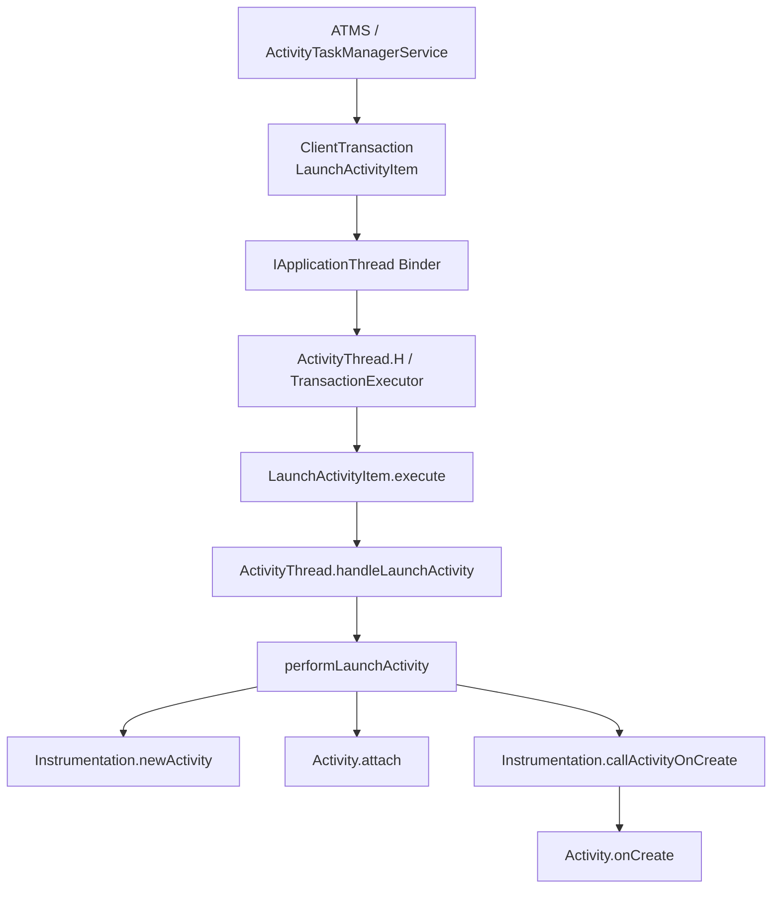
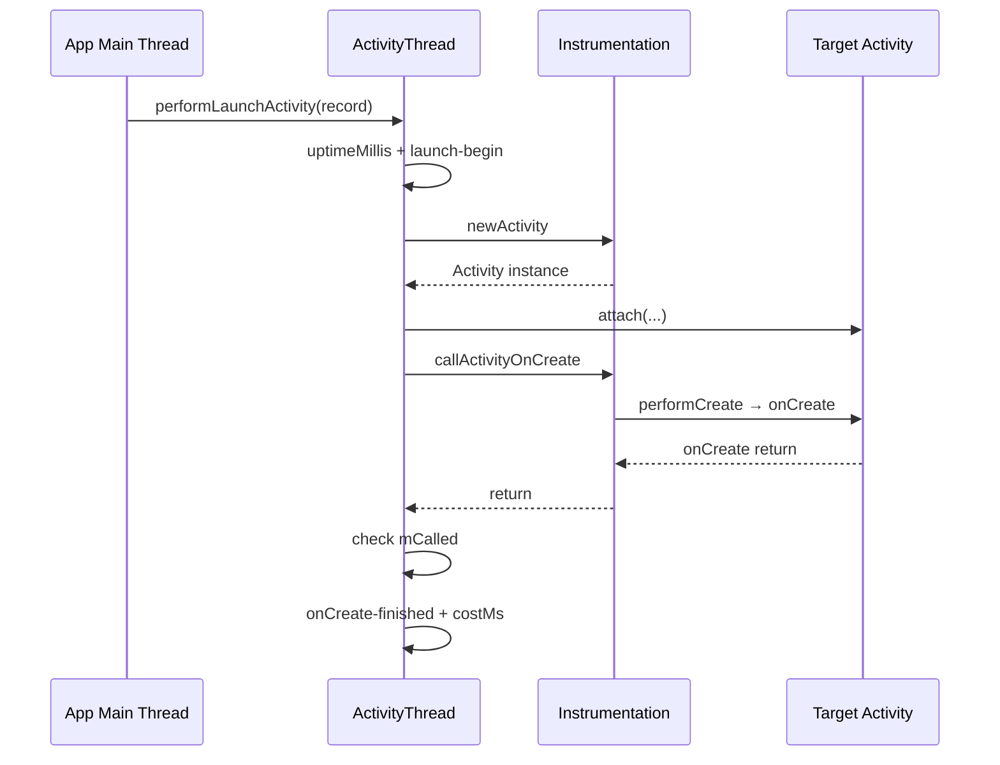
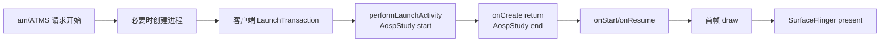
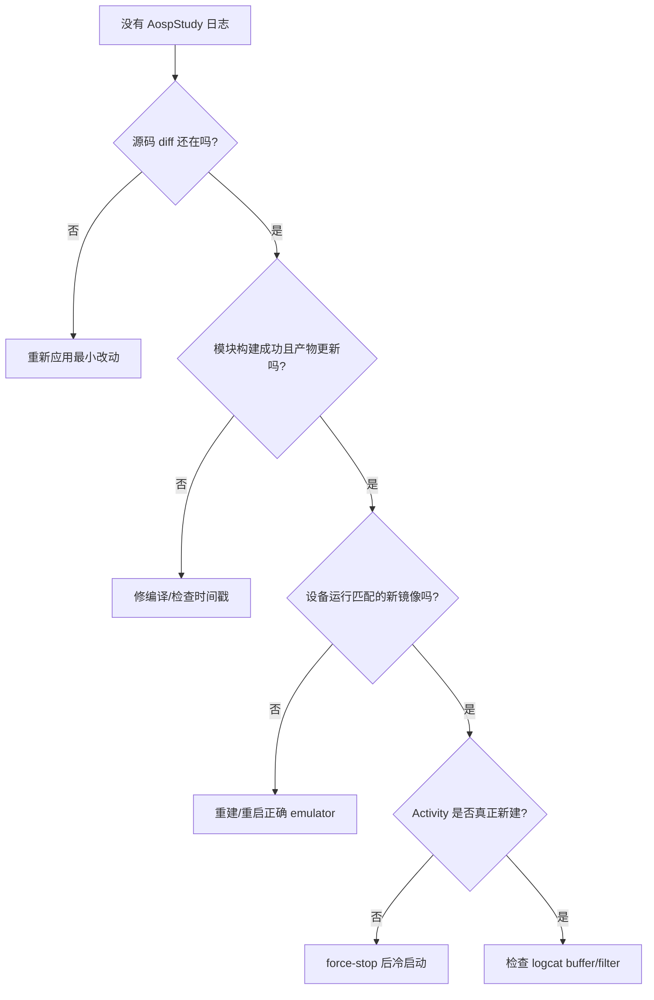
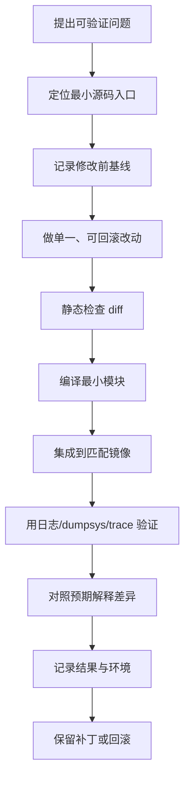
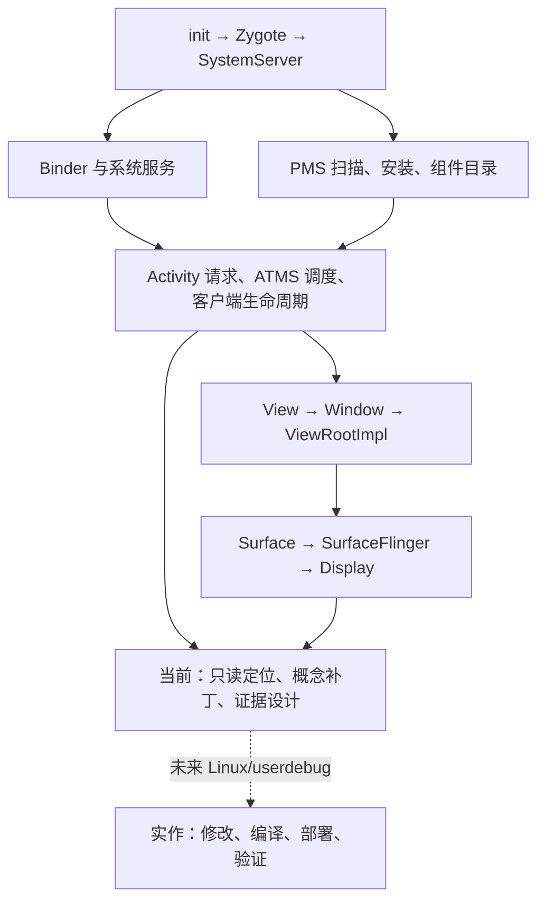

# 14 综合实践：只读推演 Framework 修改（附未来编译验证方案）

> 源码基线：Android 11 / API 30 / `android-11.0.0_r48`。  
> **当前学习模式：macOS 只读推演，不修改 AOSP、不编译、不刷机、不改变任何设备状态。** 本章保留 Linux/userdebug 上的构建与部署知识，只作以后有专用实验环境时的参考；完成本章只需做 A 级的源码定位、补丁推演和证据设计。

## 本章定位

前 13 章主要回答“Android 是怎样工作的”。这一章开始回答：

> 我怎样把理解变成一个可观察、可编译、可验证、可回滚的源码实验？

本章选择一个范围很小但能贯穿多章知识的**纸上实验**：

```text
在 ActivityThread.performLaunchActivity() 中加入 AospStudy 埋点
记录目标 Activity、进程、线程和 onCreate 调用耗时
在 macOS 上只读核对这份补丁的编译作用域与可观测语义
将 framework-minus-apex/Linux userdebug 编译与模拟器验证写成未执行的将来方案
```

这个实验会连接：

- 第 5 章：目标 App 进程来自 Zygote。
- 第 7 章：ATMS 通过 Binder/ClientTransaction 调度客户端。
- 第 8～10 章：Activity 启动与 `performLaunchActivity()`。
- 第 11 章：`onCreate()` 之后 View/Window 才逐步建立。
- 第 13 章：PMS 已为目标组件提供 `ActivityInfo` 和包信息。

## 为什么选择这个修改

一个好的第一次 AOSP 修改应该：

1. 修改点能从前面学过的调用链解释。
2. 不改变系统核心决策，不容易引入功能性故障。
3. 输出容易触发和观察。
4. 编译目标相对明确。
5. 能用同一处改动练习 diff、构建、部署、验证和回滚。

本实验只增加调试日志，不修改生命周期顺序、锁、Binder 参数或返回值。

---

## 1. 当前最终要产出什么

本次不修改文件，所以不会真的产生 AospStudy logcat。完成标准是交付四件可检查的只读成果：

1. 标出 `performLaunchActivity()` 中“onCreate 前”与“onCreate 后”的精确插入点。
2. 写出不应用的概念 diff，并解释为什么它不改变生命周期语义。
3. 写出“日志出现/不出现”各能支持什么结论，不能支持什么结论。
4. 将以下编译、部署、adb 步骤标记为“Linux/userdebug 将来可选，本次未执行”。

如果将来在专用 Linux/userdebug 环境实施修改，启动 Activity 时**预期** logcat 出现类似：

```text
I/ActivityThread: [AospStudy] launch-begin component=com.android.settings/.Settings pid=...
I/ActivityThread: [AospStudy] onCreate-finished component=com.android.settings/.Settings costMs=...
```

它能验证：

- 日志来自目标 App 进程，而不是 `system_server`。
- `performLaunchActivity()` 在目标进程主线程执行。
- `Instrumentation.callActivityOnCreate()` 包住应用 `onCreate()` 调用。
- 冷启动、热启动、Activity 复用产生的日志次数可能不同。

### 实验不证明什么

`costMs` 只测量本次 `performLaunchActivity()` 中从埋点开始到 `onCreate()` 返回附近、基于 uptime 的经过时间。它不等于：

- 整体启动耗时。
- 首帧时间。
- `onResume()` 完成时间。
- 画面真正 present 到屏幕的时间。
- 纯 CPU 执行时间。

完整首帧还要继续经过 Window、ViewRootImpl、HWUI、SurfaceFlinger 和显示链路。

---

## 2. 实验环境分级

### A 级：只读验证

适合暂时无法构建 AOSP：

- 追源码调用链。
- 设计 logcat、am、dumpsys、Perfetto 证据；如果手头已有旧日志/旧 trace，可以只读分析它们。
- 本轮不主动连接、启动、停止或重启任何设备/模拟器。
- 不修改系统镜像。

### B 级：只编译模块

适合先验证改动能通过 Java 编译：

```text
修改 ActivityThread.java
 → m framework-minus-apex
 → 检查产物和增量依赖
```

这证明“源码可以编译”，但不证明设备运行的是新代码。

### C 级：完整镜像验证（将来有专用 Linux 环境时的推荐路线）

```text
使用 userdebug emulator target
 → 编译 systemimage 或完整镜像
 → 启动独立 AVD/模拟器数据目录
 → 验证日志
```

这是真正实施 Framework 改动时的推荐路线，不是当前 macOS 学习的作业。它比直接替换真机 `framework.jar` 更容易恢复。

### D 级：增量 push 系统产物（进阶）

速度更快，但需要：

- `userdebug` 或 `eng` 构建。
- `adb root`、`adb remount` 可用。
- 目标设备与产物必须来自同一套构建。
- 明白 framework boot class path、odex、AVB/dynamic partition 等风险。

第一次实践不推荐直接在主力手机上做 D 级实验。

---

## 3. 开始前的安全边界

### 使用可丢弃环境

优先级：

```text
独立 AOSP Emulator
 > 可恢复测试机
 > 主力设备
```

不要把第一次 Framework 修改部署到存放重要数据的主力设备。

### 不覆盖用户已有改动

执行前先检查：

```bash
cd /Users/ninebot/androidSource
git status --short
git diff -- frameworks/base/core/java/android/app/ActivityThread.java
```

如果文件已有修改，先辨认它们属于谁、是否与本实验重叠。不要使用：

```bash
git reset --hard
git checkout -- 文件
```

这些命令可能删除自己的工作。

### 保存实验补丁

修改完成后可只读导出差异：

```bash
git diff -- frameworks/base/core/java/android/app/ActivityThread.java
```

需要保存时，把 diff 放入自己的笔记/补丁目录；不要假设整个源码树是干净的。

---

## 4. 构建主机检查

当前源码目录：

```text
/Users/ninebot/androidSource
```

当前主机路径表明很可能是 macOS。Android 11 AOSP 的完整构建对主机版本、大小写敏感文件系统、磁盘空间、内存和预编译工具都有要求。

### 推荐条件

- Linux 构建机通常最稳妥。
- 源码位于大小写敏感文件系统。
- 足够磁盘空间；完整源码加 `out` 往往需要数百 GB 预留。
- 16 GB 内存可以尝试，32 GB 以上更舒适。
- 使用源码树自带 JDK/prebuilts，不随意切换系统 Java。

### 检查文件系统大小写

不要在源码目录创建会冲突的测试文件。可以在临时目录验证：

```bash
tmpdir=$(mktemp -d)
touch "$tmpdir/aosp_case_test"
touch "$tmpdir/AOSP_CASE_TEST"
ls -1 "$tmpdir"
```

若只能看到一个实际文件，文件系统可能大小写不敏感。检查完成后删除该明确临时目录。

### 检查空间

```bash
df -h /Users/ninebot/androidSource
```

### 检查源码完整性

```bash
test -f build/envsetup.sh
test -f frameworks/base/core/java/android/app/ActivityThread.java
```

本章不要求完成 B/C/D 任一级；当前做完 A 级即算完成。未来若主动迁移到合适 Linux 环境，再先做 B 级模块编译，然后用可丢弃 userdebug 模拟器完成 C 级验证。

---

## 5. 修改前先用源码回答四问

目标方法：

```text
frameworks/base/core/java/android/app/ActivityThread.java
ActivityThread.performLaunchActivity()
```

### 运行在哪个进程

目标应用进程。

ATMS 位于 `system_server`，但它把 LaunchActivityItem 等事务发送到目标进程的 `IApplicationThread`。ActivityThread 收到后在目标进程执行客户端生命周期。

### 运行在哪个线程

应用主线程。ActivityThread 的 `H` Handler/ClientTransaction 执行链最终调到 `handleLaunchActivity()` 和 `performLaunchActivity()`。

### 输入从哪里来

`ActivityClientRecord r` 包含：

- `Intent`。
- `ActivityInfo`。
- token。
- LoadedApk/packageInfo。
- Configuration。
- saved instance state。
- pending results/intents 等启动上下文。

这些数据来自 system_server 调度与客户端已有状态组合。

### 输出到哪里去

- 反射创建 Activity 实例。
- 创建 Activity Context。
- attach PhoneWindow 等运行环境。
- 调用 `Activity.onCreate()`。
- 把 ActivityClientRecord 放入 `mActivities`。
- 返回 Activity 给后续启动事务处理。

---

## 6. 原始调用链定位



搜索命令：

```bash
rg -n "performLaunchActivity|handleLaunchActivity|callActivityOnCreate" \
  frameworks/base/core/java/android/app/ActivityThread.java

rg -n "class LaunchActivityItem|handleLaunchActivity" \
  frameworks/base/core/java/android/app/servertransaction
```

在修改前，必须能指出埋点在哪两行之间。否则即使日志出现，也不知道它代表哪个阶段。

---

## 7. 设计埋点，而不是随手打印

我们希望回答：

```text
哪个 Activity？
在哪个进程？
是否在主线程？
从 performLaunchActivity 开始到 onCreate 返回花了多久？
```

### 日志标签

复用 ActivityThread 已有 `TAG`，消息增加稳定前缀：

```text
[AospStudy]
```

之后可通过：

```bash
adb logcat -s ActivityThread:I '*:S' | grep AospStudy
```

> 本次只读：这是将来在专用模拟器上的预期观测命令，当前不执行。macOS 已有 `rg` 时可将最后的 `grep AospStudy` 换成 `rg AospStudy`。

### 时间源

使用：

```java
SystemClock.uptimeMillis()
```

它适合测量系统运行期间的间隔，不受用户修改墙上时钟影响。文件已经 import `android.os.SystemClock`，无需新增 import。

### 不打印敏感 Intent

不要直接输出完整 `Intent.toString()`、extras、URI、token 或用户数据。实验只输出 `ComponentName`、pid、线程名和耗时。

### 日志频率

`performLaunchActivity()` 每次真正创建 Activity 时执行。永久保留无条件 INFO 日志会增加噪音，实验结束应移除或改为受 debug flag 控制。

---

## 8. 建议代码改动

在方法开头加入起始时间：

```java
/** Core implementation of activity launch. */
private Activity performLaunchActivity(
        ActivityClientRecord r, Intent customIntent) {
    final long aospStudyStartMs =
            SystemClock.uptimeMillis();

    ActivityInfo aInfo = r.activityInfo;
```

在最终确定 `component` 后输出 begin。要放在 `targetActivity` 别名处理之后：

```java
if (r.activityInfo.targetActivity != null) {
    component = new ComponentName(
            r.activityInfo.packageName,
            r.activityInfo.targetActivity);
}

final String aospStudyComponent = component != null
        ? component.flattenToShortString() : "<unresolved>";
Log.i(TAG, "[AospStudy] launch-begin"
        + " component=" + aospStudyComponent
        + " pid=" + Process.myPid()
        + " thread=" + Thread.currentThread().getName());
```

在 `callActivityOnCreate()` 返回，并通过 `mCalled` 检查后加入结束日志：

```java
if (!activity.mCalled) {
    throw new SuperNotCalledException(...);
}

Log.i(TAG, "[AospStudy] onCreate-finished"
        + " component=" + aospStudyComponent
        + " costMs="
        + (SystemClock.uptimeMillis() - aospStudyStartMs));

r.activity = activity;
```

### import 是否齐全

当前文件已有：

```java
import android.os.Process;
import android.os.SystemClock;
import android.util.Log;
```

仍应通过 `rg` 验证，不凭记忆：

```bash
rg -n "import android.os.Process|import android.os.SystemClock|import android.util.Log" \
  frameworks/base/core/java/android/app/ActivityThread.java
```

### 为什么结束日志放在 mCalled 检查之后

如果 Activity 没有调用 `super.onCreate()`，Framework 会抛 `SuperNotCalledException`。放在检查后，`onCreate-finished` 表示 onCreate 正常返回且满足 Framework 契约。

### 为什么不放在 performLaunchActivity 最末尾

方法后面还要更新 `ActivityClientRecord` 和 `mActivities`。若目标只是测量 `onCreate()` 返回，应紧邻 onCreate 契约检查；若想测整个 `performLaunchActivity()`，才应在 return 前记录，并考虑异常路径。

---

## 9. 改动后的语义图



注意 `costMs` 还包含 newActivity、makeApplication（首次时）、Context、attach、主题等 onCreate 之前的工作。消息叫 `onCreate-finished`，不是 `onCreate-cost`，正是为了避免误导。

若要精确只测 `callActivityOnCreate()`，应在该调用紧前记录另一个时间点，但第一次实验不增加太多变量。

---

## 10. 修改后先做静态检查

### 本次只读如何做“概念 diff”

不要真正编辑 `ActivityThread.java`。在笔记纸上写三个插入块，并给每块标注“插在哪两条现有语句之间”：

```text
块 A：performLaunchActivity 进入后记 uptime
块 B：targetActivity alias 解析后记最终 component
块 C：callActivityOnCreate 返回且 mCalled 检查通过后记日志
```

然后用只读命令证明锚点存在：

```bash
cd /Users/ninebot/androidSource
rg -n 'performLaunchActivity|targetActivity|callActivityOnCreate|mCalled' \
  frameworks/base/core/java/android/app/ActivityThread.java
rg -n 'import android.os.Process|import android.os.SystemClock|import android.util.Log' \
  frameworks/base/core/java/android/app/ActivityThread.java
```

下面的 `git diff`、编译与部署是“若未来实施补丁”的检查清单，当前不应期待 diff 出现 AospStudy。

### 查看最小 diff

```bash
git diff --check
git diff -- frameworks/base/core/java/android/app/ActivityThread.java
```

确认：

- 只有预期文件改变。
- 没有尾随空格。
- 没有误改生命周期控制流。
- 变量作用域覆盖 begin 和 finished 两处。
- 不会在 `component == null` 时调用实例方法。

正常 Activity 启动应能解析出 component，但调试代码不应该把原路径中一次意外的空值变成新的 NPE，因此示例先做 null 检查并保存 `aospStudyComponent`。这也避免 begin 与 finished 两条日志采用不同格式。

### 搜索唯一前缀

```bash
rg -n "AospStudy" frameworks/base/core/java/android/app/ActivityThread.java
```

应该只有两处日志。若更多，确认不是旧实验残留。

### 不要先全量编译

先做最小模块编译，错误反馈更快：

```text
Java 语法/import 错误
 → framework-minus-apex 编译即可发现
镜像集成/启动问题
 → 后续 systemimage 验证
```

---

## 11. 初始化 AOSP 构建环境

> **未来可选，当前不执行：**从本节到第 24 节的 `source/lunch/m/adb root/remount/sync/reboot/force-stop/am start`等命令，要么需要 Linux AOSP 构建主机，要么会改变模拟器/设备状态。只在用户之后明确要求实作、且已准备可丢弃 userdebug 环境时执行。

每个新 shell：

```bash
cd /Users/ninebot/androidSource
source build/envsetup.sh
```

查看可选 target：

```bash
lunch
```

Android 11 常见模拟器 target 可能包括：

```text
aosp_x86_64-eng
aosp_x86_64-userdebug
```

实际以当前源码 `lunch` 列表为准，不要从文档复制一个不存在的产品。

选择 userdebug 示例：

```bash
lunch aosp_x86_64-userdebug
```

检查环境：

```bash
echo "$TARGET_PRODUCT"
echo "$TARGET_BUILD_VARIANT"
echo "$ANDROID_PRODUCT_OUT"
```

预期 variant 是 `userdebug`。不要手工设置这些变量代替 lunch。

---

## 12. 编译最小 Framework 模块

```bash
m framework-minus-apex
```

为什么不是：

```bash
m framework
```

查看 `frameworks/base/Android.bp`：

- `framework-minus-apex` 是安装到设备的 platform framework Java 库。
- 它通过 `stem: "framework"` 生成/安装为 `framework.jar`。
- 名为 `framework` 的模块是给平台应用编译使用的聚合库，`installable: false`。

这是“模块名”和“最终文件名”不同的典型例子。

### 并行度

`m` 会根据构建系统选择并行度。内存紧张时可以：

```bash
m -j4 framework-minus-apex
```

数字按机器调整。过高并行度可能触发 OOM，不一定更快。

### 编译成功不等于部署成功

构建会产生中间 jar 和安装镜像树中的 jar。真正设备使用的是镜像/分区里的文件，并可能涉及 dexpreopt 产物。

检查：

```bash
find "$ANDROID_PRODUCT_OUT" -path '*system/framework/framework.jar' -print
```

不要从 `out/soong/.intermediates` 随便挑一个 jar 推到设备；中间产物可能不是最终安装形态。

---

## 13. 推荐部署：构建并启动独立模拟器镜像

### 编译 system image

```bash
m systemimage
```

更稳妥但耗时更长的第一次构建：

```bash
m
```

完整构建可确保 emulator 所需 kernel、ramdisk、vendor/product 等产物齐全。只有在已有匹配基础镜像时，增量 `systemimage` 才通常足够。

### 启动源码树 emulator

完成 lunch/build 后：

```bash
emulator -wipe-data
```

首次使用 `-wipe-data` 会清空该模拟器数据。确认它是专门的 AOSP 测试实例，不要对需要保留的数据使用。

为了隔离，可指定独立端口和数据目录；具体 emulator 参数以：

```bash
emulator -help
```

为准。

### 等待启动完成

```bash
adb wait-for-device
adb shell getprop sys.boot_completed
```

返回 `1` 才代表 framework 大致完成启动。只看到 adb device 在线不等于 SystemServer 和 Launcher 已 ready。

### 验证构建身份

```bash
adb shell getprop ro.build.fingerprint
adb shell getprop ro.build.type
adb shell getprop ro.build.version.release
```

确认是你刚刚 lunch/build 的 Android 11 userdebug 镜像，而不是另一个正在运行的商业模拟器。

---

## 14. 进阶部署：adb sync 而不是手推单个 jar

已有完全匹配的 userdebug 模拟器时，可尝试：

```bash
adb root
adb remount
adb sync system
adb reboot
```

`adb sync system` 会按构建输出同步 system 分区相关文件，比手动 `adb push framework.jar` 更能保持产物一致。

但仍要注意：

- 可能同步远多于一个文件。
- dynamic partitions/overlayfs 状态因设备而异。
- boot class path 的 jar 与预优化产物不匹配可能启动失败。
- 真机 AVB 和厂商分区兼容性风险更高。

本章不推荐执行：

```bash
adb push .../framework.jar /system/framework/framework.jar
```

除非你已经理解同构建 fingerprint、dexpreopt、文件权限、SELinux、AVB、overlayfs 和恢复路径。

---

## 15. 触发 Activity 冷启动

先清空旧日志：

```bash
adb logcat -c
```

选择系统 Settings：

```bash
adb shell am force-stop com.android.settings
adb shell am start -W \
  -n com.android.settings/.Settings
```

查看实验日志：

```bash
adb logcat -d -s ActivityThread:I '*:S' | grep AospStudy
```

macOS/Linux shell 的引号很重要，`'*:S'` 应作为一个参数传给 logcat。

### 预期字段解释

```text
component：最终 Activity ComponentName
pid：目标应用进程 PID
thread：通常是 main
costMs：从 performLaunchActivity 开始到 onCreate 正常返回附近的 uptime 差
```

对照进程：

```bash
adb shell pidof com.android.settings
```

日志 pid 应与 Settings 目标进程匹配。如果组件声明独立 process，则需按 ActivityInfo 的 processName 对照。

---

## 16. 冷启动、热启动和复用对比

### 冷启动

```bash
adb shell am force-stop com.android.settings
adb shell am start -W -n com.android.settings/.Settings
```

预期通常出现：

- 新进程创建。
- Application 创建。
- Activity 实例创建。
- 两条 AospStudy 日志。

### 再次启动同一 Activity

不 force-stop，重复：

```bash
adb shell am start -W -n com.android.settings/.Settings
```

可能：

- 创建新 Activity 实例，出现日志。
- Task 顶部复用，走 `onNewIntent()`，不进入 `performLaunchActivity()`。
- 因 launchMode/flags/task 状态产生其他行为。

日志没出现不一定是修改失败；先用：

```bash
adb shell dumpsys activity activities
```

判断 Activity 是否真正新建。

### 旋转屏幕

若配置变化导致 Activity 重建，通常再次进入 `performLaunchActivity()`；若 App 自行处理配置变化，则可能不会重建。

这个对比能把第 9、10 章中的 Task、launchMode、ClientTransaction 和生命周期真正连接起来。

---

## 17. 用 am start -W 对照但不要混淆

`am start -W` 输出可能含：

```text
ThisTime
TotalTime
WaitTime
```

它们与 AospStudy `costMs` 的起止边界不同。



因此：

```text
AospStudy costMs
 <或≈> 客户端创建阶段的一部分
am TotalTime
 = 更宽的启动观测区间
首帧/fully drawn
 = 又是不同指标
```

不要为了让数值“对上”而忽略测量边界。

---

## 18. 再用 Perfetto 验证线程和时间

日志适合确认离散事件；trace 更适合观察时间关系。

可以在埋点旁进一步使用 `Trace.traceBegin/traceEnd`，但第一次修改先不扩大范围。即使不改 trace，也可录制：

- `am wm` / ActivityManager、WindowManager 相关 atrace。
- `sched` 线程调度。
- app main thread。
- RenderThread。
- SurfaceFlinger 与 FrameTimeline。

观察：

```text
目标进程何时 fork/attach
 → 客户端 launch transaction
 → main thread onCreate
 → traversal
 → buffer queue
 → present
```

日志时间戳和 Perfetto 使用的时间基准/显示格式可能不同，分析时使用同一次录制与统一时钟，不手工拿墙上时间硬减。

---

## 19. 验证矩阵

| 场景 | 是否预期新进程 | 是否预期 performLaunchActivity | 重点观察 |
|---|---:|---:|---|
| force-stop 后启动 Settings | 是 | 是 | pid、main、costMs |
| 后台切回已有 Activity | 否 | 通常否 | Task 复用 |
| 启动另一个 Activity 类 | 否 | 是 | 同进程不同 component |
| 配置变化触发重建 | 否 | 是 | 新实例、saved state |
| singleTop 顶部复用 | 否 | 否 | onNewIntent |
| 多进程 Activity | 视情况 | 是 | pid/processName 变化 |

“通常”表示实际行为还受 flags、launchMode、Task 当前状态和配置处理影响。

一次综合实践至少覆盖前三行，才能证明你理解日志出现与不出现的原因。

---

## 20. 常见失败一：envsetup/lunch 问题

### `m: command not found`

原因：当前 shell 没有：

```bash
source build/envsetup.sh
```

### lunch target 不存在

不要猜 target。运行：

```bash
lunch
```

或检查产品：

```bash
find device -name AndroidProducts.mk -o -name AndroidProducts.bp
```

### Java 版本错误

优先使用构建系统配置的预编译 JDK。不要先全局修改 `JAVA_HOME`；重新打开 shell、source envsetup，再看构建错误给出的实际 JDK 路径。

### 大小写文件系统错误

若源码位于默认大小写不敏感卷，完整构建可能在相似文件名、生成路径或 repo checkout 时失败。迁移到大小写敏感 APFS volume 或 Linux 文件系统比逐个修错误可靠。

---

## 21. 常见失败二：编译错误

### cannot find symbol

检查：

- import 是否存在。
- 类属于哪个包。
- 当前 Android 11 分支是否有该 API。
- 变量是否超出作用域。

本实验的 `Process`、`SystemClock`、`Log` 已在 ActivityThread 使用，但仍以当前文件为准。

### checkstyle/format 错误

AOSP Java 风格通常是 100 列附近换行、4 空格缩进。参考目标方法周围现有代码，不引入与文件不一致的格式。

### OOM 或 ninja 被杀

- 降低 `-j`。
- 关闭重型应用。
- 增加 swap 只能缓解，不一定高效。
- 确认是真 OOM，不要把所有 `Killed` 都猜成语法错误。

### 磁盘空间不足

用：

```bash
df -h
du -sh out 2>/dev/null
```

不要随意删除整个 out；模块增量构建依赖它。确需清理时先确认目标并接受下次重新构建成本。

---

## 22. 常见失败三：日志没有出现

按这个顺序检查：



具体命令：

```bash
rg -n "AospStudy" frameworks/base/core/java/android/app/ActivityThread.java
stat "$ANDROID_PRODUCT_OUT/system/framework/framework.jar"
adb shell getprop ro.build.fingerprint
adb shell am force-stop com.android.settings
adb logcat -b all -d | grep AospStudy
```

最常见原因不是代码逻辑，而是“编译了 A，运行的是 B”。

---

## 23. 常见失败四：系统无法启动

先不要连续覆盖更多文件。

### 模拟器恢复

最直接：

```bash
emulator -wipe-data
```

如果 system 镜像本身坏了，恢复源码改动后重新构建镜像。

### 查看早期日志

```bash
adb logcat -b all
```

关注：

- zygote Java 异常。
- boot class path 校验。
- dex2oat/odrefresh 问题。
- SystemServer crash loop。
- framework.jar 读取或校验失败。

### 为什么只换 framework.jar 容易出问题

Framework 位于 boot class path，可能同时存在：

- jar。
- boot image/oat/vdex。
- hidden API/compat 配置。
- 与 system image 其他模块的编译期依赖。

使用同一次构建生成的完整镜像，能显著减少不一致。

---

## 24. 回滚实验改动

### 有独立 commit 时

可创建一个反向 commit 或应用保存的反向 patch。不要对共享/有其他改动的工作树直接 hard reset。

### 文件只有本实验改动时

最安全是根据 `git diff` 用编辑补丁删除两条日志和时间变量。再次检查：

```bash
git diff -- frameworks/base/core/java/android/app/ActivityThread.java
```

### 文件还包含其他人的改动时

只移除带 `[AospStudy]` 的几行和 `aospStudyStartMs`，保留其他 diff。

### 验证回滚

```bash
rg -n "AospStudy|aospStudyStartMs" \
  frameworks/base/core/java/android/app/ActivityThread.java
```

应无输出。然后重新编译/镜像验证日志消失。

回滚同样是实验的一部分：能恢复到明确基线，才算真正掌握修改流程。

---

## 25. 将日志升级为更专业的 Trace

完成基础实验后，可做第二版：

```java
Trace.traceBegin(Trace.TRACE_TAG_ACTIVITY_MANAGER,
        "AospStudy#performLaunchActivity:" + component);
try {
    // 原有 launch 逻辑
} finally {
    Trace.traceEnd(Trace.TRACE_TAG_ACTIVITY_MANAGER);
}
```

但不能直接机械包住整个大方法：

- `component` 的赋值时机。
- 多个 catch/return。
- trace begin/end 必须严格平衡。
- trace 名称不能包含敏感或无限长度内容。
- `finally` 结构可能扩大 diff 和改变可读性。

第一次只加 Log，第二次单独设计 Trace，可以让每轮实验只有一个变量。

---

## 26. 将实验延伸到四条系统链路

### 延伸 A：ATMS 系统端

在 `ActivityStarter` 的关键决策点记录：

- callingUid/callingPackage（注意隐私和长度）。
- resolved Activity。
- launchFlags/launchMode。
- reusedTask 或 new Task。

对照客户端 ActivityThread 日志，可测量 Binder 调度前后。但 system_server 日志频率和安全风险更高。

### 延伸 B：View 首次 traversal

在 ViewRootImpl 首次 `performTraversals()` 增加一次性 Trace，连接：

```text
onCreate return
 → resume
 → addView
 → scheduleTraversals
 → first traversal
```

必须限制只记录首帧，否则全系统每帧日志会爆量。

### 延伸 C：Surface 提交

使用现有 atrace/Perfetto 观察 queueBuffer，而不是先在高频 `Surface::queueBuffer()` 无条件打印日志。Native 高频日志可能严重扰动帧时间。

### 延伸 D：PMS Intent resolve

为特定测试 package 增加条件日志，观察 `queryIntentActivitiesInternal()` 候选过滤。不能输出所有 App 的全部查询，否则既嘈杂又可能泄露隐私。

---

## 27. 为什么观测代码也会改变结果

这叫观察者效应：

- Log 需要格式化字符串、写 log buffer。
- 高频日志可能竞争锁或触发 I/O。
- userdebug 与 user 构建性能不同。
- 首次启动包含 class loading、JIT、磁盘缓存冷态。
- `am force-stop` 不等于清空 Linux page cache。

因此本实验的 `costMs` 用于理解链路，不用于发表精确性能结论。

更严谨的性能实验应：

1. 明确起止定义。
2. 使用低开销 Trace/FrameTimeline。
3. 区分 cold/warm/hot。
4. 多次采样并报告分布。
5. 固定设备、电源、温度、后台负载。
6. 比较相同 build variant。

---

## 28. 一套可复用的 AOSP 修改方法



以后修改 Binder、WMS、PMS、SurfaceFlinger，都可复用这套流程。变化的是编译模块、部署产物和观测工具。

---

## 29. 实验记录模板

把下面内容复制到自己的实验笔记：

```text
实验名称：ActivityThread Activity launch 埋点
日期：
源码版本：android-11.0.0_r48
Git HEAD/manifest revision：
主机系统：
文件系统：
lunch target：
build variant：
设备/模拟器 fingerprint：

问题：
performLaunchActivity 在哪个进程/线程执行？
onCreate 返回与首帧显示相差哪些阶段？

修改文件：
frameworks/base/core/java/android/app/ActivityThread.java

修改摘要：
- launch-begin
- onCreate-finished + costMs

编译命令：
部署命令：
触发命令：
验证命令：

冷启动结果：
热启动结果：
Task 复用结果：

与预期不一致：
原因分析：
最终结论：
是否已回滚：
```

记录 fingerprint 很重要。没有它，很难证明日志来自哪套镜像。

---

## 30. 本章练习

### 练习一：不改代码画调用链

从 `LaunchActivityItem.execute()` 追到 `Activity.onCreate()`，给每个方法标注进程和线程。

完成标准：能解释为何 system_server 的 `ActivityStarter` 和 App 的 `ActivityThread` 不在同一进程。

### 练习二：制作最小 diff

本次在纸上/笔记中制作**不应用的概念 diff**，只包含：

- 一个 uptime 起点。
- 一条 begin 日志。
- 一条 finished 日志。

本次不修改 AOSP，所以 `git diff --stat` 不应因本章新增 `ActivityThread.java` 变化。若未来真正实作，才要求该实验 diff 只涉及这一个 Java 文件，且先区分用户原有改动。

### 练习三：编译模块

未来可选，当前不执行：

```bash
m framework-minus-apex
```

未来记录首次构建和增量构建耗时，解释为什么第二次通常更快；当前答案写“未编译，无实测耗时”，不要伪造数据。

### 练习四：镜像验证

未来可选，当前不执行。若以后在独立 emulator 中实作，确认：

- fingerprint。
- build type。
- Settings pid。
- 日志 thread=main。

### 练习五：三种启动对比

本次用源码手算预测冷启动、再次启动、配置重建三种日志次数，并用 Task/lifecycle 解释；标注“预测，未设备实测”。

### 练习六：测量边界图

画出：

```text
ATMS request
process start
performLaunchActivity
onCreate
onResume
first traversal
queueBuffer
present
```

用不同括号标出 AospStudy cost、am TotalTime 和首帧时间。

### 练习七：故障注入

本次**不要真的改错源码**。只写出“若把 `SystemClock` 拼错，预期 Java 编译器应报哪个文件/符号”。未来实验时才观察 Soong/ninja 报错中：

- 目标模块。
- 源文件。
- 行号。
- Java 编译错误。

随后修复，体验最短反馈循环。不要把错误镜像部署到设备。

### 练习八：完整回滚

本次没有应用实验补丁，所以回滚结论是“无需回滚”。未来实作时才移除实验改动、重新编译并验证 AospStudy 日志消失，同时确保用户原有 diff 不受影响。

---

## 31. 自测题

1. 为什么选择 `performLaunchActivity()` 而不是 `Activity.onCreate()` 加 Framework 日志？
2. 这段代码运行在哪个进程、哪个线程？
3. `costMs` 为什么不等于首帧时间？
4. 为什么 begin 日志放在 targetActivity 别名解析之后？
5. 为什么使用 uptimeMillis 而不是 currentTimeMillis？
6. 为什么编译目标是 `framework-minus-apex`？
7. 模块编译成功为什么仍可能看不到日志？
8. 为什么推荐完整匹配镜像，而不是单推 framework.jar？
9. 第二次启动没有日志可能是什么正常原因？
10. 如何证明日志来自目标 App 而不是 system_server？
11. 如何回滚而不破坏工作树中其他修改？
12. 怎样把这次方法迁移到 PMS 或 SurfaceFlinger 实验？

### 参考答案

1. Framework 在此统一调度具体 Activity 的实例化、attach 和 onCreate，能观察所有目标 Activity 创建。
2. 目标 App 进程的主线程。
3. 后面还有 start/resume、Window、traversal、GPU、buffer、SurfaceFlinger 和 present。
4. 这样打印的是最终实际类，而不是可能指向别名的初始 component。
5. uptime 不受墙上时钟修改影响，适合测运行间隔。
6. Android 11 中它是实际 installable 的 platform framework 库，最终 stem 为 framework.jar。
7. 可能没有集成/部署新产物、运行了错误设备、Activity 被复用或 log filter 错误。
8. boot class path jar 与预优化产物、系统其他模块必须一致，单文件替换可能导致启动失败。
9. existing Activity/Task 走 onNewIntent 或直接前台复用，没有新建实例。
10. 对照日志 pid 与 `pidof`，线程通常为 main；system_server PID 不同。
11. 只删除 AospStudy 相关行，复查局部 git diff，不使用 destructive reset。
12. 仍按问题→最小入口→基线→小改动→模块→匹配镜像→证据→回滚，只替换模块和观测方式。

---

## 32. 自我复盘：本轮与未来的掌握标准

本轮是只读推演，所以不以“日志出现了”为完成标准。你现在应该能回答：

```text
为什么选择这个位置？
为什么日志属于目标进程？
为什么有时不出现？
这个耗时包含什么、不包含什么？
源码模块与设备产物如何对应？
如果未来实作，应用哪些 fingerprint、pid、日志和 trace 证据？
如果未来实作失败，应如何恢复？
怎样把方法迁移到另一条链路？
```

如果这些问题能独立回答，你已经从“阅读源码”迈到“能设计可证伪实验”。等未来在专用 Linux/userdebug 环境中真正完成构建、部署和观测，才能进一步声称“已实验验证”。

---

## 33. 整套学习路线总结



14 章完成后，你不需要记住所有类和方法，但应形成三种能力：

1. 遇到问题能判断应该从哪个进程、服务和目录开始找。
2. 能沿 Binder、线程、Java/Native 边界追踪一条主线。
3. 能用最小修改和可重复证据验证自己的理解。

下一阶段建议从真实问题驱动，而不是继续横向背类名：

- 为什么某次 Activity 启动慢？
- 为什么某个 Intent resolve 不到目标？
- 为什么 View invalidate 后没有立即上屏？
- 为什么某帧是 App jank，另一帧是 SurfaceFlinger jank？
- 为什么某 APK 更新出现签名或共享库冲突？

每次都使用本章的实验闭环。
