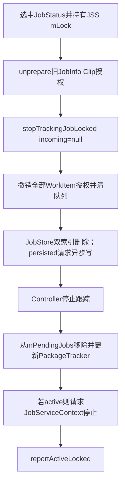
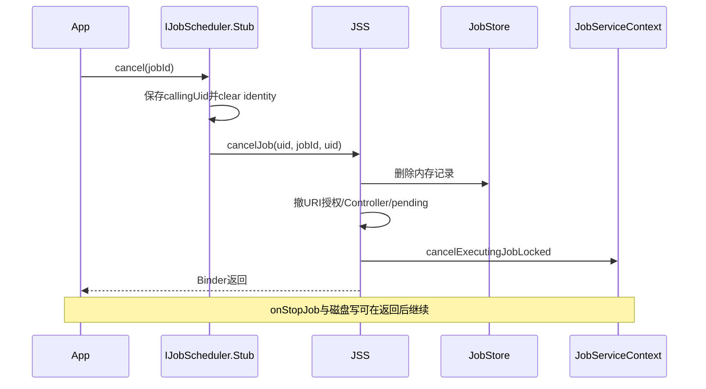
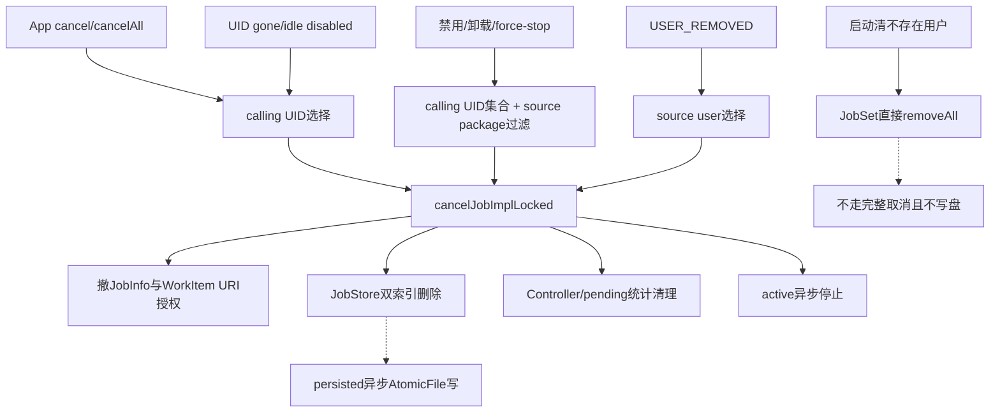

# 140 Android JSS：cancel、批量清理与 URI 授权回收

> 源码版本：Android 11 / API 30 / `android-11.0.0_r48`  
> 学习方式：macOS 只读源码，不要求编译、不要求连接设备  
> 前置章节：第 121、133、135、138、139 章

---

## 1. “取消一个 Job”实际要清理多少东西

一个 registered Job 可能同时存在于 JobStore双索引、多个Controller、pending队列、active执行槽、JobPackageTracker、
jobs.xml，以及两类 URI临时授权中。

所以取消不是从 Map 删除一条记录，而是把同一个 JobStatus 在多套状态中的痕迹按顺序收拢。

---

## 2. 本章目标

本章从 App 的 `cancel()`/`cancelAll()` 开始，继续追包禁用、卸载、force-stop、UID gone/idle和用户删除；重点审计
不同批量入口到底按 calling还是source身份查找，以及直接删JobStore为什么不同于完整取消。

---

## 3. 源码地图

```text
frameworks/base/apex/jobscheduler/framework/java/android/app/JobSchedulerImpl.java
frameworks/base/apex/jobscheduler/framework/java/android/app/job/IJobScheduler.aidl
frameworks/base/apex/jobscheduler/service/java/com/android/server/job/JobSchedulerService.java
frameworks/base/apex/jobscheduler/service/java/com/android/server/job/JobStore.java
frameworks/base/apex/jobscheduler/service/java/com/android/server/job/controllers/JobStatus.java
frameworks/base/apex/jobscheduler/service/java/com/android/server/job/controllers/StateController.java
frameworks/base/apex/jobscheduler/service/java/com/android/server/job/controllers/ConnectivityController.java
frameworks/base/apex/jobscheduler/service/java/com/android/server/job/controllers/QuotaController.java
frameworks/base/services/core/java/com/android/server/utils/quota/QuotaTracker.java
```

---

## 4. 五类取消入口先分清

| 入口 | 选择键 | 典型原因 |
|---|---|---|
| `cancel(jobId)` | calling UID + jobId | App主动取消单项 |
| `cancelAll()` | calling UID | App主动清空 |
| package cleanup | 先calling UID集合，再过滤source package | 禁用/卸载/force-stop |
| user cleanup | source user | 用户删除 |
| UID gone/idle disabled | calling UID | AMS认为UID不可再运行 |

这些入口最终大多汇合 `cancelJobImplLocked()`，但“先选到哪些 Job”并不相同。

---

## 5. 客户端 cancel 没有返回值

```java
public void cancel(int jobId) {
    try {
        mBinder.cancel(jobId);
    } catch (RemoteException e) {}
}
```

App 无法从公共 API直接知道该 jobId 是否存在。服务端内部 `cancelJob()` 返回 boolean，但 AIDL方法是 void。

---

## 6. cancelAll 同样吞 RemoteException

客户端只发 Binder请求；远端死亡时空 catch。调用返回不代表一定找到任务，也不提供已取消数量。

需要诊断最终注册状态时，可再用固定 jobId 查询，但要记得 `getPendingJob()` 实际查 registered集合。

---

## 7. Stub 先保存真实 calling UID

```java
final int uid = Binder.getCallingUid();
long ident = Binder.clearCallingIdentity();
try {
    cancelJob(uid, jobId, uid);
} finally {
    Binder.restoreCallingIdentity(ident);
}
```

这与 schedule入口相同：先捕获调用者，再清身份做 system_server内部工作，finally保证 Binder线程不被污染。

---

## 8. cancel 不需要额外 manifest permission

安全边界来自服务端强制使用 `Binder.getCallingUid()` 作为查找 UID。App 只能取消自己 calling UID命名空间中的
jobId，不能在参数里伪造另一个 UID。

---

## 9. 单项取消的查找键

```java
mJobs.getJobByUidAndJobId(uid, jobId)
```

这是第139章 replacement使用的同一唯一键：calling UID + jobId。source package和Service组件都不参与查找。

---

## 10. 找不到是幂等成功式行为

`toCancel == null` 时什么也不做，内部返回 false；公共 `void cancel()` 不抛“not found”。

因此重复 cancel天然幂等，适合在生命周期清理路径重复调用。

---

## 11. cancelAll 获取的是副本

`getJobsByUid(uid)` 新建 `ArrayList` 并复制 calling UID集合，再逐项取消。

这很重要：循环中 JobStore正在删除原集合，但迭代的是快照，不会因底层集合缩短而漏项或触发并发修改异常。

---

## 12. package cleanup 也先获取快照

它同样对 `mJobs.getJobsByUid(uid)` 的副本倒序迭代，再检查：

```java
job.getSourcePackageName().equals(pkgName)
```

选择条件同时混合 calling UID索引和source package字段。

---

## 13. user cleanup 的集合来源不同

`getJobsByUser(userHandle)` 遍历 `mJobsPerSourceUid`，按 `sourceUid` 的 userId选取任务。

所以这里的“user”明确是 source user，不是 calling UID所属用户。

---

## 14. 完整取消主流程



这条链和 replacement 的区别是 `incomingJob == null`，所以不会迁移 work，也不会跟踪新代际。

---

## 15. 第一步：撤销 JobInfo 级 URI grant

`cancelled.unprepareLocked()` 把 `prepared=false`，并对 `uriPerms.revoke()`。

这组授权来自 `JobInfo.setClipData()`；它与每个 JobWorkItem Intent携带的授权是两个层级。

---

## 16. 为什么先 unprepare

一旦任务被确定永久取消，JobService不应继续凭旧 JobInfo持有 URI访问能力。撤权早于异步停止回调，缩小了权限
继续存在的窗口。

因此正在停止中的应用代码不能假设旧 URI授权会一直保留到 `onStopJob()` 返回。

---

## 17. 第二步：incoming 为 null

```java
stopTrackingJobLocked(cancelled, null, true);
```

null 表示永久移除。replacement会传新 JobStatus并迁移work；完整取消则销毁全部剩余work状态。

---

## 18. WorkItem URI授权逐项撤销

`JobStatus.stopTrackingJobLocked(null)` 分别遍历 pendingWork和executingWork，每项若有 `grants` 就 revoke。

随后两个列表都置 null，并重新计算 estimated network bytes。

---

## 19. 已 complete 的 WorkItem 早已撤权

`completeWorkLocked(workId)` 从 executingWork移除对应项时就调用 `ungrantWorkItem()`。

取消只负责仍在 pending/executing列表中的未完成项，不会重复持有已完成项的授权。

---

## 20. cancel 与失败重排的根本区别

失败 reschedule会把旧 executing work重新放回新 Job pending，保留授权并重投；cancel传null，明确撤销所有剩余
授权并丢弃队列。

业务不能期待 cancel 后 work在下一代自动恢复。

---

## 21. JobStore 同时删除两张索引

`JobSet.remove()` 从 calling UID的 `mJobs` 和 source UID的 `mJobsPerSourceUid` 删除同一对象，并清理空集合。

若两张索引删除结果不一致，源码会 wtf，因为这意味着权威索引结构已经失配。

---

## 22. persisted 删除只安排异步写

当 `removeFromPersisted=true` 且 Job persisted，JobStore调用 `maybeWriteStatusToDiskAsync()`。

取消返回时内存已删除，但 jobs.xml 的 AtomicFile全量快照可能还未提交；异常重启存在旧磁盘记录被再次恢复的短暂
耐久窗口。

---

## 23. nonpersisted 不触发 jobs.xml 写

它从来不在 jobs.xml中，删除内存对象即可。不能用“磁盘没有变化”判断 cancel失败。

JobStore写入统计也只覆盖 persisted子集。

---

## 24. Controller 停止跟踪

JobStore成功删除且 `mReadyToRock` 后，JSS依次调用每个Controller：

```java
maybeStopTrackingJobLocked(jobStatus, null, false)
```

Controller应移除自己的 tracked set、Alarm、timer、observer或网络白名单引用。

---

## 25. Controller 方法只有约定，没有统一实现

基类 `StateController` 的默认 `onAppRemovedLocked()`/`onUserRemovedLocked()` 是空方法；
`maybeStopTrackingJobLocked()` 则由具体Controller实现。

所以单Job完整取消主要依靠逐Job stopTracking；包/用户回调用于清理任务之外的聚合历史或缓存。

---

## 26. ConnectivityController 的例子

任务停止tracking时，它会从 UID网络跟踪集合删除Job，并在最后一个需要App Standby网络例外的Job消失时撤销
`setAppIdleWhitelist(uid, false)`。

取消一个Job因此可能触发 UID级网络策略变化。

---

## 27. QuotaController 的例子

它从source user+package的 tracked集合删除Job，停止Package Timer，移除TOP-started标记；包卸载回调还会清理
TimingSession、恢复Alarm、ExecutionStats缓存等历史账户。

逐Job状态与包级历史是两层清理。

---

## 28. pending 队列单独删除

JobStore registered集合和 `mPendingJobs` 是两套容器。完整取消必须显式：

```java
if (mPendingJobs.remove(cancelled)) {
    mJobPackageTracker.noteNonpending(cancelled);
}
```

否则并发管理器还可能拿到已经从权威表删除的陈旧候选。

---

## 29. 只有真实 pending 才记 nonpending

`ArrayList.remove()` 返回 false时不调用PackageTracker，避免 pending nesting被无端减一。

这体现统计更新必须与容器变更是否真的发生绑定。

---

## 30. active停止不是同步完成

JSS遍历固定的 `mActiveServices`，匹配 calling UID + jobId，然后调用：

```java
cancelExecutingJobLocked(REASON_CANCELED, reason)
```

这把执行槽推进到停止协议；App的 `onStopJob()` 与最终context cleanup随后异步发生。

---

## 31. 为什么用 REASON_CANCELED

取消是外部定义被撤回，不是约束丢失、timeout或设备热限制。JobParameters stop reason帮助应用和诊断系统区分原因。

debug reason字符串还会记录“app cancel、force stop、user removed”等更具体来源。

---

## 32. onStopJob 返回 true 也不会复活显式取消

JobStatus已从JobStore移除，完整取消路径不是普通执行失败完成。即使应用希望 reschedule，JSS不会把被显式取消的
定义当作失败任务自动重建。

若业务仍需要它，必须重新调用 schedule。

---

## 33. reportActiveLocked 的作用

取消后重新汇总是否还有 active Job，并把状态报告给 DeviceIdle等系统协作者。

它不是通知 App“取消成功”的回调，也不等待 JobService停止完成。

---

## 34. App cancel 单项时序图



---

## 35. cancelAll 保护 SYSTEM_UID

```java
if (uid == Process.SYSTEM_UID) {
    Slog.wtfStack(...);
    return false;
}
```

system UID下可能聚合大量平台代包Job。一个 `cancelAll()` 若清空整个calling UID命名空间，影响面远超单个包，所以
r48直接拒绝。

---

## 36. “android”包也受批量保护

`cancelJobsForPackageAndUid()` 若 `pkgName.equals("android")` 就 wtf并返回。

这是包级清理保护，与 SYSTEM_UID保护是两个检查；单 jobId取消路径没有这段包名判断。

---

## 37. cancelAll 会清理该 UID代包调度的Job

对非SYSTEM_UID，`getJobsByUid(uid)` 返回calling UID集合中的全部 Job，不区分source package。

因此某个有特权的非system UID若代多个包调度，自己的 cancelAll会把这些代包Job一起取消。

---

## 38. package cleanup 只取消source package匹配项

同一calling UID可能对应shared UID多个包，或一个代理UID替多个source包调度。按source package过滤能避免包A卸载
时直接清掉包B任务。

但它的第一步索引选择仍带来后文的代理边界。

---

## 39. 包整体禁用触发清理

收到 `ACTION_PACKAGE_CHANGED` 后，只有 changed component列表包含裸包名，且
`getApplicationEnabledSetting()` 是 DISABLED/DISABLED_USER时，才调用包级取消。

仅某个JobService组件禁用不会走这一整包清理分支。

---

## 40. 单组件变化只重评Controller

包变化后JSS会让所有Controller `reevaluateStateLocked(pkgUid)`。完整ready门后续查询Service组件是否存在/可用，
但 registered Job定义可能继续保留。

“组件不可运行”和“任务定义被删除”不是同一动作。

---

## 41. 卸载与更新通过 EXTRA_REPLACING 区分

r48的实际分支只在：

```java
if (!intent.getBooleanExtra(Intent.EXTRA_REPLACING, false))
```

时取消。应用更新的第一阶段 PACKAGE_REMOVED不会清Job；真正卸载才清。

---

## 42. 接收器头部注释与实现漂移

接收器注释写“即使稍后replace也清理”，但分支代码明确跳过 `EXTRA_REPLACING=true`。

学习和排障应以可执行条件为准，并把这条注释视为r48陈旧描述。

---

## 43. 卸载后的完整动作

```text
cancelJobsForPackageAndUid
→ 各Controller.onAppRemovedLocked
→ mDebuggableApps.remove(pkgName)
```

第一步清Job实例；第二步清包级Controller账户；第三步清schedule API异常判断缓存的真实包名键。

---

## 44. API CountQuotaTracker 自己监听包移除

通用 `QuotaTracker` 注册包/用户移除广播，`CountQuotaTracker` 会删除对应UPTC事件与缓存。

所以JSS的 persisted schedule API计数不依赖Controller回调清理；它有自己的生命周期接收器。

---

## 45. 但第139章 null-key仍是另一回事

JSS卸载分支执行 `mDebuggableApps.remove(pkgName)`，普通schedule却曾以 null为键缓存debuggable状态。

CountQuotaTracker清事件不等于清JSS的null键，这个r48缺口仍然成立。

---

## 46. force-stop 走 PACKAGE_RESTARTED

`ACTION_PACKAGE_RESTARTED` 被解释为 possible force-stop，调用包级取消，debug reason是
`"app force stopped"`。

force-stop不仅杀进程，还使已调度后台工作不应偷偷重启应用，因此任务定义也被移除。

---

## 47. QUERY_PACKAGE_RESTART 只做查询

系统在决定是否需要处理restart/force-stop前发查询。JSS扫描目标UID集合，若找到source package匹配Job就设置
`Activity.RESULT_OK`。

它不取消任务，只回答“这个包是否有JSS相关状态”。

---

## 48. package cleanup 的代理索引缺口

卸载广播带的是source包自己的 `pkgUid`，而代包Job存放在实际调用者的 `mJobs[callingUid]` 中。

`cancelJobsForPackageAndUid(pkgName, pkgUid)` 先查 `mJobs[pkgUid]`，因此找不到 callingUid为system/代理UID、source
package为被卸载包的Job。

---

## 49. 这不是 source索引不存在

JobStore明明还有 `mJobsPerSourceUid`，但此方法没有使用它，也没有全表按source package扫描。

所以r48包卸载/force-stop/query路径对普通自调度Job正确，对跨UID `scheduleAsPackage` Job可能遗漏。

---

## 50. 遗漏后的Controller回调不能等价补救

`onAppRemovedLocked(pkgName, pkgUid)` 会清部分Controller包级状态，但不会统一从JobStore删除那个代理Job，也不会
替完整取消撤JobInfo/WorkItem授权、pending条目和active context。

后续完整ready/组件查询可能阻止运行，但定义与各Controller状态可能出现不对称。

---

## 51. 对代理缺口的表述要限定版本

这是 `android-11.0.0_r48` 当前索引组合推导，不应泛化为所有Android版本。也不代表任意App可制造代理Job；
`scheduleAsPackage` 需要平台特权。

它主要提醒系统组件在设计代包任务清理时不要只假定包广播会覆盖一切。

---

## 52. 用户删除走 source user快照

`cancelJobsForUser(userId)` 获取所有sourceUid属于该用户的Job，再逐项完整取消。

这能覆盖system UID从user0替user10调度的Job，因为它使用source索引，而不是calling user索引。

---

## 53. 用户删除后还清Controller用户账户

完成逐Job取消后，JSS对所有Controller调用 `onUserRemovedLocked(userId)`。

QuotaController会删除tracked jobs、timers、sessions、恢复Alarm、ExecutionStats等user级容器；其他Controller按需实现。

---

## 54. source user选择也有反向边界

若某个将被删除用户中的特权calling UID替另一个仍存在source user调度Job，`getJobsByUser(removedUser)` 因只看
source user不会选中它。

这种场景罕见且受特权限制，但说明方法名“ByUser”不能替代字段级审计。

---

## 55. 系统启动还会清不存在用户

PHASE_SYSTEM_SERVICES_READY时，JSS取得当前userId白名单，调用：

```java
mJobs.removeJobsOfNonUsers(userIds)
```

它的谓词同时检查 source user和calling user，能补捉任一侧不存在的记录。

---

## 56. 这条启动清理不是完整取消

它直接调用JobSet的 `removeAll()`，没有逐项：

```text
unprepare
WorkItem撤权
Controller stopTracking
pending/active清理
persisted写回
```

因此不能把它和 `cancelJobsForUser()` 视为同义实现。

---

## 57. 为什么启动阶段暂时不伤pending/active

该调用位于 SYSTEM_SERVICES_READY；`mReadyToRock` 要到 THIRD_PARTY_APPS_CAN_START才置true并把已加载Job交给
Controller，执行槽也尚未创建。

所以此时还没有这些Job的pending/active运行状态，直接删内存表不会留下正在执行的context。

---

## 58. 仍然存在磁盘写回缺口

`JobStore.removeJobsOfNonUsers()` 没调用 `maybeWriteStatusToDiskAsync()`。被删的persisted记录仍可能留在jobs.xml，
下次启动再次读入、再次从内存删除。

这是第135章已经发现的r48持久化收敛缺口。

---

## 59. 是否会泄漏 URI grant

JobStore从磁盘恢复后对Job调用 `prepareLocked()`；但公共JobInfo Builder禁止 persisted任务携带ClipData，因此正常
持久记录不应恢复JobInfo级Clip授权，WorkItem也不写盘。

更稳妥的结论是：直接删除确实绕过通用撤权协议，但正常persisted格式限制降低了该启动路径出现grant的可能性。

---

## 60. UID observer 是另一组取消来源

JSS注册 AMS UID observer，接收 procstate、gone、idle、active。回调先投递到JSS Handler，再处理共享状态和取消。

它不是在AMS Binder回调线程里直接持JSS锁做整批删除。

---

## 61. UID_GONE 只有 disabled才取消

```java
if (disabled) cancelJobsForUid(uid, "uid gone");
```

普通进程死亡并不必然删除Job；JobScheduler本就要在未来条件满足时重新启动应用。disabled=true才说明UID不应再
拥有调度工作。

---

## 62. UID_IDLE 也是条件取消

idle回调同样只在 `disabled` 时调用 `cancelJobsForUid(uid, "app uid idle")`。

“UID当前不活跃/进入idle”本身只更新DeviceIdleJobsController，不等于删除所有Job定义。

---

## 63. UID取消按 calling UID全清

它不按source package过滤，因此非system代理UID的所有代包Job也会被清理。

随后每个Job各自完整撤权、stop Controller、删pending、停active和安排persist写回。

---

## 64. SYSTEM_UID保护同样作用于UID observer

若 `cancelJobsForUid(1000, ...)` 被调用，会拒绝整批清理。保护平台Job的同时，也意味着system UID下的异常状态
需要更精确的包/job级处置路径。

---

## 65. Handler末尾会尝试运行pending

处理UID状态/取消等消息后，JSS Handler统一调用 `maybeRunPendingJobsLocked()`。

取消释放执行槽或改变UID状态后，其他pending Job可及时获得机会；并不需要等下一次Controller广播。

---

## 66. shell cancel 的身份解析

shell命令先通过PM把 `pkgName + userId` 解析为 `pkgUid`。有jobId时按这个UID+jobId取消；无jobId时调用
`cancelJobsForUid(pkgUid)`。

它并没有调用包级source过滤方法。

---

## 67. shell “取消某包全部”在shared UID下会更宽

无jobId分支按UID全清。如果多个包共享UID，命令文字虽显示某个package，实际会删除该UID集合中的所有Job。

这与包卸载路径按source package过滤不同，是诊断工具容易误解的边界。

---

## 68. shell也无法整批取消SYSTEM_UID

解析到system UID后，`cancelJobsForUid()` 的保护仍生效。shell身份只写入单项cancel的debug reason，不绕过内部
系统UID保护。

---

## 69. active匹配为什么仍用calling UID

JobServiceContext中执行的是JobStore那一代JobStatus，其唯一标识遵循 calling UID+jobId。source package只是归因，
不能单独唯一定位一个active任务。

这与scheduleAsPackage的命名空间设计保持一致。

---

## 70. 取消与回调竞态一：jobFinished同时到达

cancel先把定义从JobStore删除并请求context停止；应用稍后发来的旧callback还要通过JobServiceContext的callback
token/代际检查。

旧回调不能把已经取消的Job重新登记。

---

## 71. 取消与回调竞态二：正在dequeueWork

JSS核心状态都在同一 `mLock` 下串行。取消获得锁后会清work列表与授权；随后旧应用回调即使到达，也会面对停止
状态或不再匹配的执行代际。

跨进程应用可能已经读到业务数据，所以业务侧仍需幂等和可撤销设计。

---

## 72. 取消与replacement竞态

两个同步Binder线程都要获得JSS `mLock`。先获得锁者完成自己的JobStore代际变更，后获得者再按当前UID+jobId查找。

结果可能是“先replace再cancel新代际”，或“先cancel后schedule创建新代际”，由锁获得顺序决定。

---

## 73. 这不是基于客户端调用时间排序

不同线程的Binder调用没有跨线程FIFO承诺。若业务要求“取消之后绝不被旧请求重新创建”，应用自己需要序列化
调度命令或在Job定义中加入业务generation并由服务端校验。

---

## 74. 批量取消持锁时间可能较长

每项取消都在JSS全局锁内撤权、更新JobStore、遍历Controller和active contexts。大量Job会拉长锁占用，并可能触发
多个异步磁盘写请求（随后被防抖合并）。

这也是每UID数量上限和避免滥用调度API的系统成本背景。

---

## 75. URI revoke 是锁内跨服务动作

`GrantedUriPermissions.revoke()` 最终进入 URI grants管理。虽然system_server内部实现通常可控，它仍扩大锁内工作
范围。

分析卡顿时要把“删除Map”之外的权限回收成本也纳入等待链。

---

## 76. 多个persisted删除会触发多少次真正写盘

每项 `JobStore.remove()` 都可能调用 `maybeWriteStatusToDiskAsync()`，但 JobStore用 scheduled/in-progress状态和延迟
消息合并请求，最终通常是一次全量快照。

API调用次数不等于磁盘fsync次数。

---

## 77. 异步写的崩溃窗口怎么理解

```text
t0 内存删除
t1 cancel Binder返回
t2 IoThread抓取persisted快照
t3 AtomicFile提交
```

若system_server在t1与t3之间异常死亡，旧磁盘定义可能在重启后出现。Job执行必须幂等，平台也应尽量缩短/修复
持久化窗口。

---

## 78. 正常设备重启与异常崩溃不同

有序关机通常给异步工作更多时间，但源码语义仍没有让 `cancel()` 等待持久commit。不能把经验上的“通常写完”
升级成同步API保证。

---

## 79. package cleanup身份矩阵

| Job类型 | calling UID索引 | source UID/package | 卸载source包时是否被当前方法选中 |
|---|---|---|---:|
| 普通自调度 | 包UID | 同包UID/包名 | 是 |
| shared UID自调度 | shared UID | 同UID/具体包名 | 是，靠包名过滤 |
| system代包 | SYSTEM_UID | 被卸载包UID/包名 | 否，先查错calling集合 |
| 非system特权代理 | 代理UID | 被卸载包UID/包名 | 否，除非UID恰好相同 |

这张表是第48～51节结论的最短复习方式。

---

## 80. user cleanup身份矩阵

| calling user | source user | 删除source user | `cancelJobsForUser` |
|---:|---:|---:|---:|
| 10 | 10 | 10 | 选中 |
| 0 | 10 | 10 | 选中 |
| 10 | 0 | 10 | 不选中 |

启动时 `removeJobsOfNonUsers` 会同时检查calling/source user，但它走的是直接JobSet删除路径。

---

## 81. 完整取消与直接删除对照

| 动作 | `cancelJobImplLocked` | `removeJobsOfNonUsers` |
|---|---:|---:|
| JobStore双索引删除 | 是 | 是 |
| JobInfo URI revoke | 是 | 否 |
| WorkItem URI revoke | 是 | 否 |
| Controller stop | 是 | 否 |
| pending统计 | 是 | 否 |
| active stop | 是 | 否 |
| persisted写回 | 是 | 否 |

直接路径之所以暂时可用，强依赖它在Controller attach和执行开始前调用。

---

## 82. 为什么不要在运行期复用直接删除

若在 `mReadyToRock=true` 后直接从JobSet remove，Controller/pending/active仍可能保留对象，URI grant也不会撤销，
形成幽灵状态。

运行期删除必须走完整JSS取消协议，除非新实现显式补齐每个侧面。

---

## 83. cancel原因字符串只是诊断信息

```text
cancel() called by app
cancelAll() called by app
app disabled
app uninstalled
app force stopped
uid gone
app uid idle
user removed
```

真正公开stop reason大多统一为 `REASON_CANCELED`；debug reason帮助dumpsys/log区分来源，不应作为App稳定协议。

---

## 84. package remove 先取消还是先Controller清账户

r48先逐Job完整取消，再调用 `onAppRemovedLocked()`。这使Controller先看到每个Job stopTracking，随后再丢弃剩余
包级统计、Alarm和cache。

倒过来可能让逐Job stop访问已被粗暴清空的账户，因此当前顺序更容易维持内部约定。

---

## 85. user remove 同样先逐Job后按user清理

先取消source user的Job，后调用Controller user级清理。Quota Timer若仍active，逐Jobstop应先让它正常结束；最终
user callback再删除所有残留容器。

这是“细粒度退订→粗粒度销户”的两阶段模型。

---

## 86. Connectivity onAppRemoved 的粗粒度风险

r48 `ConnectivityController.onAppRemovedLocked(pkgName, uid)` 直接 `mTrackedJobs.delete(uid)`，按UID清整个跟踪集合，
没有使用pkgName。

在shared UID下，一个包卸载可能连同同UID其他包的网络tracking集合一起删掉；任务仍在JobStore但后续依赖重新
评估才能收敛。这是当前实现的UID粒度边界。

---

## 87. QuotaController则按user+package清理

它从uid取userId，再用packageName删除统计，粒度比Connectivity更细；同时删除该uid的foreground/cache项。

不同Controller的数据结构不同，不能假定所有包移除回调都严格只触碰一个包。

---

## 88. mPersistCache没有随卸载清理

第139章的 `JobSchedulerStub.mPersistCache` 不在卸载分支清除。任务取消、Controller清理和API CountQuota清理都不会
自动触碰它。

因此权限判定缓存生命周期与Job定义生命周期是分开的。

---

## 89. mDebuggableApps只在真正卸载时清

包更新 `EXTRA_REPLACING=true` 不进入删除分支，缓存保留；包整体禁用分支也没有删除debuggable缓存。

对实际应用更新，debuggable flag可能变化而同包缓存继续存在，叠加普通路径null-key缺口，更说明该缓存不是可靠
动态真相。

---

## 90. App业务层如何正确理解 cancel

取消只撤销系统调度定义与临时授权，并尽力停止当前执行。它不能回滚JobService已经提交的数据库/网络副作用。

若需要业务取消语义，应在自己的持久存储写入cancelled/generation状态，让工作线程在关键步骤前检查。

---

## 91. onStopJob不是事务回滚钩子

它运行得晚、可能进程已死，也可能 URI授权已撤。适合停止线程、保存进度和释放本地资源，不适合承诺撤销所有已
产生外部副作用。

系统调度状态机与业务事务必须分层设计。

---

## 92. WorkItem消费者必须处理cancel中断

已dequeue但未complete的项在cancel时被丢弃并撤权，不会像普通失败那样重投。应用若要“取消后可恢复”，应把
业务任务事实存数据库，而不是把JobWorkItem队列当唯一持久消息队列。

---

## 93. package force-stop后的重新调度

force-stop清Job后，应用通常还受 stopped状态限制，不能靠旧Job自动唤醒。只有用户显式启动/系统解除stopped等
合法路径后，应用再根据自己数据库重建调度。

这正是force-stop“用户要求停止该应用”的语义。

---

## 94. 用户删除为什么必须永久清

source user的数据、UID和包空间都要消失；保留Job不仅永远无法通过双user ready门，还可能让jobs.xml残留身份与
统计数据。

因此运行期USER_REMOVED使用完整取消和Controller销户，而不是仅把user标为stopped。

---

## 95. user stopped 与 user removed不同

第138章 `onStopUser()` 只从 `mStartedUsers` 删除userId，不取消Job；以后start仍可恢复执行。

`ACTION_USER_REMOVED` 才永久删除任务和统计。生命周期暂停与身份销毁不能混为一谈。

---

## 96. package disabled 与 component disabled不同

整个应用disabled时取消source package的Job；只禁用JobService组件时，Job定义可能保留但无法通过组件门。

前者是销户式清理，后者更像运行条件不可用。

---

## 97. PACKAGE_REPLACED为什么保留Job

persisted Job本就应跨更新/重启继续存在；包更新通常保留UID和数据。跳过临时 PACKAGE_REMOVED避免更新窗口把任务
误当卸载永久删除。

更新后组件/权限变化则由后续状态重评和实际绑定路径处理。

---

## 98. 接收器运行线程

注册 `registerReceiverAsUser(..., handler=null)`，动态接收器通常在注册它的进程主线程Looper分发；这里是
system_server主线程。回调内再进入JSS `mLock` 做清理。

UID observer事件则显式通过JSS Handler消息收敛，两者线程入口不同。

---

## 99. Binder cancel运行线程

App的cancel/cancelAll在system_server Binder线程执行，直接同步进入JSS锁。它不先post主线程。

因此包广播清理、UID Handler清理和App Binder清理最终通过同一锁互斥，但到达线程与排队机制不同。

---

## 100. 锁顺序诊断重点

取消时JSS持有 `mLock`，内部会触碰JobStore、Controller、URI grants和JobServiceContext。若出现卡顿，应查看：

```text
谁先持JSS mLock
是否等待权限/Controller内部锁
Binder线程池或主线程是否反向等待JSS
IoThread只是异步写，通常不在cancel回包关键路径
```

---

## 101. macOS只读练习一：追单项取消

```bash
sed -n '2725,2760p' \
  frameworks/base/apex/jobscheduler/service/java/com/android/server/job/JobSchedulerService.java

sed -n '1240,1290p' \
  frameworks/base/apex/jobscheduler/service/java/com/android/server/job/JobSchedulerService.java
```

标出真实UID捕获、identity恢复、not-found和完整取消的边界。

---

## 102. macOS只读练习二：画URI授权清理树

```bash
sed -n '620,715p' \
  frameworks/base/apex/jobscheduler/service/java/com/android/server/job/controllers/JobStatus.java
```

分别列出JobInfo ClipData授权、pending WorkItem授权、executing WorkItem授权在complete/cancel/replacement时的命运。

---

## 103. macOS只读练习三：比较三个批量选择器

```bash
sed -n '1180,1245p' \
  frameworks/base/apex/jobscheduler/service/java/com/android/server/job/JobSchedulerService.java

sed -n '1065,1105p' \
  frameworks/base/apex/jobscheduler/service/java/com/android/server/job/JobStore.java
```

给 `getJobsByUid`、`getJobsByUser`、source package过滤分别标注calling/source身份。

---

## 104. macOS只读练习四：验证代理包遗漏

```bash
sed -n '1195,1220p' \
  frameworks/base/apex/jobscheduler/service/java/com/android/server/job/JobSchedulerService.java

rg -n 'mJobsPerSourceUid|getJobsByUid|getJobsByUser' \
  frameworks/base/apex/jobscheduler/service/java/com/android/server/job/JobStore.java
```

用 callingUid=1000、sourceUid=10123手算卸载10123对应包时首先查询哪一个UID分组。

---

## 105. macOS只读练习五：核对包广播

```bash
sed -n '800,935p' \
  frameworks/base/apex/jobscheduler/service/java/com/android/server/job/JobSchedulerService.java
```

区分PACKAGE_CHANGED、REMOVED+REPLACING、真正卸载、QUERY_RESTART和RESTARTED，并找出头部注释漂移。

---

## 106. macOS只读练习六：核对用户清理

```bash
sed -n '1140,1175p' \
  frameworks/base/apex/jobscheduler/service/java/com/android/server/job/JobStore.java

sed -n '1520,1565p' \
  frameworks/base/apex/jobscheduler/service/java/com/android/server/job/JobSchedulerService.java
```

比较运行期USER_REMOVED完整取消与启动期non-existent user直接removeAll。

---

## 107. macOS只读练习七：读UID observer

```bash
sed -n '1935,1980p' \
  frameworks/base/apex/jobscheduler/service/java/com/android/server/job/JobSchedulerService.java
```

解释gone/idle中的disabled布尔为什么决定“只更新active状态”还是“永久取消定义”。

---

## 108. macOS只读练习八：读Controller销户

```bash
rg -n 'onAppRemovedLocked|onUserRemovedLocked' \
  frameworks/base/apex/jobscheduler/service/java/com/android/server/job/controllers
```

至少比较ConnectivityController与QuotaController的UID粒度和package粒度差异。

---

## 109. 阅读检查题

1. App为何不能取消别的UID的jobId？
2. cancel返回时哪些异步动作可能未完成？
3. JobInfo和WorkItem的URI授权怎样分别撤销？
4. cancel与failure reschedule对work队列有何不同？
5. cancelAll为何拒绝SYSTEM_UID？
6. package cleanup为什么要再过滤source package？
7. r48为什么可能漏掉system代包Job？
8. 用户删除按source还是calling user选任务？
9. removeJobsOfNonUsers为何不是完整取消？
10. 普通UID gone为什么不能无条件删Job？
11. shell按包cancel-all在shared UID下实际影响谁？
12. package update为何不走真正卸载清理？

---

## 110. 场景推演一：取消正在执行的Job

```text
JobStore有记录 + mActiveServices正在执行 + executingWork有2项
```

JSS先撤JobInfo授权，随后撤两项Work授权并清队列、删Store/Controller，再请求context以CANCELED停止。App可能稍后才
收到onStopJob，但Job定义已经消失，返回true也不会自动重排。

---

## 111. 场景推演二：shared UID包卸载

UID 10123下包A和包B各有自调度Job。卸载A时先取得UID全部快照，但只取消
`sourcePackageName == A` 的项，B的JobStore记录保留。

不过某些Controller `onAppRemovedLocked(uid)` 可能按UID粗粒度清缓存，需等待重评收敛。

---

## 112. 场景推演三：system代包卸载

```text
callingUid=1000
sourceUid=10123 sourcePackage=A
广播pkgUid=10123
```

包清理查询 `mJobs[10123]`，代包Job实际在 `mJobs[1000]`，因此未被逐Job取消。随后Controller包级清理并不能保证
JobStore/pending/active/授权全链删除。这是r48特权代理边界。

---

## 113. 场景推演四：用户10删除

user0 system替user10调度的Job位于calling UID 1000集合，但source UID属于user10；`getJobsByUser(10)` 从source索引
仍能选中并完整取消。

之后Controller再删除user10的quota/timer/alarm历史。

---

## 114. 场景推演五：普通进程崩溃

AMS发UID_GONE但disabled=false。JSS更新priority/active状态，不删除Job。

这是正确行为：JobScheduler的职责之一就是在未来约束满足时重新拉起JobService，进程死亡不是用户取消。

---

## 115. 常见误解一：cancel会等待onStopJob

纠正：Binder调用同步完成JSS内存取消和停止请求，但App回调/Context cleanup异步，jobs.xml提交也异步。

---

## 116. 常见误解二：cancel会回滚业务

纠正：它撤调度、撤URI grant、丢未完成WorkItem并请求停止，不会撤销已经提交的数据库写或网络请求。

---

## 117. 常见误解三：按包清理天然覆盖代包Job

纠正：r48方法先以广播pkgUid查calling索引，后才比source package；calling/source跨UID时可能根本看不到记录。

---

## 118. 常见误解四：用户停止就删除Job

纠正：stop user只关闭ready门，remove user才完整删除。启动时清不存在用户又是第三条、较粗的直接Store路径。

---

## 119. 常见误解五：JobStore remove就是完整取消

纠正：完整协议还包含prepare/work授权、Controller、pending统计、active stop与persisted写回。直接删Map只能在严格
受控的启动阶段使用。

---

## 120. 一页复习图



---

## 121. 本章结论

1. cancel/cancelAll先锁定真实calling UID，再clear/restore Binder identity；
2. 单项唯一键是calling UID+jobId，not-found静默幂等；
3. 完整取消先撤JobInfo Clip授权，再撤全部剩余WorkItem授权；
4. cancel永久丢work，replacement/failure则可能迁移或重投；
5. JobStore双索引、Controller、pending、PackageTracker和active context必须分别收拢；
6. active停止与jobs.xml提交在cancel返回后仍可继续；
7. persisted删除有异步崩溃恢复窗口；
8. cancelAll按calling UID全清，但拒绝SYSTEM_UID；
9. 包级清理混合calling UID索引与source package过滤；
10. shared UID依靠source package避免误删其他包Job；
11. r48包广播可能漏掉calling/source跨UID的代包Job；
12. Controller包回调不能替代完整逐Job取消；
13. 真正卸载清理，更新阶段`EXTRA_REPLACING=true`跳过；
14. 接收器“更新也清”的头部注释与代码条件漂移；
15. force-stop取消定义，QUERY_RESTART只查询；
16. 用户删除按source user选中，可覆盖system替次用户调度；
17. 启动期non-existent user同时检查calling/source user，但直接删Store；
18. 该直接路径依赖尚未attach Controller/执行，却没有persisted写回；
19. UID gone/idle只有disabled时清定义，普通进程死亡保留Job；
20. shell包级cancel-all实际按UID，在shared UID下影响更宽。

最值得带走的一句话：

> Android 11 的“取消”是一份跨索引、权限、控制器和执行槽的注销协议；真正困难的不在删除，而在先用正确的 calling/source身份选全对象，再让内存、URI授权、运行回调与异步磁盘最终收敛。

---

## 122. 生成后复读：容易误解处的修订

初稿后重新对照JSS、JobStore、JobStatus、StateController、ConnectivityController、QuotaController和通用
QuotaTracker，完成以下修订：

1. 将公共void cancel与内部boolean not-found语义分开；
2. 明确Stub先保存真实UID、清identity并finally恢复；
3. 区分JobInfo ClipData与WorkItem Intent两类URI grant；
4. 按源码确认永久cancel传incoming=null并撤销全部work授权；
5. 补出completeWork已提前撤销单项授权；
6. 逐项还原JobStore、Controller、pending tracker、active stop顺序；
7. 强调onStopJob与AtomicFile提交不在Binder返回完成点；
8. 说明cancel不会把onStopJob=true解释成失败重排；
9. 确认cancelAll迭代的是快照且拒绝SYSTEM_UID；
10. 区分包级source过滤与UID级全清；
11. 发现接收器头注释声称更新也清，但代码跳过EXTRA_REPLACING；
12. 分开包整体disabled和单组件changed；
13. 画出真正卸载、force-stop、query restart三种路径；
14. 发现包清理先查广播pkgUid对应calling索引，可能遗漏代理Job；
15. 限定该遗漏只涉及有特权的跨UID scheduleAsPackage场景；
16. 明确Controller onAppRemoved不能替代JobStore/pending/active完整删除；
17. 核对用户运行期清理从source索引选任务；
18. 补出删除calling user但source仍存的反向罕见边界；
19. 对比启动期removeJobsOfNonUsers同时检查calling/source，却直接removeAll；
20. 结合boot phase确认直接路径尚无pending/active/Controller attach；
21. 保留其不触发jobs.xml写回的r48缺口；
22. 限定正常persisted格式不保存WorkItem且禁止ClipData，避免夸大grant泄漏；
23. 区分UID gone/idle状态与disabled永久清理；
24. 发现shell无jobId按UID全清，在shared UID下宽于命令文字；
25. 补出Connectivity包回调按UID粗清与QuotaController按包细清差异；
26. 将全部练习限定为macOS `rg`/`sed`只读推演，不要求编译。

---

## 123. 下一章

第141章进入 `JobSchedulerService` 的消息调度与批处理：比较 `MSG_CHECK_JOB`、`MSG_CHECK_JOB_GREEDY`、
`maybeQueueReadyJobsForExecutionLocked()` 和 `queueReadyJobsForExecutionLocked()`，拆解非ACTIVE桶的数量/等待时间门、
Controller state-change增量列表、pending清退与Handler消息合并，弄清“状态变了”到“真正竞争执行槽”为何不是一步。
