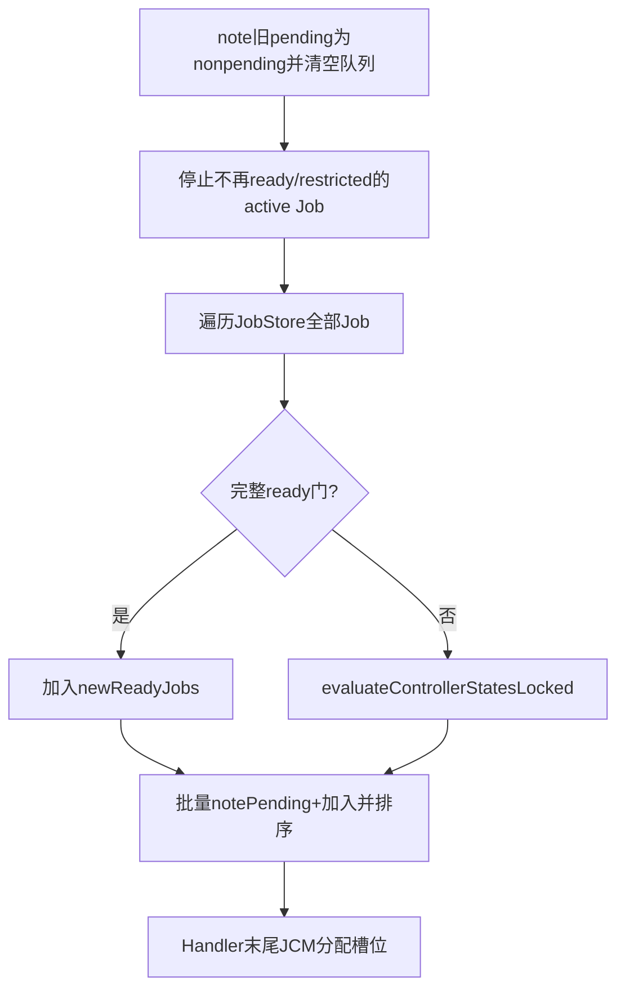
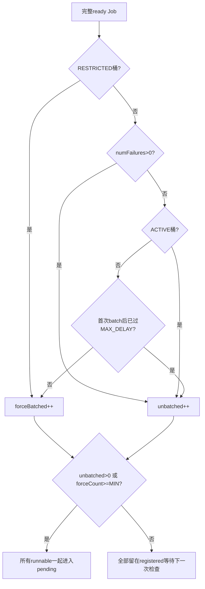
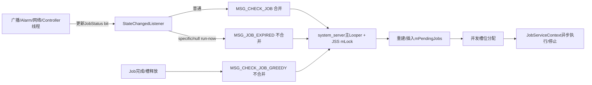
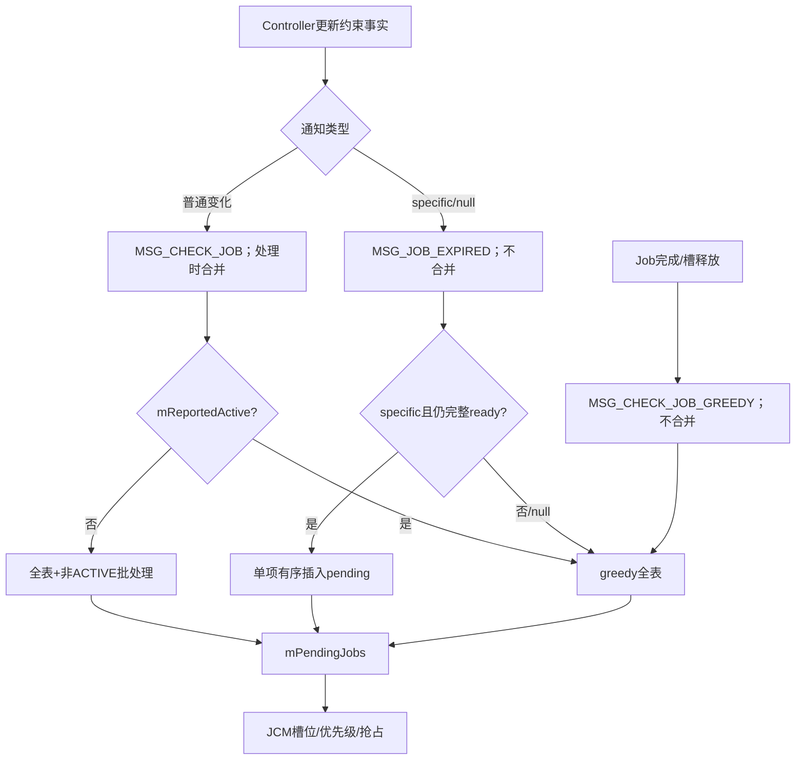

# 141 Android JSS：Handler 消息、批处理与增量状态变化

> 源码版本：Android 11 / API 30 / `android-11.0.0_r48`  
> 学习方式：macOS 只读源码，不要求编译、不要求连接设备  
> 前置章节：第 121、131、136、138、140 章

---

## 1. 约束变化为什么不直接启动 Job

Controller可能运行在广播主线程、Alarm回调、网络回调或自己的Handler线程。它们只更新JobStatus约束位，再通过
`StateChangedListener`通知JSS；JSS把事件汇合到主Looper，在全局锁内重新扫描、批处理、构造pending队列，最后才
让并发管理器分配执行槽。

---

## 2. 本章目标

本章解释三类核心消息 `MSG_JOB_EXPIRED`、`MSG_CHECK_JOB`、`MSG_CHECK_JOB_GREEDY`，比较普通批处理与贪婪全量
扫描，手算ACTIVE/失败/RESTRICTED/等待超时Job怎样入队，并审计消息合并、pending重建和批处理时钟的r48边界。

---

## 3. 源码地图

```text
frameworks/base/apex/jobscheduler/service/java/com/android/server/job/JobSchedulerService.java
frameworks/base/apex/jobscheduler/service/java/com/android/server/job/StateChangedListener.java
frameworks/base/apex/jobscheduler/service/java/com/android/server/job/JobConcurrencyManager.java
frameworks/base/apex/jobscheduler/service/java/com/android/server/job/JobPackageTracker.java
frameworks/base/apex/jobscheduler/service/java/com/android/server/job/controllers/JobStatus.java
frameworks/base/apex/jobscheduler/service/java/com/android/server/job/controllers/TimeController.java
frameworks/base/apex/jobscheduler/service/java/com/android/server/job/controllers/BatteryController.java
frameworks/base/apex/jobscheduler/service/java/com/android/server/job/controllers/StorageController.java
frameworks/base/apex/jobscheduler/service/java/com/android/server/job/controllers/ConnectivityController.java
```

---

## 4. 三层职责先分开

```text
Controller：更新某类约束事实，决定发普通变化还是立即运行提示
JobHandler：合并事件，在JSS mLock内选择扫描策略并重建pending
JobConcurrencyManager：根据槽位、FG/BG容量和优先级真正分配执行
```

Controller说“run now”也没有直接调用App，它只改变JSS下一轮选择策略。

---

## 5. JSS Handler 使用哪个 Looper

构造函数：

```java
mHandler = new JobHandler(context.getMainLooper());
```

所以JobHandler运行在system_server主Looper。Controller来源线程只负责post Message，真正扫描切回主线程。

---

## 6. 所有核心状态仍由 mLock 保护

`handleMessage()` 一进入就 `synchronized (mLock)`，消息分支、pending重建、active停止和并发分配都在同一锁域。

“统一到主线程”并不取代锁，因为schedule/cancel仍可从Binder线程同步进入JSS。

---

## 7. 八种消息编号

```java
MSG_JOB_EXPIRED = 0;
MSG_CHECK_JOB = 1;
MSG_STOP_JOB = 2;
MSG_CHECK_JOB_GREEDY = 3;
MSG_UID_STATE_CHANGED = 4;
MSG_UID_GONE = 5;
MSG_UID_ACTIVE = 6;
MSG_UID_IDLE = 7;
```

本章重点前三种扫描消息，UID消息在第138、140章已解释。

---

## 8. mReadyToRock 是消息总闸门

```java
if (!mReadyToRock) return;
```

第三方应用可启动阶段之前到达的JSS消息直接丢弃，不延迟重放。但boot phase随后会统一attach Controller并扫描已加载
Job，所以启动正确性不能依赖早期单条消息。

---

## 9. StateChangedListener 两种通知语义

```java
onControllerStateChanged();
onRunJobNow(JobStatus jobStatus);
```

前者表示“至少一项状态变了，请按政策复评”；后者表示“某Job或所有ready Job应尽快冲刷”。

---

## 10. 普通状态变化只发 MSG_CHECK_JOB

```java
public void onControllerStateChanged() {
    mHandler.obtainMessage(MSG_CHECK_JOB).sendToTarget();
}
```

它不附带变化Job列表。JSS r48收到后仍从JobStore全表扫描，并非真正的增量Job集合更新。

---

## 11. “增量”体现在哪里

增量主要发生在Controller内部：只更新受网络、UID或广播影响的tracked Job约束位，并且只有bit真的变化才通知JSS。

通知到JSS后，候选选择仍是全量重建。这是一种“事实增量、策略全表”的设计。

---

## 12. onRunJobNow 转成 MSG_JOB_EXPIRED

```java
mHandler.obtainMessage(MSG_JOB_EXPIRED, jobStatus).sendToTarget();
```

名字源于deadline expired，但Battery、Storage、Connectivity等Controller也复用它，所以不能按消息名推断来源一定是
时间到期。

---

## 13. null 的特殊协议

`onRunJobNow(null)` 表示不指定某个Job，而是要求“冲刷所有ready Job”。Battery稳定供电和Storage恢复正常时会使用
它。

这会直接走贪婪全量扫描，不经过非ACTIVE批处理门。

---

## 14. 非 null 的快速路径

当message.obj是JobStatus且仍通过完整ready门，JSS只把这个对象加入pending：

```java
notePending(runNow);
addOrderedItem(mPendingJobs, runNow, comparator);
```

无需清空并重建整个pending列表。

---

## 15. 快路径不会重复加入pending

完整ready门内部检查 `mPendingJobs.contains(job)`。已pending对象会返回false，因此不会再次notePending或插入。

active同UID+jobId也会被完整门排除。

---

## 16. stale runNow 的反直觉分支

源码写的是：

```java
if (runNow != null && isReadyToBeExecutedLocked(runNow)) {
    // 单项加入
} else {
    queueReadyJobsForExecutionLocked();
}
```

所以非null对象如果到处理时已经不ready，并不是“忽略这条过期提示”，而是触发全量贪婪扫描。

---

## 17. stale对象为何可能出现

Controller发消息与主Looper处理之间，Job可能被cancel/replacement、约束再次变化、用户停止、进入backup，或已经由
另一条消息加入pending。

这些都可能让specific runNow失去快速路径资格。

---

## 18. MSG_JOB_EXPIRED 不做消息合并

Handler末尾注释明确不要删除JOB_EXPIRED，因为处理期间可能又来一条。每个specific runNow携带不同对象，粗暴
`removeMessages`会丢失紧急提示。

代价是短时间内可能多次扫描/分配。

---

## 19. MSG_CHECK_JOB 会在处理时合并

```java
removeMessages(MSG_CHECK_JOB);
```

第一条普通检查开始执行时，队列中尚未处理的同类消息被移除。多次约束波动可收敛为一次全表复评。

---

## 20. 这不是post前去重

Controller每次仍会send Message；直到某一条进入 `handleMessage()` 才移除后续同类消息。

主Looper拥堵期间队列可以暂时积累，但最终只执行最前面一条的扫描。

---

## 21. 处理期间新来的普通消息可能怎样

`removeMessages()` 在分支开头执行。若另一线程在它之后post新MSG_CHECK_JOB，新消息通常留在队列，当前扫描完成后
还会再处理一次。

这避免扫描期间发生的新状态被旧快照完全吞掉。

---

## 22. GREEDY消息没有同类合并

`MSG_CHECK_JOB_GREEDY` 直接调用全量扫描，没有 `removeMessages(MSG_CHECK_JOB_GREEDY)`。

Job完成、失败或周期重排频繁时，多条greedy消息可逐条运行，造成重复pending重建。

---

## 23. 普通CHECK为什么有两种策略

```java
if (mReportedActive) {
    queueReadyJobsForExecutionLocked();
} else {
    maybeQueueReadyJobsForExecutionLocked();
}
```

系统已为Job工作活跃时，新增ready Job直接冲刷；系统当前不活跃时，非ACTIVE任务可继续聚批以节电。

---

## 24. mReportedActive 不等于“至少一个context执行”

`reportActiveLocked()` 先看pending队列是否非空；即使Job因容量暂时未获得槽位，也会reported active。

只有pending为空时才扫描running Job，而且前台flag、Doze白名单或UID active的例外Job不计入对DeviceIdle报告的active。

---

## 25. pending可让后续普通变化变greedy

只要上一轮留下一个pending Job，`mReportedActive=true`，下一条MSG_CHECK_JOB就绕过批处理，执行全量贪婪扫描。

因此批处理主要作用于系统从“没有普通后台Job活动”进入新一轮工作的时刻。

---

## 26. 贪婪扫描的五步



它“贪婪”在不应用非ACTIVE数量/时间批处理门，不代表绕过ready或并发上限。

---

## 27. 为什么先清旧pending

旧pending只是上一次状态快照。约束、用户、restriction、组件或active代际可能变化，JSS选择从JobStore权威表重新计算
候选，避免在队列上做大量细碎增删补丁。

---

## 28. 清队列前先修正统计

```java
noteJobsNonpending(mPendingJobs);
mPendingJobs.clear();
```

JobPackageTracker的pending nesting必须与容器同步，否则重新加入时会从1增到2，统计失真。

---

## 29. 重建会切分pending episode

一个Job扫描前后都ready，仍经历 `noteNonpending → notePending`。持续pending时间的总量大体连续，但episode count会因
每次全量重建而增加。

因此PackageTracker的pending次数包含调度器重建边界，不等同于App调用schedule次数。

---

## 30. 重建可能影响load factor

第136章load factor用active和pending持续时间。若nonpending与pending发生在同一uptime tick，时长影响很小；但批次
episode计数和历史事件仍可能增多。

诊断“频繁pending”时要结合JSS扫描日志，而非直接归因App高频调度。

---

## 31. stopNonReadyActiveJobs 先于候选扫描

贪婪和批处理两条全量路径都会先检查active contexts。Job自身 `isReady()` false时按约束/RESTRICTED原因停止；
仍ready但命中JobRestriction时按restriction reason停止。

这样释放槽位的请求可与新候选在同轮推进。

---

## 32. active停止只看Job ready与Restriction

此方法没有复用完整 `isReadyToBeExecutedLocked()`，所以不直接检查registered、双user、backup、pending、组件或bad app。

外部门变化是否停止active依赖各自生命周期路径；不能声称每次全量scan都会用完整门清退所有active Job。

---

## 33. restricted bucket停止原因优先

如果active Job在RESTRICTED桶且dynamic constraints不满足，JSS使用
`REASON_RESTRICTED_BUCKET`，否则普通约束丢失用 `REASON_CONSTRAINTS_NOT_SATISFIED`。

JobRestriction（如thermal）则在Job仍isReady时另行判断并使用restriction自己的reason。

---

## 34. active stop仍然异步

`cancelExecutingJobLocked()` 可能进入STOPPING或只标记mCancelled，槽位未必立刻free。当前轮JCM会看到context仍有
runningJob，无法把同一物理槽立即当空闲使用。

Job完成cleanup后再发greedy检查，下一轮才真正复用。

---

## 35. ReadyJobQueueFunctor 的职责

遍历每个registered Job：完整ready则先放进临时 `newReadyJobs`，不ready则调用Controller evaluate；遍历结束后一次性
note pending、addAll并排序。

临时列表避免边遍历JobStore边改pending造成策略依赖遍历顺序。

---

## 36. 不ready为何还要evaluate Controller

某Job可能只差connectivity，ConnectivityController可申请App Standby网络例外；TimeController可重新核对Alarm边界。

evaluate不是把约束强行改成true，而是让少数Controller对“差一点ready”的状态执行促成或撤销辅助策略。

---

## 37. 只有少数Controller实现evaluateState

r48基类默认空方法；主要由ConnectivityController与TimeController实现。

JSS虽然遍历所有Controller，但大多数调用只是空操作，不能把它理解成九个Controller都重新计算全部约束。

---

## 38. Connectivity evaluate 的例子

若给该Job连通性约束就可通过其他门，且存在理论可用网络，它会请求NetworkPolicy standby exception；否则撤销该
Job的例外引用。

它评估的是“主动放行网络是否有价值”，不是直接挑一张任意网络运行。

---

## 39. Time evaluate 的例子

它检查deadline/delay是否已过，以及当前Job是否正是下一Alarm依据；必要时重算两个Alarm。

这为消息延迟、时钟推进或Alarm合并后的边界提供再次收敛机会。

---

## 40. pending排序规则仍很简单

重建后只按shell overrideState降序，再按enqueueTime升序。它不在这里按priority、standby bucket或deadline排序。

优先级在JCM分配/抢占阶段再计算。

---

## 41. 批处理扫描同样先清旧pending

`maybeQueueReadyJobsForExecutionLocked()` 与greedy开头完全相同：修正旧pending统计、清队列、停止不ready active，再
全表遍历。

区别只在ready Job是否达到“值得启动一批工作”的门槛。

---

## 42. 四类ready Job

MaybeReady functor把ready Job分为：

```text
RESTRICTED桶：永远force-batched
失败重试numFailures>0：unbatched
ACTIVE桶：unbatched
其他非ACTIVE桶：未超等待时间时force-batched
```

所有分类之前都必须通过完整ready门。

---

## 43. RESTRICTED为什么永远批处理

源码第一优先分支直接 `shouldForceBatchJob=true`，不检查31分钟等待过期，也不因失败次数豁免。

因此RESTRICTED ready Job需要达到数量阈值，或由同批另一个unbatched Job带动；普通CHECK本身不会因等待很久单独放行。

---

## 44. 失败重试为什么unbatched

`job.getNumFailures() > 0` 时直接false。它已经经历backoff约束，时间到达后不再额外等非ACTIVE凑批。

这是第134章“失败Job一旦ready应执行”的策略落点。

---

## 45. ACTIVE桶不强制聚批

只有 `effectiveStandbyBucket != ACTIVE_INDEX` 才可能走普通force batching。

ACTIVE表示近期用户使用，系统更愿意低延迟执行其后台工作。

---

## 46. 默认数量门是5

`MIN_READY_NON_ACTIVE_JOBS_COUNT=5`。若全部ready候选都是普通非ACTIVE且尚未等待过期，至少5个才把整批加入pending。

少于5个只保留registered与ready事实，不进内部pending队列。

---

## 47. 默认等待阈值约31分钟

`MAX_NON_ACTIVE_JOB_BATCH_DELAY_MS = 31 * MINUTE_IN_MILLIS`。

它不是Alarm deadline，也不是JobInfo override deadline；只是在下次普通扫描时决定一个非ACTIVE ready Job是否仍应
被强制凑数。

---

## 48. firstForceBatchedTime 何时写入

第一次ready且被判force-batched时，如果字段为0，就写当前elapsed realtime。

它记录“第一次被批处理挡住”的时间，不是Job schedule时间、首次约束变化时间或进入standby bucket时间。

---

## 49. 31分钟不会自动唤醒扫描

JSS没有为 `firstForceBatched + MAX_DELAY` 单独设置Handler消息或Alarm。时间超过只改变下次扫描的分类结果。

若之后没有任何Controller/系统事件触发CHECK，该Job可能超过31分钟仍不入pending。

---

## 50. 所以31分钟不是最大调度延迟保证

源码常量名容易让人以为“最多31分钟必运行”。准确语义是：

> 当未来某次普通批处理扫描发生时，已force-batched至少31分钟的非RESTRICTED Job不再计入强制批处理组。

它仍受ready外部门、并发槽位和执行失败影响。

---

## 51. 时间戳不会在约束波动时清零

JobStatus只有getter/setter，r48没有把字段重置为0的调用。同一JobStatus第一次被挡后，即使后来暂时不ready，再次
ready仍沿用最早批处理时间。

这避免反复约束波动让等待窗口无限重置。

---

## 52. 新JobStatus代际通常重新计时

replacement、失败/周期重排会构造新JobStatus；该字段没有在这些构造路径中显式继承，默认回到0。

因此31分钟年龄属于当前JobStatus代际，不是jobId跨代永久属性，也不写入jobs.xml。

---

## 53. MIN阈值小于等于1的效果

普通非ACTIVE分支要求 `MIN_READY... > 1` 才force batch。配置为1或更小会让它们全部unbatched。

常量解析没有在这里做最小值钳位，错误负数配置也会实质关闭这层批处理。

---

## 54. MAX_DELAY负数的效果

解析使用 `getLong`，本段没有非负钳位。负数时 `now-first >= negative` 几乎立即为true，普通非ACTIVE Job不再force
batch。

这是动态配置需要合法值治理的边界，不是App可控制的API。

---

## 55. unbatchedCount 是整批开关

只要候选中有一个ACTIVE、失败重试或等待过期的普通非ACTIVE Job，`unbatchedCount > 0`，postProcess会把
`runnableJobs`中的所有ready候选都加入pending。

一个高紧迫Job会顺带带动同轮仍在凑批的Job。

---

## 56. forceBatchedCount 达阈值也整批放行

例如5个RARE ready且均未过期，count=5，全部进入pending。它不是只挑第5个，也不是只挑某个包。

门槛按全系统本轮ready Job数量，不按UID/package分别凑批。

---

## 57. RESTRICTED可被普通Job“搭车”

虽然RESTRICTED永远force-batched，但同轮只要出现一个unbatched Job，postProcess会把整个 `runnableJobs` 加入pending，
其中也包括RESTRICTED。

它仍需完整ready，且后续Quota/dynamic/restriction等门已放行。

---

## 58. 不够门槛时发生什么

`runnableJobs` 在postProcess结尾reset清空，不写入mPendingJobs；Job本体仍留在JobStore，约束bit和first batch时间保留。

下次CHECK重新全表发现它，不存在候选丢失。

---

## 59. 批处理决策图



---

## 60. start-mode disabled 的二次检查

MaybeReady accept在完整ready后还调用AMS `isAppStartModeDisabled(job.getUid(), servicePkg)`。若disabled，post
`MSG_STOP_JOB`并跳过该候选。

这是schedule入口之后的运行期复核，处理包被禁止启动但旧Job仍在Store的变化。

---

## 61. 为什么不在当前循环直接cancel

当前正在 `mJobs.forEachJob()` 遍历JobStore。直接删除会修改被遍历集合；post MSG_STOP_JOB让本轮遍历结束后再走完整
cancel协议，避免迭代器/集合结构失效。

---

## 62. MSG_STOP_JOB 仍在同一个Handler

下一条消息取出后调用 `cancelJobImplLocked(job, null, "app no longer allowed to run")`，撤权、删Store、Controller、
pending和active。

若Job在等待期间已被replacement，情况更微妙：旧对象可能已被unprepare，第二次unprepare会打印wtf；JobStore按对象
身份删除会失败，但active停止按calling UID+jobId匹配，可能误停已经启动的新代际。消息没有generation token，也没有
在处理前重新确认Store当前对象就是message.obj。

---

## 63. stale MSG_STOP 的代际缺口

```text
t0 maybe扫描旧Job A，AMS说start-mode disabled，post MSG_STOP(A)
t1 Binder线程schedule同UID+jobId，用A' replacement A
t2 Handler处理MSG_STOP(A)
```

t2删不掉Store中的A'，却可能按UID+jobId停止正在执行的A'。这是r48延迟删除消息把“对象身份删除”和“逻辑身份
停止”混用造成的竞态边界；它不一定删除新定义，但可能干扰新代际执行。

---

## 64. start-mode检查只在maybe路径

`queueReadyJobsForExecutionLocked()` 的ReadyJobQueueFunctor没有这次AMS调用；specific runNow快路径也没有。

schedule时虽已检查一次，但运行期状态变化后，greedy路径不会在这里复查start-mode。这是r48两条扫描策略的不对称。

---

## 65. 完整组件门不能替代start-mode门

`isComponentUsable()` 只查ServiceInfo存在与AMS app bad状态，不调用 `isAppStartModeDisabled()`。

因此第64节不是重复检查被别处完整覆盖，确实是maybe专属策略。

---

## 66. RemoteException 时继续候选

AMS与JSS同在system_server，异常理论上不会发生。catch为空意味着真发生时fail open：不post停止，继续批处理分类。

这与schedule入口的start-mode异常策略一致。

---

## 67. Handler每条消息末尾都跑JCM

switch之后无条件：

```java
maybeRunPendingJobsLocked();
```

即使是UID状态消息、STOP消息或specific runNow未加入Job，也会尝试把当前pending与执行槽重新协调。

---

## 68. maybeRunPendingJobs 不再判断ready

它直接调用 `mConcurrencyManager.assignJobsToContextsLocked()`，随后 `reportActiveLocked()`。

所以pending队列必须在前面的扫描/Controller变化路径保持干净；JCM重点处理槽位与优先级，不重做完整ready门。

---

## 69. JCM会跳过已running同一逻辑Job

即使Controller特定消息让pending包含某个活跃Job的边缘情况，JCM用calling UID+jobId查context map，已running则跳过。

这是一层最终防重复执行保护，但正常完整ready门本就会排除active。

---

## 70. 无槽位不等于移出pending

JCM只对真正调用executeRunnableJob的任务从pending列表remove并noteNonpending。没获得槽位的Job继续pending，
`mReportedActive`保持true。

之后Job完成的greedy消息或其他状态变化会再次分配。

---

## 71. 抢占不会同轮启动新Job

选中低优先级同UID active context时只发preempt，保留preferredUid；新Job还在pending。旧context cleanup完成后发检查，
下一轮才能启动。

这解释为什么“greedy已扫描”仍可能看到高优先级Job等待一轮。

---

## 72. Job完成为何发GREEDY

`onJobCompletedLocked()`清理/重排后post `MSG_CHECK_JOB_GREEDY`。刚释放一个槽位时，系统不想再让ready非ACTIVE任务
重新等待凑批，因此直接全量冲刷。

即使完成对象已被cancel/replacement、JobStore remove失败，也会发greedy以检查同jobId新代际和其他候选。

---

## 73. deadline为何发specific runNow

TimeController确认deadline满足且Job自身ready后，把该Job对象发给JSS。specific路径能低成本插入pending，不必重建
所有候选。

但完整ready门仍会阻止backup、用户未启动、restriction、active或组件不可用的Job。

---

## 74. network active为何逐Job发消息

ConnectivityController遍历tracked Job，凡 `js.isReady()` 就 `onRunJobNow(js)`。这里只看JobStatus自身ready，JSS处理时
再执行完整外部门。

多个ready网络Job会形成多条MSG_JOB_EXPIRED，不做合并，随后每条都可能运行一次JCM。

---

## 75. Battery/Storage为何发null flush

稳定供电或存储恢复可能同时使大量Job ready，逐项post没有意义，直接null要求全量greedy扫描更简单。

负向变化则只发普通CHECK，让JSS停止不ready active并按策略重建。

---

## 76. 正负边沿策略并非所有Controller统一

Controller根据约束特性选择普通或run-now。Connectivity网络活跃逐项冲刷，Battery/Storage正向全量冲刷，Content/
Quota多用普通变化。

StateChangedListener是政策提示接口，不是自动由constraint false→true统一推导。

---

## 77. Doze退出走普通CHECK

`onDeviceIdleStateChanged(false)`可能先向DeviceIdle报告jobs active，再post MSG_CHECK_JOB。若mReportedActive被预置true，
该普通CHECK会选择greedy全量扫描。

所以消息类型是CHECK，但上下文状态让实际策略等价greedy。

---

## 78. restricted bucket变化也走普通CHECK

JSS先让restrictive Controllers对传入Job列表开始/停止tracking，然后在锁外post CHECK。

虽然前半段是增量列表，最终pending策略仍全表复评。

---

## 79. 常量热更新不会直接发本段专用Alarm

MIN与MAX batch值由ConstantsObserver解析。即使MAX从31分钟调小，已经等待Job也要等后续CHECK/GREEDY才重新分类。

配置改变不是“给每个Job重设定时器”。

---

## 80. 批处理使用elapsed realtime

`firstForceBatched` 与now都来自 `sElapsedRealtimeClock`。墙上时间调整不影响等待年龄，深睡期间elapsed仍推进。

system_server重启后字段不持久化，persisted Job的这段批处理年龄重新开始。

---

## 81. enqueueTime与firstForceBatched不同

```text
enqueueTime：新JobStatus进入JSS tracking时刻，用于pending FIFO
firstForceBatched：第一次ready却被普通批处理挡住时刻，用于MAX_DELAY分类
```

一个Job可能schedule很久后才ready，此时两者相差很大。

---

## 82. firstForceBatched不表示一直ready

字段写入后不会因约束再次false清零。因此 `now-first` 包含中间不ready的时间。

MAX_DELAY更像“这个Job代际曾被批处理推迟多久”，不是连续ready时长。

---

## 83. 批处理不会选择部分runnable

postProcess只有“全部runnable addAll”或“一个都不加”两种结果。没有按包公平、优先级或最老Job挑子集。

真正的容量取舍留给JCM；未获得槽位者继续pending。

---

## 84. 数量门可能被同一对象测试重复夸大吗

生产遍历中每个JobStore对象只访问一次，所以force count是不同registered Job数量。测试代码可手动多次accept同一对象，
只是验证Functor算术，不代表实际全表会重复同一Job。

---

## 85. JobStore遍历顺序不是策略承诺

候选先收集，最终pending统一sort，所以JobSet SparseArray/ArraySet遍历顺序不决定执行先后。

但相同override和enqueueTime时 comparator返回0，最终相对顺序可能受底层遍历/稳定排序影响，不应依赖。

---

## 86. specific add 使用binarySearch

`addOrderedItem` 对现有已排序pending做二分插入。若比较结果相等，`binarySearch`可返回任一相等位置，未定义严格FIFO
之外的第三排序键。

JobId大小不是排序依据。

---

## 87. full scan sort与specific insert差异

全量路径 `addAll + List.sort`；specific路径二分插入。比较器一致，但大量相等键时相对位置不必完全相同。

应用不能通过同毫秒schedule顺序获得严格执行顺序保证。

---

## 88. 消息洪峰的成本模型

```text
普通CHECK洪峰：处理第一条时合并多数 → 一次全表scan
specific runNow洪峰：每Job消息保留 → 多次完整门+JCM
GREEDY洪峰：不合并 → 多次全表scan+pending统计切分+JCM
```

排障主线程卡顿时应区分消息类型，而不只数Controller回调次数。

---

## 89. 主线程扫描也可能做昂贵组件查询

每个ready候选的完整门最后调用PM `getServiceInfo()` 并问AMS app bad。虽同进程，但仍有锁、查表和对象成本。

全量greedy频繁发生时，这一“昂贵检查”会按候选数量重复。

---

## 90. TODO缓存尚未实现

`isComponentUsable()` 注释TODO希望缓存到包变化通知，但r48每次ready扫描仍重新查询。

因此包变化准确性较好，代价是扫描成本；不能假设JSS已经维护ServiceInfo缓存。

---

## 91. scan持有JSS全局锁

全表遍历、PM/AMS检查、Controller evaluate、pending统计和JCM分配都在mLock内。Binder schedule/cancel与Controller其他
回调可能等待。

大量Job、消息不合并或慢内部调用会放大system_server主线程与Binder线程锁竞争。

---

## 92. 为什么仍选择全量重建

ready不仅由某个constraint bit决定，还受双user、backup、Restriction、pending/active代际、组件bad状态与其他Controller
共同影响。维护精确增量依赖图复杂且容易漏边。

r48用更简单可靠的全表快照换取扫描成本。

---

## 93. “run now”不是绕过batch以外所有门

specific路径确实绕过普通非ACTIVE数量门，但仍过完整ready；null/greedy也只把所有ready Job入pending，JCM容量和
优先级仍生效。

它更接近“不要为节电继续等凑批”，不是强制立即调用 `onStartJob()`。

---

## 94. deadline也不保证立刻有槽

deadline satisfied让一次性Job跳过普通显式constraints，并触发specific runNow，但quota/Doze/background/user/
restriction/component与并发仍可阻止。

“override deadline”是约束语义，不是实时系统deadline。

---

## 95. pending清退发生在哪里

全量scan开头直接把整个旧pending清掉再重建；单项Controller负向变化通常发CHECK，从而使不再ready的Job不被重新加入。

若只处理一条specific正向消息，不会顺便清理其他陈旧pending；随后JCM可能依赖其状态仍正确，负向Controller应发普通
CHECK来触发重建。

---

## 96. Controller通知正确性是契约

Constraint从true变false却不通知JSS，active Job可能不停止、pending候选也可能残留。各Controller通常只在bit真的变化
时发通知，减少无效scan同时维持收敛。

审计新Controller时必须检查正向与负向边沿是否都覆盖。

---

## 97. MSG_CHECK_JOB 合并为何不会丢最终状态

消息不携带每次变化值；权威值已写进JobStatus/Controller字段。合并后扫描读取的是最新状态，而不是按消息顺序重放
中间状态。

这适合“最终状态收敛”，不适合需要记录每次边沿的业务；历史应由Controller/Stats另记。

---

## 98. 消息到达顺序仍会影响短暂结果

runNow与CHECK是不同what，不互相合并。specific runNow先处理可能先入pending/启动；紧随其后的负向CHECK再请求停止。

反过来则可能不启动。锁保证每轮一致，不保证瞬时抖动完全消失。

---

## 99. 约束抖动需要App能应对stop

网络、电源、存储等状态可能在Binder绑定或onStart回执期间再次丢失。JobServiceContext能在BINDING/STARTING标记cancelled，
之后收敛停止。

应用不能因为刚收到onStart就假设约束在整个执行期恒定。

---

## 100. 线程与消息总图



---

## 101. 场景推演一：两个RARE Job ready

```text
mReportedActive=false
MIN=5，两个Job首次force-batched，未失败，未等待31分钟
```

普通CHECK全表发现2个，forceCount=2、unbatched=0，不进pending；写入firstForceBatched并等待未来事件。

---

## 102. 场景推演二：再来一个ACTIVE Job

下一次普通CHECK发现前两个RARE仍force-batched，另一个ACTIVE使unbatched=1。postProcess把三个全部加入pending，
RARE Job搭车，不要求凑到5个。

---

## 103. 场景推演三：31分钟静默过去

两个RARE Job被挡后设备没有任何JSS状态消息。31分钟过去，系统不会仅因该时刻自动scan，因此仍不pending。

第40分钟网络变化发CHECK，二者才因batchDelayExpired成为unbatched并整批进入pending。

---

## 104. 场景推演四：RESTRICTED等了两小时

即使first batch年龄超过MAX_DELAY，RESTRICTED分支优先且永远force-batched。只有数量达到MIN、同轮出现unbatched，
或null/greedy冲刷时才进入pending。

---

## 105. 场景推演五：specific消息变陈旧

TimeController为Job A发runNow，处理前A被cancel。Handler看到non-null但完整ready=false，于是反而执行全表greedy，
可能把无关Job B/C加入pending。

这是r48 `if ... else`的直接控制流，不应写成“陈旧消息被忽略”。

---

## 106. 场景推演六：pending占满容量

JCM无法为一个ready Job分配槽，它继续留在pending，使mReportedActive=true。下次普通Controller变化会选greedy scan，
而非重新应用非ACTIVE批处理。

容量释放后Job完成消息再触发greedy分配。

---

## 107. 场景推演七：负向电源变化

BatteryController把charging/battery-not-low置false并发普通CHECK。JSS先清旧pending、stop不ready active，再按
mReportedActive决定greedy或maybe重建；丢失电源约束的Job不会重新进入pending。

停止active仍需JobServiceContext异步握手。

---

## 108. macOS只读练习一：画消息表

```bash
sed -n '205,225p' \
  frameworks/base/apex/jobscheduler/service/java/com/android/server/job/JobSchedulerService.java

sed -n '1875,1985p' \
  frameworks/base/apex/jobscheduler/service/java/com/android/server/job/JobSchedulerService.java
```

给每个消息写出：是否携带对象、是否合并、扫描策略、末尾是否运行JCM。

---

## 109. macOS只读练习二：比较三种扫描

```bash
sed -n '2035,2200p' \
  frameworks/base/apex/jobscheduler/service/java/com/android/server/job/JobSchedulerService.java
```

比较specific insert、ReadyQueueFunctor与MaybeReadyFunctor，列出它们各自独有的检查。

---

## 110. macOS只读练习三：手算批处理

```bash
sed -n '2100,2185p' \
  frameworks/base/apex/jobscheduler/service/java/com/android/server/job/JobSchedulerService.java
```

分别计算4个RARE、5个RARE、2个RARE+1个ACTIVE、1个失败RARE和1个RESTRICTED的结果。

---

## 111. macOS只读练习四：验证没有31分钟Alarm

```bash
rg -n 'FirstForceBatched|firstForceBatched|MAX_NON_ACTIVE_JOB_BATCH_DELAY' \
  frameworks/base/apex/jobscheduler/service/java/com/android/server/job
```

确认字段只在分类时写/读，没有postDelayed或Alarm设置，也没有重置为0的调用。

---

## 112. macOS只读练习五：追Controller正负通知

```bash
sed -n '90,125p' \
  frameworks/base/apex/jobscheduler/service/java/com/android/server/job/controllers/BatteryController.java

sed -n '75,105p' \
  frameworks/base/apex/jobscheduler/service/java/com/android/server/job/controllers/StorageController.java
```

解释正向为何null flush、负向为何普通CHECK。

---

## 113. macOS只读练习六：追specific runNow

```bash
sed -n '225,265p' \
  frameworks/base/apex/jobscheduler/service/java/com/android/server/job/controllers/TimeController.java

sed -n '535,560p' \
  frameworks/base/apex/jobscheduler/service/java/com/android/server/job/controllers/ConnectivityController.java
```

比较deadline与network active发消息前只检查到哪一层ready。

---

## 114. macOS只读练习七：验证start-mode不对称

```bash
rg -n 'isAppStartModeDisabled|ReadyJobQueueFunctor|MaybeReadyJobQueueFunctor' \
  frameworks/base/apex/jobscheduler/service/java/com/android/server/job/JobSchedulerService.java
```

确认运行期start-mode复核只在maybe functor，不在greedy或specific路径。

---

## 115. macOS只读练习八：追pending到槽位

```bash
sed -n '2345,2365p' \
  frameworks/base/apex/jobscheduler/service/java/com/android/server/job/JobSchedulerService.java

sed -n '395,440p' \
  frameworks/base/apex/jobscheduler/service/java/com/android/server/job/JobConcurrencyManager.java
```

指出何时noteNonpending、无槽时为何保留，以及抢占为什么不能同轮启动。

---

## 116. 阅读检查题

1. Controller状态变化在哪个线程变成全表scan？
2. CHECK、JOB_EXPIRED、GREEDY各自是否合并？
3. non-null runNow不ready时为什么会全量greedy？
4. mReportedActive为何不等于有running context？
5. greedy与maybe共同的前置步骤是什么？
6. RESTRICTED、失败、ACTIVE怎样分类？
7. 31分钟为何不是最大执行延迟？
8. 一个unbatched Job为何能带动所有force-batched候选？
9. start-mode检查在哪条路径独有？
10. 全量pending重建如何影响PackageTracker episode？
11. active停止为何不使用完整外部门？
12. run-now为何仍不能保证立即onStartJob？

---

## 117. 常见误解一：Controller只复评变化Job

纠正：Controller内部可能增量更新；JSS普通通知没有Job列表，r48最终全表扫描。specific runNow才有单对象快速插入。

---

## 118. 常见误解二：CHECK消息每条都扫描

纠正：处理第一条时会移除队列中已有同类消息；但处理期间新post的CHECK可能再触发一轮。GREEDY和JOB_EXPIRED
没有这项合并。

---

## 119. 常见误解三：31分钟后必定执行

纠正：没有对应Alarm；只在未来某次maybe扫描时解除普通非ACTIVE的force分类，而且RESTRICTED不适用。

---

## 120. 常见误解四：greedy绕过所有限制

纠正：它只绕过非ACTIVE批处理政策，仍要完整ready并竞争JCM容量；停止旧context也可能需要下一轮。

---

## 121. 常见误解五：pending统计次数等于schedule次数

纠正：全量扫描会先noteNonpending再重新notePending，同一注册Job可产生多个pending episode。

---

## 122. 一页复习图



---

## 123. 本章结论

1. Controller事实更新可来自多线程，JSS扫描统一到system_server主Looper；
2. Handler仍持JSS mLock，因为Binder schedule/cancel可并发进入；
3. 普通Controller通知不携带Job列表，r48最终全表重建；
4. MSG_CHECK_JOB处理时合并已有同类消息；
5. JOB_EXPIRED和GREEDY不合并，可能重复扫描/JCM；
6. specific runNow仍ready时单项插入，不ready时反而全量greedy；
7. null runNow明确要求冲刷所有ready Job；
8. mReportedActive含pending，不只是running context；
9. active状态下普通CHECK绕过批处理；
10. 全量路径先清旧pending统计、停止部分不ready active，再扫JobStore；
11. active停止只看JobStatus ready与Restriction，不是完整外部门；
12. pending全量重建可切分PackageTracker episode；
13. greedy不应用非ACTIVE数量/时间门，但不绕过完整ready和JCM；
14. maybe路径默认5个普通非ACTIVEready Job才整批放行；
15. ACTIVE、失败重试与普通非ACTIVE等待过期属于unbatched；
16. RESTRICTED永远force-batched，可被unbatched Job或greedy带动；
17. firstForceBatched记录第一次被挡，约束波动不清零；
18. 默认31分钟没有独立Alarm，只影响未来一次maybe分类；
19. maybe路径独有AMS start-mode运行期复核，greedy/specific没有；
20. 延迟MSG_STOP没有对象代际复核，stale消息可能按UID+jobId误停replacement后的新active代际；
21. Handler每条消息末尾都运行JCM，无槽任务继续pending，抢占需下一轮启动。

最值得带走的一句话：

> Android 11 JSS把“状态变了”和“开始执行”拆成两步：Controller只发布最新事实与紧急程度，主线程再用全表快照和批处理政策重建pending；所谓run-now或greedy，只是取消继续凑批，不是绕过完整ready门和并发现实。

---

## 124. 生成后复读：容易误解处的修订

初稿后重新对照JobHandler、两个QueueFunctor、JCM及Battery/Storage/Time/Connectivity Controller，完成以下修订：

1. 明确JSS Handler绑定system_server main Looper且扫描持mLock；
2. 把“增量变化”限定在Controller更新事实，JSS普通路径仍全表；
3. 区分specific runNow与null flush；
4. 发现non-null stale runNow走else全量greedy，不是静默忽略；
5. 核对CHECK只在处理开头移除已有同类消息；
6. 补出GREEDY/JOB_EXPIRED不合并的扫描洪峰成本；
7. 修正mReportedActive等于running的误解，pending也会置true；
8. 逐行还原两条全量路径共同的pending清空与active停止；
9. 限定active停止不检查双user、backup、component等完整外部门；
10. 补出pending重建对PackageTracker episode count的影响；
11. 确认只有少数Controller实现evaluateState；
12. 分开RESTRICTED、failure、ACTIVE与普通非ACTIVE四类；
13. 核对默认MIN=5、MAX=31分钟并指出常量无本段合法值钳位；
14. 发现31分钟没有Handler/Alarm，不能称最大延迟保证；
15. 确认firstForceBatched不在约束波动时清零且不持久化；
16. 补出RESTRICTED不使用MAX_DELAY过期豁免；
17. 明确unbatched或数量达标会把所有runnable一起放行；
18. 发现AMS start-mode复核只存在maybe路径；
19. 解释MSG_STOP_JOB避免遍历JobStore时直接删除；
20. 发现stale MSG_STOP缺少generation校验，可能二次unprepare旧对象并按逻辑键误停新代际；
21. 明确每条Handler消息末尾都执行JCM；
22. 限定无槽留pending、同UID抢占需下一轮；
23. 比较deadline/network specific与battery/storage null flush；
24. 补出相等comparator键和binary insert不提供第三排序保证；
25. 说明合并读取最新状态但不重放中间边沿；
26. 将所有练习限定为macOS `rg`/`sed`只读推演，不要求编译。

---

## 125. 下一章

第142章继续追 `JobSchedulerService` 与 `DeviceIdleController` 的jobs-active反馈闭环：解释 `mReportedActive`、
`setJobsActive()`、maintenance window、pending/active例外Job过滤，以及Job状态怎样反过来影响Doze维护窗口，而维护窗口
又怎样改变NOT_DOZING与下一轮调度。
