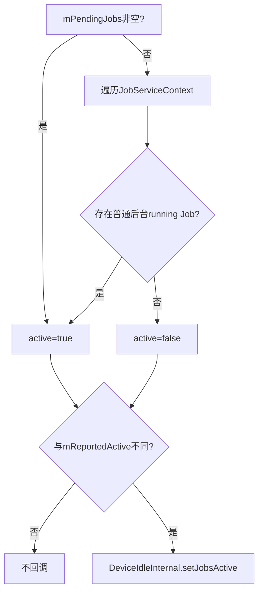
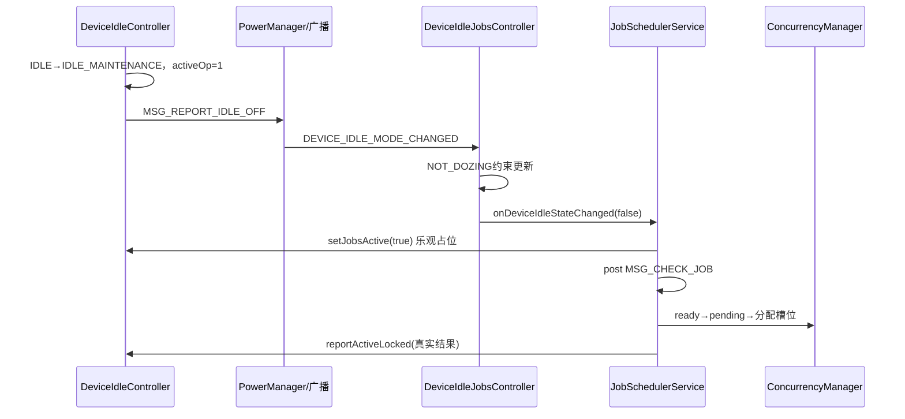
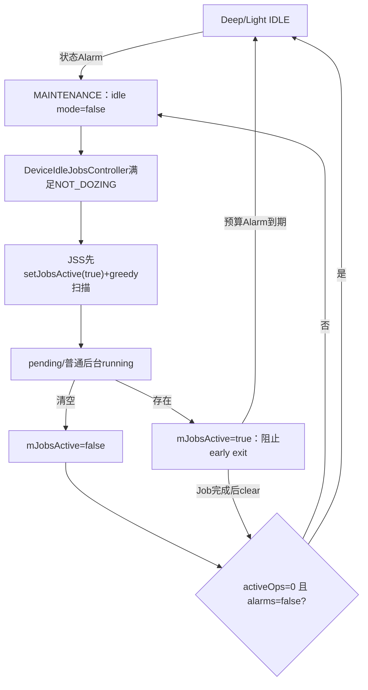
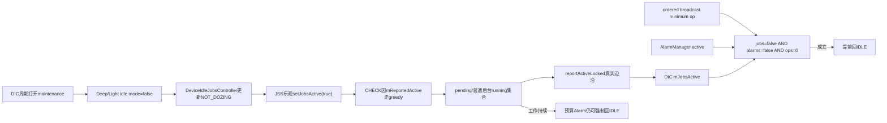

# 142 Android JSS 与 DeviceIdleController：jobs-active 反馈闭环

> 源码版本：Android 11 / API 30 / `android-11.0.0_r48`  
> 学习方式：macOS 只读源码，不要求编译、不要求连接设备  
> 前置章节：第 25、129、131、138、141 章

---

## 1. JobScheduler不只是被Doze限制

通常我们只看到单向关系：DeviceIdleController进入Doze，JobScheduler给Job加NOT_DOZING门并停止执行。

Android 11还有反向反馈：维护窗口打开后，JSS告诉DeviceIdleController“是否仍有Job工作”，后者据此决定能否提前结束
maintenance。两边形成控制闭环，而不是单向开关。

---

## 2. 本章目标

本章追 `mReportedActive → DeviceIdleInternal.setJobsActive()`，解释pending和running怎样计算active、为什么Doze退出时先
乐观置true、维护窗口最短时间/预算/Job反馈怎样共同决定退出，并区分状态机、NOT_DOZING约束、WakeLock与Job执行。

---

## 3. 源码地图

```text
frameworks/base/apex/jobscheduler/service/java/com/android/server/job/JobSchedulerService.java
frameworks/base/apex/jobscheduler/service/java/com/android/server/job/controllers/DeviceIdleJobsController.java
frameworks/base/apex/jobscheduler/framework/java/com/android/server/DeviceIdleInternal.java
frameworks/base/apex/jobscheduler/service/java/com/android/server/DeviceIdleController.java
frameworks/base/apex/jobscheduler/service/java/com/android/server/job/JobConcurrencyManager.java
frameworks/base/apex/jobscheduler/service/java/com/android/server/job/JobServiceContext.java
frameworks/base/services/tests/mockingservicestests/src/com/android/server/DeviceIdleControllerTest.java
```

---

## 4. 三个“active”不能混

| 名称 | 所属模块 | 含义 |
|---|---|---|
| UID active | AMS/AppStateTracker | UID处于前台活跃状态 |
| JSS `mReportedActive` | JobSchedulerService | 有需要反馈给DeviceIdle的Job工作 |
| DeviceIdle `mJobsActive` | DeviceIdleController | JSS上报的维护工作占用信号 |

同一个Job可因UID active而从running反馈中豁免；变量名字相近，方向却不同。

---

## 5. 本地服务接口

```java
public interface DeviceIdleInternal {
    void setJobsActive(boolean active);
    void setAlarmsActive(boolean active);
}
```

这是system_server内 `LocalServices` Java直调，不经过Binder驱动。AlarmManager也通过平行接口反馈活动。

---

## 6. 两边何时取得接口

DeviceIdleController启动时发布 `DeviceIdleInternal`；JSS在
`PHASE_THIRD_PARTY_APPS_CAN_START` 取得它，并创建执行contexts、attach Controller、发首次CHECK。

因此boot早期 `mLocalDeviceIdleController` 可为null，`reportActiveLocked()`会只更新本地布尔而不回调。

---

## 7. reportActiveLocked 的入口

JSS在以下关键点调用它：

```text
schedule立即ready并尝试分配之后
cancel/replacement之后
Job完成/重排之后
每次Handler末尾JCM分配之后
```

它报告的是扫描/槽位动作后的当前快照，不是固定周期轮询。

---

## 8. active计算的第一条规则

```java
boolean active = mPendingJobs.size() > 0;
```

只要内部pending队列非空，直接为true，不再检查该pending Job是不是前台、白名单或temp whitelist例外。

---

## 9. pending 为什么优先

pending表示完整ready且等待/竞争执行槽。即使尚未获得context，维护窗口若立即关闭，NOT_DOZING可能重新变false，使这批
刚准备运行的工作失去机会。

因此等待槽位本身就足以要求暂时保持maintenance。

---

## 10. running只有部分任务算active

pending为空时，JSS遍历active contexts，仅当running Job同时满足：

```java
FLAG_WILL_BE_FOREGROUND == 0
!job.dozeWhitelisted
!job.uidActive
```

才把active置true。

---

## 11. 三类running例外的共同点

前台即将运行flag、永久Doze白名单、source UID active都表示该Job不是靠普通后台maintenance才被允许。

即使它仍在运行，也不应独占“保持维护窗口”的反馈理由。

---

## 12. pending没有同样过滤

这是r48明确的不对称：pending一律active，running才过滤三类例外。

所以一个即将前台或白名单Job只要还在pending，也能暂时保持 `mJobsActive=true`；真正从pending移到running后，下次
report可能转false。

---

## 13. active只在边沿回调

```java
if (mReportedActive != active) {
    mReportedActive = active;
    local.setJobsActive(active);
}
```

相同值不重复通知，避免每轮JCM都触发DeviceIdle锁与退出检查。

---

## 14. reportActive 调用链



这里没有包/UID计数，最终只是一个全局布尔信号。

---

## 15. DeviceIdleController如何接收

```java
void setJobsActive(boolean active) {
    synchronized (this) {
        mJobsActive = active;
        if (!active) exitMaintenanceEarlyIfNeededLocked();
    }
}
```

true只记状态；false会立即尝试提前退出maintenance。

---

## 16. 为什么true不主动开启maintenance

`setJobsActive(true)`不会把IDLE切到MAINTENANCE，也不会唤醒设备。维护窗口何时打开由DeviceIdle自己的Alarm和状态机决定。

Job反馈只能阻止已经打开的窗口过早关闭。

---

## 17. 为什么false才触发检查

Job从有变无是“可能可以省电了”的边沿。DeviceIdle要同时确认Alarm与内部ordered-broadcast操作也结束，才能安全提前
回到IDLE。

true时窗口自然按已有预算Alarm继续，无需状态跳转。

---

## 18. 三项共同组成inactive

```java
return mActiveIdleOpCount <= 0
        && !mJobsActive
        && !mAlarmsActive;
```

Job、Alarm和DeviceIdle内部操作三者都空闲，才能提前结束。

---

## 19. mActiveIdleOpCount 是什么

进入deep/light maintenance时先设为1并持有 `mActiveIdleWakeLock`。报告idle-off时，deep/light模式变化各增加一次op，
对应ordered broadcast完成后再延迟减少。

它给系统组件时间看到“退出Doze”并安排工作。

---

## 20. 为什么ordered broadcast后还延迟

`mIdleStartedDoneReceiver` 在广播完成后不是立即dec，而是分别延迟：

```text
light maintenance 默认至少5秒
deep maintenance 默认至少30秒
```

注释说明需要让响应者在模式变化后有时间schedule work，否则此刻还看不到pending就可能立刻关窗。

---

## 21. minimum time不是完整窗口预算

5秒/30秒只控制内部active op何时释放，从而允许“提前退出”。

light维护还有默认1～5分钟动态预算；deep维护有下一状态Alarm。窗口也可被预算/状态Alarm强制推进，不能把minimum当成
固定窗口长度。

---

## 22. 维护窗口打开的顺序



“乐观占位”是闭环避免竞态的关键。

---

## 23. DeviceIdleJobsController先观察系统模式

它监听deep与light idle mode changed广播，并用：

```java
isDeviceIdleMode() || isLightDeviceIdleMode()
```

合成 `mDeviceIdleMode`。只有deep/light都false才认为maintenance/active可放行普通Job。

---

## 24. 退出Doze时前后台分批恢复

mode变false后，Controller立即更新前台source UID的Job；后台Job延迟3秒再更新NOT_DOZING。

这是第129章的恢复平滑策略，避免维护窗口一开就让全部后台Job同时冲击系统。

---

## 25. JSS为什么先强制mReportedActive=true

`onDeviceIdleStateChanged(false)` 中：

```java
if (!mReportedActive) {
    mReportedActive = true;
    mLocalDeviceIdleController.setJobsActive(true);
}
post MSG_CHECK_JOB;
```

模式广播刚到时，后台约束甚至还要等3秒，pending可能暂时为空。若不占位，DeviceIdle在minimum op结束时可能误判无工作
而提前退出，使后台Job错过这一轮维护窗口。

---

## 26. 乐观true何时被纠正

MSG_CHECK_JOB处理并在末尾执行JCM、`reportActiveLocked()`。若没有pending或符合条件的running Job，它把
`mReportedActive=false`并调用 `setJobsActive(false)`。

所以true不是永久锁存，而是“给调度器一次发现工作的机会”。

---

## 27. 3秒后台延迟与占位的配合边界

第一次CHECK可能早于后台NOT_DOZING批量更新，从而认为无Job并报false；但DeviceIdle的active op minimum仍通常阻止窗口
立刻结束。3秒后Controller更新后台Job并发普通状态变化，再次扫描。这里要注意：第一次CHECK已经可能把
`mReportedActive`纠正为false，所以3秒后的普通状态变化不保证继续走greedy；如果此时没有其他pending/running Job维持true，
它会重新走maybe批处理。minimum主要保证“窗口还没关”，并不保证所有后台Job都绕过batch门。

默认light minimum 5秒、deep minimum 30秒均大于3秒，给了恢复链余量。

---

## 28. 配置可破坏这个时间关系

DeviceIdle minimum maintenance与JSS的3秒延迟来自不同常量，代码没有交叉钳位。若平台把minimum配置得小于3秒，且
Job/Alarm/其他op都false，窗口可能在后台Job恢复前提前关闭。

这是设备配置必须联合验证的时序约束，不是Java类型系统保证。

---

## 29. JSS为何在退出Doze时用普通CHECK

占位先把 `mReportedActive=true`，第141章Handler看到active会让普通CHECK走greedy全量扫描，实际效果是跳过非ACTIVE
批处理门。

因此消息what虽是CHECK，反馈布尔改变了这一次扫描的政策。它直接帮助已经恢复约束的Job，尤其是立即更新的前台source UID；
对3秒后才恢复的后台Job，能否继续greedy取决于第一次扫描后是否仍保持 `mReportedActive=true`。

---

## 30. 这是一个自举技巧

```text
先假设有工作 → 普通CHECK变greedy → 尽快发现所有ready工作
→ 再用真实pending/running结果纠正假设
```

若先保持false，第一次CHECK会走maybe批处理，维护窗口可能开着却因不足5个Job不做工作，浪费窗口。这个自举只承诺
“先给一次greedy发现机会”，不是整段maintenance期间永久关闭batching。

---

## 31. maintenance不是全局ACTIVE状态

Deep状态机是 `STATE_IDLE_MAINTENANCE`，light是 `LIGHT_STATE_IDLE_MAINTENANCE`；PowerManager暴露的idle mode会暂时false，
但设备仍处于周期性维护阶段，预算结束后回到IDLE。

不要把“退出idle mode广播”误解成屏幕点亮或用户让设备永久ACTIVE。

---

## 32. Deep maintenance怎样开始

`STATE_IDLE`的Alarm触发 `stepIdleStateLocked()`：

```text
mActiveIdleOpCount=1
acquire active-idle wakelock
设置下一pending delay Alarm
记录maintenance start
STATE_IDLE→STATE_IDLE_MAINTENANCE
post MSG_REPORT_IDLE_OFF
```

下一Alarm形成硬的状态推进边界。

---

## 33. Light maintenance还看网络

LIGHT_STATE_IDLE到期时，若有网络进入maintenance；无网络先到WAITING_FOR_NETWORK，下一次再进入maintenance，即使仍无
网络也不无限等待。

这与Job connectivity约束是不同层：窗口是否开放与单Job网络是否满足分别判断。

---

## 34. Light maintenance预算可动态积累

默认最小预算1分钟、最大5分钟。上一次使用短于最小值，未用时间加到reserve；使用超过最小值则从reserve扣除。

下一次进入窗口时把当前预算钳在min/max，再设置light Alarm。

---

## 35. jobs-active只影响提前退出

`mJobsActive=true`让 `isOpsInactiveLocked()` false，从而阻止 `exitMaintenanceEarlyIfNeededLocked()`。

它不会取消deep/light已安排的maintenance结束Alarm。因此Job持续active也不能把窗口无限延长超过状态机预算。

---

## 36. 预算Alarm是上限方向

Alarm到达后直接调用 `stepIdleStateLocked` 或 `stepLightIdleStateLocked`，maintenance分支回到IDLE，并不先询问
`mJobsActive`。

jobs-active的语义是“预算内别过早收工”，不是“工作没完就永不休眠”。

---

## 37. minimum active op与jobs-active的AND关系

即使JSS立刻报false，`mActiveIdleOpCount>0`仍阻止提前退出；即使minimum时间已过，只要JSS报true或AlarmManager报true，
窗口仍保持到工作结束或预算Alarm。

三者是并列占用者，不是优先级覆盖。

---

## 38. active-idle WakeLock的真实边界

`decActiveIdleOps()` 计数到0就释放 `mActiveIdleWakeLock`，即使 `mJobsActive=true`。

所以该WakeLock只保护DeviceIdle自己的模式切换/广播启动期，不保护整个Job维护执行。真正运行的Job由
JobServiceContext持独立WakeLock；单纯pending并不靠active-idle WakeLock常亮CPU。

---

## 39. pending如何等待CPU机会

pending意味着逻辑候选，不代表CPU必须持续唤醒。JCM若有槽会尽快bind并取得Job WakeLock；无槽时其他running Job或后续
事件推动进度。

维护预算Alarm仍可唤醒并关闭窗口。

---

## 40. running例外为什么不保持窗口

`FLAG_WILL_BE_FOREGROUND`、dozeWhitelisted或uidActive Job即使maintenance结束，也可能继续满足DeviceIdle的例外公式。

让它们保持窗口只会给无关普通后台工作扩大机会，因此JSS从running active反馈中排除。

---

## 41. 但进入Doze时停止条件更粗

`onDeviceIdleStateChanged(true)` 遍历active contexts，仅对没有 `FLAG_WILL_BE_FOREGROUND` 的Job发
`REASON_DEVICE_IDLE`停止。

它没有在这里检查dozeWhitelisted或uidActive；这些Job是否真正失去NOT_DOZING由DeviceIdleJobsController更新公式决定，
但JSS这条专用停止循环仍可能请求停止它们。

---

## 42. 第129章与本章的两层再次对照

```text
DeviceIdleJobsController：计算每个Job NOT_DOZING satisfied位
JSS onDeviceIdleStateChanged：额外快速停止非WILL_BE_FOREGROUND active Job
JSS reportActiveLocked：反向报告维护窗口是否还有普通后台Job工作
```

三条路径相关但不是同一个条件表达式。

---

## 43. 进入Doze不立即report false

JSS停止active Job时没有在该分支直接调用 `reportActiveLocked()`。context停止完成后回到
`onJobCompletedLocked()`，再报告并发MSG检查。

因此DeviceIdle的 `mJobsActive`可能短暂保持true，直到异步停止清理收敛；这会保守延迟提前退出，不会提前截断工作。

---

## 44. Doze退出时的锁关系

DeviceIdleJobsController先在JSS `mLock` 内更新约束，退出该 `synchronized` 块后，才回调
`onDeviceIdleStateChanged`；JSS随后重新获取 `mLock`，并可能调用DeviceIdleController的synchronized方法。这里不是嵌套重入
同一monitor，而是“释放后再获取”，减少了回调期间持锁的范围。

广播是DeviceIdle Handler异步发出，通常不会在持有DeviceIdleController monitor时同步回调JSS，降低反向锁死风险。

---

## 45. LocalServices调用不是免费函数

虽然没有Binder序列化，`setJobsActive`仍会获取DeviceIdleController对象锁，并可能同步执行状态跳转、安排Alarm和post消息。

JSS调用时持有自身mLock，性能/锁顺序审计仍需把它当跨子系统调用看待。

---

## 46. false可能同步推进状态机

若当前在deep/light maintenance或light PRE_IDLE，且三类ops都inactive，`setJobsActive(false)` 内部会直接调用step方法。

因此一次JSS `reportActiveLocked()` 可同步触发DeviceIdle从maintenance回IDLE，而相关模式变更报告仍通过其Handler异步发送。

---

## 47. exitMaintenanceEarly的状态范围

只在：

```text
STATE_IDLE_MAINTENANCE
LIGHT_STATE_IDLE_MAINTENANCE
LIGHT_STATE_PRE_IDLE
```

尝试提前推进。ACTIVE、INACTIVE、IDLE、WAITING_FOR_NETWORK等状态即使jobs false也不会因此改变。

---

## 48. 为什么包含LIGHT_STATE_PRE_IDLE

light第一次准备进入idle前，如果之前存在active Job/Alarm/op，会进入PRE_IDLE短暂等待。它们全部结束时，无需等完整
pre-idle timeout，可立刻走 `s:predone` 进入IDLE。

这里jobs-active既管理maintenance收尾，也参与首次light idle前的settle等待。

---

## 49. Deep进入首个IDLE不看jobs-active吗

deep状态机主要由inactive/sensing/location constraints推进；`isOpsInactiveLocked()` 的PRE_IDLE逻辑只在light路径出现。

jobs-active反馈重点作用于maintenance早退，不是deep进入Doze的通用阻塞constraint。

---

## 50. AlarmManager的平行反馈

AlarmManager调用 `setAlarmsActive(boolean)`，实现与jobs相同：false时尝试early exit。

即使JSS没有工作，maintenance内还有Alarm投递/回调时，`mAlarmsActive=true`也会保留窗口。

---

## 51. active idle ops不是Job计数

它计的是DeviceIdle模式报告和ordered broadcast完成等内部操作；JSS所有Job只压缩成一个mJobsActive布尔。

10个pending Job与1个pending Job对DeviceIdle没有计数差异。

---

## 52. Job结束怎样反馈false

JobServiceContext cleanup回调JSS `onJobCompletedLocked()`；JSS移除/重排Job、`reportActiveLocked()`，随后post greedy。

如果没有其他pending或普通后台running，边沿true→false立即传给DeviceIdle并尝试early exit。

---

## 53. 周期/失败重排可能继续保持true

完成Job若产生新的failure或periodic JobStatus，它通常还要等时间约束，不一定pending。若其他pending也空，JSS可先报false；
未来重排Job ready时再报true。

反馈跟当前可运行工作走，不因“未来还有周期定义”永久保持窗口。

---

## 54. cancel怎样影响闭环

cancel从pending删除并请求active停止，末尾 `reportActiveLocked()`。pending是最后一个活动来源时可立即报false；active context
若仍running且符合普通后台条件，扫描仍看到它并保持true，直到cleanup。

这避免停止协议尚未完成就提前关窗。

---

## 55. replacement怎样影响闭环

旧pending被移除、旧active进入stop，新Job重新ready判断。`cancelJobImplLocked()`中间会report一次，schedule末尾又可能分配/
report。

布尔可能短暂波动，但DeviceIdle minimum op与预算使窗口不应因单个瞬时false立即丢失全部调度机会。

---

## 56. pending全量重建的瞬时窗口

第141章全量scan先 `mPendingJobs.clear()`，但直到Handler分支结束前不会调用reportActive；同一JSS锁内完成重建后，末尾JCM
才报告。

因此DeviceIdle看不到清空与重新add之间的内部瞬时false。

---

## 57. 锁带来的快照原子性

pending重建、JCM分配和reportActive都在JSS mLock内连续执行。其他Binder schedule/cancel无法插入中间改变列表。

反馈是这一轮调度动作后的自洽快照，而非无锁观察。

---

## 58. reportActive在JCM之后的重要性

JCM会把成功启动的Job从pending移除。若它属于running例外，active应从true变false；若是普通后台Job，则running扫描继续
保持true。

先分配再报告才能正确处理pending→running类型变化。

---

## 59. executeRunnableJob失败的边界

JCM即使 `executeRunnableJob()` 返回false，r48随后仍从pending remove并noteNonpending。若context里没有形成running Job，
reportActive可能转false。

后续失败清理/检查负责重新收敛；DeviceIdle反馈不会因为“曾尝试执行”永久为true。

---

## 60. mReportedActive是缓存，不是权威集合

权威事实来自mPendingJobs和mActiveServices；布尔只做边沿抑制与DeviceIdle镜像。

dumpsys看到它与某一瞬间容器不一致时，要考虑当前正在进行的异步context stop、Handler消息和是否尚未调用report。

---

## 61. DeviceIdle mJobsActive也只是上次上报

它不自己查询JobStore，也没有timeout自动清false。若JSS漏掉某个false边沿，maintenance可能保守保持到预算Alarm；不会无限，
因为状态机Alarm仍推进。

这是一种以省电延迟为代价、优先避免提前截断工作的设计。

---

## 62. 服务重启后的初始值

两个布尔默认false。JSS到THIRD_PARTY_APPS_CAN_START后首次CHECK重新扫描，并通过report把真实值送给已取得的
DeviceIdleInternal。

它们不跨system_server重启持久化，也不需要写文件。

---

## 63. DeviceIdle状态与Job持久化无关

persisted Job能从jobs.xml恢复，但maintenance当前状态、mJobsActive和first-force-batched等都是运行时协调状态。

重启后由设备交互/充电/状态机与Job约束重新收敛，不能恢复到崩溃前同一窗口剩余秒数。

---

## 64. 测试怎样证明AND门

DeviceIdleControllerTest分别设置：

```text
jobs active=true
alarms active=true
active ops=1
```

任何一项为active，deep/light maintenance都不early exit；三项全部inactive才回IDLE。测试覆盖了每个占用者的独立阻塞作用。

---

## 65. 测试也覆盖PRE_IDLE

light PRE_IDLE中三项全false会立刻转IDLE；任一active则保持PRE_IDLE。

这验证 `exitMaintenanceEarlyIfNeededLocked()` 不只服务maintenance窗口，还优化进入首个light idle前的收尾。

---

## 66. 测试不证明JSS分类完全正确

这些测试直接调用 `setJobsActive(true/false)`，主要验证DeviceIdle状态机响应；它们没有覆盖JSS pending一律计active、running
三类例外过滤的全部组合。

不能用下游单元测试替代对上游report公式的源码审计。

---

## 67. 时间轴：没有Job的deep窗口

```text
t0 deep IDLE→MAINTENANCE，activeOp=1
t1 idle-off广播，JSS乐观jobs=true并扫描
t2 无ready Job，JSS jobs=false
t3 ordered broadcast结束后再等默认30秒，activeOp→0
t4 alarms也false，立即early exit回IDLE
```

窗口至少给调度器和广播消费者一次反应机会。

---

## 68. 时间轴：有普通后台Job

```text
t0 打开maintenance
t1 JSS greedy发现Job，pending→jobs=true
t2 JCM启动，普通后台running仍使jobs=true
t3 minimum activeOp归零，但jobs仍true，不early exit
t4 Job完成，JSS报jobs=false
t5 alarms/ops均空，early exit；若预算Alarm先到则直接关窗
```

---

## 69. 时间轴：只有白名单running Job

pending阶段先让jobs=true；JCM启动后pending移除，running因dozeWhitelisted被过滤，JSS可能报false。

maintenance可提前结束，而白名单Job依靠自身例外继续，不需要扩大普通后台窗口。

---

## 70. 时间轴：没有槽位

Job保持pending，所以jobs=true，maintenance在预算内保持；若槽位始终不释放，预算Alarm仍会结束窗口，NOT_DOZING重新变false，
后续CHECK请求停止或清pending。

因此jobs-active不能把并发拥堵变成无限maintenance。

---

## 71. 反馈闭环图



---

## 72. “维护窗口”与“maintenance budget”区别

窗口是状态段；budget是状态Alarm允许的最长/目标时长；minimum maintenance是允许early exit前的响应期；jobs-active是预算
内的占用反馈。

四者不是同一个计时器或布尔。

---

## 73. Light reserve如何影响下一窗口

窗口若因jobs很快结束且duration小于1分钟，差额加到reserve，下次可获得更长budget；若工作持续超过1分钟，超出部分从
reserve扣除。

这让短窗口未用预算不会永久丢失，同时最大限制为默认5分钟。

---

## 74. Deep没有同样的light reserve公式

deep使用逐步增长的idle pending/idle delay和相应Alarm，未使用 `mCurLightIdleBudget` 的加减账本。

不要把light 1～5分钟预算机制套到deep maintenance。

---

## 75. 网络与jobs-active的交互

light无网络时可先WAITING；进入窗口后ConnectivityController仍按source UID active network判断每个Job。即使窗口开放，网络
Job可能不ready，JSS最终jobs=false并early exit。

维护允许联网不等于目标网络一定可用。

---

## 76. App Standby quota仍然存在

maintenance只让NOT_DOZING恢复，QuotaController的within-quota/dynamic约束仍需满足。没有可运行Job时JSS会清反馈。

Doze维护窗口不是所有后台配额的“免单时段”。

---

## 77. JobRestriction仍然存在

thermal等JSS Restriction也在完整ready门之后继续阻止。设备很热时维护窗口可能打开却没有Job候选，JSS很快报false。

DeviceIdle不会知道具体原因，只收到“有没有工作”的聚合布尔。

---

## 78. 第一次维护扫描可绕开非ACTIVE batching

JSS乐观置mReportedActive=true让紧随其后的CHECK走greedy，因此当时已经完整ready的RARE等Job无需凑默认5个/31分钟。

这是maintenance窗口的价值：既然设备已暂时醒来，优先冲刷已经ready的工作。它不是整段窗口的永久策略；后台约束3秒后
才恢复时，若第一次CHECK已清掉active反馈，后续普通CHECK仍可能回到maybe。

---

## 79. RESTRICTED也可被greedy冲刷

第141章ordinary maybe中RESTRICTED永远force-batched，但greedy不看这层数量门。只要它在这次greedy扫描时dynamic/quota等
已经完整ready，就可进入pending。

这不等于RESTRICTED自动ready，只是取消额外batch等待。

---

## 80. 为什么onDeviceIdleStateChanged(false)先report true再post

如果仅post CHECK，主Looper排队期间DeviceIdle minimum op可能结束并看到旧mJobsActive=false；状态机有机会提前回IDLE，
之后CHECK读取到Doze又开启而无事可做。

同步true先跨过这段消息队列延迟。

---

## 81. readyToRock门

Doze退出回调只有 `mReadyToRock` 才占位并post检查。boot尚未准备好时不保持maintenance给JSS，因为Controller/contexts还未完整
attach。

后续THIRD_PARTY phase首次CHECK负责正常启动调度。

---

## 82. mLocalDeviceIdleController null边界

代码先判断local service非null才set true，但无论如何在readyToRock时都会post CHECK。正常启动顺序下接口应存在；异常缺失时
JSS仍可调度，却不能反馈窗口占用。

dumpsys需同时看两边布尔验证链路。

---

## 83. dumpsys JSS看什么

JSS dump输出 `mReportedActive`，并可看pending queue、active contexts、每个Job的dozeWhitelisted/uidActive和flags。

单独看到true不能知道是哪个Job贡献，需按report公式反推。

---

## 84. dumpsys deviceidle看什么

DeviceIdle dump仅在true时打印 `mJobsActive`、`mAlarmsActive`，并显示 `mActiveIdleOpCount`、deep/light state、maintenance start与
下一Alarm。

三项并列可解释为什么窗口没有early exit。

---

## 85. 两边布尔不一致如何诊断

```text
JSS true / DIC false：local回调缺失、尚未取得服务或异常状态
JSS false / DIC true：false边沿尚未report、锁/消息正在处理中或调用链异常
```

正常同步LocalServices调用返回后应快速一致；长期不一致才是缺口。

---

## 86. 不能用PowerManager idle布尔替代DIC状态

maintenance期间 `isDeviceIdleMode()` false，但DIC内部仍是IDLE_MAINTENANCE。需要结合dumpsys state判断是用户活跃还是周期窗口。

相同公开布尔false对应完全不同的下一步策略。

---

## 87. 不能用mJobsActive判断Job正在执行

pending即可为true；running例外Job可让它false。它既不是running count，也不是CPU busy。

要确认执行应看JobServiceContext、JobPackageTracker active事件和App回调。

---

## 88. 不能用mJobsActive判断有registered Job

大量waiting constraints或未来periodic Job都不会贡献active。它只表示当前维护窗口值得为可运行普通后台Job保留。

registered集合和维护占用是不同维度。

---

## 89. 反馈可能保守而不精确

进入Doze停止异步、pending例外未过滤、布尔边沿报告时点都可能短暂高报active。高报最多推迟early exit到预算上限，比低报提前
截断工作更安全。

这是控制系统常见的保守策略。

---

## 90. 低报风险主要在哪

execute失败却移出pending、配置minimum短于后台3秒恢复、漏掉report调用或local service异常都可能让false过早出现。

预算/广播active ops和后续Controller消息提供部分恢复，但平台配置与异常路径仍需测试。

---

## 91. 锁顺序风险模型

```text
JSS mLock → DeviceIdleController monitor
DeviceIdle Handler/monitor → 异步广播 → JSS mLock（通常非同步嵌套）
```

若未来修改成DIC持锁同步调用JSS，就可能形成反向锁序。维护这条链时应保留异步广播边界或重新设计锁外回调。

---

## 92. LocalServices不是跨进程身份边界

没有calling UID权限校验或clearCallingIdentity；只有system_server内拿到接口的可信服务可调用。

安全依赖模块可见性与LocalServices注册，不是manifest permission。

---

## 93. 状态机Alarm与Wakeup

deep/light Alarm负责周期进入/退出维护，DeviceIdle持必要WakeLock完成模式切换；Job自身运行另持WakeLock。

这避免一个全局WakeLock覆盖整个长窗口，也让预算到期能重新休眠。

---

## 94. App看不到jobs-active接口

公共App只能观察Job回调、PowerManager idle状态和系统允许的API；不能直接set `mJobsActive`延长维护窗口。

这防止应用通过伪造“还有Job”永久阻止Doze。

---

## 95. 正确的应用设计

维护窗口短且可能在预算到期被截断；`onStopJob()`、WorkItem重投和进程死亡都要求业务幂等、分块、可恢复。

不要假设jobs-active会替某个单Job保证执行到完成。

---

## 96. 长任务会发生什么

maintenance结束、NOT_DOZING重新false后，普通后台Job会被Controller/JSS请求stop，即便它仍使mJobsActive=true。

反馈不能覆盖DeviceIdle状态机的预算上限。

---

## 97. 前台Job的特殊性

WILL_BE_FOREGROUND Job进入Doze时专用停止循环豁免，running反馈也不保持maintenance。它依赖调用方受限flag权限与后续前台
语义，而非普通后台窗口。

普通App不能用公开API随意设置该隐藏flag。

---

## 98. uidActive Job的特殊性

running时不计jobs-active，但DeviceIdleJobsController的最终NOT_DOZING公式对UID active也有特定放行关系。

UID退后台后Controller更新可能使约束丢失，届时Job停止；反馈公式也会重新把仍running的普通Job计入active，取决于事件顺序。

---

## 99. 白名单Job的特殊性

永久/临时白名单与dozeWhitelisted字段并非同一时刻、同一层完全等价；reportActive只读取JobStatus当前
`dozeWhitelisted`布尔。

临时白名单对WILL_BE_FOREGROUND/IMPORTANT路径的完整公式仍以第129章源码为准。

---

## 100. 场景推演一：空窗口

deep maintenance打开，JSS无ready Job、AlarmManager也无活动。JSS先true后false；minimum deep 30秒active op归零后，DIC
立即early exit，不浪费完整下一pending delay。

---

## 101. 场景推演二：一个RARE Job

普通时它可能因不足5个被batch；maintenance退出Doze先把mReportedActive设true，使第一次CHECK greedy。若该RARE Job的
NOT_DOZING已立即恢复且其他约束完整ready，它可进pending并保持窗口；若它属于3秒后才更新的后台Job，则后续扫描是否greedy
还取决于active反馈有没有被其他工作维持。

---

## 102. 场景推演三：一个白名单Job

greedy先入pending，反馈true；JCM启动后pending为空，running因dozeWhitelisted不计反馈，JSS报false。minimum结束后窗口可关，
Job依靠白名单条件继续或按Controller公式收敛。

---

## 103. 场景推演四：两个普通Job串行

第一个running、第二个pending，反馈true。第一个完成后JCM让第二个启动，仍有普通running所以true；第二个完成才false并尝试
early exit。

布尔无需计数也能覆盖“至少一个工作”的集合语义。

---

## 104. 场景推演五：Job卡住

普通Job一直运行，jobs=true，但deep/light预算Alarm到期，DIC回IDLE；NOT_DOZING丢失后JSS请求停止。JobService还有stop ack
超时保护，不能无限占用maintenance。

---

## 105. 场景推演六：background延迟晚于minimum

设备定制把light minimum设1秒，而DIJC后台恢复仍3秒。1秒时JSS/Alarm/ops都false，DIC early exit；3秒时Job恢复约束前模式
已回idle，最终仍不ready。

这是跨常量配置失配的具体失败链。

---

## 106. macOS只读练习一：手算report公式

```bash
sed -n '1350,1390p' \
  frameworks/base/apex/jobscheduler/service/java/com/android/server/job/JobSchedulerService.java
```

分别推演pending白名单Job、running白名单Job、running uidActive Job和普通running Job。

---

## 107. macOS只读练习二：追乐观占位

```bash
sed -n '1295,1340p' \
  frameworks/base/apex/jobscheduler/service/java/com/android/server/job/JobSchedulerService.java

sed -n '145,180p' \
  frameworks/base/apex/jobscheduler/service/java/com/android/server/job/controllers/DeviceIdleJobsController.java
```

画出idle mode false、前台立即、后台3秒与CHECK的相对顺序。

---

## 108. macOS只读练习三：读三项AND门

```bash
sed -n '3250,3450p' \
  frameworks/base/apex/jobscheduler/service/java/com/android/server/DeviceIdleController.java
```

解释jobs、alarms、active ops任一为true时为什么不能early exit。

---

## 109. macOS只读练习四：比较minimum与budget

```bash
sed -n '1165,1205p' \
  frameworks/base/apex/jobscheduler/service/java/com/android/server/DeviceIdleController.java

sed -n '3005,3090p' \
  frameworks/base/apex/jobscheduler/service/java/com/android/server/DeviceIdleController.java
```

找出默认5秒、30秒、1分钟、5分钟分别控制什么。

---

## 110. macOS只读练习五：追ordered broadcast op

```bash
sed -n '650,685p' \
  frameworks/base/apex/jobscheduler/service/java/com/android/server/DeviceIdleController.java

sed -n '1435,1520p' \
  frameworks/base/apex/jobscheduler/service/java/com/android/server/DeviceIdleController.java
```

按activeOp初值、deep/light changed增量、message自身dec和广播完成延迟dec手算计数。

---

## 111. macOS只读练习六：读deep/light状态机

```bash
sed -n '3000,3250p' \
  frameworks/base/apex/jobscheduler/service/java/com/android/server/DeviceIdleController.java
```

标出进入maintenance、预算Alarm和回IDLE三组动作，以及jobs-active没有参与哪条判断。

---

## 112. macOS只读练习七：核对WakeLock边界

```bash
rg -n 'mActiveIdleWakeLock|mGoingIdleWakeLock|mWakeLock' \
  frameworks/base/apex/jobscheduler/service/java/com/android/server/DeviceIdleController.java \
  frameworks/base/apex/jobscheduler/service/java/com/android/server/job/JobServiceContext.java
```

区分模式切换WakeLock与逐Job执行WakeLock。

---

## 113. macOS只读练习八：读测试矩阵

```bash
rg -n 'testExitMaintenanceEarly.*activeJobs|setJobsActive' \
  frameworks/base/services/tests/mockingservicestests/src/com/android/server/DeviceIdleControllerTest.java
```

确认测试证明的是DIC状态机AND门，而非JSS上游分类的全部组合。

---

## 114. 阅读检查题

1. mReportedActive与UID active有什么区别？
2. pending与running对反馈的过滤为何不对称？
3. setJobsActive(true)会主动打开maintenance吗？
4. 三项inactive公式是什么？
5. JSS退出Doze时为什么先乐观上报true？
6. 3秒后台延迟与5/30秒minimum如何配合？
7. minimum与light budget有何区别？
8. jobs-active为何不能无限延长窗口？
9. active-idle WakeLock是否覆盖整个Job执行？
10. 为什么普通CHECK实际会走greedy？
11. running白名单Job为何不保持窗口？
12. user stop、Doze与maintenance分别改变哪层状态？

---

## 115. 常见误解一：jobs-active表示Job正在跑

纠正：任何pending都为true；三类例外running反而不计。它是维护窗口占用信号，不是执行状态。

---

## 116. 常见误解二：Job没完成窗口就不会关

纠正：jobs-active只阻止early exit；预算/状态Alarm仍可结束maintenance，随后约束丢失会停止Job。

---

## 117. 常见误解三：5秒/30秒就是窗口长度

纠正：它们是ordered广播后允许early exit前的minimum响应期；light预算默认1～5分钟，deep另有状态Alarm。

---

## 118. 常见误解四：维护窗口一开全部Job运行

纠正：只解除Doze层，Quota、网络、standby、thermal、用户、组件和并发仍在；greedy只绕过额外batch门。

---

## 119. 常见误解五：LocalServices没有并发风险

纠正：没有IPC不等于没有锁。JSS持mLock同步获取DIC monitor，false还可能推进状态机，必须维护锁序。

---

## 120. 一页复习图



---

## 121. 本章结论

1. Doze与JSS是双向反馈，不只是DeviceIdle单向限制Job；
2. DeviceIdleInternal是system_server本地Java接口，不走Binder；
3. mReportedActive有pending即true，running则过滤三类例外；
4. pending与running过滤不对称是r48真实实现；
5. 布尔只在边沿同步给DIC的mJobsActive；
6. setJobsActive(true)只保持已有窗口，不主动开窗；
7. false会同步尝试early exit；
8. jobs、alarms、active idle ops必须全部inactive；
9. idle-off ordered broadcast及默认light 5秒/deep 30秒minimum给系统安排工作；
10. 维护退出Doze时JSS先乐观true，防主Looper扫描前提前关窗；
11. 乐观true还让紧随其后的普通CHECK选择greedy，冲刷当时已ready的非ACTIVE Job；
12. 后台NOT_DOZING延迟3秒，默认小于5/30秒minimum；
13. 两组常量无交叉钳位，定制失配可能提前关窗；
14. light maintenance预算默认1～5分钟，可按使用量积累/扣减；
15. deep使用另一组状态Alarm，不套light reserve；
16. jobs-active只阻止early exit，预算Alarm仍会回IDLE；
17. active-idle WakeLock只保护模式切换，Job执行有独立WakeLock；
18. report在JCM之后，能正确观察pending→running例外变化；
19. 全量pending重建与report同锁，内部瞬时clear不会泄露给DIC；
20. 反馈是全局布尔，不保证单个Job完成，App仍需幂等可恢复。

最值得带走的一句话：

> Doze maintenance不是系统无条件赠送的一段固定运行时间：JSS先用乐观jobs-active守住窗口，再用真实pending/running反馈决定是否提前归还；DeviceIdle同时用minimum、Alarm与预算兜底，既给后台工作一次机会，又不让任何单个Job无限占住设备。

---

## 122. 生成后复读：容易误解处的修订

初稿后重新对照JSS、DeviceIdleJobsController、DeviceIdleInternal、DeviceIdleController及其测试，完成以下修订：

1. 分开UID active、mReportedActive与mJobsActive三种active；
2. 确认LocalServices直调无Binder但仍跨两把系统服务锁；
3. 逐行还原pending优先与running三例外过滤；
4. 发现pending没有例外过滤，不能套用running公式；
5. 明确set true不进入maintenance，只阻止early exit；
6. 将jobs/alarms/activeOps整理为AND门；
7. 追踪maintenance进入时activeOp=1与ordered广播增减；
8. 区分default light 5秒/deep 30秒minimum和light 1～5分钟budget；
9. 确认minimum结束只释放early-exit门，不是固定窗口结束；
10. 发现active-idle WakeLock在ops归零即释放，不由jobs-active保持；
11. 明确逐Job执行另有JobServiceContext WakeLock；
12. 解释退出Doze先乐观set true的竞态防护；
13. 说明乐观true让第一次CHECK实际走greedy，并补充3秒后后台扫描可能回到maybe；
14. 对照前台即时/后台3秒恢复与5/30秒minimum；
15. 发现两组常量没有交叉合法性钳位；
16. 限定定制minimum过短可能早于后台恢复关窗；
17. 分开deep/light maintenance状态与公开idle mode false；
18. 核对light无网WAITING与动态reserve预算；
19. 确认jobs-active不阻止预算Alarm强制回IDLE；
20. 限定进入Doze专用stop循环只豁免WILL_BE_FOREGROUND；
21. 补出active停止完成前反馈可能保守高报；
22. 说明pending全量重建与report同锁，不暴露中间false；
23. 确认JCM分配后再report处理pending→running例外；
24. 用测试矩阵验证DIC下游AND门，但不夸大为JSS分类测试；
25. 将所有练习限定为macOS `rg`/`sed`只读推演，不要求编译。

---

## 123. 下一章

第143章进入 `JobSchedulerService` 的常量热更新：从Settings Global `jobscheduler_constants`、ContentObserver与
KeyValueListParser追到批处理、backoff、网络、API quota和并发矩阵的运行期刷新，分析哪些新值立即生效、哪些只影响下一轮
扫描/新Job，以及错误配置、无钳位和dump可观测边界。
