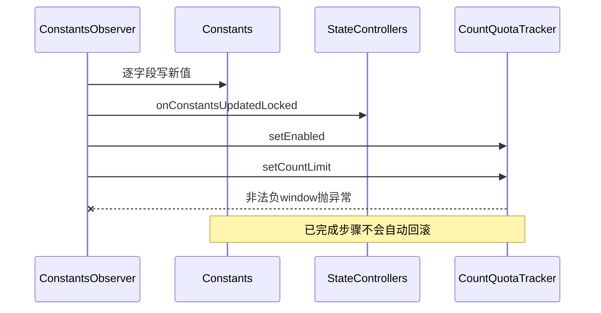
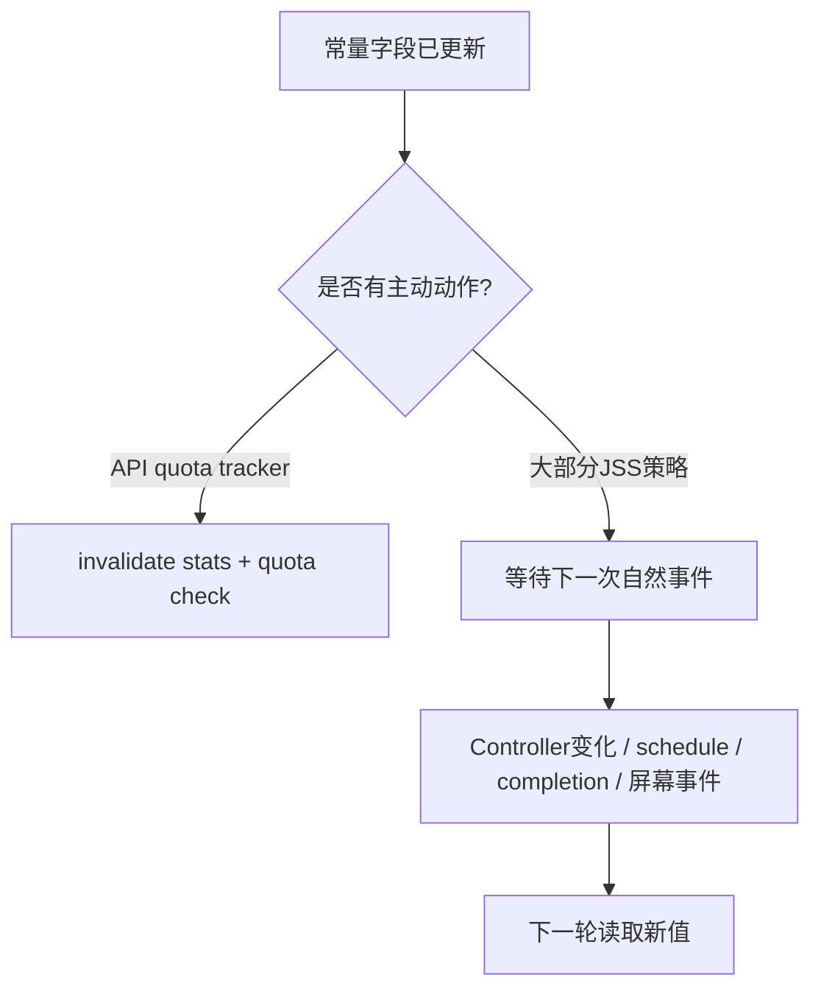

# 143 Android JSS：常量热更新与运行期生效边界

> 源码版本：Android 11 / API 30 / `android-11.0.0_r48`  
> 学习方式：macOS只读源码，不要求编译、不要求连接设备  
> 前置章节：第122、123、131、134、136、141章

---

## 1. 本章要解决什么

JobScheduler很多策略并非写死在Java常量里。Android 11把一组总控参数放进
`Settings.Global.job_scheduler_constants`，system_server运行中收到设置变化便重新解析。

“热更新”容易让人误以为新值会立即重算一切。本章要精确回答：谁监听、在哪个线程和锁里更新、哪些调用下一次自然读到新值、
哪些已有状态不会被主动重建，以及坏配置怎样造成默认回退、钳位或部分提交。

---

## 2. 源码地图

```text
frameworks/base/apex/jobscheduler/service/java/com/android/server/job/JobSchedulerService.java
frameworks/base/apex/jobscheduler/service/java/com/android/server/job/JobConcurrencyManager.java
frameworks/base/apex/jobscheduler/service/java/com/android/server/job/controllers/StateController.java
frameworks/base/apex/jobscheduler/service/java/com/android/server/job/controllers/ConnectivityController.java
frameworks/base/core/java/android/util/KeyValueListParser.java
frameworks/base/services/core/java/com/android/server/utils/quota/CountQuotaTracker.java
frameworks/base/services/core/java/com/android/server/utils/quota/QuotaTracker.java
frameworks/base/core/java/android/provider/Settings.java
```

---

## 3. 先分清三套配置

本章只讲JSS总控串 `JOB_SCHEDULER_CONSTANTS`。QuotaController另有
`job_scheduler_quota_controller_constants`，TimeController也有自己的设置与Observer。

它们属于同一子系统，却是不同URI、不同parser、不同回调，不能看见“JobScheduler常量”就假设一次写入能修改全部Controller。

---

## 4. Settings键的真实名字

```java
public static final String JOB_SCHEDULER_CONSTANTS = "job_scheduler_constants";
```

值是一条逗号分隔的字符串，例如：

```text
min_ready_non_active_jobs_count=5,max_non_active_job_batch_delay_ms=1860000
```

这不是结构化表，也没有跨字段schema校验器。

---

## 5. 启动注册时点

JSS构造时只创建 `Constants` 和 `ConstantsObserver`；到
`PHASE_SYSTEM_SERVICES_READY` 才：

```java
mConstantsObserver.start(getContext().getContentResolver());
```

`start()` 注册ContentObserver后立刻调用一次 `updateConstants()`，所以启动初值来自当时Settings，而非必须等下一次通知。

---

## 6. 线程模型

Observer构造参数是JSS的 `mHandler`，因此Settings变化回调被投递到JSS主Handler所在线程。更新方法再获取JSS `mLock`。


没有专用配置线程，也不经过应用进程。

---

## 7. 更新主链

```java
synchronized (mLock) {
    mConstants.updateConstantsLocked(Settings.Global.getString(...));
    for (StateController sc : mControllers) {
        sc.onConstantsUpdatedLocked();
    }
    updateQuotaTracker();
}
```

三个阶段共享JSS锁：改字段、通知Controller、把API配额参数复制进独立QuotaTracker。

---

## 8. Controller回调在r48实际上是空钩子

`StateController.onConstantsUpdatedLocked()` 默认空实现；在当前JSS controllers树中没有override。

所以“逐Controller通知”在r48提供扩展点，但并不会主动重算Connectivity约束或扫描所有Job。ConnectivityController以后评估时直接读取
共享 `mConstants` 的新比例。

---

## 9. Parser每次先清空

`KeyValueListParser.setString()` 第一行是：

```java
mValues.clear();
```

因此新字符串是完整配置快照，不是增量patch。旧串有A和B，新串只写A，则B恢复代码默认值，不会保留旧值。

---

## 10. 空值的语义

Settings值为null或空串时，map保持空，随后每个getter返回默认值。删除这条Global setting相当于整体恢复默认。

---

## 11. 未知键与重复键

未知键会进入map但没人读取，静默忽略；同名键重复时 `ArrayMap.put()` 后者覆盖前者。

这意味着拼错键通常不会报错，而会令目标字段回到默认值，是排查配置“不生效”时最常见的陷阱之一。

---

## 12. 语法错误与类型错误不同

缺少等号属于整串语法错误：parser清空map并抛异常，`Constants`内部catch后继续从空map读取，因此全部字段恢复默认。

某个值类型错误则getter只让该字段回默认，其他合法字段仍更新。例如 `heavy_use_factor=abc` 不会使整串失败。

---

## 13. Boolean有一个反直觉边界

`Boolean.parseBoolean()` 对除忽略大小写的`true`之外任何字符串都返回false，并不会抛异常。因此：

```text
enable_api_quotas=tru   → false
```

它不会使用默认true。配置拼写错误可能真的关闭API quota。

---

## 14. Duration支持两种格式

`getDurationMillis()`接受毫秒整数，也接受Java `Duration` 的ISO-8601形式：

```text
min_linear_backoff_time=30000
min_linear_backoff_time=PT30S
```

非法Duration仅让该字段回默认。

---

## 15. 总控字段分组

```text
批处理：min_ready_non_active_jobs_count、max_non_active_job_batch_delay_ms
负载降权：heavy_use_factor、moderate_use_factor
并发：screen on/off × normal/moderate/low/critical × total/max_bg/min_bg
熄屏：screen_off_job_concurrency_increase_delay_ms
失败退避：min_linear_backoff_time、min_exp_backoff_time
网络：conn_congestion_delay_frac、conn_prefetch_relax_frac
API配额：enable、count、window、throw_exception、return_failure
```

---

## 16. 批处理参数何时生效

第141章的 `maybeQueueReadyJobsForExecutionLocked()` 每次扫描现场读取最小数量和最大等待时间。改值后并不自动post CHECK，
但下一次普通CHECK会使用新值。

因此“字段立即变了”和“已有Job立即被扫描”是两回事。

---

## 17. 31分钟参数没有配套Alarm

把最大batch delay从31分钟改成1分钟，不会为已经等待的Job补一个1分钟Alarm；仍要等Controller变化、schedule/cancel或其他消息触发扫描。

热更新本身也没有 `MSG_CHECK_JOB`，所以不能把它当精确定时器。

---

## 18. 负载阈值何时生效

`evaluateJobPriorityLocked()` 下次计算优先级时读取heavy/moderate阈值。已经写入
`JobStatus.lastEvaluatedPriority` 的快照不会仅因配置变化自动刷新；下一轮候选评估/JCM分配才收敛。

---

## 19. 并发矩阵的钳位

每个矩阵格解析后执行：

```text
total ∈ [1, 16]
maxBg ∈ [1, total]
minBg ∈ [0, maxBg]
minBg < total
```

这里16来自固定 `MAX_JOB_CONTEXTS_COUNT`。配置无法凭空创建第17个JobServiceContext。

---

## 20. 并发值不是立即抢占命令

新矩阵对象字段立刻可见，但只有下一次 `assignJobsToContextsLocked()` 调用
`updateMaxCountsLocked()` 时选择当前screen/memory格。降低total不会在Observer里遍历并停止超额active Job。

它主要约束下一轮分配，而不是强制把正在执行数瞬间压到新上限。

---

## 21. 内存状态还有1秒缓存

JCM `refreshSystemStateLocked()` 对memory trim查询设置最短刷新间隔。即使矩阵热更新，下一次分配也可能继续使用缓存的
`mLastMemoryTrimLevel`，但会从新矩阵选择该缓存级别对应的格子。

---

## 22. 熄屏延迟的“在途Runnable”边界

屏幕熄灭时按当时的delay执行 `postDelayed(mRampUpForScreenOff, oldDelay)`。配置改变不会remove并重投这个Runnable。

Runnable真正运行时又用新delay检查：若新delay更长，它会提前return，且代码不重新post，可能一直等到其他事件触发；若新delay更短，
旧投递仍可能晚到。故它不是无缝可重定时的Alarm。

---

## 23. 退避下限只影响新一代Job

失败完成时，JSS用当前 `MIN_LINEAR_BACKOFF_TIME` / `MIN_EXP_BACKOFF_TIME` 创建reschedule JobStatus。

已经计算出earliest runtime并放入JobStore的失败Job不会被常量更新回溯重写。新值从下一次失败重排开始生效。

---

## 24. 网络比例是下一次评估生效

ConnectivityController的拥塞延迟与prefetch计量放宽逻辑，每次 `isSatisfied()` 读取共享Constants。

但Observer空钩子不主动重算所有tracked jobs；要等网络能力回调、UID规则变化或JSS其他评估路径。

---

## 25. 比例没有范围钳位

两个float没有限制在0～1。负数、2、甚至 `NaN` 都可进入字段。

`NaN`参与 `<`/`>` 比较通常都为false，会产生很不直观的分支结果。这里只能靠配置纪律，不能假设parser提供业务校验。

---

## 26. API schedule次数有最低250钳位

```java
API_QUOTA_SCHEDULE_COUNT = Math.max(250, parsedCount);
```

把它设成10仍得到250；可以调高，不能通过该键调低到250以下。

---

## 27. API quota为什么要复制

JSS字段不是实际账本。`updateQuotaTracker()`调用：

```java
mQuotaTracker.setEnabled(enable);
mQuotaTracker.setCountLimit(category, count, window);
```

CountQuotaTracker随后使缓存统计失效并schedule quota check。这里是真正带主动后续动作的一组热更新。

---

## 28. 关闭quota会清历史

`QuotaTracker.setEnabled(false)` 会调用 `clear()`，丢弃事件和内部tracking数据。之后再开启不会恢复关闭前的schedule事件。

所以enable不是单纯暂停判断，而有不可逆的内存账本清空语义。

---

## 29. window会在Tracker二次钳位

JSS parser本身允许任意long；CountQuotaTracker把window限制到其 `MIN_WINDOW_SIZE_MS..MAX_WINDOW_SIZE_MS`。

因此JSS dump可显示原始请求值，而Tracker实际使用值可能已被二次钳位；观察时要明确你dump的是哪一层。

---

## 30. 负window会造成部分提交风险

负数通过 `getDurationMillis()`进入Constants。`setCountLimit()`发现负window后抛
`IllegalArgumentException`，外层Observer catch记录“Bad jobscheduler settings”。

但此前Constants字段、Controller空回调乃至 `setEnabled()` 已经执行，没有事务回滚。于是一次坏配置可能留下“Constants新值 +
Tracker旧limit/window”，甚至enable变化已清账本的部分提交状态。

---

## 31. 为什么外层catch不等于恢复默认

外层catch只记录错误，没有重新调用默认配置，也没有保存旧Constants快照。必须区分：

```text
setString语法错 → 内层清map后各字段读默认
后续业务校验抛错 → 前面字段可能已经提交，外层只日志
```

“Bad jobscheduler settings”这行日志不足以判断最终状态。

---

## 32. 热更新不是原子的跨对象事务

对持有JSS锁的读者，Constants字段更新过程不会并发可见；但JSS锁无法为CountQuotaTracker自己的对象状态提供回滚事务。



---

## 33. throw与return两个开关的组合

schedule API超额后的行为由两个布尔控制。生产/调试路径还受JSS现有逻辑约束，不能只读键名推断优先级。

热更新只改变后续schedule调用；已经返回成功并存入JobStore的Job不会被追溯取消。

---

## 34. deprecated键为何还列着

Constants保留多组deprecated key名称，但 `updateConstantsLocked()` 已不读取它们。旧文档或旧设备命令写这些键，在r48通常静默无效。

Settings.java附近注释也仍列出旧键，阅读时应以消费者代码“有没有get/parse”为准，而非只相信配置项注释。

---

## 35. dump看见的是解析后字段

`dumpsys jobscheduler` 的Settings段输出Constants当前值，包括并发矩阵钳位后的值和API count最低250后的值。

它不原样回显Settings字符串，也不展示每个字段是默认、合法解析还是错误回退而来。

---

## 36. 文本dump与Proto

两者都覆盖核心字段；Proto适合机器采集，文本适合人工对照。但Tracker二次window钳位、是否清过历史等运行过程仍需结合对应Tracker dump/日志。

---

## 37. 一张生效边界表

| 参数 | 字段何时变 | 已有状态是否主动重建 | 真正使用时点 |
|---|---|---|---|
| batch数量/时长 | Observer回调 | 否，不post CHECK | 下一次maybe扫描 |
| load factor | Observer回调 | 否 | 下一次优先级评估 |
| 并发矩阵 | Observer回调 | 不主动停active | 下一次JCM分配 |
| 熄屏delay | Observer回调 | 不重投在途Runnable | 后续熄屏/在途二次检查 |
| backoff下限 | Observer回调 | 不改已有窗口 | 下一次失败重排 |
| 网络比例 | Observer回调 | Controller空钩子 | 下一次网络约束评估 |
| API quota | Observer后复制 | Tracker使统计失效/检查 | 后续schedule调用 |

---

## 38. 配置流不是调度触发流



这是本章最重要的模型。

---

## 39. 场景一：把batch数量5改1

字段立即为1，但若系统没有新消息，已等待Job仍可继续pending外等待。下一次普通CHECK时，一个完整ready的非ACTIVE Job即可达到门槛。

---

## 40. 场景二：把total从10改2

正在运行6个Job不会被Observer直接停掉。下一轮分配读取上限2，不再扩张；随着现有Job自然完成，active数逐步收敛。

---

## 41. 场景三：降低backoff

已经安排在20分钟后的失败Job保持原窗口；另一个Job在更新后失败，才按新下限计算。相同配置时刻前后两代Job可以拥有不同窗口。

---

## 42. 场景四：写错布尔

`enable_api_quotas=yes` 解析为false并清空Tracker历史，不是回默认true。改回true后从空账本重新统计。

---

## 43. 场景五：整串有裸单词

```text
heavy_use_factor=.8,oops,min_ready_non_active_jobs_count=2
```

`oops`无等号使parser清空整张map，所有总控字段随后按默认重写，而不是仅忽略oops。

---

## 44. 场景六：未知拼写

```text
min_ready_non_active_job_count=1
```

少了 `jobs` 的s。语法合法、未知键静默存放，真正字段缺失并回默认5；日志可能完全安静。

---

## 45. 安全审计清单

1. 是否整串覆盖而误删其他键；
2. 键名是否仍被r48消费者读取；
3. 数字是否有本层或下游钳位；
4. 负数、NaN与乱写boolean怎样处理；
5. 更新是否主动触发重扫；
6. 已有Job保存的是派生快照还是运行时读取；
7. 异常前是否已发生不可回滚副作用；
8. dump展示原始值、解析值还是下游有效值。

---

## 46. macOS只读练习一：列出所有真实消费者

```bash
rg -n "mConstants\\." \
  frameworks/base/apex/jobscheduler/service/java/com/android/server/job
```

按“扫描时读取、创建新Job时读取、分配时读取、复制到Tracker”四类给结果做标记。

---

## 47. macOS只读练习二：验证空回调

```bash
rg -n "onConstantsUpdatedLocked" \
  frameworks/base/apex/jobscheduler/service/java/com/android/server/job
```

不要从循环调用推断Controller一定做了工作，要继续找override。

---

## 48. macOS只读练习三：手算parser

分别推演：

```text
null
heavy_use_factor=.8
heavy_use_factor=abc,min_ready_non_active_jobs_count=2
heavy_use_factor=.8,oops
enable_api_quotas=tru
```

写出每种情况下map、默认回退与副作用。

---

## 49. macOS只读练习四：追并发钳位

```bash
sed -n '370,482p' \
  frameworks/base/apex/jobscheduler/service/java/com/android/server/job/JobSchedulerService.java
```

手算 `total=0,maxBg=99,minBg=99` 最终分别是多少，并解释为何minBg必须小于total。

---

## 50. macOS只读练习五：追部分提交

同时打开ConstantsObserver、`updateQuotaTracker()`、QuotaTracker `setEnabled()`与CountQuotaTracker `setCountLimit()`，推演：

```text
enable_api_quotas=false,aq_schedule_window_ms=-1
```

注意先clear账本，后因负window抛错，catch并不会复原账本。

---

## 51. 常见误解纠正

- 误解：热更新后所有Job立即重算。纠正：大多数只在下一自然事件读取。
- 误解：新串没写的键保留旧值。纠正：parser清空，缺失键回默认。
- 误解：任意坏值使整串回默认。纠正：语法错与单字段类型错不同。
- 误解：boolean拼错回默认。纠正：多数拼写解析为false。
- 误解：Controller循环会重扫。纠正：r48钩子没有override。
- 误解：并发降低会立即stop。纠正：只影响下一轮分配收敛。
- 误解：catch提供事务回滚。纠正：可能已部分提交并产生副作用。

---

## 52. 面试式自测

1. Observer在哪个boot phase启动？
2. 为什么配置串是完整快照而非patch？
3. 裸单词和错误数字的失败范围有何不同？
4. 为什么 `enable_api_quotas=tru` 比想象中危险？
5. batch时长改小为何不保证一分钟后运行？
6. 并发矩阵有哪些钳位？
7. backoff新值为何不改已有失败Job？
8. 哪组更新会主动invalidate统计？
9. 负quota window怎样形成部分提交？
10. dump为何不能单独证明下游有效值？

---

## 53. 本章结论

1. JSS总控常量由Global Settings字符串、ContentObserver和KeyValueListParser组成；
2. Observer在SYSTEM_SERVICES_READY注册并立即读初值；
3. 更新运行在JSS Handler线程并持mLock；
4. 每条新字符串替换整张parser map，缺失键回默认；
5. 语法错误清空整串，单字段数字错误通常只回退该字段；
6. boolean非法拼写通常变false；
7. 未知键静默忽略，重复键后者覆盖；
8. r48 Controller常量回调是空扩展点，不主动重算约束；
9. batch、load、网络参数多在下一轮评估生效；
10. backoff只影响下一次失败产生的新JobStatus；
11. 并发矩阵有1～16及bg关系钳位，不立即停止active Job；
12. 熄屏在途Runnable不会因新delay完整重定时；
13. API count最低250，Tracker window另有二次钳位；
14. 关闭API quota会清空内存事件账本；
15. 外层catch没有事务回滚，坏window可造成跨对象部分提交；
16. 热更新改变政策，不等于制造一次调度事件。

一句话记忆：

> Android 11 JSS常量热更新是一套“共享字段先替换、各消费点随后收敛”的机制，不是一场原子、全量、立即的重新调度。

---

## 54. 生成后复读修订

初稿后重新逐行核对JSS、KeyValueListParser、JCM与CountQuotaTracker，重点补强：

1. 更正新配置是完整快照而非增量覆盖；
2. 区分整串语法错与单值类型错；
3. 补出Boolean.parseBoolean拼错会变false；
4. 核实当前Controller树没有常量回调override；
5. 区分字段更新和post调度消息；
6. 限定batch时长没有配套Alarm；
7. 明确并发下降不主动停止active Job；
8. 补出熄屏在途Runnable不重投且新delay变长时可return；
9. 区分已有失败窗口与下一代backoff；
10. 记录float无0～1钳位及NaN边界；
11. 区分JSS原始window与Tracker二次钳位；
12. 发现disable quota会清账本；
13. 发现负window异常前字段和enable可能已部分提交；
14. 限定outer catch只有日志、没有回滚；
15. 全部练习保持macOS只读，不要求写Settings或编译系统。

---

## 55. 下一章

第144章继续追JobScheduler的dump与Proto可观测性：从权限入口、过滤参数、JobStatus/controller/JCM/历史输出到文本与Proto差异，
建立“看到的状态属于哪个时刻、哪层缓存、是否足以证明Job为何没跑”的系统化诊断方法。
