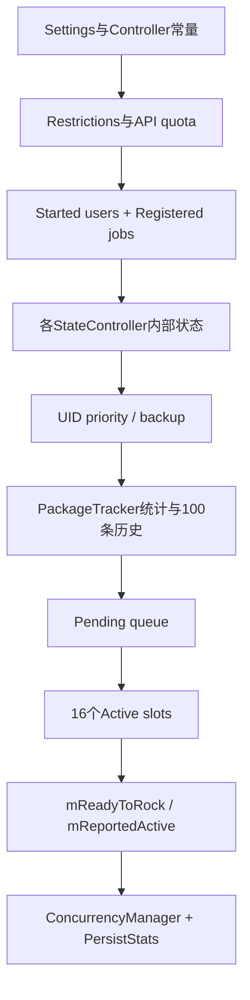
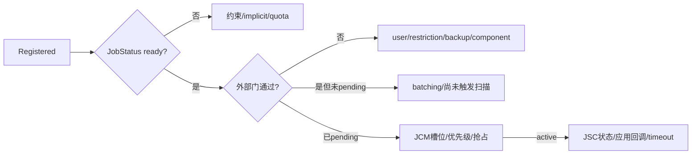

# 144 Android JobScheduler：dump、Proto 与诊断证据链

> 源码版本：Android 11 / API 30 / `android-11.0.0_r48`  
> 学习方式：macOS只读源码，不要求编译、不要求连接设备  
> 前置章节：第121、131、136、138、141、143章

---

## 1. 为什么“看见waiting”还不够

Job不运行可能卡在JobStatus约束、用户/组件、Restriction、batching、pending排序、并发槽或应用回调等不同层。

`dumpsys jobscheduler`把许多层放在同一份输出里，但每个字段的语义、时钟、过滤范围和采样时刻不同。本章不只是教你看命令，
而是从dump实现反推一条可证明的诊断链。

---

## 2. 源码地图

```text
frameworks/base/apex/jobscheduler/service/java/com/android/server/job/JobSchedulerService.java
frameworks/base/apex/jobscheduler/service/java/com/android/server/job/JobSchedulerShellCommand.java
frameworks/base/apex/jobscheduler/service/java/com/android/server/job/controllers/JobStatus.java
frameworks/base/apex/jobscheduler/service/java/com/android/server/job/controllers/StateController.java
frameworks/base/apex/jobscheduler/service/java/com/android/server/job/JobConcurrencyManager.java
frameworks/base/apex/jobscheduler/service/java/com/android/server/job/JobPackageTracker.java
frameworks/base/core/proto/android/server/jobscheduler.proto
frameworks/base/core/java/com/android/internal/util/DumpUtils.java
```

---

## 3. dump入口先检查两类权限

Binder service的 `dump()` 首先调用：

```java
if (!DumpUtils.checkDumpAndUsageStatsPermission(context, TAG, pw)) return;
```

普通调用者既要 `android.permission.DUMP`，又要Usage Stats permission/AppOps；root、system、shell、incidentd对usage检查有内部豁免。

因此完整输出包含UID、包、URI、extras、运行历史等敏感运行信息，不是普通App API。

---

## 4. 参数只有三类

```text
-h        帮助
-a        接受但忽略，因为本来就dump all
--proto   改为二进制Proto
package   可选包过滤
```

未知 `-x` 立即打印错误；只读取第一个非option参数作为包名，后面的额外参数没有继续解释。

---

## 5. 文本与Proto是二选一

`--proto`直接向传入FileDescriptor写二进制，不能当普通UTF-8文本阅读。没有该参数才用
`IndentingPrintWriter`生成面向人的层级文本。

两条路径共享大部分事实，但字段集合、过滤实现和格式并不完全等价。

---

## 6. 清除calling identity

权限检查和包名解析完成后，JSS执行 `Binder.clearCallingIdentity()` 再进入内部dump，最后restore。

这样内部PackageManager等调用以system_server身份执行；但授权决定已经在清身份前完成，不能把clear identity误解为绕过入口权限。

---

## 7. 一次dump的快照边界

内部先采三种now：

```java
now        = currentTimeMillis
nowElapsed = elapsedRealtime
nowUptime  = uptimeMillis
```

随后整个核心dump持有JSS `mLock`。JSS自己的注册表、pending、active、Controller状态在输出期间不会并发变动，形成相对一致快照。

---

## 8. 持锁不代表整个Android被冻结

PackageManager、ActivityManager或网络等外部世界仍可变化；某些打印方法也可能查询其他服务。dump只能证明JSS锁保护字段在这一段的状态，
不是全系统原子快照。

此外大dump长期占 `mLock` 会延迟schedule、Controller回调和完成清理，诊断本身也有扰动成本。

---

## 9. 文本输出的总体结构



顺序本身就是排障路线：先政策和事实，再候选与执行。

---

## 10. Registered jobs是“存在集合”

`mJobs`来自JobStore，说明Job仍被系统登记。它可能未ready、已pending、正在active，三者不是互斥的三张注册表。

Registered数量不能证明“有多少Job等待运行”，只能证明当前内存JobStore里有多少JobStatus。

---

## 11. JobStatus full dump先展示身份

关键身份有：

```text
callingUid + jobId：JobStore主键的一部分
sourceUid/sourceUser/sourcePackage：真正归因、standby、quota、backup主体
service component：实际绑定目标
tag/batteryName：人类诊断标签
```

代理调度时calling与source可不同，过滤和权限判断也会因此出现两条身份轴。

---

## 12. JobInfo与JobStatus不要混为一层

full dump的JobInfo段是应用提交的声明：周期、持久化、priority、flags、网络、URI、latency、deadline、backoff等。

其后Required/Satisfied/Dynamic、implicit ready位、standby bucket、运行窗口、失败次数是系统派生的JobStatus运行状态。

---

## 13. Required不等于完整ready公式

Required constraints只是一组显式位。`JobStatus.isReady()`还检查：

```text
within quota或dynamic整体满足
effective bucket不是NEVER
not dozing
not restricted in background
deadline override或显式约束全部满足
```

所以“Required全部Satisfied”仍不必然ready。

---

## 14. Unsatisfied行也不是完整否决清单

源码打印：

```java
(requiredConstraints | CONSTRAINT_WITHIN_QUOTA) & ~satisfiedConstraints
```

它主要覆盖bit约束；`mReadyNotDozing`、background restriction、NEVER、dynamic整体门等要去Implicit/bucket处另看。

---

## 15. Deadline的特殊性

非周期Job的deadline满足可绕过多数普通显式约束，但不能绕过quota/dynamic顶层门、NEVER、Doze和后台限制。

因此dump里的 `readyDeadlineSatisfied=true` 不是“强制运行”。周期Job的latest只是内部窗口边界，不套普通deadline override语义。

---

## 16. Tracking只说明谁负责维护

`Tracking: BATTERY CONNECTIVITY ...` 表明Controller登记了该Job，并不说明对应约束当前满足，也不说明Controller刚刚收到最新系统事件。

应把Tracking当“所有者列表”，Satisfied/Controller tracker状态才是“当前事实”。

---

## 17. Ready行拆成外部门

JSS对每个注册Job打印：

```text
Ready: overall (
  job=JobStatus.isReady
  user=calling/source users started
  !restricted=JSS restriction未拦截
  !pending=不已在pending
  !active=不已运行
  !backingup=source UID未备份
  comp=Service存在且App不bad
)
```

这是定位“内部约束已满足但还不入pending”的核心证据。

---

## 18. overall Ready=false可能是好事

一个Job已在pending或active时，`isReadyToBeExecutedLocked()`刻意返回false，避免重复加入。

所以必须结合括号内分项；不能看到最外层false就断言约束不满足。

---

## 19. Restricted due to与约束位分层

ThermalStatusRestriction属于JSS额外Restriction，不写入Required/Satisfied constraints。文本先列具体stop reason，再让Ready的
`!restricted`为false。

第137章发现接口Javadoc返回语义有反向错误，dump以实际 `isJobRestricted()`调用为准。

---

## 20. Component usable是现场查询

JSS查询ServiceInfo，并调用AMS内部 `isAppBad()`。因此 `comp=false` 既可能是组件不存在/禁用，也可能是应用被标记bad。

文本括号只有一个布尔，不给出两者的精确子原因；还要结合package/AMS证据。

---

## 21. Controller段回答“事实由谁维护”

Battery、Storage、Idle等通常打印tracker当前状态和tracked jobs；Connectivity打印网络缓存/UID关联；Time打印下一Alarm；
ContentObserver打印observer实例；Quota打印账户与计时。

这些段使用同一个package predicate，但不同Controller输出粒度不同，不应期待统一schema。

---

## 22. PackageTracker不是当前队列

它按source UID+package记录pending/active时长、峰值和停止原因，并保留100条开始/停止历史。

统计批次基于uptime，历史是有限环形缓冲；没有事件不等于从未发生，可能已被覆盖或system_server重启清空。

---

## 23. Pending queue是真正的候选集合

Job进入pending意味着完整ready/批处理政策已经允许它参加JCM分配，但不代表已经绑定应用。

这里要看队列顺序、evaluated priority、madePending相对时间，再到JCM查为什么还没拿到槽。

---

## 24. Pending文本时间是负方向表示

文本调用：

```java
formatDuration(job.madePending - nowUptime)
```

等待5秒通常显示类似 `-5s`，含义是“入队点在当前时刻之前5秒”；Proto则明确写正数
`nowUptime - madePending` 为 `pending_duration_ms`。

---

## 25. Active jobs其实是固定槽数组

JSS遍历16个JobServiceContext。空槽也会打印inactive；最近停过则保留 `mStoppedTime/mStoppedReason`。

运行槽还给出running duration、到timeout剩余时间、JobStatus简版、现场evaluated priority、active时间和此前pending时长。

---

## 26. stoppedReason是最近一次槽记忆

它属于JobServiceContext槽，不一定属于你当前关注的Job。槽复用后语义随最近执行变化；不能将一个inactive槽的reason配给任意注册Job。

---

## 27. Evaluated priority是现场再算

pending/active dump调用 `evaluateJobPriorityLocked()`，可能使用当前UID override和PackageTracker load；它不是保证等于当初入队或启动时的
`lastEvaluatedPriority`。

诊断抢占/分类时要区分“dump现场值”和“分配当时快照”。

---

## 28. mReadyToRock与mReportedActive只在无过滤时打印

传package filter后，文本和Proto都隐藏这两个全局字段。`mReadyToRock`说明JSS是否已允许第三方执行；
`mReportedActive`是第142章反馈给DeviceIdle的聚合边沿状态。

看不到不代表false，只是过滤模式不输出。

---

## 29. JCM段解决“ready却没启动”

当Job已pending，下一站不是继续盯约束，而是看：screen/memory配置、FG/BG计数、running context、preferred UID、pending load、抢占选择。



---

## 30. PersistStats只证明JobStore I/O概况

它记录读取/写入数量等持久化统计，不等于磁盘XML此刻逐字内容，也不证明最近一次异步写已经落盘完成。

要验证重启恢复，还需结合JobStore pending write、文件/重启后的registered状态。

---

## 31. package过滤先解析一个UID

PackageManager使用 `MATCH_ANY_USER` 把包名解析为一个UID，之后立即：

```java
filterUidFinal = UserHandle.getAppId(filterUid);
```

过滤比较的是appId，不是完整userId+appId。因此同一应用ID在不同用户下的Job都可能匹配，这是跨用户过滤。

---

## 32. calling或source任一匹配就保留

predicate是：

```text
appId(job.callingUid)==filterAppId
OR appId(job.sourceUid)==filterAppId
```

所以代理Job可因调度者或归因包任一侧匹配。过滤名不是严格的 `service.package == 输入包名`。

---

## 33. 文本过滤仍打印所有注册Job短标题

循环先打印每个Job的 `JOB #... toShortString`，再判断predicate并跳过详情。

因此带包过滤时仍会看到其他Job的一行标题；顶部 `Registered N jobs` 也是全局总数。这是r48实现，不是过滤失效的错觉。

---

## 34. package过滤没有覆盖Pending和Active段

Pending queue与16个Active slots的循环没有predicate判断；ConcurrencyManager与PersistStats也照常全局输出。

因此package参数是“部分段落过滤”，不是整份输出的隐私/范围隔离。入口本来就要求强dump权限，不能把过滤当安全边界。

---

## 35. Proto过滤存在更尖锐的r48边界

Proto registered loop在测试predicate之前已经 `proto.start(REGISTERED_JOBS)` 并写short info；不匹配时直接`continue`，没有显式
`proto.end(rjToken)`。

这至少造成token配对不对称，可能影响过滤Proto的结构可靠性。文本路径没有token问题，但同样保留所有短标题。

---

## 36. Proto并非文本的机械翻译

Proto用强类型字段表达duration、枚举、oneof和重复message，便于incident采集与自动分析；文本则包含友好标签、负方向相对时间和人类段落。

例如Proto为每一种Restriction写 `reason + is_restricting`，文本只列当前实际限制原因。

---

## 37. Proto schema保留历史洞

`jobscheduler.proto`保留heartbeat、parole等旧字段编号，防止复用破坏兼容。看到reserved字段不能推断r48仍有对应运行机制。

同理Proto定义有 `in_thermal`，当前dump是否实际写入仍要看Java writer，schema存在不等于数据一定出现。

---

## 38. Full与short JobStatus

Registered用 `job.dump(..., full=true)`，包含JobInfo、Satisfied和更多隐式状态；Pending/Active用full=false，避免重复输出完整声明。

因此从Pending段单独找不到某字段不代表状态缺失，应回到同一unique ID的Registered详情。

---

## 39. unique ID是跨段关联键

文本通常以 `callingUid/jobId` 形成短ID，service/tag/source辅助确认。代理调度或replacement时只看tag容易串错对象。

推荐先记完整unique ID，再跨Registered、Controller、Pending、Active、History关联。

---

## 40. dump是取样，不是事件因果记录

一次输出只能告诉你“现在”。约束可能刚恢复、Job已运行并完成、停止原因已被槽复用覆盖。

要证明过去的因果，需要PackageTracker history、EventLog/statsd/logcat或连续多次快照；单张dump不能还原全部时序。

---

## 41. get-job-state是更短的现场答案

Shell命令按package/user解析calling UID，再以 `uid+jobId` 查JobStore，可能输出：

```text
pending active user-stopped source-user-stopped backing-up no-component ready waiting
```

它适合快速确认存在性和大类状态，不替代完整dump。

---

## 42. help漏了一项实现状态

Android 11实现会输出 `source-user-stopped`，但Shell help列出的状态里没有这一项。

这是文档漂移实例：排障时以命令实现为准。

---

## 43. get-job-state的ready不是overall Ready

它直接调用 `js.isReady()`，没有同时检查users、backup、Restriction、pending/active和component。

所以可以同时看到 `user-stopped ready` 或 `backing-up ready`：前者说明JobStatus约束满足，外部门仍阻止执行，并不矛盾。

---

## 44. waiting只是“没有打印其他标签”

若没有pending/active/用户停止/backup/no-component/JobStatus ready，就打印waiting。它不会告诉你具体哪个constraint false。

真正原因仍要读Registered的Required/Satisfied/Implicit、Controller与quota段。

---

## 45. get-job-state不检查App bad

它只用PackageManager确认ServiceInfo是否存在；完整JSS `isComponentUsable()`还检查AMS `isAppBad()`。

因此短命令可能没有 `no-component`，而完整Ready行 `comp=false`。两条路径的component语义不完全相同。

---

## 46. run命令会改变你要观察的对象

`cmd jobscheduler run`不是只读诊断；默认历史行为可能绕过部分约束，`-f`更强，`-s`才要求全部约束满足。

用户要求macOS只读学习，本章只读源码，不执行run、timeout、cancel、reset quota等会改变设备状态的命令。

---

## 47. 一条七步诊断证据链

1. Registered：对象是否存在、身份是否正确；
2. JobInfo：应用声明是否如预期；
3. JobStatus：required/satisfied/dynamic/implicit/bucket；
4. Ready分项：user、restriction、backup、component、去重；
5. Controller：事实来源、Alarm和缓存是否吻合；
6. Pending/JCM：batching、队列、优先级、并发槽；
7. Active/JSC/history：绑定、回调、timeout、stop reason与完成。

不能从第3步直接跳到“系统Bug”。

---

## 48. 场景一：job=true但overall=false

若括号显示 `job=true user=true !restricted=true !pending=false`，说明Job已经在pending，overall false是防重复。

下一步应看Pending/JCM，而不是继续找未满足约束。

---

## 49. 场景二：JobStatus ready却没pending

若所有外部门也true，但Job不在pending，检查第141章batching：非ACTIVE数量不足、31分钟阈值、是否有新CHECK触发。

dump展示当前常量和first force batch attempt，可组合出较强证据，但31分钟本身没有Alarm。

---

## 50. 场景三：pending很久

先看evaluated priority和JCM的FG/BG上限、内存档、同UID抢占/preferredUid；再看active槽是否全满、是否有高优先Job。

pending说明约束阶段已经通过，此时反复盯Battery/Network常常走错层。

---

## 51. 场景四：active后很快消失

对照PackageTracker最后事件、inactive slot stoppedReason、JobStatus failure count和下一运行窗口。注意槽reason可能随后被别的Job覆盖，
历史也只有100条。

若要证明应用 `onStartJob/onStopJob`行为，JSS dump还不够，需要应用侧日志或Binder/ANR证据。

---

## 52. 场景五：package过滤看见别的包

先不要认定参数无效。r48会保留所有Registered短标题，Pending/Active/JCM也未按predicate过滤；同appId跨user以及代理calling/source也会扩展匹配。

这是设计/实现范围问题，不是严格全文筛选。

---

## 53. 场景六：文本与Proto时间符号不同

Pending文本的 `Enq: -5s` 是相对时间点，Proto `pending_duration_ms=5000` 是正持续时长。它们可描述同一事实。

自动分析不要把文本负号当异常，也不要把elapsed/uptime duration当wall clock时间戳。

---

## 54. 时钟选择表

| 字段 | 时钟/形式 | 重启后意义 |
|---|---|---|
| enqueue/runtime window | elapsed realtime | 本次boot单调时间轴 |
| madePending/madeActive | uptime | 深睡不累计，统计活动时长语义 |
| running/timeout | elapsed realtime | 包含深睡流逝 |
| last success/failure | wall clock | 可映射日期，但受RTC调整 |
| PackageTracker批次 | uptime+elapsed+wall快照 | 各自用途不同 |

比较两个字段前先确认时钟族。

---

## 55. 文本输出里的隐私面

full JobInfo可能打印PersistableBundle短串、transient extras、ClipData、content URI和Granted URI permissions。

即使有dump权限，分享日志前也应脱敏；package filter又不是全文过滤，不能依赖它自动移除其他应用的pending/active信息。

---

## 56. Proto的privacy标注不是自动无敏感

schema带 `msg_privacy DEST_AUTOMATIC`，用于平台采集处理；原始proto仍可能包含包、UID、URI等数据。

privacy annotation不等于你可以随意公开原始文件。

---

## 57. macOS只读练习一：画输出树

```bash
sed -n '3140,3330p' \
  frameworks/base/apex/jobscheduler/service/java/com/android/server/job/JobSchedulerService.java
```

按源码顺序画出文本dump段落，并标注哪些循环使用predicate、哪些没有。

---

## 58. macOS只读练习二：比较full参数

```bash
rg -n "job.dump\\(pw|job.dump\\(proto" \
  frameworks/base/apex/jobscheduler/service/java/com/android/server/job/JobSchedulerService.java
```

确认Registered为full，Pending/Active为short，再到JobStatus定位哪些字段受full控制。

---

## 59. macOS只读练习三：手算Ready

任选一个假想Job，填写：

```text
job.isReady=
usersStarted=
restricted=
pending=
active=
backingUp=
componentUsable=
overall=
```

至少构造“job=true但overall=false”的三个不同原因。

---

## 60. macOS只读练习四：审计package过滤

```bash
sed -n '3138,3490p' \
  frameworks/base/apex/jobscheduler/service/java/com/android/server/job/JobSchedulerService.java
```

逐个圈出Registered、Controllers、priority、backup、tracker、Pending、Active、JCM、global字段的过滤行为。

---

## 61. macOS只读练习五：对照Proto schema

```bash
sed -n '37,150p' \
  frameworks/base/core/proto/android/server/jobscheduler.proto
```

找出reserved历史字段、Registered分项、Pending duration和Active oneof，并回到Java确认哪些schema字段当前真的被写。

---

## 62. macOS只读练习六：检查token配对

在Proto Registered循环中按两条路径推演：predicate=true与false。记录每一次 `start/end`。

这能训练你发现“过滤分支continue跳过资源/结构收尾”的通用代码审查模式。

---

## 63. macOS只读练习七：短命令边界

```bash
sed -n '3000,3115p' \
  frameworks/base/apex/jobscheduler/service/java/com/android/server/job/JobSchedulerService.java
```

列出 `get-job-state`每个标签来自哪种检查，并与full Ready行比较缺少的restriction/App bad等事实。

---

## 64. 常见误解纠正

- 误解：Registered都是waiting。纠正：pending/active也仍registered。
- 误解：Required全满足就能执行。纠正：还有implicit、quota/dynamic与JSS外部门。
- 误解：overall Ready=false就是约束失败。纠正：pending/active会刻意令其false。
- 误解：Tracking表示约束满足。纠正：只表示Controller负责。
- 误解：package过滤覆盖全文。纠正：r48只过滤部分段落。
- 误解：Proto是文本逐字结构化。纠正：字段、符号与过滤边界有差异。
- 误解：get-job-state ready代表可立即执行。纠正：它只是JobStatus.isReady。
- 误解：一次dump能证明过去因果。纠正：它主要是当前采样。

---

## 65. 面试式自测

1. 为什么dump要同时检查DUMP和Usage Stats？
2. JSS锁内快照能保证哪些一致性，不能保证哪些？
3. JobInfo声明与JobStatus派生状态怎么区分？
4. Unsatisfied为什么不是完整否决清单？
5. overall Ready包含哪些外部门？
6. 为什么已pending的Job overall Ready反而false？
7. package predicate为什么跨用户且支持代理两侧？
8. 哪些主要段落未按package过滤？
9. Proto registered过滤的token配对有什么问题？
10. get-job-state为何可同时打印ready和user-stopped？
11. Pending文本负时间与Proto正duration如何对应？
12. pending很久应该优先查哪一层？

---

## 66. 本章结论

1. dump入口要求DUMP与Usage Stats授权，shell等内部UID有usage豁免；
2. 文本与Proto共享事实但不是机械等价；
3. JSS持mLock形成内部相对一致快照，但不冻结外部系统；
4. Registered表示JobStore存在，不等于waiting；
5. JobInfo是声明，JobStatus是派生运行状态；
6. Required/Satisfied之外还有implicit、quota/dynamic、NEVER与外部门；
7. overall Ready把job、users、Restriction、pending/active、backup、component串成完整门；
8. pending/active导致overall false是去重语义；
9. Controller段提供事实所有权，Tracking不代表满足；
10. Pending是JCM候选，Active是16个执行槽；
11. evaluated priority是dump现场重算值；
12. package filter按appId跨用户，并匹配calling/source任一侧；
13. r48过滤仍保留所有Registered短标题，Pending/Active/JCM未全文过滤；
14. Proto非匹配Registered分支存在start后continue而未显式end的结构边界；
15. get-job-state的ready只是JobStatus.isReady，不是overall可执行；
16. 可靠诊断必须按Registered→约束→外部门→pending/JCM→active/history逐层取证。

一句话记忆：

> `dumpsys jobscheduler`不是一行“为什么没跑”的答案，而是一组分层证据；先确认字段属于哪层、哪个时钟和哪种过滤，再把它们串成因果链。

---

## 67. 生成后复读修订

初稿后重新逐行对照JSS文本/Proto writer、JobStatus与ShellCommand，补强并纠正：

1. 分开Registered存在、pending候选、active执行三种集合语义；
2. 明确Required/Satisfied不含全部implicit与外部门；
3. 解释overall false可能只是已pending/active；
4. 限定Controller Tracking只表示责任归属；
5. 区分dump现场priority和分配时lastEvaluatedPriority；
6. 标注uptime、elapsed和wall clock三类时间；
7. 解释Pending文本负方向与Proto正duration；
8. 发现过滤按appId跨用户且匹配calling/source两侧；
9. 发现文本仍打印全部Registered短标题；
10. 发现Pending、Active、JCM不是全文过滤；
11. 发现Proto非匹配分支start token后continue未end；
12. 补出full/short JobStatus字段差异；
13. 更正get-job-state ready只是内部约束ready；
14. 记录help漏列source-user-stopped；
15. 区分短命令的Service存在与完整component usable/App bad；
16. 全部练习限定为macOS只读源码审计，不执行会改变设备状态的shell命令。

---

## 68. 下一章

第145章转入AlarmManagerService：先建立Alarm从API、PendingIntent/Listener、ELAPSED/RTC、exact/inexact到batch与kernel alarm driver的
总体地图，为后续Doze、standby、配额、唤醒统计与时区/时间变化章节打基础。
