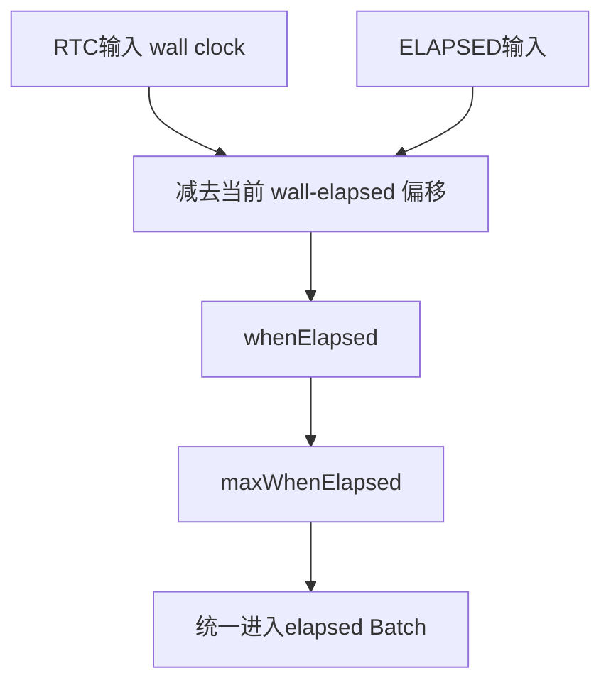
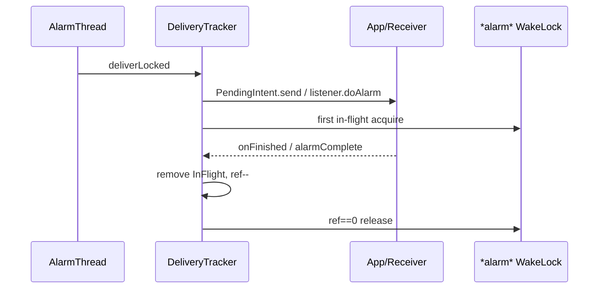

# 145 Android AlarmManagerService：调度总体链路

> 源码版本：Android 11 / API 30 / `android-11.0.0_r48`  
> 学习方式：macOS只读源码，不要求编译、不要求连接设备  
> 前置章节：第25、124、142、143章

---

## 1. Alarm不是一个“延时Handler”

AlarmManager跨越应用API、Binder、system_server内存批次、App Standby/Doze政策、JNI、Linux timerfd、epoll、WakeLock以及
PendingIntent/Listener回调。

它解决的不是“过一会执行一段Java代码”这么简单，而是设备可能休眠、墙钟可能被修改、数千应用需要合并唤醒时，怎样用较少的
kernel定时器维护大量逻辑Alarm。

---

## 2. 本章目标

本章先建立总体地图：四种时钟类型怎样进入统一elapsed时间轴，exact/window/heuristic怎样形成可合并区间，Batch怎样压缩成
kernel的一个wakeup和一个non-wakeup截止点，AlarmThread怎样取出、延迟、排序并交付，以及WakeLock怎样覆盖异步完成。

Doze、App Standby quota、AllowWhileIdle和统计会在后续章节分别深入，本章只说明它们在主链中的插入位置。

---

## 3. 源码地图

```text
frameworks/base/core/java/android/app/AlarmManager.java
frameworks/base/core/java/android/app/IAlarmManager.aidl
frameworks/base/services/core/java/com/android/server/AlarmManagerService.java
frameworks/base/services/core/jni/com_android_server_AlarmManagerService.cpp
```

这一章Java和Native源码都在当前checkout中，可以从API一直追到timerfd，而不必猜测内核接口。

---

## 4. 总体调用链


关键压缩点是：Java可以保存很多Alarm，但kernel只需要知道下一次该叫醒system_server的时刻。

---

## 5. 四种公开类型

| 类型 | 输入时间轴 | 到点是否唤醒设备 |
|---|---|---|
| `RTC_WAKEUP` | wall clock毫秒 | 是 |
| `RTC` | wall clock毫秒 | 否 |
| `ELAPSED_REALTIME_WAKEUP` | boot elapsed毫秒 | 是 |
| `ELAPSED_REALTIME` | boot elapsed毫秒 | 否 |

类型值低位还编码了wakeup属性：0/2为wakeup，1/3为non-wakeup。

---

## 6. RTC与ELAPSED的根本区别

RTC表达“日历上的某个时刻”，用户或网络校时会改变它；elapsed表达“从本次启动以来经过多久”，不受墙钟前后拨影响，并包含休眠时间。

“每天8点”适合RTC；“30分钟后重试”通常适合ELAPSED。两者都不是 `uptimeMillis`，后者在深睡时停止累计。

---

## 7. API最终汇聚到setImpl

`set()`、`setWindow()`、`setExact()`、`setRepeating()`、`setAndAllowWhileIdle()`、`setAlarmClock()`最终都把差异编码成：

```text
type
triggerAtMillis
windowMillis
intervalMillis
flags
PendingIntent 或 Listener
WorkSource
AlarmClockInfo
```

然后调用 `mService.set(...)` 进入Binder。

---

## 8. PendingIntent与Listener二选一

服务端要求：

```java
(operation == null && directReceiver == null)
|| (operation != null && directReceiver != null)
```

都为空或同时非空都被丢弃。为兼容旧版本，这个内层检查只日志并return，而不是统一抛异常。

---

## 9. Listener怎样跨Binder

客户端用 `ListenerWrapper` 把 `OnAlarmListener` 包成 `IAlarmListener.Stub`。服务端注册binder death；客户端对象不可达或进程死亡时，
对应Alarm可以清理。

回调到客户端后，wrapper再post到指定Handler；未指定则应用主Looper。因此AlarmThread不会直接在应用主线程运行用户代码。

---

## 10. Repeating只能使用PendingIntent

Binder入口发现 `interval != 0 && directReceiver != null` 会抛 `IllegalArgumentException`。

Listener没有稳定的跨进程重发身份和传统重复语义，应用若需要listener周期工作，应在回调后自行设置下一次one-shot。

---

## 11. callingPackage防冒名

服务端读取真实 `Binder.getCallingUid()`，再调用：

```java
mAppOps.checkPackage(callingUid, callingPackage);
```

包名用于归因与政策，但不能由调用者随便声称为其他包。

---

## 12. WorkSource是特权归因

传入WorkSource需要 `UPDATE_DEVICE_STATS`。它影响WakeLock/电量统计归因，却不允许普通App把成本随意记到别人名下。

Alarm对象还同时保存calling uid/package与PendingIntent creator uid/sourcePackage，后续standby和统计必须选对身份。

---

## 13. flags在Binder边界会被重写

外部调用者不能直接保留 `WAKE_FROM_IDLE` 或 unrestricted allow-while-idle；非system UID也不能设置 `IDLE_UNTIL`。

服务端根据exact、alarmClock、core/白名单身份重新添加受信任flag。这是“客户端请求”到“服务端有效政策”的安全边界。

---

## 14. Exact自动成为Standalone

```java
if (windowLength == WINDOW_EXACT) {
    flags |= FLAG_STANDALONE;
}
```

Standalone不会与其他Batch合并。因此exact的成本不仅是区间宽度为0，还会显式阻止coalescing。

---

## 15. set()自API 19起默认不精确

客户端 `legacyExactLength()` 对targetSdk < KITKAT返回0；新应用返回 `WINDOW_HEURISTIC=-1`。

所以同样调用 `set()`，老目标版本仍按exact，现代应用让系统自动计算窗口。这是compat行为，不是设备随机差异。

---

## 16. 三种窗口表示

```text
windowLength == 0  → exact，maxElapsed == triggerElapsed
windowLength > 0   → 显式窗口，[trigger, trigger+window]
windowLength < 0   → heuristic，由系统计算maxTriggerTime
```

窗口表示“可以在哪个区间交付”，不是执行持续时间。

---

## 17. Heuristic窗口算法

Android 11以futurity或repeat interval的75%作为可延后范围；小于10秒则不模糊：

```java
max = trigger + 0.75 * futurity;
```

例如现在起40分钟后的one-shot，理论窗口可延后约30分钟。之后standby/idle政策还可能进一步调整实际when。

---

## 18. 负trigger怎样处理

客户端先把负值改0；服务端也再次检查并改0。随后非core调用还要经过 `MIN_FUTURITY`，所以“0”通常不是立即在elapsed 0触发，而是被推到
当前时刻加最小未来量。

双层校验兼顾不同/旧客户端和Binder直接调用者。

---

## 19. MIN_FUTURITY防即时刷Alarm

服务端先把输入转为elapsed，再计算：

```java
minTrigger = nowElapsed + (core ? 0 : MIN_FUTURITY);
triggerElapsed = max(nominalTrigger, minTrigger);
```

普通应用把时间设在过去，也不会无限制造“立刻到期”的紧密循环。

---

## 20. 重复间隔会被钳位

正interval短于 `MIN_INTERVAL` 会扩到最小值，长于 `MAX_INTERVAL` 会截到最大值。

窗口大于半天被认为很可疑并直接限制为1小时。注意这会把一个超长显式window变短，不是简单上限为半天。

---

## 21. 四种输入最终统一到elapsed

`convertToElapsed()` 对RTC用当前 `currentTimeMillis - elapsedRealtime` 做偏移转换；ELAPSED类型原样使用。

Alarm仍保存原始 `when` 便于墙钟重算和dump，但Batch的 `start/end` 始终是elapsed时间轴。



---

## 22. Alarm对象保留哪些事实

核心字段包括：

```text
type/origWhen/wakeup
when/whenElapsed/maxWhenElapsed/window/repeat
expectedWhenElapsed/expectedMaxWhenElapsed
operation或listener
uid/creatorUid/packageName/sourcePackage
flags/workSource/alarmClock/statsTag/count
```

expected表示standby推迟前的计划，实际when可被政策调整。

---

## 23. 相同目标的replacement

创建新Alarm前：

```java
removeLocked(operation, directReceiver);
incrementAlarmCount(uid);
```

同一PendingIntent或同一listener binder只保留一项。再次set更像替换，不是默认叠加多个相同目标Alarm。

---

## 24. 每UID Alarm数量上限

持锁后检查 `mAlarmsPerUid >= MAX_ALARMS_PER_UID`，超限抛 `IllegalStateException`。

计数不只看主Batch，还必须随pending-while-idle、background deferred等容器移动保持一致；“当前kernel只设两个timer”不代表应用可无限登记逻辑Alarm。

---

## 25. App启动限制可直接拒绝

`ActivityManager.isAppStartModeDisabled()` 为true时，服务端日志后return，不进入Batch。

这发生在replacement remove之前，因此被禁止的新set不会顺便删除同目标旧Alarm；阅读顺序很重要。

---

## 26. Batch是窗口交集

一个Batch可容纳新Alarm的条件：

```text
batch.end >= alarm.whenElapsed
AND batch.start <= alarm.maxWhenElapsed
```

加入后：

```text
start = max(所有whenElapsed)
end   = min(所有maxWhenElapsed)
```

也就是所有Alarm可接受窗口的交集。

---

## 27. 为什么Batch在start时交付

Batch中每个Alarm的最早时间都不晚于 `start=max(earliest)`，而start也不超过所有max。到start时整组都合法，因此只唤醒一次即可交付。

若交集为空就不能合并，必须建立另一个Batch。

---

## 28. 一个手算例子

```text
A: [10, 20]
B: [15, 30]
交集: [15, 20] → 同Batch，start=15
C: [21, 25]
```

C与当前Batch没有交集，不能加入。注意不是只比较C和某个单独Alarm，而是比较收窄后的Batch公共区间。

---

## 29. Batch按start排序

加入Alarm使Batch.start向后移动时，原有排序可能失效；代码先remove旧位置再binarySearch插回。

AlarmThread因列表有序，只需从头取到第一个 `start > now` 即可停止。

---

## 30. Standalone绕过合并

Exact、AlarmClock和内部TIME_TICK/DATE_CHANGED等可带Standalone，每个单独建Batch。

Standalone保证不被普通coalescing改变组边界，但仍可能受Doze、standby、后台限制等更高层政策影响；“单独Batch”不等于绝对按时交付。

---

## 31. Doze挂起容器插在入Batch之前

若存在 `mPendingIdleUntil`，普通Alarm既没有allow-while-idle也没有wake-from-idle，就放入 `mPendingWhileIdleAlarms` 并return。

它暂时不在主Batch，退出idle时再restore。因而只检查 `mAlarmBatches` 不能统计所有待处理Alarm。

---

## 32. App Standby在入Batch前调整时间

`adjustDeliveryTimeBasedOnBucketLocked(a)` 先根据standby bucket与配额推迟实际when，再调用 `insertAndBatchAlarmLocked()`。

这解释了Alarm对象同时保留expected和actual时间：一个描述原计划，一个描述政策后的交付计划。

---

## 33. Java只向kernel设置两个近期截止点

`rescheduleKernelAlarmsLocked()`在所有Batch中找：

```text
第一个含wakeup的Batch.start → ELAPSED_REALTIME_WAKEUP timerfd
最早普通Batch/延期non-wakeup → ELAPSED_REALTIME timerfd
```

RTC Alarm已经转成elapsed，Java这里不必为每种原始类型分别设置一个kernel timer。

---

## 34. 为什么仍有多个Native timerfd

JNI为RTC_WAKEUP、RTC、BOOTTIME_WAKEUP、BOOTTIME、MONOTONIC及额外time-change监视建立timerfd数组，属于通用Native接口。

Android 11 Java主调度路径在 `rescheduleKernelAlarmsLocked()`主要用elapsed wakeup/non-wakeup两类；额外realtime fd用于检测墙钟改变。

---

## 35. 当前实现不是旧式/dev/alarm主路径

本地JNI使用 `timerfd_settime(TFD_TIMER_ABSTIME)` 和 `epoll_wait()`。wakeup类型映射到
`CLOCK_REALTIME_ALARM` / `CLOCK_BOOTTIME_ALARM`。

很多旧文章描述 `/dev/alarm` ioctl；对r48应以当前timerfd源码为准。

---

## 36. timerfd的0时刻特殊处理

Linux把全0 `itimerspec`解释为disarm。JNI若seconds和nanoseconds都为0，会改成1ns，避免“想在最早时刻触发”被当成取消。

这是Java把负毫秒钳到0之后Native仍要处理的接口语义差异。

---

## 37. AlarmThread是长期阻塞线程

服务启动检测Native driver存在后创建名为 `AlarmManager` 的线程。它循环：

```text
waitForAlarm → 读取RTC/elapsed → 处理time change
→ triggerAlarmsLocked → 可能延迟non-wakeup
→ deliver → 重排standby → 重设kernel timer
```

没有事件时阻塞在epoll，不靠Java忙轮询。

---

## 38. epoll结果是bit mask

每个到期timerfd贡献 `1 << alarm_idx`；额外realtime fd若因 `TFD_TIMER_CANCEL_ON_SET`收到 `ECANCELED`，贡献
`TIME_CHANGED_MASK`。

一次epoll唤醒可以同时报告多类timer到期，Java用mask判断是否包含wakeup。

---

## 39. 墙钟变化怎样识别

kernel可能产生小幅伪通知，Java用“上次wall + elapsed流逝”计算expected wall，只有偏差至少约±1000ms才认为真实时间变化。

真实变化会重建RTC映射、重新安排TIME_TICK/DATE_CHANGED、发送 `ACTION_TIME_CHANGED`，并强制重新检查Alarm。

---

## 40. triggerAlarmsLocked按Batch头部取出

只要第一个Batch.start <= now就remove并遍历；遇到未来Batch立即break。

每个Alarm还要依次经过allow-while-idle最小间隔、background restriction等政策。到达Batch时间不等于一定立刻进入triggerList。

---

## 41. AllowWhileIdle可能再次重排

若同UID距上次allow-while-idle交付过短，Alarm的when被推到允许的minTime，再调用 `setImplLocked(alarm, rebatching=true)` 放回调度结构。

因此exact-and-allow-while-idle的“exact”仍受每UIDidle节流，不代表绕过所有系统政策。

---

## 42. Background restricted另有等待容器

被用户强制后台限制的Alarm进入 `mPendingBackgroundAlarms[creatorUid]`，不加入本轮triggerList。

所以Alarm的完整生命周期可能在主Batch、pending while idle、pending background、pending non-wakeup、in-flight之间移动。

---

## 43. Repeating不是一次交付多次回调

如果晚了多个interval，代码计算 `alarm.count`，通过 `Intent.EXTRA_ALARM_COUNT`告诉接收方漏过多少次，然后按原始相位安排下一次。

它不会在一轮中循环发送N个广播，避免休眠醒来后的“补发风暴”。

---

## 44. Repeating保持相位不漂移

```java
delta = count * repeatInterval;
nextElapsed = expectedWhenElapsed + delta;
```

下一次基于原预期时间，而不是 `now + interval`。迟到一次不把整个周期永久向后平移。

---

## 45. 交付优先级

取出一轮Alarm后计算三档：TIME_TICK最高、wakeup其次、普通最低；同一source package的PriorityClass在本轮复用。

排序影响同一触发集合的发送次序，不改变哪个Alarm已经到期。

---

## 46. Non-wakeup可以在屏灭时继续合并

若本轮没有wakeup、设备非interactive且距上次交付足够近，普通Alarm可先放进
`mPendingNonWakeupAlarms`，等未来交付时刻或某次wakeup一起送。

这是第二层合并：先有Alarm window Batch，再有屏灭期间的non-wakeup delivery fuzz。

---

## 47. Wakeup与Non-wakeup的准确含义

Wakeup timer能把设备从suspend叫醒system_server；non-wakeup不会为了它单独唤醒，但设备因其他原因醒来后，已经到期的普通Alarm会处理。

Wakeup不保证启动屏幕，也不保证目标应用永远运行；它只是电源唤醒语义。

---

## 48. deliverAlarmsLocked仍持mLock

AMS遍历triggerList，在锁内调用DeliveryTracker发PendingIntent或oneway Listener。真正应用处理异步发生，但发起Binder/Intent发送的成本处于AMS临界区。

完成回调再次获取同一锁更新in-flight与WakeLock。

---

## 49. PendingIntent交付路径

```java
operation.send(context, 0,
    backgroundIntent.putExtra(EXTRA_ALARM_COUNT, count),
    onFinished, handler, ...)
```

PendingIntent可以指向广播、Service或Activity；AlarmManager不是一律“发广播”。不过常见alarm PendingIntent确实是broadcast。

---

## 50. Listener交付路径

服务端调用 `alarm.listener.doAlarm(this)`，把DeliveryTracker作为 `IAlarmCompleteListener`传给客户端。

客户端wrapper完成目标Handler上的 `onAlarm()` 后回调complete；服务端还设置 `LISTENER_TIMEOUT`，防客户端永不确认导致WakeLock永久持有。

---

## 51. 交付失败不会进入in-flight

PendingIntent已取消或Listener Binder调用抛异常时，代码在建立WakeLock/refcount之前return。

重复PendingIntent若已取消还会移除未来重复项。没有真实投递，就不等待不存在的finished callback。

---

## 52. alarm WakeLock的引用计数

第一个成功发起的交付：设置WorkSource、acquire `*alarm*`、报告alarms active；每项加入 `mInFlight` 并增加
`mBroadcastRefCount`。

每个PendingIntent onFinished、Listener alarmComplete或timeout使计数减一；归零时释放WakeLock。



---

## 53. WakeLock覆盖的是交付确认

Alarm WakeLock确保从发送到接收完成/超时这段系统不会再次睡下。它不是给应用任意长后台工作的永久租约。

BroadcastReceiver若 `goAsync()`，AMS广播完成链会延后PendingIntent onFinished；Service自身长期工作仍需遵循对应组件与前台服务规则。

---

## 54. WorkSource会随队头重归因

有多个in-flight时，一个完成后若仍有剩余，AlarmManager把同一WakeLock的WorkSource改为当前首个InFlight的来源。

这是一把共享WakeLock的动态归因，不是每个Alarm一把锁。

---

## 55. 与DeviceIdle的jobs/alarms闭环

第142章见过DeviceIdleController的 `mAlarmsActive`。AlarmManager在in-flight从0→1和1→0时通过Handler报告active状态。

这能让maintenance early-exit等待Alarm交付完成，但状态Alarm预算仍可推进Doze状态机；同样不是无限续窗。

---

## 56. Handler fallback不是等价硬件唤醒

Native初始化失败时，`setLocked()`改用 `sendMessageAtTime()`，不启动AlarmThread。

Handler能在进程/CPU运行时提供定时回调，却不能像alarm timerfd那样保证从suspend唤醒设备，所以日志“falling back”代表降级而非完整等价替代。

---

## 57. 启动顺序

`onStart()`先初始化Native、Handler、Constants、WakeLock、TIME_TICK/DATE_CHANGED、各Receiver，再根据driver是否存在启动AlarmThread，最后注册UID observer。

Binder与Local service的发布位置还需结合后续onStart/boot代码看；理解主链时要区分对象构造、Native可用和第三方应用真正运行三个阶段。

---

## 58. 普通Alarm不跨重启持久化

AMS的逻辑Alarm保存在system_server内存调度结构中，没有为普通应用Alarm提供跨设备重启恢复的持久存储。设备重启后，普通应用应在
BOOT_COMPLETED等合适事件重新登记；system_server单独崩溃后的整机恢复细节不能仅凭本章这段内存代码泛化承诺。

AlarmClock UI信息也不是“任意Alarm自动持久化”；它是AMS维护的下一闹钟视图与通知。

---

## 59. Alarm与JobScheduler怎样选

```text
需要日历时刻/用户闹钟/短时明确唤醒 → Alarm更接近需求
可延期、有约束、需要系统批处理/重试/持久Job → JobScheduler
进程存活期很短的UI超时 → Handler/Executor
```

不要用高频exact wakeup Alarm模拟后台循环任务，这会绕开JobScheduler本来提供的约束与节电合并。

---

## 60. 场景一：现代App调用set

targetSdk ≥19，window=-1。服务端把输入转elapsed，按75% heuristic算max，经过standby调整，寻找有交集Batch，可能与其他App一起在公共start交付。

“调用set”不意味着精确时间点。

---

## 61. 场景二：setExact

window=0，服务端加Standalone，Batch区间退化为单点。它不会普通coalesce，但MIN_FUTURITY、Doze、后台限制和权限政策仍可能改变可观察交付。

Android 11这里尚不是后续版本 `SCHEDULE_EXACT_ALARM` 特殊访问模型，不要把Android 12+规则倒灌进r48。

---

## 62. 场景三：RTC墙钟向前拨

额外timerfd收到cancel-on-set，AlarmThread识别真实偏差，重建所有RTC→elapsed映射。原本“明天8点”的Alarm仍按新的日历关系定位。

ELAPSED Alarm不应因墙钟前拨而改变相对等待目标。

---

## 63. 场景四：设备睡过三个repeat interval

醒来时count包含跨过的次数，只交付一次并携带 `EXTRA_ALARM_COUNT`；下一次基于expected相位推进到未来正确周期。

接收方若要补业务数据，应按幂等状态同步，而不是假设系统逐次重放所有回调。

---

## 64. 场景五：两个窗口相交

A `[100,160]`，B `[130,200]` 合成Batch `[130,160]`，实际在start=130即可同时合法交付。加入C `[150,170]` 后公共区间变 `[150,160]`，
Batch.start后移并重新排序。

---

## 65. 场景六：Listener不complete

服务端已持WakeLock并登记InFlight；到 `LISTENER_TIMEOUT` 后移除对应记录、减少ref。后到的alarmComplete被识别为late，不会二次减计数。

当前代码留有“实现目标ANR策略”的TODO，timeout主要保护系统追踪和WakeLock闭合。

---

## 66. macOS只读练习一：追六种API

```bash
rg -n "setImpl\\(" frameworks/base/core/java/android/app/AlarmManager.java
```

给set、setWindow、setExact、setRepeating、allowWhileIdle、alarmClock列出window/interval/flags差异。

---

## 67. macOS只读练习二：手算时间转换

假设：

```text
nowRTC=1,700,000,000,000
nowElapsed=500,000,000
RTC trigger=nowRTC+60,000
```

按 `trigger - (nowRTC-nowElapsed)` 算nominal elapsed，再考虑MIN_FUTURITY。

---

## 68. macOS只读练习三：手算Batch交集

依次加入 `[10,40] [20,30] [25,50] [31,60]`，写出每一步start/end以及最后一个是否还能合并。

再把第二个改成Standalone，观察Batch数量变化。

---

## 69. macOS只读练习四：追kernel压缩

```bash
sed -n '3040,3072p' \
  frameworks/base/services/core/java/com/android/server/AlarmManagerService.java
sed -n '35,225p' \
  frameworks/base/services/core/jni/com_android_server_AlarmManagerService.cpp
```

区分“Java逻辑Alarm数量”“Java Batch数量”“当前已armed timerfd数量”。

---

## 70. macOS只读练习五：追完成闭环

```bash
sed -n '4570,4820p' \
  frameworks/base/services/core/java/com/android/server/AlarmManagerService.java
```

分别画PendingIntent成功、CanceledException、Listener成功、Listener timeout四条refcount/WakeLock路径。

---

## 71. macOS只读练习六：找所有等待容器

```bash
rg -n "mPending.*Alarms|mAlarmBatches|mInFlight" \
  frameworks/base/services/core/java/com/android/server/AlarmManagerService.java
```

为每个容器标注进入原因、离开事件、是否计入每UID Alarm上限、是否已开始交付。

---

## 72. 常见误解纠正

- 误解：Alarm总按指定点执行。纠正：window、batch、standby、idle都会调整。
- 误解：RTC_WAKEUP会点亮屏幕。纠正：它只唤醒CPU/系统处理。
- 误解：set从来都是exact。纠正：现代targetSdk默认heuristic。
- 误解：每个Alarm对应一个kernel timer。纠正：大量逻辑Alarm压成近期两个主要deadline。
- 误解：Batch取所有earliest最小值。纠正：公共start是最大earliest。
- 误解：Repeating漏三次就回调三次。纠正：一次交付加count。
- 误解：PendingIntent一定是广播。纠正：可指向多种组件。
- 误解：alarm WakeLock给业务永久保活。纠正：覆盖交付完成/超时闭环。
- 误解：r48仍以旧 `/dev/alarm` 为主。纠正：当前JNI用timerfd+epoll。

---

## 73. 面试式自测

1. RTC与ELAPSED在墙钟变化时有何不同？
2. wakeup只承诺什么，不承诺什么？
3. WINDOW_EXACT、显式window、heuristic怎样计算max？
4. 为什么exact自动Standalone？
5. Batch start/end如何由成员窗口决定？
6. Java为什么只需arm近期wakeup和non-wakeup？
7. timerfd全0为什么被改成1ns？
8. AlarmThread怎样收到time change？
9. repeating怎样保持相位？
10. non-wakeup为何可能到期后仍延迟？
11. PendingIntent与Listener如何确认完成？
12. 哪些路径不会增加in-flight ref？

---

## 74. 本章结论

1. Alarm是应用API到Linux timerfd的跨进程、跨语言调度链；
2. 四种类型分为RTC/elapsed与wakeup/non-wakeup两条轴；
3. 服务端把所有逻辑时间统一投影到elapsed Batch；
4. exact窗口为0并自动Standalone，现代set默认heuristic；
5. heuristic默认以futurity/interval的75%形成延后窗口；
6. 服务端校验包归因、WorkSource权限和受信任flags；
7. trigger、window、repeat与每UID数量都有防滥用校验；
8. 相同PendingIntent/listener再次set替换旧项；
9. Batch是成员窗口交集，start=max earliest、end=min latest；
10. 主Batch之外还有idle/background/non-wakeup延期容器；
11. Java主要只把下一wakeup/non-wakeup截止点交给kernel；
12. r48 JNI使用timerfd绝对时间和epoll，不是旧式/dev/alarm主路径；
13. AlarmThread取到期Batch后仍执行idle、background、standby等政策；
14. repeating迟到只交付一次并携带count，下一代保持原相位；
15. PendingIntent/Listener异步完成由共享WakeLock和refcount闭合；
16. Alarm到点只代表获得一次交付机会，不等于应用业务必然完成。

一句话记忆：

> AlarmManagerService把海量“希望何时执行”的逻辑请求变成可合并窗口，只把最近的少数硬件截止点交给kernel，再在醒来时重新应用系统政策并用完成回调守住交付边界。

---

## 75. 生成后复读修订

初稿后重新核对AlarmManager、Binder入口、Batch、AlarmThread、DeliveryTracker与JNI，重点补强：

1. 区分wall、elapsed、uptime三类时间；
2. 纠正set对现代targetSdk默认不是exact；
3. 明确窗口是交付区间而非执行时长；
4. 用交集公式解释Batch start/end；
5. 限定Standalone不等于绕过Doze/standby；
6. 说明启动限制检查发生在replacement remove之前；
7. 分开calling与PendingIntent creator/source身份；
8. 补出主Batch外pending-while-idle、background、non-wakeup与in-flight四类等待/执行容器；
9. 限定Java主路径只arm elapsed wakeup/non-wakeup；
10. 以r48 JNI确认timerfd+epoll而非旧/dev/alarm；
11. 补出0 timespec会disarm所以改1ns；
12. 区分repeat count和多次回调；
13. 明确PendingIntent不限于广播；
14. 追完整的Listener timeout与late complete闭环；
15. 限定Handler fallback不能可靠唤醒suspend设备；
16. 所有练习保持macOS只读，不执行Alarm设置或系统编译。

---

## 76. 下一章

第146章深入AlarmManager的Doze与AllowWhileIdle：追IDLE_UNTIL、WAKE_FROM_IDLE、pending-while-idle恢复、每UID短/长节流、临时白名单、
Alarm active反馈，以及为什么“exact and allow while idle”仍不保证任意频率和绝对时刻。
