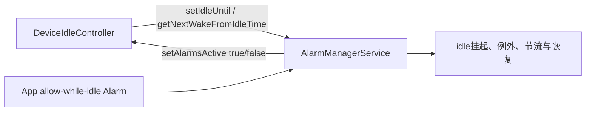

# 146 Android AlarmManager：Doze 与 AllowWhileIdle

> 源码版本：Android 11 / API 30 / `android-11.0.0_r48`  
> 学习方式：macOS只读源码，不要求编译、不要求连接设备  
> 前置章节：第25、129、142、145章

---

## 1. “允许在空闲时运行”不是“忽略系统”

Doze期间普通Alarm会被移出主调度队列；`setAndAllowWhileIdle()`和
`setExactAndAllowWhileIdle()`确实可以穿过这道门，但仍受每UID最小间隔、后台政策、临时白名单时长和交付能力约束。

本章要把三个经常混在一起的概念拆开：

```text
IDLE_UNTIL：AlarmManager进入“挂起普通Alarm”的内部标记
WAKE_FROM_IDLE：能结束/穿过idle的特殊闹钟
ALLOW_WHILE_IDLE：普通App可请求，但按UID严格节流的例外
```

---

## 2. 源码地图

```text
frameworks/base/core/java/android/app/AlarmManager.java
frameworks/base/services/core/java/com/android/server/AlarmManagerService.java
frameworks/base/apex/jobscheduler/service/java/com/android/server/DeviceIdleController.java
frameworks/base/apex/jobscheduler/framework/java/com/android/server/DeviceIdleInternal.java
frameworks/base/core/java/android/app/BroadcastOptions.java
```

---

## 3. 两个服务如何互相调用

DeviceIdleController通过隐藏 `AlarmManager.setIdleUntil()`安排deep idle状态闹钟，也通过
`getNextWakeFromIdleTime()`观察下一用户闹钟；AlarmManager则通过 `DeviceIdleInternal.setAlarmsActive()`反向报告交付是否仍在进行。



它们构成双向控制闭环，而不是DIC单向“关闭Alarm”。

---

## 4. IDLE_UNTIL只有system UID能保留

Binder入口会清除非system调用者的 `FLAG_IDLE_UNTIL`：

```java
if (callingUid != Process.SYSTEM_UID) {
    flags &= ~FLAG_IDLE_UNTIL;
}
```

普通App无法伪造Doze状态边界。公开SDK也没有普通应用可用的 `setIdleUntil()`。

---

## 5. DeviceIdleController如何设置IdleUntil

deep状态机调用：

```java
mAlarmManager.setIdleUntil(
    ELAPSED_REALTIME_WAKEUP,
    mNextAlarmTime,
    "DeviceIdleController.deep",
    mDeepAlarmListener,
    mHandler);
```

这是exact、wakeup、direct listener Alarm。它既是状态机的下一步定时器，也让AMS知道当前处于Alarm idle区间。

---

## 6. mPendingIdleUntil是AMS的idle开关

AMS把当前带IDLE_UNTIL的Alarm保存在 `mPendingIdleUntil`。其非null时：

```text
普通Alarm → mPendingWhileIdleAlarms
ALLOW_WHILE_IDLE → 仍进主Batch
ALLOW_WHILE_IDLE_UNRESTRICTED → 仍进主Batch
WAKE_FROM_IDLE → 仍进主Batch
```

因此Doze不是给每个Alarm加一个“未满足bit”，而是把不同类别送往不同容器。

---

## 7. 普通Alarm怎样被挂起

```java
if (mPendingIdleUntil != null
        && (flags & (ALLOW_WHILE_IDLE
          | ALLOW_WHILE_IDLE_UNRESTRICTED
          | WAKE_FROM_IDLE)) == 0) {
    mPendingWhileIdleAlarms.add(a);
    return;
}
```

return发生在standby调整和Batch插入之前。挂起Alarm暂时不会成为下一kernel deadline。

---

## 8. 已经在Batch里的普通Alarm怎么办

设置新的IDLE_UNTIL后 `needRebatch=true`，AMS执行全量rebatch。重加每个Alarm时，普通项看到
`mPendingIdleUntil != null`，被转移到pending-while-idle。

所以idle不仅影响之后新set的Alarm，也会重分类已有主Batch。

---

## 9. IdleUntil可能被NextWakeFromIdle拉早

若已经存在更早的 `mNextWakeFromIdle`：

```java
if (idleUntil.whenElapsed > nextWake.whenElapsed) {
    idleUntil.when = idleUntil.whenElapsed =
        idleUntil.maxWhenElapsed = nextWake.whenElapsed;
}
```

用户闹钟优先于原计划的Doze截止点。DIC不能把设备idle到越过一个应唤醒用户的AlarmClock。

---

## 10. IdleUntil还会随机提前

AMS根据离目标的距离计算fuzz，从IDLE_UNTIL时刻随机减去一段delta。

这让大量设备不会在完全相同的理论边界集体退出idle。它是系统内部状态闹钟的抖动，不应套到普通App exact Alarm上。

---

## 11. 为什么只有一个mPendingIdleUntil

DIC状态机只应拥有一个当前deep idle边界。若新旧对象同时存在，源码会 `wtf`。

全量rebatch还会验证idle-until对象未意外丢失；若丢失则恢复所有pending-while-idle Alarm，避免永远挂起。

---

## 12. WAKE_FROM_IDLE从哪里来

外部flags中的WAKE_FROM_IDLE会先被清除。服务端只在可信场景重新添加，最典型的是：

```java
if (alarmClock != null) {
    flags |= FLAG_WAKE_FROM_IDLE | FLAG_STANDALONE;
}
```

所以普通 `setExact(RTC_WAKEUP)` 并不自动拥有WAKE_FROM_IDLE；`setAlarmClock()`才表达面向用户的闹钟语义。

---

## 13. mNextWakeFromIdle只追最早项

AMS维护最早WAKE_FROM_IDLE Alarm引用。新增更早项会替换并触发rebatch，因为当前IDLE_UNTIL可能需要被拉早。

它不是所有wakeup Alarm的列表；普通RTC_WAKEUP即使能唤醒CPU，也不等于“应当终止Doze状态”的wake-from-idle。

---

## 14. DeviceIdleController会提前避让用户闹钟

DIC判断：

```java
nowElapsed + MIN_TIME_TO_ALARM >= getNextWakeFromIdleTime()
```

若用户闹钟已经足够近，DIC不再进入deep idle，或重新变ACTIVE再走inactive流程。目的不仅是保证闹钟本身，还要给系统预热留出时间。

---

## 15. AlarmClock不是AllowWhileIdle

AlarmClock拥有WAKE_FROM_IDLE和Standalone，绕过pending-while-idle；但它的flags不必含ALLOW_WHILE_IDLE。

因此它不会走普通AWI的每UID节流账本，也不会仅因AlarmClock身份使用AWI的10秒BroadcastOptions临时白名单。

---

## 16. 两个App API的差异

```java
setAndAllowWhileIdle(...)
    window = WINDOW_HEURISTIC

setExactAndAllowWhileIdle(...)
    window = WINDOW_EXACT
```

二者都请求 `FLAG_ALLOW_WHILE_IDLE`，差别只是原始窗口；进入idle节流时，exact也可以被重排到更晚的合法minTime。

---

## 17. ExactAndAllowWhileIdle的“exact”边界

Exact保证进入AMS时窗口为单点、Standalone，不与普通Batch合并；它不保证绕过：

```text
MIN_FUTURITY
每UID allow-while-idle最小间隔
PendingIntent失效
进程/组件交付失败
系统时间和设备状态变化
```

API名称描述请求类别，不是硬实时承诺。

---

## 18. AWI节流按creatorUid

账本键为 `alarm.creatorUid`，不是调用AMS的uid字段。PendingIntent代理场景下，creator身份决定：

```text
mLastAllowWhileIdleDispatch[creatorUid]
mUseAllowWhileIdleShortTime[creatorUid]
```

这避免代理调度轻易替目标应用绕过每UID频率限制。

---

## 19. 默认短间隔是5秒

r48常量：

```text
ALLOW_WHILE_IDLE_SHORT_TIME = MIN_FUTURITY = 5秒
ALLOW_WHILE_IDLE_LONG_TIME  = 9分钟
WHITELIST_DURATION          = 10秒
```

Android API注释写“about every minute”和“such as 15 minutes”，是概念性/历史描述；当前源码默认值应以5秒和9分钟为准。

---

## 20. 什么时候用short

`getWhileIdleMinIntervalLocked(uid)`：

```text
不Doze且未force-all-apps-standby → short
正在Doze → long
仅force-all-apps-standby：UID最近前台 → short，否则long
```

Doze优先选择long，即使UID此前在前台记录为short，也不能把deep idle频率降到5秒。

---

## 21. mUseAllowWhileIdleShortTime怎样更新

AWI成功进入in-flight时查看creator UID当前是否前台；前台写true，后台写false。AppStateTracker通知UID进入前台时也主动写true。

UID移除时两张AWI账本都删除，避免UID复用继承旧节流历史。

---

## 22. 第一枚AWI总能通过频率门

若 `mLastAllowWhileIdleDispatch`没有该UID，返回-1，代码不做间隔限制。

“第一枚”是当前内存账本中尚无成功交付记录，不等于应用安装以来永久第一枚。

---

## 23. 节流发生在到期取出时

Alarm可以已经进入Batch并到达start，`triggerAlarmsLocked()`才计算：

```java
minTime = lastDispatch + getWhileIdleMinIntervalLocked(uid);
if (now < minTime) {
    whenElapsed = minTime;
    maxWhenElapsed = max(maxWhenElapsed, minTime);
    setImplLocked(alarm, rebatching=true);
    continue;
}
```

因此dump可能看到exact Alarm的实际时间已被推后。

---

## 24. 推后时为何扩max

原exact Alarm的max等于旧when，若只改when不改max就会出现 `max < when` 的非法窗口。

代码至少把max扩到minTime，使节流后的新窗口重新合法。这进一步说明exact不是跨政策不可移动的绝对点。

---

## 25. lastDispatch何时才记账

只有真实发送成功、建立in-flight之后，DeliveryTracker才写：

```java
mLastAllowWhileIdleDispatch.put(creatorUid, nowElapsed);
```

PendingIntent已取消或Listener Binder发送失败会在此前return，不消耗一次AWI交付间隔。

---

## 26. ALLOW_WHILE_IDLE_UNRESTRICTED是谁的

Binder先清除调用者传来的unrestricted；若没有WorkSource，且calling UID是core、SystemUI或用户电源白名单，服务端自动添加unrestricted并清除普通AWI。

它表示受信任主体正常穿过idle，不走普通AWI长/短间隔节流。

---

## 27. 为什么有WorkSource时不给unrestricted

即使调用者自身是core/白名单，只要显式代表别人归因，条件要求 `workSource == null` 就不自动授予unrestricted。

这是防止特权代理把自身idle豁免无条件扩散给任意工作来源。

---

## 28. Unrestricted也不进AWI临时白名单路径

DeliveryTracker的 `allowWhileIdle`布尔只检查普通 `FLAG_ALLOW_WHILE_IDLE`。unrestricted flag已清掉普通flag，因此不会传 `mIdleOptions`，也不更新AWI last-dispatch账本。

它靠自身受信任/白名单身份运行，不需要每次再申请10秒临时例外。

---

## 29. 10秒临时白名单如何附加

Constants用 `BroadcastOptions`构造：

```java
opts.setTemporaryAppWhitelistDuration(
    ALLOW_WHILE_IDLE_WHITELIST_DURATION);
mIdleOptions = opts.toBundle();
```

普通AWI PendingIntent发送时把这个Bundle传给 `PendingIntent.send()`，由AMS组件启动/广播链识别并临时放行目标应用。

---

## 30. 只有成功发送PendingIntent才得到这个选项

`mIdleOptions`只出现在 `alarm.operation.send(...)` 分支。普通公开AWI API本来只接收PendingIntent；direct Listener交付没有这条
BroadcastOptions路径。

不要泛化成“任何带AWI flag的回调都自动获得10秒应用白名单”。

---

## 31. 白名单10秒不是WakeLock 10秒

临时白名单允许应用在电源/后台限制上获得短暂操作空间；AlarmManager自己的 `*alarm*` WakeLock则持续到PendingIntent finished或listener complete/timeout。

两种期限、所有者和结束条件不同。App仍应尽快完成或转入合规的前台/Job机制。

---

## 32. 白名单时长可热更新

`Settings.Global.ALARM_MANAGER_CONSTANTS`变化时重建 `mIdleOptions`。下一次AWI PendingIntent发送读取新Bundle。

已在飞的PendingIntent不会因为常量变化被追溯延长/缩短；负数等配置边界还要看BroadcastOptions/AMS下游校验，不能只看字段类型。

---

## 33. AWI与background restriction的关系

`isBackgroundRestricted()`把普通AWI视为Battery Saver豁免候选：

```java
exemptOnBatterySaver = (flags & ALLOW_WHILE_IDLE) != 0;
```

随后仍调用AppStateTracker综合判断。AWI不是绕过所有后台限制的万能位，但会改变其传入政策参数。

---

## 34. AlarmClock和UI PendingIntent有额外豁免

AlarmClock直接不做background defer；PendingIntent启动Activity也不延迟，foreground-service PendingIntent会作为更重要类型咨询AST政策。

这是“Alarm类别 × PendingIntent目标类型 × App状态”的组合判断，而不是只看wakeup/exact。

---

## 35. Idle结束的正常触发链

当 `mPendingIdleUntil`自己到期：

```java
mPendingIdleUntil = null;
rebatchAllAlarmsLocked(false);
restorePendingWhileIdleAlarmsLocked();
```

同时DIC listener收到状态Alarm，推进deep idle/maintenance状态机。

---

## 36. Restore不是“全部立即交付”

`restorePendingWhileIdleAlarmsLocked()`逐个调用 `reAddAlarmLocked(a, now, false)`，再重设kernel Alarm和next alarm clock。

重加会重新转换/调整时间与standby政策；已过期项可进入近期Batch，但仍要等待AlarmThread取出和后续政策。restore不直接遍历发送所有PendingIntent。

---

## 37. 取消IdleUntil也会恢复

remove匹配到当前IDLE_UNTIL后清引用、rebatch，再调用restore。否则普通Alarm可能永远留在pending-while-idle。

全量rebatch发现IDLE_UNTIL意外丢失也有同样防御性恢复。

---

## 38. WAKE_FROM_IDLE到期也可能结束idle

IDLE_UNTIL在设置时已被更早的next-wake拉到该时刻，因此真正到点时通常当前idle边界Alarm也随之到期。

WAKE_FROM_IDLE自身从triggerList取出后会清 `mNextWakeFromIdle`并rebatch；两者协作，不能只看一个引用解释全部状态变化。

---

## 39. NextWake取消后的重算

remove operation/package/uid若删掉当前next-wake，会清引用并rebatch；重加剩余Alarm时重新选择下一枚WAKE_FROM_IDLE。

所以 `mNextWakeFromIdle=null`只是缓存无当前候选，不是遍历列表永久删除了所有用户闹钟。

---

## 40. 普通AWI仍受App Standby quota

`isExemptFromAppStandby()` 只豁免AlarmClock、core creator和unrestricted；普通 `FLAG_ALLOW_WHILE_IDLE` 不在这个公式里。因此普通AWI
仍会按source package/user经过standby时间调整，并在成功交付后写入App wakeup history。

同时它还受自己的last-dispatch 5秒/9分钟门。也就是说普通AWI是“standby配额门 AND AWI频率门”，不是二选一；第33节所说的
Battery Saver后台限制参数豁免，也不能泛化成App Standby quota豁免。

---

## 41. 交付顺序可以与同App普通Alarm颠倒

App的普通Alarm在pending-while-idle，后设置的AWI却仍在主Batch并先交付。API文档明确系统可让AWI与其他Alarm乱序。

业务不得依赖“同PendingIntent之外所有Alarm严格按set先后顺序”。

---

## 42. Alarm active反馈何时变true

第一个成功交付进入in-flight时：

```text
mBroadcastRefCount: 0 → 1
acquire *alarm* WakeLock
post REPORT_ALARMS_ACTIVE(1)
```

Handler再调用DeviceIdleInternal `setAlarmsActive(true)`。它不是Alarm到期或入triggerList就立即为true，而是成功发起交付后。

---

## 43. 反馈为何通过Handler

DeliveryTracker在AMS `mLock`内改变refcount，但将跨服务LocalServices调用post到Alarm Handler，避免持Alarm锁直接获取DIC monitor。

这与第142章JSS在自身锁内直接调用的实现不同，说明相同闭环目标可以采用不同锁边界。

---

## 44. Alarm active何时变false

每个PendingIntent finished、Listener complete或timeout都会减少ref；最后一个完成时释放WakeLock并post
`REPORT_ALARMS_ACTIVE(0)`。

DIC收到false后才尝试early exit。jobs、alarms、active idle ops仍需全部inactive。

---

## 45. Handler异步反馈的保守与竞态

true/false都是消息。若短交付在Handler处理true前已完成，队列通常仍按入队顺序处理true再false；DIC可能短暂看到active后归零。

Alarm WakeLock和DIC minimum active-op另有保护，但不能把异步布尔当作每枚Alarm精确计数账本。

---

## 46. 广播in-flight listener是另一条通知

AMS还对 `AlarmManagerInternal.InFlightListener`调用 `broadcastAlarmPending(uid)` / `broadcastAlarmComplete(uid)`，只针对PendingIntent broadcast。

这与全局 `setAlarmsActive(boolean)`不同：前者按广播UID通知内部消费者，后者按所有成功Alarm交付refcount聚合给DIC。

---

## 47. Doze maintenance期间会怎样

maintenance公开idle mode暂时false，DIC的IDLE_UNTIL Alarm已经触发并恢复普通Alarm；它们重新进入主Batch并可能交付。

Alarm交付成功后 `mAlarmsActive=true`可阻止maintenance提前结束；最后完成后false允许DIC按jobs/ops共同判断归还窗口。

---

## 48. 预算Alarm仍是上界

与jobs-active相同，alarms-active只阻止DIC的early-exit路径；deep/light状态机已经安排的预算/状态Alarm仍可推进回idle。

一个接收器卡住不会凭 `mAlarmsActive=true`无限延长maintenance；Alarm listener自身还有timeout，广播也有BroadcastQueue完成/超时链。

---

## 49. Upcoming AlarmClock为何阻止进入idle

用户马上需要被叫醒时，先进入Doze再很快退出会产生额外状态切换，并可能让预备工作来不及完成。

DIC以 `MIN_TIME_TO_ALARM`提前避让；这是一种用户可见时效优先级，不应让普通后台App滥用AlarmClock伪装任务。

---

## 50. setAlarmClock的成本

它是RTC_WAKEUP、exact、Standalone、WAKE_FROM_IDLE，并进入系统下一闹钟UI/广播。它还可能改变DIC进入idle的计划。

因此只应表示真正面向用户的闹钟，不是规避AWI节流的通用后台入口。

---

## 51. light idle与mPendingIdleUntil

`setIdleUntil()`由deep idle状态机使用；light状态机普通用 `AlarmManager.set(ELAPSED_REALTIME_WAKEUP, listener)`安排自己的阶段闹钟。

AMS的 `mPendingIdleUntil != null`更直接表示deep Alarm idle gate，不能把它简单等同于PowerManager所有light/deep idle mode组合。

---

## 52. Battery Saver也会影响AWI长短门

`getWhileIdleMinIntervalLocked()`除了Doze，还读取AppStateTracker的force-all-apps-standby（EBS/Battery Saver相关）状态。

不在Doze但EBS开启时，前台/最近前台UID可用short，其他UID用long。方法名“WhileIdle”覆盖的政策范围比deep Doze更广。

---

## 53. 常量没有跨字段关系钳位

short、long、whitelist duration从KeyValueListParser直接读取long，当前段没有保证：

```text
short >= 0
long >= short
whitelist >= 0
```

设备定制若写入反常值，会破坏预期节流/选项语义，必须联合测试，不能只相信字段名。

---

## 54. 常量更新不重排已节流Alarm

改变long interval后，已经因旧minTime放回Batch的Alarm不会在Constants Observer里主动重算；下一次到期检查才读取新值。

若新long变短，旧when可能仍偏晚；若变长，下一次触发会再次推后。这和第143章“字段已变不等于全量重建”一致。

---

## 55. dump应看哪些字段

```text
Pending idle until
Pending alarms while idle
Next wake from idle
Last allow while idle dispatch times
mUseAllowWhileIdleShortTime
Constants short/long/whitelist
In-flight + Broadcast ref count
```

同时对照Alarm的expectedWhen与actual when，才能判断是standby推迟还是AWI节流重排。

---

## 56. 场景一：Doze中普通exact Alarm

即使window=0、Standalone，只要没有三种idle例外flag，rebatch时仍进入pending-while-idle。

Exact只控制batch窗口，不授予Doze穿透权。maintenance/退出idle时恢复后才重新竞争交付。

---

## 57. 场景二：同UID连续两枚AWI

第一枚在deep idle时成功交付，记录last=T。第二枚T+1分钟到期，默认long=9分钟，因此被重排到T+9分钟，哪怕它原来是exact。

不是丢弃，而是更新when/max并重新入Batch。

---

## 58. 场景三：AWI PendingIntent已取消

到期后 `operation.send()`抛CanceledException，未建立in-flight，也不更新last dispatch；若它是repeating，还移除后续重复项。

“到过节流门”不等于“消耗一次成功AWI配额”。

---

## 59. 场景四：系统白名单调用者

无WorkSource的白名单调用者在Binder边界被转为UNRESTRICTED，普通AWI flag清除。它穿过pending-while-idle，不进普通5秒/9分钟账本，
也不靠AWI BroadcastOptions获得10秒临时白名单。

---

## 60. 场景五：用户闹钟早于deep idle截止

AlarmClock成为mNextWakeFromIdle，AMS把DIC的IDLE_UNTIL拉到更早时刻；DIC自身也通过upcoming检查避免进入/继续deep idle。

两层防线既保护已经进入idle的情况，也减少临近闹钟时新进入idle。

---

## 61. 场景六：maintenance中两个Alarm交付

第一个成功使全局ref 0→1并报告alarms active；第二个只把ref加到2。一个完成变1不发false，最后一个完成变0才释放WakeLock并报告false。

DIC只需要“是否至少一个仍在飞”的集合语义，不需要知道Alarm数量。

---

## 62. 场景七：IdleUntil被取消

AMS从Batch移除idle Alarm，清 `mPendingIdleUntil`，全量rebatch并restore挂起列表。普通Alarm恢复到主调度结构，但不会在取消调用栈里被逐个同步发送。

---

## 63. macOS只读练习一：画三种flag矩阵

```bash
sed -n '1934,2022p' \
  frameworks/base/services/core/java/com/android/server/AlarmManagerService.java
```

为普通、AWI、unrestricted、wake-from-idle、idle-until五类Alarm填写“主Batch/挂起/特殊引用/是否节流”。

---

## 64. macOS只读练习二：手算节流

默认long=9分钟，假设last=100分钟：

```text
Alarm A at 104分钟到期
Alarm B at 110分钟到期
```

推演A的新when、A交付后last以及B是否再次推迟。再将A发送失败重算一次。

---

## 65. macOS只读练习三：追恢复链

```bash
rg -n "restorePendingWhileIdleAlarmsLocked|mPendingIdleUntil = null" \
  frameworks/base/services/core/java/com/android/server/AlarmManagerService.java
```

区分自然到期、显式remove、rebatch防御三条恢复入口。

---

## 66. macOS只读练习四：追临时白名单

```bash
rg -n "mIdleOptions|TemporaryAppWhitelist|allowWhileIdle" \
  frameworks/base/services/core/java/com/android/server/AlarmManagerService.java
```

确认Bundle在哪里创建、只在哪条发送分支使用、何时更新last-dispatch。

---

## 67. macOS只读练习五：对照DIC

```bash
rg -n "setIdleUntil|getNextWakeFromIdleTime|setAlarmsActive" \
  frameworks/base/apex/jobscheduler/service/java/com/android/server/DeviceIdleController.java \
  frameworks/base/services/core/java/com/android/server/AlarmManagerService.java
```

画出DIC→AMS状态Alarm、AMS→DIC active反馈和用户AlarmClock预避让三条边。

---

## 68. macOS只读练习六：审计配置

定位`ALLOW_WHILE_IDLE_SHORT_TIME/LONG_TIME/WHITELIST_DURATION`的默认、解析和消费者，回答：

1. 是否钳位负数；
2. 是否保证long≥short；
3. 更新是否重排已有Alarm；
4. dump展示哪个值。

---

## 69. 常见误解纠正

- 误解：Exact自动穿过Doze。纠正：还必须有idle例外flag。
- 误解：所有wakeup都是WAKE_FROM_IDLE。纠正：后者是受信任的Doze边界语义。
- 误解：AWI在Doze中任意频率。纠正：默认每creator UID至少9分钟，且普通AWI仍受App Standby配额。
- 误解：源码默认就是文档所说15分钟。纠正：r48为9分钟。
- 误解：10秒白名单就是10秒Alarm WakeLock。纠正：两套机制。
- 误解：AlarmClock也走普通AWI节流。纠正：它走WAKE_FROM_IDLE。
- 误解：restore会同步发送所有挂起Alarm。纠正：只是重新加入调度结构。
- 误解：mPendingIdleUntil等于所有light/deep idle状态。纠正：它直接对应deep idle gate。
- 误解：alarms-active能无限续maintenance。纠正：只阻止early exit。

---

## 70. 面试式自测

1. IDLE_UNTIL、WAKE_FROM_IDLE、AWI分别解决什么？
2. 普通exact Alarm为何仍会进入pending-while-idle？
3. 用户AlarmClock怎样从AMS和DIC两边影响Doze？
4. AWI节流为何用creatorUid？
5. short/long默认各是多少，选择公式是什么？
6. exact AWI被节流时怎样修复窗口？
7. 哪些失败不更新last dispatch？
8. unrestricted由谁授予，为什么要求WorkSource为空？
9. 10秒临时白名单在哪条交付路径附加？
10. IdleUntil结束后普通Alarm为何不是立即全发？
11. setAlarmsActive与broadcast in-flight listener有何不同？
12. 配置热更新为何不会完整重排已有节流Alarm？

---

## 71. 本章结论

1. DIC用system-only IDLE_UNTIL告诉AMS挂起普通Alarm；
2. 已有和新增普通Alarm都会转入pending-while-idle；
3. AWI、unrestricted和WAKE_FROM_IDLE仍留在主调度路径；
4. AlarmClock由服务端授予WAKE_FROM_IDLE并影响DIC进入idle；
5. 普通RTC_WAKEUP不自动等于WAKE_FROM_IDLE；
6. setAndAllowWhileIdle是heuristic，exact版本只是初始窗口为0；
7. AWI按PendingIntent creatorUid记录成功交付时间；
8. r48默认short 5秒、long 9分钟、临时白名单10秒；
9. deep Doze始终选long，EBS非Doze时按UID前台状态选长短；
10. AWI到期时若过密会被重排，不是直接丢弃；
11. 只有成功建立in-flight才更新last dispatch；
12. 普通AWI仍受App Standby配额；trusted unrestricted才同时不走普通AWI节流/临时白名单和standby配额；
13. AWI PendingIntent通过BroadcastOptions获得短暂应用白名单；
14. 白名单与Alarm WakeLock是不同的所有权/期限机制；
15. IdleUntil结束或取消时，挂起Alarm重新加入调度而非同步全发；
16. Alarm in-flight聚合反馈只阻止DIC early exit，不突破maintenance预算上界。

一句话记忆：

> AllowWhileIdle不是Doze的“关闭按钮”，而是一条受身份、每UID时间门和短暂白名单共同约束的窄通道；真正的Doze边界仍由IDLE_UNTIL与WAKE_FROM_IDLE协商。

---

## 72. 生成后复读修订

初稿后重新核对AlarmManager API、AMS flag重写/触发/交付和DIC状态机，重点修订：

1. 分开IDLE_UNTIL、WAKE_FROM_IDLE、AWI三种语义；
2. 明确普通wakeup不自动wake-from-idle；
3. 补出IDLE_UNTIL会被更早用户闹钟拉早并加随机fuzz；
4. 限定mPendingIdleUntil直接对应deep gate而非所有idle mode；
5. 纠正文档示例15分钟与r48默认9分钟差异；
6. 发现short实际为5秒而非泛称一分钟；
7. 逐分支还原Doze/EBS/UID前台的长短选择；
8. 明确节流按creatorUid且只记成功in-flight；
9. 解释exact被推后时max也必须扩展；
10. 区分ordinary与unrestricted flag及WorkSource限制；
11. 限定10秒BroadcastOptions只在普通AWI PendingIntent分支；
12. 区分临时白名单与共享Alarm WakeLock；
13. 限定restore只是re-add而非同步deliver；
14. 复核 `isExemptFromAppStandby()` 后纠正普通AWI并不豁免App Standby配额；
15. 区分全局alarms-active与按UID广播in-flight通知；
16. 补出常量无长短/非负跨字段钳位且更新不重排已有Alarm；
17. 所有练习均为macOS只读源码推演，不执行设备Alarm命令。

---

## 73. 下一章

第147章深入AlarmManager App Standby配额：从source package/user的滚动wakeup history、ACTIVE/WORKING/FREQUENT/RARE/NEVER配额，
追expected/actual时间、reorder触发、parole/charging、restricted bucket独立窗口及豁免类别。
