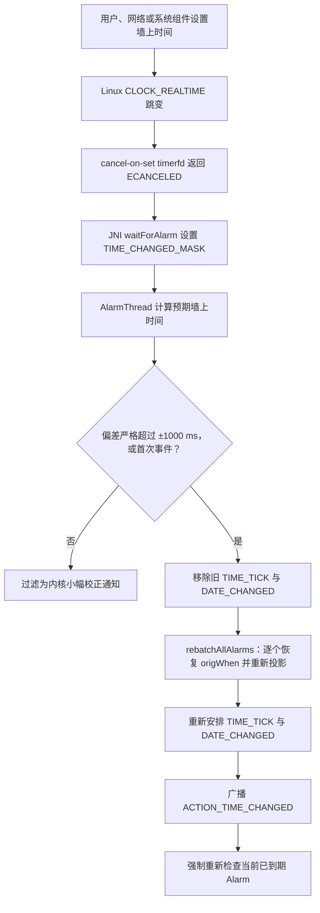
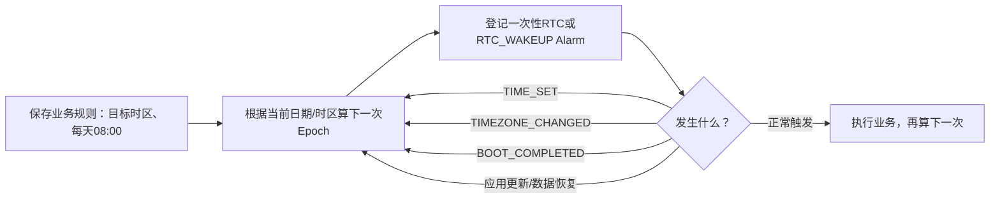

# 148 Android AlarmManager：RTC、系统时间变化与 TIME_TICK

> 源码版本：Android 11 / API 30 / `android-11.0.0_r48`  
> 学习方式：macOS 只读源码，不要求编译、不要求连接设备  
> 前置章节：第 145～147 章

---

## 1. 这一章要解决什么问题

AlarmManager 同时面对两种性质完全不同的时间：

- 墙上时间：现在是北京时间几点，可能被用户、网络校时或时区规则改变；
- 启动后时间：设备从本次启动到现在经过多久，不跟随改钟，但包含休眠时间。

本章要从源码回答五个问题：

1. `RTC` Alarm 为什么最终也能和 `ELAPSED_REALTIME` Alarm 放进同一个 Batch？
2. 用户把系统时间向前或向后拨，已经登记的 RTC Alarm 怎么办？
3. 内核怎样通知 `AlarmManagerService` “墙上时间跳变了”？
4. 每分钟的 `TIME_TICK` 和每天的 `DATE_CHANGED` 是谁自己安排的？
5. 改“时间”、改“时区”、设备休眠、重启，分别会影响哪些 Alarm？

---

## 2. 先记住本章最重要的一句话

> App 可以用墙上时间表达需求，但 Android 11 的 AlarmManagerService 会把主调度队列统一投影到 elapsed 时间轴；墙上时间跳变后，再用保存的原始 RTC 时间重新投影并全量重排。

这句话把“API 表达”和“服务内部调度”分开了。

---

## 3. 源码地图

```text
frameworks/base/core/java/android/app/AlarmManager.java
frameworks/base/core/java/android/app/IAlarmManager.aidl
frameworks/base/core/java/android/content/Intent.java
frameworks/base/services/core/java/com/android/server/AlarmManagerService.java
frameworks/base/services/core/jni/com_android_server_AlarmManagerService.cpp
```

建议阅读顺序：

```text
AlarmManager 四种 type
    ↓
AlarmManagerService.convertToElapsed()
    ↓
Alarm.origWhen / whenElapsed
    ↓
JNI timerfd 的 cancel-on-set
    ↓
AlarmThread 时间变化分支
    ↓
rebatchAllAlarms()
    ↓
ClockReceiver 的 TIME_TICK / DATE_CHANGED
```

---

## 4. 四种 Alarm type 先分清

| type | API 传入的时间基准 | 到点可唤醒休眠设备 |
|---|---|---|
| `RTC_WAKEUP` | `System.currentTimeMillis()` | 是 |
| `RTC` | `System.currentTimeMillis()` | 否 |
| `ELAPSED_REALTIME_WAKEUP` | `SystemClock.elapsedRealtime()` | 是 |
| `ELAPSED_REALTIME` | `SystemClock.elapsedRealtime()` | 否 |

`RTC` 在这里是 API 名称。它表示以 Unix Epoch 毫秒表达的墙上时间，并不表示 Java 层为每一个 RTC Alarm 都直接操作硬件 RTC。

---

## 5. 三种时间不要混成一种

### 5.1 `currentTimeMillis`

它是从 Unix Epoch 到现在的毫秒数，表示一个绝对 UTC 时刻。

它会受以下事情影响：

- 用户手动改时间；
- 网络自动校时；
- 其他有权限的系统组件设置时间。

单纯切换显示时区通常不会改变这个 UTC 毫秒值。

### 5.2 `elapsedRealtime`

它从本次开机开始累计，并且包含 deep sleep。

它不会因为用户把 10:00 改成 11:00 而突然增加一小时，所以很适合做“20 分钟以后执行”。

### 5.3 `uptimeMillis`

它也从本次开机累计，但不计 deep sleep。本章 Alarm 主调度不用它作为统一时间轴。

---

## 6. 为什么“20 分钟以后”更适合 elapsed

假设现在 10:00，你登记“20 分钟后重试”。五分钟后用户误把系统时间调到 09:00：

- 如果需求绑定墙上时间，它可能还要等 80 分钟；
- 如果需求绑定 elapsed，它仍在约 15 分钟后到期。

所以：

```text
持续时长/超时/退避 → 优先 elapsed
日历时刻/闹钟/每天当地时间 → 需要 RTC + 日历规则
```

---

## 7. RTC 如何投影到 elapsed

核心源码很短：

```java
private long convertToElapsed(long when, int type) {
    final boolean isRtc = (type == RTC || type == RTC_WAKEUP);
    if (isRtc) {
        when -= mInjector.getCurrentTimeMillis()
                - mInjector.getElapsedRealtime();
    }
    return when;
}
```

可以写成公式：

```text
RTC目标对应的elapsed
= RTC目标时刻 - (当前wall - 当前elapsed)
= 当前elapsed + (RTC目标时刻 - 当前wall)
```

第二种写法更直观：从“当前 elapsed”再走“目标墙上时间离现在还有多久”。

---

## 8. 手算一次投影

假设：

```text
当前wall     = 1,700,000,000,000 ms
当前elapsed  =        500,000 ms
目标RTC      = 1,700,000,600,000 ms
```

则：

```text
目标elapsed
= 1,700,000,600,000 - (1,700,000,000,000 - 500,000)
= 1,100,000 ms
```

也就是本次开机 elapsed 到 1,100,000 ms 时触发，恰好还差十分钟。

---

## 9. 为什么所有 Batch 端点都用 elapsed

`Batch` 的字段注释直接说明：

```java
long start; // These endpoints are always in ELAPSED
long end;
```

这样 RTC 和 ELAPSED Alarm 才能：

- 比较先后顺序；
- 计算窗口交集；
- 选择最近 wakeup/non-wakeup 截止点；
- 用同一套 Doze、App Standby、后台限制规则重排。

如果内部保留两根不可直接比较的时间轴，批处理会复杂得多。

---

## 10. `origWhen` 与 `whenElapsed` 各保存什么

`Alarm` 同时保存：

```java
public final long origWhen;
public long when;
public long whenElapsed;
public long maxWhenElapsed;
```

含义可以简化为：

| 字段 | 主要含义 |
|---|---|
| `origWhen` | 调度本次 Alarm 时的原始 type 时间基准值 |
| `when` | 当前使用的原始基准时间，重排时先恢复为 `origWhen` |
| `whenElapsed` | 转换并应用策略后的实际最早 elapsed 时间 |
| `maxWhenElapsed` | 实际最晚 elapsed 时间 |

墙上时间变化时，服务不能在旧 `whenElapsed` 上简单加减；它要回到 `origWhen` 再按新的 wall/elapsed 差值换算。

---

## 11. 改钟后为什么必须全量重排

假设一个 RTC Alarm 目标是今天 18:00。

登记时：

```text
现在 17:00 → 还有1小时 → 投影为 elapsed + 1小时
```

随后用户把时间改成 17:50。旧投影仍说还有近一小时，显然已经错了；新投影应只剩十分钟。

与此同时，ELAPSED Alarm 本身不该因为改钟而移动。因此系统必须逐项查看 type 并重新计算，而不是给整个队列统一加一个偏移量。

---

## 12. 时间跳变完整链路图



---

## 13. JNI 为什么有第六个 timerfd

Android 11 JNI 定义六个 fd：

```cpp
static const clockid_t android_alarm_to_clockid[] = {
    CLOCK_REALTIME_ALARM,
    CLOCK_REALTIME,
    CLOCK_BOOTTIME_ALARM,
    CLOCK_BOOTTIME,
    CLOCK_MONOTONIC,
    CLOCK_REALTIME,
};
```

前五个对应历史 alarm type 槽位，第六个额外的 `CLOCK_REALTIME` 专门监听墙上时钟变化。

这里尤其不要误解成“系统同时安排了六个业务 Alarm”。这是六个内核计时/通知入口。

---

## 14. cancel-on-set 的关键设置

额外 fd 被这样配置：

```cpp
timerfd_settime(
        fds[ANDROID_ALARM_TYPE_COUNT],
        TFD_TIMER_ABSTIME | TFD_TIMER_CANCEL_ON_SET,
        &spec, NULL);
```

`spec` 全零，因此 timer 本身处于 disarmed 状态；源码注释明确说明，它不需要一个真正到期的 deadline，只要被设成 cancelable，就能接收 RTC 变化通知。

这里依据的是 r48 源码明确采用的 Linux timerfd 行为；不要类推成所有平台上的任意“未启动定时器”都能监听改钟。

---

## 15. `ECANCELED` 怎样变成 Java bitmask

`epoll_wait()` 返回事件后，JNI 读取对应 timerfd：

```cpp
if (err < 0 && errno != EAGAIN) {
    if (alarm_idx == ANDROID_ALARM_TYPE_COUNT
            && errno == ECANCELED) {
        result |= ANDROID_ALARM_TIME_CHANGE_MASK;
    } else {
        return err;
    }
} else {
    result |= (1 << alarm_idx);
}
```

所以 Java `AlarmThread` 收到的不是一个对象，而是一个 bitmask：某些 bit 表示 alarm fd 到期，第 16 bit 表示墙上时间变化。

同一次 `epoll_wait` 可以同时包含时间变化和其他到期事件。

---

## 16. 为什么还要过滤“假时间变化”

内核可能做很小的内部调整。服务不希望每次小修正都：

- 全量重排 Alarm；
- 重新安排系统 tick/date；
- 向所有用户广播 `TIME_SET`。

所以 `AlarmThread` 先估计如果墙上时钟没有跳变，现在应该是多少。

---

## 17. 预期墙上时间怎么算

源码逻辑：

```java
expectedClockTime = lastTimeChangeClockTime
        + (nowELAPSED - mLastTimeChangeRealtime);
```

意思是：

```text
上次确认的墙上时间
+ 从上次确认到现在真实经过的 elapsed 时长
= 正常情况下此刻应有的墙上时间
```

再拿实际 `nowRTC` 与它比较。

---

## 18. ±1000 ms 边界要读代码而不是只读注释

判断条件是：

```java
lastTimeChangeClockTime == 0
        || nowRTC < expectedClockTime - 1000
        || nowRTC > expectedClockTime + 1000
```

因此精确说法是：

- 第一次收到事件，无条件作为真实变化处理；
- 后续偏差必须严格小于 `-1000 ms` 或严格大于 `+1000 ms`；
- 恰好 `±1000 ms` 不满足源码的不等式。

注释写“at least +/- 1000 ms”，但实现是严格越界。这是读源码时常见的注释与边界不完全一致。

---

## 19. 被确认的时间变化做了哪些事

顺序如下：

```text
记录 WALL_CLOCK_TIME_SHIFTED atom
移除旧 TIME_TICK listener Alarm
移除旧 DATE_CHANGED PendingIntent Alarm
全量 rebatch
安排新的 TIME_TICK
安排新的 DATE_CHANGED
更新次数和最后变化的两种时钟快照
广播 ACTION_TIME_CHANGED
把结果标成需要重新检查 Alarm
```

最后一步很重要：把时间向前拨后，一些 RTC Alarm 可能瞬间已经过期，不能只重排然后继续睡。

---

## 20. 为什么先删除 tick/date 再 rebatch

`TIME_TICK` 和 `DATE_CHANGED` 本身也是 Alarm。

如果全量重排时保留旧实例，随后又新增按新时间计算的实例，就可能重复。源码先按 listener/PendingIntent identity 删除旧实例，再统一重排业务 Alarm，最后创建新的系统 Alarm。

---

## 21. `rebatchAllAlarms()` 的骨架

```java
ArrayList<Batch> oldSet = (ArrayList<Batch>) mAlarmBatches.clone();
mAlarmBatches.clear();
final long nowElapsed = mInjector.getElapsedRealtime();
for (Batch batch : oldSet) {
    for (Alarm alarm : batch.alarms) {
        reAddAlarmLocked(alarm, nowElapsed, doValidate);
    }
}
rescheduleKernelAlarmsLocked();
updateNextAlarmClockLocked();
```

它不是只把 `Batch.start/end` 重新排序，而是拆出每个 Alarm，重新计算后再走插入和合批规则。

---

## 22. 单个 Alarm 怎样重新加入

核心步骤：

```java
a.when = a.origWhen;
long whenElapsed = convertToElapsed(a.when, a.type);
```

然后：

- exact Alarm 令 `maxElapsed == whenElapsed`；
- 正的 `windowLength` 仍以新 `whenElapsed + windowLength` 形成窗口；
- 重置 expected 时间；
- 再应用 Doze、App Standby 等当前政策。

所以“时间重排”不是绕过前两章政策，而是把新的时间事实重新送入完整调度政策。

这里有个容易被 `reAddAlarmLocked()` 注释带偏的 r48 细节：最初 `setImpl()` 收到负的 heuristic window 后，已经立即算出 `maxElapsed`，并把 `windowLength` 改成正的固定宽度再保存到 `Alarm`。因此常见 API heuristic Alarm 在后续 rebatch 时实际走“保留这个正窗口长度”分支，并不会随着新的 futurity 再做一次 75% 计算。

---

## 23. RTC 与 ELAPSED 在重排中的区别

### RTC Alarm

`convertToElapsed()` 使用新的 `currentTimeMillis - elapsedRealtime` 差值，因此投影会随改钟而变。

### ELAPSED Alarm

`convertToElapsed()` 原样返回 `when`，所以它的原始 elapsed deadline 不随墙上时间改变。

这正是两类 API 的语义差异。

---

## 24. 向前拨时间的例子

```text
当前 17:00
RTC Alarm 目标 18:00
旧投影：elapsed + 60分钟

用户把时间拨到 18:10
新投影：elapsed - 10分钟
```

重排后 deadline 已在过去。`AlarmThread` 又把结果并入 `IS_WAKEUP_MASK`，强制进入到期检查，因此它可以在这轮被取出。

实际交付仍可能受到 App Standby、Doze、后台限制等政策影响，不能把“已过日历时刻”理解为绝对立即交付。

---

## 25. 向后拨时间的例子

```text
当前 17:50
RTC Alarm 目标 18:00
旧投影：elapsed + 10分钟

用户把时间拨到 16:50
新投影：elapsed + 70分钟
```

RTC Alarm 被推后；同一时刻登记的“elapsed + 10分钟”Alarm 则不变。

---

## 26. Java 最终只给内核安排最近两个主截止点

`rescheduleKernelAlarmsLocked()` 从所有 Batch 中选择：

- 最近的 wakeup Batch → `ELAPSED_REALTIME_WAKEUP`；
- 最近的 non-wakeup Batch → `ELAPSED_REALTIME`。

简化源码：

```java
setLocked(ELAPSED_REALTIME_WAKEUP, firstWakeup.start);
setLocked(ELAPSED_REALTIME, nextNonWakeup);
```

因此不要画成“每个 App RTC Alarm 都独占一个 `CLOCK_REALTIME_ALARM` timerfd”。Java 服务先统一转换、合批、选最近截止点。

---

## 27. `setTime()` 的 Binder 安全边界

公共调用最终进入服务端：

```java
public boolean setTime(long millis) {
    getContext().enforceCallingOrSelfPermission(
            "android.permission.SET_TIME", "setTime");
    return setTimeImpl(millis);
}
```

普通三方 App 没有这个 signature/privileged 能力，不能据此设计普通业务功能。

`AlarmManager.setTime()` 的 Java API 返回 `void`，AIDL/服务内部虽然返回 boolean，客户端门面没有把它暴露给调用方。

---

## 28. `setTimeImpl()` 实际做什么

```java
if (!mInjector.isAlarmDriverPresent()) return false;
synchronized (mLock) {
    long old = mInjector.getCurrentTimeMillis();
    mInjector.setKernelTime(millis);
    int oldOffset = zone.getOffset(old);
    int newOffset = zone.getOffset(millis);
    if (oldOffset != newOffset) {
        mInjector.setKernelTimezone(-(newOffset / 60000));
    }
    return true;
}
```

如果新旧时刻跨过了夏令时 offset 边界，它还会刷新内核保存的 `minutes west of GMT`。

---

## 29. 为什么服务端“总是返回 true”

源码注释说 native 设置可能返回 `-1`，即使内核 wall clock 已经成功设置。因此只要 alarm driver 存在，服务端 AIDL 实现在调用 native 后按成功返回；公共 Java 门面本身仍是 `void`。

这不是说 native 每一步一定成功，而是返回值无法可靠表达“墙上时间到底有没有改成功”。

---

## 30. native 设置时间分成两步

`AlarmImpl::setTime()`：

1. `settimeofday()` 修改系统墙上时间；
2. 找到标记为 `hctosys` 的 `/dev/rtcN`；
3. 把 UTC 拆成 `rtc_time`；
4. 用 `RTC_SET_TIME` 写硬件 RTC。

第二步以后失败时，第一步可能已经成功。这就是“返回失败不等于 wall clock 没改”的重要原因。

---

## 31. native 还有输入范围限制

JNI 拒绝：

```cpp
millis <= 0 || millis / 1000LL >= INT_MAX
```

这反映 Android 11 此实现把秒范围限制在正数且小于 `INT_MAX`。阅读跨版本代码时不要假定时间范围永远相同。

---

## 32. 启动时的“时间不能早于系统构建时间”

`AlarmManagerService.onStart()` 取三者最大值：

```text
ro.build.date.utc
根文件系统时间戳
Build.TIME
```

如果当前墙上时间更早，就把时间推进到该 build time。

它只保证“至少有一个勉强合理的下界”，不代表已经完成网络自动校时，也不代表时间非常准确。

---

## 33. 改时间与改时区不是一件事

| 操作 | UTC wall 毫秒通常变化 | 本地显示变化 | AlarmManager 动作 |
|---|---:|---:|---|
| 设置系统时间 | 是 | 是 | 时间变化检测、全量 rebatch、`TIME_SET` |
| 设置系统时区 | 否 | 是 | 写 timezone property、更新 kernel timezone、重排次日零点、`TIMEZONE_CHANGED` |

例如同一个 Epoch 毫秒在上海显示 20:00，在伦敦可能显示 12:00；瞬间本身没有变。

---

## 34. `setTimeZone()` 的两层校验

客户端 `AlarmManager` 对 target SDK >= M 的调用方检查 Olson/IANA zone ID；无效 ID 抛 `IllegalArgumentException`。

服务端还要求：

```text
android.permission.SET_TIME_ZONE
```

随后清除 Binder calling identity，再调用 `setTimeZoneImpl()`，最后在 `finally` 恢复身份。

旧 target 的无效字符串可能走 `TimeZone.getTimeZone()` 的兼容回退，不能把新版客户端校验误说成服务端对所有路径都严格拒绝。

---

## 35. `setTimeZoneImpl()` 的真实步骤

```text
空字符串 → 直接返回
TimeZone.getTimeZone(tz)
同步读取 persist.sys.timezone
若ID变化，写新property
按当前时刻计算GMT offset
更新内核 minutes west of GMT
TimeZone.setDefault(null) 清Java默认时区缓存
若property确实变化：
    立刻重排下一个 DATE_CHANGED
    广播 ACTION_TIMEZONE_CHANGED
```

即使传入 ID 与 property 相同，代码仍刷新内核 timezone 和 Java 默认缓存；只是不会再发变化广播。

---

## 36. 为什么 `minutes west` 要取负号

Java `TimeZone.getOffset()` 表达“当地时间相对 GMT 向东为正”的毫秒偏移；Linux 旧式 `tz_minuteswest` 表达“位于 GMT 以西多少分钟”。方向相反，所以：

```java
mInjector.setKernelTimezone(-(gmtOffset / 60000));
```

例如 UTC+8 的 Java offset 是 `+480` 分钟，kernel minutes west 写 `-480`。

---

## 37. 时区变化为什么不全量 rebatch 普通 RTC Alarm

RTC API 接收的是 UTC Epoch 毫秒。仅仅切换时区没有改变当前 UTC 毫秒，也没有改变已登记 Alarm 的目标 Epoch，因此普通 RTC 投影不需要整体移动。

但“明天当地零点”的 Epoch 会因时区改变，所以系统自己的 `DATE_CHANGED` 必须重新计算。

业务如果想表达“每天当地 08:00”，也必须监听日期/时区变化并按日历重新算下一次 Epoch，不能指望一个旧 Epoch 自动变成新时区的 08:00。

---

## 38. `TIME_TICK` 是普通定时广播吗

它由 `AlarmManagerService` 自己用内部 `IAlarmListener` 驱动：

```java
setImpl(
    ELAPSED_REALTIME,
    elapsedRealtime + tickEventDelay,
    0, 0,
    null,
    mTimeTickTrigger,
    "TIME_TICK",
    FLAG_STANDALONE,
    ...);
```

它不是每分钟由某个 App 调用公开 `AlarmManager.setRepeating()` 登记。

---

## 39. 下一分钟边界怎样计算

```java
final long currentTime = currentTimeMillis();
final long nextTime = 60000 * ((currentTime / 60000) + 1);
final long tickEventDelay = nextTime - currentTime;
```

先在 wall clock 上找下一个整分钟，再把“还差多少毫秒”加到 elapsed 上。

这既对齐日历分钟，又让实际调度使用稳定的 elapsed 时间基准。

---

## 40. 为什么 TIME_TICK 不是 repeating Alarm

每次 `mTimeTickTrigger.doAlarm()` 都会再调用 `scheduleTimeTickEvent()`。

这种“触发后重新计算下一整分钟”的方式可以：

- 避免一次延迟后永远沿错误相位重复；
- 在时间跳变后重新对齐墙上分钟；
- 每次都以当前 wall clock 计算下一边界。

---

## 41. TIME_TICK 的交付顺序

内部 listener 到期后：

```text
AlarmThread/DeliveryTracker 调用 doAlarm
    ↓
post 到 AlarmHandler
    ↓
发送 ACTION_TIME_TICK 给所有用户
    ↓
调用 alarmComplete，结束本次 in-flight

与此同时 doAlarm 内记录 mLastTickReceived
并安排下一个 TIME_TICK
```

使用 Handler 是因为内部 listener 被调度时服务可能持有锁；广播发送和完成确认不应直接塞在该锁内执行。

---

## 42. TIME_TICK 广播的 flags

构造时包含：

```java
FLAG_RECEIVER_REGISTERED_ONLY
FLAG_RECEIVER_FOREGROUND
FLAG_RECEIVER_VISIBLE_TO_INSTANT_APPS
```

`Intent` 文档也明确：`ACTION_TIME_TICK` 不能通过 manifest receiver 接收，只能运行时 `registerReceiver()`。

所以“在 AndroidManifest.xml 里声明 TIME_TICK 保活”从机制上就不成立。

---

## 43. TIME_TICK 会唤醒休眠设备吗

不会。它使用 `ELAPSED_REALTIME`，不是 `ELAPSED_REALTIME_WAKEUP`。

设备睡眠时到点，系统不会仅为了这条每分钟广播唤醒设备；醒来后才可能处理已过期的 non-wakeup Alarm，并重新按下一分钟边界安排。

因此 App 不能把 `TIME_TICK` 当成后台每分钟可靠任务调度器。

---

## 44. `FLAG_STANDALONE` 在这里的作用

TIME_TICK 和 DATE_CHANGED 都使用 `FLAG_STANDALONE`，使它们不与普通 Alarm 合入同一个 Batch。

这主要保留系统时间边界事件的独立调度语义，但它不把 non-wakeup 变成 wakeup，也不保证绕过所有全局电源政策。

---

## 45. DATE_CHANGED 怎样安排

```java
Calendar calendar = Calendar.getInstance();
calendar.setTimeInMillis(currentTimeMillis());
calendar.set(HOUR_OF_DAY, 0);
calendar.set(MINUTE, 0);
calendar.set(SECOND, 0);
calendar.set(MILLISECOND, 0);
calendar.add(DAY_OF_MONTH, 1);
```

然后用：

```text
type = RTC
target = 下一天当地零点的Epoch毫秒
window = exact
operation = mDateChangeSender
flag = STANDALONE
```

这里选 `Calendar` 而不是简单加 24 小时，因为本地日历日可能遇到夏令时或时区规则变化。

---

## 46. DATE_CHANGED 也不会主动唤醒设备

它使用 `RTC`，不是 `RTC_WAKEUP`。

如果设备在午夜休眠，它不会只为日期广播唤醒。设备下次醒来时，过期 Alarm 才可能交付。因此 `DATE_CHANGED` 是日期边界通知，不是对物理午夜瞬时交付的硬实时承诺。

---

## 47. DATE_CHANGED 到期后做什么

`ClockReceiver` 动态注册接收 `ACTION_DATE_CHANGED`：

```text
按当前日期和时区重新算GMT offset
更新kernel timezone
再安排下一天DATE_CHANGED
```

原因是内核不自行维护 userspace 的 DST 规则。每天开始时，Framework 根据 Java 时区规则刷新一次内核 offset。

---

## 48. TIME_TICK 与 DATE_CHANGED 对照

| 项目 | TIME_TICK | DATE_CHANGED |
|---|---|---|
| 对齐目标 | 下一整分钟 | 下一当地零点 |
| 内部 type | `ELAPSED_REALTIME` | `RTC` |
| wakeup | 否 | 否 |
| 载体 | 内部 `IAlarmListener` | `PendingIntent` 广播 |
| 接收限制 | registered only | 系统 PendingIntent + ClockReceiver |
| 下次安排 | listener 到期时 | receiver 收到日期广播时 |
| 改时间时 | 删除并重建 | 删除并重建 |
| 改时区时 | 无专门重建 | 立即重建 |

---

## 49. 为什么改时区只立即重排 DATE_CHANGED

整分钟边界由 UTC Epoch 除以 60,000 计算。现代民用时区 offset 通常以分钟为单位，切换时区不会改变 UTC 的整分钟边界。

而“当地零点”直接依赖时区，所以 `setTimeZoneImpl()` 明确调用 `scheduleDateChangedEvent()`。

更重要的判断依据仍是源码行为，而不是把这条解释泛化为所有历史时区都一定整分钟偏移。

---

## 50. 重复 RTC Alarm 如何保持相位

Alarm 到期且 `repeatInterval > 0` 时，服务计算漏过多少个 interval：

```java
alarm.count += (nowELAPSED - alarm.expectedWhenElapsed)
        / alarm.repeatInterval;
long delta = alarm.count * alarm.repeatInterval;
long nextElapsed = alarm.expectedWhenElapsed + delta;
setImplLocked(alarm.type, alarm.when + delta, nextElapsed, ...);
```

下一个原始 `when` 在上一相位上加 `delta`，不是简单“从实际交付此刻重新加一个周期”。这可以减少普通延迟造成的相位漂移。

---

## 51. 为什么“每天 24 小时 repeating”仍不可靠表达当地 08:00

一天的当地日历长度不保证永远是 24 小时：夏令时切换日可能是 23 或 25 小时。

固定 `24h` interval 表达的是经过时长相位，不是“每个日历日的当地 08:00”。可靠做法是：

```text
每次触发后
→ 使用目标时区的 Calendar/日期 API
→ 算下一个当地 08:00 的 Epoch
→ 登记一次性 RTC Alarm
→ 时间/时区变化后重新计算
```

---

## 52. 重启会发生什么

四种 Alarm 的普通 App 登记都不会因为设备重启自动恢复。

并且 elapsed 时间轴会从新一次 boot 重新开始。因此业务要在适当的开机完成、包替换、时间/时区变化入口，根据持久化的业务规则重新计算，而不是持久化旧的 elapsed deadline 原样复用。

持久化“规则”通常比持久化“上次投影结果”更安全，例如保存“每天当地 08:00 同步”。

---

## 53. 休眠与重启不要混淆

- deep sleep：`elapsedRealtime` 继续增长，wakeup type 可唤醒，non-wakeup 延后；
- reboot：elapsed 基准重新开始，内存中的 Alarm 登记消失；
- 改墙上时间：elapsed 不跳，但 RTC Alarm 需要重新投影；
- 改时区：UTC 时刻不跳，但本地日历解释改变。

这是本章最常见的四概念混淆。

---

## 54. Handler fallback 的边界

如果 native alarm driver 初始化失败，服务会退回 Handler 调度。

但 `setTimeImpl()` 会因 driver 不存在而返回 false；Handler 也无法提供内核 alarm timer 的 suspend 唤醒和 cancel-on-set 监听语义。

因此 fallback 是有限降级，不能理解成和 timerfd 路径能力完全等价。

---

## 55. 时间变化事件与普通 Alarm 同时发生

JNI result 是 bitmask，所以一次等待可能同时得到：

```text
TIME_CHANGED_MASK | 某个alarm-type bit
```

确认真实时间变化后，Java 还会并入 `IS_WAKEUP_MASK`。只要 result 不再是“纯 TIME_CHANGED_MASK”，后续就进入到期 Alarm 检查。

这避免只处理时钟变化，却漏掉同一时刻已经到期的工作。

---

## 56. 纯小幅通知被过滤后会怎样

如果 result 只有 `TIME_CHANGED_MASK`，但偏差没有严格超过阈值：

- 不 rebatch；
- 不发 `ACTION_TIME_CHANGED`；
- `result` 仍等于纯 TIME_CHANGED_MASK；
- 跳过普通到期检查。

若同一 result 还含其他 alarm bit，即使时间变化部分被过滤，其他到期事件仍会正常处理。

---

## 57. 三类系统广播不要混用

| 广播 | 语义 | 典型用途 |
|---|---|---|
| `ACTION_TIME_TICK` | 系统分钟推进通知 | 前台时钟界面刷新 |
| `ACTION_TIME_CHANGED` / `TIME_SET` | 墙上时间被设置 | 重算绝对日历计划 |
| `ACTION_TIMEZONE_CHANGED` | 默认时区改变 | 按新时区重算当地时间规则 |
| `ACTION_DATE_CHANGED` | 当地日期跨日 | 日期相关状态刷新 |

`TIME_TICK` 不是时间被用户设置；`TIMEZONE_CHANGED` 也不意味着 UTC Epoch 跳变。

---

## 58. 一个业务设计例子：每天当地 08:00 提醒

正确模型：



是否选择 wakeup、exact、AlarmClock 或普通 window，还要根据用户可见性和功耗政策决定，本图只解决时间语义。

---

## 59. 一个业务设计例子：30 分钟后重试

使用：

```text
ELAPSED_REALTIME[_WAKEUP]
trigger = elapsedRealtime() + 30分钟
```

不要先拿 `currentTimeMillis() + 30分钟` 再登记 RTC，除非你的真实产品需求就是“绑定可被人工改动的墙上时间”。

不过普通可延迟后台工作常常更适合 JobScheduler；选择 Alarm 之前仍要判断是否确实需要时间点调度。

---

## 60. 易错理解一：RTC 就是硬件 RTC 闹钟

不准确。

Android API 的 RTC 表示 wall-clock/Epoch 时间基准。AlarmManagerService 会把它投影到 elapsed，并在 Java 层合批后只设置近期内核截止点。

native `setTime()` 确实会尝试写 `/dev/rtcN`，但那是设置系统/硬件时钟路径，不等于每个 App RTC Alarm 都单独写硬件 RTC。

---

## 61. 易错理解二：改时区会让所有 RTC Alarm 自动保持当地时间

不准确。

已登记 RTC Alarm 保存的是 Epoch 目标时刻。时区变化只改变它显示成几点，不改变那个瞬间。想保持“当地 08:00”，业务必须按新时区重算 Epoch 并重新登记。

---

## 62. 易错理解三：TIME_TICK 每分钟一定到达

不准确。

它是 non-wakeup Alarm，设备休眠、系统繁忙或其他政策都可能让交付延后。它适合刷新当前正在运行的时钟 UI，不适合用作可靠后台计数器。

---

## 63. 易错理解四：设置时间成功返回就代表硬件 RTC 也写成功

不准确。

Java 端因 native 返回值不可靠而主动按成功返回；native 又先改 wall clock，再尝试写硬件 RTC，存在部分成功。这个 API 的返回语义不能用作硬件 RTC 持久化证明。

---

## 64. 易错理解五：改钟只需移动 RTC Alarm

仍不完整。

服务确实只会让 RTC 类型的换算结果发生变化，但执行方式是拆开主 Batch、逐 Alarm 重加：

- ELAPSED 类型恢复原值；
- RTC 类型重新投影；
- exact/正窗口按新的起点恢复；初次 set 已固化为正宽度的 heuristic window 通常保留宽度；
- Standby/Doze 等政策重新应用；
- Batch 结构和最近 kernel deadline 一起重建。

---

## 65. r48 实现边界一：阈值注释与代码不完全一致

注释说变化“at least ±1000 ms”，实现用 `< expected-1000` 与 `> expected+1000`。

因此做精确边界分析时，应写“严格超过 1000 ms”，并注明这是 Android 11 r48 的实际代码。

---

## 66. r48 实现边界二：全量 rebatch 的主要范围

`rebatchAllAlarmsLocked()` 的主体遍历 `mAlarmBatches`，同时通过 `setImplLocked()` 和 idle 状态维护处理主调度结构；它不是一段把所有 pending 容器都逐个 clone 后重算的通用代码。

例如已经被后台限制摘出的 pending Alarm、non-wakeup 延迟列表等，各自还有专门的恢复/交付时机。阅读时不要把“all”机械理解成进程内所有 ArrayList 无差别重建。

---

## 67. r48 实现边界三：系统 build time 只是下界

开机时把过早时钟推进到 build time 可以避免 1970 年一类荒谬值，但它既不校验未来时间，也不提供高精度可信时间。

后续网络时间、GNSS、用户设置等时间来源属于更大的时间检测体系，本章只追 AlarmManagerService 对时钟变化的响应。

---

## 68. r48 实现边界四：时区属性变化才发广播

`setTimeZoneImpl()` 即使收到相同 ID，仍刷新 kernel offset 和 Java 默认时区缓存；但只有 `persist.sys.timezone` 的 ID 真正改变时，才重排 DATE_CHANGED 并发送 `ACTION_TIMEZONE_CHANGED`。

所以“调用了 setTimeZone”与“观察到 timezone changed 广播”不是一一对应。

---

## 69. macOS 只读练习一：定位两根时间轴

```bash
cd /Users/ninebot/androidSource
rg -n "convertToElapsed|origWhen|whenElapsed" \
  frameworks/base/services/core/java/com/android/server/AlarmManagerService.java
```

阅读时回答：

1. 哪个字段保留 API 原始基准值？
2. 哪些字段永远用 elapsed？
3. 墙上时间变化后从哪个字段重新开始计算？

---

## 70. macOS 只读练习二：追 cancel-on-set

```bash
rg -n "TFD_TIMER_CANCEL_ON_SET|ECANCELED|TIME_CHANGE_MASK" \
  frameworks/base/services/core/jni/com_android_server_AlarmManagerService.cpp \
  frameworks/base/services/core/java/com/android/server/AlarmManagerService.java
```

试着画出：

```text
CLOCK_REALTIME改变
→ timerfd read错误
→ ECANCELED
→ bit 16
→ Java AlarmThread
```

---

## 71. macOS 只读练习三：手算分钟和零点

```bash
sed -n '4288,4360p' \
  frameworks/base/services/core/java/com/android/server/AlarmManagerService.java
```

假设当前是 `23:59:40.250`：

- `tickEventDelay` 应约为 19.750 秒；
- 下一 DATE_CHANGED 是目标时区日历的次日 `00:00:00.000`；
- 二者都不会仅为自己唤醒睡眠设备。

---

## 72. macOS 只读练习四：做四种事件表

自己补完下面的表：

| 事件 | wall | elapsed | RTC Alarm | ELAPSED Alarm |
|---|---|---|---|---|
| 向前改钟1小时 | 跳变 | 不跳 | 重新投影，可能立刻过期 | 原deadline不变 |
| 向后改钟1小时 | 跳变 | 不跳 | 重新投影，通常推后 | 原deadline不变 |
| 改时区 | UTC不跳 | 不跳 | 原Epoch不变 | 不变 |
| deep sleep 1小时 | 正常走时 | 增长1小时 | 到点按wakeup属性处理 | 到点按wakeup属性处理 |
| reboot | 重新建立 | 从头开始 | 普通登记丢失 | 普通登记丢失 |

---

## 73. 本章源码阅读检查清单

读完应能不看笔记回答：

- `RTC → elapsed` 的换算公式是什么？
- 为什么 `origWhen` 不能被旧投影替代？
- 第六个 `CLOCK_REALTIME` timerfd 有什么用途？
- `ECANCELED` 如何到达 Java？
- 为什么要过滤 1 秒以内的小变化？
- 真正时间变化后为什么先删除 tick/date？
- TIME_TICK 为什么使用 elapsed 却仍能对齐墙上整分钟？
- DATE_CHANGED 为什么用 Calendar，而不是固定加 24 小时？
- 为什么改时区不全量 rebatch 普通 RTC Alarm？
- 为什么每天当地 08:00 更适合一次次重算，而不是固定 24 小时 repeating？

---

## 74. 一页总结

```text
App表达：
  RTC = Epoch墙上时刻
  ELAPSED = 本次启动后经过时长

服务内部：
  RTC通过 wall-elapsed 偏移投影到elapsed
  所有Batch端点统一为elapsed
  Java只选近期wakeup/non-wakeup截止点给内核

墙上时间跳变：
  cancel-on-set timerfd → ECANCELED → bit 16
  → 过滤小偏差 → 删除旧tick/date → 全量rebatch
  → 重建tick/date → TIME_SET → 检查已到期Alarm

系统时间广播：
  TIME_TICK：下一整分钟、ELAPSED、non-wakeup、动态接收
  DATE_CHANGED：下一当地零点、RTC、non-wakeup
  TIMEZONE_CHANGED：改默认时区，立即重算下一当地零点

业务原则：
  “多久以后”优先elapsed
  “当地几点”保存日历规则并反复算下一次Epoch
  改时间、改时区、重启后按规则恢复
```

---

## 75. 下一章

第 149 章继续研究：

> AlarmManager 的取消、包/UID/用户清理，以及 PendingIntent 与 Listener 的身份匹配。

重点回答“取消一个 PendingIntent 为什么能找到原 Alarm”“包卸载、force-stop、用户停止分别清哪些容器”“Listener Binder 死亡如何自动取消”。
