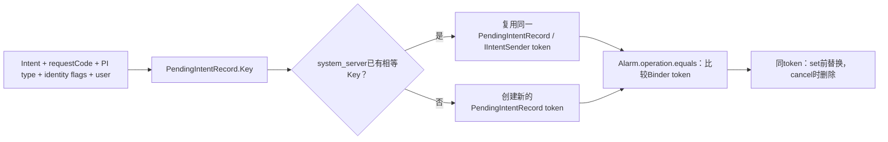
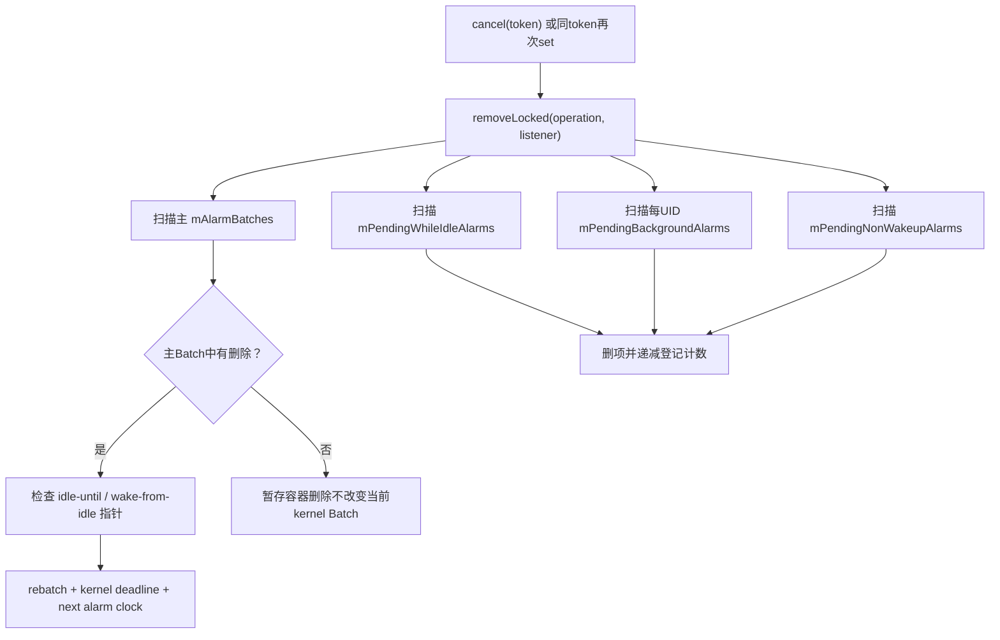
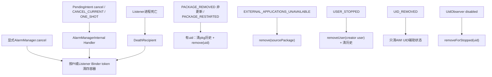

# 149 Android AlarmManager：取消、身份匹配与生命周期清理

> 源码版本：Android 11 / API 30 / `android-11.0.0_r48`  
> 学习方式：macOS 只读源码，不要求编译、不要求连接设备  
> 前置章节：第 145～148 章

---

## 1. 为什么“取消 Alarm”值得单独讲

表面上取消只是：

```java
alarmManager.cancel(pendingIntent);
```

但服务端必须回答一组更难的问题：

- 新建的 PendingIntent Java 对象，为什么还能匹配旧 Alarm？
- Intent 只改变 extras，究竟是新 Alarm 还是替换旧 Alarm？
- OnAlarmListener 用 Java 对象匹配，还是用 Binder token 匹配？
- Alarm 已进入 Doze、后台限制或 non-wakeup 暂存容器后，还能取消吗？
- App 进程死亡、PendingIntent token 失效、包更新、卸载、force-stop、用户停止，各走哪条清理路径？
- 删除 Alarm 后，Batch、kernel deadline、下一闹钟和计数怎样保持一致？

本章把“身份”和“生命周期清理”放到一起，因为能否清理，首先取决于服务认为“谁和谁是同一个目标”。

---

## 2. 本章核心结论

> PendingIntent Alarm 以系统维护的 `IIntentSender` Binder token 为直接匹配身份；Listener Alarm 以 `IAlarmListener` Binder token 为直接匹配身份。公开 `set()` 在插入新 Alarm 前先按该身份删除旧 Alarm，因此同一身份在等待队列中表现为 replacement，而不是无限追加。

生命周期批量清理又使用不同身份：

```text
remove(uid)       → Alarm.uid，即登记者 calling UID
remove(package)   → Alarm.sourcePackage
removeUser(user)  → creatorUid 所属 user
```

这三者不能互换。

---

## 3. 源码地图

```text
frameworks/base/core/java/android/app/AlarmManager.java
frameworks/base/core/java/android/app/PendingIntent.java
frameworks/base/core/java/android/app/IAlarmManager.aidl
frameworks/base/services/core/java/com/android/server/AlarmManagerService.java
frameworks/base/services/core/java/com/android/server/am/PendingIntentController.java
frameworks/base/services/core/java/com/android/server/am/PendingIntentRecord.java
frameworks/base/services/tests/mockingservicestests/src/com/android/server/AlarmManagerServiceTest.java
frameworks/base/services/tests/mockingservicestests/src/com/android/server/am/PendingIntentControllerTest.java
```

---

## 4. 两种 Alarm 目标

Alarm 必须二选一：

| 目标 | App 侧对象 | 跨进程载体 | 可 repeating |
|---|---|---|---|
| PendingIntent | `PendingIntent` | `IIntentSender` token | 可以 |
| Listener | `OnAlarmListener` | `ListenerWrapper extends IAlarmListener.Stub` | 不可以 |

服务端明确拒绝“两个都空”或“两个都有”的组合：

```java
if ((operation == null && directReceiver == null)
        || (operation != null && directReceiver != null)) {
    Slog.w(TAG, "Alarms must either supply a PendingIntent or an AlarmReceiver");
    return;
}
```

为兼容旧版本，这里记录日志并静默返回，不抛 `IllegalArgumentException`。

---

## 5. Alarm 对象中的三套身份

`Alarm` 保存：

```java
uid = _uid;
packageName = _pkgName;
sourcePackage = operation != null
        ? operation.getCreatorPackage() : packageName;
creatorUid = operation != null
        ? operation.getCreatorUid() : uid;
```

所以：

| 字段 | PendingIntent Alarm | Listener Alarm |
|---|---|---|
| `uid` | 调用 `set()` 的 UID | 调用 `set()` 的 UID |
| `packageName` | 调用方经 AppOps 验证的包 | 同左 |
| `creatorUid` | PendingIntent 创建者 UID | 调用 UID |
| `sourcePackage` | PendingIntent 创建者包 | 调用包 |

如果 A 代 B 持有的 PendingIntent 登记 Alarm，登记者和实际执行身份就可能不同。

---

## 6. PendingIntent 不是 Intent 的普通副本

`PendingIntent` 是对 system_server 内 `PendingIntentRecord` 的 token 引用。

Java 类只保存：

```java
private final IIntentSender mTarget;
```

即使创建它的 App 进程被杀，system_server 中的 token 仍可存在，其他持有者仍能发送它。这就是 PendingIntent Alarm 不会仅因普通进程死亡自动消失的基础。

---

## 7. PendingIntent 的“同一个”怎样定义

`PendingIntentRecord.Key` 比较的核心字段包括：

```text
type（activity/broadcast/service等）
packageName / featureId
userId
activity token / who
requestCode
最后一个 Intent 的 filterEquals 字段
resolvedType
身份 flags
```

其中 Intent `extras` 不参加 `filterEquals()`。

因此只改 extras，通常不会得到新的 PendingIntent identity。

---

## 8. 哪些 Intent 字段参与 filterEquals

可把它记成：

```text
action
data URI
MIME type
identifier
package
component
categories
```

Android 11 的实际 `Intent.filterEquals()` 应作为最终依据。还有一个细节：若 component 已明确位于 package 指定的同一个包，源码允许二者形成“package equivalent component”；最重要的实战结论仍是 extras 不参与。

如果需要同时存在多个 Alarm，常用不同的：

- requestCode；
- data URI；
- action；
- 显式 component 与其他参与匹配的字段。

不要只改变 extra 中的业务 ID。

---

## 9. `PendingIntent.equals()` 比较什么

```java
public boolean equals(Object otherObj) {
    if (otherObj instanceof PendingIntent) {
        return mTarget.asBinder().equals(
                ((PendingIntent) otherObj).mTarget.asBinder());
    }
    return false;
}
```

它不在 AlarmManagerService 里重新比较两份 Intent，而是比较最终拿到的 `IIntentSender` Binder token。

Key/filterEquals 决定“获取 PendingIntent 时是否复用同一 token”；Alarm 删除阶段再直接比较 token。

---

## 10. PendingIntent 身份形成链



---

## 11. `FLAG_UPDATE_CURRENT` 不会产生新身份

`PendingIntentController.getIntentSender()` 找到旧 record 后，如果是 `FLAG_UPDATE_CURRENT`：

```java
rec.key.requestIntent.replaceExtras(newIntent);
return rec;
```

token 没变，只更新旧 record 保存的 extras。

结果是：

- 旧 Alarm 仍指向同一个 PendingIntent；
- 发送时可看到更新后的 extras；
- 再用它 `set()`，AlarmManager 还会按同 token 替换旧 Alarm。

---

## 12. `FLAG_CANCEL_CURRENT` 的区别

若 Key 相同且请求 `FLAG_CANCEL_CURRENT`：

```text
把旧 PendingIntentRecord 标成 canceled
通知 AlarmManagerInternal 删除旧 token 对应 Alarm
从 PendingIntent token 表移除旧 record
创建新 record / 新 token
```

所以它不是“复用旧身份并更新数据”，而是使旧 token 失效，再创建同 Key 的新代际。

---

## 13. `FLAG_NO_CREATE` 和身份 flags

`NO_CREATE`、`CANCEL_CURRENT`、`UPDATE_CURRENT` 是获取动作，构造 Key 前会被清掉。

但 `ONE_SHOT`、`IMMUTABLE` 等描述 PendingIntent 实例语义的 flags 留在 Key 中。重新获取这类 token 时必须带上对应身份 flag，否则 Key 不同。

这解释了为何仅凭“Intent 看起来相同”仍可能拿不到旧 PendingIntent。

---

## 14. 公开 `cancel(PendingIntent)` 的 null 边界

```java
if (operation == null) {
    if (mTargetSdkVersion >= N) throw new NullPointerException(...);
    Log.e(...);
    return;
}
mService.remove(operation, null);
```

target SDK >= N 时传 null 抛 NPE；旧 target 为兼容只记录错误并返回。

服务端若 PendingIntent 和 listener 都空，也只记录日志并返回。

---

## 15. Alarm 自己怎样判断匹配

```java
public boolean matches(PendingIntent pi, IAlarmListener rec) {
    return operation != null
            ? operation.equals(pi)
            : rec != null
                    && listener.asBinder().equals(rec.asBinder());
}
```

注意“Returns true if either matches”的注释容易让人以为两个条件同时尝试。实际是按 Alarm 自身类型分支：

- PendingIntent Alarm 只看 PendingIntent token；
- Listener Alarm 只看 listener Binder token。

---

## 16. set 本身就是 replacement

新建 `Alarm a` 并通过 start-mode 检查后：

```java
removeLocked(operation, directReceiver);
incrementAlarmCount(a.uid);
setImplLocked(a, false, doValidate);
```

也就是说同一目标再次 set 的顺序是：

```text
先删除该token在各等待容器中的旧Alarm
→ 计入一个新Alarm
→ 按新时间和政策插入
```

它不是按 `type + triggerAtTime` 判断重复。只要目标 token 相同，即使 type 或时间改变，也替换旧项。

---

## 17. replacement 不只是主 Batch

`removeLocked(operation, listener)` 扫描四类等待容器：

```text
mAlarmBatches
mPendingWhileIdleAlarms
mPendingBackgroundAlarms
mPendingNonWakeupAlarms
```

因此同 token 的旧 Alarm 即使已被：

- Device Idle 暂存；
- 后台限制暂存；
- 熄屏 non-wakeup 压缩暂存；

仍会被普通 cancel 或新 set 找到。

---

## 18. 四容器删除图



---

## 19. 为什么暂存容器删除不设置 `didRemove`

源码注释反复写：

```java
// Don't set didRemove, since this doesn't impact the scheduled alarms.
```

`didRemove` 表示主 `mAlarmBatches` 的结构/边界是否改变。

暂存 Alarm 已不在当前 kernel 调度 Batch 中，删除它需要递减计数，但无需仅为它重建 kernel deadline。

---

## 20. 删除主 Batch 后为什么 rebatch

一个 Batch 的：

```text
start = 所有Alarm最早时间的最大值
end   = 所有Alarm最晚时间的最小值
```

删除其中一个 Alarm 可能放宽 Batch 窗口，也可能移除控制 Doze 转换的特殊 Alarm。服务先在 `Batch.remove()` 中重算端点，随后整体 rebatch，使批次合并关系、idle 指针和最近 kernel deadline重新一致。

---

## 21. `Batch.remove()` 还做哪些账

非 reorder 删除时：

```java
decrementAlarmCount(alarm.uid, 1);
```

如果删除的是 alarm clock：

```java
mNextAlarmClockMayChange = true;
```

如果是内部 TIME_TICK，还更新 tick 诊断时间。

剩余 Alarm 则重新计算 `start/end/flags`。

---

## 22. idle-until 和 wake-from-idle 指针

主 Batch 有删除时，服务额外检查：

```java
if (mPendingIdleUntil.matches(...)) {
    mPendingIdleUntil = null;
    restorePending = true;
}
if (mNextWakeFromIdle.matches(...)) {
    mNextWakeFromIdle = null;
}
```

如果取消了 idle-until 标记，rebatch 后还要恢复被它挡在 `mPendingWhileIdleAlarms` 中的普通 Alarm。

普通 App 不能设置 IDLE_UNTIL，但系统内部清理必须维护该不变量。

---

## 23. Alarm 登记计数是什么

`mAlarmsPerUid` 按 `Alarm.uid`，即登记 calling UID 计数。

它覆盖主 Batch 和几个 pending 容器中的尚未完成 Alarm，用于执行每 UID 并发登记上限。

删除每个 Alarm 都应递减一次；重复 Alarm 在到期时先创建下一代，再结束旧代，因此正常情况下总数仍保持 1。

---

## 24. 计数防御代码

```java
if (oldCount > decrement) {
    count = oldCount - decrement;
} else {
    remove(uid);
}
if (oldCount < decrement) {
    Slog.wtf(...);
}
```

它不会允许负数留在表中；如果代码试图比现有数减得更多，会清键并记录 `wtf`，暴露容器与计数不一致。

---

## 25. OnAlarmListener 如何变成 Binder identity

客户端为 listener 创建或复用：

```java
final class ListenerWrapper extends IAlarmListener.Stub
        implements Runnable {
    final OnAlarmListener mListener;
}
```

`sWrappers` 是：

```java
WeakHashMap<OnAlarmListener, WeakReference<ListenerWrapper>>
```

同一个还存活的 Java listener 通常取得同一个 wrapper；跨 Binder 后，服务用 wrapper 的 Binder token 匹配。

---

## 26. `cancel(OnAlarmListener)` 的客户端查找

取消时客户端先用传入 listener 对象查 `sWrappers`：

```text
查到存活ListenerWrapper
→ wrapper.cancel()
→ mService.remove(null, this)

查不到
→ 只记录 Unrecognized alarm listener
```

因此不能创建一个“内容相同”的新 listener lambda 来取消旧 listener；必须保留原 listener 实例，且其 wrapper 仍可取得。

---

## 27. 为什么 Listener Alarm 要求进程持续存在

ListenerWrapper 是 App 进程里的 Binder Stub，最终还要把回调 post 到指定 Handler。

进程死后：

- Java listener、Handler 和 wrapper 都不存在；
- Binder token 触发 death recipient；
- system_server 自动删除该 token 的 Alarm。

它不同于由 system_server 持有 record 的 PendingIntent。

---

## 28. Listener Binder death 清理链

set 时：

```java
directReceiver.asBinder().linkToDeath(mListenerDeathRecipient, 0);
```

死亡时：

```java
public void binderDied(IBinder who) {
    IAlarmListener listener = IAlarmListener.Stub.asInterface(who);
    removeImpl(null, listener);
}
```

最终仍复用同一个四容器 `removeLocked()`，所以已进入 idle/background/non-wakeup 暂存的 listener Alarm 也能清掉。

---

## 29. linkToDeath 失败意味着什么

如果 set 时目标 Binder 已经死亡：

```java
catch (RemoteException e) {
    Slog.w(TAG, "Dropping unreachable alarm listener ...");
    return;
}
```

Alarm 根本不会登记，也不会增加 `mAlarmsPerUid`。

这避免创建一个从一开始就无法交付的 listener Alarm。

---

## 30. r48 没有看到 `unlinkToDeath`

在本类中能找到 `linkToDeath()`，但没有对应 `unlinkToDeath()`。

同一个 listener wrapper 多次 set 时，每次都会先 link，再按 token replacement；死亡后可能收到重复 death 回调。重复回调只会再次扫描并找不到 Alarm，主要是冗余工作，而非再次递减已删除 Alarm。

这是 Android 11 r48 的实现观察，不应推广到所有版本。

---

## 31. cancel 会停止已经开始的回调吗

不会。

`removeLocked()` 扫描的是等待容器，不扫描 `mInFlight` 来撤销已经发送的 PendingIntent 或已 post 的 listener callback。

一旦 Alarm 已经交付：

- cancel 可以阻止尚未交付的下一代 repeating Alarm；
- 不能把已经运行中的 receiver/service/listener 强行倒回去；
- in-flight 仍由 `onSendFinished`、`alarmComplete` 或 timeout 收尾。

---

## 32. 等待计数与 in-flight 计数不要混淆

到期 Alarm 从等待结构移出并在 `deliverAlarmsLocked()` 末尾递减 `mAlarmsPerUid`。

成功开始交付后，另由：

```text
mInFlight
mBroadcastRefCount
BroadcastStats / FilterStats nesting
共享Alarm WakeLock
```

跟踪执行中状态。

`cancel()` 主要管前者；完成/超时协议管后者。

---

## 33. PendingIntent 自己被 cancel 时如何通知 AlarmManager

`PendingIntentController.makeIntentSenderCanceled()`：

```java
rec.canceled = true;
...
AlarmManagerInternal ami = LocalServices.getService(...);
ami.remove(new PendingIntent(rec));
```

AlarmManager 的 LocalService 不在 PendingIntentController 锁内直接做全量删除，而是发 Handler 消息：

```java
mHandler.obtainMessage(REMOVE_FOR_CANCELED, pi).sendToTarget();
```

Handler 再持 `mLock` 调 `removeLocked(operation, null)`。

---

## 34. 为什么 PendingIntent cancel 清理是异步的

PendingIntentController 和 AlarmManagerService 都有自己的锁。通过 system_server Handler 交接，可以避免在 PendingIntent 锁调用 AlarmManager 的复杂清理时制造锁顺序耦合。

因此“PendingIntent 已标记 canceled”和“Alarm 等待容器已清理”之间有一个短暂消息窗口。

若这时 Alarm 已被取出发送，`operation.send()` 会抛 `CanceledException`，交付路径仍有兜底。

---

## 35. 哪些动作会使 PendingIntent token 失效

本地源码测试明确覆盖：

- 显式 `PendingIntent.cancel()`；
- 用相同 Key + `FLAG_CANCEL_CURRENT` 重建；
- `FLAG_ONE_SHOT` token 成功发送后自取消；
- AMS/ATMS 生命周期清理 PendingIntentRecord。

这些都会经 `AlarmManagerInternal.remove(pi)` 清等待 Alarm。

---

## 36. `CanceledException` 的第二道保险

Alarm 到期发送时：

```java
try {
    alarm.operation.send(...);
} catch (PendingIntent.CanceledException e) {
    if (alarm.repeatInterval > 0) {
        removeImpl(alarm.operation, null);
    }
    mSendFinishCount++;
    return;
}
```

一次性 Alarm 已从等待队列取出，无需再删；repeating Alarm 在到期处理中已经安排了下一代，所以必须按 token 把下一代取消。

这正好覆盖上节的异步竞态。

---

## 37. Listener 无法交付的兜底

若 `listener.doAlarm()` 抛异常：

```text
尚未建立in-flight
尚未发送timeout message
listenerFinishCount++
直接返回
```

Listener Alarm 只能是 one-shot，因此没有 repeating 下一代需要清理。

---

## 38. 按 UID 删除看的是登记者

```java
Predicate<Alarm> whichAlarms = a -> a.uid == uid;
```

`a.uid` 是调用 `AlarmManager.set()` 的 UID，而不一定是 PendingIntent creator UID。

所以按 UID 清理回答的是：

> 哪个 UID 登记并占用了 Alarm 数量？

不是：

> 最终 PendingIntent 代表哪个 UID 执行？

---

## 39. 按 UID 清理扫描哪些容器

Android 11 r48 扫描：

```text
mAlarmBatches
mPendingWhileIdleAlarms
mPendingBackgroundAlarms 中每个列表的 Alarm.uid
```

并维护 `mNextWakeFromIdle`、防御性处理 `mPendingIdleUntil`。

但它没有扫描 `mPendingNonWakeupAlarms`。这是稍后要重点复审的实现边界。

---

## 40. system UID 为什么不按 UID force-stop 清理

```java
if (uid == Process.SYSTEM_UID) return;
```

多个关键系统组件共享 system UID。若某个 system-uid 包发生 force-stop 事件，按 UID 全清会误删整个系统 UID 的 Alarm，所以实现直接忽略。

这也说明 UID 粒度在 shared UID 场景天然很粗。

---

## 41. 按 package 删除看 `sourcePackage`

```java
public boolean matches(String packageName) {
    return packageName.equals(sourcePackage);
}
```

对 PendingIntent Alarm，它是 PendingIntent creator package；对 listener Alarm，它是登记 calling package。

因此 `removeLocked(pkg)` 与 `removeLocked(uid)` 可能选出完全不同的集合。

---

## 42. 按 package 清理扫描哪些容器

r48 扫描：

```text
mAlarmBatches
mPendingWhileIdleAlarms
mPendingBackgroundAlarms
```

并维护 `mNextWakeFromIdle`。

它也没有扫描 `mPendingNonWakeupAlarms`。

包清理前后还检查内部 TIME_TICK 是否意外消失，因为正常业务 package 清理不应删掉系统 tick。

---

## 43. 按用户删除看 creator user

主 Batch 和 pending-while-idle 的谓词是：

```java
UserHandle.getUserId(a.creatorUid) == userHandle
```

后台 pending 表本身按 creator UID 作为 key，因此按 key 的 user 清整组，但计数仍按各 Alarm 的登记 `uid` 递减。

这符合多用户隔离：PendingIntent 实际代表哪个用户，比哪个进程代为调用 set 更接近执行归属。

---

## 44. 用户清理还删除哪些状态

`removeUserLocked()` 额外清理该用户 UID 的：

```text
mLastAllowWhileIdleDispatch
```

`UninstallReceiver` 随后还调用：

```java
mAppWakeupHistory.removeForUser(userHandle);
```

即等待 Alarm 和 App Standby 历史分别由不同方法清理。

---

## 45. `ACTION_USER_STOPPED` 与方法名的反差

接收器监听的是 `ACTION_USER_STOPPED`，却调用名字像“删除用户”的 `removeUserLocked()`。

因此在 AlarmManagerService 的语义里，用户停止就会清该 creator user 的 Alarm，而不是等 `ACTION_USER_REMOVED`。

用户以后再次启动，业务需按自身持久规则重新登记。

---

## 46. system user 的特殊边界

`removeUserLocked(USER_SYSTEM)` 直接返回，避免清系统用户 Alarm。

但接收器随后无条件执行 `mAppWakeupHistory.removeForUser(userHandle)`。所以若收到 user 0 stopped：

- 等待 Alarm 保留；
- user 0 的 App Wakeup history 会被清。

这是按 r48 控制流得出的精确边界。

---

## 47. 包生命周期接收器监听什么

```text
ACTION_PACKAGE_REMOVED
ACTION_PACKAGE_RESTARTED
ACTION_QUERY_PACKAGE_RESTART
ACTION_EXTERNAL_APPLICATIONS_UNAVAILABLE
ACTION_USER_STOPPED
ACTION_UID_REMOVED
```

前一组带 `package:` data scheme；后一组是独立 filter。

它把查询、卸载/force-stop、外部存储包不可用、用户和 UID 状态放在同一个内部 Receiver 中处理。

---

## 48. `QUERY_PACKAGE_RESTART` 只查询不删除

它遍历 `EXTRA_PACKAGES`，调用：

```java
lookForPackageLocked(packageName)
```

若发现 Alarm，设置广播结果 `RESULT_OK` 并返回。

它只是告诉 ActivityManager “这些包是否有 Alarm 相关状态”，并不在查询动作里删除。

---

## 49. `lookForPackageLocked()` 的范围

r48 只看：

```text
mAlarmBatches
mPendingWhileIdleAlarms
```

它不看 `mPendingBackgroundAlarms`，也不看 `mPendingNonWakeupAlarms`。

因此它不是“AlarmManager 内任意容器是否存在该包”的完整查询。这会影响 `QUERY_PACKAGE_RESTART` 的可见范围。

---

## 50. PACKAGE_REMOVED 更新时为什么不清

```java
if (EXTRA_REPLACING) return;
```

普通 APK 更新会先移除旧包再安装新包。若 `EXTRA_REPLACING=true` 就清 Alarm，应用每次更新都会丢失等待计划。

Android 11 在这里选择保留 Alarm；真正卸载才继续走清理。

---

## 51. PACKAGE_RESTARTED 表示什么

它通常与 force-stop/包重启清理相关。接收器从 `package:` URI 取包名，然后与真正卸载共用后续逻辑。

对于有有效 `EXTRA_UID` 的 package-removed/restarted：

```java
mAppWakeupHistory.removeForPackage(pkg, userId(uid));
removeLocked(uid);
```

这里特别值得注意：等待 Alarm 实际按 UID 清，不是按 pkg 清。

---

## 52. shared UID 的粗粒度影响

若多个包共享同一个 UID，对其中一个包收到 `PACKAGE_RESTARTED`：

- wakeup history 只清该 `pkg + user`；
- `removeLocked(uid)` 却会删除该 UID 登记的所有 Alarm，可能包括 sibling 包登记项。

这是 shared UID 模型和 UID 粒度清理结合后的自然结果。

---

## 53. 代理登记场景的影响

假设 A 用自己的调用身份，为 B 创建的 PendingIntent 登记 Alarm：

```text
Alarm.uid           = A uid
Alarm.packageName   = A package
Alarm.creatorUid    = B uid
Alarm.sourcePackage = B package
```

则：

- force-stop A 的 UID 清理会删该 Alarm；
- 按 package B 清理会匹配 sourcePackage；
- 用户清理按 B 所属 user；
- 配额历史也记 B。

身份字段各自回答不同政策问题。

---

## 54. 外部应用不可用为何走 package 匹配

`ACTION_EXTERNAL_APPLICATIONS_UNAVAILABLE` 通常没有单个有效 `EXTRA_UID`，而带 `EXTRA_CHANGED_PACKAGE_LIST`。

接收器因此逐包调用：

```java
removeLocked(pkg);
```

这按 `sourcePackage` 清，而不是登记 UID。它适合一次处理多个因外部存储暂不可用的包。

---

## 55. UID_REMOVED 在这里没有删 Alarm

`ACTION_UID_REMOVED` 分支只做：

```java
mLastAllowWhileIdleDispatch.delete(uid);
mUseAllowWhileIdleShortTime.delete(uid);
return;
```

Alarm 等待项通常已由 package removed/restarted 等其他生命周期路径清理；这个分支负责移除按 UID 保存的 AWI 节流辅助状态。

不要仅凭 action 名字断言它调用了 `removeLocked(uid)`——r48 实际没有。

---

## 56. UidObserver 的 disabled 清理

`onUidGone()` 或 `onUidIdle()` 若 `disabled=true`：

```text
post REMOVE_FOR_STOPPED(uid)
→ Handler持锁
→ removeForStoppedLocked(uid)
```

普通进程 gone 但 `disabled=false` 不会删除 PendingIntent Alarm。

这与 PendingIntent 跨进程生存语义一致。

---

## 57. `removeForStoppedLocked()` 为什么有二次查询

主 Batch 谓词不仅看 `a.uid == uid`，还调用：

```java
ActivityManager.isAppStartModeDisabled(uid, a.packageName)
```

只有确实处于 disabled start mode 的 Alarm 才从主 Batch 删除。

源码注释写“Only called for ephemeral apps”，但调用来自通用 UidObserver disabled 回调；阅读时应以调用链和运行条件共同判断。

---

## 58. stopped 清理在 pending 容器更粗

`removeForStoppedLocked()` 对：

- `mPendingWhileIdleAlarms`：只要 `a.uid == uid` 就删；
- `mPendingBackgroundAlarms`：直接删除 key 为该 UID 的整组；

没有逐 Alarm 再调用 `isAppStartModeDisabled()`。

因此主 Batch 的精细 package/start-mode 判断与 pending 容器的 UID 粗清并不对称。

---

## 59. 生命周期清理总图



---

## 60. 批量清理后的统计状态

包清理还删除：

```text
mPriorities[pkg]
mBroadcastStats 各UID下的 pkg 项
```

用户停止则清其 AppWakeupHistory 和部分 AWI 状态。

所以“删 Alarm”不只是队列操作，还包括不应跨越生命周期的调度历史/诊断状态；但不同事件清理的状态集合并不相同。

---

## 61. r48 关键缺口：UID 清理漏 `mPendingNonWakeupAlarms`

按 token 的 `removeLocked(operation, listener)` 会扫描 pending non-wakeup。

但以下方法都没有扫描它：

```text
removeLocked(uid)
removeLocked(packageName)
removeForStoppedLocked(uid)
removeUserLocked(user)
```

这不是抽象推测，而是逐段对照四个方法后的源码事实。

复读时还发现另一组不对称：

- `removeLocked(uid)` 会显式清与该 UID 对应的 `mNextWakeFromIdle`；
- `removeLocked(package)` 通过谓词记录并清匹配的 `mNextWakeFromIdle`；
- `removeForStoppedLocked(uid)` 和 `removeUserLocked(user)` 没有相同处理。

后两者若从主 Batch 删除了当前最早 WAKE_FROM_IDLE Alarm，`rebatchAllAlarmsLocked()` 本身又不会先把 `mNextWakeFromIdle` 置空再重建，因此该字段可能继续指向已经不在 Batch 中的旧 Alarm。用户 AlarmClock 会获得 WAKE_FROM_IDLE，这使 user-stopped 路径尤其值得注意。

---

## 62. 漏清后的实际后果要谨慎描述

`mPendingNonWakeupAlarms` 中的 Alarm 已经到过 nominal deadline，只是因设备非交互而压缩延迟。

生命周期批量清理漏掉它后：

- PendingIntent 若已由 AMS 取消，后续发送会抛 `CanceledException`，不会真正执行目标；
- listener 若进程死亡，token death 的精确清理路径通常仍会扫到它；
- Alarm 登记计数可能一直保留到 pending 列表被取出并走交付清账；
- `QUERY_PACKAGE_RESTART` 也看不到这类项。

对上一节的 stale `mNextWakeFromIdle`，潜在影响则是 next-wake-from-idle 查询和 idle-until 重排仍参考旧对象；它不等于旧 Alarm 仍在主 Batch 等待正常交付。

因此更准确说是“等待条目/计数可延迟残留”，而不是笼统断言卸载 App 一定被成功唤起。

---

## 63. package 清理与 PendingIntentController 的双保险

包 force-stop/卸载通常不只触发 AlarmManager 的广播接收器。AMS 的 PendingIntentController 也会移除符合包/user/appId 的 PendingIntentRecord，并通过 `makeIntentSenderCanceled()` 通知 AlarmManager 按精确 token 删除。

因此实际系统存在：

```text
生命周期广播的UID/package批量清理
+ PendingIntent token取消的精确异步清理
+ 最终send时CanceledException兜底
```

分析缺口时要同时看这三层，不能只读一个方法就夸大用户可见后果。

---

## 64. Listener replacement 的微妙点

同一个 `OnAlarmListener` wrapper 再次 set 会替换旧等待 Alarm。

但是 `ListenerWrapper.setHandler(handler)` 会修改同一个 wrapper 的 Handler。若旧 Alarm 已经进入 in-flight、其 `doAlarm()` 尚未执行，而此时对同 listener 再 set 并换 Handler，wrapper 共享可变 `mHandler/mCompletion` 可能产生复杂竞态。

r48 API 通常把 listener 设计为 one-shot 且要求调用方管理生命周期；不要把一个 listener 对象当作多个并行 Alarm 的独立 token。

---

## 65. 取消 repeating Alarm 的正确方式

Repeating 只能使用 PendingIntent。

保留或重新构造同 identity 的 PendingIntent，再调用：

```java
alarmManager.cancel(pi);
```

关键不是 Java 变量必须是同一个实例，而是最终取得相同的 PendingIntent token。requestCode、type、user、filterEquals 字段和身份 flags 都要一致。

---

## 66. extras 为什么是最常见的坑

错误思路：

```java
Intent i1 = new Intent(ACTION).putExtra("id", 1);
Intent i2 = new Intent(ACTION).putExtra("id", 2);
PendingIntent p1 = getBroadcast(ctx, 0, i1, flags);
PendingIntent p2 = getBroadcast(ctx, 0, i2, flags);
```

若其他 identity 字段相同，`p1`、`p2` 通常是同 token。第二次 set 会替换第一次，而不是共存。

可使用不同 requestCode 或不同 data URI 表达独立身份。

---

## 67. `UPDATE_CURRENT` 的安全含义

同 token 的持有者拥有发送能力。`FLAG_UPDATE_CURRENT` 修改该 token 保存的 extras 后，其他已经持有该 token 的组件未来发送时也可能看到新 extras。

所以它不只是 Alarm 队列 replacement 问题，也是 capability 数据更新问题。Sensitive extras、mutable/immutable 选择需要结合 PendingIntent 安全模型审查。

---

## 68. cancel 与 force-stop 的差别

| 操作 | 匹配粒度 | 是否清 PendingIntent token | 是否影响同 UID 其他包 |
|---|---|---:|---:|
| `AlarmManager.cancel(pi)` | 单 token | 否，只删 Alarm | 否 |
| `PendingIntent.cancel()` | 单 token | 是 | 否 |
| 同 token 再 set | 单 token replacement | 否 | 否 |
| package restart r48 Alarm路径 | 登记 UID | 通常另有 PI 清理 | shared UID 可能是 |
| user stopped | creator user | AMS另有用户清理 | 清该用户范围 |

`AlarmManager.cancel(pi)` 不会把 PendingIntent 本身作废；之后仍可用同 token 重新 set 或发送。

---

## 69. cancel 与已经发送的 one-shot

one-shot Alarm 到期时已经从等待结构移除，随后 PendingIntent 发送。

此时再 cancel：

- 找不到等待 Alarm 是正常的；
- 不撤销已经进入目标组件的工作；
- 完成 callback 仍负责释放 AlarmManager WakeLock；
- 若 PendingIntent 自身是 `FLAG_ONE_SHOT`，发送会使 token 失效并异步通知清理同 token 其他等待项。

---

## 70. 诊断时该看哪些输出

`dumpsys alarm` 中重点区分：

```text
Alarm batches
Pending while idle alarms
Pending background alarms
Pending non-wakeup alarms
In-flight
Alarms per uid
App Alarm history
Broadcast/Filter stats
```

若 cancel 后仍看到条目，先确认它在哪个容器、是等待还是 in-flight，再确认使用的是 PI token、listener token、登记 UID、source package 还是 creator user 清理。

---

## 71. macOS 只读练习一：画出 token 匹配

```bash
cd /Users/ninebot/androidSource
sed -n '3688,3720p' \
  frameworks/base/services/core/java/com/android/server/AlarmManagerService.java
sed -n '1160,1200p' \
  frameworks/base/core/java/android/app/PendingIntent.java
```

回答：

1. AlarmManagerService 是否直接调用 `Intent.filterEquals()`？
2. filterEquals 在哪个更早阶段决定 token 复用？
3. 两个不同 Java PendingIntent 对象何时仍可 equals？

---

## 72. macOS 只读练习二：对照四容器

```bash
sed -n '3070,3140p' \
  frameworks/base/services/core/java/com/android/server/AlarmManagerService.java
sed -n '3140,3360p' \
  frameworks/base/services/core/java/com/android/server/AlarmManagerService.java
```

做一张勾选表：

| 方法 | Batch | idle pending | background pending | non-wakeup pending |
|---|---:|---:|---:|---:|
| token remove | ✓ | ✓ | ✓ | ✓ |
| uid remove | ✓ | ✓ | ✓ | ✗ |
| package remove | ✓ | ✓ | ✓ | ✗ |
| stopped remove | ✓ | ✓ | ✓ | ✗ |
| user remove | ✓ | ✓ | ✓ | ✗ |

然后思考为什么 token 精确取消覆盖最完整，而生命周期方法存在 r48 不对称。

---

## 73. macOS 只读练习三：PendingIntent Key

```bash
sed -n '70,185p' \
  frameworks/base/services/core/java/com/android/server/am/PendingIntentRecord.java
sed -n '112,170p' \
  frameworks/base/services/core/java/com/android/server/am/PendingIntentController.java
```

尝试预测：

- 只改 extra；
- 改 requestCode；
- 改 data URI；
- 从 broadcast 改成 service；
- 忘记带 `FLAG_IMMUTABLE`；

哪些会拿到同 Key，哪些会得到新 token。

---

## 74. macOS 只读练习四：生命周期事件

```bash
sed -n '4370,4455p' \
  frameworks/base/services/core/java/com/android/server/AlarmManagerService.java
```

逐分支写出：

```text
输入action
→ 读取哪些extra/data
→ 选择uid/package/user哪种身份
→ 是否清wakeup history
→ 是否清AWI辅助状态
→ 是否只查询
```

特别检查 `EXTRA_REPLACING` 与 `UID_REMOVED`，不要凭 action 名字补出源码中没有的动作。

---

## 75. macOS 只读练习五：验证测试覆盖

```bash
rg -n "alarmCountOnRemove|alarmCountOnListenerBinderDied|alarmsRemovedOn" \
  frameworks/base/services/tests/mockingservicestests/src/com/android/server/AlarmManagerServiceTest.java \
  frameworks/base/services/tests/mockingservicestests/src/com/android/server/am/PendingIntentControllerTest.java
```

当前测试直接证明：

- cancel token 后计数清零；
- listener death 后逐项清理；
- UID/package/user/idle/non-wakeup部分计数路径；
- PI cancel、CANCEL_CURRENT、ONE_SHOT 会通知 AlarmManager。

但测试存在不等于所有批量方法都覆盖所有容器，仍需逐源码审计。

---

## 76. 初学者最容易混淆的六句话

### 76.1 “必须保存同一个 PendingIntent Java 对象才能取消”

错。可以重新获取，只要 Key 相同并得到同一个系统 token。

### 76.2 “Intent extras 不同就是不同 Alarm”

错。extras 不参加 PendingIntent filter identity。

### 76.3 “AlarmManager.cancel 会 cancel PendingIntent”

错。它只删除匹配 Alarm，不使 token 本身失效。

### 76.4 “App 进程死后 PendingIntent Alarm 自动消失”

错。PendingIntent record 在 system_server，可跨 App 进程死亡存在。

### 76.5 “Listener Alarm 也能跨进程死亡保留”

错。它依赖 App Binder Stub，death recipient 会清理。

### 76.6 “remove package、UID、user 只是三种写法”

错。它们分别按 source package、登记 UID、creator user 选 Alarm。

---

## 77. 本章复读后的修订点

第一遍最容易写成“所有 remove 都扫描所有容器”。逐方法复读后必须改成：

- 精确 token remove 才明确扫描四容器；
- UID/package/stopped/user 批量清理都漏 pending non-wakeup；
- `QUERY_PACKAGE_RESTART` 范围更窄，只看 Batch 与 pending-while-idle；
- stopped/user 清理还没有像 UID/package 清理那样复位 `mNextWakeFromIdle`；
- PI token 取消、send 异常又提供额外兜底，不能把残留条目直接等同于成功执行卸载应用。

第二个易错点是包事件：有 UID 的 PACKAGE_REMOVED/RESTARTED 最终调用 `removeLocked(uid)`，不是 `removeLocked(pkg)`；只有 external unavailable 的无 UID 分支使用 package 匹配。

---

## 78. 本章检查清单

读完应能回答：

- PendingIntent Key 与 PendingIntent.equals 分别发生在哪一层？
- 为什么 extras 不同仍可能 replacement？
- `UPDATE_CURRENT` 与 `CANCEL_CURRENT` 对 token 有何区别？
- 同 token 再 set 为什么只剩一个等待 Alarm？
- token remove 扫描哪四类容器？
- 为什么 cancel 不终止 in-flight？
- ListenerWrapper 如何建立、完成和死亡清理？
- `uid/packageName/creatorUid/sourcePackage` 各是谁？
- package restarted 为何可能粗清 shared UID？
- 用户停止依据登记 user 还是 creator user？
- UID_REMOVED 分支真实清了什么？
- r48 哪些批量清理漏 pending non-wakeup，实际后果为何需要三层分析？
- 哪两种批量清理还可能留下 stale `mNextWakeFromIdle`？

---

## 79. 一页总结

```text
直接身份：
  PendingIntent Alarm → IIntentSender Binder token
  Listener Alarm      → IAlarmListener Binder token

PendingIntent身份来源：
  type/package/user/requestCode/filterEquals/identity flags等形成Key
  extras不参与
  Key相同通常复用token

正常set/cancel：
  同token再次set → 先清旧等待项，再插新项
  cancel(pi)      → 清Alarm，不作废PI
  PI.cancel       → 作废token，异步通知AlarmManager清Alarm
  listener死亡   → DeathRecipient按Binder token清Alarm

精确token清理：
  Batch + idle pending + background pending + non-wakeup pending

生命周期身份：
  uid      = 登记者
  source   = PI creator package或listener calling package
  creator  = PI creator uid或listener calling uid
  user清理 = creator user

r48边界：
  uid/package/stopped/user批量remove漏non-wakeup pending
  QUERY_PACKAGE_RESTART只查Batch与idle pending
  stopped/user清理未显式复位next-wake-from-idle指针
  包事件有uid时按登记uid粗清，shared UID需谨慎
  PendingIntent取消和CanceledException提供额外兜底
```

---

## 80. 下一章

第 150 章继续研究：

> AlarmManager 的投递、InFlight、WakeLock、完成回调与超时诊断。

第 145 章已经给出总体闭环；下一章会逐字段精读 `DeliveryTracker`，重点分析 PendingIntent 与 Listener 两条完成协议、共享 WakeLock 归因、late callback、timeout，以及计数和统计如何在异常路径保持平衡。
