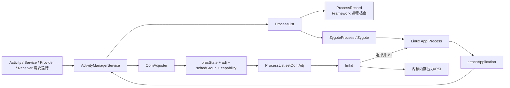
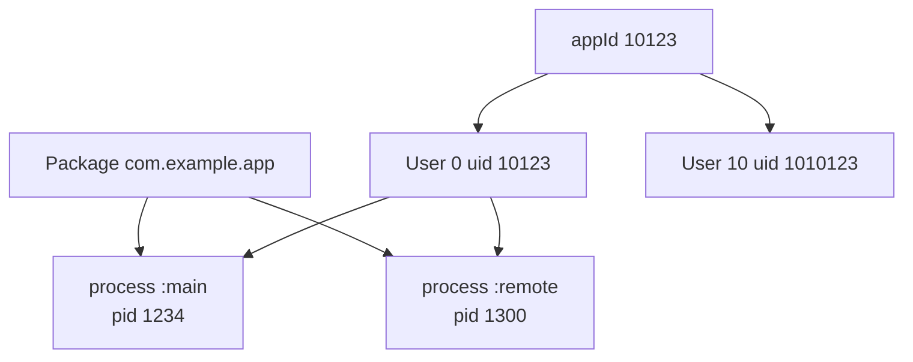
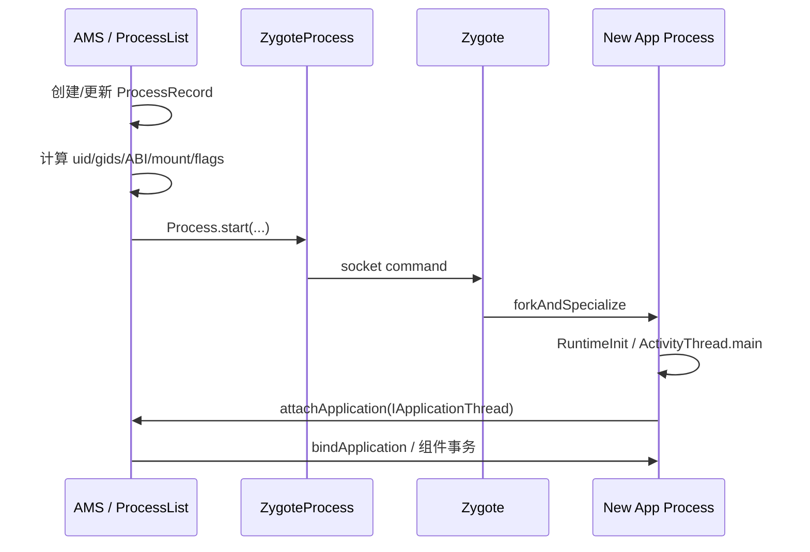
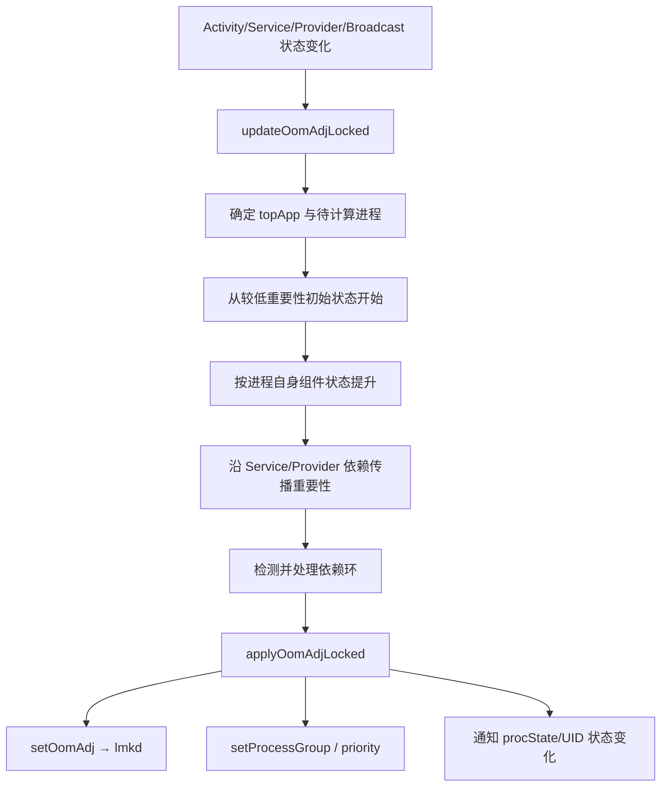
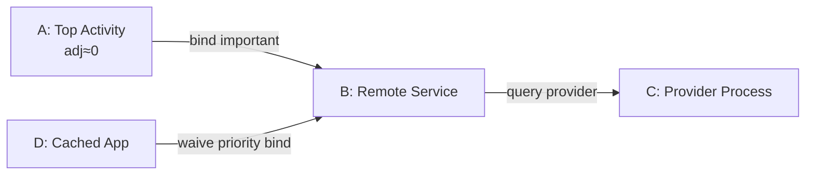
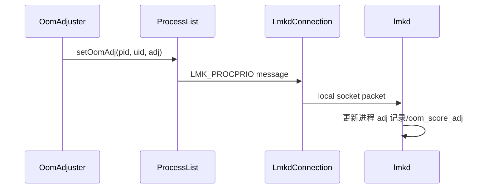

# 15 AMS 进程管理：ProcessRecord、进程优先级、OOM Adj 与 LMKD

## 本章边界

第 5 章讲过 Zygote 怎样 fork 应用进程，第 10 章也追过 Activity 冷启动时怎样请求目标进程。但还没有系统回答：

> Android 如何记录每个应用进程？前台 App 为什么不容易被杀？后台 Service 为什么有时能“借到”前台客户端的重要性？内存不足时究竟是 AMS、内核还是 LMKD 杀进程？

本章以 Android 11 / `android-11.0.0_r48` 为准，追踪：

```text
组件需要进程
 → AMS / ProcessList 创建 ProcessRecord
 → 请求 Zygote fork
 → 应用 attachApplication
 → OomAdjuster 计算进程状态
 → 设置 oom_score_adj 与调度组
 → LMKD 在内存压力下选择牺牲者
 → AMS 清理死亡进程的组件状态
```

本章按 macOS 只读学习设计：不修改、不编译 AOSP。所有练习都可以只靠源码搜索、设计文档和可选的 adb 只读命令完成。

## 本章目标

读完后，你应该能够：

1. 区分 AMS、ProcessList、ProcessRecord、OomAdjuster 与 LMKD。
2. 解释为什么“应用”“包”“进程”“UID”不是一一对应。
3. 从 `startProcessLocked()` 追到 Zygote fork 与 `attachApplication()`。
4. 区分 procState、oom adj、schedGroup 和 capability。
5. 理解 adj 数字越大通常越容易在内存压力下被杀。
6. 解释 Activity、Service、Provider、Receiver 怎样影响进程重要性。
7. 解释绑定 Service 为什么形成进程依赖图。
8. 区分 Android Framework 主动 kill、LMKD low-memory kill 与普通 crash。
9. 解释 cached process 的价值，而不是把它视为“无用进程”。
10. 使用 dumpsys、ps、procfs 和 logcat 建立只读证据链。

---

## 1. 先看完整结构



一句话概括：

> AMS 知道进程在做什么，OomAdjuster 把这种语义转换为重要性，LMKD 在真实内存压力下参考重要性选择牺牲者。

---

## 2. 五个核心角色

| 角色 | 所在位置 | 核心职责 |
|---|---|---|
| `ActivityManagerService` | system_server Java | 管理应用进程和组件运行状态，处理 attach、死亡与全局协调 |
| `ProcessList` | system_server Java | 维护进程集合、发起启动、与 Zygote/LMKD 通信、定义 adj 常量 |
| `ProcessRecord` | system_server Java 对象 | 某个应用进程在 Framework 中的运行档案 |
| `OomAdjuster` | system_server Java | 根据组件与依赖关系计算 procState、adj、schedGroup、capability |
| `lmkd` | 独立 native daemon | 监测内存压力，根据进程 adj 等信息选择并杀死进程 |

主要源码：

```text
frameworks/base/services/core/java/com/android/server/am/ActivityManagerService.java
frameworks/base/services/core/java/com/android/server/am/ProcessList.java
frameworks/base/services/core/java/com/android/server/am/ProcessRecord.java
frameworks/base/services/core/java/com/android/server/am/OomAdjuster.java
frameworks/base/services/core/java/com/android/server/am/OomAdjuster.md
frameworks/base/services/core/java/com/android/server/am/LmkdConnection.java
system/memory/lmkd/lmkd.cpp
system/memory/lmkd/lmkd.rc
```

---

## 3. App、Package、UID、Process 再分一次

```text
Package：PMS 认识的软件包身份
UID：Linux 安全身份，通常由 userId + appId 组成
Process：Linux 运行实体，有 pid
Application：进程中 Android 应用运行环境对象
```

它们不是一一对应：

- 一个 package 可通过 `android:process` 使用多个进程。
- 一个进程可承载同 UID/特定共享关系下的多个 package 代码环境。
- 同一个 package 在不同 Android user 下 uid 不同。
- 进程死亡后 package 仍然安装，UID 映射仍然存在。
- 同一个进程重启后 pid 改变，但 ProcessRecord/包身份可重新建立。



图只展示常见同包多进程，实际 isolated process 会使用独立的 isolated UID。

---

## 4. ProcessRecord 是什么

源码：

```text
frameworks/base/services/core/java/com/android/server/am/ProcessRecord.java
```

ProcessRecord 不是 Linux `task_struct`，也不在 App 进程中。它是 system_server 对一个应用进程的 Framework 侧记录。

典型信息包括：

- `processName`、uid、userId。
- `ApplicationInfo`。
- pid 与启动序号。
- `IApplicationThread thread`，即应用 Binder 回调端。
- 当前托管的 Activity、Service、Provider、Receiver 关联。
- 当前/已应用的 adj、procState、schedGroup。
- 是否 persistent、isolated、cached、killed、pendingStart。
- crash、ANR、启动和内存统计状态。

### ProcessRecord 的三个阶段

```text
已创建记录但 pid=0：系统准备启动或记录已知进程身份
pid>0 但 thread=null：Zygote 已 fork，等待应用 attach
pid>0 且 thread!=null：应用已向 AMS attach，可接收事务
```

这三个阶段是理解“进程启动超时”的关键。fork 成功不等于 `ActivityThread.main()` 已完成 attach。

---

## 5. 什么事件会要求启动进程

常见来源：

```text
Activity 启动
Service start/bind
动态或 Manifest Receiver 接收广播
ContentProvider 首次获取
备份、Instrumentation、Job 等系统调度
```

不同入口最终会调用 AMS/ProcessList 的 `startProcessLocked()`，但会携带不同 `HostingRecord`：

```text
activity
service
broadcast
content provider
added application
```

HostingRecord 描述“为什么启动这个进程”。它用于日志、统计、策略和故障分析，不是进程内要执行的组件对象。

---

## 6. startProcessLocked 方法为什么这么多

`ProcessList.java` 中有多个重载：

```text
startProcessLocked(String processName, ApplicationInfo info, ...)
startProcessLocked(ProcessRecord app, HostingRecord hostingRecord, ...)
startProcessLocked(HostingRecord, entryPoint, ProcessRecord, uid, gids, ...)
startProcess(...)
```

先按层次看：

1. 根据 processName/uid 查找或创建 ProcessRecord。
2. 检查已有进程、pending start 与启动限制。
3. 从 PMS 查询 gids、存储挂载模式、ABI 等身份参数。
4. 组织 Zygote 参数。
5. 通过 `Process.start()` / `ZygoteProcess` 请求 fork。
6. 得到 pid，登记 pid 映射并等待 attach。

不要从第一个重载逐行跟到最后一个参数。第一次阅读只记录每层“增加了什么信息”。

---

## 7. 启动前为什么还要问 PMS

`ProcessList.startProcessLocked()` 中可以看到：

```java
AppGlobals.getPackageManager()
        .checkPackageStartable(
                app.info.packageName, userId);

permGids = pm.getPackageGids(
        app.info.packageName,
        MATCH_DIRECT_BOOT_AUTO,
        app.userId);
```

PMS 提供：

- package 对当前 user 是否可启动。
- uid/gid 与权限附加组。
- ApplicationInfo、ABI、代码路径等包身份。

AMS 决定“组件运行需要进程”，PMS 决定“这个包以什么身份和代码运行”。这再次说明 AMS 与 PMS 互补，而不是互相替代。

---

## 8. ProcessList 到 Zygote

概念链路：



第 5 章关注 Zygote 内部 fork，本章关注 fork 前后的 AMS 状态衔接。

### 为什么需要 startSeq

进程可能启动缓慢、超时、死亡并迅速重启。只有 pid 不足以区分旧启动回调和新启动尝试。启动序号帮助 AMS 判断 attach/结果是否属于当前这次启动，避免陈旧结果污染新 ProcessRecord。

---

## 9. fork 成功后还不能立刻启动 Activity

`ProcessStartResult` 返回 pid 后，AMS 会：

- 记录 pid。
- 把 ProcessRecord 放进 pid 映射。
- 安排 process start timeout。
- 等待新进程通过 Binder 调用 `attachApplication()`。

应用侧：

```text
ActivityThread.main
 → attach(false, startSeq)
 → IActivityManager.attachApplication(...)
```

AMS 收到 attach 后设置 `app.thread`，再执行 bindApplication、安装 Provider，并调度等待该进程的 Activity/Service/Receiver。

```text
Zygote fork 成功
 ≠ Application.onCreate 已执行
 ≠ Activity.onCreate 已执行
 ≠ 首帧已显示
```

---

## 10. 四套容易混淆的进程指标

Android 11 的 `OomAdjuster.md` 明确列出三大因素，并新增 capability：

| 指标 | 回答的问题 | 主要使用者 |
|---|---|---|
| procState | Framework 认为进程正处于哪种语义状态 | AMS、权限/后台策略、统计、GC 等 |
| oom adj | 内存压力下该进程有多可牺牲 | LMKD/low-memory 管理 |
| schedGroup | CPU/cpuset/调度资源应怎样分配 | 调度相关 Framework/内核接口 |
| capability | 当前状态下是否继承/拥有某些 while-in-use 能力 | 权限与后台访问策略 |

四者相关，但绝不是同一个枚举的四种名字。

### 一个前台进程可能同时是

```text
procState = PROCESS_STATE_TOP
adj = FOREGROUND_APP_ADJ (0)
schedGroup = SCHED_GROUP_TOP_APP
capability = 与当前前台能力规则计算相关的 bitmask
```

状态改变时它们可能以不同规则和节奏变化。

---

## 11. procState：Framework 语义状态

定义主要在：

```text
frameworks/base/core/java/android/app/ActivityManager.java
```

常见状态由重要到不重要大致包括：

```text
PERSISTENT
PERSISTENT_UI
TOP
BOUND_TOP
FOREGROUND_SERVICE
BOUND_FOREGROUND_SERVICE
IMPORTANT_FOREGROUND
IMPORTANT_BACKGROUND
TRANSIENT_BACKGROUND
BACKUP
SERVICE
RECEIVER
TOP_SLEEPING
HEAVY_WEIGHT
HOME
LAST_ACTIVITY
CACHED_ACTIVITY
CACHED_ACTIVITY_CLIENT
CACHED_RECENT
CACHED_EMPTY
```

具体数值与完整顺序必须看当前版本常量，不要凭列表用于数值比较。

一个重要规律是：

> procState 数值通常越小越重要，但代码应使用定义好的比较规则与常量，而不是把数字写死。

procState 还影响后台执行限制、网络、GC、进程统计和权限能力，不只是“会不会被杀”。

---

## 12. oom adj：内存牺牲优先级

Android 11 `ProcessList` 中典型常量：

| 类型 | 典型 adj |
|---|---:|
| persistent process | -800 |
| persistent service | -700 |
| foreground app | 0 |
| visible app | 100 |
| perceptible app | 200 |
| service | 500 |
| cached app | 900～999 |

这只是主要锚点，源码还有 previous、backup、heavy weight、perceptible low 等中间等级。

### 数字方向

```text
adj 越小：越重要，越不应优先杀
adj 越大：越可回收，内存压力下越可能先杀
```

Linux `/proc/<pid>/oom_score_adj` 范围大致是 -1000 到 1000。不要与 `/proc/<pid>/oom_score` 混淆：前者是调整参数，后者是内核计算出的当前 badness 分数。

### 不是一个固定标签

同一进程可能在几秒内经历：

```text
cached 950
 → Activity 到前台，adj 0
 → 被另一个 Activity 覆盖但仍可见，adj 100
 → 完全不可见，逐步变为 cached 900+
```

它是动态计算结果，不是安装时写死的应用等级。

---

## 13. schedGroup：CPU 资源优先级

`ProcessList` 定义：

```text
SCHED_GROUP_BACKGROUND
SCHED_GROUP_RESTRICTED
SCHED_GROUP_DEFAULT
SCHED_GROUP_TOP_APP
SCHED_GROUP_TOP_APP_BOUND
```

OomAdjuster 应用新状态时可能调用：

```java
Process.setProcessGroup(pid, group)
```

调度组决定进程/线程进入哪些 cpuset/cgroup 或获得怎样的调度待遇，设备内核配置会影响最终效果。

### adj 和 schedGroup 为什么不能合并

- adj 解决内存压力时谁更可牺牲。
- schedGroup 解决 CPU 调度资源如何倾斜。

一个进程可以暂时不容易被杀，但不一定需要 top-app CPU 资源；反之调度提升也不代表永远不会被 LMKD 选择。

---

## 14. Process Capability

Android 11 引入/强化 process capability，用于 while-in-use 权限模型等动态能力。

例如前台 App 绑定远程 Service 时，是否把相机/麦克风/定位等前台能力传递给服务进程，不能只看传统 manifest permission，还要看：

- 客户端当前 procState。
- bind flags，例如 `BIND_INCLUDE_CAPABILITIES`。
- 系统权限与 AppOps 规则。

因此：

```text
持有权限
 ≠ 任意后台状态下都可使用对应敏感能力
```

Capability 与 adj 同时由 OomAdjuster 计算，但 capability 不是“更不容易被杀”的另一种分数。

---

## 15. OomAdjuster 的总体流程

源码：

```text
frameworks/base/services/core/java/com/android/server/am/OomAdjuster.java
```

主线：



### 两种 update

- 指定 ProcessRecord 的局部更新。
- 对所有进程进行完整更新。

Android 11 对局部更新做了依赖可达性优化，但如果遇到复杂依赖或需要全局排序，仍可能回退/触发全量计算。

---

## 16. 为什么从“最不重要”开始算

`computeOomAdjLocked()` 会先为普通进程建立较低重要性的基线，再根据证据不断提升：

```text
它是 top app 吗？
有可见 Activity 吗？
正在接收 Broadcast 吗？
正在执行 Service 吗？
有 foreground service 吗？
是 Home/previous/backup 吗？
有重要客户端绑定它的 Service 吗？
有客户端依赖它的 Provider 吗？
```

“提升”在 adj 上常表现为数值降低，在 procState 上也常表现为数值降低。阅读代码时注意变量名：

```text
curAdj / curRawAdj
setAdj / setRawAdj
curProcState / setProcState
currentSchedulingGroup / setSchedGroup
```

`cur` 是本轮新计算值，`set` 是上次已经应用给系统/进程的值。只有变化时才需要真正写入或通知。

---

## 17. Activity 怎样影响进程

Activity/Window 可见性由 ATMS/WMS 侧状态参与判断。常见层次：

```text
resumed/top Activity：最高普通应用重要性
pause 中但仍可见：visible 等级
不可见但有 recent task/历史 Activity：cached activity 等级
没有活动组件：cached empty 候选
```

不能简单写成：

```text
onPause = 后台
onStop = 立刻可杀
```

因为：

- 半透明 Activity 可能让下层 Activity 仍可见。
- PiP/分屏下多个 Activity 可见。
- 动画和过渡期间状态有缓冲。
- 进程还可能托管 Service/Provider/Receiver。
- previous/home 进程有额外策略。

Activity 生命周期与进程优先级相关，但不是一张固定一对一表。

---

## 18. Service 怎样影响进程

### started service

进程有已启动 Service 时，通常比纯 cached 进程重要，但普通后台 Service 并不会永远保持高优先级。Android 还限制后台启动和运行 Service。

### foreground service

调用 `startForeground()` 并显示通知后，进程进入 foreground-service 相关 procState/adj。它比普通后台服务更重要，但仍不是 top Activity，也不是“永远不会被杀”。

### bound service

关键在客户端依赖：

```text
前台进程 A bind 到服务进程 B
 → 用户当前功能依赖 B
 → B 的重要性可能被提升
```

提升程度受 bind flags 影响，例如：

```text
BIND_WAIVE_PRIORITY
BIND_IMPORTANT
BIND_ABOVE_CLIENT
BIND_NOT_FOREGROUND
BIND_IMPORTANT_BACKGROUND
BIND_ADJUST_WITH_ACTIVITY
BIND_INCLUDE_CAPABILITIES
```

不要背每个 flag 的结果表。先记：绑定关系是一条带属性的依赖边，OomAdjuster 根据边属性传播 adj/procState/schedGroup/capability。

---

## 19. Provider 与 Receiver

### ContentProvider

客户端正在使用远程 Provider 时，Provider 进程不能轻易消失，否则当前调用会失败。OomAdjuster 会沿 provider connection 考虑客户端重要性。

Provider 还可能有 external handle，使其在没有普通客户端 ProcessRecord 连接时仍获得保护。

### BroadcastReceiver

进程正在执行 Receiver 时会临时提升，保证 `onReceive()` 有机会完成。广播结束后，这种理由消失，进程会重新计算。

这解释了为什么 `onReceive()` 不能启动异步线程后立即返回并假设进程会一直存活。需要异步工作时应使用 `goAsync()` 并及时 finish，或交给合适的 Job/Service，但仍受后台限制。

---

## 20. 进程依赖图

把进程看成图，而不是独立列表：



B 可能因 A 提升，C 又可能因 B 的依赖间接提升。D 的 waive-priority 边不应无条件提升 B。

### 为什么会有环

```text
A 绑定 B 的 Service
B 又绑定 A 的 Service
```

或更复杂：A → B → C → A。

OomAdjuster 使用计算序列标记检测环，并对环内进程重新迭代，直到没有进一步提升或达到重试上限。

### 环不等于死锁

这是重要性依赖图的循环，不等于 Java 锁死锁。它带来的问题是单次递归无法直接得到稳定的优先级结果。

---

## 21. applyOomAdjLocked 做什么

计算完成后才应用变化：

```java
if (app.curAdj != app.setAdj) {
    ProcessList.setOomAdj(
            app.pid, app.uid, app.curAdj);
    app.setAdj = app.curAdj;
}
```

还会处理：

- schedGroup/cpuset。
- thread priority 与 render thread 调度。
- procState 变化通知。
- UID 状态与网络/权限相关联动。
- cached app compaction/freezer 机会。
- PSS 采样策略。

计算与应用分开可以减少重复系统调用，也能区分“本轮候选值”和“系统已生效值”。

---

## 22. AMS 怎样把 adj 告诉 LMKD

`ProcessList.setOomAdj()` 构造消息：

```java
ByteBuffer buf = ByteBuffer.allocate(4 * 4);
buf.putInt(LMK_PROCPRIO);
buf.putInt(pid);
buf.putInt(uid);
buf.putInt(amt);
writeLmkd(buf, null);
```

`LmkdConnection` 通过本地 socket 连接名为 `lmkd` 的 daemon。



这一步通常只是更新候选优先级，不表示立刻杀进程。

---

## 23. LMKD 怎样感知内存压力

Android 11 native 源码：

```text
system/memory/lmkd/lmkd.cpp
system/memory/lmkd/README.md
system/memory/lmkd/libpsi/
```

现代 LMKD 可使用 PSI（Pressure Stall Information）等内核信号观察内存回收压力和系统停顿，并结合：

- 可用内存/交换状态。
- thrashing。
- 进程 `oom_score_adj`。
- 进程内存占用与死亡成本策略。
- 设备属性配置。

选择牺牲进程。

“高 adj 优先”只是第一层方向，不应理解成每次都机械选择全系统 adj 最大的 pid。LMKD 的具体候选过滤、压力等级、进程大小、thrashing、kill 超时和设备属性都会影响最终 victim；相同 adj 的 cached 进程也可能有不同选择结果。

### 不要用老模型覆盖新实现

早期 Android 常用内核 Low Memory Killer 与 minfree 阈值数组来解释一切。Android 11 已以 userspace lmkd 和 PSI 路径为重要主线，同时保留兼容/配置分支。

准确表述是：

> AMS 提供进程语义重要性；LMKD 根据当前设备配置和真实内存压力选择进程，底层机制可能因内核能力与属性而变化。

---

## 24. 是谁真正执行 kill

需要区分三种常见来源。

### AMS/Framework 主动 kill

例如：

- 用户 force-stop。
- 包被卸载/更新。
- 后台限制或 excessive resource 策略。
- isolated process 结束。
- 启动/attach 异常后的清理。

ProcessRecord 的 `kill()` 会记录原因并请求终止。

### LMKD low-memory kill

LMKD 在内存压力下选择较可牺牲进程，记录 low-memory kill 信息，并可通知 Framework 的 AppExitInfoTracker。

### 进程自身 crash/ANR 后终止

- 未捕获异常可导致 crash。
- native signal 可导致 tombstone。
- ANR 不一定立即杀；系统先收集状态并决定提示/处理。

```text
“进程没了”只是结果，不能直接推断“被 LMKD 杀了”。
```

---

## 25. 进程死亡后 AMS 清理什么

内核/zygote 观察到子进程死亡后，AMS 进入 `appDiedLocked()` 等清理路径：

- 校验 pid 与 ProcessRecord 是否仍对应当前进程实例。
- 清除 pid 映射和 `IApplicationThread`。
- 处理正在运行的 Service。
- 发布/清理 Provider connection。
- 结束或重调度 Receiver。
- 通知 Activity/ATMS 侧进程死亡。
- 更新 UID/oom 状态。
- 记录 ApplicationExitInfo。
- 对 persistent process 或仍有需求的组件安排重启。

### 为什么校验 pid/启动序号

旧进程死亡通知可能晚到，而同一包的新进程已经启动。若只按 processName 清理，就可能误伤新进程状态。

---

## 26. Cached Process 不是内存泄漏

Activity 退到后台后保留进程，可以：

- 快速恢复 Activity 与 Java 堆对象。
- 避免重新 fork、加载 class、创建 Application。
- 利用本来空闲的 RAM 提升用户体验。

当系统真的需要内存时，cached 进程 adj 较高，可以被优先回收。

```text
空闲 RAM 不自动等于更快
可回收 cache 使用 RAM 往往能减少下次启动成本
```

所以任务管理器看到多个 cached process，不代表 AMS 管理失败。

### 被回收前不会保证回调 onDestroy

当 cached 进程被 LMKD 终止时，应用通常没有机会执行 Activity/Service 的 `onDestroy()` 来保存关键数据。生命周期回调主要表达组件状态变化，不是进程死亡通知契约。

因此重要状态应在状态变化时及时持久化，例如：

- `onSaveInstanceState()` 保存可重建 UI 状态。
- 数据修改完成后及时提交数据库/文件。
- 长任务设计可恢复检查点。

不要把关键保存逻辑只放在 `onDestroy()`。

### Cached empty 与 cached activity

- cached activity：进程里有停止的 Activity，可快速恢复。
- cached empty：没有当前活动组件，主要保留进程运行环境/cache。

系统会在 cached 集合内继续排序，而不是所有 cached 都完全同等。

---

## 27. CachedAppOptimizer：压缩与冻结

源码：

```text
frameworks/base/services/core/java/com/android/server/am/CachedAppOptimizer.java
```

### Compaction

对不活跃进程执行内存压缩/回收建议，尝试减少 RSS 或释放可回收页。它可能针对 some/full/persistent/BFGS 等场景选择不同策略。

### Freezer

在支持并启用时冻结 cached app，减少后台 CPU 唤醒；当 Binder/组件交互需要时再解冻。

不要混淆：

```text
compaction：减少/整理内存占用
freezer：暂停进程运行机会
LMKD kill：终止进程并释放整个地址空间
```

Android 11 的具体启用状态受内核和 DeviceConfig/系统属性控制，看到源码类不代表每台设备都开启所有功能。

---

## 28. 前台服务为什么仍可能死亡

Foreground Service 的含义是用户可感知的持续工作和更高进程重要性，不是永久存活保证。

它仍可能因为：

- 用户/系统明确停止应用。
- App crash。
- 包更新或卸载。
- 极端系统压力。
- 厂商策略或后台限制。
- 服务自身未遵守前台服务时限/通知规则。

设计长任务时必须支持：

- 状态持久化。
- 幂等恢复。
- 合适的 JobScheduler/WorkManager 语义。
- 进程随时可能死亡的生命周期假设。

---

## 29. 只读源码路线 A：进程启动

```text
组件管理器发现目标进程不存在
 → AMS.startProcessLocked
 → ProcessList.startProcessLocked(processName, info, ...)
 → 查找/创建 ProcessRecord
 → ProcessList.startProcessLocked(ProcessRecord, HostingRecord, ...)
 → ProcessList.startProcess(...)
 → Process.start / ZygoteProcess
 → Zygote fork
 → ActivityThread.main / attach
 → AMS.attachApplicationLocked
```

搜索：

```bash
rg -n "startProcessLocked\(|attachApplicationLocked" \
  frameworks/base/services/core/java/com/android/server/am \
  frameworks/base/core/java/android/app/ActivityThread.java
```

每一步记录：进程、线程、锁、输入、输出。

---

## 30. 只读源码路线 B：OOM 调整

先读设计文档：

```text
frameworks/base/services/core/java/com/android/server/am/OomAdjuster.md
```

再读：

```text
OomAdjuster.updateOomAdjLocked
 → updateOomAdjLockedInner
 → computeOomAdjLocked
 → applyOomAdjLocked
 → ProcessList.setOomAdj
 → LmkdConnection
```

第一次不要完整阅读两千多行 `computeOomAdjLocked()`。分段搜索：

```bash
rg -n "topApp|hasForegroundServices|curReceivers|connections|conProviders|HOME_APP_ADJ" \
  frameworks/base/services/core/java/com/android/server/am/OomAdjuster.java
```

每次只回答一个“提升理由”。

---

## 31. 只读源码路线 C：LMKD

```text
ProcessList.setOomAdj
 → writeLmkd(LMK_PROCPRIO)
 → LmkdConnection local socket
 → lmkd command handler
 → proc priority record
 → PSI/memory pressure event
 → victim selection
 → kill + stats/notification
```

搜索：

```bash
rg -n "LMK_PROCPRIO|procprio|oom_score_adj|psi|find_and_kill|kill_one_process" \
  frameworks/base/services/core/java/com/android/server/am \
  system/memory/lmkd
```

Native 函数名以当前版本实际搜索结果为准，不要强行寻找其他 Android 版本博客中的同名函数。

---

## 32. 可选 adb 只读观察

即使 macOS 不编译 AOSP，只要连接 Android 设备/模拟器，仍可观察公开状态。

### 查看进程

```bash
adb shell ps -A -o USER,PID,PPID,NAME
```

不同 toybox 版本支持列不同，可先：

```bash
adb shell ps --help
```

### 查看 AMS 进程记录

```bash
adb shell dumpsys activity processes
adb shell dumpsys activity oom
```

子命令和输出会因系统版本/厂商修改而变化。

### 查看单进程 procfs

```bash
adb shell pidof com.android.settings
adb shell cat /proc/<pid>/oom_score_adj
adb shell cat /proc/<pid>/status
```

把 `<pid>` 换成实际数字。商业 user build 可能限制部分 procfs 读取。

### 对比前后台

```text
1. 打开 Settings 并保持前台。
2. 记录 pid、oom_score_adj、dumpsys process state。
3. 按 Home，等待几秒后再记录。
4. 打开另一个大应用，再记录。
```

不要期待每次立即跳到固定 adj；动画、可见性、Service 与厂商策略会影响结果。

---

## 33. 用 dumpsys 输出建立映射

常见字段可能包括：

```text
ProcessRecord{... pid:processName/u0a123}
curAdj / setAdj
curRawAdj / setRawAdj
curProcState / setProcState
adjType
schedGroup
hasActivities / hasForegroundServices
```

阅读顺序：

1. 用 processName、pid、uid 确认对象。
2. 看 `adjType`，它常解释本轮重要性的主要原因。
3. 对照 cur 与 set，确认是否已应用。
4. 看组件/连接关系，而不是只看一个数字。
5. 与 `/proc/pid/oom_score_adj` 对照。

若 dumpsys 与 procfs 短暂不一致，可能正处于状态更新窗口，或字段代表 raw/final/set 的不同阶段。

### 四个字段的快速判断

| 字段 | 先怎样理解 |
|---|---|
| `curRawAdj` | 尚未经过部分最终限制/修正的本轮原始 adj |
| `curAdj` | 本轮计算出的最终候选 adj |
| `setAdj` | 最近一次已经向系统/LMKD 应用的 adj |
| `adjType` | 这次重要性结果的主要原因说明 |

它们是调试入口，不是完整证明。一个进程可能有多个提升理由，而 `adjType` 通常只突出当前决定性理由。

---

## 34. 高频误区校正

### 误区 1：AMS 创建 Linux 进程

不准确。AMS/ProcessList 发起并管理启动，真正 fork 普通 App 进程的是 Zygote。

### 误区 2：ProcessRecord 就是应用进程对象

错误。它是 system_server 中的管理记录，不是远程进程本体。

### 误区 3：pid 等于应用身份

错误。pid 每次重启会变化；package/uid/processName/startSeq 共同参与身份判断。

### 误区 4：procState 等于 oom adj

错误。二者相关但服务不同策略，另有 schedGroup 和 capability。

### 误区 5：adj 数字越大越重要

相反，通常数值越大越可牺牲。

### 误区 6：后台进程一定是 cached

错误。它可能运行 foreground service、被前台客户端绑定、托管 Provider 或执行 Receiver。

### 误区 7：foreground service 永远不会被杀

错误。它只是获得更高重要性，不是永久存活契约。

### 误区 8：内存不足时 AMS 直接挑进程 kill

现代主线是 AMS/OomAdjuster 提供重要性，LMKD 结合内存压力选择 victim；AMS 也会因其他政策主动 kill。

### 误区 9：cached process 浪费内存

错误。它利用可回收 RAM 换取快速恢复，压力到来时可优先回收。

### 误区 10：应用被杀一定是 LMKD

错误。还可能是 crash、force-stop、包更新、ANR 处理、native signal 或厂商策略。

### 误区 11：Service bind 一定把服务提升到客户端同级

错误。传播受 bind flags、客户端状态、服务自身状态和上限规则影响。

### 误区 12：依赖环就是线程死锁

错误。这里是重要性计算图的环，需要迭代求稳定结果，不等于锁互相等待。

---

## 35. 一次前台切换的可背诵版

```text
1. 用户启动 App A，ATMS 把 A 设为 top/resumed。
2. 若进程不存在，AMS/ProcessList 创建 ProcessRecord 并请求 Zygote fork。
3. A attach，接收 bindApplication 和 Activity launch 事务。
4. Activity 可见性变化触发 updateOomAdjLocked。
5. OomAdjuster 把 A 计算为 TOP、adj≈0、top-app sched group。
6. ProcessList 把新 adj 发给 lmkd，并应用调度组。
7. 用户启动 App B，B 成为 top。
8. A 根据是否仍可见、是否有 Service/Provider 依赖等重新计算。
9. A 可能先成为 visible/previous，再进入 cached 集合。
10. 真正内存压力到来时，LMKD 优先考虑高 adj 的 cached 进程。
11. 若 A 被杀，AMS 清理 ProcessRecord 运行状态，但 Task/Activity 历史和 saved state 可用于以后重建。
```

---

## 36. 源码阅读练习

### 练习一：ProcessRecord 生命周期

找出：

```text
ProcessRecord 创建
pid 设置
thread 设置
attach timeout
appDied 清理
```

画出 `pid=0 → pid>0/thread=null → attached → died` 状态图。

### 练习二：追 Activity 冷启动进程

从第 10 章的 `startSpecificActivity` 附近追到 AMS `startProcessLocked()`，标注 ATMS 与 AMS 的接口边界。

### 练习三：对照四套指标

为 TOP、visible、foreground service、cached activity 四种场景填写：

```text
procState：
adj 大致范围：
schedGroup：
capability 注意点：
```

数值必须从 Android 11 当前源码查，不从网络博客复制。

### 练习四：分析绑定服务依赖

假设：

```text
A 是 top app
A 用 BIND_IMPORTANT bind B
B 又访问 C 的 Provider
```

画依赖图，解释 B/C 为什么可能提升。再把 A→B 改成 `BIND_WAIVE_PRIORITY`，重新分析。

### 练习五：读 OomAdjuster.md

把设计文档的三个阶段总结为：

```text
选择计算范围
计算重要性
应用结果
```

然后分别在 OomAdjuster.java 找到对应方法。

### 练习六：追 LMK_PROCPRIO

从 `ProcessList.setOomAdj()` 追到 lmkd 对应命令处理，写清消息里的 pid、uid、adj 各用于什么。

### 练习七：只读设备观察

对同一 App 记录前台、Home 后、启动其他 App 后的：

```text
pid
ProcessRecord adjType
setAdj
setProcState
/proc/pid/oom_score_adj
```

若无设备，改为阅读 `dumpsys activity processes` 的示例输出并标注字段。

### 练习八：判断死亡原因

为以下场景分别列证据：

```text
Java crash
native crash
ANR
LMKD low-memory kill
force-stop
package replace
```

证据可包括 logcat、dropbox、tombstone、ApplicationExitInfo、am_kill/event log 和 PMS 广播。

---

## 37. 自测题

1. ProcessRecord 在哪里？它与 Linux 进程是什么关系？
2. fork 成功为什么还要等待 attachApplication？
3. AMS 为什么在启动进程前调用 PMS？
4. procState、adj、schedGroup、capability 分别解决什么问题？
5. adj=950 与 adj=0 哪个通常更容易在内存压力下被杀？
6. 前台 App 绑定远程 Service 时，为什么 Service 进程可能提升？
7. 为什么 OomAdjuster 必须处理进程依赖环？
8. ProcessList.setOomAdj() 是否会立即杀进程？
9. LMKD 与 AMS 主动 kill 有什么区别？
10. 为什么 cached process 是性能优化？
11. foreground service 为什么仍要考虑进程死亡恢复？
12. 怎样区分“进程被 LMKD 杀”与“应用 crash”？

### 参考答案

1. 它在 system_server，是 Framework 对远程应用进程的管理记录，通过 pid、IApplicationThread 等关联本体。
2. fork 只创建 Linux 进程；attach 后 ActivityThread Binder 端才注册，AMS 才能发应用与组件事务。
3. 需要确认包可启动并取得 uid/gids、ApplicationInfo、ABI、存储挂载等身份信息。
4. 分别描述 Framework 语义状态、内存牺牲优先级、CPU 调度资源和动态敏感能力。
5. 950 通常更容易被杀。
6. 用户当前操作依赖远程服务；OomAdjuster 沿绑定边传播重要性，具体受 flags 限制。
7. A 依赖 B、B 又依赖 A 时，一次递归不能稳定确定结果，需要检测并迭代。
8. 不会；它主要把优先级发给 lmkd。LMKD 在压力到来时再选择 victim。
9. 前者基于内存压力和 adj；后者可能因 force-stop、更新、策略或清理等明确原因终止。
10. 它保留进程与堆状态以加快恢复，同时在压力下具有较高 adj、可优先回收。
11. 更高优先级不是永久存活保证，crash、极端压力、用户停止等仍会终止进程。
12. 对照 ApplicationExitInfo、LMKD/event logs、Java exception、native tombstone 和 AMS kill reason。

---

## 38. 本章总结

```text
组件需要运行
 → AMS/ProcessList 找到或创建 ProcessRecord
 → PMS 提供包身份参数
 → Zygote fork
 → ActivityThread attachApplication
 → OomAdjuster 根据组件和依赖图计算
      procState
      oom adj
      schedGroup
      capability
 → ProcessList 把 adj 发给 LMKD
 → LMKD 在真实内存压力下选择 victim
 → AMS 清理死亡进程并按需要重启组件
```

最重要的五个结论：

1. ProcessRecord 是 system_server 的进程档案，不是 Linux 进程本体。
2. procState、oom adj、schedGroup、capability 相互关联但职责不同。
3. 进程重要性来自 Activity、Service、Provider、Receiver 以及跨进程依赖图。
4. AMS 提供语义重要性，LMKD 结合真实内存压力执行 low-memory 选择。
5. cached process 是可回收的性能缓存，进程死亡本来就是 Android 生命周期的一部分。

下一章建议继续 AMS 的另一条主线：Broadcast 广播注册、解析、入队、并行/有序分发、后台限制、超时与 ANR。
