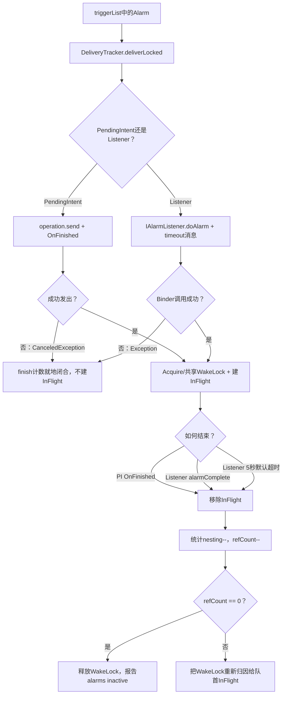
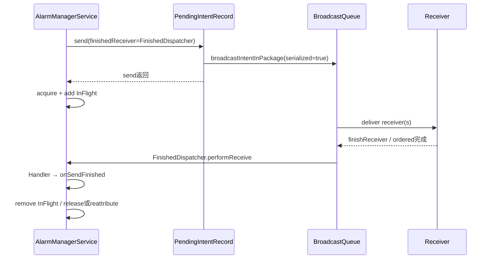

# 150 Android AlarmManager：投递、InFlight、WakeLock 与完成协议

> 源码版本：Android 11 / API 30 / `android-11.0.0_r48`  
> 学习方式：macOS 只读源码，不要求编译、不要求连接设备  
> 前置章节：第 145～149 章

---

## 1. 本章从哪里继续

前几章已经讲到：

```text
Alarm set
→ 时间换算与Batch
→ Doze / App Standby / 后台限制
→ kernel到期
→ triggerList
```

本章从 `triggerList` 继续，追到：

```text
PendingIntent或Listener真正发出
→ InFlight建立
→ 共享WakeLock保持CPU运行
→ 完成回调或超时
→ 统计与引用归零
→ WakeLock释放
```

最核心的问题不是“怎么调用回调”，而是所有成功、取消、异常、超时和迟到路径能否只建立一次账、只销一次账。

---

## 2. 本章核心结论

> AlarmManagerService 只为已经成功发出并建立 InFlight 的投递持有一个共享 PARTIAL_WAKE_LOCK。PendingIntent 依靠 `OnFinished`，Listener 依靠 `IAlarmCompleteListener` 或 5 秒默认超时销账；每完成一个 InFlight 就减少共享引用，引用归零才释放 WakeLock。

这里的“完成”含义依目标类型而不同：

- broadcast PendingIntent：通常等广播完成；
- activity/service PendingIntent：通常只等启动请求交接完成；
- listener：等 App callback 主动报告完成，或系统超时。

因此不能把 Alarm WakeLock 理解为“保护 App 后续全部业务一直执行完”。

---

## 3. 源码地图

```text
frameworks/base/services/core/java/com/android/server/AlarmManagerService.java
frameworks/base/services/core/java/com/android/server/AlarmManagerInternal.java
frameworks/base/core/java/android/app/AlarmManager.java
frameworks/base/core/java/android/app/PendingIntent.java
frameworks/base/services/core/java/com/android/server/am/PendingIntentRecord.java
frameworks/base/services/core/java/com/android/server/am/BroadcastDispatcher.java
frameworks/base/apex/jobscheduler/service/java/com/android/server/DeviceIdleController.java
frameworks/base/services/tests/mockingservicestests/src/com/android/server/AlarmManagerServiceTest.java
```

---

## 4. 先区分三类“计数”

| 计数 | 代表什么 | 生命周期 |
|---|---|---|
| `mAlarmsPerUid` | 尚在 Alarm 调度/暂存结构中的登记数 | set 到到期取出或取消 |
| `mBroadcastRefCount` | 已成功发出、尚未完成的投递数 | InFlight 建立到完成/超时 |
| `BroadcastStats/FilterStats.nesting` | 同包/同tag并发执行层数 | 第一个开始到最后一个结束 |

Alarm 从等待态进入执行态时，第一种计数减少，第二、三种计数增加。它们不是同一张账。

---

## 5. 外层 `deliverAlarmsLocked()`

简化源码：

```java
void deliverAlarmsLocked(ArrayList<Alarm> triggerList, long nowELAPSED) {
    mLastAlarmDeliveryTime = nowELAPSED;
    for (Alarm alarm : triggerList) {
        try {
            ActivityManager.noteAlarmStart(...);
            mDeliveryTracker.deliverLocked(alarm, nowELAPSED, allowWhileIdle);
        } catch (RuntimeException e) {
            Slog.w(TAG, "Failure sending alarm.", e);
        }
        decrementAlarmCount(alarm.uid, 1);
    }
}
```

无论投递成功、token 已取消还是内部抛 RuntimeException，已经从等待结构取出的这一代 Alarm 最后都会递减 `mAlarmsPerUid`。

Repeating Alarm 的下一代已经在触发阶段提前重新 set，因此它有自己的登记计数。

---

## 6. 两条投递协议总图



---

## 7. `DeliveryTracker` 同时扮演两个角色

```java
class DeliveryTracker extends IAlarmCompleteListener.Stub
        implements PendingIntent.OnFinished
```

它既是：

- Listener 回调收到的跨 Binder 完成接口；
- PendingIntent.send 使用的 `OnFinished` 回调。

两条入口最终都调用 `updateTrackingLocked()`，共享同一份 InFlight、WakeLock 和统计销账逻辑。

---

## 8. 什么情况下才建立 InFlight

顺序非常重要：

```text
先尝试 operation.send 或 listener.doAlarm
如果同步失败 → 直接返回，不建InFlight，不拿WakeLock
如果调用成功返回 → 获取/共享WakeLock，创建InFlight，refCount++
```

这避免为根本没有发出去的 Alarm 持有 WakeLock。

但也意味着“send 已经开始”和“InFlight 记账完成”之间需要防止完成回调抢先销账，后文会说明 Handler、oneway 和共同的 `mLock` 如何解决。

---

## 9. PendingIntent 投递传入了什么

```java
alarm.operation.send(
        getContext(),
        0,
        mBackgroundIntent.putExtra(
                Intent.EXTRA_ALARM_COUNT, alarm.count),
        mDeliveryTracker,
        mHandler,
        null,
        allowWhileIdle ? mIdleOptions : null);
```

参数中值得注意：

- fill-in Intent 带 `FLAG_FROM_BACKGROUND`；
- `EXTRA_ALARM_COUNT` 告诉 repeating Alarm 漏过了几次；
- 完成回调是 `mDeliveryTracker`；
- 完成回调投递到 AlarmManagerService 的 Handler；
- 普通 AWI 可携带临时白名单 BroadcastOptions。

---

## 10. `EXTRA_ALARM_COUNT` 不等于本次队列长度

它来自单个 `Alarm.count`：

```text
一次性 Alarm → 通常为1
重复 Alarm 晚了多个interval → 1 + 漏过的完整周期数
```

它不是当前 `triggerList.size()`，也不是 App 历史累计触发次数。

App 可以据此知道这次交付代表了多少个合并的 repeating tick，但应避免一次补做无限量非幂等工作。

---

## 11. PendingIntent `OnFinished` 如何跨 Binder

`PendingIntent.sendAndReturnResult()` 把 `OnFinished` 包成：

```java
FinishedDispatcher extends IIntentReceiver.Stub
```

`performReceive()` 收到完成后：

```java
if (mHandler == null) run();
else mHandler.post(this);
```

AlarmManagerService 明确传入 `mHandler`，所以完成处理会排进 Handler，而不会在 PendingIntent Binder 发送尚未返回时同步执行 `onSendFinished()`。

这保证正常路径先建 InFlight，再处理完成消息。

---

## 12. 不同 PendingIntent 类型的“完成”不同

`PendingIntentRecord.sendInner()` 对不同 type 处理：

### Broadcast

传了 finishedReceiver 时，广播按 serialized/ordered 完成协议运行；若广播成功入队，最终 Receiver 链结束时回调。

### Activity / Service / ActivityResult

启动请求发出后，`sendInner()` 通常直接调用 `finishedReceiver.performReceive()`。

所以 Alarm WakeLock 对 activity/service 主要保护“启动请求已交接”，并不等待 Activity 销毁或 Service 完成全部业务。

---

## 13. Broadcast PendingIntent 的完成链



这里的 `AMSvc` 最后两步都在 system_server，但通过 Binder/Handler 协议明确分开。

---

## 14. PendingIntent 已取消时的同步失败

若 `sendAndReturnResult()` 返回负值，`PendingIntent.send()` 抛 `CanceledException`。

DeliveryTracker 处理：

```java
mSendCount++;
try {
    operation.send(...);
} catch (CanceledException e) {
    if (repeatInterval > 0) removeImpl(operation, null);
    mSendFinishCount++;
    return;
}
```

它不建立 InFlight，也不获取 WakeLock。

Repeating Alarm 的下一代已提前登记，因此还要按 token 删除下一代。

---

## 15. PendingIntent 发送计数如何理解

```text
mSendCount       = 尝试operation.send的次数
mSendFinishCount = 收到OnFinished或同步CanceledException的次数
```

在无 bug、无重复/丢失 callback 时，两者差值应接近当前未完成 PendingIntent InFlight 数。

它们是自 system_server 本次运行以来的单调诊断计数，不是当前队列大小。

---

## 16. Listener 投递第一步

```java
mListenerCount++;
alarm.listener.doAlarm(this);
mHandler.sendMessageDelayed(
        obtainMessage(LISTENER_TIMEOUT, listenerBinder),
        mConstants.LISTENER_TIMEOUT);
```

`this` 是 DeliveryTracker 的 `IAlarmCompleteListener` Binder。App listener 完成后必须把自己的 wrapper token 回传给它。

`IAlarmListener.aidl` 本身声明为 `oneway interface`，所以 `doAlarm()` 成功返回只表示异步 Binder 事务已成功提交，不表示 App 已执行 `onAlarm()`。这正是后续必须依赖 completion/timeout 的原因。

---

## 17. 客户端 ListenerWrapper 做什么

```java
public void doAlarm(IAlarmCompleteListener alarmManager) {
    mCompletion = alarmManager;
    mHandler.post(this);
}

public void run() {
    try {
        mListener.onAlarm();
    } finally {
        mCompletion.alarmComplete(this);
    }
}
```

即使 `onAlarm()` 抛 RuntimeException，`finally` 仍尝试报告完成，然后异常可以继续导致 App 崩溃。

系统等的是 wrapper 报告，不是直接观察 Java 方法栈。

---

## 18. Listener timeout 从何时开始

timeout 消息在 `listener.doAlarm()` Binder 调用成功返回后安排，然后 system_server 建立 InFlight。

默认：

```java
DEFAULT_LISTENER_TIMEOUT = 5 * 1000;
```

可由 `Settings.Global.ALARM_MANAGER_CONSTANTS` 的 `listener_timeout` 修改。

由于 `doAlarm()` 是 oneway，计时从异步事务成功提交后开始，覆盖 App Binder 事务等待/处理、目标 Handler 排队和 `onAlarm()` 执行时间；若 App 主线程堵塞，可能在回调真正开始前就超时。

---

## 19. Listener 调用同步失败

若 `doAlarm()` 抛异常：

```text
mListenerCount++
→ mListenerFinishCount++
→ return
```

因为异常发生在 timeout 消息和 InFlight 建立之前，所以无需移 timeout、无需释放 WakeLock。

Listener Alarm 在 Android 11 只能 one-shot，也没有 repeating 下一代需要取消。

---

## 20. 成功后的统一 InFlight 建立顺序

```java
if (mBroadcastRefCount == 0) {
    setWakelockWorkSource(...);
    mWakeLock.acquire();
    post REPORT_ALARMS_ACTIVE(true);
}
InFlight inflight = new InFlight(...);
mInFlight.add(inflight);
mBroadcastRefCount++;
```

第一项成功投递获取 WakeLock；后续并发投递共享它，只增加引用和列表项。

变量名叫 `mBroadcastRefCount`，但实际同时计 PendingIntent activity/service/broadcast 和 direct listener，不能按字面只理解为广播。

---

## 21. Alarm WakeLock 是什么

```java
pm.newWakeLock(PowerManager.PARTIAL_WAKE_LOCK, "*alarm*");
```

PARTIAL_WAKE_LOCK 保持 CPU 可运行，不要求屏幕点亮。

服务只在内部引用从 0 变 1 时调用一次 `acquire()`，从 1 变 0 时调用一次 `release()`；并发数量由自己的 `mBroadcastRefCount` 管，而不是每个 Alarm 都 acquire/release 一次。

---

## 22. 为什么先 send 再 acquire 仍能工作

看起来先 `operation.send()` 再 acquire 有竞态，但正常 PendingIntent 回调被 `FinishedDispatcher` post 到 Alarm Handler；Listener 的 `doAlarm()` 是 oneway，App wrapper 又先 post 到目标 Handler。

更关键的是 `deliverLocked()` 全程持有 `mLock`：即使 App 极快地同步反向调用 `alarmComplete()`，服务端完成入口也必须等到建完 InFlight、退出临界区后才能取得同一把锁销账。

更准确地说，这是异步协议、Handler 排队与锁共同保证，不是“目标代码绝不可能开始运行”。目标进程可能已被调度，但完成销账不会正常地同步抢在 InFlight 之前。

---

## 23. InFlight 保存哪些快照

```java
final PendingIntent mPendingIntent;
final long mWhenElapsed;
final IBinder mListener;
final WorkSource mWorkSource;
final int mUid;
final int mCreatorUid;
final String mTag;
final BroadcastStats mBroadcastStats;
final FilterStats mFilterStats;
final int mAlarmType;
```

`mWhenElapsed` 在构造时写入 `nowELAPSED`，表示投递开始时刻，不是最初请求的 deadline。

InFlight 保存完成阶段所需的最小身份、归因和统计引用，不再依赖原 Alarm 仍留在等待队列。

---

## 24. PendingIntent 与 Listener 的统计账户

PendingIntent：

```java
getStatsLocked(operation)
→ operation.getCreatorUid / getCreatorPackage
```

Listener：

```java
getStatsLocked(alarm.uid, alarm.packageName)
```

因此代理登记 PendingIntent 时，登记数按 calling UID，投递统计按 PendingIntent creator；Listener 两者一致。

---

## 25. statsTag 怎样区分 Alarm

`Alarm.makeTag()`：

```text
wakeup PendingIntent → *walarm*: + PendingIntent tag
non-wakeup PI        → *alarm*:  + PendingIntent tag
Listener             → 相同前缀 + listenerTag
```

`BroadcastStats` 先按 UID/package 聚合，内部 `filterStats` 再按 tag 区分。

这也是 `dumpsys alarm` 中 Top Alarms 和统计条目的主要来源。

---

## 26. nesting 统计的含义

开始时：

```java
count++;
if (nesting == 0) {
    nesting = 1;
    startTime = now;
} else {
    nesting++;
}
```

完成时 `nesting--`；只有降到 0 才增加：

```text
aggregateTime += now - startTime
```

所以同一账户多个投递重叠时，aggregateTime 记录近似“至少一个投递在飞”的并集时长，而不是把各次并发时长简单相加。

---

## 27. wakeup 统计何时增加

只有已经成功发出并走到 InFlight 建立后的：

```java
RTC_WAKEUP 或 ELAPSED_REALTIME_WAKEUP
```

才执行：

```text
BroadcastStats.numWakeup++
FilterStats.numWakeup++
ActivityManager.noteWakeupAlarm(...)
```

token 已取消或 listener 同步不可达，不会计为成功 wakeup 投递。

---

## 28. App Standby history 也在这里记

成功建立 InFlight 后，非豁免 Alarm 才调用：

```java
mAppWakeupHistory.recordAlarmForPackage(
        sourcePackage, creatorUser, nowELAPSED);
```

所以第 147 章的配额历史是“成功发出并进入 InFlight”的交付点，不是 kernel 到期次数，也不是 App callback 最终正常完成次数。

即使 Listener 随后超时，这次历史已经记入。

---

## 29. AllowWhileIdle 节流也在成功后更新

成功建立 InFlight 后才写：

```text
mLastAllowWhileIdleDispatch[creatorUid]
mUseAllowWhileIdleShortTime[creatorUid]
```

如果 token 已取消或 listener 调用同步失败，不消耗这次 AWI 成功交付间隔。

前台与后台状态决定下一次采用短间隔还是长间隔。

---

## 30. ThreadLocalWorkSource 的作用

投递调用外围：

```java
long token = ThreadLocalWorkSource.setUid(
        getAlarmAttributionUid(alarm));
try {
    ... send/doAlarm ...
} finally {
    ThreadLocalWorkSource.restore(token);
}
```

归因 UID：

```text
有非空WorkSource → WorkSource attribution UID
否则            → creatorUid
```

它给当前 system_server 调用链提供线程局部归因，和下面实际 WakeLock 上设置 WorkSource 是两层机制。

---

## 31. WakeLock WorkSource 的选择

```java
if (ws != null) {
    mWakeLock.setWorkSource(ws);
} else if (knownUid >= 0) {
    mWakeLock.setWorkSource(new WorkSource(knownUid));
} else {
    mWakeLock.setWorkSource(null);
}
```

第一项 InFlight 使用 Alarm 显式 WorkSource，否则 creator UID。

设置失败时 catch 后归因回 OS，宁可丢失精细 blame，也不让投递因归因异常失败。

---

## 32. historyTag 为什么只有第一次保留

```java
mWakeLock.setHistoryTag(first ? tag : null);
```

从 0→1 首次 acquire 时保留第一个 Alarm tag；后续队首重归因传 `first=false`，history tag 被清为 null。

因此共享 WakeLock 的历史标签不能完整表达其间每一个并发 Alarm，精细诊断仍要看 InFlight 和 FilterStats。

---

## 33. PendingIntent 完成怎样查 InFlight

```java
if (inflight.mPendingIntent == pi) {
    ...
    return mInFlight.remove(i);
}
```

这里用 Java 引用 `==`，不是 `PendingIntent.equals()`。

这是可行的，因为 `FinishedDispatcher` 保存并回传的正是本次 `operation.send()` 使用的同一个 PendingIntent Java 对象。

它与第 149 章等待 Alarm 的 token equals 匹配是不同层次。

---

## 34. Listener 完成怎样查 InFlight

```java
if (mInFlight.get(i).mListener == listener) {
    return mInFlight.remove(i);
}
```

`alarmComplete(IBinder who)` 传回 ListenerWrapper 自己的 Binder。服务用 Binder 对象引用寻找第一个匹配项。

正常设计中同一个 listener 等待项会被 replacement，因而通常只有一个；重叠 InFlight 属于稍后讨论的微妙边界。

---

## 35. PendingIntent 完成路径

```java
public void onSendFinished(...) {
    synchronized (mLock) {
        mSendFinishCount++;
        updateTrackingLocked(removeLocked(pi, intent));
    }
}
```

它不检查 resultCode 决定是否销账。只要 PendingIntent 完成协议回调到达，本次 AlarmManager 交付就结束。

目标业务成功、失败或返回什么 ordered broadcast result，是更高层语义。

---

## 36. Listener 正常完成路径

```java
alarmComplete(who):
    clearCallingIdentity
    lock
    removeMessages(LISTENER_TIMEOUT, who)
    remove InFlight(who)
    if found:
        updateTrackingLocked
        mListenerFinishCount++
    else:
        treat as late completion
```

它先移除 timeout，再找 InFlight，防止已正常完成后 timeout 又二次销账。

Binder identity 在 finally 中恢复，避免用 App 调用身份执行 system_server 内部清理。

---

## 37. Listener timeout 路径

Handler 收到 `LISTENER_TIMEOUT`：

```java
InFlight inflight = removeLocked(who);
if (inflight != null) {
    updateTrackingLocked(inflight);
    mListenerFinishCount++;
}
```

Android 11 r48 留有：

```java
// TODO: implement ANR policy for the target
```

所以此 timeout 负责释放 AlarmManager 的 WakeLock/统计，不会在这里直接把目标 App 判为 ANR。

---

## 38. 超时后迟到的完成回调

timeout 已移除 InFlight 并销账。稍后 App 调 `alarmComplete(who)`：

- `removeLocked(who)` 找不到；
- 记录为 late callback（debug 时）；
- 不再调用 `updateTrackingLocked()`；
- 不再增加 finish count。

这使“一次成功 listener send”最终只完成一次账。

---

## 39. 超时不停止 App 的 listener 代码

系统 timeout 只表示：

> AlarmManager 不再为它持有 InFlight/WakeLock。

若 App Handler 后来恢复，`onAlarm()` 仍可能开始或继续执行；最终回调只会被当成 late。

因此长任务不能依赖 AlarmManager 的 5 秒 WakeLock。App 应把工作交给合适的持久执行机制，并遵守后台执行限制。

---

## 40. 统一 `updateTrackingLocked()` 做什么

```text
若找到InFlight：
  更新BroadcastStats / FilterStats
  可选noteAlarmFinish

无论是否找到：
  mBroadcastRefCount--

若变0：
  报告alarms inactive
  release WakeLock
  防御性检查/清空残留InFlight
否则：
  用mInFlight[0]重新归因WakeLock
```

“无论是否找到都减 ref”是 r48 一个重要的防御假设：正常协议绝不应出现 unmatched PendingIntent callback。

---

## 41. 引用计数手算

假设连续成功发出 A、B、C：

```text
开始 A：0→1，acquire，InFlight[A]
开始 B：1→2，InFlight[A,B]
开始 C：2→3，InFlight[A,B,C]
完成 B：3→2，InFlight[A,C]，归因给A
完成 A：2→1，InFlight[C]，归因给C
完成 C：1→0，InFlight[]，release
```

完成顺序不必和发出顺序一致；只要每个完成恰好匹配一次，WakeLock 生命周期仍闭合。

---

## 42. 为什么完成后归因给 `mInFlight[0]`

共享 WakeLock 只能挂一份当前 WorkSource/历史归因，无法同时表达全部并发项。

服务选择列表第一个剩余 InFlight 作为代表。它不意味着其他 InFlight 不再受 WakeLock 保护，只是电量 blame 暂时指向队首代表。

因此并发 Alarm 的瞬时 WakeLock 归因是近似策略，不等于逐纳秒公平分摊。

---

## 43. 引用归零但列表非空的防御

```java
if (mBroadcastRefCount == 0) {
    mWakeLock.release();
    if (mInFlight.size() > 0) {
        log remaining;
        mInFlight.clear();
    }
}
```

正常不变量应是：

```text
mBroadcastRefCount == mInFlight.size()
```

若 ref 已归零却列表还有项，说明协议/计数失配。r48 选择记录问题、释放锁并清空残留，防止永久 WakeLock 泄漏。

---

## 44. ref 非零但列表为空的防御

若完成后 ref 仍大于 0，却没有 InFlight：

```java
mLog.w("Alarm wakelock still held but sent queue empty");
mWakeLock.setWorkSource(null);
```

它不会强行把 ref 改 0 或释放锁，因为代码相信还会有对应完成；这里只把错误归因清回 OS。

若协议已经损坏，这条路径存在 WakeLock 延迟释放风险。

---

## 45. unmatched PendingIntent callback 的危险边界

`onSendFinished()` 即使 `removeLocked(pi)` 返回 null，仍调用 `updateTrackingLocked(null)`，而后者照样 `mBroadcastRefCount--`。

所以重复、伪造或对象引用不匹配的 PendingIntent 完成 callback 会破坏引用计数。

正常情况下 finishedReceiver 是 system_server 自己构造并由 PendingIntent 协议回调，外部 App 不能任意取得该对象；代码依赖这个受控协议，而不是做强防御校验。

---

## 46. Listener unmatched callback 更安全

`alarmComplete()` 与 `alarmTimedOut()` 都只在找到 InFlight 时调用 `updateTrackingLocked()`。

因此：

- late listener completion 不减 ref；
- spurious listener timeout 不减 ref；
- null `who` 直接拒绝。

这比 PendingIntent `onSendFinished()` 的 null-match 路径更防御。

---

## 47. 同 listener 重叠 InFlight 的 r48 边界

等待队列中同 listener 会 replacement，但旧一次已经 InFlight 后，App 可以再次 set 同 listener，形成时间上重叠的两个 InFlight。

二者共享同一个 Binder token。`alarmComplete(who)` 会：

```java
mHandler.removeMessages(LISTENER_TIMEOUT, who);
```

这会移除该 token 的所有 timeout 消息，而不是只移除本次代际；随后只删除第一个匹配 InFlight。

若另一项仍在飞，它可能失去 timeout 保护。这说明同一个 listener 对象不适合并行复用为多个尚未完成的 Alarm 代际。

---

## 48. ListenerWrapper 自身也有共享可变字段

客户端 wrapper 保存单个：

```java
Handler mHandler;
IAlarmCompleteListener mCompletion;
```

同 listener 再 set 可修改 Handler；第二次 `doAlarm()` 也会覆盖 `mCompletion`。r48 的 completion 服务对象通常仍是同一个 DeliveryTracker，但 Handler/并行 Runnable 的语义仍会变得模糊。

最佳实践是一个 listener 实例在前一次完成前不要并行承载下一代。

---

## 49. `noteAlarmStart/Finish` 的另一张账

外层投递前：

```java
ActivityManager.noteAlarmStart(...)
```

成功 InFlight 完成时：

```java
ActivityManager.noteAlarmFinish(...)
```

它最终进入 BatteryStats 的 Alarm 计时，不等同于本类 `BroadcastStats.aggregateTime`。

一张用于系统耗电/历史记账，一张用于 AlarmManager 自身 dump 统计。

---

## 50. 同步投递失败可能漏 `noteAlarmFinish`

r48 外层在调用 DeliveryTracker 前已经 `noteAlarmStart()`。

如果：

- PendingIntent 立即抛 `CanceledException`；或
- listener.doAlarm 同步抛异常；

DeliveryTracker 不建 InFlight，因而以后也不会通过 `updateStatsLocked()` 调 `noteAlarmFinish()`。

这形成 start/finish 不对称的实现缺口。继续追 `BatteryStatsImpl.noteAlarmStartOrFinishLocked()` 可见，它在 `mRecordAllHistory` 开启时更新 `mActiveEvents` 并写 Alarm start/finish history；缺少 finish 可能留下该 tag/UID 的 active history 状态，直到其他同身份事件改变或统计重置。它不是这里另有一只 Alarm 时长 Timer，所以不要泛化成“必然多记一段耗电时长”。不能因本类 send/finish 计数闭合，就断言所有外部历史也闭合。

---

## 51. 更晚的 RuntimeException 风险

`deliverAlarmsLocked()` 会 catch DeliveryTracker 抛出的 RuntimeException，并继续递减登记数。

如果异常发生在目标请求已经成功发出、但 InFlight 尚未完整建立的窄窗口，完成 callback 以后可能找不到对应 InFlight，而 PendingIntent 路径还会错误递减共享 ref。

正常依赖这些内部操作不抛异常；这是一条故障注入/健壮性边界，不应误说成日常必现问题。

---

## 52. Broadcast alarm in-flight 通知

只有：

```java
inflight.isBroadcast()
```

才通知 `AlarmManagerInternal.InFlightListener`：

```text
broadcastAlarmPending(uid)
broadcastAlarmComplete(uid)
```

Activity、Service PendingIntent 和 direct listener 不触发这组通知，即使它们也增加 `mBroadcastRefCount`。

---

## 53. BroadcastDispatcher 为什么关心它

BroadcastDispatcher 维护：

```text
mAlarmUids[uid] = 当前广播Alarm in-flight数
```

某 UID 成为 Alarm 广播目标后，被慢 Receiver 退避的后续广播会临时迁入 `mAlarmBroadcasts` 快速队列；全部 Alarm 广播完成后再回普通 deferral。

这就是第 115 章“Alarm 优先”信号的来源。

---

## 54. “recipientUid” 与实际传值的边界

接口参数名是 `recipientUid`，但 AlarmManager 实际传：

```java
inflight.mUid == alarm.uid
```

即登记 calling UID，不一定是 PendingIntent creator/真正 Receiver UID。

普通 App 为自己创建 PI 并 set 时二者相同；代理登记场景可能不同，BroadcastDispatcher 的 fast-track 归属会按登记者而不是 PI creator。这是 r48 身份命名与实现的边界。

---

## 55. alarms active 反馈给 DeviceIdleController

共享 ref 0→1 时 post：

```text
REPORT_ALARMS_ACTIVE(true)
```

1→0 时 post false。Handler 再调用：

```java
mLocalDeviceIdleController.setAlarmsActive(active)
```

DeviceIdleController 在 false 时尝试提前结束 maintenance window，但还要同时满足 jobs、active idle ops 等均不活跃。

---

## 56. active 消息为什么走 Handler

DeliveryTracker 在 `mLock` 内更新 InFlight；DeviceIdleController 有自己的内部锁和状态机。

通过 Handler 报告边沿，可以避免持 Alarm 锁直接跨服务进入另一把锁。

代价是 true/false 是异步消息。若短时间快速从 0→1→0，两个消息都会排队，接收端可能短暂观察中间状态，但最终按队列顺序收敛。

---

## 57. 完成回调与 Alarm cancel 的边界

第 149 章的 `cancel()` 清等待容器，不清 `mInFlight`。

因此已经发送的 Alarm：

- PI 仍等 OnFinished；
- listener 仍等 alarmComplete/timeout；
- WakeLock 仍按完成协议释放；
- cancel 不会提前伪造 finish。

这避免因取消下一次 repeating Alarm而误释放当前正在执行的投递锁。

---

## 58. PendingIntent 回调为什么没有 Alarm timeout

AlarmManagerService 只为 direct listener 设置显式 5 秒 timeout。

PendingIntent broadcast 的生命周期由 BroadcastQueue 自己的 Receiver timeout/ANR 机制管理；activity/service 的 OnFinished 又在请求交接后很快返回。

所以不能在本类中寻找一个统一的“所有 PendingIntent Alarm 5 秒超时”。

---

## 59. Broadcast 超时与 Alarm WakeLock 的关系

若广播 Receiver 卡住：

```text
BroadcastQueue持有该有序广播流程
→ 自己的10/60秒等timeout政策处理Receiver
→ 广播最终finish/skip
→ PendingIntent finishedReceiver回AlarmManager
→ AlarmManager释放共享WakeLock引用
```

AlarmManager 不负责判断哪个 Receiver ANR，但其 InFlight/WakeLock 会等广播完成协议收口。

---

## 60. Service PendingIntent 不等 Service 工作完成

`PendingIntentRecord` 调用 `startServiceInPackage()` 后，通常直接触发 finishedReceiver。

因此：

```text
Alarm WakeLock release
≠ Service.onStartCommand返回
≠ Service异步业务完成
```

Service 之后能否运行、是否需要 foreground service、自有 WakeLock 或 JobScheduler，属于组件执行政策。

---

## 61. Listener timeout 不是 ANR

r48 代码明确留 TODO，没有从 `alarmTimedOut()` 调 AppErrors/ANR。

所以 dumpsys 中 listener send-finish 差值或 timeout 日志是 Alarm 交付诊断；不能单凭它声称 Framework 已生成 ANR traces 或弹出 ANR 对话框。

App 进程可能因自己 `onAlarm()` 抛异常崩溃，那是另一条 crash 处置链。

---

## 62. `mInFlight` 列表的顺序

成功发出后按到达 DeliveryTracker 的顺序 append。

完成 PendingIntent 时按同一 Java PI 对象找第一个；Listener 按 Binder token找第一个。不同目标可乱序完成，列表会从中间移除。

列表第 0 项只是当前剩余项中的最早插入代表，不是按 deadline 重新排序的调度队列。

---

## 63. 同 PendingIntent 多个 InFlight

等待队列同 token 会 replacement，但 repeating 或在前一次尚未完成时再次 set/触发，仍可能让同一个 PI Java 对象出现多个 InFlight。

完成回调只携带 PI，不携带 Alarm generation ID，所以服务删除第一个匹配项。只要每次 callback 数量正确：

- 总 ref 仍闭合；
- 相同 PI 的 creator/包统计账户通常相同；
- 单项 `mWhenElapsed` 与完成的精确配对可能不是真实代际。

这是用粗身份换取简单协议的边界。

---

## 64. Broadcast pending/complete 的同 PI 并发

对每次成功 broadcast InFlight 都 pending `+1`；每次 PI callback remove 一个匹配项并 complete `-1`。

BroadcastDispatcher 自己也用 UID 计数，因此不要求每个代际有独立 token；只要求 pending 与 complete 次数平衡。

若 unmatched PI callback 导致 Alarm ref 错减，却没找到 InFlight，`notifyBroadcastAlarmCompleteLocked()` 不会调用，两个子系统计数会产生分歧。

---

## 65. `dumpsys alarm` 该看什么

核心输出：

```text
Broadcast ref count
PendingIntent send count
PendingIntent finish count
Listener send count
Listener finish count
Outstanding deliveries / InFlight
Top Alarms
BroadcastStats / FilterStats
```

诊断原则：

```text
refCount 应等于 InFlight.size
send - finish 应与对应未完成项大致匹配
listener长期差值通常指向未完成或timeout消息尚未处理
PI长期差值先看BroadcastQueue是否卡住
```

“大致”是因为读 dump 的瞬间以及 Handler 消息排队会有短暂过渡。

---

## 66. InFlight dump 的 `when` 是什么

`InFlight.toString()` 输出：

```text
when=mWhenElapsed
```

它是 `new InFlight(..., nowELAPSED)` 时的实际投递开始 elapsed 时间。

若要看原始 expected/actual deadline，要在等待 Alarm dump 或历史链中找；不要把 InFlight `when` 当成 App 请求时间。

---

## 67. macOS 只读练习一：画两条完成链

```bash
cd /Users/ninebot/androidSource
sed -n '4550,4835p' \
  frameworks/base/services/core/java/com/android/server/AlarmManagerService.java
```

分别画：

```text
PI send → InFlight → onSendFinished
Listener doAlarm → InFlight → alarmComplete / timeout
```

在每个箭头旁标出四个诊断 counter 何时 `++`。

---

## 68. macOS 只读练习二：手算共享引用

假设：

```text
t0 A broadcast成功发出
t1 B listener成功发出
t2 C service PI成功发出
t3 C立即finish
t4 B timeout
t5 A broadcast finish
```

手算：

| 时刻 | ref | InFlight | WakeLock |
|---|---:|---|---|
| t0 | 1 | A | acquire |
| t1 | 2 | A,B | held |
| t2 | 3 | A,B,C | held |
| t3 | 2 | A,B | reattribute A |
| t4 | 1 | A | reattribute A |
| t5 | 0 | 空 | release |

再解释为什么 B 后来的 late completion 不再减 ref。

---

## 69. macOS 只读练习三：追 PendingIntent 完成语义

```bash
sed -n '385,485p' \
  frameworks/base/services/core/java/com/android/server/am/PendingIntentRecord.java
sed -n '200,260p' \
  frameworks/base/core/java/android/app/PendingIntent.java
```

回答：

- broadcast 成功入队时为何不立即 performReceive？
- activity/service 为什么通常立即完成 Alarm handoff？
- FinishedDispatcher 为什么要 post 到传入 Handler？

---

## 70. macOS 只读练习四：验证归因

```bash
sed -n '1290,1385p' \
  frameworks/base/services/core/java/com/android/server/AlarmManagerService.java
sed -n '4128,4160p' \
  frameworks/base/services/core/java/com/android/server/AlarmManagerService.java
```

构造代理场景 A 登记 B 的 PendingIntent，填写：

```text
mAlarmsPerUid → A
InFlight.mUid → A
InFlight.mCreatorUid → B
BroadcastStats → B
默认WakeLock WorkSource → B
BroadcastDispatcher alarm UID信号 → A（r48）
```

如果显式 WorkSource 存在，再改写 ThreadLocal 与 WakeLock 的归因结果。

---

## 71. macOS 只读练习五：找健壮性边界

```bash
rg -n "updateTrackingLocked|removeLocked\(PendingIntent|removeLocked\(IBinder|noteAlarmStart|noteAlarmFinish" \
  frameworks/base/services/core/java/com/android/server/AlarmManagerService.java
```

检查：

1. PI remove 返回 null 后是否仍减 ref？
2. listener remove 返回 null 后是否减 ref？
3. CanceledException 前是否已 noteAlarmStart？
4. 没建 InFlight 时谁调用 noteAlarmFinish？

这些问题能训练“从正常链反查异常账本”的能力。

---

## 72. 初学者常见误解

### 72.1 “Alarm 到期后系统会替 App 一直持锁到业务做完”

错。锁只持到对应 PendingIntent/Listener 完成协议收口；Service/Activity 的 handoff 很快完成。

### 72.2 “mBroadcastRefCount 只统计广播”

错。它统计所有成功 InFlight。

### 72.3 “Listener 5 秒超时会产生 ANR”

错。r48 这里只释放追踪，ANR policy 仍是 TODO。

### 72.4 “cancel 当前 Alarm 会立刻释放执行中的 WakeLock”

错。cancel 管等待项，InFlight 按完成协议独立收尾。

### 72.5 “wakeup Alarm 的 WakeLock 会点亮屏幕”

错。这里是 PARTIAL_WAKE_LOCK，只保证 CPU 运行。

### 72.6 “sendFinishCount 相等就证明所有统计都闭合”

错。同步失败路径仍可能漏 BatteryStats `noteAlarmFinish`。

---

## 73. 复读后的重点修订

第一遍很容易把 PendingIntent OnFinished 一律写成“目标组件工作完成”。对照 `PendingIntentRecord` 后应改为：

- broadcast 等广播完成链；
- activity/service/result 通常在启动请求交接后回调；
- Alarm WakeLock 不覆盖组件后续全部生命周期。

第二遍从异常路径反推，补出：

- PI unmatched callback 仍会减 ref，而 listener unmatched 不会；
- 同 listener 重叠 InFlight 时 `removeMessages(timeout, who)` 会移除全部同 token timeout；
- outer `noteAlarmStart` 早于 send，同步发送失败不走 InFlight finish，BatteryStats 可能失配；
- broadcast in-flight 接口名叫 recipientUid，r48 实传登记 `alarm.uid`；
- 同 PI 并发完成只按对象找第一个，不携带 generation ID。

---

## 74. 本章检查清单

读完应能回答：

- `mAlarmsPerUid` 与 `mBroadcastRefCount` 的生命周期有何不同？
- 什么条件下才建立 InFlight？
- 为什么完成 callback 不会正常抢在 InFlight 建立之前？
- broadcast、activity、service PendingIntent 的完成语义有什么不同？
- Listener 默认 timeout 从何时计时、做什么、不做什么？
- late listener callback 为什么不会二次减 ref？
- WakeLock 如何在多个 InFlight 间共享并重新归因？
- `refCount == 0` 但列表非空时如何防御？
- PendingIntent 和 listener 查 InFlight 分别用什么身份？
- App Standby/AWI history 在到期、发出还是完成时记？
- BroadcastDispatcher 为何需要 alarm in-flight UID？
- 哪三类 r48 异常账本边界最值得警惕？

---

## 75. 一页总结

```text
等待态：
  Alarm在Batch/pending容器
  mAlarmsPerUid计数

发出：
  PI → operation.send(OnFinished, AlarmHandler)
  Listener → doAlarm(IAlarmCompleteListener) + 默认5秒timeout
  同步失败 → send/finish就地闭合，不建InFlight/WakeLock

成功InFlight：
  第一个：设置WorkSource → acquire PARTIAL_WAKE_LOCK → active=true
  每一个：add InFlight → ref++ → stats nesting++
  同时记录AWI成功间隔、非豁免App Standby history、wakeup stats

完成：
  PI → onSendFinished
  Listener → alarmComplete或timeout
  remove InFlight → stats nesting-- → ref--
  ref>0：归因给剩余队首
  ref=0：release → active=false

完成语义：
  Broadcast PI：广播链完成
  Activity/Service PI：启动请求交接
  Listener：App报告完成或AlarmManager超时

r48边界：
  PI unmatched finish仍减ref
  同listener重叠可能误删另一代timeout
  同步失败可能漏BatteryStats noteAlarmFinish
  broadcast recipient信号实传登记uid
  同PI并发无generation精确配对
```

---

## 76. 下一章

第 151 章继续研究：

> AlarmManager 的 dumpsys、Proto、统计字段与故障诊断实战。

重点把等待 Batch、四类 pending、InFlight、send/finish 差值、WakeLock、Top Alarms、wakeup history、time-change 和 allow-while-idle 证据组合成可操作的排查路径，并审计文本 dump 与 Proto 的字段差异。
