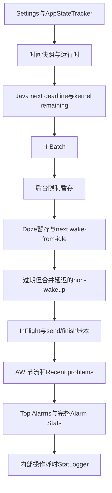
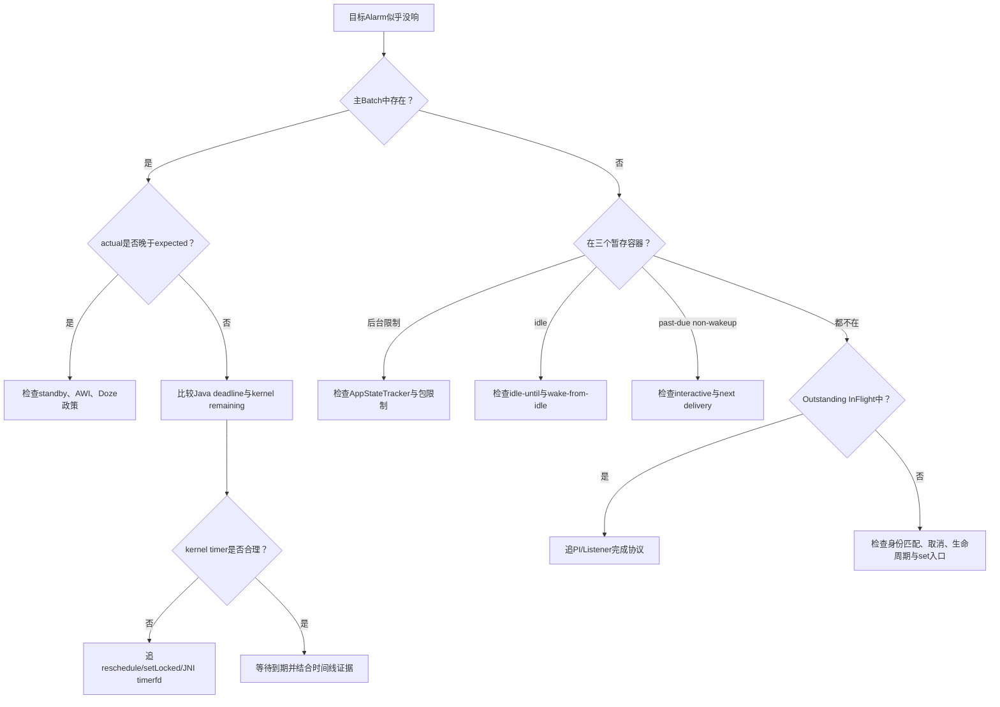

# 151 Android AlarmManager：dumpsys、Proto 与故障诊断

> 源码版本：Android 11 / API 30 / `android-11.0.0_r48`  
> 学习方式：macOS 只读源码，不要求编译、不要求连接设备  
> 前置章节：第 145～150 章

---

## 1. 本章要解决什么问题

前六章已经把 Alarm 从登记、政策推迟、kernel 唤醒一直追到了 InFlight 完成。现在换一个视角：

> 如果只拿到一次 `dumpsys alarm`，怎样判断 Alarm 卡在“等待”“政策暂存”“内核定时”“已经发出但未完成”中的哪一层？

这并不是背输出字段。真正有用的方法是把每个字段重新接回它的写入点、时间基准和更新条件。

本章重点回答：

1. 谁可以 dump，普通文本与 Proto 如何选择；
2. 文本各区域对应哪个内存容器；
3. wall、elapsed、duration 三类数字怎样读；
4. Java 计划时间与 kernel timer 为什么可能不同；
5. 怎样用计数差和 InFlight 判断投递未完成；
6. 哪些字段名在 Android 11 中容易造成误解；
7. 文本和 Proto 各自缺了哪些证据。

---

## 2. 先记住一条总原则

> `dumpsys alarm` 是持有 `AlarmManagerService.mLock` 时拍下的一张内存快照，不是持续更新的时间线，也不是 kernel 状态的完整真相。

一张快照能证明“此刻结构里有什么”，却不能单独证明：

- 它过去为何变成这样；
- 某 Alarm 未来一定会准点执行；
- App 收到回调后业务一定执行完成；
- 某个累计统计完全由最近一次问题造成。

所以诊断必须按“容器证据 + deadline + 投递账本 + 历史线索”组合判断。

---

## 3. 源码地图

```text
frameworks/base/services/core/java/com/android/server/AlarmManagerService.java
frameworks/base/core/java/com/android/internal/util/DumpUtils.java
frameworks/base/core/proto/android/server/alarmmanagerservice.proto
frameworks/base/core/proto/android/app/alarmmanager.proto
frameworks/base/core/java/android/util/TimeUtils.java
frameworks/base/core/java/android/util/LocalLog.java
frameworks/base/services/core/jni/com_android_server_AlarmManagerService.cpp
```

主入口、文本输出和 Proto 输出都在同一个 Java 文件中：

```java
protected void dump(FileDescriptor fd, PrintWriter pw, String[] args) {
    if (!DumpUtils.checkDumpAndUsageStatsPermission(
            getContext(), TAG, pw)) return;

    if (args.length > 0 && "--proto".equals(args[0])) {
        dumpProto(fd);
    } else {
        dumpImpl(pw);
    }
}
```

---

## 4. dump 的权限边界

这里不是只检查 `android.permission.DUMP`，而是调用：

```java
checkDumpPermission(...) && checkUsageStatsPermission(...)
```

普通 UID 需要：

- `android.permission.DUMP`；
- `android.permission.PACKAGE_USAGE_STATS`；
- `OP_GET_USAGE_STATS` AppOp 为 allowed 或 default。

`root`、`system`、`shell`、`incidentd` 在 usage stats 这一层直接放行，但仍先经过 DUMP 检查。设备上的 `adb shell dumpsys alarm` 由 shell 身份执行，因此通常可以看到输出。

这项限制有现实意义：Alarm 的 tag、包名、PendingIntent 和时间模式可能泄露用户行为。

---

## 5. 参数并没有提供包过滤

Android 11 这段入口只识别第一个参数是否为 `--proto`：

```text
dumpsys alarm --proto  → Proto
其他参数               → 完整文本dump，参数被忽略
```

因此不能看到一个参数就想当然地认为服务端会按包过滤。若在设备上执行 `dumpsys alarm com.example`，r48 的 AlarmManagerService 不会据此筛选；使用 `grep` 只是在客户端裁剪文本，还可能丢掉 Batch、UID、上下文和缩进关系。

---

## 6. 快照在哪个线程、持有什么锁

Binder dump 请求进入 system_server 的 Binder 线程，随后 `dumpImpl()` 直接：

```java
void dumpImpl(PrintWriter pw) {
    synchronized (mLock) {
        // 读取并输出全部状态
    }
}
```

`dumpProto()` 也在同一把 `mLock` 下收集全部字段，退出锁后 `proto.flush()`。

这带来两个结论：

1. 同一份输出内部大体一致，不会在打印到一半时由 AlarmThread 改掉核心容器；
2. 状态很多、输出很慢时，dump 本身会延长持锁时间，短暂阻塞 set/remove/trigger 等需要同一把锁的路径。

因此频繁抓取巨大文本并非完全“零扰动”。

---

## 7. dump 开头固定三个时间快照

```java
final long nowELAPSED = mInjector.getElapsedRealtime();
final long nowUPTIME = SystemClock.uptimeMillis();
final long nowRTC = mInjector.getCurrentTimeMillis();
```

三者不能混读：

| 时间 | 是否含深度睡眠 | 是否受手动改时影响 | dump 中用途 |
|---|---:|---:|---|
| wall / RTC | 是 | 是 | 人类日期、AlarmClock、TIME_TICK |
| elapsedRealtime | 是 | 否 | Alarm 调度、Batch、相对时间 |
| uptimeMillis | 否 | 否 | system_server 实际清醒运行时长 |

诊断 Alarm 到期通常优先使用 elapsed；展示给人看的日历时间才使用 wall。

---

## 8. wall 日期只是本次快照的投影

文本把 elapsed deadline 投影成人类日期：

```java
long nextWakeupRTC = mNextWakeup + (nowRTC - nowELAPSED);
```

也就是：

```text
估算wall时刻 = elapsed deadline + 当前(wall - elapsed)
```

如果抓取后系统时间又变化，旧文本中的人类日期不会跟着更新。它只是在 dump 时刻使用当前 offset 做出的解释。

`Recent TIME_TICK history` 也把记录下来的 elapsed 时间用同样方式投影成 wall 历史，而不是保存了每次 tick 当时的 wall 值。

---

## 9. 如何读 `TimeUtils.formatDuration()` 的正负号

两参数形式：

```java
TimeUtils.formatDuration(target, now, pw);
```

本质展示 `target - now`：

- `+5s`：目标在五秒后；
- `-5s`：目标已经过去五秒；
- `0`：值未初始化或刚好相等，需要结合原始数值判断。

而如下写法先显式计算“已经过去多久”：

```java
TimeUtils.formatDuration(nowELAPSED - mLastAlarmDeliveryTime, pw);
```

读输出不能只看符号，还要先看源码传的是“目标减现在”还是“现在减过去”。

---

## 10. 文本输出的整体结构



顺着这个结构读，等价于从“配置与时钟”逐层走到“等待队列”“政策阻塞”“投递执行”“长期统计”。

---

## 11. `Settings` 是实际运行值，不只是默认值

文本 `Settings` 打印当前 `Constants`：

- `min_futurity`；
- `min_interval` / `max_interval`；
- `listener_timeout`；
- AWI short/long/temporary whitelist duration；
- `max_alarms_per_uid`；
- App Standby window、五档 quota；
- restricted quota/window。

这些值可能由 `Settings.Global.ALARM_MANAGER_CONSTANTS` 热更新，因此排查时不能只背源码默认值。

Proto 的 `ConstantsProto` 却只包含前三类间隔、listener timeout 和三个 AWI duration；它遗漏 max alarms、standby window、各 bucket quota 及 restricted 配置。

---

## 12. AppStateTracker 与 App Standby Parole

AppStateTracker 能解释后台限制、电池节省白名单、UID active 等外部政策事实。文本随后还明确打印：

```text
App Standby Parole: true/false
```

Proto 虽然包含 AppStateTracker 子消息，却没有单独写入 `mAppStandbyParole`。因此只保存 Proto 时可能失去“当前是否整体放行 standby”的直接证据。

---

## 13. 时间变化与 TIME_TICK 区域

文本包括：

- `mLastTimeChangeClockTime`：最近一次确认 wall 发生显著变化时的 wall；
- `mLastTimeChangeRealtime`：同一事件的 elapsed；
- `mLastTickReceived/Set/Added/Removed`：以 wall 毫秒记录的 tick 生命周期节点；
- 最近十次 `TIME_TICK` 历史。

注意：`mLastTick...` 被直接包装成 `Date`，它们不是 elapsed。不要和下面的 Batch deadline 放在同一个数轴上相减。

Proto 只保留前两个时间变化字段和次数，遗漏 tick 四节点与十条历史。

---

## 14. Runtime elapsed 与 uptime 的差值

文本通过 SystemServiceManager 打印：

```text
Runtime uptime (elapsed)
Runtime uptime (uptime)
```

两者差值大致反映本轮 runtime 生命周期内深度睡眠累计时间：

```text
深睡近似时长 = elapsed runtime - uptime runtime
```

如果显示 `(Runtime restarted)`，表示当前 framework runtime 不是本次设备 boot 的第一次 system_server 运行。Alarm 内存状态不跨 system_server 重建，统计应从当前 runtime 语境解释。

Proto 没有这些 runtime 字段。

---

## 15. non-interactive 合并延迟区域

文本打印：

```text
Time since non-interactive
Max wakeup delay
Time since last dispatch
Next non-wakeup delivery time
```

当设备非交互且近期刚有投递时，普通 non-wakeup Alarm 可以先放进 `mPendingNonWakeupAlarms`，等下一次唤醒或最长模糊窗口一起交付。

因此“Alarm 预期时间已过”并不必然代表系统故障；如果它出现在 Past-due non-wakeup 区且 next delivery 尚未来到，就是设计内延迟。

---

## 16. `Time since last dispatch` 的名字不够精确

`deliverAlarmsLocked()` 一进入就写：

```java
void deliverAlarmsLocked(ArrayList<Alarm> triggerList, long nowELAPSED) {
    mLastAlarmDeliveryTime = nowELAPSED;
    for (...) { ... }
}
```

AlarmThread 即使得到空 `triggerList`，某些路径也会调用这个方法。因此它更准确的含义是：

> 距离最近一次进入投递阶段有多久。

它不严格证明最近一次真的成功向 App 发出了 Alarm。

---

## 17. Java 视角的两个 next alarm

`rescheduleKernelAlarmsLocked()` 从 Batch 计算：

```java
if (firstWakeup != null) {
    mNextWakeup = firstWakeup.start;
    mNextWakeUpSetAt = nowElapsed;
    setLocked(ELAPSED_REALTIME_WAKEUP, firstWakeup.start);
}
...
if (nextNonWakeup != 0) {
    mNextNonWakeup = nextNonWakeup;
    mNextNonWakeUpSetAt = nowElapsed;
    setLocked(ELAPSED_REALTIME, nextNonWakeup);
}
```

文本同时展示：

- 相对现在多久；
- raw elapsed deadline；
- 投影后的 wall 日期；
- `set at` 距现在多久。

`set at` 是设置 kernel deadline 的 elapsed 时刻，不是 Alarm 原始目标时间。

---

## 18. Java next 字段可能是旧值

这段函数只有“找到新的 deadline”才更新 `mNextWakeup` 或 `mNextNonWakeup`，没有 Alarm 时并不在这里把字段重置为 0。

所以：

> 文本中的 `Next wakeup alarm` / `Next non-wakeup alarm` 是最近一次由 Java 安排的缓存字段，不能脱离当前 Batch 和 kernel remaining 单独当作仍然有效的承诺。

服务启动时它们会初始化为 0，但 deadline 到期、结构清空后可能暂时保留过去值。看到负数先检查主 Batch 是否真的还有对应 Alarm。

---

## 19. kernel next 打印的是“剩余时长”

文本另外读取：

```java
mInjector.getNextAlarm(ELAPSED_REALTIME)
mInjector.getNextAlarm(ELAPSED_REALTIME_WAKEUP)
```

JNI 最终使用 `timerfd_gettime()`，取得 `it_value` 剩余时间。这里调用的是 `formatDuration(duration)` 单参数形式，因此：

- Java next：elapsed 绝对 deadline；
- kernel next：timerfd 当前剩余 duration。

两者单位都为毫秒，但语义不同，不能直接把 raw 数字相减。

---

## 20. Java 与 kernel deadline 如何联合判断

| Java Batch/next | kernel remaining | 更可能的解释 |
|---|---|---|
| 有未来 wakeup | 有接近的 wakeup remaining | 调度基本闭合 |
| 有未来 wakeup | 0 或明显不符 | 需要检查重排、setLocked、native timerfd |
| 无对应 Batch | Java next 为负旧值 | Java 缓存残留，不代表仍有 Alarm |
| 有 past-due non-wakeup | kernel non-wakeup 指向合并交付点 | 非交互延迟设计 |
| Batch deadline 很晚 | kernel deadline 更早 | 可能另有 pending non-wakeup delivery 或更早类别 |

一次快照存在毫秒级采样误差；不要要求两个显示完全相等。

---

## 21. `Last wakeup` 不等于“最近唤醒设备”

AlarmThread 的真实顺序是：

```java
int result = mInjector.waitForAlarm();
long nowELAPSED = mInjector.getElapsedRealtime();
synchronized (mLock) {
    mLastWakeup = nowELAPSED;
}
```

它没有先判断 `result & IS_WAKEUP_MASK`。所以 Android 11 的该字段准确含义是：

> 最近一次 native `waitForAlarm()` 返回的 elapsed 时刻。

返回原因可以是 wakeup timer、non-wakeup timer、时间变化，甚至异常的 result 0。不能用它单独计算“设备被 Alarm 真正唤醒了多少次”。

---

## 22. `Last trigger` 也不保证发生成功投递

除“纯 TIME_CHANGED”外，AlarmThread 在检查到期 Alarm 前写：

```java
mLastTrigger = nowELAPSED;
boolean hasWakeup = triggerAlarmsLocked(triggerList, nowELAPSED);
```

因此它表示最近一次执行 alarm trigger 检查，而非“最近一个 App Alarm 成功送达”。`triggerList` 可以为空，随后还会计入 false wakeup 检测。

诊断成功投递仍要结合 send/finish、InFlight、stats count 和日志。

---

## 23. Next alarm clock information

该区域按 user 合并两张表：

- `mNextAlarmClockForUser`：每个用户下一条 AlarmClockInfo；
- `mPendingSendNextAlarmClockChangedForUser`：是否还待发送变更通知。

`pendingSend:true` 不代表 Alarm 本身还没登记，而是 `ACTION_NEXT_ALARM_CLOCK_CHANGED` 的聚合通知尚待发送。

这里的 trigger time 是绝对 wall 时间，和 Batch 中的 elapsed deadline 不同。

---

## 24. 主 Batch 怎么读

```text
Batch{... num=N start=S end=E flgs=...}
```

关键语义：

- `start`：该批所有 Alarm 最早允许时间的最大值；
- `end`：该批所有 Alarm 最迟允许时间的最小值；
- `[start, end]` 是共同可交付交集；
- `flags` 是批次内 Alarm flag 的按位并集；
- Batch 按 `start` 升序保存。

如果某 Alarm 自己的 `whenElapsed` 早于 Batch.start，它是为合批而等待；不等于漏触发。

---

## 25. 单条 Alarm 的 expected 与 actual

文本 `Alarm.dump()` 同时打印：

- `expectedWhenElapsed` / `expectedMaxWhenElapsed`：只应用基础时间换算后的期望窗口；
- `whenElapsed` / `maxWhenElapsed`：经过 Doze、standby、AWI 等政策调整后的实际窗口；
- `when`：原时间域输入，RTC 类型按 wall 日期展示，elapsed 类型按相对 duration 展示；
- window、repeat、count、flags；
- AlarmClock、PendingIntent 或 listener。

最有价值的比较是：

```text
actual whenElapsed - expectedWhenElapsed
```

差值大说明服务端政策推迟，而不是 App 最初就设得那么晚。

---

## 26. 四类等待容器必须分别检查

一个 Alarm 不在主 Batch，不代表它消失了：

| dump 区域 | 内存容器 | 主要原因 |
|---|---|---|
| Pending alarm batches | `mAlarmBatches` | 正常定时等待 |
| Pending user blocked background | `mPendingBackgroundAlarms` | source app 后台限制 |
| Pending while idle | `mPendingWhileIdleAlarms` | Device Idle 暂存 |
| Past-due non-wakeup | `mPendingNonWakeupAlarms` | 非交互合并延迟 |

第 149 章还发现，r48 某些批量清理路径漏扫 past-due non-wakeup；因此生命周期问题中尤其不能只搜 Batch。

---

## 27. `Pending alarms per uid` 是等待登记账

该数组来自 `mAlarmsPerUid`，表示尚由 AlarmManagerService 调度或暂存的 Alarm 数量。

它不是：

- 正在执行数量；
- wakeup 次数；
- 一个 UID 创建 PendingIntent 的数量；
- App 当前持有 WakeLock 的数量。

Alarm 进入 triggerList 后会递减这张账；成功发出后由 `mBroadcastRefCount` 接管“在途”生命周期。

---

## 28. AppWakeupHistory 是配额证据

这里按 user/package 打印 App Standby wakeup 历史。它记录的是符合统计条件的成功投递点，用于第 147 章的滚动 quota，而非所有 set 调用。

判断某包为什么被 standby 推迟时，应联合查看：

```text
当前bucket与parole
+ Constants中的quota/window
+ AppWakeupHistory
+ Alarm expected/actual窗口
```

只看到 RARE 或 RESTRICTED 标签还不足以算出恢复时刻。

---

## 29. Idle mode state

当 `mPendingIdleUntil` 或 pending-while-idle 非空时，文本显示：

- `Idling until`：DeviceIdleController 设置的 system-only idle-until Alarm；
- `Pending alarms`：进入 idle 后被暂存的普通 Alarm。

`Next wake from idle` 则通常指 AlarmClock 等具备 `FLAG_WAKE_FROM_IDLE` 的最近项。它可能反过来使 idle-until 被提前。

这三个概念不能互换：idle-until 是结束 idle 的控制 Alarm；pending list 是被压住的业务 Alarm；next-wake-from-idle 是允许打破 idle 的候选。

---

## 30. Past-due non-wakeup 及累计延迟

该区域同时给出：

- 当前被延迟的 Alarm 列表；
- `Number of delayed alarms`；
- `total delay time`；
- `max delay time`；
- `max non-interactive time`。

前三个统计是本轮服务生命周期内累计值，不只描述当前列表。

`mTotalDelayTime` 在一次 pending group 被释放时按该组经历的延迟区间增加一次；多个重叠 Alarm 不按 Alarm 个数重复累加时间。这与 Proto 注释“overlapping alarms only counted once”一致。

---

## 31. send/finish 五个数怎样读

```text
Broadcast ref count
PendingIntent send count
PendingIntent finish count
Listener send count
Listener finish count
```

理想情况下：

```text
ref ≈ (PI send - PI finish) + (listener send - listener finish)
```

但这些是累计调试计数，不是强事务账本。第 150 章已经审计到 r48 的异常边界：未匹配的 PI `OnFinished` 仍可能减少 ref；listener timeout 与迟到完成、同 listener 重叠也会让直觉公式变复杂。

因此正确顺序是：先看 `mInFlight.size()` 与详细条目，再用计数差做一致性提示，不能看到差值就直接宣判泄漏。

---

## 32. Outstanding deliveries 是最直接的在途证据

每个 InFlight 快照保存：

- 登记 uid 和 creatorUid；
- tag；
- 开始 elapsed；
- type；
- PendingIntent；
- WorkSource；
- BroadcastStats / FilterStats 引用。

如果 `Broadcast ref count > 0` 且长时间存在同一项：

- broadcast PI：追 BroadcastQueue/Receiver/goAsync 完成；
- activity/service PI：完成语义通常只是启动交接，应检查完成回调异常；
- listener：追 App ListenerWrapper Handler、`alarmComplete()` 与 5 秒 timeout。

listener InFlight 的文本 `toString()` 并不直接打印 listener Binder token，PI 为 null 时定位能力有限，这是 r48 可观测性缺口。

---

## 33. InFlight 与 Alarm WakeLock 的关系

第一个 InFlight 建立时获取共享 `*alarm*` PARTIAL_WAKE_LOCK；ref 从 0 增加。每完成一项 ref 减一：

- ref 仍非 0：WakeLock 重新归因给队首 InFlight；
- ref 归 0：释放 WakeLock，并通知 DeviceIdle alarms inactive。

所以“AlarmService 持 WakeLock 很久”的诊断入口不是等待 Batch，而是 Outstanding deliveries 和完成协议。

---

## 34. Allow-while-idle 区域

文本会显示每个 UID：

- 最近一次 AWI 成功 dispatch 的 elapsed 相对时间；
- 下一次允许时间；
- 当前采用的 min interval；
- 哪些 UID 使用 short time。

这正好对应第 146 章的按 creatorUid 节流。Alarm 被推到 `nextAllowed` 附近时，应先判断当前是 short 还是 long 模式，而不是笼统认为 exact Alarm 失效。

---

## 35. Recent problems 不是完整系统日志

`mLog` 是容量有限的 `LocalLog`，只记录服务主动写入的近期问题线索。它适合快速提示异常，但不等同于 logcat：

- 旧记录会被环形淘汰；
- 没调用 `mLog.log()` 的错误不会出现；
- 它不能恢复跨 system_server 生命周期的全部历史。

诊断结论仍需要源码条件和其他证据支持。

---

## 36. Top Alarms 按什么排序

服务遍历 `FilterStats`，按 `aggregateTime` 降序保留前十：

```java
if (lhs.aggregateTime < rhs.aggregateTime) return 1;
if (lhs.aggregateTime > rhs.aggregateTime) return -1;
return 0;
```

Top 的含义是累计 in-flight wall duration 最大，不是：

- set 次数最多；
- 最耗电；
- 唤醒次数最多；
- 最近最慢。

排序相等时 comparator 返回 0，没有稳定的业务级 tie-break，不能依赖同值项的次序。

---

## 37. ACTIVE 项的当前时长尚未并入 aggregate

`aggregateTime` 只在 nesting 从 1 降到 0 时追加本轮区间。仍处于 `*ACTIVE*` 的当前区间尚未实时加进 aggregate。

因此一个刚卡住很久但从未完成的 tag，可能显示 ACTIVE，却因旧 aggregate 较小而没进入 Top 10。诊断长挂项要优先看 InFlight，而不是只看 Top。

---

## 38. Alarm Stats 的三层含义

```text
UID/package BroadcastStats
└── tag FilterStats
```

其中：

- `count`：成功建立统计的 Alarm 投递次数；
- `numWakeup`：其中 wakeup 类型次数；
- `aggregateTime`：至少一项同包或同 tag 在途的并集时间；
- `nesting`：当前并发在途层数；
- `lastTime`：该 filter 最近开始一轮 active 的 elapsed。

因为 nesting 采用并集计时，同 tag 两个并发 Alarm 各运行 5 秒，aggregate 不一定增加 10 秒。

---

## 39. 统计不是持久耗电账单

`mBroadcastStats` 存在于 system_server 内存，包清理可删除，runtime 重启也会重建。它适合回答“本轮运行中 Alarm 投递模式怎样”，不能替代 BatteryStats 或 statsd 的长期能耗证据。

同时 aggregate duration 只覆盖 AlarmManager 持有的完成协议窗口；对 activity/service PendingIntent，它不等于 App 后续业务的完整执行时长。

---

## 40. StatLogger 在文本末尾

`mStatLogger.dump()` 统计 AlarmManagerService 若干内部操作的调用次数和耗时，用来发现 reordering、rebatching 等内部路径是否异常频繁或变慢。

它回答的是“服务内部某操作耗时”，不是“App Alarm 执行耗时”。Proto 路径没有调用 `mStatLogger.dumpProto()`，因此这一段只存在于文本输出。

---

## 41. 两段编译期开关默认看不到

r48 中：

```java
static final boolean RECORD_DEVICE_IDLE_ALARMS = false;
static final boolean WAKEUP_STATS = false;
```

所以源码虽然有：

- Allow while idle dispatch history；
- Recent Wakeup History；

但默认构建的文本和 Proto 都不会输出这些内容。不要在 dump 中一直寻找本来就被编译期 false 裁掉的数据。

`RECORD_ALARMS_IN_HISTORY` 则为 true，所以 TIME_TICK history 和 BatteryStats note 路径存在。

---

## 42. Proto 不是文本的结构化等价物

Proto 的优势是：

- 字段类型稳定；
- 适合 bugreport、incident 和程序化解析；
- Batch、Alarm、InFlight、stats 有明确嵌套。

但 r48 的实现只是人工挑选一部分字段写入，并非把文本一比一编码。选择 Proto 就必须接受证据缺失。

---

## 43. `AlarmProto` 丢失了哪些关键字段

它包含 tag、type、`whenElapsed-nowElapsed`、window、repeat、count、flags、AlarmClock、PI/listener。

它没有：

- expectedWhenElapsed / expectedMaxWhenElapsed；
- maxWhenElapsed；
- 原始 `when`；
- calling/source/creator package 与 UID；
- WorkSource。

因此仅凭 Proto 很难计算“政策究竟推迟了多少”，也难区分代理登记身份。

---

## 44. `BatchProto` 的 start/end 是 raw elapsed

```java
proto.write(BatchProto.START_REALTIME, start);
proto.write(BatchProto.END_REALTIME, end);
```

字段名叫 realtime，但这里指 elapsed realtime 绝对值，不是 wall epoch，也不是“距离现在多久”。解析器必须结合顶层 `elapsed_realtime` 才能得到相对时间：

```text
time until batch = start_realtime - dump.elapsed_realtime
```

---

## 45. `InFlightProto` 也不是完整快照

它包含 uid、tag、开始 elapsed、type、PI、两级 stats 和 WorkSource；却没有：

- `creatorUid`；
- listener Binder 标识。

这使代理 Alarm 和 listener 卡住问题在 Proto 中更难精确归因。文本至少在 InFlight.toString 中包含 creatorUid，但也不直接打印 listener token。

---

## 46. Proto 的一个符号错误

字段名和 schema 注释是：

```text
time_until_next_non_wakeup_delivery_ms
```

但 r48 实际写入：

```java
nowElapsed - mNextNonWakeupDeliveryTime
```

如果 delivery 在未来 5 秒，结果反而是 `-5000`。文本使用 `formatDuration(target, now)` 会把未来显示为正。

所以解析 Android 11 Proto 时应明确：

> 该字段实现值实际更接近 `time_since_target`，与字段名“time until”符号相反。

不能为了符合名字而忽略源码。

---

## 47. 文本与 Proto 的 interactive 差异

文本无论是否 interactive，都会打印 max wakeup delay、last dispatch 和 next non-wakeup delivery；只有 `Time since non-interactive` 受条件控制。

Proto 则把四个字段全部放在：

```java
if (!mInteractive) { ... }
```

设备 interactive 时，Proto 不写这些字段。字段缺失应解释为条件未满足，而不是数值为 0。

---

## 48. schema 声明了但实现没有填的字段

`AlarmManagerServiceDumpProto` 声明：

```proto
repeated int32 device_idle_user_whitelist_app_ids = 17;
```

但 r48 `dumpProto()` 没有写这个字段。解析到空数组不能推出“白名单为空”，也可能只是 producer 从未填充。

这提醒我们：Proto schema 描述“可表达什么”，实际 dump 代码才决定“本版本真的输出什么”。

---

## 49. 其他重要的文本/Proto差异

| 信息 | 文本 | Proto |
|---|---:|---:|
| App Standby Parole | 有 | 无 |
| runtime uptime/restarted | 有 | 无 |
| TIME_TICK四节点与历史 | 有 | 无 |
| Java raw next + wall投影 | 有 | 只有相对值 |
| kernel timerfd remaining | 有 | 无 |
| last trigger | 有 | 无 |
| pending alarms per UID | 有 | 无 |
| AppWakeupHistory | 有 | 无 |
| StatLogger | 有 | 无 |
| Constants完整quota | 有 | 缺多项 |
| BroadcastStats.count | 子tag有，包头不打印 | 子消息有 |

因此现场故障分析通常先保留完整文本；需要机器聚合时再同时保存 Proto。

---

## 50. 一套从“没响”开始的诊断树



这棵树的价值在于先判断 Alarm 当前处于哪种生命周期，而不是一开始就怀疑 kernel 或 App。

---

## 51. 场景一：Alarm 在主 Batch，时间比预期晚很多

检查顺序：

1. 看 expected 与 actual 差值；
2. 看 flags 是否 AWI、AlarmClock、standalone；
3. 看 App Standby Parole、bucket/quota/history；
4. 看 idle state 与 AWI next allowed；
5. 查后台限制暂存是否有同包其他项。

若 actual 已被服务端改晚，问题重点在政策重排，不在 timerfd。kernel 只会执行服务端最终给出的近期 deadline。

---

## 52. 场景二：Alarm 已过期但在 Past-due non-wakeup

如果同时满足：

- 非 wakeup 类型；
- 当前 non-interactive；
- `Next non-wakeup delivery time` 尚未来到；

这通常是合并延迟，不是 AlarmThread 卡死。

若 next delivery 已长期过去，进一步比较 kernel non-wakeup remaining、`mLastWakeup`、Recent problems，并留意 Java next 可能是旧缓存，不能只因一个负数下结论。

---

## 53. 场景三：Broadcast ref count 长期大于零

按以下顺序核对：

1. ref 是否等于 InFlight 条目数量；
2. 哪些条目的 start elapsed 已经很久；
3. PI 是 broadcast、activity 还是 service；
4. listener 是否应由 5 秒 timeout 收口；
5. stats nesting 是否仍 ACTIVE；
6. send-finish 差是否与在途项大致对应。

如果 listener 远超 timeout 仍存在，需要检查 Alarm Handler 是否被阻塞、timeout message 是否被同 listener 重叠完成错误移除，以及完成回调路径是否发生异常。

---

## 54. 场景四：Top Alarms 很高是否就是耗电元凶

不能直接这样判断。

Top 只按 Alarm 完成协议的 aggregate in-flight duration 排序：

- broadcast 的慢 receiver 链会拉高；
- activity/service PI 的后续业务可能不在此窗口；
- wakeup 次数和运行时长是两个维度；
-当前 ACTIVE 区间还没加进 aggregate；
- CPU 是否真的持续运行还需 BatteryStats/Perfetto 等证据。

正确表述应是：“该 tag 在本轮 Alarm 投递完成窗口中累计占用较长，值得继续追踪”，而不是“它已经被证明最耗电”。

---

## 55. 场景五：next wakeup 显示在过去

先不要认定漏唤醒，依次问：

1. 主 Batch 里是否仍有以该 start 开头的 wakeup Batch；
2. kernel wakeup remaining 是否非零；
3. 该 raw 值是否只是 `mNextWakeup` 未清零的历史缓存；
4. `Last wakeup` 是否只是另一类 wait 返回；
5. 是否刚发生 wall time rebatch。

只有“当前容器仍有应到 wakeup + kernel 未安排 + 状态稳定复现”才更像真正的重调度问题。

---

## 56. 一次快照无法解决的事

下列问题需要时间线：

- Alarm 何时 set、remove、rebatch；
- 是 App 自己取消还是包生命周期清理；
- native timerfd 何时被重新设置；
- Receiver 何时开始、goAsync、finish；
- system_server 是否刚重启；
- wall clock 是否在两次抓取间改变。

实际设备可组合 logcat、Perfetto、BatteryStats、bugreport；本课程在 macOS 上只读源码，则通过写入点和状态转换做可验证推演，不伪造运行输出。

---

## 57. macOS 只读练习一：定位完整 dump 骨架

```bash
cd /path/to/android-11.0.0_r48

rg -n "protected void dump|void dumpImpl|void dumpProto" \
  frameworks/base/services/core/java/com/android/server/AlarmManagerService.java

sed -n '2180,2860p' \
  frameworks/base/services/core/java/com/android/server/AlarmManagerService.java
```

练习目标：在纸上把每个输出标题映射到成员字段或容器，而不是运行编译。

---

## 58. macOS 只读练习二：验证 next 字段是否会清零

```bash
rg -n "mNextWakeup =|mNextNonWakeup =|mNextWakeUpSetAt|mNextNonWakeUpSetAt" \
  frameworks/base/services/core/java/com/android/server/AlarmManagerService.java
```

你会看到服务启动初始化为 0，以及找到 deadline 后的赋值，却看不到 `rescheduleKernelAlarmsLocked()` 在无项时清零。这就是“字段名像当前状态，实际可能保留最近安排值”的源码证据。

---

## 59. macOS 只读练习三：验证 Last wakeup 语义

```bash
sed -n '3975,4070p' \
  frameworks/base/services/core/java/com/android/server/AlarmManagerService.java
```

观察 `mLastWakeup` 位于 result flag 判断之前，而 `mLastTrigger` 位于 `triggerAlarmsLocked()` 之前。尝试用一句不夸大的话重新命名它们：

```text
mLastWaitForAlarmReturn
mLastTriggerCheck
```

这比直接相信展示名更接近 r48 行为。

---

## 60. macOS 只读练习四：比对 schema 与 producer

```bash
sed -n '1,330p' \
  frameworks/base/core/proto/android/server/alarmmanagerservice.proto

sed -n '2613,2855p' \
  frameworks/base/services/core/java/com/android/server/AlarmManagerService.java
```

制作两列清单：schema 声明的字段、`dumpProto()` 实际 `write()` 的字段。确认 whitelist 字段未写、next non-wakeup delivery 符号相反，以及文本中的 kernel deadline 没有 Proto 对应项。

---

## 61. macOS 只读练习五：从一个 tag 反向追统计

```bash
rg -n "class BroadcastStats|class FilterStats|aggregateTime|nesting|numWakeup" \
  frameworks/base/services/core/java/com/android/server/AlarmManagerService.java
```

画出：

```text
deliver成功
→ nesting 0→1记录start
→ 并发项只增加nesting
→ 最后一项finish使1→0
→ aggregate += now-start
```

这样就能解释为什么 aggregate 是并集时长，以及 ACTIVE 当前区间为何还没被加入。

---

## 62. 推荐的现场记录模板

即使当前不连接设备，也可以先建立诊断思维模板：

```text
目标：哪个包、哪个tag、PI还是listener、RTC还是elapsed
快照时刻：nowRTC / nowELAPSED / runtime restarted?
所在容器：Batch / background / idle / past-due / InFlight / 不存在
时间：expected / actual / batch start-end / kernel remaining
政策：interactive / standby parole+quota / AWI next / idle
投递账：alarm-per-uid / ref / in-flight / send-finish / ACTIVE
边界：缓存字段？累计统计？Proto缺字段？
下一份证据：需要哪段源码写入点或哪类时间线
```

它迫使我们把事实、推断和下一步验证分开。

---

## 63. 常见误区纠正

### 误区一：Last wakeup 就是最近一次 Alarm 唤醒屏幕

错。它是最近一次 `waitForAlarm()` 返回，且 wakeup Alarm 只保证唤醒 CPU，不保证点亮屏幕。

### 误区二：Top Alarms 第一名就是最耗电 App

错。排序维度只是完成协议的累计在途时长。

### 误区三：Alarm 不在 Batch 就被丢了

错。还要检查后台限制、idle、past-due non-wakeup 和 InFlight。

### 误区四：Proto 比文本更完整

错。Proto 更结构化，但 r48 有大量字段遗漏和一个明确的符号偏差。

### 误区五：next deadline 为负就一定漏触发

错。Java next 缓存可能过期，non-wakeup 也可能设计性延迟。

### 误区六：send-finish 差就是严格泄漏数量

错。先看 InFlight，r48 还存在 unmatched finish 与 listener 重叠 timeout 边界。

---

## 64. 复读后的精度修订

初稿容易写成“Last wakeup 是最近一次 kernel 唤醒”“Last dispatch 是最近一次成功投递”“next 字段就是当前 timer”。逐行复读后必须修正为：

1. `mLastWakeup` 在任何 result flag 解析前更新；
2. `mLastTrigger` 在到期扫描前更新，列表可为空；
3. `mLastAlarmDeliveryTime` 在遍历列表前更新，空列表也可刷新；
4. Java next 只在找到 deadline 时赋新值，无项时可能保留旧值；
5. kernel next 来自 `timerfd_gettime()` 的 remaining duration；
6. Top 按已结算 aggregate 排序，ACTIVE 当前段尚未计入；
7. Proto 的 next non-wakeup delivery 实际符号与字段名相反；
8. schema 中存在 producer 未填的 whitelist 字段。

这些不是措辞洁癖，而是会直接改变故障判断的实现边界。

---

## 65. 本章总结

把 `dumpsys alarm` 读懂，核心不是记住每一行，而是把证据分层：

```text
配置与外部政策
→ 时间基准
→ Java等待容器
→ kernel近期timer
→ 政策暂存容器
→ InFlight完成账
→ 累计统计与有限历史
```

最重要的结论是：

> 先用容器确定 Alarm 所处生命周期，再用时间和政策解释“为什么在这里”，最后才用 kernel 与完成账判断是否真的异常。字段名、Proto schema 和累计排行都不能脱离写入源码独立作证。

至此，第 145～151 章形成了 AlarmManagerService 的完整学习闭环：登记、调度、Doze、standby、时钟、取消、投递、完成和诊断。

---

## 66. 下一章预告

第 152 章进入 PowerManagerService，精读：

```text
WakeLock API
→ Binder token与权限
→ WakeLock记录
→ WorkSource归因
→ acquire/release/update
→ Binder death自动清理
→ Dirty bit与电源状态重算
```

重点解释“App 拿到 WakeLock”在 system_server 中到底建立了什么对象，以及异常退出后为什么不会永久遗留同一把锁。
