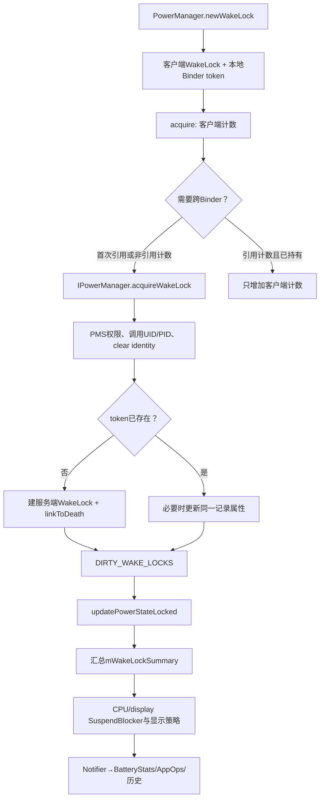
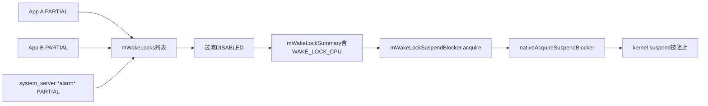
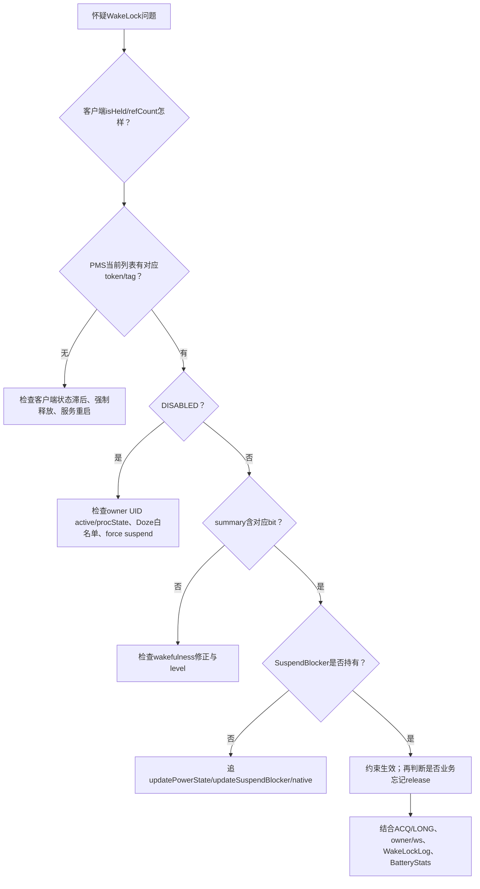

# 152 Android PowerManagerService：WakeLock 获取、归因与死亡清理

> 源码版本：Android 11 / API 30 / `android-11.0.0_r48`  
> 学习方式：macOS 只读源码，不要求编译、不要求连接设备  
> 前置章节：第 25、68、69、72、150 章

---

## 1. 本章从 Alarm WakeLock 继续

第 150 章看到 AlarmManagerService 用一把共享 `*alarm*` PARTIAL_WAKE_LOCK 保护在途投递。本章把镜头下移一层：

```text
AlarmManagerService或普通App调用WakeLock.acquire()
→ PowerManager客户端保存什么
→ Binder传递什么身份与token
→ PowerManagerService建立什么记录
→ 怎样汇总成CPU/屏幕电源要求
→ release、timeout、进程死亡怎样撤销
```

最容易混淆的问题是：“我 acquire 了两次”，到底是客户端两次引用、服务端两条记录，还是 kernel 两把锁？答案要分三层。

---

## 2. 本章核心结论

> Android 11 的公开 `PowerManager.WakeLock` 在客户端用计数决定何时跨 Binder；PowerManagerService 以 Binder token 身份维护一条 WakeLock 记录；所有有效 WakeLock 再汇总为 `mWakeLockSummary`，最终由少量 system_server SuspendBlocker 控制内核 suspend。

三层不是一一对应：

| 层 | 主要对象 | 计数/身份 |
|---|---|---|
| App客户端 | `PowerManager.WakeLock` | `mInternalCount`、`mExternalCount`、`mHeld` |
| system_server | `PowerManagerService.WakeLock` | 一 Binder token 一记录 |
| native/kernel | `SuspendBlockerImpl` | 汇总后的 CPU/display blocker 引用 |

因此两个 App WakeLock 不必对应两个 kernel wakelock；同一个客户端对象 acquire 两次，也不必在服务端出现两条记录。

---

## 3. 源码地图

```text
frameworks/base/core/java/android/os/PowerManager.java
frameworks/base/core/java/android/os/IPowerManager.aidl
frameworks/base/services/core/java/com/android/server/power/PowerManagerService.java
frameworks/base/services/core/java/com/android/server/power/Notifier.java
frameworks/base/services/core/java/com/android/server/power/WakeLockLog.java
frameworks/base/core/java/android/os/WorkSource.java
frameworks/base/services/core/jni/com_android_server_power_PowerManagerService.cpp
frameworks/native/services/powermanager/PowerManager.cpp
```

本章主线集中在前四个文件。

---

## 4. WakeLock 不是 Java 线程锁

`synchronized`、`ReentrantLock` 解决多线程互斥；WakeLock 解决电源状态约束。

PARTIAL_WAKE_LOCK 的语义是让 CPU 有条件继续执行，不是：

- 锁住某段 Java 数据；
- 保证线程立刻获得调度；
- 保证网络一直可用；
- 保证进程永远不被杀；
- 保证屏幕点亮。

WakeLock 只向系统电源状态机贡献一个约束，最终效果还受类型、wakefulness、进程状态、Doze 和 force suspend 等条件影响。

---

## 5. 常见 WakeLock level

| level | Android 11 服务端摘要效果 | 备注 |
|---|---|---|
| `PARTIAL_WAKE_LOCK` | `WAKE_LOCK_CPU` | 最常见，可被政策 disabled |
| `SCREEN_DIM_WAKE_LOCK` | screen dim | 已废弃，App宜用 FLAG_KEEP_SCREEN_ON |
| `SCREEN_BRIGHT_WAKE_LOCK` | screen bright | 已废弃 |
| `FULL_WAKE_LOCK` | screen bright + button bright | 已废弃 |
| `PROXIMITY_SCREEN_OFF_WAKE_LOCK` | proximity screen off | 依设备传感器能力 |
| `DOZE_WAKE_LOCK` | doze | system内部，需 DEVICE_POWER |
| `DRAW_WAKE_LOCK` | draw，并隐含 CPU | system内部，dozing时有意义 |

level 位于 `flags & WAKE_LOCK_LEVEL_MASK` 的低 16 位，另外还能组合 acquire/release 行为 flag。

---

## 6. `newWakeLock()` 只创建客户端对象

```java
public WakeLock newWakeLock(int levelAndFlags, String tag) {
    validateWakeLockParameters(levelAndFlags, tag);
    return new WakeLock(levelAndFlags, tag,
            mContext.getOpPackageName());
}
```

此时没有 Binder 调用，也没有服务端 WakeLock。构造函数只是保存：

```java
mFlags = flags;
mTag = tag;
mPackageName = packageName;
mToken = new Binder();
```

真正登记发生在 `acquire()`。

---

## 7. tag 是诊断身份，不是唯一主键

平台建议 tag：

- 使用稳定常量；
- 以 App/库命名空间作为前缀；
- 不包含时间戳等高基数字段；
- 不包含个人信息；
- 不冒充 `*alarm*` 等系统 tag。

服务端查找 WakeLock 用的是 `mToken` 对象身份，而不是 tag。两个不同 WakeLock 对象可以使用同一个 tag，它们仍是两条记录。

---

## 8. 一张完整调用图



---

## 9. 客户端 WakeLock 的关键字段

```java
private final IBinder mToken;
private int mInternalCount;
private int mExternalCount;
private boolean mRefCounted = true;
private boolean mHeld;
private WorkSource mWorkSource;
```

其中：

- `mToken`：服务端记录的真正键；
- `mInternalCount`：包括 timeout 自动 release 在内的内部平衡计数；
- `mExternalCount`：只由显式 acquire/release 平衡，用于 under-lock 检测；
- `mHeld`：客户端认为服务端登记仍存在；
- `mRefCounted`：默认 true。

---

## 10. 默认引用计数 acquire

```java
private void acquireLocked() {
    mInternalCount++;
    mExternalCount++;
    if (!mRefCounted || mInternalCount == 1) {
        mHandler.removeCallbacks(mReleaser);
        mService.acquireWakeLock(mToken, ...);
        mHeld = true;
    }
}
```

默认引用计数下：

```text
第一次acquire  → internal 0→1，发Binder acquire
第二次acquire  → internal 1→2，不发Binder
第一次release  → internal 2→1，不发Binder release
第二次release  → internal 1→0，发Binder release
```

所以 system_server 始终只看到一个 token、一条记录。

---

## 11. 为什么要同时有 internal 与 external count

超时自动释放调用：

```java
release(RELEASE_FLAG_TIMEOUT)
```

release 中：

```java
if (mInternalCount > 0) mInternalCount--;
if ((flags & RELEASE_FLAG_TIMEOUT) == 0) mExternalCount--;
```

timeout 只减少 internal，不减少 external。这样 timeout 到期后，业务代码以后仍可调用一次显式 release，把当初显式 acquire 的 external 账平掉，而不会被错误判成 under-lock。

---

## 12. `acquire(timeout)` 的 timeout 在客户端 Handler

```java
public void acquire(long timeout) {
    synchronized (mToken) {
        acquireLocked();
        mHandler.postDelayed(mReleaser, timeout);
    }
}
```

这不是 PowerManagerService 或 kernel timer。r48 的 `SystemServiceRegistry` 把 `ctx.mMainThread.getHandler()` 传给 PowerManager，Runnable 到期后由应用主线程 Handler 再发 Binder release。

因此 timeout 是“自动释放的客户端兜底”，不是实时硬截止：如果所属 Looper 严重阻塞，执行会迟到；若进程先死亡，则由服务端 Binder death 清理。

---

## 13. 多次 timed acquire 的精确行为

默认引用计数时，第二次 acquire 不进入跨 Binder 分支，因此不会先移除旧 timeout；每次 `acquire(timeout)` 都会再 post 同一个 Runnable。

例如：

```text
t0 acquire(10s) → internal=1，Binder acquire
t1 acquire(20s) → internal=2，不再Binder acquire，存在两个timeout消息
t10 第一个timeout → internal=1，仍持有
t21 第二个timeout → internal=0，Binder release
```

这里 timeout 与每次引用逐项对应，而不是简单理解为“最后一个 deadline 覆盖前一个”。

---

## 14. 非引用计数模式

```java
wakeLock.setReferenceCounted(false);
```

此后每次 acquire 都会发 Binder acquire，即使 `mHeld` 已经为 true；服务端按同 token 找到旧记录，因此仍不会新增第二条记录。

为什么重复发？源码注释说明，PowerManager 可能曾强制释放某些锁，而客户端并不知道；再次 acquire 应有机会重新建立服务端状态。

任意一次 release 就足以撤掉持有状态。虽然 internal/external 数字仍变化，但非引用模式不会用 internal 是否归零来决定释放，也不会执行 under-lock 异常检查。

---

## 15. 客户端的 under-lock 检查

```java
if (mRefCounted && mExternalCount < 0) {
    throw new RuntimeException("WakeLock under-locked " + mTag);
}
```

多 release 一次时，客户端仍可能先完成自己的状态处理，再在末尾抛异常。这个异常是同一个 Java WakeLock 对象的显式引用账错误，不是服务端检测到 kernel 负引用。

服务端对未知 token 的 `releaseWakeLockInternal()` 只是返回，不向调用者抛“未持有”。

---

## 16. `mHeld` 只代表客户端登记观念

`isHeld()` 只返回客户端字段：

```java
public boolean isHeld() {
    synchronized (mToken) { return mHeld; }
}
```

它没有查询 system_server。因此 `true` 不能证明：

- 服务端当前一定尊重这条 PARTIAL WakeLock；
- kernel suspend blocker 一定由它保持；
- App 进程不会被杀；
- 电源状态一定是 awake。

后文会看到缓存进程和 Doze 可让服务端记录仍存在却标记 `DISABLED`。

---

## 17. `finalize()` 只是最后防线

WakeLock 被终结时若 `mHeld` 仍为 true，会记录 wtf 并尝试 Binder release。

但 finalize：

- 执行时机不确定；
- 不适合作为业务资源管理策略；
- 不能替代 `try/finally`；
- 进程直接死亡时仍要靠 Binder death。

推荐结构仍是：

```java
wakeLock.acquire();
try {
    // 短小、明确、可终止的工作
} finally {
    wakeLock.release();
}
```

---

## 18. AIDL 传递的内容

```aidl
void acquireWakeLock(
    IBinder lock,
    int flags,
    String tag,
    String packageName,
    in WorkSource ws,
    String historyTag);
```

Binder 自动提供真实 calling UID/PID，调用者不能通过普通参数伪造这两项。`packageName`、tag、WorkSource 是业务/归因字段，owner UID/PID 则取自 Binder 驱动上下文。

---

## 19. Binder 入口的参数与权限检查

服务端依次检查：

1. token 非 null；
2. packageName 非 null；
3. level 合法、tag 非 null；
4. `android.permission.WAKE_LOCK`；
5. DOZE_WAKE_LOCK 额外需要 `DEVICE_POWER`；
6. 非空 WorkSource 额外需要 `UPDATE_DEVICE_STATS`。

空 WorkSource 会被规范化为 null，避免“无归因项的非空对象”产生额外分支。

---

## 20. flags 文档限制与服务端实际防御

文档说 `ACQUIRE_CAUSES_WAKEUP`、`ON_AFTER_RELEASE` 不能和 PARTIAL 组合。但 `validateWakeLockParameters()` 只验证 level 是否在允许集合、tag 是否非 null，并不显式拒绝这一组合。

服务端实际应用时又加了：

```java
ACQUIRE_CAUSES_WAKEUP && isScreenLock(wakeLock)
ON_AFTER_RELEASE && isScreenLock(wakeLock)
```

所以在 r48 中错误地把这些 flag 加到 PARTIAL 上，通常是“不生效”，而不是在 validation 中抛异常。文章和代码审查应同时区分 API 契约与防御实现。

---

## 21. 为什么先保存 calling UID/PID 再 clear identity

```java
final int uid = Binder.getCallingUid();
final int pid = Binder.getCallingPid();
final long ident = Binder.clearCallingIdentity();
try {
    acquireWakeLockInternal(..., uid, pid);
} finally {
    Binder.restoreCallingIdentity(ident);
}
```

权限检查和 owner 身份取值都发生在 clear 之前。clear 后内部跨服务调用以 system_server 身份进行，但真实业务 owner 已通过显式 uid/pid 保存下来。

这与“清除身份后 WakeLock 就归 system_server”完全不同。

---

## 22. 服务端用 token 身份查找

```java
private int findWakeLockIndexLocked(IBinder lock) {
    for (...) {
        if (mWakeLocks.get(i).mLock == lock) return i;
    }
    return -1;
}
```

比较使用 `==`，查的是 system_server 看到的 Binder 对象身份。tag、package、flags、WorkSource 都不是主键。

这也解释了同 token 改 tag/WorkSource属于“更新旧记录”，不同 token 同 tag 属于“两条记录”。

---

## 23. 新 token 建立服务端 WakeLock

首次登记时：

```java
UidState state = mUidState.get(uid);
if (state == null) { ... }
state.mNumWakeLocks++;

wakeLock = new WakeLock(lock, flags, tag, packageName,
        ws, historyTag, uid, pid, state);
lock.linkToDeath(wakeLock, 0);
mWakeLocks.add(wakeLock);
setWakeLockDisabledStateLocked(wakeLock);
```

服务端对象保存 owner、归因、统计和政策状态，不保存客户端 internal/external count。

---

## 24. 服务端 WakeLock 字段

```text
mLock                Binder token
mFlags / mTag        类型、行为与诊断标签
mPackageName         owner包，建立后不可变
mWorkSource          代谁工作
mHistoryTag          BatteryStats历史标签
mOwnerUid / mOwnerPid Binder真实调用身份
mUidState            owner UID进程状态账户
mAcquireTime         Notifier计时起点，uptime
mNotifiedAcquired    是否已向统计层报告start
mNotifiedLong        是否报告为长PARTIAL
mDisabled            记录存在但当前不被电源状态尊重
```

构造时 WorkSource 会复制，避免调用方随后修改原对象直接改变服务端状态。

---

## 25. linkToDeath 为什么在加入列表之前

```java
try {
    lock.linkToDeath(wakeLock, 0);
} catch (RemoteException ex) {
    throw new IllegalArgumentException("Wake lock is already dead.");
}
mWakeLocks.add(wakeLock);
```

如果 token 所在进程已经死亡，link 立即失败，服务端不把一条无法自动回收的记录加入列表。

顺序保证“进入 mWakeLocks 的跨进程 token 已经具有死亡通知”。这是资源登记常见的先建立失效监控、再发布状态模式。

---

## 26. 同 token 再 acquire 怎么处理

如果 token 已存在，服务端不会增加引用计数：

```java
if (!wakeLock.hasSameProperties(...)) {
    notifyWakeLockChangingLocked(...);
    wakeLock.updateProperties(...);
}
notifyAcquire = false;
```

相同属性时近似幂等；属性不同时更新同一记录，并让 BatteryStats/Notifier 把旧归因切到新归因。

owner package、UID、PID 在 `updateProperties()` 中禁止改变。正常 PowerManager 客户端固定这些字段，因此主要可变的是 flags、tag、WorkSource 与 historyTag。

这里还有一个容易忽略的客户端边界：隐藏的 `setTag()`、`setHistoryTag()`、`setUnimportantForLogging()` 只是修改本地字段，并不会像 `setWorkSource()` 那样在 held 时立即调用服务端更新。默认引用计数模式下，held 期间再次 acquire 也可能只增加本地计数，服务端继续保留旧 tag/flags；必须经过真正的 Binder acquire 边沿才会让同 token 属性变化被 PMS 看见。

---

## 27. 一 token 一记录不是服务端引用计数

服务端 release 收到 token 后直接：

```java
wakeLock.mLock.unlinkToDeath(wakeLock, 0);
removeWakeLockLocked(wakeLock, index);
```

没有“服务端 count--，归零才删”的逻辑。引用平衡是普通 Java `PowerManager.WakeLock` 客户端的职责。

如果自定义 Binder 调用者对同 token acquire 两次、release 一次，服务端记录就会被删除；不能假设 AIDL 帮它引用计数。

---

## 28. acquire 后为什么先更新电源、再通知统计

```java
mDirty |= DIRTY_WAKE_LOCKS;
updatePowerStateLocked();
if (notifyAcquire) {
    notifyWakeLockAcquiredLocked(wakeLock);
}
```

源码注释明确要求先确保 kernel stay-awake 条件已经建立，再向 BatteryStats 报告 acquire，避免出现“统计已经开始，但 CPU 在 kernel blocker 建立前睡去”的竞态窗口。

这说明 Notifier 记账与电源约束生效是两个层次，且顺序是刻意设计的。

---

## 29. `DIRTY_WAKE_LOCKS` 是重算信号

PowerManagerService 不在 acquire 方法里直接逐项操作屏幕或 kernel。它设置：

```java
mDirty |= DIRTY_WAKE_LOCKS;
updatePowerStateLocked();
```

`updatePowerStateLocked()` 是中心状态机，分阶段：

1. 更新基础电源事实；
2. 汇总 WakeLock、用户活动并收敛 wakefulness；
3. 处理 profile timeout；
4. 更新 display power request；
5. 更新 dream；
6. 完成 wakefulness 通知；
7. 最后更新 SuspendBlocker。

最后才可能释放最后一个 blocker，因为前面的状态转换必须先完成。

---

## 30. WakeLock level 怎样变成 summary bit

`updateWakeLockSummaryLocked()` 遍历 `mWakeLocks`，调用 `getWakeLockSummaryFlags()`：

```java
case PARTIAL_WAKE_LOCK:
    if (!wakeLock.mDisabled) return WAKE_LOCK_CPU;
case FULL_WAKE_LOCK:
    return WAKE_LOCK_SCREEN_BRIGHT | WAKE_LOCK_BUTTON_BRIGHT;
case SCREEN_BRIGHT_WAKE_LOCK:
    return WAKE_LOCK_SCREEN_BRIGHT;
case SCREEN_DIM_WAKE_LOCK:
    return WAKE_LOCK_SCREEN_DIM;
case PROXIMITY_SCREEN_OFF_WAKE_LOCK:
    return WAKE_LOCK_PROXIMITY_SCREEN_OFF;
case DOZE_WAKE_LOCK:
    return WAKE_LOCK_DOZE;
case DRAW_WAKE_LOCK:
    return WAKE_LOCK_DRAW;
```

所有记录结果按位 OR，得到全局 `mWakeLockSummary`。

---

## 31. wakefulness 会再次修正 summary

`adjustWakeLockSummaryLocked()` 不是简单原样保留：

- 非 DOZING 时去掉 DOZE/DRAW；
- ASLEEP 或持 DOZE 时去掉屏幕 bright/dim/button；
- ASLEEP 时还去掉 proximity；
- AWAKE 的 bright/dim 隐含 CPU + STAY_AWAKE；
- DREAMING 的 bright/dim 隐含 CPU；
- DRAW 隐含 CPU。

因此某条记录存在，不代表其 level 在当前 wakefulness 下必然贡献同样效果。

---

## 32. 从多条 PARTIAL 到一个 SuspendBlocker



只要 summary 中 CPU bit 从无到有，PMS 获取共享 WakeLock SuspendBlocker；更多 PARTIAL 不需要逐条再 acquire 该 blocker。最后一个有效 CPU 贡献消失时才释放。

---

## 33. Display SuspendBlocker 是另一条账

`updateSuspendBlockerLocked()` 同时计算：

```java
needWakeLockSuspendBlocker = summary含WAKE_LOCK_CPU
needDisplaySuspendBlocker = display未ready/亮灭转换/特定doze等
```

所以看到 CPU 不可 suspend，不一定由某个 App PARTIAL 造成；display transition 也可能持有 Display SuspendBlocker。

反过来，释放最后一个 PARTIAL 后设备也不一定立刻 suspend，因为 display、其他系统约束和 autosuspend 状态仍可能阻止它。

---

## 34. ACQUIRE_CAUSES_WAKEUP 的真实条件

服务端只在：

```text
flag包含ACQUIRE_CAUSES_WAKEUP
AND level是FULL/SCREEN_BRIGHT/SCREEN_DIM
```

时调用 `wakeUpNoUpdateLocked()`。PARTIAL 不触发这条唤醒 wakefulness 的路径。

归因优先取第一个非空 WorkChain 的 attribution uid/tag；否则取 WorkSource 第 0 项；没有 WorkSource 才取 owner UID/package。

“WakeLock 保持 awake”和“acquire 时主动 wake up”是两件不同的事。

---

## 35. ON_AFTER_RELEASE 的真实条件

释放 screen lock 且带 `ON_AFTER_RELEASE` 时，服务端调用：

```java
userActivityNoUpdateLocked(now,
        USER_ACTIVITY_EVENT_OTHER,
        USER_ACTIVITY_FLAG_NO_CHANGE_LIGHTS,
        ownerUid);
```

它刷新用户活动计时，让已经亮着的屏幕再维持一会儿，但不会像 ACQUIRE_CAUSES_WAKEUP 那样从 asleep 主动唤醒。

PARTIAL 上的该 flag 因 `isScreenLock()` 条件而不生效。

---

## 36. WorkSource 的目的

默认情况下，功耗归 owner UID。如果 system service 代表另一个 App 工作，可以设置 WorkSource，把 WakeLock 的 BatteryStats 责任归给真正受益/发起方。

例如第 150 章 AlarmManagerService：

```text
owner进程 = system_server
ownerUid = system
WorkSource/known creator UID = Alarm来源App
```

这让“谁持有服务对象”和“谁应承担能耗”分离。

---

## 37. WorkSource 不会改 owner

即使设置 WorkSource：

- `mOwnerUid/mOwnerPid` 仍是 Binder calling 身份；
- `mUidState` 仍绑定 owner UID；
- linkToDeath 仍绑定调用者传来的 token；
- package 字段仍是 owner package；
- WorkSource 主要用于统计、profile影响和部分 wakeup 归因。

不能把 WorkSource 理解成“WakeLock 所有权转移”。

---

## 38. WorkSource 权限边界

非空 WorkSource 需要：

```text
android.permission.UPDATE_DEVICE_STATS
```

普通 App 通常不能任意把自己的耗电记到其他 UID。系统服务才常用这一能力。

`acquireWakeLockWithUid()` 只是构造 `new WorkSource(uid)` 后走同一个入口，所以仍会经过非空 WorkSource 权限检查。

---

## 39. 运行中更新 WorkSource

客户端 `setWorkSource()`：

- 规范化空对象为 null；
- 复制或覆盖本地 WorkSource；
- 只有值真的变化且 `mHeld` 为 true，才跨 Binder 更新。

服务端找不到 active token 时抛 `IllegalArgumentException`；找到后若不同则调用 `notifyWakeLockChangingLocked()`，再复制新 WorkSource。

因此归因更新不是重新创建 WakeLock，而是同一 token 的统计责任切换。

---

## 40. BatteryStats 如何处理归因变化

Notifier 的优化路径是：旧、新 WorkSource 都非 null且 monitor type 有效时，调用：

```java
noteChangeWakelockFromSource(old..., new...)
```

否则退化为：

```text
old release
→ new acquire
```

长 PARTIAL 标记也在 change 时结束旧段并重新开始 60 秒计时，避免每次改归因都继续沿用已经“long”的状态并反复刷统计。

---

## 41. WorkSource 与政策 disabled 使用不同身份

r48 的 `setWakeLockDisabledStateLocked()` 使用：

```java
appid = UserHandle.getAppId(wakeLock.mOwnerUid)
wakeLock.mUidState
```

也就是说缓存/Doze 是否忽略 PARTIAL，主要按 owner UID 状态判断，不按 WorkSource 中被归因 UID 判断。

WorkSource 能改变“耗电记给谁”，不能让 owner 绕过自己的电源政策状态。

---

## 42. 哪些 WakeLock 会被动态 disabled

Android 11 这里仅对 App UID 的 `PARTIAL_WAKE_LOCK` 应用该状态。默认：

```java
NO_CACHED_WAKE_LOCKS = true;
```

以下情况可能 disabled：

- force suspend active；
- owner UID inactive 且 procState 比 RECEIVER 更后台；
- Device Idle 中 owner App 不在永久/临时白名单，且 procState 比 BOUND_FOREGROUND_SERVICE 更后台。

core UID 不走这组 App UID 禁用条件；screen/doze/draw level 也不由此函数 disabled。

---

## 43. `DISABLED` 是“保留记录但不尊重”

服务端没有删除 token，也没有通知客户端 `mHeld=false`。它只是：

```text
WakeLock记录仍在mWakeLocks
mDisabled=true
不向summary贡献WAKE_LOCK_CPU
向Notifier报告release
```

UID 后来重新活跃或进入允许 procState 时，同一记录可变回 enabled，再向 Notifier 报 acquire。

这种设计避免 App 每次前后台切换都重新走 Binder acquire/release，同时让系统即时收回后台 CPU 保持能力。

---

## 44. 客户端 held 与服务端 effective 的四格

| 客户端 `mHeld` | 服务端记录 | 服务端 disabled | 实际含义 |
|---:|---:|---:|---|
| false | 无 | - | 正常未持有 |
| true | 有 | false | 正常有效 |
| true | 有 | true | 客户端持有声明仍在，但当前不贡献CPU summary |
| true | 无 | - | 异常/内部强制路径下客户端状态与服务端登记不一致 |

`isHeld()` 只区分第一列，无法区分后三项。

---

## 45. UidState 为什么独立存在

```java
static final class UidState {
    int mNumWakeLocks;
    int mProcState;
    boolean mActive;
}
```

ActivityManager 通过 PowerManagerInternal 提供 UID active/idle/gone/procState 变化。PMS 可以用一份 UID 状态重评该 UID 的所有 PARTIAL WakeLock，而无需每次查询 AMS。

批量 UID 状态变化时，`startUidChanges/finishUidChanges` 还能把多次事件合并为一次 disabled-state 全表扫描。

---

## 46. UID gone 不等于直接删 WakeLock

`uidGoneInternal()` 更新 UidState 为 NONEXISTENT、inactive，并可能触发 disabled 重评，但它不直接遍历删除该 UID 的 WakeLock。

真正按 token 删除通常依靠 Binder death。两条证据用途不同：

- UID observer：更新电源政策事实；
- Binder death：回收具体资源记录。

若 token 属于仍存活的代理进程，source UID gone 也不应该错误删除代理持有的同一 WakeLock。

---

## 47. 正常 release 路径

客户端引用归零后调用 AIDL release。服务端：

1. 查 token；
2. 处理 proximity release flag；
3. `unlinkToDeath()`；
4. 从 `mWakeLocks` 删除；
5. owner UidState wake-lock 数减一；
6. Notifier release；
7. 应用 ON_AFTER_RELEASE；
8. 标记 DIRTY_WAKE_LOCKS；
9. 重算电源状态。

释放一条锁只是撤销一个约束，不能承诺设备马上熄屏或 suspend。

---

## 48. 未知 token release 的边界

`findWakeLockIndexLocked()` 返回 -1 时，服务端只在 DEBUG_SPEW 下打日志并 return。

所以：

- 普通 PowerManager 客户端的多 release 主要由客户端 external count 抛错；
- 直接 AIDL 调用未知 token 不一定得到异常；
- 服务端 release 设计为对已经消失的资源近似幂等。

不要用“没有服务端异常”证明客户端引用一定配平。

---

## 49. Binder death 自动清理

服务端 WakeLock 实现 `IBinder.DeathRecipient`：

```java
public void binderDied() {
    PowerManagerService.this.handleWakeLockDeath(this);
}
```

death 回调持 `mLock` 检查该具体 WakeLock 对象是否还在列表；若在，直接走 `removeWakeLockLocked()`。

它与正常 release 共用 UidState、Notifier、flags、dirty 和电源重算逻辑，区别是死亡路径无需也无法再 `unlinkToDeath()`。

---

## 50. 为什么 death 回调按 WakeLock 对象找

```java
int index = mWakeLocks.indexOf(wakeLock);
```

如果正常 release 已先删掉记录，稍后的 death 回调找不到就 return；如果 death 先删，后来的 release 按 token 找不到也 return。

两个入口都在同一 `mLock` 下串行，因此“release 与进程死亡竞态”最多清一次，不会把 UidState 数量重复减少。

---

## 51. Binder death 能解决什么、不能解决什么

能解决：

- App 进程崩溃；
- 被 LMKD/AMS 杀死；
- native fatal exit；
- 未执行 finally 的进程级终止。

不能解决：

- 进程仍活着但忘记 release；
- 主线程卡死、token 仍活着；
- 长时间业务逻辑没有退出；
- WorkSource 归因设置错误。

因此 timeout、结构化 finally、长锁检测和统计诊断仍然必要。

---

## 52. Notifier 把电源约束接到统计系统

有效 acquire 后，Notifier 根据 level 映射 BatteryStats monitor type：

- PARTIAL → `WAKE_TYPE_PARTIAL`；
- DIM/BRIGHT → `WAKE_TYPE_FULL`；
- DRAW → `WAKE_TYPE_DRAW`；
- 特定 proximity → partial 或不记录；
- DOZE → 不作为附加能耗记录。

无 WorkSource 时还开始 `OP_WAKE_LOCK` AppOp；有 WorkSource 时使用 source-aware BatteryStats API，不走 owner AppOp start 分支。

---

## 53. 60 秒长 PARTIAL 检测

```java
MIN_LONG_WAKE_CHECK_INTERVAL = 60 * 1000;
```

当有效 PARTIAL 被通知 acquire 时，用 `uptimeMillis` 记录 `mAcquireTime` 并安排 Handler 检查。超过约 60 秒仍有效且尚未标记 long，就向 BatteryStats 和 statsd 写 long-partial start；release/change/disabled 时写 finish。

这是统计事件，不是 60 秒强制释放。系统不会因为它变成 long 就自动删除 WakeLock。

---

## 54. 为什么用 uptime 做长锁计时

`mAcquireTime` 与检查 Handler 都基于 uptime。有效 PARTIAL 本来就应阻止 CPU 深睡，因此正常情况下 uptime 会持续推进。

如果 WakeLock 被 disabled，Notifier 会结束 acquire/long 统计；重新 enabled 时重新设置起点。长锁时长因此描述“被系统实际尊重的当前有效段”，而不是 token 从第一次登记开始的 wall 总时长。

---

## 55. WakeLockLog 与当前列表不是一回事

Notifier 同时向 `WakeLockLog` 写 acquire/release 历史。当前 `mWakeLocks` 列表回答“此刻还登记什么”；WakeLockLog 回答“近期发生过哪些边沿事件”。

历史缓冲容量有限，tag 还有压缩/字典策略，不是永久审计日志。诊断忘记释放优先看当前列表和 acquire duration，再用历史辅助解释来源。

---

## 56. dumpsys 中如何识别服务端 WakeLock

PowerManagerService 文本会打印：

```text
Wake Locks: size=N
  PARTIAL_WAKE_LOCK 'tag' ... ACQ=-1m23s (uid=... pid=... ws=...)
```

重要标记：

- `DISABLED`：记录存在但当前政策不尊重；
- `ACQ=`：相对当前 uptime 的 acquire 起点，通常显示负的“多久以前”；
- `LONG`：已通过 60 秒 long 检测；
- owner uid/pid 与 `ws=` 要分别读；
- flags 可显示 wakeup/after-release。

客户端 internal count 不在服务端 dumpsys 中，因为 PMS 根本不知道它。

---

## 57. 常见误区一：一条 Java WakeLock 等于一条 kernel lock

错。Java 对象先折叠为 token 记录，多条记录再 OR 成 summary，PMS 最后维护共享 WakeLock/Display SuspendBlocker。

kernel 层看到的是 system_server 汇总后的 suspend 阻止需求，不是完整 App 对象表。

---

## 58. 常见误区二：PARTIAL 会点亮屏幕

错。PARTIAL 贡献 CPU bit，不贡献 screen bright/dim，也不通过 `ACQUIRE_CAUSES_WAKEUP` 的 screen-lock 条件。

“CPU 从 suspend 中运行”和“设备进入 interactive、屏幕点亮”必须分开。

---

## 59. 常见误区三：进程死了 WakeLock 永远泄漏

普通跨进程 token 已经 `linkToDeath`，进程死亡会清理服务端记录。但如果进程活着、线程卡死或逻辑忘记 release，death 机制不会触发。

正确结论是“进程死亡有自动兜底”，不是“可以不写 release”。

---

## 60. 常见误区四：WorkSource 就是 owner

错。owner 决定 Binder身份、token生命周期、UID政策；WorkSource主要决定能耗归因和 profile 影响。二者可指向不同 UID。

排查代理系统服务时必须同时记录 owner 和 ws。

---

## 61. 常见误区五：`isHeld()` 为 true 就一定阻止休眠

错。它是客户端本地布尔值。服务端可能把 PARTIAL 标为 DISABLED；客户端源码也明确为“PowerManager内部曾强制释放但调用方未知”的可能性保留了重复 acquire 行为。

有效性需要看服务端 WakeLock、disabled、summary 与 SuspendBlocker。

---

## 62. 常见误区六：长锁检测会自动释放

错。60 秒检查只记 BatteryStats/statsd long 状态。自动释放来自客户端 `acquire(timeout)` 的 Handler，或显式 release、Binder death、特定系统强制行为。

---

## 63. 一套故障诊断路径



诊断关键是逐层证明，不从一个 `isHeld()` 或一个 tag 直接跳到 kernel 结论。

---

## 64. 场景一：App 明明 held，CPU 仍可能休眠

优先看服务端是否 `DISABLED`。如果 owner App 进入 cached inactive、Doze 非白名单后台或 force suspend，记录仍存在但 PARTIAL 不贡献 CPU summary。

WorkSource 指向前台 App也不会改变 owner UID disabled 判断。需要修正工作执行模型，而不是靠伪造归因绕过政策。

---

## 65. 场景二：release 后屏幕仍亮

这不证明 release 失败。可能有：

- 其他 screen WakeLock；
- 用户活动 timeout 尚未到；
- `ON_AFTER_RELEASE` 刷新了 user activity；
- display transition尚未ready；
- stay-on、dream、亮度boost等其他状态。

先确认目标 token 已从列表删除，再追 `mWakeLockSummary`、`mUserActivitySummary` 和 display request。

---

## 66. 场景三：system_server 服务替 App 持锁

正确观察应写成：

```text
ownerUid = system
ownerPid = system_server
tag = 具体系统服务tag
WorkSource = 业务App或WorkChain
```

Binder death 绑定的是 system_server 内 token；只要 system_server 活着，它不会因业务 App 死亡自动撤销。因此系统服务自己必须监听业务生命周期、完成回调或 timeout，正如 AlarmManagerService 用 InFlight refcount 管理 `*alarm*`。

---

## 67. 场景四：同一 tag 出现多条记录

tag 不是键，可能来自：

- 同一进程创建多个 WakeLock 对象；
- 多个进程使用同一稳定 tag；
- system service 为多个并发工作项建立不同 token；
- owner不同但日志聚合显示相同 tag。

诊断要联合 owner uid/pid、WorkSource、flags 和 acquire time，不能只按字符串认定“重复 acquire bug”。

---

## 68. macOS 只读练习一：手算引用计数

```bash
cd /path/to/android-11.0.0_r48

sed -n '2320,2490p' \
  frameworks/base/core/java/android/os/PowerManager.java
```

分别手算：

```text
A. acquire, acquire, release, release
B. acquire(10s), 10s timeout, release
C. setReferenceCounted(false), acquire, acquire, release
D. acquire(10s), acquire(20s), 两个timeout
```

为每步写出 internal、external、held 和是否发生 Binder 调用。

---

## 69. macOS 只读练习二：验证一 token 一记录

```bash
rg -n "findWakeLockIndexLocked|hasSameProperties|updateProperties|removeWakeLockLocked" \
  frameworks/base/services/core/java/com/android/server/power/PowerManagerService.java

sed -n '1270,1490p' \
  frameworks/base/services/core/java/com/android/server/power/PowerManagerService.java
```

确认查找使用 Binder `==`，重复 acquire 不增加服务端 count，release 直接删除记录。

---

## 70. macOS 只读练习三：追死亡清理竞态

```bash
rg -n "linkToDeath|unlinkToDeath|binderDied|handleWakeLockDeath" \
  frameworks/base/services/core/java/com/android/server/power/PowerManagerService.java
```

画出正常 release 与 binderDied 两条入口，确认它们都在 `mLock` 下检查列表且共用 `removeWakeLockLocked()`，从而只清一次。

---

## 71. macOS 只读练习四：从 level 追到 kernel blocker

```bash
rg -n "getWakeLockSummaryFlags|adjustWakeLockSummaryLocked|updateSuspendBlockerLocked" \
  frameworks/base/services/core/java/com/android/server/power/PowerManagerService.java

sed -n '2108,2215p' \
  frameworks/base/services/core/java/com/android/server/power/PowerManagerService.java

sed -n '3038,3115p' \
  frameworks/base/services/core/java/com/android/server/power/PowerManagerService.java
```

选择 PARTIAL、SCREEN_BRIGHT、DRAW 三种 level，分别推演在 AWAKE、DREAMING、DOZING、ASLEEP 下的 summary。

---

## 72. macOS 只读练习五：验证 disabled 身份

```bash
sed -n '3460,3525p' \
  frameworks/base/services/core/java/com/android/server/power/PowerManagerService.java
```

重点圈出：

```text
wakeLock.mOwnerUid
wakeLock.mUidState
mDeviceIdleWhitelist/tempWhitelist
```

再搜索 `mWorkSource`，确认 disabled 判断没有改用 WorkSource UID。

---

## 73. macOS 只读练习六：追 BatteryStats 记账

```bash
sed -n '200,380p' \
  frameworks/base/services/core/java/com/android/server/power/Notifier.java

rg -n "MIN_LONG_WAKE_CHECK_INTERVAL|checkForLongWakeLocks" \
  frameworks/base/services/core/java/com/android/server/power/PowerManagerService.java
```

区分四件事：电源约束生效、BatteryStats start、AppOps start、long-partial stats。它们发生顺序和适用类型并不相同。

---

## 74. 推荐的 WakeLock 代码审查清单

```text
用途：为什么必须阻止suspend，能否换成JobScheduler/Alarm/FGS？
范围：获取点和释放点是否在同一可证明生命周期？
兜底：是否有合理timeout，Looper阻塞风险是什么？
异常：所有return/throw/cancel/death路径是否释放？
引用：是否真的需要reference-counted，多调用方能否配平？
身份：owner是谁，WorkSource归因是否真实且有权限？
线程：客户端WakeLock对象是否被多线程安全共享？
政策：进入cached/Doze后任务是否仍错误假设PARTIAL有效？
诊断：tag是否稳定、可聚合、无隐私数据？
```

WakeLock 的最佳实践不是“永远加 timeout”这一句话，而是让工作生命周期、资源账和系统政策能互相证明。

---

## 75. 复读后的易混点修订

初稿最容易把三个层次写成一套引用计数。逐行复读后必须保留这些精确边界：

1. 客户端默认引用计数，服务端同 token 不引用计数；
2. `acquire(timeout)` 的 deadline 在客户端 Handler，不在 PMS/kernel；
3. 引用模式多次 timed acquire 可同时存在多个相同 Runnable 消息；
4. timeout 只减 internal，显式 release 才减 external；
5. 非引用模式每次 acquire 都发 Binder，但服务端仍更新同一记录；
6. `isHeld()` 是客户端状态，不代表服务端 effective；
7. PARTIAL 可在记录不删除时被 disabled；
8. disabled 按 owner UID/UIdState，不按 WorkSource UID；
9. WorkSource 改能耗归因，不转移 token 所有权；
10. 多条有效 PARTIAL 最终汇总到共享 SuspendBlocker；
11. long-partial 是统计，不是自动释放；
12. flags 与 PARTIAL 的不兼容在 r48 validation 中未抛出，而是在应用条件上被忽略。

---

## 76. 本章总结

一把 WakeLock 的完整生命周期可以压缩成：

```text
客户端对象创建token
→ 客户端引用计数决定Binder边沿
→ PMS按真实calling UID/PID建一token一记录
→ linkToDeath建立异常退出兜底
→ owner状态决定PARTIAL是否disabled
→ WorkSource决定统计归因
→ 所有有效记录汇总summary
→ 共享SuspendBlocker约束kernel suspend
→ release/timeout/death撤销记录并重算
```

最重要的理解是：

> “持有 WakeLock”至少有客户端声明、服务端登记、政策有效、summary贡献和kernel blocker五种层次。排查问题必须明确自己正在证明哪一层。

---

## 77. 下一章预告

第 153 章继续 PowerManagerService 的 wakefulness 状态机：

```text
AWAKE / DREAMING / DOZING / ASLEEP
→ userActivity与screen timeout
→ wakeUp / nap / goToSleep
→ Sandman与DreamManager
→ DisplayPowerRequest
→ Notifier交互状态广播
```

重点解释 WakeLock 只是输入之一，系统如何综合用户活动、超时、Dream、Doze 与显示就绪状态完成一次亮灭屏转换。
