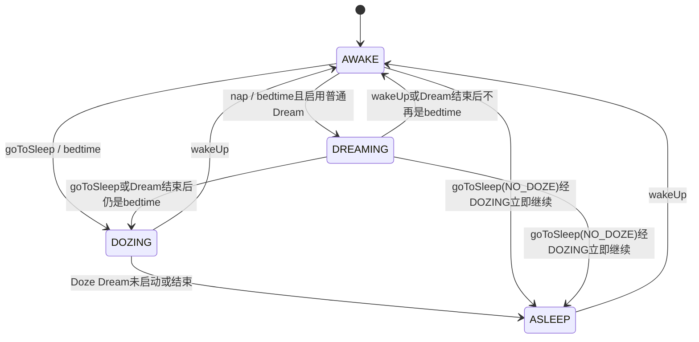
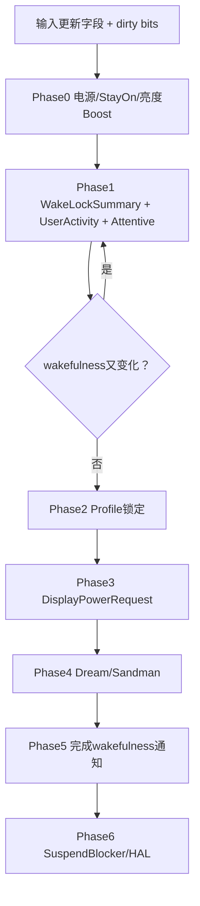
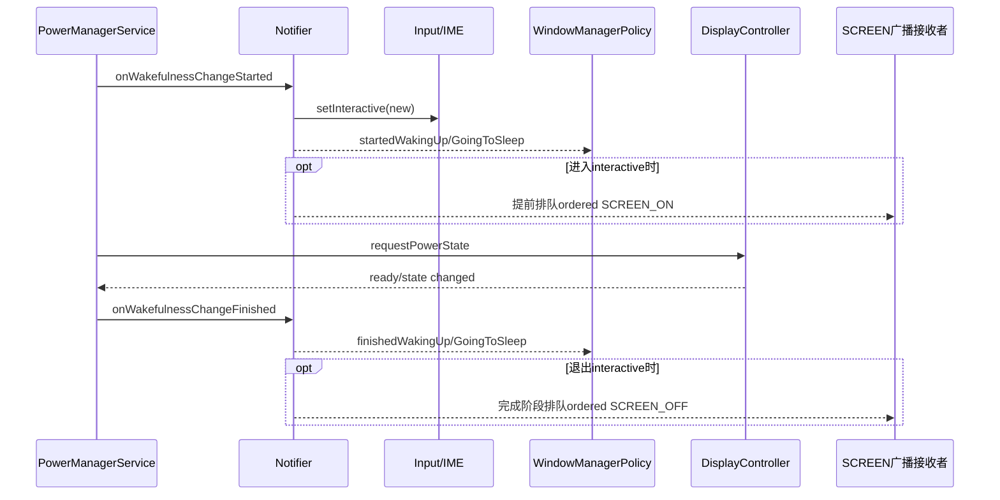

# 153 Android PowerManagerService：wakefulness 状态机与亮灭屏转换

> 源码版本：Android 11 / API 30 / `android-11.0.0_r48`  
> 学习方式：macOS 只读源码，不要求编译、不要求连接设备  
> 前置章节：第 68、69、152 章

---

## 1. 本章要解决的核心误解

日常说“亮屏”“熄屏”“睡眠”时，常把下列状态混成一件事：

```text
PowerManagerService wakefulness
PowerManager.isInteractive()
DisplayPowerRequest policy
Display真实物理state
CPU是否允许suspend
Dream/Doze服务是否运行
```

它们有关联，却不是同一个变量。本章沿 Android 11 源码把一次从用户活动超时到熄屏、Doze、深睡，再到唤醒的转换逐层拆开。

---

## 2. 本章核心结论

> PowerManagerService 用 AWAKE、DREAMING、DOZING、ASLEEP 表达“设备整体可唤醒程度”；它先修改 wakefulness，再通过中心 dirty-bit 状态机计算用户活动、Dream、DisplayPowerRequest、通知与 SuspendBlocker，直到显示和 Doze 条件收敛后才宣布转换完成。

四态与 interactive 的关系是：

| wakefulness | interactive | 常见显示形态 | CPU能否suspend |
|---|---:|---|---|
| AWAKE | true | bright/dim/近距灭屏 | 另由blocker决定 |
| DREAMING | true | 屏保/梦境，通常亮或暗 | 另由summary/display决定 |
| DOZING | false | AOD/doze/off | 可以，除非有CPU/display blocker |
| ASLEEP | false | off或正在转off | 通常允许，但仍看blocker |

所以 interactive 不是“LCD 是否发光”，wakefulness 也不是“CPU 当前是否正在运行”。

---

## 3. 源码地图

```text
frameworks/base/core/java/android/os/PowerManager.java
frameworks/base/core/java/android/os/PowerManagerInternal.java
frameworks/base/services/core/java/com/android/server/power/PowerManagerService.java
frameworks/base/services/core/java/com/android/server/power/Notifier.java
frameworks/base/services/core/java/com/android/server/display/DisplayManagerService.java
frameworks/base/services/core/java/com/android/server/display/DisplayPowerController.java
frameworks/base/services/core/java/com/android/server/dreams/DreamManagerService.java
frameworks/base/core/java/android/hardware/display/DisplayManagerInternal.java
```

本章重点精读 PowerManagerService，再把输出接到第 68、69 章已经讲过的 Display 与 Dream 子系统。

---

## 4. 四个常量与官方语义

`PowerManagerInternal` 定义：

```java
WAKEFULNESS_ASLEEP   = 0;
WAKEFULNESS_AWAKE    = 1;
WAKEFULNESS_DREAMING = 2;
WAKEFULNESS_DOZING   = 3;
```

简化理解：

- AWAKE：完全醒着，用户活动超时后可 dream 或 sleep；
- DREAMING：运行普通 Dream，仍允许交互；
- DOZING：几乎睡着，只让低功耗 Doze Dream/AOD 运行；
- ASLEEP：完全睡眠态，只能经 wakeUp 转醒。

这四个值不是 Display.STATE_ON/OFF/DOZE 的别名。

---

## 5. interactive 只把四态压成两类

```java
public static boolean isInteractive(int wakefulness) {
    return wakefulness == WAKEFULNESS_AWAKE
            || wakefulness == WAKEFULNESS_DREAMING;
}
```

于是：

```text
AWAKE ↔ DREAMING     不改变interactive
DOZING ↔ ASLEEP      不改变interactive
AWAKE/DREAMING ↔ DOZING/ASLEEP 才改变interactive
```

这条二值边界决定 Input、BatteryStats、WindowManagerPolicy 和 SCREEN_ON/OFF 广播的主要通知节奏。

---

## 6. `PowerManager.isInteractive()` 还有跨进程缓存

客户端不是每次调用都发 Binder：

```java
private PropertyInvalidatedCache<Void, Boolean> mInteractiveCache = ...
```

服务端在真正修改 `mWakefulnessRaw` 之前先：

```java
mInjector.invalidateIsInteractiveCaches();
```

然后才写新 wakefulness。这样客户端不会长期读到旧 interactive；但它仍只得到二值结果，看不到 DREAMING 与 AWAKE、DOZING 与 ASLEEP 的区别。

---

## 7. 状态转换总图



图里的“直接 ASLEEP”在代码中仍先执行一次 `setWakefulness(DOZING)`，再调用 `reallyGoToSleep()`；只是两个状态变化发生在同次持锁调用中，外界不一定观察到完整的中间显示阶段。

---

## 8. 四个主要入口

| 入口 | 主要合法源状态 | 目标 |
|---|---|---|
| `wakeUpNoUpdateLocked()` | ASLEEP/DOZING/DREAMING | AWAKE |
| `napNoUpdateLocked()` | 仅 AWAKE | DREAMING |
| `goToSleepNoUpdateLocked()` | AWAKE/DREAMING | DOZING，可能继续ASLEEP |
| `reallyGoToSleepNoUpdateLocked()` | 任意非ASLEEP内部状态 | ASLEEP |

公开 Binder API 只直接暴露 wakeUp、goToSleep、nap；`reallyGoToSleep` 是内部完成 Doze→Sleep 的收口。

---

## 9. Binder 安全边界

`wakeUp`、`goToSleep`、`nap` 都：

1. 拒绝未来的 uptime eventTime；
2. 要求 `android.permission.DEVICE_POWER`；
3. 在 clear identity 前保存 Binder calling UID；
4. 内部以 system_server 身份执行；
5. reason/owner 仍使用保存的真实调用 UID。

普通 App 不能任意控制全局 wakefulness。

---

## 10. 为什么所有事件使用 uptime

显式电源转换和 user activity 使用 `SystemClock.uptimeMillis()` 时间基准：

- 不受手动修改 wall clock 影响；
- 深度睡眠时不推进；
- 可用于排序输入/电源键等实际运行事件；
- 与 Handler `sendMessageAtTime()` 的 uptime deadline 一致。

不能把 wall epoch 直接传进 wakeUp/goToSleep，也不能和 elapsedRealtime 裸相减。

---

## 11. stale event 防倒序

即使 Binder 已拒绝未来时间，内部仍拒绝过旧事件：

```text
wakeUp: eventTime < mLastSleepTime → 忽略
goToSleep: eventTime < mLastWakeTime → 忽略
nap: eventTime < mLastWakeTime → 忽略
userActivity: 早于lastSleep或lastWake → 忽略
```

这是处理异步输入和跨线程到达顺序的关键。晚到的旧 sleep 不能覆盖更新的 wake，晚到的旧 user activity 也不能延长新一轮屏幕周期。

---

## 11.1 初始状态与 quiescent 启动

PMS 构造阶段把 raw wakefulness 初始化为 AWAKE，同时关闭 native autosuspend、设 HAL interactive=true，以便系统启动代码运行。若检测到 `ro.boot.quiescent=1` 或 userspace reboot 正在进行，会置 `sQuiescent`；到 BOOT_COMPLETED 再用 `GO_TO_SLEEP_REASON_QUIESCENT | NO_DOZE` 收敛到 ASLEEP。

所以“初始 AWAKE”是启动安全默认，不代表用户一定已经看到亮屏；quiescent 还能让 Display policy 在逻辑收敛前优先为 OFF。

---

## 12. `wakeUpNoUpdateLocked()` 的入口条件

以下情况直接 return false：

- event 比最近 sleep 旧；
- 已经 AWAKE；
- force suspend 正在进行；
- system 尚未 ready。

注意 DREAMING 虽然 interactive=true，仍不是 AWAKE，所以显式 wakeUp 会结束 dream 并进入 AWAKE。

---

## 13. wakeUp 内部顺序

```java
mLastWakeTime = eventTime;
mLastWakeReason = reason;
setWakefulnessLocked(WAKEFULNESS_AWAKE, reason, eventTime);
mNotifier.onWakeUp(...);
userActivityNoUpdateLocked(eventTime, OTHER, 0, reasonUid);
```

Wakefulness 先变 AWAKE，接着记录唤醒原因/AppOp，再注入一次 user activity。后者建立新一轮 bright→dim→bedtime deadline。

所以 wakeUp 不只是改一个 enum，还重置了后续屏幕超时起点。

---

## 14. wake reason 与 sleep reason

PowerManager 保存：

```text
mLastWakeTime / mLastWakeReason
mLastSleepTime / mLastSleepReason
```

reason 用于日志、WindowManagerPolicy 翻译、statsd/AppOps 和 dumpsys。它是“请求转换的原因”，不是证明某块物理屏幕已完成点亮或关闭。

`mLastSleepTime` 在进入 DOZING 时写入，不等到最终 ASLEEP。

r48 还存在一个展示缺口：`GO_TO_SLEEP_REASON_QUIESCENT=10` 已纳入合法最大值，但 `PowerManager.sleepReasonToString()` 没有对应 case，最终会退化为字符串 `"10"`；看到数字不代表 reason 非法。

---

## 15. `goToSleep()` 的名字具有历史误导性

源码注释直接说明：

> 名字叫 goToSleep，但默认实际先尝试 DOZE；只有设置 `GO_TO_SLEEP_FLAG_NO_DOZE` 才立即 tuck into SLEEP。

默认路径：

```text
AWAKE或DREAMING
→ mLastSleepTime/reason
→ mSandmanSummoned=true
→ mDozeStartInProgress=true
→ WAKEFULNESS_DOZING
→ 等Doze Dream
```

因此看到“Going to sleep”日志后，设备可能处于 AOD DOZING，而不是已经 ASLEEP。

---

## 16. `GO_TO_SLEEP_FLAG_NO_DOZE`

该 flag 会在设为 DOZING 后立即执行：

```java
reallyGoToSleepNoUpdateLocked(eventTime, uid);
```

从逻辑状态看是：

```text
AWAKE/DREAMING → DOZING → ASLEEP
```

不是绕过 DOZING set。因为两次都在同一个 `mLock` 和外层 update 前完成，后续 display 计算通常直接看到 ASLEEP。

---

## 17. `goToSleep` 的拒绝条件

它拒绝：

- 事件早于 last wake；
- 已 ASLEEP；
- 已 DOZING；
- system 未 ready；
- boot 未 completed。

但它允许从 DREAMING 进入 DOZING。普通 Dream 结束、按电源键或内部 timeout 都可以走这条边。

---

## 18. screen WakeLock 不会阻止显式 goToSleep

显式 goToSleep 不调用 `isBeingKeptAwakeLocked()` 作为入口门。电源键/设备策略要求睡眠时，screen WakeLock 不具备否决权。

源码只统计将因睡眠而失去当前意义的 FULL/BRIGHT/DIM 锁数量写 EventLog，并不在这里删除这些记录。wakefulness summary 在 ASLEEP 时一定去掉 screen bit；DOZING 过渡期则要等 DOZE WakeLock 进入 summary 后才去掉，避免 Doze 接管前出现错误空窗。

PARTIAL 则仍可能维持 CPU，不等于继续 interactive。

---

## 19. `napNoUpdateLocked()`

nap 只接受当前 AWAKE，且要求 boot completed/system ready。成功后：

```java
mSandmanSummoned = true;
setWakefulnessLocked(WAKEFULNESS_DREAMING, 0, eventTime);
```

它先进入 DREAMING，再由异步 Sandman 判断普通 Dream 是否真的可启动。wakefulness 进入 DREAMING 不等于 DreamService 已经创建成功。

---

## 20. `reallyGoToSleepNoUpdateLocked()`

该内部函数只要不是 ASLEEP、事件不早于 last wake、系统已经 ready/boot complete，就可设为 ASLEEP。

r48 这里传给 `setWakefulnessLocked()` 的 reason 固定为 `GO_TO_SLEEP_REASON_TIMEOUT`，即便它可能由先前其他 reason 的 goToSleep 间接触发。原始请求原因仍保存在 `mLastSleepReason`，而 DOZING→ASLEEP 又不改变 interactive，所以 Notifier 不会因此再生成一次新的 off 边沿。

这是“状态转换 reason”和“本轮 last sleep reason”需要分开的实现细节。

---

## 21. `setWakefulnessLocked()` 做什么

```java
if (old != new) {
    invalidateIsInteractiveCaches();
    mWakefulnessRaw = wakefulness;
    mWakefulnessChanging = true;
    mDirty |= DIRTY_WAKEFULNESS;
    mDozeStartInProgress &= (new == DOZING);
    mNotifier.onWakefulnessChangeStarted(...);
    mAttentionDetector.onWakefulnessChangeStarted(...);
}
```

它完成“发布新逻辑状态 + 标记尚在转换 + 发早期通知”，并不直接等待 Display 物理切换。

---

## 22. 为什么先改 raw state 再计算其他模块

PowerManagerService 使用中心重算模型：外部事实先更新字段和 dirty bit，随后 `updatePowerStateLocked()` 从当前完整事实重新派生 summary、显示策略、Dream 和 blocker。

这样不同输入——WakeLock、用户活动、充电、近距、设置——都走同一条收敛流程，避免各入口各自直接控制屏幕而产生不一致。

---

## 23. `updatePowerStateLocked()` 七阶段



Phase1 使用循环，因为 wakefulness 变化会反过来改变 WakeLock/UserActivity summary，需要重新计算直到不再变化。

---

## 24. user activity 并不直接“亮屏”

`userActivityNoUpdateLocked()` 主要更新：

```text
mLastUserActivityTime
或mLastUserActivityTimeNoChangeLights
DIRTY_USER_ACTIVITY
```

真正 bright/dim policy 在后续重算中派生。普通 user activity 也不会从 ASLEEP/DOZING 唤醒设备；若需要唤醒必须走 wakeUp 或输入系统的唤醒路径。

---

## 25. 一个细节：被忽略的活动仍可先被统计

函数先调用：

```java
mNotifier.onUserActivity(event, uid);
mAttentionDetector.onUserActivity(eventTime, event);
```

随后才判断 ASLEEP/DOZING/INDIRECT 并 return false。因此某次活动可能被 BatteryStats/Attention 观察到，却没有更新 PMS 的 user-activity deadline。

“有 user activity 统计”不等于“屏幕超时一定被重置”。

---

## 26. no-change-lights 活动

带 `USER_ACTIVITY_FLAG_NO_CHANGE_LIGHTS` 时，只更新 `mLastUserActivityTimeNoChangeLights`。在其有效窗口内：

- 当前 DisplayPowerRequest 是 BRIGHT/VR，则保持 bright；
- 当前是 DIM，则保持 dim；
- 不会把已经 dim 的屏幕重新提亮。

典型目的，是电源键按下等事件需要维持状态顺序，却不希望背光闪一下。

---

## 27. 屏幕超时的合成公式

`getScreenOffTimeoutLocked()` 从用户设置开始，依次取更严格的上限：

```text
screen_off_timeout设置
∩ 设备管理员maximum
∩ WindowManager override
∩ sleep timeout
∩ attentive timeout
最后不低于minimum screen-off config
```

这里的“取交集”是先取数值最小的 timeout，不是简单只读 `Settings.System.SCREEN_OFF_TIMEOUT`。最后再 `max(minimumScreenOffTimeoutConfig)`，所以若某个上限配置得比平台最小值还小，最终仍会被平台最小值抬高。

---

## 28. bright 到 dim 的时间

```java
screenDimDuration = min(
    maximumScreenDimDuration,
    screenOffTimeout * maximumScreenDimRatio);
```

普通活动后的阶段：

```text
lastActivity
→ [bright]
→ lastActivity + screenOffTimeout - dimDuration
→ [dim]
→ lastActivity + screenOffTimeout
→ [dream/bedtime]
```

dim duration 是总 screen-off timeout 的尾部，不是额外加在 timeout 之后。

---

## 29. `mUserActivitySummary` 三类 bit

| bit | 意义 |
|---|---|
| `USER_ACTIVITY_SCREEN_BRIGHT` | 用户活动要求亮显示 |
| `USER_ACTIVITY_SCREEN_DIM` | 进入dim阶段 |
| `USER_ACTIVITY_SCREEN_DREAM` | 亮/dim已过，但sleep timeout阶段仍允许dream |

该 summary 是派生值，不是事件历史。每次相关 dirty bit 都会先 remove 旧 timeout，再按当前事实重新安排。

---

## 30. timeout Handler 只触发重算

```java
handleUserActivityTimeout() {
    mDirty |= DIRTY_USER_ACTIVITY;
    updatePowerStateLocked();
}
```

消息到期不直接执行 goToSleep。它只是声明“时间事实可能变化”，由 summary 与 `updateWakefulnessLocked()` 重新判断是否真的 bedtime。

到期前若有新活动/WakeLock/设置变化，旧消息会被移除或重算。

---

## 31. 自动 bedtime 的主入口

```java
if (wakefulness == AWAKE && isItBedTimeYetLocked()) {
    if (attentiveExpired) goToSleep(NO_DOZE);
    else if (shouldNap) nap();
    else goToSleep(default);
}
```

自动转换只在当前 AWAKE 时由这段触发。DREAMING/DOZING 后续如何结束，由 Sandman 处理。

---

## 32. 普通“保持清醒”条件

`isBeingKeptAwakeLocked()` 为 OR：

- plugged-in stay-on；
- proximity positive；
- WakeLock summary 的 `STAY_AWAKE`；
- user activity bright/dim；
- brightness boost。

特别注意：PARTIAL 只有 CPU bit，没有 STAY_AWAKE，不能阻止 AWAKE→DOZING/DREAMING 的自动屏幕生命周期。

---

## 33. screen WakeLock 如何贡献 STAY_AWAKE

第 152 章看到：AWAKE 状态下，BRIGHT/DIM screen WakeLock 会在 summary 调整时隐含：

```text
WAKE_LOCK_CPU | WAKE_LOCK_STAY_AWAKE
```

因此它能挡住普通 bedtime。但这是 AWAKE 下的派生效果，显式 goToSleep 仍可覆盖，attentive hard timeout 也有更严格规则。

---

## 34. attentive timeout 是更硬的上限

Android 11 另有 attentive timeout 和提前警告 overlay。到期时 `isItBedTimeYetLocked()` 改用：

```java
!isBeingKeptFromInattentiveSleepLocked()
```

该豁免只包括 stay-on、brightness boost、proximity，以及尚有效的 bright/dim user activity；它不包含 `WAKE_LOCK_STAY_AWAKE` 本身。

因此长期 screen WakeLock 不能无限绕过 attentive sleep，这在 PMS 测试中也有专门覆盖。

---

## 35. attentive warning 与真正sleep分开

`updateAttentiveStateLocked()` 计算：

```text
goToSleepTime = lastUserActivity + attentiveTimeout
showWarningTime = goToSleepTime - warningDuration
```

先显示“不活动即将睡眠”overlay，再在 deadline 重算。overlay 展示/隐藏不是 wakefulness；真正睡眠仍由 `updateWakefulnessLocked()` 决策。

r48 有一个命名边界：虽然 `PowerManager` 定义了 `GO_TO_SLEEP_REASON_INATTENTIVE`，这里 attentive 到期实际仍调用 `goToSleepNoUpdateLocked(... GO_TO_SLEEP_REASON_TIMEOUT, NO_DOZE ...)`；该 inattentive 常量在当前 PowerManagerService 中没有调用点。不能只看常量名就假设 dumpsys 的 last sleep reason 会是 inattentive。

---

## 36. AttentionDetector 是延长普通bright阶段的输入

当 user summary 仍 bright且没有 WakeLock STAY_AWAKE 时，PMS 调用 AttentionDetector 调整下一 timeout。它可以基于用户注意力延后 dim，但不是无限覆盖 attentive hard timeout。

源码把 attention 放在用户活动 summary 层，而不是直接调用 wakeUp/goToSleep。

---

## 37. WindowManager user-inactive override

WindowManager 可把 `mUserInactiveOverrideFromWindowManager` 设为 true。PMS 会把 bright/dim summary 强制改成 DREAM，并保存原本 timeout 用于日志。

新的直接 user activity 会清除此 override。它表达“窗口系统认为用户不再活跃”，不是篡改 screen-off setting。

---

## 38. 是否先普通 Dream 由配置决定

bedtime 时：

```java
shouldNapAtBedTimeLocked() =
    dreamsActivateOnSleep
    || (dreamsActivateOnDock && 当前已dock)
```

true：AWAKE→DREAMING；false：AWAKE→DOZING。

进入 DREAMING 只是候选状态，接下来还要通过 `canDreamLocked()` 的支持、设置、显示、活动、boot、供电和电量门。

---

## 39. Sandman 为什么异步

启动/停止 DreamManager 是跨服务调用。PMS 不能持自己的全局 `mLock` 调出去，否则容易形成锁环或长时间阻塞电源状态机。

因此：

```text
锁内快照wakefulness与mSandmanSummoned
→ 释放PMS锁
→ stop/start/isDreaming
→ 重新拿锁
→ 校验状态是否仍是同一代
```

这是一种带代际复核的锁外调用模式。

---

## 40. Sandman 调度条件

相关 dirty bit 或 Display 刚 ready 时，`updateDreamLocked()` 才会调度；且要求 `mDisplayReady`。`mSandmanScheduled` 防止重复 Handler 消息。

Dream 启动需要先让 DisplayPowerRequest 到达可接受状态，不能在显示尚未完成前无条件拉起 DreamService。

---

## 41. `mSandmanSummoned` 的含义

显式 nap/goToSleep 会置 true。Handler 取快照时只有：

```text
mSandmanSummoned == true
AND mDisplayReady == true
AND canDream或canDoze
```

才真正 restart/start Dream。

普通 dirty 更新也可能调度 Sandman，但若没有 summoned，它主要检查当前 dream 是否应继续，不会每次都重启。

---

## 42. `canDreamLocked()` 的主要门

必须同时满足：

- wakefulness 是 DREAMING；
- 设备支持 Dream，用户设置启用；
- DisplayPowerRequest 是 bright/dim，非 VR；
- UserActivitySummary 有 bright/dim/dream；
- boot completed；
- 若不再被其他因素 keep awake，还需满足供电/允许电池运行/最低电量条件。

任一失败，wakefulness 已经 DREAMING 也可能无法真正启动 DreamService。

---

## 43. 普通 Dream 结束后的两条边

Sandman 发现 dream 不再继续时重新问：

```java
isItBedTimeYetLocked()
```

- 仍是 bedtime：DREAMING→DOZING，attentive超时则再带 NO_DOZE；
- 不再 bedtime：DREAMING→AWAKE，reason 为 DREAM_FINISHED。

所以 unplug、用户活动、WakeLock 或设置变化都可能改变 Dream 结束后的落点。

---

## 44. Dream 电量下降保护

若配置了 battery drain cutoff，且当前电量比 Dream 开始时下降超过阈值、同时没有 keep-awake 条件，Sandman 会停止 Dream 并按 bedtime 走向睡眠。

它比较的是电量百分比差与配置阈值，不是精确能耗模型。

---

## 45. DOZING 与 Doze Dream 的关系

`canDozeLocked()` 在 r48 中只检查：

```java
return wakefulness == WAKEFULNESS_DOZING;
```

Sandman 随后请求：

```java
mDreamManager.startDream(true /* doze */);
```

DreamManager 再选择/验证 Ambient Display Doze component。若无法启动或很快结束，PMS 最终 DOZING→ASLEEP。

---

## 46. Doze Dream 如何告诉 PMS 已就绪

Doze Dream 调用 DreamManager `startDozing(token, state, brightness)`。DreamManager 验证当前 token 可 doze 后：

1. 把 screen state/brightness override 传给 PowerManagerInternal；
2. 获取一把 DOZE_WAKE_LOCK；
3. 标记 current dream is dozing。

这把 DOZE WakeLock 是“Doze显示协议已经接管”的握手，不是普通 PARTIAL 的同义词。

---

## 47. 为什么 DOZING 完成要等 DOZE WakeLock

```java
if (mWakefulnessChanging && mDisplayReady) {
    if (wakefulness == DOZING
            && (mWakeLockSummary & WAKE_LOCK_DOZE) == 0) {
        return;
    }
    ... finish ...
}
```

如果仅把逻辑状态设为 DOZING，却尚未由 DozeService acquire DOZE lock，PMS 不宣布转换完成。这避免在 AOD 接管显示前过早释放保护或发送 late 通知。

---

## 48. `mDozeStartInProgress` 的额外保护

进入 DOZING 时设 true。`needDisplaySuspendBlockerLocked()` 会在这一握手窗口继续持 Display SuspendBlocker，防止 CPU/显示在 DozeService 来得及获取 DOZE WakeLock 前 suspend。

Sandman尝试启动结束后会把它清 false；正常 finish 也会清。它保护的是转换窗口，不是整个 Doze 生命周期。

---

## 49. Doze Dream 结束

Sandman 在 wakefulness=DOZING 时：

- `isDreaming()==true`：继续 dozing；
- false：调用 `reallyGoToSleepNoUpdateLocked()` → ASLEEP。

DreamManager stopDozing 还会释放 DOZE WakeLock，并把 doze display override 重置为 UNKNOWN/default。

---

## 50. wakeUp 会怎样结束 Dream/Doze

wakeUp 从 DREAMING/DOZING 直接把 wakefulness 改为 AWAKE。中心状态机重新计算 Display policy并调度 Sandman。

Sandman 拿锁后的代际校验：若发现当前 wakefulness 已不同于先前快照，就 return 等下一轮，避免把旧 DOZE/DREAMING 决策错误应用到新 AWAKE。

最终 DreamManager 会停止不再匹配的 dream。

---

## 51. Wakefulness 怎样变成 Display policy

`getDesiredScreenPolicyLocked()` 的优先级：

```text
ASLEEP或quiescent → OFF
DOZING且有DOZE lock → DOZE
DOZING无DOZE lock且dozeAfterScreenOff → OFF
否则VR → VR
screen-bright WakeLock / bright user activity / boot / boost → BRIGHT
其余 → DIM
```

这说明 wakefulness 只是显示策略的最高层输入之一。

---

## 52. DOZING 可能暂时保留原显示策略

若处于 DOZING、尚无 DOZE lock，且配置没有 `mDozeAfterScreenOff`，源码会 fall through，以避免先执行一次 screen-off transition，再立刻被 Doze 重新点成低功耗显示。

所以 DOZING 刚开始时 Display policy 不一定立即是 DOZE/OFF；这是过渡优化，不应误诊为状态不一致。

---

## 53. DisplayPowerRequest 包含的不只是 policy

PMS 还写入：

- brightness override / auto brightness；
- proximity sensor；
- brightness boost；
- battery saver policy；
- doze screen state/brightness；
- DRAW WakeLock 对 suspend display state 的修正。

然后调用：

```java
mDisplayManagerInternal.requestPowerState(request, waitForNegativeProximity)
```

这才把整体意图交给 DisplayPowerController 异步实现。

---

## 54. `mDisplayReady` 不是“屏幕一定亮”

`requestPowerState()` 返回的 ready 表示 DisplayController 已完成或已对齐当前请求，不是固定等价于物理 `STATE_ON`。

OFF 请求完成也会 ready，DOZE 请求完成也会 ready。状态变化回调会置 `DIRTY_ACTUAL_DISPLAY_POWER_STATE_UPDATED` 再进入中心重算。

---

## 55. Proximity 是最典型的反例

设备可以：

```text
wakefulness = AWAKE
interactive = true
Display因近距传感器positive而物理off
```

通话贴耳正是这种场景。`isInteractive()` 或 ACTION_SCREEN_OFF 都不能当作面板电源读数；要看 Display state/proximity。

---

## 56. AOD 是另一个反例

设备可以：

```text
wakefulness = DOZING
interactive = false
Display = DOZE / DOZE_SUSPEND / 甚至特定ON模式
```

屏幕仍显示时也可能 non-interactive，App 输入路径与普通亮屏不同，CPU 也可在允许时 suspend。

---

## 57. DRAW WakeLock 对 Doze state 的修正

若 DOZE policy 下持有 DRAW bit，且 Sidekick 未接管：

```text
DOZE_SUSPEND → DOZE
ON_SUSPEND   → ON
```

含义是有绘制工作时暂时选择处理器可继续绘制的显示状态。它进一步证明 wakefulness=DOZING 不能唯一决定 Display.STATE。

---

## 58. 转换何时算完成

`finishWakefulnessChangeIfNeededLocked()` 需要：

```text
mWakefulnessChanging == true
AND mDisplayReady == true
AND 若DOZING则已有DOZE WakeLock
```

满足后才：

- 清 mDozeStartInProgress；
- 记录 recaptured timeout；
- AWAKE 时结束 screen-on trace并检查亮屏耗时；
- 清 `mWakefulnessChanging`；
- `Notifier.onWakefulnessChangeFinished()`。

raw state 已变与 transition finished 是两个时刻。

---

## 59. Notifier 为什么分 early 与 late

早期动作要尽快阻断不合适的输入或准备锁屏/窗口；晚期动作要等显示转换完成，减少用户看见中间状态。



---

## 60. Notifier 只在 interactive 边沿做完整切换

`onWakefulnessChangeStarted()` 每次都会把四态通知 ActivityManager，但只有：

```java
oldInteractive != newInteractive
```

才更新 Input、IME、BatteryStats interactive 和 WindowPolicy early/late 流程。

因此：

- AWAKE→DREAMING：AMS知道wakefulness变化，但无SCREEN_OFF；
- DOZING→ASLEEP：AMS知道变化，但无第二次SCREEN_OFF。

---

## 61. ActivityManager 与其他消费者粒度不同

Notifier 注释明确说 AMS 需要比 interactive 更细的粒度，因此每个 wakefulness change 都异步调用：

```java
mActivityManagerInternal.onWakefulnessChanged(wakefulness)
```

而 Input/IME 只关心是否 interactive。不能看到某模块未收到二值边沿，就认为它完全不知道 DREAMING/ASLEEP 变化。

---

## 62. waking 与 sleeping 的通知顺序不完全对称

进入 interactive 时，Notifier early 阶段就标记 pending wake-up broadcast；WindowPolicy `startedWakingUp` 也尽早执行。

退出 interactive 时，early 只调用 `startedGoingToSleep`；pending SCREEN_OFF 在 late 阶段、显示条件收敛后才设置。

这是为了唤醒时提前准备系统 UI，睡眠时等关键显示转换结束再暴露 off 状态。

---

## 63. SCREEN_ON/OFF 广播真正表示什么

尽管名字含 SCREEN，它们由 interactive 状态变化驱动：

- SCREEN_ON：进入 AWAKE/DREAMING 类；
- SCREEN_OFF：进入 DOZING/ASLEEP 类。

Intent 带 `REGISTERED_ONLY | FOREGROUND | VISIBLE_TO_INSTANT_APPS`，主要面向动态注册接收者，并以 ordered broadcast 发送给所有用户。

它们不是面板 hardware state 的逐帧通知。

---

## 64. 快速反转时广播如何保持次序

Notifier 维护：

```text
pendingInteractiveState
broadcastedInteractiveState
pendingWakeUpBroadcast
pendingGoToSleepBroadcast
broadcastInProgress
```

一个 ordered broadcast 完成后再 `sendNextBroadcast()`。即使上一个 off 尚未完成设备又 wake，状态机会补齐必要的 asleep→awake 序列，而不是并发无序发送。

---

## 65. 广播期间为什么还有一把 SuspendBlocker

`updatePendingBroadcastLocked()` 开始序列时获取 Notifier 自己的 SuspendBlocker，全部 pending ordered broadcast 发送完成才释放。

否则刚进入 non-interactive 后 CPU 可能在 SCREEN_OFF 广播链完成前 suspend，接收者得不到合理执行窗口。

这把 blocker 与 App WakeLock、PMS Display blocker是不同账户。

---

## 66. 转换中途反向怎么办

Notifier 若发现上一轮 `mInteractiveChanging` 尚未 finish 而新的 interactive 边沿到来，会先执行上一轮 late change，再启动新一轮 early change。

PMS 的 Sandman也在锁外调用后校验 wakefulness。两个层次共同处理“用户刚按灭又立刻按亮”等快速反转，避免旧代际完成逻辑覆盖新状态。

---

## 67. SuspendBlocker 在最后阶段更新

`updatePowerStateLocked()` 最后才调用 `updateSuspendBlockerLocked()`。原因是它可能释放最后一把阻止 suspend 的 blocker；在此之前必须完成：

- wakefulness收敛；
- Display请求；
- Dream调度；
- early/late notification条件。

释放 blocker 不代表线程立刻休眠，只是允许 HAL/kernel autosuspend 在其他条件也满足时发生。

---

## 68. wakefulness 与 Device Idle Doze 不是同一状态机

本章 DOZING 是 PowerManager 的显示/交互低功耗状态；第 146 章 DeviceIdleController 的 deep/light idle 是后台调度政策。

二者经屏幕、充电、活动等信号有关联，但：

- 进入 wakefulness DOZING 不等于已经 deep idle；
- deep idle 不要求 AOD 一定显示；
- Alarm/Job白名单与 DOZE_WAKE_LOCK 不是同一个名单/锁。

看到“Doze”必须先问是哪套状态机。

---

## 69. 场景一：按电源键后为何先显示 Dozing

默认 goToSleep 先设 DOZING，准备让 Doze/AOD Dream 接管。若设备配置或组件不支持 AOD，Sandman发现 Doze dream 未运行，随后进入 ASLEEP。

因此短暂 DOZING 是正常过渡，不是按键失效。

---

## 70. 场景二：`isInteractive=false` 但屏幕还有内容

可能是 AOD：wakefulness DOZING、Display policy DOZE、物理 state DOZE/DOZE_SUSPEND。也可能处于关闭动画/过渡期。

应联合看 wakefulness、DisplayPowerRequest、actual Display state、mDisplayReady 和 Doze override，而不是只看 `isInteractive()`。

---

## 71. 场景三：`isInteractive=true` 但屏幕黑

可能是：

- proximity positive；
- Display还没ready；
- 屏幕硬件/DisplayPowerController故障；
- quiescent boot；
- brightness被错误压低；
- DREAMING场景的特殊显示。

interactive 只能证明整体处于 AWAKE/DREAMING 类，不能证明像素已可见。

---

## 72. 场景四：PARTIAL WakeLock 仍持有却熄屏

完全正常。PARTIAL 贡献 CPU，不贡献 `WAKE_LOCK_STAY_AWAKE`，用户活动超时仍可令 AWAKE→DOZING/ASLEEP。

如果业务只是后台短任务，这正是预期；若需要可见交互，应使用 Activity/Window 生命周期设计，而不是改成废弃的 screen WakeLock。

---

## 73. 场景五：SCREEN_OFF 广播很晚

先检查：

- Display是否长期不ready；
- DOZING是否迟迟没有DOZE WakeLock握手；
- 前一轮Notifier transition是否被反向转换收口；
- ordered broadcast前序接收者是否慢；
- Notifier broadcast SuspendBlocker是否仍持有。

SCREEN_OFF 在 late 阶段排队且本身是 ordered，时间晚不一定是 PMS raw wakefulness 迟迟没变。

---

## 74. 场景六：Dream 一闪就退出

逐项检查 `canDreamLocked()`：

- Dream支持/设置；
- current request 是否 bright/dim；
- VR；
- user activity summary；
- boot；
- 供电和最低电量；
- battery drain cutoff；
- 状态是否在锁外 start 期间被 wake/sleep 改代。

“已进入 DREAMING”只证明候选状态，不证明 DreamService 满足持续条件。

---

## 75. macOS 只读练习一：验证状态边

```bash
cd /path/to/android-11.0.0_r48

rg -n "wakeUpNoUpdateLocked|goToSleepNoUpdateLocked|napNoUpdateLocked|reallyGoToSleepNoUpdateLocked" \
  frameworks/base/services/core/java/com/android/server/power/PowerManagerService.java

sed -n '1660,1860p' \
  frameworks/base/services/core/java/com/android/server/power/PowerManagerService.java
```

给四个函数分别写“允许源状态、拒绝条件、目标状态、写哪些时间字段”。

---

## 76. macOS 只读练习二：手算 bright/dim deadline

```bash
sed -n '2260,2580p' \
  frameworks/base/services/core/java/com/android/server/power/PowerManagerService.java
```

假设：

```text
screenOffTimeout = 30s
maximumDimDuration = 7s
maximumDimRatio = 20%
```

则 dimDuration=min(7s,6s)=6s：前24秒 bright，后6秒 dim。再加入一个20秒的WindowManager override，重新计算。

---

## 77. macOS 只读练习三：比较普通与attentive bedtime

```bash
rg -n "isItBedTimeYetLocked|isBeingKeptAwakeLocked|isBeingKeptFromInattentiveSleepLocked" \
  frameworks/base/services/core/java/com/android/server/power/PowerManagerService.java
```

列出两个 OR 条件差异，确认 attentive 分支为何遗漏/有意不接受 `WAKE_LOCK_STAY_AWAKE` 作为长期豁免。

---

## 78. macOS 只读练习四：追 Sandman 锁边界

```bash
sed -n '2630,2805p' \
  frameworks/base/services/core/java/com/android/server/power/PowerManagerService.java
```

用三种颜色标记：第一次持 PMS 锁、锁外 DreamManager 调用、第二次持锁复核。确认 `mSandmanSummoned || currentWakefulness != snapshot` 的 stale 检查。

---

## 79. macOS 只读练习五：推导 Display policy

```bash
sed -n '2810,2985p' \
  frameworks/base/services/core/java/com/android/server/power/PowerManagerService.java
```

分别推演：

```text
AWAKE + bright user activity
AWAKE + proximity positive
DOZING + 尚无DOZE lock
DOZING + DOZE lock + DRAW lock
ASLEEP + PARTIAL lock
```

注意 proximity 不一定改变 requested policy，而是由 request 中 useProximitySensor 影响实际 Display。

---

## 80. macOS 只读练习六：验证广播跟随interactive

```bash
rg -n "isInteractive\(int|onWakefulnessChangeStarted|handleEarlyInteractiveChange|handleLateInteractiveChange" \
  frameworks/base/core/java/android/os/PowerManagerInternal.java \
  frameworks/base/services/core/java/com/android/server/power/Notifier.java
```

手算 AWAKE→DREAMING→DOZING→ASLEEP→AWAKE 各步是否触发 Input interactive、SCREEN_ON/OFF、AMS wakefulness callback。

---

## 81. 建议的亮灭屏诊断模板

```text
事件：eventTime、reason、调用UID、是否stale/未来
逻辑态：wakefulness raw、changing、lastWake/Sleep time+reason
交互态：isInteractive、Notifier changing、pending/broadcasted state
用户态：last activity、bright/dim/dream summary、下一timeout
保持条件：stayOn、screen WakeLock、proximity、boost、attentive
Dream：summoned/scheduled、普通还是doze、isDreaming、DOZE lock
显示：request policy、doze override、actual state、displayReady
休眠：CPU/display SuspendBlocker、HAL autosuspend
```

沿层次记录能避免用一个 SCREEN_OFF 日志解释整个电源系统。

---

## 82. 常见误区纠正

### 误区一：AWAKE 就等于屏幕物理 ON

错，近距可灭屏，显示也可能尚在过渡。

### 误区二：DREAMING 是非交互睡眠

错，Android 11 把 DREAMING 视为 interactive。

### 误区三：goToSleep 直接进入 ASLEEP

错，默认先 DOZING；NO_DOZE 也在代码内经过 DOZING set。

### 误区四：PARTIAL WakeLock 能挡住自动熄屏

错，它只贡献 CPU，不贡献 STAY_AWAKE。

### 误区五：timeout消息直接调用sleep

错，它只置dirty并让中心状态机重算。

### 误区六：DOZING 就表示DeviceIdle deep idle

错，这是两套状态机。

### 误区七：SCREEN_ON/OFF是面板硬件事件

错，它们跟随 interactive 边沿并由 ordered broadcast 串行发送。

---

## 83. 复读后的精度修订

逐行复读后，本章特别修正了这些容易过度简化的地方：

1. DREAMING 仍 interactive，DOZING 已 non-interactive；
2. goToSleep默认落点是DOZING，不是ASLEEP；
3. NO_DOZE仍先set DOZING再set ASLEEP；
4. reallyGoToSleep使用固定TIMEOUT reason，但本轮原reason在mLastSleepReason；
5. raw wakefulness先变，display ready和transition finish在后；
6. userActivity会先通知统计/Attention，再因ASLEEP/DOZING被拒绝更新时间；
7. PARTIAL不挡bedtime，screen WakeLock可挡普通bedtime却不否决显式sleep；
8. attentive门故意不把WakeLock STAY_AWAKE列为长期豁免；
9. DREAMING只是候选，Dream真正启动在锁外异步Sandman；
10. DOZING完成要等DisplayReady和DOZE WakeLock握手；
11. DOZING尚未握手时可暂时保留旧display policy；
12. SCREEN广播、Display actual state、CPU suspend三条时间线彼此独立。
13. r48 attentive自动睡眠仍记录TIMEOUT，已定义的INATTENTIVE reason未被PMS使用。
14. QUIESCENT是合法sleep reason，但r48字符串转换遗漏case，日志可能只显示数字10。
15. DOZING并非一进入就无条件清screen WakeLock bit，要等DOZE bit参与summary。

---

## 84. 本章总结

Android 亮灭屏主链不是一个 `screenOn=false`，而是：

```text
事件/timeout
→ 更新user activity与keep-awake事实
→ 决定四态wakefulness
→ dirty-bit循环收敛
→ 生成DisplayPowerRequest
→ 异步Display ready
→ Sandman启动/检查Dream或Doze
→ DOZE WakeLock握手
→ Notifier完成early/late交互通知与ordered广播
→ 最后更新SuspendBlocker和autosuspend
```

最重要的判断原则是：

> 先明确讨论的是逻辑 wakefulness、二值 interactive、显示 request、物理 Display state，还是 CPU suspend；只有层次明确，所谓“亮屏慢”“熄屏失败”“Doze异常”才是可验证的问题。

---

## 85. 下一章预告

第 154 章继续精读 PowerManagerService 与 DisplayPowerController 的请求/完成协议：

```text
DisplayPowerRequest复制与比较
→ requestPowerState返回ready
→ DisplayPowerController状态机
→ ScreenState/brightness ramp
→ unblocker与WindowManagerPolicy
→ proximity正负事件
→ DisplayReady回调闭环
```

重点解释为何 PMS 已经要求 OFF/BRIGHT，实际屏幕仍可能处于异步过渡，以及系统怎样知道这一代显示请求真正完成。
