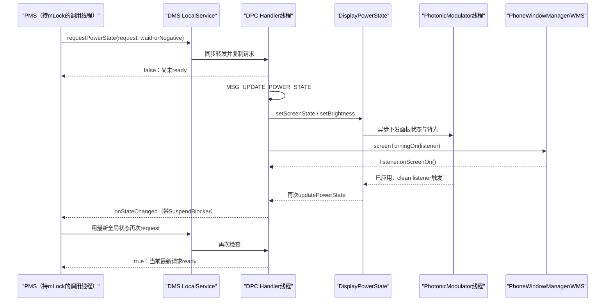
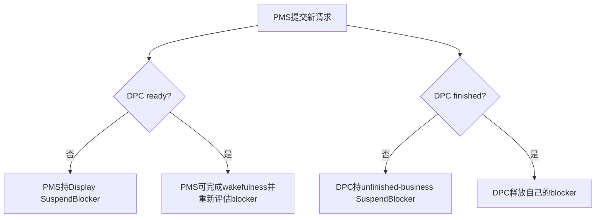
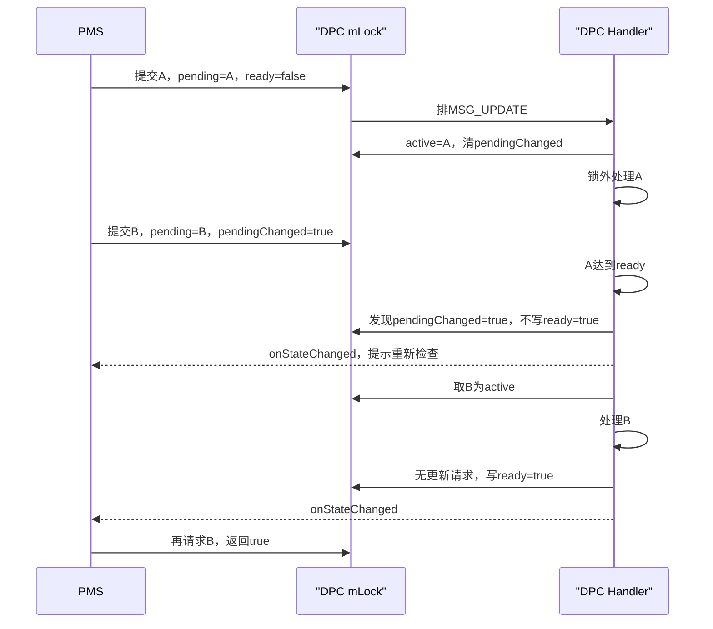

# 154 Android PowerManagerService 与 DisplayPowerController：请求、异步收敛与完成协议

> 源码版本：Android 11 / API 30 / `android-11.0.0_r48`  
> 学习方式：macOS 只读源码，不要求编译、不要求连接设备  
> 前置章节：第 68、69、152、153 章

---

## 1. 本章要解决什么

第 153 章讲到，PowerManagerService（下文简称 PMS）把 wakefulness、WakeLock、用户活动和 Doze 等输入汇总为 `DisplayPowerRequest`，再把它交给显示子系统。

这里马上会出现几个很容易混淆的问题：

1. `requestPowerState()` 返回 `false`，是不是设置失败？
2. 返回 `true` 时，面板亮度是否已经到达目标值？
3. `Display.STATE_ON`、用户已经看见画面、WindowManager 已准备好，是不是同一件事？
4. PMS 和 DisplayPowerController（下文简称 DPC）运行在同一进程，为什么还要复制请求、发消息、回调重试？
5. 新请求在旧请求处理途中到达时，旧请求会不会误报完成？

本章只围绕一条协议展开：

```text
PMS 提交“期望状态”
    ↓
DPC 异步让显示状态逐步收敛
    ↓
DPC 通知“值得重新检查了”
    ↓
PMS 重新提交当前最新请求
    ↓
直到 requestPowerState() 返回 true
```

这不是一次性的命令调用，而是一个“提交—异步工作—唤醒重算—再次确认”的收敛协议。

---

## 2. 先记住核心结论

> `requestPowerState()` 的布尔返回值表示 DPC 是否已经对“当前最新请求”达到重要完成点；`false` 表示还有异步工作，不表示调用失败。DPC 完成关键显示状态、开屏遮罩和绘制提交后回调 PMS，PMS 必须重新计算并再次请求，直到返回 `true`。

另外还要记住：

- `ready` 不等待亮度渐变动画结束；
- `finished` 才表示连亮度渐变也结束；
- DPC 在 `finished` 前用自己的 SuspendBlocker 防止系统睡过去；
- PMS 在 `mDisplayReady == false` 时也持有 Display SuspendBlocker；
- DPC 回调是“请重新检查”，不是把某个最终状态值直接推给 PMS；
- 请求被复制，PMS 可以继续复用自己的可变对象；
- 多次快速请求会合并，DPC 消费的是最新快照；
- 物理面板状态、黑色 ColorFade 遮罩、WindowManager 策略状态是三张不同的账。

---

## 3. 源码地图

```text
frameworks/base/services/core/java/com/android/server/power/
└── PowerManagerService.java

frameworks/base/services/core/java/com/android/server/display/
├── DisplayManagerService.java
├── DisplayPowerController.java
└── DisplayPowerState.java

frameworks/base/core/java/android/hardware/display/
└── DisplayManagerInternal.java

frameworks/base/services/core/java/com/android/server/policy/
└── PhoneWindowManager.java
```

本章涉及的主要对象：

| 对象 | 角色 |
|---|---|
| PMS | 计算全局电源目标，保存 `mDisplayReady` |
| DMS LocalService | PMS 到 DPC 的进程内入口 |
| `DisplayPowerRequest` | 描述显示目标，而不是一条立即执行的硬件命令 |
| DPC | 单线程消费请求，决定状态、亮度、近距和动画 |
| `DisplayPowerState` | 把状态/亮度/ColorFade 变更异步应用出去 |
| `PhotonicModulator` | 独立线程执行可能阻塞的面板状态和背光下发 |
| PhoneWindowManager | 在首次内容绘制、Keyguard 等策略准备后解除开屏遮挡 |

---

## 4. 进程与线程边界

这条链主要位于 `system_server`，但不能因此把它想成同步直线：



需要特别区分：

- PMS 调用 DMS LocalService 是进程内普通 Java 调用；
- DPC 的重活在异步 Handler 上执行；
- 面板状态/背光下发还能转到 `PhotonicModulator` 独立线程；
- WindowManager/Keyguard 的准备过程又通过 listener 异步返回；
- 所以“没有 Binder”不等于“没有并发和完成协议”。

---

## 5. PMS 每次都重新计算请求

`PowerManagerService.updateDisplayPowerStateLocked()` 不是简单地重发旧对象。它会根据最新全局状态重新填写：

```java
mDisplayPowerRequest.policy = getDesiredScreenPolicyLocked();
mDisplayPowerRequest.screenBrightnessOverride = screenBrightnessOverride;
mDisplayPowerRequest.useAutoBrightness = autoBrightness;
mDisplayPowerRequest.useProximitySensor = shouldUseProximitySensorLocked();
mDisplayPowerRequest.boostScreenBrightness = shouldBoostScreenBrightness();

updatePowerRequestFromBatterySaverPolicy(mDisplayPowerRequest);
```

如果 policy 是 DOZE，还会写入 DreamManager 给出的：

```java
mDisplayPowerRequest.dozeScreenState =
        mDozeScreenStateOverrideFromDreamManager;
mDisplayPowerRequest.dozeScreenBrightness =
        mDozeScreenBrightnessOverrideFromDreamManagerFloat;
```

这说明回调后 PMS 必须重新走状态机，因为在 DPC 工作期间，WakeLock、用户活动、Dream、近距或电池策略都可能已经改变。

---

## 6. PMS 的真正提交点

```java
mDisplayReady = mDisplayManagerInternal.requestPowerState(
        mDisplayPowerRequest, mRequestWaitForNegativeProximity);
mRequestWaitForNegativeProximity = false;
```

这里有两个返回通道：

1. 普通返回值写入 `mDisplayReady`；
2. 异步完成后，DPC 再通过 `DisplayPowerCallbacks.onStateChanged()` 通知 PMS。

`mRequestWaitForNegativeProximity` 是一次性触发位。提交后 PMS 立即清成 `false`，但 DPC 内部会把它转移为自己的等待状态，不能理解成“刚请求完马上取消等待”。

---

## 7. `DisplayPowerRequest` 是目标描述，不是硬件寄存器

它包含：

```text
policy                         OFF / DOZE / DIM / BRIGHT / VR
useProximitySensor             是否允许近距临时覆盖屏幕状态
screenBrightnessOverride       WindowManager等提供的亮度覆盖
screenAutoBrightnessAdjustmentOverride
useAutoBrightness
lowPowerMode
screenLowPowerBrightnessFactor
boostScreenBrightness
blockScreenOn
dozeScreenState
dozeScreenBrightness
```

一个 request 同时描述“屏幕大方向”和“影响亮度/近距/Doze 的策略”。DPC 再把这个声明式目标翻译成多个时序动作。

---

## 8. `blockScreenOn` 在 r48 中要谨慎理解

`DisplayPowerRequest` 定义了 `blockScreenOn`，也参加 `copyFrom()` 和 `equals()`，但本版本 DPC 的实际开屏阻塞路径没有读取这个字段。

真正触发 `blockScreenOn()` 的条件是：

```java
if (!isOff && mReportedScreenStateToPolicy
        == REPORTED_TO_POLICY_SCREEN_OFF) {
    setReportedScreenState(REPORTED_TO_POLICY_SCREEN_TURNING_ON);
    if (mPowerState.getColorFadeLevel() == 0.0f) {
        blockScreenOn();
    } else {
        unblockScreenOn();
    }
    mWindowManagerPolicy.screenTurningOn(mPendingScreenOnUnblocker);
}
```

因此阅读字段注释时必须继续查实际引用。字段存在并不保证当前分支真正消费它。

---

## 9. DMS 只是同步转发吗

DMS 的 LocalService：

```java
public boolean requestPowerState(DisplayPowerRequest request,
        boolean waitForNegativeProximity) {
    synchronized (mSyncRoot) {
        return mDisplayPowerController.requestPowerState(
                request, waitForNegativeProximity);
    }
}
```

它做了三件值得注意的事：

- 这是 LocalService，不经过 Binder 序列化；
- 用 DMS 的 `mSyncRoot` 保护 DMS 与显示设备相关状态；
- 它并不在这里完成亮灭屏，只把请求交给 DPC 的线程安全入口。

---

## 10. DPC 为什么必须复制请求

PMS 长期复用同一个 `mDisplayPowerRequest`，下次状态机运行会继续修改字段。如果 DPC 只保存引用，它正在异步处理时就可能看到一半新、一半旧的数据。

DPC 的处理是：

```java
if (mPendingRequestLocked == null) {
    mPendingRequestLocked = new DisplayPowerRequest(request);
    changed = true;
} else if (!mPendingRequestLocked.equals(request)) {
    mPendingRequestLocked.copyFrom(request);
    changed = true;
}
```

复制建立了快照边界：

```text
PMS可变工作对象 ──copy──> DPC待处理快照
```

之后 PMS 可以安全复用原对象。

---

## 11. `equals()` 为什么很重要

DPC 不是每次调用都排新任务。只有 request 字段确实变化，才把 `changed` 设为 `true`。

浮点比较还特意把两个 `NaN` 看成相等：

```java
private boolean floatEquals(float f1, float f2) {
    return f1 == f2 || Float.isNaN(f1) && Float.isNaN(f2);
}
```

因为 `NaN` 在这些字段中表示“没有覆盖值”。若直接用普通 `NaN == NaN`，相同的无覆盖请求会被永远误判为变化，导致无意义更新风暴。

---

## 12. 两份请求：pending 与 active

DPC 至少维护两份关键状态：

| 字段 | 含义 | 访问方式 |
|---|---|---|
| `mPendingRequestLocked` | 调用方最近提交的最新快照 | `mLock` 保护 |
| `mPowerRequest` | Handler 当前消费的工作副本 | DPC Handler 单线程使用 |

可以把它想成邮箱：

```text
PMS不断把“最新地址”写进邮箱 pending
DPC Handler取出一份成为 active 并执行
```

如果 Handler 尚未取件，连续 A→B→C 通常只需要最终消费 C，而不是机械执行三套过时动画。

---

## 13. 请求消息如何合并

```java
private void sendUpdatePowerStateLocked() {
    if (!mPendingUpdatePowerStateLocked) {
        mPendingUpdatePowerStateLocked = true;
        Message msg = mHandler.obtainMessage(MSG_UPDATE_POWER_STATE);
        mHandler.sendMessage(msg);
    }
}
```

两个标记负责两种不同含义：

- `mPendingRequestChangedLocked`：pending 内容比 active 新；
- `mPendingUpdatePowerStateLocked`：队列里已经安排了一次更新。

消息在队列里等待时，新请求仍会覆盖 `mPendingRequestLocked`，但不会重复塞入许多相同消息。Handler 被唤醒后读取的是最后一个快照。

---

## 14. `requestPowerState()` 四种典型返回

| 场景 | changed | `mDisplayReadyLocked` | 返回 |
|---|---:|---:|---:|
| 第一次提交 | true | 被置 false | false |
| 已ready后提交完全相同请求 | false | true | true |
| 上次仍处理中，再提交相同请求 | false | false | false |
| 提交新的不同请求 | true | 被置 false | false |

所以返回 `false` 不是 Java 异常、权限拒绝或硬件错误，只表示调用方要维持保护并等待回调后重试。

接口注释也明确要求：

```text
grab a wake lock, watch for onStateChanged(),
then try the request again later until the state converges
```

---

## 15. Handler 如何接管最新请求

`updatePowerState()` 首先短暂持有 DPC 的 `mLock`：

```java
mPendingUpdatePowerStateLocked = false;
if (mPendingRequestLocked == null) {
    return;
}

if (mPowerRequest == null) {
    mPowerRequest = new DisplayPowerRequest(mPendingRequestLocked);
    updatePendingProximityRequestsLocked();
    mPendingRequestChangedLocked = false;
    mustInitialize = true;
} else if (mPendingRequestChangedLocked) {
    previousPolicy = mPowerRequest.policy;
    mPowerRequest.copyFrom(mPendingRequestLocked);
    updatePendingProximityRequestsLocked();
    mPendingRequestChangedLocked = false;
    mDisplayReadyLocked = false;
}

mustNotify = !mDisplayReadyLocked;
```

然后释放锁，在 Handler 单线程上执行较重的传感器、动画、亮度计算和状态下发。

这是一种常见系统服务结构：

```text
锁内：交换快照、修改标记
锁外：执行耗时状态机
```

---

## 16. 为什么 Handler 使用 async 消息

`DisplayControllerHandler` 构造时传入：

```java
super(looper, null, true /* async */);
```

异步消息可以越过 Looper 的同步屏障。显示电源状态不能因为 UI/绘制同步屏障长期得不到处理。

但 async 不是“开了新线程”。它仍在该 Handler 所属 Looper 上串行执行。

---

## 17. policy 先映射成基础 Display state

```text
POLICY_OFF     → STATE_OFF
POLICY_DOZE    → dozeScreenState，未指定则STATE_DOZE
POLICY_VR      → STATE_VR
POLICY_DIM     → STATE_ON
POLICY_BRIGHT  → STATE_ON
```

DIM 和 BRIGHT 的基础物理 state 都是 ON，差异主要体现在后续亮度计算。

这再次说明：

```text
DisplayPowerRequest.policy ≠ Display.STATE_*
```

---

## 18. 近距传感器可以覆盖基础 state

即使 policy 想要 ON，只要允许近距传感器且传感器为 near，DPC 就会：

```java
mScreenOffBecauseOfProximity = true;
sendOnProximityPositiveWithWakelock();
...
if (mScreenOffBecauseOfProximity) {
    state = Display.STATE_OFF;
}
```

此时可能同时成立：

```text
PMS wakefulness = AWAKE
DisplayPowerRequest.policy = BRIGHT
实际目标 Display state = OFF
```

电话贴耳灭屏就是典型反例。

---

## 19. `waitForNegativeProximity` 是一次性命令，不是普通字段

DPC 接收时只会把等待位“置上”：

```java
if (waitForNegativeProximity
        && !mPendingWaitForNegativeProximityLocked) {
    mPendingWaitForNegativeProximityLocked = true;
    changed = true;
}
```

Handler 消费时：

```java
mWaitingForNegativeProximity |=
        mPendingWaitForNegativeProximityLocked;
mPendingWaitForNegativeProximityLocked = false;
```

这像一个边沿触发命令：PMS 下一次传 `false` 不会直接把 DPC 已建立的等待取消。等待会在远离、关闭传感器或 ignore 条件下按 DPC 状态机清理。

---

## 20. desired state 与 actual working state

DPC 先算出目标，再调用：

```java
final int oldState = mPowerState.getScreenState();
animateScreenStateChange(state, performScreenOffTransition);
state = mPowerState.getScreenState();
```

第二次赋值非常关键。动画可能正在进行，也可能因为开屏被 WindowManager 阻塞，所以后续亮度逻辑必须使用 `DisplayPowerState` 当前接受的状态，而不能继续假定目标已经实现。

---

## 21. 开屏为什么需要黑色遮罩

物理面板可以先进入 ON，但 Keyguard、启动窗口或 App 首帧可能还没准备好。如果立即让用户看见，可能出现旧画面、空白窗口或未完成布局。

DPC 的做法不是一定延迟面板通电，而是让 ColorFade 的黑色表面继续盖住内容：

```text
面板可能已经ON
    +
ColorFade level仍为0，画面被黑色表面盖住
    +
WindowManager等待Keyguard/窗口绘制
    ↓
listener.onScreenOn()
    ↓
DPC移除阻塞，继续状态机
```

所以“screen on blocked”更准确地说是“可见内容被阻塞”。

---

## 22. ScreenOnUnblocker 的对象身份是代际令牌

创建阻塞：

```java
mPendingScreenOnUnblocker = new ScreenOnUnblocker();
mWindowManagerPolicy.screenTurningOn(mPendingScreenOnUnblocker);
```

回调不会直接修改 DPC 状态，而是投消息：

```java
public void onScreenOn() {
    Message msg = mHandler.obtainMessage(
            MSG_SCREEN_ON_UNBLOCKED, this);
    mHandler.sendMessage(msg);
}
```

Handler 再检查对象身份：

```java
if (mPendingScreenOnUnblocker == msg.obj) {
    unblockScreenOn();
    updatePowerState();
}
```

若旧回调晚到，而系统已经进入下一代开屏流程，对象不相同，旧回调就不会解除新阻塞。

---

## 23. PhoneWindowManager 如何保证回调最终到来

`screenTurningOn()` 会等待 Keyguard 和窗口绘制。Android 11 中：

```java
static final int WAITING_FOR_DRAWN_TIMEOUT = 1000;
```

Keyguard 绘制超时则依据启动阶段取 1 秒或 5 秒。最终 `finishScreenTurningOn()` 调用：

```java
final ScreenOnListener listener =
        mDefaultDisplayPolicy.getScreenOnListener();
...
if (listener != null) {
    listener.onScreenOn();
}
```

DPC 自身的 unblocker 没有独立超时；超时兜底主要位于 WindowManager/Policy 的准备流程。

---

## 24. r48 的 ScreenOffUnblocker 容易读错

关屏时源码先：

```java
blockScreenOff();
mWindowManagerPolicy.screenTurningOff(mPendingScreenOffUnblocker);
unblockScreenOff();
```

也就是把 listener 交给 policy 后立刻清除 pending blocker。本版本正常路径并不真正等待异步 `onScreenOff()` 才继续关屏。

因此不能仅凭类名和 `MSG_SCREEN_OFF_UNBLOCKED` 就断言“关屏一定被 WindowManager 异步阻塞”。源码保留了回调结构，但 r48 主路径立即 unblock；迟到回调也会因为对象身份不再匹配而被忽略。

---

## 25. policy reported state 是第三张账

DPC 还维护：

```text
REPORTED_TO_POLICY_SCREEN_OFF
REPORTED_TO_POLICY_SCREEN_TURNING_ON
REPORTED_TO_POLICY_SCREEN_ON
REPORTED_TO_POLICY_SCREEN_TURNING_OFF
```

它表达“已经怎样通知 WindowManagerPolicy”，不是 `Display.STATE_*` 的复制。

若 turning off 期间又要转 on，代码仍补齐：

```text
ON → TURNING_OFF → OFF通知 → TURNING_ON
```

这样 Policy 收到的是完整、有序的生命周期，而不是突然从 turning-off 跳回 on。

---

## 26. 近距灭屏为什么不走普通 Policy 关屏通知

`setScreenState()` 多处检查：

```java
!mScreenOffBecauseOfProximity
```

贴耳造成的临时物理 OFF 不会像电源键熄屏那样完整通知 `screenTurningOff()` / `screenTurnedOff()`。

这样 Keyguard 和交互生命周期不会因为短暂近距遮挡被当成真正睡眠。用户移开手机时也无需重新建立完整开屏策略周期。

---

## 27. `DisplayPowerState` 是异步应用层

DPC 调用：

```java
mPowerState.setScreenState(state);
mPowerState.setScreenBrightness(brightness);
```

并不代表硬件已经改变。setter 会把 `mScreenReady` 置为 `false` 并安排更新：

```java
mScreenState = state;
mScreenReady = false;
scheduleScreenUpdate();
```

`DisplayPowerState` 的注释把自己类比成 View：属性先失效，再在合适时机统一应用。

---

## 28. `waitUntilClean()` 到底等什么

```java
public boolean waitUntilClean(Runnable listener) {
    if (!mScreenReady || !mColorFadeReady) {
        mCleanListener = listener;
        return false;
    } else {
        mCleanListener = null;
        return true;
    }
}
```

clean 只证明两组失效属性已经应用：

- `mScreenReady`：需要等待的面板 **state 变化**已经完成；它不会单独等待背光变化完成；
- `mColorFadeReady`：ColorFade 当前帧绘制完成。

它不是“应用所有窗口都完成绘制”，后者由 ScreenOnUnblocker 单独表达；也不是“亮度 ramp 已到终点”，后者由 RampAnimator 单独表达。

---

## 29. clean listener 为什么只有一个

注释明确写着，新 listener 会覆盖旧 listener：

```text
The listener always overrides any previously set listener.
```

DPC 不把每次等待保存成独立 Promise。它只需要在状态变 clean 时重新运行一次全局状态机；状态机届时会重新查看最新 request。

这与请求合并是同一种“按最新事实收敛”的设计。

---

## 30. PhotonicModulator 为什么是独立线程

`DisplayPowerState` 的 Handler 先把 pending state/brightness 交给 `PhotonicModulator`。后者独立运行，因为 blank/unblank 或背光下发可能阻塞，不能卡住 DPC Looper。

简化为：

```text
DPC Handler
  └─ 修改DisplayPowerState期望属性
       └─ DisplayPowerState Handler合并更新
            └─ PhotonicModulator线程执行DisplayBlanker
```

`PhotonicModulator.setState()` 的返回值是：

```java
return !mStateChangeInProgress;
```

注意它只等待 **state change**，没有把 `mBacklightChangeInProgress` 放入返回条件：

- state 仍在变化：返回 `false`，`mScreenReady` 继续为 false；
- state 已完成：独立线程再次 post screen update，最终触发 clean listener；
- 只有 brightness 变化：即使背光下发还在途，也可以返回 `true`。

这不是疏漏，而是 ready 不等待最终亮度的另一层实现证据。背光渐变和剩余工作由 RampAnimator、`finished` 与 DPC 的 unfinished-business blocker 继续管理。

下一章会继续深入这条底层下发链。

---

## 31. ColorFade 不是面板亮度

ColorFade level 常见语义：

```text
0.0：黑色效果完全覆盖内容
1.0：内容完全可见
中间：转场动画
```

实际交给 PhotonicModulator 的背光还受它影响：

```java
float brightnessState = mScreenState != Display.STATE_OFF
        && mColorFadeLevel > 0f
        ? mScreenBrightness
        : PowerManager.BRIGHTNESS_OFF_FLOAT;
```

所以“面板 state=ON”和“用户已看见内容”依然可以分离。

---

## 32. 亮度决策的主要覆盖顺序

DPC 在一次 `updatePowerState()` 中按代码顺序不断改写 `brightnessState`。简化后的覆盖顺序是：

1. 当前 screen state 为 OFF 时先写入 off brightness；
2. VR 使用 VR 亮度；
3. 仅当当前值还是 `NaN` 时，采用 request 的 screen brightness override；
4. 有效 temporary brightness 会直接覆盖前面结果；
5. boost 在此时的值不是 off 时再覆盖成最大值；
6. 尚无值时尝试自动亮度；
7. Doze 无值时用 Doze 默认值；
8. 再无值时用手动设置；
9. DIM 对基础结果做减亮 modifier；
10. low power 对结果乘缩放因子。

注意两层边界：

- temporary brightness 的代码位置晚于普通 override，因此有效 temporary 值可以覆盖它；不能只凭前面的英文注释猜优先级；
- 即使 OFF 后 `brightnessState` 又被 temporary/boost 改写，`DisplayPowerState` 最终仍用 `mScreenState != OFF` 作为有效背光门，物理 OFF 不会因此被点亮。这里要区分“亮度决策变量”与“最终有效背光”。

---

## 33. 目标亮度通常不是一步跳到

正常可见场景会调用 RampAnimator：

```java
animateScreenBrightness(animateValue,
        slowChange ? mBrightnessRampRateSlow
                   : mBrightnessRampRateFast);
```

以下场景常选择最小动画率，相当于快速跳变：

- 初次亮屏跳过 ramp；
- Doze brightness buckets；
- 进入或离开 VR；
- 内容还被 ColorFade 覆盖；
- 临时亮度或临时自动亮度调整。

自动亮度在稳定适应时可走 slow rate，其他显著改变走 fast rate。

---

## 34. `ready` 的精确定义

源码：

```java
final boolean ready = mPendingScreenOnUnblocker == null
        && (!mColorFadeEnabled
            || (!mColorFadeOnAnimator.isStarted()
                && !mColorFadeOffAnimator.isStarted()))
        && mPowerState.waitUntilClean(mCleanListener);
```

因此 ready 同时要求：

```text
没有等待WindowManager解除的开屏阻塞
AND ColorFade开/关动画没有运行
AND DisplayPowerState的screen与color fade属性已clean
```

它没有要求亮度 ramp 停止。

---

## 35. `finished` 比 ready 多一层

```java
final boolean finished = ready
        && !mScreenBrightnessRampAnimator.isAnimating();
```

对比表：

| 状态 | 证明什么 | 不证明什么 |
|---|---|---|
| request 已接收 | 最新快照已进入 pending | Handler 已处理 |
| `ready` | 关键电源状态、开屏策略、ColorFade 和 DPS 提交已收敛 | 亮度已到最终值 |
| `finished` | `ready` 且亮度渐变停止 | 全系统再无其他工作 |

本章最重要的阅读习惯，就是每次看到“ready/finished”都问：它由哪些布尔条件组成？

---

## 36. 为什么 ready 不等待亮度渐变

源码注释直接说明：

```text
we do not wait for the brightness ramp animation to complete
before reporting the display is ready
```

只要屏幕已经处于正确 power state，亮度可以继续平滑逼近目标。若 PMS 等整个 ramp 才完成 wakefulness 转换，会人为拉长开关屏关键路径。

这体现了“用户可用完成点”和“视觉效果完全结束点”的分层。

---

## 37. DPC 的 unfinished-business SuspendBlocker

```java
if (!finished && !mUnfinishedBusiness) {
    mCallbacks.acquireSuspendBlocker();
    mUnfinishedBusiness = true;
}
...
if (finished && mUnfinishedBusiness) {
    mUnfinishedBusiness = false;
    mCallbacks.releaseSuspendBlocker();
}
```

DPC 在包括亮度 ramp 在内的工作未完成时持有 SuspendBlocker。即使已经向 PMS 报告 ready，它也能继续保护自己的剩余动画。

---

## 38. PMS 还有一层 Display SuspendBlocker

PMS 的判断首先是：

```java
if (!mDisplayReady) {
    return true;
}
```

也就是 DPC 尚未 ready 时，PMS 必须持有 Display SuspendBlocker。若 request 是 BRIGHT/DIM，通常屏幕亮着也继续需要它；近距灭屏且设备配置允许传感器作为唤醒源时，才可能释放。

两层保护分工：



它们可能重叠，但保护的是不同层级的未完成工作。

---

## 39. 回调本身也受 SuspendBlocker 保护

DPC 通知 PMS 时：

```java
private void sendOnStateChangedWithWakelock() {
    mCallbacks.acquireSuspendBlocker();
    mHandler.post(mOnStateChangedRunnable);
}

private final Runnable mOnStateChangedRunnable = () -> {
    mCallbacks.onStateChanged();
    mCallbacks.releaseSuspendBlocker();
};
```

这样系统不会在“决定通知”和“PMS 真正收到通知”之间 suspend，造成完成信号丢在半路。

这里名字叫 `WithWakelock`，实际用的是 system_server 内部 SuspendBlocker，不是应用层 `PowerManager.WakeLock` 对象。

---

## 40. DPC 何时把 `mDisplayReadyLocked` 置 true

```java
if (ready && mustNotify) {
    synchronized (mLock) {
        if (!mPendingRequestChangedLocked) {
            mDisplayReadyLocked = true;
        }
    }
    sendOnStateChangedWithWakelock();
}
```

关键是：

```java
if (!mPendingRequestChangedLocked)
```

Handler 处理旧 active request 时，新 pending request 可能已到达。此时旧一代即使 ready，也不能把“最新请求 ready”置为 true。

---

## 41. 旧一代为何仍可能发回调

即使发现有更新 pending，源码仍会执行 `sendOnStateChangedWithWakelock()`。

这不是把新请求误报为完成，因为 ready 标记没有置 true。它只是多唤醒 PMS 一次：

```text
旧一代达到完成点
新一代已经pending
旧一代不能提交ready=true
但回调PMS重新检查
PMS再次提交/查询最新状态 → 仍得到false
DPC继续消费新一代
```

回调是“状态可能有进展”，而不是携带严格代际的完成凭证。

---

## 42. 新请求覆盖旧请求的竞态推演



这套协议不用给每个 request 分配显式 generation number，也能避免旧结果覆盖新目标。

---

## 43. PMS 收到回调后不直接信任

```java
public void onStateChanged() {
    synchronized (mLock) {
        mDirty |= DIRTY_ACTUAL_DISPLAY_POWER_STATE_UPDATED;
        updatePowerStateLocked();
    }
}
```

回调只设置 dirty bit，然后重新运行 PMS 中心状态机。PMS 会重新计算 wakefulness、WakeLock summary、用户活动、Dream 和 request。

这是“level-triggered reconciliation（按当前事实重算）”，而不是“edge-triggered completion（收到一次事件就无条件宣布结束）”。

---

## 44. `displayBecameReady` 只检测 false→true

PMS 保存旧值：

```java
final boolean oldDisplayReady = mDisplayReady;
...
return mDisplayReady && !oldDisplayReady;
```

这个返回值用于后续 Dream 状态更新，表示本轮是否发生 ready 上升沿。持续为 true 的相同请求不会反复触发“became ready”。

但 `mDisplayReady` 本身仍参与 finish wakefulness 和 SuspendBlocker 判断。

---

## 45. wakefulness 何时允许正式完成

```java
if (mWakefulnessChanging && mDisplayReady) {
    if (getWakefulnessLocked() == WAKEFULNESS_DOZING
            && (mWakeLockSummary & WAKE_LOCK_DOZE) == 0) {
        return;
    }
    mWakefulnessChanging = false;
    mNotifier.onWakefulnessChangeFinished();
}
```

一般状态等待 display ready；DOZING 还要等待 Doze 组件持有 DOZE WakeLock。

因此：

```text
raw wakefulness已改变
≠ display request已ready
≠ wakefulness change已finish
≠ brightness ramp已finished
```

---

## 46. 开屏 ready 后 Policy 还收到什么

当 ready、state 非 OFF，且 policy reported state 为 TURNING_ON：

```java
setReportedScreenState(REPORTED_TO_POLICY_SCREEN_ON);
mWindowManagerPolicy.screenTurnedOn();
```

也就是说：

1. `screenTurningOn(listener)` 发起准备；
2. listener 回来，DPC 再跑状态机；
3. ready 成立后，才发送 `screenTurnedOn()`。

turning 与 turned 是两种不同通知，不要在日志里混为一条。

---

## 47. 一个正常亮屏的完整推演

假设设备从 ASLEEP 被电源键唤醒：

1. PMS 先把 raw wakefulness 改为 AWAKE；
2. dirty 状态机计算 BRIGHT request；
3. DPC 复制 request，返回 false；
4. PMS 保持 Display SuspendBlocker，wakefulness 仍 changing；
5. DPC Handler 把目标映射为 STATE_ON；
6. 若黑色 ColorFade 覆盖内容，创建 ScreenOnUnblocker；
7. PhoneWindowManager 等 Keyguard/窗口绘制；
8. 面板和背光异步下发，DisplayPowerState 等待 clean；
9. WindowManager listener 返回，DPC 解除开屏阻塞；
10. ColorFade 动画结束、DPS clean，`ready=true`；
11. DPC 将 ready flag 置 true，并带 blocker 回调 PMS；
12. PMS 用最新状态再次提交相同 request，得到 true；
13. PMS 允许 wakefulness change 完成并重评 SuspendBlocker；
14. 若亮度仍在 ramp，DPC 自己继续持 blocker；
15. ramp 结束触发再次 update，`finished=true` 后释放 DPC blocker。

---

## 48. 一个中途反转的推演

假设开屏尚未完成，用户又立刻按电源键：

```text
A：BRIGHT正在等待WindowManager
B：PMS提交OFF并覆盖pending
DPC旧轮A可能仍触发一次回调
但pendingChanged使A不能写ready=true
DPC消费B，取消/补齐策略通知并转关屏
PMS重算时看的是最新OFF，不会完成过时的开屏目标
```

这就是为什么代码更重视“最新目标是否收敛”，而不是保证每个中间命令都完整执行。

---

## 49. 一个近距灭屏的推演

电话通话中：

1. request 仍可能是 BRIGHT；
2. `useProximitySensor=true`；
3. near 使 DPC 把目标 state 覆盖成 OFF；
4. DPC 用带 blocker 的 proximity callback 通知 PMS；
5. PMS 记录 `mProximityPositive=true`；
6. 配置允许时，PMS 即使 request bright 也可能释放 Display SuspendBlocker；
7. WindowManager 不收到普通睡眠式完整 screen-off 生命周期；
8. far 后 DPC 恢复显示并发送 negative callback。

所以日志中看到 policy=BRIGHT 与 physical state=OFF 同时出现，并不矛盾。

---

## 50. 常见误解纠正

### 误解一：false 就是显示设置失败

错。它表示还有重要异步改变，调用方要等待回调并重试。

### 误解二：true 表示亮度已经完全到位

错。ready 明确不等待 brightness ramp。

### 误解三：DPC 回调一次后 PMS 直接设 true

错。PMS 设置 dirty bit并重新请求，布尔值仍由 DPC 当前状态返回。

### 误解四：同进程调用不用复制对象

错。正因为是共享堆对象且异步处理，更要防止可变别名。

### 误解五：每次请求对应一个消息

错。pending 快照和 update message 都会合并。

### 误解六：面板 ON 就等于用户看见画面

错。ColorFade 黑色表面和 WindowManager 准备可以继续阻挡可见内容。

### 误解七：开屏和关屏都异步等待 Policy listener

错。r48 开屏确实等待；关屏主路径调用 listener 后立即 unblock。

---

## 51. 诊断时应该同时看哪些字段

`dumpsys power` 重点：

```text
mWakefulness
mWakefulnessChanging
mDisplayReady
mDisplayPowerRequest
mRequestWaitForNegativeProximity
mProximityPositive
mHoldingDisplaySuspendBlocker
```

`dumpsys display` 的 DPC/DisplayPowerState 重点：

```text
mPendingRequestLocked
mPendingRequestChangedLocked
mDisplayReadyLocked
mPowerRequest
mWaitingForNegativeProximity
mScreenOffBecauseOfProximity
mPendingScreenOnUnblocker
mReportedScreenStateToPolicy
mPendingScreenOff
mUnfinishedBusiness
mScreenState / mScreenBrightness
mScreenReady / mColorFadeReady
PhotonicModulator pending/actual state
```

不能只截取一边。PMS 的 request 和 DPC 的 active/pending 可能正处在不同代际。

---

## 52. 卡在 `mDisplayReady=false` 的排查树

```text
1. DPC是否收到最新request？
   ├─ pendingRequestChanged=true：Handler是否拥堵
   └─ active request是否正确

2. pendingScreenOnUnblocker是否非null？
   ├─ 是：查PhoneWindowManager、Keyguard、waitForAllWindowsDrawn
   └─ 否：继续

3. ColorFade animator是否仍started？
   ├─ 是：查动画结束回调是否再次sendUpdate
   └─ 否：继续

4. DisplayPowerState是否clean？
   ├─ mScreenReady=false：查PhotonicModulator/DisplayBlanker
   └─ mColorFadeReady=false：查Choreographer绘制

5. ready已成立但PMS没收敛？
   ├─ 查onStateChanged runnable和SuspendBlocker
   ├─ 查PMS mLock/主状态机是否长时间阻塞
   └─ 查是否有更新request使旧一代不能提交ready
```

---

## 53. `mUnfinishedBusiness=true` 不等于故障

它常常只表示 brightness ramp 正常运行。必须结合：

```text
ready=true + rampAnimating=true + unfinishedBusiness=true
```

这可以是完全健康的中间态。

真正异常通常是长时间不结束，并且没有新的 request、动画回调或 clean 进展。

---

## 54. Handler 拥堵会出现什么表象

若 DPC Handler 长时间得不到执行：

- pending request 已更新；
- `mPendingUpdatePowerStateLocked=true`；
- `mDisplayReadyLocked=false`；
- PMS 继续持 Display SuspendBlocker；
- 表面上像“亮屏慢”或“关屏不完成”；
- CPU 不一定 suspend，因为保护仍在。

这与硬件下发慢不同。前者 active request 可能还没切换，后者常表现为 DPS `mScreenReady=false` 或 PhotonicModulator change in progress。

---

## 55. 为什么使用回调重试而不是阻塞等待

如果 PMS 在持有 `mLock` 时同步等待 DPC、WindowManager、绘制和面板下发：

- system_server 全局电源锁会被长时间占用；
- WindowManager 回调可能反向依赖 PMS；
- 传感器和动画事件无法推进；
- 很容易形成死锁或严重时延。

现在的协议把等待变成状态：

```text
返回false → 保存“未ready”事实 → 释放调用栈
异步事件推进 → 回调设置dirty → 重新计算
```

这是 Android Framework 状态机中非常通用的设计。

---

## 56. 这套设计的三个通用模式

### 56.1 可变输入先复制

异步消费者不持有调用方可变对象引用。

### 56.2 事件只负责唤醒，状态负责真相

回调不携带最终裁决；重新读取最新共享状态。

### 56.3 完成点分层

ready、finished、wakefulness finished 各自服务于不同调用者和时延目标。

读 JobScheduler、Alarm、Activity 启动或窗口绘制时，也会反复遇到这三种模式。

---

## 57. macOS 只读练习一：定位整个握手

```bash
cd /Users/ninebot/androidSource

rg -n "updateDisplayPowerStateLocked|requestPowerState|onStateChanged" \
  frameworks/base/services/core/java/com/android/server/power/PowerManagerService.java \
  frameworks/base/services/core/java/com/android/server/display/DisplayManagerService.java \
  frameworks/base/services/core/java/com/android/server/display/DisplayPowerController.java
```

回答：

1. 哪一步是同步返回？
2. 哪一步只是投递 Handler 消息？
3. 哪一步把 PMS 重新带回中心状态机？

---

## 58. macOS 只读练习二：证明请求被复制

```bash
sed -n '625,665p' \
  frameworks/base/services/core/java/com/android/server/display/DisplayPowerController.java

sed -n '350,405p' \
  frameworks/base/core/java/android/hardware/display/DisplayManagerInternal.java
```

列出 `copyFrom()` 与 `equals()` 的字段，并检查是否完全对应。再搜索字段的真实消费者，尤其是 `blockScreenOn`。

---

## 59. macOS 只读练习三：自己写 ready 公式

```bash
sed -n '1135,1190p' \
  frameworks/base/services/core/java/com/android/server/display/DisplayPowerController.java

sed -n '245,265p' \
  frameworks/base/services/core/java/com/android/server/display/DisplayPowerState.java
```

不要照抄变量名，用自己的话写出：

```text
ready = ? AND ? AND ?
finished = ready AND ?
```

然后解释为什么 brightness ramp 不属于 ready。

---

## 60. macOS 只读练习四：检查旧回调防护

```bash
sed -n '1988,2010p' \
  frameworks/base/services/core/java/com/android/server/display/DisplayPowerController.java

sed -n '2050,2075p' \
  frameworks/base/services/core/java/com/android/server/display/DisplayPowerController.java
```

找出 `msg.obj` 与 pending unblocker 的身份比较，并推演旧 listener 晚到时为什么不能解除新一代阻塞。

---

## 61. macOS 只读练习五：比较 on/off blocker

```bash
sed -n '1260,1340p' \
  frameworks/base/services/core/java/com/android/server/display/DisplayPowerController.java
```

回答：

- screen-on blocker 什么时候解除？
- screen-off blocker 在 r48 主路径中等待了吗？
- proximity OFF 为什么绕过普通 policy 通知？

---

## 62. 建议手画的四张账

拿一张纸画四列：

| 时刻 | PMS request policy | DPS screen state | policy reported state | 可见性/亮度 |
|---|---|---|---|---|
| t0 | OFF | OFF | OFF | 黑 |
| t1 | BRIGHT | ON或待ON | TURNING_ON | ColorFade仍黑 |
| t2 | BRIGHT | ON | TURNING_ON | WMS等待绘制 |
| t3 | BRIGHT | ON | ON | 内容可见、亮度ramp |
| t4 | BRIGHT | ON | ON | 亮度到目标 |

只要能解释 t1～t4 为什么不是一个瞬间，本章就掌握了大半。

---

## 63. 复读审计：容易产生歧义的地方

### 63.1 “actual state”不能说得过头

`mPowerState.getScreenState()` 是 DisplayPowerState 接受的工作状态；真正底层是否完成还要看 `mScreenReady` 和 PhotonicModulator actual state。因此本文称它为“当前接受/工作状态”，没有直接等同硬件最终状态。

### 63.2 ready 不是所有视觉效果结束

本文单独保留 `finished`，避免把 brightness ramp 塞进 ready。

### 63.3 回调不是完成凭证

旧一代 ready 时即便有新 pending，仍可能回调，所以本文统一表述为“重新检查提示”。

### 63.4 screen-off listener 在不同版本可能变化

本文只针对 `android-11.0.0_r48`，并依据同一函数中紧邻的 `unblockScreenOff()` 得出结论，不外推到所有 Android 版本。

### 63.5 `blockScreenOn` 字段与实际路径分开

字段参加请求复制/比较，不代表 r48 DPC 读取它决定阻塞。本文已按引用搜索修正。

### 63.6 clean 的范围有限

clean 只看 DPS 的 screen/color-fade invalidation，不替代 WindowManager drawn、亮度 ramp 或 PMS wakefulness finish。尤其 `mScreenReady` 等待的是 state change，不能扩大解释成“背光 actual 值也已经完成”。

---

## 64. 本章源码阅读检查表

- [ ] 能解释 `false` 为什么不是失败
- [ ] 能说出 pending request 与 active request 的区别
- [ ] 能解释为什么必须 `copyFrom()`
- [ ] 能解释 `NaN` 的特殊相等比较
- [ ] 能画出消息合并过程
- [ ] 能区分 desired state 与 DPS 当前工作 state
- [ ] 能解释 ScreenOnUnblocker 的身份校验
- [ ] 知道 r48 ScreenOffUnblocker 会立即解除
- [ ] 能写出 ready 的三个条件
- [ ] 能解释 finished 比 ready 多什么
- [ ] 能区分 PMS 和 DPC 两层 SuspendBlocker
- [ ] 能解释旧请求为什么不能覆盖新请求的 ready
- [ ] 能解释 DPC 回调为何只设置 dirty bit
- [ ] 能区分 wakefulness finished 与 brightness finished

---

## 65. 面试式自测题

### 题一

PMS 连续提交 A、B、C，Handler 只收到一个 update message，会丢请求吗？

答：会丢弃不再有意义的中间动作，但不会丢最新目标。pending 快照被覆盖为 C，状态机按 C 收敛，这是有意合并。

### 题二

DPC 回调 PMS 时 `mDisplayReadyLocked` 一定是 true 吗？

答：不一定。旧 active request ready，但新 pending 已到达时，DPC 不会写 true，却仍可能发回调促使 PMS 重检。

### 题三

为什么已经 ready 还要保留 DPC SuspendBlocker？

答：亮度 ramp 可以尚未完成；`finished = ready && !rampAnimating`。

### 题四

为什么开屏 listener 需要对象身份检查？

答：防止旧一代异步回调误解除新一代开屏阻塞。

### 题五

policy=BRIGHT 时 Display.STATE_OFF 是 bug 吗？

答：不一定，近距传感器可以临时覆盖 state 为 OFF。

### 题六

`DisplayPowerState.waitUntilClean()` 为 true，是否代表 Keyguard 绘制完成？

答：不代表。Keyguard/窗口准备由 ScreenOnUnblocker 独立表达。

---

## 66. 本章总结

把整章压缩成一段话：

> PMS 在锁内不断根据最新全局电源事实构造并复用 `DisplayPowerRequest`；DMS LocalService 把它同步交给 DPC，DPC 在自己的锁内复制到 pending 快照、合并更新消息，再由异步 Handler 把最新快照变成 active request，处理 policy、近距、状态动画和亮度。DisplayPowerState 继续异步应用面板/背光和 ColorFade，WindowManager 通过 ScreenOnUnblocker 保证关键内容准备。DPC 的 ready 只等待开屏阻塞、ColorFade 动画和 DPS clean，不等待亮度 ramp；finished 才连 ramp 一起结束。异步进展通过带 SuspendBlocker 的回调把 PMS 唤醒，PMS 不盲信回调，而是设置 dirty bit、重新计算并再次 request。若新请求已到，旧一代不能写 ready=true。整个系统依靠“最新状态快照 + 幂等重算 + 分层完成点”最终收敛。

下一章继续深入 `DisplayPowerState`、`PhotonicModulator`、`DisplayBlanker` 与 SurfaceControl，看看 `mScreenReady` 背后究竟如何把状态和背光下发到更底层。
