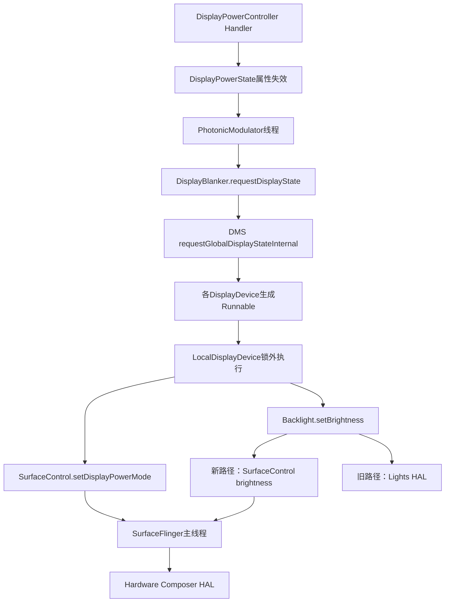
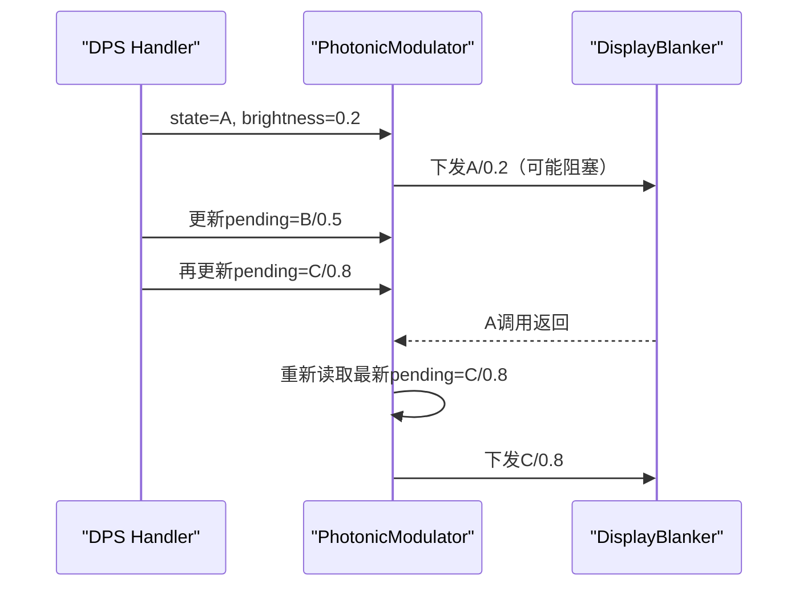
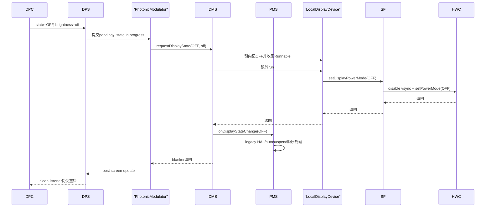

# 155 Android DisplayPowerState、PhotonicModulator 与底层屏幕状态下发

> 源码版本：Android 11 / API 30 / `android-11.0.0_r48`  
> 学习方式：macOS 只读源码，不要求编译、不要求连接设备  
> 前置章节：第 67、68、154 章

---

## 1. 本章继续追什么

第 154 章停在：

```text
DisplayPowerController
  → DisplayPowerState.setScreenState/setScreenBrightness
  → waitUntilClean()
```

本章继续向下追：

```text
DisplayPowerState
→ PhotonicModulator
→ DisplayBlanker
→ DisplayManagerService全局显示状态
→ LocalDisplayDevice
→ SurfaceControl / LightsService
→ SurfaceFlinger
→ Hardware Composer或Lights HAL
```

重点不是背 API，而是理解三件事：

1. 为什么状态下发要经过两次“先记账、后执行”；
2. `mScreenReady`、`mActualState` 和真实硬件完成分别证明什么；
3. power mode 与 brightness 为什么走两条可能不同的底层路径。

---

## 2. 本章核心结论

> `DisplayPowerState` 先在 DPC Looper 上记录目标并失效，再让 `PhotonicModulator` 独立线程调用 DMS 的 `DisplayBlanker`；DMS 在锁内把默认屏控制结果写成全局显示状态、为每个可 blank 的 DisplayDevice 生成 Runnable，随后锁外执行。LocalDisplayDevice 将 power state 经 SurfaceControl 同步送到 SurfaceFlinger/HWC，而亮度经默认屏 Backlight 对象选择 SurfaceFlinger/HWC brightness 或 Lights HAL。整个链条的 ready 主要等待状态调用返回，不等于面板提供了硬件完成 fence，也不单独等待每次背光写完成。

---

## 3. 全链路线图



这里至少跨越：

- system_server 的 DPC Looper；
- system_server 的 `PhotonicModulator` Java Thread；
- SurfaceFlinger Binder 线程和主线程；
- vendor HWC 或 Lights HAL 服务。

---

## 4. DisplayPowerState 为什么像一个 View

类注释把它类比成 View：属性改变时先 invalid，再通过异步回调统一 apply。

它管理两组属性：

| 属性组 | 关键字段 | 应用位置 |
|---|---|---|
| screen | `mScreenState`、`mScreenBrightness` | Handler + PhotonicModulator |
| color fade | prepared、level | Choreographer traversal callback |

多个属性可以在真正下发前被继续覆盖，减少重复工作，并让动画框架按帧更新。

---

## 5. 构造时并不知道真实亮度

```java
mScreenState = Display.STATE_ON;
mScreenBrightness = PowerManager.BRIGHTNESS_MAX;
scheduleScreenUpdate();
```

注释说明启动时假设屏幕 ON，但不知道 bootloader 留下的亮度。先放一个最大值占位，DPC 会在真正应用前迅速改成计算出的亮度。

这是软件初始模型，不是从硬件读回的事实。

---

## 6. 设置 screen state 只会先失效

```java
public void setScreenState(int state) {
    if (mScreenState != state) {
        mScreenState = state;
        mScreenReady = false;
        scheduleScreenUpdate();
    }
}
```

此时只完成：

```text
目标字段更新 + ready失效 + Runnable排队
```

还没进入 SurfaceFlinger，更没到 HWC。

---

## 7. 设置 brightness 的失效条件不同

```java
mScreenBrightness = brightness;
if (mScreenState != Display.STATE_OFF) {
    mScreenReady = false;
    scheduleScreenUpdate();
}
```

屏幕 OFF 时仍保存新 brightness，但不立即下发。以后开屏时会把最新亮度一起带下去。

这避免在物理 OFF 状态下做没有可见意义的背光更新。

---

## 8. ColorFade level 影响两条链

修改 level 时：

- 屏幕非 OFF：screen 属性失效，因为有效背光可能变化；
- ColorFade 已 prepare：fade 绘制失效，安排 Choreographer 回调。

也就是说 ColorFade 不仅是一张图，它还可以把有效背光压成 OFF。

---

## 9. screen update 如何合并

`scheduleScreenUpdate()` 只在没有 pending 时投递一次 Runnable。若 DPC 在 Runnable 执行前连续改亮度，队列中仍只有一个任务，执行时读取最新字段。

这和 DPC 的 pending request 合并结构一致：

```text
事件可以很多
队列唤醒只需一次
执行时以最新状态为准
```

---

## 10. 有效背光如何计算

```java
float brightnessState = mScreenState != Display.STATE_OFF
        && mColorFadeLevel > 0f
        ? mScreenBrightness
        : PowerManager.BRIGHTNESS_OFF_FLOAT;
```

所以背光为 off 的两种典型情况：

- screen state 本身是 OFF；
- screen state 不是 OFF，但 ColorFade level 为 0。

第二种正是“面板可能已开、黑色遮罩仍阻止内容可见”的实现基础。

---

## 11. PhotonicModulator 这个名字怎么理解

名字带有旧式“光子调制器”的幽默色彩，实质是专门执行：

```text
screen state + backlight
```

的永久线程。构造 DisplayPowerState 时就启动：

```java
mPhotonicModulator = new PhotonicModulator();
mPhotonicModulator.start();
```

它不是 HandlerThread，而是内部用 `wait()/notifyAll()` 驱动的 Java Thread。

---

## 12. 为什么另开线程

DMS 注释明确说设置显示电源可能花数百毫秒。若直接在 DPC Looper 下发：

- proximity 事件无法及时处理；
- WindowManager unblock 回调排队；
- 亮度动画失去节奏；
- 显示状态机整体卡死。

所以 DPC Looper 只提交目标，独立线程承担可能阻塞的跨进程/跨 HAL 调用。

---

## 13. PhotonicModulator 的四份值

```text
mPendingState
mPendingBacklight
mActualState
mActualBacklight
```

外加两个 in-progress 标记：

```text
mStateChangeInProgress
mBacklightChangeInProgress
```

pending 是最新目标；actual 是线程已经取出准备下发的值。这里的 actual 并不是硬件读回值。

---

## 14. `setState()` 仍然只是在提交

```java
mPendingState = state;
mPendingBacklight = brightnessState;
mStateChangeInProgress = stateChanged
        || mStateChangeInProgress;
mBacklightChangeInProgress = backlightChanged
        || mBacklightChangeInProgress;
```

若之前完全无工作，才 `notifyAll()` 唤醒线程。已有工作时无需反复唤醒，因为线程完成当前调用后会再次读取最新 pending。

---

## 15. 为什么 in-progress 使用 OR

假设 state A 正在下发时又收到 B：

```text
A尚未完成
B与pending不同
mStateChangeInProgress必须继续保持true
```

OR 防止新提交把旧在途标记错误清掉。只有 worker 确认 pending 与 actual 已相等，才会清除。

---

## 16. `setState()` 返回值只看 state

```java
return !mStateChangeInProgress;
```

它没有检查 `mBacklightChangeInProgress`。

因此：

| 情况 | 返回 |
|---|---:|
| state 仍在途 | false |
| state 已稳定、仅背光在途 | true |
| 都无变化 | true |

这是第 154 章“ready 不等待亮度”的底层证据。

---

## 17. `mScreenReady=true` 的精确含义

screen update Runnable：

```java
if (mPhotonicModulator.setState(mScreenState, brightnessState)) {
    mScreenReady = true;
    invokeCleanListenerIfNeeded();
}
```

所以它证明“没有未完成的 state change”。它不证明：

- 背光 actual 已完成；
- HWC 给出了硬件 fence；
- 像素已发光；
- WindowManager 的窗口已经画完。

---

## 18. worker 何时更新 actual

worker 在调用 DMS 前就写：

```java
mActualState = state;
mActualBacklight = brightnessState;
```

然后才：

```java
mBlanker.requestDisplayState(state, brightnessState);
```

因此 dump 中的 `mActualState` 更准确地说是“worker 已取走并正在/将要应用的值”。若下方调用卡住，actual 也可能已经显示目标值。

---

## 19. state 完成如何反向通知

worker 下一轮进入锁时，若 pending state 已等于 actual：

```java
postScreenUpdateThreadSafe();
mStateChangeInProgress = false;
```

它先安排外层 screen update，再清状态标记。新的 Runnable 之后再次调用 `setState()`，看到没有 state change，才把 `mScreenReady` 设 true。

这形成：

```text
提交false → worker同步下发 → post重检 → 返回true
```

---

## 20. 最新值如何吞掉中间值



B 可以不被实际下发。这不是丢失最终状态，而是主动消除过时中间态。

---

## 21. DisplayBlanker 为什么先后顺序不对称

DMS 创建的 blanker：

```java
if (state == Display.STATE_OFF) {
    requestGlobalDisplayStateInternal(state, brightness);
}

callbacks.onDisplayStateChange(state);

if (state != Display.STATE_OFF) {
    requestGlobalDisplayStateInternal(state, brightness);
}
```

顺序是：

```text
OFF：先真正请求显示OFF，再通知PMS
非OFF：先通知PMS调整HAL交互/自动suspend，再请求显示非OFF
```

注释明确说这是 legacy 原因且顺序重要。

---

## 22. `onDisplayStateChange()` 改什么

PMS 回调根据 state：

- 更新 `MODE_DISPLAY_INACTIVE` power mode；
- 若没有配置为解耦，则 OFF 时先关 HAL interactive、开 autosuspend；
- 非 OFF 时先关 autosuspend、开 HAL interactive。

它不是 DPC ready 回调。一个叫 `onDisplayStateChange`，另一个叫 `onStateChanged`，用途完全不同。

---

## 23. 为什么 OFF 与 ON 的顺序相反

简化理解：

- 关屏：先让显示真正进入 OFF，再允许 legacy autosuspend/interactive 改变；
- 开屏：先保证系统退出 autosuspend并恢复 interactive，再操作面板。

这是为了兼容显示电源、Power HAL 和 suspend 耦合的旧设备。配置解耦后部分操作会被跳过，但回调顺序仍保留。

---

## 24. DMS 会规范化输入

`requestGlobalDisplayStateInternal()`：

- UNKNOWN state 改成 ON；
- OFF 强制 brightness 为 off；
- 非 off 且低于最小值的非法值改成 invalid；
- 高于最大值钳到最大值。

所以进入各 DisplayDevice 前又有一道防御边界。

---

## 25. 这里为什么叫 global state

DPC 在 r48 主要为默认显示计算电源策略，但 DMS 将结果保存为：

```java
mGlobalDisplayState
mGlobalDisplayBrightness
```

随后遍历 `mDisplayDevices`。这意味着它不是只对默认 `LocalDisplayDevice` 调一次，而是把全局 blank/unblank 目标投影到所有允许被 blank 的显示设备。

---

## 26. 哪些设备不接受 global blank

```java
if ((info.flags & DisplayDeviceInfo.FLAG_NEVER_BLANK) == 0) {
    return device.requestDisplayStateLocked(...);
}
```

带 `FLAG_NEVER_BLANK` 的设备跳过。某些 VirtualDisplay 会使用这个 flag，所以“全局”也不是无条件控制每个逻辑/虚拟显示。

---

## 27. DMS 的两阶段执行

```text
mSyncRoot内：
  更新global字段
  遍历DisplayDevice
  更新设备软件状态并收集Runnable

mSyncRoot外：
  逐个run真正耗时下发
```

源码明确说耗时可能达到数百毫秒，所以必须在退出临界区后执行。

---

## 28. 临时 work queue 还有一把锁

`mTempDisplayStateWorkQueue` 自身被 synchronized，保证不同调用线程不会同时复用这一个临时 ArrayList。

最终结构：

```text
workQueue锁：串行化整次收集+执行
  mSyncRoot：只保护DMS/DisplayDevice软件状态
  锁外Runnable：执行慢硬件调用
```

这样既避免共享临时列表串数据，也避免长时间持有 DMS 核心锁。

---

## 29. LocalDisplayDevice 先更新软件账

`requestDisplayStateLocked()` 在 DMS 锁内先比较并写：

```java
mState = state;
mBrightnessState = brightnessState;
```

然后返回 Runnable。

因此 `DisplayDeviceInfo` 可能先反映目标 state，而硬件调用尚未执行。再次强调：Framework 中叫 state/actual 的字段，未必是硬件回读。

---

## 30. 为什么 Runnable 必须捕获 oldState

Runnable 需要知道转换来自哪里，以决定安全顺序：

```text
oldState → 中间非suspend state → brightness/VR → final state
```

尤其 DOZE_SUSPEND/ON_SUSPEND 不能随意直接改背光，因为进入 suspend 后可能无法修改。

---

## 31. suspended state 先退出再修改

若 old state 是 suspended，而目标不是 suspended，先切到目标 state；若新旧都 suspended，则可能先临时切到 DOZE 或 ON。

目的：

```text
先让显示硬件恢复到可修改状态
→ 再改VR/brightness
→ 最后进入目标suspend状态
```

---

## 32. brightness 在最终 suspended state 前设置

Runnable 的总体顺序：

1. 必要时退出 suspended；
2. 处理 VR mode 变化；
3. 应用 brightness；
4. 最后进入 final state，可能是 suspended。

顺序错了可能在硬件已经 suspend 后再写一个无法生效的亮度值。

---

## 33. VR 为什么强制再写一次亮度

进入/退出 VR 会改变 LightsService 使用的 brightness mode，例如 low persistence。即使数值没变，也要在 `setVrMode()` 后重新 `setDisplayBrightness()`，把模式变化真正传播下去。

---

## 34. Display state 到 SurfaceControl power mode

```text
STATE_OFF          → POWER_MODE_OFF
STATE_DOZE         → POWER_MODE_DOZE
STATE_DOZE_SUSPEND → POWER_MODE_DOZE_SUSPEND
STATE_ON_SUSPEND   → POWER_MODE_ON_SUSPEND
其他（ON、VR等）   → POWER_MODE_NORMAL
```

VR 不是 HWC 独立 power mode；它在 power mode 上仍为 NORMAL，差异另由 VR brightness mode 等实现。

---

## 35. Sidekick 的交接顺序

改变 power mode 前，若 `mSidekickActive`：

```text
SidekickInternal.endDisplayControl()
→ SurfaceControl.setDisplayPowerMode()
```

进入非 OFF 的 suspended state 后，才尝试：

```text
SidekickInternal.startDisplayControl(state)
```

Sidekick 用于某些低功耗显示控制。Framework 改状态前必须先收回控制权，进入低功耗态后再交出去。

---

## 36. Java 到 SurfaceFlinger 的 power-mode 路径

```text
LocalDisplayDevice
→ SurfaceControl.setDisplayPowerMode(token, mode)
→ nativeSetDisplayPowerMode
→ SurfaceComposerClient::setDisplayPowerMode
→ ISurfaceComposer Binder SET_POWER_MODE
→ SurfaceFlinger::setPowerMode
```

display token 用来找到对应的物理 DisplayDevice，不是 displayId 整数的简单替代。

---

## 37. SurfaceFlinger 为什么还要 schedule 到主线程

Binder 请求进入 SurfaceFlinger 后：

```cpp
schedule([=]() MAIN_THREAD {
    ... setPowerModeInternal(...);
}).wait();
```

它把修改调度到 SF main thread，并等待完成。因此对 system_server 的 PhotonicModulator 来说，这条调用具有同步阻塞性质。

JNI 还会记录超过 100ms 的 `Excessive delay in setPowerMode()` 日志。

---

## 38. SurfaceFlinger OFF 前做什么

从非 OFF 转 OFF 时，SF 会：

- 调低调度策略；
- 对主屏通知 Scheduler screen released；
- 禁用 hardware vsync；
- 再调用 HWC setPowerMode(OFF)；
- 标记 visible regions dirty，之后停止为该显示绘制。

所以 power mode 不只是面板开关，还影响 VSync 和合成调度。

---

## 39. SurfaceFlinger 从 OFF 唤醒做什么

从 OFF 到非 OFF：

- 提升调度策略；
- 调 HWC power mode；
- 必要时恢复 HWC VSync；
- Scheduler screen acquired；
- 重同步硬件 VSync；
- 全量 repaint。

这解释了为什么开屏状态变化可能比普通亮度修改重很多。

---

## 40. DOZE_SUSPEND 对 VSync 的影响

进入 DOZE_SUSPEND 时，主显示关闭硬件 VSync并通知 Scheduler released；从该状态回到 DOZE/ON 时重新 acquired 并 resync。

低功耗显示可以保持某种画面状态，却不维持正常刷新流水线。

---

## 41. HWC 不支持 DOZE 会怎样

`HWComposer::setPowerMode()` 先查询 `supportsDoze()`。若不支持：

```cpp
mode = hal::PowerMode::ON;
```

再交给 HWC。

于是上层请求 DOZE，并不保证硬件真的进入原生 DOZE；设备可退化为 ON，再依靠亮度等策略近似实现。

---

## 42. power-mode 调用返回证明什么

它证明同步调用链已经返回，SurfaceFlinger 已执行其状态机并调用 HWC 接口。

它不等于：

- 面板物理电压已稳定；
- 第一帧已经扫描完成；
- 用户已经看到内容；
- vendor 驱动提供了可验证完成 fence。

这条接口没有把面板完成 fence 返回给 DisplayPowerState。

---

## 43. brightness 为什么先经过 Backlight

LocalDisplayDevice 构造时只有默认显示获取：

```java
lights.getLight(LightsManager.LIGHT_ID_BACKLIGHT)
```

非默认 local display 的 `mBacklight=null`，其 brightnessChanged 判断也会为 false。

所以 r48 的全局 brightness 并不是通过该对象为每个外接物理屏分别控制背光。

---

## 44. DisplayDeviceConfig 可先转换亮度空间

若设备提供 system-brightness→nits 和 nits→HAL-brightness 两条 spline，LocalDisplayDevice 会先：

```text
Framework brightness
→ nits
→ HAL brightness
```

这是为了适配面板非线性和厂商定义的亮度空间。没有完整映射时保持 Framework brightness。

---

## 45. Backlight 的新路径

LightsService 启动时查询：

```java
SurfaceControl.getDisplayBrightnessSupport(displayToken)
```

若 HWC 支持且最大亮度设置恰为 255，USER brightness 使用：

```java
SurfaceControl.setDisplayBrightness(mDisplayToken, brightness);
```

链路为：

```text
system_server → SurfaceFlinger → HWC 2.3 setDisplayBrightness
```

---

## 46. 为什么还保留 `== 255`

源码 TODO 说明，理论上只需确认支持即可；当前额外要求 255 是为保持旧路径兼容。

这属于 Android 11 的迁移期实现，不应总结为“所有支持 HWC brightness 的设备都一定走新路径”。

---

## 47. 新 brightness 路径也是同步 Binder

`ISurfaceComposer::SET_DISPLAY_BRIGHTNESS` 是普通有 reply 的 Binder transaction。SurfaceFlinger 再 schedule 到 main thread，等待 HWC future 结果并返回。

但 LightsService 调用 `SurfaceControl.setDisplayBrightness()` 时没有检查它返回的 boolean，所以失败不会反向进入 DPC ready 协议，只能依靠底层日志和 dump 诊断。

---

## 48. HWC brightness 的版本门

Composer HAL 中：

```cpp
if (!mClient_2_3) {
    return Error::UNSUPPORTED;
}
```

新路径依赖 HWC 2.3 brightness 能力；缺失时必须使用旧 Lights 路径或设备实现不能声明支持。

---

## 49. Backlight 的旧路径

不满足新路径条件时，LightsService 把 float 亮度转成 8-bit 灰度 ARGB：

```text
brightness float → int → R=G=B → color
```

再调用 `setLightLocked()`，最终走：

- 新 VINTF AIDL Lights HAL（存在时）；或
- Android 11 保留的 HIDL Lights HAL JNI 路径。

---

## 50. LightsService 自己也做去重

`setLightLocked()` 比较 color、flash mode、on/off ms 和 brightness mode。全部相同就不调用 HAL。

所以从 PMS 到 vendor 至少有多层去重：

```text
DPC request equals
DPS update pending
Photonic pending/actual
DMS global state equals
LocalDisplayDevice state/brightness equals
LightsService light fields equals
```

---

## 51. VINTF Lights 与旧 HIDL 分支

```java
if (mVintfLights != null) {
    mVintfLights.get().setLightState(...);
} else {
    setLight_native(...);
}
```

本版本已能优先走 VINTF Lights 接口，同时保留 JNI 获取 HIDL `ILight` 服务的兼容路径。

因此看到 `setLight_native` 不能断言目标设备一定走它。

---

## 52. 一个 OFF 下发的完整时序



注意 OFF 是“先 DMS 实际请求，再 PMS legacy 回调”。

---

## 53. 一个 ON 下发的顺序差异

非 OFF 时：

```text
PhotonicModulator
→ PMS.onDisplayStateChange(ON)
→ 先关闭legacy autosuspend并恢复interactive
→ DMS更新global state并锁外执行
→ SurfaceFlinger/HWC ON
```

这能避免系统还处于可 autosuspend/非 interactive 配置时就贸然开面板。

---

## 54. `finished` 也不是 HAL brightness ACK

上一章的：

```java
finished = ready && !mScreenBrightnessRampAnimator.isAnimating();
```

只证明 RampAnimator 不再生成中间亮度值。由于 `mScreenReady` 不等待 backlight in-progress，不能把 finished 扩大解释成“最后一个 vendor brightness 调用已被硬件确认”。

这是复读源码后必须保留的准确边界。

---

## 55. `mActualBacklight` 为什么也不是硬件回读

Photonic worker 在调用 blanker 之前就写 actual。因此：

```text
mPendingBacklight == mActualBacklight
```

只说明 worker 已取走最新值，不保证 Lights/HWC 已成功应用。

Android 11 这条主链没有把真实面板亮度读回再与目标对账。

---

## 56. 故障会怎样向上传播

power mode 链通常同步等待 SurfaceFlinger 主线程调用返回，但多处错误只记日志；brightness 新路径的 boolean 还被上层忽略，Lights HAL 失败也主要记录错误。

因此 DPC 的 ready 更像“Framework 下发流程完成”，不是端到端硬件事务成功证明。

实际故障需要联合：

- Framework 状态 dump；
- SurfaceFlinger/HWC 日志；
- Lights HAL 日志；
- kernel/backlight 节点或厂商驱动证据。

---

## 57. 卡住时按哪层判断

| 表象 | 优先检查 |
|---|---|
| `mScreenReady=false` 长时间不变 | Photonic state in progress、DMS/SF power mode调用 |
| pending≠actual | worker 是否被旧调用阻塞 |
| pending=actual但DPS未重检 | `postScreenUpdateThreadSafe`/Handler积压 |
| ready=true但屏不亮 | ColorFade可见性、HWC错误、背光路径、面板驱动 |
| state正确但亮度错误 | 映射spline、new/old Backlight分支、Lights/HWC |
| DOZE请求但功耗高 | HWC supportsDoze，是否退化为ON |

---

## 58. dump 的字段应该怎样读

DisplayPowerState：

```text
mScreenState              DPS目标工作状态
mScreenBrightness         DPS目标亮度
mScreenReady              是否还有state change要等
mScreenUpdatePending      DPS Handler是否排了更新
mColorFadeReady           fade当前帧是否clean
```

PhotonicModulator：

```text
mPending*                 最新提交值
mActual*                  worker已取走值，不是硬件回读
mStateChangeInProgress    ready真正关心的底层标记
mBacklightChangeInProgress 不直接阻塞mScreenReady
```

---

## 59. Trace 中可以找什么

源码设置的常见 trace 名：

```text
requestGlobalDisplayState(...)
setDisplayState(...)
setDisplayBrightness(...)
setLightState(...)
ScreenState counter
DisplayPowerMode counter
ScreenBrightness counter
```

如果 `requestGlobalDisplayState` 很长，继续看其中是 power mode 还是 brightness；如果 JNI 报 `Excessive delay in setPowerMode()`，重点转向 SF/HWC。

---

## 60. macOS 只读练习一：验证 ready 只等 state

```bash
cd /Users/ninebot/androidSource

sed -n '300,445p' \
  frameworks/base/services/core/java/com/android/server/display/DisplayPowerState.java
```

圈出：

- pending/actual 写入位置；
- `mStateChangeInProgress` 清除位置；
- `setState()` 返回公式；
- blanker 调用发生在 actual 写入之前还是之后。

---

## 61. macOS 只读练习二：验证锁外执行

```bash
sed -n '555,605p' \
  frameworks/base/services/core/java/com/android/server/display/DisplayManagerService.java

sed -n '1040,1070p' \
  frameworks/base/services/core/java/com/android/server/display/DisplayManagerService.java
```

写出 workQueue 锁、`mSyncRoot` 与 Runnable 的嵌套关系，并解释慢调用为什么不能放在 `mSyncRoot` 内。

---

## 62. macOS 只读练习三：推演 suspended 转换

```bash
sed -n '585,665p' \
  frameworks/base/services/core/java/com/android/server/display/LocalDisplayAdapter.java
```

分别推演：

```text
DOZE_SUSPEND → ON
ON → DOZE_SUSPEND
ON_SUSPEND → DOZE_SUSPEND
VR → ON
```

记录中间 state、brightness 和 VR mode 的调用顺序。

---

## 63. macOS 只读练习四：区分两条背光路径

```bash
sed -n '260,335p' \
  frameworks/base/services/core/java/com/android/server/lights/LightsService.java

sed -n '390,440p' \
  frameworks/base/services/core/java/com/android/server/lights/LightsService.java
```

回答：

- 哪两个条件选择 SurfaceControl brightness？
- 什么时候走 VINTF Lights？
- 什么时候退回 HIDL JNI？
- SurfaceControl 返回 false 后谁处理？

---

## 64. macOS 只读练习五：追进 SurfaceFlinger

```bash
rg -n "setPowerModeInternal|setDisplayBrightness" \
  frameworks/native/services/surfaceflinger/SurfaceFlinger.cpp \
  frameworks/native/services/surfaceflinger/DisplayHardware
```

重点看：

- SF 主线程 schedule + wait；
- OFF/ON/DOZE_SUSPEND 的 VSync 差异；
- HWC 不支持 DOZE 时的 fallback；
- brightness 对 HWC 2.3 的版本依赖。

---

## 65. 复读审计：六个最容易说错的点

### 65.1 `actual` 不是读回

PhotonicModulator 在 blanker 调用前写 actual，本文已统一称为“worker 已取走值”。

### 65.2 clean 不等最后背光 HAL 完成

`setState()` 返回只看 state in-progress，本文没有把 brightness 包进 `mScreenReady`。

### 65.3 global 不等于所有显示无条件受控

`FLAG_NEVER_BLANK` 会跳过，默认屏 Backlight 也不等于为所有外接屏分别设亮度。

### 65.4 SurfaceControl 不是单一亮度必经路径

r48 仍可走 VINTF/HIDL Lights HAL；新路径还受 capability 与 255 条件限制。

### 65.5 DOZE request 不保证原生 DOZE

HWC 不支持时退化成 ON。

### 65.6 同步返回不等物理面板完成

它主要证明调用链返回；没有面板完成 fence 或端到端 readback。

---

## 66. 本章检查表

- [ ] 能画出 DPS 到 HWC/Lights HAL 的完整路径
- [ ] 能区分 pending、actual 与硬件真实值
- [ ] 能解释 `mScreenReady` 为什么只等 state
- [ ] 能解释中间更新为何可以合并
- [ ] 能说出 OFF/非OFF时 DisplayBlanker 的不同顺序
- [ ] 能解释 DMS 为什么锁内收集、锁外执行
- [ ] 知道 global state 的 `FLAG_NEVER_BLANK` 边界
- [ ] 能推演 suspended state 的安全更新顺序
- [ ] 能列出 Display state 到 power mode 的映射
- [ ] 能解释 SurfaceFlinger 对 VSync/Scheduler 的联动
- [ ] 知道 DOZE 的 HWC fallback
- [ ] 能区分 HWC brightness 与 Lights HAL brightness
- [ ] 知道新 brightness 路径的 capability/255/version 条件
- [ ] 不把 ready/finished 当成硬件成功 ACK

---

## 67. 本章总结

> DisplayPowerState 是 DPC Looper 上的可失效属性模型；它把 screen state、brightness 和 ColorFade 分开管理。PhotonicModulator 用 pending/actual 双份状态和永久线程合并中间更新，避免慢显示调用阻塞 DPC。它的 actual 是已取走值，`mScreenReady` 只等待 state change，不单独等待 backlight。DisplayBlanker 以 legacy 所需顺序协调 PMS 的 HAL/autosuspend，再由 DMS 把默认屏控制结果投影为 global state：锁内更新设备软件账并收集 Runnable，锁外执行数百毫秒级操作。LocalDisplayDevice 处理 suspended、VR、Sidekick 和亮度空间后，把 power mode 经 SurfaceControl 送到 SurfaceFlinger/HWC；默认屏背光则依据能力走 SurfaceFlinger/HWC 2.3 或 VINTF/HIDL Lights HAL。所有软件字段和同步返回都应按各自完成边界解释，不能当成面板硬件读回或最终成功凭证。

下一章将回到 DPC 的亮度决策核心，精读 AutomaticBrightnessController、环境光采样、迟滞、短期模型和用户调整如何生成目标亮度。
