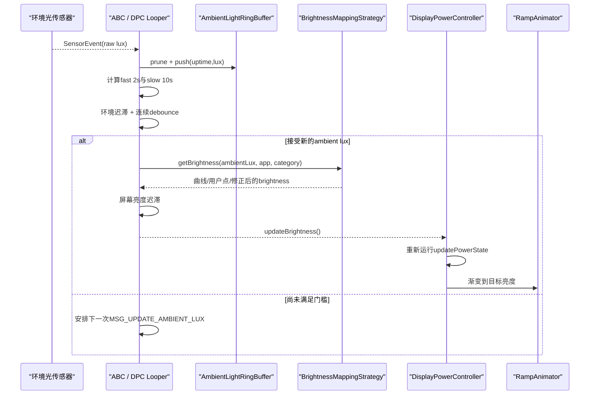
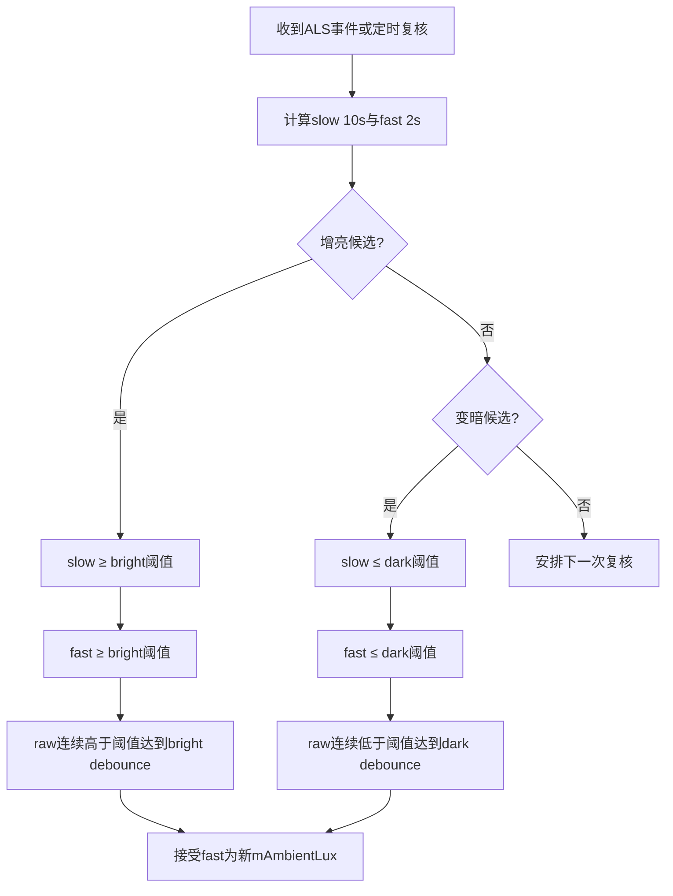
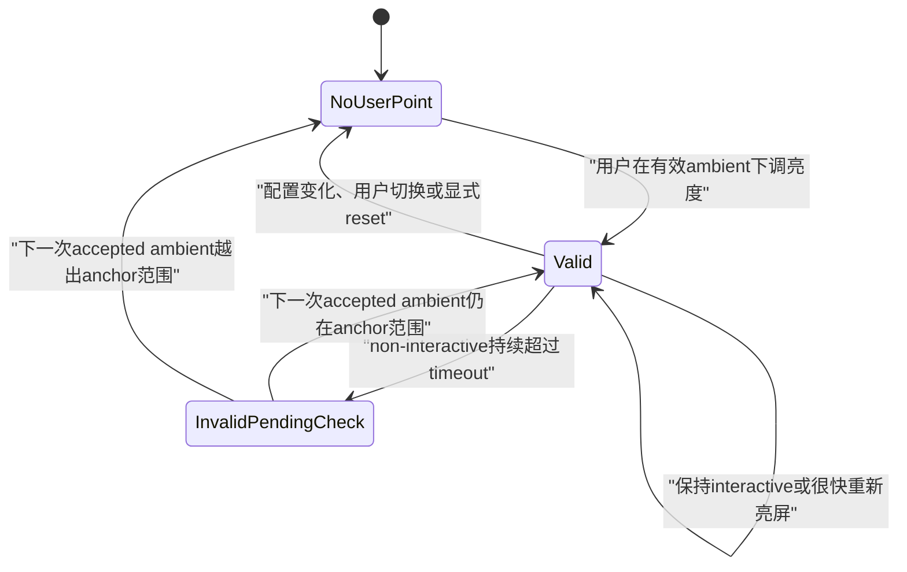

# 156 Android AutomaticBrightnessController：环境光、迟滞与短期用户模型

> 源码版本：Android 11 / API 30 / `android-11.0.0_r48`  
> 学习方式：macOS 只读源码，不要求编译、不要求连接设备  
> 前置章节：第 68、154、155 章

---

## 1. 本章要解决什么

“自动亮度”常被想成一个简单公式：

```text
光传感器 lux → 查表 → 屏幕亮度
```

Android 11 的真实链路复杂得多：

```text
原始ALS采样
→ 时间环形缓冲
→ 新样本加权的短/长窗口lux
→ 环境lux迟滞
→ 连续稳定时间debounce
→ lux-nits-backlight映射曲线
→ 用户控制点与gamma调整
→ 前台应用修正
→ 屏幕亮度迟滞
→ 回调DPC重新运行显示状态机
```

本章沿 `android-11.0.0_r48` 回答：

1. 为什么传感器报一次强光，屏幕不会马上变亮？
2. 为什么需要 2 秒和 10 秒两种 ambient lux？
3. 环境 lux 已跨阈值，亮度为什么仍可能不变？
4. 用户拖动亮度滑块后，系统究竟学习了什么？
5. 短期模型超时后为什么不一定立即删除？
6. Doze 自动亮度和光传感器持续监听是不是一回事？

---

## 2. 核心结论

> AutomaticBrightnessController（下文简称 ABC）不是把最新一笔 lux 直接映射为亮度。它以 uptime 记录近期样本，按样本覆盖的时间区间和“越新权重越大”计算 2 秒快估计与 10 秒慢估计；只有快慢估计都越过当前环境迟滞阈值、原始样本又连续越界达到明/暗 debounce 时间，才接受新的 nominal ambient lux。映射器再用 OEM 曲线、gamma、至多一个用户控制点和可选前台应用修正得到目标亮度，最后还要通过第二层屏幕亮度迟滞才回调 DPC。

必须区分五个量：

| 量 | 含义 |
|---|---|
| raw lux | 一次 SensorEvent 的原始读数 |
| fast ambient lux | 约 2 秒加权估计 |
| slow ambient lux | 约 10 秒加权估计 |
| `mAmbientLux` | 已通过迟滞和 debounce 接受的 nominal lux |
| `mScreenAutoBrightness` | 映射、修正和屏幕迟滞后的目标亮度 |

---

## 3. 源码地图

```text
frameworks/base/services/core/java/com/android/server/display/
├── DisplayPowerController.java
├── AutomaticBrightnessController.java
├── BrightnessMappingStrategy.java
├── HysteresisLevels.java
├── DisplayDeviceConfig.java
└── DisplayManagerService.java

frameworks/base/core/java/android/hardware/display/
└── BrightnessConfiguration.java

frameworks/base/core/res/res/values/
└── config.xml
```

角色分工：

| 类 | 责任 |
|---|---|
| DPC | 判断是否启用自动亮度，合并 override/temporary/boost/dim/low-power |
| ABC | 采样、过滤、迟滞、debounce、短期模型生命周期 |
| `BrightnessMappingStrategy` | lux 到目标亮度的曲线与用户调整 |
| `HysteresisLevels` | 按区间计算明/暗上下阈值 |
| `BrightnessConfiguration` | lux→nits 曲线、应用修正及短期模型参数 |
| DMS | 持久化每用户 BrightnessConfiguration 并校验最低曲线 |

---

## 4. 全链路时序



ABC 与 DPC 使用同一个传入 Looper，并创建 async Handler；SensorManager 也指定该 Handler，所以核心状态通常在同一 Looper 串行修改。

---

## 5. DPC 何时创建 ABC

必须先满足：

```java
config_automatic_brightness_available == true
```

DPC 再读取传感器、曲线、迟滞、采样率和 debounce 配置，并调用：

```java
mBrightnessMapper = BrightnessMappingStrategy.create(resources);
if (mBrightnessMapper != null) {
    mAutomaticBrightnessController =
            new AutomaticBrightnessController(...);
} else {
    mUseSoftwareAutoBrightnessConfig = false;
}
```

所以开关为 true 仍不够；OEM 曲线无效时，软件自动亮度会被关闭。

---

## 6. 光传感器如何选择

```java
if (!TextUtils.isEmpty(sensorType)) {
    // 按stringType精确查找
}
return mSensorManager.getDefaultSensor(Sensor.TYPE_LIGHT);
```

设备 overlay 可用 `config_displayLightSensorType` 指定某个 string type；未指定或没找到时退回默认 TYPE_LIGHT。

这对折叠屏、屏下 ALS 或存在多个光传感器的设备很重要。

---

## 7. 自动亮度 enable 的上游公式

DPC 大致要求：

```text
request.useAutoBrightness
AND state是ON，或配置允许Doze自动亮度且state为Doze
AND 当前brightnessState仍为NaN
AND ABC存在
```

如果 WindowManager brightness override、temporary brightness、VR 或 OFF 已经决定了值，自动亮度不会成为本轮最终来源。

---

## 8. `configure()` 是 ABC 的总入口

DPC 每轮把以下事实交给 ABC：

```text
是否启用
BrightnessConfiguration
用户最后设置的brightness
用户brightness是否变化
auto-brightness adjustment
adjustment是否变化
DisplayPowerRequest policy
```

ABC 不是只在 sensor event 时工作；设置、用户操作、policy、前台 App 或配置改变也会重新计算。

---

## 9. Doze 时为什么强制停 ALS

`configure()` 明确：

```java
boolean dozing = (displayPolicy == POLICY_DOZE);
...
changed |= setLightSensorEnabled(enable && !dozing);
```

即便 DPC 的 `config_allowAutoBrightnessWhileDozing=true` 让 enable 成立，ABC 仍在 policy=DOZE 时停用普通光传感器。注释解释：AP 可能 suspend，普通 ALS 事件不可靠。

因此：

```text
允许Doze自动亮度
≠ Doze期间持续采集普通ALS
```

---

## 10. Doze 自动亮度到底复用什么

关闭 sensor 时 ABC 会：

```java
mAmbientLuxValid = !mResetAmbientLuxAfterWarmUpConfig;
mScreenAutoBrightness = BRIGHTNESS_INVALID_FLOAT;
mAmbientLightRingBuffer.clear();
```

随后若 configure 的其他字段变化，会尝试 `updateAutoBrightness(false, ...)`：

- reset-after-warmup 为 false：保留 nominal ambient lux，可重新映射，再由 getter 乘 `mDozeScaleFactor`；
- reset-after-warmup 为 true：ambient lux 失效，无法重新计算，DPC 通常退到 Doze 默认亮度。

所以 Doze 自动亮度的实际效果还受 reset 配置影响，不能只看 allow-doze 一个布尔值。

---

## 11. 传感器 enable 时的状态

首次启用：

```java
mLightSensorEnabled = true;
mLightSensorEnableTime = SystemClock.uptimeMillis();
mCurrentLightSensorRate = mInitialLightSensorRate;
registerForegroundAppUpdater();
mSensorManager.registerListener(..., rate * 1000, mHandler);
```

SensorManager 参数是微秒，所以资源中的毫秒要乘 1000。

时间使用 uptime，与 Handler 的 `sendMessageAtTime()` 一致。

---

## 12. 为什么有 initial 与 normal 两种采样率

第一笔 sensor event 到达前使用 initial rate；拿到第一笔后：

```java
adjustLightSensorRate(mNormalLightSensorRate);
```

典型意图是亮屏初期更快拿到第一笔，之后降低频率节电。

注意 rate 数字是间隔毫秒，数值越小采样越快。源码期望 initial ≤ normal；默认 `-1` 表示直接使用 normal。

---

## 13. 默认配置不是设备最终值

AOSP 基础值包括：

```text
normal sensor rate   250 ms
brighten debounce   4000 ms
darken debounce     8000 ms
short model timeout 300000 ms
```

但设备 overlay 会覆盖，例如源码树中部分 Pixel 配置把明/暗 debounce 改为 2000/4000 ms。

学习公式可看 base config，诊断真机必须看最终资源 overlay。

---

## 14. 每笔 SensorEvent 做什么

```java
final long time = SystemClock.uptimeMillis();
final float lux = event.values[0];
handleLightSensorEvent(time, lux);
```

处理步骤：

1. 写 `ALS` trace counter；
2. 移除之前安排的 ambient-lux update message；
3. 第一笔时切 normal rate；
4. prune 并 push 样本；
5. 立即尝试 `updateAmbientLux(time)`；
6. 根据结果安排下一次定时复核。

新事件会替代旧复核消息，但状态机仍会算出新的 deadline。

---

## 15. 环形缓冲保存什么

`AmbientLightRingBuffer` 用两条数组保存：

```text
timestamp uptime
lux float
```

逻辑顺序永远从旧到新；`mStart/mEnd/mCount` 管理物理环绕。

初始容量公式：

```text
ceil(horizon × 1.5 / normalSampleRate)
```

如果事件比预期更多，满时容量翻倍，不会静默丢最新样本。

---

## 16. `prune()` 为什么保留窗口外最后一笔

有些 ALS 只在光照变化时报告。假设窗口开始前最后一笔是 100 lux，窗口内没有新事件，不能推断窗口内“没有光”。正确理解是 100 lux 持续有效。

所以 prune：

- 删除更旧样本；
- 至少保留一笔；
- 把跨过 horizon 的最老保留样本时间钳到 horizon。

这相当于零阶保持：一笔读数持续到下一笔读数到达。

---

## 17. 为什么不能做普通算术平均

样本间隔未必相等，且 change-only sensor 可能很久不报。如果直接按样本数平均，一笔持续 8 秒和一笔持续 100 毫秒权重相同，会严重失真。

ABC 按每笔样本代表的时间区间积分加权。

---

## 18. 加权函数怎样偏爱新样本

权重来自：

```java
y = x + mWeightingIntercept
```

对时间区间积分：

```java
weightIntegral(x) = x * (x * 0.5f + intercept)
```

其中 x 是相对 now 的时间，越接近 0 越新，线性权重越大。

因此它不是简单移动平均，而是：

```text
按持续时间计权 × 越新的时间片权重越高
```

---

## 19. 为什么把最后样本延长到未来 100ms

```java
AMBIENT_LIGHT_PREDICTION_TIME_MILLIS = 100;
```

最新读数被假设再持续 100ms：

- 给最新值非零权重；
- 避免只有一个样本时总权重为 0；
- 带一点短期预测意味。

它不是“预测下一笔 lux 数值”，只是把当前读数的有效区间略向未来延伸。

---

## 20. 两个时间窗口

```text
fast horizon = 2000 ms
slow horizon = 10000 ms
```

fast 用来描述“现在大概变成了什么”；slow 用来确认“长期环境确实改变”。

只有 fast 会成为新 `mAmbientLux`，但 fast 与 slow 都必须跨过阈值。

---

## 21. 初始 ambient lux 如何建立

若 `mAmbientLuxValid=false`，先等：

```text
mLightSensorEnableTime + warmUpTime
```

到期后用 2 秒短窗口计算初值：

```java
setAmbientLux(calculateAmbientLux(time, 2000));
mAmbientLuxValid = true;
updateAutoBrightness(true, false);
```

首次建立不要求常规明/暗 debounce；warm-up 是独立的初始门。

---

## 22. 没有首个事件时不会凭空初始化

warm-up 定时消息是在收到事件并调用 `updateAmbientLux()` 后才安排。没有任何 ALS event，环形缓冲为空，正常路径不会主动制造一个可靠 ambient lux。

因此“warm-up 时间到了”本身不等于“已有有效环境光”。

---

## 23. 第一层迟滞：ambient lux 阈值

接受 `mAmbientLux` 时计算：

```java
brightThreshold = lux * (1 + brightConstant);
darkThreshold   = lux * (1 - darkConstant);
```

AOSP 默认一档是：

```text
bright constant = 100 / 1000 = 10%
dark constant   = 200 / 1000 = 20%
```

假设已接受 100 lux：

```text
增亮候选阈值 = 110 lux
变暗候选阈值 = 80 lux
```

这构成不对称死区，避免在边界附近反复跳。

---

## 24. 阈值可以按亮度区间变化

`HysteresisLevels` 用 `thresholdLevels` 选择对应比例。数组长度规则：

```text
brightening.length == darkening.length
darkening.length == levels.length + 1
```

因此 OEM 可以让暗环境、高亮环境使用不同百分比，而不是全局固定 10%/20%。

---

## 25. debounce 检查的是原始样本连续越界

增亮函数从最新样本向旧扫描：

```java
if (lux <= mAmbientBrighteningThreshold) break;
earliestValidTime = sampleTime;
```

返回：

```text
最近这一段连续 raw lux > bright threshold 的最早时间
+ brightening debounce
```

任意一笔回落到阈值以内，连续计时就从后面的样本重新开始。

---

## 26. 明暗条件为什么严格不对称

代码使用：

```text
增亮 raw：lux > bright threshold
变暗 raw：lux < dark threshold

加权判定：
slow/fast >= bright threshold
slow/fast <= dark threshold
```

原始连续样本在恰等于阈值时会中断；加权值恰等于阈值则允许通过。边界测试时不要把所有比较都写成同一个符号。

---

## 27. 接受新 ambient lux 的完整 AND 门



三道门分别过滤：幅度不够、短暂尖峰、长窗口尚未收敛。

---

## 28. 为什么 fast 与 slow 都要越界

只看 fast：手遮一下传感器或手电扫过就可能大幅跳变。

只看 slow：真实环境改变后响应过慢，而且 slow 的中间值可能在追赶 fast 时反复触发。

双窗口要求“近期已明显变化”和“长期证据也支持变化”同时成立。

---

## 29. 为什么 debounce 到期还要 Handler 复核

传感器可能只在变化时上报。如果光照稳定跨阈值后不再产生事件，不能等下一笔事件才改变亮度。

ABC 计算最早 transition time，安排 `MSG_UPDATE_AMBIENT_LUX`。到点即使没有新 sensor event，也会基于现有样本的持续有效语义复核。

---

## 30. deadline 已经过期却仍未跨加权门怎么办

源码不会立即自旋，而是：

```java
nextTransitionTime = time + mNormalLightSensorRate;
```

等待大约一笔正常采样间隔再检查。这样避免在 Handler 上不停运行同一计算。

---

## 31. 接受新 ambient lux 后做什么

`setAmbientLux(fastAmbientLux)` 会：

1. 负数钳为 0；
2. 写 `mAmbientLux`；
3. 基于新值重算下一轮环境明/暗阈值；
4. 处理失效的短期用户模型；
5. 调用 `updateAutoBrightness(true, false)`。

阈值锚点只在接受新 nominal lux 后改变，不跟随每笔 raw lux 漂移。

---

## 32. 从 lux 到 brightness 有两种策略

`BrightnessMappingStrategy.create()` 优先选择：

### PhysicalMappingStrategy

要求两套有效映射：

```text
lux → nits
backlight ↔ nits
```

### SimpleMappingStrategy

若物理 nits 信息不完整，但存在：

```text
lux → backlight int
```

则使用简单策略。

两者都无效时返回 null，软件自动亮度关闭。

---

## 33. 曲线合法性要求

通用校验：

- x/y 数组非空且长度一致；
- x 非负、严格递增；
- y 非负、单调不降；
- 无 NaN。

`config_autoBrightnessLevels` 的 0 lux 控制点是代码隐式补出的，因此输出数组长度必须比配置的 lux level 多 1。

---

## 34. Physical 策略为何更可移植

物理策略先按环境 lux 查目标 nits，再用该面板 nits→normalized backlight spline 转换：

```text
ambient lux
→ OEM/用户BrightnessConfiguration nits
→ 此面板backlight
```

同一目标“200 nits”可在不同面板映射成不同驱动值，比直接写 0～255 更有物理意义。

---

## 35. DMS 会拒绝过暗的自定义曲线

DMS 按每个控制点比较：

```java
if (nits[i] < mMinimumBrightnessSpline.interpolate(lux[i])) {
    throw new IllegalArgumentException("brightness curve is too dark");
}
```

最低曲线用于防止配置把屏幕压到用户无法看清、进而无法恢复设置的程度。

配置按 user serial 持久化，切换当前用户时加载给 DPC。

---

## 36. adjustment 不是线性加减

auto-brightness adjustment `[-1, 1]` 被转换为 gamma：

```text
gamma = maxGamma ^ (-adjustment)
adjustedBrightness = brightness ^ gamma
```

正 adjustment 通常让曲线更亮，负值更暗。它改变整条曲线形状，而不是每个点简单加固定数值。

---

## 37. 用户拖滑块时如何识别

DPC 监听 `SCREEN_BRIGHTNESS_FLOAT`。它区分：

- ABC 自己把自动结果写回 setting；
- Settings UI/用户产生的新值。

外部值与 `mCurrentScreenBrightnessSetting` 不同时，保存为：

```java
mLastUserSetScreenBrightness = mPendingScreenBrightnessSetting;
```

随后 `configure(... userChangedBrightness=true ...)` 把该值交给 ABC。

---

## 38. 没有有效 ambient lux 就不能学习

```java
if (!mAmbientLuxValid) {
    return false;
}
```

用户偏好必须绑定“当时环境光”。没有可靠 lux，就无法构造控制点 `(lux, desiredBrightness)`。

这避免把亮屏 warm-up 阶段的未知环境错误写进曲线。

---

## 39. 当前只保留一个用户控制点

接口注释明确：

```text
Currently, we only keep track of one of these at a time
```

保存：

```text
mUserLux
mUserBrightness
```

下一次用户调整会替换上一点，而不是永久积累任意多训练样本。

---

## 40. 用户控制点如何修改曲线

加入 `(userLux, desiredBrightness)` 时：

1. 计算该 lux 下未经用户修改的 brightness；
2. 反推出能大致达到用户目标的 global gamma adjustment；
3. 对基础曲线应用 gamma；
4. 把用户点精确插入曲线；
5. 向两侧平滑，保持单调且限制斜率；
6. 重建 spline。

所以系统既保证锚点处返回用户刚选的值，又避免周围曲线出现尖锐折返。

---

## 41. 曲线平滑限制什么

向高 lux 方向：

- brightness 不能降低；
- 上升不能超过允许的对数斜率；
- 至少允许一个很小的增长，防止从 0 永远爬不起来。

向低 lux 方向则限制在不高于前一点、又不低于允许下界。

用户改一个点，可能影响附近多个控制点，不只影响该 lux。

---

## 42. 手动点为什么绕过第二层亮度迟滞

用户操作后调用：

```java
updateAutoBrightness(false, true /*isManuallySet*/);
```

`isManuallySet=true` 会跳过“新亮度仍处在 screen hysteresis 区间就忽略”的判断。

否则用户刚拖到想要的值，系统可能因为亮度变化幅度不够而立即拒绝，体验会很奇怪。

---

## 43. 第二层迟滞：screen brightness threshold

映射得出 `newScreenAutoBrightness` 后，如果不是手动点，并且：

```java
screenDarkeningThreshold < new < screenBrighteningThreshold
```

ABC 直接忽略。

第一层 ambient 迟滞决定“环境是否值得重算”；第二层 screen 迟滞决定“重算结果是否值得真正改背光”。

---

## 44. 为什么要两层迟滞

映射曲线在某些 lux 区间可能很平：环境变化很大，但输出亮度几乎不变。

反过来，曲线某段可能较陡：小的 lux 变化会造成明显 brightness 变化。

两层迟滞分别工作在输入空间和输出空间，能同时控制传感器噪声与肉眼可见的频繁抖动。

---

## 45. 短期模型的 anchor

用户点写入后：

```java
mShortTermModelValid = true;
mShortTermModelAnchor = mAmbientLux;
```

anchor 表示“用户是在怎样的环境光下表达偏好”，不是用户选择的 brightness。

---

## 46. timeout 何时开始计时

只有 display policy 从 interactive 变为 non-interactive 时才：

```java
sendEmptyMessageDelayed(MSG_INVALIDATE_SHORT_TERM_MODEL,
        getShortTermModelTimeout());
```

interactive policy 包括 BRIGHT、DIM、VR；OFF 与 DOZE 属于 non-interactive。

用户持续使用设备时不会因为墙钟过去 5 分钟就清掉偏好。

---

## 47. 很快重新亮屏会怎样

从 non-interactive 回 interactive：

```java
mHandler.removeMessages(MSG_INVALIDATE_SHORT_TERM_MODEL);
```

如果 timeout 尚未触发，短期模型继续有效。

这适合短暂锁屏后马上解锁的场景。

---

## 48. timeout 到期为什么只 invalidate

```java
private void invalidateShortTermModel() {
    mShortTermModelValid = false;
}
```

它没有立刻调用 `clearUserDataPoints()`。系统要等下一次接受 ambient lux，判断环境与 anchor 是否仍接近。

这是“两阶段过期”：

```text
计时到期 → 标记待验证
下一次环境光确定 → 保留或清除
```



`InvalidPendingCheck` 是本文为了理解而起的状态名，对应源码中的 `mShortTermModelValid=false` 且 anchor 仍保留，并不是源码常量。

---

## 49. 默认 anchor 有效区间

默认上下 multiplier 都是 0.6：

```text
min = anchor × 0.4
max = anchor × 1.6
```

判断源码是：

```java
min < ambientLux && ambientLux <= max
```

- 落在区间内：重新标 valid，保留用户点；
- 落在区间外：真正 reset，清用户点和 adjustment。

下界是开区间、上界是闭区间，这是精确测试会碰到的不对称边界。

---

## 50. anchor 为 0 的特殊边界

默认区间变为 `(0, 0]`，不存在可满足值；下一次验证即使 ambientLux=0，也会走 reset。

这是乘法相对阈值在零点的自然结果，也是不能笼统说“相差不超过 60% 就保留”的原因。

---

## 51. 配置变化与用户切换会立即 reset

新的 `BrightnessConfiguration` 生效时：

```java
resetShortTermModel();
```

用户切换时 DPC 也 reset，防止一个用户的偏好污染另一个用户。

reset 只清用户交互效果；当前 OEM/管理员 BrightnessConfiguration 仍保留。

---

## 52. 前台应用也可以修正亮度

PhysicalMappingStrategy 支持：

- package-name correction；
- app-category correction。

优先级：先找 package；没有再找 category。

ABC 在 ALS 启用期间注册 TaskStackListener，后台线程查询 focused stack 和 ApplicationInfo category，再回到自己的 Handler 应用并重算亮度。

---

## 53. 为什么查询前台 App 放 BackgroundThread

源码注释指出 ATMS 锁容易竞争。若在 DPC Looper 同步查询，可能阻塞亮度和电源状态机。

所以：

```text
TaskStack变化
→ ABC Handler收到消息
→ BackgroundThread跨Binder查询ATMS/PackageManager
→ ABC Handler同步应用结果
```

这是同一控制器内部的锁竞争隔离。

---

## 54. 有用户点时为何禁用 App correction

PhysicalMappingStrategy：

```java
if (mUserLux == -1) {
    backlight = correctBrightness(...);
}
```

用户刚明确选择了亮度，应用级 correction 不能再覆盖该偏好。只要有用户点，package/category correction 都不应用。

SimpleMappingStrategy 本身也没有这些 context correction。

---

## 55. ABC 如何把结果送回 DPC

目标 brightness 真正变化且 `sendUpdate=true` 时：

```java
mCallbacks.updateBrightness();
```

DPC 实现只是：

```java
sendUpdatePowerState();
```

ABC 不直接操作 DisplayPowerState 或背光；它唤醒 DPC，让 DPC 重新合并 override、temporary、boost、dim、low-power 等更高层规则。

---

## 56. DPC 如何消费自动亮度

```java
brightnessState =
        mAutomaticBrightnessController.getAutomaticScreenBrightness();
```

有效时：

1. 钳到合法亮度区间；
2. 标记 reason=AUTOMATIC；
3. 把未经过 dim/low-power 修饰的值写回 `SCREEN_BRIGHTNESS_FLOAT`；
4. 后续再应用 DIM 和 low-power modifier；
5. RampAnimator 平滑下发。

写回 setting 是为了让系统亮度滑块反映自动曲线的基础结果，不等于将模式切成手动。

---

## 57. 为什么写回 setting 不会被当成用户操作

DPC 在 `putScreenBrightnessSetting()` 前先写：

```java
mCurrentScreenBrightnessSetting = brightnessValue;
```

ContentObserver 稍后读到同值时，`updateUserSetScreenBrightness()` 发现 pending 与 current 相同，就不设置 user-changed 标记。

这是“自己写入”和“外部用户写入”的软件去回声机制。

---

## 58. 自动变化何时用慢 ramp

DPC 只有在：

```text
上轮已经应用自动亮度
AND adjustment本轮未变
```

时把 `slowChange=true`，让环境适应走较慢 ramp。

首次启用、用户调整、DIM/low-power状态切换等会清 slowChange，使用更快响应。

ABC 决定目标，RampAnimator 决定到达目标的视觉速度，两者不要混为同一个 debounce。

---

## 59. adjustment sample 与学习点不是一回事

用户操作后 ABC 还会延迟 10 秒记录 `AUTO_BRIGHTNESS_ADJ` EventLog：

```text
old lux/brightness
new lux/brightness
```

连续操作会重置 10 秒计时。

这个 sample 用于遥测/分析；真正的用户控制点在 `setScreenBrightnessByUser()` 时已经写入 mapping strategy，不必等 10 秒。

---

## 60. 一个从暗室走到室外的推演

假设 nominal ambient=100 lux，阈值 110/80，bright debounce=4秒：

```text
t0       原始读数跳到1000
t0~t2    fast迅速升高，slow仍在追赶，不能接受
t2以后   fast与slow都超过110
t0~t4    raw需连续>110；中途一笔≤110会重置连续起点
t4       时间门也满足，接受fast为新ambient
         重新计算lux→brightness
         若输出跨screen bright threshold，回调DPC
         DPC再用RampAnimator渐亮
```

传感器 debounce、双窗口收敛、screen hysteresis 和 ramp 是四种不同的“慢”。

---

## 61. 一个短暂手遮传感器的推演

暗读数可能让 fast 迅速下降，但：

- slow 10秒值未必跌破 dark threshold；
- 原始暗样本未持续满 8 秒；
- 手移开后新亮样本会中断连续暗区间。

所以屏幕通常不应立刻变暗。这是防止口袋边缘、手指和阴影造成闪烁。

---

## 62. 一个用户手动提亮的推演

```text
当前nominal ambient=50 lux
基础曲线给0.25
用户拖到0.40
→ 推断global gamma adjustment
→ 插入精确点(50,0.40)
→ 平滑两侧曲线
→ anchor=50
→ 手动更新绕过screen hysteresis
```

锁屏超过短期 timeout 后只是 invalid；下次 ambient 若仍在默认 `(20,80]` 范围，模型重新有效并保留。若环境变到 500 lux，则清除用户点，回到配置曲线。

---

## 63. dump 应该怎样读

ABC 重点字段：

```text
mLightSensorEnabled
mLightSensorEnableTime
mCurrentLightSensorRate
mAmbientLux / mAmbientLuxValid
mAmbientBrighteningThreshold / mAmbientDarkeningThreshold
mLastObservedLux / Time
mRecentLightSamples
mAmbientLightRingBuffer
mScreenAutoBrightness
mScreenBrighteningThreshold / mScreenDarkeningThreshold
mShortTermModelAnchor / Valid
mForegroundAppPackageName / Category
```

MappingStrategy：

```text
当前config/defaultConfig
spline
maxGamma
autoBrightnessAdjustment
userLux/userBrightness
```

只看 raw `mLastObservedLux` 不能判断为何没变亮；必须同时看 nominal lux、阈值、ring、两个输出阈值和模型。

---

## 64. 常见故障诊断树

```text
自动亮度完全不工作
├─ software auto config是否开启
├─ mapper是否创建成功
├─ request.useAutoBrightness是否true
├─ override/temporary/VR/OFF是否抢先决定brightness
└─ sensor是否找到并enabled

环境变了但不调亮度
├─ warm-up是否完成
├─ fast与slow是否都跨ambient阈值
├─ raw连续越界是否满debounce
├─ 映射结果是否仍在screen hysteresis内
├─ 用户点/adjustment/app correction是否改变曲线
└─ DPC callback/update/ramp是否推进
```

---

## 65. macOS 只读练习一：画出 enable 条件

```bash
cd /Users/ninebot/androidSource

sed -n '900,980p' \
  frameworks/base/services/core/java/com/android/server/display/DisplayPowerController.java

sed -n '305,345p' \
  frameworks/base/services/core/java/com/android/server/display/AutomaticBrightnessController.java
```

列出 DPC 的 autoBrightnessEnabled 条件，再解释 ABC 为什么在 DOZE 中仍调用 `setLightSensorEnabled(false)`。

---

## 66. macOS 只读练习二：手算环形缓冲

```bash
sed -n '950,1065p' \
  frameworks/base/services/core/java/com/android/server/display/AutomaticBrightnessController.java
```

假设 horizon=10秒，样本：

```text
t=0  10 lux
t=3  20 lux
t=9  100 lux
now=12
```

先执行 prune(now-10)，画出每笔代表的时间区间，再说明为什么 t=0 样本不能简单删除而要把时间钳到 t=2。

---

## 67. macOS 只读练习三：区分四个门

```bash
sed -n '615,730p' \
  frameworks/base/services/core/java/com/android/server/display/AutomaticBrightnessController.java

sed -n '730,775p' \
  frameworks/base/services/core/java/com/android/server/display/AutomaticBrightnessController.java
```

分别标出：

1. ambient hysteresis；
2. raw sample debounce；
3. fast/slow weighted lux；
4. screen brightness hysteresis。

---

## 68. macOS 只读练习四：比较两种 mapper

```bash
rg -n "class SimpleMappingStrategy|class PhysicalMappingStrategy|getBrightness" \
  frameworks/base/services/core/java/com/android/server/display/BrightnessMappingStrategy.java
```

回答：

- 哪种能接受动态 BrightnessConfiguration？
- 哪种能 convertToNits？
- App correction 在哪种生效？
- 用户点存在时 correction 为什么跳过？

---

## 69. macOS 只读练习五：推演短期模型

```bash
sed -n '350,415p' \
  frameworks/base/services/core/java/com/android/server/display/AutomaticBrightnessController.java

sed -n '310,350p' \
  frameworks/base/services/core/java/com/android/server/display/BrightnessMappingStrategy.java
```

以 anchor=100、ratio=0.6，分别代入：

```text
ambient=40
ambient=40.001
ambient=160
ambient=160.001
```

判断保留还是 reset，体会下界开、上界闭。

---

## 70. 复读审计：容易误解或源码有偏差的地方

### 70.1 raw lux 不是 nominal ambient lux

本文所有状态推演都区分 `mLastObservedLux`、fast/slow 和 `mAmbientLux`，避免把一次传感器尖峰当成已接受环境。

### 70.2 short model timeout 不会立即清点

timeout 只置 invalid；下一次 accepted ambient 才按 anchor 范围决定保留或 reset。

### 70.3 用户拖动不是固定偏移

实现会推断 gamma、插入精确点并平滑整条曲线，而且只保留一个点。

### 70.4 allow auto brightness in doze 不等持续采样

ABC 在 policy=DOZE 时始终关闭普通 ALS；能否复用估计还受 reset-after-warmup 影响。

### 70.5 “Brightened/Darkened”调试日志在 r48 有方向缺口

`updateAmbientLux()` 先调用 `setAmbientLux(fastAmbientLux)`，把 `mAmbientLux` 更新成同一个值，然后才判断：

```java
(fastAmbientLux > mAmbientLux) ? "Brightened" : "Darkened"
```

比较时两值已经相等，因此该日志会走 `Darkened`。状态机判定本身在此前已完成，不受影响；诊断时不要把这条方向字符串当权威证据。

### 70.6 config_lightSensorWarmupTime 的基础注释容易误导

实际代码在 warm-up 截止前直接推迟初始 ambient 计算；并不是“warm-up 内接受读数但不做 debounce”这么简单。以执行路径为准。

### 70.7 sensor disable 的返回值不表示是否真的关闭

`setLightSensorEnabled(false)` 完成清理后仍走函数末尾 `return false`；该布尔值只适合当前 configure 的“是否触发额外重算”合并逻辑，不能拿它当通用操作成功值。

### 70.8 app correction 不是所有设备都有

只有 PhysicalMappingStrategy 支持 BrightnessConfiguration correction；Simple 策略忽略动态 config。

---

## 71. 本章检查表

- [ ] 能区分 raw、fast、slow、nominal lux
- [ ] 能解释 initial/normal sensor rate
- [ ] 能说明 ring buffer prune 为什么保留边界样本
- [ ] 能解释时间加权与未来 100ms
- [ ] 能写出 ambient bright/dark threshold 公式
- [ ] 能解释 raw 连续越界 debounce
- [ ] 能写出 fast+slow+time 的接受门
- [ ] 能区分 ambient 与 screen 两层迟滞
- [ ] 能比较 Physical 与 Simple mapping
- [ ] 能解释 lux→nits→backlight
- [ ] 能解释 gamma adjustment 不是线性偏移
- [ ] 能说明一个用户点如何改变整条曲线
- [ ] 能解释 short model timeout 的两阶段失效
- [ ] 能手算 anchor 默认保留区间
- [ ] 能解释 package/category correction 优先级
- [ ] 能说明 ABC 为什么只回调DPC而不直接写背光
- [ ] 能识别 r48 Brightened/Darkened 日志缺口
- [ ] 能解释 Doze 自动亮度与 ALS 停用的边界

---

## 72. 本章总结

> Android 11 自动亮度是一套按最新状态收敛的多层滤波控制器。DPC 先依据 policy、override 和当前 display state 决定是否允许 ABC；ABC 在交互态注册指定或默认 ALS，以 initial/normal 两段采样率收集 uptime+lux。环形缓冲把 change-only 样本视为持续到下一笔，用越新权重越大的时间积分同时计算 2 秒 fast 与 10 秒 slow lux。只有两者都跨过以 nominal ambient 为锚的迟滞阈值，且原始读数连续越界达到明/暗 debounce，才接受 fast 为新 ambient。BrightnessMappingStrategy 再选择物理 lux→nits→backlight 或简单 lux→backlight 曲线，应用 gamma、至多一个用户锚点和可选前台应用修正；输出还须跨过 screen brightness 迟滞。真正变化后 ABC 只唤醒 DPC，由 DPC 重新合并全局亮度规则并使用 RampAnimator 下发。短期用户模型在离开交互态超时后只是 invalid，下一次环境光按 anchor 相对区间决定保留或清除。理解 raw/nominal、输入/输出迟滞、debounce/ramp、配置曲线/用户点这四组边界，才能准确解释自动亮度为什么“没有立即跟着传感器变化”。

下一章将继续深入 `BrightnessTracker` 与亮度统计：用户亮度事件如何采集环境、前台包、电池状态和颜色样本，并写入持久化统计供自适应亮度训练与诊断使用。
