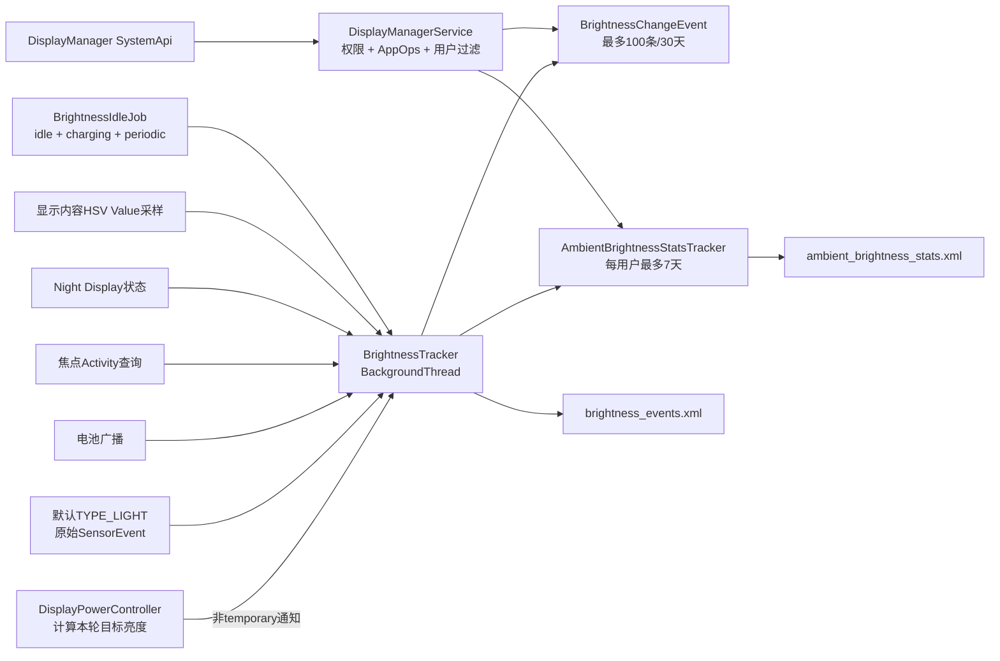
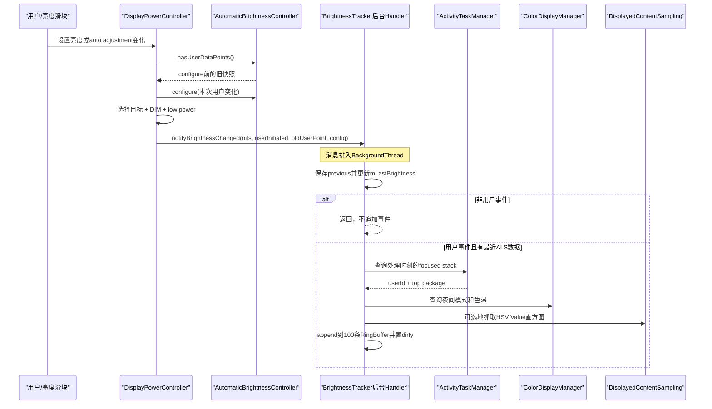
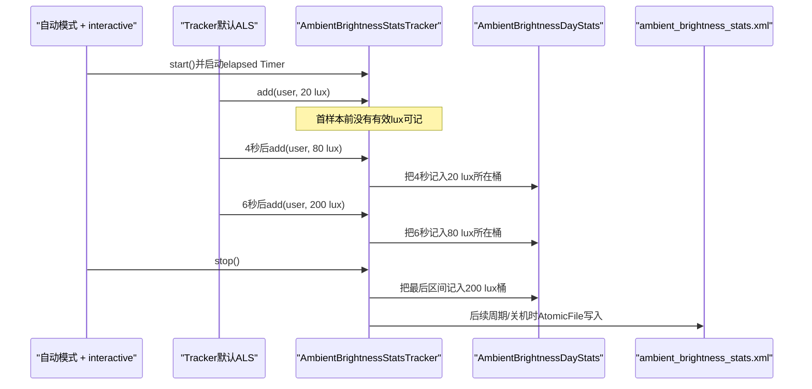

# 157 Android BrightnessTracker：亮度事件、环境统计与持久化

> 源码版本：Android 11 / API 30 / `android-11.0.0_r48`  
> 学习方式：macOS 只读源码，不要求编译、不要求连接设备  
> 前置章节：第 68、154、155、156 章

---

## 1. 本章要解决什么

第 156 章讲的是自动亮度控制器如何根据环境光计算屏幕亮度。

本章看另一个名字很像、职责却完全不同的类：

```text
BrightnessTracker
```

它不负责决定下一刻屏幕应该多亮，而是负责留下两类历史数据：

```text
用户亮度调整事件
  +
每天处于各环境光区间的累计时长
```

这些数据还会附带最近 lux、前台应用、电量、夜间模式、低电量修正、屏幕内容亮度直方图等上下文。

本章沿 Android 11 r48 源码回答：

1. `BrightnessTracker` 在什么设备上才真正启动？
2. 它和 `AutomaticBrightnessController` 是否共用同一份 lux？
3. 用户拖动亮度滑块后，什么条件满足才会形成事件？
4. `lastBrightness` 和 `isUserSetBrightness` 为什么特别容易误读？
5. 颜色直方图统计的是屏幕内容还是环境光？
6. 七天环境光统计怎样按 lux 分桶、怎样累计时间？
7. 两份 XML 何时落盘，`AtomicFile` 能保证到什么程度？
8. 普通应用为什么不能直接读取这些隐私数据？
9. 这套 Tracker 是否会直接训练第 156 章的短期模型？

---

## 2. 先记住核心结论

> `BrightnessTracker` 是遥测与统计组件，不是亮度决策器。DPC 仅在自动亮度场景、设备能把背光反算为 nits、且本轮不是 temporary brightness 时通知它。普通自动亮度变化只更新“上一次目标亮度”；只有被判定为用户主动调整、存在最近光传感器数据且能找到焦点 Activity 的通知，才写入最多 100 条的 `BrightnessChangeEvent` 环形缓冲。

同时必须记住：

> Tracker 自己在 `BackgroundThread` 上注册默认 `TYPE_LIGHT` 传感器。它保存的是这套独立监听得到的原始 lux，不是 ABC 的 filtered lux，也不一定来自 ABC 选中的同一个物理传感器。

持久化方面：

```text
brightness_events.xml
    最近30天、最多100条用户亮度事件

ambient_brightness_stats.xml
    每用户最近7个当地日期的raw lux驻留时长直方图
```

两份文件位于设备加密的 system DE 目录，分别通过各自的 `AtomicFile` 写入；单文件提交具有回退能力，但两个文件之间没有共同事务。

---

## 3. 先分清三个名字相近的对象

| 对象 | 核心问题 | 是否控制屏幕亮度 |
|---|---|---|
| `AutomaticBrightnessController` | 当前环境下应该输出什么自动亮度 | 是 |
| `BrightnessTracker` | 用户何时把亮度从多少调到多少，当时上下文是什么 | 否 |
| `AmbientBrightnessStatsTracker` | 每天在不同 raw lux 区间累计了多久 | 否 |

可以把它们类比成：

```text
ABC                         = 驾驶员
BrightnessTracker           = 行车事件记录仪
AmbientBrightnessStatsTracker = 里程/路况统计表
```

记录仪知道驾驶员做了什么，不等于记录仪自己控制方向盘。

---

## 4. 源码地图

```text
frameworks/base/services/core/java/com/android/server/display/
├── DisplayPowerController.java
├── BrightnessTracker.java
├── AmbientBrightnessStatsTracker.java
├── BrightnessIdleJob.java
└── BrightnessMappingStrategy.java

frameworks/base/core/java/android/hardware/display/
├── DisplayManager.java
├── BrightnessChangeEvent.java
├── AmbientBrightnessDayStats.java
└── BrightnessConfiguration.java

frameworks/base/services/core/java/com/android/server/display/
└── DisplayManagerService.java

frameworks/base/core/res/
└── AndroidManifest.xml
```

阅读时优先抓住以下调用：

```text
DPC.initialize()
└── BrightnessTracker.start()

DPC.updatePowerState()
└── notifyBrightnessChanged()
    └── BrightnessTracker.notifyBrightnessChanged()
        └── BackgroundThread
            └── handleBrightnessChanged()

默认ALS SensorEvent
├── recordSensorEvent()
└── AmbientBrightnessStatsTracker.add()

BrightnessIdleJob
└── DisplayManagerInternal.persistBrightnessTrackerState()
    └── BrightnessTracker.scheduleWriteBrightnessTrackerState()
```

---

## 5. 整体结构图



这张图最重要的两条线是：

```text
DPC → Tracker：亮度目标和用户操作语义
独立默认ALS → Tracker：原始环境光上下文与日统计
```

不要把第二条线误画成 `ABC → Tracker`。

---

## 6. 对象创建得早，不等于采集已经启动

DPC 构造时会直接创建：

```java
mBrightnessTracker = new BrightnessTracker(context, null);
```

构造函数只做基础准备：

```java
mBgHandler = new TrackerHandler(
        mInjector.getBackgroundHandler().getLooper());
mUserManager = mContext.getSystemService(UserManager.class);
```

默认 `getBackgroundHandler()` 返回：

```java
BackgroundThread.getHandler()
```

此时还没有：

- 读 XML；
- 注册光传感器；
- 注册广播；
- 注册亮度模式 Observer；
- 调度周期 Job；
- 接受事件。

真正的启动发生在 DPC 第一次 `initialize()`。

---

## 7. 第一层启动门：必须能把背光换算为 nits

DPC 初始化时先做转换：

```java
final float brightness = convertToNits(
        BrightnessSynchronizer.brightnessFloatToInt(
                mContext, mPowerState.getScreenBrightness()));
if (brightness >= 0.0f) {
    mBrightnessTracker.start(brightness);
}
```

因此 Tracker 不是每台设备都启动。

关键在 `BrightnessMappingStrategy.convertToNits()`。

### 7.1 SimpleMappingStrategy

```java
@Override
public float convertToNits(int backlight) {
    return -1.0f;
}
```

简单映射只有 lux→backlight，没有可靠的物理 nits 标尺。

所以：

```text
SimpleMappingStrategy
→ convertToNits() = -1
→ DPC不调用Tracker.start()
→ 不采集亮度事件和环境光日统计
```

### 7.2 PhysicalMappingStrategy

```java
@Override
public float convertToNits(int backlight) {
    return mBacklightToNitsSpline.interpolate(
            normalizeAbsoluteBrightness(backlight));
}
```

物理映射具备 backlight↔nits 曲线，Tracker 才能用跨设备更有意义的 nits 记录亮度。

### 7.3 为什么不用原始 backlight

不同屏幕的 backlight 128 并不对应相同视觉亮度。

```text
设备A：backlight 128 → 120 nits
设备B：backlight 128 → 220 nits
```

遥测如果直接记录 128，很难比较和解释；记录 nits 才接近物理亮度含义。

---

## 8. `start()` 只是投递后台启动消息

```java
public void start(float initialBrightness) {
    mCurrentUserId = ActivityManager.getCurrentUser();
    mBgHandler.obtainMessage(
            MSG_BACKGROUND_START,
            (Float) initialBrightness).sendToTarget();
}
```

真正初始化在 `BackgroundThread`：

```java
private void backgroundStart(float initialBrightness) {
    readEvents();
    readAmbientBrightnessStats();

    mSensorListener = new SensorListener();
    mSettingsObserver = new SettingsObserver(mBgHandler);
    registerBrightnessModeObserver(...);
    startSensorListener();

    registerReceiver(...);
    scheduleIdleJob(...);

    synchronized (mDataCollectionLock) {
        mLastBrightness = initialBrightness;
        mStarted = true;
    }
    enableColorSampling();
}
```

顺序值得注意：

```text
读旧数据
→ 创建监听器
→ 尝试启动ALS
→ 注册广播
→ 安排落盘Job
→ 设置初始亮度并标记started
→ 尝试开启颜色采样
```

在 `mStarted` 变 true 之前到达的亮度通知会在后台处理时被丢弃。

---

## 9. Tracker 的线程模型

主要数据被分成三组：

| 数据 | 约束方式 |
|---|---|
| 传感器注册、颜色采样、配置等 | 注释要求只在 `mBgHandler` 线程访问 |
| 最近 lux、电量、上次亮度、started | `mDataCollectionLock` |
| 亮度事件环形缓冲和 dirty | `mEventsLock` |

核心 Handler 是 async Handler：

```java
private final class TrackerHandler extends Handler {
    public TrackerHandler(Looper looper) {
        super(looper, null, true /* async */);
    }
}
```

这意味着亮度事件处理、配置更新、传感器 start/stop 主要在 system_server 的共享 `BackgroundThread` 串行执行。

但不要扩大成“所有方法绝对只在这一个线程”。

例如：

- `notifyBrightnessChanged()` 可由 DPC 线程调用，但它只发消息；
- Binder 查询会从 DMS 路径进入并读取加锁数据；
- 用户切换直接写 `mCurrentUserId`；
- 默认注册广播没有显式 scheduler，Receiver 通常由进程主线程分发；
- shutdown Receiver 直接调用 `stop()`，会碰到注释为后台线程专属的字段。

因此这个类同时依赖 Handler 串行化和两把显式锁，并非纯粹的单线程对象。

---

## 10. 第二层采集门：自动亮度且设备处于 interactive

```java
private void startSensorListener() {
    if (!mSensorRegistered
            && mInjector.isInteractive(mContext)
            && mInjector.isBrightnessModeAutomatic(mContentResolver)) {
        mAmbientBrightnessStatsTracker.start();
        mSensorRegistered = true;
        mInjector.registerSensorListener(...);
    }
}
```

三项条件：

```text
尚未登记
AND PowerManager.isInteractive()
AND 当前用户SCREEN_BRIGHTNESS_MODE为AUTOMATIC
```

屏幕广播和设置 Observer 负责启停：

```text
SCREEN_ON       → post START_SENSOR_LISTENER
SCREEN_OFF      → post STOP_SENSOR_LISTENER
切到自动亮度    → post START_SENSOR_LISTENER
切到手动亮度    → post STOP_SENSOR_LISTENER
```

注意 `interactive` 不等于显示面板一定发光；它是 PowerManager 对交互状态的抽象。

---

## 11. Tracker 没有复用 ABC 的传感器

`BrightnessTracker.Injector` 的实现非常直接：

```java
SensorManager sensorManager =
        context.getSystemService(SensorManager.class);
Sensor lightSensor =
        sensorManager.getDefaultSensor(Sensor.TYPE_LIGHT);
sensorManager.registerListener(
        sensorListener,
        lightSensor,
        SensorManager.SENSOR_DELAY_NORMAL,
        handler);
```

而第 156 章看到，ABC 可以读取 OEM 的：

```text
config_displayLightSensorType
```

先按 `stringType` 选择特定光传感器，找不到才回退默认 `TYPE_LIGHT`。

所以在存在多个 ALS 的设备上可能出现：

```text
ABC：使用OEM指定的屏下ALS
Tracker：使用默认TYPE_LIGHT ALS
```

进一步说：

```text
Tracker lux = 它自己的原始SensorEvent.values[0]
ABC ambient lux = ABC环形缓冲、加权、迟滞、debounce后的已接受值
```

两者不能直接画等号。

---

## 12. 一个实现边界：注册结果没有被检查

`SensorManager.registerListener()` 原本有 boolean 返回值，但 Injector 把它包装为 `void`：

```java
public void registerSensorListener(...) {
    ...
    sensorManager.registerListener(...);
}
```

而上层在调用前已经：

```java
mSensorRegistered = true;
```

因此严格说：

> `mSensorRegistered=true` 表示 Tracker 已执行登记流程，不是对 SensorManager 成功送达事件的硬件级确认。

如果没有默认光传感器或登记失败，Tracker 仍可能在 dump 中显示 registered，但收不到样本。

这是诊断时很有价值的边界。

---

## 13. DPC 在什么场景通知 Tracker

DPC 在本轮亮度目标确定、DIM 和低电量修正已经应用、RampAnimator 已被请求之后调用：

```java
if (!brightnessIsTemporary) {
    if (userInitiatedChange
            && (mAutomaticBrightnessController == null
            || !mAutomaticBrightnessController.hasValidAmbientLux())) {
        userInitiatedChange = false;
    }
    notifyBrightnessChanged(
            brightnessFloatToInt(brightnessState),
            userInitiatedChange,
            hadUserBrightnessPoint);
}
```

先排除：

```text
mAppliedTemporaryBrightness
OR mAppliedTemporaryAutoBrightnessAdjustment
```

临时亮度不进入 Tracker，连 `mLastBrightness` 都不会更新。

---

## 14. DPC 通知函数还有三道门

```java
private void notifyBrightnessChanged(...) {
    final float brightnessInNits = convertToNits(brightness);
    if (mPowerRequest.useAutoBrightness
            && brightnessInNits >= 0.0f
            && mAutomaticBrightnessController != null) {
        ...
        mBrightnessTracker.notifyBrightnessChanged(...);
    }
}
```

必须满足：

```text
请求启用自动亮度
AND 当前目标背光可以换算为nits
AND ABC对象存在
```

这里检查的是 `mPowerRequest.useAutoBrightness`，不完全等于本轮 `autoBrightnessEnabled`。

例如显示状态或 override 可能让本轮最终亮度不由 ABC 直接生成，但只要 request 的自动亮度开关仍为 true，且其他条件满足，通知仍可能发生。

所以事件含义应写成：

> 自动亮度使用场景中的亮度滑块事件及其最终目标上下文。

不要简化成“ABC 每次计算结果的日志”。

---

## 15. 事件中的 brightness 是哪个阶段的值

DPC 先做：

```text
自动/手动/override等来源选择
→ policy DIM修正
→ low power factor修正
→ animateScreenBrightness(target)
→ notifyBrightnessChanged(target)
```

所以写入事件的 brightness：

```text
是本轮经过DIM和低电量修正后的目标亮度换算出的nits
```

它不是：

- 设置数据库里未修正的滑块值；
- ABC 曲线刚输出、尚未经过 DPC 修正的值；
- RampAnimator 当前中间值；
- 面板或亮度 HAL 的实际回读；
- 光学仪器测量值。

低电量场景还会额外保存：

```java
final float powerFactor = mPowerRequest.lowPowerMode
        ? mPowerRequest.screenLowPowerBrightnessFactor
        : 1.0f;
```

但如果最低亮度钳位介入，简单用 `event.brightness / powerFactor` 也未必能精确反推出修正前亮度。

---

## 16. 怎样判定“用户主动调整”

DPC 先更新用户设置：

```java
final boolean userSetBrightnessChanged =
        updateUserSetScreenBrightness();
final boolean autoBrightnessAdjustmentChanged =
        updateAutoBrightnessAdjustment();
```

再判定：

```java
boolean userInitiatedChange = Float.isNaN(brightnessState)
        && (autoBrightnessAdjustmentChanged
                || userSetBrightnessChanged);
```

含义是：

```text
上游override/temporary等尚未抢先决定brightnessState
AND 用户亮度设置或自动亮度adjustment发生变化
```

之后如果 ABC 没有有效环境 lux，又会把 true 改回 false。

原因很直接：缺少 lux，就无法生成一个能解释“用户为何在这个环境下调整”的有效训练/分析样本。

---

## 17. `isUserSetBrightness` 最容易被名字误导

DPC 的顺序是：

```java
hadUserBrightnessPoint =
        mAutomaticBrightnessController.hasUserDataPoints();

mAutomaticBrightnessController.configure(
        ...,
        userSetBrightnessChanged,
        ...);
```

然后把 `hadUserBrightnessPoint` 传给 Tracker：

```java
mBrightnessTracker.notifyBrightnessChanged(
        ...,
        hadUserBrightnessPoint,
        ...);
```

因此事件字段 `isUserSetBrightness` 的准确含义是：

> 在本轮 `configure()` 应用当前调整之前，亮度曲线是否已经包含用户控制点。

它不是：

```text
“本事件是不是用户发起”
```

事件是不是用户发起，已经由“是否创建事件”表达。

### 17.1 第一次用户调整的反直觉结果

假设曲线原来没有用户点：

```text
configure前 hasUserDataPoints() = false
→ 保存 hadUserBrightnessPoint = false
→ configure因本次滑块操作添加用户点
→ Tracker写入事件 isUserSetBrightness = false
```

所以第一次用户调整形成的事件完全可能是：

```text
用户确实主动调整
但 isUserSetBrightness == false
```

这个字段描述的是“此前曲线状态快照”，不是当前动作的来源标签。

---

## 18. `lastBrightness` 也不是“上一条用户事件”

Tracker 后台处理每次通知时：

```java
float previousBrightness = mLastBrightness;
mLastBrightness = brightness;

if (!userInitiated) {
    return;
}
```

非用户发起的通知虽然不会追加事件，却会更新 `mLastBrightness`。

例如：

```text
系统自动变化：100 → 140 nits
    不生成事件，但mLastBrightness=140

用户随后调整：140 → 170 nits
    生成事件，lastBrightness=140
```

因此 `lastBrightness` 表示：

> Tracker 最近一次处理到的、非 temporary 的合格通知目标值。

它不是：

- 上一条落盘事件的 brightness；
- 上一次用户拖动后的 brightness；
- RampAnimator 当前值；
- 面板实际亮度。

---

## 19. 一次事件的完整时序



注意图中有两个不同时间：

```text
通知时间：DPC构造消息时记录currentTimeMillis
上下文查询时间：BackgroundThread真正处理消息时
```

如果后台队列很忙，焦点应用和 Night Display 状态理论上可能已经变化。

---

## 20. `notifyBrightnessChanged()` 为什么不直接干活

```java
Message m = mBgHandler.obtainMessage(
        MSG_BRIGHTNESS_CHANGED,
        userInitiated ? 1 : 0,
        0,
        new BrightnessChangeValues(
                brightness,
                powerBrightnessFactor,
                isUserSetBrightness,
                isDefaultBrightnessConfig,
                currentTimeMillis()));
m.sendToTarget();
```

DPC 不在自己的显示状态机线程里查询焦点应用、颜色采样或写事件。

这样可以避免把额外 Binder/LocalService 查询和统计工作塞进显示亮度关键路径。

代价是上下文并非完全原子快照：

- 时间戳在通知时记录；
- 最近 lux 在后台处理时复制；
- 焦点 Activity 在后台处理时查询；
- Night Display 在后台处理时查询；
- 屏幕内容采样也在后台处理时取。

事件是“近似同一时刻的上下文拼图”，不是单一硬件事务快照。

---

## 21. 形成事件的完整过滤条件

从 DPC 到 Tracker，至少经过以下过滤：

```text
Tracker已经start
AND 本轮不是temporary brightness/temporary adjustment
AND request.useAutoBrightness
AND ABC存在
AND backlight可转换为nits
AND DPC判定userInitiated
AND ABC有valid ambient lux
AND Tracker最近ALS队列非空
AND 能查询到focused stack和topActivity
```

任何一项失败，最终都可能没有 `BrightnessChangeEvent`。

所以：

> 事件列表是有条件采样，不是用户每次触碰亮度滑块的完整审计日志。

---

## 22. 最近 lux 队列保存什么

`SensorEvent` 不能长期持有，所以复制最小字段：

```java
private static class LightData {
    public float lux;
    public long timestamp; // elapsedRealtimeNanos
}
```

时间窗：

```java
private static final long LUX_EVENT_HORIZON =
        TimeUnit.SECONDS.toNanos(10);
```

每次新样本到来：

```java
long horizon = elapsedRealtimeNanos() - LUX_EVENT_HORIZON;
```

先忽略乱序事件，再删除过旧样本。

---

## 23. 为什么还要放回最后一个过期样本

源码：

```java
LightData data = null;
while (!mLastSensorReadings.isEmpty()
        && first.timestamp < horizon) {
    data = mLastSensorReadings.removeFirst();
}
if (data != null) {
    mLastSensorReadings.addFirst(data);
}
```

假设当前 20 秒，窗口起点 10 秒：

```text
样本：8s=5lux，13s=8lux，18s=20lux
```

8 秒样本虽然早于窗口起点，但它可能一直代表 10～13 秒的有效环境状态。

所以保留“最后一条被删掉的边界样本”：

```text
8s=5lux 作为窗口左边界前的状态
13s=8lux
18s=20lux
```

这和第 156 章 ABC 环形缓冲的边界保留思想类似，但 Tracker 不做 ABC 的加权估计。

---

## 24. lux 时间戳怎样从 elapsed 转成 wall time

传感器时间戳是 elapsed realtime nanos，事件 API 暴露的 lux 时间戳却是 wall clock millis。

转换公式：

```java
luxWallTime = currentWallTime
        - NANOSECONDS.toMillis(
                currentElapsedNanos - sensorTimestamp);
```

直观解释：

```text
当前墙钟 - 样本距当前的elapsed时间
```

例如：

```text
当前墙钟 10:00:20
某样本比当前elapsed早5秒
→ 样本墙钟约为10:00:15
```

这只是以处理时刻为锚点的投影。如果用户手动改系统时间，历史 wall time 的解释会受影响；elapsed 差值仍保持单调。

---

## 25. 电池字段来自 sticky 广播快照

Tracker 注册 `ACTION_BATTERY_CHANGED`：

```java
mLastBatteryLevel = (float) level / (float) scale;
```

事件创建时复制最近值。

若在有效广播到达前创建事件，字段可能是：

```text
Float.NaN
```

它表达“没有可用电量样本”，不是 0%。

还要区分：

```text
batteryLevel          = 最近电池百分比比例
powerBrightnessFactor = DPC低电量模式用于亮度的配置因子
```

两者并非同一概念。

---

## 26. 前台包名来自“处理时刻的焦点栈”

Tracker 调用：

```java
ActivityTaskManager.getService().getFocusedStackInfo();
```

有结果才设置：

```java
builder.setUserId(focusedStack.userId);
builder.setPackageName(
        focusedStack.topActivity.getPackageName());
```

否则整个事件丢弃。

这里的 userId 不是简单复制 `mCurrentUserId`，而是焦点 Activity 所属用户。

这正是工作资料场景仍可能产生 profile 用户事件的原因。

### 26.1 时间错位边界

通知进入后台队列后，用户若立刻切换 App：

```text
t0：在App A拖动亮度，DPC记录事件时间戳
t1：切到App B
t2：Tracker处理消息并查询focused stack
```

事件可能关联 App B。

源码没有把 DPC 通知和焦点快照放进同一个原子事务。

---

## 27. Night Display 上下文

Tracker 读取：

```java
builder.setNightMode(
        ColorDisplayManager.isNightDisplayActivated());
builder.setColorTemperature(
        ColorDisplayManager.getNightDisplayColorTemperature());
```

字段用于解释：

```text
用户是否在偏暖色温下调整亮度
```

但色温数值并不意味着 Night Display 必然激活；解释时要同时看 `nightMode`。

同样，这两个值是后台处理时查询的，不是 DPC 通知时的冻结快照。

---

## 28. 颜色采样统计的不是环境颜色

`DisplayedContentSample` 来自默认显示的“已显示内容采样”：

```java
DisplayManagerInternal.getDisplayedContentSample(
        Display.DEFAULT_DISPLAY,
        noFramesToSample,
        0);
```

它统计屏幕内容像素，不是 ALS，不是摄像头，也不是外界色温。

Tracker 只接受：

```text
PixelFormat.HSV_888
AND componentMask包含bit 2
```

bit 2 对应 HSV 的 Value 分量。

因此：

```text
colorValueBuckets
= 屏幕最近显示内容中，HSV亮度Value的直方图
```

它有助于区分：

```text
用户把亮度调高，是因为环境变亮？
还是因为屏幕内容本身非常暗？
```

---

## 29. 颜色采样的开启条件

```java
if (!isBrightnessModeAutomatic()
        || !isInteractive()
        || mColorSamplingEnabled
        || mBrightnessConfiguration == null
        || !mBrightnessConfiguration.shouldCollectColorSamples()) {
    return;
}
```

必须同时满足：

```text
自动亮度模式
AND interactive
AND 尚未开启
AND 当前BrightnessConfiguration非null
AND 配置允许采样
AND 显示设备支持HSV Value采样
AND 下层enable调用成功
```

这不是所有 Android 设备都具备的能力。

---

## 30. “10 秒颜色采样”是帧数窗口

```java
mFrameRate = getRefreshRate();
mNoFramesToSample = (int) (
        mFrameRate * COLOR_SAMPLE_DURATION);
```

其中 duration 为 10 秒。

60 Hz 时：

```text
noFramesToSample = int(60 × 10) = 600帧
```

取回结果后估算时长：

```java
float numMillis =
        (sample.getNumFrames() / mFrameRate) * 1000.0f;
```

所以不能把它理解成“硬件保证精确覆盖过去 10,000 ms”。

更准确是：

> 请求最多约十秒对应的帧数，再按实际返回帧数和当前刷新率估算采样时长。

如果刷新率变化，DisplayListener 会 disable 后重新 enable 以重算帧数。

---

## 31. 颜色直方图的单位

`BrightnessChangeEvent` 文档明确：

```text
colorValueBuckets单位 = pixels × milliseconds
```

它不是简单的像素个数。

某一亮度桶值大，表示：

```text
落入该Value区间的像素数量
×
这些像素在采样期出现的时间
```

`colorSampleDuration` 则描述这些桶大约覆盖多少毫秒。

设备决定桶数量，因此不同设备的数组长度可能不同。

---

## 32. `BrightnessConfiguration` 更新也有异步窗口

DPC 每轮调用：

```java
mBrightnessTracker.setBrightnessConfiguration(
        mBrightnessConfiguration);
```

Tracker 仍然通过后台消息更新自己的字段：

```java
MSG_BRIGHTNESS_CONFIG_CHANGED
```

而事件里的 `isDefaultBrightnessConfig` 是 DPC 直接从 ABC 查询后随亮度消息传入。

因此两件事来源不同：

```text
isDefaultBrightnessConfig
    = DPC通知时ABC配置状态

是否进行颜色采样
    = Tracker后台已处理到的BrightnessConfiguration
```

队列时序通常会使它们很快收敛，但不能把两字段当成一次锁内原子配置快照。

---

## 33. 环形缓冲只保存最多 100 条

```java
private RingBuffer<BrightnessChangeEvent> mEvents =
        new RingBuffer<>(
                BrightnessChangeEvent.class,
                MAX_EVENTS);
```

```java
MAX_EVENTS = 100
```

追加第 101 条时，最老条目被覆盖。

所以：

```text
“最多30天”是时间上限
“最多100条”是数量上限
```

频繁调整的用户可能远早于 30 天就把旧事件挤掉。

---

## 34. 事件何时被标记为 dirty

只有真正构建成功并 append：

```java
synchronized (mEventsLock) {
    mEventsDirty = true;
    mEvents.append(event);
}
```

以下行为不会新增 dirty 事件：

- 普通自动亮度变化；
- temporary brightness；
- 缺少 lux 的用户调整；
- 查不到焦点 Activity 的用户调整；
- Tracker 尚未 start。

但启动读取事件时会主动：

```java
mEventsDirty = true;
```

因为读取过程可能丢弃过期、无效用户或损坏项，需要下一次写回整理后的集合。

---

## 35. 30 天裁剪发生在读取和写入时

```java
timeCutOff = currentTimeMillis() - MAX_EVENT_AGE;
```

保留条件：

```java
event.timeStamp > timeCutOff
```

是严格大于，不包含刚好等于截止点的事件。

裁剪不是每分钟后台扫描，而是在：

```text
启动readEvents()
或
落盘writeEventsLocked()
```

发生。

内存环形缓冲在两次落盘之间可能暂时含有 wall clock 看起来已超过 30 天的项。

---

## 36. wall clock 改动会影响 30 天语义

事件时间和 cutoff 都使用 `System.currentTimeMillis()`。

所以用户或网络校时大幅改变墙钟时：

- 向前跳：旧事件可能突然被判为超过 30 天；
- 向后跳：事件可能被保留更久；
- 未来时间戳可能暂时一直满足 cutoff。

这与 lux 队列使用 elapsed 时间不同。

```text
短期10秒lux窗口：elapsedRealtimeNanos
长期30天事件年龄：wall clock millis
```

---

## 37. 为什么 XML 持久化保存用户 serial number

内存事件使用 userId，但磁盘写入：

```java
int userSerialNo =
        userManager.getUserSerialNumber(event.userId);
```

原因是 userId 可以在用户删除后被复用，而 serial number 表示用户实例身份。

读回时再转换：

```java
userId = userManager.getUserHandle(userSerialNumber);
```

如果用户已不存在，返回 -1，该事件被丢弃。

这防止旧用户的事件错误归到后来复用同一 userId 的新用户。

---

## 38. `brightness_events.xml` 保存什么

每个 `<event>` 大致包含：

```text
nits
timestamp
packageName
user serial
batteryLevel
nightMode
colorTemperature
lastNits
defaultConfig
powerSaveFactor
userPoint
lux逗号数组
luxTimestamps逗号数组
可选colorSampleDuration
可选colorValueBuckets
```

它是私有 system 数据，不是应用可随意读取的日志文件。

写入路径来自：

```java
Environment.getDataSystemDeDirectory()
```

典型位置：

```text
/data/system_de/brightness_events.xml
```

---

## 39. 写事件时会原地重建内存环形缓冲

源码先复制：

```java
BrightnessChangeEvent[] toWrite = mEvents.toArray();
mEvents.clear();
```

然后只把仍有效的条目重新 append：

```java
if (userSerialNo != -1
        && event.timeStamp > timeCutOff) {
    mEvents.append(event);
    // 写XML
}
```

所以一次成功写入同时完成：

```text
删除已不存在用户的数据
删除超过30天的数据
保留有效数据
重建内存RingBuffer
```

如果 `AtomicFile` 写失败，文件可回退，但内存缓冲已经在锁内经过裁剪重建；被裁掉的本来就是按当前规则无效的数据。

---

## 40. XML 一项损坏为何会清空整个事件文件

读取捕获：

```java
NullPointerException
NumberFormatException
XmlPullParserException
IOException
```

发生任一解析错误：

```java
mEvents = new RingBuffer<>(..., MAX_EVENTS);
throw new IOException(...);
```

外层再：

```java
readFrom.delete();
```

因此 r48 的恢复策略是：

> 文件内部任一关键格式错误，就放弃整份事件历史并删除坏文件。

它没有逐项跳过所有类型的损坏，也没有保留“能解析的前半段”。

但 lux 数组长度不一致是局部 `continue`，该单项会被跳过而不一定让整个文件失败。

---

## 41. `AtomicFile` 保证的边界

典型写法：

```java
output = writeTo.startWrite();
writeEventsLocked(output);
writeTo.finishWrite(output);
```

失败：

```java
writeTo.failWrite(output);
```

它主要解决：

```text
写到一半进程崩溃或I/O失败
→ 尽量保留上一份完整文件
```

它不保证：

- 数据已经进入物理闪存就永不丢；
- 两份 XML 一起提交或一起回滚；
- shutdown 一定等待后台写完；
- 内存事件一产生就立即持久化；
- 文件内容没有逻辑错误。

---

## 42. 两份文件不是一个事务

后台 Runnable 顺序执行：

```java
writeEvents();
writeAmbientBrightnessStats();
```

但每个函数使用不同 `AtomicFile`：

```text
事件文件提交成功
环境统计文件提交失败
```

完全可能发生。

所以重启后两份数据的最近持久化时间可能不一致。

不要从两个 XML 推断一个跨文件的严格一致快照。

---

## 43. 谁触发落盘

主要有两条路径：

```text
BrightnessIdleJob
ACTION_SHUTDOWN
```

它们最终都只调用：

```java
scheduleWriteBrightnessTrackerState();
```

而不是直接在调用线程同步写盘。

---

## 44. `BrightnessIdleJob` 的约束

```java
new JobInfo.Builder(...)
    .setRequiresDeviceIdle(true)
    .setRequiresCharging(true)
    .setPeriodic(TimeUnit.HOURS.toMillis(24))
```

含义是：

```text
周期任务
AND 设备空闲
AND 正在充电
```

“24 小时”不是每天某个精确时刻执行。

JobScheduler 会按周期窗口、约束和系统批处理政策选择实际时间。

这也解释了为什么写盘不应位于每次用户拖动的热路径。

---

## 45. Job 返回 false 不代表磁盘已经写完

```java
public boolean onStartJob(JobParameters params) {
    dmi.persistBrightnessTrackerState();
    return false;
}
```

`persistBrightnessTrackerState()` 最终只是向 `BackgroundThread` post Runnable。

所以：

```text
onStartJob返回false
= JobService没有异步Job生命周期需要等待
≠ 两份AtomicFile此刻已经finishWrite
```

这是一次“请求落盘”的完成，不是“耐久写入”的 ACK。

---

## 46. 写任务怎样合并

```java
if (!mWriteBrightnessTrackerStateScheduled) {
    mBgHandler.post(() -> {
        mWriteBrightnessTrackerStateScheduled = false;
        writeEvents();
        writeAmbientBrightnessStats();
    });
    mWriteBrightnessTrackerStateScheduled = true;
}
```

`mWriteBrightnessTrackerStateScheduled` 是 volatile，目的是合并重复请求。

理想效果：

```text
短时间连续请求3次
→ 后台只排1个写Runnable
```

不过 check-then-set 不是原子操作。若多个线程严格并发调用，理论上可能都看到 false 并各 post 一次。

重复写不会改变文件格式语义，但说明这个标志更像最佳努力的合并器，不是严格的“全局只会有一个 Runnable”证明。

---

## 47. shutdown 路径也是最佳努力

Receiver 收到关机：

```java
stop();
scheduleWriteBrightnessTrackerState();
```

`stop()` 会停止传感器统计、取消 Job、关闭颜色采样，再安排后台写。

但源码没有在广播回调中等待 `finishWrite()`。

所以：

> 正常关机路径会主动请求保存，但从这段代码本身不能证明关机流程一定阻塞到数据物理持久化结束。

另外，Receiver 注册没有显式 Handler，默认通常在 system_server 主线程回调；它直接调用 `stop()`，而若干字段被注释要求只在后台 Handler 线程访问。这是 r48 值得留意的线程边界，不应写成“全部生命周期操作都在 BackgroundThread”。

---

## 48. 环境光日统计是另一条流水线

每次 Tracker 自己的 ALS 事件到来：

```java
public void onSensorChanged(SensorEvent event) {
    recordSensorEvent(event);
    recordAmbientBrightnessStats(event);
}
```

同一个 raw lux 同时进入：

```text
最近10秒lux队列
AmbientBrightnessStatsTracker累计器
```

日统计没有使用：

- ABC 的 fast lux；
- ABC 的 slow lux；
- 已接受的 `mAmbientLux`；
- 屏幕亮度 nits；
- 颜色采样 Value。

它统计的是 Tracker 默认 ALS 原始读数的驻留时间。

---

## 49. 12 个默认 lux 桶

```java
{0, 0.1, 0.3, 1, 3, 10,
 30, 100, 300, 1000, 3000, 10000}
```

按 API 文档，边界 `{b1,b2,b3}` 形成：

```text
[b1, b2)
[b2, b3)
[b3, +∞)
```

所以默认桶是：

| 索引 | lux 范围 |
|---:|---|
| 0 | `[0, 0.1)` |
| 1 | `[0.1, 0.3)` |
| 2 | `[0.3, 1)` |
| 3 | `[1, 3)` |
| 4 | `[3, 10)` |
| 5 | `[10, 30)` |
| 6 | `[30, 100)` |
| 7 | `[100, 300)` |
| 8 | `[300, 1000)` |
| 9 | `[1000, 3000)` |
| 10 | `[3000, 10000)` |
| 11 | `[10000, +∞)` |

每个统计值的单位是秒，类型是 float。

---

## 50. 它怎样把两个样本之间的时间归到前一个 lux

内部 Timer 使用：

```java
SystemClock.elapsedRealtime()
```

假设：

```text
10:00:00 收到 20 lux
10:00:04 收到 80 lux
10:00:10 收到 200 lux
```

第二个样本到来时，把过去 4 秒记到 20 lux 桶。

第三个样本到来时，把过去 6 秒记到 80 lux 桶。

可以写成：

```text
每个新样本到达
→ 用elapsed计算自上个样本以来的时长
→ 记入“上一个lux”的桶
→ 重置Timer
→ 当前lux改为新值
```

停止监听时，再把最后一个 lux 到 stop 的时长补记进去。

---

## 51. 第一个样本之前的时间不会形成有效 lux 统计

`start()` 只启动 Timer：

```java
mTimer.reset();
mTimer.start();
```

`mCurrentAmbientBrightness` 初始为 -1。

第一个样本到来时，如果用户 ID 恰好等于 int 默认值 0，代码可能尝试把 start 到首样本的时长记给 -1 lux。

`AmbientBrightnessDayStats.log(-1, ...)` 找不到合法桶，因此这段时间不计入有效统计。

随后才把当前 lux 更新为首样本值。

这是合理结果：没有样本时不能猜环境光。

---

## 52. 日统计时序图



---

## 53. 日期和时长使用不同的时钟

```text
时长：SystemClock.elapsedRealtime()
日期：LocalDate.now()
```

优点是持续时间不受普通墙钟跳变影响。

但分类到哪一天，取决于真正执行 `log()` 时的当地日期。

这造成两个边界：

### 53.1 跨午夜不自动拆分

```text
23:59:50 收到100 lux
00:00:20 收到200 lux
```

下一样本到达时，30 秒整体按当时的 `LocalDate` 写入新的一天，不会自动拆成：

```text
旧日10秒 + 新日20秒
```

### 53.2 时区或日期跳变

elapsed 时长仍可靠，但这段时长被归到哪个 LocalDate 可能随时区/墙钟改变。

因此这是“当地日期维度的近似直方图”，不是严格按午夜切片的计费账本。

---

## 54. 用户切换会丢掉一个边界区间

`add()` 中：

```java
if (userId == mCurrentUserId) {
    log(previousUser, previousLux, elapsed);
} else {
    mCurrentUserId = userId;
}
mTimer.reset();
mTimer.start();
mCurrentAmbientBrightness = newAmbientBrightness;
```

如果新样本 userId 与当前统计用户不同，源码没有先把“旧用户最后一次 lux 到现在”的时长写入旧用户。

它直接切换用户并重置 Timer。

所以用户切换边界可能丢掉一小段驻留时间。

这比错误归到新用户更保守，但统计总时长会少。

---

## 55. `mCurrentUserId` 的可见性边界

`BrightnessTracker.onSwitchUser()` 直接：

```java
mCurrentUserId = newUserId;
```

ALS 回调在 BackgroundThread 读取：

```java
mAmbientBrightnessStatsTracker.add(
        mCurrentUserId,
        event.values[0]);
```

这个字段不是 volatile，也没有围绕读写使用同一把锁或统一投递 Handler。

从严格 Java 内存模型看，源码没有建立清晰的 happens-before 关系。

因此应谨慎表述：

> r48 存在用户切换附近短暂读到旧用户 ID 的理论可见性窗口；源码没有提供严格的同步证明。

不要夸大成“必然记错用户”，也不要忽略这个线程边界。

---

## 56. 每用户最多保留 7 个 day object

```java
MAX_DAYS_TO_TRACK = 7;
```

创建新日期时：

```java
if (userStats.size() == MAX_DAYS_TO_TRACK) {
    userStats.poll();
}
userStats.offer(dayStats);
```

这是每用户一个 `Deque`。

通常按日期单调前进时表现为：

```text
第8天到来 → 删除队首最老一天 → 追加第8天
```

但它判断的是 `size == 7`，不是按日期排序后裁剪；如果系统日期倒退，队列可能追加一个旧日期对象，而不是回头查找已有的非末尾日期。

所以结构更准确叫“最近创建的最多 7 个日对象”，通常近似最近 7 天。

---

## 57. XML 的 7 天过滤是严格日期条件

```java
cutOffDate = LocalDate.now().minusDays(7);
```

保留：

```java
day.localDate.isAfter(cutOffDate)
```

假设今天 8 月 13 日：

```text
cutOffDate = 8月6日
保留 8月7日～8月13日
```

刚好等于 8 月 6 日的不保留。

未来日期因为也 `isAfter`，会被保留；源码没有额外拒绝未来日期。

---

## 58. 统计文件保存桶边界而不只保存数值

每个日对象写：

```text
user serial
local-date
bucket-boundaries
bucket-stats
```

这让读回时不必假设历史数据必然使用当前代码中的默认桶。

即使未来版本调整桶边界，历史日对象仍可携带自己的 schema。

读入时要求：

```text
边界数组长度 == 统计数组长度
AND 至少1项
AND AmbientBrightnessDayStats构造校验非负、有序
```

任一关键解析错误会让外层删除整份统计文件。

---

## 59. 查询亮度事件的 API 链

```text
DisplayManager.getBrightnessEvents()
→ DisplayManagerGlobal
→ IDisplayManager Binder
→ DisplayManagerService.BinderService
→ DisplayPowerController
→ BrightnessTracker.getEvents()
```

API 被标注：

```java
@SystemApi
@TestApi
@RequiresPermission(BRIGHTNESS_SLIDER_USAGE)
```

对应权限 protectionLevel：

```text
signature | privileged | development
```

不是普通第三方应用权限。

---

## 60. 读取事件先验基础权限

DMS 强制：

```java
enforceCallingOrSelfPermission(
        Manifest.permission.BRIGHTNESS_SLIDER_USAGE,
        ...);
```

没有该权限，调用直接失败。

之后还检查 Usage Stats AppOps：

```java
noteOp(OP_GET_USAGE_STATS, callingUid, callingPackage)
```

如果 AppOps 是 default，再看：

```text
PACKAGE_USAGE_STATS
```

这里最容易误写成“双重检查失败就完全没有事件”。实际不是。

---

## 61. Usage Stats 权限只决定包名是否可见

DMS 得到：

```text
hasUsageStats = true/false
```

然后：

```java
getBrightnessEvents(userId, hasUsageStats)
```

Tracker 对不允许看到包名的调用方，复制事件并：

```text
packageName = null
```

其他字段仍可返回。

所以：

```text
BRIGHTNESS_SLIDER_USAGE
    决定能不能调用事件API

Usage Stats AppOps/权限
    决定主用户事件中的packageName能不能暴露
```

---

## 62. profile 数据如何过滤

Tracker 获取调用用户的 profile ID 列表：

```java
int[] profiles = userManager.getProfileIds(userId, false);
```

规则：

```text
调用用户本人的事件：
    有usage access → 可保留package
    无usage access → package置null

该用户关联profile的事件：
    可以包含在结果中
    但package永远置null

无关用户的事件：
    不返回
```

工作资料前台 App 引发的亮度调整可以计入，但包名不会泄露给父用户查询方。

---

## 63. 环境光统计 API 权限不同

```java
DisplayManager.getAmbientBrightnessStats()
```

要求：

```text
ACCESS_AMBIENT_LIGHT_STATS
```

同样是：

```text
signature | privileged | development
```

DMS 以调用 UID 解析 userId，并只查询：

```java
getAmbientBrightnessStats(userId)
```

这里没有像亮度事件那样展开 profile IDs，也没有包名字段和 Usage Stats 二次脱敏逻辑。

---

## 64. Binder 锁和 Tracker 内部锁的关系

DMS 查询时在 `mSyncRoot` 内调用 DPC：

```java
synchronized (mSyncRoot) {
    return mDisplayPowerController.getBrightnessEvents(...);
}
```

Tracker 再在 `mEventsLock` 下复制事件数组。

```text
DMS mSyncRoot
→ Tracker mEventsLock
```

复制完成后再在锁外做 profile 过滤和事件复制。

环境统计类自己的公共方法则是 `synchronized`，锁住 `AmbientBrightnessStatsTracker` 实例。

这些锁保护不同层次：

- DMS 显示服务全局状态；
- 事件 RingBuffer；
- 日统计 map/deque/timer。

---

## 65. 这些数据是否直接训练 ABC

在当前源码树搜索生产代码中的：

```text
getBrightnessEvents()
getAmbientBrightnessStats()
```

能看到 API、Binder 转发、Tracker 查询实现，却没有在 system_server 内看到把查询结果重新传给：

```text
AutomaticBrightnessController
或 BrightnessMappingStrategy.addUserDataPoint()
```

ABC 的短期用户点是在当前滑块操作时由 DPC→ABC `configure()` 即时加入的，见第 156 章。

因此 Android 11 r48 中应作如下区分：

```text
当前用户调整
→ ABC即时更新短期控制点/adjustment

BrightnessTracker事件
→ 留给具备系统权限的组件查询、分析或其他长期策略使用
```

仅凭 Tracker 类不能断言：

- 每条事件都被本机长期模型消费；
- 写 XML 就等于训练完成；
- 日统计会直接改变下一次自动亮度；
- 删除事件文件会重置 ABC 当前短期模型。

最稳妥的结论是：

> Tracker 提供数据采集和受控查询能力；它本身不实施 ABC 的曲线训练，也没有在 r48 system_server 源码中形成事件→ABC 的直接反馈调用链。

---

## 66. 一张表看懂 `BrightnessChangeEvent`

| 字段 | 真正来源 | 易错理解 |
|---|---|---|
| `brightness` | DPC 最终目标经 backlight→nits | 不是面板实测值 |
| `lastBrightness` | 上一次非 temporary Tracker 通知 | 不是上一条用户事件 |
| `timeStamp` | DPC 发通知时 wall clock | 上下文查询不一定同一瞬间 |
| `luxValues` | Tracker 默认 ALS 最近约 10 秒 raw 样本 | 不是 ABC filtered lux |
| `luxTimestamps` | elapsed 样本投影到 wall time | 会受墙钟解释影响 |
| `batteryLevel` | 最近电池 sticky 广播 | NaN 不是 0% |
| `powerBrightnessFactor` | low-power 请求配置因子 | 不一定能精确反推修正前亮度 |
| `packageName` | 处理时 focused top Activity | 可能因队列延迟错位 |
| `userId` | focused stack 用户 | 不直接取 Tracker current user |
| `nightMode` | 处理时 Night Display 状态 | 不是通知时原子快照 |
| `colorTemperature` | 处理时 Night Display 色温 | 要结合 nightMode 看 |
| `isDefaultBrightnessConfig` | 通知时 ABC 配置状态 | 与颜色采样配置非原子快照 |
| `isUserSetBrightness` | configure 前是否已有用户点 | 不是“本次是否用户发起” |
| `colorValueBuckets` | 屏幕内容 HSV Value | 不是环境颜色/ALS |
| `colorSampleDuration` | 帧数÷刷新率估算时长 | 不保证精确 10 秒 |

---

## 67. 一张表看懂两类统计

| 维度 | BrightnessChangeEvent | AmbientBrightnessDayStats |
|---|---|---|
| 触发 | 合格的用户亮度调整 | 每次 Tracker ALS 样本/停止 |
| 核心值 | last nits→new nits | raw lux 桶驻留秒数 |
| 时间范围 | 最多30天 | 读写时约最近7个当地日期 |
| 数量上限 | RingBuffer 100条 | 每用户 deque 通常最多7项 |
| 用户来源 | focused stack | Tracker current user |
| 包名 | 有，受权限脱敏 | 无 |
| 颜色内容 | 可选HSV Value直方图 | 无 |
| 文件 | `brightness_events.xml` | `ambient_brightness_stats.xml` |
| 是否控制亮度 | 否 | 否 |

---

## 68. 复读审计：十个最容易误解的地方

### 68.1 误解：创建 Tracker 就一定开始记录

修正：只有 nits 转换有效时 DPC 才调用 `start()`。

### 68.2 误解：Tracker 和 ABC 共用同一 ALS 数据

修正：Tracker 单独注册默认 `TYPE_LIGHT`；ABC 可选 OEM 指定传感器并做过滤。

### 68.3 误解：每次自动亮度变化都会形成事件

修正：普通变化只更新 `mLastBrightness`；只有用户发起并通过上下文门槛才 append。

### 68.4 误解：brightness 是滑块原始值

修正：它是经过 DIM/低电量修正后的 DPC 目标值，再换算为 nits。

### 68.5 误解：brightness 是屏幕真实亮度

修正：它不是 RampAnimator 当前值、HAL ACK 或面板测量值。

### 68.6 误解：`isUserSetBrightness=true` 才表示用户调整

修正：它表示本轮 configure 前曲线已存在用户点；第一次用户调整可能为 false。

### 68.7 误解：`lastBrightness` 是上一条事件

修正：非用户通知也会更新它。

### 68.8 误解：颜色桶统计外界环境颜色

修正：它来自默认显示内容的 HSV Value 分量。

### 68.9 误解：Job 执行完成就代表文件已经落盘

修正：Job 只 post 后台写任务便返回 false。

### 68.10 误解：Tracker 正在训练 ABC

修正：当前类负责记录/统计/持久化/查询；ABC 用户点由当前调整路径即时更新，r48 本地生产源码没有事件列表直接回灌 ABC 的链路。

---

## 69. 复读审计：实现级风险与边界

以下不是说功能必然出错，而是源码阅读时不能越过的证据边界。

### 69.1 传感器注册状态是软件意图

注册返回值被忽略，`mSensorRegistered` 不是硬件事件已到达证明。

### 69.2 焦点包名可能有后台队列时差

事件时间戳和焦点查询不在同一时刻。

### 69.3 用户切换字段缺少显式同步

`mCurrentUserId` 非 volatile，读写不共锁，切换附近存在理论 stale 窗口。

### 69.4 用户切换时长可能少记

新用户第一笔样本到来时不把旧用户最后区间补记。

### 69.5 跨午夜区间不拆分

整段时长归到实际 log 时的 LocalDate。

### 69.6 schedule 标志不是原子 check-and-set

多线程同时请求时理论上可能重复 post 写任务。

### 69.7 shutdown 不等待耐久完成

只安排后台写，未见同步等待 `finishWrite()`。

### 69.8 两个 XML 没有跨文件事务

一次成功、一次失败是合法中间结果。

### 69.9 解析错误采用整文件放弃

单个关键字段损坏可能导致整个对应 XML 被删除。

### 69.10 wall clock 影响长期保留

30 天事件年龄和 7 天当地日期都会受系统时间/时区变化影响。

---

## 70. macOS 只读练习一：验证启动门

```bash
cd /Users/ninebot/androidSource

rg -n "mBrightnessTracker.start|convertToNits" \
  frameworks/base/services/core/java/com/android/server/display/DisplayPowerController.java \
  frameworks/base/services/core/java/com/android/server/display/BrightnessMappingStrategy.java
```

阅读目标：

1. 找到 DPC `brightness >= 0.0f`；
2. 对比 Simple 返回 -1；
3. 对比 Physical 使用 backlight-to-nits spline；
4. 用一句话说明为什么不是所有设备都记录。

---

## 71. macOS 只读练习二：验证事件过滤链

```bash
rg -n "brightnessIsTemporary|userInitiatedChange|hadUserBrightnessPoint|notifyBrightnessChanged" \
  frameworks/base/services/core/java/com/android/server/display/DisplayPowerController.java

rg -n "handleBrightnessChanged|readingCount == 0|getFocusedStack|mEvents.append" \
  frameworks/base/services/core/java/com/android/server/display/BrightnessTracker.java
```

建议自己画一条 AND 链，至少包含：

```text
非temporary
→ 自动亮度request
→ nits可转换
→ user initiated
→ ABC valid lux
→ Tracker lux非空
→ focused activity存在
```

---

## 72. macOS 只读练习三：证明两套 ALS 不同

```bash
rg -n "getDefaultSensor\(Sensor.TYPE_LIGHT\)|config_displayLightSensorType|getLightSensor" \
  frameworks/base/services/core/java/com/android/server/display \
  frameworks/base/core/res/res/values/config.xml
```

把结果分两栏：

```text
ABC传感器选择
Tracker传感器选择
```

若只看到 Tracker 的默认 ALS，不要反向推断 ABC 也必定相同。

---

## 73. macOS 只读练习四：手算 lux 日统计

假设同一用户：

```text
t=0s    0.2 lux
t=3s    5 lux
t=8s    40 lux
t=10s   stop
```

答案应为：

```text
[0.1,0.3) 桶：3秒
[3,10) 桶：5秒
[30,100) 桶：2秒
```

首样本到来前若有等待时间，不应猜入任何有效 lux 桶。

---

## 74. macOS 只读练习五：审计权限和脱敏

```bash
rg -n "getBrightnessEvents|getAmbientBrightnessStats|BRIGHTNESS_SLIDER_USAGE|ACCESS_AMBIENT_LIGHT_STATS|OP_GET_USAGE_STATS" \
  frameworks/base/services/core/java/com/android/server/display/DisplayManagerService.java \
  frameworks/base/services/core/java/com/android/server/display/BrightnessTracker.java \
  frameworks/base/core/java/android/hardware/display/DisplayManager.java \
  frameworks/base/core/res/AndroidManifest.xml
```

回答：

1. 哪个权限决定能不能查事件？
2. Usage Stats 拒绝后是整批拒绝还是只脱敏包名？
3. 工作资料包名是否会暴露？
4. 环境统计是否自动包含 profiles？

---

## 75. macOS 只读练习六：审计写盘完成语义

```bash
rg -n "scheduleWriteBrightnessTrackerState|writeEvents|writeAmbientBrightnessStats|startWrite|finishWrite|failWrite" \
  frameworks/base/services/core/java/com/android/server/display/BrightnessTracker.java

sed -n '35,90p' \
  frameworks/base/services/core/java/com/android/server/display/BrightnessIdleJob.java
```

回答：

```text
onStartJob返回false时，后台Runnable是否必然已经执行？
两个AtomicFile是否同一事务？
事件为空时文件怎样处理？
事件文件不dirty时是否仍写？
环境统计是否有对应dirty门？
```

---

## 76. 建议的源码断点顺序

即使 macOS 不编译，也可以按“纸面断点”顺序读：

```text
1. DisplayPowerController.initialize
2. BrightnessTracker.start/backgroundStart
3. BrightnessTracker.startSensorListener
4. DisplayPowerController.updatePowerState中userInitiatedChange
5. DisplayPowerController.notifyBrightnessChanged
6. BrightnessTracker.handleBrightnessChanged
7. BrightnessTracker.recordSensorEvent
8. AmbientBrightnessStatsTracker.add/stop
9. BrightnessTracker.writeEventsLocked
10. DisplayManagerService.getBrightnessEvents
```

每到一个点记录：

```text
当前线程
当前用户来源
时间基准
数据单位
失败后是丢单项还是丢整文件
```

---

## 77. 本章完整因果链

```text
设备有PhysicalMappingStrategy
→ DPC可把背光反算为nits
→ Tracker在BackgroundThread启动
→ 读取两份历史XML
→ 自动亮度且interactive时独立监听默认ALS
→ raw lux进入最近10秒队列和每日桶计时器

用户调整亮度
→ DPC在configure前拍下“此前是否已有用户点”
→ ABC应用本次用户调整
→ DPC完成DIM/low-power等目标修正
→ 非temporary且自动亮度request有效
→ 向Tracker后台发送nits事件候选
→ Tracker先更新lastBrightness
→ 非用户候选到此返回
→ 用户候选要求最近lux非空
→ 查询处理时刻焦点Activity、Night Display和可选屏幕内容直方图
→ append最多100条并置dirty

设备空闲+充电的周期Job或shutdown
→ 请求BackgroundThread写盘
→ 事件按30天/有效用户裁剪
→ 环境日统计按当地日期约7天过滤
→ 两个AtomicFile分别提交

特权调用方查询
→ DMS权限与AppOps检查
→ 按调用用户/profile过滤
→ 对无UsageStats或profile包名脱敏
→ 返回Parcelable列表
```

---

## 78. 本章检查清单

读完后，应该能独立回答：

- [ ] 为什么 SimpleMappingStrategy 设备不会启动 Tracker？
- [ ] Tracker 的 lux 为什么不等于 ABC ambient lux？
- [ ] 普通自动亮度变化为何不产生事件，却能影响 `lastBrightness`？
- [ ] 第一次用户调整为何可能 `isUserSetBrightness=false`？
- [ ] 事件 brightness 为什么不能当作面板实测亮度？
- [ ] 缺 lux 或缺 focused Activity 时为何整条事件丢弃？
- [ ] 颜色桶为什么是屏幕内容，而不是环境光？
- [ ] 10 秒颜色采样为什么只是帧数窗口估算？
- [ ] 日统计怎样把样本间隔记到上一个 lux 桶？
- [ ] 跨午夜和用户切换有哪些统计误差？
- [ ] 100 条、30 天、7 天分别限制什么？
- [ ] `AtomicFile` 为什么不等于两个文件的共同事务？
- [ ] Job 返回 false 为什么不证明写盘已完成？
- [ ] Usage Stats 被拒绝后为何仍可能拿到脱敏事件？
- [ ] 为什么不能把 Tracker 直接称为 ABC 训练器？

---

## 79. 本章小结

`BrightnessTracker` 处在显示控制链的旁路：

```text
它观察DPC目标
它独立观察raw lux
它拼接系统上下文
它保存事件和日统计
但它不决定屏幕下一刻多亮
```

理解它的关键不是记 XML 字段，而是守住四组边界：

```text
控制 vs 记录
ABC filtered lux vs Tracker raw default-ALS lux
目标nits vs 面板实际亮度
事件采集 vs 模型消费/训练
```

再加上三组可靠性边界：

```text
后台近似快照不是原子快照
AtomicFile只保护单文件提交
周期Job只请求写盘，不提供耐久ACK
```

下一章继续显示链，阅读 `DisplayWhiteBalanceController` 如何把环境色温、亮度与显示白平衡矩阵连接起来，并区分它与 Night Display、颜色采样和亮度控制之间的责任边界。

