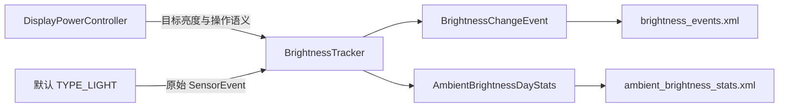

# 157 Android BrightnessTracker：亮度事件、环境统计与持久化

> 源码版本：Android 11 / API 30 / `android-11.0.0_r48`  
> 学习方式：macOS 静态阅读，不编译、不连接设备  
> 前置章节：第 154—156 章

---

## 1. “自动亮度不合适”时，系统究竟留下了什么

用户在昏暗房间里拖动自动亮度滑块。过后若要回答“调整前后各是多少、当时环境光如何、哪个应用在前台、是否开着 Night Display”，看的不是第 156 章的 `AutomaticBrightnessController`（ABC），而是 `BrightnessTracker`。

先给结论：

> `BrightnessTracker` 是遥测记录器，不是亮度控制器。它独立监听默认光传感器，记录用户亮度调整事件和按日环境光驻留时长；Android 11 r48 中没有把这些记录直接回灌给 ABC 的生产路径。

读完本章，你应能从一次滑块操作追到内存事件、两份 XML 和查询 API，并能解释“用户确实拖了滑块，为什么仍没有事件”。

本章不重复 ABC 的滤波、迟滞与短期模型，也不把一次 Handler 处理得到的上下文字段误称为同一时刻的原子快照。

---

## 2. 三个相似名字，只有一个负责决策

| 对象 | 输入与产物 | 是否决定当前亮度 |
|---|---|---|
| `AutomaticBrightnessController` | ALS、配置曲线、用户点 → 自动亮度目标 | 是 |
| `BrightnessTracker` | DPC 通知、独立 ALS、前台/电量/颜色状态 → 调整事件 | 否 |
| `AmbientBrightnessStatsTracker` | 独立 ALS → 每日 lux 分桶时长 | 否 |

关键源码位于：

```text
services/core/java/com/android/server/display/
├── DisplayPowerController.java
├── BrightnessTracker.java
├── AmbientBrightnessStatsTracker.java
└── BrightnessIdleJob.java

core/java/android/hardware/display/
├── BrightnessChangeEvent.java
└── AmbientBrightnessDayStats.java
```

一笔数据有两条输入线：



因此，事件里的 lux 不是 ABC 计算后的 ambient lux；它来自 Tracker 自己的监听器。

---

## 3. 对象已经创建，为什么 Tracker 仍可能没启动

DPC 构造时很早就创建 Tracker：

```java
mBrightnessTracker = new BrightnessTracker(context, null);
```

但真正启动发生在 `DisplayPowerController.initialize()`：

```java
final float brightness = convertToNits(
        BrightnessSynchronizer.brightnessFloatToInt(
                mContext, mPowerState.getScreenBrightness()));
if (brightness >= 0.0f) {
    mBrightnessTracker.start(brightness);
}
```

这里有一扇设备能力门：当前背光必须能映射为物理亮度 nits。`PhysicalMappingStrategy.convertToNits()` 使用背光到 nits 的 spline；`SimpleMappingStrategy.convertToNits()` 固定返回 `-1.0f`。

所以应区分：

```text
new BrightnessTracker()
    ≠ 已 start
    ≠ ALS 已注册成功
    ≠ 已经产生过事件
```

`start()` 也不直接初始化数据。它先记录当前用户，再把 `MSG_BACKGROUND_START` 发到 `BackgroundThread`。真正的 `backgroundStart()` 才会：

1. 读取事件和环境统计 XML；
2. 创建传感器、设置与显示监听器；
3. 尝试启动 ALS；
4. 注册电池、亮屏、灭屏、关机广播；
5. 安排 idle + charging 的周期 Job；
6. 提交 `mLastBrightness` 和 `mStarted`；
7. 尝试启用屏幕内容颜色采样。

这解释了启动早期的短窗口：对象存在、消息已发出，但 `mStarted` 仍可能为 false。

---

## 4. 后台线程是主线，但并非所有入口都在同一线程

`TrackerHandler` 使用 `BackgroundThread.getHandler().getLooper()`，启动、亮度通知、模式切换和亮度配置更新通常在该 Looper 串行处理。

Tracker 仍使用两把锁保护可跨线程读取的数据：

| 锁 | 保护对象 |
|---|---|
| `mDataCollectionLock` | 最近 lux、电量、上次亮度、started |
| `mEventsLock` | 事件环形缓冲与 dirty 标志 |

此外还有几个不能忽略的边界：

- `mWriteBrightnessTrackerStateScheduled` 是 `volatile`，但“检查 false → post → 写 true”不是原子复合操作；并发调用仍可能重复排入写任务。
- 广播通过不带 Handler 的 `Context.registerReceiver()` 注册。默认分发线程并不是由 `mBgHandler` 参数明确指定的；关机分支却直接调用 `stop()` 和排写。
- `mCurrentUserId` 既没有 `volatile`，也不受上述两把锁保护；`onSwitchUser()` 与后台传感器读取之间没有在本类中显式建立同步协议。

这些是源码级并发边界，不等于已证明线上必然出现故障。静态阅读时应把“通常串行”与“由代码保证串行”分开。

---

## 5. Tracker 为什么要再监听一份原始 ALS

`startSensorListener()` 的资格只有三项：

```java
if (!mSensorRegistered
        && mInjector.isInteractive(mContext)
        && mInjector.isBrightnessModeAutomatic(mContentResolver)) {
    mAmbientBrightnessStatsTracker.start();
    mSensorRegistered = true;
    mInjector.registerSensorListener(...);
}
```

也就是说，它要求：

```text
软件状态未注册
AND 设备 interactive
AND 系统亮度模式为 automatic
```

这套门与 DPC 的 `autoBrightnessEnabled` 并不相同。DPC 还考虑显示状态、Doze 配置、override 等；Tracker 只看 interactive 与系统设置模式。

实际传感器选择也独立：

```java
Sensor lightSensor =
        sensorManager.getDefaultSensor(Sensor.TYPE_LIGHT);
sensorManager.registerListener(
        sensorListener, lightSensor,
        SensorManager.SENSOR_DELAY_NORMAL, handler);
```

ABC 可以按资源配置选择 OEM 指定 ALS，并会做 ring buffer、加权平均、迟滞和 debounce。Tracker 固定请求默认 `TYPE_LIGHT`，保存 `event.values[0]` 的原始值。因此两边可能：

- 不是同一个物理传感器；
- 采样节奏不同；
- 同一时刻数值不同；
- 一个有有效 ambient lux，另一个还没有回调。

还有一个实现缺口：Injector 抛弃了 `registerListener()` 的 boolean 返回值，而调用方在注册前已把 `mSensorRegistered` 置为 true。于是该字段只表示“代码已发起注册”，不能证明硬件回调已经到达。

### 最近 10 秒并不是严格裁剪

`recordSensorEvent()` 用 `elapsedRealtimeNanos` 维护 10 秒窗口，拒绝乱序事件。清理过期样本时，它会把最后一个被移除的样本放回队首：

```java
while (!mLastSensorReadings.isEmpty()
        && mLastSensorReadings.getFirst().timestamp < horizon) {
    data = mLastSensorReadings.removeFirst();
}
if (data != null) {
    mLastSensorReadings.addFirst(data);
}
```

这样做是为了保留“窗口左边界之前最后一次 lux”，从而知道窗口起点由哪个读数覆盖。因此队列可能合法地含有一条早于 10 秒的边界样本。

`stopSensorListener()` 又不会清空该队列。灭屏后再亮屏、首个新 SensorEvent 尚未来临时，亮度事件理论上可能看到上次监听留下的旧 lux；只有下一次传感器回调才会执行 horizon 清理。

---

## 6. DPC 传给 Tracker 的到底是哪一个亮度

在 `updatePowerState()` 中，DPC 先选自动/手动亮度，再应用 DIM 和低电量修正，随后才通知 Tracker：

```text
自动亮度或其他候选
  → DIM 修正
  → low-power 修正
  → brightnessFloatToInt()
  → backlight-to-nits
  → BrightnessTracker
```

因此事件里的 `brightness` 是本轮最终目标经 int 背光量化后再映射出的 nits，不是：

- Settings 中未经 DIM/低电量修改的滑块值；
- RampAnimator 当时已经走到的实际值；
- 面板硬件读回值。

通知前还有四个关键门：

```java
if (!brightnessIsTemporary) {
    ...
    notifyBrightnessChanged(...);
}

if (mPowerRequest.useAutoBrightness
        && brightnessInNits >= 0.0f
        && mAutomaticBrightnessController != null) {
    mBrightnessTracker.notifyBrightnessChanged(...);
}
```

所以 temporary brightness 和 temporary auto-brightness adjustment 不进入 Tracker；此外还要请求启用自动亮度、存在 ABC、且能换算 nits。

`powerBrightnessFactor` 也容易误读。DPC 记录的是请求中的 `screenLowPowerBrightnessFactor`（低电量模式关闭时为 1），而实际应用还经过 `min(factor, 1)` 与最小亮度托底。它不是从“修正前值/修正后值”反算出的精确有效比例。

---

## 7. 一次拖动为什么可能只更新基线，不生成事件

DPC 的 `userInitiatedChange` 不是“收到触摸事件”的同义词。它要求本轮亮度尚未被 override、temporary 或 boost 占住，并且用户亮度设置或自动亮度 adjustment 确实变化：

```java
boolean userInitiatedChange = Float.isNaN(brightnessState)
        && (autoBrightnessAdjustmentChanged
                || userSetBrightnessChanged);
```

如果 ABC 没有有效 ambient lux，DPC 会把它降级为非用户通知。Tracker 收到后先做一件很重要的事：

```java
float previousBrightness = mLastBrightness;
mLastBrightness = brightness;

if (!userInitiated) {
    return;
}
```

也就是说，普通自动亮度变化不追加事件，却会推进 `mLastBrightness`。这保证下次用户事件的 `lastBrightness` 接近“调整前系统目标”，而不只是“上一次用户事件”。

需要分清三个量：

| 量 | 真正含义 |
|---|---|
| `userInitiated` | 本轮是否按用户主动变化记录事件 |
| `lastBrightness` | Tracker 上一次收到的合格通知值 |
| `isUserSetBrightness` | 配置 ABC 之前，曲线里是否已经有用户数据点 |

DPC 先执行：

```java
hadUserBrightnessPoint =
        mAutomaticBrightnessController.hasUserDataPoints();
mAutomaticBrightnessController.configure(...);
```

再把 `hadUserBrightnessPoint` 传给 Tracker。因此第一次建立用户点的事件，其 `isUserSetBrightness` 完全可能是 false；它描述调整前快照，不是此次调整后的结果。

还有一个顺序后果：Tracker 在检查 lux、焦点 Activity 之前就更新了 `mLastBrightness`。即使本次用户事件随后因无 lux 或无焦点而被丢弃，下一次事件的 `lastBrightness` 仍可能引用这次未入库的通知。

---

## 8. 事件不是原子快照：哪些值在哪一刻取得

`notifyBrightnessChanged()` 在 DPC 调用时立即取得 wall-clock timestamp，然后把消息发到后台。后台真正处理时才拼装其余上下文。

| 字段 | 来源与取值时机 |
|---|---|
| `brightness`、power factor、用户点/default config 标志 | DPC 通知时携带 |
| `timeStamp` | DPC 通知时的 `currentTimeMillis()` |
| `luxValues` | 后台处理时锁内复制 Tracker 队列 |
| `batteryLevel`、`lastBrightness` | 后台处理时锁内读取 |
| `userId`、`packageName` | 后台处理时查询 focused stack |
| Night Display 状态与色温 | 后台处理时查询 |
| 屏幕内容颜色直方图 | 后台处理时向默认显示取样 |

因此 Handler 排队越久，“事件时间戳”和“上下文读取时间”之间的偏差越大。这里没有把 DPC 状态、ALS、电池、焦点和 SurfaceFlinger 采样冻结成一笔事务。

### lux 时间戳怎样从单调时钟变成墙上时间

SensorEvent 的 timestamp 属于 elapsed realtime nanoseconds。处理消息时，Tracker 同时读取 wall clock 与 elapsed realtime，再换算：

```java
luxWallTime = currentTimeMillis
        - nanosToMillis(elapsedNowNanos - sensorTimestamp);
```

优点是 lux 队列的年龄判断不受改系统时间影响；代价是事件落盘与 30 天淘汰仍依赖 wall clock，且换算只是假定“处理时两种时钟的对应关系”。

### 哪些缺失会直接丢事件

事件至少要求：

1. Tracker 已 `mStarted`；
2. 通知被标成 `userInitiated`；
3. 最近 lux 队列非空；
4. focused stack 和 top Activity 可取得。

没有 lux 或焦点时不会 append。电量尚未收到有效广播则允许保存 `Float.NaN`；颜色采样不可用也允许保存，只是颜色字段为空。

---

## 9. 前台应用、Night Display 与屏幕内容颜色各自说明什么

### 前台包名是处理时焦点，不是调用者

Tracker 调 `ActivityTaskManager.getFocusedStackInfo()`，把 top Activity 的 userId 和 packageName 写入事件。它回答“处理事件时哪个 Activity 获得焦点”，并不证明这个包直接调用了亮度 API。

### Night Display 是显示色彩上下文

`nightMode` 与 `colorTemperature` 来自 `ColorDisplayManager`。它们说明屏幕是否应用暖色过滤，不表示环境光色温，也不等于下一章的 Display White Balance。

### 颜色直方图统计屏幕内容，不统计环境光

只有同时满足以下条件才启用颜色采样：

```text
automatic 模式
AND interactive
AND BrightnessConfiguration.shouldCollectColorSamples()
AND 默认显示支持 HSV_888 的 CHANNEL2
AND 刷新率 > 0
AND enable sampling 成功
```

`CHANNEL2` 是 HSV 的 Value 分量。采样帧数约为：

```text
int(refreshRate × 10 seconds)
```

事件处理时读取默认显示最近这些帧的 Value 直方图，并用 `numFrames / frameRate` 估算 `colorSampleDuration`。

API 文档把事件 buckets 的单位描述为 pixel·millisecond；但 r48 的 Tracker 直接转交 `DisplayedContentSample` 返回的数组，只单独计算 duration，没有在这里逐桶乘以帧时长。静态阅读能确认接口契约与转交路径，不能凭这段 Java 代码虚构额外的单位换算。

`mBrightnessConfiguration` 又是通过独立 Handler 消息更新的，而 DPC 事件里的 `isDefaultBrightnessConfig` 直接取自 ABC。因此“是否启用颜色采样”和“该事件标记的默认配置”不是一次原子配置快照。

---

## 10. 100 条与 30 天是两种不同的保留机制

事件内存容器是：

```java
new RingBuffer<>(
        BrightnessChangeEvent.class, MAX_EVENTS /* 100 */);
```

追加第 101 条时，环形缓冲会淘汰最旧条目。每次成功 append 都把 `mEventsDirty` 置为 true。

30 天限制则不是持续运行的定时器。代码只在读取 XML 和写 XML 时，用：

```java
event.timeStamp > currentTimeMillis() - MAX_EVENT_AGE
```

筛选记录。于是：

- 恰好等于 cutoff 的事件不保留；
- 已在内存中超过 30 天的事件，在下一次读/写前仍可能被查询到；
- 用户手动改 wall clock 会影响淘汰判断；
- 100 条容量限制与 30 天年龄限制互不替代。

XML 存的是 user serial number，不直接存运行期 userId。读取时再通过 `UserManager` 映射回来，可避免用户删除后新用户复用同一 userId 时错误继承旧历史；映射失败的事件会被跳过。

解析也有两种失败粒度：

- 单条事件的 lux 数组与时间戳数组长度不同：跳过这一条；
- 数字、根标签、XML 等解析异常：重建空环形缓冲，向上抛 `IOException`，调用层删除整份坏文件。

`readEvents()` 一开始就将 dirty 设为 true，因为读取本身可能执行年龄或用户裁剪；下一次写盘会把裁剪结果固化。

---

## 11. 两份 AtomicFile 不构成一个事务

Tracker 分别写：

```text
/data/system_de/brightness_events.xml
/data/system_de/ambient_brightness_stats.xml
```

每份文件各自使用 `AtomicFile.startWrite()/finishWrite()/failWrite()`。它能让单文件失败时回退，但不能保证：

```text
事件文件新版本 + 环境统计文件新版本
```

要么同时出现、要么同时消失。第一份成功、第二份失败是允许的。

写盘有两个入口：

1. `BrightnessIdleJob`：要求设备 idle、charging，周期约 24 小时；
2. `ACTION_SHUTDOWN`：先停止监听，再安排写任务。

二者都只是调用 `scheduleWriteBrightnessTrackerState()`，真正 I/O 由后台 Handler 后续执行。尤其 `BrightnessIdleJob.onStartJob()` 在发出请求后立即 `return false`：

```java
dmi.persistBrightnessTrackerState();
return false;
```

因此 Job 完成只证明“持久化请求已转交”，不证明两份文件已经 `finishWrite()`。关机路径同样是 best effort，没有等待落盘完成的确认协议。

另一个细节是排写标志在 Runnable 开头、真正 I/O 之前就清为 false。写盘期间若又收到请求，可以再排一轮；结合非原子的 check-then-set，它更像减少常见重复任务，而不是严格的 single-flight。

---

## 12. 每日环境光统计怎样把离散读数变成秒数

`AmbientBrightnessStatsTracker` 默认创建 12 个下界：

```text
0, 0.1, 0.3, 1, 3, 10,
30, 100, 300, 1000, 3000, 10000 lux
```

桶含义是 `[boundary[i], boundary[i+1])`，最后一个桶延伸到正无穷；统计值单位是秒。

它使用 elapsed realtime 计时。每来一个新 SensorEvent：

```text
把“上次事件 → 本次事件”的时长
记到“上一次 lux”所在桶
然后把本次 lux 设为新的当前值并重新计时
```

第一笔有效读数之前，`mCurrentAmbientBrightness == -1`，小于最小桶 0，故启动到首个回调的时间不会进入任何桶。停止监听时则把最后一个有效 lux 持续到 stop 的时间补记进去。

日期使用 `LocalDate.now()`，时长使用 elapsed realtime。这套组合避免改墙上时间造成负 duration，却没有跨午夜切段：若两个采样之间跨过零点，整段时长会记到下一次 `log()` 时取得的当地日期。

用户切换也有明确丢段策略。下一次 `add(newUser, lux)` 发现 userId 变化时，只切换当前用户并重置计时，不把旧用户最后一次读数到该时刻的间隔归给任何人。

正常创建路径为每个用户保留最多 7 个按创建顺序排列的 day object。它只比较 deque 最后一项是否为同一天，并非按日期排序或合并全表；系统日期回拨可能产生重复日期对象。XML 读写另用严格的：

```text
localDate.isAfter(today.minusDays(7))
```

因此正常情况下保留今天及此前 6 天；未来日期也会通过这个谓词。XML 同时保存 bucket boundaries，所以读取历史时不强行套用当前默认边界。

---

## 13. 查询权限如何限制包名与用户范围

两个 `DisplayManager` 接口都是隐藏的 System/Test API，并受高权限保护：

| API | 首要权限 | 返回用户范围 |
|---|---|---|
| `getBrightnessEvents()` | `BRIGHTNESS_SLIDER_USAGE` | 调用用户及其 profiles |
| `getAmbientBrightnessStats()` | `ACCESS_AMBIENT_LIGHT_STATS` | 仅调用 UID 所属用户 |

两项权限在 r48 manifest 中都是 `signature|privileged|development`，不是普通三方应用能力。

亮度事件还会检查 Usage Stats AppOp/权限，但它控制的是 packageName 是否可见，不是能否越过首要权限：

```text
有 BRIGHTNESS_SLIDER_USAGE
  ├─ own user + usage stats：包名可见
  ├─ own user + 无 usage stats：包名置 null
  └─ managed/profile 事件：包名始终置 null
```

返回的其他事件字段仍可见。环境统计接口没有扩展到 profiles，也没有包名字段。

因此诊断“查不到数据”时应依次区分：Binder 权限拒绝、用户过滤后为空、包名被隐去、还是 Tracker 根本没有采集到事件。

---

## 14. 从“用户拖了滑块但没有记录”建立排查树

按下面顺序检查，比从 XML 末端倒猜更快：

```text
1. PhysicalMappingStrategy 能否 convertToNits？
   否 → Tracker 不 start
   是
    ↓
2. 当前是否 automatic + interactive？
   否 → Tracker 独立 ALS 不监听
   是
    ↓
3. DPC 本轮是否非 temporary、useAutoBrightness、ABC 非空？
   否 → 不通知 Tracker
   是
    ↓
4. 设置/adjustment 是否真变化，且 ABC ambient lux 有效？
   否 → 只更新 lastBrightness
   是
    ↓
5. Tracker lux 队列是否非空、focused Activity 是否可取？
   否 → 更新过 lastBrightness 后丢事件
   是
    ↓
6. 事件进入最多 100 条的内存 RingBuffer
    ↓
7. 后台写任务是否真正完成 finishWrite？
   Job 返回 false 本身不能证明
```

可用 `dumpsys display` 中的 `BrightnessTracker state` 辅助判断：

- `mStarted`：是否完成后台启动；
- `mSensorRegistered`：软件是否认为发起过注册，不等于有回调；
- `mLastSensorReadings.size`：是否有 Tracker 自己的 ALS 数据；
- `mLastBrightness`：通知基线是否推进；
- `mEvents.size`、`mEventsDirty`：内存事件与待写状态；
- `mColorSamplingEnabled`：颜色直方图能力链是否成立。

静态学习环境下这些是预期观察点，不冒充真机实测结果。

---

## 15. 动手练习：证明它是记录器，不是控制器

### 练习一：追一笔事件的资格变化

从 `DisplayPowerController.updatePowerState()` 开始，记录：

1. `brightnessState` 在自动亮度、DIM、low-power 后的值；
2. `brightnessIsTemporary`；
3. `userInitiatedChange`；
4. `hadUserBrightnessPoint`；
5. `notifyBrightnessChanged()` 的三项门；
6. Tracker 中 `mLastBrightness` 更新与 append 的先后顺序。

检查答案：只有第 6 步 append 才产生事件；非用户通知以及后续过滤失败都仍可能改变 lastBrightness。

### 练习二：手算三笔环境光

假设同一用户、同一天收到：

```text
t=0s   5 lux
t=4s   50 lux
t=10s  stop
```

预期结果：

- 启动到 0 秒的未知区间忽略；
- 4 秒记入 `[3, 10)`；
- 6 秒记入 `[30, 100)`。

再把第二笔放到次日 00:00:02，观察源码为什么第一段全部记到第二笔到来时的当地日期，而不是自动按午夜拆分。

### 练习三：证明持久化没有完成 ACK

沿以下调用追踪：

```text
BrightnessIdleJob.onStartJob()
→ DisplayManagerInternal.persistBrightnessTrackerState()
→ DisplayPowerController
→ BrightnessTracker.scheduleWriteBrightnessTrackerState()
→ mBgHandler.post()
```

检查答案：`onStartJob()` 在后台 Runnable 执行前即可返回 false；两次 `AtomicFile.finishWrite()` 之间也没有共同提交点。

---

## 16. 本章结论

`BrightnessTracker` 把一次亮度调整拆成三层记录：

```text
DPC 给出目标亮度和“是否用户操作”的语义
Tracker 独立 ALS 与系统服务补齐近似上下文
RingBuffer / 日统计 / XML 提供有限期历史
```

最后保留六条边界：

1. 能创建对象不等于 nits 能力门通过并已启动；
2. Tracker lux 是默认 ALS 原始值，不是 ABC filtered lux；
3. 事件亮度是 DIM/low-power 后的目标，不是 ramp 或硬件完成值；
4. `lastBrightness` 可由不入库的通知推进，`isUserSetBrightness` 是 configure 前快照；
5. 100 条即时限制与仅在读写时执行的 30 天淘汰是两套机制；
6. 每文件 AtomicFile 与异步排写不提供“两文件已共同落盘”的确认。

最重要的责任边界是：

> Tracker 可以解释系统留下了哪些亮度使用历史，却不参与本轮自动亮度决策。看到记录不等于控制器采用了它，看到 Job 完成也不等于文件已经耐久提交。

下一章继续显示链：阅读 `DisplayWhiteBalanceController` 如何把环境色温变成显示白平衡调整，并区分它与 Night Display、内容颜色采样和亮度控制。
