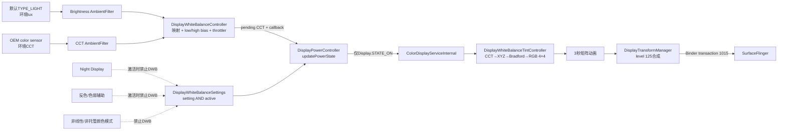
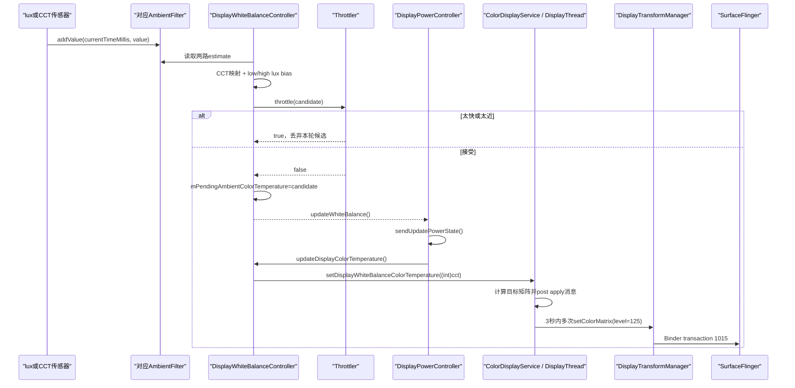
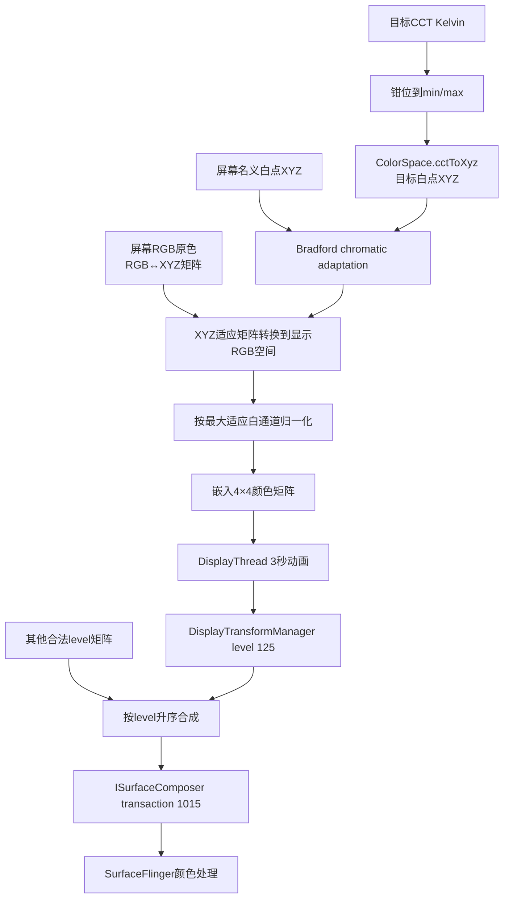

# 158 Android DisplayWhiteBalanceController：环境色温与显示白平衡

> 源码版本：Android 11 / API 30 / `android-11.0.0_r48`  
> 学习方式：macOS 只读源码，不要求编译、不要求连接设备  
> 前置章节：第 67、68、155、156、157 章

---

## 1. 本章要解决什么

人眼会根据环境光自动适应“什么是白色”。

同一张纯白图片：

```text
放在暖色灯下看
放在冷色日光下看
```

主观感受可能不同。

Android 的 Display White Balance（显示白平衡，下文简称 DWB）尝试读取环境色温，再调整屏幕白点，使显示内容在不同光源下看起来更自然。

它和自动亮度一样使用环境传感器，但控制目标完全不同：

```text
自动亮度：控制屏幕有多亮
DWB：控制屏幕白点偏暖还是偏冷
```

本章沿 Android 11 r48 回答：

1. DWB 为什么需要“环境亮度”和“环境色温”两个传感器？
2. 哪些设置打开了，DWB 才会真正激活？
3. Night Display、无障碍颜色变换为什么会压住 DWB？
4. 最近 10 秒传感器值如何做加权平均？
5. 低光、高光 bias 为什么不是简单阈值开关？
6. debounce 和变化阈值如何共同抑制屏幕色温抖动？
7. CCT 怎样变成 4×4 RGB 颜色矩阵？
8. 矩阵如何经 DisplayTransformManager 到达 SurfaceFlinger？
9. r48 的注释、资源名和真实实现有哪些不一致？

---

## 2. 核心结论

> DWB 不是把色温传感器的一次读数直接写给屏幕。它同时监听默认光传感器和 OEM 指定 string type 的环境色温传感器；两路值各自经过时间加权滤波，然后按可选 ambient-CCT→display-CCT 曲线映射，再依据环境 lux 平滑偏向低光或高光固定色温，最后通过“时间 debounce + 相对变化阈值”双门形成 pending CCT。

pending CCT 不直接下发，而是回调 DPC 重新运行 `updatePowerState()`：

```text
只有显示状态为ON
AND 用户设置已开启
AND ColorDisplayService判定DWB当前可激活
```

DPC 才消费 pending CCT。

之后：

```text
CCT
→ CIE XYZ目标白点
→ Bradford chromatic adaptation
→ 显示RGB空间矩阵
→ 峰值归一化
→ 4×4颜色矩阵
→ 3秒动画
→ DisplayTransformManager level 125
→ SurfaceFlinger全局颜色矩阵
```

---

## 3. 先分清四个容易混淆的功能

| 功能 | 输入 | 输出 | 目的 |
|---|---|---|---|
| 自动亮度 ABC | 环境 lux | backlight/brightness | 决定屏幕有多亮 |
| DWB | 环境 CCT + 环境 lux | 显示白点颜色矩阵 | 适应环境光颜色 |
| Night Display | 用户设置/时间/日落 | 暖色 tint 矩阵 | 夜间减少偏蓝观感 |
| BrightnessTracker 内容采样 | 屏幕像素 HSV Value | 统计直方图 | 记录亮度事件上下文 |

特别注意：

```text
DWB的环境色温传感器
≠ 第157章的屏幕内容HSV采样
```

前者观察设备外部光源，后者统计屏幕已经显示了什么。

---

## 4. 源码地图

```text
frameworks/base/services/core/java/com/android/server/display/
├── DisplayPowerController.java
├── whitebalance/
│   ├── DisplayWhiteBalanceFactory.java
│   ├── DisplayWhiteBalanceSettings.java
│   ├── DisplayWhiteBalanceController.java
│   ├── DisplayWhiteBalanceThrottler.java
│   └── AmbientSensor.java
├── utils/
│   ├── AmbientFilter.java
│   ├── AmbientFilterFactory.java
│   └── RollingBuffer.java
└── color/
    ├── ColorDisplayService.java
    ├── DisplayWhiteBalanceTintController.java
    ├── DisplayTransformManager.java
    └── TintController.java

frameworks/base/core/java/
├── android/hardware/display/ColorDisplayManager.java
├── android/graphics/ColorSpace.java
└── android/util/Spline.java

frameworks/base/core/res/res/values/config.xml
```

---

## 5. 整体架构图



这条链跨两个主要 Handler：

```text
DPC / 传感器 / DWBC：PowerManagerService专用ServiceThread的Looper
ColorDisplayService / tint动画：DisplayThread
```

两边通过 system_server 内的 LocalServices 连接，不经过应用 Binder API。

---

## 6. DPC 构造时尝试创建 DWB

```java
DisplayWhiteBalanceSettings settings = null;
DisplayWhiteBalanceController controller = null;
try {
    settings = new DisplayWhiteBalanceSettings(mContext, mHandler);
    controller = DisplayWhiteBalanceFactory.create(
            mHandler, mSensorManager, resources);
    settings.setCallbacks(this);
    controller.setCallbacks(this);
} catch (Exception e) {
    Slog.e(TAG, "failed to set up display white-balance: " + e);
}
```

创建过程是可选能力，失败不会让 DPC 构造失败。

可能失败的原因包括：

- 默认光传感器不存在；
- OEM 指定的环境色温传感器不存在；
- 采样率小于等于 0；
- filter horizon 或 intercept 无效；
- throttler 数组缺失或不匹配；
- 必需的资源配置缺失。

失败后 `mDisplayWhiteBalanceController` 可能为 null，DPC 后续直接跳过 DWB。

---

## 7. `config_displayWhiteBalanceAvailable` 不是 Factory 的创建门

AOSP 默认：

```xml
<bool name="config_displayWhiteBalanceAvailable">false</bool>
<bool name="config_displayWhiteBalanceEnabledDefault">false</bool>
```

但 DPC 构造代码没有先检查 available 再调用 Factory。

真正使用 available 的是：

```java
ColorDisplayManager.isDisplayWhiteBalanceAvailable(context)
```

以及 `DisplayWhiteBalanceTintController` 的初始化路径。

所以要分开：

```text
Factory能否构造出传感器/算法对象
≠
设备是否对系统声明DWB可用
```

量产设备通常需要 OEM overlay 同时提供：

- available=true；
- 色温传感器 string type；
- 过滤和阈值参数；
- 屏幕原色、名义白点与 CCT 范围；
- 合理的低光/高光曲线。

---

## 8. `DisplayWhiteBalanceSettings` 保存两层状态

字段：

```text
mEnabled = 用户Secure setting是否打开
mActive  = ColorDisplayService当前是否允许DWB transform激活
```

真正供 DPC 使用的是：

```java
public boolean isEnabled() {
    return mEnabled && mActive;
}
```

因此 API 所说的“enabled”与真正“active”不是同一个层次。

用户设置可以保持为 true，但 Night Display 开启后 DWB 仍暂时不工作；等冲突条件解除，它可以自动恢复。

---

## 9. ColorDisplayService 怎样计算 active

```java
mDisplayWhiteBalanceTintController.setActivated(
        isDisplayWhiteBalanceSettingEnabled()
        && !mNightDisplayTintController.isActivated()
        && !isAccessibilityEnabled()
        && DisplayTransformManager.needsLinearColorMatrix());
```

四个 AND 条件：

```text
用户DWB设置打开
AND Night Display未激活
AND 无障碍反色/色弱变换未启用
AND 当前显示颜色模式要求在线性空间应用矩阵
```

`isAccessibilityEnabled()` 只看：

```text
ACCESSIBILITY_DISPLAY_DALTONIZER_ENABLED
OR ACCESSIBILITY_DISPLAY_INVERSION_ENABLED
```

它不是“任意无障碍服务开启”。

---

## 10. 为什么 Night Display 与 DWB 互斥

两者都试图改变显示白点或色调：

```text
Night Display：用户明确要求偏暖
DWB：根据环境自动改变白点
```

若同时工作，最终效果难预测，也可能抵消用户意图。

所以 Night Display 优先：

```text
Night Display activated=true
→ DWB active=false
→ 通知DisplayWhiteBalanceSettings
→ DPC关闭两路DWB传感器并重置DWB矩阵
```

Night Display 关闭后，ColorDisplayService 再计算 active，DWB 可恢复。

---

## 11. 为什么某些颜色模式禁止 DWB

```java
DisplayTransformManager.needsLinearColorMatrix()
```

Android 11 依据 `persist.sys.sf.native_mode` 判断是否处于 unmanaged/saturated 类模式。

DWB 的色彩适应矩阵建立在显示 RGB↔XYZ 和线性颜色空间运算上。

若当前合成模式不满足这个前提，ColorDisplayService 不激活 DWB。

这不是“屏幕不支持色温”的同义词，而是当前颜色处理管线不适合应用这套线性矩阵。

---

## 12. DPC 还加了一道屏幕状态门

每轮 `updatePowerState()`：

```java
if (mDisplayWhiteBalanceController != null) {
    if (state == Display.STATE_ON
            && mDisplayWhiteBalanceSettings.isEnabled()) {
        mDisplayWhiteBalanceController.setEnabled(true);
        mDisplayWhiteBalanceController
                .updateDisplayColorTemperature();
    } else {
        mDisplayWhiteBalanceController.setEnabled(false);
    }
}
```

所以完整 enable 公式是：

```text
DWB controller构造成功
AND display state恰好是ON
AND setting=true
AND ColorDisplayService active=true
```

`DOZE`、`DOZE_SUSPEND`、`VR` 都不满足 `state == ON`。

即使 AOD 正在显示，r48 这条 DWB 传感器链也会关闭。

---

## 13. 两个线程域

DPC 使用 PMS 创建的专用 `ServiceThread` Looper：

```text
PowerManagerService
→ new ServiceThread(TAG, THREAD_PRIORITY_DISPLAY, ...)
→ mDisplayManagerInternal.initPowerManagement(..., mHandler, ...)
→ DPC以该handler.getLooper()创建自己的async Handler
```

DWB Factory 把同一个 DPC Handler 交给两路传感器。

因此以下内容通常在 PMS/DPC Looper 串行发生：

- lux SensorEvent；
- CCT SensorEvent；
- 两个 filter 更新；
- throttler；
- pending CCT；
- DPC `updatePowerState()` 消费 pending。

ColorDisplayService 自己使用：

```java
new TintHandler(DisplayThread.get().getLooper())
```

CCT→矩阵的 `setMatrix()` 由 DPC 线程通过 LocalService 调用，真正的 `applyTint()` 和 3 秒动画在 DisplayThread。

---

## 14. 为什么要两个环境传感器

先补一个容易反直觉的概念：

```text
CCT数值较低，例如3000K → 观感偏黄、偏暖
CCT数值较高，例如7500K → 观感偏蓝、偏冷
```

这里的 Kelvin 描述光源的相关色温，不是屏幕真的被加热到了几千摄氏度。

阅读源码时还要区分五个 CCT：

| 阶段 | 含义 |
|---|---|
| raw sensor CCT | 色温传感器一次 `event.values[0]` |
| filtered ambient CCT | 近 10 秒时间加权估计 |
| mapped display CCT | 经 OEM ambient→display spline 后的目标 |
| biased target CCT | 再经 low/high lux 固定值混合后的候选 |
| applied/clamped CCT | 通过 throttler、截断为 int、并在 TintController 钳位后的矩阵目标 |

后文说“当前色温”时，必须先判断它处于哪一个阶段。

### 14.1 色温传感器

回答：

```text
环境光偏暖还是偏冷？
```

单位通常是 Kelvin 的相关色温 CCT。

### 14.2 亮度传感器

回答：

```text
当前环境光强度是多少lux？
```

它不直接决定屏幕 backlight，而是决定环境色温传感器的可信度和高亮度显示能力补偿。

在很暗时，颜色传感器噪声通常更大；在很亮时，某些白点变换会降低峰值显示亮度。

所以 lux 用来平滑地把目标 CCT 偏向固定低光/高光值。

---

## 15. 两路传感器怎样选择

亮度传感器：

```java
mSensorManager.getDefaultSensor(Sensor.TYPE_LIGHT)
```

环境色温传感器：

```java
for (Sensor sensor : getSensorList(TYPE_ALL)) {
    if (sensor.getStringType().equals(configuredName)) {
        mSensor = sensor;
        break;
    }
}
```

资源名叫：

```text
config_displayWhiteBalanceColorTemperatureSensorName
```

但代码实际比较的是 `Sensor.getStringType()`，不是 `Sensor.getName()`。

所以 OEM overlay 应填写传感器 string type，例如 AOSP 默认占位：

```text
com.google.sensor.color
```

---

## 16. DWB 的 lux 又是第三套独立监听

到这里，显示链里至少可能有三套光传感器监听：

| 组件 | 传感器选择 | 用途 |
|---|---|---|
| ABC | OEM指定 string type，回退默认 LIGHT | 自动亮度决策 |
| BrightnessTracker | 默认 LIGHT | 事件上下文与日统计 |
| DWB AmbientBrightnessSensor | 默认 LIGHT | 低光/高光 CCT bias |

它们可能监听同一物理 sensor，也可能不是。

即使同一 sensor，采样率、过滤窗口、时间基准和结果含义也不同。

不要因为变量都叫 ambient brightness 就认为数据对象能直接复用。

---

## 17. 采样率单位转换

资源单位是毫秒：

```xml
config_displayWhiteBalanceBrightnessSensorRate = 250
config_displayWhiteBalanceColorTemperatureSensorRate = 250
```

注册时：

```java
registerListener(
        listener,
        sensor,
        mRate * 1000,
        handler);
```

SensorManager 参数是微秒，因此：

```text
250 ms × 1000 = 250000 µs
```

它只是采样提示，传感器实际交付间隔仍可能不同。

---

## 18. 传感器 enable 返回值仍是软件状态

`AmbientSensor.enable()`：

```java
mEnabled = true;
startListening();
return true;
```

`startListening()` 调用 `registerListener()`，但忽略其 boolean 返回值。

因此：

> `AmbientSensor.mEnabled=true` 表示控制器希望监听，不证明 SensorManager 已成功启用硬件 sensor。

这一点与第 157 章 Tracker 的登记边界相似。

排障时还要看：

- `mEventsCount` 是否增长；
- `mEventsHistory` 是否有值；
- 传感器对象是否正确；
- SensorService/HAL 是否送事件。

---

## 19. disable 怎样处理排队中的旧事件

```java
private void handleNewEvent(float value) {
    if (!mEnabled) {
        return;
    }
    ...
}
```

注释明确考虑竞态：传感器已 unregister，但一个旧事件可能已在 Handler 队列。

disable 先把 `mEnabled=false`，旧事件到达时被丢弃。

同时：

```text
mEventsCount清零
filter清空
throttler清空
current/pending CCT重置
ColorDisplayService重置到默认DWB CCT
```

但 `mLastAmbientColorTemperature` 被保留，用于下一次 enable 快速恢复视觉状态。

---

## 20. 每个传感器事件都会触发一次总估计

亮度事件：

```java
mBrightnessFilter.addValue(time, value);
updateAmbientColorTemperature();
```

色温事件：

```java
mColorTemperatureFilter.addValue(time, value);
updateAmbientColorTemperature();
```

所以总估计不是等两路传感器严格成对才运行。

每来一笔任意类型事件，就读取：

```text
色温filter当前estimate
亮度filter当前estimate
```

若色温 filter 还为空，estimate=-1，本轮直接不形成 pending CCT。

若亮度 filter 为空但色温已有值，brightness estimate=-1；可选 bias spline 对 -1 会钳到首端 bias，这通常相当于按极暗环境处理。

---

## 21. filter 为什么不用最新一笔值

两路都使用：

```text
WeightedMovingAverageAmbientFilter
```

AOSP 默认：

```text
horizon = 10000 ms
intercept = 10.0
prediction = 100 ms
```

只看最新值会让色温随传感器噪声频繁跳动；时间加权平均能保留趋势并抑制瞬时尖峰。

它和第 156 章 ABC 的加权思想相似，但实现类、配置和时间基准属于 DWB 自己。

---

## 22. RollingBuffer 如何裁剪 10 秒窗口

```java
minTime = now - horizon;
mBuffer.truncate(minTime);
```

它不会简单删除窗口起点前的所有样本。

假设：

```text
窗口从10s开始
样本 8s=A，13s=B，18s=C
```

8s 的 A 代表 10～13s 期间仍有效，所以保留 A，但把时间改为 10s。

```text
8s=A → 改成10s=A
13s=B
18s=C
```

这避免窗口左边界出现“不知道是什么值”的空洞。

---

## 23. 时间权重怎样计算

先把首样本归一化为 0 秒，并把最后样本预测到未来 100 ms。

权重函数：

```text
y = x + intercept
```

某个值从时间 `a` 持续到 `b` 的权重：

```text
∫(x + c)dx from a to b
= 0.5×b² + c×b - (0.5×a² + c×a)
```

最后：

```text
estimate = Σ(value[i] × weight[i]) / Σweight[i]
```

由于 x 随时间增大，越新的时间区间权重通常越高。

intercept 越大，线性增长相对越不突出，新样本优先程度越弱。

---

## 24. 为什么预测未来 100 ms

若最新样本时间刚好等于查询时间，它覆盖的时间区间长度可能接近 0，权重也接近 0。

```text
latest sample → 假设再持续100ms
```

让最新值立即对 estimate 有贡献，而不是非要等下一笔事件到来才体现。

这 100 ms 是过滤数学中的预测区间，不是 Handler 延迟，也不是传感器采样周期。

---

## 25. DWB filter 使用 wall clock

回调传入：

```java
System.currentTimeMillis()
```

throttler 也使用 wall clock。

这和许多短时状态机常用的 uptime/elapsed 不同。

影响：

- 墙钟向前跳，旧样本可能被立即裁剪，debounce 也可能瞬间满足；
- 墙钟向后跳，RollingBuffer 可能收到非单调时间，debounce 可能被延长；
- 代码没有专门处理手动改时或 NTP 大步校时。

因此“10 秒”和“5 秒”是基于 `currentTimeMillis()` 的实现窗口，不是严格单调计时保证。

---

## 26. 负值与 NaN 边界

```java
if (value < 0.0f) {
    return false;
}
```

负数不会进入 filter。

但回调忽略 `addValue()` 的返回值，仍会用历史 buffer 重新估计。

同时，`NaN < 0` 为 false，NaN 会进入 buffer。

正常传感器不应上报 NaN，但 r48 没有 `Float.isFinite()` 校验；一旦 NaN 传播到 CCT，后续 float→int 会产生反直觉结果，TintController 最终可能钳到最低 CCT。

这属于防御性校验边界，不是正常产品路径。

---

## 27. CCT 处理流水线的精确顺序

```text
1. color filter estimate
2. 可选 ambient CCT→display CCT线性映射
3. brightness filter estimate
4. 可选 low-light bias
5. 可选 high-light bias
6. 可选debug override
7. throttler
8. 写pending并回调DPC
```

顺序很重要。

override 位于 bias 之后、throttler 之前，所以 debug override 仍受 throttler 的时间和幅度门槛。

---

## 28. ambient CCT 与 display CCT 可以不同

OEM 可提供两组数组：

```text
config_displayWhiteBalanceAmbientColorTemperatures
config_displayWhiteBalanceDisplayColorTemperatures
```

构成分段线性映射：

```text
传感器估计的环境CCT
→ 设备希望屏幕达到的目标CCT
```

例如概念上：

```text
环境 5000K → 屏幕 5600K
环境 6500K → 屏幕 6500K
环境 8000K → 屏幕 7400K
```

这不是必须 1:1。

若数组为空或 LinearSpline 创建失败，源码把 spline 设为 null，直接沿用环境 CCT estimate。

---

## 29. 低光 bias 的公式

```java
bias = lowLightSpline.interpolate(ambientLux);
target = bias * mappedCct
        + (1 - bias) * lowLightFixedCct;
```

解释：

```text
bias = 0 → 完全使用低光固定CCT
bias = 1 → 完全使用传感器映射CCT
0<bias<1 → 两者平滑混合
```

假设：

```text
mappedCct = 8000K
low fixed = 6500K
bias = 0.4
```

则：

```text
target = 0.4×8000 + 0.6×6500
       = 7100K
```

这样低光区不会在一个 lux 阈值两侧突然跳色。

---

## 30. 高光 bias 的公式

```java
bias = highLightSpline.interpolate(ambientLux);
target = (1 - bias) * currentTarget
        + bias * highLightFixedCct;
```

解释：

```text
bias = 0 → 保持当前映射CCT
bias = 1 → 完全使用高光固定CCT
```

高亮环境下，某些 chromatic adaptation 会降低 RGB 通道可用峰值。

固定高光 CCT 可让 OEM 在可读性、色适应和峰值亮度之间做取舍。

低光 bias 先算，高光 bias 后算；构造函数要求两条 lux domain 不应交叉，以免两种补偿同时强烈介入。

---

## 31. bias spline 的验证并不完整

源码验证：

```text
interpolate(0)必须为0
interpolate(+∞)必须为1
低光最后x不能大于高光第一个x
```

但它没有逐项验证所有 bias 都在 `[0,1]`。

资源注释要求范围合法，运行时代码却主要依赖 `LinearSpline` 构造和端点检查。

内部控制点若越界，混合结果可能超出两个 CCT 端点。

因此 OEM 配置正确性仍是功能可靠性的一部分。

---

## 32. AOSP 默认低光曲线是一个特殊台阶

默认资源：

```text
brightnesses = [10.0, 10.0]
biases       = [0.0, 1.0]
```

两个 x 相同。

`LinearSpline` 没有显式拒绝重复 x；内部斜率会出现除以 0，但插值边界判断使：

```text
lux <= 10 → 首bias 0
lux > 10  → 末bias 1
```

所以默认行为近似：

```text
10 lux及以下固定6500K
高于10 lux直接使用环境映射CCT
```

这不是平滑过渡，而是配置出的台阶。量产 OEM 可以 overlay 为真正递增的 lux 曲线。

---

## 33. Throttler 为什么是第二层稳定器

filter 处理传感器噪声，Throttler 处理“输出是否值得改变”。

它有两道门：

```text
时间门：距上次接受输出是否足够久
幅度门：新CCT是否离上次接受值足够远
```

源码：

```java
if (mLastTime != -1
        && (tooSoon(value) || tooClose(value))) {
    return true; // throttle
}
```

任一道不满足就拒绝。

第一次值没有 last，直接接受并建立上下阈值。

---

## 34. 时间 debounce 的方向

```java
if (value > mLastValue) {
    earliest = mLastTime + mIncreaseDebounce;
} else {
    earliest = mLastTime + mDecreaseDebounce;
}
tooSoon = now < earliest;
```

边界：

```text
now == earliest → 已满足时间门
```

相等值走 decrease 分支，但随后通常会被“太接近”拒绝。

默认两方向都是 5000 ms，所以正常配置下不易看出方向差异。

---

## 35. r48 Factory 把两方向资源交叉读取

源码：

```java
final int increaseDebounce = resources.getInteger(
        config_displayWhiteBalanceDecreaseDebounce);
final int decreaseDebounce = resources.getInteger(
        config_displayWhiteBalanceIncreaseDebounce);
```

变量名与资源名对调。

AOSP 默认两者同为 5000 ms，因此结果不变。

但 OEM 若配置：

```text
increase = 3000ms
decrease = 8000ms
```

传入 Throttler 后会变成：

```text
实际increase debounce = 8000ms
实际decrease debounce = 3000ms
```

阅读和调参时必须以 Factory 的真实传参为准。

---

## 36. 相对变化阈值

接受值 `last` 后，计算：

```text
increase threshold = last × (1 + increaseRatio)
decrease threshold = last × (1 - decreaseRatio)
```

默认 ratio 都是 0.1。

若 last=6000K：

```text
上阈值 = 6600K
下阈值 = 5400K
```

候选：

```text
6300K → 太接近，拒绝
6600K → 等于阈值，可通过幅度门
5400K → 等于阈值，可通过幅度门
```

因为源码使用严格 `<` 和 `>` 判断 tooClose。

---

## 37. r48 阈值档位选择与注释示例不一致

函数名：

```java
getHighestIndexBefore(value, baseThresholds)
```

真实实现：

```java
for (int i = 0; i < values.length; i++) {
    if (values[i] >= value) {
        return i;
    }
}
return values.length - 1;
```

它选择的是：

> 第一个 `base >= value` 的索引，即“向上取到 ceiling 档”。这里的 `value` 是刚刚被接受、用于建立下一组上下阈值的基准 CCT，不是下一笔尚未裁决的候选值。

假设：

```text
base = [0, 100, 1000]
ratios = [0.10, 0.15, 0.20]
```

若刚接受的基准值分别为 50K 和 500K，真实结果：

```text
value=50  → index 1 → 0.15
value=500 → index 2 → 0.20
```

而 config.xml 注释示例按未来变化目标所在区间描述，并给出 50 使用 index 0、500 使用 index 1 的 floor 分段。真实实现既在“接受一个基准值时”固定比例档，又采用 ceiling 索引，因此与示例存在两层差异。

因此在 r48 上，方法名、资源注释和代码行为不一致；应以代码为准。

---

## 38. debounce 到期不会自动唤醒重试

候选因 `tooSoon()` 被拒绝时，Throttler 没有：

- Handler delayed message；
- Alarm；
- 保存一个到期 deadline。

它只返回 true。

所以：

```text
5秒到期
≠ 系统立刻自动应用此前候选
```

必须等下一笔亮度或色温传感器事件再次调用 `updateAmbientColorTemperature()`。

默认传感器 rate 250 ms 时通常很快重评，但这是事件驱动重试，不是定时器保证。

还有两个连带语义：

```text
tooSoon拒绝：不保存这笔候选，也不更新last/time/threshold
tooClose拒绝：同样不更新接受基线；以后更远的候选可继续相对旧基线判断
```

由于 `tooSoon(value) || tooClose(value)` 使用短路 OR，太早时甚至不会执行 `tooClose()`；不过两者都只是纯判断，最终接受基线仍保持不变。

---

## 39. 一次 CCT 更新的时序



回调先回 DPC，而不是 DWBC 直接修改颜色矩阵，是为了让显示相关状态在 DPC 主循环中按可预测顺序收敛。

---

## 40. pending、current、last 三个 CCT

| 字段 | 含义 |
|---|---|
| `mPendingAmbientColorTemperature` | 已通过 throttler，等待 DPC 消费的候选 |
| `mAmbientColorTemperature` | 当前 controller 已提交给 ColorDisplayService 的 CCT |
| `mLastAmbientColorTemperature` | 上次提交值，disable 后仍保留 |

消费逻辑：

```java
if (current == -1 && pending == -1) {
    candidate = last;
}
if (pending != -1 && pending != current) {
    candidate = pending;
}
```

重新启用时，两路 filter 还没有新样本，controller 可以先恢复 last，避免一开始强制跳回默认 6500K。

新 sensor estimate 通过 throttler 后，再替换 last。

---

## 41. disable 的 reset 与 last 恢复并不矛盾

disable：

```text
关两路sensor
清两路filter
清throttler
current=-1
pending=-1
通知ColorDisplayService设置默认CCT
保留last
```

再次 ON：

```text
enable sensors
updateDisplayColorTemperature看到current/pending都为-1
→ 先提交last
```

因此默认 CCT 可能只在屏幕关闭期间或状态切换窗口存在；重新启用后优先恢复上次环境适应结果。

---

## 42. float CCT 会被截断成 int

```java
setDisplayWhiteBalanceColorTemperature(
        (int) mAmbientColorTemperature);
```

Java float→int 是向 0 截断，不是四舍五入。

```text
6500.9f → 6500
```

对 Kelvin 尺度影响通常很小，但源码语义应写“截断转换”，不能写成 round。

---

## 43. TintController 先做 CCT 范围钳位

AOSP 默认：

```text
min = 4000K
max = 8000K
default = 6500K
```

```java
if (cct < min) cct = min;
else if (cct > max) cct = max;
```

因此 DWBC 上游映射、bias 或 override 产生超范围值时，最终 TintController 仍会钳到屏幕声明支持的范围。

这只保护 CCT 数值范围，不会自动修正错误的原色/白点资源。

---

## 44. 屏幕色彩空间从哪里来

优先：

```text
SurfaceControl.getDisplayNativePrimaries(internal display)
```

获得 R/G/B/W 的 CIE 1931 XYZ 坐标。

失败后回退资源：

```text
config_displayWhiteBalanceDisplayPrimaries
```

另有名义白点：

```text
config_displayWhiteBalanceDisplayNominalWhite
```

TintController 检查 RGB→XYZ 和 XYZ→RGB 矩阵长度、NaN、Infinity；无有效色彩空间则 setup 失败，DWB 矩阵不会正常工作。

---

## 45. CCT 怎样变成 XYZ 白点

```java
mCurrentColorTemperatureXYZ =
        ColorSpace.cctToXyz(cct);
```

CCT 是一维 Kelvin 数值，而 chromatic adaptation 需要目标白点的三维 XYZ 坐标。

所以第一步是：

```text
Kelvin CCT → CIE XYZ目标白点
```

这里得到的是“希望屏幕白色适应到哪里”，还不是可直接乘 RGB 像素的矩阵。

---

## 46. Bradford chromatic adaptation

```java
ColorSpace.chromaticAdaptation(
        ColorSpace.Adaptation.BRADFORD,
        displayNominalWhiteXYZ,
        targetWhiteXYZ);
```

概念上：

```text
屏幕名义白点
→ Bradford锥体响应空间
→ 按目标白点缩放
→ 回到XYZ
```

得到 3×3 色适应矩阵。

Bradford 是一种常见的白点适应方法，不是在修改背光硬件色温；它对送往显示管线的颜色值做变换。

---

## 47. 从 XYZ 适应矩阵转换到显示 RGB 空间

源码：

```java
result = chromaticAdaptation × RGB_to_XYZ;
result = XYZ_to_RGB × result;
```

即：

```text
RGB输入
→ 显示RGB到XYZ
→ 在XYZ中做白点适应
→ XYZ回显示RGB
```

最终 `result` 是能直接作用于显示 RGB 值的 3×3 矩阵。

---

## 48. 为什么还要峰值归一化

适应后白色 RGB 通道和：

```java
adaptedMaxR = result[0] + result[3] + result[6];
adaptedMaxG = result[1] + result[4] + result[7];
adaptedMaxB = result[2] + result[5] + result[8];
denom = max(adaptedMaxR, adaptedMaxG, adaptedMaxB);
```

所有矩阵系数再除以最大值。

目的：

```text
避免适应后某通道峰值超过可表示范围
```

代价可能是其他通道和整体峰值降低。

这正是高光固定 CCT 补偿存在的背景之一：强环境光下，过强白点适应可能损害屏幕可读峰值。

---

## 49. 3×3 怎样嵌入 4×4

先设 identity：

```java
Matrix.setIdentityM(matrix16, 0);
```

再把 3×3 result 写入 RGB 部分：

```text
[ r0 r1 r2 0 ]
[ r3 r4 r5 0 ]
[ r6 r7 r8 0 ]
[  0  0  0 1 ]
```

Android 图形矩阵在实现中按 column-major 数组组织，阅读 `arraycopy` 偏移时要结合 OpenGL Matrix 约定，不要按普通二维行优先直觉解释索引。

---

## 50. 一个失败边界：setMatrix 不向上返回计算错误

`setMatrix(int cct)` 返回 void。

若计算结果出现 NaN/Infinity：

```java
Matrix.setIdentityM(mMatrixDisplayWhiteBalance, 0);
for (...) {
    result[i] /= denom;
    if (!isValid(result[i])) {
        return;
    }
}
```

它在验证前已经把成员矩阵设为 identity，也已更新部分 current CCT/XYZ 字段。

LocalService 随后仍可能 post apply 消息并返回 true（只要 activated）。

所以这里的 true 表示“transform 处于激活并已安排应用”，不是“数学计算经过端到端确认”。

---

## 51. DWB 矩阵不是立即跳变

ColorDisplayService 收到 apply 消息后：

```java
TintValueAnimator.ofMatrix(
        from == null ? IDENTITY : from,
        to);
animator.setDuration(3000L);
animator.setInterpolator(fast_out_slow_in);
```

在 3 秒内对 16 个系数逐项 lerp。

每帧动画更新：

```java
DisplayTransformManager.setColorMatrix(level, value)
```

因此：

```text
throttler接受CCT
≠ 屏幕瞬间到达目标白点
```

还有 DPC 消息、DisplayThread 消息和 3 秒动画的收敛过程。

---

## 52. 新目标到来怎样处理旧动画

`applyTint()` 开头：

```java
tintController.cancelAnimator();
```

然后从 DisplayTransformManager 当前已应用矩阵读取 `from`，创建到最新 `to` 的新动画。

旧动画取消时不会强行写旧目标终点；新动画从当前中间矩阵继续。

效果上是：

```text
目标变化频繁
→ 不先跳到旧终点
→ 从当前视觉状态平滑转向新目标
```

---

## 53. DisplayTransformManager 的 level 125

```java
LEVEL_COLOR_MATRIX_NIGHT_DISPLAY = 100
LEVEL_COLOR_MATRIX_DISPLAY_WHITE_BALANCE = 125
LEVEL_COLOR_MATRIX_SATURATION = 150
LEVEL_COLOR_MATRIX_GRAYSCALE = 200
LEVEL_COLOR_MATRIX_INVERT_COLOR = 300
```

Manager 按 level 升序把已注册的 4×4 矩阵相乘，得到一个最终全局矩阵。

DWB 使用 level 125。

虽然矩阵框架支持多个 level 合成，但策略层已经让 DWB 与 Night Display、反色/色弱辅助互斥；不要据 level 表就推断它们一定同时生效。

饱和度等其他合法变换仍可能参与合成。

---

## 54. 最后一段 Binder 边界

`DisplayTransformManager.applyColorMatrix()`：

```java
sFlinger.transact(
        1015,
        data,
        null,
        0);
```

Parcel 包含：

```text
ISurfaceComposer interface token
是否有矩阵
16个float
```

这是 system_server→SurfaceFlinger 的同步 Binder transact。

返回只代表事务调用返回；它不是显示面板完成一次刷新、用户已经看到新白点的 fence。

---

## 55. 完整矩阵下发图



---

## 56. DWB 设置 API 的权限

```java
ColorDisplayManager.setDisplayWhiteBalanceEnabled(boolean)
```

要求：

```text
CONTROL_DISPLAY_COLOR_TRANSFORMS
```

该权限为 signature/privileged 级别，不是普通第三方应用随意使用的能力。

设置写入当前用户：

```text
Settings.Secure.DISPLAY_WHITE_BALANCE_ENABLED
```

用户切换后，ColorDisplayService 重新 setup 当前用户的 observer 和状态。

---

## 57. “设置已开启”不等于“当前已生效”

`ColorDisplayManager.isDisplayWhiteBalanceEnabled()` 返回的是 secure setting。

API 文档也明确：即使 enabled，其他更高优先级 transform 激活时也可能不 active。

诊断应分三层：

```text
available：设备是否声明支持
enabled：当前用户设置是否打开
active：Night Display/a11y/颜色模式裁决后是否激活
```

再加第四层：

```text
DPC display state == ON：两路DWB传感器是否实际开启
```

---

## 58. DWB 与屏幕亮度没有控制耦合

DWB 读取 lux，只用于：

```text
low-light bias
high-light bias
```

它不会调用：

- `putScreenBrightnessSetting()`；
- `RampAnimator` 的 brightness 属性；
- `Backlight.setBrightness()`；
- ABC 的 `addUserDataPoint()`。

另一方面，DPC 先完成本轮 brightness 计算，再更新 DWB，只是为了显示状态机顺序统一；这不意味着 DWB CCT 改变了 backlight 数值。

矩阵归一化可能改变画面有效峰值，是色彩变换的视觉影响，不是背光控制值改变。

---

## 59. DWB 与第 157 章 Night Display 字段的关系

BrightnessTracker 会在用户亮度事件中记录：

```text
nightMode
colorTemperature
```

那是 Night Display 状态和 Night Display 色温，不是 DWB 当前环境 CCT，也不是 DWB target CCT。

因为策略上 Night Display 激活会关闭 DWB，所以：

```text
BrightnessChangeEvent.nightMode=true
```

通常意味着 DWB 当时被 ColorDisplayService 压制。

不能用 `colorTemperature` 字段还原 DWB 白点。

---

## 60. DWB 状态不持久化传感器历史

`RollingBuffer`、Throttler last、pending/current CCT 和 50 项 History 都在内存。

没有像 BrightnessTracker 那样的 XML。

跨 system_server/设备重启后：

```text
secure enabled setting仍可保留
但filter历史、throttler历史、last ambient CCT重新开始
```

屏幕颜色矩阵由 ColorDisplayService setup、默认 CCT 和后续新传感器事件重新收敛。

---

## 61. 50 项 History 只是诊断

AmbientSensor 保存最近 50 个原始事件值；controller 保存最近 50 个已提交 CCT。

这些 `History` 用于 dump 和日志观察，不参与 filter 计算。

真正参与计算的是 `RollingBuffer`，按 horizon 动态保留时间窗口。

不要把：

```text
History size 50
```

误解成算法只用最近 50 个样本。

---

## 62. 复读审计：注释与代码不一致

### 62.1 debounce 资源注释条件写反

config.xml 的 increase 注释写过 `time > last + debounce` 时 throttled，真实代码是：

```text
time < last + debounce 时 throttled
```

decrease 注释也出现 `lastTime - debounce`，真实代码同样是加 debounce。

### 62.2 Factory 交叉读取方向资源

increase 变量读 decrease 资源，decrease 变量读 increase 资源。

### 62.3 阈值函数名与行为相反

`getHighestIndexBefore` 实际找第一个 `base >= value`。

### 62.4 config 分桶示例按 floor 描述

真实代码使用 ceiling 档，除非只有一个 base（AOSP 默认）才看不出差异。

这些都应按 r48 代码写进调参结论，不能只读注释。

---

## 63. 复读审计：十个易错结论

### 63.1 错：DWB 是自动亮度的一部分

对：它只借用 lux 判断 CCT bias，不控制 backlight。

### 63.2 错：DWB 只需要一个颜色传感器

对：还需要默认 LIGHT 传感器评估低光噪声和高光补偿。

### 63.3 错：用户设置 true 就一定 active

对：Night Display、a11y颜色变换和非线性颜色模式会压制。

### 63.4 错：AOD 也会持续 DWB

对：DPC 只在 `Display.STATE_ON` enable，Doze 时 disable。

### 63.5 错：color sensor 按 Sensor name 查找

对：资源名虽叫 Name，代码比较 `getStringType()`。

### 63.6 错：250 是微秒

对：资源是毫秒，注册时乘 1000 变微秒。

### 63.7 错：debounce 到期会自动应用最后候选

对：没有 deadline 消息，必须等新 sensor event 重评。

### 63.8 错：目标 CCT 直接交给硬件背光

对：它变成全局 RGB 颜色矩阵，经 SurfaceFlinger 应用。

### 63.9 错：CCT 更新立刻完成

对：ColorDisplayService 默认做 3 秒矩阵动画。

### 63.10 错：Binder 返回就是面板显示完成

对：这里只能证明 SurfaceFlinger 事务调用返回，不是物理刷新 fence。

---

## 64. 复读审计：实现边界

### 64.1 available 不在 active 公式中显式出现

常规 setup 调用点会先看 available，但 `updateDisplayWhiteBalanceStatus()` 本身的布尔公式不含 available/setUp。若 OEM 配置自相矛盾，可能出现 setting/active 与 tint 初始化状态不一致。

### 64.2 Factory 部分构造失败

Settings 可能已向 ColorDisplayService 注册 listener，而 Controller 创建随后失败；因为 callbacks 尚未设置，通常只留下无操作监听，不会启动算法。

### 64.3 sensor register 返回值被忽略

软件 enabled 不能证明硬件送数成功。

### 64.4 wall clock 不是单调时钟

改系统时间会影响 filter horizon 和 throttler debounce。

### 64.5 bias 内部控制点缺少完整范围校验

端点合法不证明中间 bias 都在 `[0,1]`。

Throttler 的 `isValidMapping()` 也只检查 y 不是 NaN，却没有落实注释所说的 y 必须非负；负 ratio 甚至大于 1 的 ratio 都可能通过当前校验，导致上下阈值方向异常。

### 64.6 默认重复 lux 控制点形成台阶

`[10,10]→[0,1]` 不是平滑 spline。

### 64.7 NaN 防御不足

filter 只拒绝负数，没有拒绝 NaN/Infinity。

### 64.8 setMatrix 计算失败没有上行错误协议

identity 可能保留，LocalService 仍可能报告已安排应用。

### 64.9 矩阵应用是 latest-state 异步收敛

DPC 线程更新目标，DisplayThread 稍后读取并取消/重建动画，不是每个 sensor event 的不可变事务快照。

### 64.10 无传感器历史持久化

重启后必须依赖新事件重新收敛。

### 64.11 debug override 的“立即应用”注释与调用链不闭合

DPC 设置 override 后只 `sendUpdatePowerState()`；该循环调用的是 `updateDisplayColorTemperature()`，不会重新执行包含 override 的 `updateAmbientColorTemperature()`。若没有新 sensor event 或已有 pending，单靠这次重跑通常不能把新 override 变成候选，仍要等待下一次估计更新。

### 64.12 动画 min/max 的 max 日志初始化不适合负系数

`TintValueAnimator` 用 `Float.MIN_VALUE` 初始化 max；它是“最小正数”而不是最负数。若某个矩阵系数整个动画始终为负，最终打印的 max 可能仍是一个极小正数。这个问题只影响诊断日志，不改变实际 lerp 和矩阵下发。

---

## 65. macOS 只读练习一：画出四层 enable 门

```bash
cd /Users/ninebot/androidSource

rg -n "isEnabled\(\)|updateDisplayWhiteBalanceStatus|state == Display.STATE_ON|needsLinearColorMatrix" \
  frameworks/base/services/core/java/com/android/server/display/DisplayPowerController.java \
  frameworks/base/services/core/java/com/android/server/display/whitebalance/DisplayWhiteBalanceSettings.java \
  frameworks/base/services/core/java/com/android/server/display/color/ColorDisplayService.java \
  frameworks/base/services/core/java/com/android/server/display/color/DisplayTransformManager.java
```

自己写出：

```text
available
enabled setting
active policy
display ON
```

分别由哪个类负责。

---

## 66. macOS 只读练习二：比较三套 lux

```bash
rg -n "getDefaultSensor\(Sensor.TYPE_LIGHT\)|config_displayLightSensorType" \
  frameworks/base/services/core/java/com/android/server/display
```

建立表格：

```text
ABC / BrightnessTracker / DWB
传感器选择
采样率
过滤算法
输出用途
```

重点证明 DWB lux 不会写回屏幕亮度。

---

## 67. macOS 只读练习三：手算 low-light bias

假设：

```text
mapped CCT = 7500K
low fixed CCT = 6000K
bias = 0.2
```

答案：

```text
target = 0.2×7500 + 0.8×6000
       = 6300K
```

再回答：bias=0、bias=1 分别代表什么。

---

## 68. macOS 只读练习四：验证 throttler 的真实档位

```bash
sed -n '1,280p' \
  frameworks/base/services/core/java/com/android/server/display/whitebalance/DisplayWhiteBalanceThrottler.java

sed -n '3938,4000p' \
  frameworks/base/core/res/res/values/config.xml
```

假设 throttler 刚刚接受的基准值为：

```text
base=[0,100,1000]
value=50
```

手动跑一遍 for 循环，比较源码结果与资源注释示例。

---

## 69. macOS 只读练习五：追 CCT 到 SurfaceFlinger

```bash
rg -n "setDisplayWhiteBalanceColorTemperature|setMatrix\(int cct\)|chromaticAdaptation|LEVEL_COLOR_MATRIX_DISPLAY_WHITE_BALANCE|SURFACE_FLINGER_TRANSACTION_COLOR_MATRIX" \
  frameworks/base/services/core/java/com/android/server/display/color
```

按顺序记录：

```text
哪个方法钳位CCT
哪个方法做CCT→XYZ
哪个方法做Bradford
哪个方法嵌入4×4
哪个方法动画
哪个方法合成level
哪个方法发Binder
```

---

## 70. macOS 只读练习六：检查 OEM overlay

```bash
rg -n "config_displayWhiteBalance" \
  device vendor product frameworks/base/core/res \
  -g '*.xml' 2>/dev/null
```

如果当前源码树没有设备 overlay，就以 AOSP 默认值推演，不声称某台真实设备支持 DWB。

检查：

- available/default enabled；
- color sensor string type；
- 两路 rate/horizon/intercept；
- increase/decrease debounce；
- threshold 数组；
- low/high bias；
- ambient→display CCT 曲线；
- display primaries/nominal white；
- min/max/default CCT。

---

## 71. 建议的纸面断点顺序

```text
1. DisplayPowerController构造DWB
2. DisplayWhiteBalanceSettings构造与listener
3. ColorDisplayService.updateDisplayWhiteBalanceStatus
4. DPC.updatePowerState中的DWB enable门
5. AmbientSensor.handleNewEvent
6. AmbientFilter.addValue/getEstimate
7. DisplayWhiteBalanceController.updateAmbientColorTemperature
8. DisplayWhiteBalanceThrottler.throttle
9. DPC.updateWhiteBalance callback
10. updateDisplayColorTemperature
11. DisplayWhiteBalanceTintController.setMatrix
12. ColorDisplayService.applyTint
13. DisplayTransformManager.setColorMatrix
14. SurfaceFlinger transaction 1015
```

每个点回答固定四问：

```text
哪个进程
哪个线程
输入输出单位
是否发生进程/线程/时间基准切换
```

---

## 72. 一次完整因果链

```text
OEM声明DWB可用并配置sensor/色彩参数
→ DPC构造Settings与Controller
→ ColorDisplayService读取当前用户enabled setting
→ Night Display/a11y/color mode计算active
→ listener把active送到DPC Looper
→ 屏幕STATE_ON且enabled×active
→ DWBC启用默认lux sensor和指定stringType CCT sensor

任一路sensor event到来
→ 使用currentTimeMillis写入各自RollingBuffer
→ 10秒加权filter估计两路值
→ 可选ambient CCT→display CCT映射
→ lux计算low-light bias
→ lux计算high-light bias
→ 可选debug override
→ Throttler检查方向debounce和相对变化阈值
→ 接受后写pending CCT并回调DPC

DPC重新运行updatePowerState
→ 条件仍满足才消费pending
→ float CCT截断成int
→ ColorDisplayServiceInternal.setMatrix
→ min/max钳位
→ CCT转XYZ目标白点
→ Bradford适应
→ 转换到显示RGB空间
→ 峰值归一化并嵌入4×4
→ DisplayThread取消旧动画
→ 从当前矩阵向新矩阵动画3秒
→ level 125与其他合法矩阵合成
→ Binder transaction 1015发给SurfaceFlinger
```

---

## 73. 本章检查清单

- [ ] 能区分自动亮度、DWB、Night Display 与内容采样吗？
- [ ] 能解释 available、enabled、active、display ON 四层状态吗？
- [ ] 为什么 Night Display 和 a11y 颜色变换会关闭 DWB？
- [ ] DWB 为什么同时需要 lux 和 CCT？
- [ ] color sensor 资源为什么实际应填 string type？
- [ ] 为什么 sensor enabled 不证明 register 成功？
- [ ] RollingBuffer 为什么保留窗口边界旧值？
- [ ] 未来 100 ms 权重有什么用？
- [ ] low-light 与 high-light bias 的公式分别是什么？
- [ ] AOSP 默认 `[10,10]` 曲线为何近似台阶？
- [ ] debounce 与变化阈值为何必须同时通过？
- [ ] r48 为什么可能把 increase/decrease debounce 用反？
- [ ] threshold 档位代码为何与 config 注释示例不同？
- [ ] debounce 到期为什么不会自行 apply？
- [ ] pending/current/last CCT 分别是什么？
- [ ] CCT 如何变成 XYZ、Bradford、RGB 和 4×4？
- [ ] 峰值归一化为什么可能降低有效亮度？
- [ ] 3 秒矩阵动画如何处理新目标？
- [ ] level 125 代表什么？
- [ ] Binder 返回为什么不是物理显示完成？

---

## 74. 本章小结

DWB 是一条“传感器估计→显示色彩矩阵”的闭环：

```text
环境CCT告诉系统光源颜色
环境lux告诉系统这笔颜色估计该信多少、是否要保护高光能力
filter抑制原始噪声
bias平滑处理低光与高光特殊区间
throttler抑制过快、过小的视觉变化
DPC统一显示状态顺序
ColorDisplayService把CCT变成屏幕白点矩阵
SurfaceFlinger应用最终合成矩阵
```

阅读这套源码时，最重要的不是背下 Bradford 公式，而是守住四个边界：

```text
setting enabled不等于active
环境lux参与白平衡不等于控制backlight
pending CCT不等于已经显示
颜色矩阵Binder返回不等于面板刷新完成
```

还要记住 r48 的三处实现事实：

```text
increase/decrease debounce资源交叉读取
阈值档位按ceiling选择而非注释示例的floor
debounce没有到期定时器，只在下一笔sensor event重评
```

下一章继续显示色彩链，深入 `ColorDisplayService` 的 Night Display、颜色模式、矩阵层级、无障碍变换与用户切换，进一步解释多个颜色策略如何互斥或合成。
