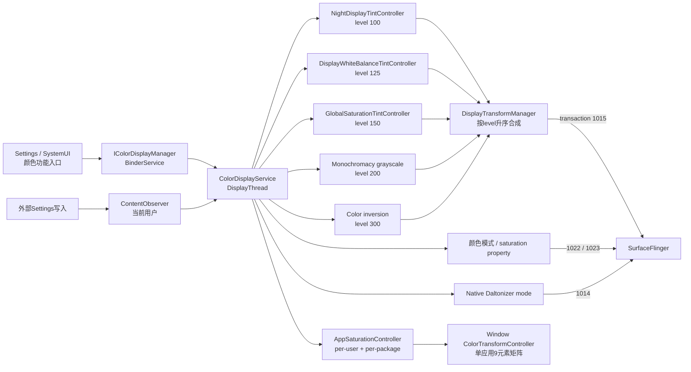
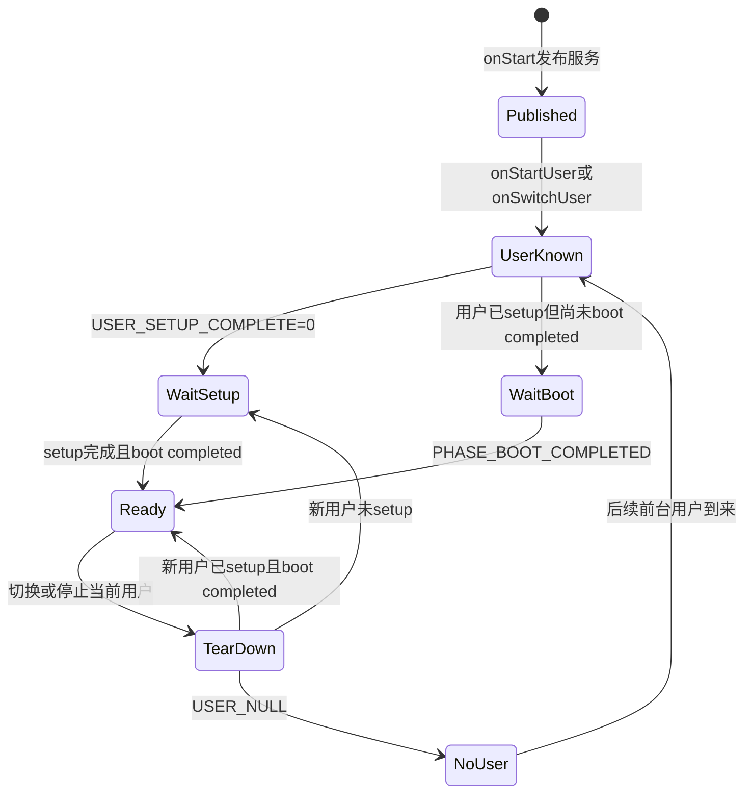

# 159 Android ColorDisplayService：Night Display 与颜色矩阵策略

> 源码版本：Android 11 / API 30 / `android-11.0.0_r48`  
> 学习方式：macOS 只读源码，不要求编译、不要求连接设备  
> 前置章节：第 68、95、154、158 章

---

## 1. 本章要解决什么

前一章沿 Display White Balance（DWB）讲清了“环境色温怎样变成显示白点矩阵”。

但 DWB 只是 Android 显示颜色策略的一部分。系统还要同时处理：

- Night Display 夜间暖色；
- Natural、Boosted、Saturated、Automatic 等颜色模式；
- 全局降低饱和度；
- 单个应用降低饱和度；
- 色弱辅助（Daltonizer / grayscale）；
- 颜色反转；
- DWB 与上述功能的互斥关系；
- 多用户设置切换；
- 矩阵动画和 SurfaceFlinger 下发。

这些能力的总协调者是：

```text
ColorDisplayService
```

本章重点回答：

1. 服务何时发布，何时才真正读取当前用户设置？
2. 为什么 `USER_SETUP_COMPLETE` 也会影响颜色功能初始化？
3. 用户手动打开或关闭 Night Display 后，自动日程为什么不会马上把它改回去？
4. 自定义时间和日出日落模式分别怎样决定当前状态？
5. Night Display 色温如何变成 RGB 对角矩阵？
6. 颜色模式与 Night Display 系数为什么必须一起切换？
7. Night Display、DWB、饱和度、灰度、反色怎样合成？
8. 哪些功能可以叠加，哪些功能明确互斥？
9. Android 11 r48 有哪些多用户、线程和状态缓存边界值得警惕？

---

## 2. 一句话总览

> `ColorDisplayService` 是 system_server 中的“显示颜色策略编排器”：它在 `onStart()` 先发布 Binder/LocalService，但等到 boot completed、前台用户明确且该用户完成初始设置后，才监听此用户的 Settings；之后把 Night Display、颜色模式、无障碍、DWB 和饱和度分别转换为 SurfaceFlinger 颜色模式、Daltonizer 模式或不同 level 的 4×4 矩阵，并由 `DisplayTransformManager` 按 level 升序相乘成一个全局颜色矩阵。

需要先记住三个层次：

```text
用户想要什么
    Settings.Secure / Settings.System

Framework当前决定应用什么
    ColorDisplayService + 各TintController

SurfaceFlinger最终收到什么
    颜色模式、Daltonizer模式、合成后的全局4×4矩阵
```

“设置已打开”不一定等于“效果正在生效”。例如 DWB 用户开关为 true，但 Night Display 正在激活时，DWB 会被暂时压制。

---

## 3. 源码地图

```text
frameworks/base/services/core/java/com/android/server/display/color/
├── ColorDisplayService.java
├── DisplayTransformManager.java
├── TintController.java
├── GlobalSaturationTintController.java
├── AppSaturationController.java
└── DisplayWhiteBalanceTintController.java

frameworks/base/core/java/android/hardware/display/
├── ColorDisplayManager.java
└── IColorDisplayManager.aidl

frameworks/base/services/core/java/com/android/server/twilight/
├── TwilightManager.java
├── TwilightService.java
└── TwilightState.java

frameworks/base/services/tests/servicestests/src/com/android/server/display/color/
├── ColorDisplayServiceTest.java
├── GlobalSaturationTintControllerTest.java
└── AppSaturationControllerTest.java

frameworks/base/core/res/res/values/
├── config.xml
└── symbols.xml
```

建议阅读顺序：

```text
ColorDisplayService生命周期
→ NightDisplayTintController
→ CustomNightDisplayAutoMode
→ TwilightNightDisplayAutoMode
→ onDisplayColorModeChanged
→ 无障碍与DWB互斥
→ DisplayTransformManager
→ 两种SaturationController
→ 测试用例
```

---

## 4. 整体架构图



图中要特别注意：

- 单应用饱和度不进入 `DisplayTransformManager` 的全局矩阵；
- Daltonizer 的普通色弱模式走 transaction 1014，也不是 level 矩阵；
- 只有“模拟全色盲”在 native Daltonizer 不支持时，才转成 level 200 灰度矩阵；
- 颜色模式还会单独改变 SurfaceFlinger 的 composition/display color 行为。

---

## 5. 服务先发布，策略后初始化

### 5.1 构造函数选用 DisplayThread

```java
public ColorDisplayService(Context context) {
    super(context);
    mHandler = new TintHandler(DisplayThread.get().getLooper());
}
```

这里不是创建服务私有 `HandlerThread`，而是使用 system_server 共享的 `DisplayThread`。

`TintHandler` 还是 async Handler：

```java
private TintHandler(Looper looper) {
    super(looper, null, true /* async */);
}
```

async 消息可以越过 Looper 的同步屏障，但仍然：

- 只有一个 Looper 串行执行这些消息；
- 不能把耗时工作无限塞进去；
- “async”不等于并行线程池。

### 5.2 `onStart()` 发布三类入口

```java
public void onStart() {
    publishBinderService(Context.COLOR_DISPLAY_SERVICE, new BinderService());
    publishLocalService(ColorDisplayServiceInternal.class,
            new ColorDisplayServiceInternal());
    publishLocalService(DisplayTransformManager.class,
            new DisplayTransformManager());
}
```

三类入口职责不同：

| 入口 | 主要调用方 | 是否跨进程 | 用途 |
|---|---|---:|---|
| `IColorDisplayManager` Binder | Settings/SystemUI/系统应用 | 可以 | 用户颜色功能 API |
| `ColorDisplayServiceInternal` | DPC 等 system_server 服务 | 否 | DWB CCT、单窗口控制器接入 |
| `DisplayTransformManager` | system_server 内部服务 | 否 | 直接维护全局颜色矩阵和 SF 状态 |

`onStart()` 返回只说明入口已经发布，不代表当前用户的 Night Display 已完成恢复。

### 5.3 两个真正的初始化门

策略初始化还要等待：

```text
Boot phase >= PHASE_BOOT_COMPLETED
AND
当前用户 USER_SETUP_COMPLETE == 1
```

原因不是颜色矩阵本身必须等开机完成，而是服务要在用户可用、用户设置状态明确后，建立稳定的 Settings 监听和自动模式。

---

## 6. 多用户初始化状态机



### 6.1 `onStartUser()` 不会抢走已有前台用户

```java
public void onStartUser(int userHandle) {
    if (mCurrentUser == UserHandle.USER_NULL) {
        Message message = mHandler.obtainMessage(MSG_USER_CHANGED);
        message.arg1 = userHandle;
        mHandler.sendMessage(message);
    }
}
```

系统可能启动多个用户，但颜色策略只追踪一个 `mCurrentUser`。首次没有用户时，`onStartUser()` 可选中它；后续真正切换依赖 `onSwitchUser()`。

### 6.2 所有用户切换先投递到 DisplayThread

```java
public void onSwitchUser(int userHandle) {
    Message message = mHandler.obtainMessage(MSG_USER_CHANGED);
    message.arg1 = userHandle;
    mHandler.sendMessage(message);
}
```

这样 `setUp()`、`tearDown()`、颜色动画和大部分 Settings 回调都在同一 Looper 上串行处理。

### 6.3 未完成初始设置的用户只监听一个开关

```java
if (!isUserSetupCompleted(cr, mCurrentUser)) {
    mUserSetupObserver = new ContentObserver(mHandler) {
        public void onChange(boolean selfChange, Uri uri) {
            if (isUserSetupCompleted(cr, mCurrentUser)) {
                cr.unregisterContentObserver(this);
                mUserSetupObserver = null;
                if (mBootCompleted) {
                    setUp();
                }
            }
        }
    };
    cr.registerContentObserver(
            Secure.getUriFor(Secure.USER_SETUP_COMPLETE),
            false, mUserSetupObserver, mCurrentUser);
}
```

在 setup wizard 完成以前，服务不会把 Night Display、无障碍颜色和 DWB 的整套 observer 都装上。

### 6.4 `setUp()` 监听的是当前用户

它给同一个 `mContentObserver` 注册多条 URI：

```text
Secure.NIGHT_DISPLAY_ACTIVATED
Secure.NIGHT_DISPLAY_COLOR_TEMPERATURE
Secure.NIGHT_DISPLAY_AUTO_MODE
Secure.NIGHT_DISPLAY_CUSTOM_START_TIME
Secure.NIGHT_DISPLAY_CUSTOM_END_TIME
System.DISPLAY_COLOR_MODE
Secure.ACCESSIBILITY_DISPLAY_INVERSION_ENABLED
Secure.ACCESSIBILITY_DISPLAY_DALTONIZER_ENABLED
Secure.ACCESSIBILITY_DISPLAY_DALTONIZER
Secure.DISPLAY_WHITE_BALANCE_ENABLED
```

每次注册都传 `mCurrentUser`，所以 observer 看到的是当前前台用户的设置变化。

### 6.5 初始化顺序不是随意的

`setUp()` 的顺序可以概括为：

```text
1. 注册当前用户Settings observer
2. 先恢复反色和色弱辅助
3. 建立颜色模式→composition color space映射
4. 恢复颜色模式，并同步Night Display矩阵系数
5. 重建Night Display状态和自动模式
6. 初始化DWB，并重新计算能否激活
```

源码明确说无障碍先应用，因为它会限制其他颜色模式。

---

## 7. `tearDown()` 做了什么，又没有做什么

```java
private void tearDown() {
    if (mContentObserver != null) {
        getContext().getContentResolver()
                .unregisterContentObserver(mContentObserver);
    }

    if (mNightDisplayTintController.isAvailable(getContext())) {
        if (mNightDisplayAutoMode != null) {
            mNightDisplayAutoMode.onStop();
            mNightDisplayAutoMode = null;
        }
        mNightDisplayTintController.endAnimator();
    }

    if (mDisplayWhiteBalanceTintController.isAvailable(getContext())) {
        mDisplayWhiteBalanceTintController.endAnimator();
    }

    if (mGlobalSaturationTintController.isAvailable(getContext())) {
        mGlobalSaturationTintController.setActivated(null);
    }
}
```

它会：

- 注销当前用户 Settings observer；
- 停止 Night Display 自动模式；
- 结束 Night Display / DWB 动画；
- 把全局饱和度 controller 的 activated 状态重置成“未设置”。

它没有显式做：

- 没有逐个把 `DisplayTransformManager` 中的矩阵清为 null；
- 没有把 Night Display 的 `mColorTemp` 缓存清空；
- 没有清空 `AppSaturationController` 的 per-user 数据；
- `endAnimator()` 的语义是结束动画并到达末值，不是撤销颜色效果。

因此，用户切换不是“先把屏幕恢复完全 identity，再加载新用户”。更准确的理解是：

```text
停止旧用户的观察者和自动策略
→ 结束在途动画
→ 随后用新用户设置覆盖全局显示状态
```

如果新用户还没完成 setup，旧矩阵何时被覆盖要结合后续流程看，不能仅凭 `tearDown()` 假设屏幕立即清零。

---

## 8. Night Display 的三个状态不要混在一起

### 8.1 用户持久化设置

```text
Secure.NIGHT_DISPLAY_ACTIVATED
```

它表示当前用户保存的开关值。

### 8.2 Controller 内存状态

`TintController` 使用可空 `Boolean`：

```text
null  = 当前内存状态尚未初始化
false = 已初始化且关闭
true  = 已初始化且打开
```

所以第一次恢复设置时，即使设置为 false，也需要从 null 进入 false。

### 8.3 实际矩阵

```java
public float[] getMatrix() {
    return isActivated() ? mMatrix : MATRIX_IDENTITY;
}
```

controller 可一直保留“暖色目标矩阵”，但关闭时向 DTM 返回 identity。

因此：

```text
色温参数仍是3200K
不代表当前屏幕正在变暖
```

还要看 activated。

---

## 9. 手动切换与 `LAST_ACTIVATED_TIME`

### 9.1 真正状态变化才记录时间

```java
public void setActivated(Boolean activated,
        LocalDateTime lastActivationTime) {
    if (activated == null) {
        super.setActivated(null);
        return;
    }

    boolean changed = activated != isActivated();
    if (!isActivatedStateNotSet() && changed) {
        Secure.putStringForUser(cr,
                Secure.NIGHT_DISPLAY_LAST_ACTIVATED_TIME,
                lastActivationTime.toString(), mCurrentUser);
    }

    if (isActivatedStateNotSet() || changed) {
        super.setActivated(activated);
        if (isActivatedSetting() != activated) {
            Secure.putIntForUser(cr,
                    Secure.NIGHT_DISPLAY_ACTIVATED,
                    activated ? 1 : 0, mCurrentUser);
        }
        onActivated(activated);
    }
}
```

首次从 null 恢复设置不写“最后手动时间”。否则每次 system_server 重启都会把恢复动作误记成用户刚刚切换。

### 9.2 手动切换的目的不只是改变当前矩阵

假设自定义日程是：

```text
22:00 开启
07:00 关闭
```

用户在 23:00 手动关闭，合理体验应当是：

```text
23:00 到次日07:00：尊重用户手动关闭
次日07:00：跨过日程边界，恢复自动策略
次日22:00：自动打开
```

`LAST_ACTIVATED_TIME` 就是用来判断“手动选择是否发生在当前日程周期”的。

### 9.3 自动改变会记录边界时间，不一定记录 now

自定义模式调用：

```java
mNightDisplayTintController.setActivated(
        activate, activate ? start : end);
```

例如系统 23:30 才恢复运行，而日程 22:00 本应开启，写入的是 22:00 边界，而不是 23:30 的实际执行时刻。

这样后续算法知道这是“本周期的自动边界”，不会把延迟执行误当成用户手动操作。

---

## 10. 色温怎样变成 Night Display 矩阵

### 10.1 只调整 RGB 三个对角线

```java
Matrix.setIdentityM(mMatrix, 0);

float t2 = cct * cct;
float red = t2 * c[0] + cct * c[1] + c[2];
float green = t2 * c[3] + cct * c[4] + c[5];
float blue = t2 * c[6] + cct * c[7] + c[8];

mMatrix[0] = red;
mMatrix[5] = green;
mMatrix[10] = blue;
```

它不是前一章 DWB 那套“目标白点→Bradford→RGB space”的完整色彩适应算法，而是 OEM 资源给出三组二次多项式：

```text
R(t) = ar·t² + br·t + cr
G(t) = ag·t² + bg·t + cg
B(t) = ab·t² + bb·t + cb
```

最后形成近似：

```text
| R 0 0 0 |
| 0 G 0 0 |
| 0 0 B 0 |
| 0 0 0 1 |
```

### 10.2 线性颜色空间和 native 模式使用不同系数

```java
String[] coefficients = resources.getStringArray(needsLinear
        ? R.array.config_nightDisplayColorTemperatureCoefficients
        : R.array.config_nightDisplayColorTemperatureCoefficientsNative);
```

同一个 3200K，如果矩阵作用的颜色空间不同，不能直接复用同一套系数。

所以切颜色模式时必须：

```text
重新选择系数
→ 用当前设置色温重算矩阵
→ 再切SurfaceFlinger颜色模式
```

### 10.3 设置值会被钳位

未设置时使用默认值；低于最小值或高于最大值时钳位到资源范围。

但有个细节：`setColorTemperature(int)` 先把原始参数放进 `mColorTemp`，getter 返回时才钳位；写入 Settings 的仍是传入原值。视觉计算的 `onColorTemperatureChanged(temperature)` 又直接用原值调用 `setMatrix()`。

也就是说 Binder setter 的即时矩阵路径，并没有先显式调用 clamp 后再计算。这是阅读时不能被 getter 名称掩盖的实现边界。

---

## 11. 开关动画与色温滑杆是两条路径

### 11.1 打开/关闭：3 秒动画

```text
setActivated
→ onActivated
→ MSG_APPLY_NIGHT_DISPLAY_ANIMATED
→ applyTint(..., false)
```

`applyTint()` 从 DTM 当前 level 矩阵插值到目标矩阵：

```java
float[] from = dtm.getColorMatrix(controller.getLevel());
float[] to = controller.getMatrix();

TintValueAnimator animator = TintValueAnimator.ofMatrix(
        evaluator,
        from == null ? MATRIX_IDENTITY : from,
        to);
animator.setDuration(TRANSITION_DURATION);
```

Android 11 中 `TRANSITION_DURATION` 为 3000ms。

### 11.2 调整色温：立即替换

```text
setColorTemperature
→ onColorTemperatureChanged
→ MSG_APPLY_NIGHT_DISPLAY_IMMEDIATE
→ applyTint(..., true)
```

这样拖动色温滑杆时不会每个点都重新启动三秒动画。

若 Night Display 当前关闭，controller 的 `getMatrix()` 返回 identity，因此调整参数不会让屏幕突然变暖；它只更新下次启用的目标矩阵。

---

## 12. 自定义时间模式：怎样算当前属于哪一夜

### 12.1 先构造“最近开始”和“对应结束”

辅助函数：

```java
getDateTimeBefore(startTime, now)
getDateTimeAfter(endTime, start)
```

以当前时间 `2026-08-13 23:30`、开始 22:00、结束 07:00 为例：

```text
start = 2026-08-13 22:00
end   = 2026-08-14 07:00
now < end，所以自动基线 = 开启
```

以当前时间 `2026-08-13 06:00` 为例：

```text
start = 2026-08-12 22:00
end   = 2026-08-13 07:00
now < end，所以自动基线 = 开启
```

以当前时间 `2026-08-13 12:00` 为例：

```text
start = 2026-08-12 22:00
end   = 2026-08-13 07:00
now >= end，所以自动基线 = 关闭
```

### 12.2 核心算法

```java
LocalDateTime now = LocalDateTime.now();
LocalDateTime start = getDateTimeBefore(mStartTime, now);
LocalDateTime end = getDateTimeAfter(mEndTime, start);
boolean activate = now.isBefore(end);

if (mLastActivatedTime != null) {
    if (mLastActivatedTime.isBefore(now)
            && mLastActivatedTime.isAfter(start)
            && (mLastActivatedTime.isAfter(end)
                    || now.isBefore(end))) {
        activate = isActivatedSetting();
    }
}
```

先按日程算基线，再判断最后切换是否属于当前周期。如果属于，就保留当前用户设置。

### 12.3 用时间线理解手动覆盖

```mermaid
timeline
    title 自定义日程 22:00—07:00，用户在23:00手动关闭
    21:59 : 自动基线关闭
    22:00 : 日程边界，自动打开
    23:00 : 用户手动关闭，记录LAST_ACTIVATED_TIME
    02:00 : 仍在同一夜，保留手动关闭
    07:00 : 跨过结束边界，手动覆盖失效
    22:00 : 新周期再次自动打开
```

### 12.4 下一次 Alarm

```java
LocalDateTime next = activated
        ? getDateTimeAfter(mEndTime, now)
        : getDateTimeAfter(mStartTime, now);

mAlarmManager.setExact(
        AlarmManager.RTC, millis, TAG, this, null);
```

状态为开时等待 end，状态为关时等待 start。

这里使用：

```text
RTC
不是 RTC_WAKEUP
```

所以它是 wall-clock 精确 Alarm，但不会仅为 Night Display 把休眠设备唤醒。设备睡过边界时，实际处理可以晚于边界。

### 12.5 为什么监听 TIME_SET 和 TIMEZONE_CHANGED

自定义时间按本地日历时间解释。

用户改系统时间或时区后：

```text
旧的epoch alarm时刻可能已经不对应本地22:00
```

receiver 收到变化后重新运行 `updateActivated()`，再重新安排下一个 alarm。

### 12.6 开始时间等于结束时间

辅助函数在“相等”时不强制跨天：

```text
start == end
→ end可与start是同一LocalDateTime
→ now.isBefore(end)通常为false
```

因此源码语义接近“零长度区间”，不是“全天开启”。

---

## 13. Twilight 模式：把日出日落当动态边界

Twilight 模式不自己设置 Alarm，而是注册：

```java
mTwilightManager.registerListener(this, mHandler);
```

listener 明确投递到 `mHandler`，因此 Twilight 更新在 DisplayThread 处理。

### 13.1 基线状态

```java
boolean activate = state.isNight();
```

`TwilightState` 为空时不猜测，保持现状：

```java
if (state == null) {
    return;
}
```

### 13.2 仍然要尊重当前周期内的手动选择

```java
if (last.isBefore(now)
        && (last.isBefore(sunrise) ^ last.isBefore(sunset))) {
    activate = isActivatedSetting();
}
```

这里的异或 `^` 表示：最后切换时间相对 sunrise 和 sunset 的比较结果不同，即它位于这两个边界之间。

更直白地说：

```text
如果最后一次手动切换发生在当前昼/夜周期内
就保留用户当前设置
否则采用TwilightState.isNight()
```

### 13.3 Custom 与 Twilight 的共同模型

| 项目 | 自定义时间 | Twilight |
|---|---|---|
| 边界来源 | 用户设置 LocalTime | TwilightService 动态日出日落 |
| 自己安排 Alarm | 是 | 否 |
| 时间/时区广播 | 自己监听 | 由 Twilight 链处理 |
| 基线 | `now < end` | `state.isNight()` |
| 手动覆盖 | `LAST_ACTIVATED_TIME` | `LAST_ACTIVATED_TIME` |
| state 不可用 | 仍可按时钟算 | 保持当前状态 |

---

## 14. 切换自动模式为什么清空最后激活时间

```java
if (getNightDisplayAutoModeInternal() != autoMode) {
    Secure.putStringForUser(cr,
            Secure.NIGHT_DISPLAY_LAST_ACTIVATED_TIME,
            null, mCurrentUser);
}
Secure.putIntForUser(cr,
        Secure.NIGHT_DISPLAY_AUTO_MODE,
        autoMode, mCurrentUser);
```

假设用户从“22:00—07:00”切到“日落到日出”。旧的手动切换时间属于旧边界语境，如果直接保留，可能错误覆盖新模式的首次判断。

所以切换模式时清空它，让新模式从自己的基线重新初始化。

注意两次 Settings 写不是一个数据库事务：

```text
先清last
再写auto mode
```

但它们都在服务控制路径中顺序执行，observer 最终会根据新设置重建模式。

---

## 15. 颜色模式不只是一张矩阵

Android 11 定义的主要模式：

| 模式 | SF saturation | display color | 是否需要线性矩阵 |
|---|---:|---|---:|
| Natural | 1.0 | managed | 是 |
| Boosted | 1.1 | managed | 是 |
| Saturated | 1.0 | unmanaged | 否 |
| Automatic | 1.0 | enhanced | 是 |
| Vendor range | 1.0 | vendor mode | 按实现函数为是 |

`DisplayTransformManager.setColorMode()` 同时做：

```text
1. transaction 1022：SurfaceFlinger saturation
2. transaction 1023：display color / composition color space
3. level 100：重新放入Night Display矩阵
4. ActivityTaskManager.updateConfiguration()
```

后一步会让应用配置感知颜色模式变化。

### 15.1 持久化属性与用户设置是两套来源

如果当前用户 `System.DISPLAY_COLOR_MODE` 未设置，会从：

```text
persist.sys.sf.native_mode
persist.sys.sf.color_saturation
```

推断当前模式。

用户设置一旦存在，则优先使用 per-user `Settings.System`。

### 15.2 不再可用时只做有限回退

例如升级后原模式不在 `config_availableColorModes`：

```text
Boosted  → Natural（若可用）
Saturated ↔ Automatic（若另一方可用）
其他情况 → -1
```

它不是“任意选列表第一个”。

### 15.3 无障碍可以覆盖用户颜色模式

```java
if (isAccessibilityEnabled()) {
    int mode = resources.getInteger(
            R.integer.config_accessibilityColorMode);
    if (mode >= 0) {
        return mode;
    }
}
```

用户设置并未被删除，只是 `getColorModeInternal()` 在无障碍生效时返回 OEM 指定的兼容模式。

无障碍关闭后，原用户模式可重新成为有效选择。

---

## 16. 为什么颜色模式变化要先重算 Night Display

```java
private void onDisplayColorModeChanged(int mode) {
    mNightDisplayTintController.cancelAnimator();
    mDisplayWhiteBalanceTintController.cancelAnimator();

    mNightDisplayTintController.setUp(
            context,
            DisplayTransformManager.needsLinearColorMatrix(mode));
    mNightDisplayTintController.setMatrix(
            mNightDisplayTintController.getColorTemperatureSetting());

    dtm.setColorMode(mode,
            mNightDisplayTintController.getMatrix(),
            getCompositionColorSpace(mode));

    updateDisplayWhiteBalanceStatus();
}
```

顺序非常关键：

```text
取消旧空间下的动画
→ 为新空间选择Night Display系数
→ 重算Night矩阵
→ 切换SF颜色模式并立即放入新Night矩阵
→ 再判断DWB能否激活
```

如果先切模式、稍后才更新 Night 矩阵，中间就可能出现“用旧颜色空间系数解释新颜色空间”的短暂错误。

DWB 的 `needsLinearColorMatrix()` 又依赖 DTM 刚写入的 display color 状态，所以源码注释明确要求 `dtm.setColorMode()` 在 `updateDisplayWhiteBalanceStatus()` 前。

---

## 17. 无障碍颜色变换有两条实现路线

### 17.1 普通 Daltonizer 模式

```java
dtm.setColorMatrix(LEVEL_COLOR_MATRIX_GRAYSCALE, null);
dtm.setDaltonizerMode(daltonizerMode);
```

它清除 Framework 灰度矩阵，再通过 SurfaceFlinger transaction 1014 设置 native Daltonizer。

### 17.2 模拟全色盲

```java
if (mode == DALTONIZER_SIMULATE_MONOCHROMACY) {
    dtm.setColorMatrix(LEVEL_COLOR_MATRIX_GRAYSCALE,
            MATRIX_GRAYSCALE);
    dtm.setDaltonizerMode(DALTONIZER_DISABLED);
}
```

因为 native Daltonizer 不支持此模式，Framework 用 level 200 灰度矩阵代替。

### 17.3 颜色反转

```java
dtm.setColorMatrix(
        LEVEL_COLOR_MATRIX_INVERT_COLOR,
        enabled ? MATRIX_INVERT_COLOR : null);
```

反色是 level 300，全局参与矩阵合成。

### 17.4 改 enabled 和改 mode 的回调不完全相同

```text
DALTONIZER_ENABLED变化
→ 更新Daltonizer
→ onAccessibilityActivated
→ 重新选择颜色模式和DWB状态

DALTONIZER模式值变化
→ 只更新Daltonizer/灰度实现
```

因为“模式值改变”不代表无障碍从无到有或从有到无，颜色模式强制状态通常不需重新切换。

---

## 18. 哪些效果互斥，哪些可以叠加

### 18.1 DWB 的激活公式

```java
DWB active = settingEnabled
        && !nightDisplayActivated
        && !accessibilityEnabled
        && needsLinearColorMatrix();
```

因此 DWB 与以下功能互斥：

- Night Display；
- 色弱辅助 enabled；
- 颜色反转 enabled；
- 不需要线性矩阵的 Saturated 模式。

### 18.2 Night Display 没有被无障碍直接关掉

无障碍启用时：

- 可能强制切到兼容颜色模式；
- Night Display 会按新模式重新选择系数；
- Night Display level 100 仍可与灰度 level 200、反色 level 300 合成。

所以不能写成“无障碍打开后所有 Night Display 都关闭”。

### 18.3 全局降低饱和度可以参与合成

它位于 level 150，理论上可与 Night Display、灰度、反色共同存在。

### 18.4 单应用饱和度走独立路径

它只影响目标 AppWindow，不影响整个屏幕，也不进入全局 level 150。

---

## 19. 颜色矩阵 level 与合成规则

```text
100  Night Display
125  Display White Balance
150  Global Saturation
200  Grayscale
300  Invert Color
```

`SparseArray` 按 key 升序遍历：

```java
Matrix.setIdentityM(result[0], 0);
for (int i = 0; i < count; i++) {
    float[] rhs = mColorMatrix.valueAt(i);
    Matrix.multiplyMM(
            result[(i + 1) % 2], 0,
            result[i % 2], 0,
            rhs, 0);
}
```

最终近似写成：

```text
M = I × M100 × M125 × M150 × M200 × M300
```

注意两件事：

1. “按 level 升序遍历”是源码事实；
2. 矩阵乘法不满足交换律，不能随意调换 level。

如果把颜色向量当列向量，数学上最右侧矩阵先作用；阅读这里最好遵守代码乘法方向，不要只凭“level 越小越先作用”的口语猜测像素计算顺序。

### 19.1 设置 null 是删除该层

```java
if (value == null) {
    mColorMatrix.remove(level);
}
```

删除后重新计算剩余层，并立即 transaction 1015 下发。

### 19.2 DTM 保存副本

写入和读取都会复制数组，避免 controller 后续原地修改矩阵时绕过 `setColorMatrix()` 的变更检测与下发。

### 19.3 每个动画帧都是一次同步 Binder transact

Animator update listener 每帧调用：

```text
dtm.setColorMatrix
→ computeColorMatrixLocked
→ sFlinger.transact(1015)
```

它运行在 DisplayThread。transaction 没有 `FLAG_ONEWAY`，因此从 Java 视角是同步 Binder 调用；但返回仍不等于显示面板已经扫描出新颜色。

---

## 20. 全局饱和度：0 到 100 的灰度插值

### 20.1 API 与 controller

Binder setter 只负责验权和投递消息：

```java
Message msg = mHandler.obtainMessage(MSG_APPLY_GLOBAL_SATURATION);
msg.arg1 = level;
mHandler.sendMessage(msg);
return true;
```

真正钳位在 controller：

```java
if (level < 0) level = 0;
else if (level > 100) level = 100;
```

因此 Binder 的 true 表示请求已接受进 Handler，不代表动画已完成，也不代表传入参数原样应用。

### 20.2 level 100 是 identity

```java
if (saturationLevel == 100) {
    setActivated(false);
    Matrix.setIdentityM(matrix, 0);
}
```

低于 100 时，以亮度权重：

```text
R 0.231
G 0.715
B 0.072
```

计算 3×3 去饱和部分。

### 20.3 r48 的 4×4 尾元素为 0：测试契约与消费端约束冲突

controller 首次设置低于 100 时只写 3×3 的九个关键位置，没有先做 4×4 identity 初始化。因此 `matrix[15]` 仍为 0。

`GlobalSaturationTintControllerTest` 明确期望：

```text
... 0, 0, 0, 0
```

所以在本版本学习笔记里应记录为“r48 的明确实现与测试契约”，不能仅因为常见齐次矩阵右下角是 1 就断言为缺陷。

但继续读到 SurfaceFlinger 的 transaction 1015 后，还必须补上另一半证据。接收端明确检查传入矩阵最后一行为：

```text
{0, 0, 0, 1}
```

不满足时打印：

```text
The color transform's last row must be (0, 0, 0, 1)
```

它只记录错误，没有拒绝矩阵。RenderEngine 的 RGB shader 又把 4×4 乘积直接取 `vec3`，所以错误的 w 分量在纯 GPU RGB 路径未必立刻改变 RGB；但同一矩阵也会交给 HWC 的 arbitrary color transform，不能据此泛化为完全无害。

因此准确结论是：

```text
Controller生产代码和单测认可尾值0
但SurfaceFlinger消费端要求尾值1
```

这是 r48 内部契约不一致，已经有跨模块证据，强于“矩阵书写习惯不同”；至于具体 HWC 是否拒绝、设备上是否出现可见异常，仍需运行时验证。

---

## 21. 单应用饱和度：多个调用者取最强限制

### 21.1 数据键

```text
affectedPackageName
  → userId
    → SaturationController
      → callingPackageName : requestedLevel
```

例如：

```text
数字健康要求 com.demo = 20
另一个系统组件要求 com.demo = 60
```

有效值取最小：

```java
int level = 100;
for (...) {
    if (requested < level) {
        level = requested;
    }
}
```

得到 20，即“去饱和最强者获胜”。

### 21.2 100 表示调用者撤销自己的限制

```java
if (saturationLevel == 100) {
    mSaturationLevels.remove(callingPackageName);
}
```

它不会删掉其他调用者的要求。

### 21.3 Window controller 使用 WeakReference

Activity/Window 接入时提供：

```text
WeakReference<ColorTransformController>
```

服务不会仅因为保存引用就阻止窗口对象回收；失效引用在后续更新或附加时惰性清理。

### 21.4 返回 false 不等于策略没保存

如果当前没有活着的 window controller：

```text
饱和度要求仍写入内存map
但没有窗口可立即更新
所以返回false
```

未来窗口 attach 时会应用已保存策略。

### 21.5 这组数据不持久化

`AppSaturationController` 是 system_server 内存结构，不写 Settings 或文件。system_server 重启后要由策略调用方重新建立。

---

## 22. Binder API 的完成语义

不同方法的返回值不能统一理解：

| API | 返回含义 | 视觉变化 |
|---|---|---|
| `setNightDisplayActivated` | 固定返回 true | 后续 DisplayThread 3秒动画 |
| `setNightDisplayColorTemperature` | Settings 写入结果 | 即时消息，可能很快改矩阵 |
| `setSaturationLevel` | 请求已投递，固定 true | 后续3秒动画 |
| `setAppSaturationLevel` | 是否至少更新一个活 controller | 也可能已保存策略但返回false |
| `setColorMode` | void，完成设置写入调用 | observer 后续应用 |

尤其是 Night Display activated：

```java
mNightDisplayTintController.setActivated(activated);
return true;
```

内部对 `Secure.putIntForUser()` 的 boolean 结果没有传回 Binder。因此这个 true 不能当成“持久化成功证明”。

### 22.1 为什么要 clear calling identity

BinderService 在验权后：

```java
long token = Binder.clearCallingIdentity();
try {
    // 访问Settings、LocalServices等
} finally {
    Binder.restoreCallingIdentity(token);
}
```

这样后续系统内部操作以 system_server 身份执行，而不是携带 Settings/SystemUI 调用者 UID。

调用者真实包名需要在 clear 前取，例如单应用饱和度先用 calling UID 查包名。

---

## 23. 线程模型：大部分串行，但 Custom 模式有例外

### 23.1 明确在 DisplayThread 的路径

- 用户切换消息；
- Settings `ContentObserver`；
- Tint 动画；
- Twilight listener（注册时传 `mHandler`）；
- Global saturation 消息；
- DWB 应用消息。

### 23.2 Custom 时间广播没有指定 Handler

```java
getContext().registerReceiver(mTimeChangedReceiver, intentFilter);
```

没有 scheduler 的动态 receiver 通常在注册 Context 所属进程主线程分发。

receiver 直接调用：

```java
updateActivated();
```

### 23.3 Alarm listener 也传了 null Handler

```java
mAlarmManager.setExact(
        AlarmManager.RTC, millis, TAG, this, null);
```

`AlarmManager` 对 `OnAlarmListener` 的 target Handler 为 null 时，会使用其主线程 Handler 包装回调。

所以 Custom 模式的 `updateActivated()` 可能来自：

```text
DisplayThread：onStart、Settings变化、激活回调
system_server主线程：TIME_SET/TIMEZONE_CHANGED、Alarm回调
```

而相关字段没有专门锁。

这是 r48 的真实线程边界。学习时不应把整个 `ColorDisplayService` 简化成“所有状态严格由 DisplayThread 单线程拥有”。是否在具体设备形成可见竞态，还取决于事件时序，不能只凭可能性直接声称必现故障。

---

## 24. r48 多用户源码观察

本节专门把“确定事实”和“风险推断”分开。

### 24.1 最后激活时间写当前用户

```java
Secure.putStringForUser(
        cr,
        Secure.NIGHT_DISPLAY_LAST_ACTIVATED_TIME,
        time.toString(),
        mCurrentUser);
```

### 24.2 读取却使用 Context userId

```java
Secure.getStringForUser(
        cr,
        Secure.NIGHT_DISPLAY_LAST_ACTIVATED_TIME,
        getContext().getUserId());
```

这与同类 getter 普遍使用 `mCurrentUser` 不一致。

确定事实：

```text
写入参数 = mCurrentUser
读取参数 = getContext().getUserId()
```

合理风险判断：

```text
若ColorDisplayService持有的是system user Context，
而前台用户是secondary user，
则自动模式可能读取到错误用户的LAST_ACTIVATED_TIME。
```

这里应写“可能/风险”，因为最终 userId 还取决于服务 Context 的创建方式；不过 system_server 的基础 Context 通常属于 system user，因此这个不一致值得代码审查。

### 24.3 `mColorTemp` 是服务级缓存

```java
private Integer mColorTemp;
```

它在 Binder setter 中写入，但 `tearDown()` 和用户切换没有清空：

```java
int getColorTemperature() {
    return mColorTemp != null
            ? clamp(mColorTemp)
            : getColorTemperatureSetting();
}
```

同时 `setUp()` 重算矩阵用的是当前用户 Settings 值，而 getter 又可能继续返回旧缓存。

因此存在跨用户返回陈旧瞬态值、observer 比较基准不一致的风险。它是否在产品 UI 中稳定复现，还要看调用路径是否曾通过 Binder setter 写入 `mColorTemp`、用户切换时序和 Settings observer 行为。

### 24.4 `tearDown()` 不清全局矩阵

旧用户动画结束后，DTM 中矩阵仍可能保持末值，直至新用户 `setUp()` 覆盖。若新用户尚未 setup，覆盖可能被推迟。

这是代码生命周期事实；把它定性为产品 bug 需要设备行为验证，因此本章只记录为“切换窗口中的状态延续边界”。

---

## 25. 其他容易漏掉的实现边界

### 25.1 `LAST_ACTIVATED_TIME` 同时兼容两种格式

优先解析：

```text
LocalDateTime ISO字符串
```

失败后兼容旧版 epoch millis，并按当前系统默认时区转换。两种格式都失败返回 `LocalDateTime.MIN`。

### 25.2 LocalDateTime 不含时区

新格式保存的是墙上日历时间，没有 ZoneId/offset。时区变化时它仍按同样的本地年月日时分解释，这适合“本地夜晚”语义，但不代表一个固定世界时间瞬间。

### 25.3 Custom time 持久化到秒，但日程计算只取分钟

```java
toSecondOfDay() * 1000
```

读取再除以 1000。纳秒信息不会保存。

但 `getDateTimeBefore()` / `getDateTimeAfter()` 构造边界时只传：

```java
localTime.getHour(), localTime.getMinute()
```

秒也没有进入实际边界计算。因此 r48 虽能在 Settings 整数中往返秒值，自动切换算法的有效精度仍是分钟。

实际设置 UI 通常只提供分钟，因此产品上通常无影响。

### 25.4 ContentObserver 回调只看 URI 最后一段

它不依赖 `selfChange` 过滤，服务自己写 Settings 也可能再次收到通知；但每个分支会比较当前 controller 状态，避免无意义重复应用。

### 25.5 Animator 取消不会强写旧目标

动画被取消时，新动画可以从 DTM 当前中间矩阵开始；旧 listener 在 `onAnimationEnd()` 发现 cancelled 后不会再把旧 `to` 强行写回。

### 25.6 动画 max 日志初始化有诊断边界

```java
max[i] = Float.MIN_VALUE;
```

`Float.MIN_VALUE` 是最小正数，不是最负数。如果某矩阵分量在整段动画都为负，记录的 max 可能错误停留在一个极小正数。

这只影响 min/max 调试日志，不改变动画实际插值和下发矩阵。

---

## 26. 从一个完整场景串起来

设设备配置：

```text
当前用户10已setup
颜色模式Natural
Night Display自定义22:00—07:00
色温3200K
DWB用户开关已开
无障碍关闭
全局饱和度80
```

### 26.1 21:00

```text
Night Display inactive
DWB active（设置开、Night关、a11y关、linear mode）
level 125 = DWB矩阵
level 150 = 饱和度80矩阵
```

DTM 合成：

```text
M125 × M150
```

### 26.2 22:00 Alarm 到达

Custom 模式计算应开启：

```text
Night false → true
记录边界22:00
通知DWB重算状态 → DWB false
Night level100从identity动画到暖色矩阵
DWB level125动画/清回identity
```

注意两路各自有动画消息，具体瞬间合成矩阵取决于 DisplayThread 消息与 Animator 帧交错；最终稳定状态是 Night 生效、DWB 不生效。

### 26.3 23:00 用户手动关闭 Night Display

```text
LAST_ACTIVATED_TIME = 23:00
Night level100动画回identity
DWB条件重新满足，等待后续CCT更新应用
```

### 26.4 02:00 服务重建自动模式

算法看到 23:00 位于当前 22:00—07:00 周期内，于是保留用户设置 false，不会因为“当前是夜间”又打开。

### 26.5 07:00

跨过 end 边界，日程基线也是 false；本周期手动覆盖自然到期。

### 26.6 次日22:00

进入新周期，自动打开 Night Display。

这就是 `LAST_ACTIVATED_TIME` 的核心用户体验价值。

---

## 27. 如何阅读测试，而不是只读生产代码

`ColorDisplayServiceTest` 对 Custom 和 Twilight 都组合验证：

```text
服务启动时位于日程前 / 日程中 / 日程后
最后状态是开 / 关
最后切换发生在边界前 / 周期内 / 边界后 / 未来
```

例如命名：

```text
customSchedule_whenStartedDuringNight_ifOffDuringNightInPast_turnsOff
```

可以拆成：

```text
当前位于夜间
设置当前为off
最后切换发生在当前夜间且早于now
期望继续off
```

这比孤立阅读复杂 if 条件更容易理解。

但测试也有边界：测试环境的 `mContext.getUserId()` 与 `mUserId` 往往一致，因此不一定能暴露真实 system_server 多用户 Context 的读写 userId 不一致。

---

## 28. macOS 只读练习

以下命令只搜索和打印源码，不编译、不修改源码。

### 练习 1：找服务入口

```bash
cd /Users/ninebot/androidSource
rg -n "publishBinderService|publishLocalService|onBootPhase|onSwitchUser" \
  frameworks/base/services/core/java/com/android/server/display/color/ColorDisplayService.java
```

目标：分清发布完成、boot completed、用户切换和 setup 完成四个事件。

### 练习 2：核对所有 per-user Settings

```bash
rg -n "get(Int|String)ForUser|put(Int|String)ForUser|registerContentObserver" \
  frameworks/base/services/core/java/com/android/server/display/color/ColorDisplayService.java
```

逐行记录最后一个 user 参数是：

```text
mCurrentUser
getContext().getUserId()
还是其他值
```

你会直接看到 LAST_ACTIVATED_TIME 的读写不一致。

### 练习 3：画出自定义日程

```bash
sed -n '960,1085p' \
  frameworks/base/services/core/java/com/android/server/display/color/ColorDisplayService.java
```

手算三组：

```text
start=22:00 end=07:00 now=06:00
start=22:00 end=07:00 now=12:00
start=22:00 end=07:00 now=23:00
```

分别写出 `start`、`end`、`activate`。

### 练习 4：看测试名反推规则

```bash
rg -n "customSchedule_|twilightSchedule_" \
  frameworks/base/services/tests/servicestests/src/com/android/server/display/color/ColorDisplayServiceTest.java
```

任选 8 个测试，不看 body，先根据方法名猜期望，再看 `assertActivated()` 验证。

### 练习 5：核对矩阵 level

```bash
rg -n "LEVEL_COLOR_MATRIX" \
  frameworks/base/services/core/java/com/android/server/display/color
```

把 level 从小到大写在纸上，再标出哪些功能互斥，因此不会稳定同时存在。

### 练习 6：确认 SurfaceFlinger transaction

```bash
rg -n "TRANSACTION_|transact\(" \
  frameworks/base/services/core/java/com/android/server/display/color/DisplayTransformManager.java
```

目标：分清：

```text
1014 Daltonizer
1015 Global Color Matrix
1022 Saturation property path
1023 Display Color mode
1030 Query color managed
```

### 练习 7：比较全局与单应用饱和度

```bash
sed -n '1,130p' \
  frameworks/base/services/core/java/com/android/server/display/color/GlobalSaturationTintController.java

sed -n '50,220p' \
  frameworks/base/services/core/java/com/android/server/display/color/AppSaturationController.java
```

回答：

```text
谁使用4×4矩阵？
谁使用3×3+translation？
谁进入DTM？
谁按user/package隔离？
谁做0..100钳位？
```

### 练习 8：验证 r48 饱和度矩阵契约

```bash
sed -n '1,100p' \
  frameworks/base/services/tests/servicestests/src/com/android/server/display/color/GlobalSaturationTintControllerTest.java
```

不要编译，只观察 level 50 的预期数组最后一个值，并说明为什么不能仅凭通用矩阵知识修改源码结论。

---

## 29. 常见误解纠正

### 误解 1：`onStart()` 后 Night Display 已恢复

错误。`onStart()` 只发布服务；完整恢复还要等 boot completed、当前用户明确和 user setup completed。

### 误解 2：Night Display 开关只看当前时间

错误。自动模式先算时间基线，还要用 `LAST_ACTIVATED_TIME` 判断当前周期是否应保留用户手动选择。

### 误解 3：自动模式晚执行时记录实际执行时间

不完全正确。Custom 自动切换会传入理论 start/end 边界时间。

### 误解 4：Twilight 模式自己每天设 Alarm

错误。它监听 `TwilightManager`；自定义时间模式才直接使用 AlarmManager。

### 误解 5：Exact Alarm 一定唤醒设备

错误。本处是 `AlarmManager.RTC`，不是 `RTC_WAKEUP`。

### 误解 6：无障碍颜色功能一开，Night Display 一定关闭

错误。DWB 明确被无障碍压制；Night Display 可重算系数后继续与灰度/反色合成。

### 误解 7：所有颜色功能都是一张全局矩阵

错误。颜色模式、native Daltonizer、全局矩阵、per-app 矩阵是不同通道。

### 误解 8：level 越小就一定先作用于像素

不严谨。代码按 level 升序执行矩阵乘法，但列向量语义下最右侧先数学作用；应以具体乘法表达式为准。

### 误解 9：Binder setter 返回 true 就表示动画和持久化都成功

错误。不同 API 的 true 含义不同，很多只是请求接受或 controller 操作完成。

### 误解 10：ColorDisplayService 所有回调都在 DisplayThread

错误。Custom 模式的时间广播和 null-target Alarm listener 通常会落到 system_server 主线程。

### 误解 11：切用户时先清空所有颜色矩阵

错误。`tearDown()` 停 observer/自动模式并结束动画，但没有逐 level 清空 DTM。

### 误解 12：单测期望右下角为 0，所以这一定完全正确

不能这样下结论。r48 单测确实期望 0，但 SurfaceFlinger 1015 又明确要求最后一行为 `{0,0,0,1}` 并对该输入打印错误；准确说法是跨模块契约冲突，而不是只凭常识判错，也不是只凭单测判对。

---

## 30. 复读检查：哪些地方最容易不理解

### 30.1 “当前周期”太抽象

已用 22:00—07:00 的三组 now 手算和一张时间线补强。核心不是日期相同，而是：

```text
最近一次start
到与它配对的下一次end
```

### 30.2 `LAST_ACTIVATED_TIME` 是手动时间还是自动时间

两者都可能是。

- 用户手动切换：记录 `LocalDateTime.now()`；
- Custom 自动切换：记录理论 start/end 边界；
- Twilight 自动切换：默认记录回调处理时的 now。

算法依靠“相对周期边界的位置”解释它，而不是另存一个 manual/automatic 标志。

### 30.3 “设置启用”和“controller active”容易混淆

以 DWB 为例：

```text
setting enabled = 用户偏好
controller active = 当前策略门全部满足
matrix applied = DPC有CCT且DisplayThread完成下发
```

三者可能暂时不同。

### 30.4 颜色模式与矩阵关系容易被简化

颜色模式不是 DTM 里的某个 level。它会改 SF saturation/display color、持久化属性、composition color space，并触发 Night/DWB 重新适配。

### 30.5 “矩阵升序合成”容易误读成直觉上的执行顺序

本章保留源码的确切表达：

```text
I × M100 × M125 × M150 × M200 × M300
```

不再用含糊的“先 Night、再 DWB”描述每个像素的数学作用次序。

### 30.6 多用户问题不能写成已证实故障

本章把结论分成：

```text
源码事实：读写user参数不一致、缓存未清
风险推断：secondary user可能读旧值
待验证：具体设备是否可见复现
```

这比直接写“Android 11 多用户 Night Display 一定坏了”更准确。

### 30.7 全局饱和度 4×4 尾值必须跨模块核对

第一轮复读 controller 与单测后，不能只凭齐次矩阵经验判错；继续读 SurfaceFlinger 后，也不能只凭单测判对。1015 接收端的 `{0,0,0,1}` 检查证明生产者与消费者契约冲突。本章据此把结论升级为“r48 跨模块实现缺口”，同时仍不伪造设备上的可见后果。

---

## 31. 本章结论

1. `ColorDisplayService` 先发布三类服务入口，再等待 boot completed 和当前用户 setup 完成后恢复策略。
2. 用户切换在 DisplayThread 串行重建 observer 和主要 controller，但 `tearDown()` 不等于清空全部全局矩阵。
3. Night Display 的 Settings 值、可空 controller 状态和实际 level 100 矩阵是三层不同状态。
4. `LAST_ACTIVATED_TIME` 让自动模式在当前昼夜周期内尊重手动选择；Custom 自动变化写理论边界时间。
5. Custom 模式自己使用 non-wakeup RTC exact Alarm；Twilight 模式依赖 TwilightManager 回调。
6. Night Display 用 OEM 的 RGB 二次多项式系数生成对角矩阵，线性/非线性颜色空间使用不同系数。
7. 颜色模式不仅改变矩阵，还改变 SF saturation、display color、composition color space 和应用 Configuration。
8. DWB 与 Night Display、无障碍和非线性 Saturated 模式互斥；Night Display 本身仍可与灰度、反色和全局饱和度合成。
9. DTM 按 100/125/150/200/300 升序乘矩阵，以 transaction 1015 同步发给 SurfaceFlinger。
10. 单应用饱和度不进入全局矩阵；多个调用者取最小值，WeakReference 窗口可稍后接收已保存策略。
11. Binder 返回值只是各自方法定义的完成点，不能统一解释为“视觉和持久化都完成”。
12. r48 值得审计的边界包括 Custom 模式跨线程、LAST_ACTIVATED_TIME 读写用户参数不一致、`mColorTemp` 跨用户缓存、切用户不显式清矩阵，以及全局饱和度尾值与 SurfaceFlinger 约束冲突；这些要与确定事实、风险推断和设备验证分层表达。

---

## 32. 下一章预告

第 160 章继续沿屏幕显示链路学习：

```text
SurfaceFlinger 颜色管理
Dataspace / ColorMode
RenderIntent
颜色变换在合成阶段的位置
```

重点回答 Framework 下发的颜色模式与矩阵，进入 SurfaceFlinger 后怎样影响 layer composition 和最终 display output。
