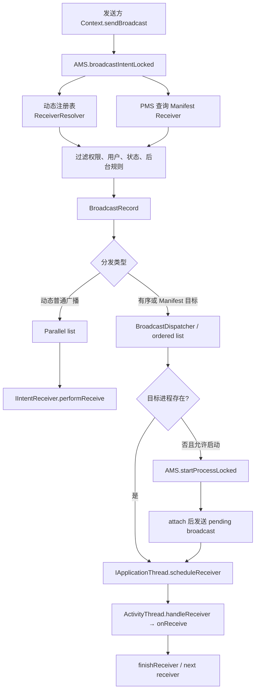
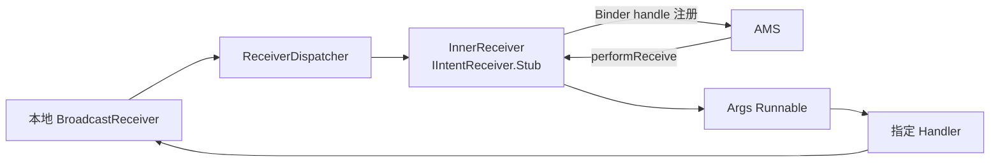
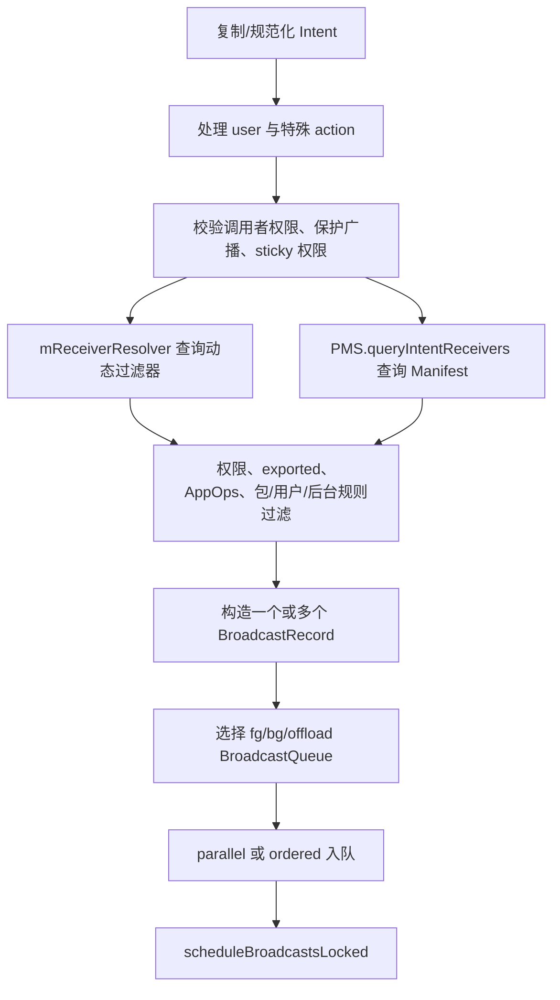
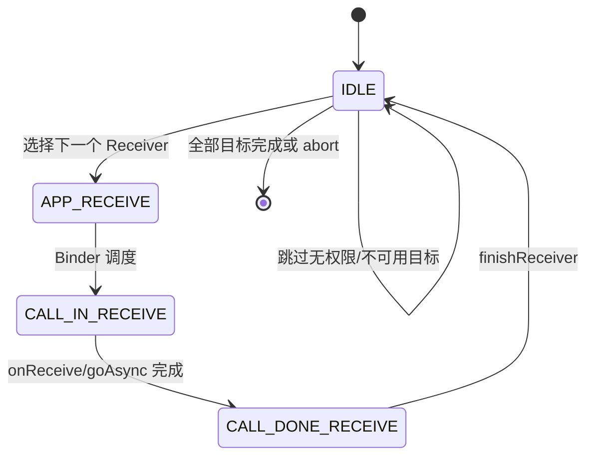
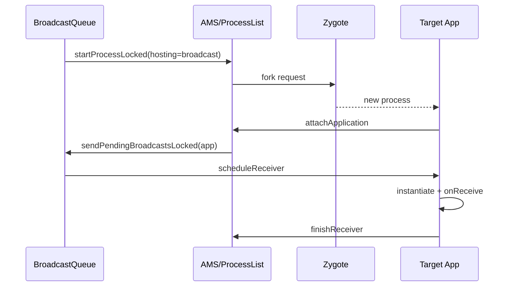
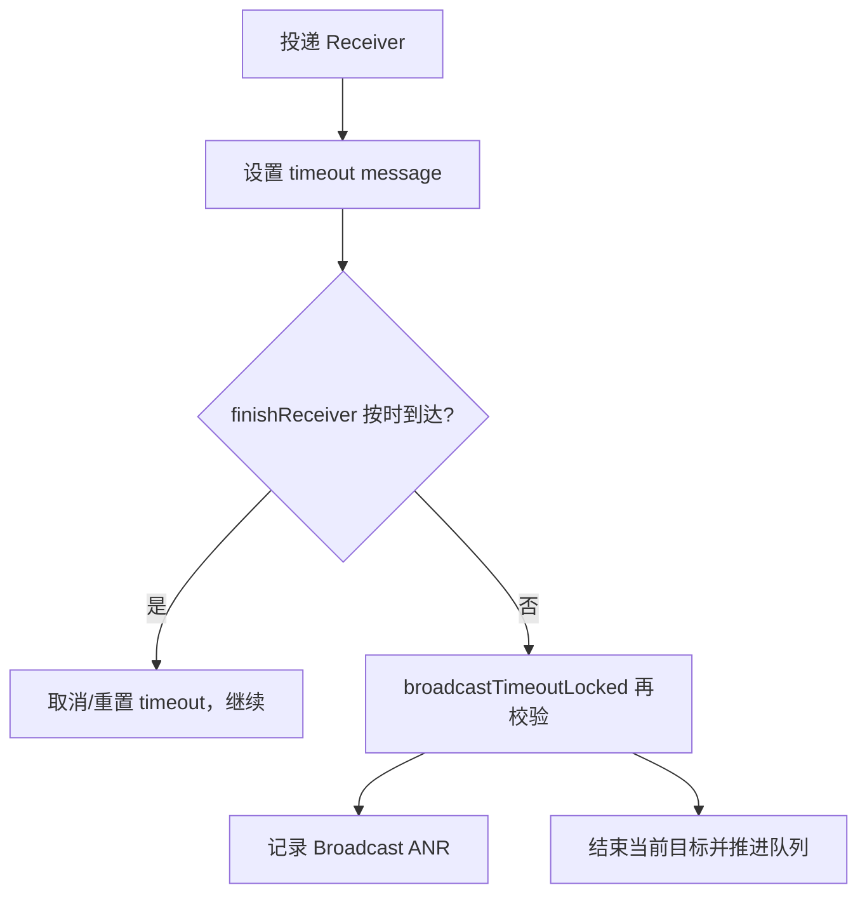
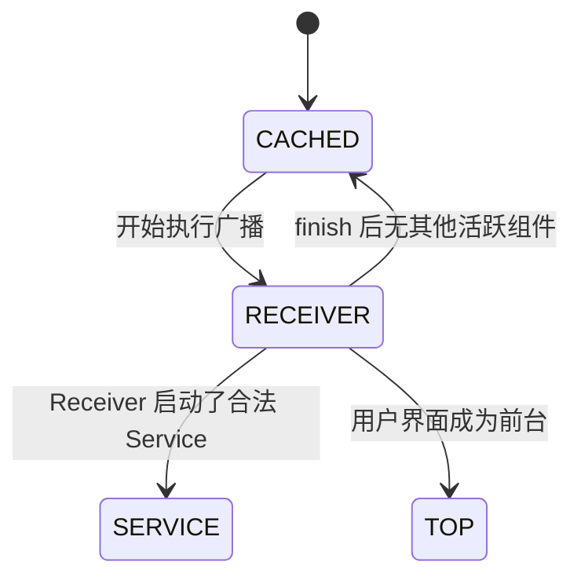

# 16 Broadcast 广播：注册、解析、队列分发、超时与后台限制

## 本章边界

Android 的广播 API 看起来很简单：

```java
registerReceiver(receiver, filter);
sendBroadcast(intent);

public void onReceive(Context context, Intent intent) {
}
```

但 Framework 内部必须解决很多问题：

- Receiver 是运行时动态注册，还是写在 Manifest？
- 目标进程不存在时是否允许拉起？
- 普通广播与有序广播怎样排队？
- 权限、用户、exported、包可见性和后台限制怎样过滤？
- `onReceive()` 返回后系统怎样知道该 Receiver 已完成？
- `goAsync()` 为什么仍然有时限？
- Receiver 卡住时为什么可能触发 Broadcast ANR？

本章以 Android 11 / `android-11.0.0_r48` 为准，按 macOS 只读学习设计，不修改、不编译源码。

## 本章目标

读完后，你应该能够：

1. 区分动态 Receiver 与 Manifest Receiver 的注册和分发路径。
2. 区分普通、并行、有序、显式、隐式、sticky、foreground broadcast。
3. 从 `ContextImpl.sendBroadcast()` 追到 AMS `broadcastIntentLocked()`。
4. 解释 `BroadcastRecord`、`BroadcastQueue`、`BroadcastDispatcher` 的职责。
5. 解释动态 Receiver 为什么通常不能在进程死亡后继续接收。
6. 解释 Manifest Receiver 如何触发进程冷启动。
7. 从 `scheduleReceiver()` 追到应用主线程 `onReceive()`。
8. 解释 `PendingResult`、`finishReceiver()` 与 `goAsync()`。
9. 解释广播超时为什么会阻塞后续分发并可能触发 ANR。
10. 理解 Android 8～11 的隐式广播和后台执行限制。

---

## 1. 一张总图



最重要的分叉是：

```text
动态 Receiver：Binder 回调对象已经属于一个活着的进程
Manifest Receiver：PMS 保存组件声明，目标进程可以尚未存在
```

---

## 2. 核心对象先分清

| 对象 | 所在位置 | 作用 |
|---|---|---|
| `BroadcastReceiver` | App Java | 开发者实现的接收器对象 |
| `IIntentReceiver` | Binder 接口 | 动态 Receiver 的跨进程回调包装 |
| `ReceiverList` | system_server | 某个注册 Binder/进程对应的一组动态过滤器 |
| `BroadcastFilter` | system_server | 动态注册的 IntentFilter，加上包、uid、user、权限等信息 |
| `ResolveInfo` | PMS 查询结果 | Manifest Receiver 的解析结果 |
| `BroadcastRecord` | system_server | 一次广播发送与分发过程的完整运行记录 |
| `BroadcastQueue` | system_server | 管理广播调度、执行、超时和完成 |
| `BroadcastDispatcher` | system_server | Android 11 中组织有序/延迟广播的分发器 |
| `PendingResult` | App Java | Receiver 结果、完成协议和 `goAsync()` 句柄 |

不要把 `BroadcastReceiver` 与 `BroadcastRecord` 混为一谈：前者是应用组件/回调对象，后者代表系统中的“一次广播事件”。一次 BroadcastRecord 可以包含许多目标 Receiver。

---

## 3. 广播的几种分类维度

这些维度可以组合，不是互斥枚举。

### 按目标指定方式

```text
显式广播：Intent 指定 component 或 package
隐式广播：只用 action/data/category 等匹配 filter
```

### 按分发语义

```text
普通广播：sendBroadcast
有序广播：sendOrderedBroadcast
sticky 广播：系统保存最近 Intent，后来注册者可立即取得
```

### 按 Framework 内部队列

```text
parallel：不等待前一个动态 Receiver 完成才投递下一个
ordered/serialized：逐个目标推进，保留结果和超时控制
```

### 按队列优先级

```text
foreground queue：Intent.FLAG_RECEIVER_FOREGROUND
background queue：普通后台广播
offload queue：本版本特定可卸载广播路径
```

“foreground broadcast”描述广播调度优先级，不等于 Receiver 所在 App 有前台 Activity，也不等于 foreground service。

---

## 4. 动态注册从 ContextImpl 开始

源码：

```text
frameworks/base/core/java/android/app/ContextImpl.java
```

主线：

```text
ContextWrapper.registerReceiver
 → ContextImpl.registerReceiver
 → registerReceiverInternal
 → LoadedApk.getReceiverDispatcher
 → ActivityManager.getService().registerReceiverWithFeature
 → AMS.registerReceiverWithFeature
```

`registerReceiverInternal()` 的关键代码：

```java
if (scheduler == null) {
    scheduler = mMainThread.getHandler();
}

rd = mPackageInfo.getReceiverDispatcher(
        receiver, context, scheduler,
        mMainThread.getInstrumentation(), true);

ActivityManager.getService()
        .registerReceiverWithFeature(
                mMainThread.getApplicationThread(),
                mBasePackageName,
                getAttributionTag(),
                rd, filter, broadcastPermission,
                userId, flags);
```

### 为什么默认在主线程回调

未提供 scheduler 时使用 `mMainThread.getHandler()`，因此动态 Receiver 的 `onReceive()` 默认被投递到应用主线程。

如果 API 允许并传入其他 Handler，动态 Receiver 可以在该 Handler 对应线程执行。不能把“所有 BroadcastReceiver 永远运行在主线程”写成绝对规则；Manifest Receiver 的常规 ActivityThread 路径则在应用主线程执行。

---

## 5. ReceiverDispatcher 做什么

源码主要在：

```text
frameworks/base/core/java/android/app/LoadedApk.java
```

`LoadedApk.ReceiverDispatcher` 把本地 Java `BroadcastReceiver` 包装为可跨 Binder 调用的 `IIntentReceiver`。

概念结构：



AMS 保存的是 Binder 回调和过滤信息，不直接持有 App Java Receiver 对象。

ReceiverDispatcher 还负责：

- 把回调切换到目标 Handler。
- 设置 PendingResult。
- 调用 `onReceive()`。
- 捕获/转交异常。
- 在同步处理结束后 finish。
- 检查重复注册、Context 泄漏和 unregister 状态。

---

## 6. AMS 如何保存动态注册

主要对象：

```text
ReceiverList
BroadcastFilter
mRegisteredReceivers
mReceiverResolver
```

可以理解为：

```text
IIntentReceiver Binder
 → ReceiverList：谁注册、来自哪个 pid/uid/user
 → 多个 BroadcastFilter：分别关心哪些 Intent
```

当注册进程死亡，Binder death 或 AMS 进程清理会移除对应 ReceiverList/Filter。

所以：

> 动态注册是一段运行时订阅关系。进程死亡后对象、Binder 和注册关系都消失，系统不会为了普通动态 Receiver 重新启动该进程。

下一次进程启动必须重新执行 `registerReceiver()`。

---

## 7. registerReceiver 返回值与 sticky

`registerReceiver()` 返回 `Intent`，很多初学者忽略它。

如果已有匹配的 sticky broadcast，注册时可以返回最近保存的 sticky Intent；传 `receiver=null` 还可只查询 sticky 状态而不真正注册回调。

```java
Intent battery = context.registerReceiver(
        null,
        new IntentFilter(
                Intent.ACTION_BATTERY_CHANGED));
```

### sticky 不等于“可靠事件日志”

- 它通常只保留最近状态，不保留完整历史。
- 普通应用发送 sticky broadcast 已受到严格权限/废弃限制。
- 接收到旧 sticky 不代表事件刚刚发生。
- 敏感状态需要权限和用户边界过滤。

可把它理解成某些系统状态的最近快照，而不是消息队列持久化方案。

---

## 8. Manifest Receiver 怎样进入系统

Manifest：

```xml
<receiver
    android:name=".BootReceiver"
    android:exported="false">
    <intent-filter>
        <action android:name="android.intent.action.BOOT_COMPLETED" />
    </intent-filter>
</receiver>
```

第 13 章的路径：

```text
PMS 扫描 APK
 → 解析 receiver 与 intent-filter
 → ComponentResolver 注册组件
 → 广播发送时 queryIntentReceivers
 → 返回 ResolveInfo / ActivityInfo
```

Manifest Receiver 没有常驻 Java 对象。系统只保存组件声明。真正投递时，目标进程中 ActivityThread 反射创建 Receiver 实例。

### 为什么它能冷启动

PMS 即使在进程不存在时也能解析出组件。若广播规则允许拉起该接收器，BroadcastQueue 请求 AMS 启动目标进程，进程 attach 后继续 pending broadcast。

---

## 9. 发送方调用链

普通广播概念路径：

```text
Context.sendBroadcast
 → ContextImpl.sendBroadcast
 → IActivityManager.broadcastIntentWithFeature
 → AMS.broadcastIntentWithFeature
 → broadcastIntentLocked
```

有序广播、指定 user、带 permission 等 API 也会汇入相近入口，只是参数不同。

发送方传入的信息包括：

- Intent 与 resolvedType。
- calling package/feature/uid/pid。
- resultTo 最终接收器。
- requiredPermissions/excludedPermissions。
- appOp。
- ordered、sticky。
- userId。
- options。

广播不是“系统把一个 Intent 无条件复制给所有 App”，而是一次带调用者身份和策略参数的系统请求。

---

## 10. broadcastIntentLocked 的主要工作

这个方法很长，第一次不要逐行读。按阶段划分：



特殊系统广播可能还有：

- package added/removed 状态处理。
- uid removed。
- timezone、proxy、user 生命周期等系统联动。
- sticky 保存。
- protected broadcast 检查。

先抓住“解析目标—过滤—建记录—入队”，再读特殊 action 分支。

---

## 11. 两种 Receiver 如何合并

隐式 Intent 可能同时匹配：

```text
动态注册 BroadcastFilter 列表
Manifest ResolveInfo 列表
```

系统会根据 ordered、priority、用户、package/component 限制等组织目标。

### 动态注册优先级

IntentFilter priority 会参与某些排序，但权限、系统保留范围和 Android 版本限制会影响有效值。不要依赖跨应用高 priority 抢占系统广播。

### 同一 App 可能收到几次

如果同一应用既动态注册又声明 Manifest Receiver，它们是两个不同接收目标，满足条件时可能各自收到。系统不是按 package 自动去重所有 Receiver。

---

## 12. BroadcastRecord 保存什么

源码：

```text
frameworks/base/services/core/java/com/android/server/am/BroadcastRecord.java
```

重要字段概念：

- 原始 Intent、resolvedType、callerApp、callingUid/pid/package。
- requiredPermissions、excludedPermissions、appOp。
- receivers 候选列表。
- ordered、sticky、initialSticky。
- resultCode、resultData、resultExtras、resultAbort。
- resultTo 最终回调。
- enqueue/dispatch/receiver/finish 时间。
- `nextReceiver` 当前推进位置。
- `curReceiver`、`curFilter`、`curApp`、`receiver`。
- delivery 数组与状态。
- userId、queue、timeoutExempt。

它既是调度状态机，也是 dumpsys/history 的诊断数据来源。

---

## 13. Android 11 的三条 BroadcastQueue

AMS 初始化：

```text
mFgBroadcastQueue
mBgBroadcastQueue
mOffloadBroadcastQueue
```

典型默认超时常量：

```java
BROADCAST_FG_TIMEOUT = 10 * 1000;
BROADCAST_BG_TIMEOUT = 60 * 1000;
```

### foreground queue

Intent 带 `FLAG_RECEIVER_FOREGROUND` 时，通常进入前台广播队列，调度更及时，单个 Receiver 的默认超时更短。

### background queue

普通广播进入后台队列，允许更长处理窗口，但仍不适合长任务。

### offload queue

用于特定可卸载/特殊系统广播，避免长或低优先工作阻塞主要队列。是否使用受 flags/配置和系统调用路径影响。

超时值是当前源码默认配置，不是所有 Android 版本、所有设备和所有异常场景的永恒 API 契约。

---

## 14. parallel 并不等于真正同时执行

`enqueueParallelBroadcastLocked()` 把 BroadcastRecord 放入 `mParallelBroadcasts`。

它的“并行”含义主要是：

> 系统不需要等待前一个动态 Receiver 报告完成，就可以把广播投递给下一个动态 Receiver。

但：

- 多个 Receiver 可能属于同一个 App 主线程，仍然串行执行。
- Binder 调用和 Handler post 有各自调度。
- 不同进程可能在不同 CPU 上并行。
- parallel 不提供同时开始或完成顺序保证。

所以不要把 parallel BroadcastQueue 理解成“为每个 Receiver 新建线程并同时调用 onReceive”。

---

## 15. 有序广播怎样推进

有序广播的基本状态机：



每个 Receiver 可读取/修改：

```text
resultCode
resultData
resultExtras
abortBroadcast 标记
```

结果传给后续 Receiver，最后可传给 resultTo。

### abortBroadcast 的限制

它只对有序广播语义有意义，而且系统/版本可限制某些广播被 abort。普通并行广播不存在“阻止后面的 Receiver”这一可靠概念。

---

## 16. Manifest Receiver 进程已存在

`BroadcastQueue.processCurBroadcastLocked()`：

```java
r.receiver = app.thread.asBinder();
r.curApp = app;
app.curReceivers.add(r);
app.forceProcessStateUpTo(
        ActivityManager.PROCESS_STATE_RECEIVER);
mService.updateOomAdjLocked(app, ...);

app.thread.scheduleReceiver(
        new Intent(r.intent),
        r.curReceiver,
        compatibilityInfo,
        r.resultCode,
        r.resultData,
        r.resultExtras,
        r.ordered,
        r.userId,
        app.getReportedProcState());
```

这里连接第 15 章：正在执行 Receiver 的进程会被临时提升到 Receiver 相关 procState，避免普通 cached 回收在回调中间发生。

`scheduleReceiver()` 是 system_server 到 App 的 Binder 调用；实际 `onReceive()` 不是在 system_server Binder 线程执行。

---

## 17. Manifest Receiver 进程不存在

BroadcastQueue 会根据 `ActivityInfo.processName`、ApplicationInfo 等查找 ProcessRecord。如果进程不存在且允许启动：

```text
AMS.startProcessLocked(processName, applicationInfo, hostingRecord=broadcast)
 → 设置 mPendingBroadcast
 → 等待 Zygote fork 与 attachApplication
 → sendPendingBroadcastsLocked(app)
 → processCurBroadcastLocked
```



同一队列在等待目标进程启动时需要保存 pending 位置。若启动失败/超时/进程不匹配，会丢弃或重试相应目标并继续队列。

---

## 18. ActivityThread.handleReceiver

源码：

```text
frameworks/base/core/java/android/app/ActivityThread.java
```

主线：

```text
ApplicationThread.scheduleReceiver
 → ActivityThread.H.RECEIVER
 → handleReceiver(ReceiverData)
 → LoadedApk.getAppFactory().instantiateReceiver
 → receiver.setPendingResult(data)
 → receiver.onReceive(restrictedContext, intent)
 → data.finish()（未 goAsync 时）
```

### 每次 Manifest 投递通常创建 Receiver 实例

Manifest Receiver 不是像 Activity 一样长期保存在组件栈中。ActivityThread 根据类名实例化，调用一次 `onReceive()` 后不应依赖该对象继续存活。

### Restricted Context

`onReceive()` 得到 receiver-restricted Context，某些操作受到明确限制。r48 的 `ReceiverRestrictedContext` 会拒绝用非空 Receiver 再调 `registerReceiver()`，也会拒绝 `bindService()`；但仍允许以 `receiver=null` 查询 sticky 状态。这些限制和超时机制都在强调：`onReceive()` 应短小、明确并尽快返回。

---

## 19. 动态 Receiver 的 App 侧路径

动态 Receiver 不通过 Manifest `scheduleReceiver()` 反射创建，而是：

```text
AMS 找到 BroadcastFilter
 → IIntentReceiver.performReceive
 → LoadedApk.ReceiverDispatcher.InnerReceiver
 → ReceiverDispatcher.performReceive
 → Args posted to registered Handler
 → 原来注册的 BroadcastReceiver.onReceive
```

两个路径最后都建立 `PendingResult` 和完成协议，但对象来源不同：

| 项目 | 动态 Receiver | Manifest Receiver |
|---|---|---|
| 目标来源 | AMS 动态注册表 | PMS Manifest 组件索引 |
| App 对象 | 已存在注册对象 | 投递时反射创建 |
| 进程不存在 | 注册已消失，通常不能投递 | 规则允许时可拉起进程 |
| 默认线程 | 注册时 scheduler，通常 main | ActivityThread main |
| system_server 调用 | `IIntentReceiver.performReceive` | `IApplicationThread.scheduleReceiver` |

这是本章最重要的一张表。

---

## 20. PendingResult 与自动 finish

在 `onReceive()` 前，Framework 设置 PendingResult，里面包含：

- token。
- ordered/sticky 类型。
- resultCode/data/extras。
- abort 标记。
- sending user。
- flags。
- 是否已经 finish。

需要由 AMS 等待完成的同步 Receiver（Manifest component，或有序动态 Receiver）：

```text
onReceive 返回
 → Framework 发现 PendingResult 仍在 Receiver 上
 → PendingResult.finish
 → IActivityManager.finishReceiver
 → BroadcastQueue.finishReceiverLocked
```

有序队列据此推进下一个目标。

### 无序动态 parallel Receiver 是例外

它也会获得 PendingResult，统一处理 sendingUser、sticky hint、异常和 API 形态。普通动态注册对象的类型仍是 `TYPE_REGISTERED`，不会因“这次广播无序”就变成 `TYPE_UNREGISTERED`。关键是这次回调的 `orderedHint=false`：`PendingResult.finish()` 既不走 `TYPE_COMPONENT` 分支，也不满足“有序的已注册 Receiver”分支，所以不会调用 AMS `finishReceiver()`。system_server 在投递 Binder 回调后已经继续处理其他 parallel 目标。

`TYPE_UNREGISTERED` 指 `ReceiverDispatcher` 不是通过 `registerReceiver()` 保存的订阅对象；r48 中的典型例子是 `sendOrderedBroadcast()` 的最终 `resultReceiver`。它是“未注册的一次性回调”，不是“收到无序广播的动态 Receiver”。

可从 `BroadcastReceiver.PendingResult.finish()` 看到三种差异：

| 接收类型 | finish 是否通知 AMS | 原因 |
|---|---|---|
| Manifest component，即使广播本身无序 | 是 | AMS 需要知道组件执行结束并撤销 Receiver 状态 |
| 有序动态 Receiver（`TYPE_REGISTERED` + ordered） | 是 | 队列需要结果并推进下一目标 |
| 无序动态 Receiver（`TYPE_REGISTERED` + unordered） | 否 | parallel 队列不等待该回调完成 |
| 一次性 `TYPE_UNREGISTERED` 结果回调 | 否 | 它就是有序链尾的最终回调，后面已没有 Receiver 需等它通知 AMS 推进 |

因此不能笼统说“所有 onReceive 返回都会通过 Binder 调用 finishReceiver”。

---

## 21. goAsync 到底改变了什么

源码：

```java
public final PendingResult goAsync() {
    PendingResult res = mPendingResult;
    mPendingResult = null;
    return res;
}
```

它只做一件关键事：把 PendingResult 从 Receiver 对象取走，使 `onReceive()` 返回时 Framework 不自动 finish。

使用方式：

```java
@Override
public void onReceive(Context context, Intent intent) {
    PendingResult pending = goAsync();
    executor.execute(() -> {
        try {
            // 短小的异步工作
        } finally {
            pending.finish();
        }
    });
}
```

### goAsync 不会提供无限时间

对 AMS 正在等待完成的 Manifest Receiver 或有序 Receiver，从开始投递到 `finish()` 仍受广播超时约束。忘记 finish 会让系统认为 Receiver 一直未完成，阻塞有序队列并可能 ANR。

对无序动态 parallel Receiver，AMS 本来就不等待 finish；`goAsync()` 不会神奇地把它转换为受队列保护的有序任务。虽然 API 仍要求工作短小，但不能依赖 BroadcastQueue 为这段异步工作维持 active Receiver 或用同样的超时协议收尾。

### goAsync 不会自动保证进程永久存活

当 AMS 确实在等待 BroadcastRecord finish 时，通常会维持 Receiver 执行状态和进程重要性；但这不是任意长后台工作的可靠容器。无序动态 Receiver 更不能依赖这种保护。长任务应移交 JobScheduler、合适的 foreground service 或其他受支持机制。

---

## 22. 广播超时怎样安排

BroadcastQueue 在投递需要等待完成的 Manifest/有序 Receiver 时记录：

```text
receiverTime
nextReceiver
curApp / receiver token
```

并发送 `BROADCAST_TIMEOUT_MSG`。大致：

```text
timeoutTime = receiverTime + queue.TIMEOUT
```

Android 11 默认：

```text
foreground queue：约 10 秒
background/offload queue：约 60 秒
```

r48 中，系统尚未 ready 或 `timeoutExempt` 会让超时处理返回；如果目标进程正在调试，队列仍会收尾并继续，但不会把该停顿当成普通 ANR。队列还会复用一条 timeout message；前一个 Receiver 早已完成时，消息触发后会依据当前 `receiverTime + TIMEOUT` 判断是否需延后。API 文档中的概括时间与源码队列配置也可能使用不同措辞；阅读具体版本时以当前执行路径为准。

---

## 23. timeout 到 ANR

`broadcastTimeoutLocked()` 会验证：

- 当前是否真有 active BroadcastRecord。
- timeout 消息是否过期/需要重置。
- 当前 Receiver 是否已 finish。
- 目标进程是否仍对应 `curApp`。
- 是否因调试等情况豁免。

确认超时后会：

- 标记 delivery timeout。
- 记录丢弃/超时信息。
- finish/跳过当前 Receiver，继续队列。
- 通过 AMS 的 appNotResponding 路径触发 Broadcast ANR 现场收集。



ANR 的根因可能不是 Receiver 自己做了 10/60 秒计算，也可能是主线程被别处阻塞、Binder 死锁、I/O、锁竞争或进程根本没获得足够调度。

---

## 24. 为什么 onReceive 必须短

默认主线程上的 `onReceive()` 与 Activity UI、Service 回调等共享 Looper。

慢 Receiver 会：

- 阻塞本 App 主线程。
- 延迟 Activity 绘制和输入。
- 对有序广播阻塞后续 Receiver。
- 占用 BroadcastQueue active 位置。
- 触发 ANR。

不适合直接执行：

```text
长网络请求
大文件解压
大数据库迁移
无限等待 Binder 返回
Thread.join 无上限等待
sleep 模拟延迟
```

`goAsync()` 只是允许短工作移到其他线程，不是把 BroadcastReceiver 变成常驻后台任务模型。

---

## 25. 权限检查是双向的

广播安全不是只检查 Receiver 权限。

### 发送方要求接收方权限

```java
sendBroadcast(intent, "com.example.PERMISSION_RECEIVE");
```

只有持有要求权限的 Receiver 才可接收。

### Receiver 注册时要求发送方权限

```java
registerReceiver(
        receiver,
        filter,
        "com.example.PERMISSION_SEND",
        handler);
```

发送方必须持有对应权限。

### Manifest Receiver 自身 permission/exported

组件的 exported、permission、应用 uid、系统签名关系也会过滤外部发送者。

### protected broadcast

某些系统 action 只有系统可发送。普通 App 构造相同 action 字符串不能伪造可信系统事件。

阅读过滤失败时要问：

```text
谁发送？
谁接收？
发送 API 要求什么 receiver permission？
Receiver 自己要求什么 sender permission？
是否跨 user？
是否 exported？
是否有 AppOp/系统保护？
```

---

## 26. exported 与显式广播

显式指定 ComponentName 只跳过 IntentFilter 搜索，不会绕过安全检查。

```text
显式广播
 ≠ 可调用未 exported 的其他 App Receiver
 ≠ 可绕过 Receiver permission
 ≠ 可跨 user 任意发送
```

Android 12 开始对带 intent-filter 的组件要求显式声明 exported；本工程是 Android 11，解析规则略有不同，但学习安全模型时仍应明确设置 exported，而不是依赖旧默认值。

---

## 27. Android 8+ Manifest 隐式广播限制

为减少大量 App 被同一系统事件同时冷启动，面向较新版本的应用通常不能在 Manifest 中注册许多隐式系统广播。

核心动机：

```text
网络变化等高频事件
 → 数十/数百个 App Manifest Receiver 匹配
 → 同时拉起大量进程
 → 内存抖动、耗电和启动风暴
```

系统保留豁免广播，例如某些启动、区域设置、USB/蓝牙等重要事件；具体豁免清单随版本变化，应查看 Android 11 当前 Framework 配置/文档和源码。

替代方式：

- App 活跃期间动态注册。
- 使用 JobScheduler 约束任务。
- 使用专门系统 API callback。
- 显式、定向广播。

限制主要针对 Manifest 隐式广播，不等于“Android 8 后不能用广播”。

---

## 28. 后台执行限制与临时豁免

收到某些高优先级广播时，系统可能临时允许接收进程进行受限后台操作；BroadcastOptions 也可能携带 allowlist duration。

但不能形成通用规则：

```text
收到广播
 → 就能无限启动后台 Service
```

Android 8+ 对后台 Service 启动严格限制；某些场景需 `startForegroundService()` 并在时限内 `startForeground()`，另一些应使用 JobScheduler。

BroadcastQueue 还会跟踪允许后台 Activity 启动的临时时间 token。这些是特定发送者/广播选项授予的短窗口，不是 Receiver 永久权限。

---

## 29. 多用户广播

广播分发总是带 user 语义：

```text
当前 user
指定 UserHandle
UserHandle.ALL
profile group
system user 与 foreground user
```

目标 Receiver 必须在对应 user 下 installed/enabled，发送方还需具备跨用户权限。

同一 package 在 user 0 与 user 10 是不同 uid/运行环境，可能各收到一次对应 user 广播，也可能只有目标 user 接收。

系统启动相关广播也分阶段：

```text
LOCKED_BOOT_COMPLETED：DE 可用、用户可能未解锁
BOOT_COMPLETED：用户解锁/启动阶段满足后
USER_UNLOCKED：用户 CE 数据可用
```

Receiver 是否 `directBootAware` 会影响解锁前可见性。

---

## 30. package change 广播与 PMS

第 13 章安装完成后，PMS 会发送：

```text
PACKAGE_ADDED
PACKAGE_REPLACED
MY_PACKAGE_REPLACED
PACKAGE_REMOVED
PACKAGE_CHANGED
```

这些广播通常包含 package URI：

```text
package:com.example.app
```

接收 filter 需要匹配 scheme：

```xml
<data android:scheme="package" />
```

只写 action 而漏掉 data scheme，是“为什么收不到包变化广播”的常见原因。

系统还会按用户、可见性、安装器/verifier 和后台规则限制接收范围。

---

## 31. 广播与进程优先级

第 15 章已经看到：

```java
app.curReceivers.add(r);
app.forceProcessStateUpTo(
        PROCESS_STATE_RECEIVER);
updateOomAdjLocked(app, ...);
```

AMS 等待的 Manifest/有序广播完成后：

```text
finishReceiverLocked
 → 从 curReceivers 移除
 → 重新计算 OOM adj
```

因此进程重要性是短暂提升：



`goAsync()` 未 finish 时，这个“正在处理广播”的状态可能继续保持到超时；这也是忘记 finish 会损害系统的原因之一。这里不包括 system_server 已经无需等待的无序动态 parallel Receiver。

---

## 32. replace pending 广播

Intent flag/发送选项可以要求替换队列中相同的 pending broadcast。

BroadcastQueue 使用 `Intent.filterEquals()` 等条件寻找同 user 的相同事件，用新 BroadcastRecord 替换旧记录。

适用于“只关心最新状态”的场景，避免队列积累大量过时事件。

但 `filterEquals()` 不比较所有 extras；因此：

```text
action/data/type/component/categories 相同
extras 不同
```

仍可能被视为可替换。使用者必须理解这是状态合并语义，不适合不可丢失的事务事件。

---

## 33. 广播不是可靠消息队列

普通广播不提供以下通用保证：

- 进程死亡后动态订阅自动恢复。
- 所有历史事件持久化。
- exactly-once。
- Receiver 完成业务事务后才算消费。
- 跨重启可靠重放。
- 无限制后台执行。

需要可靠任务时考虑：

- 数据库中的持久任务表。
- JobScheduler/WorkManager。
- 前台服务（用户可感知长任务）。
- Binder callback + 重连协议。
- 服务端幂等 API。

广播适合系统/应用组件间的事件通知与状态变化传播，不应替代业务消息系统。

---

## 34. dumpsys 与只读观察

### 查看广播队列

```bash
adb shell dumpsys activity broadcasts
```

可关注：

```text
Active ordered broadcasts
Pending broadcast
Historical broadcasts
Receiver Resolver Table
foreground/background/offload queue
dispatch/finish time
nextReceiver / curApp
```

不同厂商和版本输出不同。

### 查看动态注册

```bash
adb shell dumpsys activity broadcasts | grep -A 20 "Receiver Resolver Table"
```

设备 shell/本机过滤均可。不要依赖固定行数写自动化解析。

### 发送安全测试广播

仅使用自己的测试 action：

```bash
adb shell am broadcast \
  -a com.example.aospstudy.TEST \
  -p com.example.aospstudy
```

不要伪造系统保护广播或在非测试设备上触发破坏性 action。

### logcat

```bash
adb logcat -s ActivityManager BroadcastQueue ActivityThread
```

许多细粒度广播日志只在 debug flag/userdebug 构建开启，商业设备看不到不代表没有走该路径。

---

## 35. 源码阅读路线 A：动态注册

```text
ContextImpl.registerReceiverInternal
 → LoadedApk.getReceiverDispatcher
 → IActivityManager.registerReceiverWithFeature
 → AMS.registerReceiverWithFeature
 → ReceiverList + BroadcastFilter
 → mReceiverResolver.addFilter
```

搜索：

```bash
rg -n "registerReceiverInternal|registerReceiverWithFeature|ReceiverList|BroadcastFilter" \
  frameworks/base/core/java/android/app \
  frameworks/base/services/core/java/com/android/server/am
```

记录 Binder 对象怎样从 App 进入 system_server。

---

## 36. 源码阅读路线 B：发送与入队

```text
ContextImpl.sendBroadcast
 → IActivityManager.broadcastIntentWithFeature
 → AMS.broadcastIntentLocked
 → 动态 ReceiverResolver + PMS Manifest 查询
 → BroadcastRecord
 → broadcastQueueForIntent
 → enqueueParallelBroadcastLocked / enqueueOrderedBroadcastLocked
 → scheduleBroadcastsLocked
```

第一次只读主干，跳过特殊 action 的大段分支。

---

## 37. 源码阅读路线 C：App 投递与完成

Manifest：

```text
BroadcastQueue.processCurBroadcastLocked
 → IApplicationThread.scheduleReceiver
 → ActivityThread.handleReceiver
 → instantiateReceiver
 → BroadcastReceiver.onReceive
 → ReceiverData/PendingResult.finish
 → AMS.finishReceiver
 → BroadcastQueue.finishReceiverLocked
```

动态：

```text
deliverToRegisteredReceiverLocked
 → IIntentReceiver.performReceive
 → LoadedApk.ReceiverDispatcher
 → Args.run
 → existing receiver.onReceive
 → PendingResult.finish
```

把两条链放在一起对照阅读，效果最好。

---

## 38. 源码阅读路线 D：超时

```text
setBroadcastTimeoutLocked
 → BROADCAST_TIMEOUT_MSG
 → BroadcastQueue.broadcastTimeoutLocked
 → 标记 DELIVERY_TIMEOUT
 → AMS appNotResponding
 → finish/skip current receiver
 → schedule next
```

搜索：

```bash
rg -n "BROADCAST_TIMEOUT_MSG|setBroadcastTimeoutLocked|broadcastTimeoutLocked" \
  frameworks/base/services/core/java/com/android/server/am
```

记录 timeout 从哪个时间点起算、何时取消、哪些条件会重置。

---

## 39. 高频误区校正

### 误区 1：所有 Receiver 都在 App 主线程

默认大多如此，但动态注册可指定 Handler；不要写成绝对规则。

### 误区 2：动态 Receiver 与 Manifest Receiver 只是注册写法不同

错误。前者注册 Binder 回调且依赖活进程，后者由 PMS 持久组件索引，可在允许时冷启动进程。

### 误区 3：普通广播会同时并发调用所有 Receiver

错误。parallel 只表示系统不按有序完成协议逐个等待；实际线程调度没有同时性保证。

### 误区 4：有序广播一定按应用安装顺序

错误。排序受 filter priority、目标类型和系统规则影响，不是安装时间。

### 误区 5：显式广播可绕过权限/exported

错误。它只明确目标，安全检查仍存在。

### 误区 6：goAsync 给 Receiver 无限时间

错误。它只延迟自动 finish，广播总时限仍然适用。

### 误区 7：onReceive 返回后异步线程一定能运行完

错误。未 goAsync/finish 协议或其他持久任务机制时，进程重要性可下降并被回收。

### 误区 8：foreground broadcast 来自前台 App

错误。它由 Intent flag/系统策略选择高优先队列，与发送方 UI 状态不是同义词。

### 误区 9：Manifest Receiver 能收到所有隐式系统广播

错误。Android 8+ 对许多隐式 Manifest 广播有限制，并有有限豁免清单。

### 误区 10：广播超时一定说明 onReceive 代码死循环

错误。主线程其他阻塞、Binder、锁、I/O 或调度饥饿都可能导致 finish 未及时到达。

### 误区 11：sticky broadcast 保存所有事件历史

错误。它通常是最近状态快照，并受到严格限制。

### 误区 12：广播适合作为可靠业务消息队列

错误。它没有 exactly-once、持久订阅和完整重放保证。

---

## 40. 一次 Manifest 有序广播的可背诵版

```text
1. 发送方 ContextImpl 通过 Binder 调用 AMS.broadcastIntentLocked。
2. AMS 校验发送身份、user、权限、protected action 和 sticky 规则。
3. PMS 查询 Manifest Receiver，AMS 查询动态 BroadcastFilter。
4. 系统按 exported、permission、AppOps、enabled、用户和后台限制过滤。
5. 构造 BroadcastRecord，选择 fg/bg/offload BroadcastQueue。
6. 有序目标进入 BroadcastDispatcher，scheduleBroadcastsLocked 发消息。
7. processNextBroadcastLocked 选择下一个 Receiver。
8. 若 Manifest 目标进程不存在，AMS 请求 Zygote 启动并保存 pending broadcast。
9. 进程 attach 后，BroadcastQueue 调用 IApplicationThread.scheduleReceiver。
10. ActivityThread 主线程实例化 Receiver，设置 PendingResult，执行 onReceive。
11. 同步 Receiver 返回后自动 finish；goAsync 则由异步代码调用 finish。
12. AMS.finishReceiver 进入 BroadcastQueue.finishReceiverLocked，保存 result 并推进下一目标。
13. 若超时未 finish，broadcastTimeoutLocked 标记超时、触发 ANR 处理并继续队列。
14. 全部完成后调用最终 resultTo，并保存历史诊断信息。
```

---

## 41. 阅读练习

### 练习一：画动态注册对象图

从本地 BroadcastReceiver 画到：

```text
ReceiverDispatcher
InnerReceiver/IIntentReceiver
ReceiverList
BroadcastFilter
ReceiverResolver
```

标注每个对象在哪个进程。

### 练习二：对照两种投递

填写表格：

```text
动态 Receiver system_server 入口：
Manifest Receiver system_server 入口：
App Binder 接口：
App 分发类：
是否能冷启动：
```

### 练习三：读 broadcastIntentLocked

只标出五个阶段：安全校验、动态查询、PMS 查询、过滤合并、构造/入队。暂时不读特殊 action 分支。

### 练习四：追进程冷启动

从 BroadcastQueue 选择 Manifest Receiver 追到 `startProcessLocked()`、`mPendingBroadcast`、attach 和 `sendPendingBroadcastsLocked()`。

### 练习五：追 goAsync

从 `BroadcastReceiver.goAsync()` 追 `PendingResult.finish()`，分别验证 TYPE_COMPONENT、有序 TYPE_REGISTERED、无序 TYPE_REGISTERED，以及一次性 TYPE_UNREGISTERED 结果回调是否继续调用 `IActivityManager.finishReceiver()`。

解释忘记 finish 的三个后果。

### 练习六：分析一个 ANR

假设主线程在 Activity `onCreate()` 中持有锁等待 Binder，随后 Receiver 被投递。解释为什么 Broadcast ANR 的栈可能停在锁等待，而不是 Receiver 自己的业务函数深处。

### 练习七：多用户过滤

选择 BOOT_COMPLETED/USER_UNLOCKED，追 `userId`、directBootAware 和 CE/DE 状态怎样影响目标。

### 练习八：只读 dumpsys

若有设备，运行：

```bash
adb shell dumpsys activity broadcasts
```

选一个 BroadcastRecord 标注 enqueueTime、dispatchTime、receivers、nextReceiver、curApp 和 delivery 状态。无设备时直接读 BroadcastRecord.dump() 源码理解输出。

---

## 42. 自测题

1. 动态 Receiver 为什么不能在进程死亡后自动继续接收？
2. Manifest Receiver 为什么可以冷启动目标进程？
3. ReceiverDispatcher 解决了什么问题？
4. parallel 广播为什么不等于所有 onReceive 同时执行？
5. 有序广播怎样把 result 传给下一个 Receiver？
6. Manifest 和动态 Receiver 分别通过哪个 Binder 接口进入 App？
7. `goAsync()` 在源码中真正做了什么？
8. 忘记 `PendingResult.finish()` 会怎样？无序动态 Receiver 有何不同？
9. foreground BroadcastQueue 与前台 Activity 有什么关系？
10. 显式广播为什么仍需权限检查？
11. Android 8+ 为什么限制 Manifest 隐式广播？
12. Broadcast ANR 为什么不一定是 Receiver 自身死循环？

### 参考答案

1. 注册关系绑定本地对象、Binder 和活进程；进程死亡后 ReceiverList/Filter 被移除。
2. PMS 持久保存 Manifest 组件声明，AMS 可获得 ApplicationInfo/processName 并请求 Zygote 启动。
3. 它把本地 Receiver 包装成 Binder 回调，并把回调切到注册 Handler、管理 PendingResult 和完成协议。
4. parallel 只是不等待有序完成；同一主线程仍串行，Binder/Handler 也各自调度。
5. PendingResult 中的 resultCode/data/extras/abort 经 finishReceiver 返回 system_server，队列再传给下一目标。
6. Manifest 使用 IApplicationThread.scheduleReceiver；动态使用 IIntentReceiver.performReceive。
7. 取走并清空 Receiver 上的 mPendingResult，从而阻止 onReceive 返回时自动 finish。
8. 对 Manifest/有序 Receiver，会阻塞推进、延长 Receiver 状态并可能超时/ANR；无序动态 Receiver 的 parallel 队列不等待 finish，因此没有同样的推进阻塞，但异步工作也没有因此获得可靠进程保护。
9. 它是 Intent flag/系统策略选择的广播队列优先级，不要求发送或接收 App 有前台 Activity。
10. 明确目标只跳过解析，不取消 exported、permission、AppOps、user 等安全校验。
11. 避免常见系统事件同时冷启动大量应用造成耗电和内存抖动。
12. Receiver 默认主线程执行；主线程可能已被其他消息、锁、Binder 或 I/O 阻塞。

---

## 43. 本章总结

```text
动态注册：
BroadcastReceiver
 → ReceiverDispatcher / IIntentReceiver
 → AMS ReceiverList + BroadcastFilter

发送与解析：
ContextImpl.sendBroadcast
 → AMS.broadcastIntentLocked
 → 动态 ReceiverResolver + PMS Manifest 查询
 → 权限/用户/后台过滤
 → BroadcastRecord
 → fg/bg/offload BroadcastQueue

Manifest 投递：
processCurBroadcastLocked
 → 必要时启动进程
 → IApplicationThread.scheduleReceiver
 → ActivityThread.handleReceiver
 → instantiateReceiver
 → onReceive

动态投递：
deliverToRegisteredReceiverLocked
 → IIntentReceiver.performReceive
 → ReceiverDispatcher Handler
 → 已注册对象 onReceive

需要 AMS 等待的 Manifest/有序接收完成：
PendingResult.finish
 → AMS.finishReceiver
 → finishReceiverLocked
 → next receiver / timeout ANR

无序动态 parallel Receiver 的 finish 不走这条 AMS 完成链，队列也不等待它。
```

最重要的五个结论：

1. 动态与 Manifest Receiver 的存储、Binder 接口和进程启动能力都不同。
2. parallel 表示不按有序完成协议等待，不代表同时调用。
3. `onReceive()` 是短生命周期回调；对 AMS 等待的 Manifest/有序 Receiver，`goAsync()` 仍受广播总时限约束，无序动态 Receiver 也不能借它获得可靠长任务能力。
4. 广播分发是带调用者身份、用户、权限和后台策略的严格过滤过程。
5. 广播是事件通知机制，不是可靠持久业务消息队列。

下一章进入 Service 与 ContentProvider：重点追踪 Service 的 start/bind、Binder 发布与连接回调，以及 Provider 的安装、发布、首次获取和跨进程调用。
