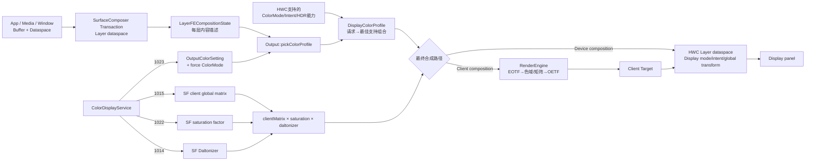
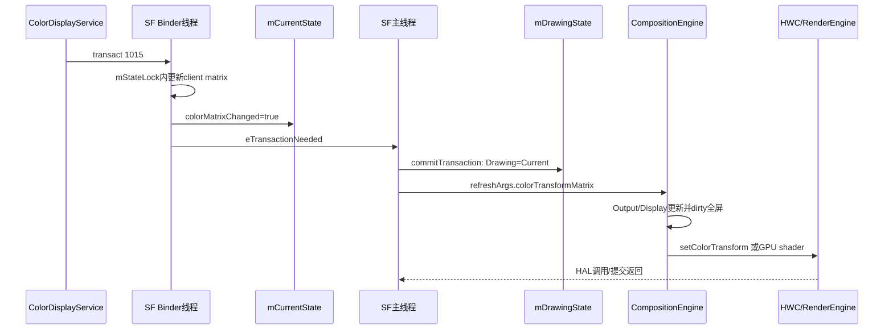
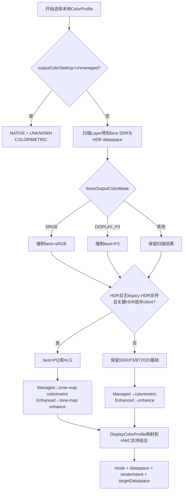

# 160 Android SurfaceFlinger 颜色管理：Dataspace、ColorMode 与 RenderIntent

> 源码版本：Android 11 / API 30 / `android-11.0.0_r48`  
> 学习方式：macOS 只读源码，不要求编译、不要求连接设备  
> 前置章节：第 12、67、155、158、159 章

---

## 1. 本章要解决什么

第 159 章讲到 `ColorDisplayService` 最终给 SurfaceFlinger 发送：

```text
1014：Daltonizer
1015：全局4×4颜色矩阵
1022：饱和度系数
1023：display color setting + composition color mode
```

但 SurfaceFlinger 收到以后，不是简单地“把矩阵交给屏幕”。它还必须回答：

1. 每个 Layer 的像素原本属于哪个颜色空间？
2. 当前帧该用 sRGB、Display P3、BT.2020、PQ 还是 HLG 输出？
3. `Dataspace`、`ColorMode`、`RenderIntent` 到底分别表示什么？
4. HWC 不支持请求组合时怎样降级？
5. 哪些颜色处理由 GPU RenderEngine 完成，哪些由 HWC 完成？
6. 混合 HWC composition 和 client composition 时，全局颜色矩阵怎样只应用一次？
7. HDR 与 SDR Layer 混在一起时，输出档案如何选择？
8. 第 159 章发现的全局饱和度矩阵尾值 0，到消费端究竟发生什么？

---

## 2. 先记住三个术语

### 2.1 Dataspace：这批像素“是什么”

`Dataspace` 描述 buffer/Layers 中数值的解释方式，主要由三组 bit 组成：

```text
STANDARD：RGB primaries / white point 等色域基础
TRANSFER：线性、sRGB、ST2084(PQ)、HLG 等传递函数
RANGE：full、limited、extended 等数值范围
```

例如：

```text
DISPLAY_P3
= STANDARD_DCI_P3
| TRANSFER_SRGB
| RANGE_FULL
```

它描述内容，不等于面板当前工作模式。

### 2.2 ColorMode：显示设备“怎么工作”

`ColorMode` 是 HWC/显示设备支持的校准输出模式，例如：

```text
NATIVE
SRGB
DISPLAY_P3
DISPLAY_BT2020
BT2100_PQ
BT2100_HLG
```

同一个 Layer dataspace，最终可能映射到设备支持的另一个 ColorMode。

### 2.3 RenderIntent：从内容颜色到显示颜色“怎么映射”

Android 11 主要定义：

| RenderIntent | 含义 |
|---|---|
| `COLORIMETRIC` | 色域内尽量不变，色域外硬裁剪 |
| `ENHANCE` | 对色域内颜色做增强，通常向显示原生色域拉伸 |
| `TONE_MAP_COLORIMETRIC` | HDR tone map 后按 colorimetric 处理 |
| `TONE_MAP_ENHANCE` | HDR tone map 后再按 enhance 处理 |

三者的关系可以类比：

```text
Dataspace   = 原稿使用哪套颜色坐标和编码
ColorMode   = 显示器切到哪套工作档位
RenderIntent= 原稿放不进显示器时采用哪种映射风格
```

---

## 3. 源码地图

```text
frameworks/native/services/surfaceflinger/
├── SurfaceFlinger.cpp
├── SurfaceFlinger.h
├── DisplayDevice.cpp
├── Layer.cpp
├── BufferStateLayer.cpp
├── CompositionEngine/
│   ├── src/
│   │   ├── Output.cpp
│   │   ├── Display.cpp
│   │   ├── OutputLayer.cpp
│   │   └── DisplayColorProfile.cpp
│   └── include/compositionengine/
│       ├── OutputColorSetting.h
│       └── DisplayColorProfile*.h
├── DisplayHardware/
│   ├── HWComposer.cpp
│   ├── HWC2.cpp
│   └── ComposerHal.cpp
└── tests / CompositionEngine/tests

frameworks/native/libs/
├── gui/SurfaceComposerClient.cpp
├── renderengine/gl/GLESRenderEngine.cpp
└── renderengine/gl/ProgramCache.cpp

hardware/interfaces/graphics/
├── common/1.0/types.hal
├── common/1.1/types.hal
└── composer/2.1/IComposerClient.hal
```

---

## 4. 整条颜色决策链



核心思想：

> Layer 的 Dataspace 是输入事实；SurfaceFlinger 每帧选择输出颜色档案；DisplayColorProfile 把理想档案回退到 HWC 真正支持的 mode/intent；最后 GPU 和 HWC 按当前 composition 分工执行转换。

---

## 5. Layer 的 Dataspace 从哪里来

### 5.1 SurfaceControl 事务可以设置

```cpp
SurfaceComposerClient::Transaction& Transaction::setDataspace(
        const sp<SurfaceControl>& sc, ui::Dataspace dataspace) {
    layer_state_t* s = getLayerState(sc);
    s->what |= layer_state_t::eDataspaceChanged;
    s->dataspace = dataspace;
    return *this;
}
```

提交后 SurfaceFlinger 把它写入 Layer 当前状态。

### 5.2 BufferStateLayer 保存并触发事务

```cpp
bool BufferStateLayer::setDataspace(ui::Dataspace dataspace) {
    if (mCurrentState.dataspace == dataspace) return false;
    mCurrentState.dataspace = dataspace;
    mCurrentState.modified = true;
    setTransactionFlags(eTransactionNeeded);
    return true;
}
```

### 5.3 每帧复制到 CompositionEngine 状态

```cpp
compositionState->isColorspaceAgnostic = isColorSpaceAgnostic();
compositionState->dataspace = getDataSpace();
compositionState->colorTransform = getColorTransform();
```

因此要分清：

```text
Layer dataspace      内容颜色空间
Layer colorTransform 单层自己的颜色矩阵
Display colorTransform 全屏最终颜色矩阵
```

它们不是同一个字段。

### 5.4 UNKNOWN 不是“完全没有任何默认解释”

HAL 注释说 `Dataspace::UNKNOWN` 是默认假设；对 RGB 通常安全地按 sRGB/BT.709 类默认解释，但不应期待自动的精确 gamma 转换。

所以 UNKNOWN 更接近：

```text
生产者没有提供明确颜色元数据，消费者按约定默认处理
```

而不是“这些像素没有颜色空间”。

---

## 6. Dataspace 是 bitfield，不只是枚举名字

### 6.1 Standard

它描述 primaries、white point 等基础：

```text
BT709
BT601
BT2020
DCI_P3
Adobe RGB
...
```

### 6.2 Transfer

它描述存储数值与线性光之间的映射：

```text
LINEAR
SRGB
SMPTE_170M
GAMMA2_2 / 2_6 / 2_8
ST2084(PQ)
HLG
```

颜色矩阵通常应该在线性域中工作。这也是第 159 章 Night Display / DWB 要区分 linear 与 native 系数的重要背景。

### 6.3 Range

```text
FULL
LIMITED
EXTENDED
```

视频 YCbCr 常见 limited；RGB 常见 full；scRGB 可使用 extended 表示超出 `[0,1]` 的颜色/亮度。

### 6.4 同样是 P3，编码也可能不同

```text
DISPLAY_P3_LINEAR：P3 primaries + linear transfer + full
DISPLAY_P3：P3 primaries + sRGB transfer + full
DCI_P3：P3 primaries + gamma 2.6 + full
```

只看“P3”二字不足以决定 shader 处理。

---

## 7. SurfaceFlinger 启动时建立颜色能力基线

### 7.1 三组只读属性

```cpp
hasWideColorDisplay = has_wide_color_display(false);
useColorManagement = use_color_management(false);

mDefaultCompositionDataspace =
        default_composition_dataspace(V0_SRGB);
mWideColorGamutCompositionDataspace =
        wcg_composition_dataspace(
                hasWideColorDisplay ? DISPLAY_P3 : V0_SRGB);

mColorSpaceAgnosticDataspace =
        color_space_agnostic_dataspace(UNKNOWN);
```

对应 `ro.surface_flinger.*` sysprop。

这些是设备构建/overlay 能力，不是普通用户设置。

### 7.2 default composition dataspace 不等于本帧输出档案

`getCompositionPreference()` 返回：

```text
默认client target dataspace/pixel format
wide-color client target dataspace/pixel format
```

它主要帮助图形栈选择合成 buffer 格式和 dataspace。

而本帧究竟使用哪个 HWC `ColorMode + RenderIntent`，还要由可见 Layer 和 `pickColorProfile()` 动态选择。

### 7.3 调试事务 1031 只覆盖 composition preference

源码注释甚至要求调用后重启 zygote，说明它不是日常逐帧颜色模式 API。

不要把第 159 章 `config_displayCompositionColorSpaces` 传给 1023 的“强制 mode”与 1031 的 client-target composition dataspace 混为一谈。

---

## 8. 新显示设备怎样收集 HWC 能力

创建 `DisplayDevice` 时：

```cpp
if (useColorManagement && displayId) {
    for (ColorMode mode : hwc.getColorModes(displayId)) {
        if (isWideColorMode(mode)) {
            creationArgs.hasWideColorGamut = true;
        }
        auto intents = hwc.getRenderIntents(displayId, mode);
        creationArgs.hwcColorModes.emplace(mode, intents);
    }
}
```

同时查询：

- HDR capabilities；
- supported per-frame metadata；
- display-wide-color capability。

这些数据进入 `DisplayColorProfile`。

`DisplayColorProfile` 不是存一条当前设置，而是预先构建映射表：

```text
(请求dataspace, 请求render intent)
→ (实际dataspace, 实际HWC ColorMode, 实际HWC RenderIntent)
```

---

## 9. Framework 的四个私有事务在 SF 中怎么落地

### 9.1 1014：Daltonizer

根据个位数选色弱类型，根据 `n >= 10` 选 correction/simulation：

```cpp
mDaltonizer.setType(...);
mDaltonizer.setMode(...);
updateColorMatrixLocked();
```

### 9.2 1015：Framework 合成后的 client matrix

```cpp
if (present) {
    for (size_t i = 0; i < 4; i++) {
        for (size_t j = 0; j < 4; j++) {
            mClientColorMatrix[i][j] = data.readFloat();
        }
    }
} else {
    mClientColorMatrix = mat4();
}
```

没有矩阵时恢复 identity。

随后检查最后一行必须为：

```text
{0, 0, 0, 1}
```

不合法只打印错误，不 return。

### 9.3 1022：SurfaceFlinger 自己的 saturation factor

```cpp
mGlobalSaturationFactor =
        max(0.0f, min(data.readFloat(), 2.0f));
updateColorMatrixLocked();
```

范围是 `[0,2]`：

```text
0   完全去饱和
1   不改变
1.1 Boosted模式使用的增强
2   最大允许增强
```

这与 `ColorDisplayService` 的 level 150 GlobalSaturationTintController 是两层不同机制：

```text
用户/系统全局去饱和 → 已经进入1015的client matrix
Natural/Boosted颜色模式系数 → 1022由SF再合成
```

### 9.4 1023：输出颜色策略

```cpp
mDisplayColorSetting =
        static_cast<DisplayColorSetting>(data.readInt32());

if (data.readInt32(&colorMode) == NO_ERROR) {
    mForceColorMode = static_cast<ColorMode>(colorMode);
}

invalidateHwcGeometry();
repaintEverything();
```

`mDisplayColorSetting` 的已知值：

```text
0 Managed
1 Unmanaged
2 Enhanced
其他值保留给vendor intent语义
```

第二个整数虽在 Framework 参数中叫 composition color mode/space，SF 中实际存为 `ui::ColorMode`；当前 `pickColorProfile()` 只对强制 SRGB 和 DISPLAY_P3 明确覆盖 best dataspace。

还有一个状态延续边界：Framework 只在 `compositionColorMode != Display.COLOR_MODE_INVALID` 时写第二个 int；SF 读取失败时不会重置 `mForceColorMode`。因此某次有效强制 mode 之后，再切到没有 composition mapping 的颜色模式，旧 force mode 可能继续留在 SF。对应持久化属性 `persist.sys.sf.color_mode` 也只在有效时更新。这是 r48 的 stale override 风险。

### 9.5 权限

这些是兼容/调试式私有 transaction code。`onTransact()` 限制调用者必须是 system UID，或持有硬件测试权限。

普通应用不能直接用它们控制全局显示。

---

## 10. SurfaceFlinger 还会再合成一次颜色矩阵

Framework 的 DTM 已经把 level 100/125/150/200/300 合成后送入 1015，但 SF 还要加入两项：

```cpp
if (saturation != 1) {
    colorMatrix = mClientColorMatrix
            * saturationMatrix
            * mDaltonizer();
} else {
    colorMatrix = mClientColorMatrix
            * mDaltonizer();
}
```

所以完整层次是：

```text
Framework level matrices
→ 1015 mClientColorMatrix
→ SF 1022 saturation matrix
→ SF native Daltonizer matrix
→ mCurrentState.colorMatrix
```

注意：第 159 章“模拟全色盲”走 Framework level 200，所以它在 client matrix 内；普通 native Daltonizer 走 1014，所以它在 SF 最后一层合成。

---

## 11. 从 Binder 线程到下一帧



重要完成点：

```text
1015 transact返回
≠ SF主线程已commit
≠ CompositionEngine已重绘
≠ HWC present完成
≠ 面板已显示新帧
```

Binder 调用是同步的，但真正视觉改变依赖后续 transaction/refresh/present。

---

## 12. 每帧怎样先观察可见 Layer

`Output::getBestDataspace()` 从默认 sRGB 开始，扫描输出上所有 Layer：

```text
scRGB / BT2020 / DISPLAY_BT2020 → best = DISPLAY_BT2020
DISPLAY_P3                    → best = DISPLAY_P3
BT2020_PQ                     → SDR best = DISPLAY_P3, HDR = PQ
BT2020_HLG                    → SDR best = DISPLAY_P3, HDR = HLG
```

如果 PQ 与 HLG 混合，代码注释说明优先使用 PQ，并把 HLG 转为 PQ。

这里同时记录：

```text
bestDataSpace：SDR/WCG基础偏好
hdrDataSpace：UNKNOWN / PQ / HLG
isHdrClientComposition：相关PQ Layer是否已被迫GPU合成
```

不要把 `bestDataSpace` 名字理解成“色域数值最大的永远获胜”。输出 Layer 按 Z 序扫描，后遇到的上层偏好可覆盖下层；本版本测试明确验证 topmost P3/BT2020 偏好获胜。HDR 还受 PQ/HLG 和 client composition 状态影响。

`isHdrClientComposition` 只在遇到 PQ Layer 时赋值，因此多层 PQ 时同样以最后扫描到、也就是更上层的 PQ 状态为准；HLG 分支不会更新这个 flag。这解释了部分看似不对称的 PQ/HLG 测试结果。

---

## 13. `pickColorProfile()` 的决策树



### 13.1 Unmanaged 最直接

```cpp
return {
    ColorMode::NATIVE,
    Dataspace::UNKNOWN,
    RenderIntent::COLORIMETRIC
};
```

它不做按 Layer 的颜色管理选择。

### 13.2 Managed 与 Enhanced 的区别主要落在 intent

| output setting | SDR | HDR |
|---|---|---|
| Managed | COLORIMETRIC | TONE_MAP_COLORIMETRIC |
| Enhanced | ENHANCE | TONE_MAP_ENHANCE |

### 13.3 Vendor setting 直接解释成 RenderIntent

default 分支：

```cpp
intent = static_cast<RenderIntent>(outputColorSetting);
```

这允许 OEM 扩展 0x100—0x1ff 一类 vendor intent，但是否真正支持仍要经过 HWC 映射。

---

## 14. 什么叫 legacy HDR support

`DisplayColorProfile::hasLegacyHdrSupport()` 的名字容易误读。

它不是简单查询“HWC 支持 HDR10/HLG”。逻辑还比较 HDR dataspace 对应的映射是否仍落回其他 dataspace。

大意是：

```text
面板报告HDR capability
但没有原生、匹配的HDR ColorMode/Intent映射
→ 视为legacy HDR support
```

这种情况下 `pickColorProfile()` 不直接把整屏输出切到 PQ/HLG，而更可能维持 Display P3 client-target 路线，让既有 HDR 处理链工作。

因此：

```text
支持HDR格式
≠ 支持原生HDR output color mode
```

---

## 15. HWC 不支持理想组合时怎样回退

### 15.1 ColorMode 候选顺序

请求某 mode 时先尝试自己。

若请求 HDR mode，再尝试另一个 HDR mode；之后依次尝试 SDR：

```text
DISPLAY_BT2020
DISPLAY_P3
SRGB
```

都没有时回退 `NATIVE`。

### 15.2 RenderIntent 候选不跨 SDR/HDR 类别乱跳

请求 HDR intent：

```text
自己
→ 另一个HDR intent
```

请求 SDR intent：

```text
自己
→ 另一个SDR intent
```

都不支持时回退 `COLORIMETRIC`。

### 15.3 映射在 Display 初始化时预计算

```cpp
mColorModes[key(requestedDataspace, requestedIntent)] = {
    hwcDataspace,
    hwcColorMode,
    hwcIntent
};
```

逐帧选择时只查询映射。

### 15.4 非 WCG display 的映射表可能为空

`populateColorModes()` 开头：

```cpp
if (!hasWideColorGamut()) return;
```

找不到映射时返回：

```text
Dataspace::UNKNOWN
ColorMode::NATIVE
RenderIntent::COLORIMETRIC
```

这不是异常崩溃，而是保守默认。

---

## 16. ColorProfile 的四个字段

```text
mode
dataspace
renderIntent
colorSpaceAgnosticDataspace
```

`Output::setColorProfile()` 还计算 `targetDataspace`：

```cpp
if (mode是HDR) return UNKNOWN;
if (colorSpaceAgnosticDataspace != UNKNOWN)
    return colorSpaceAgnosticDataspace;
return dataspace;
```

### 16.1 colorspace-agnostic Layer

如果 Layer 标记为颜色空间无关，并且 output target dataspace 已知：

```cpp
state.dataspace = outputState.targetDataspace;
```

目的：让这类内容直接按目标空间解释，避免不必要颜色转换。

常见理解是 UI 装饰、效果层等“颜色数值已经按输出语境定义”的内容；不能把所有 App buffer 都随意标成 agnostic，否则真实图片颜色会失去源空间语义。

### 16.2 HDR targetDataspace 返回 UNKNOWN

因为 HDR ColorMode 自身已经决定输出特性，不能再简单把 target 当成普通 SDR dataspace 供 agnostic Layer 套用。

---

## 17. ColorProfile 变化会做什么

```cpp
outputState.colorMode = profile.mode;
outputState.dataspace = profile.dataspace;
outputState.renderIntent = profile.renderIntent;
outputState.targetDataspace = target;

mRenderSurface->setBufferDataspace(profile.dataspace);
dirtyEntireOutput();
```

对物理 `Display` 还会：

```cpp
hwc.setActiveColorMode(displayId,
        profile.mode,
        profile.renderIntent);
```

所以一次 profile 切换同时影响：

- client target buffer dataspace；
- HWC display color mode；
- HWC render intent；
- Layer agnostic dataspace 解释；
- 整屏重绘。

如果是 virtual display，`Display::setColorProfile()` 会警告 invalid operation；虚拟输出不一定有物理 HWC color mode 可切。

---

## 18. 每层状态怎样交给 HWC

对 HWC Layer，SurfaceFlinger 每帧写：

```cpp
hwcLayer->setDataspace(layerOutputState.dataspace);
```

还会写每层 `colorTransform`：

```cpp
switch (hwcLayer->setColorTransform(layerColorTransform)) {
    case UNSUPPORTED:
        forceClientComposition = true;
}
```

因此有两类矩阵：

```text
Layer color transform
→ HWC若不支持，可迫使此Layer走client composition

Display global color transform
→ HWC setColorTransform(displayId, matrix)
```

不要看到同名 `setColorTransform` 就认为调用的是同一级接口。

---

## 19. 全局矩阵在 HWC 路径怎么走

`Display::setColorTransform()`：

```cpp
Output::setColorTransform(args);

if (displayId && args.colorTransformMatrix) {
    hwc.setColorTransform(displayId, matrix);
}
```

`HWComposer` 再选择 hint：

```cpp
isIdentity
    ? ColorTransform::IDENTITY
    : ColorTransform::ARBITRARY_MATRIX
```

HAL 契约要求矩阵为 affine color transform，最后的齐次分量必须正确。如果设备不能应用 hint 或任意矩阵，它应在 validate display 时强制 Layer 走 client composition。

但 Java 1015 调用返回，并不等于 HWC 已接受；HWC 错误在后续帧由 SF 记录日志。

---

## 20. 全局矩阵在 GPU 路径怎么走

### 20.1 何时放入 RenderEngine

```cpp
if (!outputState.usesDeviceComposition
        && !getSkipColorTransform()) {
    clientCompositionDisplay.colorTransform =
            outputState.colorTransformMatrix;
}
```

也就是：

```text
整屏没有device-composed Layer
AND HWC没有声明SKIP_CLIENT_COLOR_TRANSFORM
```

GPU client composition 才自己应用全局 transform。

如果屏幕同时包含 device composition，通常要让 HWC 在合成后对整个 display 统一应用，避免 GPU 只改 client target 而 HWC overlay 没改。

### 20.2 SKIP_CLIENT_COLOR_TRANSFORM 的真实含义

HAL 文档规定：若能力存在，client 即使合成了所有 Layer，也绝不能自己应用 global transform，必须由 display/HWC 端统一应用。

名称容易被理解成“跳过所有颜色变换”，实际是：

```text
跳过client端的全局颜色矩阵
而不是跳过显示端矩阵
```

Android 11 还优先使用 per-display capability；旧设备查询不支持时才退回 global capability。

---

## 21. RenderEngine 的颜色处理顺序

每个 client-composed Layer：

```cpp
setOutputDataSpace(display.outputDataspace);
setColorTransform(display.colorTransform
        * layer->colorTransform);
setSourceDataSpace(layer->sourceDataspace);
```

shader 逻辑概括为：

```text
读取纹理/颜色
→ 必要时去预乘alpha
→ EOTF：从非线性编码还原到线性域
→ InputTransform：源primaries到XYZ/中间域
→ OOTF / HDR tone mapping
→ OutputTransform：中间域到目标primaries，同时乘颜色矩阵
→ OETF：编码到输出transfer
→ 恢复预乘alpha
```

源码生成的核心表达式：

```glsl
OETF(OutputTransform(OOTF(InputTransform(EOTF(rgb)))))
```

### 21.1 全局矩阵与色域输出矩阵会合并

```cpp
mat4 outputTransformMatrix =
        desc.colorMatrix * desc.outputTransformMatrix;
```

然后作为一次 shader uniform matrix 使用。

这说明 Night Display/DWB 这类全局矩阵在 GPU managed path 中处于 output transform、OETF 之前，作用于线性处理链；不是简单对最终 gamma 编码后的 8-bit RGB 乘一下。

### 21.2 只有需要时才启用完整转换

当以下任一成立：

- 有非 identity color matrix；
- 有非 identity output transform；
- input/output transfer 不同；

RenderEngine 才配置相应 transfer function 和转换 shader 变体。

---

## 22. sRGB、P3、BT2020 怎样经 GPU 互转

需要 XYZ 路径时：

```text
sRGB / Display P3 / BT2020
→ 各自toXYZ矩阵
→ XYZ
→ XYZto目标空间矩阵
```

不需要 XYZ 的某些组合使用预计算直接矩阵：

```text
sRGB → BT2020
P3   → BT2020
sRGB → P3
BT2020 → P3
P3 → sRGB
BT2020 → sRGB
```

源码把未识别为 DCI_P3 或 BT2020 的 input standard 按 BT709/sRGB 基础处理。这是支持范围和保守默认，不代表 RenderEngine 理解任意自定义 primaries。

---

## 23. HDR 为什么受 client/device composition 位置影响

Android 11 的输出选择不只看“存在 PQ Layer”，还看关键 HDR Layer 是否被 RenderEngine 合成。

测试覆盖例如：

```text
PQ(HWC) on PQ(HWC) → 可选PQ输出
PQ(RenderEngine) on PQ(HWC) → 可能退到Display P3
PQ(HWC) on HLG(HWC) → 倾向PQ，HLG转PQ
HLG(RenderEngine) on HLG(HWC) → 仍可能用HLG
legacy HDR support → 往往退到Display P3
```

为什么这么复杂？

因为最终 output dataspace 决定：

- GPU client target 要编码成什么；
- HWC overlay 怎样解释；
- HDR tone mapping 在 GPU 还是 HWC/面板完成；
- 混合 PQ、HLG、SDR 时各层需要什么转换。

不能用一句“有 HDR 就全屏切 HDR”概括 r48。

---

## 24. r48 全局饱和度矩阵的跨模块契约冲突

### 24.1 Framework producer

第 159 章看到 `GlobalSaturationTintController` 首次设置 `<100` 时，没有先初始化 identity，只写 3×3 部分，因此 `matrix[15] == 0`。

其单测明确期望尾值 0。

### 24.2 SurfaceFlinger consumer

1015 接收端明确检查最后一行：

```text
{0,0,0,1}
```

尾值 0 会打印错误，但矩阵仍被保存并继续合成。

### 24.3 RenderEngine 路径的影响边界

shader 使用：

```glsl
vec3(matrix * vec4(color, 1.0))
```

只取结果的 RGB 三项，所以错误 w 在这一处不会直接进入输出 RGB，也没有执行除以 w。

### 24.4 不能据此说设备一定无影响

同一全局矩阵还会传给 HWC `ARBITRARY_MATRIX`。HAL 文档要求 affine 形式，HWC 可能：

- 接受并只使用 RGB/translation；
- 拒绝并迫使 client composition；
- 返回错误；
- 产生 vendor-specific 行为。

本地源码无法替具体设备 HAL 给答案。

准确结论：

> r48 Framework controller 与其单测认可尾值 0，但 SF/HWC 接口约束要求齐次尾值 1，这是已被跨模块源码证明的内部契约不一致；GPU RGB shader 可能掩盖可见影响，但不能把它扩展成所有合成路径都安全。

---

## 25. 其他值得注意的 r48 边界

### 25.1 1023 的第二参数命名跨层变化

Framework 叫 composition color space/mode，SF 将 int 强转 `ui::ColorMode`；不要把它误当成 `ui::Dataspace` bitfield。

### 25.2 1023 更新后不是当场调用 HWC

它只改 SF 策略字段、invalidate geometry、repaint。真正 `setActiveColorMode()` 在后续 `Output::present()` 的 profile 更新中发生。

### 25.3 颜色策略是 per-output 选择，但 Framework client matrix 是全局输入

每个 Output/Display 都有自己的 profile、HWC mode 和 target dataspace；1015 的 SF `mClientColorMatrix` 则进入所有输出的 refresh args。

外接屏是否能正确处理同一全局 tint，取决于其 HWC/global transform 能力和 composition path。

### 25.4 ColorProfile 变化 dirty 全屏

颜色空间或 mode 改变时，旧帧局部 damage 不足以保证正确结果，必须让整个 output 重绘。

### 25.5 SF 的 saturation 与 Framework level 150 权重不同

SF `updateColorMatrixLocked()` 使用 Rec.709：

```text
0.213, 0.715, 0.072
```

Framework GlobalSaturationTintController 使用：

```text
0.231, 0.715, 0.072
```

红色权重不同。它们是两套独立算法，叠加时不能认为等价合并成一个相同参数。

### 25.6 HWC mode 设置失败只记录在 native 路径

Framework `setColorMode()` 没有拿到后续 `setActiveColorMode()` 的最终成功回执。Settings 值、SF 选择状态和硬件真实接受状态可能在故障时不同。

### 25.7 无效 composition mapping 不会清旧 force mode

`DisplayTransformManager.setDisplayColor()` 遇到 `Display.COLOR_MODE_INVALID` 时不写第二个 Parcel int；SF 的 1023 分支只有读到 int 才更新 `mForceColorMode`。这不是“自动恢复 NATIVE”，而是保留上次值。若 OEM 的 `config_displayCompositionColorModes` 只覆盖部分颜色模式，切换覆盖内外模式时要特别审计。

---

## 26. 一个完整例子：sRGB UI + P3 图片 + Night Display

假设：

```text
设备支持WCG和颜色管理
输出策略Managed
界面Layer为sRGB
照片Layer为Display P3
Night Display已开启
无HDR Layer
```

### 第一步：输入描述

```text
UI dataspace = V0_SRGB
照片 dataspace = DISPLAY_P3
```

### 第二步：选本帧档案

扫描看见 P3，best dataspace 为 P3；Managed + SDR 选择 COLORIMETRIC。

`DisplayColorProfile` 查询 HWC 是否支持：

```text
(P3, COLORIMETRIC)
```

支持时得到：

```text
output dataspace = P3
HWC ColorMode = DISPLAY_P3
RenderIntent = COLORIMETRIC
```

### 第三步：加入全局 tint

Night Display 已在 Framework DTM level 100 合入 1015 matrix；SF 再乘自己的 saturation 与 Daltonizer。

### 第四步：如果两层都由 GPU 合成

RenderEngine：

```text
sRGB UI：sRGB EOTF → 转P3 → Night矩阵 → P3 OETF
P3照片：P3 EOTF → Night矩阵 → P3 OETF
```

生成 P3 client target。

### 第五步：如果照片由 HWC overlay

SF 给照片 HWC Layer 写 P3 dataspace；client target 也带 P3 dataspace；display 设 P3/colorimetric，并由 HWC 在整个 composition 后应用 global color transform。

这就是为什么全局矩阵不能只无条件烘焙进 GPU client target：否则 overlay 照片没有 Night Display 效果。

---

## 27. 一个 HDR 例子：PQ 视频 + SDR 字幕

输入：

```text
视频 = BT2020_PQ
字幕/UI = sRGB或colorspace-agnostic
设备有原生BT2100_PQ mode和tone-map intent
关键PQ Layer未被强制client composition
```

可能选择：

```text
best HDR dataspace = BT2020_PQ
intent = TONE_MAP_COLORIMETRIC 或 TONE_MAP_ENHANCE
HWC ColorMode = BT2100_PQ
```

若字幕 colorspace-agnostic，HDR mode 下 `targetDataspace` 为 UNKNOWN，不会简单把字幕标成 PQ；颜色合成仍需按实际路径处理。

若 PQ Layer 被迫 GPU 合成，r48 某些布局会退回 Display P3 output，让 RenderEngine 完成 tone mapping，而不是让整个 client target 直接当 PQ。

---

## 28. macOS 只读练习

### 练习 1：从事务入口追状态

```bash
cd /Users/ninebot/androidSource
sed -n '5070,5185p' \
  frameworks/native/services/surfaceflinger/SurfaceFlinger.cpp
```

写表格记录 1014/1015/1022/1023 分别修改哪个字段、是否加锁、怎样触发下一帧。

### 练习 2：核对 SF 矩阵乘法

```bash
sed -n '4845,4878p' \
  frameworks/native/services/surfaceflinger/SurfaceFlinger.cpp
```

回答：

```text
Framework client matrix
SF saturation
Daltonizer
```

代码的乘法表达式是什么。

### 练习 3：拆 Dataspace bitfield

```bash
sed -n '577,1010p' \
  hardware/interfaces/graphics/common/1.0/types.hal
```

分别写出：

```text
V0_SRGB
DISPLAY_P3
BT2020_PQ
```

的 standard、transfer、range。

### 练习 4：手推 ColorProfile

```bash
sed -n '618,725p' \
  frameworks/native/services/surfaceflinger/CompositionEngine/src/Output.cpp
```

推演：

```text
Managed + 只有sRGB
Enhanced + 有P3
Managed + 有PQ且native HDR可用
Unmanaged + 任意Layer
```

### 练习 5：核对 HWC 回退顺序

```bash
sed -n '40,195p' \
  frameworks/native/services/surfaceflinger/CompositionEngine/src/DisplayColorProfile.cpp
```

不要只记最终 fallback；写清请求 HDR mode 时为何先尝试另一个 HDR，再尝试 SDR。

### 练习 6：观察 GPU/HWC 分工门

```bash
rg -n "usesDeviceComposition|getSkipColorTransform|setColorTransform" \
  frameworks/native/services/surfaceflinger/CompositionEngine/src/Output.cpp \
  frameworks/native/services/surfaceflinger/CompositionEngine/src/Display.cpp
```

回答 `SKIP_CLIENT_COLOR_TRANSFORM` 的主语是谁。

### 练习 7：看 shader 的转换位置

```bash
sed -n '660,755p' \
  frameworks/native/libs/renderengine/gl/ProgramCache.cpp

sed -n '130,145p' \
  frameworks/native/libs/renderengine/gl/Program.cpp
```

确认 global color matrix 与 output gamut matrix 在 OETF 前合并。

### 练习 8：用测试验证 HDR 不是简单开关

```bash
sed -n '1988,2190p' \
  frameworks/native/services/surfaceflinger/CompositionEngine/tests/OutputTest.cpp
```

任选四组 PQ/HLG/HWC/RE 组合，先猜输出，再看测试名和期望。

### 练习 9：复核尾值冲突

```bash
sed -n '35,75p' \
  frameworks/base/services/core/java/com/android/server/display/color/GlobalSaturationTintController.java

sed -n '25,65p' \
  frameworks/base/services/tests/servicestests/src/com/android/server/display/color/GlobalSaturationTintControllerTest.java

sed -n '5100,5128p' \
  frameworks/native/services/surfaceflinger/SurfaceFlinger.cpp
```

目标：养成 producer、测试、consumer 三方交叉核对习惯。

---

## 29. 常见误解纠正

### 误解 1：Dataspace 就是显示器当前 ColorMode

错误。Dataspace 描述内容；ColorMode 描述显示设备档位。

### 误解 2：RenderIntent 是另一个色域名字

错误。它描述颜色映射策略，尤其是增强、裁剪和 HDR tone map 风格。

### 误解 3：有 P3 Layer 就一定把面板切 P3

错误。还要看颜色管理开关、强制 mode、HWC 支持映射、HDR 与 composition path。

### 误解 4：有 HDR Layer 就一定输出 PQ/HLG

错误。legacy HDR support、PQ Layer 是否 client composed、PQ/HLG 混合都会影响选择。

### 误解 5：1015 收到矩阵后立即显示

错误。还要经过 current→drawing state、refresh、CompositionEngine、HWC/RenderEngine 和 present。

### 误解 6：1022 就是 Framework 的 GlobalSaturationTintController

错误。1022 是颜色模式的 SF saturation factor；Framework 全局去饱和已在 1015 level 150 中。

### 误解 7：Daltonizer 一定在 Framework DTM 中

错误。普通 Daltonizer 由 SF 1014 再合成；只有模拟全色盲退化成 Framework level 200 灰度矩阵。

### 误解 8：所有颜色矩阵都由 GPU 应用

错误。混合/device composition 时通常由 HWC display transform 统一作用；全 client 且能力允许时 GPU 才应用。

### 误解 9：SKIP_CLIENT_COLOR_TRANSFORM 表示屏幕跳过颜色变换

错误。它表示 client/GPU 不应用，必须由 display/HWC 应用。

### 误解 10：Layer transform 与 display transform 是同一接口

错误。一个针对单 Layer，一个在整个 display composition 之后作用。

### 误解 11：UNKNOWN Dataspace 等于随机解释

错误。平台有默认假设，但缺少精确元数据会限制自动颜色转换的可靠性。

### 误解 12：单元测试认可矩阵，就证明消费链也认可

错误。r48 饱和度尾值正是 producer test 与 SF consumer 约束冲突的反例。

---

## 30. 复读修订记录

### 30.1 补清了四组最易混概念

初读容易把以下词都翻译成“颜色空间”：

```text
Layer Dataspace
Output dataspace
HWC ColorMode
composition preference dataspace
```

复读后已分别限定为输入内容描述、当前输出编码、硬件显示档位、client target 默认偏好。

### 30.2 修正了“global matrix 总由 HWC 应用”的过度概括

全 client composition 且 HWC 没有 `SKIP_CLIENT_COLOR_TRANSFORM` 能力时，RenderEngine 会应用；存在 device-composed Layer 时才必须依赖显示端统一覆盖。

### 30.3 修正了“有 HDR 即选 HDR mode”

加入 legacy HDR support、关键 PQ Layer 的 client composition 标志和测试组合，避免忽略 r48 的路径依赖。

### 30.4 回修了第 159 章饱和度尾值结论

第 159 章最初只看到 controller 单测，因此谨慎地没有判 bug；本章读到 SF 1015 的最后一行检查后，证据变成：

```text
producer/test允许0
consumer契约要求1
```

已同步回修为跨模块契约冲突，同时保留“具体 HWC 可见后果待设备验证”的边界。

### 30.5 限定了 GPU 路径为何可能不显错

shader 对 4×4 结果取 `vec3`，不做 w 除法，所以尾值错误可能被 GPU RGB path 掩盖；但不能据此推断 HWC arbitrary matrix 也忽略。

### 30.6 补清了“同步 Binder”的真实完成点

1015/1022 调用返回只代表 SF Binder handler 已更新策略状态；颜色模式切换、矩阵下发、present 和面板显示都在后续帧。

### 30.7 补出可选 1023 参数的旧状态问题

复读 Framework 写 Parcel 与 SF 读 Parcel 后，确认 INVALID mapping 并不会显式传 NATIVE，也不会清 `persist.sys.sf.color_mode`；因此新增 stale force-mode 风险，避免把“参数省略”误写成“关闭强制”。

---

## 31. 本章结论

1. Dataspace 描述内容像素的 standard、transfer、range；ColorMode 描述显示设备档位；RenderIntent 描述颜色映射风格。
2. Layer dataspace 经 SurfaceComposer transaction 进入 LayerFE，每帧同时影响 HWC Layer 和 RenderEngine source dataspace。
3. SurfaceFlinger 启动时读取 WCG/color-management/composition sysprop，并从 HWC 枚举 mode、intent、HDR 能力建立 DisplayColorProfile。
4. 1015 只是 Framework client matrix；SF 还会乘 1022 saturation matrix 和 1014 native Daltonizer。
5. 颜色状态先进入 current state，主线程 commit 到 drawing state，随后才随 refresh args 进入 CompositionEngine。
6. `pickColorProfile()` 结合可见 Layer、Managed/Enhanced/Unmanaged、强制 mode、HDR legacy 支持和 client/device composition 选择理想档案。
7. DisplayColorProfile 再按候选顺序把理想 dataspace/intent 映射到 HWC 真正支持的 ColorMode/RenderIntent；失败保守回退 Native/Unknown/Colorimetric。
8. 物理 Display 切换 HWC mode/intent，client target 同时更新 dataspace并整屏重绘。
9. Layer dataspace、Layer color transform、Display global transform 是三个不同层次。
10. 全 client 且能力允许时，RenderEngine 在线性颜色链中应用 global matrix；混合/device composition 时由 HWC 在 display composition 后统一应用。
11. `SKIP_CLIENT_COLOR_TRANSFORM` 是“禁止 GPU 重复应用、由显示端承担”，不是跳过效果。
12. HDR 输出选择依赖 PQ/HLG、legacy capability 和具体 Layer 的 composition 位置，不能简化为存在 HDR 即切 HDR。
13. r48 全局饱和度 controller/test 的矩阵尾值 0 与 SF/HWC affine 最后一行约束冲突；GPU 可能掩盖，但具体设备后果仍需 HAL 验证。
14. 1023 的可选 force mode 参数缺失时会保留 SF 旧值，部分 OEM composition mapping 可能形成 stale override。
15. Framework setter、SF Binder 状态更新、HWC 接受、present 完成和面板显示是不同完成点。

---

## 32. 下一章预告

第 161 章继续深入：

```text
RenderEngine client composition
LayerSettings
纹理、alpha、blend、crop、transform
client target与HWC混合合成
fence完成协议
```

重点从“颜色怎样转换”扩展到“一组 Layer 怎样真正由 GPU 合成成 client target，再与 HWC overlay 一起 present”。
