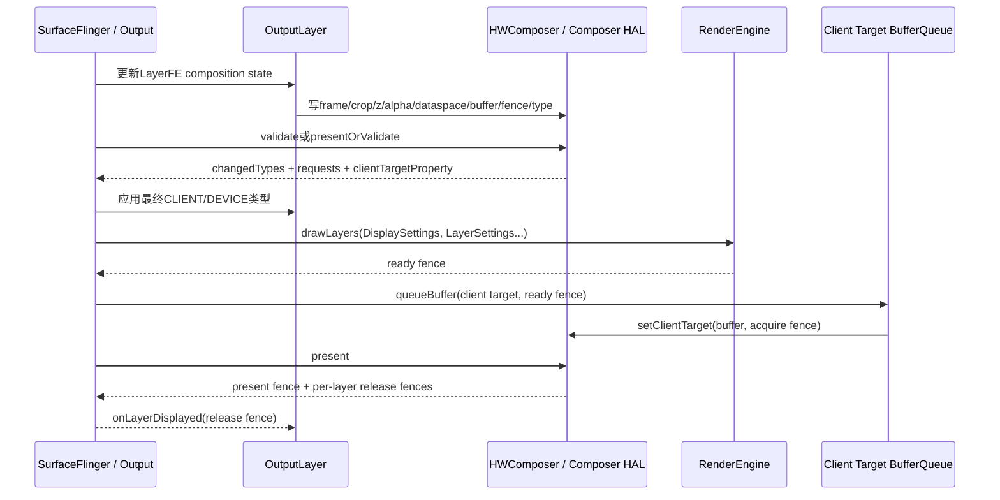
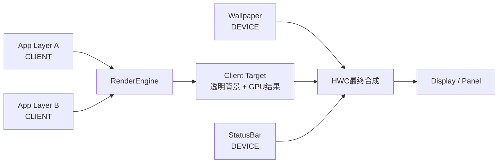
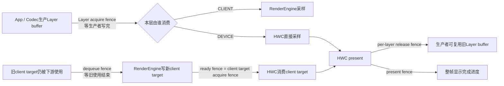

# 161 Android RenderEngine 客户端合成：LayerSettings 与 HWC 混合合成

> 源码版本：Android 11 / API 30 / `android-11.0.0_r48`  
> 学习方式：macOS 只读源码，不要求编译、不要求连接设备  
> 前置章节：第 12、21、67、155、160 章

---

## 1. 本章要解决什么

第 160 章讲清了颜色档案怎样选择，但还留下了一个更基础的问题：

> 同一帧里，有的 Layer 交给 HWC，有的 Layer 交给 GPU，SurfaceFlinger 如何让两条路径最后拼成一张正确画面？

本章沿 Android 11 的真实代码回答：

1. SurfaceFlinger 为什么不能一开始就确定 `CLIENT` 或 `DEVICE`？
2. HWC 的 `validate` 到底是在验证什么？
3. `LayerSettings` 怎样描述一个待 GPU 绘制的 Layer？
4. 可见区域、裁剪、位置矩阵和纹理矩阵为什么不能混为一谈？
5. 预乘 Alpha 与非预乘 Alpha 的混合公式有什么区别？
6. `CLEAR_CLIENT_TARGET` 为什么不是“把整个屏幕清黑”？
7. RenderEngine 画出的 client target 怎样重新交回 HWC？
8. acquire、ready、release、present fence 分别保护谁？
9. `presentOrValidate` 为什么有时能少走一次往返？
10. client composition cache 在什么条件下才可复用？

先给一句总览：

```text
SurfaceFlinger先描述候选Layer状态
    ↓
HWC validate决定哪些Layer自己合成、哪些退回GPU
    ↓
RenderEngine只把CLIENT Layer画进client target
    ↓
client target作为一个整体Layer再交给HWC
    ↓
HWC把DEVICE Layer与client target合成并present
```

最重要的认识是：

> “混合合成”不是 GPU 和 HWC 同时写同一块目标 buffer，而是 GPU 先生产一张 client target，HWC 再把它和设备合成 Layer 一起送到显示设备。

---

## 2. 源码地图

```text
frameworks/native/services/surfaceflinger/
├── CompositionEngine/
│   ├── src/
│   │   ├── Output.cpp
│   │   ├── Display.cpp
│   │   ├── OutputLayer.cpp
│   │   ├── RenderSurface.cpp
│   │   └── ClientCompositionRequestCache.cpp
│   └── include/compositionengine/
│       ├── LayerFE.h
│       └── impl/
├── DisplayHardware/
│   ├── HWComposer.cpp
│   ├── HWC2.cpp
│   └── FramebufferSurface.cpp
├── Layer.cpp
├── BufferLayer.cpp
├── BufferQueueLayer.cpp
└── BufferStateLayer.cpp

frameworks/native/libs/renderengine/
├── include/renderengine/
│   ├── DisplaySettings.h
│   └── LayerSettings.h
└── gl/
    ├── GLESRenderEngine.cpp
    ├── Description.cpp
    └── ProgramCache.cpp
```

建议把代码按四层阅读：

| 层次 | 负责什么 | 代表对象 |
|---|---|---|
| 帧编排 | 决定一帧按什么顺序推进 | `Output`、`Display` |
| 合成协商 | 写 HWC 候选状态，接收改判 | `OutputLayer`、`HWComposer` |
| GPU 描述 | 把 Layer 转成可绘制参数 | `LayerFE::LayerSettings` |
| buffer 与同步 | client target 入队、present、回 fence | `RenderSurface`、`FramebufferSurface` |

---

## 3. 一帧的真实顺序

### 3.1 `Output::present()` 是骨架

`CompositionEngine/src/Output.cpp` 中的核心顺序可以压缩成：

```cpp
void Output::present(const CompositionRefreshArgs& refreshArgs) {
    updateColorProfile(refreshArgs);
    updateAndWriteCompositionState(refreshArgs);
    setColorTransform(refreshArgs);
    beginFrame();
    prepareFrame();
    finishFrame(refreshArgs);
    postFramebuffer();
}
```

这几步不能随意交换：

1. `updateAndWriteCompositionState()` 先把每个 Layer 的候选状态写给 HWC；
2. `prepareFrame()` 调用 HWC validate，得到最终 composition type；
3. `finishFrame()` 才按最终结果生成 GPU 请求并绘制 client target；
4. `postFramebuffer()` 最后 present，并把 fence 回传给 Layer。

如果在 validate 之前就画 GPU，很可能白画：HWC 可能接受原本候选的 DEVICE Layer，也可能把更多 Layer 改判为 CLIENT。

### 3.2 时序图



### 3.3 `beginFrame()` 的空帧细节

`beginFrame()` 不等于“每次都重画”。它依据 dirty region 与上一帧是否为空计算 `mustRecompose`。

值得注意的场景：

```text
上一帧有内容，本帧Layer全消失
```

这时仍需生产一帧空/黑结果，才能把旧内容真正从屏幕移除；之后连续空帧才可避免重复工作。

所以：

> “当前没有 Layer”不代表“无需提交任何帧”；还要看显示设备上是否残留上一帧结果。

---

## 4. CLIENT、DEVICE 与 client target

### 4.1 三个概念

| 名称 | 谁完成主要像素合成 | 结果去哪里 |
|---|---|---|
| `CLIENT` Layer | SurfaceFlinger 的 RenderEngine/GPU | 先进入 client target |
| `DEVICE` Layer | HWC/显示硬件 | 直接作为 HWC Layer |
| client target | GPU 已合成的多个 CLIENT Layer | 作为一个整体输入交给 HWC |

这里的 `CLIENT` 不是 App 客户端进程，而是 HWC2 协议中的 `Composition::CLIENT`。

### 4.2 混合合成的空间关系

假设 Z 顺序为：

```text
底部Wallpaper：DEVICE
中间App：CLIENT
顶部StatusBar：DEVICE
```

GPU 只画 App 并不能忽略它上下的 DEVICE Layer。它会生成一张带透明区域的 client target；HWC 按 Z 顺序把：

```text
Wallpaper → client target → StatusBar
```

合到最终输出。



### 4.3 为什么不是所有 Layer 永远交给 HWC

常见强制 client composition 的原因包括：

- HWC 不支持该 Layer 的 transform；
- secure Layer 与输出安全属性不匹配；
- rounded corners、shadow、background blur 等效果需要 RenderEngine；
- 特殊 Y410/HDR 处理；
- 单 Layer color transform 不被 HWC 支持；
- 开发者调试选项强制 GPU；
- HWC validate 主动把候选类型改成 CLIENT。

这是一种能力协商，不是固定策略。

---

## 5. 候选状态怎样写给 HWC

### 5.1 `updateAndWriteCompositionState()`

SurfaceFlinger 先更新 Layer 前端状态，再让每个 `OutputLayer` 把候选参数写入对应 HWC Layer。

典型参数包括：

```text
display frame       目标屏幕矩形
source crop         源buffer采样区域
z order             层级
buffer transform    旋转/翻转
blend mode          混合方式
plane alpha         整层透明度
dataspace           输入颜色语义
color transform     单层颜色矩阵
surface damage      本帧损坏区域
HDR metadata        HDR元数据
buffer + fence      输入buffer和acquire fence
composition type    候选CLIENT/DEVICE等
```

HWC 需要先看到完整候选，才能判断硬件 plane、缩放器、色彩转换单元和带宽是否足够。

### 5.2 默认候选不是一刀切

常见默认值：

```text
普通buffer Layer → DEVICE
Cursor Layer     → CURSOR
sideband stream  → SIDEBAND
纯色EffectLayer  → SOLID_COLOR
```

若 Framework 已知 HWC 不能正确处理，就把它强制为 CLIENT。

### 5.3 `requiresClientComposition()` 的实质

可以概括为：

```cpp
return !hwcLayer ||
        hwcCompositionType == Composition::CLIENT;
```

没有 HWC Layer，或最终类型是 CLIENT，才进入 RenderEngine 请求列表。

不要把它理解成“这个 Layer 来自客户端”；所有 App buffer 都来自客户端，但很多仍可由 HWC 做 DEVICE composition。

---

## 6. HWC validate：不是绘制，而是改判

### 6.1 `Display::chooseCompositionStrategy()`

物理显示的策略大致如下：

```cpp
getDeviceCompositionChanges(..., &changes);
applyChangedTypes(changes.changedTypes);
applyDisplayRequests(changes.displayRequests);
applyLayerRequests(changes.layerRequests);
applyClientTargetRequests(changes.clientTargetProperty);

state.usesClientComposition =
        anyLayersRequireClientComposition();
state.usesDeviceComposition =
        !allLayersRequireClientComposition();
```

HWC 返回的不只有 composition type：

| 返回内容 | 意义 |
|---|---|
| changed types | 哪些 Layer 必须改成 CLIENT 等类型 |
| display requests | 例如本帧要求翻转 client target |
| layer requests | 例如清除 client target 对应区域 |
| client target property | HWC 希望的 client target format/dataspace |

### 6.2 四种帧形态

| `usesClient` | `usesDevice` | 形态 |
|---:|---:|---|
| false | false | 空 Layer 栈或无需两类合成 |
| true | false | 全部由 GPU client composition |
| false | true | 全部由 HWC device composition |
| true | true | GPU + HWC 混合合成 |

C++ 的 `all_of(empty)` 为 `true`，所以空 Layer 集合会得到：

```text
any client = false
!all client = false
```

即两者都不使用，而不是误判成全 DEVICE。

### 6.3 `acceptChanges()`

validate 后，Framework 接受 HWC 改判。只有这一步完成，后续生成的 `LayerSettings` 才代表真正要给 GPU 的 Layer。

正确阅读顺序是：

```text
候选类型 → HWC validate → changed types → accept → 最终类型
```

不能只在 `writeStateToHWC()` 处看到 `DEVICE` 就断言该帧一定硬件合成。

---

## 7. `presentOrValidate` 为什么能优化一轮

### 7.1 普通流程

传统 HWC2 流程：

```text
validate → 读取变化 → acceptChanges → present
```

### 7.2 跳过 validate 的条件

如果 SurfaceFlinger 根据当前候选判断本帧没有 client composition，client target 不需要等待 GPU 新结果，就可尝试 `presentOrValidate`。

它可能返回：

```text
state = 1：已经直接present成功
其他：只完成validate，仍要处理变化并稍后present
```

直接 present 成功时，HWComposer 保存本次 present/release fences，并设置 `validateWasSkipped`。后面的 `presentAndGetReleaseFences()` 不会再 present 一次，只执行待处理命令并取得缓存结果。

### 7.3 为什么已有 CLIENT Layer 时不能这样做

有 client composition 时，新 client target 尚未由 GPU 画完，更没有通过 `setClientTarget()` 交给 HWC。

所以此时必须先 validate：

```text
validate
→ 确定最终CLIENT集合
→ GPU画client target
→ setClientTarget
→ present
```

### 7.4 易错结论

错误说法：

> `presentOrValidate` 总能把 validate 和 present 合成一次。

准确说法：

> 它只给“无需等待新 client target 且 HWC 接受候选”的帧提供快速路径；返回 validate 状态时仍走完整协商。

---

## 8. HWC requests 如何改变 client target

### 8.1 `FLIP_CLIENT_TARGET`

HWC 可要求即使本帧没有 CLIENT Layer，也翻转一次 client target。

因此 `composeSurfaces()` 的 dequeue 条件是：

```cpp
if (hasClientComposition ||
        outputState.flipClientTarget) {
    buf = mRenderSurface->dequeueBuffer(&fd);
}
```

若只是 flip request，不调用 RenderEngine，但仍要有 buffer 可 queue。

### 8.2 `CLEAR_CLIENT_TARGET`

HWC 可能让某个 DEVICE Layer 对应的 client target 区域先透明清除，避免旧 GPU 内容留在该区域，再与设备 Layer 发生错误叠加。

代码只在这些条件成立时清：

```text
HWC请求clear
Layer是opaque
不是第一个Layer
```

原因：

- 透明 Layer 必须与下面内容混合，不能直接挖空；
- client target 开始会全透明清屏，最底层通常无需重复清。

`prepareClientCompositionList()` 会生成特殊请求：

```text
solid black color
alpha = 0
disableBlending = true
```

结果是覆盖写入透明像素，不是画黑色。

### 8.3 一个 r48 细节

`firstLayer` 在遇到 clip 为空的 Layer 时也会变为 `false`。因此“第一个实际可见 Layer”未必仍被代码当成 first layer。

这通常只会多产生一次局部透明 clear，不应直接扩大成画面错误；但它说明注释里的 first layer 严格说是遍历顺序首层语义，而不完全是首个有效绘制请求。

### 8.4 client target property

HWC 还可返回希望的：

```text
pixel format
dataspace
```

当 dataspace 不是 `UNKNOWN` 时，SurfaceFlinger 会更新 Output 状态及 RenderSurface buffer 配置。

也就是说，client target 不是 RenderEngine 单方面决定格式；HWC 也参与约束它作为输入时的属性。

---

## 9. 从 Layer 变成 `LayerSettings`

### 9.1 `DisplaySettings` 与 `LayerSettings`

| 类型 | 作用域 | 典型字段 |
|---|---|---|
| `DisplaySettings` | 整个输出 | physicalDisplay、clip、orientation、outputDataspace、全局矩阵、clearRegion |
| `LayerSettings` | 单个绘制请求 | geometry、buffer/solid color、alpha、dataspace、局部矩阵、shadow、blur |

### 9.2 `LayerSettings` 结构

简化后：

```cpp
struct LayerSettings {
    Geometry geometry;
    PixelSource source;
    half alpha;
    ui::Dataspace sourceDataspace;
    mat4 colorTransform;
    bool disableBlending;
    ShadowSettings shadow;
    int backgroundBlurRadius;
};
```

`Geometry` 主要有：

```text
boundaries             Layer局部边界
positionTransform      局部坐标→输出坐标
roundedCornersRadius   圆角半径
roundedCornersCrop     圆角裁剪范围
```

buffer 源主要有：

```text
GraphicBuffer
acquire fence
external texture name
texture filtering
texture transform
premultiplied alpha
opaque override
Y410标记
HDR luminance metadata
```

此外 `LayerFE::LayerSettings` 扩展了：

```text
bufferId
frameNumber
```

供 client composition cache 判断内容代际。

---

## 10. `generateClientCompositionRequests()` 怎样筛 Layer

### 10.1 按 Z 顺序遍历

每个 OutputLayer 先计算：

```cpp
clip = viewportRegion.intersect(
        layerState.visibleRegion);
```

clip 为空直接跳过。

随后判断：

```text
clientComposition      最终是否需要GPU画真实内容
clearClientComposition 是否只需清client target局部
realContentIsVisible   除shadow区域外是否还有真实内容
```

### 10.2 一个 Layer 可能生成多个请求

不要假定：

```text
一个SurfaceFlinger Layer = 一个LayerSettings
```

例如带阴影时可能生成：

```text
请求1：shadow
请求2：真实buffer/solid content
```

若内容被遮住但阴影仍可见，则可能只生成 shadow 请求。

### 10.3 没有 buffer 的 BufferLayer

若 BufferLayer 当前没有 buffer，它不会凭空生成纹理，而会把未覆盖的“洞”加入 `clearRegion`。

RenderEngine 开始绘制时：

1. 先把整个目标清为透明；
2. `clearRegion` 再被填为不透明黑色；
3. 然后按 Z 顺序画 Layer 请求。

两种清理目的不同：

| 操作 | 值 | 目的 |
|---|---|---|
| 全 buffer clear | `(0,0,0,0)` | 防复用 ghost，并给 overlay 留透明底 |
| `clearRegion` | `(0,0,0,1)` | 填补无 buffer Layer 暴露的空洞 |

---

## 11. 安全内容与“画黑”

### 11.1 protected 与 secure 不是一个词

```text
secure output：这个输出是否允许显示安全内容
protected buffer/context：GPU及目标buffer能否走受保护路径
```

### 11.2 切换 protected context

若：

```text
输出secure
RenderEngine支持protected content
至少一个Layer含protected content
```

SurfaceFlinger 会尝试让 RenderEngine 与 RenderSurface 都切到 protected 状态。

### 11.3 不可安全呈现时

如果 protected buffer 要走不支持 protected 的目标，或 secure Layer 要输出到不安全目标，`BufferLayer::prepareClientComposition()` 会构造黑色 solid source，而不采样真实 buffer。

这是安全遮蔽：

```text
真实内容不进入不可信输出
```

不要把它解释成普通渲染错误的黑屏兜底。

---

## 12. 三种坐标与两个矩阵

这是本章最容易混淆的部分。

### 12.1 `boundaries`

它定义 Layer 自己要画的四边形边界。RenderEngine 建一个四顶点 `TRIANGLE_FAN`：

```text
(left, top)
(left, bottom)
(right, bottom)
(right, top)
```

### 12.2 `positionTransform`

它把 Layer 几何位置投影到输出：

```cpp
projectionMatrix *
        layer.geometry.positionTransform
```

回答：

> 这个矩形最终画在屏幕哪里、怎样旋转缩放？

### 12.3 `textureTransform`

它决定从 buffer 的哪个纹理坐标取样，包括 buffer crop、consumer transform、Y 轴方向等。

回答：

> 画这个矩形时，从源 buffer 的什么位置取像素？

### 12.4 不能互换

```text
positionTransform：移动/旋转几何形状
textureTransform ：改变形状内部采样
```

把两者交换，可能出现“窗口位置正确但内容倒置”，或“内容方向正确但窗口跑位”。

### 12.5 `needsFiltering`

发生缩放、非整数采样或目标整体需要过滤时，纹理过滤从 `GL_NEAREST` 切为 `GL_LINEAR`。

它改善缩放质量，但会增加采样成本；这也是 Layer 状态为什么把“几何位置”和“纹理采样”分别保留。

---

## 13. Alpha 与混合公式

### 13.1 两层 Alpha

buffer 像素本身可能有 Alpha，Layer 还有整体 plane alpha。RenderEngine 把 `layer->alpha` 放入颜色状态，并依据 buffer 是否预乘决定 blend function。

### 13.2 预乘 Alpha

预乘纹理满足：

```text
stored.rgb = original.rgb × alpha
```

所以使用：

```cpp
glBlendFunc(
        GL_ONE,
        GL_ONE_MINUS_SRC_ALPHA);
```

公式：

```text
out.rgb =
    src.rgb + dst.rgb × (1 - src.a)
```

### 13.3 非预乘 Alpha

纹理保存原始 RGB，因此使用：

```cpp
glBlendFunc(
        GL_SRC_ALPHA,
        GL_ONE_MINUS_SRC_ALPHA);
```

公式：

```text
out.rgb =
    src.rgb × src.a + dst.rgb × (1 - src.a)
```

### 13.4 何时关闭 blending

当：

```text
alpha == 1
buffer声明opaque
没有rounded corners
```

RenderEngine 可关闭 blending，直接覆盖目标。

只要整层半透明、buffer 非 opaque 或圆角会在边缘产生覆盖率，就要开启 blending。

### 13.5 `disableBlending` 的特殊用途

前面的透明 clear 请求虽然 alpha 为 0，却必须覆盖写入 `(0,0,0,0)`。

如果按普通透明混合：

```text
src.a = 0
out = dst
```

旧内容根本清不掉。因此该请求设置 `disableBlending=true`，直接写透明值。

这正是“透明绘制”和“透明覆盖清除”的区别。

## 14. RenderEngine 真正怎样画

`GLESRenderEngine::drawLayers()` 可按下面顺序阅读。

### 14.1 等 client target 的 dequeue fence

```cpp
if (bufferFence.get() >= 0) {
    if (!waitFence(...)) {
        sync_wait(bufferFence.get(), -1);
    }
}
```

这个 fence 表示目标 buffer 上一轮消费者何时使用完，GPU 必须等它安全后才能覆盖写。

### 14.2 绑定 framebuffer

无 blur 时，目标 GraphicBuffer 直接绑定为 FBO；有 background blur 时，可能先画到离屏目标，经过 blur pass 后再绑定 native FBO。

### 14.3 清透明背景

源码明确解释，复用 buffer 若不清会留下 ghost image；overlay 混合也需要透明底。因此每次实际 draw 都先：

```cpp
clearWithColor(0.0, 0.0, 0.0, 0.0);
```

### 14.4 设置输出与逐层状态

每层依次设置：

```text
projection × position transform
boundaries mesh
crop
display color transform × layer color transform
external texture + texture transform + filtering
premult/opaque/alpha blend
source dataspace
shadow / rounded corner / normal mesh
```

颜色矩阵顺序：

```cpp
display.colorTransform *
        layer.colorTransform
```

它表示先应用 Layer 局部变换，再处于整个 Display 全局变换作用下。

### 14.5 等 Layer buffer 的 acquire fence

buffer 类型的 `LayerSettings` 携带生产者 acquire fence。`bindExternalTextureBuffer()` 使用它，避免 GPU 在 App/解码器尚未写完时采样。

所以一帧里至少有两类“等待写完”：

| fence | 谁之前在使用 | 谁要等 |
|---|---|---|
| Layer buffer acquire fence | App/Codec 写 Layer buffer | RenderEngine 或 HWC |
| client target dequeue fence | 下游上一轮使用 client target | RenderEngine |

### 14.6 产出 ready fence

绘制完成后 `flush()` 返回 draw fence；调用方称它为 `readyFence`。

它不是 present fence，只表示：

> GPU 对 client target 的写入完成到足以让下游 HWC 等待和消费。

若平台不能产生 native fence，代码用 `finish()` 同步等 GPU 执行完。此时返回 fence 可为空，因为 CPU 返回前已经完成。

---

## 15. client composition cache

### 15.1 它缓存的不是“一张随便相似的画面”

缓存 key 先按输出 GraphicBuffer 的 `bufferId` 找，再比较完整请求：

```text
DisplaySettings
LayerSettings序列
每层bufferId
每层frameNumber
几何、alpha、dataspace、矩阵、blur、shadow等
```

只有“同一块输出 buffer 上已经画过完全相同的请求”才跳过 draw。

### 15.2 为什么快照清掉 buffer 指针与 fence

`getLayerSettingsSnapshot()`：

```cpp
snapshot.source.buffer.buffer = nullptr;
snapshot.source.buffer.fence = nullptr;
```

缓存不应长期持有 GraphicBuffer/Fence 对象；内容代际由 `bufferId + frameNumber` 比较，其余采样属性单独比较。

### 15.3 序列长度也必须相同

源码使用 `std::equal(old.begin(), old.end(), new.begin(), new.end(), ...)` 的五参数版本。除了逐项相等，也要求两个范围长度相同。

因此增删一个 shadow、clear 或 content 请求都会 miss，不会只比较共同前缀。

### 15.4 cache hit 后发生什么

```text
reusedClientComposition = true
不调用RenderEngine::drawLayers
readyFence为空
仍把已含正确像素的输出buffer重新queue给下游
```

不要把它和 RenderEngine 的纹理/FBO 对象缓存混为一谈：

- client composition request cache：判断整张目标画面可否复用；
- RenderEngine texture/FBO cache：减少 GPU 资源重复创建。

### 15.5 失败边界

如果 `drawLayers()` 返回错误，SurfaceFlinger 会从 request cache 移除该 buffer 的记录，避免以后把失败结果当成正确画面复用。

但 r48 的 `composeSurfaces()` 仍会返回当时的 `readyFence`，`finishFrame()` 仍可能继续 queue；代码没有在这里把整帧事务回滚。

准确表述：

> 渲染失败会使缓存失效并记录错误，但此层代码不保证保留上一张正确画面；实际可见结果还取决于失败发生在清屏、绑定、绘制或 flush 的哪个阶段。

---

## 16. GPU 结果怎样成为 HWC 的 client target

### 16.1 `RenderSurface::queueBuffer()`

当使用 client composition 或收到 flip request 时：

```cpp
mNativeWindow->queueBuffer(
        mGraphicBuffer->getNativeBuffer(),
        dup(readyFence));
```

ready fence 跟着 buffer 一起入 BufferQueue。

物理显示 queue 失败会触发 fatal，因为下一次 dequeue 可能永久阻塞；虚拟显示则尝试 cancel buffer。

### 16.2 `advanceFrame()`

queue 后调用：

```cpp
mDisplaySurface->advanceFrame();
```

对物理显示，它落到 `FramebufferSurface::advanceFrame()`：

1. 从 BufferQueue `acquireBufferLocked()` 取到新 client target；
2. 得到 slot、GraphicBuffer、item fence 和 dataspace；
3. 调用 `HWComposer::setClientTarget()`。

核心调用：

```cpp
mHwc.setClientTarget(
        mDisplayId,
        outSlot,
        outFence,
        outBuffer,
        outDataspace);
```

从 RenderEngine 的视角叫 ready fence；经过 BufferQueue 到 HWC 输入端，同一个同步含义叫 client target acquire fence。

### 16.3 没有新 buffer 时

`FramebufferSurface::nextBuffer()` 若返回 `NO_BUFFER_AVAILABLE`，会从 HWC buffer cache 取当前 client target，而不是必然报错。

这允许某些只用 device composition 或复用 client target 的帧继续提交。

---

## 17. 四类 fence 一次讲清



### 17.1 acquire fence

含义：

> 消费者在读取或写入该 buffer 前，必须等此前生产者或使用者完成。

名字取决于观察者身份。对 HWC 来说，RenderEngine 的 ready fence 是 client target 的 acquire fence。

### 17.2 release fence

含义：

> 当前消费者已不再需要上一份 Layer buffer；生产者等 fence signal 后可安全复用。

HWC 按 Layer 返回 release fence，SurfaceFlinger 再通过 `onLayerDisplayed()` 交回 Layer 生命周期实现。

### 17.3 present fence

含义更接近：

> 这次 display present 的完成时间线。

它描述整帧，不天然等于每个 Layer 精确的 release fence。

### 17.4 三者不能互换

| fence | 保护对象 | 典型接收者 |
|---|---|---|
| Layer acquire | 新 Layer buffer 何时可读 | HWC/RenderEngine |
| Layer release | 旧 Layer buffer 何时可复用 | App/BufferQueue producer |
| present | 整帧何时完成显示提交 | SF、显示统计、释放兜底 |

---

## 18. `postFramebuffer()` 如何回传 release fence

### 18.1 先 present，再取 fence

`Display::presentAndGetFrameFences()`：

```cpp
hwc.presentAndGetReleaseFences(displayId);
result.presentFence =
        hwc.getPresentFence(displayId);

for (layer : outputLayers) {
    result.layerFences[hwcLayer] =
        hwc.getLayerReleaseFence(
                displayId, hwcLayer);
}
```

之后清掉 HWComposer 内部的 release fence map，防止误用旧结果。

### 18.2 每个当前 OutputLayer

`Output::postFramebuffer()` 先尝试按 HWC Layer 找 per-layer release fence；没有则从 `NO_FENCE` 开始。

随后有一段关键注释：

```cpp
// If the layer was client composited in the
// previous frame, merge its previous client
// target acquire fence.
// Since we do not track that, merge current...
```

r48 实际做法：

```cpp
if (outputState.usesClientComposition) {
    releaseFence = Fence::merge(
            "LayerRelease",
            releaseFence,
            frame.clientTargetAcquireFence);
}
```

### 18.3 为什么这是保守策略

理论上，若某 Layer 上一帧进入 client target，旧 Layer buffer 只有等 GPU 完成采样后才能复用，所以 release 必须覆盖相应 client target 完成条件。

但代码没有精确保存“上一帧哪些 Layer 被 client composited”及对应 fence，于是当前帧只要用了 client composition，就把当前 client target acquire fence 合并给所有当前 Layer。

结果：

```text
安全性更保守
部分buffer可能比必要时更晚释放
```

这不是 fence 类型可以互换，而是源码明确承认的代际跟踪不足。

### 18.4 已离开当前输出的 Layer

`mReleasedLayers` 与当前 Z 列表不相交，已无法按当前 HWC Layer 找 release fence。代码只能给它们 present fence：

```cpp
layer->onLayerDisplayed(
        frame.presentFence);
```

这是兜底近似，不应反推为所有 Layer 都以 present fence 作为正常 release fence。

---

## 19. BufferQueueLayer 与 BufferStateLayer 的回传差异

### 19.1 `BufferQueueLayer`

```cpp
void BufferQueueLayer::onLayerDisplayed(
        const sp<Fence>& releaseFence) {
    mConsumer->setReleaseFence(releaseFence);
}
```

release fence 进入 `BufferLayerConsumer`，之后 `releasePendingBuffer()` 把旧 buffer 释放回 BufferQueue，并更新 frame event history。

### 19.2 `BufferStateLayer`

BufferStateLayer 通过事务直接携带 buffer，回传语义更细。

同一帧可能对同一 Layer 连续提交多个事务：

```text
事务1：不换buffer
事务2：换成buffer B
事务3：又换成buffer C
```

真正把“上一帧显示的旧 buffer”替换掉的是第一笔带新 buffer 的事务。因此 `onLayerDisplayed()` 遍历 callback handles，只把 `previousReleaseFence` 放到第一个 `releasePreviousBuffer` 的 handle。

后续同帧被覆盖、根本未显示的中间 buffer 不应错误等待一次显示 release。

### 19.3 完成回调

`releasePendingBuffer()` 会：

```text
写入transformHint与dequeueReadyTime
finalizePendingCallbackHandles()
清空callback handles
把release fence写进FrameEventHistory
```

所以事务完成回调与“旧 buffer 已安全可复用”有关，但仍要区分：

```text
事务被SurfaceFlinger接收
事务被latch
画面present
旧buffer release fence signal
```

它们不是同一时间点。

---

## 20. client target 自己何时释放

client target 也是 BufferQueue buffer，也需要生命周期管理。

`FramebufferSurface::nextBuffer()` 获取新 target 时，把原 target 记录为 pending release；`onFrameCommitted()` 再取本帧 HWC present fence，给旧 client target 加 release fence。

直观理解：

```text
HWC已经提交使用新client target
并且present fence给出显示完成进度
→ 旧client target才能回到BufferQueue
  供RenderEngine再次dequeue
```

这条链与普通 App Layer 的 per-layer release fence 是两套 buffer 生命周期，不要混成同一张 buffer。

---

## 21. 颜色矩阵在混合合成中的位置

第 160 章提到，全局颜色矩阵只能应用一次。

`composeSurfaces()` 中：

```cpp
if (!outputState.usesDeviceComposition &&
        !getSkipColorTransform()) {
    display.colorTransform =
        outputState.colorTransformMatrix;
}
```

含义：

- 全部 client composition 时，RenderEngine 可把全局矩阵画进 client target；
- 只要还有 device composition，最终统一颜色变换通常留给 HWC；
- 若 HWC 声明 `SKIP_CLIENT_COLOR_TRANSFORM`，还要遵循能力约定，避免 GPU/HWC 重复处理。

每层自己的颜色矩阵仍在 `LayerSettings.colorTransform`，最终 GPU 侧组合为：

```text
Display color transform × Layer color transform
```

所以“有混合合成”不等于“CLIENT Layer 不做颜色转换”；只是整屏最终矩阵的归属发生变化。

## 22. 性能信号与缓存边界

### 22.1 expensive rendering

当 client target 输出为 Display P3，或 background blur 被判断昂贵时，Output 通知 PowerAdvisor：

```cpp
setExpensiveRenderingExpected(true);
```

目的是让 GPU 在重颜色转换或复杂 shader 时更可能按时完成。

无 client composition 或整帧 cache hit 时会显式设为 `false`。

### 22.2 一个应谨慎表述的 r48 边界

如果上一帧是 expensive client draw，下一帧仍有 client draw，但变为普通 sRGB 且无 blur，当前代码只在 `expensiveRenderingExpected == true` 时调用 setter，没有在该分支显式调用 `false`。

能从本文件确认的是“这里没有复位”；是否由 PowerAdvisor 或其他帧路径及时收敛，还要结合调度层验证。因此应写成：

> r48 的此处存在昂贵提示可能跨普通 client draw 延续的观察点，而不是直接断言 GPU 永久保持高频。

### 22.3 cache hit 不是无需同步的普遍证明

cache hit 表示同一输出 buffer 已有相同像素结果，所以不再写它；它不表示所有 buffer fence 都失去意义，也不能推广为“复用 buffer 永远不需要等待”。

同步约束要结合：

```text
是否发生CPU/GPU写入
BufferQueue所有权是否已转移
下游是否仍在读
queue/dequeue接口怎样传递fence
```

一起判断。

---

## 23. 常见误解纠正

### 误解 1：`DEVICE` 表示 App 没有提供 buffer

错误。DEVICE 表示 HWC 合成该 Layer；buffer 仍通常由 App/Surface 生产。

### 误解 2：CLIENT Layer 直接交给面板

错误。多个 CLIENT Layer 先被 GPU 画进 client target，再把 client target 交给 HWC。

### 误解 3：validate 已经完成显示

错误。validate 是能力协商；只有 `presentOrValidate` 的直接 present 分支是例外快速路径。

### 误解 4：透明色用普通混合就能清旧像素

错误。普通 `src.a=0` 混合会保留 destination；清除请求必须关闭 blending 直接覆盖透明值。

### 误解 5：position transform 和 texture transform 可以互换

错误。前者改变几何位置，后者改变源 buffer 采样。

### 误解 6：ready fence 就是 present fence

错误。ready fence 只说明 GPU 写 client target 完成；present fence 描述整帧显示提交完成进度。

### 误解 7：release fence 表示新 buffer 已写完

错误。新 buffer 写完由 acquire fence 告诉消费者；release fence 告诉生产者旧 buffer 可复用。

### 误解 8：HWC 返回 DEVICE 后 SF 就不用管这个 Layer

错误。SurfaceFlinger 仍负责给 HWC 写 frame、crop、z、alpha、dataspace、buffer、fence，并处理 release。

### 误解 9：全 GPU 合成就完全不经过 HWC

对物理显示通常错误。GPU 生成 client target，最终仍通过 HWC `setClientTarget()` 与 `present()` 送显。

### 误解 10：一个 SF Layer 一定对应一个 `LayerSettings`

错误。shadow、content、clear 可能拆成多个请求，完全不可见也可能生成零个。

---

## 24. 三个手算例子

### 24.1 全 DEVICE 帧

假设 HWC 支持所有 Layer：

```text
候选：D D D
validate：无changedTypes
usesClient=false
usesDevice=true
```

结果：

```text
不调用RenderEngine画client target
HWC直接present三个Layer
每层得到HWC release fence
```

若 `presentOrValidate` 直接成功，还可省掉显式 validate→present 的一轮。

### 24.2 全 CLIENT 帧

```text
最终：C C C
usesClient=true
usesDevice=false
```

结果：

```text
三个LayerSettings按Z顺序进入RenderEngine
GPU画一张client target
ready fence随target入队
HWC消费client target并present
全局颜色矩阵可由GPU应用
```

全局矩阵仍受 skip capability 约束。

### 24.3 混合帧

```text
最终：D C D
usesClient=true
usesDevice=true
```

结果：

```text
GPU只画中间C到透明client target
HWC按Z把底部D、client target、顶部D合成
全局display transform留给最终HWC路径
避免GPU只变换中间层
```

若顶部 DEVICE Layer 请求 `CLEAR_CLIENT_TARGET`，SurfaceFlinger 还会在对应区域给 GPU 增加透明覆盖请求，防旧 target 像素穿透。

---

## 25. 线程与进程边界

| 阶段 | 典型位置 | 是否跨边界 |
|---|---|---|
| Output 帧编排、LayerSettings 生成 | SurfaceFlinger 合成上下文 | 同进程 |
| GLES RenderEngine 命令提交 | SF 进程调用 GPU 驱动 | 进入内核/驱动 |
| Composer HAL 命令 | SF 到 composer/vendor 实现 | 取决于 HAL transport |
| BufferQueue client target | SF 内生产者与 FramebufferSurface 消费者 | 对象主要同进程，资源经内核 |
| release 回 App | BufferQueue 或事务回调 | 最终可跨 Binder |

本章源码里的函数连续调用看起来都在 C++，但 `GraphicBuffer`、sync fence fd、Composer HAL 命令和事务回调分别跨过内核或进程边界。

---

## 26. 推荐的只读断点路线

### 路线 A：一帧总流程

```text
Output::present
→ updateAndWriteCompositionState
→ prepareFrame
→ Display::chooseCompositionStrategy
→ finishFrame
→ composeSurfaces
→ RenderSurface::queueBuffer
→ postFramebuffer
```

### 路线 B：HWC 协商

```text
Display::chooseCompositionStrategy
→ HWComposer::getDeviceCompositionChanges
→ validate/presentOrValidate
→ getChangedCompositionTypes
→ getRequests
→ acceptChanges
```

### 路线 C：单 Layer 到 GPU

```text
Output::generateClientCompositionRequests
→ Layer::prepareClientCompositionList
→ BufferLayer::prepareClientComposition
→ GLESRenderEngine::drawLayers
→ setupLayerBlending
```

### 路线 D：client target

```text
RenderSurface::dequeueBuffer
→ GLESRenderEngine::drawLayers
→ RenderSurface::queueBuffer
→ FramebufferSurface::advanceFrame
→ setClientTarget
```

### 路线 E：fence 回传

```text
Display::presentAndGetFrameFences
→ HWComposer::presentAndGetReleaseFences
→ Output::postFramebuffer
→ BufferQueueLayer::onLayerDisplayed
或 BufferStateLayer::onLayerDisplayed
→ releasePendingBuffer
```

---

## 27. macOS 只读练习

### 练习 1：验证 present 顺序

```bash
rg -n "void Output::present|updateAndWriteCompositionState|prepareFrame|finishFrame|postFramebuffer" \
  frameworks/native/services/surfaceflinger/CompositionEngine/src/Output.cpp
```

目标：解释为什么 validate 必须早于 `drawLayers()`。

### 练习 2：找 composition 统计公式

```bash
rg -n "anyLayersRequireClientComposition|allLayersRequireClientComposition|usesDeviceComposition" \
  frameworks/native/services/surfaceflinger/CompositionEngine
```

目标：手算空集合、全 CLIENT、全 DEVICE、混合四种结果。

### 练习 3：对照两种 transform

```bash
rg -n "positionTransform|textureTransform|projectionMatrix" \
  frameworks/native/services/surfaceflinger \
  frameworks/native/libs/renderengine
```

目标：每次命中都标注“几何坐标”还是“纹理采样坐标”。

### 练习 4：验证 blend function

```bash
rg -n "setupLayerBlending|glBlendFunc|disableBlending" \
  frameworks/native/libs/renderengine/gl/GLESRenderEngine.cpp
```

目标：写出预乘和非预乘两条 RGB 公式。

### 练习 5：追 ready fence 改名

```bash
rg -n "readyFence|setClientTarget|getClientTargetAcquireFence" \
  frameworks/native/services/surfaceflinger
```

目标：证明它在 RenderEngine 输出端叫 ready fence，到 HWC 输入端就是 acquire fence。

### 练习 6：看缓存比较字段

```bash
sed -n '1,150p' \
  frameworks/native/services/surfaceflinger/CompositionEngine/src/ClientCompositionRequestCache.cpp
```

目标：回答为什么 fence 指针不参与相等，但 `bufferId + frameNumber` 必须参与。

### 练习 7：比较两类 Layer release

```bash
sed -n '35,100p' \
  frameworks/native/services/surfaceflinger/BufferQueueLayer.cpp
sed -n '60,130p' \
  frameworks/native/services/surfaceflinger/BufferStateLayer.cpp
```

目标：解释为什么 BufferStateLayer 要找到第一笔 `releasePreviousBuffer` 的 callback handle。

---

## 28. 复读后专门补强的易错边界

本节是在正文写完后，按“初学者可能从局部代码推出错误全局结论”的方式二次检查得出的。

### 28.1 HWC 入口看到的是候选，不一定是最终类型

必须继续读 validate 的 changed types 与 `acceptChanges()`，否则会把“原计划 DEVICE”写成“最终一定 DEVICE”。

### 28.2 `presentOrValidate` 的函数名不代表每次都已 present

只有对应 state 分支才保存 present/release fences 并标记 validate skipped。

### 28.3 ready fence 的名称随角色变化

同一同步点：

```text
RenderEngine：我写完了，所以叫ready fence
HWC：我要等它才能读，所以叫acquire fence
```

名字变化不是又创建了一个独立完成事件。

### 28.4 合并 fence 是保守补偿，不是一般定义

源码理想目标是上一帧 client target fence，但 r48 没有追踪，于是用当前帧近似并对所有当前 Layer 合并。不能把这段实现反写成 fence 的一般语义。

### 28.5 client composition cache 比较完整请求

它不是只看 Layer buffer 是否没更新；输出 orientation、clip、色彩矩阵、clear region、shadow 等任一变化也会 miss。

### 28.6 RenderEngine 每次真实 draw 都全透明清目标

这意味着局部 damage 不自动等于只画 damage；本路径为避免复用 ghost 和 overlay 错误，代码先全清再画请求。

### 28.7 clear target 的透明请求必须禁用 blending

这是理解 `alpha=0` 却能清除的关键。若忽略 `disableBlending`，会误以为这段代码什么都没画。

### 28.8 全 GPU 合成仍通常经过 HWC present

RenderEngine 是 client target 的生产者，不是物理扫描输出控制器；物理显示仍以 HWC client target 输入完成 present。

### 28.9 绘制失败与缓存失败是两件事

失败后移除 cache 只防止未来错误复用，不代表本帧自动回退到 DEVICE，也不代表自动恢复上一正确帧。

### 28.10 present fence 只在无法精确匹配时作为兜底

正常当前 HWC Layer 优先使用 per-layer release fence；不要把 released-layer 路径写成普遍协议。

---

## 29. 本章核心结论

1. SurfaceFlinger 先写候选 Layer 状态，HWC validate 后才能确定最终 CLIENT/DEVICE 分工。
2. CLIENT composition 是 GPU 把若干 Layer 画进一张 client target，而不是 App 客户端自己合成。
3. 混合合成时，client target 作为一个整体与 DEVICE Layer 按 Z 顺序进入 HWC。
4. `LayerSettings` 描述几何、纹理、Alpha、颜色、阴影、圆角与 blur；一个 SF Layer 可生成零个或多个请求。
5. position transform 控制画在哪里，texture transform 控制从 buffer 哪里取样。
6. 透明 clear 必须关闭 blending 直接覆盖；普通 alpha=0 混合不会清旧像素。
7. RenderEngine 的 ready fence 经 BufferQueue 成为 HWC 的 client target acquire fence。
8. release fence 保护旧 Layer buffer 可复用，present fence 描述整帧进度，二者不能互换。
9. r48 因未精确跟踪上一帧 client composition，会把当前 client target acquire fence 保守合并进当前 Layer release fence。
10. request cache 只在同一输出 buffer 已含完整相同请求时复用；渲染失败会移除缓存记录，但不会自动形成整帧事务回滚。

---

## 30. 自测题

1. 为什么 HWC validate 之前不能先生成最终 GPU Layer 列表？
2. `CLIENT` 中的 client 为什么不是 App 进程？
3. 混合合成时 GPU 与 HWC 是否会同时写同一 client target？
4. `CLEAR_CLIENT_TARGET` 为什么只对 opaque、非首层执行？
5. alpha 为 0 的 clear 请求为什么还要 `disableBlending=true`？
6. `positionTransform` 与 `textureTransform` 分别控制什么？
7. ready fence 怎样变成 client target acquire fence？
8. per-layer release fence 与 present fence 的保护对象有何不同？
9. BufferStateLayer 为什么只把 previous release fence 给第一笔替换旧 buffer 的事务？
10. client composition cache 为什么既比较 `bufferId` 又比较 `frameNumber`？
11. `presentOrValidate` 在什么条件下才可能省掉显式 validate/present 往返？
12. 为什么全 client composition 的物理显示通常仍会调用 HWC present？

如果能够不看正文讲清这 12 题，就已经建立了 Android 11 显示合成数据面最关键的骨架。

---

## 31. 下一章预告

第 162 章继续沿同步链向下阅读：

> Android GraphicBuffer、BufferQueue、Gralloc 与 Sync Fence：buffer 分配、跨进程传递和所有权循环。

届时会把本章暂时视为输入对象的 `GraphicBuffer` 拆开，回答 handle、slot、generation、dequeue、queue、acquire、release 与 native fence fd 怎样串成可复用缓冲区生命周期。

